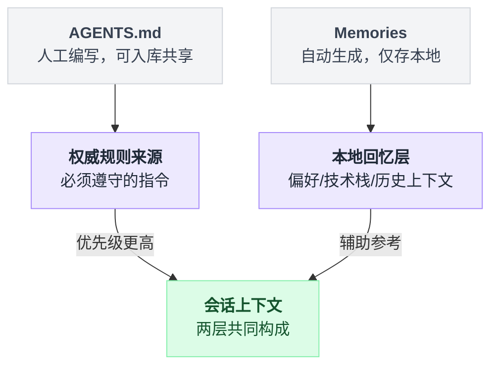
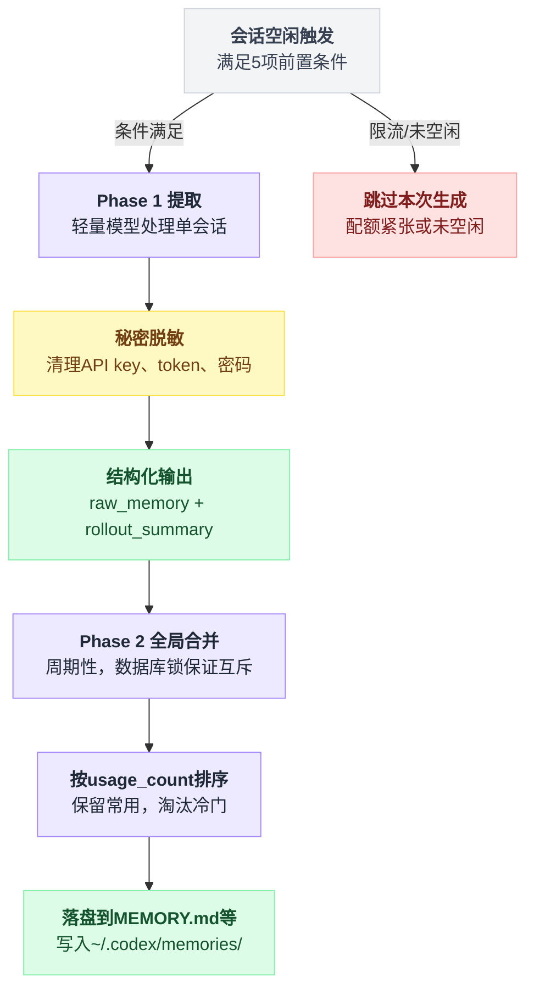
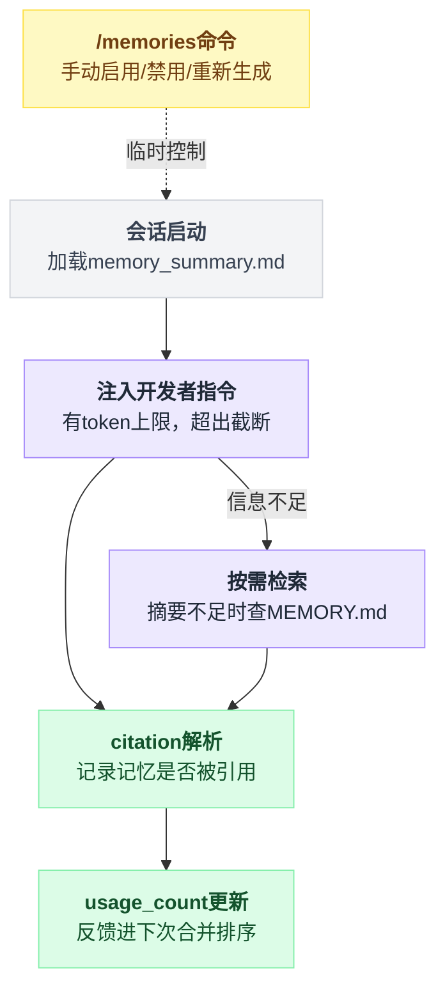
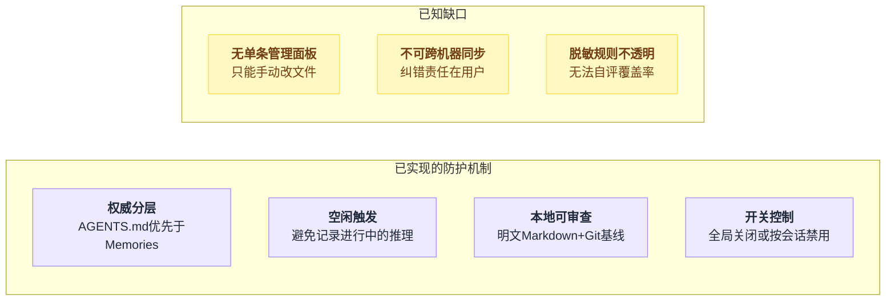

# Codex 记忆系统调研报告

调研对象：OpenAI 开源 Codex（`github.com/openai/codex`，CLI / 桌面应用 / 云端 Agent，官方文档 `developers.openai.com/codex`）中的 **Memories（记忆）** 功能。

一句话说清这套系统：**Codex 的记忆分两层——你手写、能入库的 `AGENTS.md` 是权威规则，Codex 自己后台生成、只存本地的 Memories 是辅助回忆；后者永远盖不过前者。**

> 说明：Memories 是 2025 年底~2026 年初逐步推出的功能，**目前仍处于渐进发布/部分实验阶段**（如 Chronicle 子功能标注为 "research preview"）。以下内容以官方文档（`developers.openai.com/codex/memories`）和官方仓库（`codex-rs/memories/README.md`）为主要依据；部分第三方技术博客给出的更细节的实现参数（如具体的空闲小时数阈值、`/m_update` 等命令名）**未能在官方一手资料中交叉确认**，已在文中单独标注为"第三方来源、未经官方确认"，请谨慎采信。

---

## 一、总体架构：两层记忆模型

Codex 实际上是"静态规则文件 + 动态生成记忆"的两层设计：

| 层 | 载体 | 生成方式 | 存储/共享 | 定位 |
|---|---|---|---|---|
| 第一层 | `AGENTS.md`（及 `AGENTS.override.md`） | 人工编写 | 项目内、可提交到版本控制、团队共享 | **权威规则来源**，必须遵守的指令 |
| 第二层 | `Memories`（`~/.codex/memories/` 下的文件） | Codex 自动后台生成 | 本地机器，默认不同步、不共享 | **辅助性的"本地回忆层"**，帮助 Codex 记住偏好、技术栈、以往上下文 |

两层各自的定位和谁盖过谁，画出来更直观：



官方文档明确要求：必须遵循的团队规范应放在 `AGENTS.md` 或已入库的文档中，"把 memories 当作有用的本地回忆层，而不是唯一的规则来源"（AGENTS.md 优先于记忆）。

---

## 二、记忆是如何写入的

### 1. 触发条件（Codex 仓库 `codex-rs/memories/README.md` 描述的实现）

写入采用**两阶段流水线**：Phase 1 单会话提取，Phase 2 全局合并。

**Phase 1（单会话/thread 提取）** 的门槛很高——六个条件全过才动手，缺一个就这轮不做：

```
for rollout in 历史会话:
    if not 配置里开了记忆:              skip   // features.memories = true
    if 会话是临时会话 or 子代理会话:      skip
    if 状态数据库不可用:                 skip
    if not 会话已陈旧:                  skip   // 自上次提取后有更新才算陈旧
    if not 会话已空闲足够长时间:          skip   // 避免总结仍在进行中的工作
    if 已被别的 Phase-1 worker 占用:     skip   // 状态库 lease/claim 防重复处理
    if 已超出速率限制阈值:               skip   // 配额接近限制就让位给用户请求
    提取(rollout)
```

最后一条容易被忽略：**当 API 配额接近限制时会跳过后台生成**，避免抢占用户的正常请求配额。

条件全过之后，Phase 1 用轻量模型并行处理原始会话记录，产出两份结构化结果：`raw_memory`（详细记录）与 `rollout_summary`（紧凑摘要）。

**Phase 2（全局合并）** 周期性地把各会话的 Phase-1 输出合并进全局记忆文件。它靠数据库锁保证**同一 `codex_home` 下同一时间只有一个合并任务**在跑：

```
lock(codex_home)                      // 全局互斥，同时只有一个合并任务
merged = 全局记忆 + 各会话的 Phase-1 输出
merged.sort(by = usage_count, 最近使用时间)   // usage_count = 记忆被引用/使用的次数
保留常用的，丢弃长期未被引用的
unlock()
```

排序键就是"用得多不多、用得近不近"——常用的留下，长期无人问津的出局。

### 2. 写入前的处理：秘密脱敏

在记忆写入磁盘之前，Codex 会对生成的记忆字段执行**内置清理**，自动从中删除 API key、token、密码等明显的秘密信息。

尺度大概是这样：可以保留"项目使用 AWS"这类事实性描述，但不落盘具体密钥。

官方文档同时提醒用户：在把 Codex 主目录（`~/.codex`）共享给他人前，应自行审查记忆文件。

把触发条件、两阶段流水线和脱敏步骤串起来看：



### 3. Chronicle 扩展（研究预览）

`Chronicle` 是 Memories 的一个扩展子功能，会基于**实时屏幕内容**自动生成记忆，目的是减少用户重复描述上下文的负担。

落盘位置和主记忆分开：截图临时存放在 `$TMPDIR/chronicle/screen_recording/`，生成结果存放在 `~/.codex/memories_extensions/chronicle/`，以未加密 Markdown 文件形式保存。

**官方明确提示该功能存在 prompt injection 风险**——因为屏幕内容可能被恶意页面/文本注入指令，进而被"记住"。这是整套记忆系统里官方唯一点名的攻击面。

### 4. 存储位置与文件

记忆统一存储在 `~/.codex/memories/`（或 `CODEX_HOME` 指向的目录）。里面各文件分工不同：

| 文件/目录 | 作用 |
|---|---|
| `MEMORY.md` | 可搜索的聚合事实/见解注册表 |
| `memory_summary.md` | 注入到每次对话开头的高层摘要（有 token 上限） |
| `raw_memories.md` | Phase-1 输出的临时合并文本 |
| `rollout_summaries/` | 按会话保存的摘要与支撑证据 |
| `skills/` | 可复用的操作/脚本片段 |

还有个容易漏看的细节：该目录本身以 Git 作为本地基线（`.git`），便于差异对比与追踪变更——`phase2_workspace_diff.md` 就是一次合并产生的类 git diff。

---

## 三、写入/使用策略要点

Memories 默认关闭，得在 Codex 应用设置里手动打开，或者在 `~/.codex/config.toml` 的 `[features]` 表里补一行 `memories = true`——这条容易忽略，因为大多数 AI 编程工具的类似功能默认都是开的。地域上更绝：官方声明**欧洲经济区（EEA）、英国、瑞士**暂不提供该功能，谈不上开关，直接不给用。

项目隔离这件事也是半成品。记忆文件带工作目录上下文，Codex 启动时会结合当前目录挑相关记忆，看起来像是每个项目一份独立记忆，但官方没把话说满——这**并非严格的多项目沙箱**，跨项目串味的可能性没被排除。

`codex exec` 这条最容易踩坑：默认也会加载记忆。CI 流水线要的是"同样的代码、同样的结果"，记忆这种非确定性输入会悄悄搅局，得显式加 `--no-project-doc` 之类的参数把它关掉，才能拿回确定性、可复现的行为。

还有一批停在讨论区没落地的想法，来自 GitHub Discussion，属于设计讨论和 Feature Request，不是已上线功能：分层作用域（账户级/项目级/会话级）、访问频率衰减、语义向量+BM25 混合检索、显式引用溯源、"符号级"记忆（跟踪具体函数/变量）。读的时候得把"路线图构想"和"已实现功能"分开看，别当成 Codex 现在就有的能力。

---

## 四、如何使用（读取）这个记忆

读路径不是"注入完就结束"，而是一个闭环：读了什么会被记下来，反过来决定下次合并保留什么。

```
会话启动:
    developer_instructions += memory_summary.md   // 超出 token 上限就截断
    if 摘要信息不足:
        grep/检索 MEMORY.md 及相关文件            // 不把全部记忆塞进上下文
回答生成后:
    citation parsing + read-usage telemetry classification
    → 更新 usage_count → 反馈进下次 Phase-2 合并排序
```

从注入到反馈回 Phase 2 排序，画成图：



这四个环节其实是一个环。每次会话启动，Codex 先把 `memory_summary.md` 这类摘要塞进模型的开发者指令（developer instructions）里，但这个位置有 token 数量上限，超出就截断——摘要写得越啰嗦，能塞进去的信息反而越少。摘要不够用的时候，代理才会去查更详细的 `MEMORY.md` 等文件做进一步检索/grep，而不是一次性把全部记忆倒进上下文，为的是不把上下文预算耗在用不上的记忆上。会话过程中还有个手动阀门——`/memories` 斜杠命令，可以临时决定这一次要不要用已有记忆、要不要为这次会话生成新记忆。回答生成之后，系统会做"citation parsing"和"read-usage telemetry classification"，说白了就是记一笔某条记忆这次到底有没有被引用/使用；这笔账反过来会喂回下一次 Phase-2 合并的排序——用得多、用得近的记忆才活得久，这也是第二节 `usage_count` 排序的数据来源：不是拍脑袋定的，是从这里的读取记录一路攒出来的。

---

## 五、正确性保证与防止"记忆污染"的机制

### 官方已实现/明确说明的机制

这七条堆在一起看，像是把"记忆污染"这个问题从入口到出口都堵了一遍：

| 机制 | 具体做法 |
|---|---|
| 权威来源分层 | `AGENTS.md`/已入库文档 > 自动生成的 Memories。官方与社区回复（GitHub Discussion #24717）都强调："如果记忆与代码库文档冲突，已检入的源码/文档应该优先"，关键行为规范不应依赖记忆存储 |
| 秘密脱敏 | 写入前对生成内容做敏感信息清理，降低泄露风险；但官方文档未公开具体的正则/启发式规则，是一层"黑盒"过滤 |
| 空闲/非活跃触发 | 只在会话空闲足够久之后才提取，避免把"进行中、尚未定论"的推理过程当作事实记住，从源头减少污染 |
| 速率限制感知 | 配额紧张时跳过后台生成，防止资源竞争引发的异常/半成品写入 |
| 本地可审查、可编辑 | 记忆以明文 Markdown 存放在本地文件系统，用户可以直接打开、修改、删除这些文件；`~/.codex/memories` 甚至有本地 Git 基线，理论上可以做版本回溯 |
| 全局/单会话开关 | 可以整体关闭记忆使用（如社区提到的 `use_memories = false`），或用 `/memories` 命令针对单个会话临时禁用，相当于提供了"干净会话"模式来规避已污染的记忆 |
| Chronicle 的显式风险提示 | 官方针对"读屏幕生成记忆"这种更容易被注入的场景，明确标注了 prompt injection 风险，限定为研究预览，建议用户只读/删除、不要手动往里加内容 |

但把这七条和下面的已知问题摆在一起看，就会发现"堵了一遍"离"堵严实了"还有距离。

### 目前的缺口与已知问题

| 缺口 | 具体情况 |
|---|---|
| 没有单条记忆管理面板 | 无法在 UI 中像管理聊天记忆一样逐条勾选删除/修正，目前推荐做法就是"最后手段"——直接手动编辑或删除本地 Markdown 文件 |
| 不可跨机器同步、不可团队共享 | 双刃剑：记忆的"污染"或"过时"只影响单机，但也无法团队协同纠错，纠错责任完全落在用户自己身上 |
| 行为不稳定的已知 issue | 有用户报告"代理会忽略已有记忆，除非显式要求它去读"（GitHub issue #18738）；也有环境相关的 bug，如 Windows 远程连接场景下记忆未被正确注入（issue #22187）——说明当前实现在可靠性和可预期性上还不成熟 |
| 秘密过滤规则不透明 | 官方只说"会脱敏"，没有公开具体规则，用户难以自行评估其覆盖率，仍建议在共享 `~/.codex` 目录前人工复查 |
| 地域/功能仍在演进 | EEA/UK/瑞士暂不可用，云端 Codex（非本地 CLI）的记忆机制细节官方尚未完整公开，说明该系统本身仍在快速迭代中，当前文档描述的行为未来可能变化 |

已实现的机制和还没补上的缺口，并排放一起看更清楚：



### 第三方博客提到、但未经官方一手资料确认的"更细"机制（谨慎参考）

部分技术博客（如 mem0.ai、"Codex CLI Memory Internals"等第三方文章）给出了更具体的说法：

| 第三方说法 | 官方一手资料里的状态 |
|---|---|
| 默认 6 小时空闲阈值才触发合并 | 未确认，官方只说"空闲足够长时间" |
| 未使用 30 天的记忆会被回收剪除 | 未确认，README 只提 `max_unused_days` |
| 有 `/m_update`、`/m_drop`、`codex debug clear-memories` 等专用命令 | 命令名未确认 |
| 差异化的"智能遗忘"（新事实覆盖旧事实）逻辑 | 未确认 |

这些描述与仓库 README 中"按 `max_unused_days`、`usage_count` 裁剪"的机制**大方向一致**，但具体参数、命令名并未在官方文档或仓库 README 中被直接确认。建议以实际安装的 Codex 版本行为为准，不要直接当作官方承诺的功能。

---

## 六、结论与实用建议

把前面几节的线索串起来，能落地的建议不多，但每一条都有出处。

真正需要严格遵守的规则，还是老实写进 `AGENTS.md` 并纳入版本控制——第一节的分层结构已经说清楚了权威规则来源是谁：Memories 更适合记用户偏好、常用工作流、技术栈这类"软信息"，不是团队规范该待的地方，把它当"锦上添花"而不是"唯一真相"。

第五节点出的缺口里，"没有成熟的自动纠错/审核 UI"这条目前没有别的解法，所以定期打开 `~/.codex/memories/` 目录人工翻一遍，发现错误或过时记忆时直接编辑或删除对应的 Markdown 文件（必要时可整体关闭功能或按会话临时禁用），是眼下唯一靠谱的纠错手段。

共享和协作场景要格外小心：秘密脱敏机制不透明，覆盖率没人能打包票，所以不要在未审查的情况下把 `~/.codex` 目录整体分享给他人或提交到仓库——脱敏能兜多少底，谁也说不准，不能拿它当安全兜底。

第三节讲过原因：`codex exec` 默认加载记忆，而记忆是非确定性的输入，会让"同样的代码同样的结果"变得不那么确定。CI / 自动化流水线想要可复现的构建，就得显式关掉记忆注入（比如加 `--no-project-doc` 之类的参数）。

最后要提醒一句：这是一个仍在快速演进、部分地区未开放、Chronicle 还停在研究预览阶段的年轻系统。文中这些行为描述以官方文档 `developers.openai.com/codex/memories` 和仓库 `codex-rs/memories/README.md` 的当前版本为准，之后大概率会变，第三方文章只能当补充参考，不能当承诺。

---

## 参考来源

- [Memories | Codex 官方文档](https://developers.openai.com/codex/memories)
- [Configuration Reference | Codex 官方文档](https://developers.openai.com/codex/config-reference)
- [Chronicle | Codex 官方文档](https://learn.chatgpt.com/docs/customization/chronicle)
- [codex-rs/memories/README.md · openai/codex](https://github.com/openai/codex/blob/main/codex-rs/memories/README.md)
- [Memories in Codex · Discussion #12567 · openai/codex](https://github.com/openai/codex/discussions/12567)
- [what is the recommended way to handle outdated or incorrect memories · Discussion #24717 · openai/codex](https://github.com/openai/codex/discussions/24717)
- [Add Memory bank feature similar to cline memory bank · Issue #4655 · openai/codex](https://github.com/openai/codex/issues/4655)
- [Long-term Memory · Issue #8368 · openai/codex](https://github.com/openai/codex/issues/8368)
- [Memory apparently ignored by Codex until specifically asked to read it · Issue #18738 · openai/codex](https://github.com/openai/codex/issues/18738)
- [Codex Windows App via Remote Connections does not inject memories · Issue #22187 · openai/codex](https://github.com/openai/codex/issues/22187)
- [Codex CLI Memory: How It Works + What Mem0 Adds (第三方，部分细节未经官方确认)](https://mem0.ai/blog/how-memory-works-in-codex-cli)
- [Codex CLI Memory Internals: Pipelines, Secret Sanitisation and Intelligent Forgetting (第三方，部分细节未经官方确认)](https://codex.danielvaughan.com/2026/04/08/codex-cli-memory-internals/)
