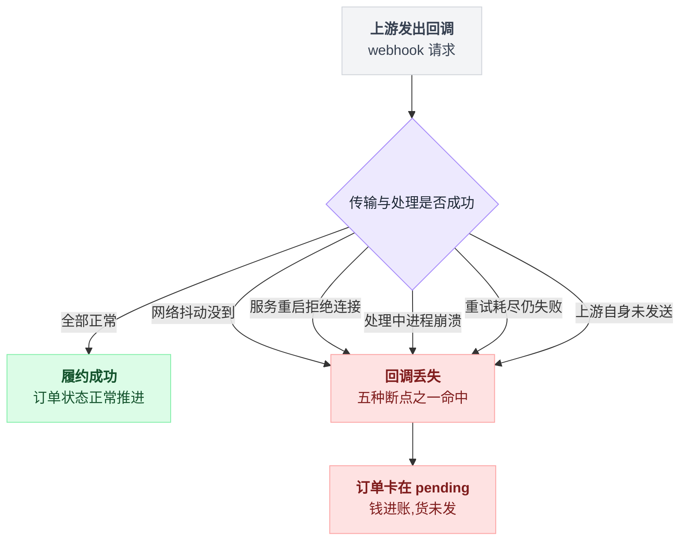
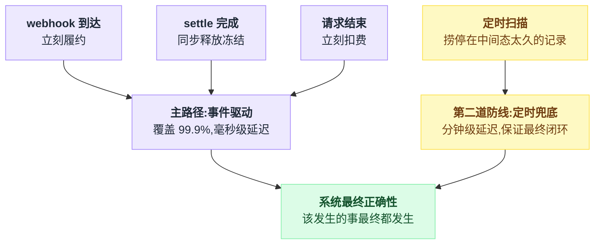
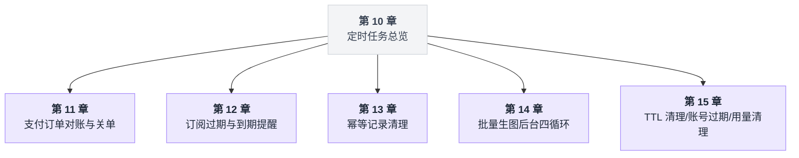
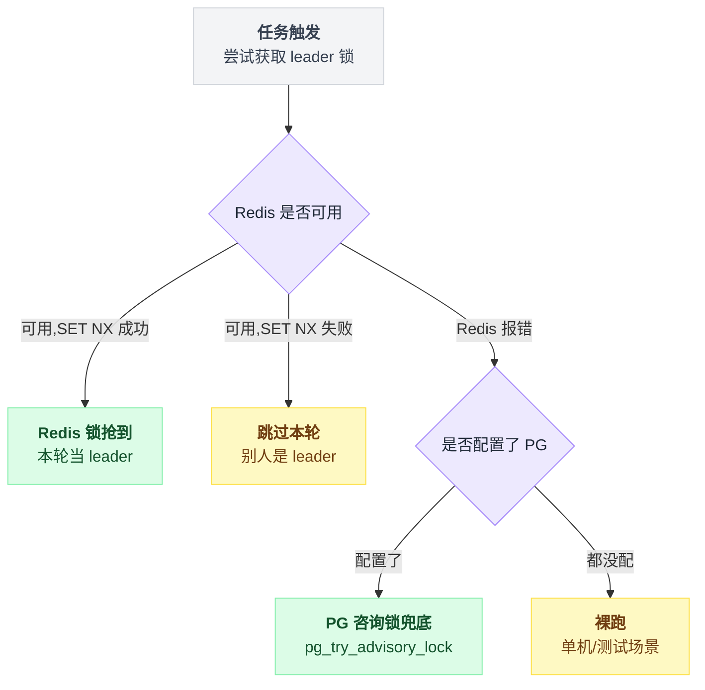
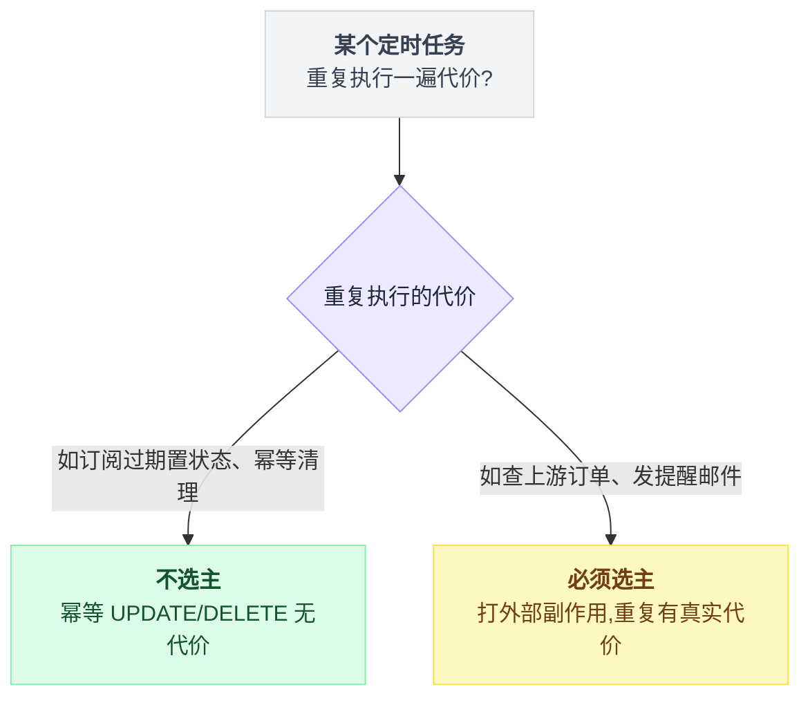
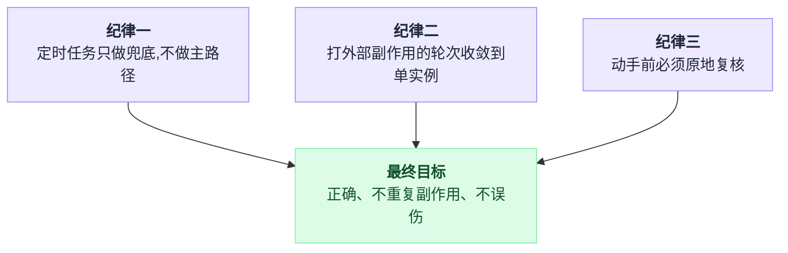

# 第 10 章:定时任务总览——事件驱动主路径与定时兜底

> 第二部分的开篇。前九章解决的是"请求来了,怎么把这一笔写对";从本章起解决另一半问题:
> **该来的事件没来,怎么办。**

一句话:主路径继续事件驱动,后面加一层定时扫描当第二道防线。本章讲清这个分层、共享的 leader 锁,以及贯穿后面五章的三条纪律。

---

## 10.1 一个危险的错觉:"回调一定会到"

第 6 章的扣费链路、第 7 章的预冻结三段式,都建立在"事件驱动"之上:请求结束触发扣费,上游回调触发履约,任务完成触发结算。

事件驱动是高并发系统的正确形态——没有轮询浪费,延迟最低。

但事件有一个天生的暗面:**不保证到达**。

以支付回调(webhook)为例,它会以这些方式丢失:

- 上游发出了回调,网络抖动,没到;
- 回调到了,但服务正在重启,连接被拒;
- 回调到了,处理到一半进程崩溃,上游认为已送达不再重试;
- 上游的重试队列有上限,重试完仍失败就放弃;
- 上游根本没发——它自己也有 bug。

五种断点长得很不一样,后果只有一个:**用户付了钱,订单永远停在 pending**。钱进了账,货没发。

这不是小概率的理论问题——只要跑得够久,每一种都会发生。

把"回调怎么丢"画成一张图:五个断点,同一个后果。



同样的暗面存在于所有"等事件推进"的地方:

| 等待的事件 | 事件丢失的后果 |
|---|---|
| 支付回调 | 收钱不发货 |
| worker 处理完 job | 冻结的钱永远冻着(第 7 章的冻结泄漏) |
| 进程正常退出时的清理 | 进程是被 kill -9 的,清理没跑 |
| 订阅到期"那一刻" | 根本没有这样的事件,到期是时间流逝,不是谁发的消息 |

最后一行值得单独看一眼:前三行是"事件本该来但丢了",第四行是"压根没有这个事件"。

## 10.2 解法:主路径事件驱动,第二道防线定时扫描

sub2api 的做法不是放弃事件驱动改成轮询——那样延迟和数据库压力都不可接受。

做法是**分层**:主路径继续吃事件——webhook 到了立刻履约、settle 时同步释放冻结、请求结束立刻扣费,覆盖 99.9% 的情况,毫秒级延迟;第二道防线是定时扫描,每隔一段时间捞一遍"停在中间态太久的东西",逐个补救,分钟级延迟,但保证最终闭环。

两层怎么分工、又怎么汇合成同一个正确性保证,画成一张图:



定时任务在这个架构里的身份不是"调度器",而是**打捞队**。

名字换了,衡量它设计好坏的标准也跟着变清晰:

- 它捞的东西,正常情况下应该是**零**(主路径全接住了);
- 捞到不为零时,要能报出来(说明主路径漏了,值得排查);
- 它自己绝不能成为主路径——如果一个系统靠轮询才能发现"该扣费了",延迟和漏单都会失控。

## 10.3 全景:sub2api 里订单与资金相关的定时任务

| 任务 | 周期 | 职责 | 多实例选主 | 详解 |
|---|---|---|---|---|
| 支付订单对账与关单 | 60 秒 | 主动查上游补履约;超时关单(关前再验一次) | ✅ Redis+PG 两级 | 第 11 章 |
| 订阅过期与到期提醒 | 60 秒 | 过期订阅批量置状态;剩 7/3/1 天发提醒邮件 | 仅邮件部分 ✅ | 第 12 章 |
| 幂等记录清理 | 60 秒 | 删过期的防重凭证,每批 500 | ✖(幂等删除) | 第 13 章 |
| 批量生图后台四循环 | 持续 / 5 秒 / 5 分钟 | 队列消费、延迟重投、僵尸回收、冻结泄漏打捞 | 队列天然分片 | 第 14 章 |
| 生图产物 TTL 清理 | 30 分钟 | 终态任务的输入(24h)/输出(72h)文件删除 | ✖(幂等删除) | 第 15 章 |
| 上游账号/代理过期 | 60 秒 | 过期账号自动暂停,防止继续被调度 | ✖(幂等 UPDATE) | 第 15 章 |
| 用量记录清理任务 | 定时唤醒+即时触发 | 执行管理员创建的一次性清理任务 | DB 认领抢占 | 第 15 章 |

全景表信息量大,先看一张导览图,后面五章按这张图逐一展开:



这些任务的注册点不散落在各处,全部收在同一个清理入口`provideCleanup`里[^1]——进程启动时统一拉起,优雅停机时统一 `Stop()` 并等 goroutine 退干净(`sync.WaitGroup` / `done channel`)。

## 10.4 共享基建:leader 锁的三级降级

上表里反复出现"选主"。问题来自部署形态:生产环境跑 N 个实例,每个实例都起了同样的定时器。若不加协调,同一轮扫描会被执行 N 遍。

对有些任务这无所谓(后面会讲),但对"会打外部副作用"的任务是事故:N 个实例同时向微信查单是 N 倍的上游调用;N 个实例同时发提醒邮件,用户收 N 封。

sub2api 的选主实现是一个函数,三级降级[^2](全文照抄见附录 A)。三级的优先级关系,一张表能看得比读代码快:

| 级别 | 触发条件 | 结果 |
|---|---|---|
| 一 | Redis 可用 | 抢到当 leader,没抢到跳过本轮 |
| 二 | Redis 报错且配了 DB | PG 咨询锁兜底 |
| 三 | 两者都没配 | 裸跑(单机/测试) |

同一套判断画成图:



三级各自的道理:

**第一级,Redis `SET NX`。** 最便宜的分布式互斥。value 写的是 owner(每个实例启动时生成的 UUID),释放时"先比对 owner 再删除":

```
# 释放锁(示意)
if redis.get(key) == owner:
    redis.del(key)          // 只删自己的
# 不比对就删 = 可能删掉别人刚抢到的锁
```

这是第 2 章讲过的 token 锁纪律,防止一个卡了很久的旧 leader 把新 leader 的锁误删。

**第二级,PostgreSQL 咨询锁。** 关键在触发条件:**Redis 报错时降级,而不是放弃互斥**。

如果 Redis 一抖就人人裸跑,那么"Redis 故障"和"全体实例同时打上游"就绑在了一起——故障放大。

PG 咨询锁(`pg_try_advisory_lock`)不碰任何表,锁 ID 由任务 key 的 FNV 哈希得来,持有期间占用一条连接,释放时 `pg_advisory_unlock` 并归还连接[^3]。

**第三级,裸跑。** 没配 Redis 也没给 DB 的场景只有单机部署和单元测试。此时若返回 false,任务就**永远静默饿死**——比重复执行更难察觉。

难察觉在哪:重复执行是显而易见的副作用,一眼能看出来;饿死是无声的,没有任何告警,也不会在日志里留下迹象。宁可裸跑。

还有一个容易误读的细节:锁的 TTL(3~5 分钟)**不是任期**。

```
每一轮:
    抢锁 -> 跑本轮任务 -> 结束立刻主动释放
    下一轮所有实例重新竞争          // leader 不固定在某台机器上

TTL 只在这一条路径上起作用:
    抢到锁 -> 进程死了 -> 没人释放 -> 锁最多卡 TTL -> 其它实例自然接管
```

也就是说,TTL 存在的唯一意义是**崩溃保险**。

由此推出 TTL 的取值纪律:**必须大于任务单轮最坏耗时**,否则任务跑到一半锁过期,别的实例进来,互斥失效。(支付任务两段各 30 秒超时,TTL 取 3 分钟,余量 3 倍。)

## 10.5 什么任务需要选主,什么任务不需要

对照上面的全景表,规律只有一条:

> **看"重复执行一遍"的代价。**

| 操作 | 重复执行一遍会怎样 | 结论 |
|---|---|---|
| `UPDATE subscriptions SET status='expired' WHERE expires_at <= now()` | 后到的那个影响 0 行 | 不选主 |
| `DELETE FROM idempotency_records WHERE expires_at < now() LIMIT 500` | 删空了就是删空了 | 不选主 |
| 向微信查 20 笔单、给用户发邮件 | 双倍上游调用、两封邮件 | 必须选主 |

前两行是幂等的,重复无代价;第三行打的是外部副作用,代价真实存在。

选不选主,判断标准画成一张判定树:



第 12 章会看到最精细的版本:**同一个任务的两个步骤,一个不选主、一个选主**——锁的粒度按步骤切,不按任务切。

## 10.6 定时任务的三条纪律(全部五章的公共主线)

**纪律一:定时任务只做兜底,不做主路径。**

每个任务都能指出它兜的是哪条主路径:对账兜 webhook,冻结打捞兜 settle/fail 时的同步释放,僵尸回收兜 worker 的正常 Ack。主路径健康时,定时任务每轮空转。

**纪律二:会打外部副作用的轮次,收敛到单实例。**

上游查单、发邮件、调 provider 删文件——凡是"重复一遍有真实代价"的,套 leader 锁;纯幂等 UPDATE/DELETE 不套,省掉协调开销。

**纪律三:扫描出来的候选,动手前必须原地复核。**

List 出来的是快照,快照会过期。这正是第 1 章的 TOCTOU,只是发生在分钟级的慢节奏里,更隐蔽。落到代码里是这个形状:

```
候选 = List(停在中间态太久的记录)     // 快照,可能已经过期
for 每条候选:
    # 关单前:再查一次上游(用户可能刚付款)
    # 退款前:用原子 UPDATE 复核 stale 条件(job 可能刚被慢提交救活)
    if 原子复核不通过: 跳过这条
    else:              动手
```

**扫描负责发现嫌疑,原子操作负责定罪**——凡是跳过复核直接动手的定时任务,迟早出一次"把正常的东西当垃圾处理了"的事故。

三条纪律各管一段,汇到同一个目标,画成一张图:



这三条会在接下来五章反复出现,每章的案例都是它们的一次具体落地。

---

## 附录:可以照抄的模板

### A. 选主的三级降级函数

```go
func tryAcquireSingletonLeaderLock(ctx, cache, db, key, owner, ttl) (func(), bool) {
    if cache != nil {
        ok, err := cache.TryAcquireLeaderLock(ctx, key, owner, ttl)  // Redis: SET key owner NX PX ttl
        if err == nil {
            if !ok { return nil, false }        // 别人是 leader,本轮跳过
            return releaseFunc, true            // 抢到了
        }
        // Redis 报错:不返回,继续往下降级
    }
    if db != nil {
        return tryAcquireDBAdvisoryLock(ctx, db, hashAdvisoryLockID(key))  // PG 咨询锁兜底
    }
    return func() {}, true                      // 都没配:裸跑(单机/测试)
}
```

---

## 出处

[^1]: 定时任务统一注册与优雅停机点:`cmd/server/wire_gen.go` 的 `provideCleanup`。
[^2]: 选主三级降级函数原文:`leader_lock.go:40`。
[^3]: PG 咨询锁释放与连接归还:`ops_advisory_lock.go:17`。

---

下一章:[第 11 章:支付订单的对账与关单](./11_定时任务一_支付订单的对账与关单.md)

回到目录:[README](./README.md)
