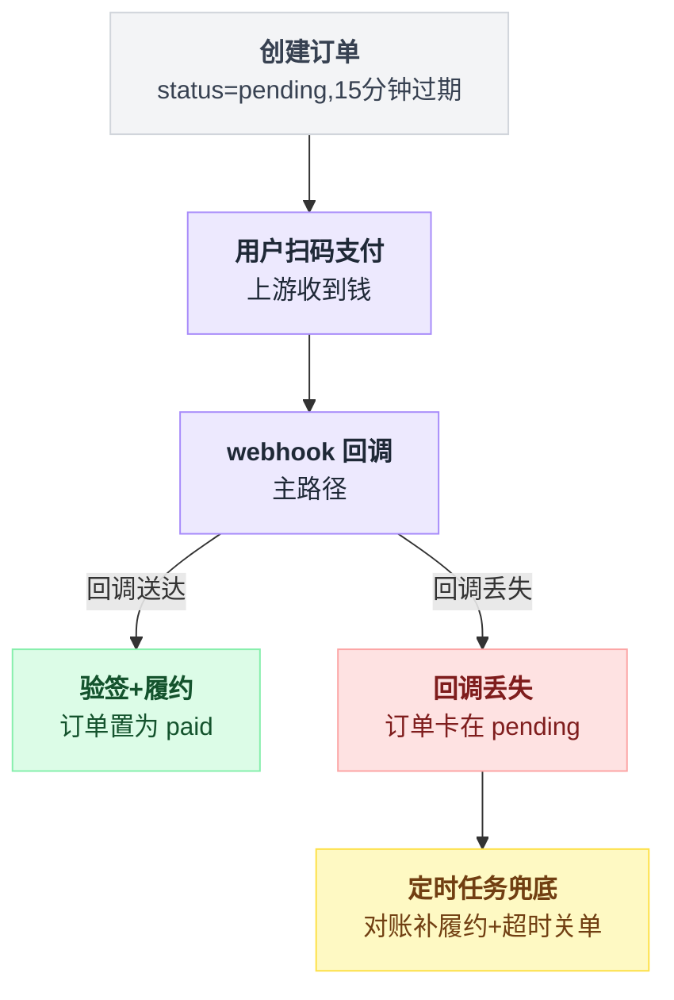
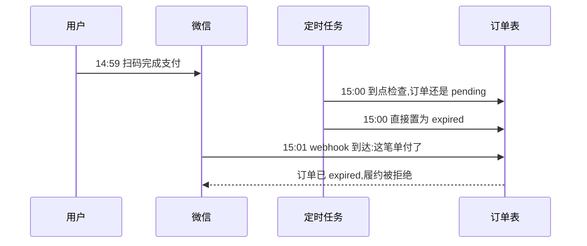
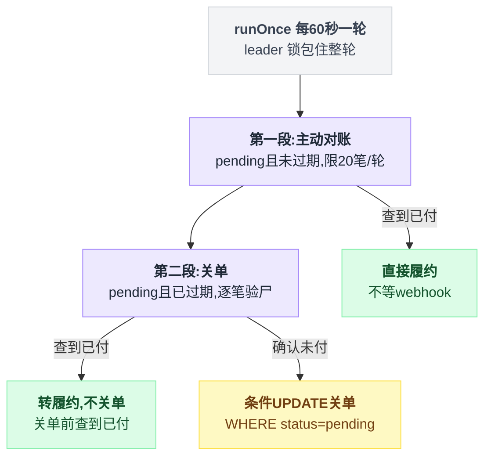
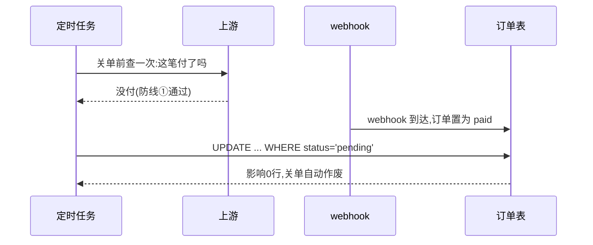
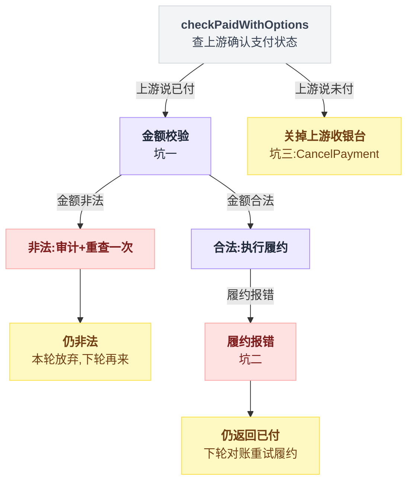
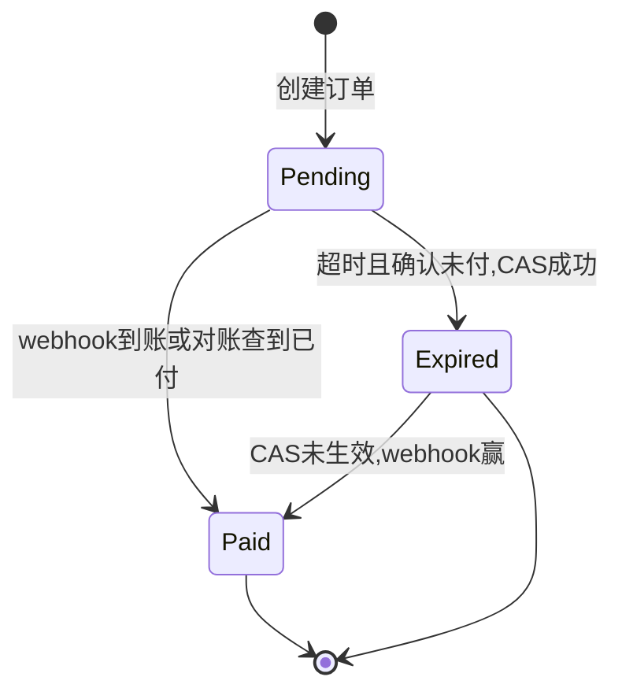

# 第 11 章:定时任务一——支付订单的对账与关单

> 定时任务里含金量最高的一个:它直接决定"用户付了钱,到底能不能拿到货"。
> 源码:`payment_order_expiry_service.go` + `payment_order_lifecycle.go`。出处收在文末脚注,可照抄代码收在文末附录。

---

## 11.1 背景:一笔支付订单的一生

用户点击充值,系统创建一笔支付订单:状态是 pending,过期时间是当前时间加 15 分钟。用户随后跳到收银台扫码,上游支付方(微信等)收到钱后发一次 webhook 回调,系统验签、履约(加余额/开订阅),订单最终置为 paid。

整条生命线画成图,回调走通和回调丢失是两条分岔:



主路径是第 4 步的 webhook。而第 10 章已经列过,webhook 会丢。

除此之外还有一条时间线:用户压根没付,订单不能永远 pending 挂着——15 分钟后要关单,否则"待支付订单"无限堆积,且占用着优惠、库存类资源。

于是需要一个定时任务处理两件事:**补履约**(付了但回调丢了)和**关单**(超时没付)。听起来都简单,天真写法各埋着一个事故。

## 11.2 天真写法一:只靠 webhook,不对账

写法很直接:webhook 到了就履约,webhook 没到就什么也不做。

后果:用户付款成功,页面一直转圈,余额没到账。等到 15 分钟后订单被关单任务置为 expired,钱却已经进了商户账户。

用户看到的是"付了钱、订单显示已过期"——最伤信任的一种资损,而且**每一单都要人工对账退款**。

排查时还很冤:代码没有任何 bug,单测全绿。丢的是网络上的一个 HTTP 请求。

## 11.3 天真写法二:到点直接关单

```sql
UPDATE payment_orders SET status = 'expired'
WHERE status = 'pending' AND expires_at <= now();
```

这条 SQL 本身写得不错(条件 UPDATE,幂等),但时序上有个缝:

```
14:59  用户在收银台完成扫码,微信收到钱
15:00  定时任务到点,订单还是 pending → 置为 expired
15:01  webhook 到达:"这笔单付了"
       → 订单已经是 expired,履约逻辑拒绝处理(或者被迫处理一个"已过期"的单)
```

按时间轴摊开,这条竞速长这样:



用户在最后一秒付款是真实高频场景(15 分钟倒计时对人的行为就是这个效果)。

**关单和付款回调在竞速**,直接关单等于在竞速里假定自己永远赢。

## 11.4 sub2api 的做法:每 60 秒,两段式

先给骨架。`PaymentOrderExpiryService.runOnce()` 每轮做两件事,顺序固定——先对账,后关单[^1]:

```
每 60 秒一轮:
    抢 leader 锁,抢不到就直接返回          // 整轮都在锁里
    第一段 对账: pending 且【未过期】的单 → 问上游"付了吗" → 付了就直接履约
    第二段 关单: pending 且【已过期】的单 → 问上游"付了吗" → 付了转履约,没付才关
```

两段各自的出口不一样:

| | 第一段:主动对账 | 第二段:关单 |
|---|---|---|
| 捞哪些单 | pending 且未过期 | pending 且已过期 |
| 每轮上限 | 20 笔 | 逐笔验尸 |
| 查到已付 | 直接履约,不等 webhook | 转履约,**不**关单 |
| 确认未付 | 不动它(留给下一轮) | 条件 UPDATE 关单 |



### 第一段:主动对账 pending 微信订单

`ReconcilePendingWxpayOrders` 查最近的 pending 且未过期的微信订单,按创建时间从旧到新,每轮最多 20 笔,逐笔调用 `reconcilePaid`;查到已付就计数、走履约。完整实现照抄文末附录 A。

`reconcilePaid` 主动调上游的查单接口(`QueryOrder`):上游说已付,就直接走履约——**不等 webhook 了**。

源码注释说得直白:"missed provider notifications do not wait until order expiry to fulfill"。回调丢了,最多 60 秒后对账把履约补上,用户几乎无感。

这条查询的三个参数都有讲究。

**只查未过期的单**(过期时间还没到)。已过期的交给第二段处理,职责不重叠。

**每轮最多 20 笔。** 对账是打上游 API 的,必须限流。积压多了就分多轮消化,每轮 60 秒,追赶速度 20 笔/分钟——够用,因为正常情况下 pending 且付了款的订单接近零(webhook 主路径接住了)。

**从旧到新。** 越老的 pending 单越可能是回调丢了的,优先打捞。

### 第二段:关单,但关之前再看一眼

`ExpireTimedOutOrders`[^2] 查 pending 且已过期的单,逐笔交给 `cancelCore` 验尸:结果是"已付"就打日志、直接放行去履约,不当成关单处理。完整实现照抄文末附录 B。

关键全在 `cancelCore`[^3]。它做的事,剥掉 ORM 之后就是两步:

```
cancelCore(订单 o):
    if o 跟上游发生过关系:              // PaymentTradeNo 或 PaymentType 非空
        if 问上游得到"已付":
            return already_paid          // 掉头去履约,这单不关
    UPDATE 订单 SET status=终态 WHERE id=o.id AND status='pending'
    if 影响行数 > 0:  写审计日志          // 没关掉就不写
    return cancelled
```

真实实现比伪代码只多两处细节:判断"跟上游发生过关系"的具体条件是订单已经有支付流水号或支付方式;条件 UPDATE 走的是 ent 客户端的链式调用,同样是"匹配 id 且状态还是 pending 才更新"。完整代码照抄文末附录 C[^3]。

两道防线,各挡一种事故。

**防线①,关单前查上游。** 就是 11.3 那个竞速的解:上游是"付没付"的唯一事实源,关单这种不可逆动作,动手前必须问一次事实源。查到已付,流程立刻掉头去履约。

**防线②,条件 UPDATE——只有订单还处于 pending 才关得动。** 熟悉的配方——这是第 2 章的 CAS。

为什么有了防线①还需要它?因为防线①和 UPDATE 之间仍有缝隙:查上游说"没付",一毫秒后 webhook 到了、把订单置成了 paid,然后 UPDATE 才执行。有了"必须还是 pending"这条前提,这条 UPDATE 会影响 0 行——关单自动作废,webhook 赢。

**慢节奏的定时任务和毫秒级的 webhook 并发写同一行,靠 CAS 分胜负,输家(定时器)安静退场。**

这条残余缝隙按时间摊开是这样收场的:



只有 UPDATE 真的影响到行,才写审计日志——这也是同一纪律的余波:UPDATE 影响 0 行说明单没被本流程关掉,审计里就不该出现一条"ORDER_EXPIRED"。

## 11.5 `checkPaidWithOptions`:查上游这一步本身的坑

"问一次上游"看似一行调用,`checkPaidWithOptions`[^4] 里却处理了三个真实世界的坑。三个坑分别挂在"上游说已付"和"上游说未付"两条分支上:

```
问上游:
    上游说【已付】:
        坑一  金额非法  → 写 PAYMENT_INVALID_AMOUNT 审计 → 重查一次
                          还非法 → 本轮放弃(返回空),下轮再来
              金额合法  → 执行履约
        坑二  履约报错  → 仍然返回 already_paid,下轮对账重试履约
    上游说【未付】:
        坑三  顺手把上游侧的收银台也关掉(CancelPayment)
```

| | 场景 | 处置 |
|---|---|---|
| 坑一 | 说已付,但金额非法 | 审计 + 重查一次,仍非法则本轮放弃 |
| 坑二 | 确认已付,但履约失败 | 仍返回 already_paid,留给下轮重试 |
| 坑三 | 确认没付,收银台还开着 | 调 `CancelPayment` 关掉上游收银台 |



**坑一:上游返回"已付",但金额非法。**

不直接采信,先写一条 `PAYMENT_INVALID_AMOUNT` 审计,再**重查一次**(`requeryPaidOrderOnce`);重查还是非法就本轮放弃(返回空,下一轮再来)。

金额校验失败可能是上游瞬时脏数据,也可能是攻击。无论哪种,都不能拿一个非法金额去履约。

**坑二:确认已付,但履约失败。**

`HandlePaymentNotification` 报错时,`checkPaidWithOptions` 只记一条错误日志,函数照样返回"已付"[^4]。源码注释写的是:"Still return already_paid — order was paid, fulfillment can be retried"。

履约失败**仍然返回 already_paid**。因为"付没付"和"履约成没成功"是两个独立事实:付了就是付了,绝不能因为履约代码抛错就把单关掉——那等于"收了钱,还亲手把补救通道焊死"。

返回 already_paid 后订单保持原状,60 秒后下一轮对账重试履约(履约入口 `HandlePaymentNotification` 与 webhook 共用,内部幂等,重试安全)。

**坑三:确认没付之后,收银台还开着。**

对支持取消的上游(`CancelableProvider`),关单时顺手调 `CancelPayment` 把上游侧的收银台也关掉。否则会出现"本地已 expired,用户还能在残留的二维码上付款成功"——那就制造了一笔无主付款。

## 11.6 多实例:leader 锁包住整轮

```go
release, ok := tryAcquireSingletonLeaderLock(ctx, s.lockCache, s.db,
    "payment:order:expiry:leader", s.instanceID, 3*time.Minute)
if !ok { return }    // 本轮别的实例在跑,直接返回
defer release()
```

这是全部定时任务里最没有悬念的选主:两段都在打上游支付方的 API,N 实例裸跑就是 N 倍查单流量,还会并发对同一批订单做关单/履约。

锁 TTL 取 3 分钟,注释写明了推导:**必须超过对账+关单两段超时之和(2 × 30 秒)**,保证锁绝不在任务中途过期。TTL 的取值不是拍脑袋,是从最坏耗时算出来的(第 10 章的纪律)。

把全章的订单状态迁移收进一张状态机,从 Expired 回到 Paid 的那条边就是上一节画的残余竞速:



## 11.7 把这一章串起来

每条结论都能从前面某个画面重新推出来:

- **回调会丢是真实的,不是运气差。** 11.2 的天真写法一证明了这一点:代码没有 bug、单测全绿,丢的只是网络上的一个 HTTP 请求,后果却是用户看到"付了钱、订单显示已过期"。
- **关单和付款回调在竞速,直接关单等于假定自己永远赢。** 11.3 那条时间轴摊开就看得出来——最后一秒付款是高频场景,15 分钟倒计时对人的行为本来就是这个效果。
- **两段对账靠"过没过期"分工,职责不重叠。** 11.4 里第一段主动打捞回调丢失的单(每轮 20 笔,从旧到新),第二段关单前再验一次尸;付了的单不管落在哪一段,都掉头去履约。
- **关单前先问一次事实源,问完还要靠条件 UPDATE 兜底。** 11.4 的两道防线合起来才堵住 11.3 那条竞速的缝隙——只查上游不够,防线①和 UPDATE 之间仍有毫秒级的空隙,得靠"必须还是 pending"这条前提让输家的 UPDATE 自动作废。
- **上游给出的答案本身不可信,要当脏数据处理。** 11.5 的三个坑分别对应金额非法、履约报错、收银台没关——每一个都不是"上游说已付"就能直接采信。
- **多实例场景里,谁抢到 leader 锁谁跑这一轮,TTL 从最坏耗时反推。** 11.6 里 3 分钟的 TTL 不是拍脑袋定的,是两段各 30 秒超时之和乘上余量算出来的。

一句话:**对账补履约,关单先验尸;定时器和 webhook 的竞争,交给条件 UPDATE 裁决。**

---

## 附录:可以照抄的模板

### A. ReconcilePendingWxpayOrders 的完整实现

查最近的 pending 且未过期的微信订单,每轮最多 20 笔,按创建时间从旧到新,逐笔对账:

```go
// ReconcilePendingWxpayOrders: 查最近的 pending 且未过期的微信订单,
// 每轮最多 20 笔,按创建时间从旧到新
orders := query(status=pending, expires_at > now, payment_type=wxpay...).Limit(20)
for _, order := range orders {
    if s.reconcilePaid(ctx, order) == checkPaidResultAlreadyPaid {
        recovered++
    }
}
```

### B. ExpireTimedOutOrders 的完整实现

查 pending 且已过期的单,逐笔交给 `cancelCore` 验尸[^2]:

```go
// payment_order_lifecycle.go:375
orders := query(status=pending, expires_at <= now)
for _, o := range orders {
    outcome, _ := s.cancelCore(ctx, o, OrderStatusExpired, "system", "order expired")
    if outcome == checkPaidResultAlreadyPaid {
        slog.Info("order was paid during expiry", "orderID", o.ID)
        continue      // 不是关单,是补履约
    }
}
```

### C. cancelCore 的完整实现

关单前先查一次上游,查到已付就掉头;没付才走条件 UPDATE[^3]:

```go
// payment_order_lifecycle.go:124
func (s *PaymentService) cancelCore(ctx, o, fs, op, ad) (string, error) {
    // ① 只要订单跟上游发生过关系,关单前先查上游:真的没付吗?
    if o.PaymentTradeNo != "" || o.PaymentType != "" {
        if s.checkPaid(ctx, o) == checkPaidResultAlreadyPaid {
            return checkPaidResultAlreadyPaid, nil   // 付了!走履约,不关单
        }
    }
    // ② 条件 UPDATE:只有还处于 pending 才关得动
    c := s.entClient.PaymentOrder.Update().
        Where(paymentorder.IDEQ(o.ID), paymentorder.StatusEQ(OrderStatusPending)).
        SetStatus(fs).Save(ctx)
    if c > 0 { s.writeAuditLog(...) }   // 真关掉了才写审计
    return checkPaidResultCancelled, nil
}
```

---

## 出处

[^1]: `runOnce()` 入口:`payment_order_expiry_service.go:89`。
[^2]: `ExpireTimedOutOrders`:`payment_order_lifecycle.go:375`。
[^3]: `cancelCore` 真实实现:`payment_order_lifecycle.go:124`。
[^4]: `checkPaidWithOptions`(问上游确认支付状态,含坑一坑二坑三三处处理):`payment_order_lifecycle.go:152`。

---

下一章:[第 12 章:订阅过期与到期提醒](./12_定时任务二_订阅过期与到期提醒.md)

回到目录:[README](./README.md)
