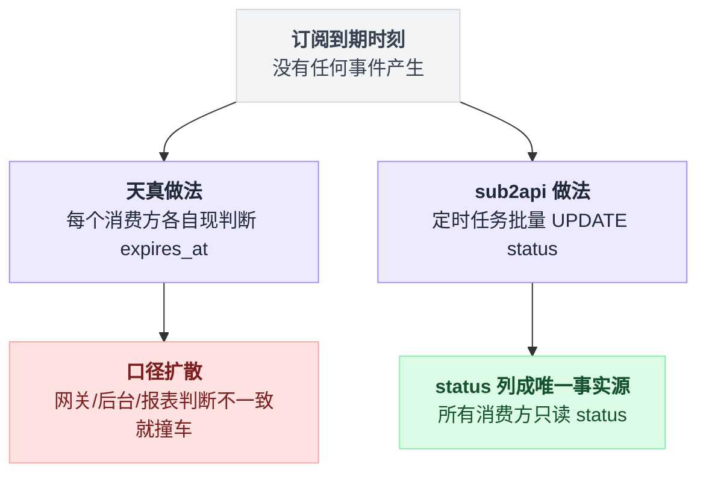
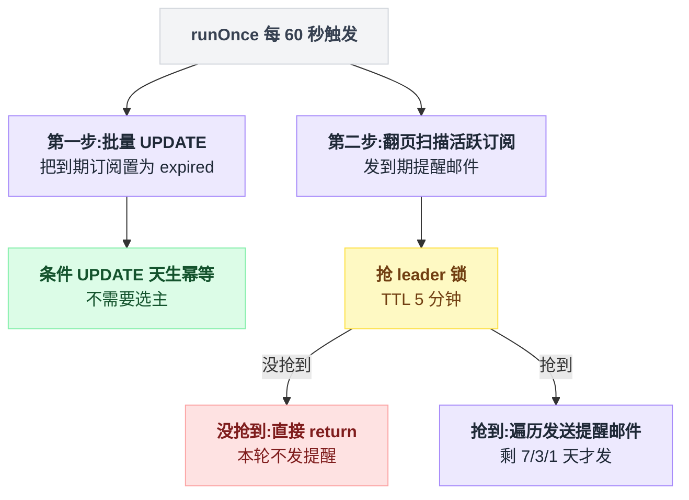
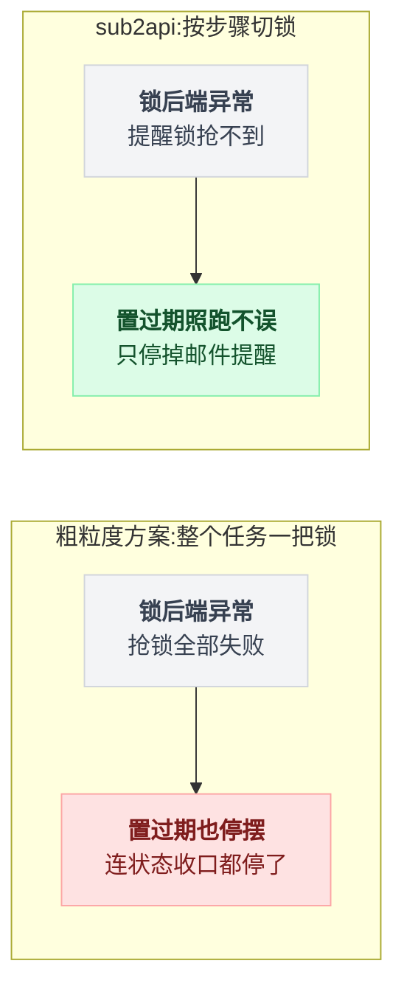
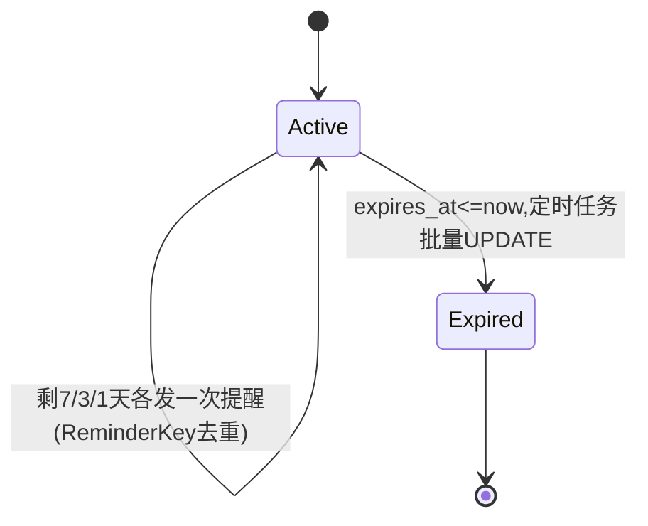

# 第 12 章:定时任务二——订阅过期与到期提醒

> 一个看起来平平无奇的任务,却是"锁的粒度"最好的教材:同一轮任务里,一半不加锁,一半加锁。
> 源码:`subscription_expiry_service.go`。

---

## 12.1 背景:订阅到期不是一个事件

用户买了 30 天订阅,`expires_at` 写着到期时刻。

问题来了:到期那一刻,**没有任何人会发消息通知系统**。时间流逝不产生 webhook。

这是和第 11 章支付订单的本质区别。支付有上游会推事件(只是可能丢),订阅到期连"可能丢的事件"都没有——**到期检测天生只能靠自己**,要么查询时现算,要么定时扫描。

## 12.2 天真做法:每次用到的时候现判断

```go
if sub.ExpiresAt.Before(time.Now()) {
    // 视为过期
}
```

这叫惰性判定。单看一处代码没有问题,真实系统里的麻烦在于**口径扩散**:

- 网关准入要判一次;
- 管理后台列表要判一次;
- 统计报表要判一次;
- 移动端、开放 API……每个消费方都要重复同一段"现在过没过期"的逻辑。

只要有一个消费方忘了判(或时区、边界条件判得不一样),就出现"这边显示已过期、那边还在放行"的割裂。

更坏的一层在 `status` 列上:它如果存在却不可信("status 说 active,但其实早过期了"),就比不存在更有害——所有人都得绕开它。

## 12.3 sub2api 的做法:定时收口 + 状态列作为唯一事实

`SubscriptionExpiryService`(每 60 秒)第一步:

```go
updated, err := s.userSubRepo.BatchUpdateExpiredStatus(ctx)
// 本质: UPDATE user_subscriptions SET status='expired'
//       WHERE status='active' AND expires_at <= now()
```

定时任务把"时间流逝"翻译成"状态变更",之后所有消费方只读 `status`,口径唯一。误差上界就是扫描周期(最多晚 60 秒),对订阅这种以天计的商品完全可接受。

注意这条 UPDATE 的形状,又是熟悉的套路:

- **条件 UPDATE**:`WHERE status='active' AND expires_at <= now()`,天生幂等;
- **批量一条 SQL**:不是查出列表再逐条改(那是第 1 章批判过的读-改-写),而是让数据库一次完成判定+修改。

幂等意味着:两个实例同时跑,先到的改掉全部命中行,后到的影响 0 行,毫无危害。所以这一步**不需要选主**。

两种做法的分岔画成一张图:



## 12.4 第二步:到期提醒邮件——性质完全变了

同一个 `runOnce` 里紧接着的第二件事:给剩余 7 天、3 天、1 天的活跃订阅用户发提醒邮件。

先看整轮的形状,一个 `runOnce` 里两步的待遇完全不同(示意):

```
每 60 秒 runOnce():
    # 第一步:一条条件 UPDATE,谁跑都行,不抢锁
    BatchUpdateExpiredStatus()

    # 第二步:抢到锁的实例才往下走
    if 抢不到 "subscription:expiry:reminder:leader":  return
    defer 释放锁
    for page = 1, 2, 3, ...:
        subs = List(status=active, page_size=200, order_by=expires_at asc)
        for sub in subs:  sendExpiryReminderIfDue(sub)   # 剩 7/3/1 天才发
        if 翻完了:  return
```

翻页扫描那段的真实写法:

```go
for page := 1; ; page++ {
    subs, pag, _ := s.userSubRepo.List(ctx, {Page: page, PageSize: 200},
                                        ..., SubscriptionStatusActive, ..., "expires_at", "asc")
    for i := range subs {
        s.sendExpiryReminderIfDue(ctx, &subs[i])   // 剩 7/3/1 天才发
    }
    if 翻完了 { return }
}
```

和第一步对比,两个性质同时变了:

1. **从幂等 UPDATE 变成了外部副作用**。邮件发出去就收不回,重复执行=用户收到两封一样的"您的订阅还剩 3 天";
2. **从单条 SQL 变成了全量翻页扫描**。每页 200 条翻完所有活跃订阅,N 个实例同时扫就是 N 倍的数据库压力。

于是——只有这一步——套上了 leader 锁:

```go
release, ok := tryAcquireSingletonLeaderLock(ctx, s.lockCache, s.db,
    "subscription:expiry:reminder:leader", s.instanceID, 5*time.Minute)
if !ok { return }
defer release()
```

锁 TTL 取 5 分钟,比支付任务的 3 分钟更宽,注释解释了原因:翻页扫描的耗时随订阅量增长,TTL 要"comfortably above one cycle"。还是那条纪律,**TTL 从最坏耗时推导**。

同一个 `runOnce` 里两步的锁策略完全不同,画出来就是这样:



## 12.5 本章真正的知识点:锁的粒度按步骤切

把两步放在一起看:

| | 第一步:批量置过期 | 第二步:提醒邮件 |
|---|---|---|
| 操作性质 | 幂等条件 UPDATE | 发邮件(外部副作用)+ 全表扫描 |
| 重复执行的代价 | 零(影响 0 行) | 用户收重复邮件 + N 倍扫描压力 |
| 是否选主 | 否 | 是 |

大多数系统的写法是把整个定时任务包在一把锁里。省事,但有个隐性代价:**置过期这种"多跑无害、不跑有害"的操作,也被绑在了锁的可用性上**。

假如某个时刻锁后端(Redis + PG)整体异常导致抢锁全部失败,粗粒度方案连状态收口都停了;sub2api 的方案里,置过期照跑不误,停掉的只有邮件。

**用"错了赔不赔得起"逐步骤划分,而不是逐任务划分**,故障时保住的恰好是更重要的那半。

锁后端整体异常时,两种粒度的后果并排放在一起就很清楚:



## 12.6 提醒本身的幂等:ReminderKey

还剩一个缝:leader 锁只保证"同一轮"单实例执行,但 7 天窗口内这个任务要跑上万轮——凭什么"剩 7 天"的提醒只发一封,而不是 7 天里每分钟发一封?

答案在发送入口的参数里。发送侧的判断可以这样理解(示意):

```
sendExpiryReminderIfDue(sub):
    if 剩余天数 不属于 {7, 3, 1}:  return
    Send(事件类型 = 订阅到期提醒,
         来源     = ("user_subscription", sub.ID),
         提醒键   = "7d" / "3d" / "1d")
    # 邮件服务按 (事件类型, 来源, 提醒键) 去重,同一个键只真正发一次
```

真实代码:

```go
s.notificationEmailService.Send(ctx, NotificationEmailSendInput{
    Event:       NotificationEmailEventSubscriptionExpiryReminder,
    SourceType:  "user_subscription",
    SourceID:    strconv.FormatInt(sub.ID, 10),
    ReminderKey: fmt.Sprintf("%dd", daysRemaining),   // "7d" / "3d" / "1d"
    ...
})
```

`(事件类型, 订阅ID, ReminderKey)` 构成一个天然的幂等键:同一订阅的"7d"提醒,无论被扫到多少次,邮件服务按这个键去重,只发一封。

这正是第 6 章幂等抢占思想在邮件场景的翻版——**定时任务负责"该不该发",幂等键负责"发过没发过",两层各管一半,谁也不依赖谁的精确性**。

也因此,扫描周期、锁、翻页这些环节都不需要做到精确一次,整条链路反而简单和健壮。

顺带一提,这个任务还有一个运行时开关(`SettingKeySubscriptionExpiryNotifyEnabled`):读配置失败时**默认不发**(fail-closed)——打扰用户的动作,拿不准就不做。和第 6 章限流检查的 fail-open 恰好相反,再次印证选向标准是"哪边的最坏后果赔得起"。

把订阅从有效到过期的完整流转,连同提醒节点一起画出来:



## 12.7 本章小结

- 订阅到期没有事件可等,**只能定时扫描**——这是定时任务当主角(而非兜底)的少数合法场景,因为"时间到了"本来就不是事件;
- 状态判定收口到定时任务 + status 列,消灭口径扩散;
- 置状态是幂等 UPDATE,不选主;发邮件是外部副作用,选主——**锁的粒度按重复执行的代价切**;
- 精确一次不靠锁,靠 `ReminderKey` 幂等键兜底;
- 打扰用户的开关,读不到就 fail-closed。

---

下一章:[第 13 章:幂等记录清理](./13_定时任务三_幂等记录清理.md)

回到目录:[README](./README.md)
