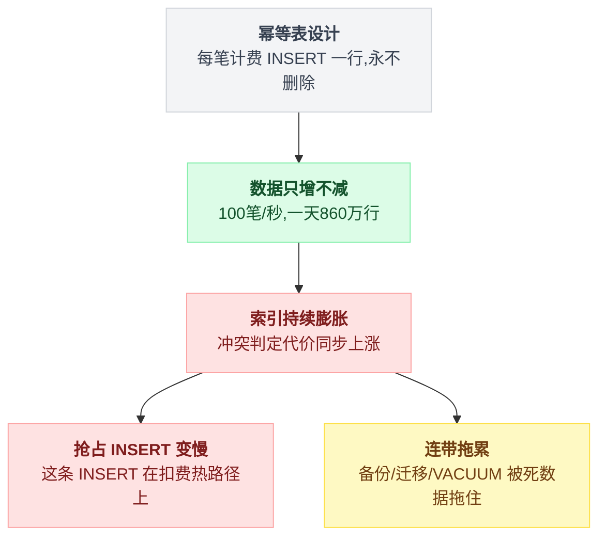
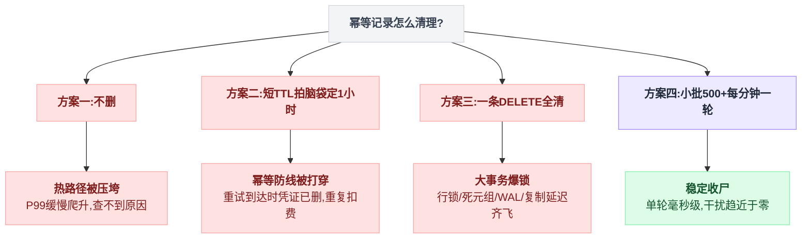
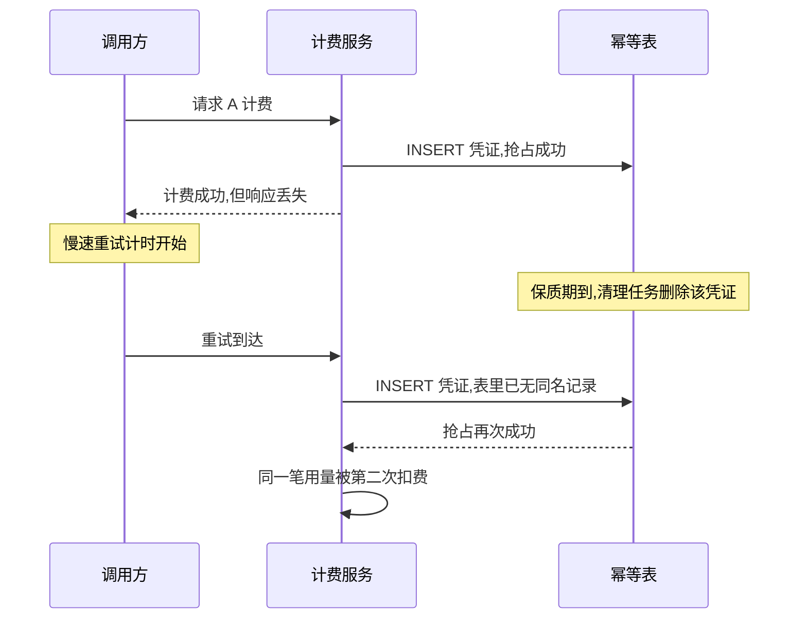
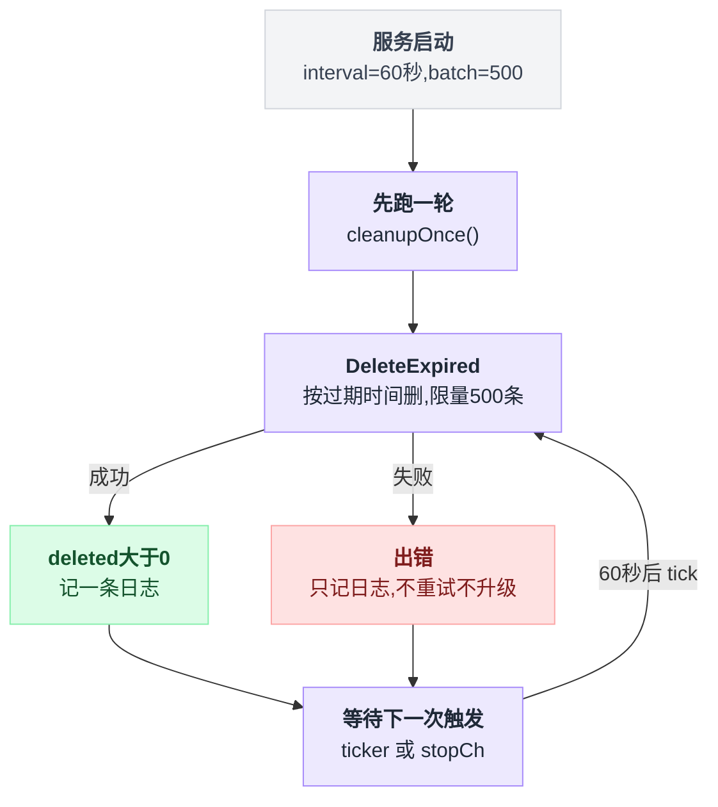

# 第 13 章:定时任务三——幂等记录清理

> 最短的一章,讲的却是一个普遍被漏掉的问题:防重复的凭证本身,也需要有人收尸。
> 源码:`idempotency_cleanup_service.go`。

---

## 13.1 背景:dedup 表只进不出

回顾第 6 章的扣费幂等:每笔计费动作先往去重表里 `INSERT ... ON CONFLICT DO NOTHING` 抢占一个凭证,抢到才允许扣费。这张表的写入模式是**每笔计费一行,永远只插不删**。

按一个中等流量的网关算:每秒 100 笔请求,一天就是 860 万行。什么都不做的话:

- 表和唯一索引持续膨胀,**抢占 INSERT 越来越慢**——而这条 INSERT 在扣费事务里,是热路径;
- 索引深度增加,每次冲突判定的代价同步上涨;
- 备份、迁移、VACUUM 都被这张"死数据占 99.9%"的表拖累。

幂等凭证的价值是有保质期的:它防的是**重试窗口内**的重复请求。一笔三天前的计费,不可能再有合法重试到达——它的凭证已经是纯粹的垃圾,却还在给每一次新抢占垫高成本。

只进不出的表,后果会顺着一条链子传导下去:



## 13.2 天真做法一:不删

上一节已经说完后果。这个方案最大的迷惑性在于**短期内毫无症状**:前三个月一切正常,第六个月扣费 P99 缓慢爬升,没有任何一次变更能对上时间线——增长型的问题从不在代码评审里报警。

下面两节还会再犯两种错,到 13.5 才落到正确姿势,四条路径先摆在一起看:



## 13.3 天真做法二:删得太狠

```sql
DELETE FROM idempotency_records WHERE created_at < now() - interval '1 hour';
```

保质期拍脑袋定 1 小时,后果是**幂等防线被打穿**:

```
10:00  请求 A 计费,凭证写入
10:05  计费成功,但响应丢失,调用方进入慢速重试
11:30  重试到达 —— 凭证已被清理
       → INSERT 成功,"抢占"成立 → 同一笔用量被第二次扣费
```

第 6 章辛苦建立的"至多一次"就此失效,而且失效得无声无息——没有报错,只有账不平。分开客户端、服务、幂等表三个角色看,穿透发生在哪一步一目了然:



正确的保质期必须从重试行为倒推:**凭证的 `expires_at` ≥ 所有合法重试可能到达的最晚时刻**(包括异步管道里的排队重试、进程重启后的恢复重试)。sub2api 把过期时间直接存在每条记录上,由写入方按业务语义决定,清理任务只认 `expires_at < now()`——**"活多久"是业务决策,"谁收尸"是基建职责**,两者解耦。

## 13.4 天真做法三:一条 DELETE 全清

```sql
DELETE FROM idempotency_records WHERE expires_at < now();
```

语义正确,工程上有暗雷。假设停机维护了两天,积压了千万级过期记录,这条 SQL 会:

- 在一个事务里删上千万行,行锁、死元组、WAL 一起爆;
- 长事务阻碍 VACUUM 清理,反过来拖慢线上正在跑的抢占 INSERT;
- 复制延迟(如果有从库)瞬间飙高。

删除也是写,**大写入要限批**——和第 6 章"有界工人池"是同一个思想在 SQL 上的投影。

## 13.5 sub2api 的做法:小批、勤跑、启动先清一轮

`idempotency_cleanup_service.go` 全部要点:

```go
interval := 60 * time.Second   // 每分钟一轮(可配)
batch    := 500                 // 每轮最多删 500 条(可配)

func (s *IdempotencyCleanupService) runLoop() {
    ticker := time.NewTicker(s.interval)
    defer ticker.Stop()
    s.cleanupOnce()              // 启动后先清理一轮,防止重启后积压
    for {
        select {
        case <-ticker.C: s.cleanupOnce()
        case <-s.stopCh: return
        }
    }
}

func (s *IdempotencyCleanupService) cleanupOnce() {
    deleted, err := s.repo.DeleteExpired(ctx, time.Now(), s.batch)
    if err != nil { log(...); return }        // 失败只记日志,下一轮再来
    if deleted > 0 { log(...) }
}
```

整个循环画出来是这样:



逐条拆:

**每批 500,每分钟一轮。** 稳态下每分钟新产生的过期记录远小于 500,一轮清完;积压时按 500 条/分钟匀速消化,永不制造大事务。批量小到单轮毫秒级完成,对线上抢占 INSERT 的干扰约等于零。

**启动先清一轮。** 定时器的第一次触发在 60 秒后,而重启往往正是积压最多的时刻(停机期间没人清理)。先跑一轮再进循环,是所有周期任务的通用小纪律——sub2api 的每个定时服务(支付、订阅、清理)都是这个写法。

**失败只打日志,不重试、不报警升级。** 这是和资金任务的鲜明对比:清理是维护性任务,单轮失败没有任何资金后果,过期记录多躺 60 秒毫无影响,下一轮自然追上。**兜底任务的错误处理强度,应当与它失败的后果成正比**——第 14 章会看到反面:释放冻结余额失败时,是绝不允许"只打日志"的。

**不选主。** `DELETE ... WHERE expires_at < now() LIMIT 500` 幂等,两个实例撞上,不过是各删一批、或者后者删到 0 行。为这种操作引入分布式锁,纯属给系统加故障面。

## 13.6 本章小结

| 决策点 | 错误选项及后果 | 正确姿势 |
|---|---|---|
| 删不删 | 不删:热路径被增长慢慢压垮 | 必须删,幂等凭证有保质期 |
| 何时能删 | 拍脑袋短 TTL:幂等防线被重试打穿 | `expires_at` ≥ 最晚合法重试,业务方定 |
| 怎么删 | 单条大 DELETE:锁/WAL/VACUUM 三连 | 限批(500)+ 勤跑(60s) |
| 启动时 | 等第一个 tick:积压多扛 60 秒 | 先清一轮再进循环 |
| 失败时 | 重试/报警堆砌 | 只记日志,下一轮追上(与后果成正比) |
| 多实例 | 加锁:白白引入协调故障面 | 不加,幂等删除随便撞 |

一句话:**给幂等凭证定保质期的是业务,负责收尸的是定时任务;收尸要限批,失败不慌张。**

---

下一章:[第 14 章:批量生图的后台四循环](./14_定时任务四_批量生图的后台四循环.md)

回到目录:[README](./README.md)
