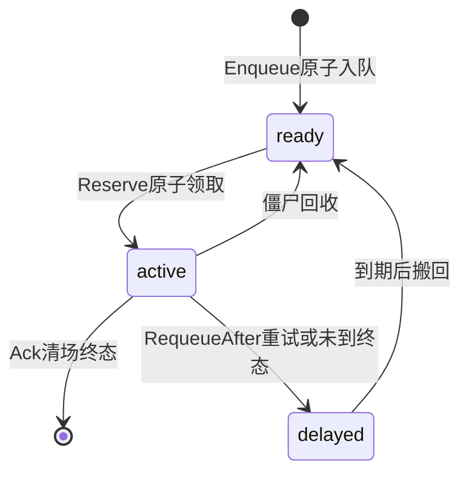
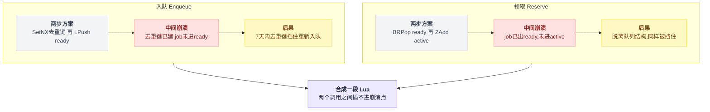
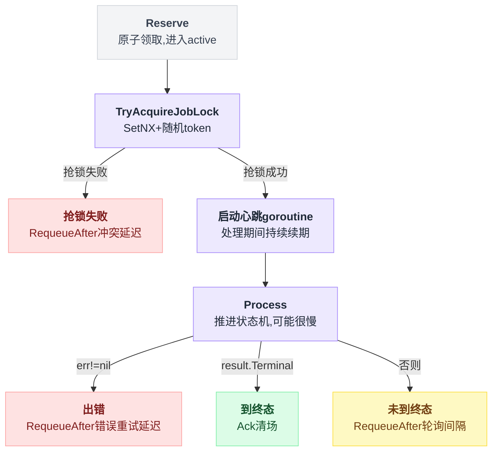
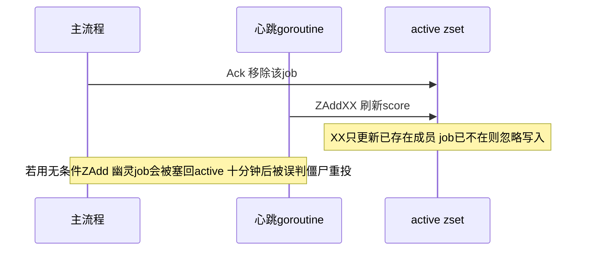
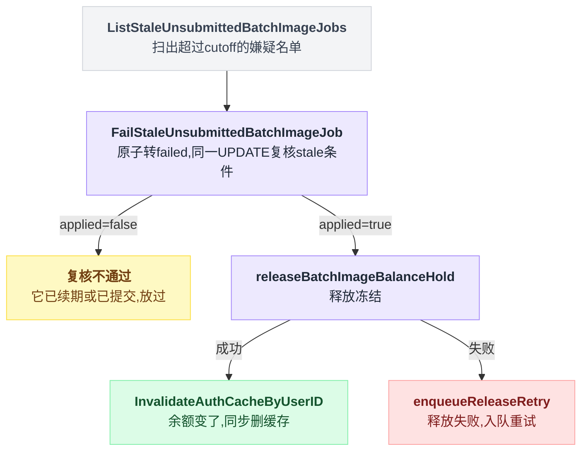
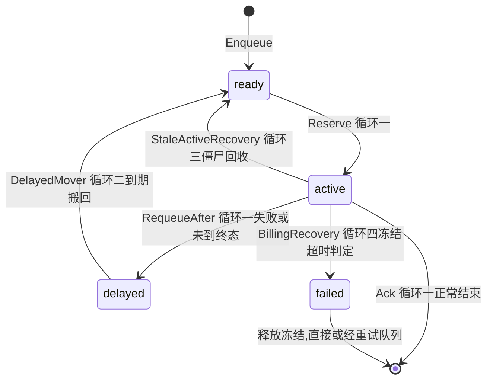

# 第 14 章:定时任务四——批量生图的后台四循环

> 第 7 章讲了批量生图"钱怎么冻、怎么扣、怎么退";本章讲支撑这一切的发动机:
> 四个常驻后台循环,以及它们如何互为保险。
> 源码:`batch_image_worker_runtime.go`、`batch_image_worker.go`、`batch_image_queue.go`、`batch_image_billing_recovery.go`。

---

## 14.1 背景:生图 job 靠谁推进

普通 API 请求的生命周期就是一次 HTTP 往返,请求结束一切结束。批量生图不是:提交后 job 要活几分钟到几小时,经历 排队→提交上游→轮询进度→下载结果→结算 的漫长状态机。**推进它的不是任何请求,而是后台 worker。**

`BatchImageWorkerRuntime.Start()`(`batch_image_worker_runtime.go:79`)一次拉起四个 goroutine:

| 循环 | 节奏 | 一句话职责 |
|---|---|---|
| `worker.Run` | 持续 | 从队列领 job,推进状态机 |
| `RunDelayedMover` | 5 秒 | 把延迟重试到期的 job 搬回就绪队列 |
| `RunStaleActiveRecovery` | 5 分钟 | 回收"被领走后 worker 死掉"的僵尸 job |
| `runBillingRecovery` | 5 分钟 | 打捞"冻了钱却没提交成功"的滞留 job,退钱 |

前一个是主路径,后三个全是兜底——每一个都对应一种具体的死法。逐个拆。

## 14.2 队列的地基:三个结构 + 为什么每步都是 Lua

Redis 里的队列由三个结构组成:

```
ready   (List)  :就绪队列,等着被领
delayed (ZSet)  :延迟队列,score = 到期时间戳
active  (ZSet)  :在处理中,score = 最近心跳时间戳
inflight:{id} (String, TTL 7天):去重键,"这个 job 已在队列体系里"
```

一个 job 的正常流转:`Enqueue → ready → Reserve → active →(处理)→ Ack 清场`,重试则走 `RequeueAfter → delayed → (到期) → ready`。三个结构之间的搬运画成状态机是这样:



关键在于:**每一次跨结构的搬运都是一段 Lua 脚本**,而不是两条 Redis 命令。源码注释把不用两步方案的理由写得很具体:

**入队**(`batchImageEnqueueScript`):

```lua
if redis.call("SET", KEYS[1], ARGV[1], "NX", "PX", ARGV[2]) then  -- inflight 去重键
  redis.call("LPUSH", KEYS[2], ARGV[1])                            -- 推入 ready
  return 1
end
return 0
```

若拆成 SetNX + LPush 两步,在两步之间进程崩溃:去重键已存在(TTL 7 天),job 却从未进入 ready——**之后 7 天内所有重新入队都被去重键挡住**,job 凭空蒸发。合成一段 Lua,Redis 保证两个调用之间插不进崩溃点。

**领取**(`batchImageReserveScript`):

```lua
local job = redis.call("RPOP", KEYS[1])      -- 从 ready 弹出
if not job then return nil end
redis.call("ZADD", KEYS[2], ARGV[1], job)    -- 写入 active,score=当前毫秒
return job
```

若拆成 BRPop + ZAdd,崩溃在中间:job 已离开 ready、没进 active——脱离所有队列结构,同样被 7 天去重键挡住重新入队。为了这个原子性,项目宁可放弃 BRPop 的阻塞语义、改用 1 秒间隔的轮询(`batchImageReservePollInterval` 的注释专门交代了这笔交易:**用一点空轮询开销,买"弹出+登记"的原子性**)。两处"拆成两步会怎样"摆在一起看更清楚:



这两段注释合起来是一个通用结论:**队列里 job 的"所在位置"必须时刻恰好一处**。任何"从 A 挪到 B"写成两步,崩溃就会制造"哪都不在"或"两处都在"的 job。

## 14.3 循环一:`worker.Run`——领、锁、心跳、处理、收场

`RunOnce`(`batch_image_worker.go:132`)一轮的完整动作:

```go
reserved := queue.Reserve(...)                          // ① 原子领取(进 active)
lock, ok := queue.TryAcquireJobLock(batchID, lockTTL)   // ② 抢 job 锁(SetNX + 随机 token)
if !ok {
    // 锁被别的实例持有:按冲突延迟重新入队。
    // 直接丢弃会让 job 滞留 active,最早要等 StaleActiveAfter 才被恢复,分钟级停摆。
    return queue.RequeueAfter(batchID, LockConflictDelay)
}
defer lock.Release()                                     // token 比对后才删,不误删他人的锁

go w.runJobHeartbeat(...)                                // ③ 处理期间持续心跳
result, err := processor.Process(ctx, batchID)           // ④ 推进状态机(可能很慢:上传、轮询上游)
// ⑤ 收场三选一:
//    err != nil       → RequeueAfter(ErrorRetryDelay)   稍后重试
//    result.Terminal  → Ack                             清 active/delayed/inflight,一生结束
//    否则             → RequeueAfter(RequeueAfter)      未到终态,过会儿再看进度
```

整段动作摊开成流程图,收场的三选一分支看得更直接:



三个值得停下来看的细节:

**锁冲突不丢弃,入延迟队列。** 天真的写法是"抢不到锁说明有人在处理,直接扔了吧"——但 job 此刻已经被 Reserve 写进 active,扔了没人 Ack,要等僵尸回收(最长 10 分钟)才能重见天日。注释算清了这笔账,选择立刻 RequeueAfter 一个短冲突延迟。

**心跳做两件事**(`runJobHeartbeat`,`batch_image_worker.go:204`):刷新 active zset 的 score(向僵尸回收证明"活着,别把 job 抢走重投"),以及给 job 锁续期(处理耗时超过锁 TTL 时,锁不能中途失效)。心跳间隔取 `min(锁TTL, StaleActiveAfter) / 3`——保证在两个超时判定之间至少能打三次心跳,一次网络抖动丢一跳也不至于被误判死亡。

**心跳刷新用 `ZADD XX`**(只更新已存在的成员):

```go
// XX:只刷新已存在的 active 成员。无条件 ZAdd 会在 Ack/Requeue 之后的
// 竞态心跳里把幽灵成员塞回 active zset。
q.rdb.ZAddXX(ctx, q.activeKey, ...)
```

心跳 goroutine 和主流程是并发的:主流程刚 Ack 完(job 已从 active 移除),慢了半拍的心跳如果用无条件 ZAdd,会把这个 job **重新塞回 active**——一个已结束的"幽灵"从此躺在 active 里,10 分钟后被僵尸回收捞出来重投,平白重跑一遍。一个 XX 标志防掉一整类竞态,这是第 8 章"不起眼但致命的写法"名单的遗珠。这场竞态按时间线摊开是这样:



## 14.4 循环二:`RunDelayedMover`——延迟队列的搬运工

所有"稍后重试"(错误重试、锁冲突、轮询间隔)都进 delayed zset,score 是到期时间。搬运循环每 5 秒执行一段 Lua:把 `score <= now` 的成员(每次最多 100 个)从 delayed 挪进 ready。

```go
for {
    moved, _ := w.MoveDueDelayedOnce(ctx)
    if moved > 0 { continue }          // 搬到了东西:立刻再搬,直到排空
    sleepOrDone(ctx, 5*time.Second)    // 搬空了才睡
}
```

`moved > 0` 就不睡、继续搬——积压时以满速排空,而不是每 5 秒最多 100 个地慢吞吞。**轮询循环的通用优化:有活干就连续干,没活干才按周期睡。**

没有它会怎样:所有 RequeueAfter 的 job 永远躺在 delayed 里,重试永远不发生——延迟队列模式里,搬运工不是优化,是必需组件。

## 14.5 循环三:`RunStaleActiveRecovery`——僵尸回收

worker 领走 job 后如果进程被 `kill -9`,没有任何代码有机会执行:job 留在 active zset,锁最多 5 分钟后自然过期,但 job 没人处理也没人 Ack。

僵尸回收每 5 分钟扫一次:active 中 score(最近心跳)早于 `now - StaleActiveAfter`(默认 10 分钟)的成员,原子搬回 ready,让别的 worker 接手。

判定依据是**心跳缺失**,而不是"处理开始了多久"——处理一个大批量任务合法地需要几小时,但只要 worker 活着,心跳每分钟都在刷新 score,永远不会被误判。会被捞走的只有"超过 10 分钟没有任何心跳"的 job,那必然意味着持有者已经死了。

这一层和 14.3 的心跳是一对:**心跳是活人的不在场证明,僵尸回收只带走没有证明的**。参数上的约束也来自这对关系:心跳间隔必须远小于 StaleActiveAfter(源码取 1/3),否则活人也可能因为一次调度延迟被误判。

## 14.6 循环四:`runBillingRecovery`——冻结泄漏的打捞队

前三个循环保证 job 不丢;第四个保证**钱不丢**。它是第 7 章"冻结泄漏三层缓解"中"僵尸扫描"那一层的定时器本体,也是全部定时任务里"扫描-复核"纪律最严格的实现(`batch_image_billing_recovery.go:26`)。

它打捞的场景:reserve 冻结了钱之后、提交到上游之前,进程死亡。冻结停在中间态,用户的钱被无限期锁住。

每 5 分钟一轮:

```go
cutoff := now - StaleAfter                                   // 默认 10 分钟
jobs := repo.ListStaleUnsubmittedBatchImageJobs(cutoff, 100) // ① 扫出嫌疑名单
for _, job := range jobs {
    // ② 定罪:原子转 failed,并在同一条 UPDATE 里复核 stale 条件
    applied, err := repo.FailStaleUnsubmittedBatchImageJob(job.BatchID, cutoff,
        "SUBMIT_STALE_BEFORE_PROVIDER", msg)
    if !applied { continue }                                  // 复核不通过:它还活着,放过
    // ③ 执行:释放冻结
    if err := releaseBatchImageBalanceHold(...); err != nil {
        s.enqueueReleaseRetry(ctx, job.BatchID)               // ④ 释放失败:入队重试,绝不放过
        continue
    }
    s.AuthCache.InvalidateAuthCacheByUserID(...)              // ⑤ 余额变了,同步删缓存
}
```

五步动作画成流程图,"复核不通过就放过""释放失败必须入队重试"这两条分支线更清楚:



三个"为什么"依次拆:

**为什么 List 之后还要复核(②)?** 源码注释原文:List 与转态之间,job 可能已被慢提交的心跳续期,甚至**提交成功**(provider_job_name 已写入)。此时若照单退款:上游任务照常跑、照常产生成本,用户却已拿回冻结余额——直接资损。所以定罪必须是一条带谓词的原子 UPDATE(状态仍是未提交 + 时间仍早于 cutoff),影响 0 行(`applied=false`)就说明嫌疑洗清,本轮放过。**扫描发现嫌疑,原子操作定罪**——第 10 章纪律三的最严格版本,因为这里错杀的代价是真金白银。

**为什么释放失败必须入队重试(④)?** 注释同样写明:job 已经转成 failed,**不会再出现在下一轮的 stale 扫描名单里**——这条兜底路径对它已经失效。若此刻只打日志,冻结余额就永久泄漏。所以失败必须显式转交给另一条兜底(重试队列,由 worker 的 `releaseTerminalHold` 兜住)。对照第 13 章"清理失败只打日志"正好相反:**错误处理的强度与后果成正比**——那边失败的后果是垃圾多躺 60 秒,这边是用户的钱永远回不来。

**为什么"转态成功但审计事件写失败"也要继续释放?** `applied=true` 而 err 非空,意味着 UPDATE 已提交、只是事件流水没写上。此时若中断,同样落入"已转 failed、不再被扫描"的死区。原则:**一旦越过不可回退的点(状态已转),后续步骤只能向前推进,不能因附属失败而停下**。

## 14.7 四循环的关系:每一层兜住上一层的死法

```
正常路径 : Run 领取 → 处理 → Ack                    (毫秒~小时级)
死法① 处理失败/未到终态 → RequeueAfter 进 delayed
        └─ 兜底:DelayedMover 每 5s 搬回 ready       (否则重试永不发生)
死法② 领取后进程死亡 → job 滞留 active
        └─ 兜底:StaleActiveRecovery 按心跳缺失回收   (否则 job 永久卡死)
死法③ 冻结后提交前进程死亡 → 钱滞留冻结态
        └─ 兜底:BillingRecovery 复核后退款           (否则冻结永久泄漏)
死法④ 退款本身失败 → job 已 failed,脱离扫描范围
        └─ 兜底:释放重试队列 + worker 终态释放        (最后一层)
```

没有哪一层是多余的:去掉任何一层,对应的死法就从"分钟级自愈"变成"永久事故"。这就是第 10 章"打捞队"哲学的完整落地——**主路径负责快,兜底层层负责最终一定发生**。四个循环各自负责哪一段状态迁移,合在一张状态机里是这样:



---

下一章:[第 15 章:TTL 清理与外围过期服务](./15_定时任务五_TTL清理与外围过期服务.md)

回到目录:[README](./README.md)
