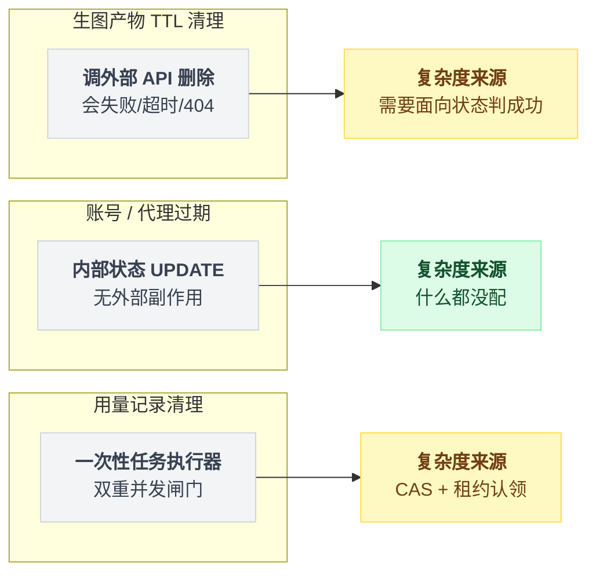
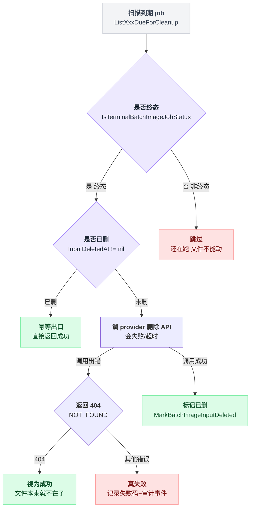
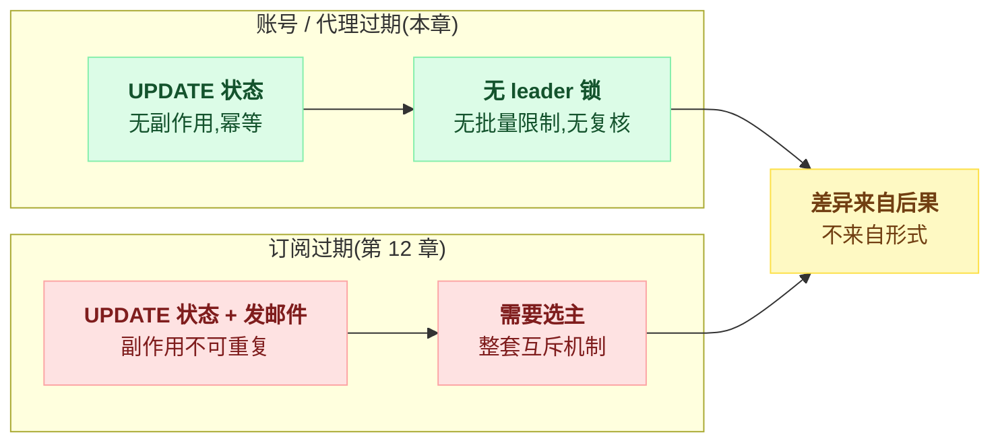
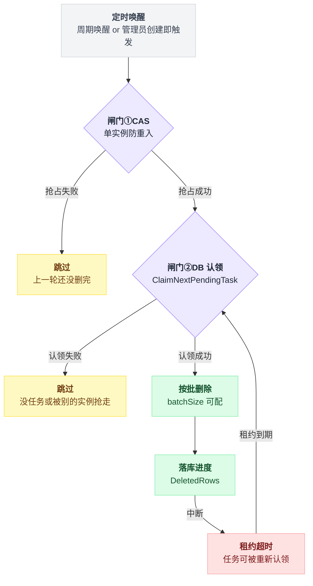

# 第 15 章:定时任务五——TTL 清理与外围过期服务

> 第二部分的收尾:三个不直接碰钱、却同属订单生命周期的定时任务。
> 它们展示了同一套纪律在低风险场景下的"简装版"用法——以及哪些复杂度可以省,哪些不能省。
> 源码:`batch_image_cleanup.go`、`account_expiry_service.go` / `proxy_expiry_service.go`、`usage_cleanup_service.go`。

---

三个任务的复杂度不是单调递减,是一路递减再变形:调外部 API 的清理最重,内部状态更新最轻,一次性任务执行器则跳到了另一个维度——它的复杂度不在"删什么",而在双重并发闸门。



## 15.1 生图产物 TTL 清理:调外部 API 的删除任务

### 问题

批量生图会在上游(如 GCS)留下两类文件:输入清单和生成的图片。任务结束后这些文件继续占存储、产生费用,还涉及数据保留合规。

所以要按 TTL 删。两类文件的保留期不一样,都可配:

| 文件类型 | 保留期(从终态起算) | 扫描方法 |
|---|---|---|
| 输入清单 | 24 小时 | `ListBatchImageJobsDueForInputCleanup` |
| 生成图片 | 72 小时 | `ListBatchImageJobsDueForOutputCleanup` |

删除要调 provider 的 API——这是它和第 13 章删自家表的本质区别:**删除动作本身会失败、会超时、会遇到"文件已经不在了"**。

### 做法

`BatchImageCleanupService` 每 30 分钟一轮,每轮每类最多 100 个:

```go
// RunOnce: 两次独立扫描
inputJobs  := repo.ListBatchImageJobsDueForInputCleanup(now - 24h, 100)
outputJobs := repo.ListBatchImageJobsDueForOutputCleanup(now, 100)
for job := range ... {
    cleanupJob(ctx, job, target, reason)   // 失败计数,继续下一个
}
```

真正的看点全在 `cleanupJob`。它的骨架就是一串防御,顺序不能乱:

```
函数 cleanupJob(job):
    if job 不是终态:            跳过            // 还在跑,文件绝不能动
    if job 已标记删除:          返回成功         // 幂等出口
    err = 调 provider 删除 API
    if err 是 NOT_FOUND/404:   返回成功         // 状态已达成
    if err != nil:             记失败码 + 写审计事件; 返回失败
    标记已删                                    // 一定在 API 成功之后
```

下面逐条说这几道防御各自在防什么。

**只清终态任务。** 输入清理要求 `IsTerminalBatchImageJobStatus(job.Status)`,输出清理要求 completed/failed/cancelled——一个还在跑的 job,文件绝不能动。

扫描 SQL 里虽然已经过滤了,动手前还要再验一遍。这是第 10 章纪律三的低配版:这里的复核不需要原子 UPDATE,因为删文件的竞争窗口无资金后果,重查一次状态就够。

**已删过的直接返回 nil。** `job.InputDeletedAt != nil` 就当成功——幂等出口,重复扫到不报错。

**上游 404 视为成功**(`cleanupErrorIsNotFound`):

```go
if cleanupErrorIsNotFound(err) { return nil }   // NOT_FOUND / 404:文件本来就不在了
```

这一行值得单独琢磨。删除的目标是"文件不存在"这个**状态**,而不是"执行一次删除"这个动作。上游说 404,状态已达成,就是成功。

若把 404 当失败,一个被手工删过文件的 job 会在失败名单里永远循环。**面向状态而非面向动作,是一切清理类任务幂等的根**。

**真失败:记录、审计、下轮再来。**

```go
repo.RecordBatchImageCleanupFailure(ctx, batchID, code, msg)   // 失败码落库
appendCleanupEvent(...cleanup_failed...)                        // 审计留痕
```

失败不重试、不入队——30 分钟后的下一轮扫描自然会再碰到它(`deleted_at` 还是空)。**扫描本身就是重试机制**,这是周期扫描相对队列的一个隐藏优势:失败恢复不需要额外基建。

但失败必须留痕。某个 job 连续失败几十轮,靠失败码和审计事件才能被发现是权限或路径问题,而不是静默循环到天荒地老。

**标记删除在 API 成功之后。** 顺序是 先调 provider 删除 → 成功才写 `MarkBatchImageInputDeleted`。

反过来写(先标记后删除)一旦删除失败,job 带着"已删"标记退出扫描范围,文件永久残留。

这看着和第 14 章"先转 failed 再退款"矛盾,其实同构:**哪一步不可回退,哪一步就放后面;两步都可回退时,把"退出扫描范围"的那步放最后**。

`cleanupJob` 里的这几道防御按先后顺序串成一条决策链:



## 15.2 上游账号 / 代理过期:最简形态的定时任务

`AccountExpiryService` 和 `ProxyExpiryService`(各每 60 秒)是全部任务里最简单的:

```go
updated, _ := s.accountRepo.AutoPauseExpiredAccounts(ctx, time.Now())
// 本质:UPDATE accounts SET status=paused WHERE expires_at <= now AND auto_pause 开启
```

存在的理由和排障有关。上游账号(购买的 Claude/OpenAI 订阅)有有效期,过期账号若继续留在调度池里,打过去的请求全部失败。

用户侧表现为莫名其妙的批量报错,而故障源头(某个账号昨天到期了)藏在几十个账号的列表里极难定位。定时置为 paused,让调度器(第 8 章讲过的快照体系)自然把它剔出去。

结构上值得注意的是它**什么都没配**——而每一项"没配"都有具体理由:

| 省掉的东西 | 为什么能省 |
|---|---|
| leader 锁 | 幂等 UPDATE,多实例同时跑无害 |
| 批量限制 | 账号表就几十上百行 |
| 动手前复核 | 置 paused 错了也只是保守,管理员可手动恢复 |

对照前几章的重装任务,这就是**复杂度与风险匹配**的示范——第 10 章的三条纪律,每一条都要先问"这个任务配得上吗",而不是无脑全上。

订阅过期(第 12 章)和它形状几乎相同,却因为带了发邮件这个副作用而多出一整套选主。**差异全部来自后果,不来自形式**:



## 15.3 用量记录清理:定时唤醒的一次性任务执行器

最后一个形态特殊:`UsageCleanupService` 不是周期性做同一件事,而是**执行管理员创建的一次性清理任务**(删某时间段、某用户的用量明细)。

定时器在这里只是唤醒机制:

```go
// 常驻:timing wheel 周期唤醒,看看有没有待执行的任务
timingWheel.ScheduleRecurring("usage_cleanup_worker", interval, s.runOnce)
// 即时:管理员刚创建任务,立刻触发一次,不等下个周期
go s.runOnce()
```

**创建即触发 + 周期兜底**:前者保证正常情况秒级开跑,后者保证"触发那一刻进程正好挂了"的任务不会永远 pending。又是"事件驱动主路径 + 定时兜底"的标准分层,只是这次事件源是管理员点按钮。

`runOnce` 内部两道并发闸门:

```go
// 闸门①:单实例内,CAS 防重入(上一轮还没删完,这一轮直接跳过)
if !atomic.CompareAndSwapInt32(&svc.running, 0, 1) { return }
defer atomic.StoreInt32(&svc.running, 0)

// 闸门②:跨实例,DB 认领抢占
task := svc.repo.ClaimNextPendingTask(ctx, taskTimeoutSeconds)
if task == nil { return }   // 没任务,或都被别的实例认领了
```

`ClaimNextPendingTask` 是第 6 章幂等抢占的任务版:一条原子 UPDATE 把 pending 任务标记为"我在执行,租约 N 秒"。两个实例同时醒来,只有一个抢到;抢到的实例死了,**租约超时后任务可被重新认领**——一次性任务的崩溃恢复不靠人工,靠租约。

执行阶段复用第 13 章的功课,按批删除(batchSize 可配),每批把进度落库:

```
认领到 task 之后:
    while 还有行可删:
        n = 按谓词删一批(batchSize)
        task.DeletedRows += n
        落库(task.DeletedRows)      // 每批都写,不是最后写
        if n == 0: 结束
```

关键在那句"每批都写":任务中断后重新认领,从计数处继续,不重头再来。

删除本身是幂等的(同一谓词删两遍,第二遍 0 行),所以"断点+重删几行"无害。**进度不需要精确,只需要单调。**

两道闸门加断点续传落库,把"唤醒—抢占—执行—崩溃恢复"串成一条闭环:



## 15.4 第二部分总结:定时任务设计的完整清单

六个任务走完,把第 10 章的三条纪律展开成可对照的自查清单:

**定位与节奏**
- [ ] 这个任务兜的是哪条主路径?主路径健康时它应当扫到零。("时间到期"类任务除外——那是定时器的合法主场)
- [ ] 周期与延迟容忍度匹配?(支付对账 60s,文件清理 30min——不是越快越好,是够用就好)
- [ ] 启动时先跑一轮,消化停机积压?
- [ ] 停止时等 goroutine 退干净(WaitGroup / done channel)?

**多实例**
- [ ] 每个步骤(不是每个任务)问过"重复执行的代价"?幂等 UPDATE/DELETE 不加锁,外部副作用必须选主
- [ ] leader 锁 TTL > 单轮最坏耗时?锁后端故障时降级为另一种互斥,而不是全员裸跑?
- [ ] 单实例内的重入(上轮未结束)有闸门?

**扫描与动手**
- [ ] List 出的候选,动手前有复核?后果越重,复核越硬(重查状态 → 条件 UPDATE 定罪)
- [ ] 批量有上限?打外部 API 的扫描更要限流
- [ ] "已处理"的判定面向状态而非动作?(404=成功,重复扫到=直接返回)
- [ ] 不可回退的步骤放在正确的位置,且越过之后绝不因附属失败而中断?

**失败**
- [ ] 错误处理强度与后果成正比?(垃圾多躺一轮:打日志;钱回不来:入队重试)
- [ ] 处理失败的对象会自然回到下一轮扫描范围吗?**会脱离扫描范围的失败,必须显式转交下一层兜底**
- [ ] 连续失败有留痕(失败码/审计/计数),不会静默循环?

---

(第二部分完)

回到第一部分总结:[第 9 章](./9_总结_决策树_自查清单_术语表.md) · 回到目录:[README](./README.md)
