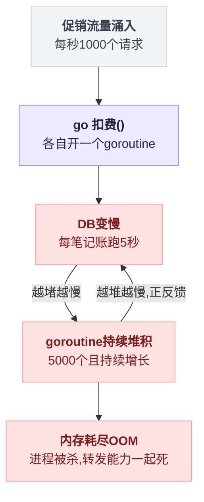
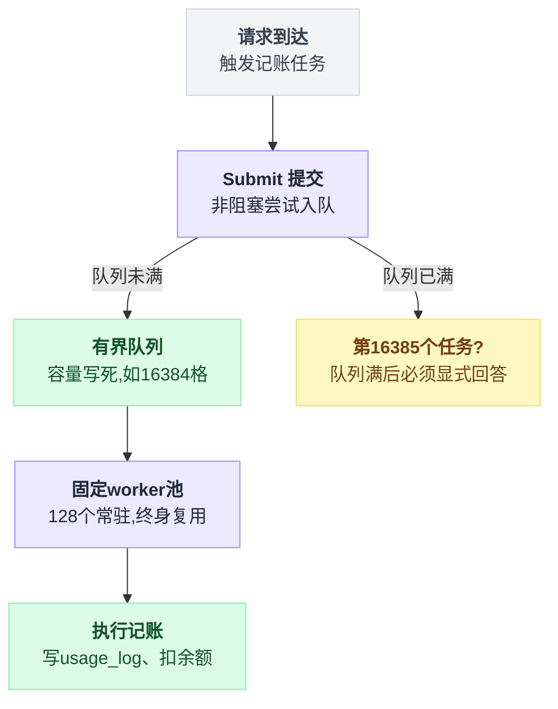
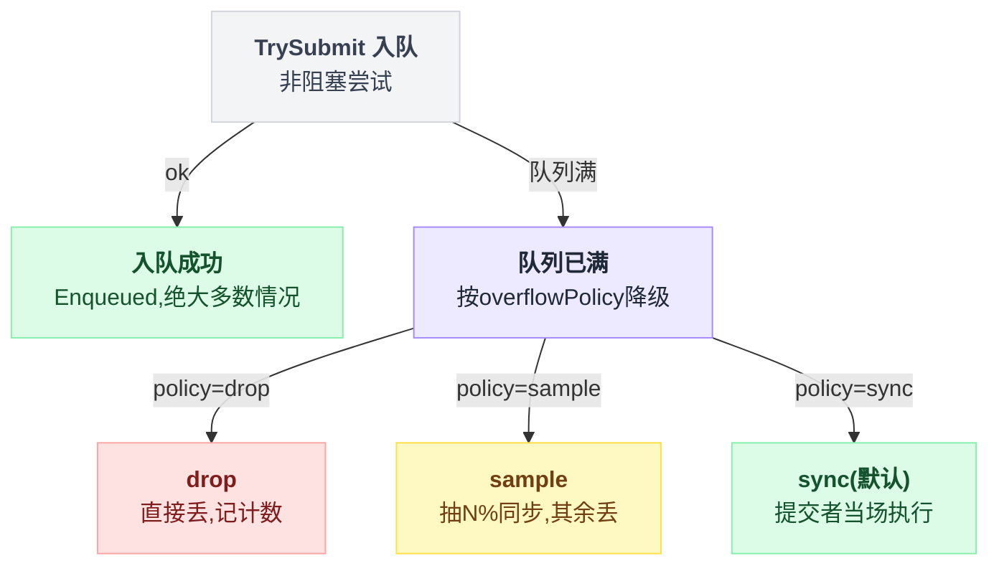
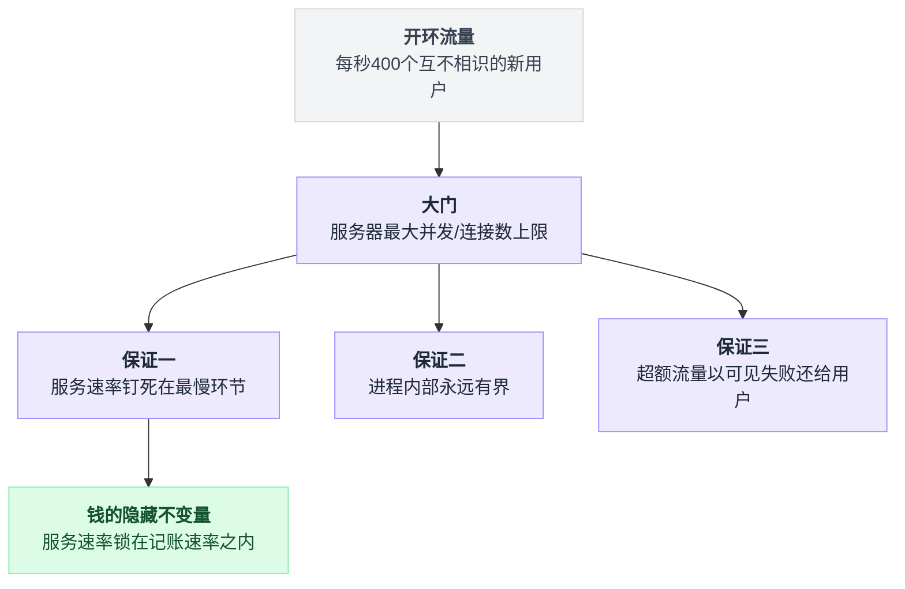
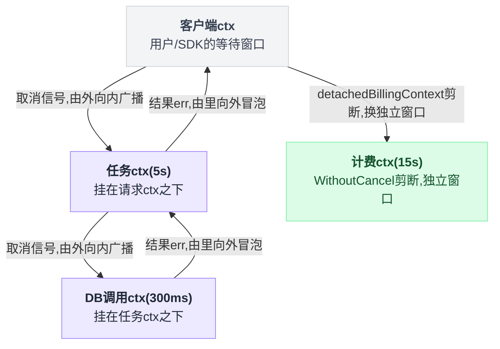
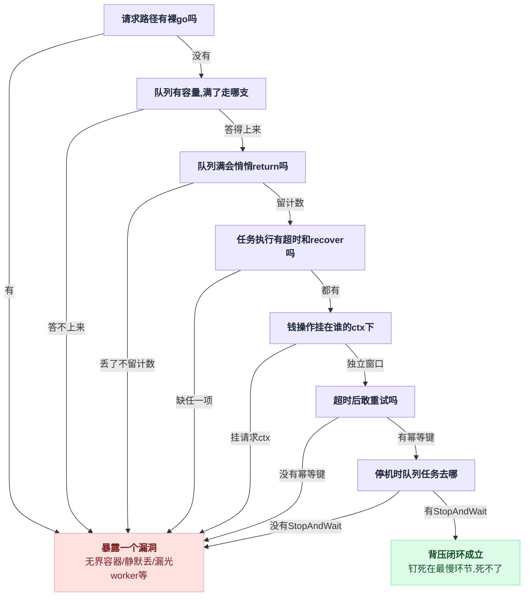

# 第 16 章:背压——有界队列与过载生存

> 前面各章解决"请求来了怎么写对"(第一部分)和"该来的事件没来怎么办"(第二部分)。
> 本章解决第三个暗面:**流量超过消化能力时,系统怎么不死,钱怎么不丢。**
> 解剖对象仍是 sub2api,核心文件 `backend/internal/service/usage_record_worker_pool.go`
> 与调用点 `backend/internal/handler/gateway_handler.go`。

---

## 16.1 从最自然的写法说起:`go 扣费()` 是怎么炸的

sub2api 的扣费发生在响应已经发给用户之后——用户拿到 AI 回复就走了,记账(写 usage_log、扣余额)天然适合异步。

最自然的写法一行搞定:

```go
go h.gatewayService.RecordUsage(...)   // 开个 goroutine 记账,不管了
```

平时没事。灾难需要两个条件同时满足,然后做一道乘法:

- 促销日流量上来:每秒 1000 个请求 → 每秒新开 1000 个记账 goroutine
- DB 变慢:每笔记账要跑 5 秒

同时在飞的 goroutine 数 = 1000/秒 × 5 秒 = **5000 个,且持续增长**——DB 越堵越慢,越慢积得越多,正反馈。

每个 goroutine 攥着闭包引用的响应对象、DB 连接、内存 buffer。半小时后 OOM,进程被杀,**连正常转发请求的能力一起死**。

**本质**:任何"A 产生任务、B 处理任务"的系统都有两个速度——生产速度 P 和消费速度 C。`P > C` 时,差额只有三个去处,没有第四种:

| 差额去哪 | 术语 | 后果 |
|---|---|---|
| ① 堆在中间 | 缓冲(buffer) | 无界 → 内存爆炸;有界 → 满了还是要面对 ②③ |
| ② 扔掉 | 丢弃(drop) | 数据没了,能不能接受看业务 |
| ③ 让生产者慢下来 | **背压(backpressure)** | 数据不丢,代价是上游变慢 |

`go` 一把梭 = 选了①的无界版。**缓冲不解决问题,只推迟问题**——它是减震器,不是发动机。

这道乘法怎么滚成正反馈,画出来是一条闭环:



## 16.2 有界池:把所有容器装上盖子

sub2api 用 [alitto/pond](https://github.com/alitto/pond) 构造"固定 worker + 有界队列":

```go
p.pool = pond.NewPool(
    opts.WorkerCount,                   // 默认 128 个常驻 worker
    pond.WithQueueSize(opts.QueueSize), // 默认 16384 格队列
)
```

自己写也只要三个模式:

```go
var queue = make(chan func(), 16384)      // ① 有界队列:容量写死 = 内存上限写死

for i := 0; i < 128; i++ {                // ② 固定 worker:启动时开好,终身复用
    go func() {
        for task := range queue { task() }
    }()
}
// ③ 从此请求路径上禁止出现裸 go 关键字
```

内存最坏情况 = 128 在跑 + 16384 在排,封顶。

但天花板逼出一个新问题:**第 16385 个任务来了怎么办?** 无界模式下这个问题不存在——所以炸的时候你都不知道自己做过选择;有界模式逼你显式回答。

出处:`usage_record_worker_pool.go:134`。这个结构和它逼出的问题画出来是这样:



## 16.3 队满三策略:溢出分支里写的是价值观

灵魂代码在 `Submit`,骨架就是一个 `select/default`:

```go
func (p *UsageRecordWorkerPool) Submit(task UsageRecordTask) UsageRecordSubmitMode {
    _, ok := p.pool.TrySubmit(func() { p.execute(task) })  // 非阻塞尝试入队
    if ok {
        return UsageRecordSubmitModeEnqueued   // 绝大多数时候到这就结束
    }
    switch p.overflowPolicy {                  // 队列满,按策略降级:
    case config.UsageRecordOverflowPolicySync:
        p.execute(task)                        // 提交者当场自己干 ← 背压本体
        return UsageRecordSubmitModeSync
    case config.UsageRecordOverflowPolicySample:
        if p.shouldSyncFallback() { p.execute(task); return ... }  // 抽 N% 同步
    }
    p.droppedQueueFull.Add(1)                  // 丢:但必须留计数 + 限频日志
    p.logDrop("full")
    return UsageRecordSubmitModeDropped
}
```

出处:`usage_record_worker_pool.go:146`。三条分支的取舍:

| 策略 | 队列满时 | 适合 |
|---|---|---|
| `drop` | 直接丢,记个数 | 丢了不心疼的(埋点、日志) |
| `sample` | 抽 N% 同步执行,其余丢 | 折中:保统计代表性 |
| `sync`(**默认**) | 提交者当场执行 | **钱,一单不能丢**(源码注释:issue #3656) |

`Submit` 里那个 `switch` 走成决策树是这样分岔的:



连"池子没配"这种异常,兜底都是同步执行而不是 `go` 一个(`gateway_handler.go`:"回退路径:worker 池未注入时同步执行,避免退回到无界 goroutine 模式")——整个代码库把无界这条路焊死了。

**不这样写的后果**:`drop` 用在钱上 = 服务了用户(上游 Claude 成本已花)却不记账,静默送钱,对账时才发现窟窿;无界 = 攒到 OOM 一次性全丢。

## 16.4 背压的机制:没有信号,只有占用

`sync` 乍看是倒退——异步池的意义不就是不阻塞请求线程吗?**是倒退,而且是故意的。**

但先纠正一个最常见的误解:

> 背压的"信号传回上游"**不是**发了什么通知。全程没有一个字节的通知被发出。
> 传播的是**占用**:下游的"满"通过阻塞冻结上游的资源,冻结的资源发不出新请求。

整个机制只有两行:

```
入队(任务):
    if 队列还有空格:  放进去,立刻返回        // 提交者秒回,毫无感觉
    else:            提交者当场自己执行      // ← 背压本体:提交者被冻在这里
```

### 逐帧看一次传导(最小系统:DB 1 槽 300ms/笔、1 worker、队列 2 格、5 个客户端每 50ms 来一个)

```
[   0ms] req1 入队→客户端1秒回      ║ DB槽:[req1] 队列:[]          干等的客户端:[]
[  50ms] req2 入队→客户端2秒回      ║ DB槽:[req1] 队列:[req2]      干等的客户端:[]
[ 101ms] req3 入队→客户端3秒回      ║ DB槽:[req1] 队列:[req2 req3] 干等的客户端:[]   ← 缓冲用光,还没人受伤
[ 152ms] ‼队列满!req4 handler自己干 ║ DB槽:[req1] 队列:[req2 req3] 干等的客户端:[4]  ← ★背压诞生
[ 202ms] ‼req5 同上                ║ 等DB:[req4 req5]             干等的客户端:[4 5]
[ 301ms] req1 完成,req4 抢到DB槽    ║ 队列空出一格(此刻若来 req6 仍可秒回——背压是逐格的)
[ 602ms] 客户端4 拿到响应(被卡450ms)
[ 903ms] 客户端5 拿到响应(被卡700ms)
```

152ms 那一刻,客户端 4 收到了什么?**什么都没收到**——它的 HTTP 请求只是迟迟不返回。"响应还没来"这件事本身就是背压抵达客户端的全部形态。

压力链竖起来看:

```
DB槽满 ──顶住──▶ handler阻塞 ──顶住──▶ HTTP响应缺席 ──顶住──▶ 客户端连接占线 ──▶ 发不出新请求
```

每个箭头都是一次**阻塞**,不是一条消息。整个系统只靠两条物理规则运转:容器满 → 新来者原地阻塞;容器空一格 → 等的人进来一个。

### 为什么上游"必然"减速:吞吐 = 并发 ÷ 延迟

客户端有 20 条连接、每条必须等到响应才发下一个,单次耗时被拖到 0.5 秒,则:

```
最大请求速率 = 并发 ÷ 延迟 = 20 ÷ 0.5s = 40 请求/秒
```

这是排队论的 Little's Law。服务器命令不了客户端减速,但它控制得了延迟;只要客户端并发有限(任何真实客户端都有连接池上限),**延迟变大 = 吞吐变小是算术,不是约定**。

实测:20 条循环连接打一个"DB 极限 40 笔/秒"的系统——

| 模式 | 请求速率 | 积压 |
|---|---|---|
| 无界 | 400/秒 | 每秒 +340,直线上涨 |
| 背压 | 自动收敛到 40/秒 | 不涨 |

没有任何代码写过"限流到 40",这个数字是从除法里涌现的。

### 独立用户(开环)场景:背压保证的三件事

现实流量不是 20 条循环连接,是每秒 400 个**互不相识的新用户**——A 被卡住拦不住 B 到达。

此时多一层"大门"(服务器最大并发,现实对应连接数/fd 上限/LB max conns):被卡住的 handler **占着大门席位不放**,新用户在门口排队,排到自己的耐心超时(连接超时)就离开。

实测(大门 50、用户耐心 1 秒):

| 观测项 | 数值 |
|---|---|
| 服务成功 | 40/秒(=DB 极限) |
| 超时离开 | 360/秒 |
| 在飞任务 | 钉死 54 |
| goroutine | 钉死 456 |

开环下背压做不到"让想来的人变少",它保证的是:

1. **服务速率钉死在最慢环节的能力上**;
2. **进程内部永远有界**(任务能待的每个位置都有容量:DB 槽 + 队列 + 被阻塞的 handler ≤ 大门席位,逐项求和封顶);
3. **超额流量以可见的失败(超时/429)还给用户**,而不是吞进内存变 OOM,也不是收下请求再偷偷丢账。

对钱还有一条隐藏不变量:**服务速率被锁在记账速率之内**。被拒之门外的用户没消耗上游成本,无账可记;进了门被服务的,账同步记下。serve 和 bill 强制同频,账本天然平。

这才是 `sync` 策略的完整含义。三件事加这条隐藏不变量连起来是这样:



## 16.5 超时的洋葱模型:两条单行道

分层(客户端 → 大门 → 队列 → worker → DB)之后必然遇到的问题:**中心超时了,会往外传染吗?队列里的任务谁去移除?**

> 洋葱上只有两条单行道:
> **取消信号(ctx)从外向内广播**——外层的钟响,里层挂在这棵 ctx 树上的操作全部中断;
> **结果(return err)从里向外冒泡**——里层的钟响,它 return 一个错误,外层解除阻塞后**自己决定**下一步。
> 没有第三条路。

两条道的方向和责任归属:

| 谁的钟先响 | 走哪条道 | 里层发生什么 | 外层发生什么 |
|---|---|---|---|
| 外层 | 取消信号,由外向内广播 | 挂在这棵 ctx 树上的操作全部中断 | 不用做什么,是它先死的 |
| 里层 | 结果 err,由里向外冒泡 | return 一个普通错误值 | 解除阻塞,**自己选**要不要继续外冒 |

两条单行道叠在客户端 ctx、任务 ctx、DB 调用 ctx、被剪断独立出去的计费 ctx 这四层上,画出来是这样:



### 里层超时不会自动传染外层

```go
err := callDB(outerCtx, 300*time.Millisecond)  // 里层带自己的 300ms 钟
if err != nil {
    // 超时"传"出来的唯一形态就是这个普通返回值。传染与否在这里【选】:
    // 重试 / 降级 / 记日志放弃(sub2api 对扣费失败选这个) / return err 才继续外冒一层
}
```

### 外层超时才会传染里层——靠建钟时挂在谁下面

```go
ctx, cancel := context.WithTimeout(parent, myTimeout)
//                                 ^^^^^^ 挂 parent 之下 = 签"外层死我陪葬"协议
```

`WithTimeout(parent, d)` 的 ctx 在**两钟先到者**触发。而 sub2api 对钱的操作故意剪断这根线:

```go
func detachedBillingContext(ctx context.Context) (context.Context, context.CancelFunc) {
    base := context.WithoutCancel(ctx)              // 剪断从外向内的传染
    return context.WithTimeout(base, 15*time.Second) // 换自己的独立窗口
}
```

出处:`gateway_usage_billing.go:475`。

客户端断开、worker 池 5 秒任务钟到期,都不许取消扣费——**用户拿到了 AI 回复就不能免单**。每层超时各管各的资源,唯独钱的窗口单独算、最宽。

### 队列里的任务没有钟

躺在队列里的任务是死数据,没有计时器为它跑;Go channel 也无法从中间移除元素。正确做法是**惰性丢弃**:

```go
queue <- job{task, time.Now().Add(deadline)}                  // 入队:死线装进任务
// worker 出队后:
if time.Now().After(j.deadline) { expired.Add(1); continue }  // 先验尸再干活
```

sub2api 的扣费队列没做这个——扣费任务永不过期。deadline 不是队列的属性,是任务的业务属性。

### 四层超时速查

| 层 | 超时是谁的 | 保护什么 | 到期动作 |
|---|---|---|---|
| ① 客户端等响应 | 用户/SDK | 用户的时间 | 用户走人;服务端 `WithoutCancel` 无视,扣费继续 |
| ② 任务 5s | worker 池 | worker 坑位不被挂死任务占住 | 中断任务、释放 worker |
| ③ 扣费 15s | 计费核心 | 钱的最后独立窗口 | return err → Error 日志带全 user_id/api_key_id 等线索,人工可补 |
| ④ 不确定性 | — | 防"假失败重试"变双扣 | request_id 幂等(`ON CONFLICT DO NOTHING`),重试安全 |

第 ④ 层是精髓:超时 ≠ 失败——DB 可能已提交只是确认没回来。**先让操作幂等(可安全重做),才谈得上超时后怎么办**(与第 6 章的幂等键同源)。

真超时到底的账,sub2api 的处理是诚实的:自动路径丢了,Error 日志留全对账线索——可见的丢和静默的丢是两个物种。

## 16.6 工程收尾:真实代码比玩具多出来的 500 行

**每任务超时 + panic 隔离**(`execute`):没有超时,一条挂死连接永久占一个 worker,128 个逐个"漏光";没有 recover,一个任务 panic 带走整个进程。ctx 从 `context.Background()` 派生——请求 ctx 早已 cancel,扣费不能陪葬。

**自动扩缩容**(`autoScaleTick`):扩容急、缩容怂,就这一条规律,写成循环是——

```
每 3 秒:
    if 队列水位 > 70%:                        worker 数 += 步长,最多扩到 512
    if 队列空 且 利用率 ≤ 15% 且 距上次缩容 ≥ 10s:  才允许缩一档
```

缩容条件苛刻得多,是为了防高负载边缘震荡。它的存在让"队满同步"是最后手段而非常态。

**丢弃日志限频**(`logDrop`):CAS 保证 5 秒最多一条,数字全进原子计数器由 `Stats()` 暴露——否则队满时每秒几百条日志先把日志系统打死。

**优雅停机**(`Stop`):`StopAndWait()` 把已排队任务跑完再退,不然重启一次 = 丢一队列的账(与第二部分"进程会死"呼应)。

## 16.7 自查清单

审查任何异步代码,按顺序问:

1. **请求路径上有裸 `go` 吗?** 有 → 就是那个没盖子的容器,过载时死整个进程。
2. **队列有容量吗?满了走哪个分支?** 答不上来 = 没有背压。`select/default` 的 `default:` 里写的就是价值观:日志可 drop,统计可 sample,**钱必须 sync——宁可退化成当场慢慢做,不能在中间偷偷扔**。
3. **每个"队列满 → 悄悄 return"** 都问一句:这东西丢了真的没事吗?丢可以,但必须留计数(可见的丢),不能静默。
4. **任务执行有超时吗?有 recover 吗?** 缺前者漏光 worker,缺后者炸进程。
5. **钱的操作挂在谁的 ctx 下?** 挂请求 ctx = 客户端一断就丢账;要 `WithoutCancel` + 独立窗口。
6. **超时后敢重试吗?** 敢的前提是幂等键;没有幂等,超时的"不确定性"两头都是坑。
7. **停机时队列里的任务去哪?** 没有 StopAndWait,每次发版都在丢账。

七问串成一条链,任何一环答不上来就是漏洞:



> 一句话带走:**异步任务必须用有界的池子;队列满时的选择暴露价值观;背压没有信号只有占用——
> 让每个容器都有盖子,满了选择"顶住上游"而不是"丢弃"或"新建容器",
> 系统的产出就自动钉死在最慢环节的能力上,而进程永远死不了。**
</content>
</invoke>
