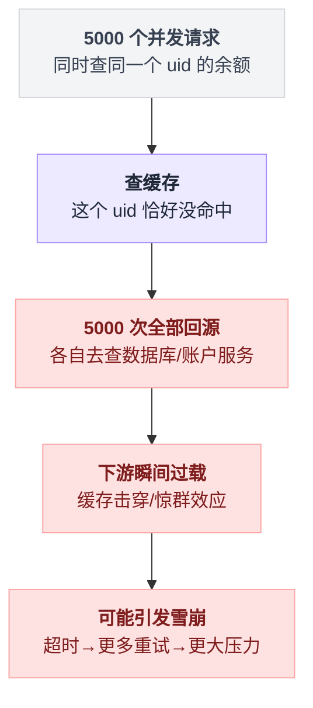
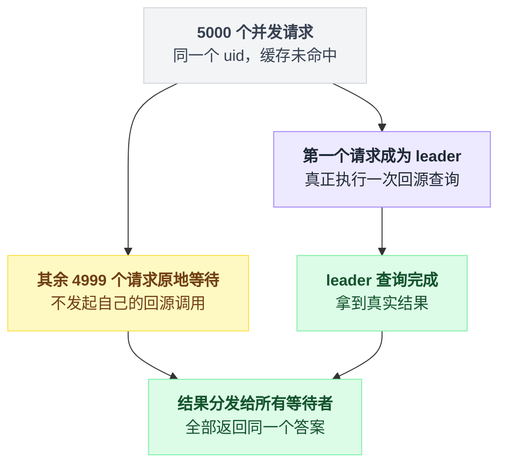
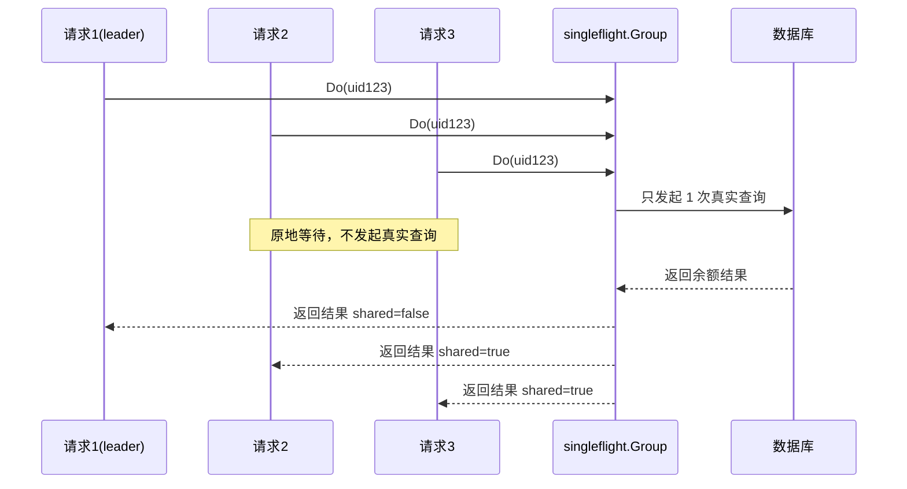
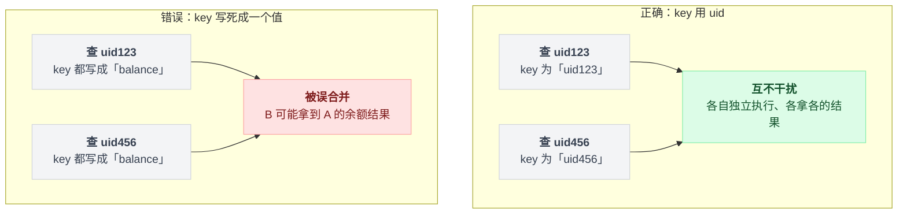
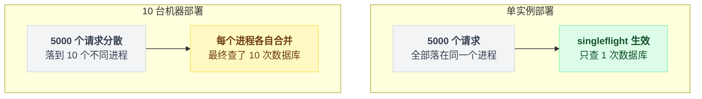

# singleflight 到底是什么？——从一次"缓存击穿"事故讲起

> 本系列番外。目标读者：完全没接触过 singleflight 的小白。读完这篇文档，你应该能看懂并解释[第 6 章](./6_实战案例三_高并发余额扣费全链路.md)准入层表格里的这一行：
>
> `准入读余额 │ 缓存优先,回源合并 │ singleflight.Do(uid) + background ctx`

---

## 1. 先讲一个场景，别急着看定义

假设你在做一个"用户余额查询"接口（对应第 6 章准入层的"准入读余额"）。逻辑很朴素：

1. 先查缓存（Redis）；
2. 缓存没有（没命中），就"回源"——去查数据库或者调用账户服务；
3. 查到之后写回缓存，再返回给用户。

写成代码大概就是这么一小段：

```
v = cache.get(uid)
if v 命中:  return v
v = 回源查库或调账户服务(uid)
cache.set(uid, v)
return v
```

单个请求来看，这个逻辑完全没问题。

但线上系统从来不是"单个请求"。

### 1.1 事故是怎么发生的

想象某个大 V 用户的余额缓存突然过期（或者服务刚启动、缓存是空的）。这一瞬间，有 5000 个并发请求同时来查询**同一个 uid** 的余额。

问题出在上面那段代码是**每个请求各跑一遍**的。因为缓存里还没有值，这 5000 个请求会**同时**发现"没命中"，于是**同时**走到第三行去"回源"——也就是 5000 次数据库查询、5000 次账户服务调用，几乎在同一毫秒内打到下游。

这就是经典的**缓存击穿（cache breakdown）**，也叫 **惊群效应 / dog-piling / thundering herd**。

下游服务（数据库、账户服务）本来只需要处理 1 次查询就够了，结果被同一个请求"复制"了 5000 份，瞬间被打垮，甚至引发雪崩（下游超时 → 更多重试 → 更大压力）。

这个"1 次查询变 5000 次"的过程画出来是这样：



### 1.2 我们真正需要的是什么

仔细想想，这 5000 个请求要的其实是**同一个答案**——"uid=123 现在余额是多少"。

既然答案只有一个，我们完全没必要真的去查 5000 次数据库，只要：

- 让**第一个**发现缓存没命中的请求去真正查一次数据库；
- 其他 4999 个请求**原地等待**，等第一个请求查完，把结果**分享**给它们；
- 全部返回同一个结果。

这件"把重复的并发请求合并成一次真实执行，然后把结果分发给所有等待者"的事情，就是 **singleflight** 要做的。

对应到刚才的 5000 个请求，变化是这样的：



---

## 2. singleflight 是什么

**singleflight** 是 Go 官方扩展库 `golang.org/x/sync/singleflight` 提供的一个并发控制工具（其他语言里也有类似实现，思路通用）。

一句话定义：

> 对于同一个 **key**，如果已经有一次调用正在执行，后来的相同 key 的调用不会重新执行，而是**阻塞等待**，共享第一次调用的结果。

把这句定义摊开成流程，就是每次调用进门时的一次分岔：

```
调用进来，带着 key:
    if 这个 key 已经有一次调用正在飞行中:
        原地阻塞，等那次飞行结束
        return 那次的结果, shared = true      // 蹭到的
    否则:
        给这个 key 占位，标记"起飞"
        结果 = 真正执行一次 fn()               // 同一 key 同一时刻只跑这一次
        把结果发给所有排队的等待者
        清掉占位
        return 结果, shared = false           // 自己干的
```

所以"合并"是按 key 分组的，而且只对**并发中**的调用生效——这两点后面第 6 节的坑都从这里长出来。

生活中的类比：

- 你和邻居家都想知道"今天小区门口那趟公交几点到"。
- 你俩几乎同时给公交公司客服打电话。
- 客服说："已经有一位业主在问了，请稍等，我查到后一起告诉你们俩。"
- 于是客服只查了**一次**，你和邻居拿到的是**同一个答案**。

singleflight 就是那个"客服"角色——它站在你的业务代码和"真正昂贵的操作"（查数据库、调远程服务、算一个耗时任务）之间，负责按 key 去重、合并、分发结果。

把"客服"类比换成具体的 3 个并发请求，时序是这样的：



---

## 3. 核心 API：`Do` 长什么样

`singleflight.Group` 是核心结构，最常用的方法是 `Do`：

```go
import "golang.org/x/sync/singleflight"

var g singleflight.Group

func GetBalance(uid string) (int64, error) {
    // key 用 uid，代表"同一个 uid 的并发查询要合并"
    v, err, shared := g.Do(uid, func() (interface{}, error) {
        // 这个函数体，同一个 key 在同一时间只会真正执行一次
        return queryBalanceFromDB(uid)
    })
    if err != nil {
        return 0, err
    }
    return v.(int64), nil
}
```

`Do` 签名大致是：

```go
func (g *Group) Do(key string, fn func() (interface{}, error)) (v interface{}, err error, shared bool)
```

参数和返回值：

| 位置 | 名字 | 是什么 |
|---|---|---|
| 参数 | `key string` | 去重的依据，相同 key 的并发调用会被合并 |
| 参数 | `fn func() (interface{}, error)` | 真正"昂贵"的操作，比如查库、发 RPC |
| 返回 | `v` | 结果值，所有等待者拿到同一份 |
| 返回 | `err` | 错误，fn 出错时所有等待者拿到同一个 |
| 返回 | `shared bool` | 这次结果是不是"和别人共享"来的 |

三点补充。不同 key 之间互不影响、正常并发执行；在余额查询场景里，key 就是 `uid`，因为"合并"只应该发生在"查同一个用户"的请求之间，不同用户的查询必须各查各的。

`fn` 的那句"同一 key 在同一时刻只会被执行一次"，是这整个工具存在的理由。

`shared == true` 说明你不是第一个发起者，是蹭到了别人的结果。

还有两个常用方法：

| 方法 | 作用 |
|---|---|
| `DoChan(key, fn)` | 和 `Do` 效果一样，但返回一个 channel，适合需要"非阻塞地拿结果"或配合 `select` 使用的场景 |
| `Forget(key)` | 主动清除某个 key 当前正在进行的"占位"，之后新的调用会重新触发一次真正执行（不常用，一般用于纠错场景） |

---

## 4. 逐词拆解开头那一行

```
准入读余额 │ 缓存优先,回源合并 │ singleflight.Do(uid) + background ctx
```

现在你已经有了背景知识，我们把它拆成三段来看。先给张地图：

| 片段 | 它在说什么 |
|---|---|
| 准入读余额 | 业务场景 |
| 缓存优先，回源合并 | 策略 |
| singleflight.Do(uid) + background ctx | 实现手段 |

三段里只有最后半句 `+ background ctx` 值得停下来细看，前面两段读一遍就过。

### 4.1 "准入读余额"

这是**业务场景**：一个读接口，作用是查询"是否准入"所需要的余额信息（比如判断用户余额是否够用来决定能不能进入某个流程）。

这是"读多写少、对下游敏感"的典型场景——正是容易发生缓存击穿的地方。

### 4.2 "缓存优先，回源合并"

这是**策略**：

- **缓存优先**：先查缓存，缓存命中就直接返回，性能最好，也最省下游资源。
- **回源合并**：缓存没命中时才去"回源"（查数据库/查账户服务），而且对"回源"这个动作做**合并**——多个并发的未命中请求，只发起一次真正的回源调用。

"合并"这两个字，就是在提示你：这里用了某种去重机制，而不是"缓存没命中就各查各的"。

### 4.3 "singleflight.Do(uid) + background ctx"

这是**实现手段**，两个关键点。

**(a) `singleflight.Do(uid)`**

前面已经讲过：用 `uid` 作为 key，把"同一个用户"的并发回源请求合并成一次真正的数据库/RPC 调用，其余请求等待并共享结果。这正是第 4.2 节"回源合并"的具体实现。

**(b) `+ background ctx`（这是最容易让新手困惑的一点，重点讲）**

先说结论：**singleflight 里那个真正去执行 `fn` 的调用，不应该用发起者的 `request context`，而应该用一个独立的 `context.Background()`（或者从它派生的、生命周期够长的 ctx）。**

为什么？我们回到"客服合并电话"的类比。

假设 5000 个请求里，第 1 个请求（真正触发 `fn` 执行的那个）所在的 HTTP 请求，**因为用户提前关闭了页面/网络抖动被取消了**。如果 `fn` 里用的是第 1 个请求自己的 `ctx`（这个 ctx 会随着请求结束而被 `cancel()`），那么：

- 第 1 个请求一取消，`fn` 里发往数据库的调用会因为 `ctx.Done()` 被打断，直接返回 `context canceled` 错误；
- 但此时还有 4999 个请求在**等着这个结果**！它们的浏览器/连接都还活着，本来是能正常拿到余额的；
- 结果因为"最先发起的那个人挂了电话"，导致**所有排队等答案的人都收不到答案**，只能拿到一个莫名其妙的 `context canceled` 错误。

两种写法的差别只有 `fn` 里那一个变量：

```
错的：
    Do(uid, fn = {
        查库(reqCtx)          // reqCtx 属于第 1 个请求
    })
    第 1 个请求断开 → reqCtx.cancel() → 查库中断 → 4999 个等待者一起吃 context canceled

对的：
    Do(uid, fn = {
        bgCtx = Background() 加超时
        查库(bgCtx)           // 不属于任何一个请求
    })
    第 1 个请求断开 → bgCtx 毫无感觉 → 查库跑完 → 所有等待者拿到正确余额
```

这就是典型的"用错 context 导致连带失败（error propagation 误伤无辜请求）"的坑。

两种做法在"leader 提前断开"这一步会走向完全不同的结局：

```mermaid
flowchart TD
    subgraph WRONG["错误：fn 里用请求1自己的 reqCtx"]
        A1["<b>fn 内查库</b><br/>用的是请求1的 reqCtx"]
        A2["<b>请求1提前断开</b><br/>reqCtx 被 cancel"]
        A3["<b>fn 内查询被打断</b><br/>返回 context canceled"]
        A4["<b>4999 个等待者全部收到</b><br/>同一个错误，无辜被连累"]
        A1 --> A2 --> A3 --> A4
    end
    subgraph RIGHT["正确：fn 里用独立的 bgCtx"]
        B1["<b>fn 内查库</b><br/>用的是独立的 bgCtx"]
        B2["<b>请求1提前断开</b><br/>bgCtx 不受影响"]
        B3["<b>fn 内查询正常完成</b><br/>拿到真实结果"]
        B4["<b>所有等待者都拿到</b><br/>正确的余额结果"]
        B1 --> B2 --> B3 --> B4
    end

    classDef main fill:#ede9fe,stroke:#a78bfa,color:#1f2937
    classDef data fill:#dcfce7,stroke:#86efac,color:#14532d
    classDef entry fill:#f3f4f6,stroke:#d1d5db,color:#374151
    classDef danger fill:#fee2e2,stroke:#fca5a5,color:#7f1d1d
    classDef note fill:#fef9c3,stroke:#fde047,color:#713f12
    class A1,A2 main
    class A3,A4 danger
    class B1,B2 main
    class B3,B4 data
```



所以正确做法是：`fn` 内部发起下游调用时，使用一个**独立于任何单个请求的 context**——通常是 `context.Background()`，或者基于它加一个合理的超时（比如 `context.WithTimeout(context.Background(), 2*time.Second)`），这样：

- 这次"合并后的真实回源调用"的生命周期，**不跟随**任何一个具体请求的取消而取消；
- 它只会因为自己设置的超时、或者业务层面主动 `Forget` 才结束；
- 所有等待者，不论自己的请求后来是否被取消，只要 `fn` 正常返回，都能拿到同一份正确结果（至于某个请求自己已经断开连接、结果送不出去，那是另一回事，不影响其他等待者）。

一句话总结这半句："合并执行的那次真调用，要用一个'不属于任何单个请求、独立生命周期'的 context，避免因为某个请求提前取消而拖累所有共享结果的其他请求。"

---

## 5. 完整示例：把整行代码串起来

```go
package balance

import (
    "context"
    "time"

    "golang.org/x/sync/singleflight"
)

var sfGroup singleflight.Group

// GetBalance 提供"准入读余额"接口调用
// 策略：缓存优先，未命中则回源合并
func GetBalance(reqCtx context.Context, uid string) (int64, error) {
    // 1. 缓存优先
    if v, ok := readFromCache(uid); ok {
        return v, nil
    }

    // 2. 缓存未命中 -> 回源合并
    // key 用 uid：同一个用户的并发回源请求会被合并成一次
    result, err, shared := sfGroup.Do(uid, func() (interface{}, error) {
        // 关键点：这里不要用 reqCtx（某个具体请求的 ctx）
        // 而是用一个独立的 background ctx，避免"第一个请求取消"
        // 连累其他还在等待结果的请求
        bgCtx, cancel := context.WithTimeout(context.Background(), 2*time.Second)
        defer cancel()

        balance, err := queryBalanceFromDB(bgCtx, uid)
        if err != nil {
            return nil, err
        }

        // 查到之后顺手回写缓存，下次直接命中
        writeToCache(uid, balance)
        return balance, nil
    })

    if err != nil {
        return 0, err
    }

    _ = shared // shared==true 表示这次结果是蹭别人合并来的，可用于打日志/监控
    return result.(int64), nil
}
```

注意这里 `reqCtx`（调用方传进来的、可能被取消的请求 ctx）**只用于函数最外层的参数**，真正塞进 `sfGroup.Do` 里 `fn` 内部去查库的，是独立的 `bgCtx`。这正是"+ background ctx"这半句要强调的实践。

---

## 6. 常见坑（新手容易踩的点）

五个坑，先看清单，再逐条展开：

| # | 坑 | 后果 |
|---|---|---|
| 1 | key 设计错了 | 不同用户被误合并，严重 bug |
| 2 | 用了请求自身的 ctx | 一个请求取消，连累所有等待者 |
| 3 | `fn` 里 panic 没 recover | 影响所有在等待的调用方 |
| 4 | 把它当限流/防重放/缓存用 | 先后发生的两次调用照样各执行一次 |
| 5 | 忘记它是进程内的 | 多实例部署时不是"全局只查一次" |

1. **key 设计错了**：如果 key 设计得太粗（比如所有用户共用一个 key `"balance"`），会导致不同用户的查询也被"误合并"，A 查到的余额可能被当成 B 的结果返回——这是严重 bug。key 一定要能唯一标识"这次要查的是什么"（这里是 `uid`）。

两种 key 设计方式的差别：



2. **用了请求自身的 ctx 导致连带取消**：上一节详细讲过，切记 `fn` 内部要用独立的、生命周期不依赖单个请求的 ctx。

3. **`fn` 里发生 panic**：`fn` 内部如果 panic 且没有 recover，会影响所有在等待的调用方，一定要在 `fn` 里做好 `recover`，把 panic 转成 error 返回。

4. **误以为 singleflight 能防止"限流/防重放"**：singleflight 只合并"并发中"的相同 key 调用。如果两次调用**先后发生**（第一次已经返回了），第二次还是会重新触发 `fn`，它不是缓存，不会帮你"记住"结果，需要配合真正的缓存层使用（就像本例：查完之后还要 `writeToCache`）。

时间轴摆出来更直观：

```
并发：  Do(u1) ┐
        Do(u1) ┴─→ fn 执行 1 次        ← 合并
先后：  Do(u1) ─→ fn 执行；返回
        Do(u1) ─→ fn 又执行一次        ← 不合并，它不是缓存
```

5. **忘记它是进程内的**：`singleflight.Group` 的合并只在**同一个进程/同一份内存**里生效。如果你的服务部署了多个实例，A 实例和 B 实例各自的 singleflight 互不知情，5000 个请求如果分散到 10 台机器，每台机器上还是可能各查一次数据库（10 次而不是 5000 次，已经好很多，但不是"全局只查一次"）。如果需要"全局唯一"，需要配合分布式锁等其他机制。

部署形态一变，"只查一次"的边界也跟着变：



---

## 7. 总结

用一句话记住 singleflight：

> **同一个 key 的并发调用，只让一个人真正去干活，其他人排队分享结果——干活时用的 context，不能是某个具体请求会被取消的 context。**

回到最开始那句话，现在你应该能完整解释它了：

- **准入读余额**：这是一个查余额的读接口；
- **缓存优先，回源合并**：先查缓存，缓存没命中时，把并发的回源请求合并成一次；
- **singleflight.Do(uid) + background ctx**：用 `uid` 做 key 实现合并，合并后真正执行的那次调用要用独立的 background context，避免被某个请求的取消连累到其他等待者。
