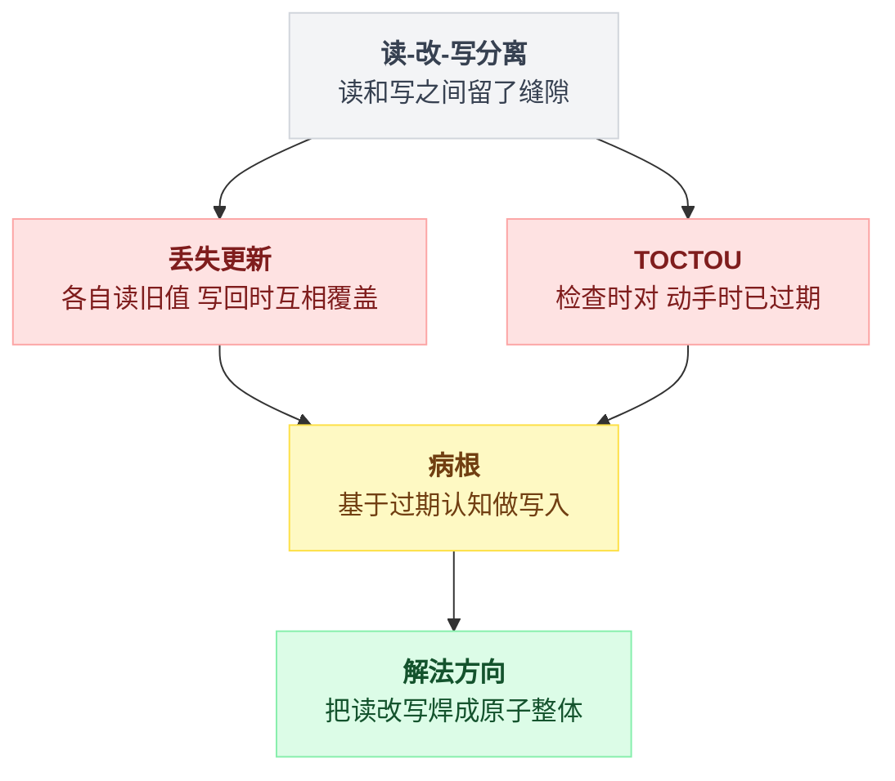
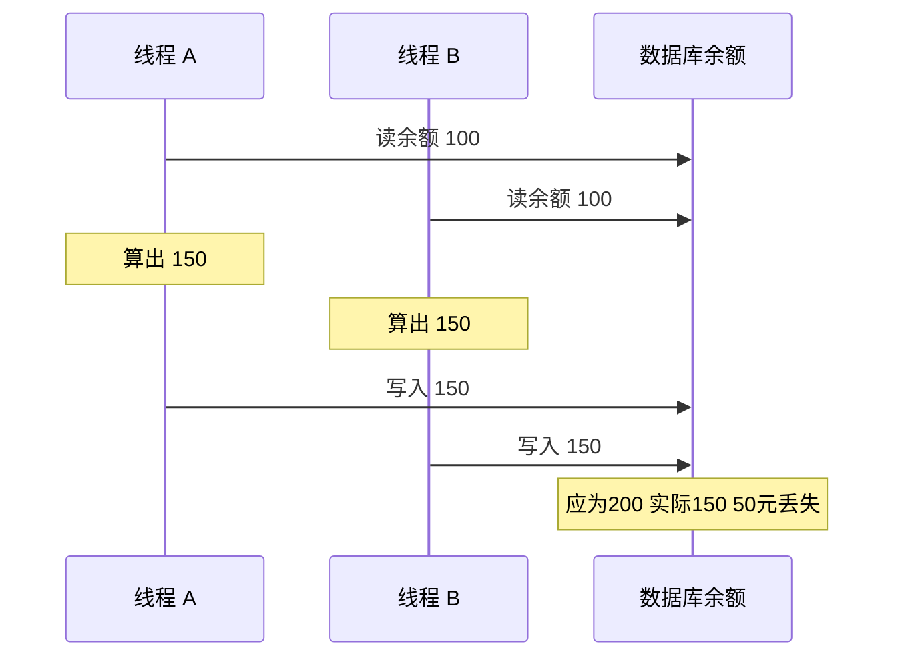
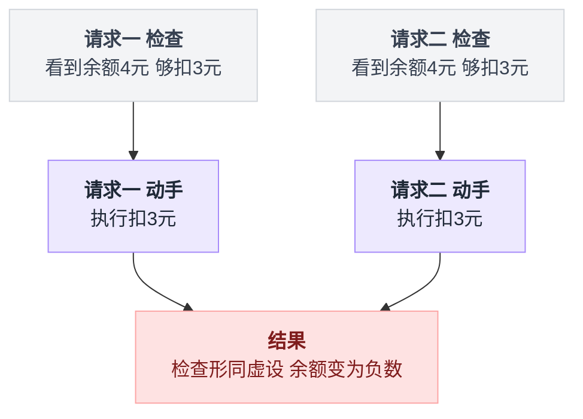
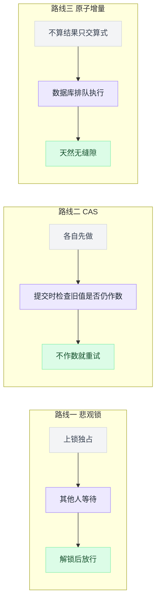

# 第 1 章:从一个丢钱的 bug 说起——并发问题入门

> 本章说明两个核心概念:**丢失更新(Lost Update)**与 **TOCTOU**。
> 它们是后续所有章节的敌人,也是全书大部分"为什么"的答案所在。

---

一句话骨架:**读-改-写分离**这一个动作,同时长出了丢失更新和 TOCTOU 两个马甲;两个马甲下面是同一个病根——**基于过期的认知做写入**;药方也只有一个方向——**把读改写焊成原子整体**。

两个概念背后是同一个病根,先画一张图搭个框架,细节后面逐段展开:



## 1.1 一段看起来完全没问题的代码

以充值系统为例。账户余额 100 元,用户存入 50 元。最直接的实现:

```go
balance := readBalance()      // ① 读:从数据库读出余额 100
balance = balance + 50        // ② 改:在内存里算 100 + 50 = 150
writeBalance(balance)         // ③ 写:把 150 写回数据库
```

这三步的学名是 **read-modify-write(读-改-写)**。

单人使用时它工作正常,单元测试跑一百遍也不会出错。

真正要盯的不是这三行本身,而是三行之间那两处**没写出来的东西**:

```
读:  balance = db.read()       →  拍下一张余额的照片
     ───────── 缝隙 ─────────      别人可以在这里改数据库,你不会知道
改:  balance = balance + 50    →  拿照片算,不看数据库
     ───────── 缝隙 ─────────      别人还可以在这里改
写:  db.write(balance)         →  用照片算出的结果,整体覆盖
```

关键字是"整体覆盖":第三步写回去的不是"+50"这个动作,而是一个算好的数。这个数只要基于旧照片,就会把别人在缝隙里做的事一并抹掉。

## 1.2 两个请求同时到达,钱丢了

现在两个请求**同时**给同一账户各存 50 元。正确结果应为 100 + 50 + 50 = 200。

实际执行时序(时间从上往下):

```
时刻   线程 A                  线程 B                 数据库里的余额
 1     读到 100                                            100
 2                             读到 100                     100
 3     算出 150                                            100
 4                             算出 150                     100
 5     写入 150                                            150
 6                             写入 150                     150   ← 应该是 200
```

**50 元凭空消失。** 这个现象称为**丢失更新(Lost Update)**。

把这张表格换成时序图,两个线程和数据库之间的交互更清楚:



### 丢失的原因

关键在时刻 2:线程 B 读到的 100,在它写回(时刻 6)时**已经过期**——A 在时刻 5 已把余额改成 150。

B 并不知情。它拿着自己在时刻 2 拍下的"旧照片"算出 150,整体覆盖上去,把 A 的成果抹掉了。

注意两个线程各自看都没错:各读各的,各算各的,算术也都对。错的是它们凑在一起的那一瞬。

病根一句话:

> **"读"和"写"之间存在一条缝隙,其他执行流可以插进来。**
> 只要读-改-写三步不是一个不可分割的整体,并发下必然丢更新。

### 这类 bug 的危险之处

| 危险点 | 具体表现 |
|---|---|
| 测不出来 | 单人测试永远不并发,永远无法复现 |
| 无声无息 | 不报错、无异常日志,只是数字悄悄不对 |
| 上量才爆发 | 用户少时概率极低,业务规模上去后突然频繁出现 |
| 丢的往往是钱 | 换成扣费场景,就是"扣了两笔钱、余额只少一笔",月底对账对不上 |

第二条最要命:它不像空指针那样当场把你叫醒,它只是让数字慢慢不对,等你从对账单反推回来时,已经过去一个月了。

## 1.3 同一个病的另一个马甲:先检查再动手

一个常见的补救思路是在动手前加判断,例如扣费前先检查余额:

```go
if 余额 >= 3 {      // ① 检查:够
    扣 3 元          // ② 动手:扣
}
```

**同样的病。** 两个并发请求都在①看到"余额 4 元,够扣 3 元",随后都执行②,余额变成 -2——检查形同虚设。

把它抽象一下,和 1.1 那张缝隙图是同一张:

```
if 检查(当前状态) 通过:
     ───────── 缝隙 ─────────    世界在这里变了,上面那句检查的结论作废
     动手(当前状态)              但代码已经不会再看一眼了
```

"检查"就是"读","动手"就是"写",中间照样有缝。区别只在于:1.2 里过期的是一个数字,这里过期的是一个**判断结论**——而判断结论过期得更悄无声息,因为代码里根本没有变量存着它。

画成图,两条并发路径怎么绕开检查就一目了然:



这种"检查时是对的,动手时已经不对了"的问题有专门的名字:

> **TOCTOU** = Time-Of-Check to Time-Of-Use(检查时刻到使用时刻)。
> 检查和使用之间隔着缝隙,世界在缝隙里变了。

TOCTOU 的变体无处不在,后续每一章都会遇到:

| 场景 | 检查 | 动手 | 缝隙里发生的事 |
|---|---|---|---|
| 扣费 | 余额够吗 | 扣钱 | 别的请求也扣了,余额已不够 |
| 防重复扣款 | 这笔扣过吗 | 扣 | 另一个重试任务也在扣 |
| 限额窗口 | 窗口过期了吗 | 清零重开 | 别的请求已经清过零 |
| 令牌刷新 | token 快过期了吗 | 拿旧钥匙换新的 | 别的实例已换过,旧钥匙作废 |
| 抢兑换码 | 这码没人用过吗 | 发放奖励 | 另一个请求也在发放 |

识别这个模式是掌握并发的第一步。

凡是"先 SELECT 判断一下,再 UPDATE"或"先 if 一下,再执行"的代码,都应当追问:这两步之间被插队会怎样?

## 1.4 缝隙再小也不行

一种常见的错误直觉:"这两行代码挨着,中间就几微秒,概率太低,不必管。"

三条反驳:

**一、概率 × 请求量 = 必然。** 缝隙 1 微秒,每秒 1 万请求,一天就是 8.6 亿次机会——低概率事件在大流量下就是日常事件。

**二、缝隙经常不是几微秒。** 中间夹一次网络调用(例如调外部 API),缝隙就是几百毫秒到几秒。

**三、成本不对称。** 写代码时多花 30 秒思考,对比上线后排查一个"无法复现的对账差异"花三天。

## 1.5 解决方向:把缝隙焊死

病根是"读和写之间有缝",药方只有一个方向:**让读-改-写成为一个不可分割(原子)的整体**。

实现路径有三条,成本与适用场景各不相同,详见第 2 章:

```
路线 1:悲观锁 —— 上锁,不许别人进来,做完再开门(堵住缝)
路线 2:CAS   —— 各自随意做,但提交时检查"读到的旧值还作数吗"(检测插队)
路线 3:原子增量 —— 不把"算好的结果"写回去,把"算式"交给数据库,由它排队执行(消灭应用层的读)
```

三条路线其实是对同一条缝的三种态度,写成伪代码更直白:

```
# 路线 1:不让缝隙里进人
上锁()
    balance = 读()
    写(balance + 50)
解锁()

# 路线 2:允许进人,但进了就要被发现
old = 读()
成功 = 写_如果当前值仍等于(old, old + 50)
if not 成功: 重试            # 说明缝隙里有人插过队

# 路线 3:根本不在应用层读
写("balance = balance + 50")   # 交出去的是算式,不是算好的数
```

看第三条:应用层既然没有"读"这一步,读和写之间自然就没有缝可插——这就是"消灭应用层的读"的意思。

画成图,三条路线堵缝隙的方式差在哪一眼能看出来:



三条路线没有绝对优劣,只有场景匹配。整本书的案例,本质都在演示"什么场景配什么武器"。

---

## 本章要点

- **读-改-写**三步分离 = 必有丢失更新;**先检查再动手** = TOCTOU。两者是同一个病的两个马甲
- 病根一句话:**基于过期的认知做写入**
- 并发 bug 测不出、不报错、上量才爆发、丢的往往是钱——必须在写代码时防,不能靠测试兜底
- 解法方向唯一:把"检查/读"和"写"焊成原子整体;具体三条路线见下一章

下一章:[并发控制工具箱——锁、CAS、原子增量](./2_并发控制工具箱_锁_CAS_原子增量.md)
