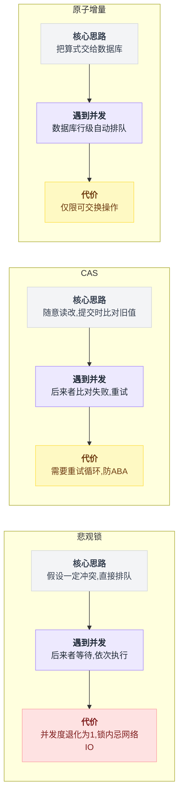
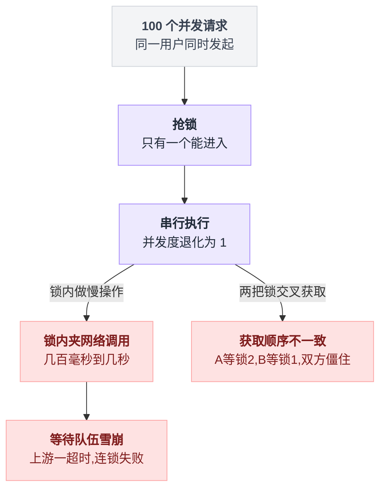
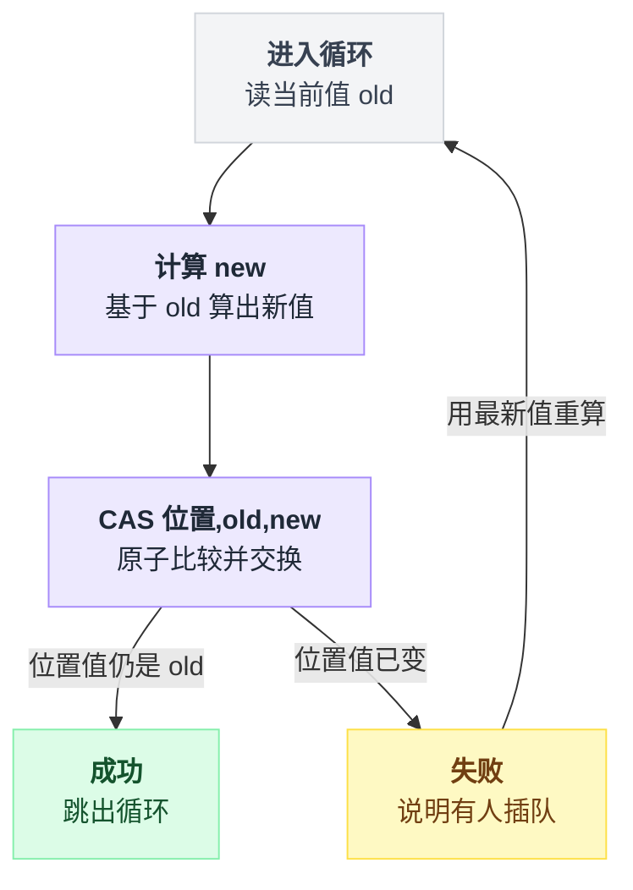
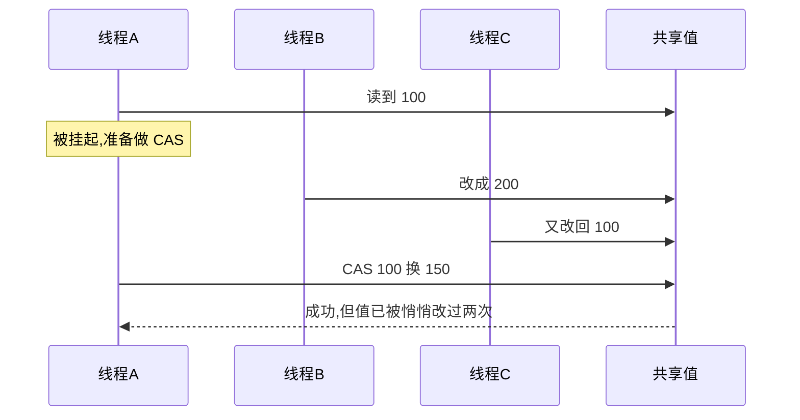
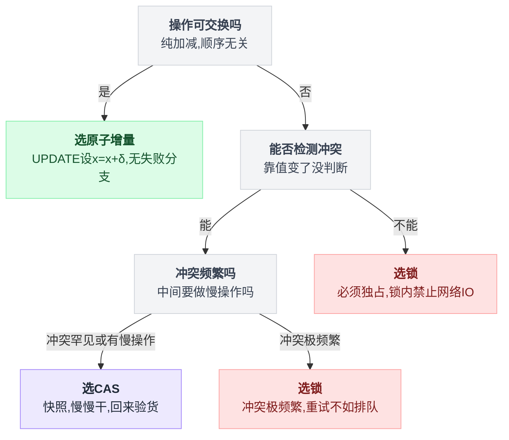
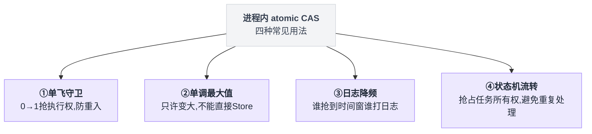

# 第 2 章:并发控制工具箱——锁、CAS、原子增量

> 第 1 章确诊了病(读写之间的缝隙),本章介绍三种药以及**开药的顺序**。
> 重点是 CAS——它是全书出现频率最高的手段,也是初学者最陌生的一个。

---

三种手段的形状差别,一句话就能说完:锁是**不让并发发生**,CAS 是**让并发发生但提交时验货**,原子增量是**把运算本身推给数据库**。

先并排看一眼,再逐个展开细节:



## 2.1 路线一:悲观锁——先把门锁上

```go
lock.Lock()                   // 上锁,别人进不来
balance := readBalance()
balance = balance + 50
writeBalance(balance)
lock.Unlock()                 // 开锁
```

思路:**假设一定会冲突,干脆不允许并发进入。** 数据库里的对应物是 `SELECT ... FOR UPDATE`(查询的同时锁住该行,直到事务结束)。

### 不用锁的后果
第 1 章已经演过:丢更新。

### 用锁的代价

锁能治病,但四张账单一张都跑不掉。

**一、所有人排队,并发度变成 1。** 同一用户的 100 个并发请求退化为 100 个串行请求。

**二、持锁期间做慢操作 = 灾难。** 锁内夹一次网络调用(几百毫秒~几秒),所有等锁者陪跑;上游一超时,等待队伍雪崩。

**三、死锁。** A 持锁 1 等锁 2,B 持锁 2 等锁 1,双方永远僵住:

```
线程 A:  拿到 锁1  →  伸手要 锁2
线程 B:  拿到 锁2  →  伸手要 锁1
// 谁都不肯先松手,两边就这么停在原地
```

**四、持有者崩溃的善后。** 需要设计锁超时;超时后原持有者又恢复了怎么办——分布式锁的经典难题。

把这四条代价摆到一条链路上看:



由此得出锁的使用纪律:**范围越小越好,锁内绝不做网络 IO,能不用就不用。**

这条纪律在 sub2api 里执行得相当彻底:全项目只有两处使用 `FOR UPDATE`(优惠码核销、配额初始化),均在低频冷路径。**整条计费热路径没有一把显式锁**——不是炫技,是被上述四条代价逼出来的。

## 2.2 路线二:CAS——随意做,提交时验货

### 2.2.1 定义

CAS = **C**ompare **A**nd **S**wap(比较并交换),一个带三个参数的操作:

```
CAS(位置, expected, new) → 成功 / 失败
     ↑      ↑         ↑
  要改哪里  预期的旧值   想改成的新值
```

语义:

```
如果 位置里的值 == expected:
     把 位置 改成 new,返回 成功
否则:
     什么都不做,返回 失败
```

**关键在于:这个"如果…就…"整体是原子的——中间插不进任何执行流。**

### 2.2.2 用 CAS 重放存钱场景

```
时刻   线程 A                        线程 B                    余额
 1     读到 100                                                  100
 2                                   读到 100                     100
 3     CAS(余额, 100, 150) → 成功                                150
 4                                   CAS(余额, 100, 150) → 失败   150
                                     ↑ 余额已不是 100,写入被拒绝
 5                                   重新读到 150
 6                                   CAS(余额, 150, 200) → 成功   200 ✓
```

关键差别在第 4 步:B 的插队**被检测出来了**。

它没有覆盖 A 的成果,而是拿着新值重做一遍,钱一分不丢。

### 2.2.3 自己写 if 为什么不行

第一次看到 CAS 的定义,很容易冒出一个念头:这不就是个 if 吗,自己写一个不就行了?

```go
if balance == 100 {      // ← 检查
    balance = 150        // ← 修改
}
```

真按这个思路写就会撞墙:**不行。** 这两行之间照样有缝——只是把"读改写的缝"换成了"检查和修改的缝",本身还是一个 TOCTOU。

CAS 的原子性**必须由更底层的机制提供**,应用层自己造不出来:

| 层级 | 原子性提供者 | 形态 |
|---|---|---|
| CPU | `LOCK CMPXCHG` 等硬件指令 | Go 的 `atomic.CompareAndSwapInt64` |
| 数据库 | 单条 SQL 在行级别原子 | `UPDATE t SET x=新 WHERE id=1 AND x=旧` |
| Redis | 单线程 + Lua 脚本不被打断 | Lua 里 `if GET(k)==旧 then SET(k,新) end` |

**三者是同一个思想在三层的化身。** 认出这一点,阅读 sub2api 的代码会轻松很多——它三层都用了。

> 特别注意数据库那行:`UPDATE ... WHERE id=1 AND x=旧值`。
> 判断成败的方式是看**影响行数(RowsAffected)**:
> 1 行 = 赢;0 行 = 值已被人改过(或行不存在),输。
> 这是后续所有数据库 CAS 案例的统一形态。

### 2.2.4 标准用法:重试循环

CAS 会失败,真实代码几乎总是套在循环里:

```go
for {
    old := 读当前值()
    new := 基于 old 计算新值()
    if CAS(位置, old, new) 成功 {
        break                     // 成功,退出
    }
    // 失败 → 有人插队 → 用最新值重算一遍
}
```

失败之后**退回的是读值那一步,不是计算那一步**——这是整个循环唯一容易写错的地方:拿旧的 old 重算,等于把插队者的成果又抹掉一次。

画成流程图,失败之后回到哪一步就一目了然:



### 2.2.5 CAS 的四个坑

**坑 1:ABA 问题。** CAS 比较的是"值",不是"有没有被动过":

```
A 读到值 = 100,准备 CAS(100 → 150)
   ...A 被挂起...
B 把 100 改成 200
C 把 200 又改回 100
   ...A 恢复...
A 的 CAS(100 → 150) → 成功(但世界其实已被动过两次)
```

换成三个执行者的时序看,更容易看出 A 完全不知道中间发生过什么:



对纯数字加减通常无害;但当值代表某种"身份"或"版本"(如令牌)时会出大事。

**标准解法:在被比较的数据里附加一个只增不减的版本号**,让"转一圈回到原值"变得不可能。第 5 章的 `_token_version` 即是此用途。

**坑 2:只能保护一个位置。** CAS 天然只能原子地改一个变量;想同时改两个(转账 = A 减且 B 加)做不到:

```
CAS(A.余额, 100, 70)     // 第一句成功了
                          // ← 缝就在这里,别人可以插进来
CAS(B.余额, 50, 80)      // 第二句可能失败,钱就悬在半空
```

这种场景需要数据库事务。数据库层稍好:一条 UPDATE 可以改一行的多个列,"一行"是它的原子单位。

**坑 3:高冲突下的重试风暴。** 十次有八次失败时,所有执行流都在疯狂重算重试,CPU 烧光但无人推进(活锁)。**冲突频繁的场景应退回用锁。**

**坑 4(最易写错):失败 ≠ 错误。** CAS 返回失败有两种含义,含义不同,处理方式也不同:

| 失败的真实含义 | 该怎么办 |
|---|---|
| 有人抢先做了同一件事 | **通常是正常情况,不该报错** |
| 数据不存在 / 前提不满足 | 才是真错误 |

代码必须把两者分开处理,否则热路径会冒出海量假报错。第 4 章有 sub2api 的标准处理。

## 2.3 路线三:原子增量——比 CAS 更彻底的省略

回看扣费:`balance = balance - 3`。这个操作有一个特殊性质——

> **可交换性**:A 扣 3、B 扣 2,不论谁先谁后,结果都是少 5。顺序无关。

顺序无关意味着:**根本不需要"读到的旧值"参与运算**。

于是连 CAS 都可以省掉,直接把"算式"交给数据库:

```sql
UPDATE users SET balance = balance - 3 WHERE id = 2
```

这条 SQL 里**没有任何来自应用层的旧值**。`balance - 3` 是表达式,数据库拿到后自己锁行、用最新值求值、写回。

两个并发扣费在这一行上自动排队:100 → 97 → 95,一分不乱。(排队的物理机制见第 3 章。)

### 与 CAS 的对比

| | CAS | 原子增量 |
|---|---|---|
| 冲突时 | 失败,需要重试循环 | **不存在失败,永远一次成功** |
| 代码复杂度 | 循环 + 失败分支 + 回读 | 一条语句 |
| 适用条件 | 任何"冲突可检测"的操作 | **仅限可交换的操作(加减)** |

### 增量的适用边界

操作不可交换时不能用。典型例子:**清零**。

"清零"执行一次和执行两次结果完全不同(第二次会抹掉中间累计的量),必须保证只有一个执行者——这就回到了 CAS 的地盘(第 4 章整章讲这个)。

## 2.4 选型顺序:从最不阻塞的开始

三种手段构成一条决策链,**从上往下退,每退一级都要有明确理由**:

```
要做的操作是可交换的吗?(纯加减,顺序无关)
 ├── 是 → 【原子增量】UPDATE ... SET x = x + δ。无失败分支,并发最友好
 │        (sub2api 的余额扣费、各种用量累计,全是这个)
 └── 否 → 冲突发生时,能靠"值变了没"检测出来吗?
      ├── 能 → 冲突频繁吗?中间要做慢操作(网络 IO)吗?
      │    ├── 冲突罕见 或 中间有慢操作 → 【CAS】
      │    │   (sub2api 的窗口重置、令牌轮换;凡"快照→干活→验货写回"的流程只能用它)
      │    └── 冲突极频繁 → 【锁】,老实排队比疯狂重试省
      └── 不能 / 必须独占一段时间 → 【锁】,锁内禁止网络 IO,范围压到最小
           (sub2api 只在优惠码核销这类低频场景使用)
```

同一条决策链画成判定树,分支条件更好对照:



这条链落到 sub2api 身上,三级各自的地盘是这样的:

| 手段 | sub2api 里的落点 | 性质 |
|---|---|---|
| 原子增量 | 余额扣费、各种用量累计 | 热路径主力 |
| CAS | 窗口重置、令牌轮换 | 快照→干活→验货写回 |
| 锁(`FOR UPDATE`) | 优惠码核销、配额初始化,全项目仅此两处 | 低频冷路径 |

再补一条铁律:

> **中间要调外部 API 的流程,绝对不能用锁,只能用 CAS。**
> 持锁做 IO 意味着:一个卡住的上游请求,拖死所有等锁者。
> CAS 的模式天然是"拍快照 → 无锁地慢慢干 → 回来验快照 → 提交",干活期间不占用任何人。

## 2.5 附:CAS 在进程内的四种日常形态

CAS 不只用于钱。sub2api 的 Go 代码里,进程内 atomic CAS 有四种常见用法:



**① 单飞守卫(0→1 抢执行权)**——定时任务防重入:

```go
if !atomic.CompareAndSwapInt32(&s.refreshing, 0, 1) {
    return   // 已有人在跑,直接退出(输家不重试:赢家干的活对输家同样有效)
}
defer atomic.StoreInt32(&s.refreshing, 0)
```

**② 单调最大值(只许变大)**——记录历史最大延迟 / 把封禁截止时间往后推:

```go
for {
    cur := load()
    if new <= cur { return }        // 不需要改
    if CAS(cur, new) { return }     // 改成功
    // 失败说明有人改了,重读再比
}
```
不能直接 Store 的原因:可能把别人刚写入的**更大值**覆盖成小的。"取 max"不是原子操作,必须 CAS 循环。

**③ 日志降频**——"谁抢到这个时间窗,谁负责打这条日志":

```go
last := atomic.LoadInt64(&lastLogTime)
if now - last < 5秒 { return }
if !atomic.CompareAndSwapInt64(&lastLogTime, last, now) { return }  // 没抢到,别人会打
log.Warn(...)
```

**④ 状态机流转**——异步任务的状态 `queued → processing / queued → canceled`,两个 goroutine 抢同一任务的所有权:

```
// 两个 goroutine 同时盯上同一个任务
if CAS(任务状态, "queued", "processing") {
    // 抢到了所有权,由我负责收尾
} else {
    // 没抢到:状态已经不是 queued(别人在 processing,或已 canceled)
    // 直接放手,避免重复处理
}
```

CAS 在这里的作用不是保护数据,而是**决定谁负责收尾**。

---

## 本章要点

- **锁**:堵死缝隙,代价是串行化 + 不能做慢操作 + 死锁风险 → 最后的选择
- **CAS**:`(位置, 期望旧值, 新值)`,原子地"比对成功才写";失败要重试;数据库形态是 `UPDATE ... WHERE 字段=旧值` + 看影响行数
- CAS 四坑:ABA(版本号防)、只保护一个位置、高冲突活锁、**失败≠错误**
- **原子增量**:可交换操作的最优解,把算式交给数据库,连失败分支都没有
- 选型顺序:**增量 → CAS → 锁**,从最不阻塞的往下退
- 中间夹网络调用的流程:只能 CAS,禁止锁

下一章:[数据库层的机制——行锁与单条 UPDATE 的原子性](./3_数据库层的魔法_行锁与单条UPDATE的原子性.md)
