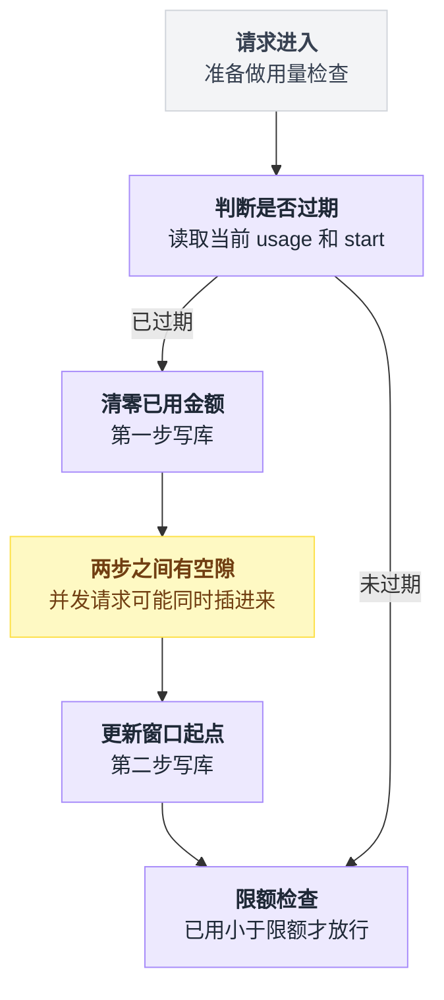
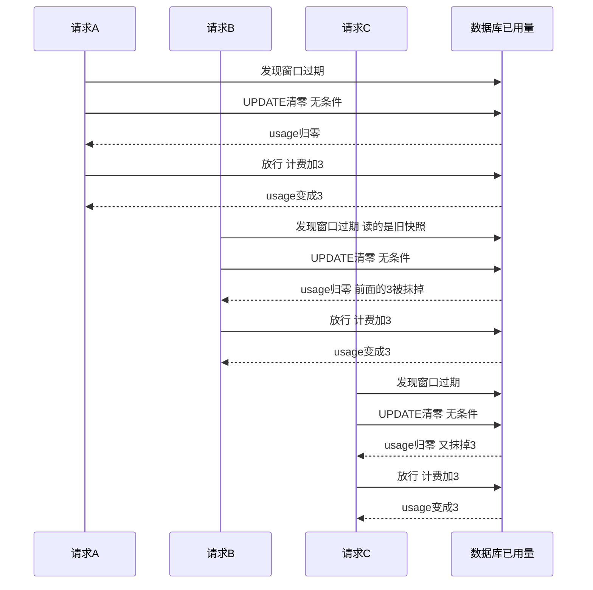
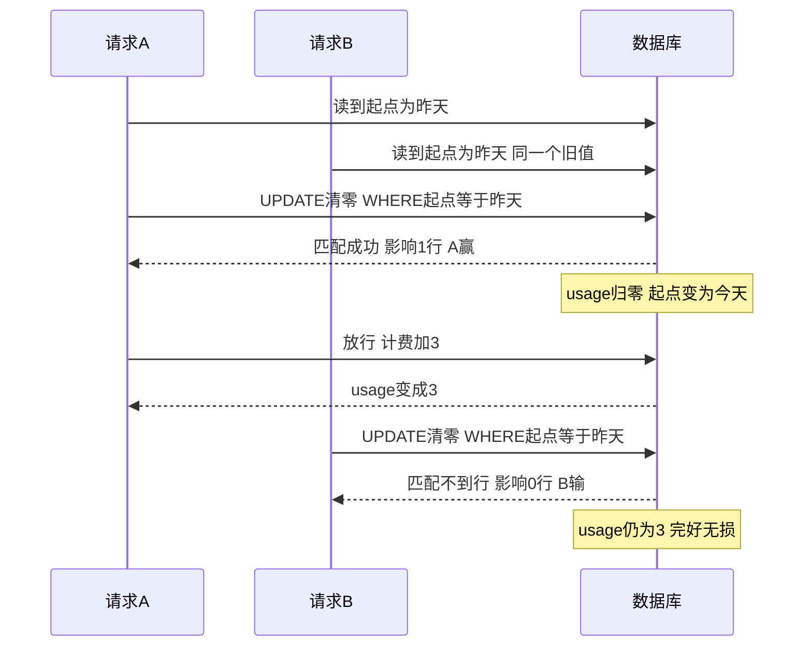
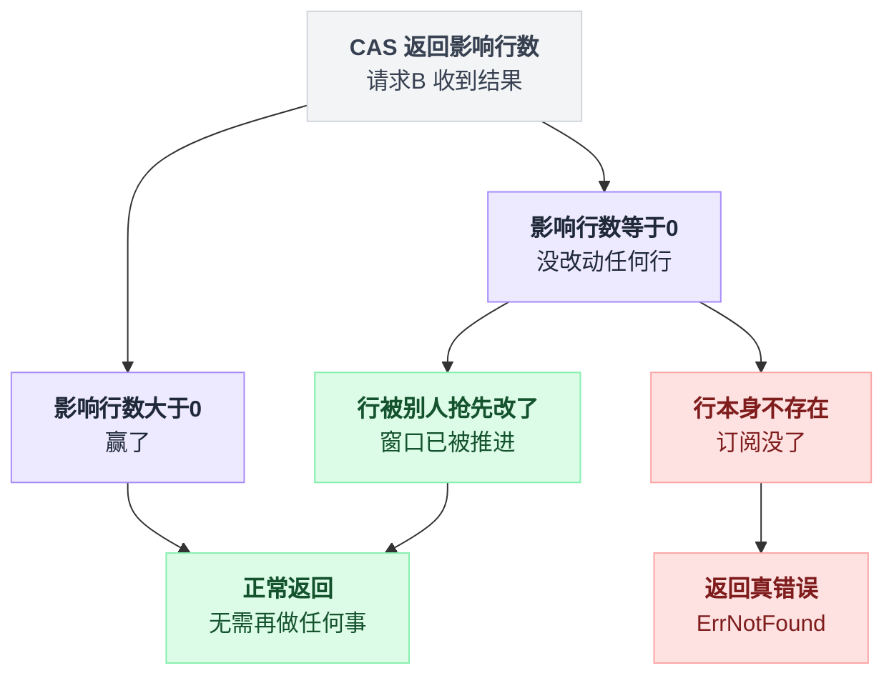
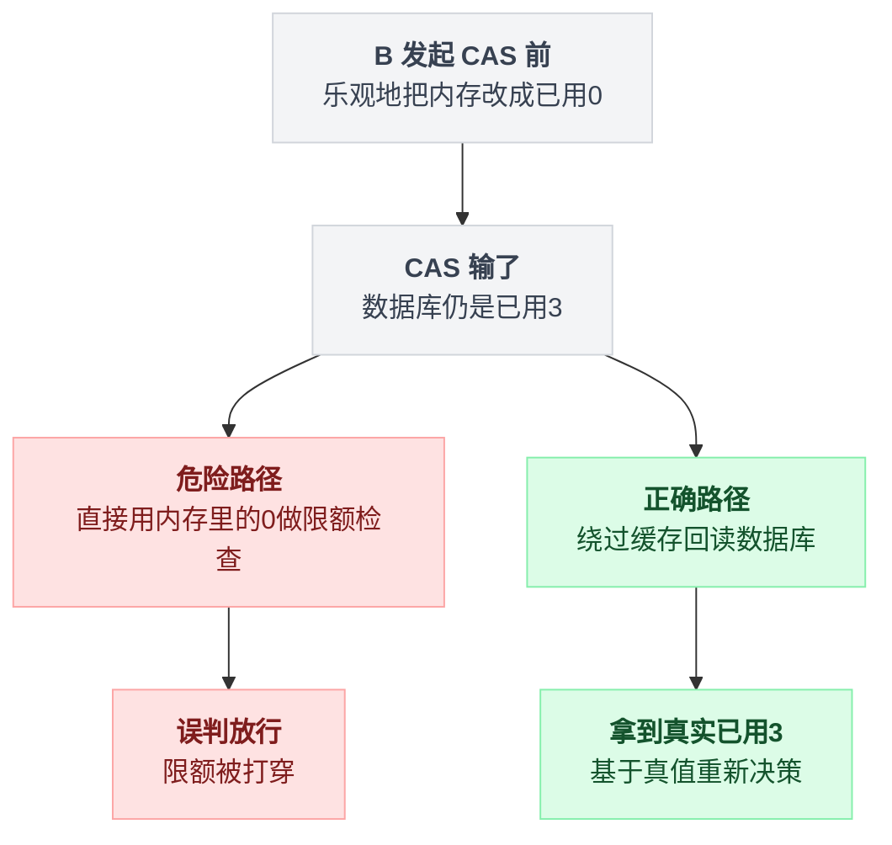
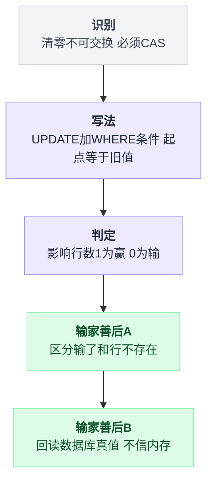

# 第 4 章:实战案例一——用量窗口重置的 CAS

> 三个实战案例中最简单的一个,但五脏俱全:有事故现场、有 CAS 解法、有"输家如何善后"。
> 本案例覆盖数据库 CAS 的完整套路。

---

## 4.1 业务背景:每天限额 $10

sub2api 的订阅套餐按"限额"控制用量。数据库里每个订阅一行:

```
user_subscriptions 表:
  id                 = 123
  daily_usage_usd    = 9.98        ← 本窗口已用金额
  daily_window_start = 昨天 00:00   ← 窗口起点
(套餐配置:daily_limit_usd = 10,即每 24 小时最多用 $10)
```

规则:每个请求进来先检查"窗口过期了吗"(`现在 >= 窗口起点 + 24h`)。过期则:

1. **把已用金额清零**
2. **把窗口起点换成新的**

之后才做"已用 < 限额?"的检查。

判断过期和真正清零之间隔着两次数据库交互,这道缝有多宽,事故就有多容易钻进来:



三个关键事实:

- "检查是否过期"和"清零"是**两步**(TOCTOU 的味道)
- 一个用户可能同时有**几十上百个并发请求**,每个都会独立走到这一步(例如用户跑多线程脚本)
- **清零是不可交换的操作**——清一次和清两次结果完全不同(按第 2 章的结论,轮不到原子增量,必须 CAS)

## 4.2 没有 CAS:并发事故逐帧回放

50 个并发请求同时到达,都发现窗口过期。裸写法:

```sql
UPDATE user_subscriptions
SET daily_usage_usd = 0, daily_window_start = NOW()
WHERE id = 123          -- ← 没有任何前提条件
```

取其中 3 个请求观察(其余 47 个同理):

```
时刻  请求A                     请求B                     请求C            DB里的已用量
t1    发现窗口过期
t2    UPDATE → 清零                                                        0
t3    通过限额检查,放行
t4    完成,计费 +$3                                                        3
t5                              发现窗口过期(B 早已读了旧快照,此刻才排到)
t6                              UPDATE → 清零                              0  ← $3 被抹掉
t7                              放行,计费 +$3                              3
t8                                                        发现窗口过期
t9                                                        UPDATE → 清零    0  ← 又抹掉 $3
t10                                                       放行,计费 +$3    3
```

**事故:每一个"迟到的重置"都把之前累计的真实消费清零了。**

三个请求各自独立地"发现过期→清零→放行",谁都不知道别人也在做同一件事,时序图看得更直白:



### 后果的严重性

- 50 个并发 = 最多 50 次清零。用户在一个窗口里实际消费 $150,计数器上永远只显示最后几笔
- **日限额 $10 形同虚设,用户变相白嫖**,并发越高薅得越多
- 这不是偶发 bug——**每天窗口翻转的那一瞬间必然发生**:那一刻所有在途请求都会同时判定"该重置了"
- 无声无息:不报错、无异常日志,只有账目慢慢对不上

## 4.3 加上 CAS:同一场景重放

sub2api 的解法(源码在 `internal/repository/user_subscription_repo.go`):给 UPDATE 加一个前提——**"只有窗口起点还是刚才读到的那个旧值,才允许清零"**:

```sql
UPDATE user_subscriptions
SET daily_usage_usd = 0, daily_window_start = '今天 00:00'
WHERE id = 123
  AND daily_window_start = '昨天 00:00'    -- ← expected:读到的旧窗口起点
```

对照 CAS 三要素:**位置** = 这一行;**expected** = 旧窗口起点;**new** = 清零+新起点。输赢看影响行数。

重放:

```
时刻  请求A                          请求B                          DB状态
t1    读到 window_start = 昨天
t2                                   读到 window_start = 昨天       (两者拿的是同一个旧值)
t3    UPDATE ... WHERE start=昨天
      → 匹配成功,影响 1 行 ✓ A赢                                    usage=0, start=今天
t4    放行,计费 +$3                                                 usage=3
t5                                   UPDATE ... WHERE start=昨天
                                     → 匹配不到任何行,影响 0 行      usage=3 ← 完好无损
t6                                   B 得知自己输了(0 行)
```

同一段时序换成时序图看,输赢的边界更清楚:



**关键在 t5**:B 带着旧起点"昨天"作条件去找这行,但 A 已把起点改成"今天"——B 的 WHERE 匹配不到任何行,什么都没改。那 $3 保住了。

50 个并发同理:**只有第一个到达的赢,其余 49 个全部空转**。"清零"在每个窗口周期内**恰好发生一次**——正是业务想要的语义。

## 4.4 输家的善后(一):输了不是错误

B 收到"影响 0 行",存在两种可能,含义天差地别:

- **行被别人抢先改了** → 完全正常:窗口已被推进,无需再做任何事
- **行根本不存在** → 真错误:订阅没了

两条分支怎么分岔,画出来一目了然:



sub2api 专门写了区分逻辑(简化):

```go
if 影响行数 > 0 { return nil }              // 赢了
if 该行不存在   { return ErrNotFound }       // 真错误
return nil                                  // 输了 → 同样返回 nil,不报错
// 源码注释:A stale reset is an expected no-op:
//          another request already advanced the window.
//          (过期的重置是预期中的空操作:另一个请求已经推进了窗口)
```

**不做这个区分的后果**:每天窗口翻转时,49/50 的请求会"报错",监控告警炸锅,而实际上什么都没坏。CAS 输了是常态,把常态当异常处理,系统就无法运维。

## 4.5 输家的善后(二):必须回读,不能信内存

这是本案例**最容易漏、漏了最危险**的一步。

背景:B 在发起 CAS 之前,代码已经**乐观地**把内存里的对象改了(为赢了之后直接用做准备):

```go
sub.DailyUsageUSD = 0        // 内存里先清零
sub.DailyWindowStart = 新起点
发起 CAS...                   // 然后输了
```

此刻:**内存里是 0,数据库里是 3。** 若 B 拿着内存里的 0 去做限额检查:

```
B 以为:已用 $0,限额 $10 → 放行
真相:  已用 $3(可能马上 $9.99)→ 该收紧了
```

用户逼近限额时,**每个输掉 CAS 的请求都会拿着"假 0"绕过限流**——限额再次被打穿,而且这次是 CAS 用对了还被打穿。

sub2api 的做法:CAS 之后**强制绕过缓存、直接回读数据库**:

```go
// 源码注释:GetByID bypasses the service caches. This prevents a stale loser
// of the CAS from validating limits against zeroed in-memory usage.
// (绕过缓存读,防止 CAS 的输家拿着清零的内存数据去做限额校验)
refreshed, err := s.userSubRepo.GetByID(ctx, sub.ID)
```

内存和数据库这两条分支怎么走偏、又怎么被拉回来:



> **一条值得单独记住的纪律:CAS 语句本身只是方案的一半,输家"回读真相、基于真相重新决策"是另一半。**
> 而且这一半通常不在 CAS 所在的函数里,而在调用方——代码演进中最容易被漏掉的位置。

## 4.6 隐藏细节:窗口语义的混搭

sub2api 判断"该不该重置"用的是**滚动 24 小时**(`现在 >= 起点 + 24h`),但重置时写入的新起点是**当天零点**(`startOfDay(now)`)。

结果:首次激活的窗口从首用时刻起算,之后逐渐漂移成自然日对齐。不算 bug,但两种语义混在一起,读代码时容易误判窗口边界——自行设计时,**滚动窗口还是自然日窗口,应选定一种并贯彻到底**。

---

## 本章要点(窗口重置 CAS 完整套路)

```
① 识别:清零是不可交换操作 → 必须 CAS,不能裸 UPDATE、不能原子增量
② 写法:UPDATE ... SET 清零 WHERE id=? AND 窗口起点=读到的旧值
③ 判定:影响行数 1=赢 / 0=输
④ 输家善后 A:区分"输了(正常,返回成功)"和"行不存在(真错误)"
⑤ 输家善后 B:回读数据库真值再做后续决策;绝不信 CAS 前乐观修改过的内存
```

五步串成一条链:



对照第 1 章的病根:没有 CAS 时,"检查过期"和"清零"之间的缝隙让 50 个请求都成了"清零者";CAS 把缝焊死后,清零者有且只有一个。

下一章难度升级——CAS 保护的不再是一个数字,而是一把"用一次就作废的钥匙":[案例二——OAuth 令牌轮换的 CAS](./5_实战案例二_OAuth令牌轮换的CAS.md)
