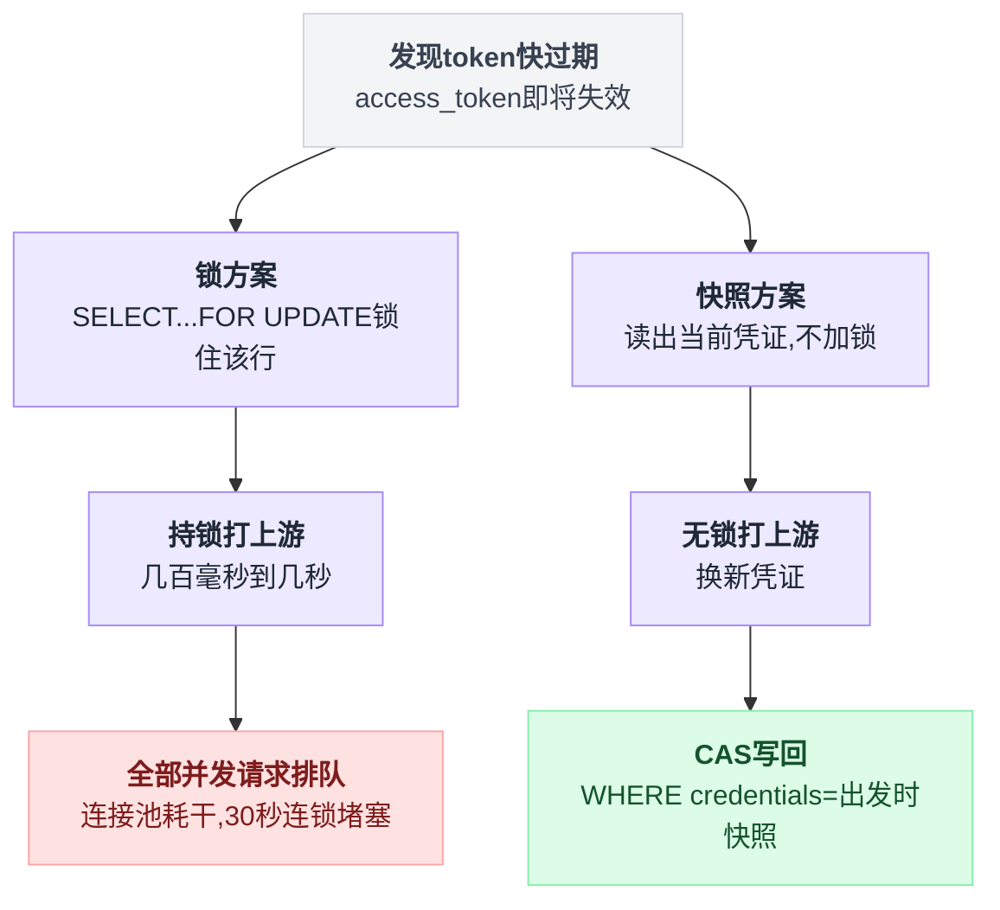
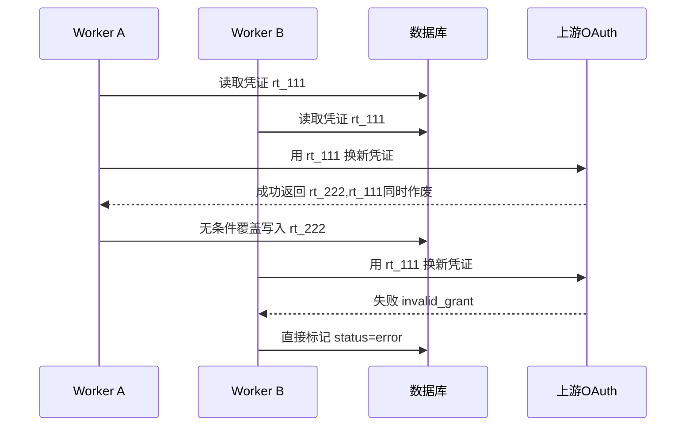
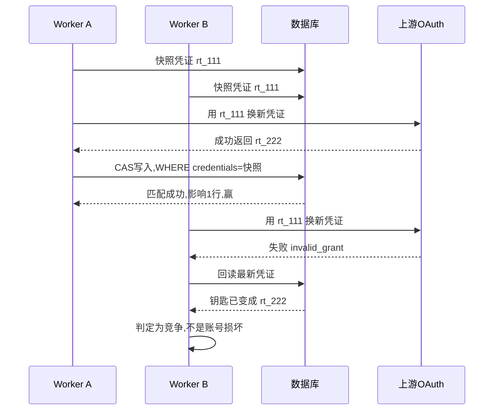
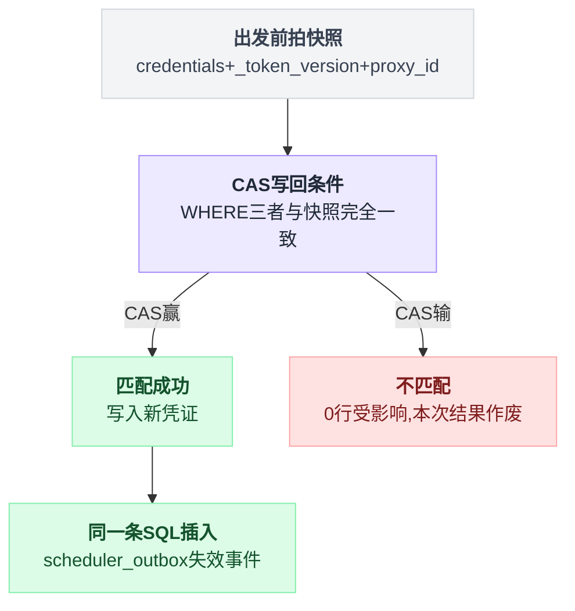
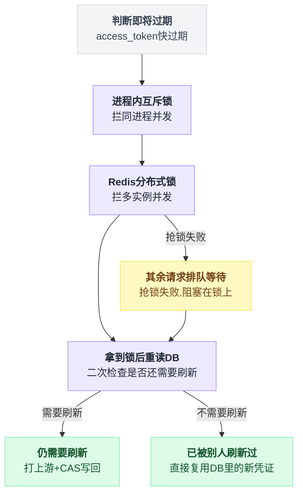
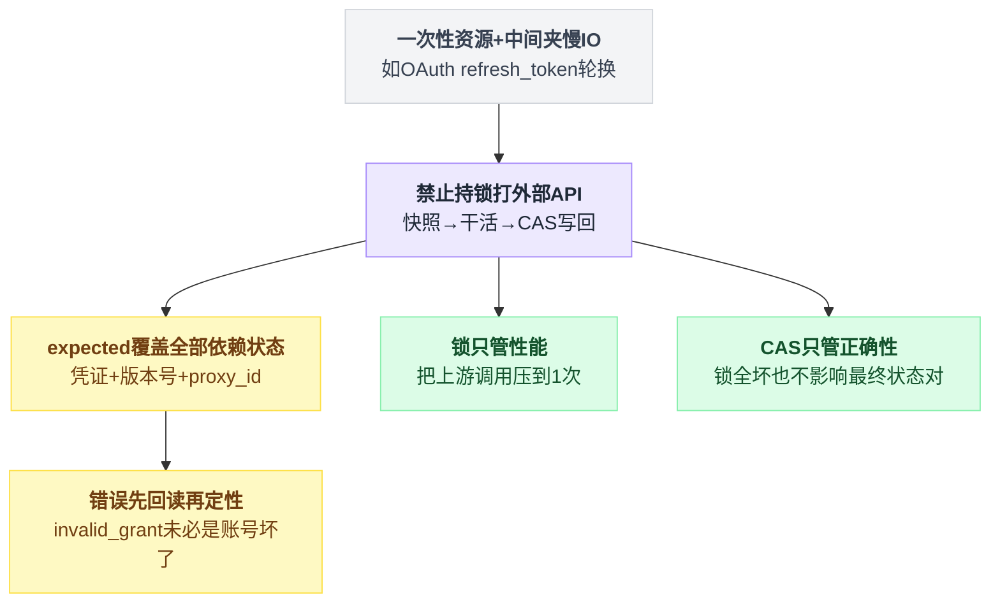

# 第 5 章:实战案例二——OAuth 令牌轮换的 CAS

> 全书最凶险的场景:出错的后果不是丢几块钱,而是**把一个健康的账号写成砖**。
> 本章包含 CAS 最硬核的用法(拿整个 JSON 文档当 expected)、防 ABA 的版本号,
> 以及一个重要思想:**锁做性能,CAS 做正确性**。

---

## 5.1 业务背景:一把用一次就作废的钥匙

sub2api 托管了一批上游 AI 账号(Claude/OpenAI/Grok 的 OAuth 账号),凭证存在数据库 `accounts.credentials` 列(JSONB 格式):

```json
{
  "access_token":  "at_AAA",     ← 干活用的,几小时过期
  "refresh_token": "rt_111",     ← 换新 token 用的"钥匙"
  "_token_version": 1753500000000
}
```

access_token 快过期时,要拿 refresh_token 去上游换一对新的。

这个流程有两个致命特性,分开看都不算什么,凑在一起就是灾难:

| 特性 | 内容 | 后果 |
|---|---|---|
| 一次性钥匙 | 许多 OAuth 提供方执行"轮换"策略:`rt_111` 被用过一次后**立即作废**,换回来新的 `rt_222` | 再拿 `rt_111` 去换,得到的是 `invalid_grant` 错误(无效凭证) |
| 中间夹外网调用 | 流程 = "读 DB 拿钥匙 → **打上游 API(几百毫秒~几秒)** → 把新凭证写回 DB" | 读和写之间的缝隙巨大 |

并发对手也多:同进程的其他请求、**其他服务器实例**的后台刷新任务、管理员在后台手动重新授权……都可能在这几秒里动这行。

### 为什么不能用锁

第 2 章的铁律:**中间要调外部 API 的流程,绝对不能持锁。**

若用 `SELECT ... FOR UPDATE` 锁住这行再打上游,该行会被锁几秒——期间所有要用这个账号的请求全部堵在锁上;上游一旦超时 30 秒,就是 30 秒 × 全部并发的连锁堵塞,数据库连接池直接耗干。

只剩一条路:**拍快照 → 无锁地打上游 → 回来 CAS 写回。**

两条路摆在一起看,分岔点就是"要不要在打上游期间攥着锁":



## 5.2 没有 CAS:两种事故

裸写法:

```sql
UPDATE accounts SET credentials = '{新凭证}' WHERE id = 456   -- 无条件覆盖
```

两种事故的区别只在于 A 的写回落在 B 之前还是之后:

| | 触发顺序 | 结果 |
|---|---|---|
| 事故一 | A 先写回,B 后失败 | 健康账号被 B 标成 error |
| 事故二 | B 先定罪,A 后写回 | 两个写互相覆盖,最终状态随机 |

### 事故一:好账号被误判死刑

两个 worker(实例 1 的请求线程、实例 2 的后台刷新任务)同时发现 token 快过期:

```
时刻  Worker A                          Worker B                     DB里的凭证
t1    读 DB:拿到钥匙 rt_111
t2                                      读 DB:拿到钥匙 rt_111        {rt_111}
t3    拿 rt_111 打上游 → 成功
      换到 {at_BBB, rt_222}
      ★ 同时上游把 rt_111 作废
t4    UPDATE 写回                                                     {rt_222} ✓
t5                                      拿 rt_111 打上游
                                        → invalid_grant(钥匙已作废)
t6                                      B 的错误处理:
                                        "刷新失败,账号凭证坏了"
                                        → 把账号标成 error/停用       账号被判死刑 ✗
```

t6 的荒谬之处:**数据库里躺着一份完全健康的新凭证,但 B 基于自己的过期视角,把好端端的账号打成了砖。**

换成消息视角看谁给谁发了什么:



### 事故二:写入顺序随机,结果随机

换个时序更惨:

```
t3'   A 打上游成功,拿到新凭证,但还没写回(例如 GC 停顿)
t4'   B 打上游 → invalid_grant → B 抢先执行了"标记账号失败"
t5'   A 恢复,写入新凭证 → 又把 B 的错误标记覆盖了
```

两个写互相覆盖,最终状态取决于谁最后落盘——**竞态的结果是随机的**。

生产表现:账号池里的账号莫名其妙轮流变砖、又莫名其妙"自愈",日志里一堆 invalid_grant,无法排查。

## 5.3 加上 CAS:expected 是整个凭证文档

sub2api 的写法(`internal/repository/account_repo.go`):

```sql
UPDATE accounts
SET credentials = '{at_BBB, rt_222, _token_version: 新时间戳}'
WHERE id = 456
  AND credentials = '{at_AAA, rt_111, _token_version: 旧时间戳}'::jsonb  -- ← 出发前的完整快照
  AND proxy_id IS NOT DISTINCT FROM 7                                    -- ← 连代理配置都算进"身份"
```

语义翻译:

> **"只有这个账号的凭证还停留在出发打上游时的状态,带回来的战利品才允许落盘。中途被任何人动过,本次结果作废。"**

重放事故一:

```
时刻  Worker A                          Worker B                     DB状态
t1    快照凭证 = {rt_111...}
t2                                      快照凭证 = {rt_111...}        {rt_111}
t3    打上游成功 → {rt_222...}
t4    CAS: WHERE credentials={rt_111}
      → 匹配,影响 1 行 ✓ 赢                                          {rt_222}
t5                                      打上游 → invalid_grant
t6                                      ★ 竞争恢复:不急着定罪,先回读 DB
t7                                      发现 DB 里钥匙已从 rt_111 变成 rt_222
                                        → 推断:"不是账号坏了,
                                          是有人抢先刷新成功了"
t8                                      按成功处理,直接用 DB 里的
                                        新凭证返回 ✓                  {rt_222} 完好
```

同一段时序换成消息视角,能看清"只有一个赢"这件事具体发生在哪一步:



### t6-t8:同一个错误,先回读再定性

这段逻辑(源码中的 `tryRecoverFromRefreshRace`,竞争恢复)是整个方案的灵魂。它做的事就三句:

```
收到 invalid_grant:
    最新凭证 = 回读 DB(账号)
    if 最新凭证.钥匙 != 我出发时的快照钥匙:
        # 是竞争,别人已经成功了
        return 成功(最新凭证)
    else:
        # 钥匙没变,说明真坏了
        标记账号 error
```

一句话点破:**"错误"这个信号本身是过期视角的产物,定罪前必须用最新事实校验一遍。** 没有 CAS 思维的代码在 t5 就直接判死刑了。

### 连"定罪"本身也要过 CAS

B 确实要给账号标错误时,那条"标错误"的 UPDATE 同样带快照条件:

```sql
UPDATE accounts SET status = 'error', schedulable = FALSE
WHERE id = 456
  AND credentials = '{B 出发时的快照}'::jsonb    -- ← 定罪也要验快照
```

这样即便 B 在 t8 之后才慢吞吞执行定罪,也伤不到已经换了新凭证的账号——**过期视角连"报坏消息"的权利都没有**。

这是本案例最漂亮的一处:不只保护"写好数据",连"写坏消息"也要过 CAS。

## 5.4 三个配套细节

三个细节分别回答两个问题:expected 该有多宽(①②),赢了之后要不要顺带通知别人(③)。

| 细节 | 解决什么 |
|---|---|
| ① `_token_version` 时间戳 | 防 ABA:新旧 token 字符串碰巧相同也骗不过比较 |
| ② `proxy_id` 进 CAS 条件 | expected 覆盖"出发时依赖的全部状态",不只是凭证 |
| ③ 失效事件与写入同一条 SQL | 赢家才发通知,数据与消息同生共死 |

### ① `_token_version` 时间戳——防 ABA(呼应第 2 章坑 1)

写回时塞入 `_token_version = 当前毫秒时间戳`。

假如某次刷新前后 token 字符串**碰巧一模一样**(或管理员手动填回旧值),没有版本号的话 CAS 会误以为"没人动过"。每次写入的版本号必然不同,"转一圈回到原值"就骗不过比较了。

> ABA 的标准解法:**把版本号藏进被比较的数据本身**。

### ② proxy_id 为什么也进 CAS 条件

`proxy_id IS NOT DISTINCT FROM 7`(NULL 安全的等值比较)。

代理是"这次刷新尝试"的一部分身份——刷新期间管理员换了代理,说明账号的网络环境变了,这次刷新的结果就不该落盘。**expected 的范围 = "出发时依赖的全部状态"**,不多不少。

### ③ CAS 成功后,失效事件和写入绑在同一条 SQL

```sql
WITH updated AS (
    UPDATE accounts ... RETURNING a.id     -- CAS 本体
)
INSERT INTO scheduler_outbox (...)          -- 通知调度器"账号变了,刷新缓存"
SELECT ... FROM updated                     -- 只有 CAS 赢了才会产生这条事件
```

**赢家才产生失效事件,且两者同生共死**(一条语句,天然同事务)。这解决了经典裂缝:"数据改成功了,但通知缓存失效的消息丢了"。

把三个细节拼成一张图:



## 5.5 CAS 落空的另一个分支:结果不明时宁可停手

前面讲的都是 CAS 干脆利落地"赢"或"输"。还有第三种落空方式,也是最极端保守的一条路径:CAS 执行时**数据库报错**——不是输,是不知道成没成。

```
CAS 写回:
    err = 执行 CAS UPDATE
    if err == nil and 影响行数 == 1:   赢,正常返回
    if err == nil and 影响行数 == 0:   输,走竞争恢复
    if err != nil:                     结果不明 → 封存本轮,不重试
```

源码在最后那个分支留了注释:

```go
// 源码注释(意译):上游可能已经轮换并烧掉了旧钥匙。
// 在本地持久化结果不明的情况下重试,会把一个健康账号打成 invalid_grant。
// 因此:封存本轮,不重试。
```

原因:上游已经把 rt_111 烧了。若本地落盘结果不明就贸然重试整个流程,第二次拿 rt_111 去换**必然** invalid_grant——**"重试"这个动作本身会杀死账号**。

对比第 4 章:窗口重置输了可以随便重来;令牌轮换连重试都要小心翼翼。

差别在于——**上游的副作用(烧钥匙)不可回滚**。凡是流程中存在不可回滚的外部副作用,重试策略都要单独设计,不能无脑重试。

## 5.6 锁的正确位置:锁做性能,CAS 做正确性

一个自然的追问:上例中两个 worker 都打了一次上游,是否浪费?**是,而且不止浪费。**

sub2api 在"打上游"之前还有三道闸门:

```
0. 进程内互斥锁(每个账号一把)   ← 拦同一进程内的并发
1. Redis 分布式锁               ← 拦多实例之间的并发
2. 拿到锁后:重读 DB + 二次检查   ← ★ 排完队先确认还需不需要刷新
3. 都过了才打上游 → CAS 写回
```

摊成完整流程看:判断快过期后先过两道锁,拿到锁还要重读一次 DB 才决定要不要真的打上游:



写成代码形状,关键在于第三行"拿到锁之后又读了一次":

```
进程内互斥锁(账号).Lock()
Redis分布式锁(账号).Lock()          # 拿不到就排队等
最新账号 = 重读 DB(账号)             # ★ double-check
if 最新账号.token 已经很新鲜:
    return 最新账号.凭证            # 根本不打上游
新凭证 = 打上游(最新账号.refresh_token)
CAS 写回(新凭证, expected=最新账号快照)
```

正常路径下重放:

```
t1   A 抢到锁
t2   B 抢锁 → 阻塞排队
t3   A 重读 DB,确认需要刷新,打上游,CAS 写回,释放锁
t4   B 拿到锁 → ★ 重读 DB → 看到新钥匙 rt_222,还很新鲜
t5   B 二次检查:"不需要刷新了" → 直接返回,根本没打上游
```

**上游只收到 1 次请求。** t4 的"锁内重读 + 二次检查"(double-check)是省掉第二次调用的关键——光有锁没有重读,B 排完队仍会拿着过期认知去打一次。

### 锁失效时的行为

Redis 挂掉时,代码**降级为无锁裸奔**(源码明确打了 warning 日志后继续)。此时两个 worker 都会打上游,第 2 个吃 invalid_grant,靠竞争恢复善后——回到 5.3 的时序。

分工由此非常清晰:

| 层 | 目标 | 允许失效吗 |
|---|---|---|
| 本地锁 + 分布式锁 + 锁内二次检查 | 让上游只挨 1 次调用(性能/风险优化) | **允许**。坏了最多多打几次上游 |
| DB CAS + 竞争恢复 | 无论打了几次,落盘永远正确(正确性) | **不允许** |

> **锁是 best-effort(尽力而为),CAS 是兜底保证。** 设计分布式系统时,应把"锁一定会坏"当作前提,正确性绝不能依赖锁。

### 为什么要拼命把上游调用压到 1 次

上面说锁坏了"最多多打几次上游",听着无害。但第 2 次请求不总是无害的。

OAuth 轮换配套一个**重用检测**机制:拿一把**已被消费**的钥匙再请求,部分提供方会理解为"钥匙泄露,有人在重放攻击"——防御动作是**吊销整个授权链**,包括刚发出去的新钥匙:

```
A 用 rt_111 换到 rt_222        ← 账号健康
B 又拿 rt_111 来请求           ← 上游判定:疑似盗用
上游吊销全家                    ← rt_222 也死了,账号真的变砖
```

此时连 CAS 都救不了——数据库里躺着一份"格式正确但已被上游吊销"的凭证。

**纯上游侧的副作用,任何本地并发控制都够不着,唯一办法是从源头避免发出第二次请求。** 这就是锁这层要叠三道的原因,而不能潇洒地说"反正有 CAS 兜底"。

---

## 本章要点(高危场景 CAS 完整套路)

八条要点收敛成一条主线:识别出高危场景后,锁和 CAS 各管一半,谁也不替代谁:



```
① 识别:一次性资源 + 中间夹慢 IO → 禁止持锁,只能"快照→干活→CAS 写回"
② expected 的范围 = 出发时依赖的全部状态(整个凭证文档 + 代理),不只是一个字段
③ 防 ABA:往被比较的数据里塞单调版本号(_token_version)
④ 错误要先回读再定性:invalid_grant 可能是"别人赢了"而不是"账号坏了"
⑤ 定罪(写坏消息)也要过 CAS——过期视角连报错的权利都没有
⑥ 有不可回滚的外部副作用时,结果不明宁可停手,不无脑重试
⑦ 锁(本地+分布式+锁内二次检查)负责把外部调用压到 1 次;正确性永远只依赖 CAS
⑧ CAS 与缓存失效事件绑进同一条 SQL,赢家才发事件,同生共死
```

回到开篇那句话:锁做性能,CAS 做正确性。这一章之所以要把两句话拆到八条这么细,是因为三个条件在这个场景里同时成立——refresh_token 用一次就作废、中间夹着一次拿不准结果的外网调用、失败信号本身可能是过期视角编出来的假象。三个条件少一个,故事都会简单得多:不作废,重放几次无所谓;不夹外网调用,锁住就能搞定;错误信号靠得住,也不用先回读再定性。三者叠在一起,才逼出这一整套"快照打上游、CAS 兜底、错误先核实再定罪"的组合拳。

下一章进入主战场——钱本身:[案例三——高并发余额扣费全链路](./6_实战案例三_高并发余额扣费全链路.md)
