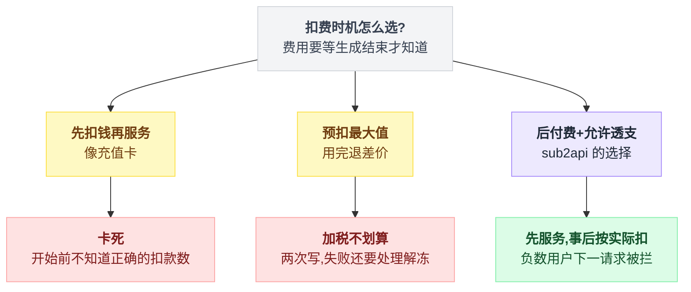
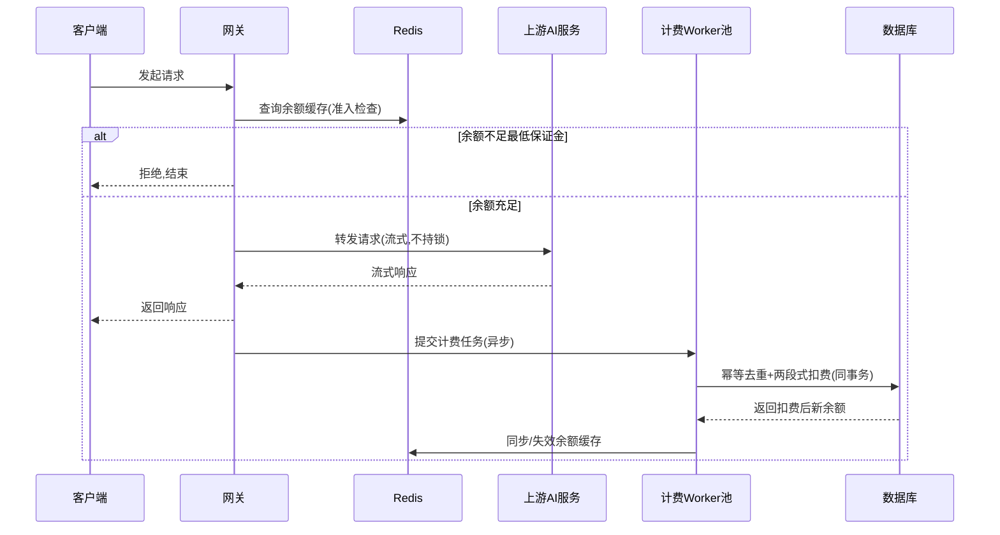
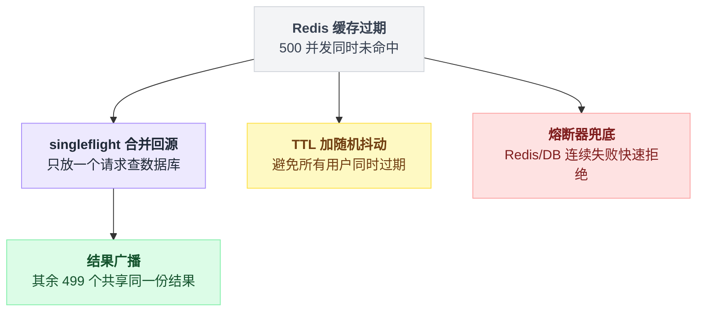
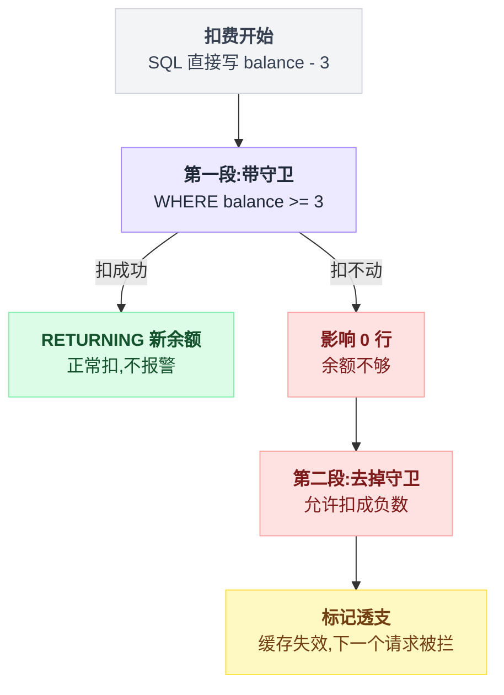
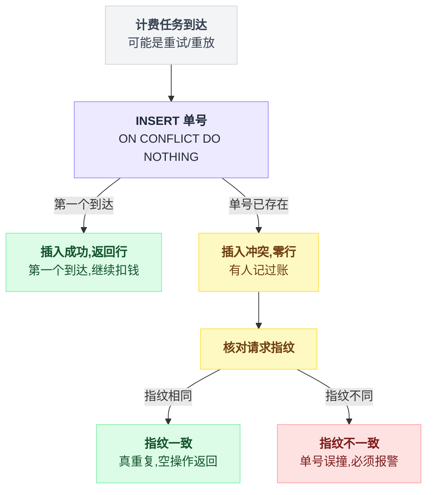
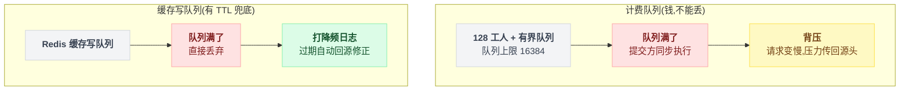
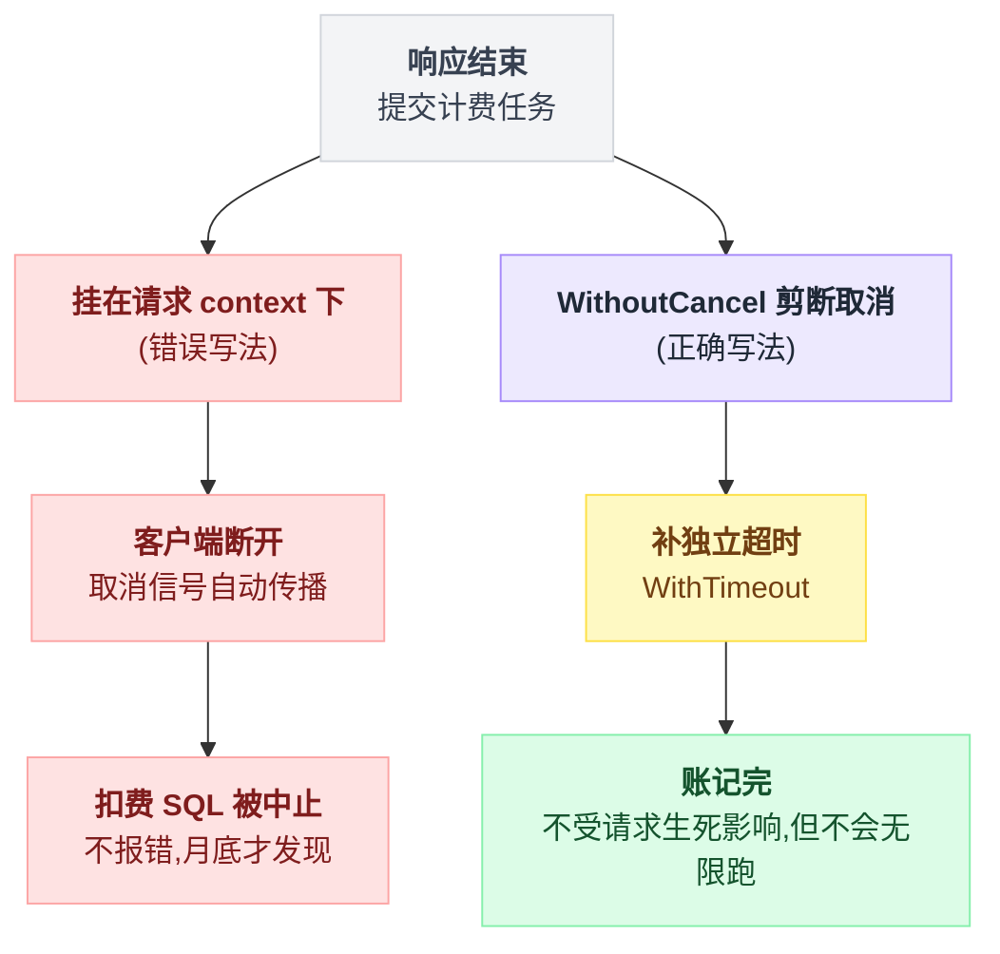
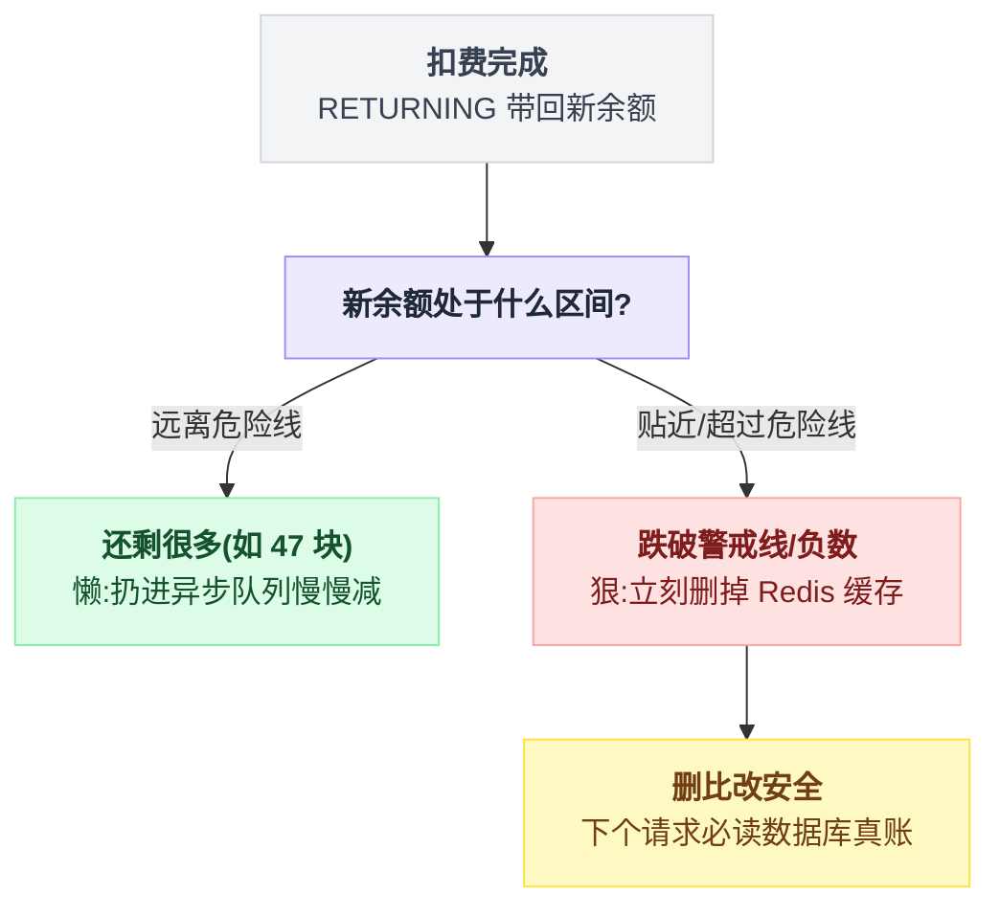

# 第 6 章:实战案例三——高并发余额扣费全链路

> 主战场。本章把"一笔钱从检查到落账"的完整链路走一遍。
> 一个颠覆直觉的事实:**这条链路上没有一个 CAS,也没有一把显式锁。**
> 依靠的是:原子增量 + 后付费 + 幂等去重 + 缓存准入,四件套。
> 每一环按"最自然的写法 → 如何翻车 → 正确做法"展开。

---

## 6.1 第一个大决策:为什么必须"后扣费"

### 最自然的想法:先扣钱再服务(像充值卡)

卡死在一个问题上:**扣多少?**

AI 按 token 计费,费用 = 生成的字数 × 单价,而生成多少字**要等生成结束才知道**。一个请求可能 1 分钱,可能 2 块钱,相差 200 倍。开始前无法扣一个"正确的数"。

### 预扣一个最大值,用完退差价?

可行,但每个请求变成两次写(冻结+退还),失败还要处理解冻,复杂度翻倍——而 99% 的请求根本不会出问题。

**为了 1% 的风险,给 100% 的请求加税,不划算。**(什么时候划算?见 6.9 的反例。)

### sub2api 的选择:后付费 + 允许透支

源码注释原话(意译):

```
// DeductBalance 扣除用户余额
// 透支策略:允许余额变为负数,确保当前请求能够完成
// 中间件会阻止余额 <= 0 的用户发起后续请求
```

即:**进门只粗看一眼"余额是正数吗",先服务,事后按实际消费扣;哪怕扣成负数也照扣(钱已经花出去,账必须记);负数用户的下一个请求在门口被拦。**

整条链路的所有设计,都由这个决策推导而来。三条路怎么分岔、各卡在哪:



## 6.2 全景时序图

四步:**准入只看一眼 → 转发上游(全程无锁)→ 算出真实费用丢给工人池 → 工人在一个事务里把账记完**。真正的重头戏在第四步,前三步都是铺垫。

```
请求进来
  │
  ├─① 准入检查(热路径,只读,不扣钱)
  │    看 Redis 里的余额 > 0 ?  不够 → 拒绝,结束
  │
  ├─② 转发上游(几秒~几分钟的流式响应,全程不持任何锁)
  │
  ├─③ 响应结束 → 算出真实费用
  │    → 把计费任务提交给有界工人池(异步,不拖慢响应)
  │
  └─④ 工人执行"统一计费事务"(一个数据库事务完成全部)
       ├─ 幂等去重:这笔单号记过账吗?记过 → 整体空操作
       ├─ 扣余额:单条原子 UPDATE(两段式)
       ├─ 顺手记:订阅用量 / Key 配额 / 账号配额
       └─ 提交后:同步 Redis 里的余额抄本
```

把这几个箭头换成谁在跟谁说话:



以下逐环拆解。

## 6.3 环节①:准入检查——读缓存,防击穿

### 最自然的写法:每个请求查一次数据库

一个用户开 500 并发,数据库每秒被同一句 `SELECT balance` 砸 500 次。

数据库是全系统最贵、最难扩容的组件,而其中 499 次是浪费——余额一秒内变不了多少。

### 改进:余额抄一份到 Redis

读 Redis 约 0.1ms,比数据库快几十倍。设过期时间(TTL),过期后回数据库读。

### 新的坑:缓存击穿

过期的一瞬间,500 个并发同时发现"Redis 里没有了",500 个一起冲向数据库——平时数据库闲着,一击穿就是瞬间尖峰,最容易打挂。

### sub2api 的三个动作

singleflight 那一步大概长这样:

```
查余额(uid):
    v = redis.get(uid)
    if v 命中:  return v            # 绝大多数请求走这条,零竞争

    # 未命中,进入合并回源
    return singleflight(key=uid, func = () => {
        v = db.查余额(uid)           # 同一时刻同一个 uid 只有一个人跑到这里
        redis.set(uid, v, TTL + 随机抖动)
        return v
    })                               # 其余 499 个原地等,拿同一份返回值
```

一句话:**未命中时只放一个人回源,其余人蹭结果**。

三个动作各挡一个侧面:

| 动作 | 做法 | 挡住的问题 |
|---|---|---|
| singleflight 合并回源 | 同一用户同时刻只放一个请求查库,其余原地等待共享结果 | 缓存击穿 |
| TTL 加随机抖动 | 所有用户的缓存不会同一秒集体过期 | 缓存雪崩 |
| 检查链外包熔断器 | Redis/DB 连续失败时快速拒绝 | 计费系统故障把请求堆死在检查环节 |

singleflight 的类比:宿舍 8 个人想知道食堂吃什么,派一个人去问,回来喊一嗓子。



另外一件容易忽略的事:**准入只读不写**。不做预扣、不做预留,纯看一眼。因此 1000 个并发准入 = 1000 次 Redis GET,零竞争。

> 门槛细节:判断标准不是 `余额 > 0`,而是 `余额 >= 最低保证金`(可配置)。相当于抬高门槛,为"后付费必然存在的超支"垫一层缓冲。

## 6.4 环节④核心:扣费本体——原子增量,两段式

### 为什么不用 CAS(呼应第 2 章选型顺序)

扣费是**可交换**的:A 扣 3、B 扣 2,谁先谁后结果都是少 5。

可交换 → 用原子增量,连 CAS 的重试循环都省了:

```sql
-- 第一段:带守卫的扣
UPDATE users
SET balance = balance - 3, updated_at = NOW()
WHERE id = 2 AND deleted_at IS NULL AND balance >= 3
RETURNING balance
```

三个写法要点:

**① 写算式不写死值。** SQL 里是 `balance - 3`,应用代码从头到尾**没有读过余额**——第 3 章讲过,这让"读-算-写"全部发生在数据库的行锁内,并发自动排队,一分不乱。

**② `WHERE balance >= 3` 守卫和减法一体。** 判断和扣在同一把锁内(EPQ 重验),不存在"判断时够、扣时不够"的缝。

**③ `RETURNING balance` 把扣完的新余额带回来。** 后续三件事(阈值判断、低额通知、透支标记)都需要新余额——RETURNING 一次拿到,免去再查一遍,并且**这个值和扣减在同一原子语句里产生,绝对一致**。

若扣完再发一次 SELECT,读到的可能已经是被其他并发又扣过的值。

### 两段式:守卫失败后,故意"裸扣"

先看控制流,只有三行:

```
新余额 = 执行第一段(带 balance >= 3 守卫)
if 影响行数 > 0:
    正常扣,不报警
else:                                  # 余额不够,但钱已经花出去了
    新余额 = 执行第二段(去掉守卫,允许扣成负数)
    标记透支 + 触发缓存失效             # 让下一个请求在门口被拦住
```

也就是说,第一段影响 0 行(余额不够)时,**不报错**,执行第二段:

```sql
-- 第二段:去掉守卫,允许扣成负数
UPDATE users SET balance = balance - 3, updated_at = NOW()
WHERE id = 2 AND deleted_at IS NULL
RETURNING balance
```

**为什么不直接拒绝?** 上游的 token 已经消耗,钱已经花了。拒绝记账 = 这笔成本无人承担。正确响应是:**记账(哪怕记成负数)+ 拉响警报**(标记"透支",触发缓存失效,让下一个请求被拦)。

**为什么不能只写第二段?** 那样就分不清"正常扣"和"透支扣"了。透支是要立刻拉警报的事件,正常扣不需要。两段式让代码天然知道自己处在哪种情况——**业务策略直接编译成了控制流**。

两段各管一种情况,分岔点就是第一段影响的行数:



对比:同一项目里给管理员用的手动调账接口就严格得多——`WHERE ... AND balance + 变化量 >= 0`,结果为负整条不生效。

**同一张表,计费路径允许透支、人工调账不允许。策略跟着场景走。**

## 6.5 环节④前置:幂等去重——防止一笔账记两次

### 为什么会记两次

计费是异步任务,异步系统里"重复执行"几乎无法避免:任务超时被重试、机器重启后补跑、网络抖动重复提交……每一种都会让同一笔消费被扣两次。

用户体感:"用了一次,扣了两次",投诉必到。

### 最自然的防法:先查后扣

"这笔单号扣过了吗?没扣过才扣。"

**又是 TOCTOU**:两个重试任务同时查,都发现"没扣过",都去扣。检查和动作分离,必被插队。

### 正确做法:唯一约束抢占

建一张"已记账单号"表,单号设唯一约束。扣费的**第一步**是插入自己的单号:

```sql
INSERT INTO usage_billing_dedup (request_id, api_key_id, request_fingerprint)
VALUES ($1, $2, $3)
ON CONFLICT (request_id, api_key_id) DO NOTHING
RETURNING id
```

```
插入成功(返回了行)→ 第一个到达,继续扣钱
插入冲突(零行)    → 有人记过账,整个事务按"空操作"返回,一分不扣
```

数据库唯一约束天生原子:并发插同一单号,必然一个成功一个失败,不存在都成功。**"查+插"被合并成了一步**——本质上又是一个"状态位 CAS"(与第 4 章同源,用 INSERT ON CONFLICT 实现)。

### 两个精髓细节

把整段合起来,骨架是这样,注意 `事务` 两个字的位置:

```
事务开始:
    行 = INSERT 单号 ON CONFLICT DO NOTHING RETURNING id
    if 行为空:                       # 单号已存在
        if 请求指纹 != 已记录的指纹:
            报警(单号误撞)           # 绝不能静默吞掉
        return 空操作                # 一分不扣
    扣余额(两段式)                   # 与抢单号在同一个事务里
    记订阅用量 / Key 配额 / 账号配额
事务提交
```

**① 抢单号和扣钱在同一个事务里。** 若插了单号但扣钱失败,单号跟着回滚——下次重试还能再抢。

否则会出现最惨的情况:单号占了、钱没扣,重试时看到"单号已存在"就跳过,**这笔账永远丢了**。

**② 冲突时还要验"指纹"。** 单号撞了,但请求体的哈希指纹不一样?说明不是真重复,而是单号误撞(两个不同请求用了同一个 ID)——必须报警而不能静默吞掉。

**去重系统最怕的不是重复,是误去重(把不该去的去了 = 漏账)。**

抢单号之后的三条岔路:



## 6.6 环节③:异步管道——计费不占热路径,但绝不丢

### 最自然的写法:响应发完,开个 goroutine 去扣费

`go 扣费()`。平时没事。

流量高峰时数据库变慢、每个扣费要 5 秒、每秒新来 1000 个——goroutine 越积越多,内存爆掉,**整个进程连正常请求都处理不了**。"来多少开多少"的模式,过载时死的是全体。

### 改进:固定工人池 + 有界队列

128 个工人(负载高自动扩到 512),队列上限 16384。内存占用有了天花板。

### 新问题:队列满了怎么办

丢掉任务?**丢的是钱**——每丢一个就是一笔白送的消费。

### sub2api 的选择:满了就由提交方当场执行

```
提交计费任务(t):
    if 队列没满:
        入队,请求线程立刻返回        # 正常路径,不拖慢响应
    else:
        当场同步执行(t)              # 请求线程自己扛,被拖慢
```

请求线程被拖慢 → 响应变慢 → 客户端感到卡 → 自然减速。

这叫**背压(backpressure)**:把"系统忙不过来"的信号顺着链条传回源头让源头减速,而不是在中间悄悄扔货。

同一套系统里,两个队列满了之后走完全相反的路:

| | 计费队列 | Redis 缓存写队列 |
|---|---|---|
| 规模 | 128 工人(可扩 512),上限 16384 | — |
| 满了怎么办 | 提交方同步执行 | 直接丢弃,只打降频日志 |
| 为什么敢/不敢丢 | 丢了是真金白银 | TTL 兜底,过期自动回源修正 |
| 后果 | 背压,压力传回源头 | 短暂不一致,自愈 |



> **同一套系统,两个队列,两种溢出策略——取决于丢了赔不赔钱。** 这是队列设计的核心判断题。

### 附带一个闭包细节

任务入池前,把需要的值**从大对象上剥成标量**再放进闭包。

否则闭包引用整个响应对象,GC 需要把几 MB 的响应体保活到工人执行完——高峰期内存被"早已没用的响应体"占满。

## 6.7 一个极阴的坑:客户端断线,扣费被"顺手"取消

背景知识:Go 里每个请求有一个 context(上下文),请求结束或客户端断开时,context 发出"取消"信号,挂在它下面的操作(数据库查询等)**自动中止**。平时是好事——用户走了,不浪费资源。

坑:扣费任务若挂在请求的 context 下——**用户收完最后一个字立刻断开(极常见),取消信号传下去,正在执行的扣费 SQL 被中止,这笔钱没扣成。**

更阴的是表现形式:

- 不报错(取消不算错误)
- 日志最多一行不起眼的 "context canceled"
- 只在"断线时机恰好撞上扣费执行"时发生

**只有月底对账时才发现收入少一截,完全无法复现。**

解法:扣费开始前换一个"剪断了取消信号"的 context(Go 1.21+ 的 `context.WithoutCancel`),再补一个**独立的**超时:

```go
base := context.WithoutCancel(requestCtx)   // 保留 trace 等值,剪断取消信号
billingCtx, cancel := context.WithTimeout(base, 计费超时)
```

含义:**这笔账的命运从此与请求无关,用户走不走都要记完;但也不能无限跑,超时兜底。**

错误写法和正确写法只差"挂在谁的 context 下":



> 通用模式:**凡是"事后必须完成"的动作(记账、发消息、写审计日志),都要主动与请求的取消信号切断关系。** 这是异步计费里最容易漏、漏了最难查的一条。

## 6.8 环节④收尾:数据库扣完了,Redis 抄本怎么办

数据库里扣了 3 块,Redis 里还是旧数——**门禁看的是旧账**。

放着不管,要等 TTL 过期才修正,超支窗口被拉长到几十秒。每次都同步刷新?给热路径加操作,且大多数刷新无意义(余额 50 扣 3 分,刷不刷门禁结论一样)。

sub2api 按"扣完的结果"分两档:

```
新余额 = 扣费 SQL 的 RETURNING 值
if 新余额 远离警戒线:
    异步队列.提交(把 Redis 的数字减一下)     # 懒
else:                                        # 跌破警戒线 / 负数
    redis.del(uid)                           # 狠
```

原文的说法:

```
扣完还剩很多(如 47 块)→ 懒:扔进异步队列,抽空把 Redis 数字减一下
                         (差几分钱无所谓,门禁判断不受影响)
扣完跌破警戒线/负数    → 狠:立刻把 Redis 那份删掉
                         (下个请求发现缓存没了 → 被迫回数据库读真账 → 当场拦住)
```

分档的判断点就在扣完那一刻的新余额:



两个要点:

- 分档依据是 **RETURNING 带回的新余额**——它与扣减在同一原子语句里产生,不会是过期值
- **"删缓存"比"改缓存"聪明**:删了之后下个请求必然读到数据库最新值,不存在"改错"的可能

> 通用原则:**缓存同步的力度跟着数据的危险程度走——离危险线远时可以懒,贴近危险线必须狠;拿不准时,删比改安全。**

## 6.9 直面那个"漏洞":超支窗口

把时序摆开,这个设计的漏洞是明摆着的:

```
用户余额 $0.05,同时发 100 个并发请求
t1   100 个请求全过准入(那一刻余额确实 $0.05 > 0)
t2   100 个请求都打上游,各花 $0.5
t3   结算:扣 $50 → 余额 -$49.95
```

教科书级 TOCTOU——检查和扣费之间隔着一整个上游调用,这个缝**焊不死**(焊死 = 预扣,前文已论证不划算)。

sub2api 的思路:**不消灭超支,给超支算一个可接受的上限**:

```
最大超支 ≈ 单用户并发数 × 单请求最大费用
```

再用三个旋钮收紧:

1. **每用户并发上限**(Redis 租约实现)→ 压小公式左边
2. **最低保证金门槛** → 提前垫一层缓冲
3. **扣费后立即同步/失效缓存**(6.8)→ 把"发现超支"的延迟从 TTL 级压到毫秒级

且超支的损失**可事后追缴**(账都记着,余额是负数)。风险有界 + 可回收,这笔账就算得过来。

### 反例印证:批量生图反而用"预冻结"(完整拆解见第 7 章)

同一个项目里恰好有个反例。批量图片生成走完整的**预授权三段式**:

```
① 下单:冻结预估金额(balance 减、frozen_balance 加,不够直接拒单——此处不许透支)
② 结算:按实际费用捕获,差额退回
③ 失败:全额解冻退回
```

为什么这里值得付两阶段的成本?三个条件与 API 请求**完全相反**,所以策略也相反:

| 条件 | API 请求(后付费) | 批量生图(预冻结) |
|---|---|---|
| 单笔金额 | 小 | 大 |
| 耗时 | 秒级 | 以小时计 |
| 费用可否预估 | 不可知 | 可预估(张数×单价已知) |

> 这就是架构判断的形态:不是"预扣好还是后扣好",而是**"当前场景满足哪组条件"**。

附一个安全细节:解冻(给用户加钱)之前,先验证"这个任务确实冻结过"——防止从未冻结成功的任务凭空解冻出余额。

**加钱的路径永远比扣钱的路径多一道验证**,这是计费系统的通用直觉。

---

## 本章要点:五层设计各挡一类问题

| 层 | 机制 | 挡住的问题 |
|---|---|---|
| 准入 | Redis 缓存 + singleflight + 抖动 TTL + 熔断 | 热路径不碰 DB;击穿/雪崩/故障传染 |
| 扣费 | 单条 `balance = balance - x`,两段式 + RETURNING | 丢更新(可交换→增量,连 CAS 都不用);透支可感知 |
| 幂等 | dedup 表 ON CONFLICT 抢占,与扣费同事务 | 重试/重放导致的重复扣费 |
| 异步 | 有界池,溢出=提交方同步执行;WithoutCancel | 过载不炸进程、不丢账;断线不漏账 |
| 缓存同步 | 富余时异步减 / 临界时同步删 | 超支窗口压到毫秒级 |

三个案例串起来,工具箱的完整选型链:

> **可交换 → 原子增量(本章的扣费);
> 不可交换但冲突可检测 → CAS(窗口重置、令牌轮换);
> 必须短暂独占 → 锁(优惠码核销,全项目仅两处);
> 检查和消费隔着慢操作 → 不堵,放行后用"有界透支 + 快速反馈"控制损失。**

下一章把这个反例展开成完整案例:[案例四——批量生图的预冻结三段式](./7_实战案例四_批量生图的预冻结三段式.md)
