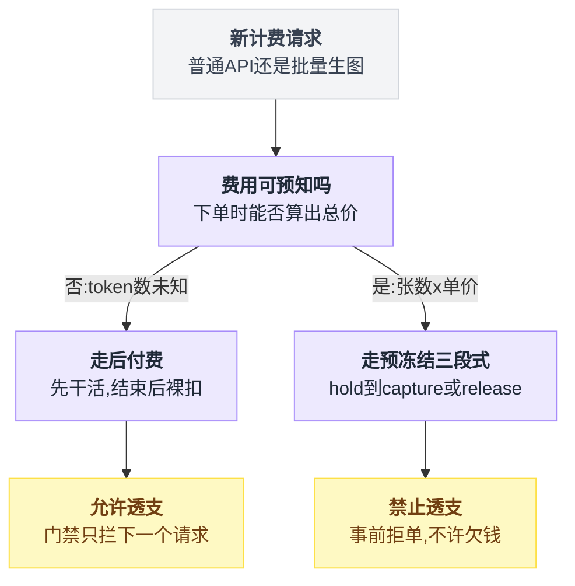
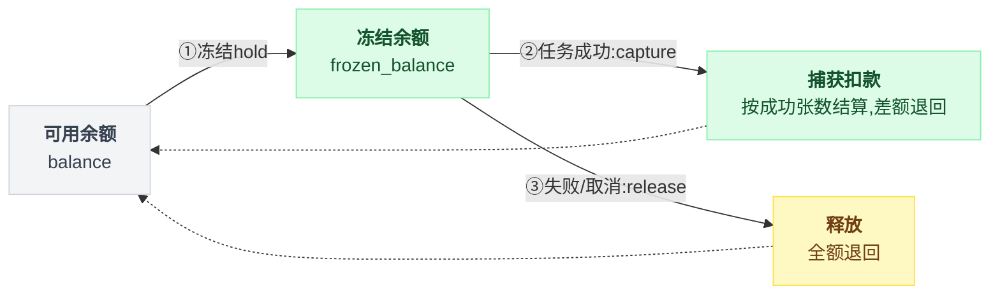
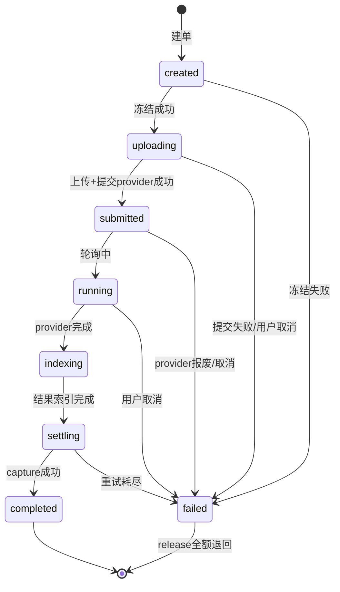
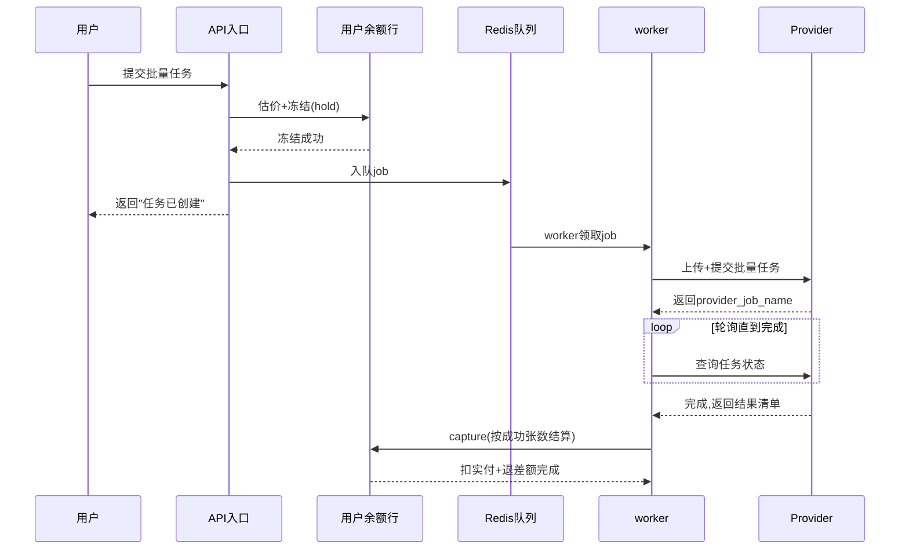
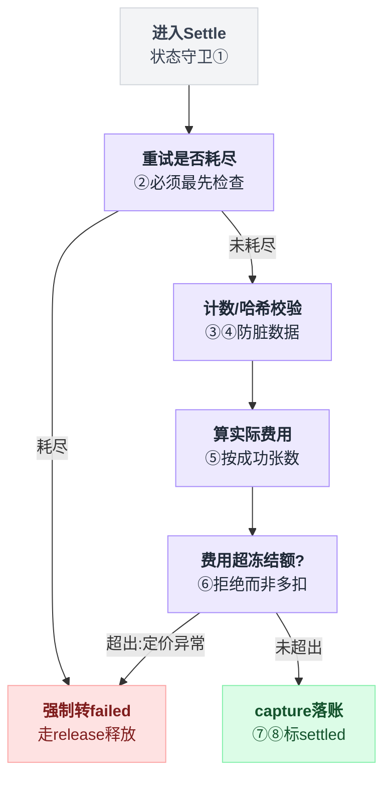
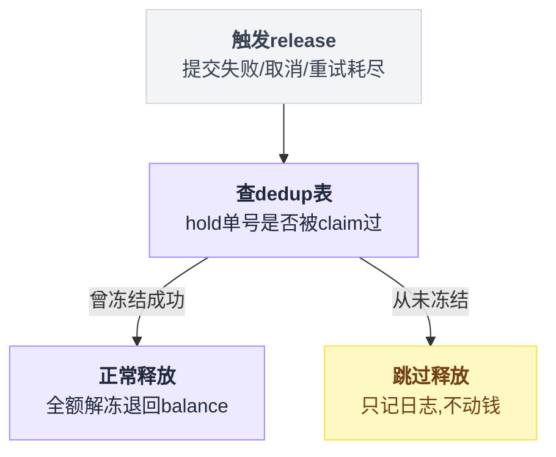
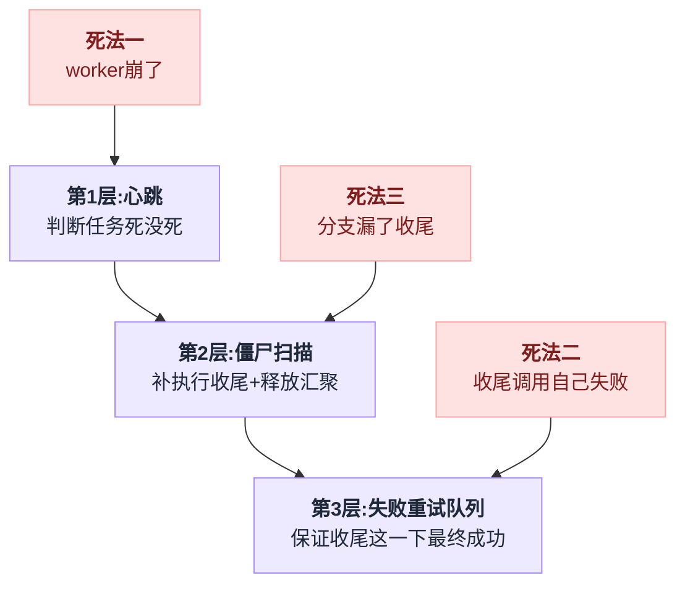
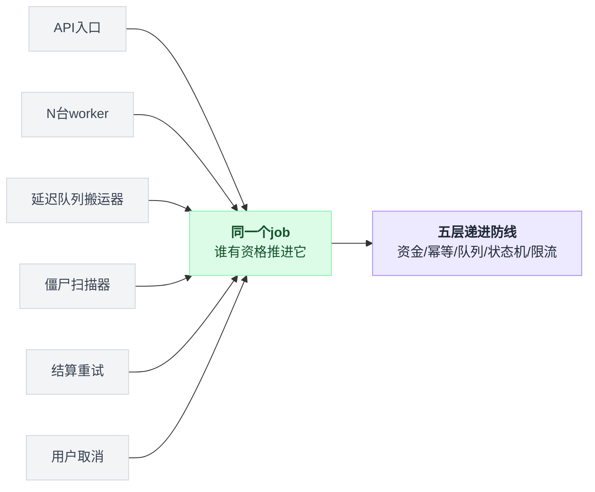

# 第 7 章:实战案例四——批量生图的预冻结三段式

> 前一章的结论是"费用不可预知的业务只能后付费"。本章是它的镜像:同一个系统里,批量生图走的是**先扣费(预冻结)**。
> 两条路线在同一份代码库里并存,构成一个"先扣费 vs 后扣费"的经典对照案例——
> 什么条件下选哪条路、各自的代价是什么、预冻结引入了哪些后付费没有的新风险,本章逐一拆解。

---

## 7.1 先扣费与后扣费:同一个系统里的两条路线

第 6 章论证过:普通 API 请求只能后付费,因为费用要等响应结束才知道。当时留了一个反例没有展开——**批量生图**。

对照两种业务的三个关键条件:

| 条件 | 普通 API 请求 | 批量生图 |
|---|---|---|
| 费用可预知吗 | 否(token 数未知) | **是**(张数 × 单价,下单时可算) |
| 单笔金额 | 小(几分~几块) | **大**(一批可能几十上百刀) |
| 任务时长 | 秒级 | **小时级** |

三个条件全部相反,策略也随之相反:

```
普通请求:后付费 + 允许透支 + 门禁拦后续
批量生图:先冻结 + 禁止透支 + 结算多退少不补
```

选路线的判断点只有一个,画出来是这样:



### 后付费在批量生图上会怎么崩

假设批量生图也走后付费,套用第 6 章的超支上界公式:

```
最大超支 ≈ 单用户并发数 × 单笔最大费用
```

普通请求单笔几分钱,这个上界可以接受。

批量生图单笔可能上百刀——**上界直接爆炸**。余额只剩 $1 的用户,同时提交 10 个 $100 的批量任务,全部通过"余额>0"的门禁,最后欠 $999。

更糟的是反馈延迟:任务跑几小时,"下一个请求被拦"的机制形同虚设——欠费发现得太晚,钱早花出去了。

反过来,先扣费在普通请求上也不成立:费用未知,冻结多少都不对;为几分钱的请求做两次资金操作,写放大不划算。

> **结论先行:先扣费与后扣费不是优劣之争,是条件匹配。**
> 费用可预估 + 单笔大 + 任务长 → 预冻结;费用不可知 + 单笔小 + 秒级 → 后付费。

## 7.2 预冻结三段式总览

批量生图的资金模型引入一个新字段:`users.frozen_balance`(冻结余额)。钱在三个状态间流转:

```
可用余额(balance) ──冻结──▶ 冻结余额(frozen_balance) ──┬─捕获──▶ 真实扣款(差额退回 balance)
                                                        └─释放──▶ 全额退回 balance
```

钱在三个字段之间的流转画成图更直观:



三段各自的名字不是这个项目发明的,沿用的是支付行业术语:

| 段 | 术语 | 动作 | 生活里的同款 |
|---|---|---|---|
| 第一段 | hold | 冻结 / 预授权 | 信用卡预授权 |
| 第二段 | capture | 捕获 / 请款 | 酒店退房按实际消费扣款 |
| 第三段 | release | 释放 / 撤销 | 押金原路解冻 |

完整生命周期[^1]:

```
下单请求进来
  │
  ├─① 估价(下单时即可算,这是与普通请求的根本差异)
  │    结算单价 = 基础单价 × 分组倍率 × 批量折扣(默认 0.5)
  │    冻结单价 = 基础单价 × hold_multiplier(默认 0.6,强制 ≥ 折扣价)
  │    预计费用 = 结算单价 × 张数     冻结金额 = 冻结单价 × 张数
  │    整份价格表拍成"定价快照"存进 job ← 结算时不再重新查价,防价格中途变动
  │
  ├─② 建单(status=created)
  │    写入 batch_image_jobs:幂等键 idempotency_key、请求哈希 request_hash、
  │    hold_id = "batch_image_hold:{batch_id}"(冻结操作的幂等单号)
  │
  ├─③ ★ 第一段:冻结(reserve)——此处不许透支
  │    冻结失败 → job 标 failed,结束
  │    冻结成功 → 创建 pending 明细项
  │      └─ 明细创建失败 → 立刻 release 解冻退回(退不掉则入队重试)
  │
  ├─④ 入队 → 返回"任务已创建"(HTTP 请求到此结束,后面全是后台)
  │
  ├─⑤ 后台 worker:上传 + 提交(created → uploading → submitted)
  │    上传输入、调 provider(Gemini/Vertex)创建批量任务,写回 provider_job_name
  │    ★ 提交期间跑"心跳":周期刷新 job 的 updated_at
  │      (让兜底扫描能区分"仍在慢提交"和"进程死了留下的僵尸单")
  │
  ├─⑥ 轮询(submitted → running)
  │    worker 反复查 provider 状态,未完成则按建议延迟重新入队(任务可能跑几小时)
  │
  ├─⑦ 结果索引(running → indexing)
  │    provider 完成 → 下载结果清单,统计 success_count / fail_count
  │
  └─⑧ ★ 第二段:结算捕获(indexing → settling → completed)
       实际费用 = success_count × 快照结算单价(失败的张数不收钱)
       capture:一条 UPDATE 完成"扣实付 + 退差额"

失败 / 取消(任何阶段)
  └─ ★ 第三段:释放(release)——全额解冻退回
```

八步里真正决定资金安全的只有三处:③冻结、⑧捕获、以及失败路径上的释放。其余五步是任务编排,读的时候可以快速掠过。

估价那一步的三个公式单独列出来看会更清楚:

| 量 | 算式 | 备注 |
|---|---|---|
| 结算单价 | 基础单价 × 分组倍率 × 批量折扣 | 批量折扣默认 0.5 |
| 冻结单价 | 基础单价 × hold_multiplier | 默认 0.6,强制 ≥ 折扣价 |
| 预计费用 | 结算单价 × 张数 | — |
| 冻结金额 | 冻结单价 × 张数 | — |

上面这条流程线里,`status` 字段实际经过的状态和触发迁移的事件,单独画一张状态机更清楚——尤其是"任何阶段失败都汇到 release"这条,文字流程图里分散在各处,状态机能一眼看全:



一次批量生图请求横跨客户端、API、后台 worker、provider 四方,把它们按时间摊开是这样:



## 7.3 第一段:冻结(reserve)

```sql
UPDATE users
SET balance        = balance - 冻结额,
    frozen_balance = COALESCE(frozen_balance, 0) + 冻结额,
    updated_at     = NOW()
WHERE id = ? AND deleted_at IS NULL AND balance >= 冻结额     -- ← 守卫:不够直接拒单
RETURNING balance, frozen_balance
```

写法上仍是第 6 章的老武器——**带守卫的原子谓词 UPDATE**,算式、守卫、RETURNING 三件套全在。

但策略与主流程的两段式截然相反:

| | 主流程扣费 | 批量生图冻结 |
|---|---|---|
| 守卫失败后 | 第二段裸扣,允许负数 | **直接拒单,没有第二段** |
| 理由 | 钱已花出去,账必须记 | 钱还没花,**有资格说不** |

这正是先扣费的核心收益:**拒绝的时机在成本发生之前**。后付费的门禁只能"拦下一个请求",先扣费的门禁能"拦住这一单"。

一个次要细节容易被略过:冻结额用的是 `hold_multiplier`(默认 0.6),不是折扣价(默认 0.5)——**多冻 20% 作为价格波动的缓冲**,并强制 hold ≥ 折扣价,保证结算时"实际费用 ≤ 冻结额"恒成立。

## 7.4 第二段:捕获(capture)——结算

结算入口 `Settle()` 是整条链路上校验最密的一段,而且顺序有讲究。八步写成伪代码:

```
def Settle(job):
    if job.status == completed:  return "已结算"          # ① 状态守卫:天然幂等
    if job.status != settling:   return 拒绝

    if 重试次数已耗尽:                                     # ② 必须放在所有校验之前!
        job.status = failed
        release(job)                                      #    防坏单无限重试、冻结永不解冻
        return

    assert success + fail <= item_count                   # ③ 计数合法性:防 provider 返回脏数据
    assert manifest_hash == 首次见到的哈希                 # ④ 防结果清单中途被替换

    实际费用 = success_count × 快照里的结算单价            # ⑤ 只按成功张数收钱
    assert 实际费用 <= 冻结金额                            # ⑥ 超出 = 定价异常,拒绝结算而不是多扣

    capture(job)                                          # ⑦ 落账,见下
    标记 settled; 记 usage log(账单可见); 失效余额缓存      # ⑧
```

八步里最容易被忽视的不是任何一条校验,而是**它们的先后**——②必须排在③④之前,否则一张永远过不了校验的坏单会无限重试,冻结永远解不开[^2]。



capture 的 SQL,一条 UPDATE 同时完成"扣实付"和"退差额":

```sql
UPDATE users
SET balance        = balance + (冻结额 - 实际费用),          -- 差额退回可用余额
    frozen_balance = COALESCE(frozen_balance, 0) - 冻结额,    -- 冻结全部清空
    updated_at     = NOW()
WHERE id = ? AND COALESCE(frozen_balance, 0) >= 冻结额
RETURNING balance, frozen_balance
```

两个值得多看一眼的点:

- **"扣实付 + 退差额"必须在同一条语句里**。拆成两条(先退差额、再清冻结),中间被插队或崩溃,资金就出现中间态——又是第 1 章的缝隙问题,解法依旧是"压进一个原子单元"
- **步骤⑤的单价来自下单时的定价快照,不是结算时现查**。任务跑了几小时,期间管理员可能调价——按快照结算,用户下单时看到的价格就是最终价格。这是"拍快照 → 慢慢干 → 按快照兑现"模式在定价上的应用(与第 5 章令牌轮换的快照思想同源)

## 7.5 第三段:释放(release)

任何终态失败(提交失败、provider 报废、用户取消、结算重试耗尽)都汇到同一个动作——全额解冻:

```sql
UPDATE users
SET balance        = balance + 冻结额,
    frozen_balance = COALESCE(frozen_balance, 0) - 冻结额,
    updated_at     = NOW()
WHERE id = ? AND COALESCE(frozen_balance, 0) >= 冻结额
```

但在这条 UPDATE 之前,还有一道**幻影释放守卫**:

```
def release(job):
    if dedup 表里 "batch_image_hold:{batch_id}" 从未被 claim 过:
        记日志; return          # 这笔 job 的冻结压根没成功过,不能退
    执行上面那条解冻 UPDATE
```

为什么非要拦这一下:冻结从未成功的 job 触发释放,等于**从其他用户的冻结资金池里凭空造出余额**[^3]。

这道守卫画成决策图,和正常的三段式主链路是两条不同的路:



这是计费系统的一条通用直觉(第 6 章末尾出现过,此处是完整实现):

> **加钱的路径永远比扣钱的路径多一道验证。**
> 扣错了用户会来投诉,系统能发现;加错了没人吭声,钱无声流失。

## 7.6 三段的幂等:固定单号

hold / capture / release 各有一个**由 batch_id 派生的固定幂等单号**:

```
batch_image_hold:{batch_id}
batch_image_capture:{batch_id}
batch_image_release:{batch_id}
```

三个单号的派生逻辑[^4]复用主流程那张 `usage_billing_dedup` 表,第 6 章 6.5 的机制原样复用,没有新造轮子。

三段放在一起看,守卫和单号是一一对应的:

| 段 | SQL 守卫 | 幂等单号 |
|---|---|---|
| hold | `balance >= 冻结额` | `batch_image_hold:{batch_id}` |
| capture | `frozen_balance >= 冻结额` | `batch_image_capture:{batch_id}` |
| release | `frozen_balance >= 冻结额` | `batch_image_release:{batch_id}` |

效果:结算重试 10 次、扫描器和 worker 同时触发释放、任何角色重复触发任何资金动作——**每一段在整个生命周期里恰好执行一次**。

这是三段式能够安全重试的地基:上层的锁、状态机、恢复扫描可以放心大胆地"再试一次",钱不会多动。

## 7.7 预冻结的新风险:冻结泄漏

后付费的固有风险是超支;先扣费消灭了超支,却引入一个后付费没有的新风险——**冻结泄漏**。一句话定义:

> **冻结泄漏 = 钱被冻住了,但永远没人来解冻。**
> 用户账上有一笔钱既花不掉、也退不回;这样的钱随时间一点点积累,像水管漏水,所以叫"泄漏"。

### 先建立直觉:酒店押金

住客入住酒店,前台在信用卡上预授权冻结 1000 元押金(这就是 hold)。正常流程有两个结局:

- 退房时实际消费 300 元 → 扣 300、解冻 700(这是 capture + 退差额);
- 没有任何消费 → 全额解冻 1000(这是 release)。

现在考虑一个异常:酒店当晚失火倒闭,没有人来办退房手续。卡上那 1000 元会一直冻着——钱还是住客的,但花不了。这就是冻结泄漏。

关键点:泄漏不是钱被偷了、被多扣了,而是**"解冻"这个动作依赖某个后续流程去执行,而那个流程死了**。

### 泄漏具体怎么发生:一个结构性事实,三种死法

回看 7.2 的生命周期图,有一个容易被忽略的结构性事实:**hold 发生在任务开始前,capture/release 发生在任务结束后**,中间隔着一个可能跑几分钟甚至几十分钟的长任务。

把这个不对称写出来就是全部问题所在:

```
hold(user, 冻结额)                # 100% 会执行:不冻结,任务根本不会开始
    ... 长任务,几分钟到几十分钟 ...
capture(job) 或 release(job)      # 只是"应该"执行:进程会死、调用会失败、分支会漏写
```

泄漏就藏在这个时间差里。三种典型死法:

**死法一:worker 崩了。**
用户提交批量任务,系统冻结了预估费用,worker 在上传输入文件时进程被 OOM 杀掉。job 永远停在"进行中",capture 和 release 谁都不会被调用,冻结的钱冻到天荒地老。

**死法二:任务本身结束了,但收尾那一下失败了。**
图全部生完,worker 去调 capture(或失败路径去调 release),恰好赶上数据库抖动,调用失败。若 worker 就此退出,任务显示已终态,钱却还冻着。

**死法三:流程有分支漏了收尾。**
比如"用户中途取消"这条路径,开发时忘了在取消逻辑里调 release。功能测试全走"正常完成"路径,测不出来;上线后每一次取消都漏一笔。

三种死法的共同点,就是上面那段伪代码的两行注释:**hold 是 100% 会执行的,而收尾动作只是"应该"执行**。任何让收尾没跑到的原因——进程死亡、调用失败、代码分支遗漏——都变成泄漏。

### 为什么说这是"先扣费独有"的风险

对照第 6 章的后付费:后付费是"先干活、干完扣钱",收尾扣费失败的后果是**平台少收一笔**——平台亏,用户无感,性质是坏账,可以事后对账追补。

先扣费正好反过来:hold 先把用户的钱押住了,收尾失败的后果是**用户的钱被无限期占用**——余额明明够却买不了别的东西,这是资损级别的客诉,比坏账严重得多。

所以选了预冻结路线,等于签下一份契约:

> **每一笔 hold,系统必须保证最终有且仅有一个结局:capture 或 release。**

下面的三层缓解机制,兜的就是这份契约。三层怎么递进、各自兜住哪种死法,先看总览:



### 三层防线:递进,不是三选一

三层不是并列的三个选项,是递进的三道防线,每一道兜住上一道漏掉的[^5](定时器本体在第 14 章)。

**第 1 层:心跳——让"任务死没死"变得可判断。**

worker 提交任务给 provider 可能很慢(上传大文件),提交期间周期性刷新 job 的 `updated_at`。

心跳本身不解决泄漏,它解决一个前置问题:光看状态字段,分不清"任务还在慢慢跑"和"worker 已经崩了"——两者的状态都是"进行中"。有了心跳,"超过 10 分钟没心跳"才成为可靠的死亡判据。

**心跳是给第 2 层提供裁决依据的,自己不动钱。**

**第 2 层:僵尸单扫描——主动找出漏网的冻结,补执行收尾。**

定时任务(第 14 章的 `runBillingRecovery`,每 5 分钟)扫描"进行中但心跳已断、且从未提交到上游"的 job,找到后转 failed 并补执行 release。这一层兜住**死法一**:不管 worker 因为什么原因没收尾,扫描保证最终有人来收尾。

对**死法三**(分支遗漏),sub2api 还有一道结构性预防:7.5 已经交代过,所有终态失败——提交失败、provider 报废、用户取消、结算重试耗尽——**汇聚到同一个释放函数**,而不是每个分支各写一份解冻代码。

汇聚点唯一,"某个分支忘了调"就从"容易犯的错"变成"很难犯的错";即便真漏了,终态但冻结未释放的单子仍会被 worker 的终态释放逻辑(`releaseTerminalHold`)接住。

但扫描定罪不能鲁莽——**定罪动作必须把全部判断条件在 UPDATE 里原地复核**:

```sql
UPDATE batch_image_jobs SET status = 'failed', ...
WHERE batch_id = ?
  AND status IN ('created', 'uploading')      -- 复核:还没提交成功
  AND provider_job_name IS NULL               -- 复核:上游确实没有这个任务
  AND updated_at <= 截止线                     -- 复核:心跳确实停了
```

为什么要复核:"扫描发现僵尸"和"动手定罪"之间,慢提交可能靠心跳续了期、甚至已提交成功——影响 0 行 = 定罪作废。

源码注释写得很直白:此时绝不能退款,**否则上游任务照常产生成本,而用户已拿回冻结余额**。这又是"检查+动手合并成带谓词的原子 UPDATE"(第 1 章 TOCTOU 的标准解法,第 4 章的同款套路)。

这里也能看清 7.6 固定幂等单号的另一层用意:扫描器补发的 release 和原流程可能同时补跑的 release 撞在一起时,靠同一个单号 `batch_image_release:{batch_id}` 保证**只生效一次**——兜底路径和主路径可以放心并存,不必小心翼翼地互斥。

**第 3 层:释放失败重试队列——兜住"补救动作本身也会失败"。**

死法二说明:release/capture 这一下调用自己也可能赶上 Redis/DB 抖动而失败。

更麻烦的是,定罪成功后 job 已转 failed,**不会再出现在下一轮僵尸扫描列表里**——第 2 层对它已经失效。所以释放失败绝不能就地放弃,必须把这笔待释放入队重试,由 worker 的终态释放逻辑反复兜底,直到成功。

一句话分工:第 2 层保证"有人来收尾",第 3 层保证"收尾这一下最终能成"。

结算侧同理:settling 状态的重试次数有上限,且耗尽检查放在所有校验**之前**——否则"计数非法""定价缺失"这类永远失败的校验会让坏单无限重排队,冻结同样永不释放。

### 一张表收束

| 防线 | 回答的问题 | 兜住的死法 |
|---|---|---|
| ① 心跳 | 任务到底死了没有? | (判据层,自己不动钱) |
| ② 僵尸扫描 + 终态释放汇聚 | 死了的任务谁来收尾? | 死法一(worker 崩溃)、死法三(分支遗漏) |
| ③ 释放失败重试队列 | 收尾动作失败了怎么办? | 死法二(释放/结算调用本身失败) |

还有一处对称性值得点破:**三层缓解防的是"漏"**(该释放的没释放),**7.5 的幻影释放守卫防的是"重"**(不该释放的释放了、或多退)。

一漏一重,正好是冻结生命周期的两个反向风险——防线在两个方向上都要设,只防一边的系统,钱会从没设防的那边流走。

> 汇总成一条设计规则:**预冻结把"少收钱的风险"换成了"占用户钱的风险",代价是必须为每一笔冻结兜底一个确定的结局。** 心跳负责发现死亡,僵尸扫描负责补收尾,重试队列负责收尾必达——三层合起来,把"冻结最终一定会被 capture 或 release"从愿望变成机制。推广开:引入任何"中间态资金"(冻结/在途/挂账)的系统,都必须为每一种中间态回答"卡死了谁来解、解不掉怎么重试"——答不上来的中间态,就是未来的资损点。

## 7.8 这里的高并发:画像完全不同

批量生图的"高并发"与主流程是两种形态:

| | 余额扣费(主流程) | 批量生图 |
|---|---|---|
| 并发形态 | 同一行余额,每秒几百次**短**写入 | 同一个 job,被**多个角色**在几小时里反复触碰 |
| 竞争者 | 同类(扣费请求) | API 入口、N 台 worker、延迟队列搬运器、僵尸扫描器、结算重试、用户取消——六种角色 |
| 核心矛盾 | 热点行吞吐 | **任务所有权**:谁有资格推进这个 job |

六种角色同时可能touch同一个 job,谁都想推进它,这幅"多对一"的争抢关系是主流程完全没有的:



主流程靠"让操作可交换"化解;批量生图的操作(状态流转、冻结、结算)不可交换,化解手段变成五层递进,**每层都假设上一层会坏**。

### 第 1 层:资金——老武器

三段全是带守卫的原子谓词 UPDATE,并发资金动作在用户行上微秒级排队。钱这一层没有新问题。

### 第 2 层:幂等——终极兜底

7.6 的固定单号。上面所有锁和状态机全部失效时,钱也只动一次。

### 第 3 层:队列所有权——把并发收敛成单线程

Redis 队列的每个复合操作都压进 Lua[^6],注释直接写明防的是什么:

```
入队:SetNX(去重键) + LPUSH 在一个 Lua 里
     → 防两步之间进程崩溃:去重键设了、job 没进队列,7 天内重新入队全被挡,任务永久卡死
     → 同时保证同一 job 不会在队列里出现两份

领取:RPOP(ready) + ZADD(active,带超时戳) 在一个 Lua 里
     → 防弹出后崩溃:job 脱离所有队列结构,凭空消失

持有:per-job 锁,值 = 本 worker 的随机 token
     心跳续期:GET==token 才 PEXPIRE
     释放:  GET==token 才 DEL     ← 防锁过期后误删继任者的锁
```

"GET==token 才 DEL"就是第 2 章的 Redis 层 CAS,比较的是**锁的持有者身份**。效果:同一 job 同一时刻只有一个 worker 在处理,处理逻辑本身无需考虑并发。

worker 死亡由 active zset 兜底:领取时带超时时间戳,超时未完成 → 原子搬回 ready 队列,换一台 worker 重做——配合第 2 层幂等,重做不重复扣钱。

### 第 4 层:数据库状态机——锁失效时的最后裁判

Redis 锁会丢(过期、脑裂)。两个 worker 同时推进同一 job 时,DB 层还有一道**短事务悲观锁**[^7]:

```sql
BEGIN;
SELECT status FROM batch_image_jobs WHERE batch_id = ? FOR UPDATE;   -- 锁行
-- 校验 current → toStatus 在合法流转表内,非法则报 INVALID_TRANSITION
UPDATE batch_image_jobs SET status = ?, version = version + 1, ...;
COMMIT;
```

这是全项目罕见的 `FOR UPDATE` 使用点,而且用得完全合规——对照第 2 章的锁纪律:**低频(一个 job 一小时流转几次)、事务内零网络 IO、毫秒级持锁**,三条全满足。

并发流转中后到的一方会撞上"当前状态已变、流转不合法"被拒绝。

危险路径(僵尸定罪)则用谓词 CAS(7.7 的②);结算入口有状态守卫(7.4 的①)。并发触发结算天然收敛。

### 第 5 层:资源上限

结果下载有专门的并发限制器(acquire/release Lua)——同时下载的任务数有界,防一批大任务同时完成时打爆带宽和内存。

```
资金错乱   → 第1层 原子谓词 UPDATE
重复动作   → 第2层 固定幂等单号 + dedup 表
多worker抢 → 第3层 Lua 原子队列 + per-job token 锁 + 心跳
锁丢了     → 第4层 状态机:FOR UPDATE 流转 / 谓词 CAS 定罪
资源打爆   → 第5层 并发限制器
```

## 7.9 先扣费 vs 后扣费:全维度对照

| | 普通请求(后付费,第 6 章) | 批量生图(预冻结,本章) |
|---|---|---|
| 费用何时可知 | 结束后 | 下单时(张数×单价) |
| 准入 | 看缓存余额>0,不动钱 | **真扣**:balance→frozen,不够拒单 |
| 透支 | 允许(两段式裸扣) | **禁止**(三段全带守卫) |
| 资金动作次数 | 1 次(扣) | 2 次(冻结→捕获 或 冻结→释放) |
| 价格 | 结算时算 | **下单时拍快照**,结算只认快照 |
| 幂等 | request_id 每请求一个 | 三个固定单号,同一张 dedup 表 |
| 固有风险 | 超支(有上界,可追缴) | **冻结泄漏**(心跳+扫描+释放重试三层兜底) |
| 并发画像 | 热点行高频短写 | 多角色长周期竞争任务所有权 |
| 并发武器 | 原子增量(可交换) | 锁收敛 + 状态机裁决 + 幂等兜底 |
| 拒绝时机 | 事后(拦下一个请求) | **事前(拦住这一单)** |

---

## 本章要点

```
① 先扣费 vs 后扣费是条件匹配,不是优劣:
   费用可预估 + 单笔大 + 任务长 → 预冻结;反之 → 后付费
② 三段式 = hold(冻结)→ capture(扣实付+退差额)→ release(全额退):
   每段一条原子谓词 UPDATE,每段一个固定幂等单号
③ capture 的"扣实付"和"退差额"必须在同一条语句里;单价按下单时的快照,不现查
④ 加钱路径(release)比扣钱路径多一道验证(幻影释放守卫)
⑤ 预冻结消灭超支,换来"冻结泄漏"风险(收尾流程死了,钱永远冻着):
   每笔 hold 必须保证有且仅有一个结局(capture 或 release)——
   心跳发现死亡、僵尸扫描补收尾、重试队列保证收尾必达;
   三层防"漏",幻影守卫防"重",两个方向都要设防
⑥ 长周期任务的并发是"多角色抢所有权",不是"热点行吞吐":
   锁把并发收敛成单线程,状态机裁决锁失效的漏网,幂等保证钱在一切失效时只动一次
⑦ "低频 + 短事务 + 无 IO"三条全满足时,悲观锁(FOR UPDATE)就是最简单的正确答案:
   选型顺序(增量→CAS→锁)是指导,不是教条
```

下一章:[工程细节——不起眼但致命的写法](./8_工程细节_不起眼但致命的写法.md)

---

## 出处

[^1]: 完整生命周期源码:`batch_image_public.go` / `batch_image_processor.go` / `batch_image_settlement.go`。
[^2]: capture 顺序校验(重试耗尽必须排在计数/哈希校验之前)的实现:`batch_image_settlement.go:76`。
[^3]: 幻影释放守卫的实现:`usage_billing_repo.go:341-346`。
[^4]: 三个幂等单号的派生逻辑:`batch_image_billing_hold.go:18-27`。
[^5]: 三层缓解机制(心跳、僵尸扫描、释放失败重试队列)源码:`batch_image_billing_recovery.go`。
[^6]: Redis 队列入队/领取/持有三个复合操作的 Lua 实现:`batch_image_queue.go`。
[^7]: DB 层短事务悲观锁(`FOR UPDATE` 流转)实现:`batch_image_repo.go:357-384`。
