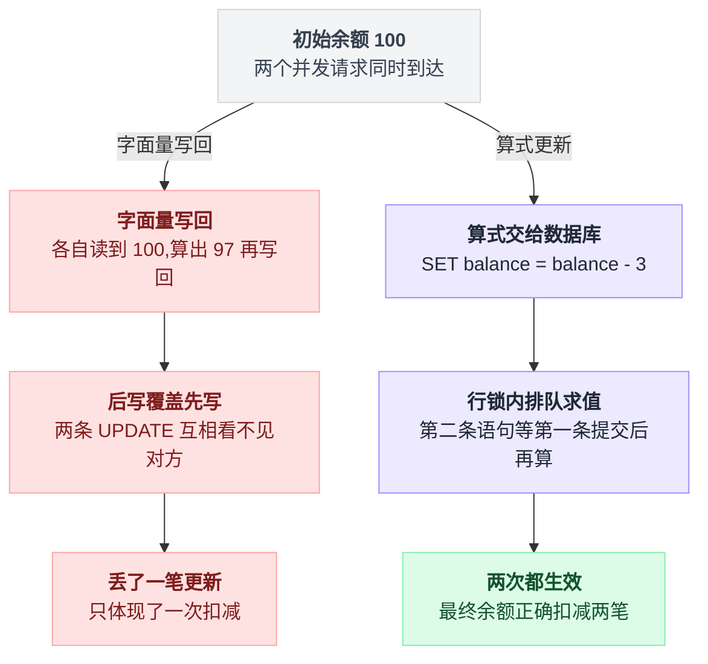
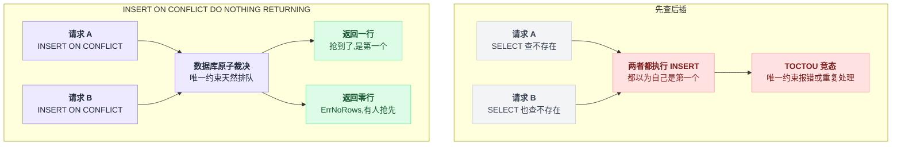
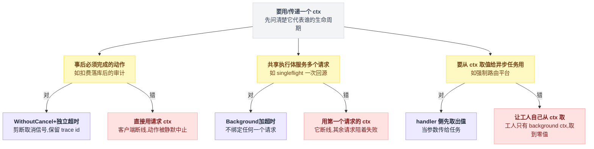
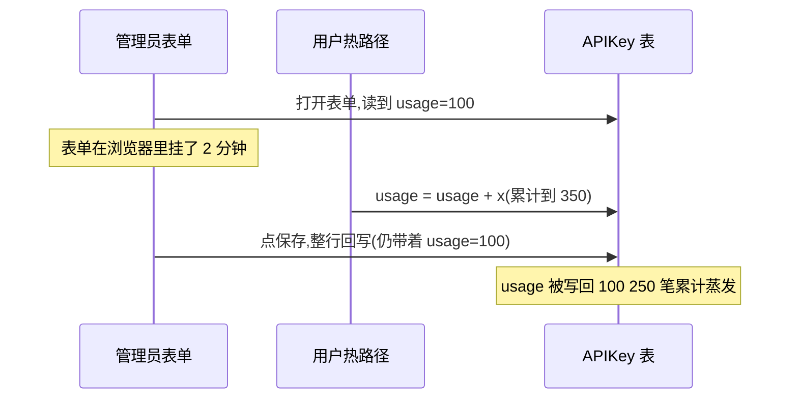
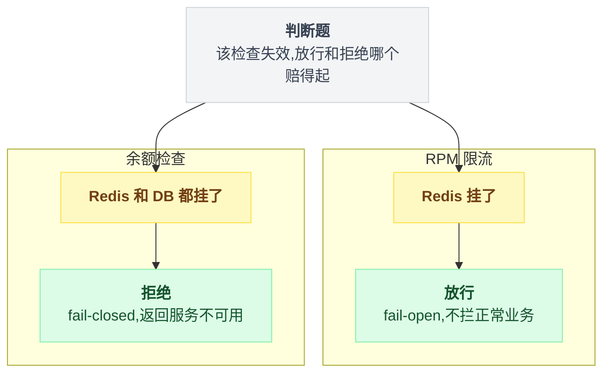
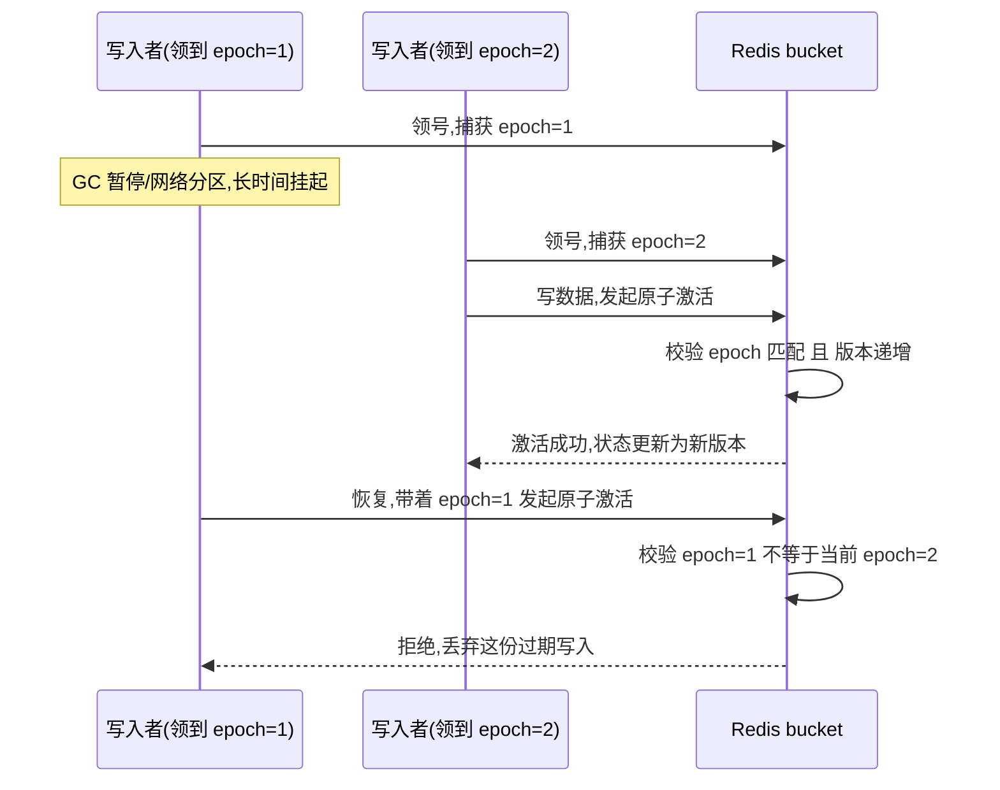

# 第 8 章:工程细节——不起眼但致命的写法

> 前面按"场景"讲,本章按"写法"讲。
>
> 这些写法很容易被当成代码洁癖——反正跑起来功能一样,选哪种全看个人习惯。**不是的:本章每一条,换成"看起来也没什么错"的另一种写法,后果都是真金白银的丢账、被拖垮的内存,或者一个本该报警却被静默吞掉的错误。**
>
> 每条依然回答:为什么这样写?不这样写会怎样?均配最简化的示例代码,具备 Go 和 SQL 基本语法知识即可读懂。

---

## 8.1 SQL 写法四件套

四件套是同一个思路的四种形态:**把并发下的裁决权交给数据库,而不是留在应用里自己算、自己判。**

| 写法 | 一句话 |
|---|---|
| ① 写算式,不写死值 | SET 右边放表达式,行锁内求值 |
| ② RETURNING | 改完后的值随语句一起回来 |
| ③ ON CONFLICT DO NOTHING RETURNING | 抢占和"抢没抢到"一步完成 |
| ④ RowsAffected | 免费的赢家判据 |

### ① 写算式,不写死值(全书最重要的一条)

```sql
-- ❌ 应用算好再写回:必丢更新
UPDATE users SET balance = 97 WHERE id = 2

-- ✅ 把算式交给数据库:行锁内求值,并发自动排队
UPDATE users SET balance = balance - 3 WHERE id = 2
```

**自查方法**:看 UPDATE 的 SET 右边是表达式还是字面量。像上面例子里"余额减 3"这样的算式,安全;先在应用里算出"97"这个具体数再写回去,就是字面量,必有缝。

两种写法在并发下的分岔:



### ② RETURNING:把"改完后的世界"顺手带回来

```sql
UPDATE users SET balance = balance - 3 WHERE id = 2
RETURNING balance          -- ← 新余额随扣减一起返回
```

省掉 RETURNING 会怎样?扣完再补一次 SELECT 去拿新余额。多一次往返只是小事,大事是**SELECT 读到的可能已经被其他并发再扣过一次**——拿着一个"不是这笔扣完"的值去做阈值判断、发低额通知,全是错位的。

RETURNING 的值与扣减在同一原子语句里产生,绝对一致。

### ③ ON CONFLICT DO NOTHING RETURNING:一步完成"抢占 + 知道抢没抢到"

```sql
INSERT INTO dedup (request_id) VALUES ($1)
ON CONFLICT (request_id) DO NOTHING
RETURNING id
-- 返回了行  → 抢到了,是第一个
-- 返回零行  → 有人抢先(Go 里表现为 sql.ErrNoRows)
```

换成"先查后插"会撞上经典的 TOCTOU:并发下两个执行流都"查到不存在",于是都执行插入——结果要么一个吃唯一约束报错(没设计这个分支就会被当成系统错误),要么两个都以为自己是第一个。

两条路径在并发下的差别:



### ④ 影响行数(RowsAffected)是免费的"赢家判据"

数据库 CAS 的统一判定方式:

```go
res := UPDATE ... WHERE id=? AND 状态=旧值
if res.RowsAffected > 0 {
    // 赢了 → 只有赢家才做副作用(发失效事件、发通知、刷缓存)
} else {
    // 输了 → 通常回读真值,按真值决策;不报错
}
```

少了这一步会怎样?所有执行流都会把自己当赢家——缓存被失效 N 次,通知发 N 条,事件写 N 份。

## 8.2 Go 事务骨架:defer Rollback + 提交后置 nil

```go
tx, err := db.BeginTx(ctx, nil)
if err != nil { return err }
defer func() {
    if tx != nil {
        _ = tx.Rollback()      // 任何提前 return / panic 的路径:自动回滚
    }
}()

// ... 事务内的各种操作,任何一步 return err 都会被 defer 兜住 ...

if err := tx.Commit(); err != nil { return err }
tx = nil                        // ← 提交成功后置 nil,defer 变成空操作
return nil
```

换成在每个 error 分支手写 Rollback 会怎样?总会漏掉一个分支,尤其是 panic 路径。漏掉的那个事务就那么挂着,既不提交也不回滚,**占着连接和锁**直到超时。

这个范式的价值在于把"所有路径都回滚、唯独提交成功免疫"变成结构保证,而不是人工纪律。

## 8.3 sql.ErrNoRows 当三态分支用,但语义跟着语句走

```go
err := tx.QueryRow(`UPDATE ... WHERE ... AND balance >= $1 RETURNING balance`).Scan(&b)
// 此处的 ErrNoRows = "余额不足"(守卫没过)

err = tx.QueryRow(`UPDATE ... WHERE id = $2 RETURNING balance`).Scan(&b)
// 此处的 ErrNoRows = "用户不存在"
```

同一个哨兵错误,在不同语句后含义完全不同。

**规矩:ErrNoRows 必须在语句紧后就地处理,绝不把 err 向外传**——传远了没人知道它当时代表什么。

## 8.4 context 三式

三式回答的是同一个问题:**这个 ctx 该代表谁的生命周期?**

| 场景 | 该用的 ctx |
|---|---|
| 事后必须完成的动作 | WithoutCancel + 独立超时 |
| 共享执行体服务多个请求 | Background + 超时 |
| 要把 ctx 里的值给异步任务 | handler 侧先取出,当参数传 |

### ① WithoutCancel:事后必须完成的动作,剪断请求的取消信号

```go
base := context.WithoutCancel(requestCtx)    // 保留 trace id 等值,剪断取消
ctx, cancel := context.WithTimeout(base, 30*time.Second)  // 换成独立超时
```

省掉这一步会怎样?客户端一断线,请求 ctx 就被取消,正在执行的扣费、审计、通知跟着被静默中止——不报错、不好复现,常常要等到月底对账才暴露。(详见第 6 章 6.7。)

### ② 共享执行体不用任何单个请求的 ctx

singleflight 里 10 个请求共享 1 次数据库回源,回源函数要用 Background 加独立超时,不能用第一个请求的 ctx。

用错了会怎样?第一个请求恰好断线,其余 9 个也跟着一起失败。

### ③ 从 ctx 取值的逻辑,必须在拥有那个 ctx 的一侧完成

请求 ctx 里存的值(如强制路由平台),异步工人拿不到——工人用的是池子的 background ctx。

```
// 对:handler 手上才有请求 ctx,由它来取
平台 := requestCtx.取值("强制路由平台")
pool.Submit(func(工人ctx) { 计费(平台) })      // 值当参数进去

// 错:让工人自己取
pool.Submit(func(工人ctx) {
    平台 := 工人ctx.取值("强制路由平台")        // 池子的 background ctx 里根本没有
    计费(平台)                                  // 取到零值,静默走错分支
})
```

**规矩:handler 在提交任务前把值取出来,当参数传进任务。** 反过来做,工人拿到的就是零值,会静默走错分支。

三条规矩本质上都在回答同一个问题——这个 ctx 该代表谁的生命周期:



## 8.5 闭包入队前,先把值剥成标量

```go
// ❌ 闭包直接引用大对象
pool.Submit(func(ctx context.Context) {
    bill(fs.ForceCacheBilling, ...)     // fs 整个被闭包保活,包括其中的响应体
})

// ✅ 先拍快照
forceCacheBilling := fs.ForceCacheBilling    // 只留一个 bool
pool.Submit(func(ctx context.Context) {
    bill(forceCacheBilling, ...)
})
```

直接引用大对象会怎样?闭包捕获的是**变量**,不是值。任务在队列里排 10 秒,那个几 MB 的响应对象就跟着被 GC 保活 10 秒——高峰期内存被"早已没用的响应体"占满。

## 8.6 有界池 + 显式溢出策略 + 降级可观测

```go
ok := pool.TrySubmit(task)          // 非阻塞探测,满不满自己知道
if !ok {
    switch overflowPolicy {
    case "sync":  task()            // 计费类:提交方当场执行(背压)
    case "drop":  dropCounter.Add(1); logThrottled()   // 缓存类:丢,但要计数
    }
}
```

三条纪律:

1. **永远不用不设上限的裸 goroutine** 处理业务任务——过载时炸的是整个进程
2. **溢出策略按"丢了赔不赔钱"选**:钱→sync 退化同步;缓存→可丢(有 TTL 兜底)
3. **每种降级配独立计数器**:sync 了多少次、丢了多少个,运维面板能看到系统处在哪个档位

最后一条常被当成锦上添花,其实是必需项:**降级不可观测 = 没有降级,只有静默劣化**。

## 8.7 更新字段白名单:保护原子计数列

场景:管理后台"编辑 API Key"表单。管理员打开表单(此时已用量=100),改个名字,2 分钟后点保存;期间用户狂用,已用量涨到 350。

**最自然的保存方式(ORM 整行回写)**:表单里旧的 100 被整行写回——**250 笔原子累计瞬间蒸发**。热路径辛苦攒下来的每一笔"用量加一点"的原子累计,被一次无辜的改名全部抹掉。



sub2api 的解法:更新接口强制声明"这次改哪几列"。

```go
type APIKeyUpdateFields struct {
    Name      bool
    Status    bool
    Quota     bool
    // QuotaUsed 仅供"重置用量"这一条路径声明;常规计费走原子增量接口
    QuotaUsed bool
}
// Update(id, data, fields) 只写 fields 里标 true 的列
```

写进去的时候是这么裁的:

```
Update(id, data, fields):
    for 每一列 in data:
        if fields[该列] == true:  写这一列
        else:                     完全不碰,连 SET 都不出现
// QuotaUsed 只有"重置用量"这条路径会标成 true
// 常规计费根本不走这里,走原子增量接口:usage = usage + x
```

> **规矩:计数器类字段(余额、用量、库存)只允许通过"加减接口"修改,永远不进普通的编辑-保存流程。**
> 原子增量列的天敌不是并发增量(那是安全的),而是**任何一次整行回写**。

## 8.8 错误分级:哪些必须炸,哪些只能记

sub2api 的计费链路里,错误处理明显分三档:

| 档 | 例子 | 处理 |
|---|---|---|
| 必须让调用方知道 | 扣费事务失败、幂等指纹冲突 | 返回 error / 专用错误码 |
| 记账成功但周边失败 | 缓存失效失败、通知发送失败 | Warning 日志 + 继续(缓存有 TTL 兜底) |
| 持久化兜底失败 | 配额 DB 异步落库失败 | **ALERT 级日志 + 计数器**,提示人工对账 |

分档时脑子里跑的其实就一个判断:

```
if 这个失败会造成"账不对":
    if 调用方还能补救:  返回 error / 专用错误码     // 扣费事务失败、幂等指纹冲突
    else:               ALERT 级日志 + 计数器       // 配额 DB 异步落库失败,提示人工对账
else:                                              // 有兜底机制自动修正
    Warning 日志 + 继续                            // 缓存失效失败、通知发送失败
```

判断标准就是那句 **"这个失败会不会造成'账不对'?"**——会 → 向上抛或 ALERT;不会(有兜底机制自动修正)→ 降级继续。

反面教材:所有错误一律记成一条 Error 日志然后吞掉——真正的丢账淹没在噪音里。

## 8.9 限流的 fail-open 与计费的 fail-closed

同一个系统里,两种相反的故障策略并存:

| 检查项 | 故障情形 | 策略 | 理由 |
|---|---|---|---|
| RPM 限流 | Redis 挂了 | **放行**(fail-open) | 限流是保护措施,保护措施故障不应拦住正常业务 |
| 余额检查 | Redis 和 DB 都挂了 | **拒绝**(fail-closed,返回"计费服务不可用") | 钱的检查失效时放行 = 无限白嫖 |

> 判断题:**该检查失效时,放行的最坏后果和拒绝的最坏后果,哪个赔得起?** 逐个检查项单独回答,不能一刀切。



## 8.10 进阶:epoch fencing——分布式版的"防僵尸写入"

sub2api 的调度器把账号快照发布到 Redis,多个写入者可能并发发布。这里用了一个比 CAS 更强的模式:

```
每个 bucket 有一个 epoch(代际号)
写入者开工前先"领号"(捕获当前 epoch)
写入分两阶段:写数据 → 原子激活
激活的 Lua 脚本同时验三件事:
  ① bucket 没被退休
  ② 持有的 epoch == 当前 epoch     ← fencing:代际变了,说明是上个时代的僵尸
  ③ 版本号 >= 当前激活版本          ← 防回滚:旧版本不许覆盖新版本
任何一条不过 → 丢弃刚写的数据(输家清理自己的垃圾),返回错误码
旧快照不立即删,给一个宽限 TTL      ← 正在读旧版本的 reader 不会踩空
```

它解决的是一个经典问题:**慢写入者被暂停(GC/网络分区)很久后恢复,带着过期数据覆盖新状态。**

单纯的锁防不住这种情况——锁早已过期并被别人拿走了,必须靠"代际号验证"让老代际的写入必然失败。分布式系统里管这个叫 **fencing token**。



日常业务用不到这么重的模式,但它与第 5 章的 `_token_version` 是同一思想的不同强度:**给"写入资格"编号,过期的资格自动作废。**

---

## 本章清单(速查版)

这十条看似互不相关,但都在做同一件事:把"会不会漏一步"的判断权交给数据库的原子性、语言的生命周期规则,或者一张显式的白名单——而不是相信人在并发和异步面前不会手滑。按分类过一遍,自查用。

```
SQL:
□ UPDATE 的 SET 右边是表达式,不是应用算好的死值
□ 需要"改完后的值"用 RETURNING,不要改完再 SELECT
□ 防重复用 INSERT ... ON CONFLICT DO NOTHING RETURNING,不要先查后插
□ CAS 型 UPDATE 后必看影响行数;输了≠错误,要和"行不存在"分开处理

事务:
□ defer Rollback + 提交后 tx=nil 的骨架
□ 幂等抢占是事务第一条语句,和业务写入同生共死
□ 事务内(UPDATE 之后 COMMIT 之前)绝不夹网络调用

context:
□ 事后必须完成的动作:WithoutCancel + 独立超时
□ 共享执行体(singleflight)用 Background,不用某个请求的 ctx
□ ctx 里的值在 handler 侧取好,当参数传给异步任务

异步:
□ 有界池,禁止无界 go func()
□ 溢出策略按"丢了赔不赔钱"选;每种降级配计数器
□ 闭包入队前把值剥成标量

数据保护:
□ 计数列只走加减接口,更新接口用字段白名单,禁整行回写
□ 加钱路径比扣钱路径多一道验证
□ 检查项逐个决定 fail-open 还是 fail-closed
```

**清单里没有一条是锦上添花——少一条,就是账本上一处随时可能对不上的缝。**

下一章收尾:[总结——决策树、自查清单、术语表](./9_总结_决策树_自查清单_术语表.md)
