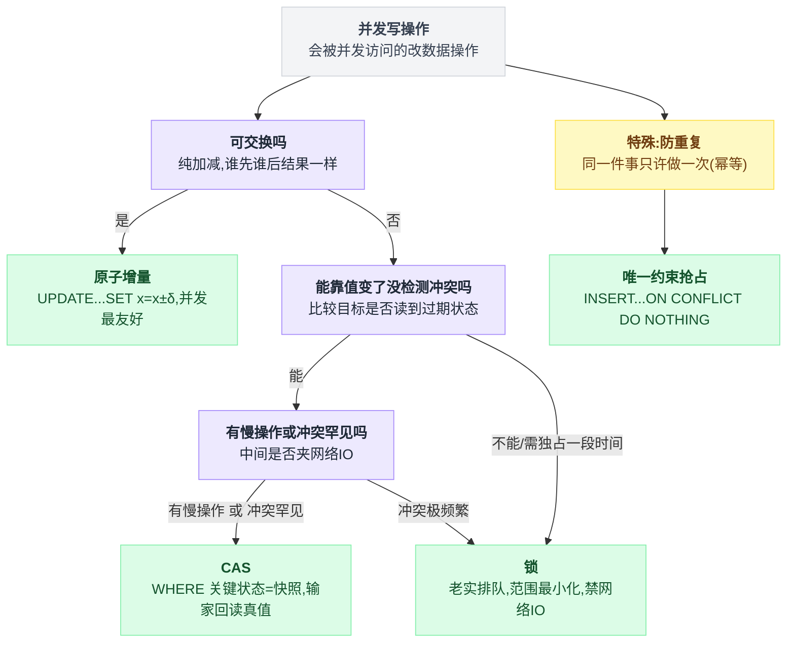
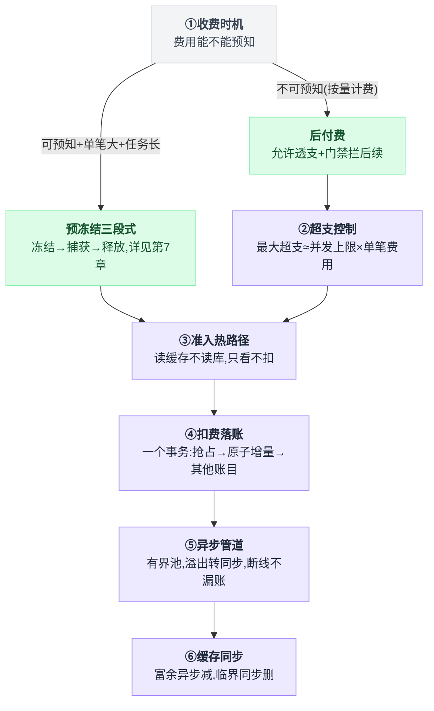
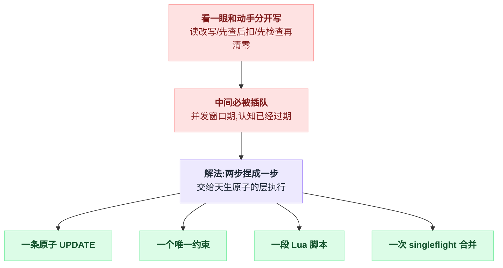
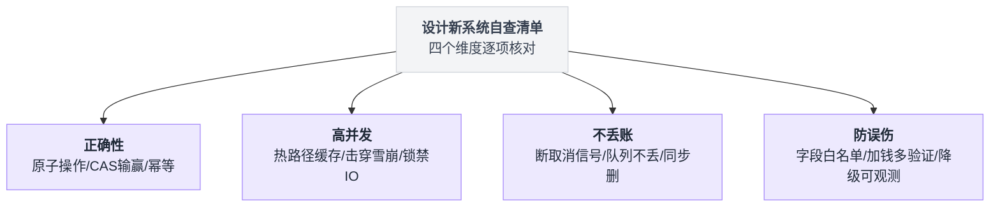

# 第 9 章:总结——决策树、自查清单、术语表

> 第一部分(第 1~8 章)的内容压缩成几张可随时翻查的表。设计计费/扣款/账单系统时,可照此逐项核对。

---

## 9.1 一张图:并发写入的选型决策树

先给骨架:整棵树只问两个问题。第一问「这个操作可交换吗」,可交换的直接走原子增量,到此结束;不可交换的才进第二问「冲突能不能靠值变了没检测出来」,能检测走 CAS,检测不了或者必须独占一段时间就上锁。

防"同一件事做两次"是挂在树根上的另一条支线,和上面两问无关。

```
一个会被并发访问的"改数据"操作
│
├─ 该操作可交换吗?(纯加减,谁先谁后结果一样)
│   ├─ 是 → 【原子增量】UPDATE ... SET x = x ± δ
│   │       写算式不写死值;无失败分支;并发最友好
│   │       (例:扣余额、累计用量、计数器)
│   │
│   └─ 否 → 冲突能靠"值变了没"检测吗?
│       ├─ 能 → 中间要做慢操作(网络 IO)吗?/ 冲突罕见吗?
│       │   ├─ 有慢操作 或 冲突罕见 → 【CAS】
│       │   │   UPDATE ... WHERE 关键状态 = 出发时的快照
│       │   │   赢=影响1行;输≠错误;输家回读真值再决策
│       │   │   有 ABA 风险 → 数据里塞单调版本号
│       │   │   (例:窗口清零、令牌轮换、状态机流转)
│       │   │
│       │   └─ 冲突极频繁 → 【锁】老实排队比疯狂重试省
│       │
│       └─ 不能 / 必须独占一段时间 → 【锁】
│           范围最小化;锁内禁止网络 IO;仅低频冷路径使用
│           (例:优惠码核销)
│
└─ 特殊:防"同一件事做两次"(幂等)
    → 【唯一约束抢占】INSERT ... ON CONFLICT DO NOTHING
      抢占和业务写入放同一事务
```

把这棵树拆成判定图,分支条件一一对应上面的文字:



同样的四件武器横过来排,方便照着一栏一栏对:

| 武器 | 什么时候用 | 写法 | 要点 | 例子 |
|---|---|---|---|---|
| 原子增量 | 操作可交换 | `UPDATE ... SET x = x ± δ` | 写算式不写死值;无失败分支;并发最友好 | 扣余额、累计用量、计数器 |
| CAS | 不可交换,但冲突能靠"值变了没"检测;中间有慢操作(网络 IO),或冲突罕见 | `UPDATE ... WHERE 关键状态 = 出发时的快照` | 赢=影响 1 行;输≠错误;输家回读真值再决策;有 ABA 风险就在数据里塞单调版本号 | 窗口清零、令牌轮换、状态机流转 |
| 锁 | 冲突检测不出来、必须独占一段时间,或冲突极频繁(老实排队比疯狂重试省) | 锁范围最小化 | 锁内禁止网络 IO;仅低频冷路径使用 | 优惠码核销 |
| 唯一约束抢占 | 防"同一件事做两次"(幂等) | `INSERT ... ON CONFLICT DO NOTHING` | 抢占和业务写入放同一事务 | — |

CAS 那一行的"输≠错误"是最容易写错的地方。它的判定长这样:

```
n = 执行 UPDATE ... WHERE 关键状态 = 出发时的快照
if n == 1:   赢了,继续
if n == 0:   输了 —— 这不是错误
             回读真值,拿新认知重新决策
             (行本身不存在也是 0,要跟"输"分辨开)
```

## 9.2 一张图:计费系统的架构决策链

一句话:①决定收前还是收后,②给后付费的漏洞设上界,③~⑥是所有路都要走的落地流程——准入、落账、异步、回写缓存。

```
① 收费时机
   费用可预知 + 单笔大 + 任务长 → 预冻结三段式(冻结→捕获→释放,详见第 7 章)
   费用不可预知(按量计费)       → 后付费 + 允许透支 + 门禁拦后续
│
② 后付费的超支控制(TOCTOU 焊不死,给它上界)
   最大超支 ≈ 单用户并发上限 × 单笔最大费用
   旋钮:并发上限 / 最低保证金门槛 / 扣费后立即同步缓存
│
③ 准入热路径
   读缓存不读库;singleflight 防击穿;TTL 加抖动防雪崩;外包熔断器
   准入只看不扣(只读零竞争)
│
④ 扣费落账
   一个事务:幂等抢占 → 原子增量扣款(两段式,RETURNING)→ 其他账目
   全成全败;事务内无网络调用
│
⑤ 异步管道
   有界池;溢出退化为同步(钱不丢);WithoutCancel(断线不漏账)
│
⑥ 缓存同步
   富余 → 异步减;临界 → 同步删(删比改安全)
```

六个环节接起来是一条链,①处的分岔决定后面走哪条路:



第④步的"一个事务"三件事按顺序摆开是这样:

```
BEGIN
    幂等抢占:  INSERT ... ON CONFLICT DO NOTHING   // 已经抢过就整笔跳过
    扣款:      UPDATE ... SET 余额 = 余额 - δ ... RETURNING   // 原子增量,两段式
    其他账目:  ...
COMMIT                                            // 全成全败
// 全程不发一次网络调用
```

## 9.3 三大道理(全书九个坑的共同根源)

**道理①:"看一眼"和"动手"分开写,中间必被插队。**

所有变体——读改写、先查后扣、先检查再清零、先拿钥匙再换新——都是同一个病。摊开写就是这两行中间的那道缝:

```
v = 读一眼            // 此刻认知是新的
                      // ← 缝在这里:别人可以完整地改一遍
写回(基于 v 算出的值)  // 动手时认知已经过期
```

解法方向唯一:把两步捏成一步,交给天生原子的层执行(一条 UPDATE、一个唯一约束、一段 Lua、一次 singleflight 合并)。

病根和解法画成一张图就是这样:



**道理②:钱的事,先问"丢了/错了/重了会怎样",再决定架构。**

每个设计都是从"最坏情况认不认"倒推出来的:

| 最坏情况 | 倒推出来的设计 |
|---|---|
| 费用未知 | 只能后付 |
| 任务会重复 | 必须幂等 |
| 任务不能丢 | 队列满就同步 |
| 账必须记完 | 切断取消信号 |
| 检查失效 | 按赔得起哪边选 fail-open/closed |

**道理③:给一切设上限。**

工人有上限、队列有上限、超支有上限、透支可追缴、更新字段有白名单。

没有上限的东西平时看不出问题,出问题就是全局的。

## 9.4 设计新系统时的自查清单

四个维度各查各的,先看一眼整体分布:



### 正确性

- [ ] 每个写操作按 9.1 决策树选了武器?有没有裸的读-改-写?
- [ ] 每个"先检查再动手"都合并成原子操作了?
- [ ] CAS 的输家:区分了"输(正常)"和"不存在(错误)"?回读真值了?
- [ ] CAS 的 expected 覆盖了"出发时依赖的全部状态"?有 ABA 风险的加版本号了?
- [ ] 计费动作幂等吗?抢占凭证和业务写入在同一事务?误去重(指纹冲突)有报警?
- [ ] 有不可回滚的外部副作用(一次性令牌、发短信、调支付)的流程,重试策略单独设计了?

### 高并发

- [ ] 热路径碰数据库了吗?能不能改读缓存?
- [ ] 缓存击穿(singleflight)、雪崩(TTL 抖动)、穿透防了吗?
- [ ] 锁内/事务内有没有网络调用?
- [ ] 热点行(同一用户的余额行)的写,都是微秒级单语句吗?
- [ ] 异步任务用有界池了吗?溢出策略想清楚了吗?

### 不丢账

- [ ] 计费任务和请求 ctx 切断了吗(WithoutCancel)?
- [ ] 队列满时钱相关的任务会丢吗?
- [ ] 记账失败有 ALERT + 计数器,能触发人工对账吗?
- [ ] DB 真账和缓存抄本的同步策略,临界状态是"同步删"吗?

### 防误伤

- [ ] 计数列(余额/用量)只走加减接口?编辑接口有字段白名单?
- [ ] 加钱路径(退款/解冻)比扣钱多一道验证?
- [ ] 每个降级路径有独立计数器可观测?

## 9.5 案例对照表(四个案例一览)

四个案例里只有余额扣费是可交换的,所以它是唯一一个既不用 CAS 也不用锁的。横着读一行能看出同一件事在四个场景下的不同做法:

| | 窗口重置(第4章) | 令牌轮换(第5章) | 余额扣费(第6章) | 批量生图(第7章) |
|---|---|---|---|---|
| 操作性质 | 不可交换(清零) | 不可交换 + 一次性资源 | **可交换**(加减) | 不可交换(状态流转+三段资金) |
| 武器 | CAS(字段级) | CAS(整文档)+ 锁做优化 | 原子增量,无 CAS 无锁 | 队列锁收敛 + 状态机 + 幂等兜底 |
| expected | 旧窗口起点 | 整个凭证 JSON + proxy_id | 无(不需要) | 状态谓词 / 锁 token |
| 无保护时的事故 | 并发重复清零,限额白嫖 | 好账号被写成砖 | 丢更新,扣两笔少一笔 | 重复冻结/幻影解冻/冻结泄漏 |
| 输家/失败处理 | 不报错 + 回读真值 | 回读定性(竞争 or 真坏)+ 不重试 | 无输家;余额不足转透支 | 定罪前原地复核;释放失败入队重试 |
| 特殊防线 | — | _token_version 防 ABA;重用检测逼出锁 | 幂等 dedup;WithoutCancel;背压 | 三个固定幂等单号;心跳;僵尸扫描;合规 FOR UPDATE |
| 收费模式 | —(限额) | — | **后付费**+允许透支 | **先扣费**(hold/capture/release),禁止透支 |
| 一句话 | 清零只许发生一次 | 过期视角连报错的权利都没有 | 把算式交给数据库 | 中间态资金必须有人负责解冻 |

## 9.6 术语表

| 术语 | 白话解释 |
|---|---|
| **读-改-写(read-modify-write)** | 读出来、内存里算、写回去的三步模式;并发下必丢更新 |
| **丢失更新(Lost Update)** | 两个并发写,后写的把先写的成果覆盖,一笔更新凭空消失 |
| **TOCTOU** | Time-Of-Check to Time-Of-Use:检查时是对的,动手时已经变了 |
| **原子(atomic)** | 不可分割:要么整个发生,要么整个没发生,中间插不进任何人 |
| **悲观锁** | 假设必有冲突,先锁门再干活;代价是串行化 + 不能做慢操作 |
| **乐观锁 / CAS** | 假设冲突少,先干活,提交时验"读到的旧值还作数吗";compare-and-swap |
| **expected value** | CAS 的第二个参数:"预期它现在是什么";数据库里就是 WHERE 后的旧值条件 |
| **RowsAffected(影响行数)** | 数据库 CAS 的输赢判据:1=赢,0=输(或行不存在,需分辨) |
| **CAS 循环** | 失败→重读→重算→再试 的标准重试形态 |
| **ABA 问题** | 值被改走又改回来,CAS 误以为"没人动过";解法是塞单调版本号 |
| **原子增量** | `SET x = x ± δ`,把算式交给数据库;仅适用于可交换操作 |
| **可交换(commutative)** | 操作顺序不影响最终结果(加减是,清零不是) |
| **行锁 / xmax** | PostgreSQL 把持锁者的事务 ID 写进行头的 xmax 字段,这就是行锁 |
| **MVCC** | 多版本并发控制:UPDATE 不原地改而是造新版本;读走快照,读写互不阻塞 |
| **EPQ 重验** | 等锁者被唤醒后,基于最新提交值重新求值 WHERE 和 SET,不用排队前的旧快照 |
| **幂等(idempotent)** | 同一操作执行一次和多次效果相同;异步系统的必备属性 |
| **唯一约束抢占** | 用 INSERT+唯一索引原子地"占坑",实现"这件事只许做一次" |
| **singleflight** | 同一个 key 的并发请求合并成一次执行,结果共享;防缓存击穿 |
| **缓存击穿/雪崩** | 击穿:热 key 过期瞬间并发全砸 DB;雪崩:大量 key 同时过期 |
| **背压(backpressure)** | 系统忙不过来时,把压力信号传回源头使其减速,而不是中间丢货 |
| **fail-open / fail-closed** | 检查组件故障时放行 / 拒绝;按"哪边的最坏后果赔得起"选 |
| **熔断器(circuit breaker)** | 依赖连续失败后快速拒绝一段时间,防故障传染和请求堆积 |
| **WithoutCancel** | Go 的 context 工具:保留值、剪断取消信号;用于"事后必须完成"的动作 |
| **RETURNING** | UPDATE/INSERT 顺手返回改完后的行,值与修改原子一致 |
| **透支(overdraft)** | 后付费下允许余额扣成负数;损失有界且可追缴 |
| **预授权三段式** | 冻结→捕获→释放;费用可预估的大额长任务才值得用 |
| **fencing token / epoch** | 给写入资格发代际号,过期代际的写入必然失败;防僵尸写入者 |
| **重用检测(reuse detection)** | OAuth 提供方发现已消费的 refresh token 被再次使用时,吊销整个授权链 |

## 9.7 三句话总纲

1. **并发 bug 的万恶之源是"基于过期的认知做写入"**——所有武器都在保证"写的那一刻,认知是新的"。
2. **选武器的顺序:原子增量 → CAS → 锁**,从最不阻塞的开始,每退一级要有理由;中间夹慢操作的流程只能 CAS。
3. **钱的系统从最坏情况倒推**:会重复(幂等)、会中断(WithoutCancel)、会过载(有界+背压)、会超支(设上界)、会误伤(字段白名单)——每一条都要有答案,答不上来的地方就是将来对账对不上的地方。

---

(第一部分完)

第一部分讲的是"请求来了,怎么把这一笔写对"。它的暗面——回调会丢、进程会死、冻结会漏、时间流逝不产生事件——由第二部分(定时任务篇)解决,从[第 10 章:定时任务总览](./10_定时任务总览_事件驱动主路径与定时兜底.md)开始。

回到目录:[README](./README.md)
