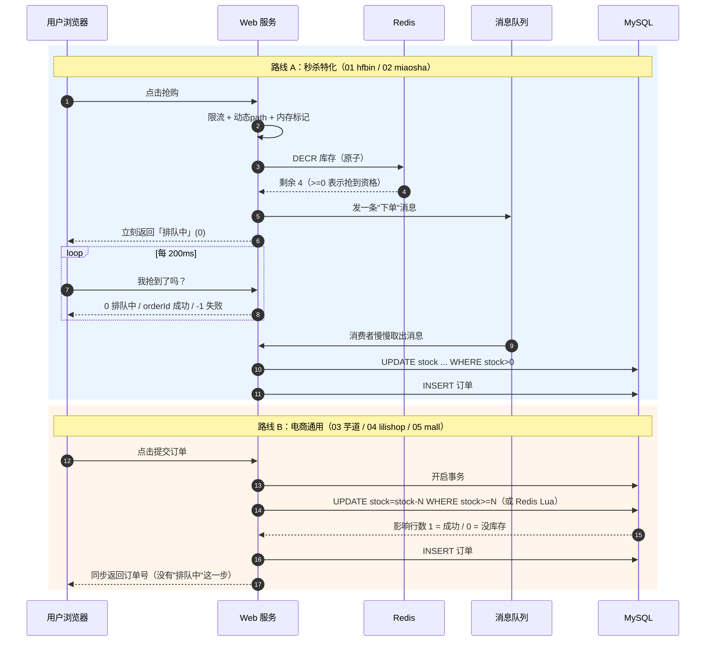

# 秒杀系统源码拆解 · 总览与横向对比（小白版 · 先读这一篇）

> 这是一套 8 篇文档的**第 0 篇**。
>
> 中间 5 篇，每篇拆解一个 GitHub 上的真实开源项目，讲清楚"用户点一下抢购按钮之后，代码里到底发生了什么"。第 6 篇是读完之后的总结（[`6_总结_共性_分歧与自查清单.md`](./6_总结_共性_分歧与自查清单.md)），第 7 篇是专题延伸（[`7_秒杀库存扣减_Redis和MySQL谁说了算.md`](./7_秒杀库存扣减_Redis和MySQL谁说了算.md)）。
>
> 本篇只干两件事：**（1）让你先搞懂秒杀这件事本身；（2）告诉你这 5 个项目分别是什么货色、该按什么顺序读。**
>
> 所有结论都是我们把源码 clone 到本地、逐行读出来的，不是抄别人的博客。发现的坑也如实写了。具体文件路径和行号收在文末脚注。

---

## 目录

- [0. 如果你完全是零基础，先看这一段](#0-如果你完全是零基础先看这一段)
- [1. 秒杀到底难在哪：三个魔鬼](#1-秒杀到底难在哪三个魔鬼)
- [2. 业界的标准答卷长什么样](#2-业界的标准答卷长什么样)
- [3. 本次选中的 5 个项目](#3-本次选中的-5-个项目)
- [4. 一张大图：5 个项目的链路叠在一起看](#4-一张大图5-个项目的链路叠在一起看)
- [5. 逐项横向对比表](#5-逐项横向对比表)
- [6. 最重要的一张表：它们各自靠什么防超卖](#6-最重要的一张表它们各自靠什么防超卖)
- [7. 我们读出来的 5 个反直觉结论](#7-我们读出来的-5-个反直觉结论)
- [8. 推荐阅读顺序与学习路线](#8-推荐阅读顺序与学习路线)
- [9. 小白词典](#9-小白词典)

---

## 0. 如果你完全是零基础，先看这一段

先别管代码。想象一个场景：

> 你家楼下奶茶店搞活动：**上午 10:00 整，5 杯 1 元奶茶，先到先得。**
> 结果 10:00:00 那一秒，门口挤了 3000 个人。

这就是"秒杀"。

把奶茶换成手机、演唱会门票、茅台、九价疫苗，把门口换成服务器，就是互联网上的秒杀。

技术上，一次秒杀 = 一个 **HTTP 接口**在 1 秒内被调用几万甚至几十万次，而它背后那张数据库表里，**库存字段只有 5**。

```
        10:00:00.000
             │
  ┌──────────┴──────────┐
  │  3 万个人同时点按钮   │
  └──────────┬──────────┘
             │  3 万个 HTTP 请求
             ▼
    ┌─────────────────┐
    │    你的服务器     │  ← 平时它只扛得住 500 QPS
    └────────┬────────┘
             │
             ▼
    ┌─────────────────┐
    │  MySQL: stock=5 │  ← 这一行数据，是整个战场的中心
    └─────────────────┘
```

**整套秒杀技术，本质上就是在回答一个问题：**

> 怎么让这 3 万个请求，既不把服务器压垮，又保证最后**恰好只有 5 个人**下单成功，一个不多一个不少？

---

## 1. 秒杀到底难在哪：三个魔鬼

三个魔鬼：卖多了（超卖）、扛不住（雪崩）、被机器抢光（黄牛）。第一个最致命，也是后面 5 个项目差别最大的地方，其余两个属于共识手段。

### 魔鬼一号：超卖（最致命）

**什么叫超卖？** 库存只有 5 件，最后卖出去 8 件。运营要赔钱，程序员要背锅。

**为什么会超卖？** 因为最朴素的写法长这样：

```java
// ❌ 这是错误示范
int stock = 查数据库("select stock from goods where id=1");   // 第 1 步：读
if (stock > 0) {                                              // 第 2 步：判断
    改数据库("update goods set stock = " + (stock-1));         // 第 3 步：写回
    生成订单();
}
```

单人操作没问题。但同时来两个人呢：

```
时间线 ──────────────────────────────────────────────────>

小明的线程                          小红的线程
    │                                   │
 ①读到 stock = 1                        │
    │                              ①读到 stock = 1   ← 小明还没写回！
 ②判断 1 > 0 ✓                          │
    │                              ②判断 1 > 0 ✓
 ③写回 stock = 0                        │
    │                              ③写回 stock = 0
    ▼                                   ▼
 下单成功                            下单成功

结果：库存 1 件，卖出去 2 件。💥 超卖。
```

这个"读 → 判断 → 写"中间被人插队的经典问题，专业名词叫 **竞态条件（Race Condition）**，也叫 **丢失更新（Lost Update）**。

**记住这个图，它是本系列所有文档的核心。**

后面 5 个项目，每一个都在用自己的方式解决它。有的解决得漂亮，有的——**根本没解决**（是的，star 最高的那个就没解决，见第 7 节）。

### 魔鬼二号：瞬时流量把系统压垮

3 万个请求打到数据库，数据库连接池只有 50 个，剩下的全排队，排到超时，然后**整个网站挂掉**。

注意不只是秒杀页面挂，是首页、订单、支付**全挂**。这叫**雪崩**。防雪崩的手段叫**限流**和**削峰**。

```
   不做削峰：                        做了削峰：

   ▲ 请求量                          ▲ 请求量
 3万│    ╱╲                        3万│    ╱╲   ← 这是前端进来的洪峰
   │   ╱  ╲                          │   ╱  ╲
   │  ╱    ╲                         │  ╱    ╲
   │ ╱      ╲___                     │ ╱      ╲___
   └──────────────> 时间             └──────────────>
        ↓                                  ↓ 经过 Redis + 消息队列
   ┌─────────┐                       ▲ 到达数据库的量
   │ MySQL💀 │                    500│ ───────────  ← 变成一条平的直线
   └─────────┘                       └──────────────>
                                     ┌─────────┐
                                     │ MySQL😀 │
                                     └─────────┘
```

### 魔鬼三号：黄牛和脚本

真人手速再快也就 200ms 点一次，脚本可以 1 秒点 500 次。如果不防，5 件商品全被脚本抢走，活动就白搞了。

顺带一提，这次搜 GitHub 时踩到一个坑：`seckill` 关键词下 star 最高的一批项目里，有相当一部分（`jd_seckill`、`hw_seckill`、`taobao_seckill`、`lyrric/seckill` 疫苗抢号脚本…）**恰恰就是黄牛脚本本身**，而不是秒杀系统。

它们是"矛"，我们要读的 5 个项目是"盾"。本系列只讲盾。

---

## 2. 业界的标准答卷长什么样

面试里被问"如何设计秒杀系统"，标准答案是这么一条链路。**先把这张图印在脑子里**，后面读每个项目，就是在看"它做到了这张图的哪几步、哪几步偷懒了"：

```
┌────────────────────────────────────────────────────────────────────────┐
│                        秒杀标准链路（教科书版）                            │
└────────────────────────────────────────────────────────────────────────┘

 【第 0 层】活动开始前
 ┌──────────────────────────────────────────────────────┐
 │ 缓存预热：把 MySQL 里的库存，提前搬一份到 Redis         │
 │ 静态化：商品详情页做成静态 HTML，扔 CDN，不查数据库      │
 └──────────────────────────────────────────────────────┘
                            │
 【第 1 层】前端拦一层        ▼
 ┌──────────────────────────────────────────────────────┐
 │ 按钮点一次就置灰 · 倒计时由服务器时间控制                 │
 │ 挡掉：手抖的重复点击（能挡掉 30%~50% 的无效请求）         │
 └──────────────────────────────────────────────────────┘
                            │
 【第 2 层】网关/拦截器拦一层  ▼
 ┌──────────────────────────────────────────────────────┐
 │ 登录校验 · 接口限流（5 秒内最多 5 次）· 验证码 · IP 黑名单 │
 │ 挡掉：脚本、黄牛、恶意刷接口                             │
 └──────────────────────────────────────────────────────┘
                            │
 【第 3 层】动态 URL         ▼
 ┌──────────────────────────────────────────────────────┐
 │ 秒杀地址不写死，开抢前一秒才由服务器随机生成一个 path      │
 │ 挡掉：提前把 URL 抄下来，用脚本直接打接口的人             │
 └──────────────────────────────────────────────────────┘
                            │
 【第 4 层】内存标记 ★       ▼
 ┌──────────────────────────────────────────────────────┐
 │ JVM 里一个 boolean：卖光了吗？卖光了直接 return，        │
 │ 连 Redis 都不碰。这是最便宜的一道闸门                    │
 └──────────────────────────────────────────────────────┘
                            │
 【第 5 层】Redis 原子预减 ★★★  ▼   ← 整条链路的心脏
 ┌──────────────────────────────────────────────────────┐
 │ DECR / Lua 脚本，把"判断 + 扣减"变成一个原子操作          │
 │ 减完 < 0 就是没了，立刻返回。这一步决定了不会超卖          │
 │ Redis 单机 10 万 QPS，扛 3 万请求毫无压力                │
 └──────────────────────────────────────────────────────┘
                            │  ← 到这里只剩 5 个请求了！
 【第 6 层】消息队列削峰 ★★  ▼
 ┌──────────────────────────────────────────────────────┐
 │ 把"下单"这件事扔进 MQ，接口立刻返回"排队中"               │
 │ 后台消费者慢慢地、一条一条地写数据库                      │
 └──────────────────────────────────────────────────────┘
                            │
 【第 7 层】数据库兜底       ▼
 ┌──────────────────────────────────────────────────────┐
 │ UPDATE goods SET stock = stock - 1 WHERE id=? AND stock > 0  │
 │ 这个 WHERE 条件是最后一道保险，Redis 万一出错还能兜住      │
 │ 唯一索引 (user_id, goods_id) 兜住"一人多单"              │
 └──────────────────────────────────────────────────────┘
                            │
 【第 8 层】前端轮询         ▼
 ┌──────────────────────────────────────────────────────┐
 │ 用户看到"排队中"，前端每 200ms 问一次"我抢到了吗"          │
 │ 返回三态：orderId(成功) / -1(失败) / 0(还在排队)         │
 └──────────────────────────────────────────────────────┘
                            │
 【第 9 层】超时回滚         ▼
 ┌──────────────────────────────────────────────────────┐
 │ 30 分钟不付款 → 延迟队列触发 → 取消订单 → 库存还回去      │
 └──────────────────────────────────────────────────────┘
```

**这 10 层，5 个项目谁做了几层？** 见第 5 节的对比表。

剧透一下：**没有一个项目做全了。**

---

## 3. 本次选中的 5 个项目

筛选口径：GitHub 搜索 `seckill` / `miaosha` / `秒杀`，按 star 排序，剔除黄牛脚本类项目，保留**有完整服务端秒杀/限时购链路**的，并优先选**近期仍在更新**的。数据采集于 2026-07-31。

| # | 项目 | Star | 最近更新 | 语言/技术栈 | 定位 |
|---|------|------|---------|-----------|------|
| 01 | [hfbin/Seckill](https://github.com/hfbin/Seckill) | ~1.4k | 2024-04 | SpringBoot + MyBatis + Redis + RabbitMQ | **入门第一站**：教科书链路的最小完整实现 |
| 02 | [qiurunze123/miaosha](https://github.com/qiurunze123/miaosha) | ~26.6k | 2025-04 | SpringBoot + Redis + RabbitMQ + (v2) Dubbo/ZK | **中文圈最有名**的秒杀教学项目，v1 单体 / v2 分布式 |
| 03 | [YunaiV/ruoyi-vue-pro（芋道）](https://github.com/YunaiV/ruoyi-vue-pro) | ~38.4k | **2026-07-31（几乎日更）** | SpringBoot 3 + MyBatis-Plus，模块化单体 | **工程化标杆**：秒杀作为商城的一个业务模块 |
| 04 | [lilishop/lilishop](https://github.com/lilishop/lilishop) | ~4.3k | 2026-06 | SpringCloud + Redis + RocketMQ + ES | **B2B2C 促销体系**：秒杀的完整业务生命周期 |
| 05 | [macrozheng/mall](https://github.com/macrozheng/mall) | **~84.5k** | 2026-05 | SpringBoot 3.5 + MyBatis + RabbitMQ | **star 之王**，但秒杀部分是个大坑（见第 7 节） |

选的过程中撞上一个残酷的现实：**"高星 + 近期一直在更新 + 有真正的秒杀链路"这三个条件，同时满足的项目非常少。**

高星的专用秒杀项目（01、02）都是教学性质，作者写完就基本不动了。

一直在更新的高星项目（03、04、05）都是完整商城，秒杀只是其中一个模块，而且**都为了业务通用性牺牲了极致的高并发设计**。

这个现实本身就是一条很重要的认知，我们会在第 7 节展开讲。

---

## 4. 一张大图：5 个项目的链路叠在一起看

把 5 个项目的链路画在同一张图上，你会立刻看出差异在哪：

```
                     用户点击「抢购」
                           │
    ┌──────────────────────┼──────────────────────┐
    │                      │                      │
    ▼                      ▼                      ▼
┌────────┐          ┌────────────┐        ┌──────────────┐
│01 hfbin│          │02 miaosha  │        │03/04/05 商城 │
└────────┘          └────────────┘        └──────────────┘
    │                      │                      │
 ①限流拦截器            ①验证码(数学题)          ①登录校验
 @AccessLimit             │                      │  (无限流)
    │                  ②限流拦截器                │
 ②动态path                │                       │
 /seckill/{path}       ③动态path                  │
    │                     │                       │
 ③内存标记 localOverMap ④内存标记 localOverMap     │  ✗ 没有
    │                     │                       │
 ④DB查重复下单         ⑤Redis查重复下单            │
    │                     │                       │
 ⑤Redis DECR 预减 ★    ⑥Redis DECR 预减 ★         │  ✗ 没有 Redis 预减
    │                     │                       │
 ⑥发 RabbitMQ ★        ⑦发 RabbitMQ ★             │  ✗ 没有 MQ 削峰
    │                     │                       │  （直接同步写库）
 ⑦立刻返回"排队中"      ⑧立刻返回"排队中"           │
    │                     │                       ▼
 ⑧前端 200ms 轮询      ⑨前端轮询                 同步执行：
    │                     │                    03: UPDATE...WHERE stock>=n
    ▼                     ▼                    04: Redis Lua 扣减(付款时)
 消费者异步：           消费者异步：              05: 读-改-写(有 BUG)
 UPDATE stock          UPDATE stock                  │
 (缺 WHERE>0 ⚠)        WHERE stock>0 ✓                ▼
    │                     │                       INSERT 订单
    ▼                     ▼                           │
 INSERT 订单           INSERT 订单                     ▼
                                                  MQ 延迟队列
                                                  (超时取消)
```

同一件事，用时序图再看一遍（左边是"秒杀特化"路线，右边是"电商通用"路线）：



**一眼看懂的结论：**

| | 路线 A：秒杀特化（01、02） | 路线 B：电商通用（03、04、05） |
|---|---|---|
| 为什么这么设计 | 为了扛住瞬时并发 | 秒杀只是订单流程的一个分支 |
| 专门造了什么 | Redis 预减 + MQ 异步 + 前端轮询 | 价格更便宜 + 库存单独算 |
| 用户看到什么 | 会看到"排队中" | **同步**等结果，没有排队页 |

这两条路线**没有对错，只有场景**。

如果你的秒杀是 3 万人抢 5 件，必须走 01/02 路线；如果只是店铺搞个"限时特价"，一分钟来 200 个人，03/04/05 路线更简单、更好维护。

---

## 5. 逐项横向对比表

对照第 2 节那 10 层标准链路，逐层打分（✅有 / ⚠️部分 / ❌无）：

| 标准链路的层 | 01 hfbin | 02 miaosha | 03 芋道 | 04 lilishop | 05 mall |
|---|:---:|:---:|:---:|:---:|:---:|
| 缓存预热（启动时把库存写进 Redis） | ✅ | ✅ | ❌ | ⚠️ SKU 库存常驻 Redis | ❌ |
| 页面静态化 / 页面缓存 | ✅ 静态 htm | ✅ HTML 整页缓存 60s | ❌ | ❌（活动列表直查 MySQL） | ❌ |
| 接口限流 | ✅ `@AccessLimit` | ✅ `@AccessLimit` + Lua 限流 | ❌ | ❌ | ❌ |
| 图形/数学验证码 | ❌（v2 分支无） | ✅ 数学题验证码 | ❌ | ❌ | ❌ |
| 动态秒杀地址 | ✅ MD5 随机 path | ✅ MD5 随机 path | ❌ | ❌ | ❌ |
| JVM 内存售罄标记 | ✅ `localOverMap` | ✅ `localOverMap` | ❌ | ❌ | ❌ |
| **Redis 原子预减库存** | ✅ `DECR` | ✅ `DECR` | ❌ | ✅ **Lua 脚本** | ❌ |
| **消息队列削峰** | ✅ RabbitMQ | ✅ RabbitMQ | ❌ | ⚠️ MQ 只用于付款后扣库存 | ⚠️ MQ 只用于超时取消 |
| 前端轮询结果 | ✅ 200ms | ✅ | ❌ 同步返回 | ❌ 同步返回 | ❌ 同步返回 |
| 数据库 WHERE 兜底 | ❌ **缺失（有坑）** | ✅ `WHERE stock_count>0` | ✅ `WHERE stock>=n` | ❌ | ❌ **有丢失更新 BUG** |
| 一人一单（唯一索引/查重） | ✅ 查 DB | ✅ 查 Redis 缓存 | ⚠️ 查 DB，有竞态 | ❌ 无限购 | ❌ |
| 超时未付款回滚库存 | ❌ | ❌ | ✅ 定时任务回补 | ✅（未扣所以无需回滚） | ✅ RabbitMQ 延迟队列 |
| **合计得分** | **8 / 12** | **11 / 12** | **3 / 12** | **4 / 12** | **1.5 / 12** |

别急着用这个分数去判断项目好坏——**01/02 是为了"教秒杀"而生，得分高是应该的；03/04/05 是完整商城，秒杀只是几十个模块之一。**

但如果你的目标是"学会秒杀链路"，那这张表就直接告诉你该看谁。

---

## 6. 最重要的一张表：它们各自靠什么防超卖

这是全系列**最有价值**的一节。同一个问题，5 种截然不同的答案：两个用 Redis `DECR`，一个用 Redis + Lua，一个纯靠数据库条件更新，还有一个用了错误示范。

### 01 hfbin：Redis `DECR` 原子预减

扣库存这步在服务层直接调用 Redis 的原子递减命令[^1]。

⚠️ **前半段靠谱，后半段有洞**。Redis 这一关是原子的，能防住；但数据库那道保险漏了——更新库存的 SQL 只写了"库存减一"，没有加"库存大于零才准减"这个条件[^2]。

一旦 Redis 数据不对（重启、误刷），库存能被扣成负数。

### 02 miaosha：Redis `DECR` 预减 + DB 条件更新双保险

更新库存的 SQL[^3]：

```
update miaosha_goods set stock_count = stock_count - 1
where goods_id = #{goodsId} and stock_count > 0
```

✅ **最完整**。Redis 挡住 99.99% 的量，数据库那道条件更新兜底，返回影响行数为 0 就代表没抢到。

### 03 芋道：纯数据库乐观扣减（无 Redis、无锁、无 MQ）

它用 MyBatis-Plus 的链式写法拼出一条条件更新语句[^4]，判定方式是这样的：

```
affected = UPDATE ... SET stock = stock - N
           WHERE id = ? AND stock >= N        // 判断和扣减在同一条 SQL 里

if affected == 1:  抢到了
if affected == 0:  库存不够，压根没改动任何一行
```

✅ **正确但不抗压**。靠 InnoDB 行锁把"判断+扣减"焊成一个原子操作，逻辑上绝不超卖；但所有请求都堆在同一行上抢行锁，瓶颈大约几百到一两千 QPS。

### 04 lilishop：Redis + Lua 脚本原子扣减

扣库存的逻辑写成一段 Lua 脚本交给 Redis 一次性执行[^5]；Redis 单线程处理，脚本内部扣完发现库存为负会整体回滚。

✅ **技术上最优雅**，但 ⚠️ **时机很怪**——它下单时一件库存都不扣：

```
用户下单：  只创建订单，库存一动不动
用户付款：  付款成功 ──发 MQ──> 消费者跑 quantity.lua 扣库存
                                    └─ 扣完为负 → 整体回滚 return false
                                                  → 钱已经付了，只能自动退款
```

也就是说，可能出现"钱付了、库存没了、系统自动退款"的情况。

### 05 macrozheng/mall：号称用 `stock - lock_stock` 双字段

对应方法里干的事是：先查一遍当前值，在 Java 内存里把它加一，再整条写回去[^6]。

```
row = selectByPrimaryKey(id)          // 读：此刻 lock_stock = 4
row.lock_stock = row.lock_stock + 1   // 在 Java 内存里算：5
updateByPrimaryKeySelective(row)      // 写回绝对值 lock_stock = 5
                                      // 而不是 lock_stock = lock_stock + 1
```

❌ **有 BUG，会超卖**。这是典型的"读-改-写"，UPDATE 写的是**绝对值**而不是相对值，并发下必然发生丢失更新。

第 1 节那张"小明小红"图，说的就是这段代码。

### 把 5 种手段抽象出来，其实就 4 招

```
  招式一：Redis DECR
  ┌────────────────────────────────────────────┐
  │ Redis 是单线程的，DECR 天然原子              │
  │ 优点：简单、快（10万 QPS）                   │
  │ 缺点：只能一次减一个 key，多商品扣减不原子     │
  │ 谁在用：01 hfbin、02 miaosha                │
  └────────────────────────────────────────────┘

  招式二：Redis + Lua 脚本
  ┌────────────────────────────────────────────┐
  │ 把「读 + 判断 + 写 + 回滚」打包成一张纸条      │
  │ 丢给 Redis，Redis 一口气执行完，中间不插队     │
  │ 优点：多商品可以一起原子扣减，失败能整体回滚    │
  │ 缺点：脚本写错很难查；Redis 挂了数据可能丢      │
  │ 谁在用：04 lilishop（quantity.lua）          │
  └────────────────────────────────────────────┘

  招式三：数据库条件更新（乐观锁）
  ┌────────────────────────────────────────────┐
  │ UPDATE ... SET stock = stock - N            │
  │            WHERE id = ? AND stock >= N      │
  │ 靠 InnoDB 行锁保证原子；影响行数=0 就是失败    │
  │ 优点：绝对准确，数据落在 MySQL 不会丢          │
  │ 缺点：热点行锁竞争，QPS 上不去（几百~一两千）   │
  │ 谁在用：02（兜底）、03 芋道（唯一手段）        │
  └────────────────────────────────────────────┘

  招式四：读-改-写（❌ 错误示范）
  ┌────────────────────────────────────────────┐
  │ SELECT → Java 里算 → UPDATE 绝对值           │
  │ 并发下 100% 丢失更新                         │
  │ 谁在用：05 macrozheng/mall 的 lockStock()    │
  │ 👉 这是全系列最好的反面教材，一定要看          │
  └────────────────────────────────────────────┘
```

---

## 7. 我们读出来的 5 个反直觉结论

这 5 条是读完源码后最值得带走的东西。

### 结论 1：star 最高 ≠ 秒杀做得最好，甚至可能完全没做

`macrozheng/mall` 有 8.4 万 star，是中文开源电商的天花板。

但它的"限时购"（FlashPromotion）是这么个状态：

- 三张表 `sms_flash_promotion` / `_session` / `_product_relation` **只有后台 CRUD 和前台展示**；
- `flash_promotion_price`（秒杀价）、`flash_promotion_count`（秒杀数量）、`flash_promotion_limit`（限购）这三个字段，**全仓库只被 SELECT 出来做展示，下单时根本不参与计算**；
- `OmsPromotionServiceImpl` 处理促销类型时只认 1/3/4，**限时购（5）落进了"无优惠"分支**——也就是说，**秒杀价在下单时压根不生效**；
- `sms_flash_promotion_log`（秒杀日志表）、`order_type=1`（秒杀订单）、`flash_order_overtime`（秒杀订单超时）全是**预留字段，没有任何代码写入**。

**这不是黑它。** mall 的定位是"教你怎么写一个结构清晰的电商系统"，它在订单、商品、权限、部署上做得非常好。

只是**如果你冲着"学秒杀"去看 mall，你会一无所获**——所以这篇文档存在的意义，就是提前告诉你这件事，省下你三天时间。

### 结论 2：真正在做秒杀的公司，代码不会开源

想想就明白：秒杀是电商最核心的营销武器，涉及风控规则、黄牛识别模型、库存分片策略。这些东西开源出来，等于把防作弊规则送给黄牛。

所以 GitHub 上你能找到的秒杀项目，**只有两类**：

1. **教学项目**（01、02）——把标准链路完整实现一遍，但没有经过真实流量考验；
2. **商城项目里的秒杀模块**（03、04、05）——真实业务在跑，但为了通用性和可维护性，做的是"够用就好"的方案。

**学习路径应该是：从 01/02 学"标准链路长什么样"，从 03/04/05 学"真实工程里怎么权衡"。** 两边都看，才是完整的认知。

### 结论 3：所有项目的"秒杀"，本质上都是在做同一件事——把并发从 3 万降到 5

再看一遍这个数字流：

```
  3 万请求  ──前端按钮置灰──>  2 万
           ──限流拦截器──>    5000
           ──内存标记──>       500     ← 售罄后这一层直接拦死
           ──Redis 预减──>       5     ← 精确到 5，一个不多
           ──消息队列──>         5（但变成慢慢地进）
           ──数据库──>          5 条 INSERT
```

**每一层的作用，都是"用更便宜的资源，挡掉更多的请求"**：

| 层 | 单次成本 | 能挡掉 |
|---|---|---|
| 前端 JS | 0（用户浏览器出的钱） | 手抖重复点击 |
| JVM 内存标记 | ~1 纳秒 | 售罄后的全部请求 |
| Redis | ~0.1 毫秒 | 超出库存的请求 |
| 消息队列 | ~1 毫秒 | 不挡，但把峰值摊平 |
| MySQL | ~10 毫秒 + 行锁排队 | 最后的兜底 |

成本差了 **7 个数量级**。所以整条链路的设计哲学就一句话：**能在前面拦掉的，绝不让它走到后面。**

### 结论 4：Redis 扣了库存，不代表订单一定能创建成功

01 和 02 都有这个环节：Redis `DECR` 成功了，消息发进 MQ，接口告诉用户"排队中"。

但消费者从 MQ 拿出来写数据库时，**还可能失败**——数据库连接满了、事务回滚了、库存对不上。

所以两个项目都做了兜底，机制是这样的：

```
接口线程：  DECR 成功 → 发 MQ → 返回 0（排队中）

消费者：    从 MQ 取出消息
            写 DB 失败 → 在 Redis 打一个"售罄标记"
                         01: SeckillKey.isGoodsOver
                         02: MiaoshaKey.isGoodsOver

轮询接口：  看到 isGoodsOver 标记 → 返回 -1（失败）
```

这就引出了秒杀链路的一个隐藏难点：**Redis 和 MySQL 的数据一致性**。

Redis 扣了 1，MySQL 没扣成功，这 1 个库存就"凭空消失"了——业界叫**少卖**。少卖比超卖轻微得多（不赔钱，只是少赚），所以大部分项目选择容忍它，靠活动结束后对账补回来。

### 结论 5：秒杀在真实业务里，是"活动生命周期"的一小段

读 04 lilishop 时最大的收获是：一个商城里的秒杀，技术上的"抢"只是最后 200 毫秒，前面还有一长串业务流程：

```
 平台建活动 ─> 定时任务预生成未来 7 天场次 ─> 商家报名 ─> 审核
      └─> 生成促销商品(秒杀价+促销库存) ─> 同步到 ES 搜索引擎
      └─> 活动开始定时上架 ─> 前台按"时间轴"分场次展示（10点场/12点场…）
      └─> 用户加购 ─> 结算页校验 ─> 【抢】 ─> 下单 ─> 付款 ─> 扣库存
      └─> 超时未付 ─> 定时取消 ─> 库存回滚 ─> 活动结束 ─> 数据统计
```

**面试时如果只会说"Redis 预减 + MQ 异步"，说明你只看过教学项目。** 能把上面这条业务生命周期说出来，才是真的读过生产代码。

---

## 8. 推荐阅读顺序与学习路线

三种人，三条路：零基础按 01→05 顺序爬，面试速成只读两处，要落地的按 QPS 量级选方案。

### 如果你是完全零基础

```
   本篇（00）
      │  搞懂"秒杀难在哪"
      ▼
   01 hfbin/Seckill          ★推荐从这里开始
      │  代码量最小、链路最完整、最好读
      │  读完你就能自己画出标准秒杀链路图
      ▼
   02 qiurunze123/miaosha
      │  同样的链路 + 更多优化手段（验证码、Lua 限流、分布式 session）
      │  顺便看 v1 单体 → v2 分布式 是怎么拆的
      ▼
   03 芋道 ruoyi-vue-pro
      │  换个视角：真实工程里，秒杀怎么和订单/价格/优惠券模块协作
      │  学"责任链价格计算器 + 订单 Handler 扩展点"的写法
      ▼
   04 lilishop
      │  学秒杀的完整业务生命周期 + Lua 脚本扣库存
      ▼
   05 macrozheng/mall
         最后看，当反面教材看，学会识别"读-改-写"这个经典 BUG
```

### 如果你是为了面试

优先读 **02（qiurunze123/miaosha）** 和 **本篇第 2、6 节**。这两处覆盖了 90% 的秒杀面试题。

然后读 **05 的第 7 节部分**——能指出一个 8.4 万 star 项目里的并发 BUG 并说清楚为什么，是很强的加分项。

### 如果你是要在自己项目里落地

按你的量级选：

| 你的量级 | 抄谁 | 具体方案 |
|---|---|---|
| QPS < 500，库存充足 | 03 芋道 | `UPDATE...WHERE stock>=n`，一行 SQL 搞定 |
| QPS 500~5000，多商品扣减 | 04 lilishop | Redis + Lua |
| QPS > 5000，抢购型（少量库存） | 01/02 | Redis 预减 + MQ 异步 + 前端轮询 |
| QPS > 5 万 | 上面都不够 | 库存分桶 + 多级缓存 + 网关限流，开源项目里找不到现成的，得自己设计 |

---

## 9. 小白词典

按本系列出现频率排序。看不懂任何一篇文档时，回来查这里。

| 名词 | 大白话解释 |
|---|---|
| **QPS** | 每秒能处理多少个请求。像"这家店每秒能接待几个客人" |
| **并发** | 同一时刻有多少人在操作。3 万人同时点按钮 = 3 万并发 |
| **超卖** | 库存 5 件卖出 8 件。秒杀的头号敌人 |
| **少卖** | 库存 5 件只卖出 4 件。比超卖轻微，通常能容忍 |
| **原子操作** | 一件事要么全做完，要么一点没做，中间不会被人插队。像"厕所隔间，进去就锁门" |
| **竞态条件 / 丢失更新** | 两个人同时"读-改-写"同一个数据，后写的覆盖了先写的。见第 1 节的图 |
| **Redis** | 内存数据库。像收银台旁边的小白板：读写极快（10 万次/秒），但断电就没了 |
| **MySQL / DB** | 磁盘数据库。像仓库里那本厚账本：翻页慢（几千次/秒），但绝对不会丢 |
| **DECR** | Redis 的一个命令：把某个数字减 1，并返回减完之后的值。天然原子 |
| **Lua 脚本** | 交给 Redis 的一张纸条，上面写着好几条命令。Redis 会一口气执行完，中间不接待别人 |
| **消息队列 / MQ** | 奶茶店的取号机。你下单先拿号（立刻返回），店员在后台慢慢做 |
| **RabbitMQ / RocketMQ** | 两个常见的消息队列产品，功能类似 |
| **削峰** | 用消息队列把瞬间的流量高峰摊平成一条缓坡 |
| **限流** | 景区闸机，每分钟只放 100 个人进 |
| **分布式锁** | 多台服务器共用的一把厕所门锁，一次只让一个进 |
| **乐观锁** | 不上锁，改数据时加个条件 `WHERE stock >= n`，改不成就说明有人抢先了 |
| **悲观锁** | 上来就锁住，`SELECT ... FOR UPDATE`。安全但慢 |
| **行锁** | MySQL 只锁被改的那一行，不影响别的行 |
| **热点行** | 所有人都在抢改的那一行数据（比如库存行）。是性能瓶颈所在 |
| **缓存预热** | 活动开始前，把数据提前从 MySQL 搬到 Redis |
| **内存标记** | JVM 里一个 boolean 变量，标记"这个商品卖光了"。查它只要几纳秒 |
| **动态 URL / 秒杀地址隐藏** | 抢购接口的地址不固定，开抢时才由服务器随机生成 |
| **轮询** | 前端每隔几百毫秒问一次服务器"好了吗"。像等外卖时反复刷新 App |
| **延迟队列** | 一种能"30 分钟后再送达"的消息队列，用来做超时取消订单 |
| **唯一索引** | 数据库层面强制"这两个字段的组合不能重复"，用来兜底"一人一单" |
| **幂等** | 同一个请求发 100 次，结果和发 1 次一样。防止用户重复点击造成重复下单 |
| **事务 / @Transactional** | 一组数据库操作，要么全成功要么全回滚。像转账：扣款和到账必须同时成功 |
| **SKU** | 具体到规格的商品。"iPhone 16 黑色 256G"是一个 SKU，"iPhone 16"是 SPU |
| **Elasticsearch / ES** | 搜索引擎。商城用它做商品搜索和列表页 |
| **责任链** | 一串处理器依次处理同一个请求。像流水线上的多道工序 |
| **XXL-Job** | 一个定时任务调度平台。用来做"每天凌晨生成明天的秒杀场次"这类活 |

---

## 10. 一句话总结

> **秒杀系统的全部秘密，就是"用一层比一层便宜的闸门，把 3 万个请求过滤成 5 个，再让这 5 个慢慢地、安全地走进数据库"。**
>
> 接下来的 5 篇文档，你会看到 5 个团队，用 5 种不同的方式，回答同一个问题。

---

**下一篇 👉 [`1_hfbin_Seckill秒杀链路全解.md`](./1_hfbin_Seckill秒杀链路全解.md) —— 从最小、最完整的教科书实现开始。**

---

## 出处

所有 star 数、最近推送时间来自 GitHub API，采集时间 2026-07-31。所有代码结论均基于当日 `git clone --depth 1` 到本地的最新代码逐文件阅读得出，文中引用的文件路径、类名、方法名、SQL 语句均已核对为真实存在；第 6 节的 5 条防超卖手段已由第二轮独立复查逐条验证。

[^1]: `SeckillServiceImpl` 调用 `redisService.decr(GoodsKey.getSeckillGoodsStock, ...)` 做 Redis 原子预减。
[^2]: `GoodsMapper.xml` 的 `updateStock` 语句：`SET stock_count = stock_count - 1 WHERE goods_id = ?`，缺 `AND stock_count > 0`。
[^3]: `GoodsDao.java:21`：`update miaosha_goods set stock_count = stock_count - 1 where goods_id = #{goodsId} and stock_count > 0`。
[^4]: `SeckillProductMapper.java:40` 与 `SeckillActivityMapper.java:47`，写法为 `.ge(stock, count).setSql("stock = stock - " + count)`，展开等价于 `UPDATE ... SET stock=stock-N WHERE id=? AND stock>=N`。
[^5]: 脚本路径 `framework/src/main/resources/script/quantity.lua`。
[^6]: `OmsPortalOrderServiceImpl.java:727` 的 `lockStock()`：`selectByPrimaryKey` → Java 里 `+quantity` → `updateByPrimaryKeySelective`。

**仓库链接：**

- [hfbin/Seckill](https://github.com/hfbin/Seckill)
- [qiurunze123/miaosha](https://github.com/qiurunze123/miaosha)
- [YunaiV/ruoyi-vue-pro](https://github.com/YunaiV/ruoyi-vue-pro)
- [lilishop/lilishop](https://github.com/lilishop/lilishop)
- [macrozheng/mall](https://github.com/macrozheng/mall)
