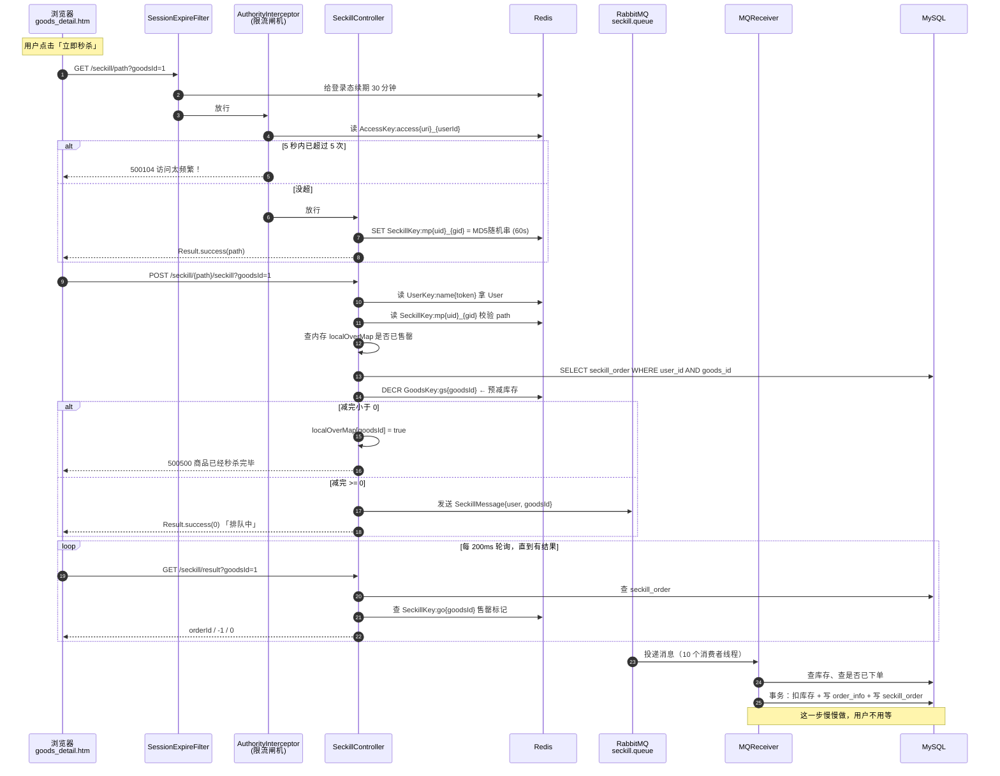

# 《hfbin/Seckill》秒杀链路全解（小白版）

> 一句话简介：一个用 SpringBoot 写的、把「秒杀」这件事从最朴素的写法一步步优化到「Redis 预减 + 消息队列异步下单」的教学级项目。
>
> - 仓库地址：https://github.com/hfbin/Seckill
> - Star 数：约 1.4k
> - 最近更新：仓库页面显示最近推送在 2024-04；本文分析的默认分支是 `v2.0`，其最后一次代码提交是 2023-05-13（commit `2027507`）
> - 技术栈：SpringBoot 2.4.6 + MyBatis + MySQL + Redis + RabbitMQ + Thymeleaf + Druid + fastjson
> - 本文分析的分支：`v2.0`（这是仓库的默认分支，也是「做了优化」的那个分支）

---

## 0. 读之前：先搞懂「秒杀」到底难在哪

先别看代码。我们先讲个故事。

假设你开了一家小卖部，今天搞活动：**5 瓶可乐，1 块钱一瓶，先到先得**。

平时你怎么卖东西？很简单：

```
顾客说「我要一瓶可乐」
   │
   ▼
你翻开账本，看看库存还有几瓶      ← 「查库存」
   │
   ▼
还有？好，账本上库存减 1          ← 「减库存」
   │
   ▼
账本上再记一笔「张三买了一瓶」     ← 「下订单」
   │
   ▼
收钱，给货，完事
```

一天卖 20 瓶，这么干完全没问题。

**但今天不一样。** 今天门口一下子涌进来 10000 个人，全都在同一秒喊「我要可乐」。

这时候会发生三件很可怕的事：

### 可怕的事情一：卖超了（术语叫「超卖」）

> **超卖** = 你明明只有 5 瓶可乐，结果账本上记了 8 个人买到了。第二天 3 个人来提货，你拿不出货，被投诉到工商局。

为什么会超卖？因为「查库存」和「减库存」是**两个动作**，中间有个缝。

```
时间轴 ──────────────────────────────────────────────>

顾客A：  查库存(还剩1瓶) ────────────> 减库存(变成0)
                    ╲
                     ╲  就在这个缝里
                      ╲
顾客B：            查库存(还剩1瓶) ────────> 减库存(变成-1)
                                             ↑
                                        这里就超卖了！
```

A 查到「还剩 1 瓶」的那一刻，B 也查到了「还剩 1 瓶」。两个人都觉得自己抢到了，然后都去减库存。结果 1 瓶卖给了 2 个人。

人多的时候，这种「缝」会被无限放大。10000 个人同时挤进来，可能会卖出去几十瓶。

### 可怕的事情二：账本翻不动了（数据库被压垮）

> **MySQL（数据库）** = 仓库里那本厚厚的手写账本。它非常准确、非常可靠，一笔一笔清清楚楚，停电了也不会丢。但是它**翻页很慢**。

一本账本，你一秒钟最多能翻个几百次、上千次。现在有 10000 个人同时要你翻账本，你的手会废掉。在真实系统里，就是数据库连接被占满、CPU 打到 100%、所有请求全部超时，**整个网站崩溃**——不只是秒杀页面崩，连正常买东西的页面都跟着崩。

### 可怕的事情三：黄牛和脚本

有人写了个程序，一秒钟帮他点 1000 次「立即秒杀」。正常用户手速再快也点不过机器。而且这 1000 次请求全都要你去翻账本，进一步压垮系统。

### 所以，秒杀系统要解决的核心问题就这三个：

```
┌───────────────────────────────────────────────────────────┐
│                                                           │
│   问题1：超卖        →  怎么保证 5 瓶就是 5 瓶？          │
│                                                           │
│   问题2：数据库压垮  →  怎么让 10000 个请求里，          │
│                          只有 5 个真正碰到数据库？        │
│                                                           │
│   问题3：黄牛刷接口  →  怎么让机器人点不了那么快？        │
│                                                           │
└───────────────────────────────────────────────────────────┘
```

这个项目干的全部事情，就是回答这三个问题。记住这三个问题，后面看代码你就不会晕。

---

## 1. 十分钟认识这个项目

### 1.1 它是干什么的

这是一个**教学用的秒杀系统 Demo**。它有 4 个手机商品（iPhone X、小米 8、荣耀 10、OPPO Find X），每个商品有一个秒杀价和一个秒杀库存，用户登录后可以在秒杀时间段内点「立即秒杀」抢购。

它的作者在 README 里说得很清楚，这个项目有两个分支：

> 引自 `README.md` 第 20~26 行：
>
> ```
> 2、此项目共有两个分支，master分支只是完成了秒杀的所有业务逻辑功能，并没有优化。V2.0分支做了优化如下：
>     1)、页面缓存、商品详情静态化、订单静态化（感兴趣可以把所有页面都做静态化）
>     2)、加入消息队列RabbitMQ，对秒杀接口进行优化。
>     3)、隐藏秒杀接口地址
>     4)、接口限流防刷
>     5)、解决超卖问题
> ```

所以它的教学意图是：**先给你看一个朴素版本，再给你看一个优化版本，让你体会中间的差别**。

有意思的是，这两个版本在 `v2.0` 分支里**同时存在**。你可以在同一个类里看到它们并排放着：

- 朴素版（同步下单）：`SeckillController.list2()`，接口路径 `/seckill/seckill2`
- 优化版（异步下单）：`SeckillController.list()`，接口路径 `/seckill/{path}/seckill`

文件路径：`/home/claude/repos/hfbin-seckill/src/main/java/cn/hfbin/seckill/controller/SeckillController.java`

本文重点讲**优化版**，但会拿朴素版做对照。

### 1.2 技术栈清单（每个组件用一句大白话解释它干嘛）

先看 `pom.xml` 里真实存在的依赖（路径：`/home/claude/repos/hfbin-seckill/pom.xml`）：

| 组件 | 版本 | 一句大白话 |
|---|---|---|
| SpringBoot | 2.4.6 | 整个项目的「骨架和装配工」。你写好零件，它负责把零件装起来、启动服务器、监听端口。 |
| MyBatis | starter 1.3.2 | 「Java 和数据库之间的翻译官」。你写 SQL 在 XML 文件里，它帮你把 Java 对象和 SQL 结果互相转换。 |
| MySQL | — | 那本**厚厚的手写账本**。准确、可靠、断电不丢，但翻页慢。所有最终数据都要落在这里。 |
| Druid | 1.1.9 | 「数据库连接池」。就是提前挖好几条通往账本的通道，别每次查账都重新挖一条。 |
| Redis | spring-boot-starter-data-redis | 收银台旁边的**小白板**。写字擦字都极快（每秒能干几万到几十万次），但**停电就没了**。用来放那些「快就行、丢了能重来」的数据。 |
| RabbitMQ | spring-boot-starter-amqp | 奶茶店的**取号小票机**。你点单以后马上给你一张号码牌让你走开，后厨慢慢做。做好了你再来问「我的好了吗」。 |
| Thymeleaf | spring-boot-starter-thymeleaf | 「模板引擎」。把 Java 里的数据填到 HTML 的坑里，生成一个完整网页。 |
| fastjson | 1.2.83 | 「打包/拆包工具」。把 Java 对象变成一串文本（JSON），或者反过来。存 Redis、发消息都要用它。 |
| Lombok | — | 「省字工具」。加个 `@Getter` 注解就自动生成 getter，不用手写。 |
| Guava / commons-lang3 | — | 一堆现成的小工具函数库。 |

关键配置在 `/home/claude/repos/hfbin-seckill/src/main/resources/application.properties`：

```properties
server.port=8888
spring.datasource.url=jdbc:mysql://localhost:3306/seckill?...
spring.redis.host=localhost
spring.redis.port=6379
spring.rabbitmq.host=localhost
spring.rabbitmq.port=5672
spring.rabbitmq.listener.simple.concurrency= 10        # MQ 同时开 10 个消费者线程
spring.rabbitmq.listener.simple.max-concurrency= 10
spring.rabbitmq.listener.simple.prefetch= 1            # 每个消费者一次只抓 1 条消息
```

注意最后三行，后面讲「会不会超卖」时会用到。

### 1.3 目录结构地图

```
/home/claude/repos/hfbin-seckill
│
├── README.md                       启动说明（记得先创建 RabbitMQ 队列 seckill.queue）
├── pom.xml                         依赖清单
├── sql/seckill.sql                 建表 + 初始数据（4 个商品 + 1000 个测试用户）
│
└── src/main/
    ├── java/cn/hfbin/seckill/
    │   ├── SeckillApplication.java          启动类
    │   │
    │   ├── controller/                      【接口层：请求进来第一站】
    │   │   ├── SeckillController.java       ★★★ 秒杀三大接口都在这
    │   │   ├── GoodsController.java         商品列表 / 商品详情
    │   │   ├── SeckillOrderController.java  订单详情
    │   │   ├── LoginController.java         登录 / 登出
    │   │   └── PageController.java          登录页跳转
    │   │
    │   ├── service/                         【业务层】
    │   │   ├── SeckillOrderService.java     接口
    │   │   ├── SeckillGoodsService.java     接口
    │   │   ├── OrderService.java            接口
    │   │   └── ipml/                        （作者拼错了，是 impl）
    │   │       ├── SeckillOrderServiceImpl.java  ★★★ 下单事务、path、售罄标记
    │   │       ├── SeckillGoodsServiceImpl.java  查商品、扣库存
    │   │       ├── OrderServiceImpl.java         写 order_info 表
    │   │       └── UserServiceImpl.java          登录校验
    │   │
    │   ├── redis/                           【Redis 封装】
    │   │   ├── RedisService.java            ★ get/set/incr/decr 的统一入口
    │   │   ├── KeyPrefix.java               key 前缀接口
    │   │   ├── BasePrefix.java              key 前缀基类（拼 key 的规则在这）
    │   │   ├── GoodsKey.java                商品相关 key：gl / gd / gs
    │   │   ├── SeckillKey.java              秒杀相关 key：go / mp
    │   │   ├── AccessKey.java               限流计数 key：access
    │   │   └── UserKey.java                 用户登录态 key：id / name
    │   │
    │   ├── mq/                              【消息队列】
    │   │   ├── MQConfig.java                队列名常量 seckill.queue
    │   │   ├── MQSender.java                ★ 发消息
    │   │   ├── MQReceiver.java              ★★★ 收消息 → 真正下单
    │   │   └── SeckillMessage.java          消息体（user + goodsId）
    │   │
    │   ├── interceptor/AuthorityInterceptor.java  ★★ 限流拦截器
    │   ├── annotations/AccessLimit.java           ★ 限流注解
    │   ├── filter/SessionExpireFilter.java        登录态续期
    │   ├── config/{WebConfig,RedisConfig,DruidConfig}.java
    │   ├── dao/                             MyBatis 接口
    │   ├── entity/ bo/ vo/ param/           各种数据对象
    │   ├── result/{Result,CodeMsg}.java     统一返回格式 + 错误码
    │   └── util/                            CookieUtil / MD5Util / UserUtil ...
    │
    └── resources/
        ├── application.properties
        ├── mybatis/mappers/*.xml            ★ 真实 SQL 在这
        ├── templates/*.html                 Thymeleaf 模板（服务端渲染）
        └── static/
            ├── goods_detail.htm             ★★ 静态商品详情页（秒杀按钮在这）
            └── order_detail.htm             静态订单详情页
```

带 ★ 的就是本文要讲透的文件。

---

## 2. 【主线】一次秒杀请求，从点击到下单的完整链路

### 2.0 先看总图

这是**贯穿全文的主链路大图**。后面每一小节都是在放大讲这张图里的一格。建议你先扫一眼，看不懂没关系，看完第 2 章再回来看一遍。

```
                 ┏━━━━━━━━━━━━━━━━━━━━━━━━━━━━━━━━━━━━━━━━━━━━━━━━━━━━━━━━━┓
   【第 0 步】   ┃  项目启动时：SeckillController.afterPropertiesSet()      ┃
   （预热）      ┃  把 MySQL 里 4 个商品的库存数 → 写进 Redis              ┃
                 ┃  同时在 JVM 内存里建一张 localOverMap（售罄小抄）        ┃
                 ┗━━━━━━━━━━━━━━━━━━━━━━━━━━━━━━━━━━━━━━━━━━━━━━━━━━━━━━━━━┛

  ══════════════════════ 以下是用户真正操作的部分 ══════════════════════

  【浏览器】
      │
      │ ① 用户在 /goods_detail.htm?goodsId=1 页面上点「立即秒杀」
      │    （倒计时没到，按钮是灰的，点不了）
      ▼
  ┌──────────────────────────────────────────────────────────────────┐
  │ ② JS 函数 getSeckillPath()  →  GET /seckill/path?goodsId=1      │
  └──────────────────────────────────────────────────────────────────┘
      │
      ▼
  ┌─── 服务端第一道门：SessionExpireFilter ────────────────────────┐
  │    从 Cookie 拿 token，去 Redis 给登录态「续命」30 分钟         │
  └────────────────────────────────────────────────────────────────┘
      │
      ▼
  ┌─── 服务端第二道门：AuthorityInterceptor（限流闸机）───────────┐
  │    看方法上有没有 @AccessLimit(seconds=5, maxCount=5)          │
  │    有 → 去 Redis 数「这个用户这 5 秒点了几次」                 │
  │    超过 5 次 → 直接打回：「访问太频繁！」                       │
  └────────────────────────────────────────────────────────────────┘
      │ 放行
      ▼
  ┌─── SeckillController.getMiaoshaPath() ─────────────────────────┐
  │    生成一串 MD5 随机字符串（比如 a3f9c2...）                    │
  │    存进 Redis：SeckillKey:mp{userId}_{goodsId} = 这串字符，60s  │
  │    返回给前端                                                   │
  └────────────────────────────────────────────────────────────────┘
      │
      ▼ 前端拿到 path，立刻发第二个请求
  ┌──────────────────────────────────────────────────────────────────┐
  │ ③ JS 函数 doMiaosha(path) → POST /seckill/a3f9c2.../seckill      │
  └──────────────────────────────────────────────────────────────────┘
      │
      ▼
  ┌─── SeckillController.list()  这是整个系统最关键的 40 行 ────────┐
  │                                                                  │
  │   (a) 从 Cookie + Redis 拿 User，没有 → 「用户未登录」           │
  │        ↓                                                         │
  │   (b) checkPath：URL 里那串 path 和 Redis 里存的一样吗？         │
  │        不一样 → 「请求非法」（防止黄牛直接猜接口地址）           │
  │        ↓                                                         │
  │   (c) 查 JVM 内存里的 localOverMap：这商品卖完了吗？             │
  │        卖完了 → 「商品已经秒杀完毕」（连 Redis 都不用碰！）      │
  │        ↓                                                         │
  │   (d) 查数据库 seckill_order：这人是不是已经抢到过了？           │
  │        抢到过 → 「不能重复秒杀」                                 │
  │        ↓                                                         │
  │   (e) ★ Redis 预减库存：DECR GoodsKey:gs{goodsId}               │
  │        减完 < 0  → 标记 localOverMap[goodsId]=true               │
  │                  → 「商品已经秒杀完毕」                          │
  │        减完 >= 0 → 恭喜，你拿到了一个「名额」                    │
  │        ↓                                                         │
  │   (f) ★ 把 {user, goodsId} 打包成消息，扔进 RabbitMQ 队列        │
  │        ↓                                                         │
  │   (g) 立刻返回 Result.success(0)  ←「排队中，你等着」            │
  │        整个过程 0 次写数据库，只有 1 次读数据库                  │
  └──────────────────────────────────────────────────────────────────┘
      │                                          │
      │ 返回 code=0                              │ 消息进了队列
      ▼                                          ▼
  ┌────────────────────────┐        ┌──────────────────────────────────┐
  │ ④ 前端开始轮询          │        │ ⑤ MQReceiver.receive()（10 线程）│
  │  每 200ms 请求一次      │        │   (a) 查 DB 库存 <=0 → 丢弃      │
  │  GET /seckill/result    │        │   (b) 查 DB 是否已下单 → 丢弃    │
  │                         │        │   (c) 事务里做三件事：           │
  │  返回 0  → 继续轮询     │        │       ① UPDATE seckill_goods     │
  │  返回 -1 → 「秒杀失败」 │        │          SET stock_count -1       │
  │  返回 >0 → 「秒杀成功」 │        │       ② INSERT order_info        │
  │            跳订单详情页 │        │       ③ INSERT seckill_order     │
  └────────────────────────┘        │   (d) 扣不动了 → 在 Redis 打一个  │
                                     │       「售罄」标记 SeckillKey:go │
                                     └──────────────────────────────────┘
                                                   │
                                                   ▼
                                        ┌───────────────────────┐
                                        │  MySQL 里出现了订单    │
                                        │  order_info + 　　　   │
                                        │  seckill_order        │
                                        └───────────────────────┘
                                                   │
                                                   ▼
                                        前端下一次轮询就能查到 orderId
                                        → 「恭喜你，秒杀成功！」
```

同样的流程，用 Mermaid 时序图再看一遍（这张更适合看「谁在跟谁说话」）：



好，现在我们一步一步拆。

---

### 2.1 第 0 步（用户还没来）：把库存从「账本」搬到「小白板」

**发生了什么**

项目一启动，还没有任何用户访问，系统就先干了一件事：把数据库里 4 个商品的秒杀库存，抄一份到 Redis 里，同时在 Java 进程的内存里建一张「售罄小抄」。

**对应代码在哪**

文件：`/home/claude/repos/hfbin-seckill/src/main/java/cn/hfbin/seckill/controller/SeckillController.java`

```java
@Controller
@RequestMapping("seckill")
public class SeckillController implements InitializingBean {

    /**
     * 如果是集群情况下，需要达到一定量此缓存才能起到重大作用
     */
    private final HashMap<Long, Boolean> localOverMap = new HashMap<Long, Boolean>();

    /**
     * 将库存初始化到本地缓存及redis缓存，原则上次块应该在创建秒杀活动时候触发的
     * （为了演示，此项目没有创建活动逻辑，所有放在启动项目时候放进内存）
     */
    public void afterPropertiesSet() throws Exception {
        List<GoodsBo> goodsList = seckillGoodsService.getSeckillGoodsList();
        if (goodsList == null) {
            return;
        }
        for (GoodsBo goods : goodsList) {
            redisService.set(GoodsKey.getSeckillGoodsStock, String.valueOf(goods.getId()),
                             goods.getStockCount(), Const.RedisCacheExtime.GOODS_LIST);
            localOverMap.put(goods.getId(), false);
        }
    }
```

**这段代码怎么读**

- `implements InitializingBean` + `afterPropertiesSet()`：这是 Spring 的一个约定。翻译成人话就是「**这个类被 Spring 创建好之后，请自动帮我执行一下这个方法**」。所以它相当于一个「开机自检 / 开机预热」的钩子。
- `seckillGoodsService.getSeckillGoodsList()` 去数据库查出所有秒杀商品（SQL 在 `GoodsMapper.xml` 的 `selectAllGoodes`，是 `goods` 表 left join `seckill_goods` 表）。
- `redisService.set(GoodsKey.getSeckillGoodsStock, "1", 94, ...)` → 在 Redis 里写下 `GoodsKey:gs1 = 94`。
- `localOverMap.put(1L, false)` → 在 JVM 内存里记一笔「1 号商品：还没卖完」。

**为什么要这么设计**

这叫 **缓存预热**。

> **缓存预热** = 演唱会开演前，先把票据从仓库搬到售票窗口。别等观众冲进来了才派人跑去仓库找。

如果不预热会怎样？第一个用户点秒杀的瞬间，系统发现 Redis 里没有库存数据，只好去查数据库。而秒杀的特点是**第一秒就是最高峰**，几万个请求会在同一瞬间全部扑向数据库——这就是所谓的「缓存击穿」，预热就是为了避免它。

**这里有个坑（真实存在）**

看 `/home/claude/repos/hfbin-seckill/src/main/java/cn/hfbin/seckill/common/Const.java`：

```java
public interface RedisCacheExtime{
    int REDIS_SESSION_EXTIME = 60 * 30;//30分钟
    int GOODS_LIST = 60 * 30 * 24;//1分钟
    int GOODS_ID = 60;//1分钟
    int SECKILL_PATH = 60;//1分钟
    int GOODS_INFO = 60;//1分钟
}
```

`GOODS_LIST = 60 * 30 * 24` 实际是 **43200 秒 = 12 小时**，但注释写的是「1分钟」。库存 key 用的就是这个过期时间。这意味着：**服务跑满 12 小时后，Redis 里的库存 key 会自己消失**。key 消失以后再来一次 `DECR`，Redis 会当它是 0，减完变成 -1，于是所有人都会看到「商品已经秒杀完毕」——哪怕数据库里还有 94 件库存。这是一个真实的注释/取值不一致的坑，学习时要留意。

---

### 2.2 第 1 步：用户登录，拿到一张「手环」

**发生了什么**

用户在 `http://localhost:8888/page/login` 输入手机号密码。登录成功后，服务端给浏览器种一个 Cookie，同时在 Redis 里存一份「这个 Cookie 对应哪个用户」。

**对应代码在哪**

文件：`/home/claude/repos/hfbin-seckill/src/main/java/cn/hfbin/seckill/controller/LoginController.java`

```java
@RequestMapping("/login")
@ResponseBody
public Result<User> doLogin(HttpServletResponse response, HttpSession session, @Valid LoginParam loginParam) {
    Result<User> login = userService.login(loginParam);
    if (login.isSuccess()){
        CookieUtil.writeLoginToken(response, session.getId());
        redisService.set(UserKey.getByName, session.getId(), login.getData(),
                         Const.RedisCacheExtime.REDIS_SESSION_EXTIME);
    }
    return login;
}
```

**小白比喻**

这就像去游乐园：你在门口买票（登录），工作人员给你戴一个**手环**（Cookie，名字叫 `seckill_login_token`，见 `CookieUtil.java` 第 20 行），同时在他们的电脑上记一笔「手环号 XXX = 张三，有效期 30 分钟」（Redis 里的 `UserKey:name{token}`）。

之后你在园区里玩任何项目，只要伸出手环，工作人员一扫就知道你是谁，不用你再掏身份证。

**为什么不用传统的 Session？**

传统 Session 是把用户信息存在**这一台服务器的内存里**。一旦你部署了 3 台服务器做负载均衡，用户第一次请求被分到 1 号机（登录成功，信息存在 1 号机内存），第二次请求被分到 2 号机——2 号机压根不认识他，就得重新登录。

把登录信息放 Redis 里，3 台服务器都去问同一个 Redis，问题就没了。这叫**分布式 Session**。

**还有个小细节：登录态会自动续期**

文件：`/home/claude/repos/hfbin-seckill/src/main/java/cn/hfbin/seckill/filter/SessionExpireFilter.java`

```java
public void doFilter(ServletRequest servletRequest, ServletResponse servletResponse, FilterChain filterChain) {
    HttpServletRequest httpServletRequest = (HttpServletRequest)servletRequest;
    String loginToken = CookieUtil.readLoginToken(httpServletRequest);
    if(StringUtils.isNotEmpty(loginToken)){
        User user = redisService.get(UserKey.getByName, loginToken, User.class);
        if(user != null){
            //如果user不为空，则重置session的时间，即调用expire命令
            redisService.expire(UserKey.getByName, loginToken, Const.RedisCacheExtime.REDIS_SESSION_EXTIME);
        }
    }
    filterChain.doFilter(servletRequest, servletResponse);
}
```

> **Filter（过滤器）** = 大楼门口的旋转门。**所有人**进来都必须经过它，它可以在你进楼前后各做点事。

这个 Filter 的作用是：只要你还在活动，就把手环的有效期重新刷成 30 分钟。这叫「滑动过期」——你一直在用就不会掉线，你走开半小时才失效。

它在 `WebConfig.java` 里被注册，`registration.addUrlPatterns("/**")` 表示对所有路径生效。

---

### 2.3 第 2 步：打开商品详情页，看到那个「立即秒杀」按钮

**发生了什么**

用户从商品列表页 `/goods/list` 点进某个商品。注意看 `goods_list.html` 第 29 行的链接：

```html
<a th:href="'/goods_detail.htm?goodsId='+${goods.id}">
```

它跳的是 `/goods_detail.htm`——**注意后缀是 `.htm`，不是 Controller 路径**。这是一个纯静态 HTML 文件，放在 `/home/claude/repos/hfbin-seckill/src/main/resources/static/goods_detail.htm`。

这个静态页打开后，用 AJAX 去后端要数据：

```javascript
function getDetail() {
    var goodsId = g_getQueryString("goodsId");
    $.ajax({
        url: "/goods/detail/" + goodsId,
        type: "GET",
        success: function (data) {
            if (data.code == 0) { render(data.data); }
            else { layer.msg(data.msg); }
        },
        // ...
    });
}
```

**为什么这么设计？（页面静态化）**

这是 README 里说的「商品详情静态化」。对比一下两种做法：

```
【做法A：服务端渲染】                    【做法B：页面静态化】

浏览器请求 /goods/to_detail2/1           浏览器请求 /goods_detail.htm
     │                                        │
     ▼                                        ▼
服务器：查数据库 → 拿模板 →              服务器：直接把这个文件甩给你
        把数据填进 HTML →                     （或者压根不用服务器，
        生成一整个大网页 →                     CDN 上就有）
        传给浏览器                              │
     │                                        ▼
     ▼                                   浏览器：再发一个小 AJAX
浏览器：显示                                    /goods/detail/1
                                                只要 JSON 数据（几百字节）
每次都要传几十 KB 的 HTML                       │
服务器要干渲染的活                              ▼
                                          浏览器：自己拼页面

                                          HTML 可以被浏览器缓存，
                                          第二次打开几乎不消耗服务器
```

秒杀场景下，同一个页面可能被打开几百万次。做法 B 让服务器只需要传几百字节的 JSON，省下的带宽和 CPU 非常可观。

**页面缓存**

顺便看一下商品列表页的做法，在 `/home/claude/repos/hfbin-seckill/src/main/java/cn/hfbin/seckill/controller/GoodsController.java`：

```java
@RequestMapping("/list")
@ResponseBody
public String list(Model model, HttpServletRequest request, HttpServletResponse response) {
    //修改后
    String html = redisService.get(GoodsKey.getGoodsList, "", String.class);
    if(!StringUtils.isEmpty(html)) {
        return html;                       // ← Redis 里有现成的 HTML，直接返回
    }
    List<GoodsBo> goodsList = seckillGoodsService.getSeckillGoodsList();
    model.addAttribute("goodsList", goodsList);
    IWebContext ctx = new WebContext(request, response,
            request.getServletContext(), request.getLocale(), model.asMap());
    //手动渲染
    html = thymeleafViewResolver.getTemplateEngine().process("goods_list", ctx);
    if(!StringUtils.isEmpty(html)) {
        redisService.set(GoodsKey.getGoodsList, "", html, Const.RedisCacheExtime.GOODS_LIST);
    }
    return html;
}
```

这叫**页面缓存**：把整个渲染好的 HTML 字符串塞进 Redis。第二个人来访问时，直接把这串 HTML 吐出去，连数据库和模板引擎都不碰。

> 小白比喻：第一个客人点了「宫保鸡丁」，厨师炒好后顺手多装了一盘放保温柜。第二个客人再点，直接从保温柜端出来。

**按钮什么时候能点？**

`goods_detail.htm` 里的按钮：

```html
<button class="btn btn-primary btn-block" type="button" id="buyButton"
        onclick="getSeckillPath()">立即秒杀</button>
```

它的可点击状态由 `countDown()` 函数控制：

```javascript
function countDown() {
    var remainSeconds = $("#remainSeconds").val();
    if (remainSeconds > 0) {           // 还没开始
        $("#buyButton").attr("disabled", true);
        // 每秒减 1，递归调用自己
    } else if (remainSeconds == 0) {   // 秒杀进行中
        $("#buyButton").attr("disabled", false);
    } else {                            // 已结束
        $("#buyButton").attr("disabled", true);
    }
}
```

`remainSeconds` 是后端 `/goods/detail/{goodsId}` 算出来的（`GoodsController.detail()` 里比较 `startDate` / `endDate` / `now`）。

注意：**这只是前端的礼貌性限制**。用 Postman 或脚本直接调接口，前端的 `disabled` 一点用都没有。真正的防线在后端。

---

### 2.4 第 3 步：点击按钮 → 先去要一个「暗号」（秒杀路径）

**发生了什么**

用户点击按钮后，**并没有直接发起秒杀**，而是先发了一个请求去要一串随机字符串：

```javascript
function getSeckillPath(){
    var goodsId = $("#goodsId").val();
    g_showLoading();
    $.ajax({
        url:"/seckill/path",
        type:"GET",
        data:{ goodsId:goodsId },
        success:function(data){
            if(data.code === 0){
                var path = data.data;
                doMiaosha(path);          // ← 拿到暗号后才真正去秒杀
            } else if(data.code === 500216){
                layer.confirm("未登录是否去登录！！！", ...);
            } else {
                layer.msg(data.msg);
            }
        },
        // ...
    });
}
```

**对应后端代码**

`SeckillController.java`：

```java
@AccessLimit(seconds=5, maxCount=5, needLogin=true)
@RequestMapping(value = "/path", method = RequestMethod.GET)
@ResponseBody
public Result<String> getMiaoshaPath(HttpServletRequest request, User user,
                                     @RequestParam("goodsId") long goodsId) {
    String loginToken = CookieUtil.readLoginToken(request);
    user = redisService.get(UserKey.getByName, loginToken, User.class);
    if (user == null) {
        return Result.error(CodeMsg.USER_NO_LOGIN);
    }
    String path = seckillOrderService.createMiaoshaPath(user, goodsId);
    return Result.success(path);
}
```

生成逻辑在 `/home/claude/repos/hfbin-seckill/src/main/java/cn/hfbin/seckill/service/ipml/SeckillOrderServiceImpl.java`：

```java
public String createMiaoshaPath(User user, long goodsId) {
    if (user == null || goodsId <= 0) {
        return null;
    }
    String str = MD5Util.md5(UUID.randomUUID() + "123456");
    redisService.set(SeckillKey.getSeckillPath, "" + user.getId() + "_" + goodsId,
                     str, Const.RedisCacheExtime.GOODS_ID);
    return str;
}
```

**为什么要搞这么一出？（隐藏秒杀接口地址）**

假设秒杀接口就是固定的 `POST /seckill/seckill?goodsId=1`。那会怎样？

```
黄牛的操作：
  昨天先手动秒杀一次，用浏览器 F12 看到接口地址是 /seckill/seckill
      │
      ▼
  今天写个脚本，活动开始前 1 秒开始疯狂调这个地址
      │
      ▼
  正常用户还在等页面加载，货已经被脚本抢光了
```

加了随机 path 之后：

```
黄牛的操作：
  接口地址变成了 /seckill/{随机32位MD5}/seckill
      │
      ▼
  这个随机串每人每次都不一样，而且只活 60 秒
      │
      ▼
  想拿到它，必须先调 /seckill/path
      │
      ▼
  而 /seckill/path 上挂着 @AccessLimit(seconds=5, maxCount=5)
      │
      ▼
  5 秒内最多拿 5 次暗号 → 脚本被卡住了
```

> 小白比喻：以前进门只要说「芝麻开门」，全世界都知道这句话。现在改成「你得先去窗口领一张当日口令纸条，纸条 60 秒后作废，而且**一个人 5 秒内最多领 5 张**」。

**关于 verifyCode（图形/数学验证码）**

很多同类秒杀教程在这一步还会加一个「数学公式验证码」接口（`/seckill/verifyCode`），既能防机器人，又能把用户的点击时间打散。

**但这个仓库的 `v2.0` 分支里没有这个接口**——我把 `src/main/java` 全翻了一遍，`SeckillController` 只有三个接口：`/path`、`/{path}/seckill`、`/result`（外加一个演示用的 `/seckill2`）。README 里列的优化项也只提了「隐藏秒杀接口地址」，没提验证码。所以这一环是缺失的，属于可以自己动手补的练习题。

**这一步的返回值判断**

前端判断 `data.code === 500216` 就跳登录。这个 500216 是什么？看 `/home/claude/repos/hfbin-seckill/src/main/java/cn/hfbin/seckill/result/CodeMsg.java`：

```java
public static CodeMsg USER_NO_LOGIN = new CodeMsg(500216, "用户未登录");
```

全部错误码一览（后面会反复用到）：

```
┌──────────┬────────────────────────┬──────────────────────────────────┐
│ code     │ msg                    │ 什么时候出现                     │
├──────────┼────────────────────────┼──────────────────────────────────┤
│ 0        │ success                │ 一切正常                         │
│ 500102   │ 请求非法               │ path 校验失败                    │
│ 500104   │ 访问太频繁！           │ 触发限流                         │
│ 500216   │ 用户未登录             │ Cookie 失效 / 没登录             │
│ 500400   │ 订单不存在             │ 查订单详情查不到                 │
│ 500500   │ 商品已经秒杀完毕       │ 内存标记 or Redis 预减为负       │
│ 500501   │ 不能重复秒杀           │ 这人已经有这个商品的订单了       │
└──────────┴────────────────────────┴──────────────────────────────────┘
```

---

### 2.5 第 4 步：请求进服务端，第一个拦住它的是「限流闸机」

**发生了什么**

`GET /seckill/path` 这个请求到达服务器后，**在进入 Controller 之前**，会先后经过：

```
HTTP 请求
   │
   ▼
┌─────────────────────────────┐
│ SessionExpireFilter         │  给登录态续期（不拦人）
│ （Filter，最外层）           │
└─────────────────────────────┘
   │
   ▼
┌─────────────────────────────┐
│ DispatcherServlet           │  Spring 的总调度台，
│ （Spring MVC 的核心）        │  决定这个 URL 该给谁处理
└─────────────────────────────┘
   │
   ▼
┌─────────────────────────────┐
│ AuthorityInterceptor        │  ★ 限流闸机（会拦人！）
│ （Interceptor）              │
└─────────────────────────────┘
   │ preHandle 返回 true 才放行
   ▼
┌─────────────────────────────┐
│ SeckillController.getMiaoshaPath() │
└─────────────────────────────┘
```

> **Interceptor（拦截器）** = 景区门口的闸机。跟 Filter 的区别是：Filter 更外层、更「傻」（只知道 URL）；Interceptor 在 Spring 内部，**知道这个请求最终要交给哪个类的哪个方法**，所以能读到方法上的注解。这个能力对限流至关重要。

**注解定义**

文件：`/home/claude/repos/hfbin-seckill/src/main/java/cn/hfbin/seckill/annotations/AccessLimit.java`

```java
@Retention(RUNTIME)
@Target(METHOD)
public @interface AccessLimit {
	int seconds();
	int maxCount();
	boolean needLogin() default true;
}
```

翻译：`@AccessLimit(seconds=5, maxCount=5, needLogin=true)` 的意思是「**这个方法，同一个已登录用户，5 秒内最多访问 5 次**」。

**拦截器实现**

文件：`/home/claude/repos/hfbin-seckill/src/main/java/cn/hfbin/seckill/interceptor/AuthorityInterceptor.java`

```java
@Override
public boolean preHandle(HttpServletRequest request, HttpServletResponse response, Object handler) throws Exception {
    if (handler instanceof HandlerMethod) {
        HandlerMethod handlerMethod = (HandlerMethod) handler;
        // ... 打印参数日志的代码省略 ...

        //接口限流
        AccessLimit accessLimit = handlerMethod.getMethodAnnotation(AccessLimit.class);
        if (accessLimit == null) {
            return true;                       // ← 方法上没这个注解，直接放行
        }
        int seconds = accessLimit.seconds();
        int maxCount = accessLimit.maxCount();
        boolean needLogin = accessLimit.needLogin();
        String key = request.getRequestURI();

        if (!StringUtils.equals(className, "SeckillController")) {
            logger.info("权限拦截器拦截到请求 SeckillController ,className:{},methodName:{}", className, methodName);
            return true;                       // ← 不是 SeckillController，也放行
        }

        User user = null;
        String loginToken = CookieUtil.readLoginToken(request);
        if (StringUtils.isNotEmpty(loginToken)) {
            user = redisService.get(UserKey.getByName, loginToken, User.class);
        }

        if (needLogin) {
            if (user == null) {
                render(response, CodeMsg.USER_NO_LOGIN);
                return false;                  // ← 没登录，直接打回
            }
            key += "_" + user.getId();         // ← key 拼上用户 id，做到「按人限流」
        }
        AccessKey ak = AccessKey.withExpire;
        Integer count = redisService.get(ak, key, Integer.class);
        if (count == null) {
            redisService.set(ak, key, 1, seconds);     // 第一次访问，计数=1，设 5 秒过期
        } else if (count < maxCount) {
            redisService.incr(ak, key);               // 没超，计数 +1
        } else {
            render(response, CodeMsg.ACCESS_LIMIT_REACHED);
            return false;                             // ← 超了，打回
        }
    }
    return true;
}
```

**限流是怎么「计数」的？画个图**

```
Redis 里的这个 key：AccessKey:access/seckill/path_1024
                    └────┬────┘└──┬──┘└─────┬─────┘└┬┘
                      类名前缀   前缀    请求URI    用户id

时间轴：0s ─────────────────────────────> 5s ────────> 10s

用户第1次点：key 不存在 → SET = 1，并设置 5 秒后自动删除
用户第2次点：key = 1 < 5 → INCR → 2
用户第3次点：key = 2 < 5 → INCR → 3
用户第4次点：key = 3 < 5 → INCR → 4
用户第5次点：key = 4 < 5 → INCR → 5
用户第6次点：key = 5，不小于 5 → ✘ 打回「访问太频繁！」
      ...
第 5 秒到了：Redis 自动把这个 key 删掉
用户再点：  key 不存在 → SET = 1，重新开始
```

> 小白比喻：给每个人发一张「5 秒有效的记次卡」，每点一次盖一个章，盖满 5 个章就不让进了。5 秒一到，卡自动作废，重新发一张新的。这在业界叫「计数器限流」，是最简单的一种限流算法。

**这里有两个值得说的细节**

1. **`key` 拼上了 `user.getId()`**，所以限流是**按人**的，不是按整个接口的。张三点太快只会封张三，不影响李四。
2. **只有 `SeckillController` 会被限流**。看那句 `if (!StringUtils.equals(className, "SeckillController")) return true;`——这是作者为了演示写死的，正式项目里应该去掉，让注解本身决定是否限流。

**这个计数器限流有个经典缺陷（临界问题）**

```
     第 1 个 5 秒窗口          第 2 个 5 秒窗口
  ├───────────────────────┼───────────────────────┤
  0s                     5s                     10s
                    ↑    ↑
                  4.9s  5.1s
              这里点5次  这里又点5次

  结果：在 0.2 秒之内，实际放行了 10 次请求
```

真正严谨的做法是「滑动窗口」或「令牌桶」（比如用 Guava 的 RateLimiter、或 Redis + Lua 脚本）。这个项目用的是最简单的版本，够教学用，但生产环境要注意。

---

### 2.6 第 5 步：拿着暗号，真正发起秒杀

前端拿到 path 后立刻发第二个请求：

```javascript
function doMiaosha(path) {
    $.ajax({
        url: "/seckill/" + path + "/seckill",
        type: "POST",
        data: { goodsId: $("#goodsId").val() },
        success: function (data) {
            if (data.code == 0) {
                getMiaoshaResult($("#goodsId").val());   // ← 成功入队，开始轮询
            } else if (data.code == 500216) {
                layer.confirm(data.msg, ...);            // 未登录
            } else {
                layer.msg(data.msg);                     // 其他失败，弹提示
            }
        },
        // ...
    });
}
```

服务端的处理方法是整个项目的**心脏**。完整贴出来（`SeckillController.java` 第 103~142 行）：

```java
@RequestMapping(value = "/{path}/seckill", method = RequestMethod.POST)
@ResponseBody
public Result<Integer> list(Model model,
                            @RequestParam("goodsId") long goodsId,
                            @PathVariable("path") String path,
                            HttpServletRequest request) {

    String loginToken = CookieUtil.readLoginToken(request);
    User user = redisService.get(UserKey.getByName, loginToken, User.class);
    if (user == null) {
        return Result.error(CodeMsg.USER_NO_LOGIN);
    }
    //验证path
    boolean check = seckillOrderService.checkPath(user, goodsId, path);
    if (!check) {
        return Result.error(CodeMsg.REQUEST_ILLEGAL);
    }
    //内存标记，减少redis访问
    boolean over = localOverMap.get(goodsId);
    if (over) {
        return Result.error(CodeMsg.MIAO_SHA_OVER);
    }
    //判断是否已经秒杀到了
    SeckillOrder order = seckillOrderService.getSeckillOrderByUserIdGoodsId(user.getId(), goodsId);
    if (order != null) {
        return Result.error(CodeMsg.REPEATE_MIAOSHA);
    }
    //预减库存
    long stock = redisService.decr(GoodsKey.getSeckillGoodsStock, String.valueOf(goodsId));
    if (stock < 0) {
        localOverMap.put(goodsId, true);
        return Result.error(CodeMsg.MIAO_SHA_OVER);
    }
    //入队
    SeckillMessage mm = new SeckillMessage();
    mm.setUser(user);
    mm.setGoodsId(goodsId);
    mqSender.sendSeckillMessage(mm);
    return Result.success(0);
}
```

这 40 行代码是**五道闸门串联**，我们一道一道过。

#### 闸门 ①：你登录了吗？

```java
String loginToken = CookieUtil.readLoginToken(request);
User user = redisService.get(UserKey.getByName, loginToken, User.class);
if (user == null) { return Result.error(CodeMsg.USER_NO_LOGIN); }
```

从 Cookie 拿手环号，去 Redis 换用户信息。**成本：1 次 Redis 读**。

#### 闸门 ②：你的暗号对吗？

```java
boolean check = seckillOrderService.checkPath(user, goodsId, path);
if (!check) { return Result.error(CodeMsg.REQUEST_ILLEGAL); }
```

对应 `SeckillOrderServiceImpl.checkPath()`：

```java
public boolean checkPath(User user, long goodsId, String path) {
    if (user == null || path == null) { return false; }
    String pathOld = redisService.get(SeckillKey.getSeckillPath, "" + user.getId() + "_" + goodsId, String.class);
    return path.equals(pathOld);
}
```

把 URL 里的 path 和 Redis 里存的那串比一比。**成本：1 次 Redis 读**。

#### 闸门 ③：这商品卖完了吗？（内存标记，不碰 Redis！）

```java
boolean over = localOverMap.get(goodsId);
if (over) { return Result.error(CodeMsg.MIAO_SHA_OVER); }
```

`localOverMap` 是本文 2.1 节提到的那张 JVM 内存里的 HashMap。**成本：0**——不碰网络、不碰 Redis、不碰数据库，就是一次内存查表，纳秒级。

**为什么要这一层？**

想象一下秒杀开始 3 秒后，货已经卖光了。但外面还有 50 万人在疯狂点按钮。如果没有这层内存标记，这 50 万个请求每一个都要去 Redis 做一次 `DECR`——Redis 虽然快，但也扛不住无意义的 50 万次写。

有了这层标记，第一个发现「减完变成负数」的请求会把 `localOverMap[goodsId]` 设成 `true`，后面 49 万 9999 个请求在这里就被瞬间弹回去了。

```
                       没有内存标记                     有内存标记
                  ┌──────────────────┐          ┌──────────────────┐
   50万个请求 ──> │ 全部打到 Redis   │          │ 内存里查一下     │
                  │ DECR 50 万次     │          │ over=true → 返回 │
                  │ Redis 压力山大   │          │ Redis 一次都不碰 │
                  └──────────────────┘          └──────────────────┘
```

> 小白比喻：售票窗口卖完票后，在窗口上贴一张「**已售罄**」的纸。后面排队的人抬头一看就走了，不用再挤到窗口前问一遍。

**这一层的两个坑（真实存在）**

1. `HashMap` 不是线程安全的，多线程同时 `put` 理论上可能出问题（虽然这里只写 `true` 这一个值，风险较小）。生产环境应该用 `ConcurrentHashMap`。
2. `localOverMap.get(goodsId)` 返回的是 `Boolean` 包装类，赋给 `boolean over` 会自动拆箱。**如果 `goodsId` 不在 map 里（比如启动后新增的商品，或者传了个不存在的 goodsId），`get()` 返回 `null`，拆箱直接抛 NullPointerException**。
3. 它是**每台服务器一份**。部署 3 台机器，就有 3 张互不相通的小抄。所以作者自己在注释里写了：「如果是集群情况下，需要达到一定量此缓存才能起到重大作用」。

#### 闸门 ④：你是不是已经抢到过了？

```java
SeckillOrder order = seckillOrderService.getSeckillOrderByUserIdGoodsId(user.getId(), goodsId);
if (order != null) { return Result.error(CodeMsg.REPEATE_MIAOSHA); }
```

去数据库 `seckill_order` 表查一下这个人有没有这个商品的秒杀订单。SQL 在 `/home/claude/repos/hfbin-seckill/src/main/resources/mybatis/mappers/SeckillOrderMapper.xml`：

```xml
<select id="selectByUserIdAndGoodsId" resultMap="BaseResultMap" parameterType="map" >
  select id, user_id, order_id, goods_id
  from seckill_order
  where user_id = #{userId,jdbcType=BIGINT}
  and goods_id = #{goodsId,jdbcType=BIGINT}
</select>
```

**成本：1 次数据库读**（这是整个秒杀接口里唯一一次碰数据库）。

**为什么这一步要放在预减库存的前面？**

这是作者专门改过的。看 git 提交记录（commit `0965f79`）的说明：

> 修改预减库存与是否秒杀到商品的顺序，解决一个人重复点击，虽然返回不能重复秒杀，但是会造成redis判断商品的库存会减少到0以下，导致库存还有99，但是已经显示秒杀完成的问题。

翻译：如果先 `DECR` 再判断重复，那么一个用户狂点 100 次，Redis 库存就被白白扣掉 100 个。虽然后面 99 次都会返回「不能重复秒杀」，但 Redis 里的库存已经被扣成负数了 → 内存标记被置成售罄 → **明明数据库还有 99 件货，系统却对所有人说卖完了**。

调换顺序后，重复点击在 `DECR` 之前就被挡掉了。这个 bug 修得很典型，值得记住：**扣减类操作要尽量靠后，只在真正必要时才执行**。

#### 闸门 ⑤：★ Redis 预减库存

```java
long stock = redisService.decr(GoodsKey.getSeckillGoodsStock, String.valueOf(goodsId));
if (stock < 0) {
    localOverMap.put(goodsId, true);
    return Result.error(CodeMsg.MIAO_SHA_OVER);
}
```

`RedisService.decr()` 的实现（`/home/claude/repos/hfbin-seckill/src/main/java/cn/hfbin/seckill/redis/RedisService.java`）：

```java
/**
 * 减少值
 */
public <T> Long decr(KeyPrefix prefix, String key) {
    String realKey = prefix.getPrefix() + key;
    return redisTemplate.opsForValue().decrement(realKey);
}
```

底层就是 Redis 的 `DECR` 命令。

**这是本文最重要的一段，慢慢讲。**

##### 为什么需要 Redis 预减库存？

回到第 0 章那个「超卖」的场景。超卖的根源是「查库存」和「减库存」之间有缝。

有没有一种操作，能**一口气完成「减 1 并告诉我减完是多少」，中间绝对不允许别人插队**？

有，这就是 Redis 的 `DECR`。

Redis 处理命令是**单线程**的。你可以理解为：Redis 门口只有一个窗口，所有人排一条队，一次只服务一个人，服务完一个再叫下一个。所以两个 `DECR` 命令**绝对不可能同时执行**。

```
  10000 个请求同时发 DECR GoodsKey:gs1   （初始值 = 5）
                     │
                     ▼
        ┌────────────────────────────┐
        │      Redis 单线程队列       │
        │  ▸ 请求A: DECR → 返回 4     │  ✔ 拿到名额
        │  ▸ 请求B: DECR → 返回 3     │  ✔ 拿到名额
        │  ▸ 请求C: DECR → 返回 2     │  ✔ 拿到名额
        │  ▸ 请求D: DECR → 返回 1     │  ✔ 拿到名额
        │  ▸ 请求E: DECR → 返回 0     │  ✔ 拿到名额（最后一个）
        │  ▸ 请求F: DECR → 返回 -1    │  ✘ 卖完了
        │  ▸ 请求G: DECR → 返回 -2    │  ✘ 卖完了
        │  ▸ ...                     │
        └────────────────────────────┘

  「返回值 >= 0」的请求，恰好是 5 个。一个不多，一个不少。
```

**关键洞察：`DECR` 的返回值天然就是「排队号」**。返回 0、1、2、3、4 的这 5 个人就是中签者。这就是「原子操作」的威力。

> **原子操作** = 「一口气做完，中间不许被打断」。就像你把一整颗糖塞进嘴里，要么整颗在嘴里，要么整颗在手上，不可能出现「半颗在嘴里」这种中间状态。

##### 为什么不能直接在数据库上 DECR？

数据库当然也能做 `UPDATE ... SET stock = stock - 1`，而且加上 `WHERE stock > 0` 也能防超卖。**但数据库慢**。

```
                    每秒能处理多少次「减 1」？
  ┌────────────────────────────────────────────────────┐
  │                                                    │
  │  MySQL（单机，带事务、带锁、要写磁盘日志）          │
  │  ████ 大约几百 ~ 几千次/秒                          │
  │                                                    │
  │  Redis（纯内存、单线程、无锁）                      │
  │  ████████████████████████████████ 大约 10 万次/秒   │
  │                                                    │
  └────────────────────────────────────────────────────┘
                        差了 20~100 倍
```

而且，秒杀的绝大多数请求注定是**失败**的（5 件货，10000 个人抢，9995 个人是陪跑）。让这 9995 个注定失败的请求去压数据库，是彻头彻尾的浪费。

**Redis 预减库存的本质：用一个极快的「守门员」，把 99.95% 注定失败的请求在最前面就筛掉，只把 5 个真正的赢家放进后面的慢流程。**

> 小白比喻：门口摆一台**验票闸机**（Redis），里面是个手写账本的柜台（MySQL）。闸机每秒能刷 10 万人，柜台每秒只能记 500 笔。所以先用闸机把人筛到只剩 5 个，再让这 5 个人进去慢慢办手续。

##### 预减完了，为什么还要往队列里扔？

好问题。既然 Redis 已经选出了 5 个赢家，为什么不直接在这里把订单写进数据库？

因为**写订单这件事很慢**。看一眼真正下单要干的活（下一节详讲）：

```
  一次真正的下单 = 
      ① UPDATE seckill_goods SET stock_count = stock_count - 1
      ② INSERT INTO order_info (...)        ← 十几个字段
      ③ INSERT INTO seckill_order (...)
      全部包在一个数据库事务里
```

三条 SQL + 一个事务，可能要 10~50 毫秒。如果让用户在浏览器前面干等这 50 毫秒，倒也不是不行——但问题是**并发**：Tomcat 的线程池是有限的（默认 200 个），每个线程被一次下单占住 50ms，那么每秒最多处理 200 / 0.05 = 4000 个请求。一旦流量超过这个数，后面的请求就得排队，排到超时，页面转圈圈。

于是就有了**消息队列**。

---

### 2.7 第 6 步：★ 扔进消息队列，然后立刻说「你排上队了」

**代码**

```java
//入队
SeckillMessage mm = new SeckillMessage();
mm.setUser(user);
mm.setGoodsId(goodsId);
mqSender.sendSeckillMessage(mm);
return Result.success(0);
```

`MQSender`（`/home/claude/repos/hfbin-seckill/src/main/java/cn/hfbin/seckill/mq/MQSender.java`）：

```java
@Service
public class MQSender {
    private static Logger log = LoggerFactory.getLogger(MQSender.class);

    @Autowired
    AmqpTemplate amqpTemplate;

    public void sendSeckillMessage(SeckillMessage mm) {
        String msg = RedisService.beanToString(mm);
        log.info("send message:" + msg);
        amqpTemplate.convertAndSend(MQConfig.MIAOSHA_QUEUE, msg);
    }
}
```

队列名在 `MQConfig.java`：

```java
public static final String MIAOSHA_QUEUE = "seckill.queue";
```

（README 特别提醒：**启动前要先在 RabbitMQ 里手动创建这个队列**，因为 `MQConfig` 里只声明了另一个叫 `queue` 的 Bean，`seckill.queue` 没有对应的 `@Bean Queue` 声明。）

消息体（`SeckillMessage.java`）就两个字段：

```java
public class SeckillMessage {
	private User user;
	private long goodsId;
	// getter / setter
}
```

用 fastjson 序列化成一个 JSON 字符串发出去。

#### 为什么要用消息队列？（这是本文第二个重点）

先看没有消息队列的版本长什么样。项目里就有，就是 `SeckillController.list2()`（`/seckill/seckill2` 接口）：

```java
@RequestMapping("/seckill2")
public String list2(Model model, @RequestParam("goodsId") long goodsId, HttpServletRequest request) {
    // ... 拿 user ...
    //判断库存
    GoodsBo goods = seckillGoodsService.getseckillGoodsBoByGoodsId(goodsId);
    int stock = goods.getStockCount();
    if (stock <= 0) { /* 秒杀失败页 */ }
    //判断是否已经秒杀到了
    SeckillOrder order = seckillOrderService.getSeckillOrderByUserIdGoodsId(user.getId(), goodsId);
    if (order != null) { /* 秒杀失败页 */ }
    //减库存 下订单 写入秒杀订单
    OrderInfo orderInfo = seckillOrderService.insert(user, goods);
    model.addAttribute("orderInfo", orderInfo);
    model.addAttribute("goods", goods);
    return "order_detail";
}
```

对比图：

```
【朴素版 /seckill/seckill2 —— 同步】

用户点击
   │
   ▼  ┄┄┄┄┄┄┄┄┄┄┄┄┄┄┄┄┄┄┄┄┄┄┄┄┄┄┄┄┄┄┄┄┄┄┄┄┄┄┄┄┐
查数据库库存                                       │
   ▼                                              │
查数据库订单                                       │  用户在这段时间里
   ▼                                              │  一直盯着转圈圈
UPDATE 扣库存                                      │
   ▼                                              │  Tomcat 的线程
INSERT order_info                                 │  也一直被占着
   ▼                                              │
INSERT seckill_order                              │
   ▼  ┄┄┄┄┄┄┄┄┄┄┄┄┄┄┄┄┄┄┄┄┄┄┄┄┄┄┄┄┄┄┄┄┄┄┄┄┄┄┄┄┘
渲染订单页返回

   ⇒ 全程可能 50~200ms，全部由用户和 Tomcat 线程承担


【优化版 /seckill/{path}/seckill —— 异步】

用户点击
   │
   ▼  ┄┄┄┄┄┄┄┄┄┄┄┄┄┐
Redis DECR (0.1ms)   │  用户只等这么点时间
   ▼                 │  ≈ 5ms，然后线程立刻释放
发消息进队列 (1ms)    │
   ▼  ┄┄┄┄┄┄┄┄┄┄┄┄┄┘
返回「排队中」
                          ╲
                           ╲ 与此同时，后台慢慢做
                            ╲
                             ▼
                    MQReceiver 从队列取消息
                             ▼
                    查库存 / 查订单 / 扣库存 / 写两张表
                             ▼
                          写完了
```

**核心思想：削峰填谷。**

> **削峰填谷** = 洪水来了，先用**水库**把水拦住，再匀速往下游放。这样下游的村庄就不会被冲垮。

消息队列就是那个水库：

```
   请求量
     ▲
10万 ┤        ╱╲                    ← 真实流量：瞬间冲到 10 万/秒
     │       ╱  ╲
     │      ╱    ╲
     │     ╱      ╲
 5千 ┤ ┄┄┄╱┄┄┄┄┄┄┄╲┄┄┄┄┄┄┄┄┄┄┄┄┄┄  ← 数据库的极限：5 千/秒
     │   ╱          ╲___
     │  ╱               ╲______
     └──────────────────────────────> 时间

     没有 MQ：超出的那一大块直接把数据库压垮   ← 超卖！

   请求量
     ▲
10万 ┤        ╱╲   ← 请求全部涌入 RabbitMQ（内存/磁盘队列，写入极快）
     │       ╱  ╲
 5千 ┤ ▓▓▓▓▓▓▓▓▓▓▓▓▓▓▓▓▓▓▓▓▓▓▓▓▓▓▓  ← MQReceiver 按数据库能承受的速度匀速消费
     └──────────────────────────────> 时间

     有 MQ：峰被削平了，数据库始终在舒适区工作
```

**消息队列到底解决了什么，一条条列：**

| 好处 | 说明 |
|---|---|
| ① 削峰 | 瞬时高峰被队列缓冲，数据库按自己的节奏慢慢消化 |
| ② 用户体验 | 用户 5ms 就拿到「排队中」的回复，不用干等 |
| ③ 线程不被占用 | Tomcat 线程立刻释放去服务下一个人，吞吐量暴涨 |
| ④ 解耦 | 「接收秒杀请求」和「生成订单」变成两件独立的事，将来想给订单加个「发短信」「送优惠券」，只要再加个消费者，秒杀接口一行都不用改 |
| ⑤ 可靠性 | 消息在 RabbitMQ 里是持久化的。哪怕下单服务突然重启，消息还在队列里，重启后接着消费，请求不丢 |

> 小白比喻（重要）：奶茶店的**取号小票机**。
>
> 高峰期 100 个人挤在柜台前，如果收银员每接一单就必须站着等奶茶做好再收下一单，队伍会堵到街上。
> 改成：收银员只负责收钱 + 撕一张号码牌给你（**这一步 2 秒钟**），你拿着号码牌去旁边坐着。后厨 3 个师傅按自己的速度一杯一杯做（**这就是 MQReceiver，配置里开了 10 个线程**）。做好了叫号，你再去取（**这就是前端的轮询**）。
>
> 收银员的吞吐量从「每分钟 5 单」变成了「每分钟 30 单」，而后厨的产能一点没变。这就是异步化的全部秘密。

**返回 `Result.success(0)` 是什么意思？**

注意方法签名是 `Result<Integer>`，返回的是 `Result.success(0)`。这个 `0` 不是订单号，它没有任何业务含义——**它只是告诉前端「你的请求我收下了，进队列了，你去轮询吧」**。

前端 `doMiaosha` 里判断 `data.code == 0`（这是外层的成功码），然后就调 `getMiaoshaResult()` 开始轮询。

---

### 2.8 第 7 步：前端开始「催单」（轮询）

**前端代码**（`goods_detail.htm`）：

```javascript
function getMiaoshaResult(goodsId) {
    g_showLoading();
    $.ajax({
        url: "/seckill/result",
        type: "GET",
        data: { goodsId: $("#goodsId").val() },
        success: function (data) {
            if (data.code == 0) {
                var result = data.data;
                if (result < 0) {
                    layer.msg("对不起，秒杀失败");
                } else if (result == 0) {//继续轮询
                    setTimeout(function () { getMiaoshaResult(goodsId); }, 200);
                } else {
                    layer.confirm("恭喜你，秒杀成功！查看订单？", {btn: ["确定", "取消"]},
                        function () { window.location.href = "/order_detail.htm?orderId=" + result; },
                        function () { layer.closeAll(); });
                }
            } else { layer.msg(data.msg); }
        },
        error: function () { layer.msg("客户端请求有误"); }
    });
}
```

关键就是 `setTimeout(..., 200)`：**每 200 毫秒问一次「我的好了吗？」**，直到拿到明确的成功或失败。

**后端接口**（`SeckillController.java`）：

```java
/**
 * 客户端轮询查询是否下单成功
 * orderId：成功
 * -1：秒杀失败
 * 0： 排队中
 */
@RequestMapping(value = "/result", method = RequestMethod.GET)
@ResponseBody
public Result<Long> miaoshaResult(@RequestParam("goodsId") long goodsId, HttpServletRequest request) {
    String loginToken = CookieUtil.readLoginToken(request);
    User user = redisService.get(UserKey.getByName, loginToken, User.class);
    if (user == null) {
        return Result.error(CodeMsg.USER_NO_LOGIN);
    }
    long result = seckillOrderService.getSeckillResult((long) user.getId(), goodsId);
    return Result.success(result);
}
```

**判断逻辑**（`SeckillOrderServiceImpl.java`）：

```java
public long getSeckillResult(Long userId, long goodsId) {
    SeckillOrder order = getSeckillOrderByUserIdGoodsId(userId, goodsId);
    if (order != null) {//秒杀成功
        return order.getOrderId();
    } else {
        boolean isOver = getGoodsOver(goodsId);
        if (isOver) {
            return -1;
        } else {
            return 0;
        }
    }
}

/* 查看秒杀商品是否已经结束 */
private boolean getGoodsOver(long goodsId) {
    return redisService.exists(SeckillKey.isGoodsOver, "" + goodsId);
}
```

三态判断表：

```
┌──────────────────────────────┬────────┬────────────────────────────┐
│ 情况                          │ 返回值 │ 前端表现                    │
├──────────────────────────────┼────────┼────────────────────────────┤
│ 数据库 seckill_order 查到订单 │ orderId│ 「恭喜你，秒杀成功！」      │
│                              │ (>0)   │  点确定跳 /order_detail.htm │
├──────────────────────────────┼────────┼────────────────────────────┤
│ 没订单，但 Redis 有售罄标记   │  -1    │ 「对不起，秒杀失败」        │
│ SeckillKey:go{goodsId} 存在  │        │                            │
├──────────────────────────────┼────────┼────────────────────────────┤
│ 没订单，也没售罄标记          │   0    │  200ms 后再问一次          │
│ （消息还在队列里排队）        │        │  （继续转圈圈）            │
└──────────────────────────────┴────────┴────────────────────────────┘
```

> 小白比喻：你拿着奶茶号码牌，每隔几秒抬头看一眼叫号屏。
> - 屏上出现你的号 → 去取奶茶（成功）
> - 屏上贴出「珍珠售罄，剩余订单取消」 → 走人（失败）
> - 屏上什么都没有 → 继续等（排队中）

**这种「轮询」有什么优缺点？**

优点：实现极其简单，前后端都不用改造，兼容所有浏览器。

缺点：浪费。一个用户等 2 秒，就要发 10 次请求。10 万人同时等，就是每秒 50 万次请求打到 `/seckill/result`——而这个接口每次都要**查一次数据库**（`selectByUserIdAndGoodsId`）。讽刺的是，我们前面费尽心思把数据库压力降下来，结果轮询接口又把它顶上去了。

改进方向（项目里没做，但值得知道）：
- 把「用户是否秒杀成功」的结果也写一份到 Redis，轮询只查 Redis；
- 或者改用 WebSocket / SSE，下单成功后服务端**主动推送**给浏览器，不用轮询。

---

### 2.9 第 8 步：★ 后台消费者真正下单

这是链路的最后一段，也是唯一真正碰数据库写操作的地方。

**代码**：`/home/claude/repos/hfbin-seckill/src/main/java/cn/hfbin/seckill/mq/MQReceiver.java`

```java
@Service
public class MQReceiver {

    @RabbitListener(queues = MQConfig.MIAOSHA_QUEUE)
    public void receive(String message) {
        // todo 如果这里出现异常可以进行补偿，重试，重新执行此逻辑，
        //      如果超过一定次数还是失败可以将此秒杀置为无效，恢复redis库存
        log.info("receive message:" + message);
        SeckillMessage mm = RedisService.stringToBean(message, SeckillMessage.class);
        User user = mm.getUser();
        long goodsId = mm.getGoodsId();

        GoodsBo goods = goodsService.getseckillGoodsBoByGoodsId(goodsId);
        int stock = goods.getStockCount();
        if (stock <= 0) {
            return;
        }
        //判断是否已经秒杀到了
        SeckillOrder order = seckillOrderService.getSeckillOrderByUserIdGoodsId(user.getId(), goodsId);
        if (order != null) {
            return;
        }
        //减库存 下订单 写入秒杀订单
        seckillOrderService.insert(user, goods);
    }
}
```

`@RabbitListener(queues = "seckill.queue")` 的意思是：「**队列里一有消息，就自动调用这个方法**」。

结合 `application.properties`：

```properties
spring.rabbitmq.listener.simple.concurrency= 10       # 开 10 个消费者线程
spring.rabbitmq.listener.simple.max-concurrency= 10
spring.rabbitmq.listener.simple.prefetch= 1           # 每个线程一次只取 1 条
```

所以「后厨」有 10 个师傅，每人手上一次只拿一单。

**真正的下单事务**：`SeckillOrderServiceImpl.insert()`

```java
@Transactional
@Override
public OrderInfo insert(User user, GoodsBo goods) {
    //秒杀商品库存减一
    int success = seckillGoodsService.reduceStock(goods.getId());
    if (success == 1) {
        OrderInfo orderInfo = new OrderInfo();
        orderInfo.setCreateDate(new Date());
        orderInfo.setAddrId(0L);
        orderInfo.setGoodsCount(1);
        orderInfo.setGoodsId(goods.getId());
        orderInfo.setGoodsName(goods.getGoodsName());
        orderInfo.setGoodsPrice(goods.getSeckillPrice());
        orderInfo.setOrderChannel(1);
        orderInfo.setStatus(0);
        orderInfo.setUserId((long) user.getId());
        //添加信息进订单
        long orderId = orderService.addOrder(orderInfo);
        log.info("orderId -->" + orderId + "");
        SeckillOrder seckillOrder = new SeckillOrder();
        seckillOrder.setGoodsId(goods.getId());
        seckillOrder.setOrderId(orderInfo.getId());
        seckillOrder.setUserId((long) user.getId());
        //插入秒杀表
        seckillOrderMapper.insertSelective(seckillOrder);
        return orderInfo;
    } else {
        setGoodsOver(goods.getId());
        return null;
    }
}
```

**`@Transactional` 是什么？**

> **事务（Transaction）** = 「**要么全干成，要么当作啥也没发生**」。
>
> 比如银行转账：从 A 扣 100，给 B 加 100。如果扣完 A 的钱程序崩了，B 没收到——钱就凭空消失了。事务保证这种情况下会**自动回滚**，A 的钱退回去。

这里的三个动作（扣库存、写 order_info、写 seckill_order）必须是一个整体。如果扣了库存但订单没写成功，那就是「货没了，人也没拿到」，最坏的情况。

**扣库存的 SQL**（`GoodsMapper.xml` 最后几行）：

```xml
<update id="updateStock" parameterType="long" >
  UPDATE seckill_goods
  SET stock_count = stock_count -1
  WHERE goods_id = #{goodsId}
</update>
```

`success == 1` 表示这条 UPDATE 影响了 1 行。

**订单 ID 是怎么拿到的？**

看 `/home/claude/repos/hfbin-seckill/src/main/resources/mybatis/mappers/OrdeInfoMapper.xml` 第 43 行：

```xml
<insert id="insertSelective" parameterType="cn.hfbin.seckill.entity.OrderInfo"
        useGeneratedKeys="true" keyProperty="id">
```

`useGeneratedKeys="true" keyProperty="id"` 的意思是：「插入完成后，把 MySQL 生成的自增主键**回填**到 `orderInfo.id` 这个字段上」。所以下一行 `seckillOrder.setOrderId(orderInfo.getId())` 才能拿到订单号。

（注意：`orderService.addOrder()` 返回的 `long orderId` 其实是 **影响行数（1）**，不是订单 id——`insertSelective` 的返回值就是行数。所以那行 `log.info("orderId -->" + orderId)` 打印出来永远是 1，是个小小的误导。真正的订单 id 在 `orderInfo.getId()` 里。）

**卖完了怎么办？**

```java
} else {
    setGoodsOver(goods.getId());
    return null;
}

/* 秒杀商品结束标记 */
private void setGoodsOver(Long goodsId) {
    redisService.set(SeckillKey.isGoodsOver, "" + goodsId, true, Const.RedisCacheExtime.GOODS_ID);
}
```

在 Redis 里打一个 `SeckillKey:go{goodsId} = true` 的标记，有效期 60 秒。这个标记就是给**轮询接口**用的——让还在傻等的用户能收到 `-1`，看到「对不起，秒杀失败」，而不是无限转圈。

---

### 2.10 第 9 步：跳转订单详情，链路结束

前端拿到 orderId 后：

```javascript
window.location.href = "/order_detail.htm?orderId=" + result;
```

`/home/claude/repos/hfbin-seckill/src/main/resources/static/order_detail.htm` 同样是静态页，再 AJAX 调 `/order/detail?orderId=xxx`：

```java
@RequestMapping("/detail")
@ResponseBody
public Result<OrderDetailVo> info(Model model, @RequestParam("orderId") long orderId, HttpServletRequest request) {
    String loginToken = CookieUtil.readLoginToken(request);
    User user = redisService.get(UserKey.getByName, loginToken, User.class);
    if(user == null) { return Result.error(CodeMsg.USER_NO_LOGIN); }
    // TODO: 可自行扩展缓存中获取，请勿吐槽，此教程只是为了让大家知道整个流程，细节东西自行拓展
    OrderInfo order = seckillOrderService.getOrderInfo(orderId);
    if(order == null) { return Result.error(CodeMsg.ORDER_NOT_EXIST); }
    long goodsId = order.getGoodsId();
    GoodsBo goods = seckillGoodsService.getseckillGoodsBoByGoodsId(goodsId);
    OrderDetailVo vo = new OrderDetailVo();
    vo.setOrder(order);
    vo.setGoods(goods);
    return Result.success(vo);
}
```

（作者的那句「请勿吐槽」注释很实在——这个接口确实没做鉴权校验，任何登录用户都能查任意 orderId 的订单详情，属于越权漏洞。教学项目可以理解，生产环境必须加上 `order.getUserId() == user.getId()` 的判断。）

至此，一次完整的秒杀链路走完了。

---

## 3. 关键代码逐行拆解

### 3.1 Redis 的 key 是怎么拼出来的

很多人看代码看到 `redisService.set(GoodsKey.getSeckillGoodsStock, "1", 94, 43200)` 会懵：这到底往 Redis 里写了个什么 key？

拆开看。

`/home/claude/repos/hfbin-seckill/src/main/java/cn/hfbin/seckill/redis/KeyPrefix.java`：

```java
public interface KeyPrefix {
	public String getPrefix();
}
```

`BasePrefix.java`：

```java
public abstract class BasePrefix implements KeyPrefix{
	private String prefix;

	public BasePrefix(String prefix) {
		this.prefix = prefix;
	}

	public String getPrefix() {
		String className = getClass().getSimpleName();
		return className + ":" + prefix;
	}
}
```

`GoodsKey.java`：

```java
public class GoodsKey extends BasePrefix{
	private GoodsKey(String prefix) { super(prefix); }
	public static GoodsKey getGoodsList   = new GoodsKey("gl");
	public static GoodsKey getGoodsDetail = new GoodsKey("gd");
	public static GoodsKey getSeckillGoodsStock = new GoodsKey("gs");
}
```

`RedisService.set()`：

```java
public <T> Boolean set(KeyPrefix prefix, String key, T value, int exTime) {
    String realKey = prefix.getPrefix() + key;
    // ...
}
```

拼装过程：

```
  prefix.getPrefix()  =  类名"GoodsKey"  +  ":"  +  自己的前缀"gs"
                      =  "GoodsKey:gs"
                                              ┌── 业务传进来的 key（商品 id）
  realKey             =  "GoodsKey:gs"   +   "1"
                      =  "GoodsKey:gs1"

  最终 Redis 里执行的是：  SET GoodsKey:gs1 94 EX 43200
```

**为什么要搞这一层？**

Redis 是一个大池子，所有 key 混在一起。如果你直接用 `"1"` 当 key，那用户表的 1、商品表的 1、订单表的 1 全撞车了。加前缀就是**分命名空间**。

> 小白比喻：一栋楼里所有人的文件都堆在一个大柜子里。你必须在文件夹上写「财务部-发票-001」而不是光写「001」，否则谁都找不着自己的东西。

**本项目所有 Redis key 一览：**

```
┌───────────────────────────────┬──────────────────────┬────────┬──────────────────────┐
│ 完整 key 形态                  │ 存什么                │ 有效期 │ 谁写的                │
├───────────────────────────────┼──────────────────────┼────────┼──────────────────────┤
│ UserKey:name{sessionId}       │ User 对象(JSON)      │ 30 分钟│ LoginController      │
│ GoodsKey:gl                   │ 商品列表页整段 HTML  │ 12 小时│ GoodsController.list  │
│ GoodsKey:gd{goodsId}          │ 详情页整段 HTML      │ 60 秒  │ GoodsController      │
│                               │ （仅 to_detail2 用） │        │  .detail2            │
│ GoodsKey:gs{goodsId}          │ ★ 剩余库存（数字）   │ 12 小时│ afterPropertiesSet   │
│                               │                      │        │  + DECR              │
│ SeckillKey:mp{userId}_{goodsId}│ 秒杀路径 MD5 串     │ 60 秒  │ createMiaoshaPath    │
│ SeckillKey:go{goodsId}        │ true（售罄标记）     │ 60 秒  │ setGoodsOver         │
│ AccessKey:access{uri}_{userId}│ 访问次数计数         │ 注解里 │ AuthorityInterceptor │
│                               │                      │ 的秒数 │                      │
└───────────────────────────────┴──────────────────────┴────────┴──────────────────────┘
```

### 3.2 Redis 的序列化方式

`/home/claude/repos/hfbin-seckill/src/main/java/cn/hfbin/seckill/config/RedisConfig.java`：

```java
@Bean
public RedisSerializer<String> redisKeySerializer() {
    return new StringRedisSerializer();
}

@Bean
public RedisSerializer<Object> redisValueSerializer() {
    return new GenericFastJsonRedisSerializer();
}
```

- key 用 `StringRedisSerializer`：意思是「key 就存成人能看懂的字符串」。你用 redis-cli 敲 `KEYS *` 能直接看到 `GoodsKey:gs1`，而不是一堆 `\xac\xed\x00\x05` 的乱码。
- value 用 fastjson：Java 对象存成 JSON 文本。

这就是为什么你能直接用 `redis-cli` 看到并调试这些数据——对学习非常友好。

### 3.3 `Result` / `CodeMsg`：统一返回格式

`/home/claude/repos/hfbin-seckill/src/main/java/cn/hfbin/seckill/result/Result.java`：

```java
public class Result<T> {
	private int code;
	private String msg;
	private T data;

	public static <T> Result<T> success(T data){ return new Result<T>(data); }
	public static <T> Result<T> error(CodeMsg codeMsg){ return new Result<T>(codeMsg); }
	// ...
}
```

所有 `@ResponseBody` 接口都返回这个东西，序列化成 JSON 大概长这样：

```json
{ "code": 0,      "msg": "success",           "data": 0 }
{ "code": 500500, "msg": "商品已经秒杀完毕",   "data": null }
```

前端统一先判断 `data.code == 0`，再看 `data.data`。这是非常标准的做法，值得抄。

---

## 4. 数据长什么样：Redis、MySQL、MQ 里各存了啥

假设现在是秒杀进行中，1 号商品（iPhone X）初始库存 94，已经卖出去 3 件。用户 id=1024 刚点了秒杀。

### 4.1 Redis 里

```
127.0.0.1:6379> KEYS *
1) "UserKey:nameA3F9C2E1B45D..."          → {"id":1024,"userName":"user1023",...}
2) "GoodsKey:gl"                          → "<!DOCTYPE HTML><html>...(整页HTML)"
3) "GoodsKey:gs1"                         → "91"        ← ★ 库存，被 DECR 了 3 次
4) "GoodsKey:gs2"                         → "95"
5) "GoodsKey:gs3"                         → "93"
6) "GoodsKey:gs4"                         → "97"
7) "SeckillKey:mp1024_1"                  → "a3f9c2e1b45d8f7a..."   ← 秒杀暗号
8) "AccessKey:access/seckill/path_1024"   → "2"          ← 5 秒内点了 2 次

127.0.0.1:6379> TTL GoodsKey:gs1
(integer) 43180      ← 12 小时
127.0.0.1:6379> TTL SeckillKey:mp1024_1
(integer) 57         ← 60 秒
```

### 4.2 MySQL 里（`sql/seckill.sql`）

**`goods` 表** —— 商品的基础信息（跟秒杀无关的那部分）

```sql
CREATE TABLE `goods` (
  `id` bigint(20) NOT NULL AUTO_INCREMENT,
  `goods_name` varchar(16) DEFAULT NULL COMMENT '商品名称',
  `goods_title` varchar(64) DEFAULT NULL COMMENT '商品标题',
  `goods_img` varchar(64) DEFAULT NULL COMMENT '商品图片',
  `goods_detail` longtext COMMENT '商品介绍详情',
  `goods_price` decimal(10,2) DEFAULT '0.00' COMMENT '商品单价',
  `goods_stock` int(11) DEFAULT '0' COMMENT '商品库存，-1表示没有限制',
  `create_date` datetime DEFAULT NULL,
  `update_date` datetime DEFAULT NULL,
  PRIMARY KEY (`id`)
)
```

**`seckill_goods` 表** —— ★ 秒杀活动信息，**秒杀库存在这里**

```sql
CREATE TABLE `seckill_goods` (
  `id` bigint(20) NOT NULL AUTO_INCREMENT,
  `goods_id` bigint(20) DEFAULT NULL COMMENT '商品id',
  `seckil_price` decimal(10,2) DEFAULT NULL COMMENT '秒杀价',
  `stock_count` int(11) DEFAULT NULL COMMENT '秒杀数量',   -- ★ 就是它
  `start_date` datetime DEFAULT NULL,
  `end_date` datetime DEFAULT NULL,
  PRIMARY KEY (`id`)
)
```

初始数据：

```sql
INSERT INTO `seckill_goods` VALUES
 (1,1,6888.00,94,'2018-07-12 19:06:20','2018-08-15 19:06:20'),
 (2,2,2699.00,95,'2018-07-17 22:32:20','2018-08-15 19:06:20'),
 (3,3,2599.00,93,'2018-07-14 00:59:20','2018-08-15 19:06:20'),
 (4,4,4999.00,97,'2018-07-17 09:06:20','2018-08-15 19:06:20');
```

注意 `end_date` 都是 2018 年——**你今天跑起来会发现所有商品都显示「秒杀已经结束」**，按钮是灰的。要自己 UPDATE 一下这两个日期才能测试。这是新手最常踩的坑。

**为什么要拆成 `goods` 和 `seckill_goods` 两张表？**

因为「商品」和「这个商品参加的某场秒杀活动」是两件事。同一个 iPhone 可以参加双十一秒杀、双十二秒杀，每场活动有自己的价格、库存、时间。拆表以后活动结束了删一行就行，不会动到商品本体。

代码里查询时把两张表 join 起来，映射成一个 `GoodsBo`（`GoodsMapper.xml` 的 `selectAllGoodes` / `getseckillGoodsBoByGoodsId`）：

```sql
select sg.seckil_price, sg.stock_count, sg.start_date, sg.end_date,
       goods.id, goods.goods_name, ... , goods.goods_detail
from goods
left join seckill_goods sg on sg.goods_id = goods.id
WHERE goods.id = #{goodsId}
```

**`order_info` 表** —— 通用订单表

```sql
CREATE TABLE `order_info` (
  `id` bigint(20) NOT NULL AUTO_INCREMENT,
  `user_id` bigint(20) DEFAULT NULL COMMENT '用户id',
  `goods_id` bigint(20) DEFAULT NULL COMMENT '商品id',
  `addr_id` bigint(20) DEFAULT NULL COMMENT '收货地址id',
  `goods_name` varchar(16) DEFAULT NULL COMMENT '冗余过来的商品名称',
  `goods_count` int(11) DEFAULT NULL COMMENT '商品数量',
  `goods_price` decimal(10,2) DEFAULT NULL COMMENT '商品价格',
  `order_channel` int(2) DEFAULT '0' COMMENT '支付通道：1 PC、2 Android、3 ios',
  `status` int(2) DEFAULT NULL COMMENT '订单状态：0 未支付，1已支付，2 已发货，...',
  `create_date` datetime DEFAULT NULL,
  `pay_date` datetime DEFAULT NULL COMMENT '支付时间',
  PRIMARY KEY (`id`)
)
```

注意 `goods_name`、`goods_price` 被「冗余」抄了一份进来。为什么？因为**下单时的价格必须被固定住**。明天商品涨价了，你昨天的订单不能跟着变。这叫「订单快照」。

**`seckill_order` 表** —— ★ 秒杀记录表，**防重复下单的最后一道保险**

```sql
CREATE TABLE `seckill_order` (
  `id` bigint(20) NOT NULL AUTO_INCREMENT,
  `user_id` bigint(20) DEFAULT NULL,
  `order_id` bigint(20) DEFAULT NULL,
  `goods_id` bigint(20) DEFAULT NULL,
  PRIMARY KEY (`id`),
  UNIQUE KEY `u_userid_goodsid` (`user_id`,`goods_id`)     -- ★★★ 关键！
)
```

`UNIQUE KEY (user_id, goods_id)` 是**唯一索引**：数据库层面强制保证「同一个用户 + 同一个商品」只能有一行。哪怕程序里所有判断都失效了，第二次 INSERT 也会被数据库直接拒绝并抛异常。

> 小白比喻：这是**最后一道物理门锁**。前面所有的软件判断都是「保安拦你」，保安可能会打瞌睡；唯一索引是「门只有一把钥匙孔，第二把钥匙插不进去」，物理上做不到。

**四张表的关系：**

```
   ┌──────────────┐                    ┌───────────────────┐
   │    goods     │  1              N  │   seckill_goods   │
   │  商品基础信息 │────────────────────│  秒杀活动 + 库存   │
   │  id          │  goods_id          │  goods_id         │
   │  goods_name  │                    │  seckil_price     │
   │  goods_price │                    │  stock_count ★    │
   └──────────────┘                    │  start_date       │
          │                            │  end_date         │
          │                            └───────────────────┘
          │ goods_id
          ▼
   ┌──────────────────┐              ┌───────────────────────┐
   │   order_info     │  1        1  │   seckill_order       │
   │  真正的订单       │──────────────│  秒杀记录（防重复）    │
   │  id  ◄───────────┼── order_id ──│  order_id             │
   │  user_id         │              │  user_id  ┐ UNIQUE    │
   │  goods_name(冗余)│              │  goods_id ┘ 组合唯一   │
   │  goods_price(冗余)│             └───────────────────────┘
   │  status          │
   └──────────────────┘
          ▲
          │ user_id
   ┌──────────────┐
   │     user     │  1000 个测试用户
   │  手机号        │  18077200000 ~ 18077200998
   │  password/salt│  密码统一 123456
   └──────────────┘
```

### 4.3 RabbitMQ 里

队列 `seckill.queue` 里的一条消息，就是一段 JSON 文本：

```json
{
  "goodsId": 1,
  "user": {
    "id": 1024,
    "userName": "user1023",
    "phone": "18077201023",
    "salt": "9d5b364d",
    "head": "",
    "loginCount": 1,
    "registerDate": 1531393580000,
    "lastLoginDate": 1531393580000,
    "password": ""
  }
}
```

由 `MQSender` 里的 `RedisService.beanToString(mm)` 生成（内部就是 `JSON.toJSONString(value)`），由 `MQReceiver` 里的 `RedisService.stringToBean(message, SeckillMessage.class)` 还原。

（这里其实有个可以优化的点：消息里塞了整个 User 对象，其实只需要 `userId` 就够了。消息体越小，队列吞吐越高。）

---

## 5. 它是怎么防「超卖」的（重点）

我们把所有跟「超卖」有关的防线，从前到后串一遍。

```mermaid
flowchart TD
    A["用户请求<br/>POST /seckill/&#123;path&#125;/seckill"] --> B{"闸门1<br/>登录了吗？"}
    B -- 否 --> X1["500216 用户未登录"]
    B -- 是 --> C{"闸门2<br/>path 对吗？"}
    C -- 否 --> X2["500102 请求非法"]
    C -- 是 --> D{"闸门3<br/>localOverMap<br/>内存标记售罄？"}
    D -- 是 --> X3["500500 已秒杀完毕<br/>（0 次网络IO）"]
    D -- 否 --> E{"闸门4<br/>DB 查 seckill_order<br/>已经抢到过？"}
    E -- 是 --> X4["500501 不能重复秒杀"]
    E -- 否 --> F["闸门5 ★<br/>Redis DECR GoodsKey:gs&#123;id&#125;<br/>原子操作，不可能被插队"]
    F --> G{"返回值 < 0 ?"}
    G -- 是 --> H["localOverMap=true<br/>500500 已秒杀完毕"]
    G -- 否 --> I["发消息进 RabbitMQ<br/>立刻返回 success(0)"]
    I --> J["MQReceiver 消费"]
    J --> K{"闸门6<br/>DB 库存 > 0 ?"}
    K -- 否 --> X5["静默丢弃"]
    K -- 是 --> L{"闸门7<br/>DB 再查一次<br/>是否已下单"}
    L -- 是 --> X6["静默丢弃"]
    L -- 否 --> M["@Transactional 事务<br/>① UPDATE stock_count -1<br/>② INSERT order_info<br/>③ INSERT seckill_order"]
    M --> N{"UPDATE 影响行数==1 ?"}
    N -- 否 --> O["setGoodsOver<br/>Redis 打售罄标记"]
    N -- 是 --> P["下单成功<br/>轮询接口能查到 orderId"]
    M -.-> Q["闸门8（兜底）<br/>seckill_order 唯一索引<br/>UNIQUE(user_id, goods_id)"]
```



### 5.1 主力：Redis DECR 的原子性

这是**最核心的防线**，第 2.6 节已经详细讲过。一句话总结：

> Redis 单线程执行 `DECR`，返回值天然构成一个「排队号」。库存 5，则只有返回 0~4 的这 5 个请求能拿到名额，物理上不可能多。

### 5.2 兜底：`seckill_order` 的唯一索引

```sql
UNIQUE KEY `u_userid_goodsid` (`user_id`,`goods_id`)
```

这一条防的是「**同一个人重复下单**」。注意它**防不了超卖**（不同的人各下一单，索引管不着），但它是「一人一单」这条业务规则的硬保证。

### 5.3 这个项目在防超卖上的真实缺口

讲到这里必须实事求是地说：**这个项目在数据库层的防超卖是不完整的**。

看扣库存的 SQL（`GoodsMapper.xml`）：

```xml
<update id="updateStock" parameterType="long" >
  UPDATE seckill_goods
  SET stock_count = stock_count -1
  WHERE goods_id = #{goodsId}
</update>
```

**这里缺少一个 `AND stock_count > 0`**。

标准的写法应该是：

```sql
UPDATE seckill_goods
SET stock_count = stock_count - 1
WHERE goods_id = #{goodsId} AND stock_count > 0
```

有 `AND stock_count > 0` 时，库存到 0 之后这条 UPDATE 会**影响 0 行**，`success == 1` 就为假，代码走 else 分支去打售罄标记——这才是 `if (success == 1)` 这个判断本来的设计意图。

没有这个条件的话，`UPDATE` 永远影响 1 行（只要商品存在），`success` 永远是 1，库存可以被一路减成 **-1、-2、-3……**

那 MQReceiver 里那个 `if (stock <= 0) return;` 能挡住吗？部分能，但**不够可靠**，因为它是「先查再改」的经典竞态：

```
  配置里开了 10 个消费者线程，它们是并发的：

  时间 ──────────────────────────────────────────────────>

  线程1: 查库存(=1) ─────────────> UPDATE 减1 (变成 0)
                  ╲
                   ╲ 缝
                    ╲
  线程2:        查库存(=1) ────────────> UPDATE 减1 (变成 -1)    ← 超卖！
```

**为什么实际跑起来通常不出问题？** 因为前面 Redis 的 `DECR` 已经把进入队列的消息数**严格限制**在库存数以内了。所以 MQReceiver 收到的消息本来就不会超量，数据库层的缺陷被上游掩盖了。

但这依然是个隐患。举几个 Redis 那层失守的场景：
- Redis 重启，`GoodsKey:gs1` 丢了，`DECR` 从 -1 重新开始（这种情况反而变成一件都卖不出去）；
- 运维手动改了 Redis 里的库存值；
- 手工往 `seckill.queue` 里补发了消息；
- 代码将来被改成「失败时把 Redis 库存加回去」——那就更容易出现重复扣减。

**结论 & 练习题**：想让这个项目真正「解决超卖」，请给 `updateStock` 加上 `AND stock_count > 0`。这一行 SQL 是数据库层的最后防线，也是整个防超卖体系里性价比最高的一道。

### 5.4 三层防线的成本对比

```
┌──────────────────────────────────────────────────────────────────┐
│  第 1 层  JVM 内存标记 localOverMap                              │
│  ─────────────────────────────────────────────────────────       │
│  成本：纳秒级，0 次网络请求                                       │
│  能挡：售罄之后的绝大部分洪水                                     │
│  弱点：集群下每台机器一份、非线程安全、可能 NPE                   │
├──────────────────────────────────────────────────────────────────┤
│  第 2 层  Redis DECR  ★ 主力                                     │
│  ─────────────────────────────────────────────────────────       │
│  成本：亚毫秒级，1 次网络请求                                     │
│  能挡：真正的并发扣减，原子且精确                                 │
│  弱点：Redis 挂了/key 过期就失守；跟 DB 可能不一致，无补偿逻辑    │
├──────────────────────────────────────────────────────────────────┤
│  第 3 层  MySQL 事务 + 唯一索引                                  │
│  ─────────────────────────────────────────────────────────       │
│  成本：毫秒~几十毫秒，要写磁盘                                    │
│  能挡：一人一单（唯一索引硬保证）                                 │
│  弱点：本项目的 UPDATE 没加 stock_count>0，防超卖这一环是漏的     │
└──────────────────────────────────────────────────────────────────┘
```

---

## 6. 它是怎么防黄牛、防刷接口的

汇总一下项目里所有的「反作弊」手段，以及它们各自能挡住什么：

```
┌────┬──────────────────────┬────────────────────────┬──────────────────────────┐
│序号│ 手段                  │ 代码位置                │ 能挡住谁                  │
├────┼──────────────────────┼────────────────────────┼──────────────────────────┤
│ 1  │ 前端按钮 disabled     │ goods_detail.htm       │ 只能挡住老实人。          │
│    │ （倒计时未到不可点）  │ countDown()            │ 脚本直接调接口即绕过。    │
├────┼──────────────────────┼────────────────────────┼──────────────────────────┤
│ 2  │ 登录态校验            │ SeckillController      │ 挡住裸奔的爬虫。          │
│    │ Cookie + Redis        │ 每个接口开头            │ 但 1000 个测试账号一样刷。│
├────┼──────────────────────┼────────────────────────┼──────────────────────────┤
│ 3  │ ★ 接口限流            │ @AccessLimit           │ 挡住「同一个账号疯狂点」。│
│    │ 5 秒 5 次，按用户计数 │ AuthorityInterceptor   │ 挡不住「一万个账号各点一 │
│    │                       │                        │ 次」（那需要 IP 限流／  │
│    │                       │                        │ 设备指纹／风控）。       │
├────┼──────────────────────┼────────────────────────┼──────────────────────────┤
│ 4  │ ★ 隐藏秒杀地址        │ createMiaoshaPath      │ 挡住「提前把接口地址硬编 │
│    │ 随机 MD5 path，60 秒  │ + checkPath            │ 码进脚本」的玩法。必须先 │
│    │                       │                        │ 走 /seckill/path，而它被 │
│    │                       │                        │ 限流了。                 │
├────┼──────────────────────┼────────────────────────┼──────────────────────────┤
│ 5  │ 一人一单              │ 闸门4 + 唯一索引        │ 挡住「一个人抢 100 件」。│
├────┼──────────────────────┼────────────────────────┼──────────────────────────┤
│ 6  │ 【缺失】数学验证码    │ 本仓库没有实现          │ 如果有，能把用户点击时间 │
│    │                       │                        │ 打散，并挡住简单脚本。    │
└────┴──────────────────────┴────────────────────────┴──────────────────────────┘
```

「隐藏秒杀地址」的效果图：

```
    ❌ 固定地址的世界                    ✅ 动态 path 的世界

  黄牛脚本：                          黄牛脚本：
  while(true) {                       while(true) {
     POST /seckill/seckill               GET /seckill/path      ← 被限流卡住
       ?goodsId=1                        （5秒最多5次）
  }                                      ↓ 拿到 path
                                         POST /seckill/{path}/seckill
  → 每秒 1000 次请求                  }
    全部打到核心接口
                                      → 每秒最多 1 次请求
                                        且 path 60 秒就失效
```

---

## 7. 这套设计能扛多大量？优点和坑

### 7.1 一次请求各步骤的成本估算

```
  POST /seckill/{path}/seckill 的成本分解：

  步骤                            IO 类型        大致耗时
  ─────────────────────────────────────────────────────────
  ① Redis 读 User                 网络+内存      0.2 ms
  ② Redis 读 path                 网络+内存      0.2 ms
  ③ 内存查 localOverMap           纯内存         ~0 ms
  ④ MySQL 查 seckill_order        网络+磁盘/缓存 1~5 ms   ← 最重的一步
  ⑤ Redis DECR                    网络+内存      0.2 ms
  ⑥ 发消息到 RabbitMQ             网络           0.5~2 ms
  ─────────────────────────────────────────────────────────
  合计                                           约 2~8 ms

  对比朴素版 /seckill/seckill2：约 30~200 ms（含 3 条 SQL 的事务）
```

**售罄之后**的请求更便宜——闸门 ③ 直接返回，耗时只有 ①②（两次 Redis 读）。这就是内存标记的价值。

### 7.2 优点

1. **教学价值极高**。同一个类里同时保留了「朴素同步版」和「优化异步版」，能直接对照着看，这在开源项目里很少见。
2. **主链路的思路是业界标准**：页面静态化 → 缓存 → 限流 → 动态 path → 内存标记 → Redis 预减 → MQ 异步 → 轮询查结果。这一整套就是电商秒杀的教科书流程，学会了可以直接套到面试和实际项目里。
3. **代码量小，读得完**。整个 java 目录也就 60 来个文件，一个下午能通读。
4. **Redis key 可读性好**，用 redis-cli 能直接观察到系统状态，非常适合边跑边学。

### 7.3 坑（都是我在代码里真实看到的）

| # | 问题 | 位置 | 影响 |
|---|---|---|---|
| 1 | `updateStock` 缺 `AND stock_count > 0` | `GoodsMapper.xml` | 数据库层防超卖失效，库存可被减成负数（详见 5.3） |
| 2 | `GOODS_LIST = 60*30*24` 注释写「1分钟」，实为 12 小时 | `Const.java` | 库存 key 12 小时后消失，之后 DECR 从 -1 起步，全员「售罄」 |
| 3 | `localOverMap` 是 `HashMap`，非线程安全，且集群不共享 | `SeckillController` | 多机部署下效果打折；理论上有并发风险 |
| 4 | `localOverMap.get(goodsId)` 拆箱可能 NPE | `SeckillController` 第 121 行 | 传一个不存在的 goodsId 会 500 |
| 5 | MQ 消费失败没有补偿 | `MQReceiver` 里作者自己的 `// todo` 注释 | Redis 已扣、DB 没写 → 库存永久少一件，且用户永远轮询不到结果 |
| 6 | `/seckill/{path}/seckill` 本身**没有** `@AccessLimit` | `SeckillController` | 只有 `/seckill/path` 被限流。拿到一个 path 后 60 秒内可以疯狂调秒杀接口 |
| 7 | 限流写死了「只对 SeckillController 生效」 | `AuthorityInterceptor` 第 80 行 | 别的 Controller 加了 `@AccessLimit` 也不会生效 |
| 8 | 计数器限流有临界问题 | `AuthorityInterceptor` | 窗口交界处可放行 2 倍流量 |
| 9 | `/order/detail` 不校验订单归属 | `SeckillOrderController` | 越权：能查别人的订单 |
| 10 | 轮询接口每次都查数据库 | `getSeckillResult` | 高并发下轮询本身成为数据库压力源 |
| 11 | `seckill_goods` 里 `end_date` 是 2018 年 | `sql/seckill.sql` | 新手跑起来会发现按钮全是灰的，以为程序坏了 |
| 12 | `seckill.queue` 没有在 `MQConfig` 里声明 Bean | `MQConfig.java` | 必须手动在 RabbitMQ 控制台先建队列，否则消息发不出去 |
| 13 | 消息体里塞了整个 User 对象 | `SeckillMessage` | 消息偏大，浪费队列吞吐 |

### 7.4 如果要继续优化，往哪走

```
现状                                     进阶方向
────────────────────────────────────────────────────────────────
Redis DECR（先减后判断，可能减成负数）  → Lua 脚本：一次性完成
                                          「判断+扣减」，永不为负

单机 localOverMap                       → Redis 里也存一份售罄标记，
                                          或用消息广播同步各节点

轮询查结果                              → WebSocket / SSE 服务端推送，
                                          或结果写 Redis 让轮询不碰 DB

MQ 消费失败无补偿                        → 死信队列 + 重试 + 失败后
                                          回补 Redis 库存

没有验证码                               → 加数学公式验证码，
                                          把用户点击时间打散

限流是简单计数器                         → 滑动窗口 / 令牌桶
                                          （Redis + Lua 或 Sentinel）
```

> **Lua 脚本** = 交给 Redis 的一张「**一口气把这几件事做完，中间不许别人插队**」的纸条。相比 `DECR`，它能把「如果库存大于 0 就减 1，否则什么都不做」这种带判断的逻辑也变成原子操作。

---

## 8. 自己跑起来需要什么

按 `README.md` 的说明 + 我读代码发现的几个坑，完整清单如下：

### 8.1 环境准备

```
┌────────────────┬──────────────────────────────────────────────┐
│ JDK 8          │ SpringBoot 2.4.6，用 JDK 8 最稳              │
│ Maven          │ 拉依赖、打包                                  │
│ MySQL 5.7+     │ 建库 seckill，导入 sql/seckill.sql            │
│ Redis          │ 默认 localhost:6379，不用改配置就能跑         │
│ RabbitMQ       │ localhost:5672，账号密码都是 admin            │
└────────────────┴──────────────────────────────────────────────┘
```

### 8.2 必做的四件事

**① 导数据库**

```bash
mysql -uroot -p -e "CREATE DATABASE seckill DEFAULT CHARSET utf8;"
mysql -uroot -p seckill < sql/seckill.sql
```

**② 手动创建 RabbitMQ 队列 `seckill.queue`**

README 第 10 行明确写了：「需要提前创建好队列，队列名称：seckill.queue」。
去 RabbitMQ 管理台（http://localhost:15672）的 Queues 页面点 Add a new queue，名字填 `seckill.queue`，Durability 选 Durable。

原因前面说过：`MQConfig.java` 里只声明了名为 `queue` 的 Bean，`seckill.queue` 没有对应的 `@Bean`，所以 Spring 不会帮你自动建。

**③ 改配置**

`src/main/resources/application.properties`，把 MySQL / Redis / RabbitMQ 的地址账号改成你自己的。默认是：

```properties
spring.datasource.username=root
spring.datasource.password=123456
spring.rabbitmq.username=admin
spring.rabbitmq.password=admin
```

**④ ★ 把秒杀时间改成现在**（README 没写，但不改就没法测）

```sql
UPDATE seckill_goods
SET start_date = NOW() - INTERVAL 1 HOUR,
    end_date   = NOW() + INTERVAL 30 DAY;
```

不改的话，`GoodsController.detail()` 算出来的 `miaoshaStatus = 2`（已结束），前端按钮永远是灰色的。

### 8.3 启动与访问

```bash
mvn spring-boot:run
# 或者 mvn clean package && java -jar target/seckill-0.0.1-SNAPSHOT.jar
```

- 登录页：http://localhost:8888/page/login
- 商品列表：http://localhost:8888/goods/list

测试账号（README 第 18 行）：

```
手机号：18077200000 ~ 18077200998（约 1000 个）
密码：  123456
```

这批账号是 `cn.hfbin.seckill.util.UserUtil` 生成的，专门为压测准备。

### 8.4 建议的观察姿势

一边点秒杀，一边开三个窗口看：

```bash
# 窗口1：盯 Redis 库存变化
watch -n 0.5 'redis-cli get GoodsKey:gs1'

# 窗口2：盯 RabbitMQ 队列堆积
# 浏览器打开 http://localhost:15672 → Queues → seckill.queue

# 窗口3：盯应用日志
# MQSender 会打 "send message:..."
# MQReceiver 会打 "receive message:..."
```

这样你能亲眼看到「Redis 秒扣 → 消息堆积 → 消费者慢慢消化 → 数据库出现订单」的全过程，比看十遍文档都管用。

---

## 9. 小白词典（本文出现的所有名词的大白话解释）

| 名词 | 大白话 |
|---|---|
| **秒杀** | 100 个人抢 5 张演唱会门票。特点是流量在一瞬间冲到最高。 |
| **超卖** | 5 张票卖出去了 8 张，售票员被开除。技术上是并发导致的库存扣成负数。 |
| **并发** | 很多人在同一时刻干同一件事。单个人干没问题，一堆人同时干就出鬼。 |
| **MySQL / 数据库** | 仓库里那本厚厚的手写账本。准确、断电不丢，但翻页慢（每秒几百到几千次）。 |
| **Redis** | 收银台旁边的小白板。写擦都极快（每秒 10 万次），但停电就没了。 |
| **缓存** | 把常用的东西复制一份放在离你更近、更快的地方。 |
| **缓存预热** | 开演前把票据提前搬到售票窗口，别等观众来了才去仓库找。 |
| **页面缓存** | 把整个渲染好的 HTML 存进 Redis，第二个人来直接端出来。 |
| **页面静态化** | 网页骨架做成一个不变的 .htm 文件，数据用 AJAX 单独去要。省服务器算力和带宽。 |
| **原子操作** | 一口气做完，中间不许被打断。要么整颗糖在嘴里，要么整颗在手上。 |
| **DECR** | Redis 的「减 1 并告诉你减完是几」命令，天生原子。 |
| **预减库存** | 先在 Redis 这块小白板上把数字减掉，选出赢家；数据库那本账本后面慢慢改。 |
| **内存标记** | 卖完后在窗口贴的那张「已售罄」纸条。放在 Java 进程内存里，查一次是纳秒级。 |
| **消息队列 / MQ** | 奶茶店的取号小票机。先发号让你走开，后厨慢慢做，做好了你再来问。 |
| **RabbitMQ** | 一款具体的消息队列软件。 |
| **生产者 / 消费者** | 往队列里扔东西的人 / 从队列里取东西干活的人。本项目是 MQSender / MQReceiver。 |
| **削峰填谷** | 洪水来了先用水库拦住，再匀速往下游放，下游村庄就不会被冲垮。 |
| **异步** | 「你先去忙别的，好了我叫你」。反义词是同步——「你站这儿等我做完」。 |
| **轮询** | 每隔一小会儿就问一次「好了吗？」。笨但简单。 |
| **限流** | 景区门口的闸机，每分钟只放 100 个人进。 |
| **计数器限流** | 发一张「5 秒有效的记次卡」，盖满 5 个章就不让进，5 秒后卡作废重发。 |
| **Filter（过滤器）** | 大楼门口的旋转门，所有人进来都要过，但它不太懂你要去哪层。 |
| **Interceptor（拦截器）** | 楼层里的闸机，知道你要去哪个房间见谁，所以能读到方法上的注解。 |
| **注解（Annotation）** | 贴在代码上的一张便利贴，比如 `@AccessLimit(5,5)`。程序运行时能读到它并据此行动。 |
| **Cookie** | 游乐园给你戴的手环，浏览器每次请求都会自动带上。 |
| **Session** | 工作人员电脑上那条「手环号 XXX = 张三」的记录。 |
| **分布式 Session** | 把这条记录放到 Redis，让 3 台服务器都能查到，用户就不会随机掉线。 |
| **事务（Transaction）** | 要么全干成，要么当作啥也没发生。转账扣了 A 没加 B，就必须退回去。 |
| **`@Transactional`** | Spring 的注解，贴上它这个方法就自动被事务包起来。 |
| **唯一索引** | 门上只有一个钥匙孔，第二把钥匙物理上插不进去。数据库层面的硬约束。 |
| **MyBatis** | Java 和数据库之间的翻译官，SQL 写在 XML 里。 |
| **Mapper XML** | 放 SQL 的那个 XML 文件。本项目在 `resources/mybatis/mappers/`。 |
| **`useGeneratedKeys`** | 插入后把数据库生成的自增 id 回填到 Java 对象里。 |
| **序列化 / 反序列化** | 把 Java 对象打包成一串文本 / 把文本拆包还原成对象。 |
| **JSON** | 一种大家都看得懂的文本格式，`{"id":1,"name":"张三"}`。 |
| **fastjson** | 阿里出的一个 JSON 打包/拆包工具。 |
| **Thymeleaf** | 模板引擎，把数据填进 HTML 的坑里。 |
| **Druid** | 数据库连接池，提前挖好几条通往账本的通道。 |
| **MD5** | 把任意内容压成一串固定长度的乱码，本项目用它生成随机的秒杀 path。 |
| **Lua 脚本** | 交给 Redis 的一张「一口气做完这几件事，中间不许插队」的纸条。 |
| **分布式锁** | 厕所门上的那把锁，一次只让一个人进。（本项目没用到，但秒杀话题常提。） |
| **削单 / 补偿** | 下单失败后把之前扣掉的库存加回去。本项目留了 todo 没做。 |
| **死信队列** | 反复消费失败的消息被丢进的「垃圾中转站」，人工或程序再处理。 |

---

## 10. 一句话总结

**这个项目的全部智慧，就是把「10000 个人抢 5 件货」这件事，拆成了三段：先用限流和随机 path 把机器人挡在门外，再用 Redis 的一次原子 DECR 在毫秒内精确选出 5 个赢家（其余 9995 个立刻打发走，一次数据库都不碰），最后把这 5 个人的下单请求扔进消息队列，让数据库按自己的节奏慢慢写——用户拿到的是一句「排队中」，然后每 200 毫秒问一次「我的好了吗」。**

记住这一句，你就抓住了所有秒杀系统的骨架。剩下的（Lua 脚本、滑动窗口限流、死信补偿、验证码、WebSocket 推送）都只是在这副骨架上添肉。

---

### 附：本文引用到的全部真实文件路径

```
/home/claude/repos/hfbin-seckill/README.md
/home/claude/repos/hfbin-seckill/pom.xml
/home/claude/repos/hfbin-seckill/sql/seckill.sql
/home/claude/repos/hfbin-seckill/src/main/resources/application.properties
/home/claude/repos/hfbin-seckill/src/main/resources/static/goods_detail.htm
/home/claude/repos/hfbin-seckill/src/main/resources/templates/goods_list.html
/home/claude/repos/hfbin-seckill/src/main/resources/templates/goods_detail.html
/home/claude/repos/hfbin-seckill/src/main/resources/mybatis/mappers/GoodsMapper.xml
/home/claude/repos/hfbin-seckill/src/main/resources/mybatis/mappers/OrdeInfoMapper.xml
/home/claude/repos/hfbin-seckill/src/main/resources/mybatis/mappers/SeckillOrderMapper.xml
/home/claude/repos/hfbin-seckill/src/main/java/cn/hfbin/seckill/SeckillApplication.java
/home/claude/repos/hfbin-seckill/src/main/java/cn/hfbin/seckill/controller/SeckillController.java
/home/claude/repos/hfbin-seckill/src/main/java/cn/hfbin/seckill/controller/GoodsController.java
/home/claude/repos/hfbin-seckill/src/main/java/cn/hfbin/seckill/controller/SeckillOrderController.java
/home/claude/repos/hfbin-seckill/src/main/java/cn/hfbin/seckill/controller/LoginController.java
/home/claude/repos/hfbin-seckill/src/main/java/cn/hfbin/seckill/controller/PageController.java
/home/claude/repos/hfbin-seckill/src/main/java/cn/hfbin/seckill/service/ipml/SeckillOrderServiceImpl.java
/home/claude/repos/hfbin-seckill/src/main/java/cn/hfbin/seckill/service/ipml/SeckillGoodsServiceImpl.java
/home/claude/repos/hfbin-seckill/src/main/java/cn/hfbin/seckill/service/ipml/OrderServiceImpl.java
/home/claude/repos/hfbin-seckill/src/main/java/cn/hfbin/seckill/service/ipml/UserServiceImpl.java
/home/claude/repos/hfbin-seckill/src/main/java/cn/hfbin/seckill/redis/RedisService.java
/home/claude/repos/hfbin-seckill/src/main/java/cn/hfbin/seckill/redis/BasePrefix.java
/home/claude/repos/hfbin-seckill/src/main/java/cn/hfbin/seckill/redis/KeyPrefix.java
/home/claude/repos/hfbin-seckill/src/main/java/cn/hfbin/seckill/redis/GoodsKey.java
/home/claude/repos/hfbin-seckill/src/main/java/cn/hfbin/seckill/redis/SeckillKey.java
/home/claude/repos/hfbin-seckill/src/main/java/cn/hfbin/seckill/redis/AccessKey.java
/home/claude/repos/hfbin-seckill/src/main/java/cn/hfbin/seckill/redis/UserKey.java
/home/claude/repos/hfbin-seckill/src/main/java/cn/hfbin/seckill/mq/MQConfig.java
/home/claude/repos/hfbin-seckill/src/main/java/cn/hfbin/seckill/mq/MQSender.java
/home/claude/repos/hfbin-seckill/src/main/java/cn/hfbin/seckill/mq/MQReceiver.java
/home/claude/repos/hfbin-seckill/src/main/java/cn/hfbin/seckill/mq/SeckillMessage.java
/home/claude/repos/hfbin-seckill/src/main/java/cn/hfbin/seckill/interceptor/AuthorityInterceptor.java
/home/claude/repos/hfbin-seckill/src/main/java/cn/hfbin/seckill/annotations/AccessLimit.java
/home/claude/repos/hfbin-seckill/src/main/java/cn/hfbin/seckill/filter/SessionExpireFilter.java
/home/claude/repos/hfbin-seckill/src/main/java/cn/hfbin/seckill/config/WebConfig.java
/home/claude/repos/hfbin-seckill/src/main/java/cn/hfbin/seckill/config/RedisConfig.java
/home/claude/repos/hfbin-seckill/src/main/java/cn/hfbin/seckill/common/Const.java
/home/claude/repos/hfbin-seckill/src/main/java/cn/hfbin/seckill/result/Result.java
/home/claude/repos/hfbin-seckill/src/main/java/cn/hfbin/seckill/result/CodeMsg.java
/home/claude/repos/hfbin-seckill/src/main/java/cn/hfbin/seckill/util/CookieUtil.java
/home/claude/repos/hfbin-seckill/src/main/java/cn/hfbin/seckill/util/UserUtil.java
/home/claude/repos/hfbin-seckill/src/main/java/cn/hfbin/seckill/bo/GoodsBo.java
/home/claude/repos/hfbin-seckill/src/main/java/cn/hfbin/seckill/dao/GoodsMapper.java
/home/claude/repos/hfbin-seckill/src/main/java/cn/hfbin/seckill/dao/SeckillOrderMapper.java
/home/claude/repos/hfbin-seckill/src/main/java/cn/hfbin/seckill/dao/OrdeInfoMapper.java
```
