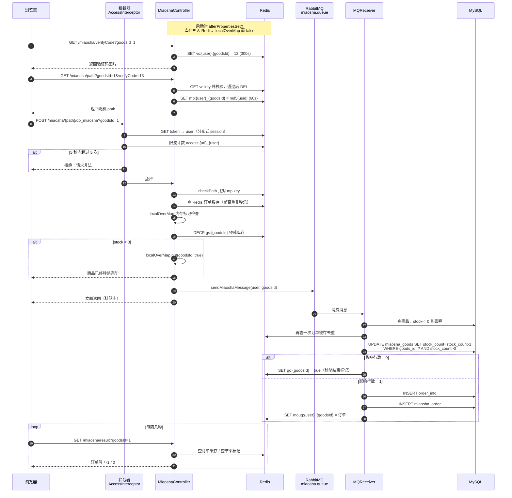
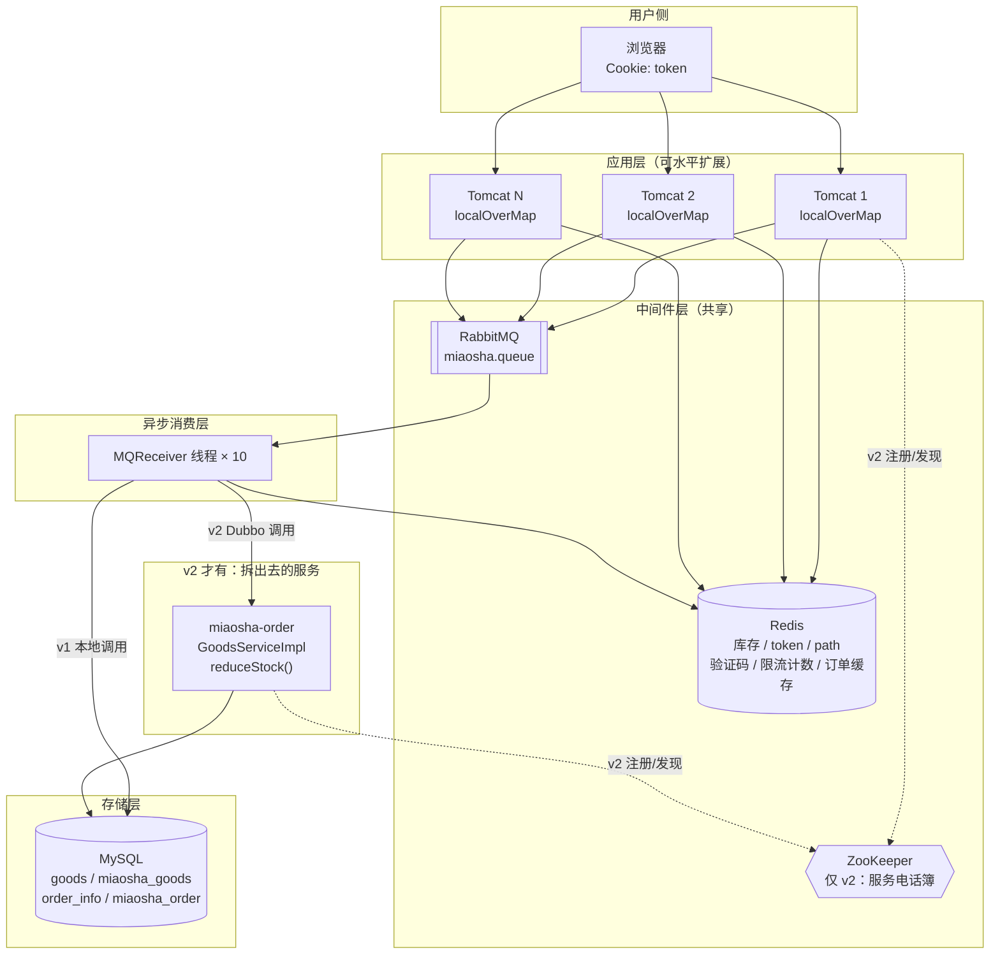

# 《qiurunze123/miaosha》秒杀链路全解（小白版）

> 一句话简介：中文圈最出名的「秒杀系统设计与实现」教学项目，用 Spring Boot + Redis + RabbitMQ + MySQL 把一次秒杀请求拆成「预减库存 → 排队 → 异步下单 → 轮询结果」四段，并在外面套了一圈防黄牛的安全设计。
> 仓库地址：https://github.com/qiurunze123/miaosha
> Star 数：约 26.6k
> 最近推送：2025-04-18（本文基于 commit `e580176` 的代码阅读）
> 技术栈：JDK 1.8 / Spring Boot 2.6.1 / MyBatis / MySQL / Redis（Jedis + Redisson）/ RabbitMQ / Thymeleaf / Dubbo 2.6.9 + ZooKeeper / Druid / Maven 多模块
> 正文只讲机制；可照抄的完整代码统一收在文末[附录](#附录可以照抄的模板)，出处收在[脚注](#出处)。

---

## 0. 读之前：先搞懂「秒杀」到底难在哪

入门文已经讲过「什么是秒杀」，这里换个角度问一句：**为什么一个「减库存 + 写订单」这么简单的事，值得 26.6k 个人来点星？**

先把场景摆出来。

```
              iPhone 秒杀，库存 10 台，开抢时间 10:00:00

      10:00:00.000                          10:00:01.000
           │                                     │
           ▼                                     ▼
     ┌───────────────────────────────────────────────┐
     │  ██████████████████████████████████████████   │  100 万次点击
     │  ██████████████████████████████████████████   │  挤在这 1 秒里
     └───────────────────────────────────────────────┘
                          │
                          ▼
              ┌───────────────────────┐
              │   你的服务器（1 台）    │  ← 平时每秒只处理 200 个请求
              └───────────────────────┘
                          │
                          ▼
              ┌───────────────────────┐
              │   MySQL（1 个实例）     │  ← 平时每秒只扛得住 1000 次写
              └───────────────────────┘
                          │
                          ▼
                     🔥 全都挂了
```

「秒杀」这个词里其实藏着三个完全不同的难题，很多入门文只讲了第一个。

| 难题 | 说人话 | 不解决会怎样 |
| --- | --- | --- |
| ① 数据不能错 | 10 台货不能卖出 12 台 | 「超卖」，运营被开除，公司赔钱 |
| ② 系统不能崩 | 100 万请求不能全砸到数据库上 | 数据库连接池打满，整站瘫痪，连正常下单的用户都进不来 |
| ③ 机会要公平 | 不能让写脚本的黄牛 0.1 秒抢完 | 真实用户抢不到，活动白做，被骂上热搜 |

`qiurunze123/miaosha` 这个项目的价值在于：**它三个都做了**，而且每一层都留下了可读的代码。

入门版秒杀通常只做了 ①（数据库 `where stock > 0`），这个项目在 ① 的基础上还做了 ② 的「三级漏斗」和 ③ 的「地址隐藏 + 验证码 + 限流」。

本文的主线就是：**沿着一次点击，看这三层保护是怎么一层层套上去的。**

> 一个提前打的预防针：这个项目是**教学项目**，作者自己也说文章还有许多不足、仍在不断改进。
> 所以代码里既有很漂亮的设计，也有明显的 bug 和半成品。本文会**如实标出来**——看懂别人的坑，比看懂别人的优点更值钱。

---

## 1. 十分钟认识这个项目

### 1.1 它是干什么的

它是一个**能跑起来的秒杀商城 Demo**：

- 你可以注册、登录（带图形验证码）
- 看商品列表、看商品详情（带秒杀倒计时）
- 到点了点「立即秒杀」
- 系统告诉你「排队中…」，过一会儿变成「秒杀成功，订单号 xxx」或者「商品已经秒杀完毕」

它不是一个可以直接上生产的框架，而是一本**「秒杀该怎么写」的活教材**。

同一套业务，作者写了两遍，另外还带两个配角模块：

| 模块 | 角色 | 说明 |
| --- | --- | --- |
| **miaosha-v1** | ★主线 | 单体版。所有代码在一个 Spring Boot 工程里，一个 `main` 方法启动，最容易读 |
| **miaosha-v2 + miaosha-order** | ★主线 | 拆分版。把「商品/库存」这块业务拆出去变成一个独立服务，用 **Dubbo + ZooKeeper** 做远程调用 |
| **miaosha-admin** | 配角 | 后台管理（登录/账户/字典表），和秒杀主链路基本无关 |
| **miaosha-rpc** | 配角 | Dubbo + TCC 分布式事务的独立小 Demo，用来演示「跨服务的事务怎么补偿」，也不在秒杀主链路上 |

> **Dubbo 是什么？** 就是「让 A 服务器上的 Java 代码，能像调用本地方法一样调用 B 服务器上的方法」的一套工具。
> **ZooKeeper 是什么？** 就是一个「服务电话簿」。B 服务器启动时去电话簿上登记「我提供减库存服务，我的地址是 192.168.1.5:20880」，A 服务器要调用时先翻电话簿查地址。

**所以本文的主线是 miaosha-v1 和 miaosha-v2，配角模块只在第 1.3 节和第 7 节点到为止。**

### 1.2 技术栈清单（每个组件用一句大白话解释它干嘛）

| 组件 | 大白话 | 在这个项目里干什么 |
| --- | --- | --- |
| **Spring Boot** | 一个「懒人打包机」，帮你把一堆 Java 组件自动接好线，`main` 一跑就是个网站 | 整个项目的骨架，`GeekQMainApplication` 是入口 |
| **MySQL** | 仓库里那本厚厚的手写账本，写得准确但翻页慢 | 存商品、库存、订单、用户（表结构见第 4 节） |
| **MyBatis** | 「SQL 翻译官」，你写 SQL，它负责把结果塞进 Java 对象 | `GoodsDao` / `OrderDao`（v1 用注解写 SQL），`GoodsMapper.xml`（v2 用 XML 写 SQL） |
| **Druid** | 数据库连接池，就是「预先拉好的一排电话线」，用完还回来，不用每次重新拨号 | `DruidConfig` 负责初始化，配置在启动配置文件里 |
| **Redis** | 收银台旁边的小白板，写字擦字都比翻账本快 100 倍，但停电就没了 | 存库存快照、秒杀路径、验证码答案、登录 token、订单缓存、限流计数 |
| **Jedis** | Java 操作 Redis 的「遥控器」 | `RedisService` 每次读写前都先从连接池借一个连接、用完归还 |
| **Redisson** | 比 Jedis 更高级的遥控器，自带「分布式锁」这种成品功能 | 定时关单任务里用它拿分布式锁 |
| **RabbitMQ** | 奶茶店的取号小票机：先给你一张号码牌，后厨慢慢做 | 秒杀请求先扔进队列，后台慢慢生成订单 |
| **Thymeleaf** | HTML 模板引擎，把 Java 里的数据「填空」进 HTML | 商品列表页、详情页；还被用来做「页面级缓存」 |
| **Lua 脚本** | 交给 Redis 的一张「一口气做完这几件事，中间不许插队」的纸条 | v2 的分布式限流靠它实现 |
| **Dubbo + ZooKeeper** | 远程调用框架 + 服务电话簿 | v2 把「查商品 / 减库存」调用到 `miaosha-order` 服务 |
| **ThreadLocal** | 每个服务员自己的口袋，互相不串味 | `UserContext` 存当前登录用户 |

### 1.3 目录结构地图

```
miaosha/
├── pom.xml                     ← 父 POM，统一管版本；modules 里列了 5 个子模块
├── README.md                   ← 作者的其他项目导航（不讲秒杀）
├── old.md                      ← ★真正的「秒杀设计说明书」在这里，032 个专题清单
├── docs/                       ← 30 篇设计文档
│   ├── code-solve.md           ← ★最重要，把每个优化点的思路都写了一遍
│   ├── redis-good.md           ← Redis / Lua 脚本 / 分布式锁
│   ├── jemter-solve.md         ← 怎么用 JMeter 压测
│   ├── mysql*.md, netty.md ... ← 周边知识
│
├── sql/
│   ├── miaosha1.sql            ← ★干净的建表脚本（7 张表），照着导就行
│   └── miaosha.sql             ← 500KB 的大导出，含海量测试数据
│
├── miaosha-v1/                 ← ★★★ 单体版，主线阅读对象
│   └── src/main/java/com/geekq/miaosha/
│       ├── controller/         ← MiaoshaController ★ 主战场
│       ├── service/            ← MiaoshaService / OrderService / GoodsService ★
│       ├── access/             ← AccessLimit 注解 + AccessInterceptor 拦截器 ★
│       ├── redis/              ← RedisService + 各种 XxxKey 前缀类 ★
│       │   └── redismanager/   ← Lua 脚本、RedisLock 等实验性代码
│       ├── rabbitmq/           ← MQSender / MQReceiver / MQConfig ★
│       ├── dao/  domain/  vo/  ← 数据访问 / 实体 / 页面对象
│       ├── config/             ← WebConfig（注册拦截器）、UserArgumentResolver
│       ├── timeTask/           ← OrderCloseTask，定时关单 + 4 版分布式锁演进
│       └── exception/          ← 全局异常拦截
│
├── miaosha-v2/                 ← ★★ 拆分版（三个子模块）
│   ├── miaosha-common/         ← 实体、枚举、工具类（com.geekq.miasha.*，注意拼写）
│   ├── miaosha-service/        ← service / mapper / redis / rabbitmq
│   └── miaosha-web/            ← controller / interceptor / 页面
│       └── resources/consumer.xml  ← ★Dubbo 消费者配置（连 ZooKeeper）
│
├── miaosha-order/              ← ★ v2 拆出去的「商品/库存」服务
│   ├── miaosha-order-api/      ← 接口定义 GoodsService（两边共用的「合同」）
│   └── miaosha-order-provider/ ← 接口实现 + provider.xml（暴露 Dubbo 服务）
│
├── miaosha-admin/              ← 后台管理，与秒杀主链路无关
└── miaosha-rpc/                ← Dubbo/TCC 分布式事务独立 Demo，与主链路无关
```

**读代码的建议顺序**（师兄经验）：

| 顺序 | 看哪里 | 看什么 |
| --- | --- | --- |
| 1 | `sql/miaosha1.sql` | 先知道数据长什么样 |
| 2 | `MiaoshaController.afterPropertiesSet()` | 启动时干了什么（缓存预热） |
| 3 | `MiaoshaController.miaosha()` | 主战场，20 行代码藏了 5 道关卡 |
| 4 | `MQReceiver.receive()` | 请求出队后发生了什么 |
| 5 | `MiaoshaService.miaosha()` → `GoodsService.reduceStock()` | 真正扣库存 |
| 6 | `MiaoshaController.miaoshaResult()` | 前端怎么知道抢没抢到 |
| 7 | `AccessInterceptor` | 回过头看限流和登录态 |

---

## 2. 【主线】一次秒杀请求，从点击到下单的完整链路

先给一张地图，免得读到一半忘了自己在哪：

> 启动预热 → 登录换 token → 商品页走缓存 → 答验证码 → 换一条随机 path → 连过五道关卡 → 入队后立即返回 → 后台慢慢落库 → 前端轮询结果。

十三个小节里，真正决定这套系统成败的是总图上打 ★★★ 的三处——内存标记（2.7）、Redis 预减库存（2.8）、MQ 异步下单（2.9）。其余的要么是护栏（验证码、path、限流），要么是铺垫（预热、session、页面缓存），第一遍可以读得快一点。

### 2.0 先看总图

这是**贯穿全文的主链路大图**，后面每一小节都会回到这张图上的某一个方框。
图里带 ★ 的方框就是这个项目「比最简单实现多做的事情」。

```
┌──────────────────────────────────────────────────────────────────────────────┐
│                          【第 0 阶段】系统启动时（只做一次）                    │
│  MiaoshaController.afterPropertiesSet()                                       │
│    ├─ 查 DB 里所有秒杀商品            goodsService.listGoodsVo()               │
│    ├─ ★把库存数写进 Redis            GoodsKey.getMiaoshaGoodsStock:1 = 9      │
│    └─ ★把内存标记初始化为 false      localOverMap.put(1L, false)              │
└──────────────────────────────────────────────────────────────────────────────┘

           用户浏览器
                │
                │ ① POST /login/do_login   （用户名+密码）
                ▼
     ┌─────────────────────────────┐
     │  LoginController            │
     │  MiaoShaUserService.login() │
     │   ★ 生成 UUID 当 token       │
     │   ★ token→user 写进 Redis    │  ← 分布式 session
     │   ★ token 塞进 Cookie 返回    │
     └─────────────────────────────┘
                │  Cookie: token=6f3a...
                ▼
     ┌─────────────────────────────┐
     │  ② GET /goods/to_list        │
     │  BaseController.render()     │
     │   ★ 页面级缓存：整段 HTML     │
     │     缓存进 Redis 60 秒        │
     └─────────────────────────────┘
                │
                ▼
     ┌─────────────────────────────┐
     │  ③ GET /miaosha/verifyCode   │   ★ 图形验证码（数学题）
     │  MiaoshaService              │      答案存 Redis，图片返给浏览器
     │    .createVerifyCode()       │      有效期 300 秒
     └─────────────────────────────┘
                │  用户肉眼算出 "3+5*2" = 13
                ▼
     ┌─────────────────────────────┐
     │  ④ GET /miaosha/path         │   ★ 秒杀地址隐藏
     │     ?goodsId=1&verifyCode=13 │      验证码对了才给你随机路径
     │  checkVerifyCode() ✓          │      path = md5(uuid+"123456")
     │  createMiaoshaPath()          │      存 Redis，60 秒过期
     └─────────────────────────────┘
                │  返回 path = "9a2f7c..."
                ▼
╔══════════════════════════════════════════════════════════════════════════════╗
║  ⑤ POST /miaosha/9a2f7c.../do_miaosha?goodsId=1     ← 真正的秒杀请求          ║
╠══════════════════════════════════════════════════════════════════════════════╣
║                                                                              ║
║  ┌─ 关卡 A ────────────────────────────────────────────────────────┐         ║
║  │ AccessInterceptor.preHandle()（v2 叫 LoginInterceptor）          │         ║
║  │  ★ 从 Cookie 取 token → Redis 取 user → 放进 ThreadLocal         │         ║
║  │  ★ 读 @AccessLimit(seconds=5, maxCount=5)                       │         ║
║  │  ★ Redis 计数：5 秒内同一用户访问同一 URI 超过 5 次 → 直接拒绝     │         ║
║  └─────────────────────────────────┬───────────────────────────────┘         ║
║                                    ▼                                         ║
║  ┌─ 关卡 B ────────────────────────────────────────────────────────┐         ║
║  │ miaoshaService.checkPath(user, goodsId, path)                   │         ║
║  │  ★ 拿 URL 里的 path 和 Redis 里存的比对，不一致 → 「访问太频繁」   │         ║
║  └─────────────────────────────────┬───────────────────────────────┘         ║
║                                    ▼                                         ║
║  ┌─ 关卡 B' （仅 v2）─────────────────────────────────────────────┐          ║
║  │ RedisLimitRateWithLUA.accquire()                                │         ║
║  │  ★ 用 Lua 脚本在 Redis 里做「每秒最多 N 个」的分布式限流           │         ║
║  └─────────────────────────────────┬───────────────────────────────┘         ║
║                                    ▼                                         ║
║  ┌─ 关卡 C ────────────────────────────────────────────────────────┐         ║
║  │ orderService.getMiaoshaOrderByUserIdGoodsId()                   │         ║
║  │  ★ 查 Redis 订单缓存：这个人已经抢到过了吗？→「不能重复秒杀」      │         ║
║  └─────────────────────────────────┬───────────────────────────────┘         ║
║                                    ▼                                         ║
║  ┌─ 关卡 D ★★★ 内存标记 ───────────────────────────────────────────┐         ║
║  │ if (localOverMap.get(goodsId)) return 「商品已经秒杀完毕」       │         ║
║  │  ★ 卖完之后，连 Redis 都不用访问了，直接在 JVM 内存里挡掉         │         ║
║  └─────────────────────────────────┬───────────────────────────────┘         ║
║                                    ▼                                         ║
║  ┌─ 关卡 E ★★★ Redis 预减库存 ─────────────────────────────────────┐         ║
║  │ Long stock = redisService.decr(GoodsKey.getMiaoshaGoodsStock,   │         ║
║  │                                 ""+goodsId);                    │         ║
║  │ if (stock < 0) { localOverMap.put(goodsId, true);               │         ║
║  │                  return 「商品已经秒杀完毕」; }                   │         ║
║  │  ★ 一次 Redis 原子减法，把 99.999% 的请求挡在数据库外面           │         ║
║  └─────────────────────────────────┬───────────────────────────────┘         ║
║                                    ▼                                         ║
║  ┌─ 关卡 F ★★★ 入队，立即返回 ─────────────────────────────────────┐         ║
║  │ mqSender.sendMiaoshaMessage(new MiaoshaMessage(user, goodsId))  │         ║
║  │  ★ 只是丢一条消息，不碰数据库，接口毫秒级返回                     │         ║
║  └─────────────────────────────────────────────────────────────────┘         ║
╚══════════════════════════════════════════════════════════════════════════════╝
                │                                       │
      HTTP 立即返回（"排队中"）              消息进入 RabbitMQ 队列 miaosha.queue
                │                                       │
                ▼                                       ▼
   ┌────────────────────────────┐    ┌──────────────────────────────────────┐
   │ ⑥ 前端轮询                  │    │ ⑦ MQReceiver.receive()（后台消费者）  │
   │ GET /miaosha/result         │    │   1. 查商品，stock<=0 → 丢弃          │
   │   ?goodsId=1                │    │   2. 再查一次是否重复下单             │
   │  返回：                     │    │   3. miaoshaService.miaosha()        │
   │   >0  → 订单号，成功         │    │      ├ goodsService.reduceStock()    │
   │   -1  → 秒杀失败             │    │      │   UPDATE miaosha_goods        │
   │    0  → 还在排队，继续轮询    │    │      │   SET stock_count=stock_count-1│
   │                             │    │      │   WHERE goods_id=? AND         │
   │                             │    │      │         stock_count > 0   ★★★  │
   │                             │    │      └ orderService.createOrder()    │
   │                             │    │          ├ INSERT order_info         │
   │                             │    │          ├ INSERT miaosha_order      │
   │                             │    │          └ ★写 Redis 订单缓存         │
   └────────────────────────────┘    └──────────────────────────────────────┘
                ▲                                       │
                └───────────── 轮询读到 Redis 里的订单 ───┘
```

---

### 2.1 第一步：系统启动时的「缓存预热」

服务器刚启动、还没有任何用户来访问的时候，程序主动把数据库里每个秒杀商品的库存数**抄一份到 Redis**，同时把一个叫 `localOverMap` 的内存开关全部置为 `false`（表示"还没卖完"）。这段逻辑挂在 Spring 的 `InitializingBean` 接口上，意思是「这个 Bean 造好之后，请帮我调一次 `afterPropertiesSet()`」。所以这段代码 = **在服务对外提供访问之前，先把货搬到收银台**。完整实现照抄[附录 A](#a-缓存预热)[^1]。

> **小白比喻**：演唱会开票前，工作人员先把 10 张票从仓库搬到售票窗口的抽屉里。
> 不这么做的话，第一个观众来了才去仓库翻箱倒柜找票，后面 999 个人就在窗口前挤成一团了。

**不做会怎样 → 做了之后怎样**

| | 不做缓存预热 | 做了缓存预热 |
| --- | --- | --- |
| 第一个请求 | 要先查数据库拿库存，再写 Redis | 直接读 Redis |
| 高并发瞬间 | 大量请求同时发现「Redis 里没有」，一起去查数据库 → **缓存击穿**，数据库瞬间被打爆 | Redis 里一直有值，数据库毫无压力 |

**⚠️ 这里有个真实的坑**：预热只在**启动时**跑一次。如果运营在后台新加了一个秒杀商品，`localOverMap` 里没有这个 `goodsId`，后续读取这个内存标记时，`null` 自动拆箱成 `boolean` 会直接抛 `NullPointerException`：

```java
boolean over = localOverMap.get(goodsId);   // 返回 Boolean，可能是 null
```

另外 `HashMap` 本身不是线程安全的，多线程同时 `put` 理论上可能出问题（生产代码应该用 `ConcurrentHashMap`）。这是这个教学项目的已知瑕疵。

---

### 2.2 第二步：登录 —— 分布式 session

用户提交用户名密码 → 服务端校验 → 生成一个随机的 UUID 当作 `token` → **把「token → 用户对象」这条记录写进 Redis** → 把 token 塞进浏览器 Cookie，有效期两天。以后每次请求，浏览器都会带上这个 Cookie，服务端拿 token 去 Redis 里换回用户对象。完整实现照抄[附录 B](#b-登录与分布式-session)[^2]。

从 Cookie 到「Controller 方法参数里的 `MiaoshaUser user` 自动有值」，中间是三段接力[^3]：

| 棒次 | 干了什么 |
| --- | --- |
| ① 拦截器 | `preHandle()` 里取用户，拿到 `MiaoshaUser` |
| ② ThreadLocal 存取器 | 把用户存进 ThreadLocal |
| ③ Spring MVC 参数解析器 | 方法调用前把 ThreadLocal 里的对象取出来，塞进 Controller 参数 |

传统的 `HttpSession` 是存在**单台 Tomcat 的内存里**的，一换机器就不认人了：

```
      传统 session（会出事）                    分布式 session（这个项目的做法）

   用户第 1 次请求 ──► Tomcat A            用户第 1 次请求 ──► Tomcat A
                      (内存里记着你)                              │
                                                                 ▼
   用户第 2 次请求 ──► Tomcat B                              ┌─────────┐
                      「你是谁？」❌                          │  Redis  │  token→user
                                                            └─────────┘
                                                                 ▲
                        用户第 2 次请求 ──► Tomcat B ────────────┘
                                            「哦，是你」✅
```

> **小白比喻**：传统 session 就像把你的会员信息写在 A 收银员的小本子上，你换到 B 收银台就得重新登记。
> 分布式 session 是把会员信息写在**大厅中央的公告板（Redis）**上，哪个收银员都能查。

**为什么用 ThreadLocal 存 user？** ThreadLocal 是一个「每个线程一个格子」的储物柜——Tomcat 处理每个 HTTP 请求都用一个独立线程，所以「张三的请求线程」往格子里放张三，「李四的请求线程」放李四，互相看不见，天然线程安全。拦截器在请求处理结束后会主动清空这个格子——**这一步很重要**，因为 Tomcat 的线程是复用的，不清空的话下一个请求可能读到上一个用户的数据（既是内存泄漏，也是安全事故）。

---

### 2.3 第三步：商品页 —— 页面级缓存

商品列表页不是每次都重新渲染 HTML，而是**把渲染好的整段 HTML 字符串缓存进 Redis 60 秒**。调用方是商品列表接口，只传了一个固定的缓存 key。完整实现照抄[附录 C](#c-页面级缓存)[^4]。

值不值得？作者在压测时留下了真实数字：

```java
/**
 * QPS:1267 load:15 mysql
 * 5000 * 10
 * QPS:2884, load:5
 */
```

翻译：**开缓存前 1267 QPS，开缓存后 2884 QPS，服务器 load 从 15 降到 5。**

> **小白比喻**：一份「今日菜单」，不做页面缓存 = 每来一个客人，厨师现场手写一遍菜单；
> 做了页面缓存 = 打印 100 份放门口，60 秒后再重新打印一批。

---

### 2.4 第四步：图形验证码 —— 把黄牛的脚本挡在门外

用户点「立即秒杀」之前，得先看一张图，图上是一道**数学题**（比如 `3+5*2`），把答案填进去。

生成验证码的机制一句话说完：

```
随机三个 0~9 的数字 + 两个随机运算符（只在 + - * 里选）拼成算式
    ↓
借 JS 引擎把算式算出答案
    ↓
答案（不是算式）以 "昵称,商品id" 为 key 存进 Redis，300 秒有效
    ↓
算式画成图片返给浏览器，让人肉眼去算
```

校验时反过来：拿用户填的数字和 Redis 里的答案比，**比中之后立刻 delete**，所以一张验证码只能用一次。完整实现照抄[附录 D](#d-图形验证码)[^5]。

**为什么这么设计（两个目的，第二个更重要）**

```
   目的 ①：挡机器人
   ┌──────────────────────────────────────────────┐
   │  写脚本的黄牛，靠脚本批量重放请求打接口         │
   │  加了验证码之后，脚本得先「看懂图片里的算式」    │
   │  → 成本大幅上升                                │
   └──────────────────────────────────────────────┘

   目的 ②：★削峰（作者的真实意图）
       不加验证码                          加了验证码
   ┌──────────────┐                  ┌──────────────┐
   │      ██      │ 瞬时 10万 QPS     │   ▄▄▄▄▄▄▄▄   │ 峰值被摊平到
   │      ██      │                  │   ████████   │ 几秒钟里
   │  ────────    │                  │  ──────────  │
   │   一瞬间      │                  │   3~10 秒     │
   └──────────────┘                  └──────────────┘
       每个人算这道题要花 1~5 秒，1 万个人不会在同一毫秒点击了
```

**⚠️ 坑**：验证码答案的计算依赖 JDK 内置的 Nashorn 引擎，**在 JDK 15 之后被彻底移除了**。所以这个项目必须用 JDK 8 跑（父 POM 里也确实写死了 `maven.compiler.source=1.8`）。

---

### 2.5 第五步：秒杀地址隐藏（getMiaoshaPath）

这是整个项目里**最有代表性的防黄牛设计**。

秒杀接口的 URL 不是固定的 `/miaosha/do_miaosha`，而是 `/miaosha/{path}/do_miaosha`——中间那个 `{path}` 是一段**随机的 MD5 字符串，每个用户、每个商品、每次点击都不一样，而且 60 秒后失效**。

想拿到这个 path，必须先通过验证码。

发和验的两个动作，机制是对称的：

```
发 path（GET /miaosha/path）：
    验证码对不上          → 直接返回「请求非法」
    验证码对上了          → path = md5(uuid + "123456")
                            以 "昵称_商品id" 为 key 写进 Redis，60 秒过期
                            把 path 返给浏览器

用 path（POST /miaosha/{path}/do_miaosha）：
    读 Redis 里 "昵称_商品id" 的那条
    URL 里的 path 和它相等   → 放行
    不等 / 已过期 / 没有     → 拒绝
```

注意 key 里拼了昵称，所以 A 用户拿到的 path，B 用户拿去用是过不了的。完整实现照抄[附录 E](#e-秒杀路径隐藏)[^6]。

**不做会怎样 → 做了之后怎样**

```
  ❌ 没有地址隐藏：
  ┌──────────────────────────────────────────────────────────────┐
  │ 黄牛提前一天打开开发者工具，看到接口是                          │
  │    POST /miaosha/do_miaosha?goodsId=1                        │
  │ 于是写好脚本，10:00:00.000 定时发 1 万个请求                    │
  │ → 真实用户 10:00:00.500 才点下按钮，库存早没了                  │
  └──────────────────────────────────────────────────────────────┘

  ✅ 有了地址隐藏：
  ┌──────────────────────────────────────────────────────────────┐
  │ 黄牛提前一天看到的是 /miaosha/{path}/do_miaosha                │
  │ 但 path 是开抢那一刻才能拿到的，而且：                          │
  │   · 必须先答对验证码才发                                       │
  │   · 每个用户不一样（Redis key 里带了昵称）                      │
  │   · 每次点击都重新生成                                        │
  │   · 60 秒过期                                                 │
  │ → 脚本没法「预埋」，只能老老实实走完整流程                       │
  └──────────────────────────────────────────────────────────────┘
```

> **小白比喻**：演唱会不再是「大家去 3 号门排队」，而是「你先到咨询台答一道数学题，答对了工作人员悄悄告诉你今天走哪个门，而且只有你这一张纸条有效，一分钟后作废」。

**验证码 + 地址隐藏的完整时序（字符图）**

```
  浏览器                        MiaoshaController              Redis
    │                                 │                          │
    │ GET /miaosha/verifyCode         │                          │
    │  ?goodsId=1                     │                          │
    ├────────────────────────────────►│                          │
    │                                 │ 生成 "3+5*2"，算出 13     │
    │                                 ├─ SET MiaoshaKey:vc       │
    │                                 │   18612766138,1 = 13 ────►│ (300s)
    │◄──── JPEG 图片 ─────────────────┤                          │
    │                                 │                          │
    │ 用户肉眼算出 13                   │                          │
    │                                 │                          │
    │ GET /miaosha/path               │                          │
    │  ?goodsId=1&verifyCode=13       │                          │
    ├────────────────────────────────►│                          │
    │                                 │ checkVerifyCode()        │
    │                                 ├─ GET vc key ────────────►│
    │                                 │◄──── 13 ─────────────────┤
    │                                 │ 13-13==0 ✓，并 DEL 掉     │
    │                                 │ path=md5(uuid+"123456")  │
    │                                 ├─ SET MiaoshaKey:mp       │
    │                                 │   18612766138_1 = path ─►│ (60s)
    │◄──── {"data":"9a2f7c..."} ──────┤                          │
    │                                 │                          │
    │ POST /miaosha/9a2f7c.../do_miaosha?goodsId=1               │
    ├────────────────────────────────►│                          │
    │                                 │ checkPath() ────────────►│
    │                                 │◄──── 一致 ✓ ─────────────┤
    │                                 │  ...进入后面的关卡...      │
```

**⚠️ 一个必须说的现状**：仓库里对应的前端页面模板**还是老版本**——它直接提交表单打老地址，既没有请求验证码，也没有先去换 path，更没有轮询结果；v2 里干脆连这个页面都没有[^7]。

也就是说：**后端的安全设计是完整的，但仓库里的前端页面没跟上**，你直接跑起来点按钮会 404。这是读这个项目时最容易困惑的地方，别怀疑自己。

---

### 2.6 第六步：限流拦截器 —— @AccessLimit 注解怎么工作

在方法上贴一行注解，这个接口就自动获得了「同一个用户，5 秒内最多访问 5 次」的能力。拦截器里真正跑的是这么一段：

```
key = 请求 URI
if 注解要求登录:
    没登录 → 直接返回 SESSION_ERROR，不进 Controller
    key = key + "_" + 用户昵称        // 按人 + 按接口分开计数

count = redis.get(key)
if count 不存在:   redis.set(key, 1, 过期时间 = 注解里的 seconds)
elif count < maxCount:  redis.incr(key)
else:              返回 ACCESS_LIMIT_REACHED，不进 Controller
```

计数器靠 key 自己过期来滚动窗口——**没有人去清零，时间到了 key 直接消失**。注解本身只有三个字段：时间窗口、窗口内最大次数、是否要求登录。真正执行判断的是拦截器，注册进 Spring MVC 的动作在配置类里完成。完整实现照抄[附录 F](#f-通用限流注解)[^8]。

**限流计数在 Redis 里长这样**

```
   第 0.0 秒  访问 → key 不存在 → SET  access:/miaosha/xx/do_miaosha_18612766138 = 1  (TTL 5s)
   第 0.3 秒  访问 → count=1 < 5 → INCR → 2
   第 0.6 秒  访问 → count=2 < 5 → INCR → 3
   第 0.9 秒  访问 → count=3 < 5 → INCR → 4
   第 1.2 秒  访问 → count=4 < 5 → INCR → 5
   第 1.5 秒  访问 → count=5 ≥ 5 → ❌ 拒绝，返回 "请求非法!"
   ...
   第 5.0 秒  key 自动过期消失
   第 5.1 秒  访问 → key 不存在 → 重新计数
```

> **小白比喻**：景区门口的闸机，每人每 5 分钟只能刷 5 次卡，刷多了闸机就不开了。
> 而且这个「刷卡记录」是写在中央系统（Redis）里的，你换个闸机（换台服务器）也照样算数。

**这是「计数器限流」，有个众所周知的短板：临界问题**

```
       窗口1 [0s ────────── 5s)   窗口2 [5s ────────── 10s)
                      ▲  ▲             ▲  ▲
                     4.9s 5.0s        5.1s
                      └─ 5 次 ─┘      └─ 5 次 ─┘
                          在 0.2 秒里放过了 10 次请求
```

生产环境更常用「滑动窗口」或「令牌桶」。项目里其实留了 Guava `RateLimiter` 的注释代码：

```java
//		//使用RateLimiter 限流
//		RateLimiter rateLimiter = RateLimiter.create(10);
//		if (!rateLimiter.tryAcquire(1000, TimeUnit.MILLISECONDS)) { ... }
```

但注释掉了——因为 `RateLimiter` 是**单机**的，每台机器各限各的，10 台机器就变成了 100/秒。这也正是 v2 引入 Lua 分布式限流的原因（见 2.11 节）。

**⚠️ 小彩蛋**：错误码枚举里这两条的文案是**串了的**：

```java
ACCESS_LIMIT_REACHED(30002, "请求非法!"),
REQUEST_ILLEGAL(30004, "访问太频繁!"),
```

限流触发时返回「请求非法!」，path 校验失败时返回「访问太频繁!」——正好反了。不影响功能，但读代码时容易懵。

---

### 2.7 第七步：内存标记 localOverMap —— 连 Redis 都懒得访问

一旦某个商品被判定「卖完了」，Controller 就在 **JVM 自己的内存**里插一面小旗子。后续同商品的请求走到这里，看见旗子直接返回，**连一次 Redis 网络请求都不发**。这两行判断和插旗子的代码，就在 `miaosha()` 方法里（[附录 G](#g-秒杀主战场)）[^9]。

差距有多大：

```
                    请求成本对比

   ┌───────────────────────────────────────────────────────────┐
   │ 走到 Redis：                                                │
   │   JVM ──► 网卡 ──► 网线 ──► Redis 服务器 ──► 回来           │
   │   耗时 ≈ 0.5 ~ 2 毫秒（同机房），还占一条连接池连接           │
   └───────────────────────────────────────────────────────────┘
   ┌───────────────────────────────────────────────────────────┐
   │ 走内存标记：                                                │
   │   JVM ──► HashMap.get()                                    │
   │   耗时 ≈ 0.00001 毫秒，不占任何连接                          │
   └───────────────────────────────────────────────────────────┘
                        快了大约 10 万倍
```

**不做会怎样 → 做了之后怎样**

假设 10 台货，100 万个请求。第 11 个请求之后货就没了，剩下 **99.9989 万个请求全是注定失败的**。

| | 没有内存标记 | 有内存标记 |
| --- | --- | --- |
| Redis 收到的请求数 | ~100 万次 DECR | ~几百到几千次（旗子插上前的那一小撮） |
| Redis 网络带宽 | 打满 | 几乎为零 |
| 库存值 | 会被减到 -999989（作者专门解释过这个现象） | 只会小幅为负 |

> **小白比喻**：售票窗口卖光后，售票员在窗口上贴一张「今日售罄」的纸。
> 后面的人一看纸就走了，售票员连头都不用抬。没有这张纸，售票员就得对着每个人重复一万遍「没了」。

**注意这个标记是「每台机器一份」**：如果部署了 10 台服务器，就有 10 个 `localOverMap`，各插各的旗。这不是 bug，恰恰是设计意图——它只是个「性能优化的近似值」，真正的准确性由后面的 Redis 和 MySQL 保证。

---

### 2.8 第八步：Redis 预减库存 —— 全链路最关键的一刀

一行原子减法（`redisService.decr(...)`），把绝大部分请求挡在数据库外面。实现方式很直接：向 Jedis 借一个连接，直接调用 Redis 的 `DECR`。完整实现照抄[附录 G](#g-秒杀主战场)[^9]。

关键在于 Redis 的 `DECR` 是**原子操作**——Redis 是单线程处理命令的，1000 个客户端同时对同一个 key 做 `DECR`，Redis 会排成一队一个一个执行，**绝不会出现「两个人都读到 5，都减成 4」的情况**。

```
        库存 = 3，同时来 6 个请求

        请求      Redis DECR 返回     判定
        ───────────────────────────────────────
        R1   →         2          2 >= 0  ✅ 放行，进 MQ
        R2   →         1          1 >= 0  ✅ 放行，进 MQ
        R3   →         0          0 >= 0  ✅ 放行，进 MQ
        R4   →        -1         -1 <  0  ❌ 拒绝 + 插旗子
        R5   →        -2         -2 <  0  ❌ 拒绝（旗子可能还没生效）
        R6   →     命中内存标记                ❌ 拒绝（连 Redis 都没访问）

        ★ 正好放行 3 个，一个不多一个不少
```

**为什么 Redis 里的数会变成负数？（作者专门答过这个问题）**

> 假如 redis 的数量为 1,这个时候同时过来 100 个请求，大家一起执行 decr 数量就会减少成 -99 这个是正常的[^10]

因为 `DECR` 是「先减再返回」，减到负数是不可避免的。但这**完全没关系**——判断条件是 `stock < 0` 就拒绝，负多少都一样拒绝。

**Redis 库存和 MySQL 库存不一致怎么办？（这是最多人问的问题）**

作者的回答很妙，我原样抄给你：

> redis 的数量不是库存,他的作用仅仅只是为了阻挡多余的请求透穿到 DB，起到一个保护的作用
> 因为秒杀的商品有限，比如 10 个，让 1 万个请求区访问 DB 是没有意义的，因为最多也就只能 10 个
> 请求下单成功，所有这个是一个伪命题，我们是不需要保持一致的[^11]

> **小白比喻**：Redis 里的数字**不是账本，是门口发的号码牌**。
> 门口发 10 张号码牌（Redis 库存 10），拿到牌的人才能进店；
> 但真正的成交记录还是柜台里的账本（MySQL）说了算。
> 号码牌发多发少不影响账本准确性，它只是个**限流器**。

---

### 2.9 第九步：RabbitMQ 异步下单 —— 先发号，后做单

通过前面所有关卡的请求，**并不会立刻写数据库**。它只是把「谁 + 抢哪个商品」打包成一条消息扔进队列，然后接口立刻返回——此时订单还不存在。

消费端做的事是「两道二次校验 + 一次真扣」：

```
收到一条消息 → 反序列化出 user、goodsId
    查 DB 里这个商品的 stock_count
        <= 0  → 直接丢弃这条消息，不再往下走
    查 Redis 订单缓存，这个人是不是已经有单了
        有    → 直接丢弃
    都过了 → miaoshaService.miaosha(user, goods)   // 减库存 + 下单
```

两次「丢弃」都是静默的，不给用户任何反馈——用户那边靠轮询接口自己看结果。完整实现照抄[附录 H](#h-rabbitmq-异步下单)[^12]。

**为什么这么设计**

```
     ❌ 同步下单（最简单的实现）

     用户点击 ──► Controller ──► UPDATE 库存 ──► INSERT 订单 ──► 返回
                                 └────────── 20 ~ 200 ms ──────────┘
     并发 5000 时：5000 个 Tomcat 线程全在等数据库 → 线程池打满 → 502

     ✅ 异步下单（这个项目的做法）

     用户点击 ──► Controller ──► 扔一条消息 ──► 返回「排队中」
                                 └── 1 ms ──┘
                                     │
                                     ▼
                          ┌──────────────────────┐
                          │  RabbitMQ 队列        │  ← 消息在这里排队
                          │  ▓▓▓▓▓▓▓▓▓▓░░░░░░    │
                          └──────────────────────┘
                                     │  消费者按自己的节奏取
                                     ▼
                          10 个消费者线程 ──► 数据库
                            （并发度配置成 10）
```

> **小白比喻**：奶茶店高峰期，店员不会等做完一杯才收下一个人的钱。
> 他先收钱、给你一张 **57 号小票**，你去旁边等；后厨按顺序慢慢做。
> 「排队中」= 你手里的小票，「订单号」= 奶茶做好了。

**不做会怎样 → 做了之后怎样**

| | 同步下单 | MQ 异步下单 |
| --- | --- | --- |
| 接口响应时间 | 几十~几百毫秒 | 1~2 毫秒 |
| 数据库瞬时压力 | 和请求量同步暴涨 | 恒定（消费者数量决定） |
| 请求 5000 并发 | Tomcat 线程池打满 | 轻松 |
| 用户体验 | 转圈圈很久，可能超时 | 秒回「排队中」，然后轮询 |
| 代价 | —— | ★变复杂了：要多写一个轮询接口，用户要等 |

**关于「消息不丢不重」**，作者给了四条：

> -1.exchange持久化
> -2.queue持久化
> -3.发送消息设置MessageDeliveryMode.persisent这个也是默认的行为
> -4.手动确认[^13]

配置里也确实开了发布确认和手动 ack 模式，与这四条对应。

**⚠️ 坑**：队列配置里给别的几个队列都声明了对应的 Bean，**唯独没给秒杀消息队列声明**。所以第一次跑之前，你得自己去 RabbitMQ 管理页面手动建一个名叫 `miaosha.queue` 的队列，否则监听器启动会报错。

---

### 2.10 第十步：真正扣库存 + 落库 —— 最后一道防线

消费者线程调用的服务方法，这里才是「减库存 + 写订单」的真身，而且套了数据库事务：先减库存，成功了才建订单，减库存失败就在 Redis 里打上「秒杀结束」标记。

减库存靠一条 SQL 完成，`where stock_count > 0` 这五个字，是整个项目防超卖的最后一道锁，具体在第 5 章细说。落库分两步：先写完整订单表，再写一张专门用来判重的秒杀订单表，最后把订单缓存写回 Redis。完整实现照抄[附录 I](#i-真正扣库存与落库)[^14]。

```
                MySQL 内部发生了什么（InnoDB 行锁）

   时刻    线程A                          线程B
   ────────────────────────────────────────────────────────────
   t1     UPDATE ... WHERE stock_count>0
          → 拿到该行的排他锁 🔒
   t2                                    UPDATE ... WHERE stock_count>0
                                         → 被阻塞，等锁 ⏳
   t3     stock_count: 1 → 0
          返回影响行数 1  ✅
          COMMIT，释放锁 🔓
   t4                                    拿到锁，重新判断 stock_count > 0
                                         此时 stock_count = 0，条件不成立
                                         返回影响行数 0  ❌
   ────────────────────────────────────────────────────────────
   结论：无论多少线程并发，最后一件货只会被一个人拿走
```

**为什么还要写一份 Redis 订单缓存？**

因为「查这个人抢到没有」这个动作，在链路里要执行 **3 次**（Controller 关卡 C、MQ 消费者、轮询接口），如果每次都查数据库，QPS 又上去了。查这条缓存的方法**只读 Redis，压根没查数据库**——数据库里同名的那条查询 SQL 在这条链路上没被用到[^14]。

---

### 2.11 第十一步（仅 v2）：Lua 脚本分布式限流

v2 的秒杀方法比 v1 多了一段分布式限流调用。脚本本身做的事是「读—判—写」三步打包：

```
key = "ip:" + 当前秒
current = GET key（没有就当 0）
if current + 1 > limit:   return 0        // 这一秒的额度用完了
else:
    INCRBY key 1
    EXPIRE key 2                           // 两秒后自动消失，不用清理
    return 1
```

完整实现照抄[附录 J](#j-v2-lua-分布式限流)[^15]。

**Lua 脚本为什么重要？**

> **Lua 脚本是什么？** 一张交给 Redis 的纸条，上面写着「请一口气把这几件事做完，中间不许别人插队」。
> Redis 保证脚本**整体原子执行**。

```
   ❌ 不用 Lua，用 Java 分三步：
        读 key                            ← 线程A读到 2
                                          ← 线程B也读到 2
        判断超没超                        ← 两个都觉得没超
        再自增                            ← 结果变成 4，超了！

   ✅ 用 Lua，三步打包成一条命令：
        ┌──────────────────────────────┐
        │ GET → 判断 → INCRBY → EXPIRE │  ← Redis 单线程执行完这一整段
        └──────────────────────────────┘     期间没有任何命令能插进来
```

作者也总结过 Lua 的四个好处：减少网络开销、原子操作、可复用、可 return[^16]。还提到 `EVALSHA`——先把脚本传给 Redis 拿一个摘要，以后只传摘要，省带宽——附录 J 里的实现就是这个用法。

**⚠️ 三个必须指出的问题**（这段代码是半成品）：

| # | 问题 | 后果 |
| --- | --- | --- |
| 1 | 限流方法的返回值被 Controller 丢弃了，只调用了一句，没有拿返回值去判断放不放行 | 这个限流器**实际上什么都没拦**，只是白白多跑了一趟 Redis |
| 2 | Redis 地址和密码硬编码在类里，而且是作者当年的测试服务器 | 你本地跑必须改 |
| 3 | key 是「`ip:` + 当前秒」，跟 IP 一点关系都没有；每次调用都新建连接、重新加载脚本，没有走连接池 | 它是全局的每秒 3 次，而不是每个 IP 每秒 3 次；性能反而是负优化 |

**这不是要否定作者**——把「lua + redis 取代 nginx + lua 做分布式限流」的思路讲清楚了，代码只是没写完。**思路值得学，代码别照抄。**

---

### 2.12 第十二步：轮询秒杀结果

前端每隔一小段时间问一次「我抢到了吗」，直到拿到明确答案。返回值只有三种，判定规则两行就写完：

```
if Redis 订单缓存里有这个人的单:   return 订单号     // > 0，成功
elif Redis 里有 isGoodsOver 标记:  return -1        // 失败，别再问了
else:                              return 0         // 还在排队，过会儿再问
```

注意这两个判断读的都是 Redis，一次数据库都不查。完整实现照抄[附录 K](#k-轮询秒杀结果)[^17]。

**三种返回值的状态机**

```
                       ┌─────────────────────┐
                       │  用户点了秒杀按钮     │
                       └──────────┬──────────┘
                                  ▼
                       ┌─────────────────────┐
              ┌────────│  GET /miaosha/result │◄───────┐
              │        └──────────┬──────────┘        │
              │                   │                   │
        返回 0 │            返回 >0 │            返回 -1 │
              ▼                   ▼                   ▼
    ┌──────────────────┐ ┌──────────────────┐ ┌──────────────────┐
    │ Redis 没订单      │ │ Redis 有订单      │ │ Redis 没订单      │
    │ 且没有"结束"标记  │ │ → 订单号          │ │ 但有 isGoodsOver │
    │ 「排队中…」        │ │ 「秒杀成功！」     │ │ 「秒杀失败」      │
    │  → 隔一会儿再问   │ │  → 停止轮询        │ │  → 停止轮询       │
    └────────┬─────────┘ └──────────────────┘ └──────────────────┘
             └────── 再问一次 ──────┘
```

「结束标记」是在数据库也扣不动库存时写进去的。**为什么要单独维护它？** 作者写了两条理由：

> -1.前提所有的秒杀相关的接口都要加上活动是否结束的标志，如果结束就直接返回，包括轮寻的接口**防止一直轮寻**
> -2.管理后台也可以手动的更改这个标志，防止出现活动开始以后就没办法结束这种意外的事件[^18]

第一条太关键了：没有这个标记，一个抢不到的用户会**永远收到 0，永远轮询下去**，几十万人一起无限轮询，比秒杀本身的压力还大。

> **小白比喻**：取号小票机给了你 57 号，你不知道啥时候好，就每隔 3 秒抬头看一眼叫号屏。
> 「结束标志」= 屏幕上打出「今日售罄」，你就知道不用再看了，可以回家了。

**⚠️ 现状提醒**：轮询逻辑**后端接口是完整的，但仓库里的前端页面没实现**（见 2.5 节末尾）。你要自己跑通的话，得自己在页面里加上定时轮询秒杀结果接口的前端脚本。

---

### 2.13 用 Mermaid 再看一遍全链路



---

## 3. 关键方法拆解：miaosha() 的十步骨架

秒杀主方法（附录 G）只有 30 行，但每一行都有讲究。它的骨架就是一串「不过就返回」：

```
过不了拦截器（限流 / 未登录）  → 根本进不来这个方法
user == null                  → SESSION_ERROR
path 和 Redis 里的对不上       → REQUEST_ILLEGAL
Redis 订单缓存里已有单         → REPEATE_MIAOSHA
localOverMap 旗子是 true       → MIAO_SHA_OVER
DECR 之后 stock < 0            → 插旗子 + MIAO_SHA_OVER
全过了                         → 打包一条消息扔进 MQ，返回
```

**注意最后一行之前，一次数据库写都没有发生。** 完整代码见[附录 G](#g-秒杀主战场)[^9]，十步对应关系如下：

| 步骤 | 这一步在干嘛 | 小白解释 |
| --- | --- | --- |
| ① | 声明限流规则 | 贴一张「5 秒内最多刷 5 次卡」的标签，具体执行在拦截器里 |
| ② | URL 里的路径是变量 | 这就是「秒杀地址隐藏」的落地方式：路径里塞了个随机串 |
| ③ | 参数里直接出现登录用户对象 | 你没写任何取用户的代码——是参数解析器从 ThreadLocal 里偷偷塞进来的 |
| ④ | 统一返回对象 | 包了状态码、消息、数据三部分，前端好处理 |
| ⑤ | 兜底判空 | 拦截器已经拦过一次了，这里是「双保险」 |
| ⑥ | 校验随机路径 | 拿 URL 里的 path 跟 Redis 里的比，防止有人直接猜接口 |
| ⑦ | 重复购买校验（第 1 次） | 这个项目把**用户 ID 存在昵称字段里**（表里昵称字段存的是手机号数字），读代码时别绕晕 |
| ⑧ | 内存标记（最快的一道墙） | 卖完之后，连 Redis 都不访问 |
| ⑨ | Redis 原子预减 | 全链路最关键的一刀，把 100 万请求砍成 10 个 |
| ⑩ | 扔进 MQ 就返回 | 到这里为止，**没有碰过一次数据库写操作** |

**把这 10 步画成一个漏斗，就是这个项目的精髓：**

```
                  1,000,000 个请求涌入
                          │
    ┌─────────────────────▼─────────────────────┐
    │ ① 限流拦截器（Redis 计数，5秒5次）           │  刷子被砍掉
    └─────────────────────┬─────────────────────┘
                          │  ~600,000
    ┌─────────────────────▼─────────────────────┐
    │ ⑥ path 校验（没走验证码流程的直接死）        │  脚本被砍掉
    └─────────────────────┬─────────────────────┘
                          │  ~200,000
    ┌─────────────────────▼─────────────────────┐
    │ ⑧ 内存标记（JVM 内存，0 网络开销）★★★       │  绝大部分在这里止步
    └─────────────────────┬─────────────────────┘
                          │  ~2,000
    ┌─────────────────────▼─────────────────────┐
    │ ⑨ Redis 预减库存（原子 DECR）★★★           │
    └─────────────────────┬─────────────────────┘
                          │  10   ← 只剩库存数那么多
    ┌─────────────────────▼─────────────────────┐
    │ ⑩ RabbitMQ 队列（削峰填谷）★★★              │
    └─────────────────────┬─────────────────────┘
                          │  10（还被限速成每次 10 个并发）
    ┌─────────────────────▼─────────────────────┐
    │ MySQL：UPDATE ... WHERE stock_count > 0    │  最终真理
    └───────────────────────────────────────────┘
                          │
                       10 个订单
```

**记住这张漏斗图，你就记住了这个项目 80% 的价值。**

---

## 4. 数据长什么样：Redis、MySQL、MQ 里各存了啥

三种存储各管一摊：MySQL 是最终真理（7 张表），Redis 是全链路的加速层（一套 key 前缀类管着），RabbitMQ 里只有一种消息。

### 4.1 MySQL：7 张表

建表脚本是干净的，照着导就行[^19]。

```
┌─────────────────────┐        ┌──────────────────────────┐
│  goods              │        │  miaosha_goods           │
│─────────────────────│        │──────────────────────────│
│ id           商品ID  │◄───────│ goods_id     商品ID       │
│ goods_name   名称    │  1:1   │ miaosha_price 秒杀价      │
│ goods_title  标题    │        │ stock_count  ★秒杀库存    │
│ goods_img    图片    │        │ start_date   开始时间     │
│ goods_detail 详情    │        │ end_date     结束时间     │
│ goods_price  原价    │        └──────────────────────────┘
│ goods_stock  总库存  │
└─────────────────────┘

┌──────────────────────────────┐     ┌────────────────────────────┐
│  order_info（完整订单）        │     │  miaosha_order（去重专用）   │
│──────────────────────────────│     │────────────────────────────│
│ id                订单号      │◄────│ order_id      订单号        │
│ user_id           用户ID      │     │ user_id       用户ID   ┐    │
│ goods_id          商品ID      │     │ goods_id      商品ID   ┘    │
│ goods_name        冗余商品名   │     │                            │
│ goods_count       数量        │     │ UNIQUE KEY u_uid_gid       │
│ goods_price       成交价      │     │   (user_id, goods_id) ★★★  │
│ order_channel     1pc/2安卓   │     └────────────────────────────┘
│ status            0未付...5完成│
│ create_date       下单时间     │
│ pay_date          支付时间     │
└──────────────────────────────┘

┌───────────────────────────────┐
│  miaosha_user                 │   另外还有：
│───────────────────────────────│   · miaosha_message      站内信内容
│ id            用户ID（手机号）  │   · miaosha_message_user 站内信收件关系
│ nickname      ★实际存的是手机号 │   · user                 一张测试表
│ password      MD5(MD5(明文+固定salt)+随机salt)
│ salt          随机盐           │
│ head          头像             │
│ register_date 注册时间         │
│ last_login_date / login_count  │
└───────────────────────────────┘
```

**两个设计要点**：

1. **为什么秒杀库存单独放一张表而不是直接改商品表的总库存？**
   作者的理由是：秒杀、大促、打折等活动进行频繁，需要单独建立秒杀专用表来管理，否则会经常进行数据回归[^20]。
   说人话：秒杀活动是**临时的**，把它和常规商品数据分开，活动结束删表就行，不会污染主商品表；而且秒杀期间只锁秒杀商品表这张小表的行，不影响正常商品的读写。

2. **`miaosha_order` 上那个唯一索引 `u_uid_gid (user_id, goods_id)` 是防重复购买的终极兜底。**
   前面所有的 Redis 判重都可能失效（缓存丢了、并发穿透了），但只要数据库上有这个唯一索引，同一个人对同一个商品插第二条记录时数据库直接报错，事务回滚。

   > **小白比喻**：前面那些检查是保安在门口拿名单核对，唯一索引是**闸机的物理卡口**——名单看走眼了没关系，闸机它就是过不去。

3. **密码是两次 MD5**：

```
   浏览器端：  明文 "123456" ──MD5(固定salt 拌一下)──► formPass
                                                        │
                                                        ▼ 网络传输的是 formPass，不是明文
   服务端：    formPass ──MD5(每个用户不同的随机 salt)──► 存进数据库
```

   第一次 MD5 防的是「网络被抓包看到明文密码」，第二次 MD5 加随机盐防的是「数据库被拖库后用彩虹表批量破解」。

### 4.2 Redis：key 前缀类的「模板方法模式」

这个项目**没有到处写字符串拼 key**，而是设计了一套 key 前缀体系：

```
                    KeyPrefix（接口）
                    ├─ int expireSeconds();
                    └─ String getPrefix();
                            ▲
                            │ implements
                    BasePrefix（抽象类）
                    ├─ 字段 expireSeconds, prefix
                    └─ getPrefix() { return 类名 + ":" + prefix; }   ★关键
                            ▲
        ┌───────────┬───────┴──────┬─────────────┬──────────┐
     GoodsKey   MiaoshaKey     OrderKey    MiaoShaUserKey  AccessKey
```

抽象基类只做一件事：把「类名 + 前缀」拼成真正的 key，子类只负责报自己的前缀和过期时间。完整实现照抄[附录 L](#l-redis-key-前缀类)[^21]。

**所有 key 一览（真实存在的常量，可以对着 redis-cli 查）**，五个具体的前缀类分别管一摊：秒杀商品、秒杀通用状态、订单缓存、用户会话、限流计数[^22]。

| 常量 | 真实 key 前缀 | 过期时间 | 存什么 |
| --- | --- | --- | --- |
| 商品列表页缓存 | `GoodsKey:gl` | 60s | 商品列表页的整段 HTML |
| 商品详情页缓存 | `GoodsKey:gd` | 60s | 商品详情页 HTML |
| ★秒杀库存 | `GoodsKey:gs` | 永不过期 | 秒杀库存数（预减用） |
| ★秒杀结束标记 | `MiaoshaKey:go` | 永不过期 | 秒杀结束标记 |
| ★随机秒杀路径 | `MiaoshaKey:mp` | 60s | 随机秒杀路径 |
| ★验证码答案 | `MiaoshaKey:vc` | 300s | 验证码答案 |
| 注册页验证码 | `MiaoshaKey:register` | 300s | 注册页验证码答案 |
| ★订单缓存 | `OrderKey:moug` | 永不过期 | 订单缓存（判重 + 轮询） |
| ★分布式 session | `MiaoShaUserKey:tk` | 2 天 | 分布式 session |
| 用户对象缓存 | `MiaoShaUserKey:nickName` | 永不过期 | 用户对象缓存 |
| ★限流计数器 | v1: `AccessKey:access`<br>v2: `AccessKey:interceptor` | 动态（注解里的 seconds） | 限流计数器 |

**实际存进 Redis 的样子**（假设 goodsId=1，用户 nickname=18612766138）：

```
   GoodsKey:gs1                             →  "7"           (库存还剩 7)
   MiaoshaKey:go1                           →  "true"        (卖完了)
   MiaoshaKey:mp18612766138_1               →  "9a2f7c1b..." (这个人的秒杀路径)
   MiaoshaKey:vc18612766138,1               →  "13"          (验证码答案)
   OrderKey:moug18612766138_1               →  {"goodsId":1,"orderId":1561,...}
   MiaoShaUserKey:tk6f3a-...-uuid           →  {"id":18912341238,"nickname":"18612766138",...}
   AccessKey:access/miaosha/xx/do_miaosha_18612766138  →  "3"
```

**为什么值得专门做这套 key 类？（这就是所谓「模板方法模式」）**

作者的说法是：

> 模板模式的优点：具体细节步骤实现定义在子类中……代码复用的基本技术……符合"开闭原则"
> 缺点：每个不同的实现都需要定义一个子类，会导致类的个数增加[^23]

不做的话你会写出这种代码：

```java
jedis.set("miaosha_stock_" + goodsId, "10");        // 有人写 miaosha_stock_
jedis.get("miaoshaStock:" + goodsId);               // 有人写 miaoshaStock:
jedis.setex("stock" + goodsId, 60, "10");           // 过期时间到处散落
```

三个月后没人知道 Redis 里到底有哪些 key、哪个会过期。做了之后，**key 的命名和过期策略集中在一个包里，一眼看完**。

### 4.3 RabbitMQ：队列里的消息长什么样

队列名固定为 `miaosha.queue`，消息体是把「商品 + 用户」对象序列化成的 JSON 字符串。

```
┌──────────────────────────────────────────────────────────────┐
│  队列 miaosha.queue                                           │
│  ┌────────────┐ ┌────────────┐ ┌────────────┐               │
│  │ {"goodsId" │ │ {"goodsId" │ │ {"goodsId" │  ...           │
│  │  :1,"user" │ │  :1,"user" │ │  :1,"user" │               │
│  │  :{"id":.. │ │  :{"id":.. │ │  :{"id":.. │               │
│  │  ,"nicknam │ │  ,"nicknam │ │  ,"nicknam │               │
│  │  e":"1861..│ │  e":"1861..│ │  e":"1861..│               │
│  └────────────┘ └────────────┘ └────────────┘               │
└──────────────────────────────────────────────────────────────┘
        │                                    ▲
        │ 10 个消费者线程并发取                 │ 发送方往里塞
        ▼                                    │
   消费者接收方法                       秒杀主方法
```

消费者并发数由配置控制：

```properties
spring.rabbitmq.listener.simple.concurrency= 10
spring.rabbitmq.listener.simple.max-concurrency= 10
spring.rabbitmq.listener.simple.prefetch= 1
```

**这三行就是「水龙头开多大」**：无论前面积压了多少消息，同时只有 10 个线程在写数据库。数据库压力从此变成一个**恒定值**，和用户量脱钩了。

---

## 5. 它是怎么防「超卖」的（重点）

「超卖」= 10 台货卖出去 12 台。这个项目用了**四层防线**，从快到慢、从粗到精：

```
┌───────────────────────────────────────────────────────────────────────┐
│  第 1 层：localOverMap（JVM 内存）              精度：低   速度：极快    │
│  ─────────────────────────────────────────────────────────────────── │
│  MiaoshaController 里的 HashMap<Long, Boolean>                        │
│  作用：卖完后直接拒绝，纯粹为了「省 Redis 的钱」                          │
│  它会不会导致超卖？不会。它只会误杀（把本该成功的挡掉），不会放多。         │
│  单机内存，10 台服务器各有一份，不共享——这是有意为之。                    │
└───────────────────────────────────────────────────────────────────────┘
                                    ▼
┌───────────────────────────────────────────────────────────────────────┐
│  第 2 层：Redis DECR（原子操作）                精度：中   速度：很快    │
│  ─────────────────────────────────────────────────────────────────── │
│  对秒杀库存 key 做一次原子减法                                          │
│  Redis 单线程执行命令，1 万个并发 DECR 会排队执行，绝不会读到脏数据。      │
│  精确地放行「库存数」个请求进入 MQ。                                     │
│  为什么说"精度中"？因为 Redis 挂了/重启了，这层就失效了。                  │
└───────────────────────────────────────────────────────────────────────┘
                                    ▼
┌───────────────────────────────────────────────────────────────────────┐
│  第 3 层：MQ 消费者的二次校验                   精度：中   速度：中      │
│  ─────────────────────────────────────────────────────────────────── │
│  消费者收到消息后：                                                    │
│    先查一次真实库存，stock<=0 → 直接丢弃                                │
│    再查一次这个人是否已经下过单，有 → 直接丢弃                           │
│  作用：万一 Redis 层漏了（比如 Redis 重启后库存被重置），这里再拦一道。     │
└───────────────────────────────────────────────────────────────────────┘
                                    ▼
┌───────────────────────────────────────────────────────────────────────┐
│  第 4 层：MySQL 的 WHERE 条件 + 唯一索引  ★★★  精度：绝对  速度：慢     │
│  ─────────────────────────────────────────────────────────────────── │
│  更新库存的 SQL 把"判断"和"修改"塞进同一条语句                          │
│    → 靠 InnoDB 行锁保证：绝不可能把库存减成负数                        │
│                                                                       │
│  UNIQUE KEY u_uid_gid (user_id, goods_id)  on miaosha_order          │
│    → 保证：同一个人对同一商品，物理上无法插入两条订单                     │
│                                                                       │
│  这一层就算前面三层全部失效，数据也绝对不会错。                           │
└───────────────────────────────────────────────────────────────────────┘
```

### 5.1 为什么把「判断」塞进 SQL 这么重要

很多人第一次写秒杀会这样写：先查一次库存拿到当前数字，代码里判断是不是大于零，判断通过了再发一条更新语句把库存减一——**查、判、改分成三步，各自独立**。这个项目没有这么写。

「查—判—改」分成三步，两个线程就能同时挤进来：

```
   时刻    线程A                        线程B                  库存实际值
   ─────────────────────────────────────────────────────────────────────
   t1     查库存 → 1                                              1
   t2                                  查库存 → 1                 1
   t3     判断 1 > 0 ✓                                            1
   t4                                  判断 1 > 0 ✓               1
   t5     SET stock = 0                                           0
   t6                                  SET stock = 0              0
   ─────────────────────────────────────────────────────────────────────
   结果：库存只剩 1 件，却生成了 2 个订单 → 超卖！
```

项目的写法把「判断」和「修改」**塞进同一条 SQL**，让数据库自己去加锁，然后靠返回的**影响行数**判断成功与否，影响行数大于零才算真的扣成功了。具体语句照抄[附录 I](#i-真正扣库存与落库)[^14]。

> **小白比喻**：错误写法 = 你先看一眼冰箱里还有一瓶可乐，然后转身去拿杯子，回来发现被室友喝了。
> 正确写法 = 你对冰箱说「如果还有可乐就给我一瓶」，冰箱自己加锁自己判断，要么给你要么告诉你没了。

### 5.2 「Redis 减成功了，但数据库扣失败了」怎么办？

这是最经典的追问。作者的回答很实在：

> -其实我们可以不用太在意，对用户而言，秒杀不中是正常现象，秒杀中才是意外
> -1.本来就是小概率事件，出现这种情况对于用户而言没有任何影响
> -2.对于商户而言，本来就是为了活动拉流量人气的，卖不完还可以省一部分费用
> -3.对网站而言，最重要的是体验，只要网站不崩溃，对用户而言没有任何影响[^24]

翻译成工程语言：**这个系统选择了「宁可少卖，绝不超卖」**。

```
       两种错误方向

   少卖（Redis 减了但 DB 没扣）        超卖（DB 扣多了）
   ────────────────────────────    ─────────────────────────
   用户："哦，没抢到"                 用户：付了钱收不到货
   商家：省了一台机器的钱              商家：赔钱 + 上新闻 + 客服爆炸
   影响：几乎为零                     影响：灾难
   ────────────────────────────    ─────────────────────────
              ✅ 可以接受                    ❌ 绝对不行
```

真要追求「一件都不少卖」，就得加**库存回补**：MQ 消费失败时把 Redis 库存加回去。这个项目没做（教学项目做到这里够了），但你面试被问到可以主动说。

---

## 6. 它是怎么防黄牛、防刷接口的

前面拆链路时零散讲过，这里集中对比一下。**每一条都用「不做会怎样 → 做了之后怎样」**：

### 6.1 秒杀地址隐藏

```
   不做 →  黄牛提前一天抓到固定接口地址，写脚本定时轰炸，
           真实用户点击时库存已空。
   做了 →  URL 变成随机 MD5 路径，随机串必须开抢时
           现场换取，60 秒失效，且和用户+商品绑定。
           代码：MiaoshaService.createMiaoshaPath() / checkPath()
```

### 6.2 数学题图形验证码

```
   不做 →  1 万人在同一毫秒点击，流量是一根针尖。
   做了 →  每人要花 1~5 秒算 "3+5*2"，峰值被自然摊平到几秒钟；
           同时机器人得先做图像识别，成本大增。
           代码：MiaoshaService.createVerifyCode() / checkVerifyCode()
           ★ 答案存 Redis，校验通过后立刻 delete，一次性使用
```

### 6.3 @AccessLimit 通用限流注解

```
   不做 →  一个用户按住 F5 或者用脚本狂刷，一个人就能打满服务器。
   做了 →  贴一行注解就有「N 秒 M 次」的限制，计数在 Redis（多机共享）。
           代码：access/AccessLimit.java + access/AccessInterceptor.java
           ★ 它是「通用」的：给任何接口贴上注解就生效，不用改业务代码
```

### 6.4 登录态校验（needLogin）

```
   不做 →  匿名请求也能打接口。
   做了 →  注解里标了要求登录，拦截器发现没登录直接返回
           SESSION_ERROR，连 Controller 都不进。
           而且限流 key 里拼了昵称，做到「按人限流」而不是「按 IP 限流」
           （按 IP 限流会误伤同一个公司/学校出口的所有人）。
```

### 6.5 重复购买校验（三道）

```
   ① Controller 里查 Redis 订单缓存           ← 最快，挡掉 99%
   ② MQ 消费端里再查一次 Redis 订单缓存        ← 挡掉并发穿透的
   ③ 秒杀订单表的 UNIQUE KEY u_uid_gid        ← 绝对兜底，数据库物理拒绝
```

### 6.6 v2 的 Lua 分布式限流（半成品）

```
   不做 →  Guava RateLimiter 是单机的，10 台机器各限各的，实际放行 10 倍。
   想做 →  Lua 脚本在 Redis 里做全局计数，所有机器共享同一个计数器。
   现状 →  分布式限流的实现写好了，但 Controller 忽略了返回值，
           且 Redis 地址硬编码。思路可学，代码别抄。
```

**把安全设计画成一张「层层递进」的图：**

```
        黄牛的进攻路线                        项目的防守

   ①「我提前抓包拿到接口」        ──►  ❌ 地址是随机的，抓不到  (2.5 节)
                │
   ②「那我开抢时先请求 /path」    ──►  ❌ 得先答对验证码       (2.4 节)
                │
   ③「我用 OCR 识别验证码」       ──►  ⚠️ 成本上升，速度下降
                │
   ④「我一秒发 1000 次请求」      ──►  ❌ 5 秒 5 次，被拦截器挡 (2.6 节)
                │
   ⑤「我注册 1000 个账号」        ──►  ⚠️ 挡不住了（本项目没做
                │                        实名/风控/设备指纹）
   ⑥「1000 个号一起抢」          ──►  ✅ 但每个号只能买 1 件
                                         （唯一索引 u_uid_gid）
                                     ✅ 且总量不会超卖
```

**诚实地说**：这个项目挡得住「一个人狂刷」，挡不住「一个人开 1000 个号」。

真实的电商还有：实名认证、设备指纹、行为风控模型、历史订单画像、预约制、验证码升级为滑块/点选……这些超出教学项目的范围了。

---

## 7. 这套设计能扛多大量？优点和坑

### 7.1 v1 和 v2 到底差在哪

这是本文承诺要说清楚的一件事。**先看架构对比图**：

```
╔═══════════════════════════ miaosha-v1（单体） ═══════════════════════════╗
║                                                                          ║
║   ┌──────────────────────────────────────────────────┐                   ║
║   │  一个 Spring Boot 进程（GeekQMainApplication）      │                   ║
║   │  ┌────────────┐ ┌──────────┐ ┌──────────────┐    │                   ║
║   │  │controller  │ │ service  │ │ dao(注解SQL) │    │──► MySQL           ║
║   │  └────────────┘ └──────────┘ └──────────────┘    │                   ║
║   │  ┌────────────┐ ┌──────────┐                     │──► Redis          ║
║   │  │  access/   │ │rabbitmq/ │                     │                   ║
║   │  │AccessLimit │ │ MQSender │                     │──► RabbitMQ       ║
║   │  └────────────┘ └──────────┘                     │                   ║
║   └──────────────────────────────────────────────────┘                   ║
║   包名：com.geekq.miaosha.*                                               ║
╚══════════════════════════════════════════════════════════════════════════╝

╔═══════════════════════ miaosha-v2 + miaosha-order（拆分） ═══════════════╗
║                                                                          ║
║   ┌──────────────────────────┐                                           ║
║   │  miaosha-v2（3 个 module）│                                           ║
║   │  ┌────────────────────┐  │                                           ║
║   │  │ miaosha-web        │  │──► 页面 / controller / interceptor        ║
║   │  │  MiaoshaController │  │                                           ║
║   │  │  LoginInterceptor  │  │                                           ║
║   │  └────────────────────┘  │                                           ║
║   │  ┌────────────────────┐  │                                           ║
║   │  │ miaosha-service    │  │──► service / mapper(XML) / redis / mq     ║
║   │  └────────────────────┘  │                                           ║
║   │  ┌────────────────────┐  │                                           ║
║   │  │ miaosha-common     │  │──► entity / enums / utils / vo            ║
║   │  └────────────────────┘  │      包名 com.geekq.miasha.*（少个 o）     ║
║   └───────────┬──────────────┘                                           ║
║               │  Dubbo 调用（group="goods2" retries=3 timeout=3000）      ║
║               ▼                                                          ║
║   ┌──────────────────────────┐        ┌───────────────────┐              ║
║   │  ZooKeeper (localhost:2181)◄──────►│  服务电话簿        │              ║
║   └───────────┬──────────────┘        └───────────────────┘              ║
║               │                                                          ║
║               ▼                                                          ║
║   ┌──────────────────────────────────────────┐                           ║
║   │  miaosha-order（独立进程，端口 20880）      │                           ║
║   │  ┌────────────────────┐                  │                           ║
║   │  │ miaosha-order-api  │ ← 接口"合同"      │                           ║
║   │  │  GoodsService      │   两边都依赖它     │                           ║
║   │  │  GoodsServiceMock  │ ← 服务降级用的假实现│                           ║
║   │  └────────────────────┘                  │                           ║
║   │  ┌────────────────────┐                  │                           ║
║   │  │miaosha-order-      │                  │                           ║
║   │  │       provider     │──► GoodsMapper ──┼──► MySQL                  ║
║   │  │  GoodsServiceImpl  │    (XML)         │                           ║
║   │  └────────────────────┘                  │                           ║
║   └──────────────────────────────────────────┘                           ║
╚══════════════════════════════════════════════════════════════════════════╝
```

**逐项差异表**：

| 维度 | miaosha-v1 | miaosha-v2 |
| --- | --- | --- |
| 工程结构 | 单模块 | 3 个 Maven 子模块（common / service / web） |
| 包名 | `com.geekq.miaosha.*` | 实体在 `com.geekq.miasha.*`（注意少个 o，是作者笔误但已成事实） |
| 限流注解 | `@AccessLimit` | 改名 `@RequireLogin` |
| 拦截器 | `AccessInterceptor` | 改名 `LoginInterceptor`，并放行了登录相关路径 |
| 限流 key 前缀 | `AccessKey:access` | `AccessKey:interceptor` |
| SQL 写法 | MyBatis 注解写在 DAO 接口上 | MyBatis XML，带 resultMap |
| 减库存 | 本地方法调用 | ★Dubbo 远程调用 |
| 查商品 | 本地方法调用 | ★Dubbo 远程调用，返回值多包一层结果对象 |
| 分布式限流 | 无 | ★`RedisLimitRateWithLUA`（半成品，见 2.11） |
| 服务降级 | 无 | Dubbo 配置里开了 mock，接口旁边放一个假实现类，远程挂了走本地假数据 |
| 依赖组件 | Redis + RabbitMQ + MySQL | 再加 **ZooKeeper**（Dubbo 注册中心） |

v2 里能一眼看到「本地调用 → 远程调用」的改造痕迹，老的本地调用被直接注释掉、换成了远程调用，具体照抄[附录 M](#m-v2-dubbo-远程调用改造)[^25]。

**⚠️ 拆分带来的新问题（v2 有，v1 没有）**：

```
   v1：事务注解包住「减库存 + 写订单」，一个数据库事务，要么都成要么都滚。

   v2：减库存跑在 miaosha-order 进程里（一个事务）
       写订单跑在 miaosha-v2  进程里（另一个事务）
       ┌──────────────────────────────────────────────────┐
       │ 如果减库存成功了，写订单失败了怎么办？                │
       │ → 库存少了一件，订单没生成 → 少卖                    │
       │ → 这就是「分布式事务」问题                           │
       └──────────────────────────────────────────────────┘
```

作者意识到了这个问题，专门写了文档，并在项目里做了 **TCC 事务补偿**的骨架[^26]。但这部分同样是**半成品**——补偿服务的核心方法里大量是注释掉的步骤说明。

### 7.2 性能：这套设计能扛多大量

项目里能找到的**真实数字**只有两处压测注释（作者自己测的）：

```java
// 商品列表接口
/**
 * QPS:1267 load:15 mysql          ← 不开页面缓存
 * 5000 * 10
 * QPS:2884, load:5                ← 开了页面缓存
 */

// 秒杀主接口
/**
 * QPS:1306
 * 5000 * 10                       ← 5000 线程 × 10 轮
 */
```

**怎么读这些数字**：`5000 * 10` 是 JMeter 里「5000 个并发线程，每个跑 10 轮」。`QPS 1306` 是单机能力，`load 15 → 5` 说明页面缓存把 CPU 负载降了三分之二。

压测方法和配套的批量造用户工具，作者都留了文档和代码，能批量造用户、批量拿登录 token 写成 CSV 喂给 JMeter[^27]。

**做一个粗略的能力估算**（不是实测，是按架构推的）：

```
   ┌────────────────────────────────────────────────────────────────┐
   │  瓶颈在哪？                                                     │
   ├────────────────────────────────────────────────────────────────┤
   │  ① Tomcat 线程数        ← 默认 200，作者建议调到 maxThreads=400  │
   │  ② Redis 单实例          ← 单机 8~10 万 QPS，这里每个请求最多    │
   │                            访问 3~4 次 Redis → 约 2~3 万 QPS    │
   │  ③ 网卡/带宽             ← 页面缓存后返回的是整段 HTML，几十 KB   │
   │  ④ MySQL                ← ★已经被 MQ 保护了，恒定 10 并发       │
   └────────────────────────────────────────────────────────────────┘

   单机大致 1000 ~ 3000 QPS（和作者压测数字吻合）
   横向扩展（多台 Tomcat + Nginx 负载均衡）后主要受限于 Redis 单点
```

### 7.3 优点总结

1. **分层清晰的漏斗思想**：内存 → Redis → MQ → MySQL，每层解决一个数量级，这是秒杀系统的通用范式，学会了到哪都能用。
2. **通用能力做成了注解/拦截器**：`@AccessLimit` 这种设计，业务代码零侵入，是很好的工程实践。
3. **Redis key 前缀类**：把 key 命名和过期策略收拢到一个包里，可维护性高一大截。
4. **文档极其丰富**：30 篇设计文档加一份 32 个专题的清单，每个设计点都有「为什么」，这是它 26.6k star 的核心原因。
5. **一套业务两种写法**（v1 单体 / v2 拆分），对比着读，能直观感受微服务改造带来的收益和代价。

### 7.4 坑与不足（本文读代码时实际发现的）

12 个问题按影响大小排列，位置全部收在脚注里[^28]：

| # | 问题 | 影响 |
| --- | --- | --- |
| 1 | **前端页面没跟上后端**——秒杀详情页直接提交老表单，没有验证码、没换 path、没轮询；v2 里连这个页面都没有 | 直接跑起来点按钮 404，新手最容易在这里卡住 |
| 2 | **v2 的 Lua 限流返回值被丢弃**——只调用了限流方法，不判断结果 | 分布式限流实际不生效，还白跑一次 Redis |
| 3 | **Redis 地址/密码硬编码** | 本地必须改代码才能跑 |
| 4 | **`localOverMap` 用 HashMap 且可能 NPE** | 非线程安全；新增商品后取值返回 null 拆箱抛异常 |
| 5 | **秒杀消息队列没有声明 Bean** | 需手动在 RabbitMQ 建队列 |
| 6 | **错误码文案串了** | 不影响功能，但日志和提示会误导 |
| 7 | **验证码依赖 Nashorn JS 引擎** | JDK 15+ 跑不了，必须 JDK 8 |
| 8 | **用户 ID 存在昵称字段里** | 全项目遍地类型转换，极易看晕，语义混乱 |
| 9 | **没有库存回补** | MQ 消费失败时 Redis 库存不会补回去，会「少卖」，作者认为可接受 |
| 10 | **v2 的分布式事务没落地** | 补偿逻辑均为骨架，跨服务的一致性没有真正解决 |
| 11 | **Redis 工具类混用了废弃 API** | 编译警告，行为上等价于关闭连接 |
| 12 | **配置项拼写错误** | 不影响运行（两边一致），但很容易复制错 |

**这些坑不影响它作为教学项目的价值。** 相反，能看出这些问题，说明你已经读懂了。

---

## 8. 自己跑起来需要什么

要跑起来，麻烦分三块：装齐五个组件、把作者测试服务器的地址全改掉（配置文件里改了还不够，代码里还有硬编码）、手动建一个队列。真想点通整条秒杀链路，前端还得你自己补。

### 8.1 环境清单

```
   ┌────────────────────────────────────────────────────────────┐
   │  必装（跑 v1 单体版）                                        │
   ├────────────────────────────────────────────────────────────┤
   │  ① JDK 1.8      ★必须是 8，高版本 Nashorn 被删，验证码会挂   │
   │  ② Maven 3.x                                                │
   │  ③ MySQL 5.7+   建库 miaosha，导入 sql/miaosha1.sql          │
   │  ④ Redis        （项目默认连远程，必须改成 localhost）        │
   │  ⑤ RabbitMQ     记得 rabbitmq-plugins enable                │
   │                 rabbitmq_management 开管理页面               │
   └────────────────────────────────────────────────────────────┘
   ┌────────────────────────────────────────────────────────────┐
   │  额外（跑 v2 拆分版）                                        │
   ├────────────────────────────────────────────────────────────┤
   │  ⑥ ZooKeeper    默认 localhost:2181                         │
   │  ⑦ 先启动 miaosha-order 的 DubboProviderApplication         │
   │     再启动 miaosha-v2 的 GeekQMainApplication               │
   └────────────────────────────────────────────────────────────┘
```

### 8.2 必须改的配置

`miaosha-v1/src/main/resources/application.properties`（v2 的在 `miaosha-v2/miaosha-web/src/main/resources/`）：

```properties
#datasource ← 改成你自己的
spring.datasource.url=jdbc:mysql://localhost:3306/miaosha?...
spring.datasource.username=root
spring.datasource.password=nihaoma          ← 改

#redis ← 这是作者的测试服务器，肯定连不上，必须改
redis.host=39.107.245.253                   ← 改成 127.0.0.1
redis.password=youxin11                     ← 改成你的（没密码就删掉这行相关配置）

#rabbitmq ← 同样是作者的服务器
spring.rabbitmq.host=39.107.245.253         ← 改成 127.0.0.1
spring.rabbitmq.username=mqadmin            ← 改
spring.rabbitmq.password=mqadmin            ← 改
```

**还要额外改代码里的硬编码**（这个很坑，配置文件里改了没用）：

| 文件 | 里面写死了什么 |
| --- | --- |
| `miaosha-v2/.../redis/redismanager/RedisLimitRateWithLUA.java` | `new Jedis("39.107.245.253")` |
| `miaosha-v2/.../redis/redismanager/RedisLua.java` | `jedis.auth("youxin11")` |
| `miaosha-v1/.../redis/redismanager/RedisLua.java` | 同上 |
| `miaosha-v2/miaosha-web/src/main/resources/consumer.xml` | zookeeper 地址 |
| `miaosha-order/.../resources/provider.xml` | zookeeper 地址 |

### 8.3 启动步骤

```
   Step 1  mysql> create database miaosha default charset utf8mb4;
           mysql> source /path/to/sql/miaosha1.sql;

   Step 2  启动 redis-server、rabbitmq-server
           打开 http://localhost:15672 手动创建队列：miaosha.queue   ★别忘了

   Step 3  改上面列出的所有配置和硬编码

   Step 4  mvn clean install -DskipTests     （在项目根目录，父 POM）

   Step 5  跑 miaosha-v1 的
           com.geekq.miaosha.GeekQMainApplication

   Step 6  浏览器打开 http://localhost:8080/login/to_login
           （v2 的端口是 9091，见 server.port）

   Step 7  ⚠️ 想跑通完整秒杀链路，你还得自己补前端：
           在详情页里加上
             ① 请求验证码接口显示验证码图
             ② 提交验证码换随机路径接口拿路径
             ③ 用这条随机路径提交秒杀请求
             ④ 定时轮询结果接口
```

### 8.4 想压测的话

```
   ① 用项目自带的用户批量生成工具造用户 + 批量拿 token
      （它会把 token 写成 CSV，注意里面写死了 D:/tokens.txt 这样的 Windows 路径）
   ② JMeter 里用 CSV Data Set Config 读这个文件
   ③ 具体步骤和截图见作者的压测文档
```

### 8.5 各组件在链路中的位置（Mermaid 部署图）



---

## 9. 小白词典（本文出现的所有名词的大白话解释）

| 名词 | 大白话 |
| --- | --- |
| **秒杀** | 100 个人抢 5 张演唱会门票，在同一秒里 |
| **超卖** | 5 张票卖出去 8 张，售票员被开除 |
| **QPS** | Queries Per Second，每秒能处理多少个请求。1000 QPS = 每秒 1000 个 |
| **并发** | 同一时刻有多少人在用。「5000 并发」= 5000 个人同时点了按钮 |
| **MySQL** | 仓库里那本厚厚的手写账本，准确但翻页慢 |
| **Redis** | 收银台旁边的小白板，写擦都极快，但停电就没了 |
| **缓存预热** | 开演前把票据提前搬到售票窗口，别等观众来了才去仓库找 |
| **缓存击穿** | 白板上正好没这条数据，一万个人同时跑去翻账本，账本被撕烂 |
| **消息队列（MQ）** | 奶茶店的取号小票机，先发号，后面慢慢做 |
| **RabbitMQ** | 一个具体的取号小票机品牌 |
| **削峰填谷** | 把 1 秒钟涌进来的 1 万个请求，摊平成 10 秒钟每秒 1000 个 |
| **生产者 / 消费者** | 往小票机里塞单子的人 / 后厨做奶茶的人 |
| **原子操作** | 「一口气做完，中间不许别人插手」的操作，比如 Redis 的 DECR |
| **Lua 脚本** | 交给 Redis 的一张「一口气做完这几件事，中间不许插队」的纸条 |
| **EVALSHA** | 把长纸条先寄存在 Redis 那儿拿个编号，以后只报编号，省得每次都念一遍 |
| **限流** | 景区门口的闸机，每分钟只放 100 个人进 |
| **计数器限流** | 「5 分钟内最多刷 5 次卡」，简单但有临界问题 |
| **令牌桶 / 滑动窗口** | 更平滑的限流算法，本项目没用（RateLimiter 被注释了） |
| **分布式锁** | 厕所门上的那把锁，一次只让一个人进；「分布式」指多台服务器共用这把锁 |
| **Redisson** | 一个帮你把分布式锁封装好的 Java 库 |
| **session** | 服务器给你贴的「你是谁」的便利贴 |
| **分布式 session** | 便利贴不贴在某个收银员的本子上，而是贴在大厅中央的公告板（Redis）上 |
| **token** | 一串随机字符，相当于你的「临时会员卡号」 |
| **Cookie** | 浏览器帮你随身携带的小纸条，每次请求自动带上 |
| **ThreadLocal** | 每个线程自己的储物格，互相看不见 |
| **拦截器（Interceptor）** | 大楼门口的保安，所有人进楼前都得先过他这关 |
| **注解（Annotation）** | 贴在方法上的标签，比如 `@AccessLimit`，本身不干活，靠别人来读 |
| **AOP / 切面** | 「在所有方法前后统一插一段代码」的手法，拦截器是它的一种 |
| **事务（Transaction）** | 「要么全成功，要么全撤销」，比如转账扣钱和加钱必须同生共死 |
| **行锁** | 数据库只锁住被改的那一行，不影响别人改别的行 |
| **唯一索引** | 数据库层面的「这一组值不许重复」，重复插入直接报错 |
| **影响行数** | UPDATE 语句真正改动了几行，是 0 就说明条件没匹配上 |
| **Dubbo** | 让 A 服务器上的代码像调本地方法一样调 B 服务器上的方法 |
| **RPC** | Remote Procedure Call，远程过程调用，Dubbo 就是干这个的 |
| **ZooKeeper** | 服务电话簿：谁提供什么服务、地址是多少，都登记在这儿 |
| **注册中心** | 电话簿本身；提供者来「登记」，消费者来「查号」 |
| **服务降级** | 远程服务挂了，就用一份假数据顶上，保证页面不白屏 |
| **分布式事务** | 跨多台服务器的「要么全成功要么全撤销」，很难，TCC 是一种解法 |
| **TCC** | Try-Confirm-Cancel，先预留资源，再确认或取消，一种分布式事务方案 |
| **MyBatis** | SQL 翻译官，你写 SQL，它把结果塞进 Java 对象 |
| **连接池（Druid）** | 预先拉好的一排电话线，用完还回来，不用每次重新拨号 |
| **Thymeleaf** | HTML 模板引擎，把数据「填空」进 HTML |
| **页面级缓存** | 把渲染好的整页 HTML 存进 Redis，下次直接吐出来 |
| **对象级缓存** | 把一个 Java 对象序列化成 JSON 存进 Redis |
| **轮询（Polling）** | 每隔几秒问一次「好了没」，直到有明确答案 |
| **MD5** | 一种「单向指纹」算法，同样的输入永远得到同样的指纹，但从指纹算不回原文 |
| **加盐（salt）** | 算指纹前先掺点随机料，防止被彩虹表批量破解 |
| **UUID** | 一串全球几乎不重复的随机字符，常用来当 token |
| **JMeter** | 压力测试工具，模拟几千个用户同时打你的接口 |
| **load** | 服务器负载指标，简单理解为「CPU 排队的长度」，越低越好 |
| **InitializingBean** | Spring 的接口，意思是「这个对象造好后请调一下我的 afterPropertiesSet()」 |
| **HandlerMethodArgumentResolver** | Spring MVC 的「参数自动填充器」，让你在方法参数里直接拿到自定义对象 |
| **模板方法模式** | 父类定好骨架，子类填细节；本项目的 key 前缀类体系就是 |

---

## 把这一章串起来

每条结论都能从前面某一节的画面重新推出来：

- **内存标记是最便宜的一道墙**——见 2.7，卖完之后 JVM 内存里的旗子直接挡人，连 Redis 网络请求都不用发，比走 Redis 快了大约 10 万倍；
- **Redis 的原子 DECR 精确放行「库存数」个请求**——见 2.8，Redis 单线程执行命令，1 万个并发 DECR 会排成队一个个执行，绝不会读到脏数据，库存变负数也没关系，判定只看是不是小于零；
- **RabbitMQ 把这些请求排成队慢慢喂给数据库**——见 2.9，接口从「几十到几百毫秒」降到「1 到 2 毫秒」返回，数据库压力从「和请求量同步暴涨」变成一个恒定值；
- **MySQL 的 WHERE 条件和唯一索引是最后一道绝对防线**——见 2.10 与第 5 章，就算前面三层全部失效，数据也不会错，这是全链路唯一「精度：绝对」的一层；
- **验证码 + 随机秒杀路径 + 通用限流注解 + 分布式 session 是外围的一圈护栏**——见 2.4 到 2.6 与第 6 章，挡得住「一个人狂刷」，挡不住「一个人开一千个号」；
- 代码里有半成品也有小 bug（第 7.4 节列了 12 条），但值不值得学是两回事——这套「四层漏斗 + 一圈护栏」的思路，是每一个做高并发的人都该刻进脑子里的范式。

---

## 附录：可以照抄的模板

### A. 缓存预热

服务启动时把库存搬进 Redis，把内存开关全部置为 false[^1]：

```java
@Controller
@RequestMapping("/miaosha")
public class MiaoshaController implements InitializingBean {
    private HashMap<Long, Boolean> localOverMap = new HashMap<Long, Boolean>();

    @Override
    public void afterPropertiesSet() throws Exception {
        List<GoodsVo> goodsList = goodsService.listGoodsVo();
        if (goodsList == null) {
            return;
        }
        for (GoodsVo goods : goodsList) {
            redisService.set(GoodsKey.getMiaoshaGoodsStock, "" + goods.getId(), goods.getStockCount());
            localOverMap.put(goods.getId(), false);
        }
    }
}
```

### B. 登录与分布式 session

生成 token、写进 Redis、塞进 Cookie，两天过期[^2]：

```java
public boolean login(HttpServletResponse response, LoginVo loginVo) {
    // ... 校验密码 ...
    String token = UUIDUtil.uuid();
    addCookie(response, token, user);
    return true;
}

private void addCookie(HttpServletResponse response, String token, MiaoshaUser user) {
    redisService.set(MiaoShaUserKey.token, token, user);
    Cookie cookie = new Cookie(COOKIE_NAME_TOKEN, token);
    cookie.setMaxAge(MiaoShaUserKey.token.expireSeconds());   // 3600*24*2 = 两天
    cookie.setPath("/");
    response.addCookie(cookie);
}
```

### C. 页面级缓存

先查 Redis，没有就手动渲染并写回缓存[^4]：

```java
@Value("#{'${pageCache.enbale}'}")     // 注意：配置项名字拼错了，是 enbale 不是 enable
private boolean pageCacheEnable;

public String render(HttpServletRequest request, HttpServletResponse response,
                     Model model, String tplName, KeyPrefix prefix, String key) {
    if (!pageCacheEnable) {
        return tplName;
    }
    String html = redisService.get(prefix, key, String.class);
    if (!StringUtils.isEmpty(html)) {
        out(response, html);
        return null;
    }
    WebContext ctx = new WebContext(request, response,
            request.getServletContext(), request.getLocale(), model.asMap());
    html = thymeleafViewResolver.getTemplateEngine().process(tplName, ctx);
    if (!StringUtils.isEmpty(html)) {
        redisService.set(prefix, key, html);
    }
    out(response, html);
    return null;
}
```

### D. 图形验证码

生成算式、算出答案、存 Redis；校验后立刻删除[^5]：

```java
private static char[] ops = new char[]{'+', '-', '*'};

private String generateVerifyCode(Random rdm) {
    int num1 = rdm.nextInt(10);
    int num2 = rdm.nextInt(10);
    int num3 = rdm.nextInt(10);
    char op1 = ops[rdm.nextInt(3)];
    char op2 = ops[rdm.nextInt(3)];
    String exp = "" + num1 + op1 + num2 + op2 + num3;
    return exp;                                  // 比如 "3+5*2"
}

private static int calc(String exp) {
    try {
        ScriptEngineManager manager = new ScriptEngineManager();
        ScriptEngine engine = manager.getEngineByName("JavaScript");
        Integer catch1 = (Integer) engine.eval(exp);   // 借 JS 引擎算出 13
        return catch1.intValue();
    } catch (Exception e) {
        e.printStackTrace();
        return 0;
    }
}

public BufferedImage createVerifyCode(MiaoshaUser user, long goodsId) {
    // ... 画图：灰底、黑框、50 个随机噪点、绿色 Candara 粗体字 ...
    String verifyCode = generateVerifyCode(rdm);
    int rnd = calc(verifyCode);
    redisService.set(MiaoshaKey.getMiaoshaVerifyCode, user.getNickname() + "," + goodsId, rnd);
    return image;
}

public boolean checkVerifyCode(MiaoshaUser user, long goodsId, int verifyCode) {
    if (user == null || goodsId <= 0) {
        return false;
    }
    Integer codeOld = redisService.get(MiaoshaKey.getMiaoshaVerifyCode,
                                       user.getNickname() + "," + goodsId, Integer.class);
    if (codeOld == null || codeOld - verifyCode != 0) {
        return false;
    }
    redisService.delete(MiaoshaKey.getMiaoshaVerifyCode, user.getNickname() + "," + goodsId);
    return true;   // ★用完立刻删除，一张验证码只能用一次
}
```

### E. 秒杀路径隐藏

先验证码校验，再发随机路径；用的时候原样比对[^6]：

```java
@AccessLimit(seconds = 5, maxCount = 5, needLogin = true)
@RequestMapping(value = "/path", method = RequestMethod.GET)
@ResponseBody
public ResultGeekQ<String> getMiaoshaPath(HttpServletRequest request, MiaoshaUser user,
                                          @RequestParam("goodsId") long goodsId,
                                          @RequestParam(value = "verifyCode", defaultValue = "0") int verifyCode) {
    ResultGeekQ<String> result = ResultGeekQ.build();
    if (user == null) {
        result.withError(SESSION_ERROR.getCode(), SESSION_ERROR.getMessage());
        return result;
    }
    boolean check = miaoshaService.checkVerifyCode(user, goodsId, verifyCode);
    if (!check) {
        result.withError(REQUEST_ILLEGAL.getCode(), REQUEST_ILLEGAL.getMessage());
        return result;
    }
    String path = miaoshaService.createMiaoshaPath(user, goodsId);
    result.setData(path);
    return result;
}

public String createMiaoshaPath(MiaoshaUser user, long goodsId) {
    if (user == null || goodsId <= 0) {
        return null;
    }
    String str = MD5Utils.md5(UUIDUtil.uuid() + "123456");
    redisService.set(MiaoshaKey.getMiaoshaPath, "" + user.getNickname() + "_" + goodsId, str);
    return str;
}

public boolean checkPath(MiaoshaUser user, long goodsId, String path) {
    if (user == null || path == null) {
        return false;
    }
    String pathOld = redisService.get(MiaoshaKey.getMiaoshaPath,
                                      "" + user.getNickname() + "_" + goodsId, String.class);
    return path.equals(pathOld);
}
```

### F. 通用限流注解

注解只是标签，真正干活的是拦截器[^8]：

```java
@Retention(RUNTIME)
@Target(METHOD)
public @interface AccessLimit {
    int seconds();      // 时间窗口
    int maxCount();     // 窗口内最大次数
    boolean needLogin() default true;
}
```

```java
HandlerMethod hm = (HandlerMethod) handler;
MiaoshaUser user = getUser(request, response);
UserContext.setUser(user);
AccessLimit accessLimit = hm.getMethodAnnotation(AccessLimit.class);
if (accessLimit == null) {
    return true;                       // 没贴注解的接口，直接放行
}
int seconds = accessLimit.seconds();
int maxCount = accessLimit.maxCount();
boolean needLogin = accessLimit.needLogin();
String key = request.getRequestURI();  // 比如 /miaosha/xxx/do_miaosha
if (needLogin) {
    if (user == null) {
        render(response, SESSION_ERROR);
        return false;
    }
    key += "_" + user.getNickname();   // ★ 计数是「按用户 + 按接口」分开的
}
AccessKey ak = AccessKey.withExpire(seconds);
Integer count = redisService.get(ak, key, Integer.class);
if (count == null) {
    redisService.set(ak, key, 1);      // 第一次访问，计数器 = 1，并带上 seconds 秒过期
} else if (count < maxCount) {
    redisService.incr(ak, key);        // 没超，+1
} else {
    render(response, ACCESS_LIMIT_REACHED);
    return false;                      // 超了，直接返回 JSON 错误，不进 Controller
}
```

### G. 秒杀主战场

`MiaoshaController.miaosha()` 完整方法，加上背后的原子预减实现[^9]：

```java
@AccessLimit(seconds = 5, maxCount = 5, needLogin = true)          // ①
@RequestMapping(value = "/{path}/do_miaosha", method = RequestMethod.POST)   // ②
@ResponseBody
public ResultGeekQ<Integer> miaosha(Model model, MiaoshaUser user,  // ③
                                    @PathVariable("path") String path,
                                    @RequestParam("goodsId") long goodsId) {
    ResultGeekQ<Integer> result = ResultGeekQ.build();              // ④

    if (user == null) {                                            // ⑤
        result.withError(SESSION_ERROR.getCode(), SESSION_ERROR.getMessage());
        return result;
    }
    boolean check = miaoshaService.checkPath(user, goodsId, path);  // ⑥
    if (!check) {
        result.withError(REQUEST_ILLEGAL.getCode(), REQUEST_ILLEGAL.getMessage());
        return result;
    }

    MiaoshaOrder order = orderService.getMiaoshaOrderByUserIdGoodsId(
                             Long.valueOf(user.getNickname()), goodsId);   // ⑦
    if (order != null) {
        result.withError(REPEATE_MIAOSHA.getCode(), REPEATE_MIAOSHA.getMessage());
        return result;
    }
    boolean over = localOverMap.get(goodsId);                       // ⑧
    if (over) {
        result.withError(MIAO_SHA_OVER.getCode(), MIAO_SHA_OVER.getMessage());
        return result;
    }
    Long stock = redisService.decr(GoodsKey.getMiaoshaGoodsStock, "" + goodsId);  // ⑨
    if (stock < 0) {
        localOverMap.put(goodsId, true);
        result.withError(MIAO_SHA_OVER.getCode(), MIAO_SHA_OVER.getMessage());
        return result;
    }
    MiaoshaMessage mm = new MiaoshaMessage();                       // ⑩
    mm.setGoodsId(goodsId);
    mm.setUser(user);
    mqSender.sendMiaoshaMessage(mm);
    return result;
}
```

```java
public <T> Long decr(KeyPrefix prefix, String key) {
    Jedis jedis = null;
    try {
        jedis = jedisPool.getResource();
        String realKey = prefix.getPrefix() + key;
        return jedis.decr(realKey);
    } finally {
        returnToPool(jedis);
    }
}
```

### H. RabbitMQ 异步下单

发送端把消息扔进队列就返回；消费端做两道二次校验[^12]：

```java
public void sendMiaoshaMessage(MiaoshaMessage mm) {
    String msg = RedisService.beanToString(mm);       // 对象转 JSON 字符串
    log.info("send message:" + msg);
    amqpTemplate.convertAndSend(MQConfig.MIAOSHA_QUEUE, msg);   // 队列名 "miaosha.queue"
}
```

```java
@RabbitListener(queues = MQConfig.MIAOSHA_QUEUE)
public void receive(String message) {
    log.info("receive message:" + message);
    MiaoshaMessage mm = RedisService.stringToBean(message, MiaoshaMessage.class);
    MiaoshaUser user = mm.getUser();
    long goodsId = mm.getGoodsId();

    GoodsVo goods = goodsService.getGoodsVoByGoodsId(goodsId);
    int stock = goods.getStockCount();
    if (stock <= 0) {
        return;                          // 二次校验：DB 里真没货了，丢弃
    }
    MiaoshaOrder order = orderService.getMiaoshaOrderByUserIdGoodsId(Long.valueOf(user.getNickname()), goodsId);
    if (order != null) {
        return;                          // 二次校验：这人已经抢到了，丢弃
    }
    miaoshaService.miaosha(user, goods);
}
```

配套的确认模式配置：

```properties
spring.rabbitmq.publisher-confirms=true
spring.rabbitmq.listener.simple.acknowledge-mode=manual
```

### I. 真正扣库存与落库

事务方法调用「减库存」和「建订单」两步，减库存靠一条 SQL 加行锁完成[^14]：

```java
@Transactional
public OrderInfo miaosha(MiaoshaUser user, GoodsVo goods) {
    boolean success = goodsService.reduceStock(goods);
    if (success) {
        return orderService.createOrder(user, goods);
    } else {
        setGoodsOver(goods.getId());
        return null;
    }
}
```

```java
@Update("update miaosha_goods set stock_count = stock_count - 1 where goods_id = #{goodsId} and stock_count > 0")
public int reduceStock(MiaoshaGoods g);
```

```java
public boolean reduceStock(GoodsVo goods) {
    MiaoshaGoods g = new MiaoshaGoods();
    g.setGoodsId(goods.getId());
    int ret = goodsDao.reduceStock(g);
    return ret > 0;      // ★ 影响行数 > 0 才算成功
}
```

```java
@Transactional
public OrderInfo createOrder(MiaoshaUser user, GoodsVo goods) {
    OrderInfo orderInfo = new OrderInfo();
    // ... 一堆 set ...
    orderDao.insert(orderInfo);                    // ① 写 order_info（完整订单）
    MiaoshaOrder miaoshaOrder = new MiaoshaOrder();
    miaoshaOrder.setGoodsId(goods.getId());
    miaoshaOrder.setOrderId(orderInfo.getId());
    miaoshaOrder.setUserId(Long.valueOf(user.getNickname()));
    orderDao.insertMiaoshaOrder(miaoshaOrder);     // ② 写 miaosha_order（去重表）
    redisService.set(OrderKey.getMiaoshaOrderByUidGid,
                     "" + user.getNickname() + "_" + goods.getId(), miaoshaOrder);  // ③ ★写 Redis
    return orderInfo;
}
```

```java
public MiaoshaOrder getMiaoshaOrderByUserIdGoodsId(long userId, long goodsId) {
    return redisService.get(OrderKey.getMiaoshaOrderByUidGid, "" + userId + "_" + goodsId, MiaoshaOrder.class);
}
```

### J. v2 Lua 分布式限流

Controller 调用点与限流方法本体[^15]：

```java
try {
    RedisLimitRateWithLUA.accquire();
} catch (IOException e) {
    result.withError(EXCEPTION.getCode(), REPEATE_MIAOSHA.getMessage());
    return result;
} catch (URISyntaxException e) {
    result.withError(EXCEPTION.getCode(), REPEATE_MIAOSHA.getMessage());
    return result;
}
```

```java
public static boolean accquire() throws IOException, URISyntaxException {
    Jedis jedis = new Jedis("39.107.245.253");

    String lua =
            "local key = KEYS[1] " +
                    " local limit = tonumber(ARGV[1]) " +
                    " local current = tonumber(redis.call('get', key) or '0')" +
                    " if current + 1 > limit " +
                    " then  return 0 " +
                    " else " +
                    " redis.call('INCRBY', key,'1')" +
                    " redis.call('expire', key,'2') " +
                    " end return 1 ";

    String key = "ip:" + System.currentTimeMillis() / 1000; // 当前秒
    String limit = "3"; // 最大限制
    // ...
    String luaScript = jedis.scriptLoad(lua);
    Long result = (Long) jedis.evalsha(luaScript, keys, args);
    return result == 1;
}
```

### K. 轮询秒杀结果

三种返回值的判定逻辑，只读 Redis[^17]：

```java
@AccessLimit(seconds = 5, maxCount = 5, needLogin = true)
@RequestMapping(value = "/result", method = RequestMethod.GET)
@ResponseBody
public ResultGeekQ<Long> miaoshaResult(Model model, MiaoshaUser user,
                                       @RequestParam("goodsId") long goodsId) {
    Long miaoshaResult = miaoshaService.getMiaoshaResult(Long.valueOf(user.getNickname()), goodsId);
    result.setData(miaoshaResult);
    return result;
}
```

```java
public long getMiaoshaResult(Long userId, long goodsId) {
    MiaoshaOrder order = orderService.getMiaoshaOrderByUserIdGoodsId(userId, goodsId);
    if (order != null) {//秒杀成功
        return order.getOrderId();
    } else {
        boolean isOver = getGoodsOver(goodsId);
        if (isOver) {
            return -1;
        } else {
            return 0;
        }
    }
}

private void setGoodsOver(Long goodsId) {
    redisService.set(MiaoshaKey.isGoodsOver, "" + goodsId, true);
}

private boolean getGoodsOver(long goodsId) {
    return redisService.exists(MiaoshaKey.isGoodsOver, "" + goodsId);
}
```

### L. Redis key 前缀类

抽象基类把「类名 + 前缀」拼成真正的 key[^21]：

```java
public abstract class BasePrefix implements KeyPrefix {
    private int expireSeconds;
    private String prefix;

    @Override
    public int expireSeconds() {//默认0代表永远过期
        return expireSeconds;
    }

    @Override
    public String getPrefix() {
        String className = getClass().getSimpleName();
        return className + ":" + prefix;
    }
}
```

### M. v2 Dubbo 远程调用改造

本地调用被直接注释掉，换成了远程调用[^25]：

```java
@Reference(version = "${demo.service.version}", retries = 3, timeout = 6000)
private com.geekq.api.service.GoodsService goodsServiceRpc;

@Transactional
public OrderInfo miaosha(MiaoshaUser user, GoodsVoOrder goods) {
//		boolean success = goodsService.reduceStock(goods);      ← 老的本地调用被注释掉了
    boolean success = goodsServiceRpc.reduceStock(goods);       ← 新的远程调用
    if (success) {
        return orderService.createOrder(user, goods);
    } else {
        setGoodsOver(goods.getId());
        return null;
    }
}
```

---

## 出处

[^1]: 文件：`miaosha-v1/src/main/java/com/geekq/miaosha/controller/MiaoshaController.java`（`afterPropertiesSet()`，v2 同名文件内容一致）。
[^2]: 文件：`miaosha-v1/src/main/java/com/geekq/miaosha/service/MiaoShaUserService.java`（`login()` / `addCookie()`）。
[^3]: 三段接力：`access/AccessInterceptor.java`（`preHandle()`）→ `access/UserContext.java`（ThreadLocal 存取）→ `config/UserArgumentResolver.java`（`resolveArgument()`）。
[^4]: 文件：`miaosha-v1/src/main/java/com/geekq/miaosha/controller/BaseController.java`（`render()`），调用方为 `GoodsController.list()`。
[^5]: 文件：`miaosha-v1/src/main/java/com/geekq/miaosha/service/MiaoshaService.java`（`generateVerifyCode()` / `calc()` / `createVerifyCode()` / `checkVerifyCode()`）。
[^6]: 文件：`miaosha-v1/src/main/java/com/geekq/miaosha/controller/MiaoshaController.java`（`getMiaoshaPath()`）与 `service/MiaoshaService.java`（`createMiaoshaPath()` / `checkPath()`）。
[^7]: 前端未跟上的证据：`miaosha-v1/src/main/resources/templates/goods_detail.html` 仍是直接 `POST /miaosha/do_miaosha` 的旧版表单；v2 里该页面已被移除。
[^8]: 文件：`miaosha-v1/src/main/java/com/geekq/miaosha/access/AccessLimit.java`（注解定义）与 `access/AccessInterceptor.java`（`preHandle()`）；`config/WebConfig.java` 负责把拦截器注册进 Spring MVC。
[^9]: 文件：`miaosha-v1/src/main/java/com/geekq/miaosha/controller/MiaoshaController.java`（`miaosha()`），原子预减实现在 `redis/RedisService.java`（`decr()`）。
[^10]: 引用来源：`docs/code-solve.md`。
[^11]: 引用来源：`docs/code-solve.md`。
[^12]: 文件：`miaosha-v1/src/main/java/com/geekq/miaosha/rabbitmq/MQSender.java`（`sendMiaoshaMessage()`）与 `rabbitmq/MQReceiver.java`（`receive()`）。
[^13]: 引用来源：`docs/code-solve.md`。
[^14]: 文件：`miaosha-v1/src/main/java/com/geekq/miaosha/service/MiaoshaService.java`（`miaosha()`）、`service/GoodsService.java` + `dao/GoodsDao.java`（`reduceStock()`）、`service/OrderService.java`（`createOrder()` / `getMiaoshaOrderByUserIdGoodsId()`）。
[^15]: 文件：`miaosha-v2/miaosha-service/.../redis/redismanager/RedisLimitRateWithLUA.java`（`accquire()`），调用点在 v2 的 `MiaoshaController.miaosha()`。
[^16]: 引用来源：`docs/redis-good.md`。
[^17]: 文件：`miaosha-v1/src/main/java/com/geekq/miaosha/controller/MiaoshaController.java`（`miaoshaResult()`）与 `service/MiaoshaService.java`（`getMiaoshaResult()` / `setGoodsOver()` / `getGoodsOver()`）。
[^18]: 引用来源：`docs/code-solve.md`。
[^19]: 文件：`sql/miaosha1.sql`。
[^20]: 引用来源：`docs/old.md`。
[^21]: 文件：`miaosha-v1/src/main/java/com/geekq/miaosha/redis/BasePrefix.java`。
[^22]: 五个前缀类分别是 `redis/GoodsKey.java`、`redis/MiaoshaKey.java`、`redis/OrderKey.java`、`redis/MiaoShaUserKey.java`、`access/AccessKey.java`（v2 在 `interceptor/` 下）。
[^23]: 引用来源：`docs/code-solve.md`。
[^24]: 引用来源：`docs/code-solve.md`。
[^25]: v2 的 `MiaoshaService.miaosha()`：老的本地调用注释掉，换成 `@Reference` 声明的 Dubbo 远程调用。
[^26]: TCC 补偿骨架：`miaosha-v1/.../service/rpchander/`（`RpcHandler` / `RpcCompensateService` / `PlanOrder` / `PlanStep`）与独立的 `miaosha-rpc` 模块；相关设计文档另有专篇记录。
[^27]: 压测工具：`miaosha-v1/.../utils/UserUtil.java`；压测步骤文档另有专篇记录。
[^28]: 12 个问题依次对应：① `miaosha-v1/.../templates/goods_detail.html`；② v2 `MiaoshaController.miaosha()` 忽略 `RedisLimitRateWithLUA.accquire()` 返回值；③ `RedisLimitRateWithLUA.java` / `RedisLua.java` 硬编码地址密码；④ `MiaoshaController` 的 `localOverMap` 字段；⑤ `rabbitmq/MQConfig.java` 未给 `miaosha.queue` 声明 Bean；⑥ `common/enums/ResultStatus.java` 的 `ACCESS_LIMIT_REACHED` / `REQUEST_ILLEGAL` 文案对调；⑦ `MiaoshaService.calc()` 依赖 Nashorn；⑧ 全项目 `Long.valueOf(user.getNickname())` 存取用户 ID；⑨ `MQReceiver` 消费失败不回补 Redis 库存；⑩ `service/rpchander/` 与 `miaosha-rpc` 均为骨架；⑪ `RedisService` 使用 Jedis 已废弃的 `returnResource()` / `returnBrokenResource()`；⑫ `application.properties` 与 `BaseController` 里的 `pageCache.enbale` 拼写错误。
