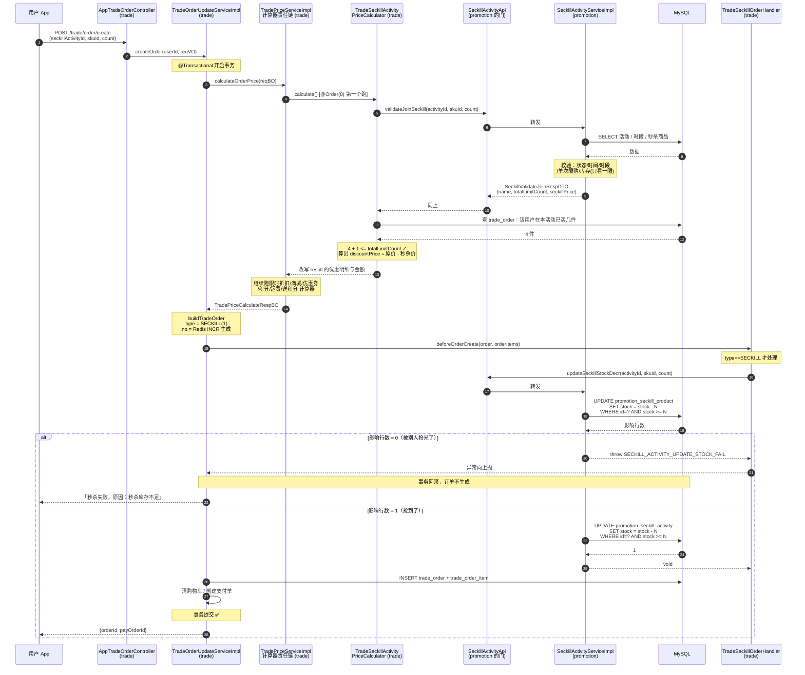
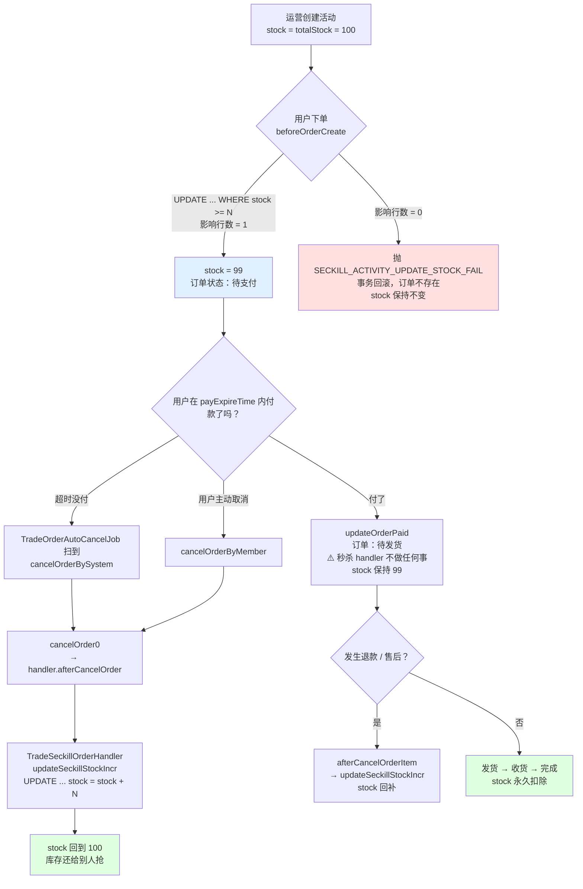

# 《芋道 ruoyi-vue-pro》秒杀链路全解（小白版）

> 一句话简介：一个「企业级快速开发脚手架 + 完整商城」的开源项目，秒杀只是它商城模块里的一个营销玩法；它的价值不在于「秒杀写得多猛」，而在于**秒杀是怎么被优雅地塞进一个几十万行的业务系统里的**。
>
> - 仓库地址：<https://github.com/YunaiV/ruoyi-vue-pro>（码云同步：<https://gitee.com/zhijiantianya/ruoyi-vue-pro>）
> - Star 数：约 38k（GitHub），是国内最活跃的 Java 后台脚手架之一
> - 最近更新：**2026-07-31**（本文分析的提交为 `61ba7d1`，提交说明是「v2026_07 发布：管理后台移动端完成全模块适配……」）。这个项目几乎每天都在提交，你看到这篇文章时代码可能又变了，但下面讲的骨架非常稳定
> - 技术栈：Spring Boot 2.7.18 + MyBatis-Plus 3.5.16 + MySQL + Redis（Redisson 客户端）+ Quartz 定时任务 + Maven 多模块
> - 本文分析的模块：`yudao-module-mall`（商城大模块），重点是它下面的 `yudao-module-promotion`（营销）和 `yudao-module-trade`（交易）

---

## 0. 读之前：先搞懂「秒杀」到底难在哪

先讲个生活场景。

你开了一家奶茶店，搞活动：**中午 12 点整，5 杯奶茶 1 块钱**。12 点一到，门口涌进来 100 个人，每个人都冲到收银台喊「我要！」

你只有 5 杯。问题来了——**你怎么保证只卖出去 5 杯，而不是 8 杯？**

这就是「秒杀」这个词背后唯一真正难的事情。技术上它有个专有名词，叫**超卖**：

> **超卖** = 明明只有 5 份货，系统却卖出去了 8 份，最后 3 个人付了钱拿不到东西，你要么赔钱要么被骂上热搜。

为什么会超卖？因为**「查」和「改」之间有个时间缝隙**。看这张图：

```
            时间轴 ──────────────────────────────────────────────>

  小明的请求   ①查库存        ②看到 stock=1        ③下单，改成 stock=0
             ┌────┐          ┌──────────┐         ┌──────────────┐
             │    │          │  够！    │         │  stock = 0   │
             └────┘          └──────────┘         └──────────────┘
                    ╲                     ╲
                     ╲   ← 就是这个缝隙 →   ╲
                      ╲                     ╲
  小红的请求        ①查库存        ②看到 stock=1        ③下单，又改成 stock=0
                   ┌────┐          ┌──────────┐         ┌──────────────┐
                   │    │          │  够！    │         │  stock = 0   │
                   └────┘          └──────────┘         └──────────────┘

  结果：库存只有 1 件，却生成了 2 张订单。这就是超卖。
```

小明和小红都在「库存还剩 1」的那一瞬间查了库存，都觉得自己抢到了。等他们各自去改数据的时候，谁也不知道对方也改了。

所以，**所有秒杀方案，本质上都在回答同一个问题：怎么把「查库存」和「扣库存」这两件事，变成一个不可分割的动作？**

业界常见的答案有这么几种：

| 方案 | 大白话 | 优点 | 缺点 |
|---|---|---|---|
| 数据库乐观扣减 | 「一句 SQL 里同时判断和扣减」 | 简单、绝对不超卖、不需要额外组件 | 数据库扛不住太高的并发 |
| Redis 预减库存 | 「先在小白板上划掉一笔，再慢慢记账」 | 极快 | 复杂，要处理 Redis 和数据库不一致 |
| 消息队列削峰 | 「先发号，后面慢慢做」 | 保护后端 | 用户体验变成异步，架构变重 |
| 分布式锁 | 「厕所门上装把锁，一次进一个」 | 好理解 | 慢，锁本身成为瓶颈 |

先把结论放在这里，免得你读到一半跑偏：

> 🔴 **芋道 ruoyi-vue-pro 用的是第一种——纯粹的「数据库乐观扣减」。**
> 它的秒杀链路里**没有 Redis 预减库存、没有 Lua 脚本、没有分布式锁、没有消息队列异步下单**。
> 全部防超卖的重担，压在一句 `UPDATE ... SET stock = stock - n WHERE id = ? AND stock >= n` 上。
>
> 我在 `yudao-module-mall` 全模块下搜过 `Redisson`、`RLock`、`DefaultRedisScript`、`@Lock4j`、`.lua` 文件，秒杀链路上一个都没有。整个 mall 模块里唯一用到 Redis 的地方是 `TradeNoRedisDAO`（生成订单流水号）。这一点我会在第 5 章详细展开并给出证据。

这不是「写得差」。这是一个**清醒的工程取舍**——我们在第 7 章会好好聊。

---

## 1. 十分钟认识这个项目

### 1.1 它是干什么的

芋道 ruoyi-vue-pro 不是一个「秒杀 demo」。它是一整套**企业级后台系统脚手架**：

- 你要做一个后台管理系统？它给你现成的用户、角色、菜单、字典、定时任务、代码生成器。
- 你要做一个电商？它给你现成的商品、订单、支付、营销（优惠券、拼团、砍价、秒杀、限时折扣）、分销。
- 你要做 CRM / ERP / 工作流 / IoT？它也都有对应模块。

看一眼它的根目录你就懂了：

```
ruoyi-vue-pro/
├── yudao-framework/          ← 「地基」：把 Redis、MyBatis、安全、限流这些封装成一个个 starter
├── yudao-module-system/      ← 用户、角色、权限、字典
├── yudao-module-infra/       ← 定时任务、文件、代码生成器
├── yudao-module-pay/         ← 支付
├── yudao-module-member/      ← C 端会员
├── yudao-module-mall/        ← 🎯 商城大模块（本文主角）
├── yudao-module-bpm/         ← 工作流
├── yudao-module-crm/         ← 客户管理
├── yudao-module-erp/  wms/ mes/ iot/ ai/ im/ ...
└── yudao-server/             ← 把上面所有模块打包成一个可运行的应用
```

这一点直接决定了它的秒杀为什么长这样：秒杀在这里不是「主角」，而是**营销模块里的一个玩法**，和拼团、砍价、积分商城平起平坐。它必须：

1. 复用交易模块已有的下单流程（不能自己另开一套下单接口）
2. 复用价格计算、优惠券、运费、积分这些通用能力
3. 能被随时开关、替换，不能污染主流程代码

于是你会看到大量「教学型秒杀 demo」里根本不会出现的东西：**责任链、扩展点接口、跨模块 API 层**。这才是本文真正想让你看懂的部分。

### 1.2 技术栈清单（每个组件用一句大白话解释它干嘛）

| 组件 | 版本 | 一句大白话 |
|---|---|---|
| **Spring Boot** | 2.7.18 | 整个 Java 应用的「骨架 + 启动器」。你写的类它帮你 new 出来、串起来 |
| **MyBatis-Plus** | 3.5.16 | 帮你把 Java 对象和数据库表来回搬运的「搬运工」，还能不写 SQL 就完成增删改查 |
| **MySQL** | 5.7 / 8.0 | 那本厚厚的手写账本。写得慢一点，但断电了账还在 |
| **Redis**（Redisson 客户端 4.6.1） | — | 收银台旁边的小白板，写字擦字比翻账本快 100 倍，但停电就没了。**注意：秒杀链路里它只被用来生成订单号** |
| **Guava LoadingCache** | — | 「贴在收银员脑门上的便利贴」，就在这台机器的内存里，比 Redis 还快，但每台机器一份、各不相同 |
| **Quartz** | — | 定时闹钟。项目里用它每隔一段时间扫一遍「超时没付款的订单」并取消 |
| **MapStruct（Convert 类）** | — | 「翻译官」，把 A 类型对象自动变成 B 类型对象，省得你手写一百行 `set` |
| **Lombok** | — | 帮你自动生成 getter/setter，代码里那些 `@Data` 就是它 |
| **Maven 多模块** | — | 把一个大项目切成很多小盒子，规定谁能依赖谁，防止代码搅成一锅粥 |

这里有个容易误会的地方：项目里**确实有**限流（`@RateLimiter`）、幂等（`@Idempotent`）、分布式锁（Lock4j）这些能力，它们都封装在 `yudao-framework/yudao-spring-boot-starter-protection` 里。

但是——`yudao-module-promotion/pom.xml` 和 `yudao-module-trade/pom.xml` 里**都没有引入这个 starter**。也就是说，**秒杀链路上一个都没用**。这是我实际翻 pom 文件确认的，第 6 章会展开。

### 1.3 目录结构地图

秒杀的代码分散在两个模块里。这张图是本文最重要的地图之一，建议截图：

```
yudao-module-mall/
│
├── yudao-module-promotion/          ← 【营销模块】提供「秒杀能力」，但它不管下单
│   └── src/main/java/cn/iocoder/yudao/module/promotion/
│       ├── api/seckill/                     ★ 对外的门（给 trade 模块打电话用）
│       │   ├── SeckillActivityApi.java              ← 接口：只有 3 个方法
│       │   ├── SeckillActivityApiImpl.java          ← 实现：一行转发给 Service
│       │   └── dto/SeckillValidateJoinRespDTO.java  ← 传出去的数据包
│       │
│       ├── controller/app/seckill/          ★ 给手机 App / 小程序调的接口
│       │   ├── AppSeckillActivityController.java    ← 首页「正在秒杀」、活动详情
│       │   └── AppSeckillConfigController.java      ← 「10:00 场 / 14:00 场」时段列表
│       │
│       ├── controller/admin/seckill/        ← 给运营后台配活动用的
│       │
│       ├── service/seckill/                 ★ 真正的业务逻辑
│       │   ├── SeckillActivityService.java          ← 接口
│       │   ├── SeckillActivityServiceImpl.java      ← 🔥 扣库存、校验参加资格都在这
│       │   ├── SeckillConfigService.java
│       │   └── SeckillConfigServiceImpl.java
│       │
│       ├── dal/dataobject/seckill/          ← 数据库表对应的 Java 对象
│       │   ├── SeckillActivityDO.java               ← 表 promotion_seckill_activity
│       │   ├── SeckillProductDO.java                ← 表 promotion_seckill_product
│       │   └── SeckillConfigDO.java                 ← 表 promotion_seckill_config
│       │
│       └── dal/mysql/seckill/seckillactivity/
│           ├── SeckillActivityMapper.java           ← 🔥 防超卖那句 SQL 在这
│           └── SeckillProductMapper.java            ← 🔥 防超卖那句 SQL 也在这
│
├── yudao-module-trade/              ← 【交易模块】负责下单，秒杀时来「调用」promotion
│   └── src/main/java/cn/iocoder/yudao/module/trade/
│       ├── controller/app/order/AppTradeOrderController.java   ← POST /trade/order/create
│       ├── service/order/TradeOrderUpdateServiceImpl.java      ← 🔥 下单主流程
│       ├── service/order/handler/
│       │   ├── TradeOrderHandler.java                ← ★ 订单生命周期「扩展点」接口
│       │   ├── TradeSeckillOrderHandler.java         ← 🔥 秒杀专属：扣库存 / 回补库存
│       │   ├── TradeProductSkuOrderHandler.java      ← 商品 SKU 库存
│       │   └── TradeCombinationOrderHandler.java 等  ← 拼团、砍价、优惠券……
│       └── service/price/
│           ├── TradePriceServiceImpl.java            ← ★ 价格计算责任链的「发动机」
│           └── calculator/
│               ├── TradePriceCalculator.java         ← ★ 计算器接口 + 顺序常量
│               ├── TradeSeckillActivityPriceCalculator.java  ← 🔥 秒杀价怎么算的
│               └── TradeCouponPriceCalculator.java 等 ← 优惠券、运费、积分……
│
└── yudao-module-trade-api/          ← 只放枚举和 DTO，用来打破 promotion ↔ trade 的循环依赖
    └── .../enums/order/TradeOrderTypeEnum.java       ← NORMAL / SECKILL / BARGAIN / ...
```

**注意最下面那个 `yudao-module-trade-api`。** 它的存在理由，作者直接写在了 `yudao-module-mall/pom.xml` 的注释里，原文照抄：

```xml
<!--
    特殊：为什么会有 yudao-module-trade-api 呢？
        yudao-module-promotion 和 yudao-module-trade 之间相互循环依赖，所以抽出 yudao-module-trade-api 模块，这样：
        1. yudao-module-promotion 依赖 yudao-module-trade-api
        2. yudao-module-trade 依赖 yudao-module-promotion
    从而不存在相互（循环）依赖，即 yudao-module-trade => yudao-module-promotion => yudao-module-trade-api
 -->
```

用大白话说：**trade 要用 promotion 的秒杀能力，promotion 又要用 trade 的「订单类型」枚举。两个人互相依赖，Maven 会直接报错。** 于是把那些「谁都要用的小东西」（枚举、DTO）单独拎出来做成第三个模块，两边都依赖它，环就断了。

依赖方向长这样，箭头表示「依赖」：

```
   ┌───────────────────────┐
   │  yudao-module-trade   │  下单主流程在这
   └───────────┬───────────┘
               │ 依赖
               ▼
   ┌───────────────────────┐
   │ yudao-module-promotion│  秒杀能力在这
   └───────────┬───────────┘
               │ 依赖
               ▼
   ┌───────────────────────┐
   │ yudao-module-trade-api│  只有枚举 + DTO，谁也不依赖
   └───────────────────────┘

   ✅ 单向，无环。这就是为什么 promotion 不能反过来调 trade 的 Service。
```

这个约束会在第 2 章反复出现——**为什么「单次限购」在 promotion 里校验，而「总限购」却在 trade 里校验？** 答案就藏在这张图里。

---

## 2. 【主线】一次秒杀请求，从点击到下单的完整链路

一句话：逛首页（本地缓存）→ 看详情 → 结算预览 → 下单，下单里又是「算价责任链跑一遍 → 组装订单打上 `type=1` → beforeOrderCreate 扣库存 → 订单落库 → 建支付单 → 事务提交」。

十三步里真正值得停下来看的只有三步：**2.6（跨模块的那扇门）、2.7（总限购为什么在 trade 算）、2.11（那句防超卖 SQL）**。其余的都是模板，扫一眼知道它在那儿就行。

### 2.0 先看总图

这是全文的主链路大图。后面每一小节，都是在放大这张图里的某一个方框。

```
 ┌────────────────────────────────────────────────────────────────────────────────────┐
 │  用户手机 App / 小程序                                                              │
 └────────────────────────────────────────────────────────────────────────────────────┘
      │  ①  GET /promotion/seckill-activity/get-now      「首页现在有啥可以秒？」
      │  ②  GET /promotion/seckill-activity/get-detail   「点进去看看这个活动」
      │  ③  GET /trade/order/settlement                  「算算我要付多少钱」（预览）
      │  ④  POST /trade/order/create                     「我要下单！」  ← 主角
      ▼
 ╔════════════════════════════════════════════════════════════════════════════════════╗
 ║                        yudao-module-trade（交易模块）                               ║
 ║                                                                                    ║
 ║   AppTradeOrderController#createOrder                                              ║
 ║           │                                                                        ║
 ║           ▼                                                                        ║
 ║   TradeOrderUpdateServiceImpl#createOrder        @Transactional 事务从这里开始 ─────╫──┐
 ║           │                                                                        ║  │
 ║      ┌────┴─────────────────────────────────────────────────────────┐              ║  │
 ║      │ 1.1 价格计算：TradePriceServiceImpl#calculateOrderPrice       │              ║  │
 ║      │     ↓ 遍历 List<TradePriceCalculator>（责任链，按 @Order 排序）│              ║  │
 ║      │     ┌──────────────────────────────────────────────────┐     │              ║  │
 ║      │     │ @Order(8)   TradeSeckillActivityPriceCalculator  │ ────╫──────────────╫──╫──> ★跨模块
 ║      │     │ @Order(10)  TradeDiscountActivityPriceCalculator │     │              ║  │
 ║      │     │ @Order(20)  TradeRewardActivityPriceCalculator   │     │              ║  │
 ║      │     │ @Order(30)  TradeCouponPriceCalculator           │     │              ║  │
 ║      │     │ @Order(40)  TradePointUsePriceCalculator         │     │              ║  │
 ║      │     │ @Order(50)  TradeDeliveryPriceCalculator（运费） │     │              ║  │
 ║      │     │ @Order(999) TradePointGiveCalculator（送积分）   │     │              ║  │
 ║      │     └──────────────────────────────────────────────────┘     │              ║  │
 ║      │ 1.2 buildTradeOrder / buildTradeOrderItems  组装订单对象      │              ║  │
 ║      └───────────────────────────────────────────────────────────────┘             ║  │
 ║           │                                                                        ║  │
 ║           ▼   2. 遍历 List<TradeOrderHandler>，调用 beforeOrderCreate               ║  │
 ║      ┌──────────────────────────────────────────────────┐                          ║  │
 ║      │ TradeProductSkuOrderHandler → 扣 product_sku 库存 │                          ║  │
 ║      │ TradeSeckillOrderHandler    → 扣秒杀库存 ─────────╫──────────────────────────╫──╫──> ★跨模块
 ║      │ TradeCouponOrderHandler / 拼团 / 砍价 / 积分 …    │                          ║  │
 ║      └──────────────────────────────────────────────────┘                          ║  │
 ║           │                                                                        ║  │
 ║           ▼   3. tradeOrderMapper.insert(order)                                    ║  │
 ║               tradeOrderItemMapper.insertBatch(orderItems)      订单落库！           ║  │
 ║           │                                                                        ║  │
 ║           ▼   4. afterCreateTradeOrder                                             ║  │
 ║               ├─ 遍历 handler.afterOrderCreate                                     ║  │
 ║               ├─ cartService.deleteCart      清空购物车                             ║  │
 ║               └─ payOrderApi.createOrder     创建支付单                             ║  │
 ║                                                            事务提交 ────────────────╫──┘
 ╚════════════════════════════════════════════════════════════════════════════════════╝
                                       │
                     ★跨模块调用（两次，方向都是 trade ──> promotion）
                                       ▼
 ╔════════════════════════════════════════════════════════════════════════════════════╗
 ║                     yudao-module-promotion（营销模块）                              ║
 ║                                                                                    ║
 ║   SeckillActivityApi（接口）→ SeckillActivityApiImpl（转发）→ SeckillActivityServiceImpl║
 ║                                                                                    ║
 ║   ● validateJoinSeckill(activityId, skuId, count)     「能不能参加？」（只读校验）    ║
 ║        ├─ 活动存在吗？开启了吗？                                                     ║
 ║        ├─ 现在在活动时间范围内吗？                                                   ║
 ║        ├─ 现在在「秒杀时段」（10:00 场）里吗？                                        ║
 ║        ├─ 一次买的数量超过 singleLimitCount 了吗？                                   ║
 ║        └─ 库存够吗？（⚠️只是「看一眼」，不是真扣）                                    ║
 ║                                                                                    ║
 ║   ● updateSeckillStockDecr(activityId, skuId, count)  「真扣库存」🔥                 ║
 ║        ├─ SeckillProductMapper#updateStockDecr                                     ║
 ║        │     UPDATE promotion_seckill_product SET stock = stock - N                ║
 ║        │     WHERE id = ? AND stock >= N        ← 防超卖的真正防线                   ║
 ║        └─ SeckillActivityMapper#updateStockDecr                                    ║
 ║              UPDATE promotion_seckill_activity SET stock = stock - N               ║
 ║              WHERE id = ? AND stock >= N       ← 同上                              ║
 ║                                                                                    ║
 ║   ● updateSeckillStockIncr(...)  「还回去」（订单取消 / 售后时调用）                  ║
 ╚════════════════════════════════════════════════════════════════════════════════════╝
```

下面我们一步一步走。

### 2.1 第一步：逛首页 —— 「现在有啥可以秒？」

用户打开 App 首页，看到一个「限时秒杀」楼层，上面写着「10:00 场 正在进行」，下面挂着几个商品。

代码在 `yudao-module-mall/yudao-module-promotion/src/main/java/cn/iocoder/yudao/module/promotion/controller/app/seckill/AppSeckillActivityController.java`：

```java
@GetMapping("/get-now")
@Operation(summary = "获得当前秒杀活动", description = "获取当前正在进行的活动，提供给首页使用")
@PermitAll
public CommonResult<AppSeckillActivityNowRespVO> getNowSeckillActivity() {
    return success(nowSeckillActivityCache.getUnchecked("")); // 缓存
}
```

注意那个 `nowSeckillActivityCache`。首页是全站访问量最大的地方，如果每个人打开 App 都去查一遍数据库，数据库直接躺平。所以作者加了一层缓存：

```java
private final LoadingCache<String, AppSeckillActivityNowRespVO> nowSeckillActivityCache =
        buildAsyncReloadingCache(Duration.ofSeconds(10L),
        new CacheLoader<String, AppSeckillActivityNowRespVO>() {
            @Override
            public AppSeckillActivityNowRespVO load(String key) {
                 return getNowSeckillActivity0();
            }
        });
```

这是 Guava 的 `LoadingCache`，缓存 **10 秒**，而且是「异步刷新」——`CacheUtils#buildAsyncReloadingCache` 的注释说得很清楚：

```java
// 只阻塞当前数据加载线程，其他线程返回旧值
.refreshAfterWrite(duration)
// 通过 asyncReloading 实现全异步加载，包括 refreshAfterWrite 被阻塞的加载线程
.build(CacheLoader.asyncReloading(loader, Executors.newCachedThreadPool()));
```

小白比喻：奶茶店门口挂了块小黑板写「今日特价：珍珠奶茶」。店员不会每来一个客人就跑进后厨问一遍今天特价是啥，他每 10 秒去问一次，中间来的客人都看黑板。而且「去问」这个动作还是让另一个店员去跑腿的（异步），当前店员继续招呼客人，不会卡住。

⚠️ 这里有个容易忽略的细节：这个缓存是 **JVM 内存级别**的，不是 Redis。如果你部署了 3 台服务器，就有 3 块各自独立的小黑板，它们可能显示不一样的内容（最多差 10 秒）。

对首页展示来说无所谓，但这也说明——**这里的库存数字是「大概齐」的，绝对不能拿来做扣减依据**。

### 2.2 第二步：点进活动详情页

用户点了某个秒杀商品，进入详情页，看到「原价 ¥199，秒杀价 ¥9.9，剩余 3 件，距离结束 00:12:34」。

代码是同一个 Controller 的 `getSeckillActivity` 方法（`GET /promotion/seckill-activity/get-detail`）。这段逻辑有点绕，核心是**算出这场秒杀的开始/结束时间**，规则只有两条：

```
# 从这个活动参加的所有时段 configs 里，挑一个来展示
config = configs 里第一个「现在正落在它的 startTime~endTime 之间」的
if config == null:
    config = configs 的最后一个      // 宁可展示「未开始」，也不展示「已结束」
```

对应源码：

```java
// 2.1 优先使用当前时间段
SeckillConfigDO config = findFirst(configs, config0 -> isBetween(config0.getStartTime(), config0.getEndTime()));
// 2.2 如果没有，则获取最后一个，因为倾向优先展示“未开始” > “已结束”
if (config == null) {
    config = CollUtil.getLast(configs);
}
```

**要看懂这段，得先理解「秒杀时段」这个概念。** 芋道的秒杀被拆成了三层，这是它和普通 demo 最不一样的地方之一：

```
   ┌──────────────────────────────────────────────────────────┐
   │  SeckillConfigDO（秒杀时段）  表 promotion_seckill_config │
   │  ─────────────────────────────────────────────────       │
   │  「每天 10:00 - 12:00 是一场」                            │
   │  「每天 14:00 - 16:00 是一场」                            │
   │  注意：startTime / endTime 是 String 类型的「时刻」        │
   │       比如 "10:00:00"，不带日期，每天都生效               │
   └───────────────────────┬──────────────────────────────────┘
                           │ 一个活动可以挂在多个时段上（configIds 是个 List）
                           ▼
   ┌──────────────────────────────────────────────────────────┐
   │ SeckillActivityDO（秒杀活动）表 promotion_seckill_activity│
   │  ────────────────────────────────────────────────────    │
   │  spuId            这场秒的是哪个商品（SPU = 商品款式）     │
   │  startTime/endTime 活动整体的起止「日期时间」             │
   │  configIds        参加哪几个时段                          │
   │  totalLimitCount  一个人总共最多买几件                     │
   │  singleLimitCount 一个人一单最多买几件                     │
   │  stock            剩余库存 🔥                             │
   │  totalStock       总库存                                  │
   └───────────────────────┬──────────────────────────────────┘
                           │ 一个活动下有多个 SKU（规格）
                           ▼
   ┌──────────────────────────────────────────────────────────┐
   │ SeckillProductDO（秒杀商品）表 promotion_seckill_product  │
   │  ────────────────────────────────────────────────────    │
   │  skuId           具体哪个规格（比如「红色 / XL 码」）      │
   │  seckillPrice    秒杀价，单位是「分」🔥                    │
   │  stock           这个规格的剩余库存 🔥                     │
   └──────────────────────────────────────────────────────────┘
```

小白比喻：`Config` 是「场次」（就像电影院的 14:00 场、19:00 场），`Activity` 是「这部电影」，`Product` 是「这部电影的不同座位区（VIP 区 / 普通区）」，每个区有自己的价格和余票。

⚠️ 特别注意：**库存有两份**——`SeckillActivityDO.stock`（活动总剩余）和 `SeckillProductDO.stock`（单个 SKU 剩余）。这两份都要扣，第 3 章会详细讲这个设计带来的后果。

⚠️ 还要注意：`seckillPrice` 单位是**分**。9.9 元存的是 `990`。整个项目所有金额都用 `Integer` 存分，**不用 `double`**，因为浮点数算钱会算出 `0.1 + 0.2 = 0.30000000000000004` 这种鬼东西。

### 2.3 第三步：点「立即购买」→ 结算预览

用户点「立即购买」，页面跳到确认订单页，显示收货地址、运费、优惠明细、最终要付多少钱。**这一步还没有真正下单，只是「预览」。**

代码路径是 `AppTradeOrderController#settlementOrder` → `TradeOrderUpdateServiceImpl#settlementOrder`：

```java
@Override
public AppTradeOrderSettlementRespVO settlementOrder(Long userId, AppTradeOrderSettlementReqVO settlementReqVO) {
    // 1. 获得收货地址
    MemberAddressRespDTO address = getAddress(userId, settlementReqVO.getAddressId());
    if (address != null) {
        settlementReqVO.setAddressId(address.getId());
    }

    // 2. 计算价格
    TradePriceCalculateRespBO calculateRespBO = calculatePrice(userId, settlementReqVO);

    // 3. 拼接返回
    return TradeOrderConvert.INSTANCE.convert(calculateRespBO, address);
}
```

**那么请求里怎么标明「我这是秒杀」？** 看 `AppTradeOrderSettlementReqVO`（`controller/app/order/vo/AppTradeOrderSettlementReqVO.java`），它有一堆「活动编号」字段：

```java
// ========== 秒杀活动相关字段 ==========
@Schema(description = "秒杀活动编号", example = "1024")
private Long seckillActivityId;

// ========== 拼团活动相关字段 ==========
@Schema(description = "拼团活动编号", example = "1024")
private Long combinationActivityId;
...
```

**只要 `seckillActivityId` 不为空，这单就是秒杀单。** 就这么简单。

而且这个 VO 上还挂了一条校验规则：

```java
@AssertTrue(message = "活动商品每次只能购买一种规格")
@JsonIgnore
public boolean isValidActivityItems() {
    // 校验是否是活动订单
    if (ObjUtil.isAllEmpty(seckillActivityId, combinationActivityId, combinationHeadId, bargainRecordId)) {
        return true;
    }
    // 校验订单项是否超出
    return items.size() == 1;
}
```

翻译：**只要是活动单（含秒杀），购物车里只能有 1 个商品项。** 这在请求进入业务代码之前，由 Spring 的参数校验（`@Valid`）直接拦掉。

这是「**在最外层挡掉不合法的输入**」的典型做法。秒杀本来就是「一个人抢一件」的场景，如果允许一次下单带 10 个不同商品，价格计算、库存扣减都会变得极其复杂。索性从入口就禁止。

### 2.4 第四步：真正下单，请求进入 createOrder

用户点了「提交订单」，App 发出 `POST /trade/order/create`，进 `AppTradeOrderController`：

```java
@PostMapping("/create")
@Operation(summary = "创建订单")
public CommonResult<AppTradeOrderCreateRespVO> createOrder(@Valid @RequestBody AppTradeOrderCreateReqVO createReqVO) {
    TradeOrderDO order = tradeOrderUpdateService.createOrder(getLoginUserId(), createReqVO);
    return success(new AppTradeOrderCreateRespVO().setId(order.getId()).setPayOrderId(order.getPayOrderId()));
}
```

注意 `getLoginUserId()`——**用户必须登录**。这个方法上没有 `@PermitAll`（对比一下秒杀查询接口都有 `@PermitAll`），所以未登录的请求会被安全框架直接拦掉。

然后进入整条链路的心脏，`TradeOrderUpdateServiceImpl#createOrder`：

```java
@Override
@Transactional(rollbackFor = Exception.class)
@TradeOrderLog(operateType = TradeOrderOperateTypeEnum.MEMBER_CREATE)
public TradeOrderDO createOrder(Long userId, AppTradeOrderCreateReqVO createReqVO) {
    // 1.1 价格计算
    TradePriceCalculateRespBO calculateRespBO = calculatePrice(userId, createReqVO);
    // 1.2 构建订单
    TradeOrderDO order = buildTradeOrder(userId, createReqVO, calculateRespBO);
    List<TradeOrderItemDO> orderItems = buildTradeOrderItems(order, calculateRespBO);

    // 2. 订单创建前的逻辑
    tradeOrderHandlers.forEach(handler -> handler.beforeOrderCreate(order, orderItems));

    // 3. 保存订单
    tradeOrderMapper.insert(order);
    orderItems.forEach(orderItem -> orderItem.setOrderId(order.getId()));
    tradeOrderItemMapper.insertBatch(orderItems);

    // 4. 订单创建后的逻辑
    afterCreateTradeOrder(order, orderItems, createReqVO);
    return order;
}
```

**这 20 行是全文最重要的 20 行，请多读两遍。**

最上面那个 `@Transactional(rollbackFor = Exception.class)` 值得单独说一句。事务（Transaction）就像铅笔写字 + 橡皮擦：这个方法里做的所有数据库改动，都先用铅笔写。方法正常走完 = 用钢笔描一遍（提交）；中间任何一步抛异常 = 拿橡皮全部擦掉（回滚），就像什么都没发生过。

这一点对秒杀极其关键：第 2 步扣了库存，第 3 步插订单如果失败了，库存会自动被「擦掉」还回去，不会出现「库存扣了但订单没生成」的惨案。

### 2.5 第五步：价格计算责任链跑起来（现代工程化的第一个亮点）

`calculatePrice` 最终调到 `TradePriceServiceImpl#calculateOrderPrice`。这里出现了本文第一个「教学 demo 里绝对看不到」的设计。

代码在 `yudao-module-mall/yudao-module-trade/src/main/java/cn/iocoder/yudao/module/trade/service/price/TradePriceServiceImpl.java`：

```java
@Resource
private List<TradePriceCalculator> priceCalculators;

@Override
public TradePriceCalculateRespBO calculateOrderPrice(TradePriceCalculateReqBO calculateReqBO) {
    // 1.1 获得商品 SKU 数组
    List<ProductSkuRespDTO> skuList = checkSkuList(calculateReqBO);
    // 1.2 获得商品 SPU 数组
    List<ProductSpuRespDTO> spuList = checkSpuList(skuList);

    // 2.1 计算价格
    TradePriceCalculateRespBO calculateRespBO = TradePriceCalculatorHelper
            .buildCalculateResp(calculateReqBO, spuList, skuList);
    priceCalculators.forEach(calculator -> calculator.calculate(calculateReqBO, calculateRespBO));
    // 2.2  如果最终支付金额小于等于 0，则抛出业务异常
    if (calculateReqBO.getPointActivityId() == null // 积分订单，允许支付金额为 0
            && calculateRespBO.getPrice().getPayPrice() <= 0) {
        log.error("[calculatePrice][价格计算不正确，请求 calculateReqDTO({})，结果 priceCalculate({})]",
                calculateReqBO, calculateRespBO);
        throw exception(PRICE_CALCULATE_PAY_PRICE_ILLEGAL);
    }
    return calculateRespBO;
}
```

机制其实就是这么一段循环：

```
result = 一份「原价、优惠 0、运费 0」的空白账单
for calculator in 所有 TradePriceCalculator（按 @Order 从小到大排好队）:
    calculator.calculate(请求参数, result)     // 每个计算器直接在 result 上改

// 收尾检查：非积分订单，最终支付金额 <= 0 就是算错了
if 不是积分订单 and result.payPrice <= 0:
    打错误日志 → throw PRICE_CALCULATE_PAY_PRICE_ILLEGAL
```

**核心就一行：`priceCalculators.forEach(calculator -> calculator.calculate(...))`。**

`@Resource private List<TradePriceCalculator> priceCalculators;` 是 Spring 的一个特性：**「把所有实现了 `TradePriceCalculator` 接口的类，全都塞进这个 List 里给我」**。

那顺序谁定的？每个计算器类上的 `@Order` 注解，数字越小越先执行：

```java
public interface TradePriceCalculator {

    int ORDER_SECKILL_ACTIVITY = 8;
    int ORDER_BARGAIN_ACTIVITY = 8;
    int ORDER_COMBINATION_ACTIVITY = 8;
    int ORDER_POINT_ACTIVITY = 8;

    int ORDER_DISCOUNT_ACTIVITY = 10;
    int ORDER_REWARD_ACTIVITY = 20;
    int ORDER_COUPON = 30;
    int ORDER_POINT_USE = 40;
    /**
     * 快递运费的计算
     *
     * 放在各种营销活动、优惠劵后面
     */
    int ORDER_DELIVERY = 50;
    /**
     * 赠送积分，放最后
     *
     * 放在 {@link #ORDER_DELIVERY} 后面的原因，是运费也会产生费用，需要赠送对应积分
     */
    int ORDER_POINT_GIVE = 999;

    void calculate(TradePriceCalculateReqBO param, TradePriceCalculateRespBO result);
}
```

画成图就是一条**流水线**：

```
  订单初始状态：原价 199.00 元，优惠 0，运费 0
        │
        ▼
  ┌────────────────────────────────────────────────┐
  │ @Order(8)  TradeSeckillActivityPriceCalculator │  秒杀活动
  │   if (param.getSeckillActivityId() == null)    │  ← 不是秒杀单？直接 return，
  │       return;                                  │    这个工位空转，什么都不做
  │   → 优惠 189.10 元                             │
  └────────────────────┬───────────────────────────┘
                       ▼   现在：199.00 - 189.10 = 9.90
  ┌────────────────────────────────────────────────┐
  │ @Order(10) TradeDiscountActivityPriceCalculator│  限时折扣（不是秒杀，跳过）
  └────────────────────┬───────────────────────────┘
                       ▼
  ┌────────────────────────────────────────────────┐
  │ @Order(20) TradeRewardActivityPriceCalculator  │  满减送
  └────────────────────┬───────────────────────────┘
                       ▼
  ┌────────────────────────────────────────────────┐
  │ @Order(30) TradeCouponPriceCalculator          │  优惠券
  └────────────────────┬───────────────────────────┘
                       ▼
  ┌────────────────────────────────────────────────┐
  │ @Order(40) TradePointUsePriceCalculator        │  积分抵现
  └────────────────────┬───────────────────────────┘
                       ▼
  ┌────────────────────────────────────────────────┐
  │ @Order(50) TradeDeliveryPriceCalculator        │  运费（放最后算，因为要看最终金额是否包邮）
  └────────────────────┬───────────────────────────┘
                       ▼
  ┌────────────────────────────────────────────────┐
  │ @Order(999) TradePointGiveCalculator           │  送积分（最最后，因为运费也算进赠送基数）
  └────────────────────┬───────────────────────────┘
                       ▼
                最终应付：9.90 + 运费
```

小白比喻：这就是一条**汽车装配流水线**。车壳从头开始往前走，每个工位负责装一个零件：8 号工位装秒杀价，30 号工位贴优惠券，50 号工位算运费。每个工位只干自己那一件事，谁也不知道其他工位在干嘛。

**为什么这么设计？这是「工程化」和「demo」的分水岭。** 一个教学型秒杀 demo 里，价格计算长这样：

```java
// ❌ demo 写法（本项目没有这么写，这是我为了对比编的反面例子）
if (isSeckill) {
    price = seckillPrice;
} else if (isGroupBuy) {
    price = groupPrice;
} else if (hasCoupon) {
    price = price - couponAmount;
} // ... 再加 8 个 else if，最后这个方法 500 行，没人敢动
```

而芋道的写法，如果明天产品说「我要加一个『新人专享价』」，你要做的只有：

1. 新建一个类 `TradeXxxPriceCalculator implements TradePriceCalculator`
2. 打上 `@Component` 和 `@Order(数字)`
3. **完事。`TradePriceServiceImpl` 一行都不用改。**

这就是设计模式里的「对扩展开放，对修改封闭」，术语叫**责任链模式**。

### 2.6 第六步：秒杀计算器跨模块喊话 promotion

流水线走到 8 号工位，`TradeSeckillActivityPriceCalculator` 醒了。它发现 `seckillActivityId` 不为空，于是**第一次跨模块调用**发生了。

代码在 `yudao-module-mall/yudao-module-trade/src/main/java/cn/iocoder/yudao/module/trade/service/price/calculator/TradeSeckillActivityPriceCalculator.java`：

```java
@Component
@Order(TradePriceCalculator.ORDER_SECKILL_ACTIVITY)
public class TradeSeckillActivityPriceCalculator implements TradePriceCalculator {

    @Resource
    private SeckillActivityApi seckillActivityApi;   // ← 这就是那扇「跨模块的门」

    @Resource
    private TradeOrderQueryService tradeOrderQueryService;

    @Override
    public void calculate(TradePriceCalculateReqBO param, TradePriceCalculateRespBO result) {
        // 1. 判断订单类型和是否具有秒杀活动编号
        if (param.getSeckillActivityId() == null) {
            return;
        }
        Assert.isTrue(param.getItems().size() == 1, "秒杀时，只允许选择一个商品");
        // 2. 校验是否可以参与秒杀
        TradePriceCalculateRespBO.OrderItem orderItem = result.getItems().get(0);
        SeckillValidateJoinRespDTO seckillActivity = validateJoinSeckill(
                param.getUserId(), param.getSeckillActivityId(),
                orderItem.getSkuId(), orderItem.getCount());
        // ... 后面是算优惠，2.8 节讲
    }
```

`seckillActivityApi` 的类型是 `SeckillActivityApi`，它是 promotion 模块提供的接口，全部内容只有三个方法：

```java
public interface SeckillActivityApi {

    /** 更新秒杀库存（减少） */
    void updateSeckillStockDecr(Long id, Long skuId, Integer count);

    /** 更新秒杀库存（增加） */
    void updateSeckillStockIncr(Long id, Long skuId, Integer count);

    /** 【下单前】校验是否参与秒杀活动，如果校验失败，则抛出业务异常 */
    SeckillValidateJoinRespDTO validateJoinSeckill(Long activityId, Long skuId, Integer count);
}
```

它的实现类 `SeckillActivityApiImpl` 薄得像张纸，每个方法就一行转发：

```java
@Service
@Validated
public class SeckillActivityApiImpl implements SeckillActivityApi {

    @Resource
    private SeckillActivityService activityService;

    @Override
    public void updateSeckillStockDecr(Long id, Long skuId, Integer count) {
        activityService.updateSeckillStockDecr(id, skuId, count);
    }
    // ... 另外两个方法同理
}
```

**为什么要多这么一层「什么都不干」的 Api？**

```
  ┌──────────────────────────────────────────────────────────────────────┐
  │  ❌ 如果没有 Api 层，trade 直接 @Resource SeckillActivityService      │
  │                                                                      │
  │   trade ──────────────> SeckillActivityService（30 多个方法）         │
  │                          ↑                                           │
  │            trade 能看见 createSeckillActivity、deleteSeckillActivity  │
  │            这种运营后台才该用的方法，哪天手抖调错就完蛋了              │
  └──────────────────────────────────────────────────────────────────────┘

  ┌──────────────────────────────────────────────────────────────────────┐
  │  ✅ 有了 Api 层                                                       │
  │                                                                      │
  │   trade ──> SeckillActivityApi（3 个方法）──> SeckillActivityService  │
  │              └── 这是 promotion 对外的「服务窗口」                     │
  │                  只开放该开放的，其余全部藏起来                        │
  │                                                                      │
  │  额外好处：哪天这个项目要拆成微服务（yudao-cloud 就是这么干的），       │
  │  只需要把 SeckillActivityApi 换成 Feign 接口，trade 的代码一行不改。   │
  └──────────────────────────────────────────────────────────────────────┘
```

小白比喻：Api 层就是**银行的柜台玻璃**。里面有金库、有印钞机、有一堆你不该碰的东西，但你只能通过窗口办三种业务：存钱、取钱、查余额。

**promotion 这边收到请求后做了什么**——`SeckillActivityServiceImpl#validateJoinSeckill`（完整原文）：

```java
@Override
public SeckillValidateJoinRespDTO validateJoinSeckill(Long activityId, Long skuId, Integer count) {
    // 1.1 校验秒杀活动是否存在
    SeckillActivityDO activity = validateSeckillActivityExists(activityId);
    if (CommonStatusEnum.isDisable(activity.getStatus())) {
        throw exception(SECKILL_JOIN_ACTIVITY_STATUS_CLOSED);
    }
    // 1.2 是否在活动时间范围内
    if (!LocalDateTimeUtils.isBetween(activity.getStartTime(), activity.getEndTime())) {
        throw exception(SECKILL_JOIN_ACTIVITY_TIME_ERROR);
    }
    SeckillConfigDO config = seckillConfigService.getCurrentSeckillConfig();
    if (config == null
            || !CollectionUtil.contains(activity.getConfigIds(), config.getId())
            || !LocalDateTimeUtils.isBetween(config.getStartTime(), config.getEndTime())) {
        throw exception(SECKILL_JOIN_ACTIVITY_TIME_ERROR);
    }
    // 1.3 超过单次购买限制
    if (count > activity.getSingleLimitCount()) {
        throw exception(SECKILL_JOIN_ACTIVITY_SINGLE_LIMIT_COUNT_EXCEED);
    }

    // 2.1 校验秒杀商品是否存在
    SeckillProductDO product = seckillProductMapper.selectByActivityIdAndSkuId(activityId, skuId);
    if (product == null) {
        throw exception(SECKILL_JOIN_ACTIVITY_PRODUCT_NOT_EXISTS);
    }
    // 2.2 校验库存是否充足
    if (count > product.getStock()) {
        throw exception(SECKILL_ACTIVITY_UPDATE_STOCK_FAIL);
    }
    return SeckillActivityConvert.INSTANCE.convert02(activity, product);
}
```

一共五道关卡，任何一道不过就直接抛异常：

```
   请求进来 (activityId=1024, skuId=2048, count=1)
      │
      ▼
   ① 活动存在吗？                        ✗ → 抛 SECKILL_ACTIVITY_NOT_EXISTS「秒杀活动不存在」
      │ ✓                                ✗ → 抛 SECKILL_JOIN_ACTIVITY_STATUS_CLOSED「秒杀活动已关闭」
      ▼
   ② now 在 activity 的起止日期内吗？     ✗ → 抛 SECKILL_JOIN_ACTIVITY_TIME_ERROR「不在活动时间范围内」
      │ ✓
      ▼
   ③ now 落在某个「秒杀时段」里吗？       ✗ → 同上
      且这个时段是本活动参加的吗？
      │ ✓
      ▼
   ④ count <= singleLimitCount？          ✗ → 抛 SECKILL_JOIN_ACTIVITY_SINGLE_LIMIT_COUNT_EXCEED
      │ ✓                                       「单次限购超出」
      ▼
   ⑤ 这个 SKU 存在吗？库存够吗？          ✗ → 抛 SECKILL_JOIN_ACTIVITY_PRODUCT_NOT_EXISTS
      │ ✓                                  ✗ → 抛 SECKILL_ACTIVITY_UPDATE_STOCK_FAIL「秒杀库存不足」
      ▼
   返回 SeckillValidateJoinRespDTO { name, totalLimitCount, seckillPrice }
```

🔴 **划重点，这里有个非常容易误解的地方。**

第 ⑤ 步的「库存够吗」，是一次**普通的查询**（`SELECT`），它**完全不具备并发安全性**。100 个人同时打到这里，只剩 1 件库存，**100 个人全都会通过这一关**。

那它有什么用？——**它是「快速失败」，不是「防超卖」。** 目的是让 99% 明显没戏的请求（活动早就结束了、库存早就是 0 了）尽早滚蛋，别浪费后面的计算资源和数据库连接。

**真正防超卖的，是第 2.11 节那句 SQL。** 记住这句话，第 5 章还会再说一遍。

### 2.7 第七步：总限购校验 —— 一个「为什么在这边算」的经典问题

回到 trade 这边，`TradeSeckillActivityPriceCalculator` 里有个私有方法：

```java
private SeckillValidateJoinRespDTO validateJoinSeckill(Long userId, Long activityId, Long skuId, Integer count) {
    // 1. 校验是否可以参与秒杀
    SeckillValidateJoinRespDTO seckillActivity = seckillActivityApi.validateJoinSeckill(activityId, skuId, count);
    // 2. 校验总限购数量，目前只有 trade 有具体下单的数据，需要交给 trade 价格计算使用
    int seckillProductCount = tradeOrderQueryService.getActivityProductCount(userId, activityId, TradeOrderTypeEnum.SECKILL);
    if (seckillProductCount + count > seckillActivity.getTotalLimitCount()) {
        throw exception(PRICE_CALCULATE_SECKILL_TOTAL_LIMIT_COUNT);
    }
    return seckillActivity;
}
```

**这段代码回答了一个绝妙的架构问题。**

限购有两种：

| 类型 | 字段 | 含义 | 在哪校验 |
|---|---|---|---|
| 单次限购 | `singleLimitCount` | 「这一单最多买 2 件」 | promotion（只看请求参数 `count`，自己就能判断） |
| 总限购 | `totalLimitCount` | 「你这辈子在这个活动里总共最多买 5 件」 | trade（必须查订单表） |

总限购为什么不能留在 promotion？因为要知道「你之前已经买了几件」，必须去查 `trade_order` 订单表。而 **promotion 不能依赖 trade**——还记得 1.3 节那张依赖方向图吗？那会形成循环依赖。

所以作者的解法是：promotion 把 `totalLimitCount` 这个数字**装进 DTO 传回给 trade**，让 trade 自己去查自己的订单表做比对。这个意图直接写在了 DTO 的注释里：

```java
public class SeckillValidateJoinRespDTO {
    private String name;
    /**
     * 总限购数量
     *
     * 目的：目前只有 trade 有具体下单的数据，需要交给 trade 价格计算使用
     */
    private Integer totalLimitCount;
    private Integer seckillPrice;
}
```

画成图：

```
   trade 模块                              promotion 模块
      │                                          │
      │   ①「1024 这个活动，用户能买 1 件吗？」    │
      │ ────────────────────────────────────────>│
      │                                          │  查活动状态、时间、时段
      │                                          │  查 singleLimitCount ✓
      │                                          │  查库存（只看一眼）✓
      │   ② 返回 { name, totalLimitCount=5,      │
      │            seckillPrice=990 }            │
      │ <────────────────────────────────────────│
      │                                          │
      │   ③ 我自己查 trade_order：                │
      │      这个 userId 在这个活动买过 4 件了     │       promotion 不知道也不需要知道
      │      4 + 1 = 5，没超过 5 ✓                │       trade_order 表长什么样
      │                                          │
```

`getActivityProductCount` 的实现（`TradeOrderQueryServiceImpl`）：

```java
public int getActivityProductCount(Long userId, Long activityId, TradeOrderTypeEnum type) {
    // 获得订单列表
    List<TradeOrderDO> orders = tradeOrderMapper.selectListByUserIdAndActivityId(userId, activityId, type);
    orders.removeIf(order -> TradeOrderStatusEnum.isCanceled(order.getStatus())); // 过滤掉【已取消】的订单
    if (CollUtil.isEmpty(orders)) {
        return 0;
    }
    // 获得订单项列表
    return tradeOrderItemMapper.selectProductSumByOrderId(convertSet(orders, TradeOrderDO::getId));
}
```

⚠️ **诚实提醒**：这个总限购校验**同样不是并发安全的**。它是「先查再判断」，两个并发请求可能都查到「已买 4 件」，然后都通过。

所以严格来说，一个手速极快的用户在极端并发下有可能买超总限购。这是个真实存在的缺陷，但它**不会导致超卖**（库存那关还是死死的），最多是某个用户多买了一件。第 7 章会汇总这类问题。

### 2.8 第八步：算出秒杀价，改写订单金额

校验通过后，回到 `TradeSeckillActivityPriceCalculator#calculate` 的后半段：

```java
// 3.1 记录优惠明细
Integer discountPrice = orderItem.getPayPrice() - seckillActivity.getSeckillPrice() * orderItem.getCount();
TradePriceCalculatorHelper.addPromotion(result, orderItem,
        param.getSeckillActivityId(), seckillActivity.getName(), PromotionTypeEnum.SECKILL_ACTIVITY.getType(),
        StrUtil.format("秒杀活动：省 {} 元", TradePriceCalculatorHelper.formatPrice(discountPrice)),
        discountPrice);
// 3.2 更新 SKU 优惠金额
orderItem.setDiscountPrice(orderItem.getDiscountPrice() + discountPrice);
TradePriceCalculatorHelper.recountPayPrice(orderItem);
TradePriceCalculatorHelper.recountAllPrice(result);
```

**这里有个特别值得学习的细节：秒杀价不是「直接把价格改成 9.9」，而是「记一笔优惠：省了 189.1」。**

```
   原价 payPrice      = 19900 分（199 元）
   秒杀价 seckillPrice =   990 分（9.9 元）
                        ─────────────────
   discountPrice      = 19900 - 990 * 1 = 18910 分

   然后：
   orderItem.discountPrice += 18910
   recountPayPrice(orderItem)   →  payPrice = price*count - discountPrice - couponPrice - pointPrice
   recountAllPrice(result)      →  重算整单总价
```

**为什么要这么绕？** 因为后面还有优惠券、积分、运费要算。如果秒杀直接把 `payPrice` 拍成 990，后面的计算器就不知道「原价是多少、已经优惠了多少」。

而记成「优惠明细」（`Promotion`），最终用户在订单详情页能看到一条清清楚楚的：

> 秒杀活动：省 189.10 元

小白比喻：超市小票不会只印「实付 9.9」，而是印「原价 199.00 / 秒杀优惠 -189.10 / 实付 9.90」。前者你会怀疑收银员算错了，后者一目了然。

### 2.9 第九步：组装订单对象，打上「秒杀单」的标签

价格算完，回到 `createOrder` 的 1.2 步 `buildTradeOrder`：

```java
TradeOrderDO order = TradeOrderConvert.INSTANCE.convert(userId, createReqVO, calculateRespBO);
order.setType(calculateRespBO.getType());
order.setNo(tradeNoRedisDAO.generate(TradeNoRedisDAO.TRADE_ORDER_NO_PREFIX));
order.setStatus(TradeOrderStatusEnum.UNPAID.getStatus());
```

**订单类型是怎么定的？** 在 `TradePriceCalculatorHelper` 里，谁的 id 不为空就是谁：

```java
private static Integer getOrderType(TradePriceCalculateReqBO param) {
    if (param.getSeckillActivityId() != null) {
        return TradeOrderTypeEnum.SECKILL.getType();
    }
    if (param.getCombinationActivityId() != null) {
        return TradeOrderTypeEnum.COMBINATION.getType();
    }
    if (param.getBargainRecordId() != null) {
    // ...
```

对应枚举（在 `yudao-module-trade-api` 里）：

```java
public enum TradeOrderTypeEnum implements ArrayValuable<Integer> {
    NORMAL(0, "普通订单"),
    SECKILL(1, "秒杀订单"),
    BARGAIN(2, "砍价订单"),
    COMBINATION(3, "拼团订单"),
    POINT(4, "积分商城"),
    ;
```

**这个 `type = 1` 的标签至关重要**，因为下一步所有 handler 都靠它来判断「这单归不归我管」。

顺便说一句订单号 `tradeNoRedisDAO.generate(...)`——这是**整个秒杀链路里 Redis 唯一的用武之地**：

```java
public String generate(String prefix) {
    // 递增序号
    String noPrefix = prefix + DateUtil.format(LocalDateTime.now(), DatePattern.PURE_DATETIME_PATTERN);
    String key = RedisKeyConstants.TRADE_NO + noPrefix;
    Long no = stringRedisTemplate.opsForValue().increment(key);
    // 设置过期时间
    stringRedisTemplate.expire(key, Duration.ofMinutes(1L));
    return noPrefix + no;
}
```

生成的订单号形如 `o202607311230451`（前缀 o + 年月日时分秒 + 当秒内自增号）。用 Redis 的 `INCR` 是因为它是原子的——**多台服务器同时生成也不会撞号**。

### 2.10 第十步：beforeOrderCreate —— 🔥 真正扣库存的地方

```java
// 2. 订单创建前的逻辑
tradeOrderHandlers.forEach(handler -> handler.beforeOrderCreate(order, orderItems));
```

又是一次「遍历所有实现类」。这次遍历的是 `List<TradeOrderHandler>`——**订单生命周期扩展点**，本文的第二个工程化亮点。

接口在 `yudao-module-mall/yudao-module-trade/src/main/java/cn/iocoder/yudao/module/trade/service/order/handler/TradeOrderHandler.java`：

```java
public interface TradeOrderHandler {

    /** 订单创建前 */
    default void beforeOrderCreate(TradeOrderDO order, List<TradeOrderItemDO> orderItems) {}
    /** 订单创建后 */
    default void afterOrderCreate(TradeOrderDO order, List<TradeOrderItemDO> orderItems) {}
    /** 支付订单后 */
    default void afterPayOrder(TradeOrderDO order, List<TradeOrderItemDO> orderItems) {}
    /** 订单取消后 */
    default void afterCancelOrder(TradeOrderDO order, List<TradeOrderItemDO> orderItems) {}
    /** 订单项取消后 */
    default void afterCancelOrderItem(TradeOrderDO order, TradeOrderItemDO orderItem) {}
    /** 订单发货前 / 后 / 收货前 / 后 */
    default void beforeDeliveryOrder(TradeOrderDO order) {}
    default void afterDeliveryOrder(TradeOrderDO order) {}
    default void beforeReceiveOrder(TradeOrderDO order) {}
    default void afterReceiveOrder(TradeOrderDO order) {}
    // ...
}
```

注意每个方法都是 `default`（Java 8 的默认方法）+ **空实现**。这意味着：**实现类只需要重写自己关心的那几个钩子，其余的当没看见。**

画成图，这就是一排挂在订单生命周期上的「挂钩」：

```
   订单的一生：
   ┌──────────────────────────────────────────────────────────────────────────┐
   │                                                                          │
   │  创建 ──> 待支付 ──> 已支付 ──> 已发货 ──> 已收货 ──> 完成                 │
   │   │  │      │  │       │           │           │                         │
   │   │  │      │  │       │           │           │                         │
   │   │  └ after│  └ after │           │           └ after/beforeReceiveOrder│
   │   │  Order  │  Cancel  └ afterPay  └ after/beforeDeliveryOrder           │
   │   │  Create │  Order      Order                                          │
   │   └ before  └（超时未付 / 用户主动取消）                                   │
   │     Order                                                                │
   │     Create                                                               │
   └──────────────────────────────────────────────────────────────────────────┘

   每个挂钩上，挂着一排 handler：

        beforeOrderCreate
              │
     ┌────────┼─────────┬──────────────┬──────────────┬─────────────┐
     ▼        ▼         ▼              ▼              ▼             ▼
  ProductSku Seckill Combination   Bargain       Coupon        Point ...
  Handler    Handler  Handler       Handler       Handler       Handler
     │         │
     │         └─ if (!TradeOrderTypeEnum.isSeckill(order.getType())) return;  ← 不是秒杀单直接闪人
     │
     └─ 所有订单都要扣 SKU 库存，所以它不判断类型
```

**秒杀的那个 handler 长这样**（`TradeSeckillOrderHandler.java` 全文关键部分）：

```java
@Component
public class TradeSeckillOrderHandler implements TradeOrderHandler {

    @Resource
    private SeckillActivityApi seckillActivityApi;

    @Override
    public void beforeOrderCreate(TradeOrderDO order, List<TradeOrderItemDO> orderItems) {
        if (!TradeOrderTypeEnum.isSeckill(order.getType())) {
            return;
        }
        // 明确校验一下
        Assert.isTrue(orderItems.size() == 1, "秒杀时，只允许选择一个商品");

        // 扣减秒杀活动的库存
        seckillActivityApi.updateSeckillStockDecr(order.getSeckillActivityId(),
                orderItems.get(0).getSkuId(), orderItems.get(0).getCount());
    }

    @Override
    public void afterCancelOrder(TradeOrderDO order, List<TradeOrderItemDO> orderItems) {
        if (!TradeOrderTypeEnum.isSeckill(order.getType())) {
            return;
        }
        Assert.isTrue(orderItems.size() == 1, "秒杀时，只允许选择一个商品");

        // 售后的订单项，已经在 afterCancelOrderItem 回滚库存，所以这里不需要重复回滚
        orderItems = filterOrderItemListByNoneAfterSale(orderItems);
        if (CollUtil.isEmpty(orderItems)) {
            return;
        }
        afterCancelOrderItem(order, orderItems.get(0));
    }

    @Override
    public void afterCancelOrderItem(TradeOrderDO order, TradeOrderItemDO orderItem) {
        if (!TradeOrderTypeEnum.isSeckill(order.getType())) {
            return;
        }
        // 恢复秒杀活动的库存
        seckillActivityApi.updateSeckillStockIncr(order.getSeckillActivityId(),
                orderItem.getSkuId(), orderItem.getCount());
    }
}
```

**整个秒杀在 trade 侧的代码，就这 40 行。** 这就是扩展点的威力——`TradeOrderUpdateServiceImpl` 里没有一个字符提到「秒杀」。

**这里是第二次跨模块调用**，方向依然是 trade ──> promotion，走的还是 `SeckillActivityApi` 那扇门。

⚠️ **一个诚实的观察**：`TradeSeckillOrderHandler`、`TradeProductSkuOrderHandler` 等 handler 类上**都没有 `@Order` 注解**（和价格计算器不同）。也就是说，**它们的执行顺序取决于 Spring 扫描 Bean 的顺序，是不确定的**。

好在它们各自扣的是不同的表（`product_sku` vs `promotion_seckill_*`），且都在同一个事务里，任何一个失败都会整体回滚，所以顺序不影响正确性。但这确实是个「隐含依赖」，如果哪天有两个 handler 需要严格先后，就得补 `@Order` 了。

### 2.11 第十一步：promotion 收到「扣库存」指令，执行那句关键 SQL

**这是全文的最高潮。**

`SeckillActivityServiceImpl#updateSeckillStockDecr`（原文，一字不改）：

```java
@Override
@Transactional(rollbackFor = Exception.class)
public void updateSeckillStockDecr(Long id, Long skuId, Integer count) {
    // 1.1 校验活动库存是否充足
    SeckillActivityDO seckillActivity = validateSeckillActivityExists(id);
    if (count > seckillActivity.getStock()) {
        throw exception(SECKILL_ACTIVITY_UPDATE_STOCK_FAIL);
    }
    // 1.2 校验商品库存是否充足
    SeckillProductDO product = seckillProductMapper.selectByActivityIdAndSkuId(id, skuId);
    if (product == null || count > product.getStock()) {
        throw exception(SECKILL_ACTIVITY_UPDATE_STOCK_FAIL);
    }

    // 2.1 更新活动商品库存
    int updateCount = seckillProductMapper.updateStockDecr(product.getId(), count);
    if (updateCount == 0) {
        throw exception(SECKILL_ACTIVITY_UPDATE_STOCK_FAIL);
    }

    // 2.2 更新活动库存
    updateCount = seckillActivityMapper.updateStockDecr(seckillActivity.getId(), count);
    if (updateCount == 0) {
        throw exception(SECKILL_ACTIVITY_UPDATE_STOCK_FAIL);
    }
}
```

结构可以概括成两段，**上半段「先查一眼」，下半段才「动真格」**：

```
# 上半段：只读，任何一条不满足就早退。作用是省资源，不是防超卖
查 activity；若 count > activity.stock            → throw 库存不足
查 product（activityId + skuId）；
若 product 为空 或 count > product.stock          → throw 库存不足

# 下半段：真扣。判断和扣减在同一条 UPDATE 里，靠影响行数判定成败
n = UPDATE seckill_product  SET stock=stock-count WHERE id=? AND stock>=count
if n == 0:                                        → throw 库存不足（事务回滚）
n = UPDATE seckill_activity SET stock=stock-count WHERE id=? AND stock>=count
if n == 0:                                        → throw 库存不足（连上一步的扣减一起回滚）
```

而「动真格」的那两个 `updateStockDecr`，就是防超卖的全部秘密。`SeckillProductMapper.java`：

```java
/**
 * 更新活动库存（减少）
 *
 * @param id    活动编号
 * @param count 扣减的库存数量(减少库存)
 * @return 影响的行数
 */
default int updateStockDecr(Long id, int count) {
    Assert.isTrue(count > 0);
    return update(null, new LambdaUpdateWrapper<SeckillProductDO>()
            .eq(SeckillProductDO::getId, id)
            .ge(SeckillProductDO::getStock, count)          // ← 就是这一行！！！
            .setSql("stock = stock - " + count));
}
```

`SeckillActivityMapper.java` 里是一模一样的套路：

```java
default int updateStockDecr(Long id, int count) {
    Assert.isTrue(count > 0);
    return update(null, new LambdaUpdateWrapper<SeckillActivityDO>()
            .eq(SeckillActivityDO::getId, id)
            .ge(SeckillActivityDO::getStock, count)
            .setSql("stock = stock - " + count));
}
```

这两段 MyBatis-Plus 代码，翻译成 SQL 就是：

```sql
UPDATE promotion_seckill_product
SET    stock = stock - 1
WHERE  id = 2048
  AND  stock >= 1        -- 👈 判断和扣减，在同一条语句里
  AND  deleted = 0;      -- MyBatis-Plus 逻辑删除自动加的
```

```sql
UPDATE promotion_seckill_activity
SET    stock = stock - 1
WHERE  id = 1024
  AND  stock >= 1
  AND  deleted = 0;
```

然后 Java 代码检查 **`updateCount`（影响行数）**：

- 返回 `1` → 抢到了，继续走
- 返回 `0` → 说明 `stock >= 1` 这个条件没满足，也就是**库存被别人抢光了** → 抛 `SECKILL_ACTIVITY_UPDATE_STOCK_FAIL`（「秒杀失败，原因：秒杀库存不足」）→ **整个事务回滚，订单不会生成**

第 5 章会用一张时间轴图详细论证「为什么这样就绝对不会超卖」。

### 2.12 第十二步：订单落库 + 后置处理

```java
// 3. 保存订单
tradeOrderMapper.insert(order);
orderItems.forEach(orderItem -> orderItem.setOrderId(order.getId()));
tradeOrderItemMapper.insertBatch(orderItems);

// 4. 订单创建后的逻辑
afterCreateTradeOrder(order, orderItems, createReqVO);
```

`afterCreateTradeOrder` 干三件事：

```java
private void afterCreateTradeOrder(TradeOrderDO order, List<TradeOrderItemDO> orderItems,
                                   AppTradeOrderCreateReqVO createReqVO) {
    // 1. 执行订单创建后置处理器
    tradeOrderHandlers.forEach(handler -> handler.afterOrderCreate(order, orderItems));

    // 2. 删除购物车商品
    Set<Long> cartIds = convertSet(createReqVO.getItems(), AppTradeOrderSettlementReqVO.Item::getCartId);
    if (CollUtil.isNotEmpty(cartIds)) {
        cartService.deleteCart(order.getUserId(), cartIds);
    }

    // 3. 生成预支付
    // 特殊情况：积分兑换时，可能支付金额为零
    if (order.getPayPrice() > 0) {
        createPayOrder(order, orderItems);
    }

    // 4. 插入订单日志
    TradeOrderLogUtils.setOrderInfo(order.getId(), null, order.getStatus());
}
```

到这里，`@Transactional` 事务提交，接口返回订单 ID 和支付单 ID 给 App，App 拉起微信/支付宝收银台。

**⚠️ 注意一个重要事实：库存是在「下单时」扣的，不是「支付时」扣的。**

也就是说，**只要你抢到了，哪怕不付钱，这件商品也被你锁住了**（直到订单超时取消）。这叫「**下单减库存**」，是电商的两大流派之一：

| | 下单减库存（本项目） | 支付减库存 |
|---|---|---|
| 规则 | 抢到就锁住，慢慢付钱 | 付了钱才算数 |
| 好处 | 用户体验好，不会白高兴 | 库存周转快，不会被恶意占用 |
| 代价 | ⚠️ 会被恶意下单占库存（要靠超时取消兜底） | ⚠️ 用户可能「抢到了却付不了」，体验极差 |

### 2.13 第十三步：付款成功 / 超时取消 —— 库存怎么还回去

**情况 A：用户付款了。** 支付模块回调 `POST /trade/order/update-paid` → `TradeOrderUpdateServiceImpl#updateOrderPaid`：

```java
// 3. 更新 TradeOrderDO 状态为已支付，等待发货
int updateCount = tradeOrderMapper.updateByIdAndStatus(id, order.getStatus(),
        new TradeOrderDO().setStatus(TradeOrderStatusEnum.UNDELIVERED.getStatus()).setPayStatus(true)
                .setPayTime(LocalDateTime.now()).setPayChannelCode(payOrder.getChannelCode()));
if (updateCount == 0) {
    throw exception(ORDER_UPDATE_PAID_STATUS_NOT_UNPAID);
}

// 4. 执行 TradeOrderHandler 的后置处理
List<TradeOrderItemDO> orderItems = tradeOrderItemMapper.selectListByOrderId(id);
tradeOrderHandlers.forEach(handler -> handler.afterPayOrder(order, orderItems));
```

看到 `updateByIdAndStatus` 了吗？它也是「带条件的 UPDATE」，跟防超卖同一个套路，只不过这次防的是**重复支付回调**：

```java
default int updateByIdAndStatus(Long id, Integer status, TradeOrderDO update) {
    return update(update, new LambdaUpdateWrapper<TradeOrderDO>()
            .eq(TradeOrderDO::getId, id).eq(TradeOrderDO::getStatus, status));
}
```

**`TradeSeckillOrderHandler` 没有实现 `afterPayOrder`**——因为库存在下单时就已经扣了，支付成功时秒杀不需要做任何事。

**情况 B：用户 30 分钟没付钱。** Quartz 定时任务 `TradeOrderAutoCancelJob` 定期跑：

```java
@Component
public class TradeOrderAutoCancelJob implements JobHandler {

    @Resource
    private TradeOrderUpdateService tradeOrderUpdateService;

    @Override
    @TenantJob
    public String execute(String param) {
        int count = tradeOrderUpdateService.cancelOrderBySystem();
        return String.format("过期订单 %s 个", count);
    }
}
```

`cancelOrderBySystem` 捞出所有超时的待支付订单，逐个取消——注意它是「一个失败不影响其他」的写法：

```
orders = 查 status=UNPAID 且 createTime < (now - payExpireTime) 的订单
count = 0
for order in orders:
    try:  取消这一单; count += 1
    catch: 只打 error 日志，继续下一单      // 一单炸了不拖累整批
return count
```

对应源码：

```java
public int cancelOrderBySystem() {
    // 1. 查询过期的待支付订单
    LocalDateTime expireTime = minusTime(tradeOrderProperties.getPayExpireTime());
    List<TradeOrderDO> orders = tradeOrderMapper.selectListByStatusAndCreateTimeLt(
            TradeOrderStatusEnum.UNPAID.getStatus(), expireTime);
    if (CollUtil.isEmpty(orders)) {
        return 0;
    }

    // 2. 遍历执行，逐个取消
    int count = 0;
    for (TradeOrderDO order : orders) {
        try {
            getSelf().cancelOrderBySystem(order);
            count++;
        } catch (Throwable e) {
            log.error("[cancelOrderBySystem][order({}) 过期订单异常]", order.getId(), e);
        }
    }
    return count;
}
```

（`payExpireTime` 是 `TradeOrderProperties` 里的配置项，可以在 yaml 里改。）

最终走到 `cancelOrder0`：

```java
private void cancelOrder0(TradeOrderDO order, TradeOrderCancelTypeEnum cancelType) {
    // 1. 更新 TradeOrderDO 状态为已取消
    int updateCount = tradeOrderMapper.updateByIdAndStatus(order.getId(), order.getStatus(),
            new TradeOrderDO().setStatus(TradeOrderStatusEnum.CANCELED.getStatus())
                    .setCancelType(cancelType.getType()).setCancelTime(LocalDateTime.now()));
    if (updateCount == 0) {
        throw exception(ORDER_CANCEL_FAIL_STATUS_NOT_UNPAID);
    }

    // 2. 执行 TradeOrderHandler 的后置处理
    List<TradeOrderItemDO> orderItems = tradeOrderItemMapper.selectListByOrderId(order.getId());
    tradeOrderHandlers.forEach(handler -> handler.afterCancelOrder(order, orderItems));

    // 3. 增加订单日志
    TradeOrderLogUtils.setOrderInfo(order.getId(), order.getStatus(), TradeOrderStatusEnum.CANCELED.getStatus());
}
```

`handler.afterCancelOrder` 又一次遍历所有 handler，`TradeSeckillOrderHandler` 这次醒了，调用 `updateSeckillStockIncr` 把库存还回去：

```java
@Override
@Transactional(rollbackFor = Exception.class)
public void updateSeckillStockIncr(Long id, Long skuId, Integer count) {
    SeckillProductDO product = seckillProductMapper.selectByActivityIdAndSkuId(id, skuId);
    // 更新活动商品库存
    seckillProductMapper.updateStockIncr(product.getId(), count);
    // 更新活动库存
    seckillActivityMapper.updateStockIncr(id, count);
}
```

对应 SQL 就是 `stock = stock + N`，**加库存不需要 `WHERE stock >= N` 的判断**（加法永远不会加成负数）。

### 2.14 用 Mermaid 再看一遍完整时序



---

## 3. 关键代码逐行拆解

这一章我们把最关键的 `updateSeckillStockDecr` 拆到骨头缝里。

```java
 1  @Override
 2  @Transactional(rollbackFor = Exception.class)
 3  public void updateSeckillStockDecr(Long id, Long skuId, Integer count) {
 4      // 1.1 校验活动库存是否充足
 5      SeckillActivityDO seckillActivity = validateSeckillActivityExists(id);
 6      if (count > seckillActivity.getStock()) {
 7          throw exception(SECKILL_ACTIVITY_UPDATE_STOCK_FAIL);
 8      }
 9      // 1.2 校验商品库存是否充足
10      SeckillProductDO product = seckillProductMapper.selectByActivityIdAndSkuId(id, skuId);
11      if (product == null || count > product.getStock()) {
12          throw exception(SECKILL_ACTIVITY_UPDATE_STOCK_FAIL);
13      }
14
15      // 2.1 更新活动商品库存
16      int updateCount = seckillProductMapper.updateStockDecr(product.getId(), count);
17      if (updateCount == 0) {
18          throw exception(SECKILL_ACTIVITY_UPDATE_STOCK_FAIL);
19      }
20
21      // 2.2 更新活动库存
22      updateCount = seckillActivityMapper.updateStockDecr(seckillActivity.getId(), count);
23      if (updateCount == 0) {
24          throw exception(SECKILL_ACTIVITY_UPDATE_STOCK_FAIL);
25      }
26  }
```

| 行号 | 干了什么 | 为什么 |
|---|---|---|
| 2 | 开启事务 | 保证 2.1 和 2.2 两次 UPDATE **要么都成功，要么都回滚**。这一行如果去掉，就可能出现「商品库存扣了，活动库存没扣」的数据不一致 |
| 5-8 | 查活动，看总库存够不够 | **快速失败**。不是防超卖，纯粹是省资源：库存明显不够就别浪费后面两次 UPDATE 了 |
| 10-13 | 查这个 SKU 的秒杀商品记录，看它的库存够不够 | 同上，快速失败。顺便把 `product.getId()` 拿到手，下一步 UPDATE 要用 |
| 16 | 🔥 **真正的防超卖第一道**：`UPDATE ... SET stock=stock-N WHERE id=? AND stock>=N` | 数据库对同一行的 UPDATE 是**串行**的（行锁），所以 100 个并发只能一个一个来 |
| 17-19 | 影响行数为 0 就抛异常 | 影响行数 = 0 唯一的可能就是 `stock >= N` 不成立，即**库存在你查完之后、改之前被别人抢光了** |
| 22 | 🔥 **防超卖第二道**：同样的 SQL 打在活动表上 | 因为库存在两张表各存了一份，都要扣 |
| 23-25 | 同上 | 如果活动总库存不够而 SKU 库存够（配置错误导致），也会失败并**回滚掉第 16 行的扣减** |

**为什么库存要存两份？**

- `promotion_seckill_activity.stock`：这场活动**所有 SKU 加起来**还剩多少。作用是：首页展示「仅剩 12 件」时只查一行，不用 `SUM` 所有 SKU；运营也能一眼看到整场活动的余量。
- `promotion_seckill_product.stock`：**每个 SKU 单独**的余量。「红色 XL」卖光了不影响「蓝色 M」。

代价是：**每次扣库存要打两条 UPDATE，写放大 ×2，并且这两行会成为热点行。** 第 7 章会算这笔账。

创建活动时，活动总库存 = 所有 SKU 库存之和，代码在 `createSeckillActivity` 里：

```java
SeckillActivityDO activity = SeckillActivityConvert.INSTANCE.convert(createReqVO)
        .setStatus(CommonStatusEnum.ENABLE.getStatus())
        .setStock(getSumValue(createReqVO.getProducts(), SeckillProductBaseVO::getStock, Integer::sum));
activity.setTotalStock(activity.getStock());
```

**再看一眼 SKU 库存那边（product 模块），你会发现一模一样的套路**，`ProductSkuMapper#updateStockDecr`：

```java
default int updateStockDecr(Long id, Integer incrCount) {
    Assert.isTrue(incrCount < 0);
    incrCount = - incrCount; // 取正
    LambdaUpdateWrapper<ProductSkuDO> updateWrapper = new LambdaUpdateWrapper<ProductSkuDO>()
            .setSql(" stock = stock - " + incrCount
                + ", sales_count = sales_count + " + incrCount)
            .eq(ProductSkuDO::getId, id)
            .ge(ProductSkuDO::getStock, incrCount);
    return update(null, updateWrapper);
}
```

`ProductSkuServiceImpl#updateSkuStock` 里同样检查影响行数：

```java
} else if (item.getIncrCount() < 0) {
    int updateStockIncr = productSkuMapper.updateStockDecr(item.getId(), item.getIncrCount());
    if (updateStockIncr == 0) {
        throw exception(SKU_STOCK_NOT_ENOUGH);
    }
}
```

**所以秒杀单其实要过两道库存关：普通 SKU 库存 + 秒杀活动库存。两道都用同一种「带条件 UPDATE」的手法。** 这也解释了为什么秒杀商品必须先是个正常上架的商品——它得先有 SKU 库存。

---

## 4. 数据长什么样：Redis、MySQL、MQ 里各存了啥

先给出这个项目的**真实答案**（不是教科书答案）：

| 存储 | 占比 | 存了什么 |
|---|---|---|
| MySQL | 99% | 活动、时段、商品、库存、订单、订单项 —— 全部在这里 |
| Redis | 1% | 只有一件事：生成订单流水号（INCR） |
| JVM 内存缓存（Guava） | — | 首页「正在秒杀」列表，10 秒过期 |
| MQ | 空 | 秒杀链路完全没有用到消息队列 |

### 4.1 MySQL 里的表

> 说明：`yudao-module-mall` 的建表 SQL 并没有随开源仓库的 `sql/mysql/ruoyi-vue-pro.sql` 一起提供（那个文件里只有 48 张 system/infra 相关的表）。所以下面的字段是我**从 DO 类的 `@TableName` 和字段声明反推的**，不是抄的 DDL。

**表 `promotion_seckill_config`（秒杀时段）** ← `SeckillConfigDO`

| 字段 | 类型 | 说明 |
|---|---|---|
| id | bigint | 主键 |
| name | varchar | 时段名，如「上午场」 |
| start_time | varchar | **注意是字符串**，存「10:00:00」这种时刻，不带日期 |
| end_time | varchar | 同上 |
| slider_pic_urls | json | 轮播图（`JacksonTypeHandler`） |
| status | int | 0 开启 / 1 关闭 |

**表 `promotion_seckill_activity`（秒杀活动）** ← `SeckillActivityDO`

| 字段 | 类型 | 说明 |
|---|---|---|
| id | bigint | 主键 |
| spu_id | bigint | 秒的是哪个商品 |
| name | varchar | 活动名 |
| status | int | 0 开启 / 1 关闭 |
| start_time / end_time | datetime | 活动整体起止**日期时间** |
| config_ids | varchar | 参加哪些时段，用 `LongListTypeHandler` 存成逗号分隔 |
| total_limit_count | int | 总限购 |
| single_limit_count | int | 单次限购 |
| **stock** | int | 🔥 **剩余库存** |
| total_stock | int | 总库存 |

**表 `promotion_seckill_product`（秒杀商品）** ← `SeckillProductDO`

| 字段 | 类型 | 说明 |
|---|---|---|
| id | bigint | 主键 |
| activity_id | bigint | 属于哪个活动 |
| config_ids | varchar | 冗余的时段 |
| spu_id / sku_id | bigint | 具体商品规格 |
| seckill_price | int | 🔥 秒杀价，**单位分** |
| **stock** | int | 🔥 **这个 SKU 的剩余库存** |
| activity_status | int | 冗余的活动状态 |
| activity_start_time / activity_end_time | datetime | 冗余的活动时间 |

另外所有表都继承 `BaseDO`，自带 `create_time`、`update_time`、`creator`、`updater`、`deleted`（逻辑删除）这 5 个字段。

⚠️ **`deleted` 是逻辑删除**：MyBatis-Plus 会给所有查询/更新自动加 `AND deleted = 0`。这意味着我们前面写的那句防超卖 SQL，实际执行时是：

```sql
UPDATE promotion_seckill_product
SET    stock = stock - 1
WHERE  id = 2048 AND stock >= 1 AND deleted = 0;
```

**表 `trade_order`（订单）** —— 秒杀相关的关键字段：

```java
/**
 * 秒杀活动编号
 *
 * 关联 SeckillActivityDO 的 id 字段
 */
private Long seckillActivityId;
```

加上 `type`（=1 表示秒杀单）、`status`、`pay_status`、`no`（订单号）、`pay_price` 等。

### 4.2 Redis 里存了啥

**只有一个 key 家族**，定义在 `TradeOrderUpdateServiceImpl` 用到的 `RedisKeyConstants`：

```java
public interface RedisKeyConstants {
    /**
     * 交易序号的缓存
     *
     * KEY 格式：trade_no:{prefix}
     * VALUE 数据格式：编号自增
     */
    String TRADE_NO = "trade_no:";
    ...
}
```

实际存进去长这样：

```
   ┌──────────────────────────────────────────────────────────────┐
   │  Redis                                                       │
   │                                                              │
   │   KEY:  trade_no:o20260731123045                             │
   │   TYPE: String（当整数用）                                    │
   │   VAL:  17          ← 这一秒内已经生成了 17 个订单号           │
   │   TTL:  60 秒                                                │
   │                                                              │
   │   生成的订单号 = "o20260731123045" + "17" = o2026073112304517 │
   └──────────────────────────────────────────────────────────────┘
```

**就这些。没有库存缓存，没有用户抢购记录，没有令牌桶，没有分布式锁的 key。**

### 4.3 MQ 里存了啥

**什么都没有。** 我在 `yudao-module-mall` 下搜过所有 `mq` 目录，promotion 模块只有一个消费者 `CouponTakeByRegisterConsumer`（新用户注册自动发券），**和秒杀毫无关系**。

秒杀链路是**完全同步**的：请求进来 → 扣库存 → 建订单 → 返回。用户点了按钮就在那转圈等着，没有「排队中，请稍候」这种异步体验。

### 4.4 JVM 本地缓存里存了啥

第 2.1 节讲过的首页缓存：

```
   ┌─────────────────────┐  ┌─────────────────────┐  ┌─────────────────────┐
   │   服务器 A          │  │   服务器 B          │  │   服务器 C          │
   │  Guava Cache        │  │  Guava Cache        │  │  Guava Cache        │
   │  ┌───────────────┐  │  │  ┌───────────────┐  │  │  ┌───────────────┐  │
   │  │ "正在秒杀"列表 │  │  │  │ "正在秒杀"列表 │  │  │  │ "正在秒杀"列表 │  │
   │  │ 3 秒前刷新的   │  │  │  │ 8 秒前刷新的   │  │  │  │ 1 秒前刷新的   │  │
   │  └───────────────┘  │  │  └───────────────┘  │  │  └───────────────┘  │
   └─────────────────────┘  └─────────────────────┘  └─────────────────────┘
        三份数据可能不一样，最多差 10 秒。展示用没问题，扣库存绝对不能用。
```

---

## 5. 它是怎么防「超卖」的（重点）

### 5.1 一句话答案

> **它靠 MySQL 的行锁 + 一句带条件的 UPDATE，也就是「数据库乐观扣减」。**
>
> ```sql
> UPDATE promotion_seckill_product SET stock = stock - N WHERE id = ? AND stock >= N;
> ```
>
> 然后在 Java 里检查这句 SQL 的**影响行数**：是 0 就说明没抢到，抛异常，事务回滚。

### 5.2 为什么这样就绝对不会超卖？

关键在于：**MySQL（InnoDB）执行 UPDATE 时会对被修改的那一行加「排他锁」，同一行的多个 UPDATE 必须排队，一个一个来。**

我们把 §0 那张「超卖」的图重画一遍，看看变成 UPDATE 之后发生了什么：

```
   前提：promotion_seckill_product 里 id=2048 这一行，stock = 1
   小明和小红在同一毫秒发起请求，都要买 1 件

   时间轴 ─────────────────────────────────────────────────────────────────>

   小明                                    小红
   ────────────────────────────────        ────────────────────────────────
   ① 到达 MySQL：                          ① 到达 MySQL：
      UPDATE ... WHERE id=2048               UPDATE ... WHERE id=2048
                AND stock >= 1                         AND stock >= 1
                                    │
                                    │   💥 两个人抢同一行的锁
                                    │      MySQL 说：一个一个来！
                                    ▼
   ┌──────────────────────────────────────────────────────────────────────┐
   │  MySQL 内部，行锁（id=2048 这一行）                                    │
   │                                                                      │
   │  ② 小明拿到锁                          ② 小红在门外等（阻塞）          │
   │     读到 stock = 1                         zzz...                    │
   │     判断 1 >= 1  ✓                                                   │
   │     写入 stock = 0                                                   │
   │     返回「影响 1 行」                                                 │
   │  ③ 小明释放锁 ─────────────────────>   ③ 小红拿到锁                   │
   │                                            读到 stock = 0  ← 已经是新值！│
   │                                            判断 0 >= 1  ✗            │
   │                                            不修改任何行               │
   │                                            返回「影响 0 行」          │
   └──────────────────────────────────────────────────────────────────────┘

   ④ Java 侧：                             ④ Java 侧：
      updateCount == 1  → 继续下单            updateCount == 0
                                              → throw SECKILL_ACTIVITY_UPDATE_STOCK_FAIL
                                              → 事务回滚
                                              → 返回「秒杀失败，原因：秒杀库存不足」

   ✅ 库存 1 件，只生成 1 张订单。不会超卖。
```

**核心洞察：`WHERE stock >= N` 这个条件，是在 MySQL 拿到行锁**之后**才求值的，用的是那一刻最新的数据。这就把「查」和「改」焊成了一个不可分割的原子操作。**

小白比喻：这就像**你不能自己去仓库数货再拿货**，而是把一张纸条交给仓管员：「如果还剩至少 1 件，就给我拿 1 件出来，然后告诉我拿到没有」。仓管员一次只处理一张纸条，中间不许别人插队。你收到的回复要么是「给你了」，要么是「没了」，绝不会出现「我以为有其实没有」。

### 5.3 那 `validateJoinSeckill` 里的库存校验算什么？

**再强调一遍：那是「快速失败」，不是「防超卖」。**

```
      1000 个并发请求打进来，库存只有 5 件
                    │
                    ▼
   ┌────────────────────────────────────────────────────┐
   │  第一道筛子：validateJoinSeckill（SELECT 查库存）    │
   │  ── 活动关了？时间过了？时段不对？→ 大部分请求死在这   │
   │  ── 库存 0 了？→ 后到的请求也死在这                  │
   │                                                    │
   │  ⚠️ 但在库存刚好用完的那个瞬间，                     │
   │     可能有 50 个请求同时查到「还剩 5」，全部放行      │
   └───────────────────────┬────────────────────────────┘
                           │ 50 个漏网之鱼
                           ▼
   ┌────────────────────────────────────────────────────┐
   │  第二道筛子：UPDATE ... WHERE stock >= N（行锁）     │
   │                                                    │
   │  ✅ 这道筛子是绝对的：50 个请求排队进来，            │
   │     前 5 个拿到货（影响行数=1），                    │
   │     后 45 个全部「影响行数=0」被打回                  │
   └────────────────────────────────────────────────────┘
                           │
                           ▼
                    最终恰好 5 张订单
```

第一道筛子的价值：**在库存明显不够时挡掉 95% 的无效请求**，减少数据库的写压力。它是「性能优化」，不是「正确性保证」。

### 5.4 完整的防超卖清单

一张秒杀订单，从头到尾一共经过这些「关卡」：

| # | 关卡 | 位置 | 类型 | 并发安全？ |
|---|---|---|---|---|
| 1 | 必须登录 | `AppTradeOrderController#createOrder` 无 `@PermitAll` | 认证 | — |
| 2 | 活动单只能 1 个商品项 | `AppTradeOrderSettlementReqVO#isValidActivityItems` | 参数校验 | — |
| 3 | 活动存在 / 已开启 | `validateJoinSeckill` 1.1 | 只读 | ❌ 不需要 |
| 4 | 在活动时间内 | `validateJoinSeckill` 1.2 | 只读 | ❌ 不需要 |
| 5 | 在秒杀时段内 | `validateJoinSeckill` 1.2 | 只读 | ❌ 不需要 |
| 6 | 单次限购 | `validateJoinSeckill` 1.3 | 只读 | ✅ 只看参数，天然安全 |
| 7 | 库存够（看一眼） | `validateJoinSeckill` 2.2 | 只读 | ⚠️ **不安全，只是快速失败** |
| 8 | 总限购 | `TradeSeckillActivityPriceCalculator#validateJoinSeckill` | 查订单表 | ⚠️ **不安全，存在竞态** |
| 9 | **SKU 库存扣减** | `ProductSkuMapper#updateStockDecr` | 🔥 带条件 UPDATE | ✅ **绝对安全** |
| 10 | **秒杀商品库存扣减** | `SeckillProductMapper#updateStockDecr` | 🔥 带条件 UPDATE | ✅ **绝对安全** |
| 11 | **秒杀活动库存扣减** | `SeckillActivityMapper#updateStockDecr` | 🔥 带条件 UPDATE | ✅ **绝对安全** |
| 12 | 整体事务 | `createOrder` 上的 `@Transactional` | 事务 | ✅ 任何一步失败全部回滚 |

**结论：库存这件事上，芋道是安全的。总限购这件事上，有极小概率的漏洞（但不造成超卖）。**

### 5.5 用 Mermaid 看库存的状态流转



---

## 6. 它是怎么防黄牛、防刷接口的

**先说实话：这方面它做得很少。** 我逐条核对了代码，结论如下。

### 6.1 它做了什么

| 手段 | 有没有 | 代码位置 |
|---|---|---|
| 必须登录才能下单 | ✅ 有 | `AppTradeOrderController#createOrder` 用 `getLoginUserId()`，且没有 `@PermitAll` |
| 单次限购 `singleLimitCount` | ✅ 有 | `SeckillActivityServiceImpl#validateJoinSeckill` 1.3 |
| 总限购 `totalLimitCount` | ✅ 有（但有并发缝隙） | `TradeSeckillActivityPriceCalculator#validateJoinSeckill` |
| 活动单只能买一种规格 | ✅ 有 | `AppTradeOrderSettlementReqVO#isValidActivityItems` + handler 里的 `Assert.isTrue(orderItems.size() == 1, ...)` |
| 严格的时段校验 | ✅ 有 | 必须同时满足「活动日期范围内」+「当前秒杀时段内」+「该活动参加了这个时段」 |
| 记录下单 IP 和终端 | ✅ 有 | `order.setUserIp(getClientIP()).setTerminal(getTerminal())`，事后可追溯 |

### 6.2 它没做什么（诚实清单）

| 手段 | 有没有 | 说明 |
|---|---|---|
| 接口限流（每人每秒最多 N 次） | ❌ **没有** | 框架里有 `@RateLimiter` 注解（`yudao-spring-boot-starter-protection`），但 **promotion 和 trade 的 pom.xml 都没有引入这个 starter**，秒杀链路上一个 `@RateLimiter` 都没有 |
| 接口幂等（重复点击只算一次） | ❌ **没有** | 同上，`@Idempotent` 注解存在但没用在秒杀上 |
| 验证码 / 滑块 | ❌ 没有 | 代码里没有 |
| 秒杀链接加密 / 延迟暴露 | ❌ 没有 | 活动 ID 就是明文自增 ID |
| 黑名单 / 风控 | ❌ 没有 | 无 |
| 排队令牌 | ❌ 没有 | 无 |

### 6.3 这意味着什么

一个会写脚本的黄牛，能做什么、不能做什么：

| | 结果 | 为什么 |
|---|---|---|
| ✅ 他可以 1 秒钟发 1000 次 `POST /trade/order/create` | 服务可能被拖垮（可用性问题） | 没有限流拦他，1000 个请求全部打到数据库，数据库要执行 1000 次「查活动 + 查商品 + 2 次 UPDATE」 |
| ❌ 但他买不到超过限购的商品 | 被卡住 | `singleLimitCount` 卡住单笔，`totalLimitCount` 卡住累计（虽然有小缝隙） |
| ❌ 也不会造成超卖 | 数据仍然正确 | `UPDATE ... WHERE stock >= N` 是死的 |

一句话：**芋道保住了「数据正确」，但没有保住「不被打垮」。**

**如果你要拿它上生产，最低成本的加固方案（按性价比排序）：**

1. **在 `AppTradeOrderController#createOrder` 上加 `@RateLimiter`**（先在 pom 里引入 `yudao-spring-boot-starter-protection`）。用 `UserRateLimiterKeyResolver` 按用户限流，比如「每人每 3 秒最多 1 次」。这一条能挡掉 90% 的脚本。
2. **加 `@Idempotent`**，防止用户手抖狂点提交按钮生成多张订单。
3. **上层加网关限流 / Nginx 限流**，按 IP 挡。
4. 秒杀商品的详情接口加 CDN 缓存。

---

## 7. 这套设计能扛多大量？优点和坑

### 7.1 先算笔账：单机能扛多少 QPS？

一次秒杀下单，数据库要干这些活（同一个事务里）：

```
   ┌─────────────────────────────────────────────────────────────────┐
   │  一次 createOrder，数据库的活儿清单                              │
   │                                                                 │
   │  【读】                                                          │
   │   1. SELECT product_sku          （价格计算要商品信息）           │
   │   2. SELECT product_spu                                         │
   │   3. SELECT promotion_seckill_activity   （validateJoinSeckill） │
   │   4. SELECT promotion_seckill_config     （查当前时段）           │
   │   5. SELECT promotion_seckill_product                           │
   │   6. SELECT trade_order          （查总限购已买多少）             │
   │   7. SELECT trade_order_item                                    │
   │   8. SELECT promotion_seckill_activity   （updateStockDecr 里又查）│
   │   9. SELECT promotion_seckill_product    （同上）                 │
   │   ... 还有优惠券、积分、运费各计算器的查询                         │
   │                                                                 │
   │  【写】                                                          │
   │   A. UPDATE product_sku          stock--  🔒 热点行              │
   │   B. UPDATE product_spu          stock--                        │
   │   C. UPDATE promotion_seckill_product   stock--  🔒 热点行        │
   │   D. UPDATE promotion_seckill_activity  stock--  🔒 超级热点行    │
   │   E. INSERT trade_order                                         │
   │   F. INSERT trade_order_item                                    │
   │   G. UPDATE trade_order（回填 pay_order_id）                     │
   │   + 支付模块的 INSERT pay_order                                  │
   └─────────────────────────────────────────────────────────────────┘

   十几次读 + 七八次写，全部在一个事务里，串行执行。
```

**瓶颈在哪？看 D 那一行。**

```
   ┌───────────────────────────────────────────────────────────────────┐
   │  promotion_seckill_activity 表，id = 1024 这一行                   │
   │                                                                   │
   │   所有抢这场活动的人，不管买哪个 SKU，                              │
   │   最后都要来 UPDATE 这同一行 ！！                                  │
   │                                                                   │
   │       请求1 ──┐                                                   │
   │       请求2 ──┤                                                   │
   │       请求3 ──┼──> 🔒 行锁 ──> 一次只过一个                        │
   │       ...    ──┤                                                  │
   │       请求N ──┘                                                   │
   │                                                                   │
   │   一次「拿锁 → 改 → 写 redo log → 放锁」大概几百微秒到几毫秒。      │
   │   乐观估计单行热点扣减：几千 TPS 到顶。                             │
   │   再考虑事务里还有十几次读、七八次写 → 实际整体撑死几百 ~ 一两千 QPS。│
   └───────────────────────────────────────────────────────────────────┘
```

**一句话：这套方案的天花板，大约在「几百到一两千 QPS」量级**（具体取决于机器、索引、连接池配置）。这个数字对绝大多数中小电商完全够用，但**扛不住「双十一 0 点、10 万人抢 100 件」这种级别的流量**。

### 7.2 优点（我认为它做对的地方）

**1. 绝对不超卖，而且实现简单到可以一眼看懂。** 没有 Redis 和 MySQL 数据不一致的问题（因为只有 MySQL 一份数据），没有「Redis 扣了但 MySQL 没扣」的对账噩梦；库存回补也简单：`stock = stock + N`，加就完事。

**2. 运维成本极低。** 不需要额外部署 Redis 集群做库存，不需要 RocketMQ/RabbitMQ，不需要处理消息重复消费、消息丢失。挂了重启就行，数据在 MySQL 里跑不了。

**3. 秒杀是「插件」，不是「补丁」。** `TradeOrderUpdateServiceImpl` 里没有一个 `if (isSeckill)`；删掉 `TradeSeckillOrderHandler` + `TradeSeckillActivityPriceCalculator`，秒杀功能就干净地消失了，主流程一行不改。这在几十万行的系统里是极其宝贵的。

**4. 用户体验是同步的。** 点了按钮，成功就是成功，失败就是失败，立刻知道，不像 MQ 异步方案要「排队中，请稍候」，还得轮询查结果。

**5. 跨模块边界画得很清楚。** promotion 只管「秒杀规则和库存」，完全不知道订单表长什么样；trade 只管「下单」，完全不知道秒杀规则；沟通只通过 3 个方法的 `SeckillActivityApi`。想拆微服务，把 Api 换成 Feign 就行。

### 7.3 坑（诚实的问题清单）

| # | 坑 | 说明 |
|---|---|---|
| 1 | 单行热点是硬天花板 | 活动库存那一行是全场唯一的争抢点。真正的高并发秒杀会用「库存分桶」：把 100 件库存拆成 10 行，每行 10 件，请求随机打到一行，热点分散 10 倍。芋道没做 |
| 2 | 事务太长 | `@Transactional` 包住了「价格计算 + 多次跨模块调用 + 库存扣减 + 建订单 + 建支付单」。事务开着的时候行锁一直握在手里，事务越长 → 锁持有时间越长 → 吞吐越低。理想做法是把扣库存放到事务最后、离提交最近的地方 |
| 3 | 没有任何限流 / 幂等保护 | 见第 6 章。数据是对的，但服务可能被打垮 |
| 4 | 总限购校验存在竞态（TOCTOU） | 「查历史订单数量 → 判断 → 下单」不是原子的。并发下同一个用户理论上能买超总限购。不超卖，但违反业务规则 |
| 5 | 库存存两份（`activity.stock` 和 `product.stock`） | 写放大 ×2，两次 UPDATE 都可能失败。虽然事务保证了一致性，但也意味着每单要抢两把行锁 |
| 6 | `TradeOrderHandler` 没有 `@Order` | 执行顺序依赖 Spring 的 Bean 扫描顺序。现在没问题（因为各扣各的表），但这是个定时炸弹 |
| 7 | 首页 Guava 缓存是本地的 | 多台机器数据不一致，用户可能看到「还剩 3 件」但其实早就没了。展示层可以接受，但用户体验上会有「点进去发现没了」的挫败感 |
| 8 | 下单减库存 + 没有限流 = 可被恶意占库存 | 黄牛可以疯狂下单不付钱，把库存全占住，等超时释放时再抢。需要配合「同一用户未付款订单数限制」之类的策略，芋道没有 |

### 7.4 什么场景适合直接用它

| 判断 | 场景 |
|---|---|
| ✅ 非常适合 | 中小型电商 / 企业内购 / 会员日活动；峰值并发在几百 QPS 以内；团队规模小、运维能力有限（不想维护 Redis 集群 + MQ）；商品种类多、单品库存少（几十到几百件），热点不集中；更看重「业务功能全 + 好改」而不是「峰值性能」 |
| ⚠️ 需要改造后再用 | 单场活动预计并发 > 1000 QPS；有真黄牛盯着的爆款（茅台、显卡、演唱会票） |
| ❌ 不适合直接用 | 双十一级别的大促；单品库存少 + 参与人数十万级（极端热点） |

**如果要改造，建议的演进路线（按投入产出排序）：**

1. 加 `@RateLimiter` + `@Idempotent`（改 3 行代码，收益最大）
2. 把 `@Transactional` 的范围缩小，让扣库存尽量靠近事务末尾
3. 给 `promotion_seckill_activity.stock` 做库存分桶（改动中等，收益大）
4. Redis 预减库存做「前置挡板」（挡掉必然失败的请求，MySQL 仍然是最终真相）
5. 最后才考虑 MQ 异步下单（架构变重，慎重）

---

## 8. 自己跑起来需要什么

### 8.1 环境清单

| 东西 | 版本 | 干嘛的 |
|---|---|---|
| JDK | 8 或 17（项目 `revision` 是 `2026.07-jdk8-SNAPSHOT`，也有 JDK17 分支） | 跑 Java |
| Maven | 3.6+ | 下载依赖、编译打包 |
| MySQL | 5.7 / 8.0 | 存数据 |
| Redis | 5.0+ | 生成订单号、缓存、登录态 |
| Node.js | 16+ | 只有你要跑前端才需要 |

### 8.2 步骤

```
   ┌─────────────────────────────────────────────────────────────────────┐
   │ ① 克隆代码                                                          │
   │    git clone https://github.com/YunaiV/ruoyi-vue-pro.git           │
   │                                                                     │
   │ ② 建数据库，导入 sql/mysql/ruoyi-vue-pro.sql                        │
   │    ⚠️ 注意：这个文件里只有 system/infra 的表（48 张）。               │
   │       商城（mall）的建表 SQL 不在开源仓库里，                        │
   │       需要看官方文档 https://doc.iocoder.cn/ 获取商城模块的 SQL。     │
   │       —— 我实际翻过仓库确认了这一点，不是猜的。                       │
   │                                                                     │
   │ ③ 改配置                                                            │
   │    yudao-server/src/main/resources/application-local.yaml          │
   │    里面的 MySQL 地址 / 账号密码，Redis 地址                          │
   │                                                                     │
   │ ④ 启动                                                              │
   │    运行 yudao-server 模块的 YudaoServerApplication 主类              │
   │                                                                     │
   │ ⑤ 配秒杀活动（用管理后台）                                           │
   │    a. 商品管理 → 新建一个 SPU + SKU，上架，确保 SKU 有库存            │
   │    b. 营销 → 秒杀时段 → 新建，比如 "00:00:00" ~ "23:59:59"（方便测试）│
   │    c. 营销 → 秒杀活动 → 新建，选商品、选时段、填秒杀价和库存          │
   │                                                                     │
   │ ⑥ 测试                                                              │
   │    GET  /promotion/seckill-activity/get-now      看到活动了吗        │
   │    GET  /trade/order/settlement?seckillActivityId=xxx&...           │
   │    POST /trade/order/create  {"seckillActivityId":xxx, "items":[...]}│
   └─────────────────────────────────────────────────────────────────────┘
```

### 8.3 怎么亲手验证「不超卖」

这是我最推荐的学习方式：

```
   1. 建一个秒杀活动，库存设成 5
   2. 用 JMeter / ab / 或者写个 30 行的 Java 多线程脚本，
      同时发 100 个 POST /trade/order/create（记得带上登录 token）
   3. 观察结果：
      · 应该恰好 5 个请求返回成功
      · 其余 95 个返回错误码 1_013_008_006「秒杀失败，原因：秒杀库存不足」
      · 数据库里 promotion_seckill_product.stock = 0
      · trade_order 表里恰好 5 条 type=1 的记录

   4. 进阶：在 SeckillActivityServiceImpl#updateSeckillStockDecr 的
      第 16 行（seckillProductMapper.updateStockDecr）之前打个断点或加 Thread.sleep，
      你会发现即使人为拉长了「查」和「改」之间的时间，依然不会超卖。
      因为真正起作用的是那句 SQL 里的 WHERE stock >= N，不是前面的 SELECT。
```

⚠️ 注意：因为总限购 `totalLimitCount` 是按用户算的，用同一个账号压测会先撞上限购。测试时把 `totalLimitCount` 和 `singleLimitCount` 设大一点，或者用多个账号。

---

## 9. 小白词典（本文出现的所有名词的大白话解释）

| 名词 | 大白话解释 |
|---|---|
| **秒杀** | 100 个人抢 5 张演唱会门票。技术上就是「极短时间内，海量请求争抢极少量库存」 |
| **超卖** | 只有 5 张票却卖出去 8 张，售票员要被开除。秒杀技术要解决的唯一核心问题 |
| **库存（stock）** | 还剩几件。数据库表里就是一个整数字段 |
| **MySQL** | 仓库里那本厚厚的手写账本。写得慢一点，但断电了账还在 |
| **Redis** | 收银台旁边的小白板，写擦都极快，但停电就没了。本项目秒杀链路只用它生成订单号 |
| **消息队列（MQ）** | 奶茶店的取号小票机，先发号，后面慢慢做。**本项目秒杀没用** |
| **分布式锁** | 厕所门上的那把锁，一次只让一个人进。**本项目秒杀没用** |
| **Lua 脚本** | 交给 Redis 的一张「一口气做完这几件事，中间不许插队」的纸条。**本项目没用** |
| **行锁** | MySQL 改某一行数据时，会把这一行「锁上」，别人得排队。本项目防超卖靠的就是它 |
| **乐观扣减 / 乐观锁** | 「先不上锁，改的时候带个条件：如果东西还在才让我改」。就是 `WHERE stock >= N` 这个套路 |
| **影响行数（updateCount）** | 一句 UPDATE 实际改了几行。返回 0 = 条件不满足 = 没抢到 |
| **事务（Transaction）** | 铅笔写字 + 橡皮擦。中途出错就全部擦掉，就像没发生过 |
| **回滚（Rollback）** | 拿橡皮把这一串操作全擦了 |
| **责任链模式** | 汽车装配流水线。车壳往前走，每个工位装一个零件，谁也不管别人 |
| **扩展点 / Handler** | 挂在流程各个节点上的「挂钩」。想加新逻辑就挂一个上去，主流程代码不用改 |
| **SPU / SKU** | SPU = 「iPhone 15」这个款；SKU = 「iPhone 15 / 黑色 / 256G」这个具体规格。库存挂在 SKU 上 |
| **DO（DataObject）** | 数据库表在 Java 里的镜像。一张表一个类，一列一个字段 |
| **DTO** | 跨模块传数据用的「快递盒」，只装该给对方看的东西 |
| **VO** | 给前端看的数据。和 DO 分开，是为了不让数据库结构直接暴露给外部 |
| **Mapper** | 「搬运工」，负责把 Java 对象和数据库表来回搬。本项目用 MyBatis-Plus |
| **Service** | 业务逻辑层。「该不该卖、能不能买」这类判断都在这里 |
| **Controller** | 接待员。负责接收 HTTP 请求，转交给 Service |
| **Api（模块间）** | 银行柜台的玻璃窗口。模块之间只能通过它对话，其他都藏起来 |
| **循环依赖** | A 要用 B，B 又要用 A，Maven 直接罢工。本项目靠抽出 `trade-api` 模块解决 |
| **@Order** | 排队号码牌。数字越小越先执行 |
| **@Transactional** | 「这个方法里的数据库操作要么全成，要么全废」的声明 |
| **限流（RateLimiter）** | 景区门口的闸机，每分钟只放 100 个人进。**本项目秒杀没用** |
| **幂等（Idempotent）** | 「同一个操作做 10 遍和做 1 遍效果一样」。防止用户狂点提交按钮 |
| **缓存预热** | 开演前把票据提前搬到售票窗口，别等观众来了才去仓库找 |
| **Guava LoadingCache** | 贴在这台服务器脑门上的便利贴，比 Redis 还快，但每台机器一份、各不相同 |
| **热点行** | 数据库里那一行被所有人同时抢着改，成了整个系统的堵点 |
| **库存分桶** | 把 100 件库存拆成 10 行、每行 10 件，请求随机打到一行，把堵点分散开。**本项目没做** |
| **TOCTOU** | Time-Of-Check to Time-Of-Use，「检查的时候是对的，用的时候变了」。就是 §0 那张超卖图 |
| **QPS / TPS** | 每秒能处理多少个请求 / 事务。衡量系统能扛多大量的指标 |
| **快速失败（Fail Fast）** | 一眼就知道没戏的请求，赶紧打回去，别浪费后面的资源 |
| **Quartz** | 定时闹钟框架。本项目用它定期扫描超时未付款的订单 |
| **逻辑删除** | 删数据不是真删，而是把 `deleted` 字段改成 1。查询时自动过滤 |

---

## 10. 一句话总结

> **芋道 ruoyi-vue-pro 的秒杀，是一套「教科书级的工程化拆分」+「最朴素的防超卖手段」的组合。**
>
> 它把秒杀做成了 promotion 模块的一个能力（`SeckillActivityApi` 三个方法），trade 模块通过**价格计算器责任链**（算价）和**订单 Handler 扩展点**（扣库存）两次跨模块调用把它接进主流程——`TradeOrderUpdateServiceImpl` 里没有一行代码知道「秒杀」这两个字的存在。这是它最值得学的地方。
>
> 而防超卖，它没有用 Redis、没有用 Lua、没有用分布式锁、没有用 MQ，**只用了一句 `UPDATE ... SET stock = stock - N WHERE id = ? AND stock >= N`，然后检查影响行数是不是 0**，靠 MySQL 的行锁把「判断」和「扣减」焊成一个原子操作。简单、正确、够用，代价是天花板卡在单行热点上，大约几百到一两千 QPS。
>
> **如果你想学「高并发秒杀的极限优化」，别看它；如果你想学「一个真实业务系统怎么把秒杀干净地装进去而不把代码搞烂」，它是最好的教材之一。**

---

### 附：本文引用的全部文件清单（都在 `/home/claude/repos/ruoyi-vue-pro/` 下）

**promotion 模块**（`yudao-module-mall/yudao-module-promotion/src/main/java/cn/iocoder/yudao/module/promotion/`）

```
api/seckill/SeckillActivityApi.java
api/seckill/SeckillActivityApiImpl.java
api/seckill/dto/SeckillValidateJoinRespDTO.java
controller/app/seckill/AppSeckillActivityController.java
controller/app/seckill/AppSeckillConfigController.java
service/seckill/SeckillActivityService.java
service/seckill/SeckillActivityServiceImpl.java
service/seckill/SeckillConfigServiceImpl.java
dal/dataobject/seckill/SeckillActivityDO.java
dal/dataobject/seckill/SeckillProductDO.java
dal/dataobject/seckill/SeckillConfigDO.java
dal/mysql/seckill/seckillactivity/SeckillActivityMapper.java
dal/mysql/seckill/seckillactivity/SeckillProductMapper.java
convert/seckill/SeckillActivityConvert.java
enums/ErrorCodeConstants.java
```

**trade 模块**（`yudao-module-mall/yudao-module-trade/src/main/java/cn/iocoder/yudao/module/trade/`）

```
controller/app/order/AppTradeOrderController.java
controller/app/order/vo/AppTradeOrderSettlementReqVO.java
controller/app/order/vo/AppTradeOrderCreateReqVO.java
service/order/TradeOrderUpdateServiceImpl.java
service/order/TradeOrderQueryServiceImpl.java
service/order/handler/TradeOrderHandler.java
service/order/handler/TradeSeckillOrderHandler.java
service/order/handler/TradeProductSkuOrderHandler.java
service/price/TradePriceServiceImpl.java
service/price/calculator/TradePriceCalculator.java
service/price/calculator/TradeSeckillActivityPriceCalculator.java
service/price/calculator/TradePriceCalculatorHelper.java
convert/order/TradeOrderConvert.java
dal/mysql/order/TradeOrderMapper.java
dal/redis/no/TradeNoRedisDAO.java
dal/redis/RedisKeyConstants.java
job/order/TradeOrderAutoCancelJob.java
```

**其他**

```
yudao-module-mall/pom.xml                        （循环依赖的注释在这）
yudao-module-mall/yudao-module-trade-api/src/main/java/cn/iocoder/yudao/module/trade/enums/order/TradeOrderTypeEnum.java
yudao-module-mall/yudao-module-product/src/main/java/cn/iocoder/yudao/module/product/dal/mysql/sku/ProductSkuMapper.java
yudao-module-mall/yudao-module-product/src/main/java/cn/iocoder/yudao/module/product/service/sku/ProductSkuServiceImpl.java
yudao-framework/yudao-common/src/main/java/cn/iocoder/yudao/framework/common/util/cache/CacheUtils.java
yudao-framework/yudao-spring-boot-starter-mybatis/src/main/java/cn/iocoder/yudao/framework/mybatis/core/dataobject/BaseDO.java
yudao-framework/yudao-spring-boot-starter-protection/     （限流/幂等/锁的能力在这，但秒杀没用）
```
