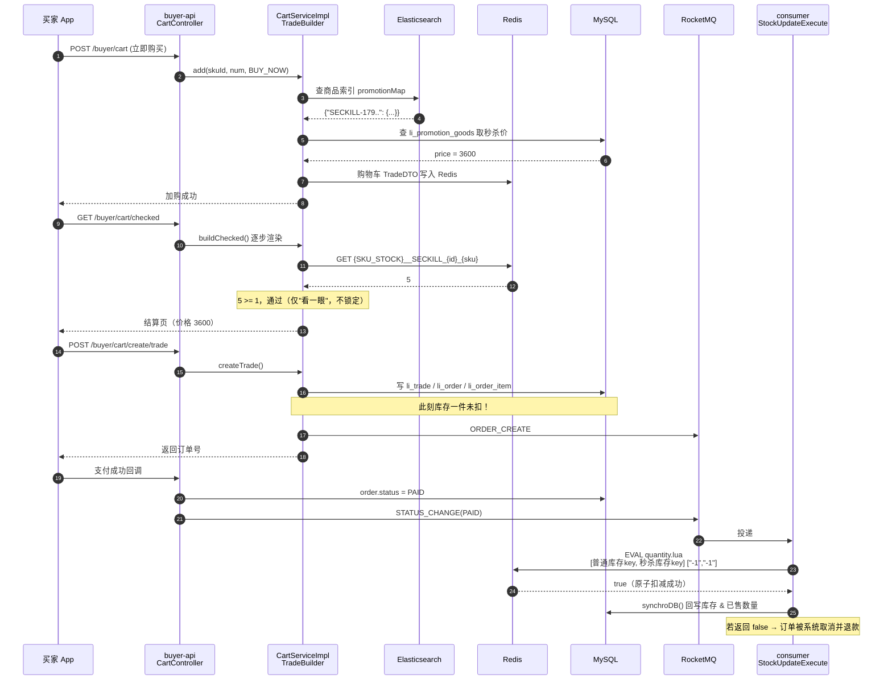
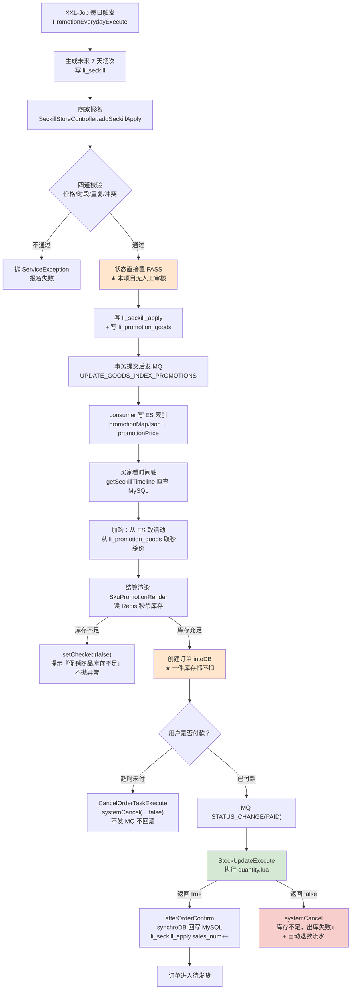

# 《Lilishop》秒杀链路全解（小白版）

Lilishop（PickMall）是一套完整的 B2B2C 多商户开源商城。"秒杀"在它里面不是一个孤零零的接口，而是一条完整的业务流水线：平台建场次 → 商家报名 → 上架 → 展示 → 加购 → 下单 → 支付扣库存 → 超时回滚。

| 项 | 值 |
|---|---|
| 仓库地址 | <https://github.com/lilishop/lilishop> |
| Gitee 镜像 | <https://gitee.com/beijing_hongye_huicheng/lilishop> |
| Star 数 | 约 4.2k |
| 本文分析的版本 | 2026-07-31 clone 的 `master` 分支，HEAD 提交 `4e6d563a4f0fa53880dd1420ce0904fc6e29f9e9`，提交日期 2026-05-17 |
| 技术栈 | Spring Boot 3.5.6 + MyBatis-Plus 3.5.8 + MySQL 8.3 + Redis（Lettuce / Redisson）+ RocketMQ + Elasticsearch + ShardingSphere 4.0.0 + XXL-Job 2.3.0 + Spring Security + JWT |
| 本文定位 | 「电商促销体系篇」。不只讲「怎么扣一个库存」，而是讲**一件秒杀商品的一生** |

---

## 0. 读之前：先搞懂「秒杀」到底难在哪

先别急着看代码。把问题说清楚，不然看代码就是看天书。

### 0.1 秒杀 = 100 个人抢 5 张演唱会门票

想象一个场景：

```
                   ┌──────────────────────────┐
                   │   10:00:00 整，开抢！     │
                   └──────────────────────────┘
                                │
     ┌───────┬───────┬───────┬──┴────┬───────┬───────┬───────┐
     ▼       ▼       ▼       ▼       ▼       ▼       ▼       ▼
   用户1   用户2   用户3   用户4   用户5   用户6  ...  用户100
     │       │       │       │       │       │             │
     └───────┴───────┴───────┴───┬───┴───────┴─────────────┘
                                 ▼
                      ┌────────────────────┐
                      │   只有 5 件库存！   │
                      └────────────────────┘
```

100 个人同时冲过来，但货只有 5 件。系统要保证三件事：

1. **最多只能卖出 5 件**（多卖了叫「超卖」，售票员要被开除）；
2. **别把数据库搞挂**（100 个人同时查数据库还好，100 万个人就完蛋了）；
3. **抢到的人要能顺利付钱拿货，没抢到的人要立刻被告知"没了"**。

### 0.2 为什么「超卖」这么容易发生

假设我们用最笨的写法：

```
线程A：读库存 → 看到 1 件 → 判断"够！" → 减 1 → 写回 0
线程B：读库存 → 看到 1 件 → 判断"够！" → 减 1 → 写回 0
```

时间线画出来是这样的：

```
时间 ──────────────────────────────────────────────────────▶

线程A   [读=1]          [判断:够]         [写=0]
                \                            /
                 \  ← 这中间的空隙，就是灾难 →
                /                            \
线程B      [读=1]         [判断:够]        [写=0]

结果：库存本来只有 1 件，却卖出了 2 单 —— 超卖！
```

问题的本质是：「读」和「写」中间有缝，别人插了队。

解决思路无非三种：

| 思路 | 生活比喻 | 说明 |
|---|---|---|
| 加锁 | 厕所门上那把锁，一次只让一个人进 | 简单粗暴，但慢 |
| 数据库行锁 / 乐观锁 | 账本上写"必须库存>0才允许改" | 靠谱，但数据库扛不住高并发 |
| Redis + Lua 原子脚本 | 给收银台递一张纸条："一口气把这几件事做完，中间不许插队" | **Lilishop 用的就是这个** |

先剧透结论：**Lilishop 靠的是「Redis + Lua 脚本原子扣减」，而且扣库存的时机放在了"支付成功之后"，不是"下单的那一刻"。**

这个设计选择非常关键，第 5 章会专门展开讲。

### 0.3 几个必须先认识的名词（先混个脸熟，第 9 章有完整词典）

| 名词 | 大白话 |
|---|---|
| **Redis** | 收银台旁边的小白板。写字、擦字都比翻账本快 100 倍，但停电（宕机）就没了 |
| **MySQL** | 仓库里那本厚厚的手写账本。准确、持久，但翻页慢 |
| **RocketMQ（消息队列）** | 奶茶店的取号小票机。先给你一张号码，后厨慢慢做，不用你站在柜台前干等 |
| **Elasticsearch（ES）** | 图书馆的检索卡片柜。专门用来"搜"，比在账本里一页页翻快得多 |
| **Lua 脚本** | 交给 Redis 的一张纸条，上面写着"这几件事一口气做完，中间不许插队" |
| **SKU** | 具体到"颜色+尺码"的那一个最小商品单位。比如"iPhone 12 / 蓝色 / 128G"就是一个 SKU |

---

## 1. 十分钟认识这个项目

### 1.1 它是干什么的

Lilishop 是一个**多商户（B2B2C）商城**。什么叫多商户？就是像淘宝、京东 POP 那样：

```
┌──────────────────────────────────────────────────────────┐
│                      平台（Lilishop）                     │
│   负责：定规则、开活动场次、审商品、抽佣金、做统计          │
└───────────┬──────────────┬──────────────┬────────────────┘
            │              │              │
      ┌─────▼────┐   ┌─────▼────┐   ┌─────▼────┐
      │  店铺 A  │   │  店铺 B  │   │  店铺 C  │  ← 商家（卖家）
      │ 卖手机   │   │ 卖零食   │   │ 卖衣服   │
      └─────┬────┘   └─────┬────┘   └─────┬────┘
            └──────────────┼──────────────┘
                           ▼
                    ┌────────────┐
                    │   买家们    │
                    └────────────┘
```

这个"三方结构"对理解秒杀极其重要，因为 **Lilishop 的秒杀是"平台开场子、商家来摆摊"** 的模式：

- **平台**每天定时生成未来 7 天的秒杀"场次"（比如 "2026-08-01 秒杀活动"，包含 10 点场、14 点场、20 点场）；
- **商家**自己挑商品报名到某个场次的某个时段；
- 买家在前台看到的是按"几点场"分好组的秒杀商品列表。

### 1.2 技术栈清单（每个组件用一句大白话解释它干嘛）

| 组件 | 版本 | 一句话大白话 |
|---|---|---|
| Spring Boot | 3.5.6 | Java 后端的"脚手架"，帮你把一堆零件拼成能跑的服务 |
| MyBatis-Plus | 3.5.8 | 帮你少写 SQL 的工具，`this.list(wrapper)` 就等于一句 SELECT |
| MySQL | 8.3.0 | 那本厚账本。所有数据最终都要老老实实写在这里 |
| Redis | - | 收银台的小白板。秒杀库存就住在这里 |
| Redisson | - | 基于 Redis 的"锁"工具箱（**但本项目秒杀链路没用它，只在钱包支付里用了**） |
| RocketMQ | - | 取号小票机。下单、支付、库存变更都靠它异步传话 |
| Elasticsearch | - | 检索卡片柜。商品搜索、商品详情上的"促销标签"都从这里读 |
| ShardingSphere | 4.0.0 | 数据库分库分表工具（订单量大了才用得上） |
| XXL-Job | 2.3.0 | 分布式闹钟。"每天生成秒杀场次"、"每分钟扫超时订单"靠它 |
| Spring Security + JWT | - | 门卫。检查你是不是登录了、是买家还是商家 |

### 1.3 目录结构地图

先看整个仓库的顶层：

```
lilishop/
├── framework/        ★ 核心！所有业务逻辑（entity/service/mapper）都在这
├── buyer-api/          买家端 HTTP 接口（App、小程序、PC 前台调它）
├── seller-api/         商家端 HTTP 接口（店铺后台调它）
├── manager-api/        平台端 HTTP 接口（运营后台调它）
├── common-api/         公共接口（验证码、短信、文件上传……）
├── im-api/             即时通讯
├── consumer/         ★ 消费端！MQ 消费者 + 定时任务都在这
├── xxl-job/            定时任务调度中心
├── config/             Nacos 配置
└── DB/                 数据库脚本
```

再把秒杀相关的文件全部摊开（下面每一个路径都是真实存在的，你可以直接打开）：

```
【促销/秒杀 领域模型 & 服务】framework/src/main/java/cn/lili/modules/promotion/
├── entity/dos/
│   ├── BasePromotions.java              所有促销活动的爹（开始/结束时间、店铺、范围）
│   ├── Seckill.java                     秒杀"场次"        → 表 li_seckill
│   ├── SeckillApply.java                商家的"报名单"     → 表 li_seckill_apply
│   └── PromotionGoods.java              促销商品（价格+促销库存）→ 表 li_promotion_goods
├── entity/vos/
│   ├── SeckillVO.java                   场次 + 报名列表
│   ├── SeckillApplyVO.java              报名单（几乎等于 SeckillApply）
│   ├── SeckillGoodsVO.java              前台展示用的秒杀商品
│   └── SeckillTimelineVO.java           前台"时间轴"（几点场 + 倒计时 + 商品列表）
├── entity/enums/
│   ├── PromotionsApplyStatusEnum.java   APPLY / PASS / REFUSE
│   ├── PromotionsStatusEnum.java        NEW / START / END / CLOSE
│   └── SeckillApplyStatusEnum.java      APPLIED / NOT_APPLY / EXPIRE
├── service/
│   ├── SeckillService.java              含常量 PRE_CREATION = 7
│   ├── SeckillApplyService.java
│   └── PromotionGoodsService.java     ★ 含静态方法 getPromotionGoodsStockCacheKey()
├── serviceimpl/
│   ├── AbstractPromotionsServiceImpl.java  所有促销的通用流程模板
│   ├── SeckillServiceImpl.java          场次管理
│   ├── SeckillApplyServiceImpl.java   ★ 报名 + 前台时间轴，秒杀的核心
│   ├── PromotionGoodsServiceImpl.java ★ 促销库存的读写
│   └── PromotionServiceImpl.java        把促销信息打包成 ES 的 promotionMap
└── tools/PromotionTools.java            时间校验、时段计算等工具

【HTTP 入口】
├── buyer-api/.../controller/promotion/SeckillBuyerController.java    买家：看时间轴、看商品
├── seller-api/.../controller/promotion/SeckillStoreController.java   商家：报名、退出
└── manager-api/.../controller/promotion/SeckillManagerController.java 平台：建场次、改场次、删报名

【下单链路】framework/src/main/java/cn/lili/modules/order/
├── cart/render/TradeBuilder.java              购物车渲染总调度
├── cart/render/RenderStepStatement.java       渲染步骤"剧本"
├── cart/render/impl/CheckDataRender.java      校验商品是否有效、普通库存够不够
├── cart/render/impl/SkuPromotionRender.java ★ 校验"促销库存"（秒杀库存在这查）
├── cart/service/CartServiceImpl.java          加购物车 / 创建交易
├── order/serviceimpl/TradeServiceImpl.java    创建交易，发 ORDER_CREATE 消息
└── order/serviceimpl/OrderServiceImpl.java    订单落库、支付、取消

【真正扣库存的地方】
├── consumer/src/main/java/cn/lili/event/impl/StockUpdateExecute.java  ★★★ 全场最重要
├── consumer/src/main/java/cn/lili/listener/OrderMessageListener.java   订单 MQ 消费者
└── framework/src/main/resources/script/quantity.lua                   ★★★ 扣库存的 Lua 脚本

【定时任务】consumer/src/main/java/cn/lili/timetask/handler/impl/
├── promotion/PromotionEverydayExecute.java    每天生成未来 7 天的秒杀场次
└── order/CancelOrderTaskExecute.java          每分钟扫描超时未支付订单
```

看到这里你可能已经发现一个信号：**"扣库存"的代码不在 promotion 模块里，而在 order 链路的 consumer 里。**

这正是本文要讲清楚的核心。

---

## 2. 【主线】一次秒杀请求，从点击到下单的完整链路

### 2.0 先看总图

一句话：平台排档期 → 商家报名 → MQ 写 ES 上架 → 前台按时段展示 → 加购取秒杀价 → 结算只是"看一眼" → 下单不扣库存 → 支付成功后 Lua 原子扣减 → 失败就整单取消退款。

下面四张图分别是业务视角、技术链路、时序、状态分叉，看懂任意一张就能往下读。

#### 图 1：一件秒杀商品的一生（业务视角）

```
════════════════════════════════════════════════════════════════════════
                    一件秒杀商品的一生
════════════════════════════════════════════════════════════════════════

 【T-7 天】平台侧：自动生成场次
 ┌────────────────────────────────────────────────────────────────┐
 │ XXL-Job 每天触发 PromotionEverydayExecute.execute()            │
 │   → 读系统设置 SECKILL_SETTING（hours = "10,14,20"）            │
 │   → for i in 1..7 : new Seckill(i, hours, rule)                │
 │   → 写入表 li_seckill，一天一条                                 │
 └────────────────────────────┬───────────────────────────────────┘
                              ▼
 【T-3 天】商家侧：报名
 ┌────────────────────────────────────────────────────────────────┐
 │ POST /store/promotion/seckill/apply/{seckillId}                │
 │   → SeckillApplyServiceImpl.addSeckillApply()                  │
 │   ① 校验：秒杀价 ≤ 原价？时段在 hours 里？同 SKU 没报重复？      │
 │   ② 校验：活动库存 ≤ 商品真实库存？同时段没参加拼团/其他秒杀？    │
 │   ③ 状态直接置为 PASS（★本项目没有人工审核环节）                 │
 │   ④ 写表 li_seckill_apply  +  写表 li_promotion_goods           │
 └────────────────────────────┬───────────────────────────────────┘
                              ▼
 【报名完成瞬间】上架 / 预热
 ┌────────────────────────────────────────────────────────────────┐
 │ SeckillServiceImpl.updateEsGoodsSeckill()                      │
 │   → 事务提交后发 RocketMQ：goodsTopic:UPDATE_GOODS_INDEX_PROMOTIONS│
 │   → consumer GoodsMessageListener 消费                          │
 │   → 把「秒杀活动 + 秒杀价」写进 Elasticsearch 商品索引          │
 └────────────────────────────┬───────────────────────────────────┘
                              ▼
 【活动当天】买家侧：看
 ┌────────────────────────────────────────────────────────────────┐
 │ GET /buyer/promotion/seckill        → 时间轴（10点场/14点场…）  │
 │ GET /buyer/promotion/seckill/{时刻} → 该场次的商品列表          │
 │   （★注意：这两个接口直接查 MySQL，没有走 Redis 缓存）           │
 └────────────────────────────┬───────────────────────────────────┘
                              ▼
 【10:00:00】买家侧：抢
 ┌────────────────────────────────────────────────────────────────┐
 │ POST /buyer/cart  加入购物车 / 立即购买                          │
 │   → 从 ES 索引读 promotionMap，识别出 SECKILL                   │
 │   → 从 li_promotion_goods 读秒杀价，覆盖 purchasePrice           │
 └────────────────────────────┬───────────────────────────────────┘
                              ▼
 ┌────────────────────────────────────────────────────────────────┐
 │ GET /buyer/cart/checked  结算页渲染                             │
 │   → SkuPromotionRender.checkPromotionQuantity()                │
 │   → 读 Redis key: {SKU_STOCK}__SECKILL_{活动id}_{skuId}         │
 │   → 不够就把这个商品「取消勾选」并给出错误提示（不抛异常）        │
 └────────────────────────────┬───────────────────────────────────┘
                              ▼
 ┌────────────────────────────────────────────────────────────────┐
 │ POST /buyer/cart/create/trade  创建订单                          │
 │   → 订单、子订单落库（li_order / li_order_item）                 │
 │   → ★★★ 此时【一件库存都没有扣】★★★                            │
 │   → 事务提交后发 MQ：orderTopic:ORDER_CREATE                    │
 └────────────────────────────┬───────────────────────────────────┘
                              ▼
 【几分钟内】买家侧：付钱
 ┌────────────────────────────────────────────────────────────────┐
 │ 支付回调 → OrderServiceImpl.payOrder()                          │
 │   → 发 MQ：orderTopic:STATUS_CHANGE，newStatus = PAID           │
 └────────────────────────────┬───────────────────────────────────┘
                              ▼
 ★★★ 真正扣库存的那一刻 ★★★
 ┌────────────────────────────────────────────────────────────────┐
 │ consumer: StockUpdateExecute.orderChange(PAID)                 │
 │   → 组装 keys（普通库存 key + 秒杀库存 key）和 values（负数）    │
 │   → stringRedisTemplate.execute(quantityScript, keys, values)  │
 │   → quantity.lua 原子扣减，任何一项不足就整体回滚并返回 false    │
 │      ├─ true  → afterOrderConfirm() + synchroDB() 回写 MySQL    │
 │      └─ false → systemCancel(订单, "库存不足，出库失败", true)   │
 └────────────────────────────┬───────────────────────────────────┘
                              ▼
 【超时/取消】
 ┌────────────────────────────────────────────────────────────────┐
 │ A. 一直没付钱：CancelOrderTaskExecute 每分钟扫，超时则           │
 │    systemCancel(sn, "超时未支付自动取消", false)                │
 │    → 不发 MQ、不回滚库存（因为压根没扣过）                       │
 │ B. 已付款后取消：StockUpdateExecute 的 CANCELLED 分支            │
 │    → 用同一个 quantity.lua 把库存加回去（values 为正数）         │
 │    → 但如果取消原因是"库存不足，出库失败"，则跳过（本来就没扣成） │
 └────────────────────────────────────────────────────────────────┘
```

#### 图 2：一次抢购请求的技术链路（主链路大图）

这是本文的「主链路大图」，从点击按钮到订单落库、再到库存真正减少：

```
 用户手机
    │  ① 点「立即购买」
    ▼
┌──────────────────────────────────────────────────────────────────────┐
│ buyer-api : CartController.add()                                     │
│   POST /buyer/cart?skuId=xxx&num=1&cartType=BUY_NOW                  │
└───────────────┬──────────────────────────────────────────────────────┘
                │ ② CartServiceImpl.add()
                ▼
┌──────────────────────────────────────────────────────────────────────┐
│ PromotionGoodsServiceImpl.getCurrentGoodsPromotion(sku, cartType)    │
│   ├─ 查 ES 索引 EsGoodsIndex.promotionMap                            │
│   │    { "SECKILL-1798...": {活动对象}, "COUPON-33..": {...} }        │
│   └─ 命中 SECKILL → 查 li_promotion_goods 拿到秒杀价                  │
│        sku.promotionFlag = true;  sku.promotionPrice = 3600.00        │
└───────────────┬──────────────────────────────────────────────────────┘
                │ ③ 购物车 TradeDTO 存进 Redis（key = {BUY_NOW}_用户id）
                ▼
┌──────────────────────────────────────────────────────────────────────┐
│ buyer-api : CartController.cartChecked()  GET /buyer/cart/checked    │
│   → TradeBuilder.buildChecked() 按剧本 checkedRender 一步步渲染       │
│                                                                      │
│   [1] CHECKED_FILTER  CheckedFilterRender  只留勾选的                 │
│   [2] CHECK_DATA      CheckDataRender      商品下架了吗？普通库存够吗？│
│   [3] SKU_PROMOTION   SkuPromotionRender ★ 秒杀促销库存够吗？          │
│   [4] FULL_DISCOUNT   FullDiscountRender   满减                       │
│   [5] COUPON          CouponRender         优惠券                     │
│   [6] SKU_FREIGHT     SkuFreightRender     运费                       │
│   [7] CART_PRICE      CartPriceRender      总价                       │
└───────────────┬──────────────────────────────────────────────────────┘
                │  ★ 第[3]步读 Redis：
                │     GET {SKU_STOCK}__SECKILL_{seckillId}_{skuId}
                │     若 num > 库存 → checked=false + "促销商品库存不足"
                ▼
┌──────────────────────────────────────────────────────────────────────┐
│ buyer-api : CartController.crateTrade()                              │
│   POST /buyer/cart/create/trade   （带 @PreventDuplicateSubmissions） │
│   → TradeBuilder.createTrade() 再按 tradeRender 剧本渲染一遍          │
│   → TradeServiceImpl.createTrade()                                   │
│        ├─ save(Trade)                     写 li_trade                │
│        ├─ orderService.intoDB(tradeDTO)   写 li_order / li_order_item │
│        │     其中 OrderItem.promotionType = "SECKILL"                │
│        │         OrderItem.promotionId   = 秒杀活动 id               │
│        └─ 事务提交后 → MQ orderTopic:ORDER_CREATE                    │
│   ★★ 到这里为止，Redis 里的秒杀库存一个都没少 ★★                     │
└───────────────┬──────────────────────────────────────────────────────┘
                │ ④ 用户去付钱（微信/支付宝/余额）
                ▼
┌──────────────────────────────────────────────────────────────────────┐
│ OrderServiceImpl.payOrder(orderSn, ...)                              │
│   → order.payStatus = PAID; order.orderStatus = PAID                 │
│   → sendUpdateStatusMessage(PAID)                                    │
│   → MQ orderTopic:STATUS_CHANGE                                      │
└───────────────┬──────────────────────────────────────────────────────┘
                │ ⑤ RocketMQ 投递
                ▼
┌──────────────────────────────────────────────────────────────────────┐
│ consumer : OrderMessageListener.orderStatusEvent()                   │
│   case STATUS_CHANGE → 遍历所有 OrderStatusChangeEvent 实现类         │
│                        其中就有 StockUpdateExecute                    │
└───────────────┬──────────────────────────────────────────────────────┘
                │ ⑥
                ▼
┌──────────────────────────────────────────────────────────────────────┐
│ StockUpdateExecute.orderChange(msg)  case PAID:                      │
│   keys   = [ {SKU_STOCK}_skuId ,  {SKU_STOCK}__SECKILL_活动id_skuId ]│
│   values = [ "-1"             ,  "-1"                              ] │
│   checkStocks() 先补一遍缓存（防缓存击穿）                            │
│   Boolean ok = stringRedisTemplate.execute(quantityScript, keys, values)│
└───────────────┬──────────────────────────────────────────────────────┘
                │ ⑦ Redis 单线程执行 Lua，全程不许插队
                ▼
        ┌───────────────┐            ┌────────────────────────────────┐
   true │               │ false      │ quantity.lua                   │
   ┌────┘               └────┐       │  for 每个 key:                 │
   ▼                         ▼       │    v = get(key) + num          │
┌──────────────────┐  ┌─────────────┐│    if v < 0 then rollback();   │
│afterOrderConfirm │  │systemCancel ││                 return false   │
│synchroDB() 回写  │  │("库存不足") ││    set(key, v)                 │
│  li_goods_sku    │  │→ 自动退款   │└────────────────────────────────┘
│  li_promotion_   │  └─────────────┘
│    goods         │
│  li_seckill_apply│
│    .sales_num    │
└──────────────────┘
```

#### 图 3：Mermaid 时序图（一次成功抢购）



#### 图 4：Mermaid 流程图（一件秒杀商品的一生 + 状态分叉）



下面一步一步拆开讲。

---

### 2.1 第一步：平台预先生成未来 7 天的秒杀场次

#### 发生了什么

秒杀不是"商家想开就开"，而是**平台先把"档期"排好**。就像商场先定好"每周六下午 2 点是特卖时间"，然后招商家来摆摊。

定时任务干的事画成伪代码就三行：

```
读系统设置 SECKILL_SETTING，拿到 hours（如 "10,14,20"）和 seckillRule
for i in 1..PRE_CREATION:                # PRE_CREATION = 7
    场次 = new Seckill(第 i 天, hours, rule)
    if 这个时间段还没有同类型活动:        # PromotionTools.checkActiveTime 查重
        savePromotions(场次)              # 写 li_seckill
```

#### 对应代码在哪

定时任务：`consumer/src/main/java/cn/lili/timetask/handler/impl/promotion/PromotionEverydayExecute.java`

```java
@Override
public void execute() {
    try {
        //清除所有商品索引的无效促销活动
        this.esGoodsIndexService.cleanInvalidPromotion();
    } catch (Exception e) { /* ... */ }
    try {
        //定时创建活动
        addSeckill();
    } catch (Exception e) { /* ... */ }
}

private void addSeckill() {
    Setting setting = settingService.get(SettingEnum.SECKILL_SETTING.name());
    SeckillSetting seckillSetting = new Gson().fromJson(setting.getSettingValue(), SeckillSetting.class);
    for (int i = 1; i <= SeckillService.PRE_CREATION; i++) {
        Seckill seckill = new Seckill(i, seckillSetting.getHours(), seckillSetting.getSeckillRule());
        seckill.setApplyEndTime(null);
        //如果已经存在促销，则不再次保存
        if (seckillService.list(
                PromotionTools.checkActiveTime(seckill.getStartTime(), seckill.getEndTime(),
                        PromotionTypeEnum.SECKILL, null, seckill.getId())).isEmpty()) {
            boolean result = seckillService.savePromotions(seckill);
        }
    }
}
```

`PRE_CREATION` 定义在 `framework/.../promotion/service/SeckillService.java`：

```java
public interface SeckillService extends AbstractPromotionsService<Seckill> {
    /**
     * 预创建活动数量
     */
    Integer PRE_CREATION = 7;
    // ...
}
```

场次对象的构造函数在 `framework/.../promotion/entity/dos/Seckill.java`：

```java
public Seckill(int day, String hours, String seckillRule) {
    //默认创建*天后的秒杀活动
    DateTime dateTime = DateUtil.beginOfDay(DateUtil.offsetDay(new Date(), day));
    this.applyEndTime = dateTime;
    this.hours = hours;                       // 例如 "10,14,20"
    this.seckillRule = seckillRule;
    this.goodsNum = 0;
    this.setStoreName(PromotionTools.PLATFORM_NAME);   // "platform"
    this.setStoreId(PromotionTools.PLATFORM_ID);       // "0"
    this.setPromotionName(DateUtil.formatDate(dateTime) + " 秒杀活动");
    this.setStartTime(dateTime);
    this.setEndTime(DateUtil.endOfDay(dateTime));
}
```

#### 为什么这么设计

如果没有"预生成"，商家想报名的时候发现"没有场次可报"，运营就得手动天天建，太累。预生成 7 天，商家永远有得报。

#### 小白比喻

> 就像电影院提前一周把排片表贴出来。片商（商家）看着排片表来谈"我的片子想排周三 20 点那场"。

#### 一个真实的小坑（如实记录）

`manager-api/.../SeckillManagerController.java` 里那个初始化接口的文案写的是"默认初始化 30 天内的活动"：

```java
@Operation(summary = "初始化秒杀活动(初始化方法，默认初始化30天内的活动）")
@GetMapping("/init")
public void addSeckill() {
    seckillService.init();
}
```

但 `SeckillServiceImpl.init()` 实际循环的是 `PRE_CREATION`，也就是 **7 天**，不是 30 天。

更要命的是，这个 `init()` 方法开头会 `this.remove(new QueryWrapper<>())` —— **把所有秒杀活动清空**。它属于"演示数据重置"用途，生产环境千万别点。

#### 场次数据长什么样

```
表 li_seckill（秒杀"场次"，一天一条）
┌──────────────┬──────────────────────┬─────────────┬───────────┬──────────┬──────────┐
│ id           │ promotion_name       │ start_time  │ end_time  │ hours    │ goods_num│
├──────────────┼──────────────────────┼─────────────┼───────────┼──────────┼──────────┤
│ 1798...001   │ 2026-08-01 秒杀活动  │ 08-01 10:00 │ 08-01 23:59│ 10,14,20 │    38    │
│ 1798...002   │ 2026-08-02 秒杀活动  │ 08-02 10:00 │ 08-02 23:59│ 10,14,20 │    12    │
│ ...          │ ...                  │ ...         │ ...       │ ...      │   ...    │
└──────────────┴──────────────────────┴─────────────┴───────────┴──────────┴──────────┘
      ▲                                       ▲
      │                                       └─ 注意：start_time 被 checkStatus() 强行
      │                                          修正为「当天 hours 中最早的那一小时」
      └─ store_id = "0"，store_name = "platform"，代表这是平台活动
```

`SeckillServiceImpl.checkStatus()` 里这段就是干这事的：

```java
@Override
public void checkStatus(Seckill promotions) {
    super.checkStatus(promotions);
    if (promotions.getStartTime() != null && CharSequenceUtil.isNotEmpty(promotions.getHours())) {
        Integer[] split = Convert.toIntArray(promotions.getHours().split(","));
        Arrays.sort(split);
        String startTimeStr = DateUtil.format(promotions.getStartTime(), DatePattern.NORM_DATE_PATTERN)
                + " " + split[0] + ":00";
        promotions.setStartTime(DateUtil.parse(startTimeStr, DatePattern.NORM_DATETIME_MINUTE_PATTERN));
        promotions.setEndTime(DateUtil.endOfDay(promotions.getStartTime()));
    }
}
```

---

### 2.2 第二步：商家报名，把 SKU 塞进某个时段

#### 发生了什么

商家登录店铺后台，选一个场次（比如 8 月 1 号那场），再选一个时刻（比如 `10` 点场），挑几个 SKU，填上"秒杀价"和"秒杀库存"，提交。

#### 对应代码在哪

入口：`seller-api/src/main/java/cn/lili/controller/promotion/SeckillStoreController.java`

```java
@PostMapping(path = "/apply/{seckillId}", consumes = "application/json", produces = "application/json")
@Operation(description = "添加秒杀活动申请")
public ResultMessage<String> addSeckillApply(@PathVariable String seckillId,
                                             @RequestBody List<SeckillApplyVO> applyVos) {
    String storeId = Objects.requireNonNull(UserContext.getCurrentUser()).getStoreId();
    seckillApplyService.addSeckillApply(seckillId, storeId, applyVos);
    return ResultUtil.success();
}
```

核心逻辑：`framework/.../promotion/serviceimpl/SeckillApplyServiceImpl.java` 的 `addSeckillApply()`。

#### 报名要过的四道关

先看整体形状，注意第二道关是 `continue`，不是抛异常：

```
checkSeckillApplyList(hours, 报名单列表)      # 关卡① 整批一起校验，任一条不合格 → 整批失败
for 每条报名单:
    goodsSku = 查 SKU
    if goodsSku.storeId != 当前店铺:  continue      # 关卡② 静默跳过，不报错
    checkSeckillGoodsSku(...)                       # 关卡③ 库存/活动冲突
    getCanPromotionGoodsSkuByIdFromCache(skuId)     # 关卡④ 批发商品不能参加促销
    落库 li_seckill_apply + li_promotion_goods
```

画成关卡图：

```
                    商家提交报名单
                          │
                          ▼
   ┌──────────────────────────────────────────────────────┐
   │ 关卡①  checkSeckillApplyList()                       │
   │  · 秒杀价 > 原价？ → 报错 SECKILL_PRICE_ERROR         │
   │  · 时刻不在 hours 里？ → 报错 SECKILL_TIME_ERROR      │
   │  · 同一个 SKU 报了两个时段？ → 报错                    │
   └──────────────────────┬───────────────────────────────┘
                          ▼
   ┌──────────────────────────────────────────────────────┐
   │ 关卡②  goodsSku.getStoreId().equals(storeId)         │
   │  · 不是自家的商品？→ continue（静默跳过）             │
   └──────────────────────┬───────────────────────────────┘
                          ▼
   ┌──────────────────────────────────────────────────────┐
   │ 关卡③  checkSeckillGoodsSku()                        │
   │  · 活动库存 > 商品真实库存？ → "此商品库存不足"        │
   │  · 同时段已参加拼团？ → 报错                          │
   │  · 同时段已参加别的秒杀？ → 报错                       │
   └──────────────────────┬───────────────────────────────┘
                          ▼
   ┌──────────────────────────────────────────────────────┐
   │ 关卡④  getCanPromotionGoodsSkuByIdFromCache()        │
   │  · 批发（WHOLESALE）销售模式的商品不能参加促销         │
   └──────────────────────┬───────────────────────────────┘
                          ▼
                     全部通过 → 落库
```

关卡①的代码：

```java
private void checkSeckillApplyList(String hours, List<SeckillApplyVO> seckillApplyList) {
    List<String> existSku = new ArrayList<>();
    for (SeckillApplyVO seckillApply : seckillApplyList) {
        if (seckillApply.getPrice() > seckillApply.getOriginalPrice()) {
            throw new ServiceException(ResultCode.SECKILL_PRICE_ERROR);
        }
        //检查秒杀活动申请的时刻，是否存在在秒杀活动的时间段内
        String[] rangeHours = hours.split(",");
        boolean containsSame = Arrays.stream(rangeHours).anyMatch(i -> i.equals(seckillApply.getTimeLine().toString()));
        if (!containsSame) {
            throw new ServiceException(ResultCode.SECKILL_TIME_ERROR);
        }
        //检查商品是否参加多个时间段的活动
        if (existSku.contains(seckillApply.getSkuId())) {
            throw new ServiceException(seckillApply.getGoodsName() + "该商品不能同时参加多个时间段的活动");
        } else {
            existSku.add(seckillApply.getSkuId());
        }
    }
}
```

关卡③的代码：

```java
private void checkSeckillGoodsSku(Seckill seckill, SeckillApplyVO seckillApply, GoodsSku goodsSku, DateTime startTime) {
    //活动库存不能大于商品库存
    if (goodsSku.getQuantity() < seckillApply.getQuantity()) {
        throw new ServiceException(seckillApply.getGoodsName() + ",此商品库存不足");
    }
    //查询是否在同一时间段参与了拼团活动
    if (promotionGoodsService.findInnerOverlapPromotionGoods(PromotionTypeEnum.PINTUAN.name(),
            goodsSku.getId(), startTime, seckill.getEndTime(), seckill.getId()) > 0) {
        throw new ServiceException("商品[" + goodsSku.getGoodsName() + "]已经在重叠的时间段参加了拼团活动，不能参加秒杀活动");
    }
    //查询是否在同一时间段参与了秒杀活动活动
    if (promotionGoodsService.findInnerOverlapPromotionGoods(PromotionTypeEnum.SECKILL.name(),
            goodsSku.getId(), startTime, seckill.getEndTime(), seckill.getId()) > 0) {
        throw new ServiceException("商品[" + goodsSku.getGoodsName() + "]已经在重叠的时间段参加了秒杀活动，不能参加秒杀活动活动");
    }
}
```

#### 为什么这么设计

- **"活动库存 ≤ 商品真实库存"**：不然商家报名 1000 件秒杀，仓库里只有 3 件，秒完了发不出货。
- **"同时段不能同时参加拼团和秒杀"**：一个商品在同一秒钟只能有一个"促销价"，否则算价的时候会打架。

#### 小白比喻

> 报名就像去菜市场租摊位：管理处要检查你确实有这么多货（库存校验）、价格牌不能比原价还高（价格校验）、同一个时间段你不能既在 A 区摆摊又在 B 区摆摊（活动冲突校验）。

---

### 2.3 第三步：审核——这个项目其实**没有做**人工审核

这是必须如实说明的一点。

`SeckillApply` 实体上确实有状态字段，注释里也写了三种状态：

```java
/**
 * @see PromotionsApplyStatusEnum
 */
@Schema(description = "APPLY(\"申请\"), PASS(\"通过\"), REFUSE(\"拒绝\")")
private String promotionApplyStatus;

@Schema(description = "驳回原因")
private String failReason;
```

枚举 `PromotionsApplyStatusEnum` 也确实定义了 `APPLY / PASS / REFUSE`。

**但是**，在 `addSeckillApply()` 里，状态是被写死成 `PASS` 的：

```java
//设置秒杀申请默认内容
seckillApply.setOriginalPrice(goodsSku.getPrice());
seckillApply.setPromotionApplyStatus(PromotionsApplyStatusEnum.PASS.name());
seckillApply.setSalesNum(0);
```

而平台端 `SeckillManagerController` 里，跟报名相关的接口只有两个：

```java
@Operation(summary = "获取秒杀活动申请列表")
@GetMapping("/apply")
public ResultMessage<IPage<SeckillApply>> getSeckillApply(SeckillSearchParams param, PageVO pageVo) { ... }

@Operation(summary = "删除秒杀活动申请")
@DeleteMapping("/apply/{seckillId}/{id}")
public ResultMessage<String> deleteSeckillApply(@PathVariable String seckillId, @PathVariable String id) { ... }
```

摊开成一张对照表：

| 本该有的东西 | 仓库里的实际情况 |
|---|---|
| 报名后置为 `APPLY` 待审 | 直接写死 `PASS` |
| 平台"审核通过 / 驳回"接口 | 没有，只有"看列表"和"删报名" |
| `REFUSE` 状态 | 全仓库无任何一处赋值 |
| `failReason` 驳回原因 | 全仓库无任何一处赋值 |

**结论：Lilishop 的秒杀报名是"报了即通过"，平台只能事后"看"和"删"。**

全仓库搜索 `PromotionsApplyStatusEnum.REFUSE`，只在单元测试 `manager-api/src/test/java/cn/lili/test/promotion/SeckillTest.java` 里出现过 `APPLY` 的赋值（而且那个赋值也会被 service 覆盖成 PASS）。

> 小白理解：这就像"摆摊只要交表就自动批准，管理处发现你不合规了直接把你摊位拆了"。想加审核流程的话，需要自己改 `addSeckillApply()` 把状态设成 `APPLY`，再在 manager 端加一个审核接口。

---

### 2.4 第四步：生成促销商品 + 写 ES 索引（"上架"与"缓存预热"）

#### 发生了什么

报名通过后，系统要做两件事：

1. 在 `li_promotion_goods` 表里生成一条"促销商品"记录 —— 这是**秒杀价和秒杀库存的家**；
2. 把"这个 SKU 在某时段有秒杀"这个事实，写进 Elasticsearch 商品索引 —— 这样前台搜索/详情页才能显示秒杀标签和秒杀价。

#### 对应代码在哪

第一件事，`SeckillApplyServiceImpl.setSeckillGoods()`：

```java
private PromotionGoods setSeckillGoods(GoodsSku goodsSku, SeckillApply seckillApply, Seckill seckill) {
    //设置促销商品默认内容
    PromotionGoods promotionGoods = new PromotionGoods(goodsSku);
    promotionGoods.setPrice(seckillApply.getPrice());        // 秒杀价
    promotionGoods.setQuantity(seckillApply.getQuantity());  // 秒杀库存 ★
    //设置单独每个促销商品的结束时间
    DateTime startTime = DateUtil.offsetHour(DateUtil.beginOfDay(seckill.getStartTime()), seckillApply.getTimeLine());
    promotionGoods.setStartTime(startTime);
    if (seckill.getEndTime() == null) {
        promotionGoods.setEndTime(DateUtil.endOfDay(startTime));
    } else {
        promotionGoods.setEndTime(seckill.getEndTime());
    }
    return promotionGoods;
}
```

然后 `PromotionTools.promotionGoodsInit()` 补上活动 id、类型、已售数量归零：

```java
public static List<PromotionGoods> promotionGoodsInit(List<PromotionGoods> originList,
                                                      BasePromotions promotion,
                                                      PromotionTypeEnum promotionTypeEnum) {
    if (originList != null) {
        for (PromotionGoods promotionGoods : originList) {
            promotionGoods.setPromotionId(promotion.getId());
            // ...
            promotionGoods.setTitle(promotion.getPromotionName());
            // 如果是秒杀活动保留原时间
            if (promotionGoods.getStartTime() == null || !PromotionTypeEnum.SECKILL.equals(promotionTypeEnum)) {
                promotionGoods.setStartTime(promotion.getStartTime());
            }
            // ...
            promotionGoods.setPromotionType(promotionTypeEnum.name());
            promotionGoods.setNum(0);        // 已卖出数量归零
            promotionGoods.setDeleteFlag(promotion.getDeleteFlag());
        }
    }
    return originList;
}
```

第二件事，`SeckillServiceImpl.updateEsGoodsSeckill()`：

```java
@Override
@Transactional(rollbackFor = Exception.class)
public void updateEsGoodsSeckill(Seckill seckill, List<SeckillApply> seckillApplies) {
    if (seckillApplies != null && !seckillApplies.isEmpty()) {
        // 更新促销范围
        seckill.setScopeId(ArrayUtil.join(seckillApplies.stream().map(SeckillApply::getSkuId).toArray(), ","));
        UpdateWrapper<Seckill> updateWrapper = new UpdateWrapper<>();
        updateWrapper.eq("id", seckill.getId());
        updateWrapper.set("scope_id", seckill.getScopeId());
        this.update(updateWrapper);
        //循环秒杀商品数据，将数据按照时间段进行存储
        for (SeckillApply seckillApply : seckillApplies) {
            if (seckillApply.getPromotionApplyStatus().equals(PromotionsApplyStatusEnum.PASS.name())) {
                this.setSeckillApplyTime(seckill, seckillApply);
            }
        }
        if (!seckillApplies.isEmpty()) {
            this.updateEsGoodsIndex(seckill);
        }
    }
}
```

`updateEsGoodsIndex()` 定义在父类 `AbstractPromotionsServiceImpl`，它并不直接写 ES，而是**发一条 MQ 消息**，而且是「事务提交后才发」：

```java
@Override
@Transactional(rollbackFor = Exception.class)
public void sendUpdateEsGoodsMsg(T promotions) {
    String esPromotionKey = this.getPromotionType().name() + "-" + promotions.getId();
    Map<String, Object> map = new HashMap<>();
    map.put("esPromotionKey", esPromotionKey);
    map.put("promotionsType", promotions.getClass().getName());
    map.put("promotions", promotions);
    applicationEventPublisher.publishEvent(new TransactionCommitSendMQEvent("更新商品索引促销事件",
            rocketmqCustomProperties.getGoodsTopic(),
            GoodsTagsEnum.UPDATE_GOODS_INDEX_PROMOTIONS.name(), JSONUtil.toJsonStr(map)));
}
```

"事务提交后才发"这个机制在 `framework/.../common/listener/TransactionCommitSendMQListener.java`：

```java
@TransactionalEventListener(phase = TransactionPhase.AFTER_COMMIT)
public void send(TransactionCommitSendMQEvent event) {
    String destination = event.getTopic() + ":" + event.getTag();
    rocketMQTemplate.asyncSend(destination, event.getMessage(), RocketmqSendCallbackBuilder.commonCallback());
}
```

消费端在 `consumer/src/main/java/cn/lili/listener/GoodsMessageListener.java`：

```java
case UPDATE_GOODS_INDEX_PROMOTIONS:
    this.updateGoodsIndexPromotions(new String(messageExt.getBody()));
    break;
```

`updateGoodsIndexPromotions()` 会分页把这个活动下所有 `PromotionGoods` 捞出来，然后：

```java
// 更新商品索引促销信息（删除原索引中相关的促销信息，更新索引中促销信息）
this.goodsIndexService.deleteEsGoodsPromotionByPromotionKey(skuIds, esPromotionKey);
this.goodsIndexService.updateEsGoodsIndexByList(promotionGoodsPage.getRecords(), promotions, esPromotionKey);
```

最终写进 ES 的形态（`EsGoodsIndexServiceImpl.updateEsGoodsIndexByList`）：

```java
// 设置促销活动的开始和结束时间
if (promotion.getStartTime() == null || promotion instanceof Seckill) {
    promotion.setStartTime(promotionGoods.getStartTime());
}
if (promotion.getEndTime() == null || promotion instanceof Seckill) {
    promotion.setEndTime(promotionGoods.getEndTime());
}
// ...
// 如果促销活动为秒杀、满减或拼团，设置促销价格
if (goodsIndex != null && (PromotionTypeEnum.SECKILL.name().equals(promotionGoods.getPromotionType()) || ...)) {
    updateQueries.add(UpdateQuery.builder(goodsIndex.getId())
            .withDocument(Document.from(MapUtil.builder(PROMOTION_PRICE, promotionGoods.getPrice()).build()))
            .build());
}
```

#### 缓存预热做了吗？

做了一半：

| 数据 | 是否预热 | 在哪 |
|---|---|---|
| 普通 SKU 库存（Redis） | ✅ 会预热 | `EsGoodsIndexServiceImpl` 初始化索引时 `cache.put(GoodsSkuService.getStockCacheKey(sku.getId()), sku.getQuantity())`，源码注释写着"库存锁是在redis做的，所以生成索引，同时更新一下redis中的库存数量" |
| **秒杀促销库存（Redis）** | ❌ **没有专门的预热任务** | 采用**懒加载**：第一次有人来查的时候才从 MySQL 读出来写进 Redis |
| 秒杀活动 + 秒杀价（ES） | ✅ 报名时通过 MQ 异步写入 | 见上文 |
| 前台时间轴（Redis） | ❌ 没有缓存 | 每次请求直接查 MySQL，详见 2.5 |

秒杀库存的"懒加载"逻辑，三句话就能背下来：

```
v = redis.get(促销库存key)
if v 存在:            return v
promotionGoods = 查 li_promotion_goods(活动类型, 活动id, skuId)
if promotionGoods 为空:  return 0      # 注意：返回 0，不是报错
redis.set(促销库存key, promotionGoods.quantity)
return promotionGoods.quantity
```

实现在 `PromotionGoodsServiceImpl.getPromotionGoodsStock()`：

```java
@Override
public Integer getPromotionGoodsStock(PromotionTypeEnum typeEnum, String promotionId, String skuId) {
    String promotionStockKey = PromotionGoodsService.getPromotionGoodsStockCacheKey(typeEnum, promotionId, skuId);
    Object promotionGoodsStock = cache.get(promotionStockKey);

    //库存如果不为空，则直接返回
    if (promotionGoodsStock != null) {
        return Convert.toInt(promotionGoodsStock);
    }
    //如果为空
    else {
        //获取促销商品，如果不存在促销商品，则返回0
        PromotionGoodsSearchParams searchParams = new PromotionGoodsSearchParams();
        searchParams.setPromotionType(typeEnum.name());
        searchParams.setPromotionId(promotionId);
        searchParams.setSkuId(skuId);
        PromotionGoods promotionGoods = this.getPromotionsGoods(searchParams);
        if (promotionGoods == null) {
            return 0;
        }
        //否则写入新的促销商品库存
        cache.put(promotionStockKey, promotionGoods.getQuantity());
        return promotionGoods.getQuantity();
    }
}
```

> 小白比喻：正规的"缓存预热"应该是**开演前把票据提前搬到售票窗口**。Lilishop 这里是"第一个观众来了才跑回仓库取票"。第一个人会慢一点，之后就快了。在秒杀这种"零点齐冲"的场景下，这一下"回仓库"可能会同时被成百上千个请求触发（缓存击穿）。

#### 这一步的一个已知瑕疵（如实记录）

`updateEsGoodsSeckill()` 里的这个 for 循环：

```java
for (SeckillApply seckillApply : seckillApplies) {
    if (seckillApply.getPromotionApplyStatus().equals(PromotionsApplyStatusEnum.PASS.name())) {
        this.setSeckillApplyTime(seckill, seckillApply);   // ← 反复修改同一个 seckill 对象
    }
}
if (!seckillApplies.isEmpty()) {
    this.updateEsGoodsIndex(seckill);                      // ← 只发一次消息
}
```

`setSeckillApplyTime()` 每次都在修改**同一个** `seckill` 对象的 `startTime/endTime`，循环结束后只剩最后一条报名单的时段。

好在下游 `updateEsGoodsIndexByList()` 对 `Seckill` 类型做了兜底 —— 它会用每条 `PromotionGoods` 自己的 `startTime/endTime` 覆盖回去，所以最终结果是对的。但这段代码读起来确实很绕。

---

### 2.5 第五步：买家打开秒杀页，看到时间轴分场次

#### 发生了什么

买家点开"限时秒杀"频道，看到的是这样一个界面：

```
┌──────────────────────────────────────────────────────────────┐
│  ⏰ 限时秒杀                                                  │
├──────────┬──────────┬──────────┬─────────────────────────────┤
│  10:00   │  14:00   │  20:00   │                             │
│ 抢购中   │ 即将开始  │ 即将开始  │                             │
│  ▔▔▔▔   │          │          │                             │
├──────────┴──────────┴──────────┴─────────────────────────────┤
│  距离 14:00 场开始还有  03 : 12 : 45                          │
├──────────────────────────────────────────────────────────────┤
│  [图] iPhone 12   ¥3600  原价 ¥4000   已抢 12 件 / 共 50 件   │
│  [图] AirPods     ¥ 799  原价 ¥1099   已抢  3 件 / 共 20 件   │
└──────────────────────────────────────────────────────────────┘
```

#### 对应代码在哪

入口：`buyer-api/src/main/java/cn/lili/controller/promotion/SeckillBuyerController.java`，整个类只有 22 行有效代码：

```java
@Tag(name = "买家端,秒杀活动接口")
@RestController
@RequestMapping("/buyer/promotion/seckill")
public class SeckillBuyerController {

    @Autowired
    private SeckillApplyService seckillApplyService;

    @Operation(summary = "获取当天秒杀活动信息")
    @GetMapping
    public ResultMessage<List<SeckillTimelineVO>> getSeckillTime() {
        return ResultUtil.data(seckillApplyService.getSeckillTimeline());
    }

    @Operation(summary = "获取某个时刻的秒杀活动商品信息")
    @GetMapping("/{timeline}")
    public ResultMessage<List<SeckillGoodsVO>> getSeckillGoods(@PathVariable Integer timeline) {
        return ResultUtil.data(seckillApplyService.getSeckillGoods(timeline));
    }
}
```

真正干活的是 `SeckillApplyServiceImpl.getSeckillTimelineInfo()`，它的骨架是"两层循环 + 一个筛选条件"：

```
查当天的 li_seckill 列表
for 每个场次 seckill:
    hour = 系统当前小时
    hoursSored = seckill.hours 拆开并排序      # 如 [10,14,20]
    for i in 0..len(hoursSored)-1:
        if 该时段该展示(i, hour):               # 判断规则见下方
            倒计时 = max(该时段时间戳 - 当前时间戳, 0)
            该时段.商品列表 = wrapperSeckillGoods(hoursSored[i], seckill.id)
            加入结果
```

```java
private List<SeckillTimelineVO> getSeckillTimelineInfo() {
    List<SeckillTimelineVO> timelineList = new ArrayList<>();
    LambdaQueryWrapper<Seckill> queryWrapper = new LambdaQueryWrapper<>();
    //查询当天时间段内的秒杀活动活动
    Date now = new Date();
    queryWrapper.between(BasePromotions::getStartTime, DateUtil.beginOfDay(now), DateUtil.endOfDay(now));
    queryWrapper.ge(BasePromotions::getEndTime, DateUtil.endOfDay(now));
    List<Seckill> seckillList = this.seckillService.list(queryWrapper);
    for (Seckill seckill : seckillList) {
        //读取系统时间的时刻
        Calendar c = Calendar.getInstance();
        int hour = c.get(Calendar.HOUR_OF_DAY);
        String[] split = seckill.getHours().split(",");
        int[] hoursSored = Arrays.stream(split).mapToInt(Integer::parseInt).toArray();
        Arrays.sort(hoursSored);
        for (int i = 0; i < hoursSored.length; i++) {
            SeckillTimelineVO tempTimeline = new SeckillTimelineVO();
            boolean hoursSoredHour = (hoursSored[i] >= hour || ((i + 1) < hoursSored.length && hoursSored[i + 1] > hour));
            boolean lastHour = i == hoursSored.length - 1 && hoursSored[i] < hour;
            if (hoursSoredHour || lastHour) {
                // ... 计算倒计时
                long currentTime = DateUtil.currentSeconds();
                long timeLine = cn.lili.common.utils.DateUtil.getDateline(date + " " + hoursSored[i], "yyyy-MM-dd HH");
                Long distanceTime = timeLine - currentTime < 0 ? 0 : timeLine - currentTime;
                tempTimeline.setDistanceStartTime(distanceTime);
                tempTimeline.setStartTime(timeLine);
                tempTimeline.setTimeLine(hoursSored[i]);
                tempTimeline.setSeckillGoodsList(wrapperSeckillGoods(hoursSored[i], seckill.getId()));
                timelineList.add(tempTimeline);
            }
        }
    }
    return timelineList;
}
```

#### 时间轴的筛选逻辑，画出来是这样

假设 `hours = "10,14,20"`，当前是 15 点：

```
 hours 排序后:      10        14        20
                    │         │         │
                    ▼         ▼         ▼
 时间轴  ───────────●─────────●────●────●──────────▶
                                   ▲
                                 现在15点

 判断规则（对每个下标 i）：
   条件A: hoursSored[i] >= hour          → i=2 (20>=15) ✓
   条件B: 下一个时段 > 当前小时            → i=1 (下一个是20>15) ✓
   条件C: 最后一个时段且已过（lastHour）   → 不成立
   ────────────────────────────────────────────────
   结果：展示 14 点场（进行中）和 20 点场（即将开始）
        10 点场不展示（已经过完了）
```

`SeckillTimelineVO` 的结构（`framework/.../promotion/entity/vos/SeckillTimelineVO.java`）：

```java
public class SeckillTimelineVO implements Serializable {
    @Schema(description = "时刻")
    private Integer timeLine;                       // 10 / 14 / 20

    @Schema(description = "秒杀开始时间，这个是时间戳")
    private Long startTime;

    @Schema(description = "距离本组活动开始的时间，秒为单位。如果活动的开始时间是10点，服务器时间为8点，距离开始还有多少时间")
    private Long distanceStartTime;                 // 倒计时（秒）

    @Schema(description = "本组活动内的秒杀活动商品列表")
    private List<SeckillGoodsVO> seckillGoodsList;
}
```

#### 商品列表怎么来的

```java
private List<SeckillGoodsVO> wrapperSeckillGoods(Integer startTimeline, String seckillId) {
    List<SeckillGoodsVO> seckillGoodsVoS = new ArrayList<>();
    List<SeckillApply> seckillApplyList = this.list(
            new LambdaQueryWrapper<SeckillApply>().eq(SeckillApply::getSeckillId, seckillId));
    if (!seckillApplyList.isEmpty()) {
        List<SeckillApply> collect = seckillApplyList.stream()
                .filter(i -> i.getTimeLine().equals(startTimeline)
                        && i.getPromotionApplyStatus().equals(PromotionsApplyStatusEnum.PASS.name()))
                .collect(Collectors.toList());
        for (SeckillApply seckillApply : collect) {
            GoodsSku goodsSku = goodsSkuService.getCanPromotionGoodsSkuByIdFromCache(seckillApply.getSkuId());
            if (goodsSku != null) {
                SeckillGoodsVO goodsVO = new SeckillGoodsVO();
                BeanUtil.copyProperties(seckillApply, goodsVO);
                goodsVO.setGoodsImage(goodsSku.getThumbnail());
                goodsVO.setGoodsId(goodsSku.getGoodsId());
                goodsVO.setGoodsName(goodsSku.getGoodsName());
                seckillGoodsVoS.add(goodsVO);
            }
        }
    }
    return seckillGoodsVoS;
}
```

#### 这里必须如实指出的三点

**1. 前台时间轴接口完全没有缓存。**

方法开头有一句注释 `//秒杀活动缓存key`，但下面并没有任何 `cache.get / cache.put`。每一次买家刷新秒杀页，都要付出这么多次查询：

| 动作 | 查什么 | 次数 |
|---|---|---|
| 查场次 | `li_seckill` 表 | 1 次 |
| 查报名单 | `li_seckill_apply` 表（`wrapperSeckillGoods` 里是 `eq(seckillId)` 不带时段条件，捞出来再用 Java Stream 过滤） | 每个场次的每个时段各 1 次全量查询 |
| 查 SKU | `goodsSkuService.getCanPromotionGoodsSkuByIdFromCache`（走 Redis） | 每个 SKU 1 次 |

如果一场秒杀有 3 个时段、每个时段 50 个商品，那么**一次页面刷新会打 3 次全表扫描 + 150 次 Redis 查询**。高并发下这是最先倒下的地方。

**2. `SeckillGoodsVO` 里的 `quantity` 是"报名总量"，不是"实时剩余"。**

它由 `BeanUtil.copyProperties(seckillApply, goodsVO)` 从 `li_seckill_apply.quantity` 拷来。实时剩余要靠 `quantity - salesNum` 算，而 `salesNum` 只有在**订单支付成功、库存同步回 MySQL** 的时候才更新（见 2.9）。所以前台看到的"已抢 X 件"是有延迟的。

**3. 有一个缓存前缀 `CachePrefix.STORE_ID_SECKILL` 定义了，但全仓库只有"删除"没有"写入"。**

```java
// SeckillApplyServiceImpl.addSeckillApply() 结尾
cache.vagueDel(CachePrefix.STORE_ID_SECKILL);
```

搜遍整个仓库，`STORE_ID_SECKILL` 只出现在 `CachePrefix.java` 的定义处和上面这一行删除处。这是历史遗留的死代码。

---

### 2.6 第六步：加入购物车 / 立即购买时，价格从哪来

#### 发生了什么

买家点"立即购买"，系统要回答一个关键问题：**这个商品现在到底卖多少钱？**

答案分两步取：ES 告诉你"有没有秒杀"，MySQL 告诉你"秒杀价是多少"。

```
promotionMap = ES 索引里这个 sku 的促销集合
if promotionMap 为空:
    sku.promotionFlag = false; sku.promotionPrice = null; return null
if 有任意 key 含 "SECKILL" 或 "PINTUAN":
    取第一条命中的促销 → 查 li_promotion_goods(skuId, promotionId)
    if 查到且 price 非空: sku.promotionFlag = true;  sku.promotionPrice = 促销价
    else:                 sku.promotionFlag = false; sku.promotionPrice = null
return promotionMap
```

#### 对应代码在哪

`buyer-api/.../controller/order/CartController.java`：

```java
@Operation(summary = "向购物车中添加一个产品")
@PostMapping
public ResultMessage<Object> add(@NotNull(message = "产品id不能为空") String skuId, ...) { ... }
```

`framework/.../order/cart/service/CartServiceImpl.java` 的 `add()` 方法第一件事就是：

```java
@Override
public void add(String skuId, Integer num, String cartType, Boolean cover) {
    AuthUser currentUser = Objects.requireNonNull(UserContext.getCurrentUser());
    if (num <= 0) {
        throw new ServiceException(ResultCode.CART_NUM_ERROR);
    }
    CartTypeEnum cartTypeEnum = getCartType(cartType);
    GoodsSku dataSku = checkGoods(skuId);
    Map<String, Object> promotionMap = promotionGoodsService.getCurrentGoodsPromotion(dataSku, cartTypeEnum.name());
    // ...
}
```

`getCurrentGoodsPromotion()` 在 `PromotionGoodsServiceImpl` 里：

```java
@Override
public Map<String, Object> getCurrentGoodsPromotion(GoodsSku dataSku, String cartType) {
    Map<String, Object> promotionMap;
    EsGoodsIndex goodsIndex = goodsIndexService.findById(dataSku.getId());
    if (goodsIndex == null) {
        goodsIndex = goodsIndexService.getResetEsGoodsIndex(dataSku);
    }
    if (goodsIndex.getPromotionMap() != null && !goodsIndex.getPromotionMap().isEmpty()) {
        if (goodsIndex.getPromotionMap().keySet().stream().anyMatch(i -> i.contains(PromotionTypeEnum.SECKILL.name()))
                || (... PINTUAN ...)) {
            Optional<Map.Entry<String, Object>> containsPromotion = goodsIndex.getPromotionMap().entrySet().stream()
                    .filter(i -> i.getKey().contains(PromotionTypeEnum.SECKILL.name())
                              || i.getKey().contains(PromotionTypeEnum.PINTUAN.name()))
                    .findFirst();
            containsPromotion.ifPresent(stringObjectEntry -> this.setGoodsPromotionInfo(dataSku, stringObjectEntry));
        }
        promotionMap = goodsIndex.getPromotionMap();
    } else {
        promotionMap = null;
        dataSku.setPromotionFlag(false);
        dataSku.setPromotionPrice(null);
    }
    return promotionMap;
}

private void setGoodsPromotionInfo(GoodsSku dataSku, Map.Entry<String, Object> promotionInfo) {
    JSONObject promotionsObj = JSON.parseObject(JSON.toJSONString(promotionInfo.getValue()));
    PromotionGoodsSearchParams searchParams = new PromotionGoodsSearchParams();
    searchParams.setSkuId(dataSku.getId());
    searchParams.setPromotionId(promotionsObj.get("id").toString());
    PromotionGoods promotionsGoods = this.getPromotionsGoods(searchParams);
    if (promotionsGoods != null && promotionsGoods.getPrice() != null) {
        dataSku.setPromotionFlag(true);
        dataSku.setPromotionPrice(promotionsGoods.getPrice());   // ← 秒杀价从这里来
    } else {
        dataSku.setPromotionFlag(false);
        dataSku.setPromotionPrice(null);
    }
}
```

#### 画成图

```
   加购请求 skuId=1387977574860193792
        │
        ▼
┌────────────────────────────────────────────────────────┐
│ Elasticsearch  索引 EsGoodsIndex（按 skuId 主键取）      │
│   promotionMap = {                                     │
│      "SECKILL-1798001": { id:"1798001",                │
│                           startTime: 08-01 10:00,      │
│                           endTime  : 08-01 14:00, ...} │
│   }                                                    │
└────────────────────┬───────────────────────────────────┘
                     │ 发现 key 里含 "SECKILL"
                     ▼
┌────────────────────────────────────────────────────────┐
│ MySQL  li_promotion_goods                              │
│   WHERE sku_id = ? AND promotion_id = '1798001'        │
│   → price = 3600.00                                    │
└────────────────────┬───────────────────────────────────┘
                     ▼
        dataSku.promotionFlag  = true
        dataSku.promotionPrice = 3600.00
                     │
                     ▼
        CartSkuVO.purchasePrice = 3600.00
        （购物车整个 TradeDTO 序列化后存 Redis）
```

#### 为什么秒杀价要在 ES 和 MySQL 各存一份

| 存储 | 存的是 | 用途 |
|---|---|---|
| ES | "**有没有**促销"这个事实（带时间范围） | 搜索列表页快速打标签、排序、过滤 |
| MySQL `li_promotion_goods` | "**多少钱、多少库存**"这些必须准确的数字 | 加购/结算时取真实价格与库存 |

> 小白比喻：ES 是"商场入口的活动海报"（告诉你哪家店在搞活动），MySQL 是"店里那张真实的价签"（告诉你到底多少钱）。海报可以晚一点更新，价签必须准。

#### 注意：没有"秒杀专用购物车类型"

`CartTypeEnum` 里的枚举值是：

```java
public enum CartTypeEnum {
    CART,       // 购物车
    BUY_NOW,    // 立即购买
    VIRTUAL,    // 虚拟商品
    PINTUAN,    // 拼团
    POINTS,     // 积分
    KANJIA;     // 砍价商品
}
```

**没有 `SECKILL`。** 秒杀商品走的就是普通的 `CART` 或 `BUY_NOW` 通道，只是价格被促销信息覆盖了。

同理 `OrderPromotionTypeEnum` 里也只有 `NORMAL / GIFT / PINTUAN / POINTS / KANJIA`，**秒杀订单在订单表上就是一个 NORMAL 普通订单**，秒杀的痕迹只留在子订单 `li_order_item` 的两个字段上：

```java
// OrderItem 构造函数
if (cartSkuVO.getPriceDetailDTO().getJoinPromotion() != null && !cartSkuVO.getPriceDetailDTO().getJoinPromotion().isEmpty()) {
    this.setPromotionType(CollUtil.join(... map(PromotionSkuVO::getPromotionType) ..., ","));  // "SECKILL"
    this.setPromotionId(CollUtil.join(... map(PromotionSkuVO::getActivityId) ..., ","));       // "1798001"
}
```

这两个字段是**逗号分隔的字符串**（因为一个商品可能同时参加多个促销），后面扣库存时会 `split(",")` 逐个处理。

---

### 2.7 第七步：结算页渲染，校验秒杀库存

#### 发生了什么

买家点"去结算"，系统要重新算一遍价格，并且检查"这个秒杀商品还有货吗"。

#### 渲染流水线：TradeBuilder

Lilishop 把购物车/结算页的计算拆成了一条**流水线**，每一步叫一个 `CartRenderStep`。剧本写在 `framework/.../order/cart/render/RenderStepStatement.java`：

```java
/**
 * 结算页渲染
 * 过滤选择的商品 》 校验商品 》 满优惠渲染  》  渲染优惠  》
 * 优惠券渲染  》 计算运费  》  计算价格
 */
public static RenderStepEnums[] checkedRender = {
        RenderStepEnums.CHECKED_FILTER,
        RenderStepEnums.CHECK_DATA,
        RenderStepEnums.SKU_PROMOTION,
        RenderStepEnums.FULL_DISCOUNT,
        RenderStepEnums.COUPON,
        RenderStepEnums.SKU_FREIGHT,
        RenderStepEnums.CART_PRICE,
};

/**
 * 交易创建前渲染
 */
public static RenderStepEnums[] tradeRender = {
        RenderStepEnums.CHECKED_FILTER,
        RenderStepEnums.CHECK_DATA,
        RenderStepEnums.SKU_PROMOTION,
        RenderStepEnums.FULL_DISCOUNT,
        RenderStepEnums.COUPON,
        RenderStepEnums.SKU_FREIGHT,
        RenderStepEnums.CART_PRICE,
        RenderStepEnums.CART_SN,
        RenderStepEnums.DISTRIBUTION,
        RenderStepEnums.PLATFORM_COMMISSION
};
```

执行引擎在 `TradeBuilder.renderCartBySteps()`：

```java
private void renderCartBySteps(TradeDTO tradeDTO, RenderStepEnums[] defaultRender) {
    for (RenderStepEnums step : defaultRender) {
        for (CartRenderStep render : cartRenderSteps) {
            try {
                if (render.step().equals(step)) {
                    render.render(tradeDTO);
                }
            } catch (ServiceException e) {
                throw e;
            } catch (Exception e) {
                log.error("购物车{}渲染异常：", render.getClass(), e);
            }
        }
    }
}
```

注意异常处理的分岔：`ServiceException` 会往外抛（中断整个结算），其它异常只写一条 error 日志、继续跑下一步。

画成流水线图：

```
 TradeDTO（购物车对象，从 Redis 读出来）
      │
      ▼
 ┌──────────────────────┐
 │ ① CHECKED_FILTER     │ CheckedFilterRender    只保留勾选的 SKU
 └──────────┬───────────┘
            ▼
 ┌──────────────────────┐
 │ ② CHECK_DATA         │ CheckDataRender
 │                      │  · 商品下架 / 审核未过 → 标记失效
 │                      │  · dataSku.quantity < num → "商品库存不足"
 │                      │  · 重新拉最新促销信息，刷新 purchasePrice
 └──────────┬───────────┘
            ▼
 ┌──────────────────────┐
 │ ③ SKU_PROMOTION   ★  │ SkuPromotionRender
 │                      │  · renderSkuPromotion(): 记录参加了哪些促销
 │                      │  · checkPromotionQuantity(): 查【秒杀库存】
 └──────────┬───────────┘
            ▼
 ┌──────────────────────┐
 │ ④ FULL_DISCOUNT      │ FullDiscountRender     满减
 └──────────┬───────────┘
            ▼
 ┌──────────────────────┐
 │ ⑤ COUPON             │ CouponRender           优惠券
 └──────────┬───────────┘
            ▼
 ┌──────────────────────┐
 │ ⑥ SKU_FREIGHT        │ SkuFreightRender       运费
 └──────────┬───────────┘
            ▼
 ┌──────────────────────┐
 │ ⑦ CART_PRICE         │ CartPriceRender        汇总总价
 └──────────┬───────────┘
            ▼
   （下单时还会多跑 ⑧CART_SN ⑨DISTRIBUTION ⑩PLATFORM_COMMISSION）
```

#### 秒杀库存校验的具体代码

第 ③ 步的核心判断，写成伪代码只有五行：

```
for 每个勾选的 sku:
  for 它参加的每个促销:
      qty = redis.get({SKU_STOCK}_<促销类型>_<活动id>_<skuId>)
      if qty 为空:      qty = 按促销类型回源查库存（SECKILL/PINTUAN 走懒加载，KANJIA/POINTS_GOODS 各查各的，其它类型直接 return）
      if 要买的数量 > qty:  该行 checked = false，errorMessage = "促销商品库存不足,现有库存数量[qty]"
```

`framework/.../order/cart/render/impl/SkuPromotionRender.java`：

```java
@Override
public void render(TradeDTO tradeDTO) {
    //基础价格渲染
    renderBasePrice(tradeDTO);
    //渲染单品促销
    renderSkuPromotion(tradeDTO);
    //检查促销库存
    checkPromotionQuantity(tradeDTO);
}

private void checkPromotionQuantity(TradeDTO tradeDTO) {
    for (CartSkuVO cartSkuVO : tradeDTO.getCheckedSkuList()) {
        List<PromotionSkuVO> joinPromotion = cartSkuVO.getPriceDetailDTO().getJoinPromotion();
        if (!joinPromotion.isEmpty()) {
            for (PromotionSkuVO promotionSkuVO : joinPromotion) {
                this.checkPromotionGoodsQuantity(cartSkuVO, promotionSkuVO);
            }
        }
    }
}

private void checkPromotionGoodsQuantity(CartSkuVO cartSkuVO, PromotionSkuVO promotionSkuVO) {
    String promotionGoodsStockCacheKey = PromotionGoodsService.getPromotionGoodsStockCacheKey(
            PromotionTypeEnum.valueOf(promotionSkuVO.getPromotionType()),
            promotionSkuVO.getActivityId(),
            cartSkuVO.getGoodsSku().getId());
    Object quantity = cache.get(promotionGoodsStockCacheKey);

    if (quantity == null) {
        //如果促销有库存信息
        PromotionTypeEnum promotionTypeEnum = PromotionTypeEnum.valueOf(promotionSkuVO.getPromotionType());
        switch (promotionTypeEnum) {
            case KANJIA:       quantity = ...; break;
            case POINTS_GOODS: quantity = ...; break;
            case SECKILL:
            case PINTUAN:
                quantity = promotionGoodsService.getPromotionGoodsStock(
                        PromotionTypeEnum.valueOf(promotionSkuVO.getPromotionType()),
                        promotionSkuVO.getActivityId(),
                        cartSkuVO.getGoodsSku().getId());
                break;
            default: return;
        }
    }

    //设置购物车未选中
    if (quantity != null && cartSkuVO.getNum() > (Integer) quantity) {
        cartSkuVO.setChecked(false);
        //设置失效消息
        cartSkuVO.setErrorMessage("促销商品库存不足,现有库存数量[" + quantity + "]");
    }
}
```

#### 划重点：这一步只是「看一眼」，不是「锁定」

```
   ┌──────────────────────────────────────────────────────────┐
   │  checkPromotionGoodsQuantity() 做的事：                   │
   │                                                          │
   │      GET {SKU_STOCK}__SECKILL_1798001_1387977574860193792│
   │                    ↓                                     │
   │              返回 5                                       │
   │                    ↓                                     │
   │      if (我要买的 1 > 5) { 取消勾选 + 提示 }               │
   │                                                          │
   │  ★ 没有 DECR、没有 SETNX、没有任何"占位"操作 ★             │
   └──────────────────────────────────────────────────────────┘
```

这意味着：**1000 个人同时看到"还剩 5 件"，1000 个人都能顺利下单。** 真正的淘汰发生在支付那一刻。这个设计的利弊，第 5 章和第 7 章会详细分析。

还有一个细节值得注意：库存不足时它 **不抛异常**，只是 `setChecked(false)` + 写一条 `errorMessage`。

也就是说，在结算页上这个商品会自动变成"未勾选"状态，用户会看到红字提示，但整个页面还能正常打开。

---

### 2.8 第八步：创建订单（此时依然不扣库存！）

#### 对应代码在哪

入口：`buyer-api/.../controller/order/CartController.java`

```java
@PreventDuplicateSubmissions
@Operation(summary = "创建交易")
@PostMapping(path = "/create/trade", consumes = "application/json", produces = "application/json")
public ResultMessage<Object> crateTrade(@RequestBody TradeParams tradeParams) {
    try {
        //读取选中的列表
        return ResultUtil.data(this.cartService.createTrade(tradeParams));
    } catch (ServiceException se) {
        log.info(se.getMsg(), se);
        throw se;
    } catch (Exception e) {
        log.error(ResultCode.ORDER_ERROR.message(), e);
        throw e;
    }
}
```

`CartServiceImpl.createTrade()` → `TradeBuilder.createTrade()` → `TradeServiceImpl.createTrade()`：

```java
@Override
@Transactional(rollbackFor = Exception.class)
public Trade createTrade(TradeDTO tradeDTO) {
    //创建订单预校验
    createTradeCheck(tradeDTO);
    Trade trade = new Trade(tradeDTO);
    String key = CachePrefix.TRADE.getPrefix() + trade.getSn();
    //优惠券预处理
    couponPretreatment(tradeDTO);
    //积分预处理
    pointPretreatment(tradeDTO);
    //添加交易
    this.save(trade);
    //添加订单
    orderService.intoDB(tradeDTO);
    //砍价订单处理
    kanjiaPretreatment(tradeDTO);
    //写入缓存，给消费者调用
    cache.put(key, JSONUtil.toJsonStr(tradeDTO));
    applicationEventPublisher.publishEvent(new TransactionCommitSendMQEvent("订单创建消息",
            rocketmqCustomProperties.getOrderTopic(), OrderTagsEnum.ORDER_CREATE.name(), key));
    return trade;
}
```

`OrderServiceImpl.intoDB()` 负责把订单和子订单批量写库：

```java
@Override
@Transactional(rollbackFor = Exception.class)
public void intoDB(TradeDTO tradeDTO) {
    checkTradeDTO(tradeDTO);
    List<Order> orders = new ArrayList<>(tradeDTO.getCartList().size());
    List<OrderItem> orderItems = new ArrayList<>();
    List<OrderLog> orderLogs = new ArrayList<>();
    // ... 循环购物车构造 Order / OrderItem / OrderLog ...
    //批量保存订单
    this.saveBatch(orders);
    //批量保存 子订单
    orderItemService.saveBatch(orderItems);
    //批量记录订单操作日志
    orderLogService.saveBatch(orderLogs);
}
```

**从头到尾，你在这里找不到任何一句 `DECR`、`updateStock`、`quantityScript`。订单创建完毕，Redis 里的秒杀库存仍然是 5。**

#### 数据流

```
 Redis 购物车  {BUY_NOW}_用户id
      │  读出 TradeDTO
      ▼
 TradeBuilder.createTrade()  → 再渲染一遍（tradeRender 剧本）
      │
      ▼
 ┌──────────────────────────────────────────────────────┐
 │ MySQL 事务                                            │
 │   INSERT li_trade      （一次交易，可能含多个店铺的单） │
 │   INSERT li_order      （一个店铺一张订单）            │
 │   INSERT li_order_item （一个 SKU 一条，带 promotion） │
 │   INSERT li_order_log                                 │
 └────────────────────────┬─────────────────────────────┘
                          │ 事务 COMMIT 之后
                          ▼
 ┌──────────────────────────────────────────────────────┐
 │ Redis: SET {TRADE}_交易号 = TradeDTO 的 JSON          │
 │ RocketMQ: orderTopic:ORDER_CREATE  body = 上面那个key │
 └──────────────────────────────────────────────────────┘
```

`ORDER_CREATE` 这条消息在 consumer 端由 `OrderMessageListener` 消费，触发一堆 `TradeEvent`（发通知、生成发票、分销记录等等），**但里面没有扣库存的逻辑**。

#### 防重复提交注解的一个坑（如实记录）

```java
@Target(ElementType.METHOD)
@Retention(RetentionPolicy.RUNTIME)
public @interface PreventDuplicateSubmissions {
    /**
     * 过期时间 默认3秒，即3秒内无法重复点击。
     */
    long expire() default 3;
    /**
     * 用户间隔离，默认false。
     * 如果为true则全局限制，为true需要用户登录状态，否则则是全局隔离
     */
    boolean userIsolation() default false;
}
```

拦截器 `PreventDuplicateSubmissionsInterceptor.getParams()` 拼 key 的规则是这样的：

```
key = 请求 URI
if 有 query 参数:   key += JSON(parameterMap)
if userIsolation:  key += 当前用户 id        # 默认 false，这一段不会执行
```

```java
private String getParams(Boolean userIsolation) {
    HttpServletRequest request = ...;
    StringBuilder stringBuilder = new StringBuilder();
    stringBuilder.append(request.getRequestURI());          // "/buyer/cart/create/trade"
    if (!request.getParameterMap().isEmpty()) {
        stringBuilder.append(JSONUtil.toJsonStr(request.getParameterMap()));
    }
    if (userIsolation) {                                     // ← 默认 false！
        AuthUser authUser = UserContext.getCurrentUser();
        if (authUser == null) { log.warn(...); }
        else { stringBuilder.append(authUser.getId()); }
    }
    return stringBuilder.toString();
}
```

三个事实凑在一起，结果就变味了：

| 事实 | 后果 |
|---|---|
| `crateTrade()` 上写的是**不带参数**的 `@PreventDuplicateSubmissions` | `userIsolation = false`，key 里不含用户 id |
| 下单请求的参数在 **Request Body**（`@RequestBody TradeParams`）里，不在 `parameterMap` 里 | key 里也不含任何业务参数 |
| `cache.incr(redisKey, 3)`：第一次 `getAndIncrement()` 返回 0 放行，之后返回 ≥1 就拒绝，3 秒后 key 过期 | 同一个 key 三秒内只放行一次 |

于是生成的 Redis key 就是固定的一个字符串：

```
"/buyer/cart/create/trade"
```

**这个注解在当前写法下会变成"全站 3 秒内只允许创建一笔订单"**，而不是"每个用户 3 秒一次"。

秒杀场景下这反而"意外地"起到了极强的限流作用，但显然不是设计本意 —— 正常做法应该写成 `@PreventDuplicateSubmissions(userIsolation = true)`。这是阅读源码时必须注意的地方。

---

### 2.9 第九步：支付成功 → MQ → Lua 原子扣库存 ★★★

这是全文最核心的一节。

#### 触发链

```
 支付网关回调 / 余额支付
      │
      ▼
 OrderServiceImpl.payOrder(orderSn, paymentMethod, receivableNo)
      │  order.payStatus  = PAID
      │  order.orderStatus = PAID
      │  storeFlowService.payOrder(orderSn)   记店铺流水
      ▼
 sendUpdateStatusMessage(new OrderMessage(sn, PAID))
      │
      ▼
 事务提交后 → RocketMQ  orderTopic : STATUS_CHANGE
      │
      ▼
 consumer  OrderMessageListener.orderStatusEvent()
      │  case STATUS_CHANGE:
      │    for (OrderStatusChangeEvent e : orderStatusChangeEvents) e.orderChange(msg);
      ▼
 StockUpdateExecute.orderChange(msg)   ← 就是它！
```

`OrderServiceImpl.payOrder()` 的关键片段：

```java
@Override
@Transactional(rollbackFor = Exception.class)
public void payOrder(String orderSn, String paymentMethod, String receivableNo) {
    Order order = this.getBySn(orderSn);
    //如果订单已支付，就不能再次进行支付
    if (order.getPayStatus().equals(PayStatusEnum.PAID.name())) {
        log.error("订单[ {} ]检测到重复付款，请处理", orderSn);
        throw new ServiceException(ResultCode.PAY_DOUBLE_ERROR);
    }
    // ... 改状态 ...
    //发送订单已付款消息
    OrderMessage orderMessage = new OrderMessage();
    orderMessage.setOrderSn(order.getSn());
    orderMessage.setPaymentMethod(paymentMethod);
    orderMessage.setNewStatus(OrderStatusEnum.PAID);
    this.sendUpdateStatusMessage(orderMessage);
    // ...
}
```

#### 扣库存的主流程

PAID 分支干的事，抽象成六步：

```
order = 查订单详情
keys, values = [], []
for 每个子订单 orderItem:
    keys.push(普通库存key(skuId));  values.push(-数量)
    setPromotionStock(...)                 # 有促销库存的活动再追加一对
stocks = redis.mget(keys)
checkStocks(stocks, order)                 # 缓存缺失就补一遍，防击穿
ok = redis.eval(quantity.lua, keys, values)
if ok:  afterOrderConfirm(sn); synchroDB(order)      # 回写 MySQL
else:   errorOrder(sn)                                # 取消订单并退款
```

`consumer/src/main/java/cn/lili/event/impl/StockUpdateExecute.java`：

```java
@Override
@Transactional(rollbackFor = Exception.class)
public void orderChange(OrderMessage orderMessage) {

    switch (orderMessage.getNewStatus()) {
        case PAID: {
            //获取订单详情
            OrderDetailVO order = orderService.queryDetail(orderMessage.getOrderSn());
            //库存key 和 扣减数量
            List<String> keys = new ArrayList<>();
            List<String> values = new ArrayList<>();
            for (OrderItem orderItem : order.getOrderItems()) {
                keys.add(GoodsSkuService.getStockCacheKey(orderItem.getSkuId()));
                int i = -orderItem.getNum();
                values.add(Integer.toString(i));
                setPromotionStock(keys, values, orderItem, true);
            }

            List<Integer> stocks = cache.multiGet(keys);
            //如果缓存中不存在存在等量的库存值，则重新写入缓存，防止缓存击穿导致无法下单
            checkStocks(stocks, order);

            //库存扣除结果
            Boolean skuResult = stringRedisTemplate.execute(quantityScript, keys, values.toArray());
            //如果库存扣减都成功，则记录成交订单
            if (Boolean.TRUE.equals(skuResult)) {
                log.info("库存扣减成功,参数为{};{}", keys, values);
                //库存确认之后对结构处理
                orderService.afterOrderConfirm(orderMessage.getOrderSn());
                //成功之后，同步库存
                synchroDB(order);
            } else {
                log.info("库存扣件失败，变更缓存key{} 变更缓存value{}", keys, values);
                //失败之后取消订单
                this.errorOrder(orderMessage.getOrderSn());
            }
            break;
        }
        case CANCELLED: { /* 见 2.10 */ }
        default: break;
    }
}
```

#### 秒杀库存 key 是怎么拼出来的

`setPromotionStock()` 负责把促销库存 key 也加进去。它的规则是"按下标一一对应"：

```
promotionType 和 promotionId 都是逗号分隔的字符串，按位置配对
for i, 类型 in enumerate(promotionType.split(",")):
    if 类型 in haveStockPromotion:                  # PINTUAN/SECKILL/KANJIA/POINTS_GOODS
        keys.push(促销库存key(类型, promotionId.split(",")[i], skuId))
        values.push(deduction ? -数量 : +数量)      # 同一个方法既管扣也管还
```

```java
private void setPromotionStock(List<String> keys, List<String> values, OrderItem sku, boolean deduction) {
    if (sku.getPromotionType() != null) {
        //如果此促销有库存概念，则计入
        String[] skuPromotions = sku.getPromotionType().split(",");
        for (int i = 0; i < skuPromotions.length; i++) {
            int currentIndex = i;
            Arrays.stream(PromotionTypeEnum.haveStockPromotion)
                    .filter(promotionTypeEnum -> promotionTypeEnum.name().equals(skuPromotions[currentIndex]))
                    .findFirst()
                    .ifPresent(promotionTypeEnum -> {
                        keys.add(PromotionGoodsService.getPromotionGoodsStockCacheKey(
                                promotionTypeEnum,
                                sku.getPromotionId().split(",")[currentIndex],
                                sku.getSkuId()));
                        int num = deduction ? -sku.getNum() : sku.getNum();
                        values.add(Integer.toString(num));
                    });
        }
    }
}
```

`haveStockPromotion` 定义在 `PromotionTypeEnum`：

```java
/**
 * 有促销库存的活动类型
 */
public static final PromotionTypeEnum[] haveStockPromotion =
        new PromotionTypeEnum[]{PINTUAN, SECKILL, KANJIA, POINTS_GOODS};

/**
 * 有独立促销库存的活动类型
 */
public static final PromotionTypeEnum[] haveIndependanceStockPromotion =
        new PromotionTypeEnum[]{SECKILL};
```

key 的生成规则在 `PromotionGoodsService` 的静态方法里，**这段注释非常关键**：

```java
static String getPromotionGoodsStockCacheKey(PromotionTypeEnum typeEnum, String promotionId, String skuId) {
    //ps: 2023-06-09 促销商品库存与普通商品库存不在同一槽内，会导致库存扣减lua脚本无法执行
    return CachePrefix.SKU_STOCK.getPrefix() + "_" + typeEnum.name() + "_" + promotionId + "_" + skuId;
}
```

而 `CachePrefix.getPrefix()` 是：

```java
public String getPrefix() {
    return "{" + this.name() + "}_";
}
```

所以最终两个 key 长这样：

```
 普通 SKU 库存：   {SKU_STOCK}_1387977574860193792
 秒杀促销库存：    {SKU_STOCK}__SECKILL_1798001_1387977574860193792
                  └────┬────┘
                       │
        Redis Cluster 的「哈希标签」：花括号里的内容相同，
        就一定会被分配到同一个槽（slot）、同一个节点上。
        这样 Lua 脚本才能一次性操作这两个 key。
```

> 小白比喻：Redis 集群像是把小白板切成了 16384 块，每块归不同的人管。Lua 脚本要求"我这一口气要改的几块板子，必须归同一个人管"。`{SKU_STOCK}` 这个花括号就是在跟 Redis 说："这些 key 都算 SKU_STOCK 这一家的，别把它们拆开。"

#### 扣减前的"补缓存"保险

```java
private void checkStocks(List<Integer> stocks, OrderDetailVO order) {
    if (!stocks.isEmpty() && order.getOrderItems().size() == stocks.size()
            && stocks.stream().anyMatch(Objects::nonNull)) {
        return;
    }
    initSkuCache(order.getOrderItems());
    initPromotionCache(order.getOrderItems());
}

private void initPromotionCache(List<OrderItem> orderItems) {
    orderItems.forEach(orderItem -> {
        if (orderItem.getPromotionType() != null) {
            String[] skuPromotions = orderItem.getPromotionType().split(",");
            for (int i = 0; i < skuPromotions.length; i++) {
                int currentIndex = i;
                Arrays.stream(PromotionTypeEnum.haveStockPromotion)
                        .filter(p -> p.name().equals(skuPromotions[currentIndex]))
                        .findFirst()
                        .ifPresent(promotionTypeEnum -> {
                            String promotionId = orderItem.getPromotionId().split(",")[currentIndex];
                            String cacheKey = PromotionGoodsService.getPromotionGoodsStockCacheKey(
                                    promotionTypeEnum, promotionId, orderItem.getSkuId());
                            switch (promotionTypeEnum) {
                                case KANJIA:       cache.put(cacheKey, ...); return;
                                case POINTS_GOODS: cache.put(cacheKey, ...); return;
                                case SECKILL:
                                case PINTUAN:
                                    cache.put(cacheKey, promotionGoodsService.getPromotionGoodsStock(
                                            promotionTypeEnum, promotionId, orderItem.getSkuId()));
                                    return;
                                default: break;
                            }
                        });
            }
        }
    });
}
```

这是为了防止 Redis 里的库存 key 因为过期/丢失/重启而不存在。因为 Lua 脚本里 `get` 拿不到值会当作 0 处理，那就永远扣不动了。

#### 扣减成功后：回写 MySQL

```java
//如果库存扣减都成功，则记录成交订单
if (Boolean.TRUE.equals(skuResult)) {
    orderService.afterOrderConfirm(orderMessage.getOrderSn());
    synchroDB(order);
}
```

`synchroDB()` 做三件事：

```
 Redis（权威数据源）                        MySQL（最终一致）
 ─────────────────────                     ──────────────────────────
 {SKU_STOCK}_skuId = 99          ────────▶ li_goods_sku.quantity  = 99
                                           li_goods.quantity（汇总）
 {SKU_STOCK}__SECKILL_..._.. = 4 ────────▶ li_promotion_goods.quantity = 4
                                           li_promotion_goods.num  += 已卖数
                                           li_seckill_apply.sales_num = num
```

对应代码：

```java
//促销库存处理
if (!promotionKey.isEmpty()) {
    List promotionStocks = cache.multiGet(promotionKey);
    for (int i = 0; i < promotionKey.size(); i++) {
        promotionGoods.get(i).setQuantity(Convert.toInt(promotionStocks.get(i).toString()));
        Integer num = promotionGoods.get(i).getNum();
        promotionGoods.get(i).setNum((num != null ? num : 0) + order.getOrder().getGoodsNum());
    }
    promotionGoodsService.updatePromotionGoodsStock(promotionGoods);
}
//商品库存，包含sku库存集合，批量更新商品库存相关
goodsSkuService.updateGoodsStock(goodsSkus);
```

而 `PromotionGoodsServiceImpl.updatePromotionGoodsStock(List)` 会顺带更新秒杀报名单的"已售数量"：

```java
@Override
@Transactional(rollbackFor = Exception.class)
public void updatePromotionGoodsStock(List<PromotionGoods> promotionGoodsList) {
    for (PromotionGoods promotionGoods : promotionGoodsList) {
        String promotionStockKey = PromotionGoodsService.getPromotionGoodsStockCacheKey(...);
        if (promotionGoods.getPromotionType().equals(PromotionTypeEnum.SECKILL.name())) {
            SeckillSearchParams searchParams = new SeckillSearchParams();
            searchParams.setSeckillId(promotionGoods.getPromotionId());
            searchParams.setSkuId(promotionGoods.getSkuId());
            SeckillApply seckillApply = this.seckillApplyService.getSeckillApply(searchParams);
            if (seckillApply != null) {
                seckillApplyService.updateSeckillApplySaleNum(
                        promotionGoods.getPromotionId(), promotionGoods.getSkuId(), promotionGoods.getNum());
            }
        }
        LambdaUpdateWrapper<PromotionGoods> updateWrapper = new LambdaUpdateWrapper<>();
        updateWrapper.eq(...).set(PromotionGoods::getQuantity, promotionGoods.getQuantity())
                             .set(PromotionGoods::getNum, promotionGoods.getNum());
        this.update(updateWrapper);
        cache.put(promotionStockKey, promotionGoods.getQuantity());
    }
}
```

这就是前台"已抢 X 件"数字的来源。

---

### 2.10 第十步：扣失败 / 超时未付 → 订单取消与库存回滚

#### 情况 A：付了钱但库存不够

```java
} else {
    log.info("库存扣件失败，变更缓存key{} 变更缓存value{}", keys, values);
    //失败之后取消订单
    this.errorOrder(orderMessage.getOrderSn());
}

// ...
static String outOfStockMessage = "库存不足，出库失败";

private void errorOrder(String orderSn) {
    orderService.systemCancel(orderSn, outOfStockMessage, true);
}
```

`OrderServiceImpl.systemCancel()`：

```java
public void systemCancel(String orderSn, String reason, Boolean refundMoney) {
    Order order = this.getBySn(orderSn);
    order.setOrderStatus(OrderStatusEnum.CANCELLED.name());
    order.setCancelReason(reason);
    this.updateById(order);
    //订单货物设置全部退款
    orderItemService.update(new LambdaUpdateWrapper<OrderItem>()
            .eq(OrderItem::getOrderSn, orderSn).set(OrderItem::getIsRefund, RefundStatusEnum.ALL_REFUND.name()));
    if (refundMoney) {
        //生成店铺退款流水
        storeFlowService.orderCancel(orderSn);
        orderStatusMessage(order);
    }
}
```

因为 `refundMoney = true`，会再发一条 MQ（`CANCELLED`）。但 `StockUpdateExecute` 的 `CANCELLED` 分支有个精妙的判断：

```
if 订单已支付 且 取消原因 != "库存不足，出库失败":
        回滚库存
else:   什么都不做
```

```java
case CANCELLED: {
    OrderDetailVO order = orderService.queryDetail(orderMessage.getOrderSn());
    //判定是否已支付 并且 非库存不足导致库存回滚 则需要考虑订单库存返还业务
    if (order.getOrder().getPayStatus().equals(PayStatusEnum.PAID.name())
            && !order.getOrder().getCancelReason().equals(outOfStockMessage)) {
        // ... 回滚库存 ...
    }
    break;
}
```

**取消原因如果是"库存不足，出库失败"，就跳过回滚** —— 因为 Lua 脚本已经在内部自己回滚过了（见第 3 章逐行解读），再加一次就多了。

#### 情况 B：一直不付钱，超时自动取消

`consumer/.../timetask/handler/impl/order/CancelOrderTaskExecute.java`（每分钟跑一次）：

```java
@Override
public void execute() {
    Setting setting = settingService.get(SettingEnum.ORDER_SETTING.name());
    OrderSetting orderSetting = JSONUtil.toBean(setting.getSettingValue(), OrderSetting.class);
    if (orderSetting != null && orderSetting.getAutoCancel() != null) {
        //订单自动取消时间 = 当前时间 - 自动取消时间分钟数
        DateTime cancelTime = DateUtil.offsetMinute(DateUtil.date(), -orderSetting.getAutoCancel());
        LambdaQueryWrapper<Order> queryWrapper = new LambdaQueryWrapper<>();
        queryWrapper.eq(Order::getOrderStatus, OrderStatusEnum.UNPAID.name());
        queryWrapper.le(Order::getCreateTime, cancelTime);
        List<Order> list = orderService.list(queryWrapper);
        List<String> cancelSnList = list.stream().map(Order::getSn).collect(Collectors.toList());
        for (String sn : cancelSnList) {
            orderService.systemCancel(sn, "超时未支付自动取消", false);
        }
    }
}
```

注意最后一个参数是 `false`（不退款）→ `systemCancel` 里的 `if (refundMoney)` 不成立 → **不发 MQ、不触发库存回滚**。

这是完全正确的，因为**未支付的订单从来没有扣过库存**，没什么好回滚的。

#### 三种取消路径对照表

| 场景 | 触发者 | 是否发 MQ | 是否回滚 Redis 库存 | 为什么 |
|---|---|---|---|---|
| 下单后一直不付款 | `CancelOrderTaskExecute` 定时任务 | ❌ | ❌ | 从没扣过 |
| 付款后 Lua 扣减失败 | `StockUpdateExecute` | ✅ | ❌（被 `cancelReason` 判断挡掉） | Lua 内部已回滚 |
| 付款后用户/客服主动取消 | 订单取消接口 | ✅ | ✅ | 需要把货还回去 |

#### 回滚的实现：复用同一个 Lua 脚本

```java
//返还商品库存，促销库存不与返还，不然前台展示层有展示逻辑错误
for (OrderItem orderItem : order.getOrderItems()) {
    keys.add(GoodsSkuService.getStockCacheKey(orderItem.getSkuId()));
    int i = orderItem.getNum();          // ← 正数
    values.add(Integer.toString(i));
    setPromotionStock(keys, values, orderItem, false);   // deduction=false → 正数
}
//批量脚本执行库存回退
Boolean skuResult = stringRedisTemplate.execute(quantityScript, keys, values.toArray());
```

同一个脚本，把 values 从负数换成正数，就是"加回去"。很省事。

> 有一处注释和代码对不上：注释写"促销库存不与返还"，但 `setPromotionStock(keys, values, orderItem, false)` 实际上**是**把促销库存也一起返还了。以代码为准。

---

### 2.11 一张图收尾：库存的三个副本

```
                     ┌──────────────────────────────────┐
                     │   Redis（唯一权威、实时准确）      │
                     │  {SKU_STOCK}__SECKILL_{活动}_{sku}│
                     │            = 4                    │
                     └───────────────┬──────────────────┘
                                     │ 扣减成功后 synchroDB()
                     ┌───────────────┴──────────────────┐
                     ▼                                  ▼
      ┌──────────────────────────┐      ┌──────────────────────────────┐
      │ MySQL li_promotion_goods │      │ MySQL li_seckill_apply       │
      │   quantity = 4  剩余      │      │   sales_num = 1  已售        │
      │   num      = 1  已售      │      │   quantity  = 5  报名总量    │
      └──────────────────────────┘      └──────────────────────────────┘
                     │                                  │
                     └──────────────┬───────────────────┘
                                    ▼
                     ┌──────────────────────────────────┐
                     │ 前台展示（SeckillGoodsVO）        │
                     │   quantity=5, salesNum=1          │
                     │   → "已抢 1 件 / 共 5 件"          │
                     └──────────────────────────────────┘
```

---

## 3. 关键代码逐行拆解

### 3.1 `quantity.lua` —— 防超卖的心脏

文件位置：`framework/src/main/resources/script/quantity.lua`。全文只有 62 行。

整段脚本干的事，用伪代码写出来是这样：

```
已改过的 = []                       # id_list / quantity_list 两条平行数组
for i, 变更量 in enumerate(ARGV):
    key = KEYS[i]
    v = get(key) or 0               # 拿不到值当 0
    v = v + 变更量                   # 扣减时变更量是负数
    if v < 0:                       # 不够扣 → 整体失败
        把 已改过的 逐条原路加回去
        return false
    set(key, v)
    已改过的.append((key, 变更量))
return true
```

下面逐段对照真实源码。

```lua
-- 可能回滚的列表，一个记录要回滚的skuid一个记录库存
local id_list= {}
local quantity_list= {}

-- 调用放传递的keys 和 values  execute(RedisScript<T> script, List<K> keys, Object... args)
local keys = KEYS
local values = ARGV;
```

- `KEYS` 是 Java 传进来的 key 数组，比如 `["{SKU_STOCK}_sku1", "{SKU_STOCK}__SECKILL_a_sku1"]`；
- `ARGV` 是变更量数组，比如 `["-1", "-1"]`；
- `id_list` / `quantity_list` 用来记录"我已经改过哪些 key、改了多少"，万一后面失败要按原路撤回。

```lua
local function deduction(key,num)
    keys[1] = key;
    local value = redis.call("get",keys[1])
    if not value then
        value = 0;
    end
    value = value + num
    -- 变更后库存数量小于
    if(value<0)
    then
        -- 发生超卖
        return false;
    end
    redis.call("set",keys[1],value)

    return true
end
```

逐行说：

| 行 | 干了啥 | 白话 |
|---|---|---|
| `local value = redis.call("get", key)` | 读当前库存 | 看看白板上写的数字 |
| `if not value then value = 0 end` | key 不存在当 0 | 白板上没写 → 当成 0 |
| `value = value + num` | 加上变更量（扣减时 num 是负数） | 5 + (-1) = 4 |
| `if (value < 0) then return false` | **核心判断** | 减完变负数了 → 说明货不够 → 失败 |
| `redis.call("set", key, value)` | 写回去 | 把 4 写到白板上 |

注意 Lua 里字符串和数字会自动转换：`redis.call("get")` 返回的是字符串 `"5"`，`"5" + (-1)` 在 Lua 里等于数字 `4`。

```lua
local function rollback()
    for i,k in ipairs (id_list) do
        -- 还原库存
        keys[1] = k;
        redis.call("incrby",keys[1],0-quantity_list[i])
    end
end
```

回滚：把之前每一次成功的扣减都反着做一遍。`num` 是 `-1`，`0 - (-1) = 1`，所以 `incrby key 1` 就是加回去。

```lua
local function execute()
    for i, k in ipairs (values)
    do
        local num = tonumber(k)
        local key=  keys[i]
        local result = deduction(key,num)

        if (result == false)
        then
            rollback()
            return false
        else
            table.insert(id_list,key)
            table.insert(quantity_list,num)
        end
    end
    return true;
end

return execute()
```

主循环：按顺序处理每一对 (key, 变更量)。**任何一个失败，就把前面成功的全部回滚，整体返回 false。** 这就是"要么全成，要么全不成"（原子性）。

#### 为什么这样就能防超卖

```
   ┌────────────────────────────────────────────────────────────────┐
   │  Redis 是单线程执行命令的。                                     │
   │  一段 Lua 脚本在 Redis 里是【一个命令】，执行期间               │
   │  其他任何客户端的请求都得排队等着。                              │
   └────────────────────────────────────────────────────────────────┘

   请求A ──┐
   请求B ──┤                ┌───────────────────────┐
   请求C ──┼──── 排队 ────▶ │  Redis 单线程          │
   请求D ──┤                │  一次只跑一个 Lua      │
   请求E ──┘                └───────────────────────┘

   于是「读 → 判断 → 写」这三步中间不可能被插队，
   0.2 节里那个"缝"就被彻底堵死了。
```

一个具体推演，库存 = 2，三个人同时付款成功：

```
 时刻   请求      脚本内部                                  Redis 里的值
 ─────────────────────────────────────────────────────────────────────
  t0                                                            2
  t1    甲       get=2 → 2+(-1)=1 → 1>=0 → set 1 → true          1
  t2    乙       get=1 → 1+(-1)=0 → 0>=0 → set 0 → true          0
  t3    丙       get=0 → 0+(-1)=-1 → -1<0 → rollback → false     0
                 └─ 丙的订单被 systemCancel("库存不足，出库失败") 并退款
 ─────────────────────────────────────────────────────────────────────
 结论：库存 2 件，成交 2 单，第 3 单被拒。没有超卖。✓
```

### 3.2 `LuaScript` —— 脚本怎么被加载进来的

`framework/src/main/java/cn/lili/cache/script/LuaScript.java`：

```java
@Configuration
public class LuaScript {

    /**
     * 库存扣减脚本
     */
    @Bean
    public DefaultRedisScript<Boolean> quantityScript() {
        DefaultRedisScript<Boolean> redisScript = new DefaultRedisScript<>();
        redisScript.setLocation(new ClassPathResource("script/quantity.lua"));
        redisScript.setResultType(Boolean.class);
        return redisScript;
    }

    /**
     * 流量限制脚本
     */
    @Bean
    public DefaultRedisScript<Long> limitScript() {
        DefaultRedisScript<Long> redisScript = new DefaultRedisScript<>();
        redisScript.setLocation(new ClassPathResource("script/limit.lua"));
        redisScript.setResultType(Long.class);
        return redisScript;
    }
}
```

整个仓库里，`quantityScript` 只被 `StockUpdateExecute` 注入使用；`limitScript` 只被 `LimitInterceptor` 使用。

### 3.3 序列化的坑：为什么可以混用两个 Template

细心的读者会发现：写缓存用的是 `cache.put(...)`（底层是 `redisTemplate`），执行 Lua 用的是 `stringRedisTemplate`。它们的序列化方式不一样，为什么不会乱？

答案在 `framework/.../cache/config/redis/RedisConfig.java`：

```java
@Bean(name = "redisTemplate")
public RedisTemplate<Object, Object> redisTemplate(LettuceConnectionFactory lettuceConnectionFactory) {
    RedisTemplate<Object, Object> template = new RedisTemplate<>();
    //使用fastjson序列化
    FastJsonRedisSerializer<Object> fastJsonRedisSerializer = new FastJsonRedisSerializer<>(Object.class);
    //value值的序列化采用fastJsonRedisSerializer
    template.setValueSerializer(fastJsonRedisSerializer);
    template.setHashValueSerializer(fastJsonRedisSerializer);
    //key的序列化采用StringRedisSerializer
    template.setKeySerializer(new StringRedisSerializer());
    template.setHashKeySerializer(new StringRedisSerializer());
    template.setConnectionFactory(lettuceConnectionFactory);
    return template;
}
```

| 部位 | 序列化方式 | 为什么能对上 |
|---|---|---|
| key | `StringRedisSerializer` | 和 `StringRedisTemplate` 完全一致，key 能对上 |
| value | FastJSON | 一个 `Integer 5` 序列化后就是字符串 `5`（数字类型 JSON 不带引号），Lua 的 `get` 拿到 `"5"` 能直接参与算术运算 |

所以能对上，但这是**踩着边界过的**：一旦有人把库存值存成别的类型（比如 `Long` 也没问题，但如果存成了带引号的字符串就会出问题），脚本就会炸。属于"能跑但脆弱"的设计。

### 3.4 `getSeckillTimelineInfo()` 的时段筛选算法

前面贴过代码，这里专门解释这两行"魔法判断"：

```java
boolean hoursSoredHour = (hoursSored[i] >= hour || ((i + 1) < hoursSored.length && hoursSored[i + 1] > hour));
boolean lastHour = i == hoursSored.length - 1 && hoursSored[i] < hour;
if (hoursSoredHour || lastHour) { /* 加入时间轴 */ }
```

拆开看：

```
  条件1: hoursSored[i] >= hour
         → 这个场次还没开始，或者正好整点开始 → 展示（"即将开始"）

  条件2: hoursSored[i+1] > hour
         → 下一场还没到，说明【当前正处在第 i 场里】 → 展示（"抢购中"）

  条件3（lastHour）: 我是最后一场，而且已经开始了
         → 展示（不然一天最后一场开始后页面就空了）
```

用 `hours = "10,14,20"`，走一遍不同时刻：

| 当前时刻 | i=0 (10点) | i=1 (14点) | i=2 (20点) | 最终展示 |
|---|---|---|---|---|
| 8 点 | 10>=8 ✓ | 14>=8 ✓ | 20>=8 ✓ | 三场全展示 |
| 11 点 | 10>=11 ✗，但 14>11 ✓ | 14>=11 ✓ | 20>=11 ✓ | 三场全展示（10 点场标"抢购中"）|
| 15 点 | 10>=15 ✗，14>15 ✗ → 不展示 | 14>=15 ✗，但 20>15 ✓ | 20>=15 ✓ | 14 点场 + 20 点场 |
| 22 点 | ✗ | ✗ | 20>=22 ✗，但 lastHour ✓ | 只剩 20 点场 |

### 3.5 `AbstractPromotionsServiceImpl` —— 所有促销的通用模板

Lilishop 把"促销活动"抽象成了一个模板方法，秒杀、拼团、满减、优惠券都继承它：

```java
/**
 * 通用促销保存
 * 调用顺序:
 * 1. initPromotion 初始化促销信息
 * 2. checkPromotions 检查促销参数
 * 3. save 保存促销信息
 * 4. updatePromotionGoods 更新促销商品信息
 * 5。 updateEsGoodsIndex 更新商品索引促销信息
 */
@Override
@Transactional(rollbackFor = {Exception.class})
public boolean savePromotions(T promotions) {
    this.initPromotion(promotions);
    this.checkPromotions(promotions);
    boolean save = this.save(promotions);
    if (this.updatePromotionsGoods(promotions)) {
        this.updateEsGoodsIndex(promotions);
    }
    return save;
}
```

`SeckillServiceImpl` 覆盖了其中几个钩子：

```java
@Override
public void initPromotion(Seckill promotions) {
    super.initPromotion(promotions);
    if (promotions.getStartTime() != null && promotions.getEndTime() == null) {
        promotions.setEndTime(DateUtil.endOfDay(promotions.getStartTime()));
    }
    if (promotions.getApplyEndTime() == null && promotions.getStartTime() != null) {
        promotions.setApplyEndTime(promotions.getStartTime());
    }
}

@Override
public PromotionTypeEnum getPromotionType() {
    return PromotionTypeEnum.SECKILL;
}
```

还有一个"关闭活动"的巧妙约定，写在父类注释里：

```java
/**
 * 更新促销状态
 * 如果要更新促销状态为关闭，startTime和endTime置为空即可
 */
public boolean updateStatus(List<String> ids, Long startTime, Long endTime) { ... }
```

也就是说，**活动状态不是一个字段，而是"开始时间/结束时间和当前时间的比较结果"**：

```java
// BasePromotions.getPromotionStatus()
public String getPromotionStatus() {
    if (endTime == null) {
        return startTime != null ? PromotionsStatusEnum.START.name() : PromotionsStatusEnum.CLOSE.name();
    }
    Date now = new Date();
    if (now.before(startTime))      return PromotionsStatusEnum.NEW.name();
    else if (endTime.before(now))   return PromotionsStatusEnum.END.name();
    else if (now.before(endTime))   return PromotionsStatusEnum.START.name();
    return PromotionsStatusEnum.CLOSE.name();
}
```

> 这个设计的好处：**不需要"活动开始定时任务"和"活动结束定时任务"**。时间到了，查询自然就查得出/查不出了。
>
> 这个设计的代价：查询条件全都要带上 `start_time <= now() AND end_time >= now()`，写起来啰嗦，而且没法建立特别高效的索引。

### 3.6 秒杀活动没有独立的"上架/下架"延时任务（如实记录）

`consumer/src/main/java/cn/lili/trigger/executor/PromotionTimeTriggerExecutor.java` 看名字像是"促销定时触发器"，但打开一看：

```java
@Component(TimeExecuteConstant.PROMOTION_EXECUTOR)
public class PromotionTimeTriggerExecutor implements TimeTriggerExecutor {
    @Override
    public void execute(Object object) {
        //拼团订单消息
        PintuanOrderMessage pintuanOrderMessage = JSONUtil.toBean(JSONUtil.parseObj(object), PintuanOrderMessage.class);
        if (pintuanOrderMessage != null && pintuanOrderMessage.getPintuanId() != null) {
            log.info("拼团订单信息消费：{}", pintuanOrderMessage);
            orderService.agglomeratePintuanOrder(pintuanOrderMessage.getPintuanId(), pintuanOrderMessage.getOrderSn());
        }
        Pintuan pintuan = pintuanService.getById(pintuanOrderMessage.getPintuanId());
        if (pintuan != null && pintuan.getId() != null) {
            this.orderService.checkFictitiousOrder(pintuan.getId(), pintuan.getRequiredNum(), pintuan.getFictitious());
        }
    }
}
```

**它只处理拼团。秒杀没有走延时队列。**

秒杀活动的"开始"和"结束"，完全靠 3.5 节讲的"时间比较"实现，外加每天一次的 `PromotionEverydayExecute` 清理 ES 里过期的促销信息：

```java
//清除所有商品索引的无效促销活动
this.esGoodsIndexService.cleanInvalidPromotion();
```

---

## 4. 数据长什么样：Redis、MySQL、MQ 里各存了啥

### 4.1 MySQL 四张核心表

```
┌───────────────────────────────────────────────────────────────────────┐
│  li_seckill  ——「场次」，平台创建，一天一条                             │
├──────────────┬────────────────────────────────────────────────────────┤
│ id           │ 1798000000000000001                                    │
│ promotion_name│ 2026-08-01 秒杀活动                                    │
│ store_id     │ 0                （0 = 平台）                           │
│ store_name   │ platform                                               │
│ start_time   │ 2026-08-01 10:00:00                                    │
│ end_time     │ 2026-08-01 23:59:59                                    │
│ apply_end_time│ 2026-08-01 00:00:00  报名截止                          │
│ hours        │ 10,14,20         ← 开几点场                             │
│ seckill_rule │ 秒杀商品不支持退款…                                     │
│ goods_num    │ 38               ← 冗余字段，报名商品数                  │
│ store_ids    │ （已参与商家 id 集合）                                   │
│ scope_id     │ sku1,sku2,sku3…  ← 报名时回写的所有 skuId               │
│ scope_type   │ PORTION_GOODS                                          │
└──────────────┴────────────────────────────────────────────────────────┘
                                  │ 1 : N
                                  ▼
┌───────────────────────────────────────────────────────────────────────┐
│  li_seckill_apply  ——「报名单」，商家创建，一个 SKU 一条                │
├──────────────┬────────────────────────────────────────────────────────┤
│ id           │ 1798100000000000001                                    │
│ seckill_id   │ 1798000000000000001                                    │
│ time_line    │ 10               ← 报的是几点场                         │
│ sku_id       │ 1387977574860193792                                    │
│ goods_name   │ Apple iPhone 12                                        │
│ store_id     │ 1376369067769724928                                    │
│ price        │ 3600.00          ← 秒杀价                               │
│ original_price│ 4000.00         ← 原价                                 │
│ quantity     │ 50               ← 报名总量（不随销售变化）              │
│ sales_num    │ 12               ← 已售（支付成功后同步）                │
│ promotion_apply_status│ PASS    ← 永远是 PASS，见 2.3                  │
│ fail_reason  │ （从未被赋值）                                          │
└──────────────┴────────────────────────────────────────────────────────┘
                                  │ 报名时同步生成
                                  ▼
┌───────────────────────────────────────────────────────────────────────┐
│  li_promotion_goods  ——「促销商品」，所有促销共用的一张表               │
├──────────────┬────────────────────────────────────────────────────────┤
│ id           │ ...                                                    │
│ promotion_id │ 1798000000000000001   ← 指向 li_seckill.id             │
│ promotion_type│ SECKILL              ← 也可能是 PINTUAN / COUPON 等    │
│ sku_id       │ 1387977574860193792                                    │
│ price        │ 3600.00           ← 促销价（下单时读它）                 │
│ original_price│ 4000.00                                               │
│ quantity     │ 38                ← 促销剩余库存（支付成功后同步）★      │
│ num          │ 12                ← 已卖出数量                          │
│ limit_num    │ NULL              ← 秒杀从不设置它（见第 6 章）          │
│ start_time   │ 2026-08-01 10:00:00  ← 精确到这一场次时段               │
│ end_time     │ 2026-08-01 14:00:00                                    │
└──────────────┴────────────────────────────────────────────────────────┘

┌───────────────────────────────────────────────────────────────────────┐
│  li_order_item  ——「子订单」，秒杀的痕迹只留在这两个字段                 │
├──────────────┬────────────────────────────────────────────────────────┤
│ promotion_type│ SECKILL         （多个促销时逗号分隔，如 "SECKILL,COUPON"）│
│ promotion_id │ 1798000000000000001（同样逗号分隔，按位置一一对应）      │
│ unit_price   │ 3600.00                                                │
│ goods_price  │ 4000.00                                                │
└──────────────┴────────────────────────────────────────────────────────┘
```

### 4.2 Redis 里存了什么

| Key 形态 | 类型 | 值 | 谁写 | 谁读 | 有无过期 |
|---|---|---|---|---|---|
| `{SKU_STOCK}_<skuId>` | String | 普通库存数字，如 `99` | ES 索引初始化、`GoodsSkuServiceImpl.updateStock()`、Lua 脚本 | `CheckDataRender`、Lua 脚本 | **无 TTL** |
| `{SKU_STOCK}__SECKILL_<seckillId>_<skuId>` | String | 秒杀库存数字，如 `38` | `getPromotionGoodsStock()` 懒加载、`updatePromotionGoodsStock()`、Lua 脚本 | `SkuPromotionRender`、Lua 脚本 | **无 TTL** |
| `{CART}_<memberId>` / `{BUY_NOW}_<memberId>` | String(JSON) | `TradeDTO` 整个购物车 | `CartServiceImpl.resetTradeDTO()` | 结算/下单渲染 | 有（购物车缓存时间） |
| `{TRADE}_<交易号>` | String(JSON) | 下单时的 `TradeDTO` 快照 | `TradeServiceImpl.createTrade()` | `OrderMessageListener` 消费 `ORDER_CREATE` 后删除 | 无 |
| `{GOODS_SKU}_<skuId>` | String(JSON) | `GoodsSku` 对象 | `getGoodsSkuByIdFromCache()` | 到处都在读 | 72 小时 |
| `/buyer/cart/create/trade` | String(计数) | 防重复提交计数器 | `PreventDuplicateSubmissionsInterceptor` | 同上 | 3 秒 |

> `{SKU_STOCK}` 外面这对花括号是 **Redis Cluster 的 hash tag**，作用见 2.9。注意秒杀 key 里有**两个连续的下划线**（`getPrefix()` 自带一个 `_`，拼接时又加了一个），这是代码原样，别写错了。

### 4.3 RocketMQ 里跑的消息

```
 Topic: ${lili.data.rocketmq.goods-topic}
   ├── UPDATE_GOODS_INDEX_PROMOTIONS   秒杀报名后，把活动写进 ES
   ├── DELETE_GOODS_INDEX_PROMOTIONS   秒杀删除/下线后，从 ES 抹掉
   └── UPDATE_GOODS_INDEX              商品信息变更

 Topic: ${lili.data.rocketmq.order-topic}
   ├── ORDER_CREATE     订单创建（body 是 Redis 的 {TRADE}_xxx key）
   └── STATUS_CHANGE    订单状态变更（body 是 OrderMessage 的 JSON）
        └── newStatus = PAID       → ★ StockUpdateExecute 扣库存
        └── newStatus = CANCELLED  → ★ StockUpdateExecute 回滚库存
```

消费端注册在 `consumer/src/main/java/cn/lili/listener/OrderMessageListener.java`：

```java
@RocketMQMessageListener(topic = "${lili.data.rocketmq.order-topic}",
                         consumerGroup = "${lili.data.rocketmq.order-group}")
public class OrderMessageListener implements RocketMQListener<MessageExt> { ... }
```

值得称赞的一点：所有 MQ 消息都通过 `TransactionCommitSendMQEvent` + `@TransactionalEventListener(phase = AFTER_COMMIT)` 发送，**保证"数据库事务提交成功后才发消息"**，避免了"消息发出去了但数据库回滚了"的经典错误。

### 4.4 Elasticsearch 里存了什么

```json
// EsGoodsIndex 文档（简化）
{
  "id": "1387977574860193792",          // 就是 skuId
  "goodsName": "Apple iPhone 12",
  "price": 4000.00,
  "promotionPrice": 3600.00,            // ← 秒杀价被写到这里
  "promotionMapJson": "{
      \"SECKILL-1798000000000000001\": {
          \"id\": \"1798000000000000001\",
          \"promotionName\": \"2026-08-01 秒杀活动\",
          \"startTime\": \"2026-08-01 10:00:00\",
          \"endTime\": \"2026-08-01 14:00:00\",
          \"hours\": \"10,14,20\"
      }
  }"
}
```

promotionMap 的 key 格式统一是 `促销类型-促销id`，生成在 `PromotionServiceImpl.wrapperPromotionMapList()`：

```java
String esPromotionKey = promotionGoods.getPromotionType() + "-" + promotionGoods.getPromotionId();
switch (PromotionTypeEnum.valueOf(promotionGoods.getPromotionType())) {
    // ...
    case SECKILL:
        this.getGoodsCurrentSeckill(esPromotionKey, promotionGoods, promotionMap);
        break;
    // ...
}
```

**注意：ES 里存的是"活动信息 + 价格"，不存库存。** 库存只有 Redis 和 MySQL 两份。

---

## 5. 它是怎么防「超卖」的（重点）

### 5.1 一句话答案

> **Lilishop 靠「Redis + Lua 原子脚本」在【支付成功】那一刻做唯一一次真正的库存扣减；下单前的所有库存检查都只是"看一眼"的软提示，不占位、不锁定。**

### 5.2 完整的防线示意图

六道防线里，只有防线 0 和防线 4 是硬的，其余四道全是软的。

```
════════════════════════════════════════════════════════════════════════
                       Lilishop 的库存防线
════════════════════════════════════════════════════════════════════════

  防线 0  【报名时】活动库存 ≤ 商品真实库存
          SeckillApplyServiceImpl.checkSeckillGoodsSku()
          作用：从源头保证"秒杀承诺的量，仓库里真有"
          强度：★★★★★（一次性校验，绝对可靠）
          ────────────────────────────────────────────────────

  防线 1  【加购/结算时】读 Redis 看一眼够不够
          SkuPromotionRender.checkPromotionGoodsQuantity()
          作用：提前把没戏的用户劝退，减少无效订单
          强度：★☆☆☆☆（纯软提示，1000 人同时看都会通过）
          ────────────────────────────────────────────────────

  防线 2  【结算时】普通 SKU 库存也看一眼
          CheckDataRender.checkData()
          if (dataSku.getQuantity() < cartSkuVO.getNum()) → 提示不足
          强度：★☆☆☆☆（同上，软提示）
          ────────────────────────────────────────────────────

  防线 3  【下单时】@PreventDuplicateSubmissions
          默认 3 秒防重（但 key 不含用户 id，见 2.8）
          强度：★★☆☆☆（防手抖连点，不防并发）
          ────────────────────────────────────────────────────

  防线 4  【支付成功时】★★★ 唯一的硬防线 ★★★
          StockUpdateExecute + quantity.lua
          Redis 单线程 + Lua 原子执行 + 负数即失败 + 失败全回滚
          强度：★★★★★（这一关谁也过不去）
          ────────────────────────────────────────────────────

  防线 5  【扣减失败时】自动取消订单 + 自动退款
          systemCancel(orderSn, "库存不足，出库失败", true)
          强度：兜底，保证钱不会白收
```

### 5.3 为什么"下单不扣库存"是一个大胆的选择

行业里常见有三种"扣库存时机"：

```
 方案A：下单减库存（Lilishop 没用）
 ─────────────────────────────────────────────────────────────
  优点：下单成功 = 一定有货，用户体验最好
  缺点：恶意刷单会把库存全占死（黄牛下单不付钱）
        必须配合超时释放

 方案B：付款减库存（★ Lilishop 用的就是这个）
 ─────────────────────────────────────────────────────────────
  优点：实现简单，不需要"预占用"和"超时释放"两套机制
        库存永远是真实的，不会被占死
  缺点：★ 可能出现"付了钱却被系统取消退款"的糟糕体验
        超卖发生在"订单层"而不是"库存层"

 方案C：预占用 + 超时释放（主流大厂做法）
 ─────────────────────────────────────────────────────────────
  下单时预扣，未支付超时自动加回
  优点：兼顾体验和防刷
  缺点：实现最复杂
```

Lilishop 选了 B。把它的实际效果画出来：

```
 秒杀库存 = 5，但因为下单不扣库存，允许 100 个人都下单成功

  用户1..100  ─────▶ 全部下单成功，全部收到"请在15分钟内付款"
                        │
                        ▼
              前 5 个付款的人      第 6~100 个付款的人
                    │                     │
                    ▼                     ▼
            ┌───────────────┐     ┌──────────────────────────┐
            │ Lua 扣减成功  │     │ Lua 返回 false           │
            │ 订单进入待发货 │     │ systemCancel("库存不足")  │
            │      ✓        │     │ storeFlowService 退款流水 │
            └───────────────┘     │      ✗  用户体验很差      │
                                  └──────────────────────────┘
```

所以严格来说：**Lilishop 在"库存数字"这个层面绝对不会超卖（Lua 保证了），但在"用户体验"层面会出现"手快付了钱还是没抢到"的情况。** 这是它的设计取舍，不是 bug。

### 5.4 它**没有**用的防超卖手段（如实记录）

我把整个仓库搜了一遍，以下手段在秒杀链路里**都没有使用**：

| 手段 | 搜索结果 | 说明 |
|---|---|---|
| Redis 分布式锁（Redisson） | 仓库里有 `RedissonClient` bean，但**只在 `framework/.../payment/kit/plugin/wallet/WalletPlugin.java` 用了**（余额支付防并发） | 秒杀链路完全没有加锁 |
| 数据库悲观锁 `SELECT ... FOR UPDATE` | 全库无 | — |
| 数据库乐观锁（version 字段） | `li_promotion_goods` 表无 version 字段 | 库存更新是 `set quantity = ?` 直接覆盖 |
| `UPDATE ... WHERE quantity >= n`（数据库原子扣减） | 全库无 | — |
| Redis `DECR` / `INCRBY` 直接扣减 | 只在 Lua 脚本内部的 `rollback()` 里用了 `incrby` | 扣减一律走 Lua |
| 令牌桶 / 预扣库存队列 | 无 | — |
| 库存分段（把 100 库存拆成 10 份放不同 key） | 无 | — |

### 5.5 一个必须知道的风险点：Redis 库存没有 TTL，也没有对账任务

```
  Redis: {SKU_STOCK}__SECKILL_1798001_sku1 = 38     ← 永不过期
                        │
                        │ 如果 Redis 挂了 / 被 FLUSHDB / 内存淘汰
                        ▼
                     key 消失
                        │
                        ▼
  下次 getPromotionGoodsStock() 懒加载
      → 从 MySQL li_promotion_goods.quantity 读
      → 但 MySQL 的值只在【每次支付成功后】才被 synchroDB() 同步
      → 所以能恢复到"最后一次成功支付时"的状态
```

好消息是：由于 `synchroDB()` 在每一单支付成功后都会把 Redis 的最新值写回 MySQL，MySQL 里的 `quantity` 基本是准的，Redis 丢了能自愈。

坏消息是：`StockUpdateExecute.orderChange()` 上标了 `@Transactional`，但 **Redis 的操作是不受数据库事务保护的**。

如果 Lua 扣减成功了、但后面的 `synchroDB()` 抛异常导致事务回滚，Redis 里的库存已经减掉、MySQL 却没更新 —— 这时候会少卖（不会超卖）。项目里没有专门的库存对账定时任务来修正这种偏差。

---

## 6. 它是怎么防黄牛、防刷接口的

这一章的答案比较简短，因为 —— **Lilishop 在秒杀链路上几乎没有做防黄牛设计。** 下面逐项如实说明。

### 6.1 有限流框架，但没用在秒杀上

项目里有一套注解式限流：

`framework/.../cache/limit/annotation/LimitPoint.java` + `framework/.../cache/limit/interceptor/LimitInterceptor.java` + `framework/src/main/resources/script/limit.lua`。

`limit.lua` 本身写得挺不错，还考虑了脏数据和无 TTL 的兼容：

```lua
-- 更稳健的限流脚本，兼容历史数据：
-- 1) 非数值旧值重置为 0 并设置 TTL
-- 2) 无过期时间（TTL=-1）视为迁移场景，重置为 0 并设置 TTL
local key = KEYS[1]
local val = redis.call('get', key)
local limit = tonumber(ARGV[1]) or 0
local period = tonumber(ARGV[2]) or 60
-- ...
local newCount = redis.call('incr', key)
if tonumber(newCount) == 1 then
    redis.call('expire', key, period)
end
return newCount
```

拦截器支持按 IP 限流：

```java
if (limitTypeEnums == LimitTypeEnums.CUSTOMER) {
    key = limitPointAnnotation.key();
} else {
    key = limitPointAnnotation.key() + IpUtils
            .getIpAddress(((ServletRequestAttributes) RequestContextHolder.getRequestAttributes()).getRequest());
}
```

**但是 `@LimitPoint` 在整个仓库里只用在三个地方：**

```
common-api/.../SliderImageController.java   滑块验证码（2处）
common-api/.../SmsController.java           短信发送
buyer-api/.../MemberSignBuyerController.java 会员签到
```

**秒杀接口、加购接口、下单接口上一个都没有。**

### 6.2 没有秒杀限购

`PromotionGoods` 实体里有一个 `limitNum` 字段：

```java
@Schema(description = "限购数量")
private Integer limitNum;
```

但 `setSeckillGoods()` 里**从来没给它赋过值**，前台的校验代码里也只有拼团用到了：

```java
// CheckDataRender.preCalibration()
//判断拼团商品的限购数量
if (tradeDTO.getSkuList().get(0).getPromotionMap() != null && ...) {
    Optional<Map.Entry<String, Object>> pintuanPromotions = ... filter(i -> i.getKey().contains(PromotionTypeEnum.PINTUAN.name())) ...;
    if (pintuanPromotions.isPresent()) {
        Pintuan pintuan = JSON.parseObject(..., Pintuan.class);
        Integer limitNum = pintuan.getLimitNum();
        for (CartSkuVO cartSkuVO : tradeDTO.getSkuList()) {
            if (limitNum != 0 && cartSkuVO.getNum() > limitNum) {
                throw new ServiceException(ResultCode.PINTUAN_LIMIT_NUM_ERROR);
            }
        }
    }
}
```

**结论：一个用户可以把 50 件秒杀商品全部买走，系统不会拦。**

想加限购，需要自己在 `SkuPromotionRender` 或 `CheckDataRender` 里加一段"查这个用户在这个活动下已下单数量"的逻辑。

### 6.3 没有的东西清单（诚实版）

| 常见防黄牛手段 | Lilishop 有吗 |
|---|---|
| 秒杀接口限流（每人每秒 N 次） | ❌ 没有 |
| 秒杀链接隐藏 / 动态 token | ❌ 没有 |
| 下单前答题 / 图形验证码 | ❌ 秒杀链路没有（登录/短信有滑块验证码） |
| 单用户限购 | ❌ 没有 |
| 单 IP / 设备指纹限制 | ❌ 没有 |
| 黑名单、风控评分 | ❌ 没有 |
| 排队机制（异步下单 + 轮询结果） | ❌ 没有，下单是同步的 |
| 前端页面静态化 / CDN | ❌ 后端仓库不涉及 |
| 库存预热任务 | ❌ 秒杀库存是懒加载 |

### 6.4 唯一算得上"防刷"的两件事

1. **`@PreventDuplicateSubmissions`**（下单接口）—— 3 秒防重复提交。但如 2.8 所述，由于 `userIsolation` 默认 false 且参数不在 query 里，它实际变成了全局限制。
2. **`payOrder()` 的重复支付检查**：

```java
//如果订单已支付，就不能再次进行支付
if (order.getPayStatus().equals(PayStatusEnum.PAID.name())) {
    log.error("订单[ {} ]检测到重复付款，请处理", orderSn);
    throw new ServiceException(ResultCode.PAY_DOUBLE_ERROR);
}
```

这一条很重要 —— 它保证了同一个订单不会触发两次 `STATUS_CHANGE(PAID)` 消息，也就不会被扣两次库存。

但要注意：**RocketMQ 本身可能重复投递消息**，而 `StockUpdateExecute.orderChange()` 里**没有幂等判断**（比如"这个订单是不是已经扣过库存了"）。如果 MQ 重投，理论上会重复扣减。这是一个值得关注的隐患。

---

## 7. 这套设计能扛多大量？优点和坑

### 7.1 先找瓶颈：每个环节的压力测算

假设一场秒杀有 50 个商品、10 万人同时在线：

```
┌──────────────────────────────────────────────────────────────────────┐
│ 环节①  GET /buyer/promotion/seckill  （看时间轴）                     │
│                                                                      │
│   每次请求 = 1 次 li_seckill 查询                                     │
│            + N 个时段 × 1 次 li_seckill_apply 全表查询                │
│            + M 个商品 × 1 次 Redis GET                                │
│                                                                      │
│   10 万 QPS × 3 时段 = 30 万次 MySQL 查询/秒                          │
│   ★★★ 这里第一个倒下 ★★★                                             │
│   → 必须加缓存（Redis 缓存整个时间轴 JSON，5~10 秒过期）              │
└──────────────────────────────────────────────────────────────────────┘

┌──────────────────────────────────────────────────────────────────────┐
│ 环节②  POST /buyer/cart  （加购）                                     │
│   每次 = 1 次 ES 查询 + 1 次 li_promotion_goods 查询 + Redis 读写      │
│   ES 单机大概能扛几千 QPS，li_promotion_goods 查询也会成为热点         │
│   → 建议把"秒杀价"也缓存进 Redis                                      │
└──────────────────────────────────────────────────────────────────────┘

┌──────────────────────────────────────────────────────────────────────┐
│ 环节③  GET /buyer/cart/checked  （结算页）                            │
│   一条 7 步渲染流水线，每步都可能查库                                  │
│   CheckDataRender 会查 sku 缓存、促销信息                             │
│   CouponRender 会查优惠券…                                            │
│   → 单次请求耗时较长，是重逻辑                                        │
└──────────────────────────────────────────────────────────────────────┘

┌──────────────────────────────────────────────────────────────────────┐
│ 环节④  POST /buyer/cart/create/trade  （下单）                        │
│   一个 MySQL 事务写 4 张表 + Redis 写 + MQ 发送                       │
│   被 @PreventDuplicateSubmissions 的全局 key 卡住（意外的强限流）      │
│   → 正常修好这个注解后，MySQL 写入会是瓶颈                             │
└──────────────────────────────────────────────────────────────────────┘

┌──────────────────────────────────────────────────────────────────────┐
│ 环节⑤  支付后扣库存                                                   │
│   异步 MQ + 单条 Lua，Redis 单机 Lua 大概能到几万 QPS                 │
│   ★ 这一环反而是最从容的 ★                                            │
│   因为付款的人数天然远少于抢购的人数（漏斗效应）                       │
└──────────────────────────────────────────────────────────────────────┘
```

**核心结论：Lilishop 的秒杀瓶颈不在"扣库存"，而在"展示"和"下单"。** 因为它把最重的一步（扣库存）异步化并放到了漏斗最窄的地方。

### 7.2 优点

| 优点 | 说明 |
|---|---|
| **扣库存绝对安全** | Redis 单线程 + Lua 原子 + 失败整体回滚，逻辑严密 |
| **多促销统一抽象** | `PromotionGoods` 一张表管住秒杀/拼团/砍价/积分商品的价格和库存，`AbstractPromotionsServiceImpl` 统一了生命周期，新增一种促销类型的成本很低 |
| **Redis Cluster 友好** | 用 `{SKU_STOCK}` hash tag 保证多 key 同槽，注释里还留了踩坑记录（`2023-06-09`）—— 说明作者是真踩过 |
| **MQ 发送时机正确** | `@TransactionalEventListener(AFTER_COMMIT)` 保证消息不会先于事务提交发出 |
| **异步解耦** | 扣库存、发通知、更新索引全走 MQ，主链路很轻 |
| **活动状态零维护** | 用"时间比较"代替状态字段，不需要开始/结束定时任务 |
| **代码可读性不错** | 关键处有中文注释，命名比较直白 |

### 7.3 坑与不足（按严重程度排序）

**① 前台秒杀接口零缓存，是最大的性能风险。**
`getSeckillTimelineInfo()` 每次都打 MySQL，而且 `wrapperSeckillGoods()` 是"先全捞再 Java 过滤"。真上量必挂。

**② "付款减库存"会导致付款后被取消。**
秒杀场景下这个概率非常高。用户体验上，"支付成功 → 3 秒后收到订单已取消+退款"是很难接受的。

**③ `@PreventDuplicateSubmissions` 缺少 `userIsolation = true`。**
当前实现下变成了全局 3 秒一单，是明显的功能缺陷（虽然"意外地"防了刷）。

**④ `StockUpdateExecute` 缺少幂等保护。**
RocketMQ 不保证 exactly-once。如果 `STATUS_CHANGE(PAID)` 被重复投递，Lua 会被执行两次，同一个订单扣两次库存。建议加一个 "订单是否已扣库存" 的 Redis 标记。

**⑤ 秒杀库存懒加载，没有预热。**
`getPromotionGoodsStock()` 在 Redis 无值时回查 MySQL。10 点整开抢的瞬间，成千上万个请求同时发现"缓存没有"，一起去打 MySQL —— 教科书级的缓存击穿。

**⑥ 没有任何限购和风控。**
一个人可以吃掉全部秒杀库存。

**⑦ `updateEsGoodsSeckill()` 里的循环写法有隐患。**
反复修改同一个 `seckill` 对象的时间，靠下游兜底才对。改动代码时很容易踩雷。

**⑧ `SeckillApplyServiceImpl.getSeckillApplyPage()` 里下标对应可能错位。**

```java
List<Integer> skuStock = promotionGoodsService.getPromotionGoodsStock(PromotionTypeEnum.SECKILL, queryParam.getSeckillId(), skuIds);
for (int i = 0; i < skuIds.size(); i++) {
    seckillApplyPage.getRecords().get(i).setQuantity(skuStock.get(i));
}
```
这里靠"`skuIds` 的顺序和 `records` 的顺序一致"这个隐含假设。虽然目前是成立的（`skuIds` 就是从 `records` map 出来的），但很脆弱。

**⑨ 后台管理接口 `/manager/promotion/seckill/init` 会清空所有秒杀活动。**
文案是"初始化"，实际含 `this.remove(new QueryWrapper<>())`。生产环境误点是灾难。

**⑩ 无审核流程。**
`REFUSE` / `failReason` 是死字段。多商户平台一般需要平台把关秒杀价格和资质。

### 7.4 如果要把它改造成"能扛 10 万 QPS"，该动哪里

```
 优先级 P0（不改必挂）
 ├── 给 getSeckillTimeline() / getSeckillGoods() 加 Redis 缓存
 │     缓存整个 List<SeckillTimelineVO> 的 JSON，TTL 5~10 秒
 ├── 活动开始前做库存预热：把当天所有 PromotionGoods 的 quantity
 │     批量写进 Redis（可挂在 PromotionEverydayExecute 里）
 └── 修 @PreventDuplicateSubmissions(userIsolation = true)

 优先级 P1（体验相关）
 ├── 把扣库存从"支付成功"提前到"下单成功"，并加超时释放
 │     （或者退一步：下单时用 Lua 做"预占用"，支付超时后回滚）
 ├── 加秒杀限购：PromotionGoods.limitNum 落地 + 校验用户已购数量
 └── StockUpdateExecute 加幂等标记

 优先级 P2（防刷）
 ├── 给秒杀接口和下单接口挂 @LimitPoint
 ├── 秒杀下单加图形验证码/滑块（项目已有 SliderImageController，可复用）
 └── 加简单风控：同一用户/IP 单位时间下单数上限
```

---

## 8. 自己跑起来需要什么

### 8.1 环境清单

| 组件 | 用途 | 备注 |
|---|---|---|
| JDK 17+ | Spring Boot 3.x 要求 | 项目用 `jakarta.*` 包名，确认是 Boot 3 |
| Maven | 构建 | 根 `pom.xml` 聚合了所有模块 |
| MySQL 8.x | 主数据库 | SQL 脚本见仓库 `DB/` 目录和 README 里的 Gitee 链接 |
| Redis | 缓存 + 库存 | **秒杀必须有，没它连库存都读不出来** |
| RocketMQ | 消息队列 | **秒杀必须有，没它支付后不会扣库存** |
| Elasticsearch | 商品索引 | **秒杀必须有，没它加购拿不到促销价** |
| Nacos | 配置中心 | `config/` 目录下有配置模板 |
| XXL-Job | 定时任务调度 | 没它就不会自动生成秒杀场次（可以手动调 manager 接口顶一下） |

README 里推荐用官方提供的 `docker-compose` 一键把 MySQL / Redis / ES 等拉起来。

### 8.2 需要启动的服务

```
  ┌─────────────────┐   ┌─────────────────┐   ┌─────────────────┐
  │   manager-api   │   │   seller-api    │   │   buyer-api     │
  │  平台后台接口    │   │  商家后台接口    │   │  买家前台接口    │
  └─────────────────┘   └─────────────────┘   └─────────────────┘
           └──────────────────┬──────────────────┘
                              │  都依赖
                     ┌────────▼────────┐
                     │    framework    │  （不是独立服务，是依赖模块）
                     └─────────────────┘

  ┌──────────────────────────────────────────────────────────────┐
  │   consumer   ★ 秒杀链路必须启动！                             │
  │   - MQ 消费者（扣库存、更新 ES 索引）                          │
  │   - 定时任务（生成秒杀场次、取消超时订单）                      │
  └──────────────────────────────────────────────────────────────┘
```

**很多人本地跑不通秒杀，就是因为忘了启动 `consumer`。** 没有它，你支付成功后库存永远不会变。

### 8.3 跑通一次秒杀的最小操作路径

```
 ① 启动 MySQL / Redis / RocketMQ / ES / Nacos
 ② 启动 manager-api、seller-api、buyer-api、consumer
 ③ 平台后台：
      设置 → 秒杀设置（SECKILL_SETTING），填 hours，例如 "10,14,20"
      调用 GET /manager/promotion/seckill/init   ← 注意会清空已有活动
      （或者等 XXL-Job 的 PromotionEverydayExecute 自动跑）
 ④ 商家后台：
      商品 → 确保有一个上架、审核通过、非批发模式的 SKU，库存 > 0
      营销 → 秒杀活动 → 选中一个场次 → 报名
      POST /store/promotion/seckill/apply/{seckillId}
      body: [{ "skuId":"...", "timeLine":10, "price":1, "quantity":5, "goodsName":"..." }]
 ⑤ 等 consumer 消费 UPDATE_GOODS_INDEX_PROMOTIONS（看日志"更新商品索引促销信息"）
 ⑥ 买家端：
      GET /buyer/promotion/seckill            看到时间轴
      GET /buyer/promotion/seckill/10         看到 10 点场商品
      POST /buyer/cart?skuId=xx&num=1&cartType=BUY_NOW
      GET  /buyer/cart/checked?way=BUY_NOW    看价格是不是秒杀价
      POST /buyer/cart/create/trade
 ⑦ 支付（可以用余额支付方便调试）
 ⑧ 看 consumer 日志：
      "库存扣减成功,参数为[{SKU_STOCK}_xxx, {SKU_STOCK}__SECKILL_xxx_xxx];[-1, -1]"
      "订单确认，库存同步：商品信息--...；促销信息---..."
 ⑨ 用 redis-cli 验证：
      GET "{SKU_STOCK}__SECKILL_{seckillId}_{skuId}"   → 应该少了 1
```

### 8.4 调试小技巧

| 场景 | 怎么查 |
|---|---|
| 想看扣库存有没有跑 | 日志关键字：`库存扣减成功` / `库存扣件失败`（原文就是错别字）/ `订单确认，库存同步` / `更新商品索引促销信息` |
| 想看 Redis 里的库存 key | `KEYS "{SKU_STOCK}*"`（生产环境别用 KEYS，用 SCAN） |
| 秒杀价没生效 | 99% 是 ES 索引没更新。检查 consumer 是否启动、`goods-topic` 配置是否一致、ES 里的 `promotionMapJson` 有没有 SECKILL |
| 时间轴是空的 | 检查 `li_seckill` 里当天那条记录的 `start_time` 是不是在今天之内、`end_time` 是不是 >= 今天 23:59:59（`getSeckillTimelineInfo` 的查询条件很严格） |

---

## 9. 小白词典（本文出现的所有名词的大白话解释）

| 名词 | 大白话解释 |
|---|---|
| **秒杀（Seckill）** | 限时限量的超低价抢购。100 个人抢 5 张演唱会门票 |
| **超卖** | 5 张票卖出去了 8 张，售票员要被开除 |
| **SKU** | 具体到"颜色+尺码"的最小商品单位。"iPhone 12 / 蓝色 / 128G" 是一个 SKU |
| **SPU / Goods** | 一款商品的总称。"iPhone 12" 是 SPU，它下面有很多个 SKU |
| **Redis** | 收银台旁边的小白板。写擦都极快，但停电就没了 |
| **MySQL** | 仓库里那本厚厚的手写账本。准确但翻页慢 |
| **Elasticsearch (ES)** | 图书馆的检索卡片柜。专门用来"搜"，比翻账本快 |
| **消息队列 / MQ / RocketMQ** | 奶茶店的取号小票机。先发号，后面慢慢做 |
| **Topic / Tag** | 小票机的"分类"。Topic 是大类（订单/商品），Tag 是小类（创建/状态变更）|
| **消费者 / Consumer** | 后厨。拿到小票就开始做事的那个人 |
| **Lua 脚本** | 交给 Redis 的一张纸条："这几件事一口气做完，中间不许插队" |
| **原子性** | "要么全做完，要么当没发生过"，不存在做一半的状态 |
| **分布式锁** | 厕所门上那把锁，一次只让一个人进（本项目秒杀链路**没用**）|
| **乐观锁** | 改数据时带上一句"如果没人动过我才改"，动过就重来 |
| **悲观锁** | 一上来就把门锁上，别人只能等 |
| **缓存预热** | 开演前把票据提前搬到售票窗口，别等观众来了才回仓库找 |
| **缓存击穿** | 某个热点 key 突然失效，成千上万请求同时冲向数据库 |
| **限流** | 景区门口的闸机，每分钟只放 100 个人进 |
| **幂等** | 同一件事做 1 次和做 10 次，结果一样。防止 MQ 重复投递造成重复扣款/扣库存 |
| **哈希标签 / hash tag** | Redis 集群里，key 中 `{}` 里的内容决定它放在哪台机器上。相同标签 = 同一台机器 |
| **槽 / slot** | Redis 集群把数据分成 16384 个格子，每个格子归某台机器管 |
| **TTL / 过期时间** | 缓存的"保质期"，到点自动删除 |
| **序列化** | 把 Java 对象变成一串字符存起来；反序列化是变回来 |
| **事务 / Transaction** | 一组数据库操作，要么全成功、要么全撤销 |
| **`@Transactional`** | Spring 提供的注解，给方法加事务 |
| **`@TransactionalEventListener(AFTER_COMMIT)`** | "等数据库事务真的提交成功了，我再干这件事"|
| **DTO / VO / DO** | DTO 是传输用的对象，VO 是给前端展示用的对象，DO 是对应数据库表的对象 |
| **Mapper** | MyBatis 里对应一张表的操作接口 |
| **QueryWrapper / LambdaQueryWrapper** | MyBatis-Plus 的"查询条件积木"，用来拼 WHERE 子句 |
| **渲染 / Render** | 这里指"把购物车对象一步步算完整"，不是前端画页面 |
| **TradeDTO** | 一次交易的完整对象：有哪些商品、多少钱、用哪张券、寄到哪 |
| **CartSkuVO** | 购物车里的一行商品 |
| **PromotionGoods** | 促销商品，记录"某个 SKU 在某个活动里卖多少钱、有多少促销库存" |
| **timeLine / 时刻 / 场次** | 秒杀的"几点场"。10 表示 10 点场 |
| **PASS / APPLY / REFUSE** | 报名单的三种状态。本项目只用了 PASS |
| **XXL-Job** | 分布式定时任务平台，等于一个能管很多台机器的闹钟 |
| **懒加载** | 用到的时候才去准备，不提前准备 |
| **软校验 / 硬校验** | 软校验只提示不阻断（本项目结算页的库存检查）；硬校验会真的拦住（Lua 扣减）|

---

## 10. 串起来看：为什么会是这个样子

把前面九章的结论倒着推一遍，会发现每一步"看起来奇怪"的设计，其实都能对应到前面某个画面：

- 报名要卡"活动库存 ≤ 商品真实库存"，是因为 0.2 节推演过：光靠事后扣库存挡不住"根本没这么多货"这种源头问题，必须先在报名这一关堵住（2.2 节，防线 0）。
- 报名"报了即通过"、没有人工审核，不是疏漏，是代码路径确实只走了一条：状态字段定义了 APPLY/PASS/REFUSE 三种，但 `addSeckillApply()` 里直接写死 PASS，REFUSE 全仓库无一处赋值（2.3 节）。
- 加购和结算页查 Redis 秒杀库存，查到的答案从不拒绝任何人——1000 个人都能看到"还剩 5 件"、1000 个人都能下单成功，是因为这一步只有 `GET`，没有 `DECR`、没有任何占位操作（2.7 节的"划重点"）。
- 真正拦人的只有一处：支付成功之后，Redis 单线程执行 `quantity.lua`，任何一个 key 减到负数就整体回滚返回 false（3.1 节逐行拆过）。这也是全文唯一一条"谁也过不去"的防线（5.2 节的防线 4）。
- "下单不扣、支付才扣"换来的是不用做"预占用 + 超时释放"这套复杂机制，代价是会出现"钱付了、订单被系统取消退款"的糟糕体验（5.3 节的三方案对比）——这是权衡，不是 bug。
- 限购、限流、防黄牛这条链路上几乎是空白（第 6 章），因为这套系统把所有赌注都押在了"库存数字绝对不会多卖"这一件事上：只要 Lua 那一关守住，别的漏洞造成的顶多是"体验差"，不是"超卖"。

> **一句话总结：Lilishop 的秒杀，是一条「平台排档期 → 商家自助报名（无审核）→ MQ 异步写 ES 上架 → 前台按时段展示（无缓存）→ 加购结算只做软校验 → 下单不扣库存 → 支付成功后由 consumer 用一段 Redis Lua 脚本原子扣减、失败即整体回滚并自动取消退款」的完整促销流水线；它靠「Redis 单线程 + Lua 原子脚本」把超卖堵死在最后一关，代价是把「抢购的残酷」推迟到了付款那一刻，而在限购、限流、防黄牛、缓存预热这些环节上基本是空白 —— 它是一份非常适合用来读懂"电商促销体系全貌"的教材，但要扛真正的大促流量，前台缓存和扣库存时机这两处必须先改。**

---

## 附：本文引用的全部源码文件清单（均为真实路径）

```
framework/src/main/java/cn/lili/
├── cache/CachePrefix.java
├── cache/Cache.java
├── cache/impl/RedisCache.java
├── cache/config/redis/RedisConfig.java
├── cache/script/LuaScript.java
├── cache/limit/annotation/LimitPoint.java
├── cache/limit/interceptor/LimitInterceptor.java
├── common/aop/annotation/PreventDuplicateSubmissions.java
├── common/aop/interceptor/PreventDuplicateSubmissionsInterceptor.java
├── common/enums/PromotionTypeEnum.java
├── common/event/TransactionCommitSendMQEvent.java
├── common/listener/TransactionCommitSendMQListener.java
├── rocketmq/tags/GoodsTagsEnum.java
├── rocketmq/tags/OrderTagsEnum.java
├── modules/promotion/entity/dos/BasePromotions.java
├── modules/promotion/entity/dos/PromotionGoods.java
├── modules/promotion/entity/dos/Seckill.java
├── modules/promotion/entity/dos/SeckillApply.java
├── modules/promotion/entity/dto/search/SeckillSearchParams.java
├── modules/promotion/entity/enums/PromotionsApplyStatusEnum.java
├── modules/promotion/entity/enums/SeckillApplyStatusEnum.java
├── modules/promotion/entity/vos/SeckillApplyVO.java
├── modules/promotion/entity/vos/SeckillGoodsVO.java
├── modules/promotion/entity/vos/SeckillTimelineVO.java
├── modules/promotion/entity/vos/SeckillVO.java
├── modules/promotion/service/PromotionGoodsService.java
├── modules/promotion/service/SeckillService.java
├── modules/promotion/serviceimpl/AbstractPromotionsServiceImpl.java
├── modules/promotion/serviceimpl/PromotionGoodsServiceImpl.java
├── modules/promotion/serviceimpl/PromotionServiceImpl.java
├── modules/promotion/serviceimpl/SeckillApplyServiceImpl.java
├── modules/promotion/serviceimpl/SeckillServiceImpl.java
├── modules/promotion/tools/PromotionTools.java
├── modules/goods/service/GoodsSkuService.java
├── modules/goods/serviceimpl/GoodsSkuServiceImpl.java
├── modules/search/serviceimpl/EsGoodsIndexServiceImpl.java
├── modules/system/entity/dto/SeckillSetting.java
├── modules/order/cart/entity/enums/CartTypeEnum.java
├── modules/order/cart/entity/enums/RenderStepEnums.java
├── modules/order/cart/render/TradeBuilder.java
├── modules/order/cart/render/RenderStepStatement.java
├── modules/order/cart/render/impl/CheckDataRender.java
├── modules/order/cart/render/impl/SkuPromotionRender.java
├── modules/order/cart/service/CartServiceImpl.java
├── modules/order/order/entity/dos/OrderItem.java
├── modules/order/order/entity/enums/OrderPromotionTypeEnum.java
├── modules/order/order/serviceimpl/OrderServiceImpl.java
└── modules/order/order/serviceimpl/TradeServiceImpl.java

framework/src/main/resources/script/
├── quantity.lua
└── limit.lua

consumer/src/main/java/cn/lili/
├── event/impl/StockUpdateExecute.java
├── listener/OrderMessageListener.java
├── listener/GoodsMessageListener.java
├── trigger/executor/PromotionTimeTriggerExecutor.java
├── timetask/handler/impl/promotion/PromotionEverydayExecute.java
└── timetask/handler/impl/order/CancelOrderTaskExecute.java

buyer-api/src/main/java/cn/lili/controller/
├── promotion/SeckillBuyerController.java
└── order/CartController.java

seller-api/src/main/java/cn/lili/controller/promotion/SeckillStoreController.java
manager-api/src/main/java/cn/lili/controller/promotion/SeckillManagerController.java
manager-api/src/test/java/cn/lili/test/promotion/SeckillTest.java
```
