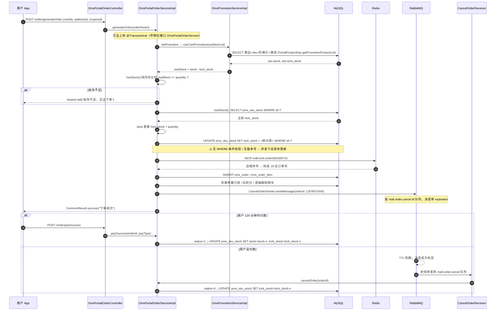
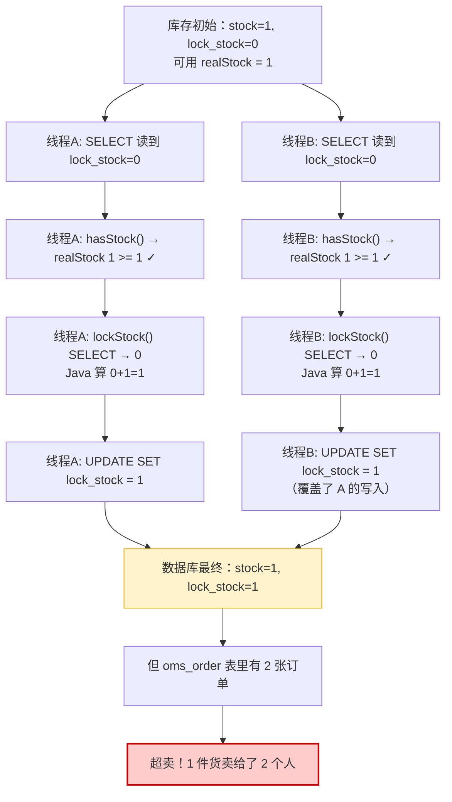

# 《macrozheng/mall》秒杀链路全解（小白版）

> 中文开源圈 star 最高的电商实战项目，一整套「前台商城 + 后台管理」的 Spring Boot 单体电商。
> 仓库地址：https://github.com/macrozheng/mall
> Star 数：约 84.5k
> 最近更新：2026-05-14，提交信息「升级支持Spring Boot 3.5」（commit `0504e86`）
> 技术栈：Spring Boot 3.5 + JDK 17 + MyBatis / MyBatisGenerator + MySQL + Redis + RabbitMQ + Elasticsearch + MongoDB + Spring Security + JWT + Druid + Docker

---

**先给你打一针预防针（这份文档最重要的一句话）：**

> **mall 这个项目里，「限时购 / 秒杀」只是一个「价格牌 + 展示专区」的运营活动，
> 它没有独立的秒杀下单接口，没有 Redis 预减库存，没有 Lua 脚本，没有消息队列削峰，也没有分布式锁。
> 用户抢购走的就是普通的「加购物车 → 提交订单」流程。**

这不是我猜的，是我把仓库整个翻了一遍得出的结论。后面第 5 章我会一行一行地给你看证据，
并且花一大节专门回答你心里那个问题：**「star 最高的项目怎么反而没有秒杀链路？」**

---

## 0. 读之前：先搞懂「秒杀」到底难在哪

先来个生活场景。

假设你是一家奶茶店老板，今天搞活动：**下午 3 点，5 杯 1 元奶茶，先到先得。**

3 点整，门口涌进来 100 个人，全都冲到收银台喊「我要！」。

你只有一个收银员，他手里只有一本账本。现在的问题是：

```
┌──────────────────────────────────────────────────────────────┐
│  100 个人同时喊「我要」                                        │
│                                                              │
│   👤👤👤👤👤👤👤👤👤👤 ... （100 个）                          │
│         │  │  │  │  │                                        │
│         ▼  ▼  ▼  ▼  ▼                                        │
│      ┌────────────────┐                                      │
│      │   收银员（1 个）│  ← 他只有一双手                        │
│      └───────┬────────┘                                      │
│              │                                               │
│              ▼                                               │
│      ┌────────────────┐                                      │
│      │  账本：还剩 5 杯 │  ← 翻页很慢                           │
│      └────────────────┘                                      │
└──────────────────────────────────────────────────────────────┘
```

秒杀的难点，说白了就三件事：

**难点一：卖多了（超卖）**

只有 5 杯，结果卖出去 8 杯。为什么会这样？想象两个收银员同时干活：

```
时间     收银员A                     收银员B
 t1     翻账本：还剩 1 杯 ✓
 t2                                 翻账本：还剩 1 杯 ✓
 t3     写下「卖出 1 杯，剩 0」
 t4                                 写下「卖出 1 杯，剩 0」
        ↓                            ↓
        两个人都认为自己抢到了 → 1 杯卖给了 2 个人 → 超卖！
```

这个「先读、再算、后写」的过程被别人插了一脚，专业名词叫 **竞态条件（Race Condition）**。
生活比喻：**你和室友都看到冰箱里还有一瓶可乐，然后你们同时伸手去拿。**

**难点二：人太多，把系统压垮**

100 个人还好，如果是 10 万个人呢？数据库（MySQL）就像那本厚厚的手写账本 —— 准确，但翻页慢。
10 万个人同时要求翻账本，账本会被撕烂（数据库连接池打满、CPU 100%、超时雪崩）。

**难点三：黄牛**

有人写个脚本，一秒钟点 1000 次，把 5 杯全刷走了。真正的顾客一杯也抢不到。

---

业界成熟的做法，通常是这样一条「专用秒杀链路」：

```
用户点击
   │
   ▼
[限流闸机]  一秒只放 1000 个人进 ────────────► 多余的直接「活动太火爆」打回
   │
   ▼
[Redis 预减库存]  在小白板上划一笔（快 100 倍）
   │  库存不够 → 直接返回「已抢完」
   ▼
[发个 MQ 消息]  给你一张取号小票，你先去座位上等
   │
   ▼
[后台慢慢消费]  一个一个写进 MySQL 账本，落订单
```

**记住这张图**，因为 mall 里面 **一个环节都没有**。它走的是下面这条朴素的路：

```
用户点击 → 直接查 MySQL → 直接改 MySQL → 直接写订单表
```

好，接下来我们从头看这个项目。

---

## 1. 十分钟认识这个项目

### 1.1 它是干什么的

`mall` 是一套**完整的电商系统**，README 里原话是：

> `mall`项目是一套电商系统，包括前台商城系统及后台管理系统，基于SpringBoot+MyBatis实现，采用Docker容器化部署。

它的定位很关键：**它是一个「教学 + 脚手架」性质的全功能电商项目**，
覆盖的是「商品 / 订单 / 会员 / 促销 / 优惠券 / 搜索 / 内容 / 权限」这些**广度**，
而不是「10 万 QPS 秒杀」这种**深度**。

这一点直接解释了它为什么没有专用秒杀链路 —— 后面第 5.6 节详细展开。

它的「限时购」功能在功能菜单里长这样：

```
后台管理系统
└── 促销管理
    ├── 优惠券列表
    ├── 品牌推荐
    └── 秒杀活动列表  ← 这里
        ├── 活动（sms_flash_promotion）：比如「双 11 大促」，有起止日期
        ├── 场次（sms_flash_promotion_session）：比如「10:00-12:00 场」
        └── 商品（sms_flash_promotion_product_relation）：这一场卖哪些商品、卖多少钱
```

### 1.2 技术栈清单（每个组件用一句大白话解释它干嘛）

| 技术 | 一句大白话 | 在 mall 里具体干了啥 |
|------|-----------|---------------------|
| **Spring Boot** | 一个「什么都帮你配好了」的 Java 后端框架，写个类加个注解就能跑起来 | 整个项目的骨架 |
| **MyBatis** | 帮你把 Java 代码和 SQL 语句连起来的胶水。你写 SQL，它负责把结果塞进 Java 对象 | 所有数据库操作 |
| **MyBatisGenerator (MBG)** | 一个代码生成器：给它一张表，它自动吐出「增删改查」的全套代码 | `mall-mbg` 模块里几百个 `XxxMapper` / `XxxExample` 全是它生成的 |
| **MySQL** | 仓库里那本厚厚的手写账本。准确、可靠、断电也不丢，但翻页慢 | 商品、库存、订单、限时购活动，全存这 |
| **Redis** | 收银台旁边的小白板。写字擦字比翻账本快 100 倍，但停电就没了 | ⚠️ 在 mall 里**只**用来：① 生成订单号自增 ② 缓存会员信息 ③ 存短信验证码。**完全没碰库存** |
| **RabbitMQ** | 奶茶店的取号小票机。先发号，后面慢慢做 | ⚠️ 在 mall 里**只**用来做「延迟取消订单」这一件事，不做削峰 |
| **Elasticsearch** | 一个专门做「搜索」的引擎，像图书馆的检索卡片柜 | `mall-search` 模块的商品搜索 |
| **MongoDB** | 一种「不用先定表结构」的数据库，适合存日志类数据 | 存会员浏览记录 |
| **Spring Security + JWT** | 门卫 + 门禁卡。JWT 就是那张卡，上面写着「我是谁、什么时候过期」 | 前后台登录鉴权 |
| **Druid** | 数据库连接池 —— 提前跟数据库拉好 20 条电话线，不用每次现拨号 | `application-dev.yml` 里配了 `max-active: 20` |
| **PageHelper** | 分页插件，自动帮你的 SQL 加 `LIMIT` | 后台各种列表分页 |
| **Docker** | 集装箱。把应用和它的环境打包成一个箱子，搬到哪都能跑 | 部署方式 |

### 1.3 目录结构地图

README 里给的组织结构：

```
mall
├── mall-common -- 工具类及通用代码
├── mall-mbg    -- MyBatisGenerator生成的数据库操作代码
├── mall-security -- SpringSecurity封装公用模块
├── mall-admin  -- 后台商城管理系统接口
├── mall-search -- 基于Elasticsearch的商品搜索系统
├── mall-portal -- 前台商城系统接口
└── mall-demo   -- 框架搭建时的测试代码
```

我们这次要看的东西，按「跟秒杀有关」的角度重画一张地图：

```
┌─────────────────────────────────────────────────────────────────────────┐
│                            mall（单体，多 Maven 模块）                     │
│                                                                         │
│  ┌───────────────────────────┐      ┌──────────────────────────────┐   │
│  │  mall-admin  (端口 8080)   │      │  mall-portal  (端口 8085)     │   │
│  │  【运营后台】               │      │  【用户前台】                   │   │
│  │                           │      │                              │   │
│  │  限时购 CRUD 三兄弟：        │      │  首页秒杀专区：                 │   │
│  │  /flash          活动      │      │  HomeServiceImpl             │   │
│  │  /flashSession   场次      │      │    .getHomeFlashPromotion()  │   │
│  │  /flashProduct   商品关联   │      │                              │   │
│  │    Relation               │      │  下单主链路（重点！）：          │   │
│  │                           │      │  OmsPortalOrderServiceImpl   │   │
│  │  SmsFlashPromotion*       │      │    .generateOrder()          │   │
│  │    ServiceImpl            │      │    .lockStock()   ← 库存在这   │   │
│  │  （纯 CRUD，无任何库存逻辑） │      │    .cancelOrder()            │   │
│  └────────────┬──────────────┘      └───────────┬──────────────────┘   │
│               │                                 │                       │
│               └────────────┬────────────────────┘                       │
│                            ▼                                            │
│              ┌──────────────────────────────┐                           │
│              │  mall-mbg（MBG 生成的 DAO 层） │                           │
│              │  SmsFlashPromotionMapper     │                           │
│              │  PmsSkuStockMapper  ← 库存表  │                           │
│              │  OmsOrderMapper              │                           │
│              └──────────────┬───────────────┘                           │
└─────────────────────────────┼───────────────────────────────────────────┘
                              ▼
        ┌──────────────┐  ┌──────────┐  ┌──────────────┐
        │   MySQL      │  │  Redis   │  │  RabbitMQ    │
        │  （全部数据）  │  │ 订单号自增 │  │ 延迟取消订单  │
        │              │  │ 会员缓存  │  │              │
        │              │  │ 验证码    │  │              │
        └──────────────┘  └──────────┘  └──────────────┘
                             ▲
                             └── 注意：这里没有「库存」两个字
```

**这张图你先记住一个反常识的点：Redis 那个框里没有库存。** 这是全文的核心。

---

## 2. 【主线】一次秒杀请求，从点击到下单的完整链路

### 2.0 先看总图

这是本文的**主链路大图**，后面每一小节都会回到这张图上标出「我们现在走到哪了」。

```
════════════════════════════════════════════════════════════════════════════════
  【阶段一：运营配置】（发生在活动开始前，后台管理系统 mall-admin）
════════════════════════════════════════════════════════════════════════════════

  运营小姐姐打开后台
        │
        ├─ POST /flash/create ──────────────► sms_flash_promotion       （建活动：双11大促，11.1~11.11）
        ├─ POST /flashSession/create ───────► sms_flash_promotion_session（建场次：每天 10:00~12:00）
        └─ POST /flashProductRelation/create► sms_flash_promotion_product_relation
                                                 ├─ flash_promotion_price  限时购价格
                                                 ├─ flash_promotion_count  限时购数量   ⚠️
                                                 └─ flash_promotion_limit  每人限购     ⚠️
                                              （⚠️ = 这两个字段全仓库只被 SELECT 出来展示，
                                                     没有任何一行业务代码去校验或扣减它们）

════════════════════════════════════════════════════════════════════════════════
  【阶段二：用户浏览】（mall-portal）
════════════════════════════════════════════════════════════════════════════════

  用户打开 App 首页
        │
        ▼
  GET /home/content
        │  HomeController.content()
        ▼
  HomeServiceImpl.content()
        │
        └─► getHomeFlashPromotion()
               │
               ├─ getFlashPromotion(now)          查 sms_flash_promotion，status=1 且今天在起止日期内
               ├─ getFlashPromotionSession(now)   查 sms_flash_promotion_session，当前时刻落在场次内
               ├─ getNextFlashPromotionSession()  下一场的开始时间（前端拿来做倒计时）
               └─ homeDao.getFlashProductList()   查这一场的商品列表
                        │
                        ▼
                   HomeDao.xml  <select id="getFlashProductList">
                   （一条普通的 LEFT JOIN，没有缓存、没有 Redis、没有预热）
        │
        ▼
  前端渲染出「限时购专区」+ 倒计时

════════════════════════════════════════════════════════════════════════════════
  【阶段三：用户下单】← 真正的主战场，也是本文的重点
════════════════════════════════════════════════════════════════════════════════

  用户点「立即抢购」
        │
        │  ⚠️ 注意：这里 **没有** 「秒杀下单」接口。
        │     mall 里商品只能先加购物车，再从购物车下单。
        ▼
  POST /cart/add            OmsCartItemController → OmsCartItemServiceImpl.add()
        │                   （只是往 oms_cart_item 插一条记录，不碰库存）
        ▼
  POST /order/generateConfirmOrder    （确认订单页：算个价、列出地址和优惠券）
        │
        ▼
  POST /order/generateOrder ◄══════════════════ 【核心入口】
        │  OmsPortalOrderController.generateOrder(OrderParam)
        ▼
  OmsPortalOrderServiceImpl.generateOrder(orderParam)   【@Transactional】
        │
        ├─(1) 校验收货地址不为空
        │
        ├─(2) cartItemService.listPromotion(memberId, cartIds)
        │        └─► OmsPromotionServiceImpl.calcCartPromotion()
        │               ├─ 一条 SQL 把商品 + sku + 阶梯价 + 满减 全查出来
        │               └─ realStock = sku.stock - sku.lock_stock   ← 【读】
        │                  ⚠️ 这里只处理 promotionType 1/3/4，
        │                     限时购(5) 落到「无优惠」分支！
        │
        ├─(3) 组装 OmsOrderItem 列表
        │
        ├─(4) hasStock(cartPromotionItemList)      ← 【判断】纯内存比较
        │        realStock == null || <= 0 || < quantity  →  Asserts.fail("库存不足，无法下单")
        │
        ├─(5) 优惠券 / 积分计算
        │
        ├─(6) lockStock(cartPromotionItemList)     ← 【写】★★★ 全文最关键的 6 行代码 ★★★
        │        for 每个商品:
        │           skuStock = selectByPrimaryKey(skuId)              -- SELECT
        │           skuStock.lockStock = skuStock.lockStock + qty     -- Java 里加
        │           updateByPrimaryKeySelective(skuStock)             -- UPDATE ... SET lock_stock = 绝对值
        │        ⚠️ 没有 WHERE 条件校验，没有版本号，没有行锁抢占 → 存在丢失更新
        │
        ├─(7) generateOrderSn(order)   ← Redis 在整条链路里唯一登场的地方
        │        redisService.incr("mall:oms:orderId20260731", 1)
        │        订单号 = 8位日期 + 2位来源 + 2位支付方式 + 6位自增
        │
        ├─(8) orderMapper.insert(order)          写 oms_order
        │     orderItemDao.insertList(items)     写 oms_order_item
        │     order.orderType = 0 （硬编码「正常订单」，永远不会是 1「秒杀订单」）
        │
        ├─(9) 优惠券置为已用 / 扣积分 / 删购物车
        │
        └─(10) sendDelayMessageCancelOrder(order.getId())
                 │
                 ▼
              CancelOrderSender.sendMessage(orderId, delayTimes)
                 │  delayTimes = oms_order_setting.normal_order_overtime × 60 × 1000
                 │             = 120 分钟（数据库默认值）
                 ▼
              RabbitMQ  exchange: mall.order.direct.ttl
                        queue:    mall.order.cancel.ttl   （消息带 expiration）

════════════════════════════════════════════════════════════════════════════════
  【阶段四：二选一的结局】
════════════════════════════════════════════════════════════════════════════════

   ┌────────────────────────────┐        ┌───────────────────────────────────┐
   │  A. 用户付款了               │        │  B. 用户没付款，120 分钟到期        │
   │  POST /order/paySuccess    │        │                                   │
   │       │                    │        │  TTL 到期 → 消息变成「死信」        │
   │       ▼                    │        │       │                           │
   │  paySuccess(orderId,type)  │        │       ▼ x-dead-letter-exchange    │
   │   ├ order.status = 1 待发货 │        │  exchange: mall.order.direct      │
   │   └ portalOrderDao          │        │  queue:    mall.order.cancel      │
   │       .updateSkuStock()     │        │       │                           │
   │         UPDATE pms_sku_stock│        │       ▼                           │
   │         SET stock = stock-n │        │  CancelOrderReceiver.handle()     │
   │             lock_stock =    │        │       │                           │
   │                lock_stock-n │        │       ▼                           │
   │   （真实库存扣掉，锁定释放）  │        │  cancelOrder(orderId)             │
   └────────────────────────────┘        │   ├ status=4 已关闭                │
                                          │   ├ releaseSkuStockLock()         │
                                          │   │   UPDATE SET lock_stock =     │
                                          │   │              lock_stock - n   │
                                          │   ├ 优惠券退回                     │
                                          │   └ 积分退回                       │
                                          └───────────────────────────────────┘

   （另有兜底定时任务 OrderTimeOutCancelTask，但 @Component 被注释掉了，默认不生效）
════════════════════════════════════════════════════════════════════════════════
```

同一件事，用 Mermaid 时序图再画一遍（跨系统的消息传递看这张更清楚）：



好，现在一步一步拆。

---

### 2.1 第一步：运营在后台配一场限时购

**发生了什么**

运营在 mall-admin 后台建三样东西：**活动 → 场次 → 商品**。这三张表是父子关系：

```
sms_flash_promotion  「限时购表」
┌──────────────────────────────────────────────┐
│ id       │ 1                                 │
│ title    │ "双11秒杀"        （秒杀时间段名称） │
│ start_date│ 2026-11-01       （开始日期）      │
│ end_date │ 2026-11-11        （结束日期）      │
│ status   │ 1                 （上下线状态）    │
└──────────────────────────────────────────────┘
             │ 注意：这两张表之间 **没有外键关联**
             │       它们靠第三张关系表拼在一起
             ▼
sms_flash_promotion_session  「限时购场次表」
┌──────────────────────────────────────────────┐
│ id        │ 3                                │
│ name      │ "10点场"                          │
│ start_time│ 10:00:00   （注意是 time 类型，只有时分秒）│
│ end_time  │ 12:00:00                          │
│ status    │ 1          （启用状态）            │
└──────────────────────────────────────────────┘
             │
             ▼
sms_flash_promotion_product_relation  「商品限时购与商品关系表」
┌───────────────────────────────────────────────────────────────┐
│ id                          │ 42                              │
│ flash_promotion_id          │ 1     ← 指向活动                 │
│ flash_promotion_session_id  │ 3     ← 指向场次                 │
│ product_id                  │ 27    ← 指向 pms_product        │
│ flash_promotion_price       │ 1.00     限时购价格              │
│ flash_promotion_count       │ 100      限时购数量  ⚠️ 没人用    │
│ flash_promotion_limit       │ 1        每人限购数量 ⚠️ 没人用    │
│ sort                        │ 0                               │
└───────────────────────────────────────────────────────────────┘
```

**对应代码在哪**

- `mall-admin/src/main/java/com/macro/mall/controller/SmsFlashPromotionController.java`（`@RequestMapping("/flash")`）
- `mall-admin/src/main/java/com/macro/mall/controller/SmsFlashPromotionSessionController.java`（`@RequestMapping("/flashSession")`）
- `mall-admin/src/main/java/com/macro/mall/controller/SmsFlashPromotionProductRelationController.java`（`@RequestMapping("/flashProductRelation")`）
- 三个 `ServiceImpl` 在 `mall-admin/src/main/java/com/macro/mall/service/impl/` 下

**代码怎么写的**

`SmsFlashPromotionServiceImpl` 全文只有 6 个方法，全是最朴素的 CRUD：

```java
// mall-admin/.../service/impl/SmsFlashPromotionServiceImpl.java
@Override
public int create(SmsFlashPromotion flashPromotion) {
    flashPromotion.setCreateTime(new Date());
    return flashPromotionMapper.insert(flashPromotion);
}

@Override
public int updateStatus(Long id, Integer status) {
    SmsFlashPromotion flashPromotion = new SmsFlashPromotion();
    flashPromotion.setId(id);
    flashPromotion.setStatus(status);
    return flashPromotionMapper.updateByPrimaryKeySelective(flashPromotion);
}
// ... 剩下的 delete / getItem / list 同理
```

`SmsFlashPromotionProductRelationServiceImpl.create()` 甚至是个 for 循环单条插入：

```java
@Override
public int create(List<SmsFlashPromotionProductRelation> relationList) {
    for (SmsFlashPromotionProductRelation relation : relationList) {
        relationMapper.insert(relation);
    }
    return relationList.size();
}
```

**这里就要说一句大实话了**：

> 我在整个仓库里搜索 `flashPromotionCount` 和 `flashPromotionLimit` 这两个字段。
> 结果：除了 MBG 自动生成的 `SmsFlashPromotionProductRelationExample.java`（那是「查询条件构造器」，是模板生成的死代码），
> 以及两条把它们 `SELECT` 出来给前端展示的 SQL 之外，**没有任何一行业务代码读取或修改它们**。
>
> 也就是说：「限时购数量 100 件」「每人限购 1 件」这两个字段，**只是页面上的两个数字**。
> 你抢 200 件、同一个人抢 50 次，后端一句话都不会说。

**为什么这么设计 / 小白比喻**

就像奶茶店门口贴了张海报：「1 元奶茶，限量 5 杯，每人限购 1 杯」。
海报贴得很漂亮，但**店里的收银员根本没看过这张海报**，他只按正常流程收钱做奶茶。
海报是给顾客看的，不是给收银员执行的。

---

### 2.2 第二步：首页拉取秒杀专区

**发生了什么**

用户打开 App，前端调 `GET /home/content`，一次性拿回首页所有内容，其中就包括「当前秒杀场次」。

**对应代码在哪**

- `mall-portal/src/main/java/com/macro/mall/portal/controller/HomeController.java` → `content()`
- `mall-portal/src/main/java/com/macro/mall/portal/service/impl/HomeServiceImpl.java` → `content()` / `getHomeFlashPromotion()`
- `mall-portal/src/main/java/com/macro/mall/portal/dao/HomeDao.java` + `mall-portal/src/main/resources/dao/HomeDao.xml`
- 返回结构：`mall-portal/.../domain/HomeFlashPromotion.java` + `FlashPromotionProduct.java`

**代码怎么写的**

```java
// HomeServiceImpl.java
private HomeFlashPromotion getHomeFlashPromotion() {
    HomeFlashPromotion homeFlashPromotion = new HomeFlashPromotion();
    //获取当前秒杀活动
    Date now = new Date();
    SmsFlashPromotion flashPromotion = getFlashPromotion(now);
    if (flashPromotion != null) {
        //获取当前秒杀场次
        SmsFlashPromotionSession flashPromotionSession = getFlashPromotionSession(now);
        if (flashPromotionSession != null) {
            homeFlashPromotion.setStartTime(flashPromotionSession.getStartTime());
            homeFlashPromotion.setEndTime(flashPromotionSession.getEndTime());
            //获取下一个秒杀场次
            SmsFlashPromotionSession nextSession = getNextFlashPromotionSession(homeFlashPromotion.getStartTime());
            if(nextSession!=null){
                homeFlashPromotion.setNextStartTime(nextSession.getStartTime());
                homeFlashPromotion.setNextEndTime(nextSession.getEndTime());
            }
            //获取秒杀商品
            List<FlashPromotionProduct> flashProductList =
                homeDao.getFlashProductList(flashPromotion.getId(), flashPromotionSession.getId());
            homeFlashPromotion.setProductList(flashProductList);
        }
    }
    return homeFlashPromotion;
}
```

「怎么判断现在是不是在活动期内」也很朴素，就是两条 `Example` 条件查询：

```java
//根据时间获取秒杀活动
private SmsFlashPromotion getFlashPromotion(Date date) {
    Date currDate = DateUtil.getDate(date);          // 把时分秒抹成 00:00:00，只留日期
    SmsFlashPromotionExample example = new SmsFlashPromotionExample();
    example.createCriteria()
            .andStatusEqualTo(1)
            .andStartDateLessThanOrEqualTo(currDate)
            .andEndDateGreaterThanOrEqualTo(currDate);
    // ...
}

//根据时间获取秒杀场次
private SmsFlashPromotionSession getFlashPromotionSession(Date date) {
    Date currTime = DateUtil.getTime(date);          // 把年月日抹成 1970-01-01，只留时分秒
    SmsFlashPromotionSessionExample sessionExample = new SmsFlashPromotionSessionExample();
    sessionExample.createCriteria()
            .andStartTimeLessThanOrEqualTo(currTime)
            .andEndTimeGreaterThanOrEqualTo(currTime);
    // ...
}
```

`DateUtil` 里那两个「抹掉一半」的小工具（`mall-portal/.../util/DateUtil.java`）：

```java
public static Date getDate(Date date) {   // 只留日期
    Calendar calendar = Calendar.getInstance();
    calendar.setTime(date);
    calendar.set(Calendar.HOUR_OF_DAY, 0);
    calendar.set(Calendar.MINUTE, 0);
    calendar.set(Calendar.SECOND, 0);
    return calendar.getTime();
}
public static Date getTime(Date date) {   // 只留时间
    Calendar calendar = Calendar.getInstance();
    calendar.setTime(date);
    calendar.set(Calendar.YEAR, 1970);
    calendar.set(Calendar.MONTH, 0);
    calendar.set(Calendar.DAY_OF_MONTH, 1);
    return calendar.getTime();
}
```

商品列表的 SQL（`HomeDao.xml`）：

```xml
<select id="getFlashProductList" resultMap="flashPromotionProduct">
    SELECT
        pr.flash_promotion_price,
        pr.flash_promotion_count,
        pr.flash_promotion_limit,
        p.*
    FROM
        sms_flash_promotion_product_relation pr
        LEFT JOIN pms_product p ON pr.product_id = p.id
    WHERE
        pr.flash_promotion_id = #{flashPromotionId}
        AND pr.flash_promotion_session_id = #{sessionId}
</select>
```

**这里要注意三件事：**

1. **一次首页请求 = 至少 4~6 条 MySQL 查询**（广告、品牌、秒杀活动、秒杀场次、下一场次、秒杀商品、新品、人气、专题）。
   `content()` 方法里九个方法一个接一个串行调用，**没有任何缓存**。
2. **没有「缓存预热」**。业界秒杀的标准动作是活动开始前把商品数据搬到 Redis 里，mall 这里每次都是现查 MySQL。
3. `getFlashProductList` 返回的 `flash_promotion_count` 是**配置值**，不是**剩余值**。页面上显示不出「还剩几件」，因为根本没有一个「已抢数量」字段。

**小白比喻**：奶茶店没有做「预告板」。每个进店的顾客问「今天有啥活动」，
店员都要跑到后仓翻一遍账本，再跑回来告诉你。100 个顾客就跑 100 趟。

---

### 2.3 第三步：用户点「立即抢购」→ 其实是加入购物车

**发生了什么**

这一步是本文第二个反常识点：**mall 里没有「秒杀下单」接口**。

我把 `mall-portal` 的 13 个 Controller 全列出来看过了，跟订单有关的只有 `OmsPortalOrderController`，
它的接口清单是：`generateConfirmOrder` / `generateOrder` / `paySuccess` / `cancelTimeOutOrder` /
`cancelOrder` / `list` / `detail` / `cancelUserOrder` / `confirmReceiveOrder` / `deleteOrder`。

**没有 `seckill`、没有 `flashOrder`、没有 `killOrder`。**

所以用户想买限时购商品，只能走跟买普通商品**一模一样**的路：

```
   点「立即抢购」
        │
        ▼
   POST /cart/add                     ← OmsCartItemController
        │  OmsCartItemServiceImpl.add(cartItem)
        │  ├─ 查一下购物车里有没有同款
        │  ├─ 有 → quantity 累加，updateByPrimaryKey
        │  └─ 没有 → insert 一条 oms_cart_item
        │
        │  ⚠️ 全程不碰 pms_sku_stock，不校验库存，不校验限购
        ▼
   购物车列表页
        │
        ▼
   勾选商品 → 「去结算」
```

**对应代码在哪**

`mall-portal/src/main/java/com/macro/mall/portal/service/impl/OmsCartItemServiceImpl.java`：

```java
@Override
public int add(OmsCartItem cartItem) {
    int count;
    UmsMember currentMember = memberService.getCurrentMember();
    cartItem.setMemberId(currentMember.getId());
    cartItem.setMemberNickname(currentMember.getNickname());
    cartItem.setDeleteStatus(0);
    OmsCartItem existCartItem = getCartItem(cartItem);
    if (existCartItem == null) {
        cartItem.setCreateDate(new Date());
        count = cartItemMapper.insert(cartItem);
    } else {
        cartItem.setModifyDate(new Date());
        existCartItem.setQuantity(existCartItem.getQuantity() + cartItem.getQuantity());
        count = cartItemMapper.updateByPrimaryKey(existCartItem);
    }
    return count;
}
```

**为什么这很重要**

真实的秒杀之所以要单独做一个接口，就是因为要在这一步拦掉 99% 的流量。
mall 把秒杀商品当普通商品处理，意味着**所有的压力全部原封不动地压到了下单接口和 MySQL 上**。

---

### 2.4 第四步：确认订单页

**发生了什么**

用户在购物车勾选商品点「去结算」，前端调 `POST /order/generateConfirmOrder`，传一串 `cartIds`。
后端把「商品明细 + 收货地址列表 + 可用优惠券 + 我的积分 + 积分规则 + 总价」一次性算好返回。

**对应代码在哪**

`OmsPortalOrderServiceImpl.generateConfirmOrder(List<Long> cartIds)`：

```java
@Override
public ConfirmOrderResult generateConfirmOrder(List<Long> cartIds) {
    ConfirmOrderResult result = new ConfirmOrderResult();
    //获取购物车信息
    UmsMember currentMember = memberService.getCurrentMember();
    List<CartPromotionItem> cartPromotionItemList = cartItemService.listPromotion(currentMember.getId(),cartIds);
    result.setCartPromotionItemList(cartPromotionItemList);
    //获取用户收货地址列表
    List<UmsMemberReceiveAddress> memberReceiveAddressList = memberReceiveAddressService.list();
    result.setMemberReceiveAddressList(memberReceiveAddressList);
    //获取用户可用优惠券列表
    List<SmsCouponHistoryDetail> couponHistoryDetailList = memberCouponService.listCart(cartPromotionItemList, 1);
    result.setCouponHistoryDetailList(couponHistoryDetailList);
    // ... 积分、积分规则、总金额
    return result;
}
```

**这一步纯读，不锁库存、不占坑。** 也就是说：确认单页面上写着「有货」，
等你磨蹭 5 分钟点提交的时候，货可能早没了 —— 这是完全正常的电商设计，不算 bug。

---

### 2.5 第五步：提交订单 —— 真正的主战场

**发生了什么**

`POST /order/generateOrder`，进入 `OmsPortalOrderServiceImpl.generateOrder()`。
这是全文最重要的方法，157 行，从校验一路干到发 MQ 消息。

**对应代码在哪**

`mall-portal/src/main/java/com/macro/mall/portal/service/impl/OmsPortalOrderServiceImpl.java` 第 93~250 行。

事务注解声明在**接口**上（`mall-portal/.../service/OmsPortalOrderService.java`）：

```java
/**
 * 根据提交信息生成订单
 */
@Transactional
Map<String, Object> generateOrder(OrderParam orderParam);
```

`@Transactional` 是什么？**大白话：一组操作要么全成功，要么全失败，中间出错就整体撤销。**
生活比喻：**转账时「你扣 100」和「我加 100」必须捆在一起，不能只做一半。**

**方法的骨架（我按顺序给你标了序号，这就是主链路的第 (1)~(10) 步）：**

```java
@Override
public Map<String, Object> generateOrder(OrderParam orderParam) {
    List<OmsOrderItem> orderItemList = new ArrayList<>();
    // (1) 校验收货地址
    if(orderParam.getMemberReceiveAddressId()==null){
        Asserts.fail("请选择收货地址！");
    }
    // (2) 获取购物车及优惠信息
    UmsMember currentMember = memberService.getCurrentMember();
    List<CartPromotionItem> cartPromotionItemList =
        cartItemService.listPromotion(currentMember.getId(), orderParam.getCartIds());
    // (3) 组装 OmsOrderItem
    for (CartPromotionItem cartPromotionItem : cartPromotionItemList) {
        OmsOrderItem orderItem = new OmsOrderItem();
        orderItem.setProductId(cartPromotionItem.getProductId());
        orderItem.setProductPrice(cartPromotionItem.getPrice());     // ← 价格从这来
        orderItem.setProductQuantity(cartPromotionItem.getQuantity());
        // ... 其他字段
        orderItemList.add(orderItem);
    }
    // (4) 判断购物车中商品是否都有库存
    if (!hasStock(cartPromotionItemList)) {
        Asserts.fail("库存不足，无法下单");
    }
    // (5) 优惠券 / 积分
    // ...
    //计算order_item的实付金额
    handleRealAmount(orderItemList);
    // (6) 进行库存锁定
    lockStock(cartPromotionItemList);
    // ... 算总价、组装 OmsOrder
    order.setOrderType(0);                        // ← 硬编码「正常订单」
    // (7) 生成订单号
    order.setOrderSn(generateOrderSn(order));
    // (8) 插入order表和order_item表
    orderMapper.insert(order);
    orderItemDao.insertList(orderItemList);
    // (9) 优惠券 / 积分 / 删购物车
    deleteCartItemList(cartPromotionItemList, currentMember);
    // (10) 发送延迟消息取消订单
    sendDelayMessageCancelOrder(order.getId());
    // ...
}
```

**先注意一个细节：`order.setOrderType(0)` 是写死的。**

```java
//订单类型：0->正常订单；1->秒杀订单
order.setOrderType(0);
```

数据模型里明明留了「1 = 秒杀订单」这个枚举值（见 `OmsOrder.java` 的 `@Schema(title = "订单类型：0->正常订单；1->秒杀订单")`），
`oms_order_setting` 表里也留了 `flash_order_overtime`（秒杀订单超时关闭时间，默认 60 分钟）这个字段，
**但整个仓库里没有任何一行代码会把 orderType 设成 1，也没有任何一行代码读取 flashOrderOvertime。**

这是典型的「**设计上预留了，实现上没做**」。

---

### 2.6 第六步：判断库存 hasStock()

**发生了什么**

在真正改数据之前，先看一眼「够不够」。

**对应代码在哪**

`OmsPortalOrderServiceImpl` 第 738 行：

```java
/**
 * 判断下单商品是否都有库存
 */
private boolean hasStock(List<CartPromotionItem> cartPromotionItemList) {
    for (CartPromotionItem cartPromotionItem : cartPromotionItemList) {
        if (cartPromotionItem.getRealStock()==null //判断真实库存是否为空
                ||cartPromotionItem.getRealStock() <= 0 //判断真实库存是否小于0
                || cartPromotionItem.getRealStock() < cartPromotionItem.getQuantity()) //判断真实库存是否小于下单的数量
        {
            return false;
        }
    }
    return true;
}
```

**关键问题：`realStock` 是从哪来的？**

它是在第 (2) 步 `cartItemService.listPromotion()` 里就已经算好、装进 Java 对象里的：

```java
// OmsPromotionServiceImpl.java（这一行在文件里出现了 4 次，四个促销分支各一次）
cartPromotionItem.setRealStock(skuStock.getStock() - skuStock.getLockStock());
```

数据来源是 `PortalProductDao.xml` 里那条 `getPromotionProductList` 查询：

```xml
sku.stock sku_stock,
sku.lock_stock sku_lock_stock,
```

**所以 `hasStock()` 比较的是「几十毫秒之前从数据库读出来的、现在放在 JVM 内存里的一个数字」。**

画成图：

```
   t0                t1                 t2                t3
   │                 │                  │                 │
   ├─ SELECT ────────┤                  │                 │
   │  读到 stock=5    │                  │                 │
   │  lock_stock=0    │                  │                 │
   │  realStock=5     │                  │                 │
   │                 │  ← 这段时间里，别人可能已经抢光了 →  │
   │                 │  优惠券计算、积分计算、金额分摊...    │
   │                 │                  │                 │
   │                 │                  ├─ hasStock() 判断 │
   │                 │                  │  拿的还是 t0 的 5 │
   │                 │                  │                 │
   │                 │                  │                 ├─ lockStock() 直接写
   ▼                 ▼                  ▼                 ▼
```

这就是所谓的 **TOCTOU（Time-Of-Check to Time-Of-Use）问题**：
**检查的那一刻和使用的那一刻，中间隔了一段时间，世界已经变了。**

小白比喻：**你在网上查到「某某餐厅还有空位」，开车 40 分钟过去，位子早满了。**

---

### 2.7 第七步：锁库存 lockStock() ★★★

这是全文最重要的 6 行代码。请慢慢看。

**发生了什么**

把「锁定库存」这个数字加上你买的数量。这样别人再来算 `realStock = stock - lock_stock` 的时候，
就会发现可用的少了。**这就是 mall 防超卖的全部手段。**

**对应代码在哪**

`OmsPortalOrderServiceImpl.java` 第 724~733 行：

```java
/**
 * 锁定下单商品的所有库存
 */
private void lockStock(List<CartPromotionItem> cartPromotionItemList) {
    for (CartPromotionItem cartPromotionItem : cartPromotionItemList) {
        PmsSkuStock skuStock = skuStockMapper.selectByPrimaryKey(cartPromotionItem.getProductSkuId());
        skuStock.setLockStock(skuStock.getLockStock() + cartPromotionItem.getQuantity());
        skuStockMapper.updateByPrimaryKeySelective(skuStock);
    }
}
```

**代码怎么写的 —— 逐行翻译**

```
第 1 行：selectByPrimaryKey(skuId)
        ↓ 生成 SQL
        SELECT id, product_id, sku_code, price, stock, low_stock, pic, sale,
               promotion_price, lock_stock, sp_data
        FROM pms_sku_stock WHERE id = ?
        ↓
        把 lock_stock 的当前值（比如 0）读到 Java 内存里

第 2 行：skuStock.setLockStock(skuStock.getLockStock() + quantity)
        ↓ 这是纯 Java 运算，跟数据库没关系
        0 + 1 = 1

第 3 行：updateByPrimaryKeySelective(skuStock)
        ↓ 生成 SQL（见 mall-mbg/.../PmsSkuStockMapper.xml 第 283~285 行）
        UPDATE pms_sku_stock
        SET product_id = ?, sku_code = ?, price = ?, stock = ?, ...,
            lock_stock = 1,          ←←← 注意！这是一个「绝对值」，不是 lock_stock+1
            ...
        WHERE id = ?
```

MBG 生成的那段 XML 原文（`mall-mbg/src/main/resources/com/macro/mall/mapper/PmsSkuStockMapper.xml`）：

```xml
      <if test="lockStock != null">
        lock_stock = #{lockStock,jdbcType=INTEGER},
      </if>
    </set>
    where id = #{id,jdbcType=BIGINT}
```

**这里必须澄清一个常见的误解。**

很多讲 mall 的文章会说：「它靠 `UPDATE ... WHERE stock - lock_stock >= num` 这种条件更新来防超卖」。

**我在这个仓库里全文搜索过 `lock_stock` 的所有出现位置，可以负责任地告诉你：这句 SQL 不存在。**

真实情况是：

| 操作 | 位置 | SQL 形态 | 是否原子 |
|------|------|---------|---------|
| **锁库存** `lockStock()` | `OmsPortalOrderServiceImpl` 用 MBG 的 `updateByPrimaryKeySelective` | `SET lock_stock = <Java算好的绝对值>` | ❌ 读-算-写三步分离，**不原子** |
| **支付成功扣真实库存** `updateSkuStock` | `mall-portal/src/main/resources/dao/PortalOrderDao.xml` | `SET stock = stock - n, lock_stock = lock_stock - n` | ✅ 单条 SQL 相对更新，原子 |
| **取消订单释放锁定** `releaseSkuStockLock` | 同上 XML | `SET lock_stock = lock_stock - n` | ✅ 单条 SQL 相对更新，原子 |

**你看出问题了吗？释放的时候用了原子的 `lock_stock - n`，唯一需要防并发的「锁定」环节反而用了不原子的绝对值赋值。**

这意味着并发下会发生「**丢失更新（Lost Update）**」：

```
════════════════ 两个用户同时抢最后一件商品（stock=1, lock_stock=0）════════════════

  时刻   用户A 的线程                          用户B 的线程                  数据库里的 lock_stock
  ────────────────────────────────────────────────────────────────────────────────
   t1   listPromotion:                                                          0
        realStock = 1 - 0 = 1

   t2                                        listPromotion:                     0
                                             realStock = 1 - 0 = 1

   t3   hasStock(): 1 >= 1  ✓ 通过                                              0

   t4                                        hasStock(): 1 >= 1  ✓ 通过         0

   t5   lockStock():
        SELECT → lock_stock = 0                                                 0

   t6                                        lockStock():
                                             SELECT → lock_stock = 0            0

   t7   Java: 0 + 1 = 1
        UPDATE SET lock_stock = 1  ───────────────────────────────────────►     1

   t8                                        Java: 0 + 1 = 1
                                             UPDATE SET lock_stock = 1 ────►    1   ⚠️
                                             （把 A 的结果覆盖掉了！）

   t9   INSERT 订单 A ✓                                                          1
  t10                                        INSERT 订单 B ✓                     1

  结果：stock=1，lock_stock=1，但是出了 2 张订单。
        两个人都收到「下单成功」。→ 超卖！
════════════════════════════════════════════════════════════════════════════════
```

**「那 @Transactional 不是能救吗？」**

不能。这是个很多人搞错的地方。`@Transactional` 保证的是**原子性**（要么全做要么全不做），
不保证**隔离性到「串行化」级别**。MySQL InnoDB 默认的隔离级别是 **可重复读（REPEATABLE READ）**：

- `SELECT ... FROM pms_sku_stock WHERE id = ?` 是**快照读**，**不加任何锁**，两个事务可以同时读到 0。
- `UPDATE` 时才加行锁，但那时候 Java 里的 `1` 这个值早就算好了，行锁只是让两条 UPDATE 排队执行，
  **排队执行两条「SET lock_stock = 1」，结果还是 1。**

要让 `SELECT` 也加锁，必须写成 `SELECT ... FOR UPDATE`（悲观锁）。**mall 里没有。**

小白比喻：
**`@Transactional` 像是「这几件事我打包一起做」，但它不阻止别人在你打包的时候也伸手拿同一个东西。
真正的锁是「厕所门上那把插销」—— 你得主动把它插上。mall 没插。**

---

### 2.8 第八步：生成订单号 —— Redis 唯一登场的地方

**发生了什么**

生成一个 18 位的订单号：`8位日期 + 2位来源 + 2位支付方式 + 6位以上自增`。

**对应代码在哪**

`OmsPortalOrderServiceImpl.generateOrderSn()`：

```java
/**
 * 生成18位订单编号:8位日期+2位平台号码+2位支付方式+6位以上自增id
 */
private String generateOrderSn(OmsOrder order) {
    StringBuilder sb = new StringBuilder();
    String date = new SimpleDateFormat("yyyyMMdd").format(new Date());
    String key = REDIS_DATABASE+":"+ REDIS_KEY_ORDER_ID + date;
    Long increment = redisService.incr(key, 1);
    sb.append(date);
    sb.append(String.format("%02d", order.getSourceType()));
    sb.append(String.format("%02d", order.getPayType()));
    String incrementStr = increment.toString();
    if (incrementStr.length() <= 6) {
        sb.append(String.format("%06d", increment));
    } else {
        sb.append(incrementStr);
    }
    return sb.toString();
}
```

key 的拼法来自 `mall-portal/src/main/resources/application.yml`：

```yaml
# 自定义redis key
redis:
  database: mall
  key:
    authCode: 'ums:authCode'
    orderId: 'oms:orderId'
    member: 'ums:member'
```

所以真实的 key 长这样：`mall:oms:orderId20260731`

**这里有意思的地方**

`redisService.incr()` 底层是 Redis 的 `INCR` 命令，**它是原子的**。
也就是说：**mall 是知道「Redis 原子自增」这个能力的，也确实用上了 —— 但只用在了订单号上，没用在库存上。**

```
┌────────────────────────────────────────────────────────────────┐
│  Redis 在 mall 里的全部用途                                      │
├────────────────────────────────────────────────────────────────┤
│  ① mall:oms:orderId20260731        INCR    → 订单号自增          │
│     （OmsPortalOrderServiceImpl.generateOrderSn）               │
│                                                                │
│  ② mall:ums:member:{username}      SET/GET → 会员信息缓存        │
│     （UmsMemberCacheServiceImpl.setMember / getMember）         │
│                                                                │
│  ③ mall:ums:authCode:{telephone}   SET/GET → 短信验证码（90秒）   │
│     （UmsMemberCacheServiceImpl.setAuthCode / getAuthCode）     │
├────────────────────────────────────────────────────────────────┤
│  ❌ 没有 stock 相关的 key                                        │
│  ❌ 没有 DECR / DECRBY 预减库存                                  │
│  ❌ 没有 Lua 脚本（全仓库没有 .lua 文件，没有 DefaultRedisScript）│
│  ❌ 没有 Redisson / 分布式锁                                     │
└────────────────────────────────────────────────────────────────┘
```

`RedisService` 接口本身（`mall-common/src/main/java/com/macro/mall/common/service/RedisService.java`）
倒是提供了 `incr` / `decr` / `hSet` / `sAdd` / `lPush` 一整套方法 —— 工具都在，只是没往库存上用。

---

### 2.9 第九步：订单落库 + 清购物车

```java
// TODO: 2018/9/3 bill_*,delivery_*
//插入order表和order_item表
orderMapper.insert(order);
for (OmsOrderItem orderItem : orderItemList) {
    orderItem.setOrderId(order.getId());
    orderItem.setOrderSn(order.getOrderSn());
}
orderItemDao.insertList(orderItemList);
//如使用优惠券更新优惠券使用状态
if (orderParam.getCouponId() != null) {
    updateCouponStatus(orderParam.getCouponId(), currentMember.getId(), 1);
}
//如使用积分需要扣除积分
if (orderParam.getUseIntegration() != null) {
    order.setUseIntegration(orderParam.getUseIntegration());
    if(currentMember.getIntegration()==null){
        currentMember.setIntegration(0);
    }
    memberService.updateIntegration(currentMember.getId(),
        currentMember.getIntegration() - orderParam.getUseIntegration());
}
//删除购物车中的下单商品
deleteCartItemList(cartPromotionItemList, currentMember);
```

删购物车是**逻辑删除**（`OmsCartItemServiceImpl.delete()` 把 `delete_status` 置 1），不是物理删除。

顺带一提，扣积分那行 `currentMember.getIntegration() - orderParam.getUseIntegration()` 也是
「读出来 - 在 Java 里减 - 写回去」的模式，跟 `lockStock` 一个毛病。

---

### 2.10 第十步：发一颗「延迟炸弹」到 RabbitMQ

**发生了什么**

订单建好了，状态是 0（待付款）。但库存已经被锁住了。
如果用户一直不付款，这部分库存就永远被占着 —— 所以要有个机制：**「N 分钟后如果还没付，就自动取消，把库存还回去」**。

mall 用的是 RabbitMQ 的 **TTL + 死信队列（DLX）** 组合。

**对应代码在哪**

- `mall-portal/src/main/java/com/macro/mall/portal/component/CancelOrderSender.java`（发送者）
- `mall-portal/src/main/java/com/macro/mall/portal/component/CancelOrderReceiver.java`（接收者）
- `mall-portal/src/main/java/com/macro/mall/portal/config/RabbitMqConfig.java`（队列/交换机配置）
- `mall-portal/src/main/java/com/macro/mall/portal/domain/QueueEnum.java`（名字常量）

**这套机制的原理，先讲人话**

RabbitMQ 本身**不支持**「这条消息 10 分钟后再给我」。但它支持两个特性：

1. **TTL（存活时间）**：消息可以设置「保质期」，过期就作废。
2. **死信队列（DLX）**：一条消息「作废」之后，不是扔掉，而是转发到另一个指定的地方去。

把这两个一组合，就模拟出了「延迟队列」：

```
┌──────────────────────────────────────────────────────────────────────────────┐
│                       RabbitMQ TTL + 死信 = 延迟队列                           │
│                                                                              │
│   CancelOrderSender.sendMessage(orderId, 7200000ms)                          │
│           │                                                                  │
│           │  message.getMessageProperties().setExpiration("7200000")         │
│           ▼                                                                  │
│   ┌───────────────────────────┐                                              │
│   │ Exchange:                 │                                              │
│   │   mall.order.direct.ttl   │  ← QueueEnum.QUEUE_TTL_ORDER_CANCEL.exchange│
│   └───────────┬───────────────┘                                              │
│               │ routeKey: mall.order.cancel.ttl                              │
│               ▼                                                              │
│   ┌───────────────────────────────────────────────┐                          │
│   │ Queue: mall.order.cancel.ttl                  │                          │
│   │                                               │                          │
│   │  ⚠️ 这个队列 **没有任何消费者监听**              │                          │
│   │     消息只能躺在里面等死                        │                          │
│   │                                               │                          │
│   │  队列参数（RabbitMqConfig.orderTtlQueue）:      │                          │
│   │   x-dead-letter-exchange    = mall.order.direct│                         │
│   │   x-dead-letter-routing-key = mall.order.cancel│                         │
│   └───────────────────┬───────────────────────────┘                          │
│                       │                                                      │
│                       │  ⏰ 120 分钟后，TTL 到期，消息「死亡」                  │
│                       │     RabbitMQ 按上面两个参数把「尸体」转发出去           │
│                       ▼                                                      │
│   ┌───────────────────────────┐                                              │
│   │ Exchange:                 │                                              │
│   │   mall.order.direct       │                                              │
│   └───────────┬───────────────┘                                              │
│               │ routeKey: mall.order.cancel                                  │
│               ▼                                                              │
│   ┌───────────────────────────────────────────────┐                          │
│   │ Queue: mall.order.cancel                      │                          │
│   │  ✅ 这个队列有消费者！                           │                          │
│   │  @RabbitListener(queues = "mall.order.cancel")│                          │
│   │  CancelOrderReceiver.handle(orderId)          │                          │
│   └───────────────────┬───────────────────────────┘                          │
│                       ▼                                                      │
│          portalOrderService.cancelOrder(orderId)                             │
└──────────────────────────────────────────────────────────────────────────────┘
```

**代码怎么写的**

发送端：

```java
// CancelOrderSender.java
public void sendMessage(Long orderId, final long delayTimes){
    //给延迟队列发送消息
    amqpTemplate.convertAndSend(QueueEnum.QUEUE_TTL_ORDER_CANCEL.getExchange(),
                                QueueEnum.QUEUE_TTL_ORDER_CANCEL.getRouteKey(),
                                orderId,
                                new MessagePostProcessor() {
        @Override
        public Message postProcessMessage(Message message) throws AmqpException {
            //给消息设置延迟毫秒值
            message.getMessageProperties().setExpiration(String.valueOf(delayTimes));
            return message;
        }
    });
    LOGGER.info("send orderId:{}", orderId);
}
```

延迟时长哪来的（`OmsPortalOrderServiceImpl`）：

```java
@Override
public void sendDelayMessageCancelOrder(Long orderId) {
    //获取订单超时时间
    OmsOrderSetting orderSetting = orderSettingMapper.selectByPrimaryKey(1L);
    long delayTimes = orderSetting.getNormalOrderOvertime() * 60 * 1000;
    //发送延迟消息
    cancelOrderSender.sendMessage(orderId, delayTimes);
}
```

数据库里 `oms_order_setting` 的初始数据（`document/sql/mall.sql` 第 848 行）：

```sql
INSERT INTO `oms_order_setting` VALUES (1, 60, 120, 15, 7, 7);
--                                        ↑   ↑
--                    flash_order_overtime=60  normal_order_overtime=120
--                    （秒杀订单超时，没人用）   （正常订单超时，实际用的是这个）
```

⚠️ 又一次印证：**`flash_order_overtime`（秒杀订单 60 分钟超时）这个字段配了，但代码里读的永远是 `normal_order_overtime`。**

队列配置（`RabbitMqConfig.java`）：

```java
/**
 * 订单延迟队列（死信队列）
 */
@Bean
public Queue orderTtlQueue() {
    return QueueBuilder
            .durable(QueueEnum.QUEUE_TTL_ORDER_CANCEL.getName())
            .withArgument("x-dead-letter-exchange", QueueEnum.QUEUE_ORDER_CANCEL.getExchange())//到期后转发的交换机
            .withArgument("x-dead-letter-routing-key", QueueEnum.QUEUE_ORDER_CANCEL.getRouteKey())//到期后转发的路由键
            .build();
}
```

名字常量（`QueueEnum.java`）：

```java
public enum QueueEnum {
    /**
     * 消息通知队列
     */
    QUEUE_ORDER_CANCEL("mall.order.direct", "mall.order.cancel", "mall.order.cancel"),
    /**
     * 消息通知ttl队列
     */
    QUEUE_TTL_ORDER_CANCEL("mall.order.direct.ttl", "mall.order.cancel.ttl", "mall.order.cancel.ttl");
    // 三个参数依次是：exchange、name（队列名）、routeKey
}
```

**这套设计有个已知的坑（值得你知道）**

RabbitMQ 的 TTL 队列是**队头阻塞**的：它只检查队首那条消息有没有过期。
如果队首是一条延迟 120 分钟的消息，后面跟着一条延迟 1 分钟的消息，
那么**后面那条要等 120 分钟后才会被处理**。

在 mall 里因为所有订单的延迟时间都一样（都读同一条 `oms_order_setting`），所以刚好不会踩到这个坑。
但如果哪天你想给秒杀订单设 60 分钟、普通订单设 120 分钟（数据库里本来就是这么配的！），这个坑立刻就会出现。
正确做法是用 `rabbitmq-delayed-message-exchange` 插件。

小白比喻：**这个 TTL 队列像一根只有一个出口的水管，前面的球不出来，后面的球就卡着。**

---

### 2.11 分支 A：用户付款了 → paySuccess()

```java
@Override
public Integer paySuccess(Long orderId, Integer payType) {
    //修改订单支付状态
    OmsOrder order = new OmsOrder();
    order.setId(orderId);
    order.setStatus(1);
    order.setPaymentTime(new Date());
    order.setPayType(payType);
    orderMapper.updateByPrimaryKeySelective(order);
    //恢复所有下单商品的锁定库存，扣减真实库存
    OmsOrderDetail orderDetail = portalOrderDao.getDetail(orderId);
    int count = portalOrderDao.updateSkuStock(orderDetail.getOrderItemList());
    return count;
}
```

`updateSkuStock` 的 SQL（`mall-portal/src/main/resources/dao/PortalOrderDao.xml`）：

```xml
<update id="updateSkuStock">
    UPDATE pms_sku_stock
    SET
        stock = CASE id
        <foreach collection="itemList" item="item">
          WHEN #{item.productSkuId} THEN stock - #{item.productQuantity}
        </foreach>
        END,
        lock_stock = CASE id
        <foreach collection="itemList" item="item">
          WHEN #{item.productSkuId} THEN lock_stock - #{item.productQuantity}
        </foreach>
        END
    WHERE
        id IN
    <foreach collection="itemList" item="item" separator="," open="(" close=")">
        #{item.productSkuId}
    </foreach>
</update>
```

这条 SQL 用 `CASE WHEN` 一次性更新多行，用的是 `stock - n` 的**相对更新**，
在数据库层面是原子的。**这里是写得对的。**

⚠️ 不过要注意：`paySuccess` 是个**开放的 HTTP 接口** `POST /order/paySuccess?orderId=x&payType=1`，
它**没有校验订单当前状态是不是 0（待付款）**。理论上重复调用会把库存重复扣两次。
（相比之下 `paySuccessByOrderSn` 就先查了 `andStatusEqualTo(0)`，做得更严谨。）

---

### 2.12 分支 B：用户没付款 → 延迟消息到期 → cancelOrder()

```java
// CancelOrderReceiver.java
@Component
@RabbitListener(queues = "mall.order.cancel")
public class CancelOrderReceiver {
    @Autowired
    private OmsPortalOrderService portalOrderService;
    @RabbitHandler
    public void handle(Long orderId){
        portalOrderService.cancelOrder(orderId);
        LOGGER.info("process orderId:{}", orderId);
    }
}
```

```java
@Override
public void cancelOrder(Long orderId) {
    //查询未付款的取消订单
    OmsOrderExample example = new OmsOrderExample();
    example.createCriteria().andIdEqualTo(orderId).andStatusEqualTo(0).andDeleteStatusEqualTo(0);
    List<OmsOrder> cancelOrderList = orderMapper.selectByExample(example);
    if (CollectionUtils.isEmpty(cancelOrderList)) {
        return;                       // ← 已经付过款了（status != 0），直接返回，不误伤
    }
    OmsOrder cancelOrder = cancelOrderList.get(0);
    if (cancelOrder != null) {
        //修改订单状态为取消
        cancelOrder.setStatus(4);
        orderMapper.updateByPrimaryKeySelective(cancelOrder);
        OmsOrderItemExample orderItemExample = new OmsOrderItemExample();
        orderItemExample.createCriteria().andOrderIdEqualTo(orderId);
        List<OmsOrderItem> orderItemList = orderItemMapper.selectByExample(orderItemExample);
        //解除订单商品库存锁定
        if (!CollectionUtils.isEmpty(orderItemList)) {
            portalOrderDao.releaseSkuStockLock(orderItemList);
        }
        //修改优惠券使用状态
        updateCouponStatus(cancelOrder.getCouponId(), cancelOrder.getMemberId(), 0);
        //返还使用积分
        if (cancelOrder.getUseIntegration() != null) {
            UmsMember member = memberService.getById(cancelOrder.getMemberId());
            memberService.updateIntegration(cancelOrder.getMemberId(),
                member.getIntegration() + cancelOrder.getUseIntegration());
        }
    }
}
```

`andStatusEqualTo(0)` 这个条件很关键 —— **它保证了「已付款的订单不会被延迟消息误取消」**，
也顺带提供了一点点幂等性（同一条消息重复消费，第二次会因为 status 已经是 4 而查不到，直接 return）。

释放锁定的 SQL：

```xml
<update id="releaseSkuStockLock">
    UPDATE pms_sku_stock
    SET
    lock_stock = CASE id
    <foreach collection="itemList" item="item">
        WHEN #{item.productSkuId} THEN lock_stock - #{item.productQuantity}
    </foreach>
    END
    WHERE
    id IN
    <foreach collection="itemList" item="item" separator="," open="(" close=")">
        #{item.productSkuId}
    </foreach>
</update>
```

---

### 2.13 兜底：定时任务（默认是关着的）

`mall-portal/src/main/java/com/macro/mall/portal/component/OrderTimeOutCancelTask.java`：

```java
/**
 * 取消超时订单并解锁库存的定时器
 * Created by macro on 2018/8/24.
 */
//@Component                            ←←← 注意这一行被注释掉了
public class OrderTimeOutCancelTask {
    @Autowired
    private OmsPortalOrderService portalOrderService;

    /**
     * cron表达式：Seconds Minutes Hours DayofMonth Month DayofWeek [Year]
     * 每10分钟扫描一次，扫描超时未支付订单，进行取消操作
     */
    @Scheduled(cron = "0 0/10 * ? * ?")
    private void cancelTimeOutOrder(){
        Integer count = portalOrderService.cancelTimeOutOrder();
        LOGGER.info("取消订单，并根据sku编号释放锁定库存，取消订单数量：{}", count);
    }
}
```

`@Component` 被注释掉了，说明作者的意图是「**用 MQ 延迟队列替代定时扫表**」，
把这个类留在仓库里作为教学对照。

不过 `cancelTimeOutOrder()` 这个方法本身还活着，被 `POST /order/cancelTimeOutOrder` 这个接口暴露着，
可以手动调用，也可以让运维用 crontab 定时打这个接口作为兜底。

它的实现：

```java
@Override
public Integer cancelTimeOutOrder() {
    Integer count=0;
    OmsOrderSetting orderSetting = orderSettingMapper.selectByPrimaryKey(1L);
    //查询超时、未支付的订单及订单详情
    List<OmsOrderDetail> timeOutOrders = portalOrderDao.getTimeOutOrders(orderSetting.getNormalOrderOvertime());
    if (CollectionUtils.isEmpty(timeOutOrders)) {
        return count;
    }
    //修改订单状态为交易取消
    List<Long> ids = new ArrayList<>();
    for (OmsOrderDetail timeOutOrder : timeOutOrders) {
        ids.add(timeOutOrder.getId());
    }
    portalOrderDao.updateOrderStatus(ids, 4);
    for (OmsOrderDetail timeOutOrder : timeOutOrders) {
        //解除订单商品库存锁定
        portalOrderDao.releaseSkuStockLock(timeOutOrder.getOrderItemList());
        // ... 优惠券、积分退回
    }
    return timeOutOrders.size();
}
```

对应 SQL：

```xml
<select id="getTimeOutOrders" resultMap="orderDetailMap">
    SELECT ... FROM oms_order o LEFT JOIN oms_order_item ot ON o.id = ot.order_id
    WHERE
        o.status = 0
        AND o.create_time &lt; date_add(NOW(), INTERVAL -#{minute} MINUTE);
</select>
```

⚠️ 一个隐患：如果定时任务和 MQ 延迟消息**同时**开着，同一个订单可能被取消两次
（定时任务里的 `updateOrderStatus` 是无条件的 `set status=4 where id in (...)`，
然后无条件调 `releaseSkuStockLock`），会导致 `lock_stock` 被多减一次，变成负数。
所以作者把 `@Component` 注释掉，是有道理的。

---

## 3. 关键代码逐行拆解

这一节把前面提到的最核心的几段代码，摆在一起做「显微镜级」的对比。

### 3.1 库存的三次变化

`pms_sku_stock` 表只有两个跟库存有关的字段（`document/sql/mall.sql`）：

```sql
CREATE TABLE `pms_sku_stock`  (
  `id` bigint(20) NOT NULL AUTO_INCREMENT,
  `product_id` bigint(20) NULL DEFAULT NULL,
  `sku_code` varchar(64) NOT NULL COMMENT 'sku编码',
  `price` decimal(10, 2) NULL DEFAULT NULL,
  `stock` int(11) NULL DEFAULT 0 COMMENT '库存',
  `low_stock` int(11) NULL DEFAULT NULL COMMENT '预警库存',
  `pic` varchar(255) NULL DEFAULT NULL COMMENT '展示图片',
  `sale` int(11) NULL DEFAULT NULL COMMENT '销量',
  `promotion_price` decimal(10, 2) NULL DEFAULT NULL COMMENT '单品促销价格',
  `lock_stock` int(11) NULL DEFAULT 0 COMMENT '锁定库存',
  `sp_data` varchar(500) NULL DEFAULT NULL COMMENT '商品销售属性，json格式',
  PRIMARY KEY (`id`) USING BTREE
) ENGINE = InnoDB ...
```

**注意：没有 `version` 字段（乐观锁版本号），也没有唯一约束能拦住负库存。**

一件商品的一生：

```
                      stock    lock_stock   可用(realStock)   触发点
  ────────────────────────────────────────────────────────────────────────────
  初始                  10         0            10           运营录入商品
                        │          │             │
  用户下单               │          │             │
  lockStock()           10    →    1        →    9           generateOrder()
                        │          │             │
        ┌───────────────┴──────────┴─────────────┴──────────────┐
        │                                                       │
   【付款成功】                                          【超时取消】
   updateSkuStock()                                  releaseSkuStockLock()
        │                                                       │
        ▼                                                       ▼
        9    →    0    →    9                          10   →   0   →   10
   stock-1   lock-1     可用不变                    stock不变  lock-1  可用还原
   （商品真的少了一件）                              （相当于没发生过）
```

这个「stock / lock_stock 双字段」的设计本身是**很标准的电商做法**（业界叫「预占库存」/「冻结库存」）。
问题不在设计，在于**修改 `lock_stock` 的那一步没做原子性保护**。

### 3.2 三段改库存的 SQL 摆在一起看

```
┌────────────────────────────────────────────────────────────────────────────┐
│ ① 锁库存 —— lockStock()  【问题在这里】                                       │
│    OmsPortalOrderServiceImpl.java:727                                      │
│                                                                            │
│    SELECT ... FROM pms_sku_stock WHERE id = ?      ← 快照读，不加锁          │
│    （Java 里做加法）                                                         │
│    UPDATE pms_sku_stock SET ..., lock_stock = <绝对值>, ... WHERE id = ?    │
│                                    ▲                                       │
│                                    └── 绝对值赋值 → 并发时互相覆盖            │
└────────────────────────────────────────────────────────────────────────────┘

┌────────────────────────────────────────────────────────────────────────────┐
│ ② 付款扣库存 —— updateSkuStock  【写得对】                                    │
│    mall-portal/src/main/resources/dao/PortalOrderDao.xml                    │
│                                                                            │
│    UPDATE pms_sku_stock                                                    │
│    SET stock = CASE id WHEN ? THEN stock - ? END,                          │
│        lock_stock = CASE id WHEN ? THEN lock_stock - ? END                 │
│    WHERE id IN (...)                                                       │
│                          ▲                                                 │
│                          └── 相对更新，数据库内部原子完成                     │
└────────────────────────────────────────────────────────────────────────────┘

┌────────────────────────────────────────────────────────────────────────────┐
│ ③ 取消释放锁定 —— releaseSkuStockLock  【写得对，但没有下限保护】               │
│    同一个 XML 文件                                                           │
│                                                                            │
│    UPDATE pms_sku_stock                                                    │
│    SET lock_stock = CASE id WHEN ? THEN lock_stock - ? END                 │
│    WHERE id IN (...)                                                       │
│                          ▲                                                 │
│                          └── 原子，但没有 AND lock_stock >= ?               │
│                              重复调用会让 lock_stock 变负数                  │
└────────────────────────────────────────────────────────────────────────────┘
```

**一句话总结这三段：**
> **「加」的时候用了不安全的方式，「减」的时候用了安全的方式。**
> 而秒杀场景里需要防并发的，恰恰是「加」（也就是抢占）的那一步。

### 3.3 限时购价格在下单时到底生不生效？（一个更劲爆的发现）

我们看看购物车算价的代码 `OmsPromotionServiceImpl.calcCartPromotion()`：

```java
Integer promotionType = promotionProduct.getPromotionType();
if (promotionType == 1) {
    //单品促销
    ...
} else if (promotionType == 3) {
    //打折优惠
    ...
} else if (promotionType == 4) {
    //满减
    ...
} else {
    //无优惠
    handleNoReduce(cartPromotionItemList, itemList, promotionProduct);
}
```

再看 `promotion_type` 的字典定义（`PmsProduct.java` 第 103 行的注解，跟 `mall.sql` 第 1125 行的注释一致）：

```java
@Schema(title = "促销类型：0->没有促销使用原价;1->使用促销价；2->使用会员价；3->使用阶梯价格；4->使用满减价格；5->限时购")
private Integer promotionType;
```

对照一下：

```
   promotion_type 取值    含义             calcCartPromotion 里有分支吗？
   ─────────────────────────────────────────────────────────────────────
        0              原价               →  else 分支「无优惠」   ✓ 合理
        1              促销价              →  if (promotionType == 1)  ✓
        2              会员价              →  ❌ 没有分支，掉进「无优惠」
        3              阶梯价              →  else if (== 3)  ✓
        4              满减                →  else if (== 4)  ✓
        5              限时购 ★            →  ❌ 没有分支，掉进「无优惠」
```

**也就是说：即使一个商品参加了限时购、后台配了 `flash_promotion_price = 1.00`，
用户从购物车下单时，价格里根本不会用到这个 1 元。**

`handleNoReduce` 干的事是：

```java
private void handleNoReduce(List<CartPromotionItem> cartPromotionItemList,
                            List<OmsCartItem> itemList, PromotionProduct promotionProduct) {
    for (OmsCartItem item : itemList) {
        CartPromotionItem cartPromotionItem = new CartPromotionItem();
        BeanUtils.copyProperties(item, cartPromotionItem);   // price 沿用购物车里的快照价
        cartPromotionItem.setPromotionMessage("无优惠");
        cartPromotionItem.setReduceAmount(new BigDecimal(0));
        PmsSkuStock skuStock = getOriginalPrice(promotionProduct, item.getProductSkuId());
        if(skuStock!=null){
            cartPromotionItem.setRealStock(skuStock.getStock() - skuStock.getLockStock());
        }
        // ...
    }
}
```

价格直接沿用 `oms_cart_item.price`（加购物车那一刻前端传来的价格），优惠金额是 0。

而且我搜遍了整个仓库：**`flashPromotionPrice` 这个字段，除了在两条展示用的 SELECT 里出现，
以及在 MBG 生成的 Example 类里出现，没有任何业务代码读取它。**

所以最终结论是：

> **mall 的「限时购」是一个纯展示功能。**
> 它在首页画出一个带倒计时的秒杀专区，告诉用户「这些商品在搞活动，价格 1 元」，
> **但下单的时候，价格不按 1 元算，数量不按 100 件限，每人不按 1 件限。**
> 换句话说：**它是一个橱窗，不是一条链路。**

（如果要在真实项目里用，你必须自己去 `OmsPromotionServiceImpl` 里补上 `promotionType == 5` 的分支，
去 join `sms_flash_promotion_product_relation` 拿价格。这就是「二次开发脚手架」的含义。）

---

## 4. 数据长什么样：Redis、MySQL、MQ 里各存了啥

### 4.1 MySQL

```
┌─────────────────────────── 限时购相关（纯配置，只读展示）───────────────────────────┐
│                                                                                  │
│  sms_flash_promotion            限时购活动（有起止日期、上下线状态）                   │
│  sms_flash_promotion_session    限时购场次（每天 10:00-12:00 这种，time 类型）        │
│  sms_flash_promotion_product_relation                                            │
│      flash_promotion_price   限时购价格   → 只被 SELECT 展示                        │
│      flash_promotion_count   限时购数量   → 只被 SELECT 展示                        │
│      flash_promotion_limit   每人限购     → 只被 SELECT 展示                        │
│  sms_flash_promotion_log        「限时购通知记录」表                                 │
│      ⚠️ 有表、有 MBG 生成的 Mapper 和 Model，但**没有任何 Service 使用它**            │
│         （字段：member_id / product_id / member_phone / subscribe_time /send_time）│
│         设计意图应该是「开抢前给订阅用户发短信提醒」，但功能没实现                       │
└──────────────────────────────────────────────────────────────────────────────────┘

┌─────────────────────────── 库存相关（真正参与下单）─────────────────────────────────┐
│                                                                                  │
│  pms_sku_stock                                                                   │
│  ┌──────┬────────────┬────────┬───────┬────────────┬─────────────────┐            │
│  │ id   │ product_id │ price  │ stock │ lock_stock │ sku_code        │            │
│  ├──────┼────────────┼────────┼───────┼────────────┼─────────────────┤            │
│  │ 101  │ 27         │ 999.00 │  10   │     1      │ 202608...       │            │
│  └──────┴────────────┴────────┴───────┴────────────┴─────────────────┘            │
│                                   ▲         ▲                                    │
│                                   │         └── generateOrder 时 +N               │
│                                   └── 付款成功时 -N                                │
│  没有 version 字段，没有 CHECK 约束，字段是普通 int(11)（可以变负数）                  │
└──────────────────────────────────────────────────────────────────────────────────┘

┌─────────────────────────── 订单相关 ────────────────────────────────────────────┐
│  oms_order         status: 0待付款 1待发货 2已发货 3已完成 4已关闭 5无效            │
│                    order_type: 0正常 / 1秒杀  ← 代码里永远写 0                    │
│  oms_order_item    每个 sku 一行                                                 │
│  oms_order_setting flash_order_overtime=60（没人用）                             │
│                    normal_order_overtime=120（实际用的是这个）                    │
│  oms_cart_item     购物车，逻辑删除                                               │
└─────────────────────────────────────────────────────────────────────────────────┘
```

### 4.2 Redis

```
  key 格式：{redis.database}:{业务前缀}{标识}

  ┌──────────────────────────────────┬──────────┬──────────────────────────────┐
  │ Key                              │ 类型      │ 用途                          │
  ├──────────────────────────────────┼──────────┼──────────────────────────────┤
  │ mall:oms:orderId20260731         │ String   │ INCR 生成订单号自增序号         │
  │                                  │          │ （generateOrderSn）           │
  ├──────────────────────────────────┼──────────┼──────────────────────────────┤
  │ mall:ums:member:{username}       │ String   │ 会员对象缓存，TTL 86400 秒     │
  │                                  │ (序列化)  │ （UmsMemberCacheServiceImpl） │
  ├──────────────────────────────────┼──────────┼──────────────────────────────┤
  │ mall:ums:authCode:{telephone}    │ String   │ 短信验证码，TTL 90 秒          │
  └──────────────────────────────────┴──────────┴──────────────────────────────┘

  ❌ 没有任何 stock / seckill / flash 开头的 key
```

### 4.3 RabbitMQ

```
  ┌────────────────────────────┬──────────────────────────┬────────────────────┐
  │ Exchange                   │ Queue                    │ 有消费者吗？         │
  ├────────────────────────────┼──────────────────────────┼────────────────────┤
  │ mall.order.direct.ttl      │ mall.order.cancel.ttl    │ ❌ 故意没有          │
  │ （DirectExchange, durable）│ （带 x-dead-letter-*）    │ （靠 TTL 过期转发）  │
  ├────────────────────────────┼──────────────────────────┼────────────────────┤
  │ mall.order.direct          │ mall.order.cancel        │ ✅ CancelOrderReceiver│
  └────────────────────────────┴──────────────────────────┴────────────────────┘

  消息体：就一个 Long 类型的 orderId（`amqpTemplate.convertAndSend(..., orderId, ...)`）
  消息属性：expiration = 7200000（毫秒，即 120 分钟）

  vhost 配置在 application-dev.yml：
    spring.rabbitmq.virtual-host: /mall  用户名/密码：mall/mall
```

---

## 5. 它是怎么防「超卖」的（重点）

### 5.1 一句话回答

> **mall 防超卖靠的是：`stock - lock_stock` 这个「可用库存」的概念 + `@Transactional` 事务 +
> 一次「读出来、Java 里加、写回去」的更新。**
>
> **这套组合在低并发下能正常工作，在高并发下会超卖。**

### 5.2 完整的防线清单（有哪些、没哪些）

```
  业界秒杀常见的 9 道防线                    mall 有没有？
  ─────────────────────────────────────────────────────────────────────
  ① 前端按钮置灰 / 答题验证码                  ❌ （前端仓库另开，后端无痕迹）
  ② 网关限流（Sentinel / Nginx limit_req）    ❌
  ③ 单用户频次限制（一秒只让点一次）             ❌
  ④ 活动时间校验（没开抢就下单直接拒）           ❌ 下单接口完全不知道限时购的存在
  ⑤ 每人限购校验                             ❌ flash_promotion_limit 字段没人读
  ⑥ Redis 预减库存（DECRBY / Lua）           ❌ 全仓库无 Lua、无库存 key
  ⑦ MQ 异步下单削峰                          ❌ MQ 只用于延迟取消
  ⑧ 数据库原子扣减（UPDATE ... WHERE 条件）    ⚠️ 部分有：付款扣减和释放锁定是原子的，
                                                但**下单锁定不是**
  ⑨ 唯一索引兜底（member_id + activity_id）   ❌
  ─────────────────────────────────────────────────────────────────────
  实际生效的：只有「读-算-写」+ @Transactional
```

### 5.3 为什么说它会超卖（复现路径）

前面 2.7 节那张交错时序图就是复现路径。这里再用 Mermaid 画一遍，让因果关系更清楚：



**加一个变量**：如果两个用户买的数量不一样（A 买 1 件、B 买 3 件），
最终 `lock_stock` 会等于后写的那个人的值（3 或者 1），跟实际卖出去的 4 件完全对不上。
账会越滚越乱。

### 5.4 那它到底能不能用？

能，**在它的目标场景下能用**：

- 普通商品，日常销售，同一个 SKU 每秒下单次数是**个位数**。
- 两个人在**同一毫秒**去抢同一个 SKU 的概率极低。
- 就算偶尔超卖一两件，运营手工补货或者退款也能兜住（真实电商也这么干）。

**不能用**在：

- 真正的秒杀（1000 人抢 10 件）。
- 任何库存必须严格准确的场景（比如演唱会票、机票座位）。

### 5.5 补充：还有哪些「顺手能踩」的坑

1. **`paySuccess` 没有校验订单状态**：`POST /order/paySuccess?orderId=1&payType=1` 可以重复调，
   每次都会执行 `stock - n`，库存被重复扣。（`paySuccessByOrderSn` 就加了 `andStatusEqualTo(0)`，做对了。）
2. **`releaseSkuStockLock` 没有下限保护**：`lock_stock - n` 没有 `AND lock_stock >= n`，可能变负数。
   一旦 `lock_stock` 是负数，`realStock = stock - lock_stock` 就会比真实库存还大，
   于是可以「凭空」多卖出货。
3. **积分扣减也是读-算-写**：`memberService.updateIntegration(id, currentMember.getIntegration() - useIntegration)`。
4. **优惠券状态更新是「查出第一张再改」**：`updateCouponStatus` 里 `couponHistoryList.get(0)`，
   同一用户同一券有多张时行为不确定。

### 5.6 ★ 专题：为什么 star 最高的商城项目反而没有专用秒杀链路？

这一节是我最想跟你聊的。

#### （1）因为它的定位是「全功能电商脚手架」，不是「高并发中间件教学项目」

你去看 mall 的功能清单：商品管理、订单管理、会员管理、促销管理、运营管理、内容管理、
统计报表、财务管理、权限管理、设置……**它的价值在「广」，不在「深」。**

一个刚学完 Spring Boot 的人，最大的痛点是「我知道怎么写增删改查，但我不知道一个完整的电商系统长什么样」。
mall 精准地解决了这个痛点：**它给了你一整套可运行的、结构清晰的、有真实业务复杂度的代码。**

秒杀是一个**很窄很深**的技术点，需要 Redis + Lua + MQ + 限流 + 压测配套。
把它做进来，会让整个项目的运行门槛（要装的中间件、要理解的概念）暴涨，
而受益的读者只是很小一部分。**作者做了取舍。**

同一个作者还有一个专门的微服务版本 `mall-swarm`（基于 Spring Cloud Alibaba），
以及一整套配套教程 `mall-learning` / macrozheng.com —— 高并发这类话题被放到了教程和其他项目里，
而不是塞进主仓库。这是很清醒的产品决策。

#### （2）因为「限时购」在真实电商里，本来就常常只是一个营销活动

这一点很多人没意识到。在真实的电商公司里：

- **「限时购 / 限时折扣」** = 运营配一个时间段的特价，量不大，用普通库存链路完全 OK。
- **「秒杀 / 抢购」** = 用极低价格做流量爆点，量小但人多，才需要专用链路。

这两个是**不同的业务形态**，只是中文里都爱叫「秒杀」。
mall 的 `sms_flash_promotion` 表注释写的是「**限时购表**」，
只有 Java 里的 `@Schema(title = "秒杀时间段名称")` 和一些方法名用了「秒杀」这个词。
**它做的是前者，不是后者。**（数据库注释比 Java 注释更诚实。）

#### （3）因为作者其实「知道」，只是没做完

证据链非常清晰：

```
  ┌─────────────────────────────────────────────────────────────────────┐
  │  预留了 → 但没实现                                                    │
  ├─────────────────────────────────────────────────────────────────────┤
  │  oms_order.order_type       0正常 / 1秒杀     → 代码里永远写 0        │
  │  oms_order_setting                                                  │
  │    .flash_order_overtime    秒杀订单超时60分   → 代码里永远读 normal   │
  │  sms_flash_promotion_log    限时购通知记录表   → 有表有Mapper，无Service│
  │  flash_promotion_count      限时购数量        → 只展示不校验          │
  │  flash_promotion_limit      每人限购          → 只展示不校验          │
  │  pms_product.promotion_type = 5 限时购        → 算价代码里没有这个分支  │
  │  RedisService.incr/decr     原子自增/自减工具  → 只用在订单号上         │
  └─────────────────────────────────────────────────────────────────────┘
```

**六处「留了坑没填」，指向的是同一个结论：秒杀链路是规划过的 TODO，不是遗漏。**
`generateOrder` 里那句 `// TODO: 2018/9/3 bill_*,delivery_*` 也是同类痕迹 —— 这个项目从 2018 年起就是这个状态。

#### （4）这套做法能撑多少并发？什么时候会顶不住？

先给个粗略的量级判断（基于代码结构推算，不是压测数据）：

```
┌──────────────────────────────────────────────────────────────────────────────┐
│  单次 POST /order/generateOrder 的数据库开销（买 1 个 SKU 的情况）                │
├──────────────────────────────────────────────────────────────────────────────┤
│   1. getCurrentMember()            → Redis 命中则 0 次 DB，未命中 1 次          │
│   2. cartItemService.list()        → 1 次 SELECT oms_cart_item               │
│   3. getPromotionProductList()     → 1 次 大 JOIN（product×sku×ladder×full）  │
│   4. memberCouponService.listCart()→ 若用券，多条 SELECT                       │
│   5. lockStock()                   → 每个 SKU：1 SELECT + 1 UPDATE            │
│   6. selectByPrimaryKey(order_setting) → 1 次（generateOrder 里算自动收货天数） │
│   7. INSERT oms_order              → 1 次                                    │
│   8. insertList(order_item)        → 1 次批量                                │
│   9. 优惠券 UPDATE / 积分 UPDATE     → 0~2 次                                  │
│  10. deleteCartItemList()          → 1 次 UPDATE                             │
│  11. selectByPrimaryKey(order_setting) 又一次（sendDelayMessageCancelOrder 里）│
├──────────────────────────────────────────────────────────────────────────────┤
│  合计：约 8~14 次 数据库往返，全部在一个事务里，串行执行                            │
└──────────────────────────────────────────────────────────────────────────────┘
```

再看 `application-dev.yml` 里的连接池配置：

```yaml
druid:
  initial-size: 5
  min-idle: 10
  max-active: 20     ← 最多 20 条数据库连接
```

**推算：**

- 假设单库单表、SSD、内网，一次简单 DB 往返约 0.5~2ms，一个下单事务大约占用连接 **10~30ms**。
- 20 条连接 ÷ 20ms ≈ **理论上限约 1000 TPS**（还没算 GC、网络抖动、锁等待）。
- 实际生产上，这类「一个事务打十几次 DB」的单体下单接口，**跑到 200~500 TPS 就该考虑优化了**。

**但注意，「顶不住」有两种完全不同的顶不住：**

```
  ┌────────────────────────────────────────────────────────────────────────┐
  │ 顶不住类型 A：系统被压垮（性能问题）                                       │
  │   现象：请求超时、连接池耗尽、CPU 打满、雪崩                                │
  │   触发点：总 QPS 超过 ~500                                               │
  │   影响：所有用户都用不了，但数据是**对的**                                  │
  ├────────────────────────────────────────────────────────────────────────┤
  │ 顶不住类型 B：数据错了（正确性问题）★★★ 这个更可怕                          │
  │   现象：超卖。用户下单成功，发不出货。                                      │
  │   触发点：**同一个 SKU** 上有两个请求在几毫秒内交错                          │
  │   注意：这跟总 QPS 无关！                                                 │
  │        哪怕全站只有 5 QPS，只要那 5 个请求全打在同一个 SKU 上，              │
  │        并且刚好卡在 lockStock 的 SELECT 和 UPDATE 之间，就会超卖。          │
  └────────────────────────────────────────────────────────────────────────┘
```

**这是本节最重要的判断：**

> **mall 的问题不是「量大了会崩」，而是「哪怕量不大，只要热点集中在同一个 SKU 上，数据就可能错」。**
>
> 一个正常的电商日常场景，1000 个用户分散买 1000 个不同的商品，完全没问题。
> 但只要来一场「1000 人抢同 1 个商品」的活动 —— 哪怕总 QPS 只有 50 —— 超卖就会发生。
>
> **秒杀的本质是「热点集中」，不是「流量大」。mall 缺的正是应对热点集中的那套机制。**

#### （5）如果要给它加上真正的秒杀链路，该在哪几个点动刀？

好，这是最实用的部分。我按「改动成本从小到大」排了个序，每一刀都指明了**具体文件和方法**。

```
════════════════════════════════════════════════════════════════════════════════
  刀 1【最小成本，先止血】把 lockStock 改成原子条件更新
════════════════════════════════════════════════════════════════════════════════
  位置：mall-portal/.../service/impl/OmsPortalOrderServiceImpl.java  第 727 行
        mall-portal/src/main/resources/dao/PortalOrderDao.xml（加一条新语句）

  现在：SELECT → Java 加 → UPDATE SET lock_stock = 绝对值
  改成：一条 SQL 搞定，让数据库自己判断够不够

        UPDATE pms_sku_stock
        SET lock_stock = lock_stock + #{quantity}
        WHERE id = #{skuId}
          AND stock - lock_stock >= #{quantity}      ←←← 关键的条件

  然后在 Java 里检查影响行数：
        int rows = portalOrderDao.lockSkuStock(skuId, quantity);
        if (rows == 0) { Asserts.fail("库存不足，无法下单"); }

  原理：MySQL 执行一条 UPDATE 时会对目标行加排他行锁，
        「判断 + 修改」在数据库内部一步完成，别人插不进来。
  收益：★★★★★  这一刀下去，超卖问题基本解决。
  代价：★（改动不到 20 行）
  副作用：热点行锁竞争，同一 SKU 的并发上限约几百 TPS —— 但至少**不会错**。

  【比喻】原来是「你先看一眼冰箱里有没有可乐，走回房间想一想，再回来拿」；
          现在是「你伸手进去，抓到就是你的，抓不到就说明没了」。

════════════════════════════════════════════════════════════════════════════════
  刀 2 让限时购的价格/限量/限购真正生效（业务正确性）
════════════════════════════════════════════════════════════════════════════════
  位置 A：mall-portal/.../service/impl/OmsPromotionServiceImpl.java
          calcCartPromotion() 里补一个 `else if (promotionType == 5)` 分支，
          去 join sms_flash_promotion_product_relation 拿 flash_promotion_price。

  位置 B：OmsPortalOrderServiceImpl.generateOrder() 开头补校验：
          - 当前时间是否落在活动 start_date~end_date 且场次 start_time~end_time 内
            （可以直接复用 HomeServiceImpl 里那两个私有方法的逻辑，抽到公共类）
          - 本单数量 <= flash_promotion_limit
          - 本人历史已购数量 + 本单数量 <= flash_promotion_limit
            （需要新建一张「秒杀购买记录表」，或者查 oms_order_item 统计）

  位置 C：给 flash_promotion_count 加一个「已售数量」字段，下单时原子扣减：
          UPDATE sms_flash_promotion_product_relation
          SET sold_count = sold_count + #{n}
          WHERE id = #{relationId} AND flash_promotion_count - sold_count >= #{n}

  收益：★★★★  没有这一刀，「限时购」永远只是个橱窗。
  代价：★★★

════════════════════════════════════════════════════════════════════════════════
  刀 3 Redis 预减库存（真正的性能拐点）
════════════════════════════════════════════════════════════════════════════════
  位置：新建一个 SeckillService，在 generateOrder 之前拦一道。
        Redis 客户端已经有了（RedisService / RedisServiceImpl 在 mall-common），
        直接加一个 Lua 脚本执行的方法即可。

        活动开始前（缓存预热）：把每个秒杀 SKU 的库存写进 Redis
            SET seckill:stock:{relationId} 100

        下单时先在 Redis 里「划一笔」（用 Lua 保证原子）：
            if redis.call('get', KEYS[1]) >= ARGV[1] then
                redis.call('decrby', KEYS[1], ARGV[1]);  return 1
            else return 0 end

        返回 0 → 直接告诉用户「已抢完」，**MySQL 一次都不用碰**。

  原理：Redis 是单线程处理命令的，一条 Lua 脚本执行期间不会被插队，
        天然原子。而且它在内存里，比 MySQL 快 100 倍。
  收益：★★★★★  99% 的「抢不到」的请求在这里就被挡掉了，MySQL 压力骤降。
  代价：★★★  需要处理「Redis 和 MySQL 数据不一致」「Redis 宕机怎么办」。

  【比喻】收银台旁边挂个小白板写着「余 5」。100 个人来，前 5 个划掉数字拿到号，
          后 95 个看一眼白板就知道没了，根本不用惊动后仓的账本。

════════════════════════════════════════════════════════════════════════════════
  刀 4 MQ 异步下单削峰
════════════════════════════════════════════════════════════════════════════════
  位置：RabbitMqConfig 里加一对新的 exchange/queue（比如 mall.order.seckill），
        参照现成的 CancelOrderSender / CancelOrderReceiver 写法。

        Redis 预减成功 → 发一条消息 → 立刻返回「排队中，请稍候」
                                      ↓
                               消费者慢慢地、限速地创建订单

  收益：★★★★  把「瞬间 10000 QPS」摊平成「持续 500 TPS 跑 20 秒」。
  代价：★★★★  用户体验要改（要做轮询查询订单状态），
                要处理消息丢失、重复消费、消费失败回补 Redis 库存。

════════════════════════════════════════════════════════════════════════════════
  刀 5 限流 + 防刷
════════════════════════════════════════════════════════════════════════════════
  位置：新建一个 Spring Interceptor 或引入 Sentinel，挂在 /order/** 上。
        - 接口级限流：整个秒杀接口每秒最多放 N 个
        - 用户级限流：Redis SETNX seckill:limit:{memberId}:{relationId} EX 5
        - 恶意 IP 黑名单

  收益：★★★  防黄牛脚本，也保护后端。
  代价：★★

════════════════════════════════════════════════════════════════════════════════
  刀 6 唯一索引兜底（最后一道保险）
════════════════════════════════════════════════════════════════════════════════
  位置：新建秒杀订单记录表，加联合唯一索引
        UNIQUE KEY uk_member_relation (member_id, flash_promotion_relation_id)

  原理：不管前面几道防线出了什么 bug，数据库的唯一索引是最后的物理保证 ——
        同一个人对同一场活动的同一个商品，插入第二条会直接报错。
  收益：★★★★  成本极低，效果极好，强烈建议**第一个就加上**。
  代价：★（一行 DDL）
════════════════════════════════════════════════════════════════════════════════
```

**如果你只有一天时间，我建议的顺序是：刀 6（唯一索引） → 刀 1（原子 UPDATE） → 刀 2（业务校验）。**
这三刀是「正确性」层面的，不加中间件、不改架构，就能把「会算错账」变成「算得对但慢」。
刀 3/4/5 是「性能」层面的，等真有流量了再说。

---

## 6. 它是怎么防黄牛、防刷接口的

**答案：基本没有。**

我把 `mall-portal` 的安全相关配置全看了一遍：

`mall-portal/src/main/resources/application.yml`：

```yaml
secure:
  ignored:
    urls: #安全路径白名单
      - /swagger-ui/
      - /v3/api-docs/*
      - /*/*.html
      # ...
      - /sso/**
      - /home/**        ← 首页（含秒杀专区）不需要登录
      - /product/**
      - /brand/**
      - /alipay/**
```

`/order/**` **不在白名单里**，所以：

```
  ┌───────────────────────────────────────────────────────────────┐
  │  防线                     mall 有没有                          │
  ├───────────────────────────────────────────────────────────────┤
  │  必须登录才能下单            ✅ 有（JWT，Spring Security 拦截）  │
  │  接口限流                   ❌ 无（没有 Sentinel / 没有拦截器）  │
  │  单用户频次限制              ❌ 无                              │
  │  每人限购校验                ❌ 无（字段有，代码没读）            │
  │  验证码 / 答题               ❌ 无                              │
  │  IP 黑名单                  ❌ 无                              │
  │  下单接口幂等性               ❌ 无（同一批 cartIds 连点两次      │
  │                                    会生成两张订单）             │
  │  活动时间校验                 ❌ 无（下单接口不知道有活动这回事）   │
  │  防重放（nonce / 签名）       ❌ 无                              │
  └───────────────────────────────────────────────────────────────┘
```

登录这一层是有的（`UmsMemberServiceImpl` + JWT + `MallSecurityConfig`），
短信验证码存 Redis 90 秒（`mall:ums:authCode:{telephone}`），这些是完整的。

但**从「防黄牛」的角度看，一个登录用户可以：**
- 在 1 秒内调 100 次 `/order/generateOrder`，每次都会创建一张订单、锁一份库存。
- 把限时购商品加 999 件到购物车，一次下单全买走。
- 在活动还没开始 / 已经结束的时候照样下单（因为下单链路根本不查活动表）。

小白比喻：**门口有个保安，会检查你有没有会员卡（JWT）。
但只要你有卡，你可以一秒钟进出闸机 100 次，保安不会拦你。**

---

## 7. 这套设计能扛多大量？优点和坑

### 7.1 优点（真的有，而且不少）

1. **代码极其好读。** 方法名、变量名、注释全是中文语义清晰的，
   `generateOrder` 从头读到尾不需要跳转到 10 个类里去找。对新人友好度拉满。
2. **`stock / lock_stock` 双字段的库存模型是对的。**
   「预占 → 付款转实扣 / 超时释放」这条状态机跟真实电商完全一致，学到就是赚到。
3. **TTL + 死信队列实现延迟取消，是个非常经典、非常值得学的模式。**
   这段代码可以直接抄到你自己的项目里。
4. **`cancelOrder` 里的 `andStatusEqualTo(0)` 是个漂亮的细节** —— 保证不误伤已付款订单，
   顺带提供幂等性。
5. **依赖简单，能跑起来。** 单体 + MySQL，没有一堆中间件互相依赖。
6. **模块划分清晰**：`mall-mbg` 放生成代码、`mall-common` 放工具、`mall-security` 放鉴权，
   `admin` / `portal` / `search` 按业务边界分。这个分法值得学。

### 7.2 坑（按严重程度排序）

```
  ┌────┬────────────────────────────────────────┬──────────┬────────────────┐
  │ 级别│ 问题                                    │ 位置      │ 后果            │
  ├────┼────────────────────────────────────────┼──────────┼────────────────┤
  │ 🔴 │ lockStock 读-算-写非原子，且是绝对值赋值   │OmsPortal │ 高并发超卖       │
  │    │                                        │OrderSvc  │                │
  │    │                                        │Impl:727  │                │
  ├────┼────────────────────────────────────────┼──────────┼────────────────┤
  │ 🔴 │ paySuccess 不校验订单状态                │同上:253  │ 重复扣库存       │
  ├────┼────────────────────────────────────────┼──────────┼────────────────┤
  │ 🟠 │ releaseSkuStockLock 无下限保护           │PortalOrde│ lock_stock 变负 │
  │    │                                        │rDao.xml  │ → 可用库存虚高   │
  ├────┼────────────────────────────────────────┼──────────┼────────────────┤
  │ 🟠 │ 限时购价格/限量/限购全部不生效             │OmsPromot │ 活动形同虚设     │
  │    │ （promotionType==5 无分支）              │ionSvcImpl│                │
  ├────┼────────────────────────────────────────┼──────────┼────────────────┤
  │ 🟠 │ 下单接口无限流、无幂等、无活动时间校验       │全局      │ 可被脚本刷      │
  ├────┼────────────────────────────────────────┼──────────┼────────────────┤
  │ 🟡 │ 首页 content() 串行 6~9 次 DB，零缓存     │HomeSvcIm │ 首页 QPS 上不去 │
  │    │                                        │pl:41     │                │
  ├────┼────────────────────────────────────────┼──────────┼────────────────┤
  │ 🟡 │ 一个下单事务里做 8~14 次 DB 往返           │generate  │ 事务长，锁持有久 │
  │    │ （连接池 max-active 只有 20）             │Order     │                │
  ├────┼────────────────────────────────────────┼──────────┼────────────────┤
  │ 🟡 │ TTL 队列队头阻塞（当前配置下不会触发，      │RabbitMq  │ 未来扩展的雷    │
  │    │ 但一旦区分秒杀/普通超时时间就会踩）         │Config    │                │
  ├────┼────────────────────────────────────────┼──────────┼────────────────┤
  │ 🟡 │ 定时任务与 MQ 同时开会重复取消             │OrderTime │ 已被注释规避     │
  │    │                                        │OutCancel │                │
  │    │                                        │Task      │                │
  ├────┼────────────────────────────────────────┼──────────┼────────────────┤
  │ ⚪ │ sms_flash_promotion_log 表完全没被使用    │—         │ 死代码/死表     │
  └────┴────────────────────────────────────────┴──────────┴────────────────┘
```

### 7.3 量级总结表

```
  场景                                        能不能扛住      说明
  ────────────────────────────────────────────────────────────────────────
  日常电商，QPS < 200，商品分散                  ✅ 完全 OK     设计的目标场景
  日常电商，QPS 200~500                        ⚠️ 需调优       扩连接池、加缓存
  QPS > 1000                                  ❌ 崩            单体 + 20 连接扛不住
  ────────────────────────────────────────────────────────────────────────
  10 人抢 5 件（低并发热点）                     ⚠️ 可能超卖      看运气
  100 人抢 5 件                                ❌ 必然超卖      lockStock 竞态
  10000 人抢 5 件                              ❌ 超卖 + 崩     两个问题一起来
  ────────────────────────────────────────────────────────────────────────
  「限时购价格是否正确应用」                       ❌ 不会应用      promotionType==5 无分支
  「每人限购是否生效」                            ❌ 不生效        字段没人读
  「活动结束后还能不能下单」                       ✅ 能下单（bug） 下单链路不查活动表
```

---

## 8. 自己跑起来需要什么

按 `mall-portal/src/main/resources/application-dev.yml` 里的配置，你需要：

```
  ┌─────────────────────────────────────────────────────────────────────┐
  │  必装                                                                │
  ├─────────────────────────────────────────────────────────────────────┤
  │  JDK 17+          （master 分支基于 Spring Boot 3.5 + JDK 17；       │
  │                    如果你只有 JDK 8，切 dev-v2 分支）                  │
  │  Maven 3.6+                                                         │
  │  MySQL 5.7/8.0    localhost:3306，库名 mall，root/root               │
  │                   建库脚本：document/sql/mall.sql                     │
  │  Redis            localhost:6379，无密码，db 0                       │
  │                   （不装的话订单号生成会直接报错）                       │
  │  RabbitMQ         localhost:5672                                    │
  │                   virtual-host: /mall，用户名/密码：mall/mall          │
  │                   （不装的话下单最后一步发延迟消息会失败）                │
  ├─────────────────────────────────────────────────────────────────────┤
  │  可选（不影响下单主链路）                                               │
  ├─────────────────────────────────────────────────────────────────────┤
  │  MongoDB          localhost:27017，库名 mall-port（会员浏览记录）      │
  │  Elasticsearch    mall-search 模块用                                 │
  │  Logstash/Kibana  日志                                              │
  └─────────────────────────────────────────────────────────────────────┘
```

RabbitMQ 需要先手动建 vhost 和用户：

```bash
rabbitmqctl add_vhost /mall
rabbitmqctl add_user mall mall
rabbitmqctl set_permissions -p /mall mall ".*" ".*" ".*"
```

（队列和交换机不用手建，`RabbitMqConfig` 里的 `@Bean` 会在应用启动时自动声明。）

启动端口：

- `mall-admin`：8080（后台）
- `mall-portal`：8085（前台，`application-dev.yml` 里 `server.port: 8085`）
- `mall-search`：8081

接口文档：启动后访问 `http://localhost:8085/swagger-ui.html`（SpringDoc 配置在 `application.yml` 里）。

**想亲手复现超卖？** 这样做：

1. 找一个 SKU，把 `pms_sku_stock` 的 `stock` 改成 1，`lock_stock` 改成 0。
2. 两个不同账号，各自把这个 SKU 加 1 件到购物车。
3. 用 JMeter / `ab` / 或者两个 curl 加 `&` 后台并发，同时打 `POST /order/generateOrder`。
4. 看 `oms_order` 表：如果出现两条订单，而 `pms_sku_stock.lock_stock` 只有 1，恭喜你复现了。

（想更容易复现，可以临时在 `lockStock()` 的 SELECT 和 UPDATE 之间加一行 `Thread.sleep(2000)`，
把那个「时间缝隙」人为放大到 2 秒 —— 那时候超卖几乎必现。）

---

## 9. 小白词典（本文出现的所有名词的大白话解释）

| 名词 | 大白话解释 |
|------|-----------|
| **秒杀 / 限时购** | 100 个人抢 5 张演唱会门票。mall 里这两个词混用，但它实现的是「限时购」（打折活动），不是「秒杀」（高并发抢购） |
| **超卖** | 5 张票卖出去 8 张，售票员被开除 |
| **SKU** | 具体到「红色 / XL 码」这一款的最小销售单位。库存是记在 SKU 上的，不是记在「这件衣服」上的 |
| **SPU** | 「这件衣服」本身。一个 SPU 下面有多个 SKU |
| **MySQL** | 仓库里那本厚厚的手写账本。准确、断电不丢，但翻页慢 |
| **Redis** | 收银台旁边的小白板。写擦都极快，但停电就没了 |
| **消息队列 (MQ) / RabbitMQ** | 奶茶店的取号小票机。先发号，后面慢慢做 |
| **Exchange（交换机）** | MQ 里的邮局分拣台。消息先寄到这，它按地址（routeKey）分到不同的信箱（队列） |
| **Queue（队列）** | 信箱。消息在这排队等人来取 |
| **TTL** | 消息的保质期。过期就作废 |
| **死信队列 (DLX)** | 「作废信件的转寄地址」。消息过期后不扔掉，转到另一个信箱去 |
| **延迟队列** | 「N 分钟后再送到」的信。RabbitMQ 没有原生支持，mall 用「TTL + 死信」拼出来的 |
| **事务 / @Transactional** | 一组操作要么全成功要么全撤销。像转账的「你扣 100」和「我加 100」必须捆在一起 |
| **行锁** | 数据库对某一行数据加的锁，一次只让一个人改 |
| **悲观锁 / SELECT ... FOR UPDATE** | 「我先把门锁上再干活」。读的时候就加锁，别人只能等 |
| **乐观锁 / 版本号** | 「我先干，提交时看看有没有被人动过，动过就重来」。靠一个 version 字段实现 |
| **分布式锁** | 厕所门上的那把锁，一次只让一个人进。多台服务器共用的那种 |
| **竞态条件 (Race Condition)** | 你和室友同时看到冰箱里有一瓶可乐，然后同时伸手 |
| **丢失更新 (Lost Update)** | 两个人同时改一份文档，后保存的人把前一个人的改动覆盖了 |
| **TOCTOU** | 「查的时候有位子，到了没位子」。检查和使用之间隔了时间，世界变了 |
| **原子操作** | 「一口气做完，中间不许插队」的操作 |
| **Lua 脚本** | 交给 Redis 的一张「一口气做完这几件事，中间不许插队」的纸条。**mall 里没有** |
| **预减库存** | 抢购时先在 Redis 小白板上划一笔，别等去翻账本。**mall 里没有** |
| **削峰** | 把「1 秒来 1 万人」摊成「20 秒来 1 万人」，让后端喘口气。**mall 里没有** |
| **限流** | 景区门口的闸机，每分钟只放 100 个人进。**mall 里没有** |
| **缓存预热** | 开演前把票据提前搬到售票窗口，别等观众来了才去仓库找。**mall 里没有** |
| **幂等** | 同一个操作做 1 次和做 10 次，结果一样。比如「把订单状态设成已取消」是幂等的，「库存 -1」不是 |
| **锁定库存 (lock_stock)** | 「有人下单了但还没付钱」的那部分货。占着坑，但还没真的卖出去 |
| **可用库存 (realStock)** | `stock - lock_stock`。真正还能卖的数量 |
| **MyBatis / MBG** | MyBatis 是 Java 和 SQL 之间的胶水；MBG 是给一张表就自动生成全套增删改查代码的机器人 |
| **Example 类** | MBG 生成的「查询条件构造器」。`example.createCriteria().andStatusEqualTo(1)` 相当于 `WHERE status = 1` |
| **JWT** | 一张门禁卡，上面写着「我是谁、什么时候过期」，还盖了防伪章 |
| **连接池 / Druid** | 提前跟数据库拉好 20 条电话线，用的时候直接拿，不用每次现拨号 |
| **QPS / TPS** | 每秒查询数 / 每秒事务数。衡量系统能扛多少的单位 |
| **热点** | 所有人都盯着同一个商品/同一行数据。秒杀的本质困难就是热点，不是流量 |

---

## 10. 一句话总结

> **macrozheng/mall 是一个优秀的「全功能电商脚手架」，但它没有秒杀链路。**
>
> 它的「限时购」只存在于三张配置表和首页展示接口里 ——
> 后台能配活动、场次、限时价、限量、限购，前台能展示带倒计时的秒杀专区，
> **但用户真正下单时走的是完全通用的购物车订单流程，
> 那个流程既不知道有活动，也不读限时价，更不校验限量和限购。**
>
> 库存靠 `stock - lock_stock` 这个双字段模型 + `@Transactional` 来管，
> 锁定库存的那一步是「SELECT 读出来 → Java 里加 → UPDATE 绝对值写回去」的三步走 ——
> **既不是 `UPDATE ... WHERE stock - lock_stock >= n` 的条件更新，
> 也没有 `SELECT ... FOR UPDATE`、没有版本号、没有 Redis、没有 Lua、没有分布式锁。**
> 并发抢同一个 SKU 时会发生丢失更新，进而超卖。
>
> Redis 在整条下单链路里只干了一件事：给订单号做自增。
> RabbitMQ 也只干了一件事：用 TTL + 死信队列做「120 分钟未支付自动取消并释放锁定库存」——
> **这段延迟队列的代码写得很漂亮，是全项目最值得抄走的部分。**
>
> 所以，**别拿 mall 当秒杀教材**（它不是），
> **但完全可以拿它当「一个完整电商长什么样」的教材**（它是最好的之一），
> 然后按第 5.6 节那六把刀，自己动手把秒杀链路补上 —— 那才是这个 84.5k star 项目真正的用法：
> **它给你一块干净的地基，剩下的楼你自己盖。**
