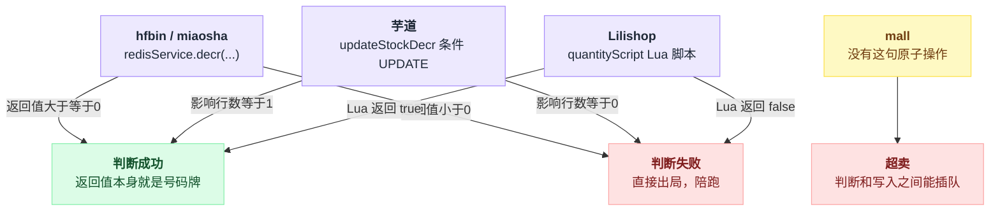
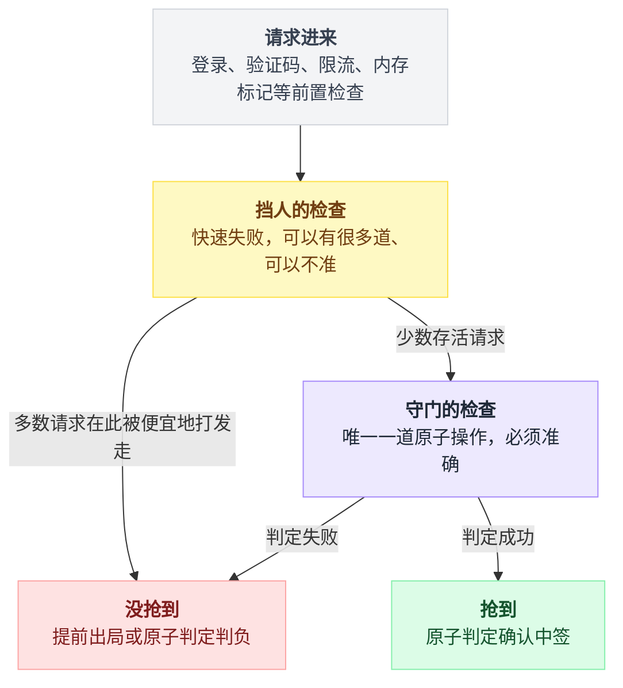
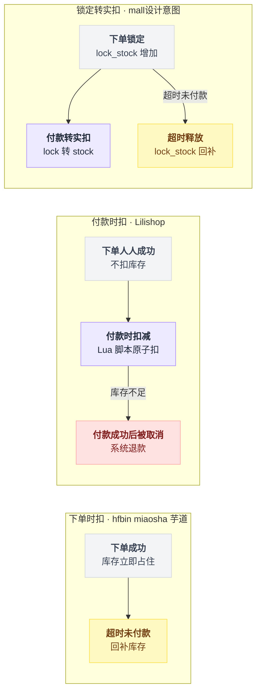
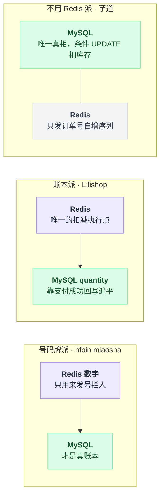
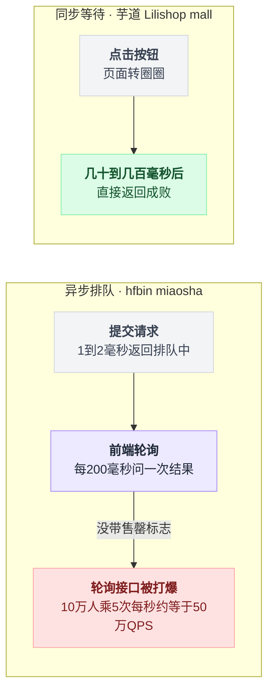
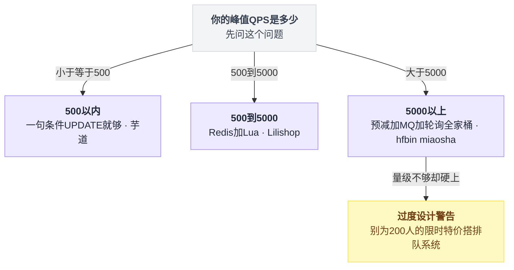

# 秒杀系统源码拆解 · 总结篇：五个项目的共性、分歧与自查清单

> 这是全系列的最后一篇。第 0 篇负责"选项目、横向打分"，第 1~5 篇各拆一个项目，这一篇把五个项目放回同一张桌子上，回答三个问题：
>
> 1. 它们**不约而同**都在做什么？——共性往往就是这个领域的客观规律。
> 2. 它们在哪些问题上走了**完全相反**的路？——分歧点才是真正需要你做决策的地方。
> 3. 读完这一套，怎么检验自己**真的学会了**，而不是"看懂了"？
>
> 所有结论基于 2026-07-31 clone 的源码，各项目的具体版本号（分支、commit）见各篇开头，这里不再重复。

---

## 目录

- [0. 先把五个项目缩成一张表](#0-先把五个项目缩成一张表)
- [1. 共性：五个团队不约而同做了的事](#1-共性五个团队不约而同做了的事)
- [2. 分歧：同一个问题的五种相反答案](#2-分歧同一个问题的五种相反答案)
- [3. 抄作业地图：想要什么，去哪抄](#3-抄作业地图想要什么去哪抄)
- [4. 动手写秒杀之前，先回答六个问题](#4-动手写秒杀之前先回答六个问题)
- [5. 自查清单：你学会了吗](#5-自查清单你学会了吗)
- [6. 两个建议做的实验](#6-两个建议做的实验)

---

## 0. 先把五个项目缩成一张表

| 项目 | 一句话画像 | 防超卖的最后一道防线 | 最值得记住的一个细节 |
|---|---|---|---|
| 01 hfbin/Seckill | 教科书链路的最小完整实现 | Redis `DECR`（DB 兜底 SQL 缺 `stock_count > 0`，是漏的） | 同一个 Controller 里并排放着朴素同步版和优化异步版，可直接对照 |
| 02 qiurunze123/miaosha | 教学项目里做得最全的一个 | Redis `DECR` + DB `WHERE stock_count > 0` 双保险 | 作者原话：Redis 库存和 MySQL 库存不需要一致，"这是一个伪命题" |
| 03 芋道 ruoyi-vue-pro | 秒杀作为插件装进几十万行的商城 | 一句 `UPDATE ... WHERE stock >= N` + 判影响行数 | 主流程 `TradeOrderUpdateServiceImpl` 里没有一个 `if (isSeckill)` |
| 04 Lilishop | 完整的 B2B2C 促销业务流水线 | 付款时 Redis Lua 脚本（`quantity.lua`）整体扣减、失败整体回滚 | 下单一件库存都不扣，抢购的残酷被推迟到付款那一刻 |
| 05 macrozheng/mall | 全功能电商脚手架，秒杀是橱窗 | 没有。`lockStock()` 是读-改-写，必然丢失更新 | "加"库存用了不安全的写法，"减"库存反而用了安全的写法 |

---

## 1. 共性：五个团队不约而同做了的事

五个项目的作者互不认识，定位、年代、技术栈都不同。他们碰巧做了同一件事的地方，基本可以当规律记。

### 共性一：判定"抢没抢到"的，永远是一个原子操作的返回值

热闹归热闹——限流、验证码、动态 path、内存标记——但最终宣判你成败的，在每个项目里都是**一句话**：

| 项目 | 那一句话 | 判定依据 |
|---|---|---|
| hfbin / miaosha | `redisService.decr(...)` | 返回值 >= 0 就是抢到了 |
| 芋道 | `updateStockDecr()` 里的条件 UPDATE | 影响行数 = 1 就是抢到了 |
| Lilishop | `stringRedisTemplate.execute(quantityScript, ...)` | Lua 返回 `true` 就是扣到了 |
| mall | ——没有这样的一句话 | 所以它会超卖 |

这四种写法底层原理不同（Redis 单线程排队、InnoDB 行锁、Lua 脚本整体执行），但思想只有一个：**把"判断"和"扣减"焊成一个不可分割的动作，让返回值本身充当排队的号码牌**。DECR 返回 0~4 的那 5 个请求中签，其余全是陪跑；UPDATE 返回 1 行的那个请求中签，返回 0 行的重新做人。

反过来看 mall：它恰恰是缺了这一句话。`selectByPrimaryKey` → Java 里加一 → `UPDATE SET lock_stock = 绝对值`，判断和写入之间隔着一段 Java 代码，任何人都能插队。**有没有这一句原子操作，就是"会不会超卖"的分水岭**，其他一切都是外围。

把四条"抢没抢到"的判定语句摆在一起看，分水岭在哪一目了然：



### 共性二：前置校验全是"快速失败"，没有一个是正确性保证

每个项目在最后那句原子操作之前，都摆了一排检查：

- hfbin 的五道闸门，前四道（登录、path、内存标记、查重复下单）；
- miaosha 的六道关卡，前五道；
- 芋道 `validateJoinSeckill` 的五道只读校验，包括那句"看一眼库存够不够"的普通 SELECT；
- Lilishop 结算页 `checkPromotionGoodsQuantity()`，库存不足也不抛异常，只是把商品勾选取消；
- mall 的 `hasStock()`，拿几十毫秒前读进 JVM 内存的数字做比较。

这些检查在并发下**全部拦不住人**：1000 个请求同时通过"库存 > 0"的判断毫无障碍，这就是 TOCTOU（检查时刻和使用时刻之间的空档）。但它们也**全都不是白写的**——它们的任务是在便宜的位置把 95% 注定失败的请求快点打发走，别让它们挤到最贵的那道门前排队。

所以读秒杀代码要养成一个习惯：把每道检查分类成"**挡人的**"还是"**守门的**"。挡人的可以有很多道、可以不准；守门的只能有一道、必须原子。芋道那篇反复强调的就是这件事：`validateJoinSeckill` 里的库存检查完全不防超卖，防超卖的只有最后那句带条件的 UPDATE。分不清这两类，是初学者读源码时最常见的误解。

把这两类检查画成一张漏斗图，"挡人"和"守门"分别站在哪一层就更直观：



### 共性三：宁可少卖，绝不超卖——而且没有一个项目做了对账

"Redis 扣成功了，MySQL 没写进去"这种事，五个项目里凡是用了 Redis 的都会发生：

- hfbin：消费者写库失败，作者留了一行 `// todo 如果这里出现异常可以进行补偿……恢复redis库存`，todo 至今还是 todo；
- miaosha：同样不回补，作者给出了三条理由——概率小、商户拉流量卖不完还省钱、网站不崩最重要；
- Lilishop：Lua 扣成功后 `synchroDB` 若抛异常回滚，Redis 的扣减不会跟着回滚（`@Transactional` 管不到 Redis），而且全仓库没有库存对账定时任务。

这不是巧合，是一致的价值排序：**超卖赔钱、要人工善后；少卖只是少赚**。所以大家不约而同选择了"单向容错"——所有的兜底都朝着"宁可错杀"的方向倾斜（hfbin 的内存标记只会误杀不会放多，也是同一个思路）。真要把少卖的窟窿补回来，业界做法是活动结束后跑对账任务，但这五个项目一个都没写。你在生产里落地时，这个缺口得自己补上。

### 共性四：README 和表结构承诺的功能，相当一部分在代码里不存在

这是全系列翻源码翻出来的最扎心的一条共性：

| 项目 | 承诺 | 现实 |
|---|---|---|
| hfbin | 秒杀教程标配"数学验证码" | 全项目没有 `/verifyCode` 接口，README 也确实没吹，但读者普遍以为有 |
| miaosha | v2 分布式事务、Lua 分布式限流 | TCC 相关类全是骨架；Lua 限流的返回值在 Controller 里被直接丢弃，实际不生效 |
| 芋道 | 框架里有现成的 `@RateLimiter` / `@Idempotent` | promotion 和 trade 两个模块的 pom 都没引入那个 starter，一处都没用上 |
| Lilishop | `promotion_apply_status` 有 REFUSE（审核拒绝）状态、`fail_reason` 字段 | 状态被写死成 PASS，审核流程不存在；`limit_num` 限购字段秒杀从不设置 |
| mall | `order_type=1` 秒杀订单、`flash_order_overtime` 秒杀超时、秒杀日志表、限时购价格/限量/限购三字段 | 六处全是预留：字段只被 SELECT 出来展示，没有任何业务代码读它做决策 |

教训很直接：**读开源项目，表结构和注释只代表作者"想做什么"，`grep` 才能告诉你他"做了什么"**。本系列每篇都在用"全仓库搜索这个字段被谁读写"的笨办法验证承诺，这个办法值得你带走——它不聪明，但从不骗人。

### 共性五：MQ 和回调侧的幂等，是集体性盲区

主链路防超卖大家多少都花了心思，但消息重投、回调重放这些"第二次来的请求"，几乎全军覆没：

- Lilishop `StockUpdateExecute.orderChange()` 没有幂等判断，RocketMQ 重投一次就重复扣一次库存；
- mall `paySuccess()` 不校验订单状态，重复调用重复扣库存；`releaseSkuStockLock` 没有下限保护，重复释放会把 `lock_stock` 减成负数，可用库存凭空变多；
- hfbin / miaosha 的消费者虽然进门先查"订单是否已存在"，算是挡了一半，但失败重试的路径没有设计。

做对了的样本恰好也在这五个项目里，而且写法完全一致——**把状态条件写进 UPDATE 的 WHERE 里**：

- mall 的 `cancelOrder`：`andStatusEqualTo(0)`，已付款的订单查不到、动不了，天然幂等（全篇少数被点名表扬的细节）；
- 芋道的 `updateByIdAndStatus(id, status, update)`：支付回调和取消订单都靠它防重放，0 行就抛错。

你会发现这和共性一是同一个招式：**条件更新 + 判影响行数**，既能防超卖，也能防重放。一招吃两头，值得刻在肌肉记忆里。

### 共性六：活动"开没开始"，靠算不靠存

没有一个项目用定时任务去翻"活动状态"字段。hfbin 拿 `startDate`/`endDate` 和 now 现算 `remainSeconds`；mall 用抹掉时分秒的日期和抹掉年月日的时刻各比一次；Lilishop 干脆没有状态字段，`getPromotionStatus()` 就是一个时间比较函数，"关闭活动"的约定是把起止时间置空。好处是省掉"活动开始/结束"两个定时任务和状态不同步的 bug，代价是所有查询都得带上时间条件。这是个小设计，但五家一致，说明它是这个业务域的自然解。

---

## 2. 分歧：同一个问题的五种相反答案

共性是规律，分歧才是决策点。下面四个问题，五个项目给出了互相矛盾的答案，而且**每一边都有道理**——你将来落地时，绕不开在这几个问题上站队。

### 分歧一：库存什么时候扣？

```
 下单时扣                      付款时扣                    锁定 → 付款转实扣
 hfbin / miaosha / 芋道         Lilishop                    mall（设计意图）
─────────────────────────────────────────────────────────────────────────
 抢到 = 占住库存                下单人人成功，               下单占 lock_stock，
 不付钱靠超时取消回补            付款才见真章                 付款转 stock，超时释放
─────────────────────────────────────────────────────────────────────────
 优点：体验直观，                优点：实现最简单，           优点：业界主流模型，
 抢到基本等于买到                库存永远真实                「可用 = stock - lock」
─────────────────────────────────────────────────────────────────────────
 代价：黄牛下单不付款            代价：付了钱被系统            代价：状态机复杂，
 能占死库存（芋道无限流，        取消退款，秒杀场景下          mall 实现时恰好在
 这个问题被点名）                这个概率非常高               「锁定」这步写出了 bug
```

换成流程图看，三条路径从"下单"到"最终结算"分别怎么走：



Lilishop 那篇把这个选择讲得最透：库存 5 件，100 个人全能下单成功，前 5 个付款的赢，第 6 个起"支付成功→3 秒后订单已取消+退款"。这不是 bug，是设计取舍——**数字层面绝不超卖，体验层面把残酷推迟到付款那一刻**。而下单扣的流派必须配套"超时未付款回滚"，否则库存被占死；mall 的三段状态机（锁定/转实扣/释放）模型本身是三者里最标准的，坏就坏在实现。

没有正确答案，只有场景：抢购型活动（少量库存、拼手速）用户无法接受"付了钱还没抢到"，得下单扣；日常限时特价流量平缓，付款扣最省事。

### 分歧二：Redis 里的库存，是账本还是号码牌？

这是五个项目里最有哲学意味的分歧：

- **号码牌派**（hfbin、miaosha）：Redis 数字只用来发号拦人，真账在 MySQL。所以 miaosha 作者敢说"Redis 数量减成 -99 是正常的"、"和 DB 保持一致是伪命题"——号码牌发完了就行，牌上的数字不用对账。
- **账本派**（Lilishop）：Redis 是唯一的扣减执行点，MySQL 里的 `quantity` 靠每笔支付成功后回写（`synchroDB`）来追平。Redis 丢了 key 还能自愈（懒加载回源），但扣减那一刻，Redis 说了算。
- **不用 Redis 派**（芋道）：MySQL 是唯一真相，Redis 在整个秒杀链路里只干一件事——给订单号发自增序列。运维上只有一份数据要照顾，"挂了重启就行"。

把三派各自"谁是真相源"的链路画出来：



站哪一派，决定了你的故障恢复策略：号码牌派怕的是 Redis 重启后号码牌失真（hfbin 那个 12 小时过期的 key 一丢，DECR 从 -1 起步，全员显示售罄）；账本派怕的是回写失败没人对账；MySQL 派什么都不怕，就是扛不住量。

### 分歧三：用户等在哪——排队页还是转圈圈？

hfbin / miaosha 的接口 1~2ms 返回"排队中"，前端每 200ms 轮询一次，三态协议（订单号 / -1 失败 / 0 继续等）；芋道 / Lilishop / mall 同步等结果，点完按钮转圈，几十到几百毫秒后直接告诉你成没成。

把两种等待方式的链路摆在一起：



异步的好处在第 0 篇讲过了（削峰、Tomcat 线程立刻释放），这里只补一条两篇拆解里都出现的反直觉现实：**轮询本身会成为新的流量源头**。hfbin 那篇算过账：10 万人每 200ms 问一次"我抢到了吗"，`/seckill/result` 接口每秒挨 50 万次——前面费尽心思省下来的数据库压力，被轮询接口自己顶了回去。所以 miaosha 作者特意要求"所有接口包括轮询接口都要带活动结束标志，防止一直轮询"。选了异步，就得把"怎么让失败者尽快闭嘴"一起设计了。

### 分歧四：秒杀是独立小系统，还是业务插件？

- hfbin / miaosha：秒杀就是整个项目。专用 Controller、专用表（`miaosha_goods` 单独放秒杀库存，理由是活动频繁、结束了删表不污染主表）、专用链路。
- 芋道：秒杀是**插件**。trade 侧全部秒杀代码约 40 行（一个价格计算器 + 一个 Handler），主流程零感知，"删掉两个类，秒杀功能就干净地消失了"。
- Lilishop：秒杀是**促销体系的一个子类**。`AbstractPromotionsServiceImpl` 模板方法固定五步，秒杀/拼团/满减共用一张 `li_promotion_goods` 表管库存和价格，秒杀订单在订单表上就是普通订单（`CartTypeEnum` 里压根没有 SECKILL）。
- mall：秒杀是**三张配置表加一个首页接口**，下单链路根本不知道有活动存在。

前一种教你"秒杀链路长什么样"，后三种教你"秒杀在真实系统里住在哪"。面试聊架构时，能把两个视角都讲出来（专用链路的十层漏斗 + 插件化接入的扩展点设计），比只会背其中一边高一档。

### 分歧五：防黄牛，从全副武装到裸奔

miaosha 一家做全了：数学验证码（第一目的其实是削峰——每人算题 1~5 秒，把瞬时洪峰摊平）、按人限流 5 秒 5 次、随机 path 60 秒过期、唯一索引一人一单。hfbin 缺验证码，且最讽刺的是限流只挂在 `/seckill/path` 上，真正的秒杀接口反而没限流。芋道、Lilishop、mall 基本裸奔——芋道连框架自带的限流注解都没引，Lilishop 的 `@LimitPoint` 全仓库只用在滑块验证码和短信上，mall 除了"必须登录"什么都没有。

但 miaosha 那篇同时也画了攻防推演的终点：这一整套武装，**挡不住注册 1000 个账号的人**。验证码、限流、动态 path 都是按"人"设防的，账号无限则防线归零，再往上就是实名、设备指纹、风控模型——开源项目集体止步于此，因为这些东西开源了就等于送给黄牛（第 0 篇结论 2）。所以对"防刷"要有清醒的预期：开源能学到的是挡住脚本小子的那几板斧，不是真正的风控。

---

## 3. 抄作业地图：想要什么，去哪抄

学完之后真正动手时，按需取用。左列是你的需求，右列直接给到类/文件级别：

| 你想要 | 去抄 | 位置 |
|---|---|---|
| 最小可用的"Redis 预减 + 内存标记 + MQ 异步"骨架 | hfbin `SeckillController.list()` 五道闸门 | 一个方法 40 行，读一遍就能默写 |
| DB 兜底的正确写法 | miaosha `GoodsDao.java:21` | `update ... set stock_count = stock_count - 1 where goods_id = #{goodsId} and stock_count > 0` |
| 纯 MySQL 的条件扣减范式（MyBatis-Plus 版） | 芋道 `SeckillProductMapper#updateStockDecr` | `.ge(stock, count).setSql("stock = stock - " + count)`，加库存不用带条件 |
| 多个 key 一起原子扣、失败整体回滚 | Lilishop `framework/src/main/resources/script/quantity.lua` | 62 行 Lua，含回滚数组；注意 Redis Cluster 要配 `{hash tag}` 同槽 |
| 数学验证码 + 顺带削峰 | miaosha `MiaoshaService.createVerifyCode()` | 注意依赖 Nashorn，JDK 15+ 没了 |
| 注解式按人限流 | miaosha `@AccessLimit` + `AccessInterceptor` | 计数器实现，记得它有临界窗口问题（4.9s 五次 + 5.1s 五次） |
| 延迟取消订单（TTL + 死信队列） | mall `RabbitMqConfig` + `CancelOrderSender/Receiver` | mall 那篇明说这是"全项目最值得抄走的部分"；注意 TTL 队列的队头阻塞坑 |
| "事务提交成功后才发 MQ" | Lilishop `TransactionCommitSendMQEvent` + `@TransactionalEventListener(AFTER_COMMIT)` | 一劳永逸避开"消息发了事务却回滚了" |
| 把营销玩法做成可插拔扩展点 | 芋道 `List<TradePriceCalculator>`（@Order 排序）+ `TradeOrderHandler`（default 空实现） | 加新玩法 = 新建一个类，主流程不动 |
| 防回调重放 / 状态机流转 | mall `cancelOrder` 的 `andStatusEqualTo(0)`；芋道 `updateByIdAndStatus` | 条件更新的第二用途 |
| 反面教材（拿去做 code review 考题） | mall `OmsPortalOrderServiceImpl.lockStock()`（第 724~733 行） | 读-改-写 + 绝对值赋值，配合各篇的并发时序表讲解 |

---

## 4. 动手写秒杀之前，先回答六个问题

五个项目的所有差异，归根到底是对这六个问题的不同回答。写代码之前先把答案写下来，比写完再改便宜一百倍：

**① 你的量级到底是多少？**
这是第一个问题，也是最常被跳过的问题。第 0 篇的选型表值得再看一遍：QPS 500 以内一句条件 UPDATE 就够（芋道），500~5000 上 Redis + Lua（Lilishop），5000 以上才需要预减 + MQ + 轮询全家桶（hfbin/miaosha）。为一分钟 200 人的"限时特价"搭一套排队系统，是最常见的过度设计。

换成决策树看这道选择题：



**② 库存在哪一刻扣？** 下单扣（配超时回滚）、付款扣（接受"付了钱被退款"）、还是锁定-转实扣（状态机最标准也最容易写错）。见分歧一。

**③ 谁是库存的真相源？** Redis 是号码牌还是账本，还是根本不用 Redis。这个答案直接决定你的故障恢复剧本和要不要写对账任务。见分歧二。

**④ 用户同步等还是异步排队？** 选异步就必须同时设计三态协议和"售罄标志"，否则轮询流量会反噬。见分歧三。

**⑤ 限购和幂等靠什么兜底？** 应用层查重只是挡人的；守门的是唯一索引（`(user_id, goods_id)`）和条件更新。mall 六把刀里"强烈建议第一个加"的就是那行唯一索引 DDL——一行 DDL，性价比之王。

**⑥ 哪些环节会收到"第二次请求"？** MQ 重投、支付回调重放、用户连点、超时任务和 MQ 同时触发（mall 那个注释掉的定时任务就是教训）。把每个入口按共性五的办法过一遍：状态条件进 WHERE，判影响行数。

---

## 5. 自查清单：你学会了吗

"看懂了"和"学会了"之间隔着一层：能不能脱离文档把东西造出来、把错误指出来。逐条自测，做不到的回对应篇补课：

- [ ] **手写防超卖 SQL**：不看资料写出 `UPDATE seckill_goods SET stock = stock - 1 WHERE id = ? AND stock > 0`，并说清为什么必须判影响行数、为什么这句话在 InnoDB 下是原子的。（第 3 篇）
- [ ] **画出十层漏斗**：从前端按钮到数据库，按"单次成本从便宜到贵"排出各层，并说出每层挡掉的是哪类请求。（第 0 篇第 2 节 + 结论 3）
- [ ] **当场指出 lockStock 的错**：给你 mall 那 6 行代码，指出错在哪两点（快照读不加锁 + UPDATE 写绝对值），并画出两线程交错的时序表。（第 5 篇）
- [ ] **解释 @Transactional 为什么救不了超卖**：REPEATABLE READ 下普通 SELECT 是快照读，行锁只让两条错误的 UPDATE 排队执行。（第 5 篇）
- [ ] **解释 Redis 库存减成负数为什么无害**：判定条件是 `< 0` 拒绝，负多少无所谓；真正有害的是把 DECR 的顺序放错（hfbin 那个 commit `0965f79` 修的就是这个）。（第 1、2 篇）
- [ ] **说清"少卖"是怎么发生的、为什么被容忍、生产上该怎么补**。（共性三）
- [ ] **区分"挡人的"和"守门的"**：拿任何一个项目的校验清单，逐条标出哪些是快速失败、哪道是正确性保证。（共性二）
- [ ] **说出扣库存时机的三个流派和各自的代价**，并为"3 万人抢 5 件"和"店铺限时特价"分别选边。（分歧一）
- [ ] **写出轮询接口的三态协议**，并说出没有"售罄标志"会发生什么。（分歧三）
- [ ] **列出三个"第二次请求"的入口和统一防法**。（共性五）

十条全过，这个系列对你的任务就完成了。面试场景下，前四条覆盖了绝大多数秒杀题；能把第三条（指着 8.4 万 star 项目的具体行号讲并发 bug）完整讲出来，是明显的加分项。

---

## 6. 两个建议做的实验

纸上得来终觉浅，两个实验都有现成步骤，各花半天：

**实验一：验证"一句 SQL 真的防得住"。** 按芋道那篇第 8 章：活动库存设 5，并发 100 个下单请求，预期恰好 5 单成功、95 个拿到库存不足错误码，`stock` 精确归零。再狠一点：在 `updateSeckillStockDecr` 里打断点人为拉长 TOCTOU 窗口，看它依然不超卖——这一刻你对"行锁焊住判断和扣减"的理解才算落地。

**实验二：亲手复现一次超卖。** 按 mall 那篇第 8 章：`stock=1`，两个账号并发下单，看 `oms_order` 出现两张订单而 `lock_stock` 只有 1。嫌不够稳定就在 SELECT 和 UPDATE 之间插一行 `Thread.sleep(2000)`，超卖几乎必现。然后按"六把刀"的刀 1 把它改成条件更新，再跑一遍，看它变对。

一个实验让你相信正确的写法为什么对，另一个让你亲眼看到错误的写法怎么错。做完这两个，再回头看第 0 篇那张"小明小红"的图，你看到的就不再是一张示意图，而是你亲手触发过、又亲手修好过的东西。

---

**上一篇 👈 [`5_macrozheng_mall秒杀链路全解.md`](./5_macrozheng_mall秒杀链路全解.md)　｜　专题延伸 👉 [`7_秒杀库存扣减_Redis和MySQL谁说了算.md`](./7_秒杀库存扣减_Redis和MySQL谁说了算.md)　｜　回到开头 [`0_总览与横向对比.md`](./0_总览与横向对比.md)**
