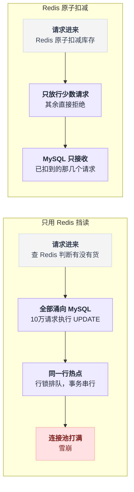
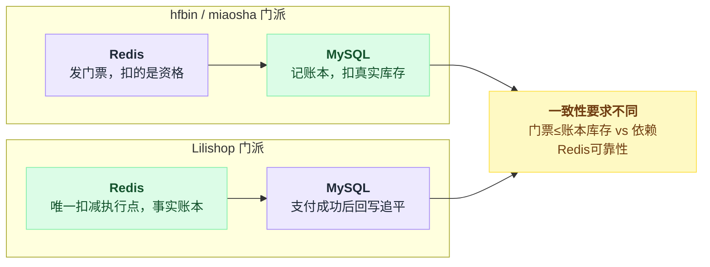
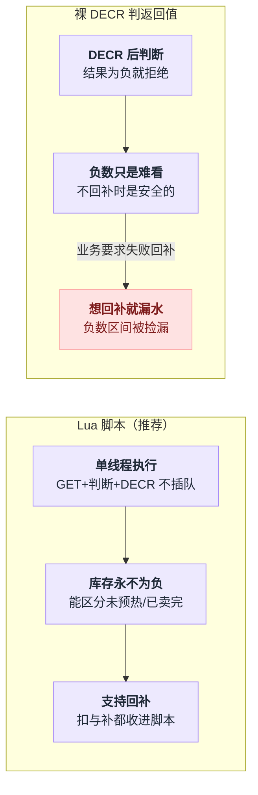
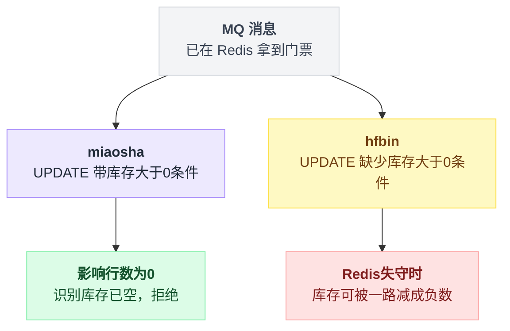
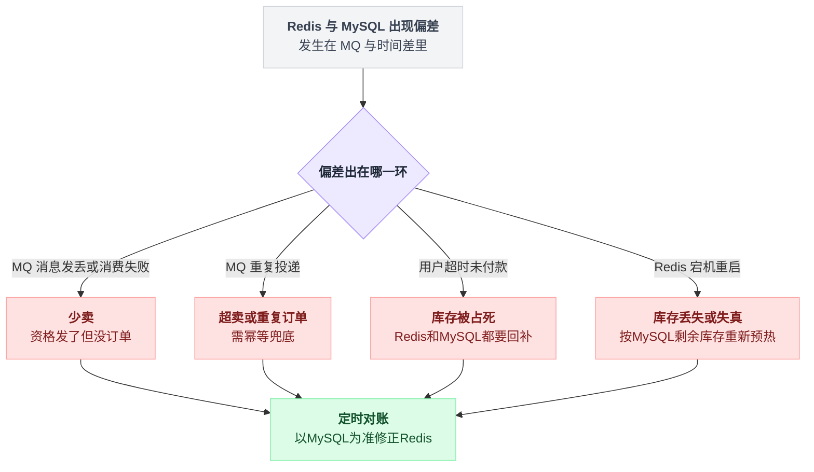
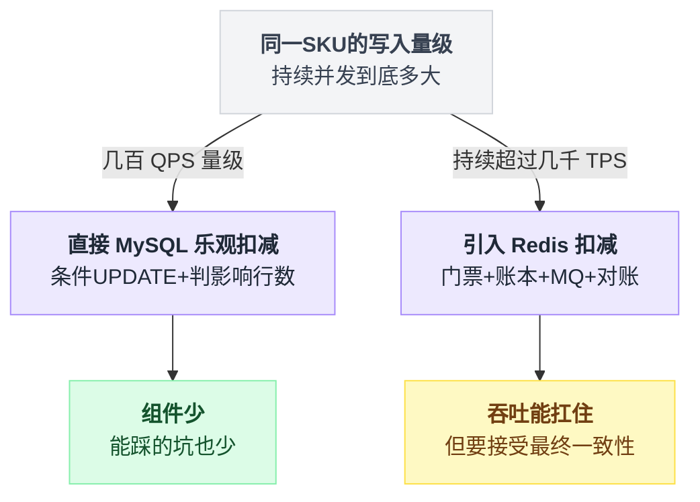

# 秒杀库存扣减：Redis 和 MySQL 到底谁说了算

> 这是一篇专题延伸，回答读完本系列后最常见的一个追问：**库存都预热到 Redis 了，那秒杀期间扣减到底在哪做？Redis 扣了 MySQL 怎么办？**
>
> 一句话结论：**秒杀期间的扣减就在 Redis 做。预热不是为了"挡查询"，而是把库存的决策权临时交给 Redis——这是秒杀和普通下单最核心的区别。**
>
> 和前 6 篇不同，这一篇不拆新项目，而是把五个项目里已经验证过的代码当论据，把"谁说了算"这个问题从头到尾推一遍。文中引用的项目细节均出自第 1~5 篇的源码阅读（2026-07-31）。

---

## 目录

- [1. 为什么必须在 Redis 扣：瓶颈是写，不是读](#1-为什么必须在-redis-扣瓶颈是写不是读)
- [2. 正确的分工：Redis 发门票，MySQL 记账本](#2-正确的分工redis-发门票mysql-记账本)
- [3. Redis 里怎么扣才安全](#3-redis-里怎么扣才安全)
- [4. MySQL 那一层的兜底不能省](#4-mysql-那一层的兜底不能省)
- [5. 会踩到的坑，以及五个项目里谁踩了](#5-会踩到的坑以及五个项目里谁踩了)
- [6. 什么时候不需要这么搞](#6-什么时候不需要这么搞)

---

## 1. 为什么必须在 Redis 扣：瓶颈是写，不是读

一个很自然的想法是：库存预热进 Redis，请求来了先查 Redis"还有没有货"，有货再去 MySQL 扣。听上去 Redis 已经在挡枪了，但推演一下：

```
10万请求 ─→ Redis 查了一下"还有货" ─→ 全部涌向 MySQL
                                          ↓
                              UPDATE stock = stock-1 WHERE id=1
                                          ↓
                              同一行 → 行锁排队 → 10万个事务串行
                                          ↓
                                    连接池打满、雪崩
```

Redis 查询挡住的是"读"，可"写"一个都没挡住。而秒杀的瓶颈从来不是读，是**同一行数据上的写竞争**——所有请求都在抢 `id=1` 那一行的行锁，这就是第 0 篇词典里的"热点行"。

这个上限不是拍脑袋：芋道那篇对纯 MySQL 条件扣减的估算是单行热点**几千 TPS 到顶、整体实际几百到一两千 QPS**；mall 那篇按连接池（`max-active: 20`）和事务时长推算出理论上限约 1000 TPS。两个项目、两种算法，落在同一个量级。Redis 单机 10 万 QPS，差着两个数量级——所以当瞬时并发远超单行写入能力时，扣减这个动作必须搬到 Redis 去做，MySQL 只接“已经扣到的那几个”。

两条路径摆在一起看，差别就是热点行锁到底卡在哪一步：



这也解释了为什么“只预热不扣减”的方案在五个项目里一个都没出现：要么像 hfbin/miaosha/Lilishop 那样真的在 Redis 扣，要么像芋道那样干脆不用 Redis。半吊子方案没有生存空间。

## 2. 正确的分工：Redis 发门票，MySQL 记账本

```
       用户请求
          │
          ▼
   ┌─────────────┐
   │   Redis     │  ← 预热好的库存 1000
   │  原子扣减    │     扣成功 = 拿到门票（有资格下单）
   └──────┬──────┘     扣失败 = 直接返回"已抢完"
          │
      只有 1000 个请求能走到这里（其余全被拦在上面）
          │
          ▼
      ┌───────┐
      │  MQ   │  ← 削峰，把瞬时 1000 变成平缓的流
      └───┬───┘
          │
          ▼
   ┌─────────────┐
   │   MySQL     │  ← 真正扣库存 + 建订单
   │  兜底防超卖  │     UPDATE ... WHERE stock > 0
   └─────────────┘
```

一句话记住：**Redis 扣的是"资格"，MySQL 扣的是"真实库存"。Redis 是漏斗，MySQL 是账本。**

这张图就是 hfbin 和 miaosha 的链路骨架，而"门票"这个定位，miaosha 作者在 `docs/code-solve.md` 里说得比谁都直白：

> 「redis 的数量不是库存，他的作用仅仅只是为了阻挡多余的请求透穿到 DB……所以这个是一个伪命题，我们是不需要保持一致的。」

理解了"Redis 发的是门票不是账"，很多困惑会自动消失：

- **为什么 Redis 数字减成负数无害？** 门票发完了就行，牌上的数字不用做账。库存 1、同时来 100 个 DECR，减到 -99 是正常现象，判定条件是"< 0 就拒绝"，负多少无所谓。
- **为什么不用担心 Redis 和 MySQL"不一致"？** 因为两边记的本来就不是同一个东西。真正要保证的只有一件事：**拿到门票的人数 ≤ 账本上的库存**，这由"预热时按真实库存写入 + 原子扣减"保证。
- **例外是 Lilishop**：它走的是另一派——Redis 是唯一的扣减执行点、事实上的账本，MySQL 靠每笔支付成功后回写追平。这一派对 Redis 可靠性的要求高得多，第 5 节的坑表对它更致命。

两派对 Redis 的定位截然不同，摆在一起看更清楚：



## 3. Redis 里怎么扣才安全

不能用 `GET` 判断再 `DECR`——两步之间会被并发插队，这和 MySQL 里"先 SELECT 再 UPDATE"是同一个病（mall 的 `lockStock()` 就是这个病的数据库版）。安全写法有两种，五个项目里各有代表。

**写法一：Lua 脚本（推荐）。** Redis 单线程执行整个脚本，中间不插队：

```lua
-- KEYS[1] = seckill:stock:1001
local stock = tonumber(redis.call('GET', KEYS[1]))
if stock == nil then return -1 end   -- 没预热，走降级
if stock <= 0 then return 0 end      -- 卖完了
redis.call('DECR', KEYS[1])
return 1                             -- 抢到了
```

好处是语义干净：库存永远不会变负，还能把"没预热"和"卖完了"区分开走不同分支。Lilishop 的 `quantity.lua` 是它的加强版——多个 key（普通库存 + 促销库存）一起扣、任何一个不够就整体回滚，62 行，值得抄。代价在第 1 篇的进阶方向里也提过：脚本写错很难查，Redis Cluster 下还要用 `{hash tag}` 保证多 key 同槽（Lilishop 源码里那条 `2023-06-09` 的踩坑注释就是为这个留的）。

**写法二：裸 `DECR` 判返回值。** hfbin 和 miaosha 都是这么写的：`decr` 之后判 `stock < 0` 就拒绝。能跑，而且在"不回补"的前提下是安全的——负数只是难看，不影响正确性。

但这个写法有个隐蔽的前提：**一旦你想"失败了把库存补回去"（INCR 回补），它就开始漏水**。高并发下 key 已经被扣到 -50000 了，你 INCR 一下，别的请求"捡漏"看到的还是负数，回补的这一个库存实际卖不出去；要么就得先把负数清干净再补，逻辑越写越绕。所以两个教学项目干脆都不回补，接受少卖（第 6 篇共性三）。如果你的业务要求失败必须回补（比如库存少、每一件都金贵），一开始就用 Lua，把“扣”和“补”都收进脚本里。

两种写法摆在一起对比着看：



## 4. MySQL 那一层的兜底不能省

即使 Redis 扣得再准，消费者落库时也**必须**保留这个条件：

```sql
UPDATE goods SET stock = stock - 1
WHERE id = 1001 AND stock > 0;
-- 判断影响行数，为 0 说明库存已空
```

为什么 Redis 已经精确放行了 1000 个人，MySQL 还要再设防？因为 Redis 可能出问题：重启丢数据、主从切换丢写入、key 被误过期、运维手改、脚本 bug。这行 `WHERE stock > 0` 是最后一道防线，**任何时候都不要让防超卖只依赖一层**。

这不是杞人忧天，本系列正好抓到一对活的对照组：

- **miaosha 做对了**：`GoodsDao.java:21` 的 `update miaosha_goods set stock_count = stock_count - 1 where goods_id = #{goodsId} and stock_count > 0`，第 0 篇给它的评语是五个项目里防超卖最完整的。
- **hfbin 漏了**：`GoodsMapper.xml` 的 `updateStock` 没有 `AND stock_count > 0`。平时跑不出问题——上游 Redis 把消息数限死了，数据库层的缺陷被掩盖着；可第 1 篇列了四种失守场景（Redis 重启、手改库存、手工补消息、将来加回补逻辑），任何一种发生，库存就能被一路减成负数。

把这组对照画成图更直观：



两个项目链路几乎一模一样，差的就是这半句 WHERE。"上游正常时看不出区别、上游失守时天壤之别"——这正是"兜底"这个词的准确含义：它平时不干活，你也绝不能因为它平时不干活就删掉它。

## 5. 会踩到的坑，以及五个项目里谁踩了

Redis 扣资格、MySQL 记账，两边中间隔着 MQ 和时间差，坑全出在缝隙里：

| 场景 | 后果 | 解法 | 系列里的实例 |
|---|---|---|---|
| Redis 扣了，MQ 消息发丢 / 消费失败 | **少卖**（资格发了但没订单，用户永远轮询不到结果） | 事务消息 / 本地消息表 / 失败重试 + 死信 | hfbin 消费者里那行著名的 `// todo 出现异常可以进行补偿……恢复redis库存`，todo 至今没填；Lilishop 的 `AFTER_COMMIT` 事件发 MQ 解决的是"事务回滚了消息却发了"这半边 |
| MQ 重复投递 | **超卖 / 重复订单 / 重复扣减** | 订单表唯一索引（用户ID+活动ID）+ 消费侧状态判断 | hfbin/miaosha 的 `UNIQUE KEY (user_id, goods_id)` 挡住了重复订单；Lilishop 的 `StockUpdateExecute` 没有幂等标记，重投会重复扣库存 |
| 用户超时没付款 | 库存被占死 | 定时任务/延迟队列关单，**Redis 和 MySQL 都要回补** | mall 的 TTL+死信延迟取消是可以直接抄的模板；但注意它只回补了 MySQL 侧的 `lock_stock`——凡是"下单时在 Redis 扣"的架构，取消订单只回补 MySQL 不回补 Redis，那些库存就永远卖不出去了 |
| Redis 宕机重启 | 库存数据丢失或失真 | AOF everysec + 主从；恢复时**按 MySQL 剩余库存重新预热，不能按活动初始值** | hfbin 提供了一个变种教训：库存 key 设了 12 小时过期（注释还写着"1分钟"），key 一丢 DECR 从 -1 起步，DB 里还有 94 件却全员显示售罄——key 消失的后果不是超卖，是一件都卖不出去 |
| 长跑下来两边对不上 | 少卖或超卖悄悄积累 | 定时对账 job，以 MySQL 为准修正 Redis | 五个项目**一个都没写**（第 6 篇共性三），生产落地时这是必须自己补的作业 |

把表格里的分支收拢成一张判定流程：



把这张表和第 6 篇的"共性五"（幂等盲区）对着看，会发现一个规律：**单次请求的正确性大家都花了心思，跨组件、跨时间的一致性是集体空白**。教学项目止步于"抢的那一秒不出错"，生产系统的大部分工作量恰恰在抢完之后。

## 6. 什么时候不需要这么搞

日常商品下单、并发几百 QPS 的场景，**直接 MySQL 乐观扣减就够了**：

```sql
UPDATE goods SET stock = stock - 1
WHERE id = ? AND stock > 0;
-- 需要防 ABA 或做多字段协同时再加 version 列
```

这就是芋道的全部答案——没有 Redis、没有 MQ、没有 Lua，一句条件 UPDATE 加判影响行数，逻辑上绝不超卖，运维上只有一份数据要照顾。第 3 篇的结语值得再念一遍：它不适合"3 万人抢 5 件"，但对中小电商的会员日、企业内购，它比全家桶方案**更正确**——因为组件越少，第 5 节那张坑表里能踩的行就越少。

Redis 扣减引入的是分布式一致性问题，成本不低：预热脚本、Lua 维护、回补逻辑、对账任务、Redis 高可用，一个都省不掉。只有当"瞬时并发远超单行写入能力"（经验阈值：同一 SKU 的写入需求持续超过几千 TPS）时才值得上。说到底，秒杀架构是**用最终一致性换吞吐量**——你接受了短时间内 Redis 和 MySQL 各说各话，换来了扛住 10 万 QPS 的能力。接不接受这笔交易，回到第 6 篇那六个问题的第一问：你的量级到底是多少。

落到判断上就是一棵简单的决策树：



---

**上一篇 👈 [`6_总结_共性_分歧与自查清单.md`](./6_总结_共性_分歧与自查清单.md)　｜　回到开头 👉 [`0_总览与横向对比.md`](./0_总览与横向对比.md)**
