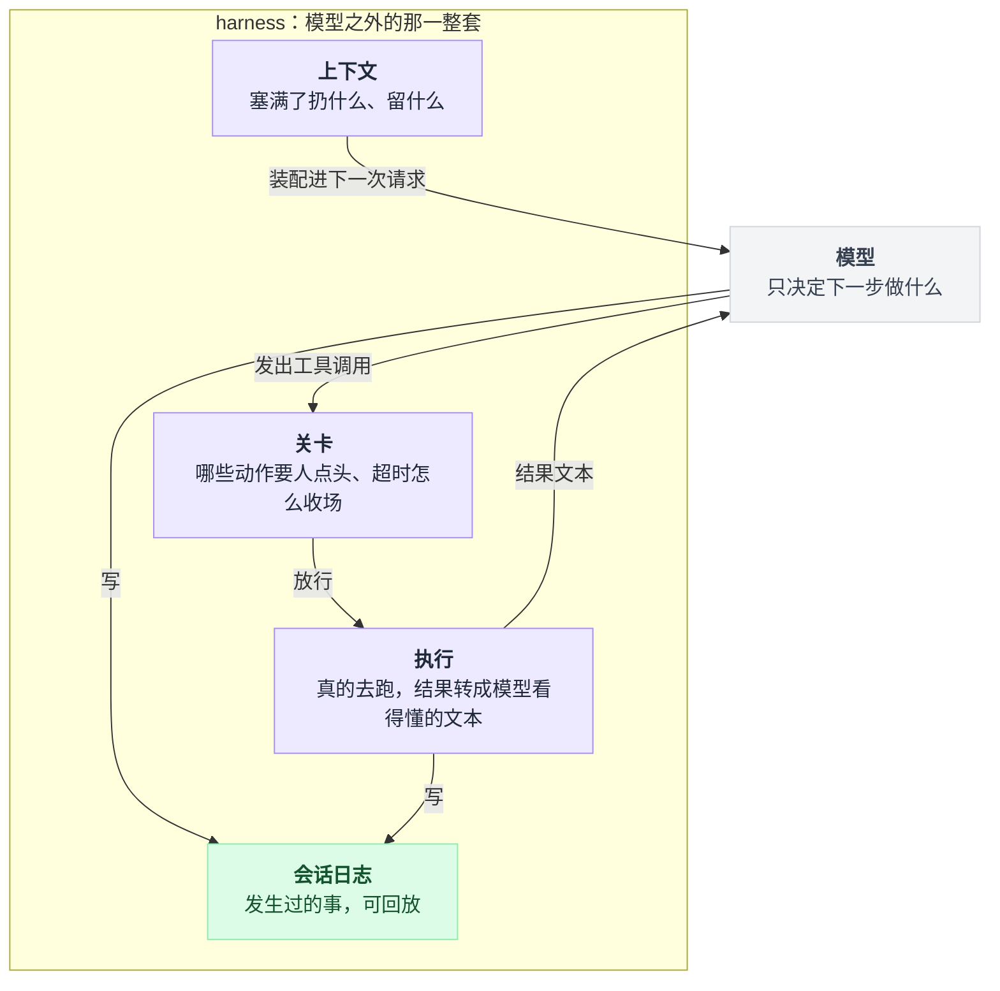
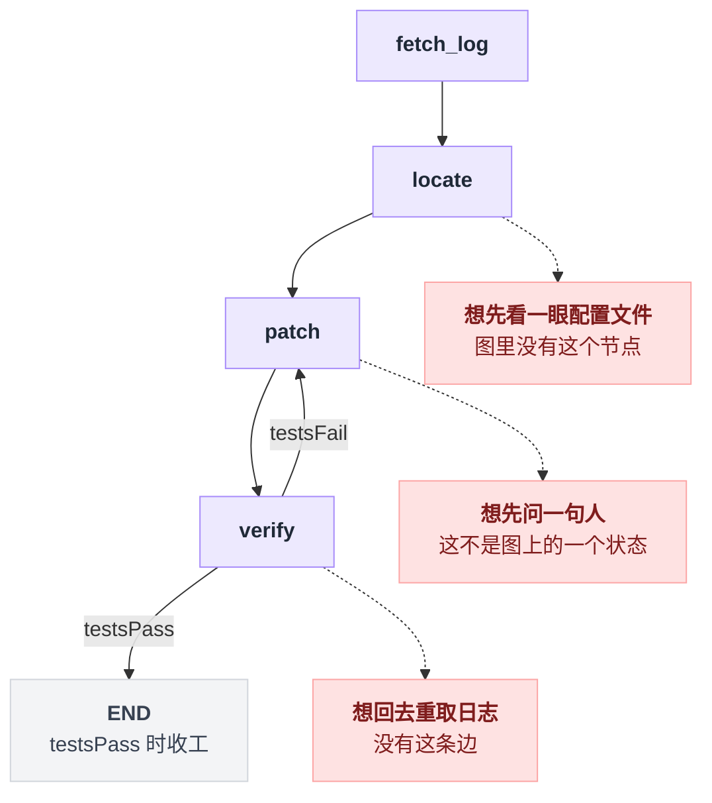
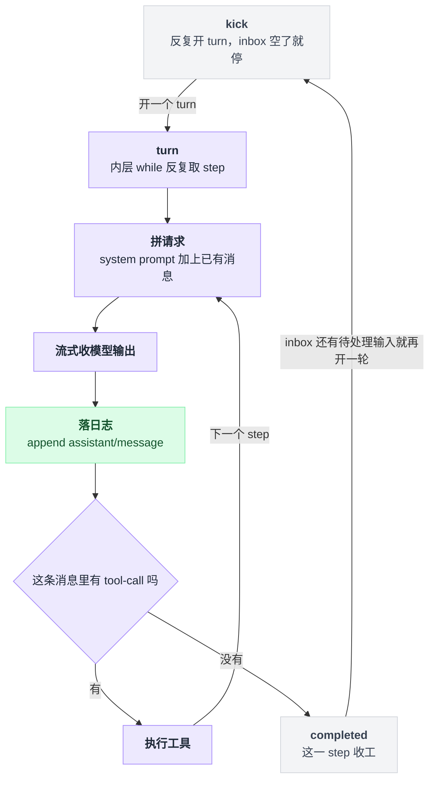
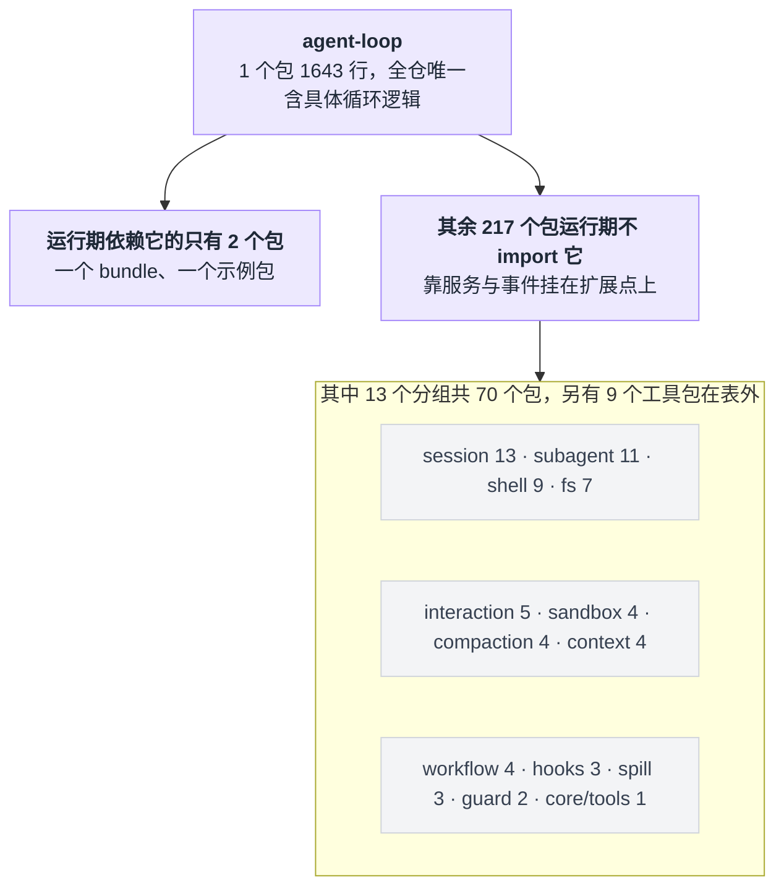
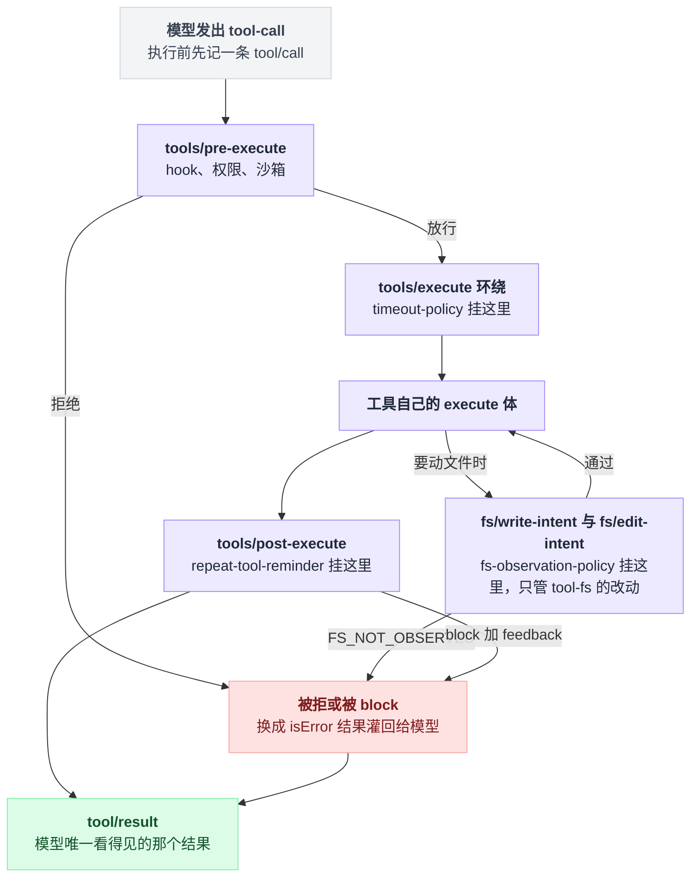
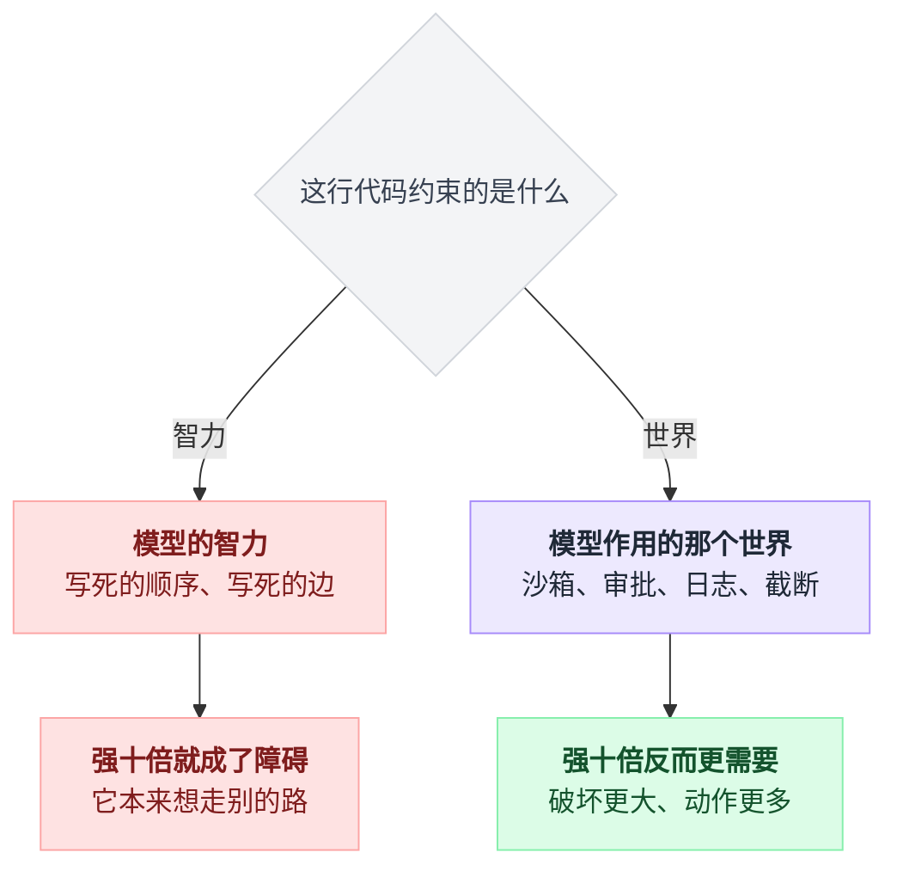

# 00 · harness 思想模型

> 基于 `deepseek-ai/deepseek-harness` v0.1.0-rc.5（commit `47f9438`，2026-08-13 19:38 +0800），2026-08-14 核对。正文只讲机制；可照抄的代码统一收在文末[附录](#附录可以照抄的模板)，出处收在[脚注](#出处)，点角标可跳转。

关于 harness，最流行的理解写在 dsh 官方中文 README 里：它把这个词保留原文，然后加了个括号注解——"由 DeepSeek AI 开发的开源 agent harness（智能体框架）"[^1]。

括号里那四个字，就是本章要拆的误解。注解本身不算错，但它恰好抹掉了 harness 跟"框架"之间最要紧的那个区别，所以下文我一律用原词。

这个区别不是术语洁癖。它决定了你写下的代码在下一代模型手里是增值还是贬值——这句话第 6 节会变成一条可以直接拿去自测的判据。为它花二十分钟是值得的。

中间还会撞见一件反直觉的事：harness 式设计的工作量根本不在那个循环里。循环只有一个包，环境有几十个，这个数字你自己 clone 下来就能复现。

安装、配置都不在这章，那些从 01 章开始。

---

## 1. 模型只出主意，干活的全在外面

先看模型自己到底能干什么。

它接一段文本，吐一段文本。至多在吐出来的文本里说一句"我想调 bash，参数是这个"。就到这了——它删不了文件、跑不了命令、拦不住危险操作、连"刚才发生过什么"都记不住。

于是必须有一整套东西长在它外面：把它要的工具真的跑起来、把执行结果变成它看得懂的文本、判断哪些操作需要人点头、超时了怎么收场、上下文塞满了扔掉哪些、把发生过的事记成一份能回放的日志。

这一整套模型之外的东西，加起来有个名字，叫 **harness**。

**harness = 把一个语言模型变成能干活的 agent 所需要的、模型之外的那一整套东西。** 模型只负责一件事：决定下一步做什么；剩下的全归 harness。

这条分界线的形状很简单：模型只往外发决定，执行、关卡、上下文、日志全长在它外面，而结果最终都要以文本的形式回到它眼前。



dsh 的 README 第一句就是这个定位[^1]：

> DeepSeek Harness (`dsh`) is an open-source agent harness developed by DeepSeek AI.

### 挽具这个比喻

harness 的字面义是**挽具**：套在马身上、把马的力气传到车上的那套皮具与绳索。三层意思都对得上。

| 挽具 | harness |
|---|---|
| 力量来自马，不来自挽具 | 能力来自模型，不来自 harness |
| 挽具不教马怎么跑，只决定力往哪传、什么时候能停 | harness 不规定推理步骤，只决定模型的动作如何作用于世界 |
| 换一匹更强的马，挽具照用 | 换一个更强的模型，harness 照用 |

最后这条是全章题眼。

但请把整个比喻当**我的解释性写法**看，dsh 文档里没有任何一处这么讲。

### 词源那条线：能核实的和不能核实的

社区里流传着一条演化线：`test harness`（跑测试用的固定装置）→ `eval harness`（跑模型评测用的那一层）→ `agent harness`（跑 agent 用的那一层）。

听着很顺，**但这条线我在 dsh 仓库里核实不了**，本教程也拿不出可引用的一手来源，当作背景传闻听就行，别当事实用。

仓库里能核实的只有两件事。

一是 dsh 自己用 harness 指**产品整体**。术语表写 "The harness convention: a live agent is the key of its own scope"，agent-loop 的 README 写 "This is the only package in the harness that contains concrete loop logic"，两处的 harness 都等于"这套 agent 运行时"[^2]。

二是同一个仓库里，harness **也仍在"测试夹具"的老意义上使用**：测试文档里提到一个名字就带着 harness 的夹具工厂，专门在测试里给被测对象接上真实的 bash 工具与本地执行器[^3]。

也就是说，"给被测对象搭一套外围装置，让它能真的跑起来"这层意思，在同一份代码库里同时服务于测试和 agent。

这是可核实的巧合。历史上是不是前者传给了后者，我不写。

---

## 2. 框架式写法：你没画的那条边，模型走不了

先看反面。下面是一段**示意伪代码**，展示"把流程写死成节点与边"的典型形状。

> ⚠️ 这段代码是我为讲解编造的伪代码，**不是任何具体库的真实 API**。本教程没有核验过 LangChain 等库的当前接口，所以这里不使用任何真实库名与真实方法名。想看真正逐行读源码的对照分析，见[五个 agent 系统源码解剖](../2026-08_五个agent系统源码解剖/00-总览与阅读指南.md)。

```text
graph = new Graph()

graph.node("fetch_log",  fetchLog)
graph.node("locate",     locateFault)
graph.node("patch",      applyPatch)
graph.node("verify",     runTests)

graph.edge("fetch_log", "locate")
graph.edge("locate",    "patch")
graph.edge("patch",     "verify")
graph.edge("verify",    END,   when = testsPass)
graph.edge("verify",    "patch", when = testsFail)

graph.run(input)
```

这段东西读起来很舒服：流程一目了然，可以画成图，可以单测每个节点，跑一万次都是同一条路。

它的代价长在同一个地方——**模型只能顺着你铺的轨道走，你没画的那条边它就走不了。**

具体是这样：

- `verify` 挂了，模型判断问题其实出在日志取错了周期，想回 `fetch_log`。**没有这条边**，它回不去。
- `locate` 阶段模型意识到该先看一眼配置文件。**图里没有这个节点**，它看不了。
- 模型想在 `patch` 之前先问一句人。**这不是图上的一个状态**，它问不了。

把这三处摆回图上，缺的东西一眼能看见：实线是你画过的边，虚线是模型想走、但图上没有的路。



于是维护就变成了补边补节点：每发现一种模型"本来会做但被拦住"的行为，就往图里加一条边。

图越长越像一张流程图，而你正在用流程图去规定一个比流程图聪明的东西该怎么想。

---

## 3. harness 式写法：顺序不在源码里，在模型手里

反过来的做法是什么样？**核心循环短到无话可说，顺序交给模型。**

先约定两个词，dsh 术语表给了定义[^4]。**turn** 是一次把已进入 inbox 的输入排空，模型和它的工具都停下来才算结束；**step** 是一次模型请求外加这次响应引发的工具执行，一个 turn 含零到多个 step。

驱动循环整个住在 agent-loop 包的一个源文件里[^5]。最外层在一个叫 kick 的私有方法里，就这样一行：

```ts
// packages/core/agent-loop/src/agent.ts:212
while (await this.turn()) {}
```

turn 内部再套一层无限循环反复取 step，而一个 step 的骨架只有四件事：拼请求、流式收模型输出、落日志、看有没有工具调用。收不收工的判据也只有一句：把这条消息里的工具调用块挑出来，一个都没有，这个 step 就算完成[^5]。

三层套下来就是全部骨架，写成示意伪代码是这样：

```
kick():
    while turn():           # turn 返回 false 就整体停
        pass

turn():
    if inbox 里没有待处理输入:
        return false        # 最外层那个 while 的终止条件在这
    while true:
        s = step()
        if s.kind == 'completed':
            break
    return true

step():
    拼请求
    流式收模型输出
    落日志
    if 这条消息里没有 tool-call:
        return { kind: 'completed' }     # 没有工具调用就算完成
    执行工具                              # 有就执行完再走下一个 step
```

一句话：kick 反复开 turn，turn 反复取 step，一个 step 走到最后只问一句有没有工具调用。每一层的确切位置都在脚注里[^5]。



请注意上面这些代码里缺了什么。

**"取日志 → 定位 → 修改 → 验证"这个顺序在源码里根本不存在**，它是模型每一轮自己决定的。

想先看配置文件？调 `read` 就行。验证完想回头重取日志？再调一次 `bash` 就行。没有边要补，因为压根没有图[^6]。

### harness 不是更简单，是难点搬了家

读到这里最容易得出的结论是"harness 更简单"。

不对。**难点没有消失，只是换了住处。**

框架里你控制的是**控制流**，harness 里你控制的是**模型所处的环境**：

| 你要操心的东西 | 框架式 | harness 式 |
|---|---|---|
| 下一步做什么 | 你写死 | 模型决定 |
| 工具返回给模型的文本长什么样 | 顺带 | **核心工作** |
| 出错时模型看到的错误信息 | 顺带 | **核心工作**，它决定模型会不会重试对 |
| 哪些动作要人点头 | 通常没有 | **核心工作** |
| 工具卡住了怎么办 | 节点超时 | **核心工作**，且要分工具 |
| 上下文塞满了扔什么、留什么 | 通常没有 | **核心工作** |

右列每一行都是模型看得见、并据此改变行为的东西。工程量全在这里。

下面用 dsh 的包结构把这句话坐实。

---

## 4. 拿 dsh 仓库数一遍：难点到底搬去了哪

### 4.1 循环在配置里就是一行 `- id:`

先补三个词，第 03 / 22 章细讲。**profile** 是一份具名的启动组合，列出它要叠哪些 bundle；**bundle** 是"一组 Cordis 配置行 + 它们挂载的代码"的分发格式；两者各自在自己 `package.json` 的 `dsh` 字段里声明。dsh 的启动树就由这些 bundle 的 patch 文件按序叠出来，`dsh-base` 是每个 profile 的第一层[^7]。

在这份 patch 文件里，**agent 循环和其它任何插件长得一模一样**：一个 id、一个包名、一份内容为空的 agents 配置，混在普通插件中间（原文照抄[附录 A](#a-agent-loop-在启动树里的那一行)）[^8]。

整份文件 451 行、78 个这样的 `- id:` 行，它只是其中之一。

而按架构文档的说法，上层 patch 按 id 命中某一行后会**整体替换它的 config**，不是深合并，这一行也不例外[^9]。

架构文档说得更直白[^10]：

> Every part of the product is a plugin, including the model adapter, the tool registry, the session log, and the agent loop itself, so every part is replaceable from configuration.
>
> There is no privileged core to patch: you extend dsh by mounting a plugin beside the others, and registrations are effects that unwind when their plugin unloads.

### 4.2 有多少包真的依赖循环实现

先交代口径，免得数字变成空口无凭。

我把仓库三层目录深处的全部 219 份包清单遍历了一遍，解析 JSON，按四类依赖字段分别统计谁引用了 `@deepseek-ai/dsh-agent-loop`。包名是精确匹配，所以同门的 testkit 包不会被误算进来[^11]。结果[^12]：

| 依赖字段 | 包数 | 是谁 |
|---|---|---|
| `dependencies` | 1 | `@deepseek-ai/dsh-base`——负责把这个插件装进树里的 bundle |
| `peerDependencies` | 1 | `@deepseek-ai/dsh-agent-spine-demo`——一个示例包 |
| `devDependencies` | 25 | 测试期依赖，配合 `dsh-agent-loop-testkit` 起一个真循环来跑集成测试 |
| `optionalDependencies` | 0 | — |

**219 个包里，运行期依赖循环实现的是 2 个，其中 1 个是 bundle、1 个是示例。**

其余 217 个包在运行期不 import 循环，其中 25 个只在自己的测试里用它；它们靠服务与事件挂在扩展点上。

这就是 agent-loop README 那句话的工程表现[^13]：

> This is the only package in the harness that contains concrete loop logic. Everything else is an abstract service or a plugin against extension points — new behavior goes into plugins, not here.

### 4.3 与此对照：环境有多少包

同样是现场数的，逐个分组数它底下的包目录[^15]。

表里反复出现的 **seam** 是 dsh 术语表的词：一个可替换的能力，由"服务定义 + 一到多个提供方 + 消费方"三种角色构成，shell 那一组是它给的范例[^14]。

| 分组 | 包数 | 管什么 |
|---|---|---|
| `session` | 13 | 会话日志、持久化（jsonl / sqlite）、投影、统计、标题、遥测 |
| `subagent` | 11 | 子 agent 委派的多种 provider 与控制工具 |
| `shell` | 9 | shell 执行 seam、本地/沙箱后端、bash / pwsh 工具 |
| `fs` | 7 | 文件读写 seam、本地与沙箱 provider、观察策略、三个文件类工具 |
| `interaction` | 5 | 审批、权限预设、人类命令、向用户提问 |
| `sandbox` | 4 | 沙箱 seam、本地后端、策略、Windows ACL |
| `compaction` | 4 | 压缩 seam、摘要后端、工具结果裁剪、`/compact` 命令 |
| `context` | 4 | 往上下文里注入内容（时间、agent 指令等） |
| `workflow` | 4 | workflow 引擎、worker 线程执行、两个工具 |
| `hooks` | 3 | 两个 hook 协议桥（Claude Code / Codex）+ 它们共用的协议库 |
| `spill` | 3 | 超大工具输出落盘、只回填预览与定位符 |
| `guard` | 2 | 重复调用提醒、按工具超时 |
| `core/tools` | 1 | 工具注册表与执行管线本体 |
| **合计** | **70** | |
| 对照：`core/agent-loop` | **1** | 全仓唯一含具体循环逻辑的包[^13] |

源码体量同样悬殊（数法在脚注里[^16]）：agent-loop 的源码共 1643 行，而工具注册表那一个包就有 5620 行、fs 分组 5746 行、session 分组 8385 行。

还有一批工具包散落在表外。全仓有 22 个包名以 `@deepseek-ai/dsh-tool-` 开头（同样遍历 219 份包清单的 `name` 字段统计），其中 13 个落在上表分组里、已计入相应行，另外 9 个在上表根本没列的分组：`extensions` / `goal` / `jobs` / `lsp` / `session-query` / `skill` / `terminal` / `todo` / `web` 各一个。

所以工程量的真实分布是：**循环 1 个包；上表这 13 个分组就 70 个包，而上表还不是环境的全部。**

摊开看是这个形状：中间那一个包几乎没人在运行期 import，工程量全长在它周围的分组里。



---

## 5. 改环境比改流程强：四个真实样例

那 70 个包整天在干什么？下面四个都是 dsh 内置插件。它们都不改流程，只改模型所处的环境，而效果比在图上加一条边更强——因为它们对**大量**路径同时生效。

每个的覆盖边界我都在各自小节里写清楚，那些边界比结论更值得记。

四个挂的不是同一个点。先看一次工具调用要穿过哪些关卡，以及它们各自守在哪一关（整条管线的逐关讲解在第 13 章）。



### 5.1 没读过就不许写：`fs-observation-policy`

它在文件服务的 provider 之上加了一层文件层不变式：记录"这个 owner 观察过哪些路径、观察到的版本是多少"，再把这份记录翻译成 provider 的 CAS 守卫。

CAS = compare-and-swap，写的时候带上你以为的版本号，对不上就整个写入失败[^17]。

机制写成示意伪代码就是：

```
observed[owner][path] = version          # 观察一次，记下路径和版本

改动一个 path 时:
    if path 不在 observed[owner]:
        抛 FS_NOT_OBSERVED               # edit requires reading "<path>" first
    else:
        带上 observed 里那个 version 交给 provider 做 CAS

provider 侧:
    版本对不上 → 整个写入失败 → FS_STALE_VERSION
    工具层再给消息追加一句 "— re-read the file, then retry"
```

插件体本身小得出奇，只挂三个 `fs/*` 监听器，源码里就是三行注册语句[^18]。

**为什么比改流程有效**：用图去解决这件事，你得在每个可能编辑文件的节点前插一个"先读"节点，而且只覆盖你想到的那些节点。这里是一条文件层不变式，凡是走文件工具的改动，任何顺序、任何模型走法都绕不过去。

**它管到哪为止**：README 自己写了三条边界，别记错[^19]。

| 边界 | 具体是什么 |
|---|---|
| 只管文件工具发出的改动 | 那两个写入/编辑意图事件是文件工具包自己派发的，管线图上明写只管 tool-fs 的改动 |
| 直接用文件服务就绕过了 | 直接拿 `ctx.fs` 写文件不经过它；直接拿它读文件也不会被记成"观察过" |
| 不管"你读全了没有" | 任何一次窗口读都授权整文件覆写 |

### 5.2 重复调同一个工具时提醒：`repeat-tool-reminder`

它统计每个 agent"连续调用同一工具、且参数规范化后完全相同"的次数，在配置的次数上注入一段升级式提醒，让模型停下来重读上一次结果、换个做法或者干脆收工。

示意伪代码：

```
if 本次工具名 == 上次 且 参数规范化后完全相同:
    count += 1
else:
    count = 1

if count 命中阈值（默认 [3, 5, 8]）:
    注入一段升级式提醒          # 只提醒，不否决、不改写这次调用
```

默认阈值 `[3, 5, 8]` 写在配置 Schema 的默认值里；它**不否决、不改写**任何调用[^20]。

**为什么比改流程有效**：卡在循环里是模型的典型失败模式，但它可能卡在任何一对工具上，图里没法穷举。

这个插件挂在 `tools/post-execute` 上，连被 `tools/pre-execute` 拒掉的调用也计数——"反复撞一堵拒绝的墙"正是最该打断的循环[^21]。

提醒走决策里的补充上下文通道，落成一条带来源标注的合成 `user/message`，而 `tool/result` 仍然是工具自己的原始输出，审计不被污染[^21]。

### 5.3 超时是一个可插拔策略，不是硬编码：`timeout-policy`

零配置插件，整个插件体只注册一个挂在 `tools/execute` 上的环绕监听器，源码里就一句注册[^22]。

预算不写在它自己身上，而是从工具**自己的**声明里的 `timeoutMs` 字段读；超时就把结果换成结构化的 `TOOL_TIMEOUT`[^22]。

在配置里挂上它也就是一行 id 加包名的事，原文照抄[附录 B](#b-挂上超时策略的配置)[^22]。

**为什么比改流程有效**：删掉这一行，超时能力整体消失，别的什么都不变。

多个环绕器按注册顺序组合，而 Cordis 的规则是 "listeners run outermost-first"、默认注册排到队尾，先注册的在外层[^23]。于是"超时覆盖整个重试"还是"超时覆盖每次重试"，就变成了一个配置顺序问题。

代价有三处，都得知道[^24]：

| 代价 | 说明 |
|---|---|
| 它是协作式的 | 只通过执行上下文里的取消信号通知，不做强杀，忽略信号的工具不会停 |
| 没有全局默认预算 | 内置的 `bash` / `read` / `write` / `edit` 都故意不声明超时预算 |
| 最容易混的那个同名参数 | 别把它和 `bash` 工具自带的同名**入参**搞混，那是模型可传的参数，由执行器自己实现并会真的杀掉命令 |

### 5.4 后置关卡可以把校验失败灌回给模型：`tools/post-execute` 的 `block`

工具执行完之后还有一道 waterfall[^25]。

waterfall 是 dsh/Cordis 的洋葱式派发：一串监听器层层套在最内层的默认行为外面，每层都能改写参数，也能不调用下一层直接短路掉后面所有人（第 11 章专讲）。

这道关卡的决定一共三种形态：原样接受；接受但把内容或值换掉；block，并附上一段 feedback。三种形态都还能顺手塞几条补充上下文进去。类型原文在[附录 C](#c-后置关卡的返回类型)。

选 `block` 时，注册表把这次调用**改写成一个 isError 结果，内容就是你给的 feedback**[^25]。

**为什么比改流程有效**：这意味着"编辑完跑一遍 lint，不过就把 lint 报错当成这次编辑工具的失败返回给模型"可以做成一个插件，而不必在图里加一个 lint 节点再加一条回边。

模型看到的是它最熟悉的东西——一次失败的工具调用加一段错误文本——它天然就会去修。

整条管线的形状在专门的管线文档里，一段文字说明加一张 mermaid 图[^26]，逐关讲解在第 13 章。

---

## 6. 一句判据：假如明天模型强十倍

分辨手上的东西是框架还是 harness，问自己一个问题：

> **假如明天模型强十倍，我代码里哪些行会变成累赘？**

答案沿着一条分界线走：这行代码约束的是模型的智力，还是模型作用的那个世界。



**写死的边会。**"验证失败必须回到修改"这条边，在更强的模型手里是障碍，它本来想回去重取日志。

你写下的每一条顺序约束，都是在为今天这个模型的弱点打补丁，而补丁会比弱点活得更久。

**沙箱、审批、日志、截断不会。**模型强十倍，你更需要沙箱（它能干的破坏更大）、更需要审批（它敢做的动作更多）、一样需要日志（要能复盘）、一样需要截断与压缩（上下文窗口再大也是有限的）。

这些约束的对象不是模型的智力，是**它作用的这个世界**。

框架的代码随模型变强而贬值，harness 的代码随模型变强而增值。这是本章唯一需要记住的一句话。

---

## 7. 框架什么时候仍然是对的

上面这些不构成"框架该被淘汰"。有几类场景，框架就是更好的答案：

| 场景 | 为什么该用固定流程 |
|---|---|
| 需要确定性 | 同样输入必须同样输出；模型自选顺序做不到 |
| 需要可审计 | 合规要求能指着一张图说"就是这几步，不会有别的" |
| 每天跑一万次的固定路径 | 路径已知且稳定，让模型每次重新决策是纯浪费 token 和延迟 |
| 步骤本身不需要判断 | 抽字段、转格式、调三个接口——本来就没有"下一步做什么"这个问题 |

真实系统通常两者都要：外层是确定性流程，某一个需要判断的环节里嵌一个 agent。

**dsh 自己也有确定性成分**，这不矛盾[^27]：

| 确定性成分 | 是什么 |
|---|---|
| hook | 在生命周期点跑外部 shell 脚本；两个桥接插件直接吃现成的 `hooks.json` |
| 人类命令 | 斜杠命令，**不触发模型 turn**，也不变成模型消息 |
| 子 agent 委派 | 把一段活交给子 agent，多个具名 provider 可并存 |
| workflow 引擎 | 跑模型写的编排脚本，有一个 provider 把脚本放进 worker 线程 |

区别只有一个，但很关键：**它们是启动树里普通的一行 `- id:`，上层 patch 能整行替换掉[^9]，不是骨架。**

装上以后它们也不承担"决定下一步做什么"这件事，那始终在模型手里。而框架里的图是骨架，拆了就没有程序了。

---

## 8. 本系列怎么读

正文 29 篇（00–28），外加参考区 [`内置插件参考/`](./内置插件参考/README.md)——按默认启动树逐个插件成篇，**130 篇**。计数口径见参考区索引开头那一节（`- id:` 行数与不重复包名不是同一个数）。

| 章 | 标题 | 章 | 标题 |
|---|---|---|---|
| 00 | harness 思想模型（本章） | 15 | [系统提示词与上下文装配](./15-系统提示词与上下文装配.md) |
| 01 | [数据住在哪，循环靠什么转](./01-数据住在哪循环靠什么转.md) | 16 | [会话日志与分叉](./16-会话日志与分叉.md) |
| 02 | [五分钟跑起来](./02-五分钟跑起来.md) | 17 | [压缩与长会话](./17-压缩与长会话.md) |
| 03 | [配置的四层结构](./03-配置的四层结构.md) | 18 | [沙箱审批与权限](./18-沙箱审批与权限.md) |
| 04 | [接模型](./04-接模型.md) | 19 | [子 agent 与 workflow](./19-子agent与workflow.md) |
| 05 | [Cordis 是什么](./05-Cordis是什么.md) | 20 | [MCP 与其它扩展点](./20-MCP与其它扩展点.md) |
| 06 | [你的第一个插件](./06-你的第一个插件.md) | 21 | [Code Mode](./21-CodeMode.md) |
| 07 | [Service](./07-Service能力从哪来.md) | 22 | [做一个 bundle 和 profile](./22-做一个bundle和profile.md) |
| 08 | [effect 与生命周期](./08-effect与生命周期.md) | 23 | [headless 与 SDK](./23-headless与SDK.md) |
| 09 | [插件配置与 Schema](./09-插件配置与Schema.md) | 24 | [遥测与数据边界](./24-遥测与数据边界.md) |
| 10 | [事件系统](./10-事件系统.md) | 25 | [调试手册与常见坑](./25-调试手册与常见坑.md) |
| 11 | [waterfall 专章](./11-waterfall专章.md) | 26 | [Goal 模式](./26-Goal模式.md) |
| 12 | [写一个工具](./12-写一个工具.md) | 27 | [Ralph Loop](./27-RalphLoop.md) |
| 13 | [工具执行管线](./13-工具执行管线.md) | 28 | [自己写一个续跑插件](./28-自己写一个续跑插件.md) |
| 14 | [hook 兼容层](./14-hook兼容层.md) | | |

### 三条路线

**A. 我只想用起来**（不写代码）

`01` 整体架构 → `02` 跑起来 → `04` 接模型 → `03` 配置四层 → `18` 沙箱审批 → `17` 压缩与长会话 → `25` 常见坑。

`24` 遥测与数据边界在公司电脑上先读。

**B. 我要写插件扩展它**（在 A 的基础上）

`05` Cordis 心智模型 → `06` 第一个插件 → `07` Service → `08` effect 与生命周期 → `09` 配置与 Schema → `10` 事件系统 → `11` waterfall → `12` 写工具 → `13` 工具执行管线。

本章第 5 节那四个样例用到的关卡，逐关讲解在 `13`；已有 `hooks.json` 想直接复用走 `14`；扩展点找不着北时查 `20` 那张对照表。

**C. 我要拿它当底座造自己的产品**（在 B 的基础上）

`23` headless 与 SDK（怎么嵌进自己的程序）→ `22` bundle 与 profile（怎么把你的组合分发出去）→ `15` 上下文装配 + `16` 会话日志（你的产品语义最终要落到这两处）→ `19` 子 agent 与 workflow → `21` Code Mode。

长程任务是两条相反的路，都要读：`26` 保留会话的 Goal 模式 vs `27` 扔掉会话的 Ralph Loop，然后 `28` 自己写一个续跑插件。

按需查阅：`内置插件参考/` 一插件一篇，在正文里遇到某个包名想知道它到底注册了什么、模型看到什么、有什么已知限制时再翻。

---

## 一句话带走

把全章从头再推一遍，每一环都能从前面的画面里自己长出来，才算真懂了：

- 模型只出主意，执行、关卡、上下文、日志全长在外面（第 1 节那张分界线图）——所以 harness 不是模型的一部分，是模型之外的那一整套；
- 框架把顺序画成图，你没画的边模型走不了（第 2 节那三条虚线）——维护变成补边，你在用流程图规定一个比流程图聪明的东西；
- dsh 的循环三层骨架一句话讲完，"取日志 → 定位 → 修改 → 验证"这个顺序在源码里根本不存在（第 3 节）——顺序在模型手里；
- 但难点没有消失，只是搬了家：219 个包里运行期依赖循环实现的只有 2 个，13 个分组 70 个包管的全是模型所处的世界（第 4 节）；
- 那些包干的事——文件层不变式、重复提醒、可插拔超时、后置 block——都是对所有路径同时生效的环境约束（第 5 节），比在图上加一条边强，就强在不用穷举路径；
- 于是判据只剩一句：**框架把顺序写进代码，harness 把顺序留给模型，只管住模型作用的那个世界。** 模型强十倍，前者的代码变累赘，后者的代码更值钱（第 6 节）。

所以工程量不在第 3 节那行单行 while 的驱动循环上，而在它周围那七十个包里。

---

## 附录：可以照抄的模板

### A. agent-loop 在启动树里的那一行

base bundle 的 patch 文件里，循环插件的完整原文——和其它 77 行插件长得一模一样[^8]：

```yaml
# packages/bundle/base/cordis.patch.yml:436
- id: agent-loop
  name: '@deepseek-ai/dsh-agent-loop'
  config:
    agents: []
```

### B. 挂上超时策略的配置

零配置，一行 id 加包名[^22]：

```yaml
# packages/guard/timeout-policy/README.md:12
- id: timeout-policy
  name: '@deepseek-ai/dsh-tool-call-timeout-policy'
```

### C. 后置关卡的返回类型

写 `tools/post-execute` 插件时对照这份类型[^25]：

```ts
// packages/core/tools/src/index.ts:597
export type PostToolDecision =
  | { kind: 'accept'; content?: ContentBlock[]; value?: never; additionalContexts?: UserMessage[] }
  | { kind: 'accept'; value: JsonValue; content?: never; additionalContexts?: UserMessage[] }
  | { kind: 'block'; feedback: ContentBlock[]; additionalContexts?: UserMessage[] }
```

---

## 出处

[^1]: 中文 README 的括号注解：`README.zh.md:5`；英文 README 第一句定位原文：`README.md:5`。
[^2]: 术语表的 harness 惯例原句：`docs/glossary.md:14`；agent-loop README 那句"全 harness 唯一含具体循环逻辑的包"：`packages/core/agent-loop/README.md:7`。
[^3]: 测试夹具老意义：`docs/testing.md:23` 提到 `makeBridgeHarness({ withBash: true })`，一个在测试里接上真实工具与执行器（`dsh-bash-local` + `dsh-tool-bash`）的夹具工厂。
[^4]: turn 与 step 的定义：`docs/glossary.md:37-38`。
[^5]: 驱动循环全在 `packages/core/agent-loop/src/agent.ts`：`kick()` 在 `:210`，最外层那行 while 在 `:212`；`turn()` 在 `:246`，内层 `while (true)` 在 `:263`，inbox 空时返回 false 在 `:324`；`step()` 在 `:332`，收工判据（从消息内容里过滤出 tool-call、数量为零即 completed）在 `:393-394`，有工具调用就执行完再走下一个 step 在 `:395-399`。
[^6]: 两个工具名的声明位置：read 在 `packages/fs/tool-fs/src/read.ts:77`，bash 在 `packages/shell/tool-bash/src/index.ts:243`。
[^7]: profile / bundle 的定义与启动树的叠层方式：`docs/architecture.md:19-23`；`dsh-base` 是每个 profile 的第一层：`:25`。
[^8]: agent-loop 在 base patch 里的那一节：`packages/bundle/base/cordis.patch.yml:436`。
[^9]: 上层 patch 按 id 命中后整体替换 config、不深合并：`docs/architecture.md:27`。
[^10]: 两句架构宣言："Every part of the product is a plugin…" 在 `docs/architecture.md:11`，"There is no privileged core to patch…" 在 `:13`。
[^11]: 计数口径：`find packages -mindepth 3 -maxdepth 3 -name package.json | wc -l` 得 219 份；逐份解析 JSON，按 `dependencies` / `peerDependencies` / `devDependencies` / `optionalDependencies` 四个字段统计对 `@deepseek-ai/dsh-agent-loop` 的引用；包名精确匹配，因此不含 `@deepseek-ai/dsh-agent-loop-testkit`（它在 `packages/test-support/agent-loop-testkit/`）。
[^12]: 两个运行期依赖的位置：`packages/bundle/base/package.json:46`（位于 41 行起的 `dependencies` 块）、`packages/examples/agent-spine-demo/package.json:37`（位于 34 行起的 `peerDependencies` 块）。
[^13]: agent-loop README："This is the only package in the harness that contains concrete loop logic" 在 `packages/core/agent-loop/README.md:7`，包定位说明在 `:5`。
[^14]: seam 的定义、三种角色与 `packages/shell` 范例：`docs/glossary.md:9`。
[^15]: 分组包数的数法：`ls -d packages/<group>/*/ | wc -l` 逐组数包目录。
[^16]: 源码行数的数法：`find <dir> -path '*/src/*' -name '*.ts' | xargs wc -l`；agent-loop/src 共 1643 行，core/tools/src 5620 行，fs 分组 5746 行，session 分组 8385 行。
[^17]: CAS 守卫的说明：`packages/fs/fs-observation-policy/README.md:42`。
[^18]: 三行监听器注册：`packages/fs/fs-observation-policy/src/index.ts:119`、`:122`、`:127`，与 README 的对照表 `README.md:36-38`；`FS_NOT_OBSERVED` 的错误文本（edit requires reading "<path>" first）在 `src/index.ts:82`；`FS_STALE_VERSION` 的追加文案（"— re-read the file, then retry"）在 `README.md:58`。
[^19]: 三条边界：`fs/write-intent` / `fs/edit-intent` 由文件工具包自己 dispatch、管线图标注 "tool-fs mutations only"，见 `docs/tool-execution-pipeline.md:19`、`packages/fs/fs-observation-policy/README.md:32`；直接用 `ctx.fs` 读写都绕过它，见 `README.md:50`、`:72`；任何一次窗口读都授权整文件覆写，见 `README.md:73`。
[^20]: 默认阈值 `[3, 5, 8]` 写在 Schema 的 `.default()` 里：`packages/guard/repeat-tool-reminder/src/index.ts:46`，配置示例见 `README.md:13`；"不否决、不改写"：`README.md:5`。
[^21]: 挂在 post-execute、被 pre-execute 拒掉的调用也计数：`packages/guard/repeat-tool-reminder/src/index.ts:213`、`README.md:28`；提醒走决策的 `additionalContexts`、`tool/result` 保持工具原始输出：`README.md:35`。
[^22]: 唯一那句环绕监听器注册：`packages/guard/timeout-policy/src/index.ts:56`；预算读自工具声明 `ToolDefinition.timeoutMs`：`README.md:5`；换成结构化 `TOOL_TIMEOUT`：`src/index.ts:46`、`README.md:24`；一行配置的示例：`README.md:12`。
[^23]: 环绕器按注册顺序组合：`packages/guard/timeout-policy/README.md:36`；Cordis 的 "listeners run outermost-first" 与默认注册 push 到队尾：`vendor/cordis/src/events.ts:228`、`:236-241`、`:255`。
[^24]: 三处代价：协作式、只通过 `exec.signal` 通知：`packages/guard/timeout-policy/README.md:32`；内置 bash / read / write / edit 都故意不声明 `timeoutMs`：`README.md:57`；bash 工具自带的同名入参 `timeoutMs`：`packages/shell/tool-bash/src/index.ts:254`。
[^25]: post-execute 是 waterfall：`docs/tool-execution-pipeline.md:21`；`PostToolDecision` 类型：`packages/core/tools/src/index.ts:597`；block 改写成 isError 结果、内容取 feedback：`:1748-1755`。
[^26]: 管线文档 `docs/tool-execution-pipeline.md`：文字说明在 `:6`，mermaid 图从 `:8` 起。
[^27]: 四个确定性成分：hook 在生命周期点跑外部脚本见 `packages/hooks/README.md:5`，桥接插件直接吃现成 `hooks.json` 见 `:10-11`；人类命令挂在 `ctx.commands`、不触发模型 turn 见 `docs/architecture.md:115`，定义见 `docs/glossary.md:31`；子 agent 委派见 `packages/subagent/README.md:5`；workflow 引擎见 `packages/workflow/README.md:5`，worker 线程 provider 见 `:10`。
