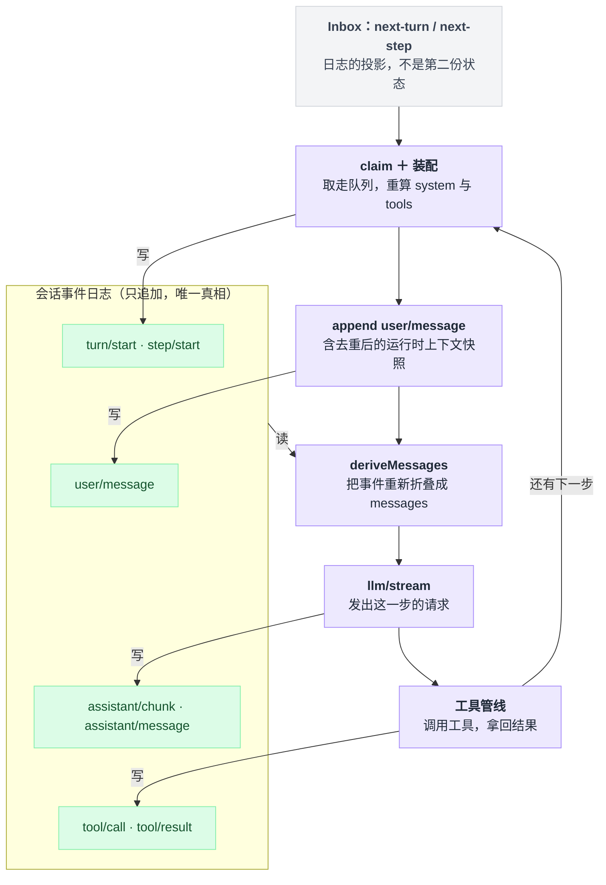
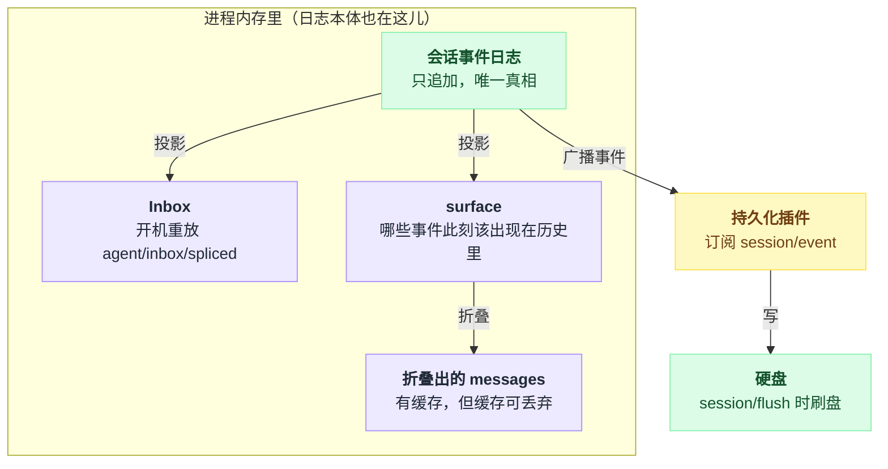
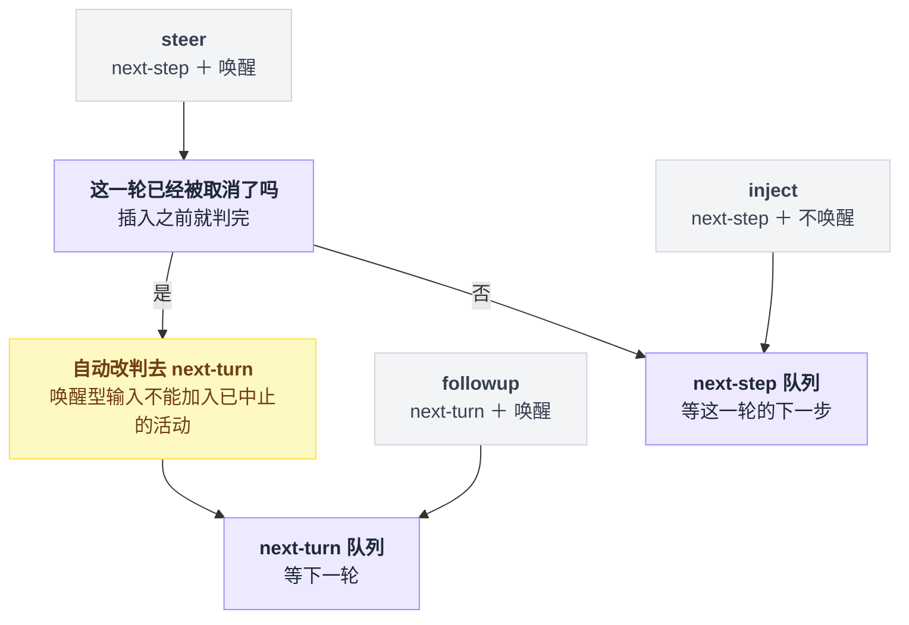
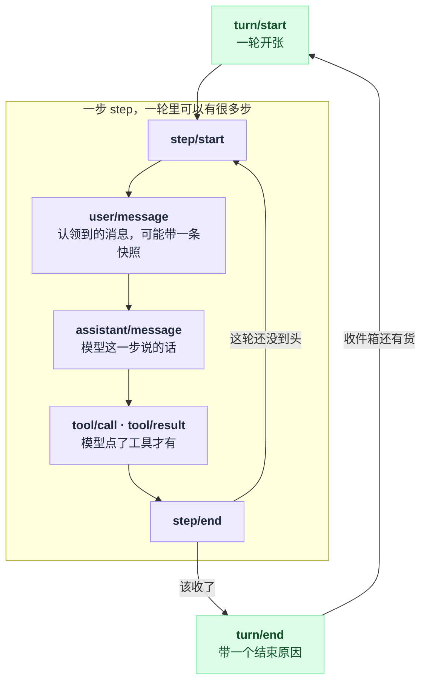
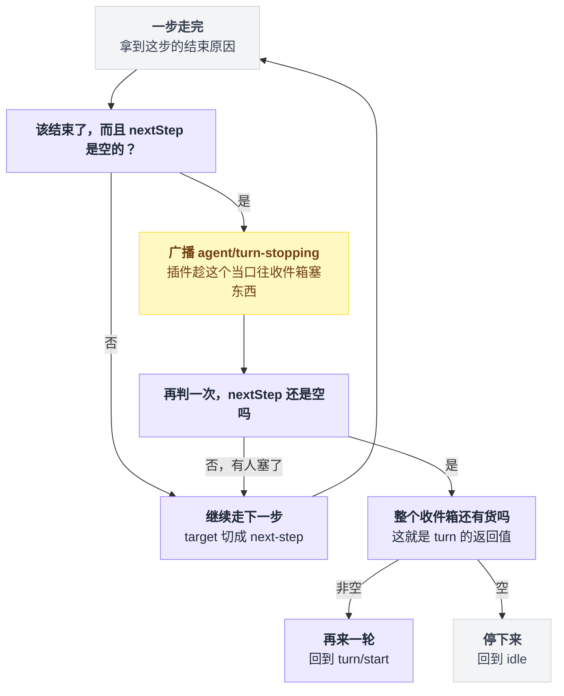

# 01 · 数据住在哪，循环靠什么转

> 基于 `deepseek-ai/deepseek-harness` v0.1.0-rc.5（commit `47f9438`），2026-08-14 核对。

上一章讲了 harness 和框架的区别，那是外部视角。这一章换到内部：你在输入框里敲一句话按回车，到模型真的看见它，中间到底发生了什么。

我建议在动手写任何插件之前先读完这一章。原因很实际——dsh 里几乎所有"我以为它会这样、结果它那样"的困惑，追到底都是同一件事没搞明白：**这个系统里只有一份真数据，其它你看到的东西全是它的影子。**

---

## 只有一份真数据

先说结论，后面整章都在解释它：

**一条只追加的事件日志是唯一真相。模型历史、待办队列、可见范围，全都是从这条日志算出来的。**

这句话听起来平平无奇，直到你意识到它排除了什么。

大多数 agent 实现里有一个 `messages` 数组。你往里 push，压缩时 splice 掉一段，分叉时 slice 一份副本。数组就是状态本身。这么写没错，能跑，绝大多数项目都这么干。

dsh 不维护这个数组。它维护一串事件——"第 3 步开始了"、"模型说了这句"、"工具被调用了"、"收件箱插进来一条消息"——然后每次要发请求时，**把这串事件重新折叠成 `messages`**。折叠函数是纯的，同样的日志永远折叠出同样的历史。

两种写法的差别不在性能，在于**能不能回头**。

数组被 splice 掉的那段就没了。日志里的事件则一个字节都不会少，压缩只是往后追加一条"从这里到这里，改用这段摘要显示"。所以三天后你想知道当时到底给模型看了什么，答案是可计算的，不是"如果当时打了日志的话"。

fork、replay、审计这三件事在 dsh 里都不需要额外机制，因为它们本来就是"换个起点重新折叠一遍"。

把这句话摊成形状是这样：主链路竖着往下走，每一步不是往那条日志里写，就是从它读回来重新折叠。



---

## 那些看起来像存储的东西，其实都是投影

这里有个我自己一开始读错了的地方，值得单独讲。

dsh 的 agent 有个收件箱（inbox），装着还没被处理的用户输入。它长得非常像一个普通的内存队列：两个数组，`next-turn` 和 `next-step`，往里塞、从里取。我第一遍读的时候顺手就把它归类成"运行期临时状态，进程一关就没了"。

错了。翻到构造函数才发现，它开机第一件事是**从会话日志里重放**——遍历所有事件，挑出 `agent/inbox/spliced` 那些，一条条重新应用。类的注释写得明明白白：a replay-once projection。

再往下看每一次修改队列的路径，全都汇到同一个私有方法 `mutate()`。它做事的顺序是这样：

```
mutate(splice):
    session.append('agent/inbox/spliced', splice)   // 先落日志
    apply(splice)                                    // 再改内存数组

启动时:
    for e in 全部事件:
        if e is agent/inbox/spliced: apply(e)        // 重放一次，仅此一次
```

**先落日志，再改内存。** 连"从队列里取走一批消息去处理"这种看着像读的操作也走这条路，因为取走同样是一次状态变化。

出处都在 `packages/core/agent/src/inbox.ts`：两个数组见 `:26`，开机重放见 `:32`，`mutate()` 里的 `session.append` 见 `:186`，取走一批见 `:71`。

所以收件箱不是第二份状态，它是日志的第二个投影。

这解释了一件否则很奇怪的事：为什么 dsh 能在进程重启后接着跑一个中途被打断的会话——因为"还有什么没处理完"这个信息，本来就写在日志里。

同样是投影的还有两个：

**surface**（可见面）是日志上的一层索引，记录哪些事件当前该出现在模型历史里。压缩不删事件，它改的是这层索引。

**折叠出来的 `messages`** 有缓存，但缓存本身是可丢弃的——每个节点只投影一次，surface 一旦被重写就整体重算（`packages/core/session/src/index.ts:717`）。

日志本体也只活在内存里。存不存硬盘是插件的事：模块注释直接说了 persistence is a plugin concern，插件订阅 `session/event`，在 `session/flush` 时刷盘（`session/src/index.ts:3`）。连"要不要落盘"都被拆成了可插拔的一层，这很符合这个项目的一贯作风。

所以内存和硬盘的分界不在日志那一头，而在更外面一层：



---

## 输入怎么进来：三个门，一道闸

用户说话、插件插话、工具返回结果，这三件事在 dsh 眼里是同一类事：往收件箱里塞东西。

对外有三个方法，但它们只是同一个 `send()` 的三种参数组合（`packages/core/agent-loop/src/agent.ts:113`）：

```ts
followup(m)  →  send(m, 'next-turn', true)    // 新起一轮，叫醒它
steer(m)     →  send(m, 'next-step', true)    // 插进当前这轮的下一步，叫醒它
inject(m)    →  send(m, 'next-step', false)   // 插进下一步，但别打扰它
```

两个正交的维度就够了：

| 方法 | 进哪个队列 | 要不要唤醒 |
|---|---|---|
| `followup` | `next-turn`（下一轮） | 唤醒 |
| `steer` | `next-step`（这轮之内） | 唤醒 |
| `inject` | `next-step`（这轮之内） | 不唤醒 |

三种组合覆盖了全部输入语义，没有第四种需求。

有个细节容易被忽略，但踩上了很难查。如果当前这一轮已经被取消（用户点了停止），这时候来一条"叫醒型"的输入，它不会挤进那个正在死掉的轮次，而是被自动改判去 `next-turn`。源码注释解释了原因：唤醒型输入不能加入一个已中止的活动。而且这个判断在插入之前就做完了，防止插入过程中触发的回调把分类又改回去。改判逻辑见 `:115`–`:118`。

连着那道改判一起看，输入进门的全貌是这样：



写续跑类插件时这条尤其要记住：你在 `steer()` 里塞的东西，未必落在你以为的那一轮里。

---

## 一次请求怎么装配：稳的放前面，动的放尾巴

这是整套设计里最有工程价值的一段，而且理由特别朴素——**prompt 缓存要求前缀逐字不变。**

一次请求由四部分组成，dsh 按"会不会变"把它们排了序：

```
system prompt      每步重新装配，但内容力求字节稳定
tools schema       同上
messages           从日志折叠，只在尾部增长
  └─ 最后可能有一条：运行时上下文快照（cwd、git 状态之类）
```

关键是最后那条。

cwd、当前分支、时间——这些天然是动态信息，按直觉应该塞进 system prompt，因为它们是"环境说明"。dsh 偏不。**动态信息一律不进 system prompt，全部当成一条普通的 user message 追加在历史尾部。**

理由就是缓存。把 cwd 拼进 system prompt，等于每次 cwd 一变就让整个前缀失效，后面几万 token 的历史全部重新计费。放在尾部则只影响尾部。

更进一步，这条快照还会去重：跟上次一模一样就干脆不生成。连跑四十步 cwd 没动过，历史里就只有一份，而不是四十份内容相同的噪音。

装配的整个流程在 `preStep()` 里，读起来很顺：

```
preStep():
    msgs     = inbox.claim()          // 认领这一步要处理的消息
    system   = 装配 system prompt
    tools    = 装配 tools schema
    snapshot = 渲染运行时上下文
    if snapshot == 上次的:  snapshot = 无      // 一模一样就不生成
    return waterfall('...', [msgs, snapshot?])  // 插件有机会改写整个决定
```

最后那步是个 waterfall 事件，交出去的是 `[认领到的消息, 快照?]`，插件可以在这里推翻前面所有决定。

请求头（system 和 tools）也有同样的去重逻辑：内容没变就不重复往日志里写。

出处：`preStep()` 见 `agent.ts:225` 起；快照去重见 `packages/core/agent-loop/src/runtime-context.ts:67`；请求头去重见 `packages/core/session/src/request-header.ts:1`–`:5`。

一句话总结这一节：**稳定的放前面反复命中缓存，变动的放尾巴且只在真变了才写。**

---

## 循环靠什么转：一个队列的长度

agent 什么时候继续、什么时候停下来？这个问题在很多实现里的答案是一个状态机，或者一个 `shouldContinue` 标志。

dsh 的答案是：**看队列里还有没有东西。**

外层循环短得有点滑稽（`agent.ts:212`）：

```ts
while (await this.turn()) {}
```

`turn()` 返回 true 就再来一轮。它凭什么返回 true？函数最后一行：收件箱空了就 false，还有货就 true（`:324`）。

轮和步的嵌套关系，日志上的事件恰好就是它的边界：



内层是一轮之内的步进，退出判据写了两遍，中间夹着一次询问（`:295`–`:299`）：

```ts
if (turnEnds && this.inbox.nextStep.length === 0) {
  await this.dispatch.serial('agent/turn-stopping', { turn, signal })
}
if (turnEnds && this.inbox.nextStep.length === 0) break
```

把内外两层串起来，整个进退就是三次问队列长度：

```
while turn():                       # 外层：turn 返回 true 就再来一轮
    pass

turn():
    每走完一步:
        if 该结束 and nextStep 为空:
            广播 agent/turn-stopping      # 插件可以在这一刻往收件箱塞东西
        if 该结束 and nextStep 为空:
            break                          # 塞了就不成立，继续下一步
    return 收件箱非空                       # 这就是外层的续跑条件
```

先判断一次：这轮该结束了，而且没有待处理的下一步。这时候不立刻退出，而是先广播一声"我要停了"。任何插件都可以在这个当口往收件箱里塞东西。塞完之后**再判断一次**——队列非空，那就不停，继续走下一步。



于是三件表面上完全不同的事情，在机制上是同一件：

| 表面上发生了什么 | 机制上是什么 |
|---|---|
| 模型发了工具调用 | 工具结果进队列，非空，继续 |
| Ralph 那种"跑完一轮自动开下一轮"的插件 | 在停止事件里塞一条新指令，非空，继续 |
| 用户在 agent 快停下来的时候补了一句话 | 消息进队列，非空，继续 |

它们走的是同一段代码，共用同一个判据。这也是为什么你自己写续跑插件时不需要任何特殊接口——把消息塞进那个队列就行了，循环自然会转下去。

---

## 谁来保证没人作弊

前面这套逻辑有个明显的软肋。

日志是真相，靠的是"所有影响模型输入的东西都走日志"这条纪律。万一某个插件绕开日志，直接往请求里加了几条消息呢？那 replay 出来的历史和当时真发过的就对不上了，前面说的可回放、可审计全部作废。

dsh 为此准备了一道检查：在模型调用这一层拦一刀，把请求里的 `messages` 和"此刻从日志折叠出来的 messages" 做 JSON 逐字比对，不一致就抛错，错误信息就叫 log-reconstruction desync。它还顺带核对 system、tools、model、temperature 这些是不是和日志里记的请求头一致。

注册时带了 `prepend`，附带一行注释解释为什么：防止某个会短路的 replay 监听器把这道检查静音掉。挺讲究的。

出处都在 `packages/core/agent-loop/src/invariant.ts`：逐字比对见 `:41`，请求头核对见 `:51`，`prepend` 注册见 `:20`。

**但这里必须说清楚一件事**：这道检查默认不在启动树里。

它属于 `packages/runtime-diagnostics/invariants` 这个诊断包。服务本身的默认值确实是 `enabled: true`，可是我把三个出厂 bundle 的 `cordis.patch.yml` 全 grep 了一遍，没有任何一行加载它——仓库里真正把它挂起来的地方是一个示例工程。

也就是说，你 `dsh web` 起来的那个进程里，这道闸门是没放下的。

所以准确的说法是：**"唯一能影响模型输入的方式就是往日志里追加事件"这条，是设计纪律加一个可选的自检工具，不是一道默认开着的运行期护栏。** 你自己写插件时想要这层保护，得手动把它挂进配置。

---

## 这套设计买到了什么，代价是什么

买到的东西前面都说过了：fork、replay、审计是免费的；重启能接着跑；压缩不丢数据；写续跑插件不需要新接口。

代价有三处，都不算小。

**每步都要重新折叠。** 虽然有缓存，但"请求不是攒出来的，是算出来的"这个基本盘意味着任何一次 surface 重写都要整体重算。

**心智负担前移。** 你必须先建立"日志是真相、其它都是影子"这个模型，否则读源码时会不停地问"这个数组是从哪来的"。这也是我把这一章放在正文最前面的原因。

**纪律靠自觉。** 上一节说了，护栏默认不在。插件拿到的是完整的 `ctx`，你想绕开日志直接改请求，运行时不会拦你，只有那道没默认开启的检查会。

---

## 一句话带走

**dsh 把 agent 循环从"维护一个 messages 数组"改写成了"往日志追加事件，每步重新折叠"，而循环的进退外包给了一个队列的长度。**

前半句换来可回放和可审计，后半句让工具续跑、插件续跑、用户插话变成机制上的同一件事。

接下来两章是动手环节：[02 章](./02-五分钟跑起来.md)把它跑起来，[03 章](./03-配置的四层结构.md)讲配置怎么叠。想直接看日志长什么样、怎么 fork，跳到 [16 章](./16-会话日志与分叉.md)。

---

## 本章未确认

- ⚠️ **没有运行过任何代码。** 仓库未安装依赖，本章全部结论来自 commit `47f9438` 上的源码阅读。
- ⚠️ **「三个出厂 bundle 都没加载 invariants」是 grep 得出的否定结论。** 我检索了 `packages/bundle/*/cordis.patch.yml`，没有命中 `invariant`；若存在别的挂载途径（例如某个插件在代码里主动 register），本章没有排查到。
- ⚠️ **prompt 缓存的收益没有实测。** "动态信息放尾部是为了保住前缀缓存"这个因果，是从代码结构和去重逻辑推出来的，仓库里没有基准数据佐证。
