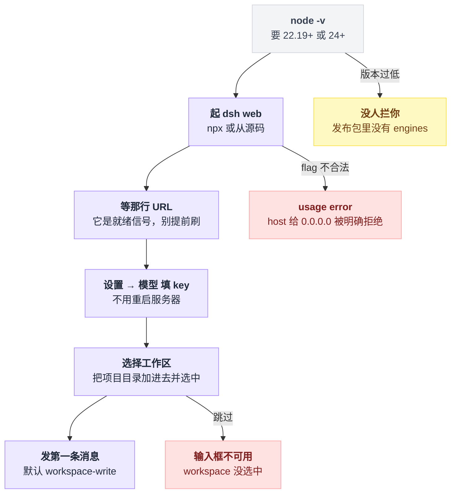
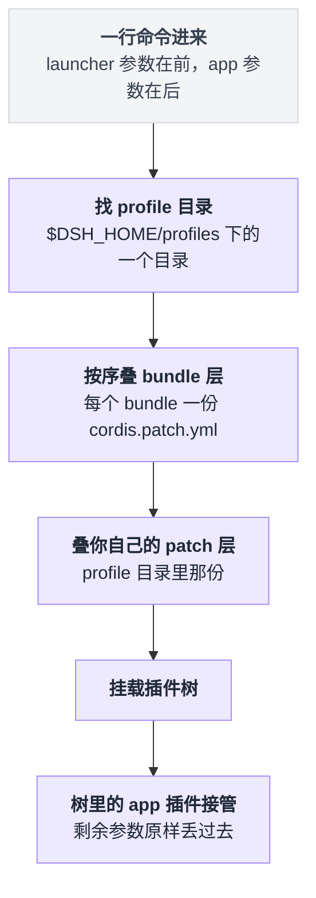
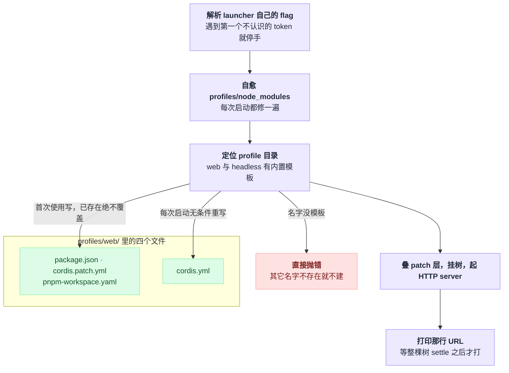
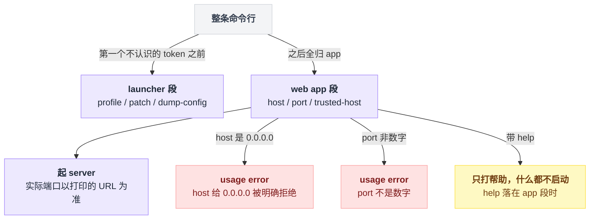
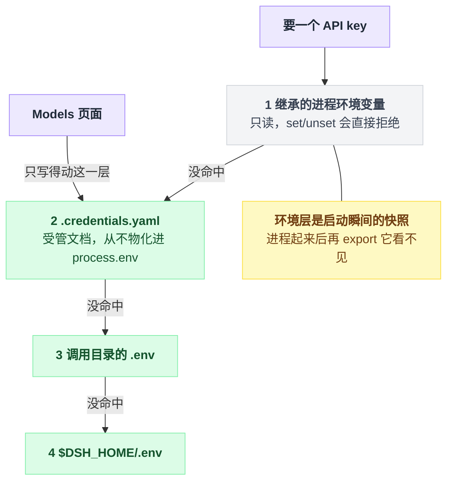
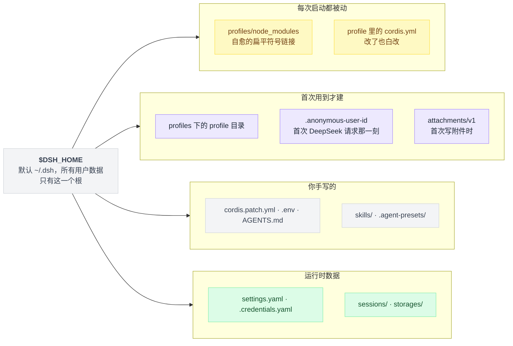
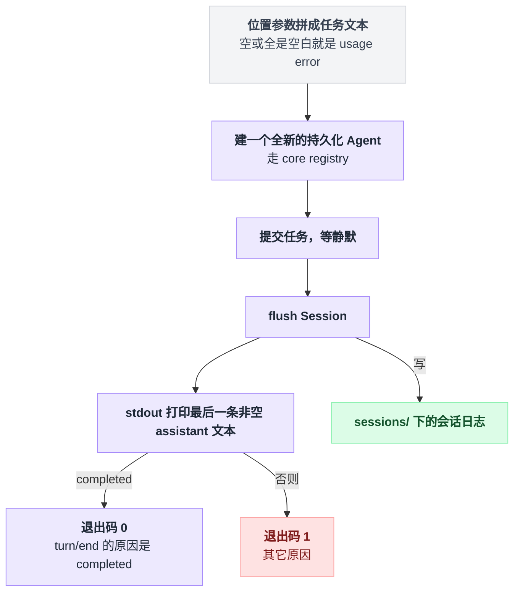

# 02 · 五分钟跑起来

> 基于 `deepseek-ai/deepseek-harness` v0.1.0-rc.5（commit `47f9438`），2026-08-14 核对。正文只留要敲的命令、预期输出和讲解；出处一律收在文末[脚注](#出处)，点角标可跳转；成篇的文件全文收在[附录](#附录可以照抄的模板)。

你现在最想要的，大概是几条能直接照抄的命令。命令马上就给，而且请逐字照敲，别改。

但有个想当然要先拆掉：跑起来不等于装完就没事了。`dsh` 起一次，`~/.dsh` 底下就多出十来个文件和目录——谁写的、什么时候写的、哪个改了也白改，一开始不弄明白，后面调配置、换 key、清状态的时候会反复困惑。

所以这一章分两半：前半段把 Web UI 起起来、配好 key、发出第一条消息，再用 `dsh --profile headless "..."` 跑一个一次性任务；后半段回头做一次逐项的家底盘点，交代**它在你磁盘上留下了什么**。

从零到第一次对话成功是固定的六步，每一步各有一个容易卡住的地方：



---

## dsh 不是 agent，是个启动器

敲命令之前先纠正一个预期：你可能以为装的是一个会自己干活的 agent 程序。不是的，`dsh` 本身不干活。

它是个 **launcher**——找到一个 profile 目录，把里面列的一串 plugin bundle 按顺序叠成一棵插件树，挂载它，然后把剩下的命令行参数原样丢给树里的 app 插件[^1]。

所以 **dsh 没有"主程序"这个东西**。Web UI 只是众多 profile 中的一个。

上一段冒出来的两个名词后面一直要用，画面是这样的[^2]：

一个普通 npm 包，在 `package.json` 里多声明一个 `dsh.bundle.patch` 字段，指向自己带的那份 `cordis.patch.yml`——那个 yml 就是它往插件树上叠的一层。这样的包叫 **bundle**。

在 `$DSH_HOME/profiles/<name>` 下建一个目录，放一个 `package.json`（用 `dsh.profile.bundles` 字段列一份有序的 bundle 清单），再放一份你自己的 `cordis.patch.yml`——这样的目录叫 **profile**。

叠层和交棒的顺序是固定的：



它认识四种入口[^3]：

| 命令 | 干什么 |
|---|---|
| `dsh --profile <name>` | 启动 `$DSH_HOME/profiles/<name>` 下的 profile |
| `dsh --profile headless "job"` | 跑一个全新的持久化会话，打印最终答案，退出 |
| `dsh web` | `--profile web` 的硬编码别名 |
| `dsh plugin --profile <name> <pnpm args>` | 在 profile 目录里转发给 pnpm 管插件（第 22 章） |

不管哪种入口，**调用命令时所在的目录就是默认 workspace 根**[^4]。所以先 `cd` 到你想让 agent 干活的项目里，再敲命令。

环境上只有两个要求[^5]：

| 要求 | 版本 | 什么时候要 |
|---|---|---|
| Node.js | 22.19+ 或 24+ | 一直要 |
| pnpm | 锁的是 11.7.0 | 只有**从源码跑**和 `dsh plugin` 才需要 |

这里有个陷阱值得单独拎出来：**发布出去的那个包自己没有声明 Node 版本。**

发布包的清单里只有包名、可执行入口、文件清单这些字段，没有 `engines`[^6]。上面那个 22.19+/24+ 的范围只写在仓库根，不随包发布。

也就是说 npm 不会在你 Node 版本过低的时候拦住你，报错会以别的形态出现，而且大概率看不出跟 Node 版本有关。动手之前先 `node -v` 自己确认一遍。

---

## 路线 A：`npx` 一行起 Web UI

两行命令[^7]：

```sh
cd /path/to/your/project
npx @deepseek-ai/dsh web
```

**先说清 `dsh` 这三个字母怎么敲。** 本章后文为了短，一律写 `dsh`；走 npx 的读者请把它整个换成 `npx @deepseek-ai/dsh`，从源码跑的换成 `pnpm dsh`。

可执行名 `dsh` 来自发布包清单里的 `bin` 字段[^6]，只有全局装过（`npm i -g @deepseek-ai/dsh`）它才在 PATH 上。仓库文档本身只给了 `npx` 和 `pnpm dsh` 两条路。

启动成功后终端会打印一行 URL，格式是 `dsh web: <url>`，检测到局域网地址时后面追加 `(LAN: http://<addr>:<port>)`。这行由 web-app bundle 自己打印，默认开着。默认地址是 `http://127.0.0.1:3080`——host 和 port 写在 web-app 的 bundle patch 里，启动参数服务没给值时回落到这两个默认[^8]。

这行 URL 不是随手打的日志，它是**就绪信号**：代码专门等 Loader 整棵树 settle 之后才打印，因为监管进程看到它就会发 RPC[^9]。URL 出来之前别急着刷浏览器。

### 第一次启动，它在磁盘上做了什么

一句话：解析自己的 flag → 修 `node_modules` 兜底 → 找（或建）profile 目录 → 挂树起服务。四步里只有第三步会往磁盘写东西，其余三步不留痕迹。

1. launcher 先解析自己的 flag（`--profile` / `--patch` / `--dump-config` / `--dump-default-config`），遇到第一个不认识的 token 就停手，后面全归 app[^10]。
2. **先**自愈 `$DSH_HOME/profiles/node_modules`。这是一个扁平的符号链接目录，dsh 安装里 app 依赖闭包（从 app manifest 的 `dependencies` 做 BFS）中每个包一条链接，**每次启动都修一遍**，好让任何 profile 里写裸插件名都能被 Node 的逐级向上查找解析到[^11]。
3. **再**定位 `$DSH_HOME/profiles/web`。`web` 和 `headless` 这两个名字有内置模板，**首次使用自动初始化**；其它名字不存在就直接抛错，并提示你去跑 `dsh plugin --profile <name> add <package>`[^12]。
4. 按顺序叠 patch 层，挂树，起 HTTP server，打印 URL。

这四步里只有"定位 profile"那步会往 profile 目录写东西，而且分两种写法：



写盘规则拆开就是这样：

```
if profile 目录里的某个文件已存在:
    跳过它                      // 绝不覆盖，所以重跑是幂等的
else if profile 名字有内置模板:
    写 package.json / cordis.patch.yml / pnpm-workspace.yaml   // 只这三个
else:
    抛错，提示你去 dsh plugin add

无条件重写 cordis.yml            // 不看它存不存在，每次启动都盖掉
```

初始化只写三个文件[^13]。但你打开目录会看到四个——多出来的那个 `cordis.yml` 内容是一个空 entry 列表，文件里的注释就写着"改 cordis.patch.yml，不要改这个文件"[^14]：

```
~/.dsh/profiles/web/
├── package.json          initProfile 写：name / private / dependencies / dsh.profile.bundles
├── cordis.patch.yml      initProfile 写：三行说明 + 一行 []
├── pnpm-workspace.yaml   initProfile 写：packages 只含 .、nodeLinker: hoisted、autoInstallPeers: false
└── cordis.yml            每次启动重写：空 entry 列表，改了也白改
```

`package.json` 由 initProfile 现场构造，字段固定为四个：包名、private 标记、空的依赖表、以及那份有序 bundle 清单[^15]，全文见[附录 A](#a-初始化出来的-profile-清单文件)。

`cordis.patch.yml` 的初始模板是三行说明加一行 `[]`[^16]。

有个反直觉的地方：**把内容删干净反而会抛错。** 空文件或只有注释的文件，解析出来是"什么都没有"，而不是"空列表"。想停用这一层，留着那个 `[]`[^17]。

### 端口被占了怎么办

```sh
dsh web --port 8080
dsh web --host 127.0.0.1 --port 8080
dsh web --port 0
```

`web` app 只认三个 flag：`--host`、`--port`、可重复的 `--trusted-host`；`--port 0` 是让操作系统挑一个空闲端口，实际端口以打印出来的那行 URL 为准[^18]。

**`--host 0.0.0.0` 被明确拒绝**，以 usage error 退出，理由直接写在报错文本里：那等于把远程代码执行能力暴露到网络上。想让局域网访问，别指望这条路。非数字的 `--port` 同样是 usage error[^19]。

一条命令行其实是被切成两段交给两个人的，被拒绝也发生在后半段：



切分规则本身很粗暴，一刀切完就不回头：

```
launcher段, app段 = [], []
for tok in 命令行:
    if tok 是 launcher 认识的 flag:   launcher段 += tok
    else:                            app段 = 从 tok 起的全部; break   // 一遇生词就停手
```

这一段最容易踩的两个坑，都跟"flag 归谁管"有关。

**launcher 的 flag 必须排在 app 参数前面。** `dsh --profile web --help` 打的是 web app 的帮助，而且不启动任何东西；`dsh --help` 打的才是 launcher 自己的[^20]。

**flag 能盖住配置，是因为配置行里那个表达式还在。** port 那行写的不是一个死数字，而是一个运行时表达式：先去问启动参数服务要值，问不到才回落到 3080。如果你在自己的 patch 层里把整个 config 换成字面量，就把这个运行时读取删掉了，`--port` 从此失效[^21]。至于为什么 patch 是整体替换而不是深合并，第 03 章讲。

---

## 路线 B：从源码跑

五条命令照抄[^22]：

```sh
git clone https://github.com/deepseek-ai/deepseek-harness.git
cd deepseek-harness
pnpm install
pnpm run build
pnpm dsh web
```

`pnpm dsh` 这个脚本**直接跑 TypeScript 源码入口，不做任何构建**，参数原样转发[^23]。

正因为它不构建，源码路线有三个现象值得先记住，出问题时能少查半小时[^24]：

| 现象 | 原因 |
|---|---|
| profile 启动时报一堆模块解析错误，且没提示你去 build | Typert host 产物缺失，`pnpm run build` 没跑（Typert 是构建期生成 Host 反射产物的那一步） |
| host 产物有了，但启动时提示你运行 `pnpm run build` | 前端 / client 插件 bundle 缺失 |
| 改了前端代码但浏览器里没变化 | **launcher 不检查产物新鲜度**，旧 bundle 会照跑不误 |

第三条尤其阴——它不报错，只是安静地给你旧代码。

`pnpm install` 之后先跑一次 `pnpm run typecheck`。官方把"它成功退出"当作环境搭好了的判据[^25]。

---

## Web UI 起来之后的三步

官方指南的顺序是配模型 → 选 workspace → 发消息[^26]。

### 第一步，配 key——填进去就拿不回明文

打开 **设置 → 模型**，在 DeepSeek 卡片里填 API key 保存。模型路由立即可用，**不用重启服务器**[^27]。

保存之后你再想看它，页面只给你一个脱敏描述符——明文进了 `$DSH_HOME/.credentials.yaml`，settings 里只留一个凭据引用，文件以仅属主可读写的权限写在仅属主可进的目录下。这种"进得去、拿不回"的姿态叫只写[^28]。

但 UI 只是四层来源里的一层。完整的优先级从高到低是这样[^29]：

| 优先级 | 来源 | 能不能从 UI 写 |
|---|---|---|
| 1 | 继承的进程环境变量 | 不能，且 `set`/`unset` 会直接拒绝 |
| 2 | `$DSH_HOME/.credentials.yaml`（受管文档） | 能，Models 页面写的就是这个 |
| 3 | 调用目录的 `.env` | 不在这里写 |
| 4 | `$DSH_HOME/.env` | 不在这里写 |

取一个 key 的时候是从第 1 层往下逐层试，先命中的赢；UI 只够得着其中一层：



环境变量排第一的理由写得很直白：在命令前临时挂一个环境变量的那种单次覆盖，是操作者对**这一次运行**的意图；而且它从程序内部改不了，所以必须**可见地**只读[^30]。受管文档则从不物化进 `process.env`[^29]。

配套有个坑：环境层读的是 launcher 在启动瞬间冻结的环境快照，不是活的进程环境。所以**进程起来之后再 export 一个变量，它永远看不见——改环境变量必须重启**[^31]。

`.credentials.yaml` 的格式就是一个纯映射，没有版本号，没有外层包裹[^32]：

```yaml
DEEPSEEK_API_KEY: sk-…
OPENAI_API_KEY: sk-…
```

任何偏离都是**报错**而不是跳过[^32]：

| 什么时候 | 哪些情况 | 怎么反应 |
|---|---|---|
| 启动时 | 根不是映射、key 不是 POSIX 标识符、值不是字符串、空字符串、重复 key、YAML 坏了 | 直接 fail loud |
| 进程跑起来之后把它改坏 | 同上 | 告警并继续用上一份好快照 |

其它厂商与自定义 OpenAI 兼容端点见第 04 章。

### 第二步，选 workspace——不选中，输入框就是灰的

点**选择工作区**，把启动 `dsh` 时所在的项目目录加进去并选中。

**选中之前会话输入框是不可用的**[^33]，第一次用很容易以为是页面坏了。

这一步在磁盘上落下的是一条持久记录：一个生成的 uuid、一个规范化路径、一个标题，外加属于它的会话列表。这条记录对模型完全不可见——没有工具、没有 prompt 文本、没有会话事件[^34]。

### 第三步，发第一条消息

官方示例就是这句[^35]：

> Summarize this repository and identify its main packages.

新会话默认用 `workspace-write` 权限预设，这个默认值写在 base bundle 的 patch 里：先看环境变量 `DSH_PERMISSION_MODE`，没设就回落到 workspace-write；配套的审批策略默认是 ask[^36]。

它的含义值得逐字读一遍：**bash 与文件写被限制在会话 workspace 和平台临时目录内；读、网络访问、进程可见性不受限制**[^37]。

需要审批的操作会先弹窗问你[^38]。沙箱到底管什么、不管什么，第 18 章有完整边界。

---

## `~/.dsh` 里到底有什么

harness home 的解析顺序是：显式配置的路径 > `$DSH_HOME` 环境变量 > `~/.dsh`。空白值视为未设置，所以一个空的 `DSH_HOME` 不会把 home 解析成当前目录[^39]。所有用户数据只有这**一个根**。

```
~/.dsh/
├── profiles/
│   ├── node_modules/            自愈的扁平符号链接兜底
│   ├── web/                     package.json + cordis.patch.yml + pnpm-workspace.yaml + cordis.yml
│   └── headless/
├── cordis.patch.yml             home 级 patch 层
├── settings.yaml                用户设置文档（Models 页面写这里）
├── .credentials.yaml            受管密钥
├── .env                         用户级环境层
├── AGENTS.md                    用户全局指令
├── .anonymous-user-id           匿名 UUID
├── sessions/                    会话日志
├── storages/                    JSON 存储单元（workspace 记录等）
├── attachments/v1/              图片附件
├── skills/                      用户级 skills
└── .agent-presets/              用户级 agent preset
```

盘点要回答的问题只有一个：**每个文件是谁动的、什么时候动的。**先按"什么时候被写"摊开成一张图：



再按"谁动它"分三组逐项过一遍。

**dsh 自己写、你别管的：**

`profiles/<name>/` 由 initProfile 在首次使用时自动建，内容是一个可启动组合（manifest 加你自己的 patch 层），细讲在第 21 章。

`profiles/node_modules/` 每次启动自愈一遍，作用是让任何 profile 里的裸插件名可解析[^11]，同样属于第 21 章。

`.anonymous-user-id` 更懒一些，**首次真正用到时才建**，也就是 DeepSeek 请求发出的那一刻。内容是一行裸 UUID v4，删掉它下次启动就换一个身份[^40]，第 23 章细讲。

**你手写的：**

home 级的 `cordis.patch.yml` 放各 profile 共享的机器本地偏好，注意它**优先级高于 profile 级那份**[^41]。

`.env` 是普通启动环境层，被调用目录的 `.env` 压过，值会被物化进 `process.env`[^42]，配置怎么叠是第 03 章。

`AGENTS.md` 是用户全局指令，在发现顺序里排在最前[^43]，第 14 章讲。

`skills/` 是用户级 skill 根，rank 400[^44]，第 19 章讲。`.agent-presets/` 是用户级 agent preset 根[^45]，第 18 章讲。

**两边都可能写的，以及纯运行时数据：**

`settings.yaml` 是运行时用户设置，Models 页面写它，你也可以手写，支持热重载；文档不存在时以仅属主权限独占创建[^46]。`.credentials.yaml` 同理，是受管密钥文档[^47]。这两个都在第 03 章细讲。

`sessions/` 由 JSONL 持久化后端写，根路径挂在 harness home 的 sessions 目录下[^48]，每会话一份 append-only 日志，第 15 章讲。

`storages/` 由 JSON 存储后端按需以仅属主权限创建，每个存储单元一个以单元名命名的 json 文件，workspace 记录走这里。有个细节容易忽略——它的根路径是 **web-app bundle** 给的，headless 根本不挂它[^49]。

`attachments/v1/` 归 attachment-local 管，目录**首次写附件时**才以仅属主权限建；它存的是图片字节，会话日志里只留内容寻址引用[^50]。

`sessions/` 内部是三层结构[^51]：

```
~/.dsh/sessions/
  --<规范化后的cwd>--/        可读的项目目录，无 cwd 时是 _no-cwd/
    <编码后的会话id>/
      session.jsonl.zstd      默认：带校验的头帧 + 追加帧
      session.jsonl           仅当把压缩关成 'none'
```

最后三个容易搞混的点，都是我自己第一遍看时想当然过的。

**`settings.yaml` 和 `cordis.patch.yml` 是两回事。** 前者是运行时的用户设置文档，Models 页面写它，热重载；后者是**插件树的配置补丁层**，决定挂哪些插件、每个插件拿什么配置。第 03、04 章分别细讲。

**`~/.dsh` 与项目里的 `.dsh/` 不是一个东西。** 项目根下的 `.dsh/skills` 是项目级 skill 根，rank 100，优先级高于用户级的 rank 400，因为 rank 数字小的赢[^52]。

**想试新配置，换 home 比改文件安全。** `DSH_HOME=/tmp/dsh-test npx @deepseek-ai/dsh web` 会得到一整套干净的 profile、会话和凭据。注意匿名身份是按 home 隔离的，换 home 就换身份[^40]。

---

## headless：一次性跑一个任务

```sh
cd /path/to/your/project
DEEPSEEK_API_KEY=sk-… dsh --profile headless "run the tests"
```

`headless` 也是自动初始化的模板 profile，bundle 列表是 base + headless[^53]。

它的行为契约在 CLI 参考文档里逐条写死，而且逐条都对得上 headless bundle 的实现[^54]。整条链路是直的：

```
task = 位置参数按空格拼接
if task 为空或全是空白:
    usage error                              // 到这里就结束了

agent = core_registry.建一个全新的持久化 Agent()
agent.提交(task)
等静默
session.flush()

print(本次区间里最后一条非空 assistant 文本)   // 走 stdout
exit(0 if turn/end 的原因 == 'completed' else 1)
```

也就是说：任务文本作为位置参数传入，多个词按空格拼接，空任务是 usage error；拿到任务后通过 core registry 建一个全新的持久化 Agent，提交、等静默、flush；打印的是从本次区间里取到的最后一条非空 assistant 文本；退出码看 `turn/end` 的原因[^55]。

一次 headless 运行的链路是直的，分叉只在最后一步：



它不挂什么也同样重要：没有 Host、HTTP server、Web runtime、浏览器插件——这份"不挂清单"写在 headless 的 bundle patch 里；ApiProxy 那一项只见于参考文档[^56]。

对外表现干净到可以直接进管道和 CI[^57]：

| 场景 | 表现 |
|---|---|
| 一次干净的运行 | stderr 一个字都不写（只有出错才写） |
| 任何情况 | 不开任何监听端口 |

没有 UI 就**没法用 Models 页面配 key**，所以 key 只能来自四层里的其它三层：环境变量、`$DSH_HOME/.credentials.yaml`、两个 `.env`。上面示例里那个行内环境变量就是最省事的写法。

headless bundle 还把 system prompt 的 persona 换成了一句带 `{{model}}` / `{{cwd}}` 占位的固定模板，并关掉了 HMR 行[^58]。

`Ctrl+C` 的语义最好提前知道，尤其是在脚本里判断退出码的时候[^59]：

| 信号 | 发生什么 |
|---|---|
| 第一个 `SIGINT`/`SIGTERM` | 启动优雅关闭，插件树最多有五秒 dispose |
| `SIGTERM` 退出码 | 各平台都退 0 |
| `SIGINT` 退出码 | 130 |
| 第二个信号 | 强制立即退出 |

JSON-RPC 接口、Python SDK、ACP、把 dsh 当库嵌进自己程序，全在第 23 章。

顺手记一下 launcher 自己帮助文本里给的例子[^60]，它本身就是一张入口速查表：

```
dsh --profile web                          boot the web profile (same as: dsh web)
dsh --profile headless "run the tests"     answer one task, print the result, and exit
dsh --profile tui --patch ./extra.yml      boot a custom profile with one extra overlay
dsh --profile tui --resume <session>       arguments after the launcher flags reach the app
dsh --profile web --help                   the web app's own flags and help
dsh plugin --profile tui add <package>     install a plugin into the tui profile
```

想在启动前先看看这棵树长什么样，用 `dsh web --dump-config` / `--dump-default-config`[^61]。怎么读它是第 03 章的内容。

---

## 把这一章串起来

回头把每条结论从它的画面里重新推一遍，推得通就算真懂了：

- dsh 之所以没有"主程序"，是因为它只是 launcher：找 profile、按序叠 bundle、挂树、把剩余参数交棒给 app 插件——Web UI 不过是名叫 `web` 的那个 profile；
- 磁盘痕迹之所以可预测，是因为写盘规则一共两条：**已存在的文件绝不覆盖**（所以重跑幂等），唯独 `cordis.yml` 每次启动无条件盖掉（所以改它白改）；
- `--port` 之所以能盖住配置，是因为配置行里留着那个运行时读取——先问启动参数服务、问不到才回落 3080；把 config 换成字面量，flag 就再也不生效；
- UI 里配好的 key 之所以可能"不生效"，是因为 Models 页面只写得动四层来源里的第 2 层，而第 1 层是启动瞬间冻结的环境快照，永远压着它，改了还必须重启；
- headless 之所以能直接进管道和 CI，是因为它不挂 Host、不开监听端口，干净运行不碰 stderr——答案走 stdout，成败走退出码；
- 而 profile、key、会话、匿名身份，最终都落在 `$DSH_HOME` 这一个根下面——想试新配置，换 home 就是换一整套世界。

搞清楚"哪个文件是 dsh 写的、哪个是你写的、哪个每次启动都会被重写"，后面几章的配置叠加就不会再让你意外。

---

## 附录：可以照抄的模板

### A. 初始化出来的 profile 清单文件

首次启动 web profile 时 initProfile 写下的 `package.json` 全文，四个字段一个不多[^15]：

```json
{
  "name": "dsh-profile-web",
  "private": true,
  "dependencies": {},
  "dsh": {
    "profile": {
      "bundles": ["@deepseek-ai/dsh-base", "@deepseek-ai/dsh-web-app"]
    }
  }
}
```

---

## 出处

[^1]: launcher 的定义与交棒行为：`apps/cli/README.md:5`、`:20`。
[^2]: bundle 与 profile 的定义（`dsh.bundle.patch` 指向包内 patch 文件、`dsh.profile.bundles` 是有序清单）：`packages/boot/app-boot/README.md:38`。
[^3]: 四种入口：`apps/cli/README.md:11-14`；`dsh web` 是 `--profile web` 的硬编码别名：`apps/cli/src/args.ts:156`、`:168`。
[^4]: 调用目录即默认 workspace 根：`apps/cli/README.md:16`、`apps/cli/reference/README.md:68`。
[^5]: Node 版本范围原文 `"node": "^22.19.0 || >=24.0.0"`：仓库根 `package.json:8-9`，`docs/development.md:11` 也写了；pnpm 锁定 `pnpm@11.7.0` 且仅源码路线需要：`docs/development.md:12`、`apps/cli/reference/README.md:43`。
[^6]: 发布包清单只有 name / bin / files 这些字段、没有 `engines`：`apps/cli/package.json:2`、`:14-16`；可执行名 `dsh` 就来自其中的 `bin` 字段。
[^7]: Web UI 启动命令：`README.zh.md:20`。
[^8]: URL 打印逻辑与 LAN 追加：`packages/bundle/web-app/src/index.ts:168`；`printUrl: true`：`packages/bundle/web-app/cordis.patch.yml:134`；默认 host/port（`ctx.webStartup` 没给值时回落 127.0.0.1:3080）：`packages/bundle/web-app/cordis.patch.yml:119-120`。
[^9]: 等 Loader 整棵树 settle 后才打印、监管进程以它为就绪信号发 RPC：`packages/bundle/web-app/src/index.ts:159-173`。
[^10]: launcher flag 解析、遇到第一个不认识的 token 停手：`apps/cli/src/args.ts:131-134`、`:123-128`。
[^11]: `profiles/node_modules` 每次启动自愈（从 app manifest 的 dependencies 做 BFS，每包一条符号链接）：`packages/boot/app-boot/src/profile.ts:204-219`，调用点：`apps/cli/src/profile-boot.ts:99`。
[^12]: 定位 profile：`apps/cli/src/profile-boot.ts:100`；内置模板与"名字不存在就抛错并提示 dsh plugin add"：`packages/boot/app-boot/src/profile.ts:376-384`。
[^13]: initProfile 只写三个文件：`packages/boot/app-boot/src/profile.ts:152-168`。
[^14]: `cordis.yml` 每次启动重写成空 entry 列表、文件内注释叫你改 patch 别改它：`apps/cli/src/profile-boot.ts:60-67`、`:101`。
[^15]: profile `package.json` 的现场构造与四个固定字段：`packages/boot/app-boot/src/profile.ts:156-162`；bundle 列表来源：`:115`。
[^16]: patch 初始模板（三行说明 + 一行 `[]`）：`packages/boot/app-boot/src/profile.ts:127-131`。
[^17]: 空文件解析为"什么都没有"而非"空列表"、想停用留 `[]`：`packages/boot/app-boot/README.md:43`。
[^18]: web app 的三个 flag：`packages/bundle/web-app/src/startup.ts:48-50`；`--port 0` 交给操作系统挑：`:49`。
[^19]: 拒绝 `0.0.0.0`（usage error，报错文本给出远程代码执行的理由）：`packages/bundle/web-app/src/startup.ts:69-70`、`apps/cli/reference/README.md:64`；非数字 port：`packages/bundle/web-app/src/startup.ts:72-73`。
[^20]: `dsh --profile web --help` 打的是 web app 的帮助且不启动：`apps/cli/reference/README.md:17`。
[^21]: port 配置行原文 `!!js ctx.webStartup.port ?? 3080`、换成字面量则 flag 失效：`apps/cli/reference/README.md:19`。
[^22]: 源码路线五条命令：`README.zh.md:30-34`。
[^23]: `pnpm dsh` 脚本原文 `node --import tsx/esm apps/cli/src/bin.ts`：仓库根 `package.json:136`；不构建、参数原样转发：`apps/cli/reference/README.md:84`。
[^24]: 三个现象及原因：`apps/cli/reference/README.md:84`；Typert 是构建期生成 Host 反射产物的那一步：`docs/development.md:76`。
[^25]: typecheck 成功退出即环境搭好：`docs/development.md:34-40`。
[^26]: 官方指南三步顺序：`docs/user/guide/index.zh.md:7-23`。
[^27]: 填 key 立即生效、不用重启：`docs/user/guide/index.zh.md:9`。
[^28]: 只写姿态与脱敏描述符：`docs/user/guide/providers.md:13`；文件 0600、目录 0700：`packages/credentials/credentials-local/README.md:40`。
[^29]: 四层优先级：`packages/credentials/credentials-local/README.md:7-12`，与 `apps/cli/reference/README.md:76` 一致；受管文档从不物化进 `process.env` 也在 `apps/cli/reference/README.md:76`。
[^30]: 环境变量排第一的理由（单次覆盖是对这一次运行的意图、程序内部改不了所以可见地只读）：`packages/credentials/credentials-local/README.md:14`。
[^31]: 环境层是启动瞬间冻结的快照、改环境变量必须重启：`packages/credentials/credentials-local/README.md:18`、`:70`。
[^32]: 纯映射格式（无 version、无外层包裹）与全部报错情形：`packages/credentials/credentials-local/README.md:31`、`:38`。
[^33]: 选中 workspace 前输入框不可用：`docs/user/guide/index.zh.md:15`。
[^34]: workspace 记录的 uuid 字段：`packages/workspace/workspace/src/types.ts:24`；记录对模型完全不可见：`docs/subsystems/workspace.md:5`。
[^35]: 官方第一条消息示例：`docs/user/guide/index.zh.md:21`。
[^36]: 权限预设默认值原文 `mode: !!js process.env.DSH_PERMISSION_MODE ?? 'workspace-write'`：`packages/bundle/base/cordis.patch.yml:175`；审批策略默认 `ask`：`:191`。
[^37]: workspace-write 的含义原文：`apps/cli/reference/README.md:70`。
[^38]: 需要审批的操作先弹窗：`docs/user/guide/index.zh.md:23`。
[^39]: home 解析顺序与"空白值视为未设置"：`packages/util/home-paths/README.md:9`、`packages/util/home-paths/src/index.ts:87-91`。
[^40]: 匿名 id 首次 DeepSeek 请求时才建（`getOrCreateAnonymousUserId()` 的调用点）：`packages/llm/llm-deepseek/src/adapter.ts:222`；一行裸 UUID v4、删掉即换身份、按 home 隔离：`packages/identity/anonymous-user-id/README.md:5`、`:7`。
[^41]: home 级 patch 优先级高于 profile 级：`packages/boot/app-boot/README.md:43`。
[^42]: `$DSH_HOME/.env` 的层级（被调用目录 `.env` 压过）与物化进 `process.env`：`packages/boot/app-boot/README.md:42`。
[^43]: `AGENTS.md` 在发现顺序里排最前：`packages/context/agent-instructions/src/files.ts:280`；文件名常量：`packages/context/agent-instructions/src/render.ts:98`。
[^44]: 用户级 skill 根 rank 400：`packages/skill/skill-filesystem/README.md:38`。
[^45]: 用户级 agent preset 根：常量在 `packages/preset/agent-presets/src/discovery.ts:41`，挂载在 `packages/preset/agent-presets/src/index.ts:134`。
[^46]: `settings.yaml` 的挂载与热重载：`packages/bundle/base/cordis.patch.yml:75-79`；不存在时以仅属主权限独占创建：`packages/settings/settings-file/README.md:30`。
[^47]: `.credentials.yaml` 的受管挂载：`packages/bundle/base/cordis.patch.yml:81-86`。
[^48]: sessions 根路径 `dshHomePath('sessions')`：`packages/bundle/base/cordis.patch.yml:98-101`。
[^49]: storages 按需以 `0o700` 创建、每单元一个 `<unit>.json`：`packages/storage/storage-json/README.md:17`；根路径由 web-app bundle 提供：`packages/bundle/web-app/cordis.patch.yml:57`。
[^50]: attachments 根路径：`packages/attachment/attachment-local/src/index.ts:53`；首次写附件时以 `0o700` 建目录：`packages/attachment/attachment-local/src/store.ts:145-147`；内容寻址引用：`docs/subsystems/attachment.md:7`。
[^51]: sessions 三层结构：`packages/session/session-persistence-jsonl/README.md:9-15`。
[^52]: 项目级 skill 根 rank 100、rank 数字小的赢：`packages/skill/skill-filesystem/README.md:35`、`:38`、`packages/skill/skill/src/index.ts:75`。
[^53]: headless 模板的 bundle 列表：`packages/boot/app-boot/src/profile.ts:116`。
[^54]: headless 行为契约：`apps/cli/reference/README.md:30`。
[^55]: 空任务 usage error：`packages/bundle/headless/src/startup.ts:36`、`:53`；建全新持久化 Agent、提交、等静默、flush：`packages/bundle/headless/src/index.ts:111-127`；取最后一条非空 assistant 文本：`:61-81`、`:129`；退出码看 turn/end 原因：`:133`。
[^56]: 不挂清单：`packages/bundle/headless/cordis.patch.yml:2`；ApiProxy 那一项只见于 `apps/cli/reference/README.md:30`。
[^57]: 干净运行不写 stderr、不开监听端口：`packages/bundle/headless/src/index.ts:130-132`。
[^58]: persona 固定模板与关掉 HMR 行：`packages/bundle/headless/cordis.patch.yml:7-15`。
[^59]: 五秒 dispose：`apps/cli/src/process-shutdown.ts:4`；退出码（SIGTERM 各平台退 0、SIGINT 退 130）：`apps/cli/src/profile-boot.ts:221-222`；第二个信号强制退出：`apps/cli/src/process-shutdown.ts:11`、`apps/cli/reference/README.md:66`。
[^60]: 帮助文本里的例子原文：`apps/cli/src/args.ts:66-71`。
[^61]: dump 两个 flag：`apps/cli/src/args.ts:164-165`、`apps/cli/reference/README.md:39`。
