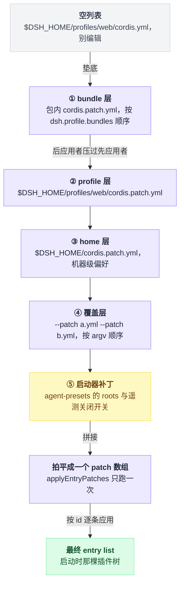
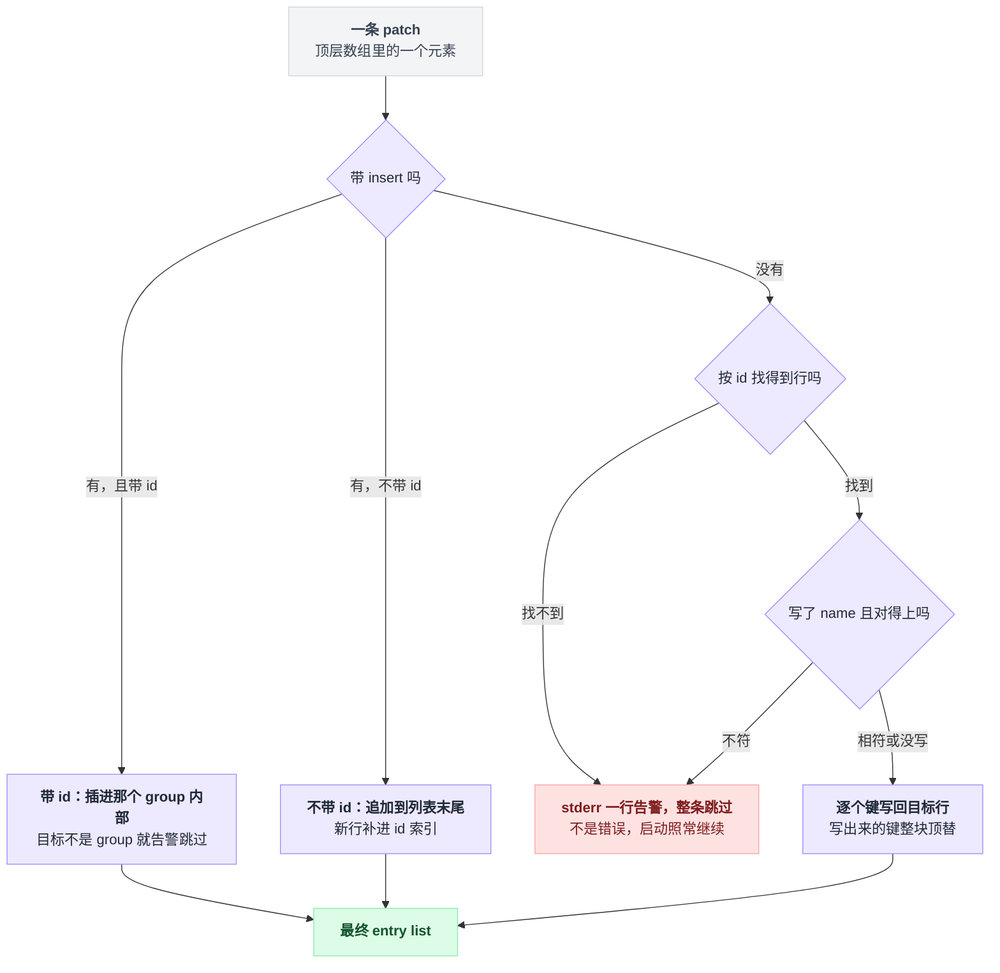
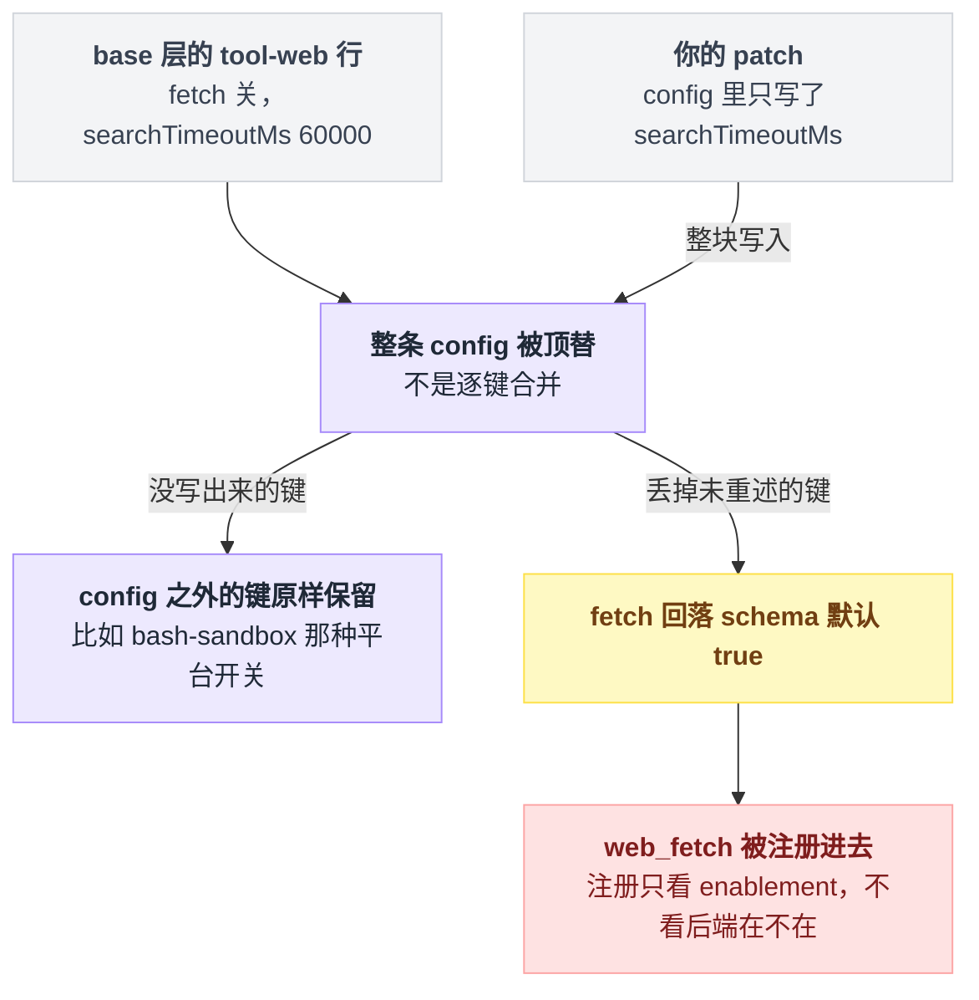
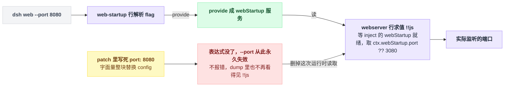
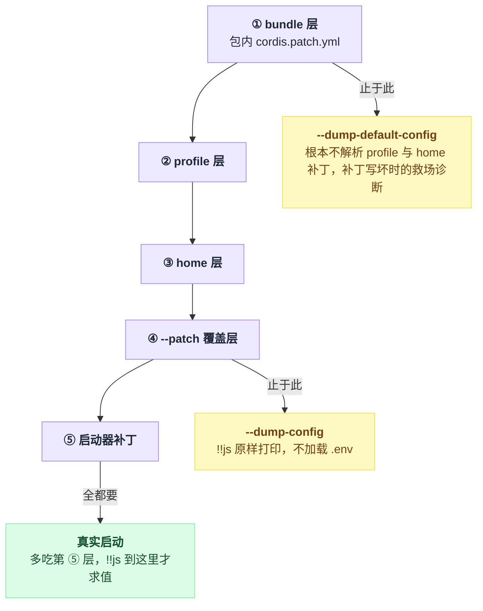

# 03 · 配置的四层结构

> 基于 `deepseek-ai/deepseek-harness` v0.1.0-rc.5（commit `47f9438`），2026-08-14 核对。正文只讲机制；可照抄的代码统一收在文末[附录](#附录可以照抄的模板)，出处收在[脚注](#出处)，点角标可跳转。

你想把 Web 端口从 3080 改成 8080，于是翻遍 `~/.dsh` 找那个写着默认端口的配置文件。找不到。

不是你找的姿势不对，是那个文件压根不存在。dsh 里没有"配置文件"这个东西，只有**补丁**——一层层叠上去，最后叠出启动时那棵插件树。

这一章讲这几层是谁、按什么顺序叠，以及那个会反复咬人的坑：**patch 按 `id` 整体替换 config，不做深合并**。

所以"我只改了一个数字"经常等于"我顺手删掉了三个没看见的字段"，其中可能包括让 `--port` 生效的那行表达式。改完不报错，只是从此静默失灵。

---

## 端口写在哪：一段带表达式的 bundle 补丁

默认端口在 bundle 包自带的补丁里[^1]：

```yaml
# packages/bundle/web-app/cordis.patch.yml:115-120
- id: webserver
  name: '@deepseek-ai/dsh-host-webserver'
  inject: [webStartup]
  config:
    host: !!js ctx.webStartup.host ?? '127.0.0.1'
    port: !!js ctx.webStartup.port ?? 3080
```

这六行里有三个陌生记号，各自背后是一个动作。

config 里那两行表达式读的 `webStartup`，是别的插件挂在 ctx 上、供这一行取用的对象——这种对象有个名字，叫 **service**（服务）。

`inject` 那一行说的是"别急着求值"：这一行要等 `webStartup` 这个服务就绪才求值挂载（第 07 章展开）。

`!!js` 后面那截不是字符串，是先存着、以后才算的表达式——这套 YAML 方言里的惰性表达式（后面专门有一节讲它）。

改端口有三条路，代价差得很远。

| 做法 | 持久吗 | `--port` 还管用吗 | 代价 |
|---|---|---|---|
| A. `dsh web --port 8080` | 不持久 | — | 零代价 |
| B. patch 里重述表达式 | 持久 | 仍然管用 | 得把 `!!js` 那两行照抄一遍，抄漏了不会有任何提示 |
| C. patch 里写字面量端口 | 持久 | **永久失效** | 最省事，代价见头号坑一节 |

A 之所以能生效，是因为 `--port` 由 `web-startup` 插件解析后 provide 成 `webStartup` 服务，上面那行表达式优先读它；C 的"永久失效"是官方参考文档明写的[^2]。B 改的是 profile 层的补丁文件——它在哪，下一节的表里有；成品长什么样，照抄[附录 A](#a-改-web-端口的-profile-补丁)。

先把机制说清楚，否则 C 这种写法你会一路踩到底。

---

## 那棵树是怎么攒出来的：一个空列表，加若干层补丁

profile 目录里确实躺着一个 `cordis.yml`，看着很像"真正的配置文件"。别编辑它——它每次启动都被覆写成一个空数组[^3]。

它存在的唯一理由是给 **Loader**（Cordis 的配置加载器，第 05 章讲）一个真实的 include 根，好把相对路径的基准目录锚在 profile 目录上。

每次重写则是为了自保：Loader 的树回写可能把已组合的行烤进这个文件，下次启动就会把每条 bundle insert 重复一遍[^3]。

真正的内容全是补丁。整个攒树过程一句话：**空列表垫底 → 五层补丁按顺序叠上去 → 全部拍平成一个数组 → 补丁算法跑一次 → 得到插件树。** 五层里只有第 ⑤ 层带前置条件，其余都是照顺序叠。

```text
空列表 []          ← $DSH_HOME/profiles/web/cordis.yml（每次启动被覆写，别编辑它）
  │
  ├─ ① bundle 层：@deepseek-ai/dsh-base      → packages/bundle/base/cordis.patch.yml
  ├─ ① bundle 层：@deepseek-ai/dsh-web-app   → packages/bundle/web-app/cordis.patch.yml
  │      （按 profile 的 package.json 里 dsh.profile.bundles 的顺序，一个包一层）
  ├─ ② profile 层：$DSH_HOME/profiles/web/cordis.patch.yml
  ├─ ③ home 层：   $DSH_HOME/cordis.patch.yml        ← 跨 profile 的机器级偏好，压过 ②
  ├─ ④ 覆盖层：    --patch a.yml --patch b.yml       ← 按 argv 顺序
  └─ ⑤ 启动器补丁：agent-presets 的 roots、DSH_TELEMETRY_DISABLED 关闭开关
       ▼
   全部拍平成 **一个** patch 数组 → applyEntryPatches 跑一遍 → 最终 entry list
```

覆盖方向就一条规则：下面的先应用，上面的后应用、于是压过下面[^4]。到末尾它们不是五棵树，而是拼成一个数组，补丁算法只跑一次。



注意 ③ 排在 ② 后面——**home 级压过 profile 级**，因为它代表"这台机器上所有 profile 都要这样"。

### 第 ⑤ 层：官方四层说法里没有的那一层

它是启动器自己追加的，两条都带前置条件[^5]：

1. 组合里存在 `agent-presets` 行，就追加一条补丁，把出厂预设目录写进它的 roots；
2. `DSH_TELEMETRY_DISABLED` 非空、且组合里存在 `session-telemetry-otel` 行，就追加一条把它 `disabled` 的补丁。

"非空"是字面意义上的非空——任何值都算，含 `'0'` / `'false'`。

`agent-presets` 这一行只由 web-app 层插入[^6]，所以 `headless` 根本没有它，roots 那条补丁在那边也就不会追加。

它也不会顶掉你自己的预设目录：`includeUserRoot` 默认开着，会在所有配置根之后再追加家目录下的用户预设目录[^7]。

这一层**不会出现在 `--dump-config` 输出里**，是 dump 和真实启动的差异之一，后面那节列全。

### 文件都在哪

这几个文件各自的位置和来历如下[^8]：

| 文件 | 位置 | 谁生成 |
|---|---|---|
| profile 清单 | `$DSH_HOME/profiles/<name>/package.json` 的 `dsh.profile.bundles` 字段 | 首次使用自动初始化 |
| profile 补丁层 | `$DSH_HOME/profiles/<name>/cordis.patch.yml` | 同上，初始内容是空数组 |
| home 补丁层 | `$DSH_HOME/cordis.patch.yml` | 你自己建 |
| bundle 补丁层 | 包内 `cordis.patch.yml`，由包自己的清单里的 bundle 补丁字段声明 | 包作者 |

`$DSH_HOME` 缺省是 `~/.dsh`[^9]。

`web` / `headless` 两个 profile 首次使用自动建。别的名字必须先用 plugin 子命令往那个 profile 里加包，否则启动直接报错并给出这条提示[^10]。

还有个容易被忽略的硬约束：`.env` 文件**不允许**设置任何 `DSH_` 开头的变量，还有 `XDG_` / `DYLD_` / `BASH_FUNC_` 前缀和一批具名变量。写了就在启动时抛错，必须在 shell 里 export[^11]。

所以补丁里那些读环境变量的惰性表达式，值只能从真实环境变量来。

---

## patch 长什么样：一个数组，两种形态

一个 patch 文件就是一个**顶层 YAML 数组**，每个元素是一条 `PatchOptions`[^12]：

| 字段 | 作用 |
|---|---|
| `insert` | 追加新行；配合 `id` 则追加进那个 group 内部 |
| `id` | 定位已有行（非 insert 时必填） |
| `name` | 断言：与目标行的 `name` 不符则整条 patch 跳过并告警 |
| `config` | **整体替换**目标行的 config |
| `disabled` | 关掉一行（`true`） |
| `inject` / `intercept` / `isolate` / `group` | 同名整体替换 |
| 其余任意 entry 字段 | 一律走同一条整体替换 |

几点补充。

所谓 group，是指一行的 config 本身就是一串子行；往非 group 的行里 insert 会告警跳过[^13]。

`disabled` 是唯一能关掉一行的手段，config 里写什么都关不掉[^14]。

最后那行"其余任意 entry 字段"不是省略号：`PatchOptions` 带一个"任意键都收"的索引签名，谁都能进[^12]。

两种形态——带 `insert` 的插新行、按 `id` 改已有行——都有仓库里的真实样例，照抄[附录 C](#c-patch-的两种形态)。

出厂 bundle 就是这么用的。`dsh-base` 整个包只是**一条** `insert`，把 78 行核心插件一次性铺到空列表上；`dsh-web-app` 再按 id 覆盖其中 27 行，另用两条 `insert` 追加 51 行自己的[^15]。

行的先后顺序不代表加载顺序——激活由服务依赖驱动[^15]。

把两种形态合起来看，一条 patch 进到算法里要过的关卡是：先看有没有 `insert`，没有就按 `id` 找行，找到了还得过 `name` 这道断言，最后才逐个键写回。



两种失败方式的待遇差别很大，值得记住：

| 出错方式 | 后果 |
|---|---|
| patch 匹配不到 `id` | **不是错误**，只是 stderr 一行告警，启动照常继续 |
| patch 文件本身写坏（空文件、只有注释、不是数组、元素不是 mapping） | **启动直接失败** |

所以 id 写错会静默不生效，排查时第一个怀疑它[^16]。

而"存在但用不了的补丁文件是配置错误，必须 fail loud"是明写的设计。想临时禁用某一层，请把文件内容写成 `[]`，别把文件清空[^17]。

---

## 头号坑：`config` 是整体替换

整个补丁算法只有七十行，核心就是一个四行的循环：把你这条 patch 里除 `id` 之外的每个键，一句赋值原样写到目标行上——没有递归、没有深合并[^18]。

`config` 只是众多键里的一个，所以**你写的 config 对象整个顶掉旧的**，不是逐键合并。

拿真实的行举例。base 层里 web 工具那一行只有两个键：`fetch` 关着，搜索超时六万毫秒[^19]。你只想把搜索超时改成 120 秒，于是在 profile 补丁里只写了搜索超时那一个键。

结果 `fetch` 没了。它回落到 schema 默认值——而默认值是**开**，于是 `web_fetch` 工具被注册了进去——注册只看配置里的 enablement，不看后端在不在[^20]。

而 base 层是**故意不挂** fetch provider 的，理由就写在补丁注释里："that provider defers SSRF protection and the model would choose the request target"[^21]。

你以为只动了一个数字，实际上把一个项目明确拒绝启用的能力打开了。这一刀落下去的连锁是这样的，最后那一环离你写的那个数字已经很远了：



正确写法是把这行原有的键**全部重述一遍**——先抄原样，再改数字。成品就是[附录 B](#b-放宽两处超时的-profile-补丁)里 `tool-web` 那一段。

三条自保规则：

1. 动某行之前，先 `--dump-config` 把那行的完整 config 抄下来，在它基础上改。
2. 记清楚替换的粒度是**键**不是行：**patch 只覆盖你写出来的那些键，没写的字段原样保留**，`config` 只是最常写的那一个。比如 base 的 `bash-sandbox` 行带着一个"Windows 上自动关掉"的惰性表达式，它写在 `disabled` 键上，你只 patch `config` 时不受影响[^22]。
3. 加一行 `name:` 当断言。写了 `name` 而目标行的 `name` 对不上，整条 patch 跳过并告警[^23]——比默默改错行强。

这也是 bundle 作者自己的纪律。`dsh-web-app` 的补丁开头就写着 "A patch replaces the targeted row's whole `config`, so each row below restates every key it owns"[^24]。

连启动器自己也得守：第 ⑤ 层往 `agent-presets` 加 roots 时，是先把原 config 展开再加键的[^25]。

### 更隐蔽的变种：拍平之后，索引不再更新

源头在"拍平"这个动作。所有层被拼成一个数组，补丁算法从头到尾只跑一趟；而"按 id 找行"用的索引，只在开头对着空列表建那一次，此后只有 `insert` 进来的新行会补进去[^26]。

后果就是：某层若用 `config` 整体替换了一个 **group** 行、从而引入了新的子行，那些子行不是 `insert` 进来的，从来没进过索引。于是后面的层**够不到**它们，只会得到一行"找不到这个 id"的告警然后跳过。

这条语义在源码注释里明写，并被一条测试专门钉死[^27]。

---

## 连带后果：`!!js` 表达式会被一起抹掉

`!!js` 是这套 YAML 方言里的惰性表达式。惰性体现在两步分开[^28]：解析 patch 的时候，那截表达式只被存成一个字符串，**不求值**；等这一行的配置真正被解析的时候，才在该行自己的 context 上求值——做法是把整份 ctx 铺进作用域，直接 eval。

正因为整份 ctx 都在作用域里，表达式里能拿到 ctx（含已注入的服务）、process，以及启动器额外挂上去的一个拼 dsh 家目录路径的助手函数[^29]。

命令行开关就是靠它实现的。临时改端口的那条命令并不是什么"第五层补丁"：`--port` 被一个普通插件（`web-startup` 那一行）解析后 provide 成 `webStartup` 服务，`webserver` 行等它就绪，再求值那行"优先读服务、读不到才用 3080"的表达式[^30]。

这条链路从命令行一路走到真正监听的端口，中间只要有一环被字面量顶掉，后面就断了：



把上一节的替换语义和这里接起来，就得到那个静默失效的机制：**你用字面量替换 config，等于删掉了那次运行时读取。**

仓库里就有一个真实例子：一个 demo 配置把 `webserver` 行的 host 写死成回环地址、端口写死成 3081。它按自己的文件头说明，是通过 `--patch` 应用的第 ④ 层覆盖，不是一棵树；写死也是故意的——demo 要固定在 3081，不抢默认端口[^31]。

但同样的写法搬进你自己的 profile 补丁，就变成了：命令行再传 `--port` 从此没有任何效果，且不报错。官方参考文档一句话概括："a user patch that replaces the whole `config` with literals removes the runtime read"[^32]。

好在有个一眼判断的办法：`--dump-config` 里 `!!js` 是**原样打印、不求值**的[^33]。dump 里某行还看得见 `!!js`，说明表达式还在；看不见了，说明被你抹了。

---

## 实操一：改 Web 端口

**做法 A（临时）**：

```sh
dsh web --port 8080
```

启动器自己的 flag 必须写在前面，从第一个它不认识的 token 起，全部交给 app[^34]。

顺带一提，`--host 0.0.0.0` 会被明确拒绝[^35]。

**做法 B（持久，且保住 `--port`）**：编辑 profile 层的补丁文件，整个文件的内容照抄[附录 A](#a-改-web-端口的-profile-补丁)，一共五行。

那五行做了三件事：重述了 host（不然它丢默认值）、保留了两个惰性表达式（`--host` / `--port` 仍然优先）、加了 `name` 当断言。

`inject` 不用重写，patch 不碰你没写的字段。用户补丁层和 bundle 层用的是同一套 YAML 方言，`!!js` 在这里合法[^36]。

改完直接 `dsh web`，或者先验证一下：

```sh
dsh web --dump-config
```

长驻进程运行期间改这个文件，会被 watcher 事务性重新应用，但**已经绑定的端口不会因此改变**[^37]——端口要重启才生效。

**做法 C**：把附录 A 里那两行表达式换成字面量。能用，代价见上一节。只有当你确实要"钉死、不许命令行覆盖"时才这么写。

想让这台机器上所有 profile 吃同一份设置，把同样内容放进第 ③ 层（home 层）的补丁文件即可。

代价是别的 profile（比如 `headless`）根本没有 `webserver` 这一行，那边启动时会多一行 stderr 告警，但不会崩[^38]。

---

## 实操二：改一个工具的超时

dsh 里"工具超时"分两处，先认清你要改哪个[^39]：

| 想改什么 | 改哪一行 |
|---|---|
| `web_search` / `web_fetch` 的调用预算 | `tool-web` 行的 `searchTimeoutMs` / `fetchTimeoutMs` |
| bash 前台命令的超时 | `bash-sandbox` 行的 `timeoutMs` |
| 谁来执行这个超时 | `timeout-policy` 行，零配置，别动 |

第三行是最反直觉的：`timeout-policy` 插件本身不接受任何 config，它只读取每个工具在自己的工具定义上声明的超时预算，并负责执行[^40]。

**超时永远配在拥有这个工具的插件行上**，不是配在超时插件上。没声明预算的工具（shipped 的 `bash` / `read` / `write` / `edit`）根本不受它管[^40]。

`bash-sandbox` 的超时字段要绕一下才找得到出处：沙箱执行器继承本地执行器并复用它的 Config，字段表因此在 bash-local 的文档里——schema 默认 120000，单次上限 `maxTimeoutMs` 默认 600000，base 层把默认压到了 60000[^41]。

把 web 搜索放宽到 120 秒、同时把 bash 前台超时从 60 秒放宽到 5 分钟，profile 补丁的完整内容照抄[附录 B](#b-放宽两处超时的-profile-补丁)。

`tool-web` 那段必须带上 `fetch: false`，原因上面讲过了。

`bash-sandbox` 那段只有 `timeoutMs` 一个键，因为 base 层原本也只写了这一个键——它的平台开关写在 `disabled` 上、不在 `config` 里，不受影响。也正因为这个开关，Windows 上这一行本来就是关的，那边跑的是 `pwsh-sandbox`[^42]。

两点提醒。超时是**协作式**的，只通过执行上下文里的取消信号通知，不会硬杀进程，不理会信号的工具不会停[^43]。

另外 bash 这一行的预算在运行期还会被 settings 服务再叠一层，补丁里的值是基底不是终值[^44]。

---

## 看清楚现状：两个 dump 命令

```sh
dsh web --dump-config
dsh web --dump-default-config
dsh web --patch ./extra.yml --dump-config
```

依次是：全部层、只有 bundle 层、带上第 ④ 层覆盖再看。三个 flag 都属于 `web` 子命令[^45]。

三个命令的区别就是各自截到第几层为止，而真实启动比谁都多看一层：



输出是一份**可以整体再被解析**的 YAML 文档，每一段前面有一行 `# ==` 注释说明这些行从哪来[^46]。标签只有两种形态：

| 输出 | 含义 |
|---|---|
| `# == @deepseek-ai/dsh-base` | 这段行由 base bundle 插入，之后**没有任何层改过** |
| `# == @deepseek-ai/dsh-base, patched by /Users/you/.dsh/cordis.patch.yml` | base 插入，被列出的层依次改过 |

bundle 层显示为包名，profile / home / `--patch` 层显示为**绝对路径**。相邻且来源加改动者完全相同的行，会合并在同一个注释下[^46]。

测试里钉死的样例是三条 toContain 断言，拼起来是这个顺序[^47]：

```text
# == base.yml, patched by surface.yml
- id: shared
# == base.yml
- id: untouched
# == surface.yml, patched by user.yml
- id: surface-extra
```

要说明的是，断言只钉了注释文本和前两段的先后；中间那几行 id 是从同一用例的解析断言推回来的，真实输出里每行下面还会带各自的 name / config[^47]。

真跑一次会看到什么？因为 profile 的 `cordis.yml` 是空数组，dump 输出里不会出现以它命名的段。

第一段的标签就是 base 的包名——base 插入的第一行是 `timer`，web-app 层没碰它；紧跟的 `hmr` 行被 web-app 关掉了，第二段的标签就变成"base 插入、被 web-app 改过"[^48]。

dump 和真实启动有四处不一样，排查时最容易被这几条骗到：

1. dump 不跑 app 的命令行 provider，因此带 app 参数会直接报错退出[^49]。
2. `!!js` 原样打印、从不求值[^33]。
3. 不含第 ⑤ 层，也就是 agent-presets 的 roots 和遥测关闭补丁[^50]。
4. dump 不加载 `.env`（只有 profile 模式才走那次分层加载），所以 `.env` 里那条会让启动抛错的 `DSH_` 变量，dump 查不出来[^51]。

`--dump-default-config` 还有一个专门用途：它**根本不去解析** profile 的补丁文件，home 层同样跳过。源码里就把它定位成 "the recovery diagnostic for a broken `cordis.patch.yml`"——补丁写坏、启动直接崩的时候先跑它。它也不接受 `--patch`[^52]。

patch 没生效时，按这个顺序查：

1. `dsh web --dump-config` 看 stderr。匹配不到的 id 会在这里打印，带层标签[^53]。
2. 看目标行的 `# ==` 注释里有没有你的文件名。没有 = 这层没改动它，要么 id 错了，要么值本来就一样。
3. 看那行 config 里 `!!js` 还在不在。不在就是被自己抹了。
4. 确认层序：home 层压 profile 层，`--patch` 压两者。

---

## 一句话带走

回到开头那个找不到的配置文件，把全章从头再推一遍，能自己推出来才算真懂了：

- 为什么 `~/.dsh` 里找不到写着 3080 的文件？因为 **dsh 没有配置文件，只有补丁**——端口写在 bundle 包自带的补丁里，还是个 `!!js` 表达式，不是字面量。
- 补丁叠成什么样？**空列表垫底，bundle → profile → home → `--patch` → 启动器补丁五层拍平成一个数组，算法只跑一次**；home 压 profile，第 ⑤ 层 dump 里看不见。
- 每条补丁怎么落地？按 `id` 找行、过 `name` 断言，然后**把你写出来的键整个顶替掉**——config 不做深合并，id 找不到只告警不报错。
- 为什么"只改一个数字"会打开 `web_fetch`？因为整块顶替**丢掉了没重述的 `fetch: false`**，它回落 schema 默认的开。
- 为什么写死端口之后 `--port` 永久失效？因为那行字面量**顶掉的正是惰性表达式那次运行时读取**——链路从此断在中间，且不报错。

所以改配置的正确姿势永远是：先 `--dump-config` 抄下整行，在抄件上改，再顺手加一行 `name:` 当断言。

---

## 附录：可以照抄的模板

### A. 改 Web 端口的 profile 补丁

做法 B 的成品：默认端口改成 8080、`--host` / `--port` 仍然优先、带 `name` 断言。

```yaml
# ~/.dsh/profiles/web/cordis.patch.yml 全文
- id: webserver
  name: '@deepseek-ai/dsh-host-webserver'
  config:
    host: !!js ctx.webStartup.host ?? '127.0.0.1'
    port: !!js ctx.webStartup.port ?? 8080
```

### B. 放宽两处超时的 profile 补丁

web 搜索放宽到 120 秒、bash 前台超时放宽到 5 分钟。`tool-web` 那段重述了 `fetch: false`，少了它就会静默打开 `web_fetch`（原因见头号坑一节）。

```yaml
# ~/.dsh/profiles/web/cordis.patch.yml 全文
- id: tool-web
  name: '@deepseek-ai/dsh-tool-web'
  config:
    fetch: false
    searchTimeoutMs: 120000

- id: bash-sandbox
  name: '@deepseek-ai/dsh-bash-sandbox'
  config:
    timeoutMs: 300000
```

### C. patch 的两种形态

形态一，插入新行（仓库里的真实用例）[^54]：

```yaml
# examples/mcp-memory/memorix.cordis.yml:3-11
- insert:
    - id: memory-memorix
      name: '@deepseek-ai/dsh-mcp-client'
      config:
        serverName: memorix
        transport: stdio
        command: memorix
        args: [serve]
        cwd: !!js process.cwd()
```

形态二，按 id 改已有行（出厂 headless bundle 的原文）[^55]：

```yaml
# packages/bundle/headless/cordis.patch.yml:14-20
- id: hmr
  disabled: true

- id: tools
  config:
    mode: !!js process.env.DSH_TOOLS_MODE
```

---

## 出处

[^1]: 默认端口所在的补丁段：`packages/bundle/web-app/cordis.patch.yml:115-120`。
[^2]: `--port` 的解析在 `packages/bundle/web-app/src/startup.ts:75-79`，读它的那行表达式在 `packages/bundle/web-app/cordis.patch.yml:120`；"写字面量会让 `--port` 永久失效"见 `apps/cli/reference/README.md:19`。
[^3]: 每次启动覆写成空数组：`apps/cli/src/profile-boot.ts:60-64`、`:101`；重写自保的理由（树回写会把已组合的行烤进文件、下次启动重复 bundle insert）在 `:87-93`。
[^4]: 层序（`allPatches` 的拼接顺序）：`apps/cli/src/profile-boot.ts:122-129`；官方文档侧：`apps/cli/reference/README.md:9`。
[^5]: 第 ⑤ 层的追加逻辑：`apps/cli/src/profile-boot.ts:154-169`。roots 一条在 `:159-167`；遥测一条在 `:80-83` 与 `:168-169`，被它关掉的 `session-telemetry-otel` 行本身在 `packages/bundle/base/cordis.patch.yml:148-149`。
[^6]: `agent-presets` 行只由 web-app 层插入：`packages/bundle/web-app/cordis.patch.yml:420-424`。
[^7]: `includeUserRoot` 默认 `true`，在所有配置根之后追加 `<dshHome>/.agent-presets`：`packages/preset/agent-presets/src/index.ts:92,133-135`。
[^8]: profile 首次使用自动初始化：`packages/boot/app-boot/src/profile.ts:152-168`；profile 补丁初始内容是 `[]`：`profile.ts:127-131`；bundle 补丁由 `package.json` 的 `"dsh": {"bundle": {"patch": "./cordis.patch.yml"}}` 声明：`packages/bundle/base/package.json:36-40`。
[^9]: `$DSH_HOME` 缺省 `~/.dsh`：`packages/util/home-paths/src/index.ts:61-63`、`:87-91`。
[^10]: `web` / `headless` 自动建：`profile.ts:114-117`；别的名字必须先 `dsh plugin --profile <name> add <pkg>`，否则启动报错并给出这条提示：`profile.ts:376-384`。
[^11]: `.env` 的禁设名单与启动时抛错：`packages/boot/app-boot/src/index.ts:116-117`、`:155-161`。
[^12]: `PatchOptions` 的定义：`vendor/include/src/index.ts:145-156`；"任意键都收"的索引签名 `[key: string]: any` 在 `:155`。
[^13]: 往非 group 的行里 insert 会告警跳过：`vendor/include/src/index.ts:87-90`。
[^14]: `disabled` 是唯一关行手段：`packages/bundle/base/cordis.patch.yml:136-137`。
[^15]: base 用一条 `insert` 铺 78 行：`packages/bundle/base/cordis.patch.yml:15`；"行序不代表加载顺序、激活由服务依赖驱动"的注释在 `:12-13`。
[^16]: id 匹配不到只在 stderr 告警、启动继续：`vendor/include/src/index.ts:110-114`，告警文案形如 `patch: entry "xxx" not found`。
[^17]: "存在但用不了的补丁文件必须 fail loud"：`packages/boot/app-boot/src/index.ts:271-273`，实现在 `:329-336`；"想禁用就写 `[]`"：`packages/boot/app-boot/README.md:43`。
[^18]: 补丁算法全文：`vendor/include/src/index.ts:58-128`；核心循环在 `:121-124`，原文就是对除 `id` 外的每个键做 `target[key] = value`。
[^19]: base 层的 `tool-web` 行：`packages/bundle/base/cordis.patch.yml:414-418`。
[^20]: `fetch` 的 schema 默认值 `true`：`packages/web/tool-web/README.md:25`；注册只看 enablement、不看后端在不在：`:40`。
[^21]: base 故意不挂 fetch provider 的注释：`packages/bundle/base/cordis.patch.yml:399-401`。
[^22]: `bash-sandbox` 行的平台开关 `disabled: !!js process.platform === 'win32'`：`packages/bundle/base/cordis.patch.yml:180`。
[^23]: `name` 断言不符则整条跳过并告警：`vendor/include/src/index.ts:116-119`。
[^24]: web-app 补丁开头的纪律注释：`packages/bundle/web-app/cordis.patch.yml:5-6`。
[^25]: 启动器加 roots 前先展开原 config：`apps/cli/src/profile-boot.ts:160-166`。
[^26]: 拍平：`apps/cli/src/profile-boot.ts:122-129`，整包塞进根 include 的 `patches` 字段在 `packages/boot/app-boot/src/index.ts:514-517`，唯一一次调用在 `vendor/include/src/index.ts:316`；id 索引一次建成在 `:66-75`，`insert` 的新行补进索引在 `:101`。
[^27]: 语义注释：`packages/boot/app-boot/src/index.ts:349-356`；钉死它的测试：`packages/boot/app-boot/tests/config-dump.spec.ts:104-136`。
[^28]: 存而不求值（存成 `{__jsExpr: "..."}` 形态）：`vendor/include/src/index.ts:9-15`；求值链路：`vendor/loader/src/index.ts:92-101` → `vendor/loader/src/config/utils.ts:5-22`，原文即 `with (ctx) { eval(expr) }`。
[^29]: 求值作用域里额外挂上 `dshHomePath(...)`：`packages/boot/app-boot/src/index.ts:770`、`packages/util/home-paths/src/index.ts:98-100`。
[^30]: `web-startup` 行在 `packages/bundle/web-app/cordis.patch.yml:107-108`；整条链路的出处：`apps/cli/reference/README.md:19`、`packages/bundle/web-app/cordis.patch.yml:117-120`、`packages/bundle/web-app/src/startup.ts:20,75-79`。
[^31]: demo 写死的那段：`examples/web-cordis/cordis.yml:10-13`；"经 `--patch` 应用、不是一棵树"的文件头说明在 `:4-7`；固定 3081 的理由在 `:9`。
[^32]: `apps/cli/reference/README.md:19`。
[^33]: dump 对 `!!js` 原样打印、不求值：`packages/boot/app-boot/src/index.ts:455`，由 `packages/boot/app-boot/tests/config-dump.spec.ts:80` 钉死。
[^34]: 启动器 flag 在前、其余交给 app：`apps/cli/src/args.ts:123-134`、`apps/cli/reference/README.md:17`。
[^35]: 拒绝 `--host 0.0.0.0`：`packages/bundle/web-app/src/startup.ts:69-71`。
[^36]: 用户补丁层与 bundle 层同一套 YAML 方言：`packages/boot/app-boot/src/index.ts:207`。
[^37]: watcher 事务性重新应用：`apps/cli/src/profile-boot.ts:285-294`；已绑定端口不变：`apps/cli/reference/README.md:19`。
[^38]: 缺行只告警不崩：`vendor/include/src/index.ts:110-114`、`packages/boot/app-boot/README.md:43`。
[^39]: web 两个超时字段：`packages/web/tool-web/README.md:27-28,31`；bash 前台超时：`packages/bundle/base/cordis.patch.yml:178-182`；`timeout-policy` 行与其文档：`packages/bundle/base/cordis.patch.yml:343-344`、`packages/guard/timeout-policy/README.md:5,9`。
[^40]: 零配置、只读取工具在 `ToolDefinition.timeoutMs` 上声明的预算：`packages/guard/timeout-policy/README.md:5,9`；没声明预算的 shipped 工具不受管：`:57`。
[^41]: `SandboxBashExecutor` 继承 `LocalBashExecutor` 并复用其 `Config`：`packages/shell/bash-sandbox/src/index.ts:35,44`；字段表在 `packages/shell/bash-local/README.md:14-21`；schema 默认 120000、`maxTimeoutMs` 默认 600000 在 `packages/shell/bash-local/src/index.ts:107-108`。
[^42]: Windows 上 `bash-sandbox` 关、跑 `pwsh-sandbox`：`packages/bundle/base/cordis.patch.yml:184-186`。
[^43]: 协作式超时、只通过 `exec.signal` 通知：`packages/guard/timeout-policy/README.md:30-32`。
[^44]: 运行期被 settings 服务再叠一层：`packages/shell/bash-local/README.md:26`。
[^45]: 三个 dump 相关 flag 属于 `web` 子命令：`apps/cli/src/args.ts:163-165`。
[^46]: `# ==` 注释的生成：`packages/boot/app-boot/src/index.ts:445-473`；相邻同来源行合并在 `:465-469`；bundle 显示包名、其余层显示绝对路径：`apps/cli/src/dump-config.ts:32-48`。
[^47]: 三条 `toContain` 断言：`packages/boot/app-boot/tests/config-dump.spec.ts:83-86`（其中第 86 行钉死前两段先后）；推回 `- id: shared` 的解析断言在 `:70-78`。
[^48]: base 插入的第一行是 `timer`：`packages/bundle/base/cordis.patch.yml:16-17`；`hmr` 被 web-app 关掉：`packages/bundle/web-app/cordis.patch.yml:22-23`。
[^49]: dump 不跑 app 的命令行 provider、带 app 参数报错退出：`apps/cli/src/args.ts:92-97`、`apps/cli/reference/README.md:39`。
[^50]: dump 不含第 ⑤ 层：`apps/cli/src/dump-config.ts:30-49` 对照 `apps/cli/src/profile-boot.ts:154-169`。
[^51]: dump 不加载 `.env`（只有 profile 模式才调 `loadLayeredEnv`）：`apps/cli/src/bin.ts:33` 对照 `:45-49`。
[^52]: 不解析 profile 补丁（`userLayer` 传成 `!defaultOnly`）：`apps/cli/src/dump-config.ts:31` → `packages/boot/app-boot/src/profile.ts:399-401`；home 层跳过：`dump-config.ts:36-44`；"the recovery diagnostic for a broken `cordis.patch.yml`" 原话在 `apps/cli/src/dump-config.ts:25-27`；不接受 `--patch`：`apps/cli/src/args.ts:99-101`。
[^53]: 匹配不到的 id 打到 stderr 并带层标签：`packages/boot/app-boot/src/index.ts:428-432`；默认 sink 就是 stderr：`:383`，由 `packages/boot/app-boot/tests/config-dump.spec.ts:162-172` 钉死。
[^54]: insert 形态原文：`examples/mcp-memory/memorix.cordis.yml:3-11`。
[^55]: 按 id 改的形态原文：`packages/bundle/headless/cordis.patch.yml:14-20`。
