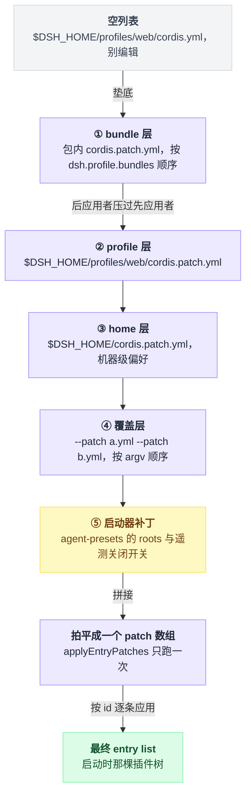
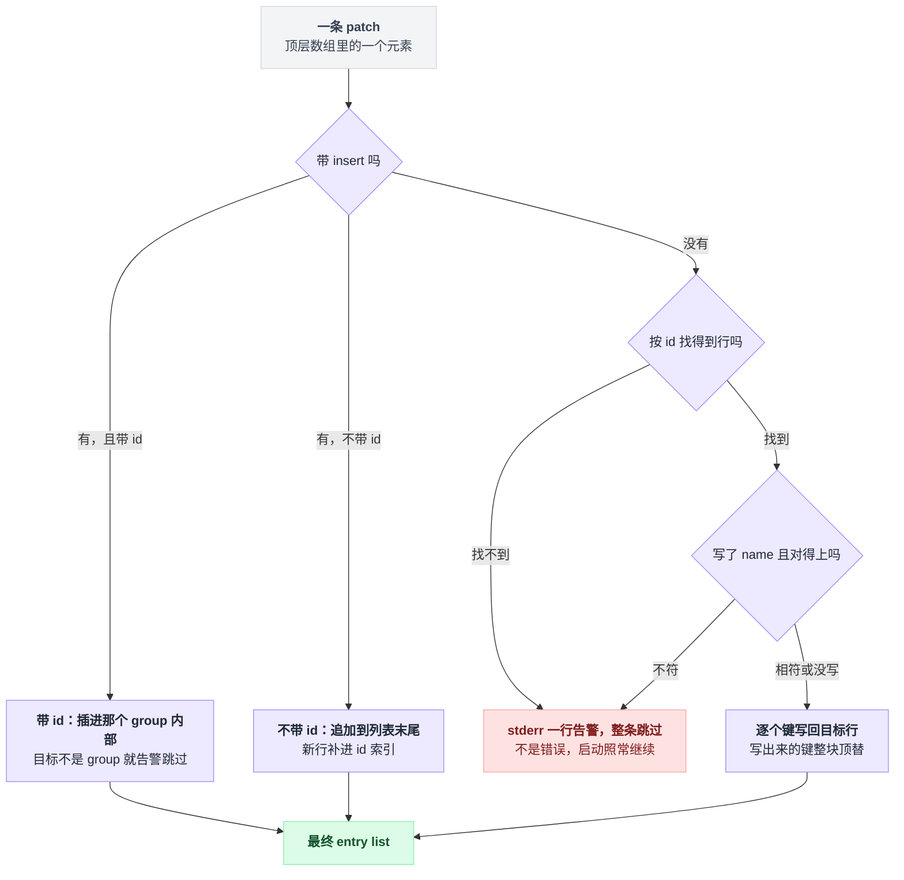
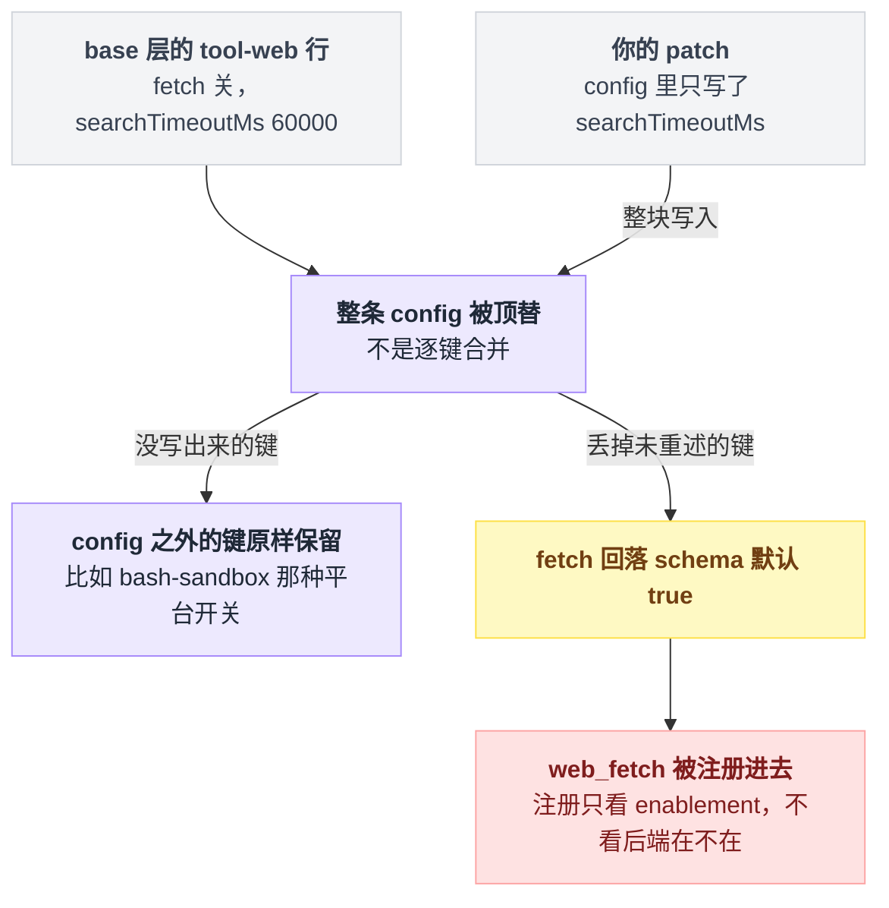
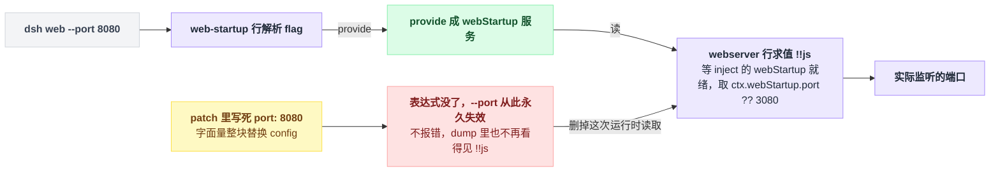
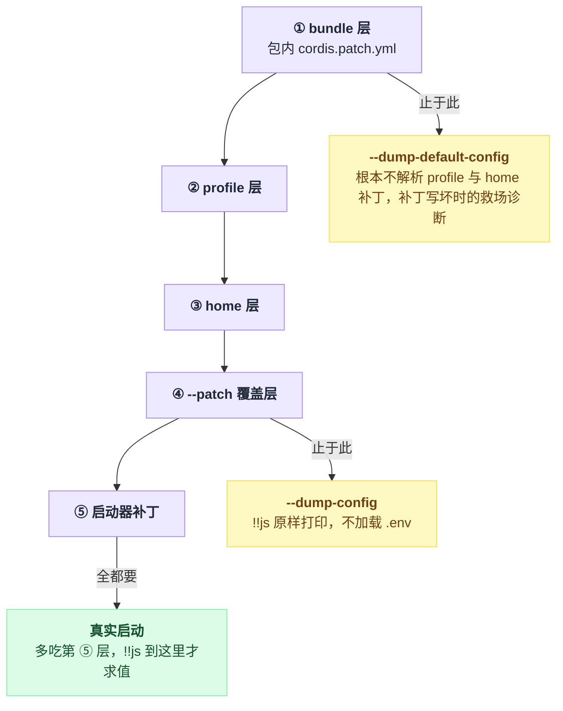

# 03 · 配置的四层结构

> 基于 `deepseek-ai/deepseek-harness` v0.1.0-rc.5（commit `47f9438`），2026-08-14 核对。

你想把 Web 端口从 3080 改成 8080，于是翻遍 `~/.dsh` 找那个写着 `"port": 3080` 的配置文件。找不到。因为 dsh 里没有配置文件这个东西，只有**补丁**——一层层叠上去，最后叠出启动时那棵插件树。

这一章讲这几层是谁、按什么顺序叠，以及那个会反复咬人的坑：**patch 按 `id` 整体替换 config，不做深合并**。所以"我只改了一个数字"经常等于"我顺手删掉了三个没看见的字段"，其中可能包括让 `--port` 生效的那行表达式。改完不报错，只是从此静默失灵。

---

## 端口写在哪：一段带表达式的 bundle 补丁

默认端口在 bundle 包自带的补丁里（`packages/bundle/web-app/cordis.patch.yml:115-120`）：

```yaml
- id: webserver
  name: '@deepseek-ai/dsh-host-webserver'
  inject: [webStartup]
  config:
    host: !!js ctx.webStartup.host ?? '127.0.0.1'
    port: !!js ctx.webStartup.port ?? 3080
```

三个后面要反复用的词，先各给一句：**service**（服务）是一个插件挂在 `ctx` 上、供别的行取用的对象；`inject: [webStartup]` 表示这一行要等 `webStartup` 这个服务就绪才求值挂载（第 07 章展开）；`!!js` 是这套 YAML 方言里的惰性表达式（后面第五节专门讲）。

改端口有三条路，代价差得很远。

**A. 命令行：`dsh web --port 8080`。** 不持久，但零代价。`--port` 由 `web-startup` 插件解析后 provide 成 `webStartup` 服务，上面那行表达式优先读它（`packages/bundle/web-app/src/startup.ts:75-79`、`packages/bundle/web-app/cordis.patch.yml:120`）。

**B. 在 patch 里重述表达式**，改 `~/.dsh/profiles/web/cordis.patch.yml`。持久，`--port` 仍然管用。代价是你得把 `!!js` 那两行照抄一遍，抄漏了不会有任何提示。

**C. 在 patch 里写字面量 `port: 8080`。** 持久，也最省事，代价是 **`--port` 从此永久失效**（`apps/cli/reference/README.md:19`）。

完整文件第六节给。先把机制说清楚，否则 C 这种写法你会一路踩到底。

---

## 那棵树是怎么攒出来的：一个空列表，加若干层补丁

profile 目录里确实躺着一个 `cordis.yml`，但它每次启动都被覆写成一个空数组（`apps/cli/src/profile-boot.ts:60-64`、`:101`）。别编辑它。

它存在的唯一理由是给 **Loader**（Cordis 的配置加载器，第 05 章讲）一个真实的 include 根，好把相对路径的基准目录锚在 profile 目录上。每次重写则是为了自保：Loader 的树回写可能把已组合的行烤进这个文件，下次启动就会把每条 bundle insert 重复一遍（`:87-93`）。

真正的内容全是补丁：

```
空列表 []          ← $DSH_HOME/profiles/web/cordis.yml（每次启动被覆写，别编辑它）
  │
  ├─ ① bundle 层：@deepseek-ai/dsh-base      → packages/bundle/base/cordis.patch.yml
  ├─ ① bundle 层：@deepseek-ai/dsh-web-app   → packages/bundle/web-app/cordis.patch.yml
  │      （按 profile 的 package.json 里 dsh.profile.bundles 的顺序，一个包一层）
  ├─ ② profile 层：$DSH_HOME/profiles/web/cordis.patch.yml
  ├─ ③ home 层：   $DSH_HOME/cordis.patch.yml        ← 跨 profile 的机器级偏好，压过 ②
  ├─ ④ 覆盖层：    --patch a.yml --patch b.yml       ← 按 argv 顺序
  └─ ⑤ 启动器补丁：agent-presets 的 roots、DSH_TELEMETRY_DISABLED 关闭开关
       ▼
   全部拍平成 **一个** patch 数组 → applyEntryPatches 跑一遍 → 最终 entry list
```

把这几层按覆盖方向摆一遍：下面的先应用，上面的后应用、于是压过下面；到末尾它们不是五棵树，而是拼成一个数组，补丁算法只跑一次。



层序的出处是 `apps/cli/src/profile-boot.ts:122-129`（`allPatches`）和 `apps/cli/reference/README.md:9`。注意 ③ 排在 ② 后面——**home 级压过 profile 级**，因为它代表"这台机器上所有 profile 都要这样"。

第 ⑤ 层在官方的四层说法里没有，是启动器自己追加的（`apps/cli/src/profile-boot.ts:154-169`），两条都带前置条件。`agent-presets` 行存在时，追加一条把出厂预设目录写进 `roots` 的补丁（`:159-167`）；这一行只由 web-app 层插入（`packages/bundle/web-app/cordis.patch.yml:420-424`），所以 `headless` 根本没有它。它也不会顶掉你自己的预设目录——`includeUserRoot` 默认 `true`，会在所有配置根之后再追加 `<dshHome>/.agent-presets`（`packages/preset/agent-presets/src/index.ts:92,133-135`）。另一条：`DSH_TELEMETRY_DISABLED` 非空（任何值，含 `'0'` / `'false'`）**且**组合里有 `session-telemetry-otel` 行时，追加 `{id: 'session-telemetry-otel', disabled: true}`（`:80-83`、`:168-169`；该行在 `packages/bundle/base/cordis.patch.yml:148-149`）。这一层**不会出现在 `--dump-config` 输出里**，是 dump 和真实启动的差异之一，第八节列全。

文件都在哪：

| 文件 | 位置 | 谁生成 |
|---|---|---|
| profile 清单 | `$DSH_HOME/profiles/<name>/package.json` 的 `dsh.profile.bundles` | 首次使用自动初始化（`packages/boot/app-boot/src/profile.ts:152-168`） |
| profile 补丁层 | `$DSH_HOME/profiles/<name>/cordis.patch.yml` | 同上，初始内容是 `[]`（`profile.ts:127-131`） |
| home 补丁层 | `$DSH_HOME/cordis.patch.yml` | 你自己建 |
| bundle 补丁层 | 包内 `cordis.patch.yml`，由 `package.json` 的 `"dsh": {"bundle": {"patch": "./cordis.patch.yml"}}` 声明 | 包作者（`packages/bundle/base/package.json:36-40`） |

`$DSH_HOME` 缺省 `~/.dsh`（`packages/util/home-paths/src/index.ts:61-63`、`:87-91`）。`web` / `headless` 两个 profile 首次使用自动建（`profile.ts:114-117`），别的名字必须先 `dsh plugin --profile <name> add <pkg>`，否则启动直接报错并给出这条提示（`profile.ts:376-384`）。

还有个容易被忽略的硬约束：`.env` 文件**不允许**设置任何 `DSH_` 开头的变量（还有 `XDG_` / `DYLD_` / `BASH_FUNC_` 前缀和一批具名变量），写了就在启动时抛错，必须在 shell 里 export（`packages/boot/app-boot/src/index.ts:116-117`、`:155-161`）。所以补丁里那些 `!!js process.env.DSH_TOOLS_MODE` 只能从真实环境变量来。

---

## patch 长什么样：一个数组，两种形态

一个 patch 文件就是一个**顶层 YAML 数组**，每个元素是一条 `PatchOptions`（`vendor/include/src/index.ts:145-156`）：

| 字段 | 作用 |
|---|---|
| `insert` | 追加新行；配合 `id` 则追加进那个 group 内部 |
| `id` | 定位已有行（非 insert 时必填） |
| `name` | 断言：与目标行的 `name` 不符则整条 patch 跳过并告警 |
| `config` | **整体替换**目标行的 config |
| `disabled` | 关掉一行（`true`） |
| `inject` / `intercept` / `isolate` / `group` | 同名整体替换 |
| 其余任意 entry 字段 | 一律走同一条整体替换 |

几点补充。所谓 group，是指一行的 config 本身就是一串子行；往非 group 的行里 insert 会告警跳过（`vendor/include/src/index.ts:87-90`）。`disabled` 是唯一能关掉一行的手段，config 里写什么都关不掉（`packages/bundle/base/cordis.patch.yml:136-137`）。最后那行"其余任意 entry 字段"不是省略号：`PatchOptions` 带 `[key: string]: any`，谁都能进（`:155`）。

形态一，插入新行（`examples/mcp-memory/memorix.cordis.yml:3-11`）：

```yaml
- insert:
    - id: memory-memorix
      name: '@deepseek-ai/dsh-mcp-client'
      config:
        serverName: memorix
        transport: stdio
        command: memorix
        args: [serve]
        cwd: !!js process.cwd()
```

形态二，按 id 改已有行（`packages/bundle/headless/cordis.patch.yml:14-20`）：

```yaml
- id: hmr
  disabled: true

- id: tools
  config:
    mode: !!js process.env.DSH_TOOLS_MODE
```

出厂 bundle 就是这么用的。`dsh-base` 整个包只是**一条** `insert`，把 78 行核心插件一次性铺到空列表上（`packages/bundle/base/cordis.patch.yml:15`）；`dsh-web-app` 再按 id 覆盖其中 27 行，另用两条 `insert` 追加 51 行自己的。行的先后顺序不代表加载顺序——激活由服务依赖驱动（`packages/bundle/base/cordis.patch.yml:12-13`）。

把两种形态合起来看，一条 patch 进到算法里要过的关卡是：先看有没有 `insert`，没有就按 `id` 找行，找到了还得过 `name` 这道断言，最后才逐个键写回。



两种失败方式的待遇差别很大，值得记住。**匹配不到 id 不是错误，只是 stderr 一行告警**（`vendor/include/src/index.ts:110-114`），所以 id 写错会静默不生效，排查时第一个怀疑它。反过来，patch 文件本身写坏（空文件、只有注释、不是数组、元素不是 mapping）会**启动直接失败**——"存在但用不了的补丁文件是配置错误，必须 fail loud"是明写的设计（`packages/boot/app-boot/src/index.ts:271-273`，实现在 `:329-336`）。想临时禁用某一层，请写 `[]`，别把文件清空（`packages/boot/app-boot/README.md:43`）。

---

## 头号坑：`config` 是整体替换

整个补丁算法只有七十行（`vendor/include/src/index.ts:58-128`），核心就这一段（`:121-124`）：

```ts
for (const [key, value] of Object.entries(overrides)) {
  if (key === 'id') continue
  target[key] = value
}
```

`target[key] = value`。`config` 只是众多 key 里的一个，所以**你写的 config 对象整个顶掉旧的**，不是逐键合并。

拿真实的行举例。base 层里 web 工具是这样的（`packages/bundle/base/cordis.patch.yml:414-418`）：

```yaml
- id: tool-web
  name: '@deepseek-ai/dsh-tool-web'
  config:
    fetch: false
    searchTimeoutMs: 60000
```

你只想把搜索超时改成 120 秒，于是在 profile 补丁里写：

```yaml
- id: tool-web
  config:
    searchTimeoutMs: 120000
```

结果 `fetch` 没了。它回落到 schema 默认值 `true`（`packages/web/tool-web/README.md:25`），于是 `web_fetch` 工具被注册了进去——注册只看配置里的 enablement，不看后端在不在（`packages/web/tool-web/README.md:40`）。而 base 层是**故意不挂** fetch provider 的，理由就写在补丁注释里："that provider defers SSRF protection and the model would choose the request target"（`packages/bundle/base/cordis.patch.yml:399-401`）。你以为只动了一个数字，实际上把一个项目明确拒绝启用的能力打开了。

这一刀落下去的连锁是这样的，最后那一环离你写的那个数字已经很远了：



正确写法是把这行原有的键**全部重述一遍**：

```yaml
- id: tool-web
  config:
    fetch: false
    searchTimeoutMs: 120000
```

三条自保规则：

1. 动某行之前，先 `--dump-config` 把那行的完整 config 抄下来，在它基础上改。
2. 记清楚替换的粒度是**键**不是行：**patch 只覆盖你写出来的那些键，没写的字段原样保留**，`config` 只是最常写的那一个。比如 base 的 `bash-sandbox` 行带着 `disabled: !!js process.platform === 'win32'`（`packages/bundle/base/cordis.patch.yml:180`），你只 patch `config` 时这个平台开关不受影响。
3. 加一行 `name:` 当断言。写了 `name` 而目标行的 `name` 对不上，整条 patch 跳过并告警（`vendor/include/src/index.ts:116-119`）——比默默改错行强。

这也是 bundle 作者自己的纪律。`dsh-web-app` 的补丁开头就写着 "A patch replaces the targeted row's whole `config`, so each row below restates every key it owns"（`packages/bundle/web-app/cordis.patch.yml:5-6`）。连启动器自己也得守：第 ⑤ 层往 `agent-presets` 加 `roots` 时，是先把原 config 展开再加键的（`apps/cli/src/profile-boot.ts:160-166`）。

还有一个更隐蔽的变种，源头在"拍平"这个动作。**所有层被拍平成一个数组，只跑一次 `applyEntryPatches`**（`apps/cli/src/profile-boot.ts:122-129` → 整包塞进根 include 的 `patches` 字段 `packages/boot/app-boot/src/index.ts:514-517` → 唯一那次调用 `vendor/include/src/index.ts:316`）。id 索引在开头一次建成（`vendor/include/src/index.ts:66-75`），之后只有 `insert` 进来的行会补进索引（`:101`）。后果就是：某层若用 `config:` 整体替换了一个 **group** 行、从而引入了新的子行，后面的层**够不到**那些子行，只会得到一行 `patch: entry "child" not found` 告警然后跳过。这条语义在源码注释里明写（`packages/boot/app-boot/src/index.ts:349-356`），并在 `packages/boot/app-boot/tests/config-dump.spec.ts:104-136` 里被专门钉死。

---

## 连带后果：`!!js` 表达式会被一起抹掉

`!!js` 是这套 YAML 方言里的惰性表达式。解析时它只被存成 `{__jsExpr: "..."}`（`vendor/include/src/index.ts:9-15`），等这一行的配置真正解析时，才在该行自己的 context 上 `eval`（`vendor/loader/src/index.ts:92-101` → `vendor/loader/src/config/utils.ts:5-22`）。求值用的是 `with (ctx) { eval(expr) }`，所以表达式里能拿到 `ctx`（含已注入的服务）、`process`，以及启动器额外挂上去的 `dshHomePath(...)`（`packages/boot/app-boot/src/index.ts:770`、`packages/util/home-paths/src/index.ts:98-100`）。

命令行开关就是靠它实现的。`dsh web --port 8080` 并不是什么"第五层补丁"：`--port` 被一个普通插件（`web-startup` 行，`packages/bundle/web-app/cordis.patch.yml:107-108`）解析后 provide 成 `webStartup` 服务，`webserver` 行 `inject: [webStartup]` 等它就绪，再求值 `!!js ctx.webStartup.port ?? 3080`（`apps/cli/reference/README.md:19`、`packages/bundle/web-app/cordis.patch.yml:117-120`、`packages/bundle/web-app/src/startup.ts:20,75-79`）。

这条链路从命令行一路走到真正监听的端口，中间只要有一环被字面量顶掉，后面就断了：



于是把上一节的替换语义和这里接起来，就得到那个静默失效的机制：**你用字面量替换 config，等于删掉了那次运行时读取。** 仓库里就有一个真实例子（`examples/web-cordis/cordis.yml:10-13`，该文件按自己的文件头说明是通过 `dsh web --patch` 应用的第 ④ 层覆盖，不是一棵树，见 `:4-7`）：

```yaml
- id: webserver
  config:
    host: 127.0.0.1
    port: 3081
```

这段是故意的，demo 要固定在 3081 不抢默认端口（`:9`）。但同样的写法搬进你自己的 profile 补丁，就变成了：`dsh web --port 8080` 从此没有任何效果，且不报错。官方参考文档一句话概括："a user patch that replaces the whole `config` with literals removes the runtime read"（`apps/cli/reference/README.md:19`）。

好在有个一眼判断的办法：`--dump-config` 里 `!!js` 是**原样打印、不求值**的（`packages/boot/app-boot/src/index.ts:455`，由 `packages/boot/app-boot/tests/config-dump.spec.ts:80` 钉死）。dump 里某行还看得见 `!!js`，说明表达式还在；看不见了，说明被你抹了。

---

## 实操一：改 Web 端口

**做法 A（临时）**：

```sh
dsh web --port 8080
```

启动器自己的 flag 必须写在前面，从第一个它不认识的 token 起，全部交给 app（`apps/cli/src/args.ts:123-134`、`apps/cli/reference/README.md:17`）。顺带一提，`--host 0.0.0.0` 会被明确拒绝（`packages/bundle/web-app/src/startup.ts:69-71`）。

**做法 B（持久，且保住 `--port`）**：编辑 `~/.dsh/profiles/web/cordis.patch.yml`，整个文件内容就这么多：

```yaml
- id: webserver
  name: '@deepseek-ai/dsh-host-webserver'
  config:
    host: !!js ctx.webStartup.host ?? '127.0.0.1'
    port: !!js ctx.webStartup.port ?? 8080
```

这里做了三件事：重述了 `host`（不然它丢默认值）、保留了两个表达式（`--host` / `--port` 仍然优先）、加了 `name` 当断言。`inject: [webStartup]` 不用重写，patch 不碰你没写的字段。用户补丁层和 bundle 层用的是同一套 YAML 方言，`!!js` 在这里合法（`packages/boot/app-boot/src/index.ts:207`）。

改完直接 `dsh web`，或者先验证一下：

```sh
dsh web --dump-config
```

长驻进程运行期间改这个文件，会被 watcher 事务性重新应用（`apps/cli/src/profile-boot.ts:285-294`），但**已经绑定的端口不会因此改变**（`apps/cli/reference/README.md:19`）——端口要重启才生效。

**做法 C**：把上面两行换成字面量 `port: 8080`。能用，代价见上一节。只有当你确实要"钉死、不许命令行覆盖"时才这么写。

想让这台机器上所有 profile 吃同一份设置，把同样内容放进 `$DSH_HOME/cordis.patch.yml`（第 ③ 层）即可。代价是别的 profile（比如 `headless`）根本没有 `webserver` 这一行，那边启动时会多一行 stderr 告警，但不会崩（`vendor/include/src/index.ts:110-114`、`packages/boot/app-boot/README.md:43`）。

---

## 实操二：改一个工具的超时

dsh 里"工具超时"分两处，先认清你要改哪个：

| 想改什么 | 改哪一行 | 出处 |
|---|---|---|
| `web_search` / `web_fetch` 的调用预算 | `tool-web` 行的 `searchTimeoutMs` / `fetchTimeoutMs` | `packages/web/tool-web/README.md:27-28,31` |
| bash 前台命令的超时 | `bash-sandbox` 行的 `timeoutMs` | `packages/bundle/base/cordis.patch.yml:178-182` |
| 谁来执行这个超时 | `timeout-policy` 行，零配置，别动 | `packages/bundle/base/cordis.patch.yml:343-344`、`packages/guard/timeout-policy/README.md:5,9` |

第三行是最反直觉的：`timeout-policy` 插件本身不接受任何 config，它只读取每个工具在 `ToolDefinition.timeoutMs` 上自己声明的预算并执行（`packages/guard/timeout-policy/README.md:5,9`）。**超时永远配在拥有这个工具的插件行上**，不是配在超时插件上。没声明预算的工具（shipped 的 `bash` / `read` / `write` / `edit`）根本不受它管（`:57`）。

`bash-sandbox` 的 `timeoutMs` 要绕一下才找得到出处：`SandboxBashExecutor` 继承 `LocalBashExecutor` 并复用它的 `Config`（`packages/shell/bash-sandbox/src/index.ts:35,44`），字段表因此在 `packages/shell/bash-local/README.md:14-21`——schema 默认 120000，单次上限 `maxTimeoutMs` 默认 600000（`packages/shell/bash-local/src/index.ts:107-108`），base 层把默认压到了 60000。

把 web 搜索放宽到 120 秒、同时把 bash 前台超时从 60 秒放宽到 5 分钟，`~/.dsh/profiles/web/cordis.patch.yml` 完整内容：

```yaml
- id: tool-web
  name: '@deepseek-ai/dsh-tool-web'
  config:
    fetch: false
    searchTimeoutMs: 120000

- id: bash-sandbox
  name: '@deepseek-ai/dsh-bash-sandbox'
  config:
    timeoutMs: 300000
```

`tool-web` 那段必须带上 `fetch: false`，原因上面讲过了。`bash-sandbox` 那段只有 `timeoutMs` 一个键，因为 base 层原本也只写了这一个键——它的 `disabled: !!js process.platform === 'win32'` 平台开关不在 `config` 里，不受影响。也正因为这个开关，Windows 上这一行本来就是关的，那边跑的是 `pwsh-sandbox`（`packages/bundle/base/cordis.patch.yml:184-186`）。

两点提醒。超时是**协作式**的，只通过 `exec.signal` 通知，不会硬杀进程，不理会 signal 的工具不会停（`packages/guard/timeout-policy/README.md:30-32`）。另外 bash 这一行的预算在运行期还会被 settings 服务再叠一层，补丁里的值是基底不是终值（`packages/shell/bash-local/README.md:26`）。

---

## 看清楚现状：两个 dump 命令

```sh
dsh web --dump-config
dsh web --dump-default-config
dsh web --patch ./extra.yml --dump-config
```

依次是：全部层、只有 bundle 层、带上第 ④ 层覆盖再看（三个 flag 都属于 `web` 子命令，`apps/cli/src/args.ts:163-165`）。

三个命令的区别就是各自截到第几层为止，而真实启动比谁都多看一层：



输出是一份**可以整体再被解析**的 YAML 文档，每一段前面有一行 `# ==` 注释说明这些行从哪来（`packages/boot/app-boot/src/index.ts:445-473`）。标签只有两种形态：

| 输出 | 含义 |
|---|---|
| `# == @deepseek-ai/dsh-base` | 这段行由 base bundle 插入，之后**没有任何层改过** |
| `# == @deepseek-ai/dsh-base, patched by /Users/you/.dsh/cordis.patch.yml` | base 插入，被列出的层依次改过 |

bundle 层显示为包名，profile / home / `--patch` 层显示为**绝对路径**（`apps/cli/src/dump-config.ts:32-48`）。相邻且来源加改动者完全相同的行，会合并在同一个注释下（`packages/boot/app-boot/src/index.ts:465-469`）。测试里钉死的样例是三条 `toContain` 断言（`packages/boot/app-boot/tests/config-dump.spec.ts:83-86`，第 86 行还钉死了前两段的先后），拼起来是这个顺序：

```
# == base.yml, patched by surface.yml
- id: shared
# == base.yml
- id: untouched
# == surface.yml, patched by user.yml
- id: surface-extra
```

要说明的是，断言只钉了注释文本；`- id: shared` 那一行是从同一用例的解析断言（`:70-78`）推回来的，真实输出里每行下面还会带各自的 `name` / `config`。

真跑一次会看到什么？因为 profile 的 `cordis.yml` 是空数组，`dsh web --dump-config` 不会出现 `# == cordis.yml` 这一段。第一段的标签是 `# == @deepseek-ai/dsh-base`——base 插入的第一行是 `timer`（`packages/bundle/base/cordis.patch.yml:16-17`），web-app 层没碰它；紧跟的 `hmr` 行被 web-app 关掉了（`packages/bundle/web-app/cordis.patch.yml:22-23`），第二段标签就变成 `# == @deepseek-ai/dsh-base, patched by @deepseek-ai/dsh-web-app`。

dump 和真实启动有四处不一样，排查时最容易被这几条骗到：

1. dump 不跑 app 的命令行 provider，因此带 app 参数会直接报错退出（`apps/cli/src/args.ts:92-97`、`apps/cli/reference/README.md:39`）。
2. `!!js` 原样打印、从不求值（`packages/boot/app-boot/src/index.ts:455`）。
3. 不含第 ⑤ 层，也就是 agent-presets 的 roots 和 `DSH_TELEMETRY_DISABLED` 关闭补丁（`apps/cli/src/dump-config.ts:30-49` vs `apps/cli/src/profile-boot.ts:154-169`）。
4. dump 不加载 `.env`（只有 profile 模式才调 `loadLayeredEnv`），所以 `.env` 里那条会让启动抛错的 `DSH_` 变量，dump 查不出来（`apps/cli/src/bin.ts:33` vs `:45-49`）。

`--dump-default-config` 还有一个专门用途：它**根本不去解析** profile 的 `cordis.patch.yml`（`apps/cli/src/dump-config.ts:31` 把 `userLayer` 传成 `!defaultOnly` → `packages/boot/app-boot/src/profile.ts:399-401`），home 层同样跳过（`dump-config.ts:36-44`）。源码里就把它定位成 "the recovery diagnostic for a broken `cordis.patch.yml`"（`apps/cli/src/dump-config.ts:25-27`）——补丁写坏、启动直接崩的时候先跑它。它也不接受 `--patch`（`apps/cli/src/args.ts:99-101`）。

patch 没生效时，按这个顺序查：

1. `dsh web --dump-config` 看 stderr。匹配不到的 id 会在这里打印，带层标签（`packages/boot/app-boot/src/index.ts:428-432`；默认 sink 就是 stderr，`:383`，由 `tests/config-dump.spec.ts:162-172` 钉死）。
2. 看目标行的 `# ==` 注释里有没有你的文件名。没有 = 这层没改动它，要么 id 错了，要么值本来就一样。
3. 看那行 config 里 `!!js` 还在不在。不在就是被自己抹了。
4. 确认层序：home 层压 profile 层，`--patch` 压两者。

---

## 一句话带走

**dsh 没有配置文件，只有按 bundle → profile → home → `--patch` 顺序拍平的一叠补丁；每条补丁按 `id` 找到行，然后把你写出来的键整个顶替掉——包括那些让命令行开关生效的 `!!js` 表达式。**

所以改配置的正确姿势永远是：先 `--dump-config` 抄下整行，在抄件上改，再顺手加一行 `name:` 当断言。

---

## 本章未确认

- ⚠️ 本章所有命令都**没有实际执行过**（仓库未装依赖，按简报要求只读）。`--dump-config` 的输出形状是从 `renderConfigDump` / `groupedDump` 源码与 `config-dump.spec.ts` 推出的；具体到 js-yaml 的引号风格、缩进细节未逐字核对。
- ⚠️ "`tool-web` 的 patch 漏写 `fetch: false` 会导致 `web_fetch` 被注册"：`fetch` 默认 `true` 与"注册只看 enablement、不看后端可用性"都有 README 出处（`packages/web/tool-web/README.md:25,40`），但只是文档声称，未在代码中逐行确认；同页说这种调用会以结构化 `WEB_PROVIDER_UNAVAILABLE` 错误结果返回给模型（`:40`），同样未读实现。
- ⚠️ "settings 服务会在运行期对 bash 预算再叠一层"只转述了 `packages/shell/bash-local/README.md:26`，没有读 settings 实现，叠加的精确时机与优先级未确认。
- ⚠️ 本章的层序结论对 `web` / `headless` 两个出厂 profile 成立；`dsh plugin` 装出来的第三方 bundle 参与排序的实际表现（`dsh.profile.bundles` 在每次安装后被重新对账，见 `apps/cli/reference/README.md:43`）未验证。
- ⚠️ `!!js` 表达式里能引用哪些名字，是从 `evaluate` 的 `with (ctx)` 实现（`vendor/loader/src/config/utils.ts:5-9`）与 `ctx.provide('dshHomePath', …)`（`packages/boot/app-boot/src/index.ts:770`）推出的；没有逐一枚举 Context 上实际可见的服务名。
