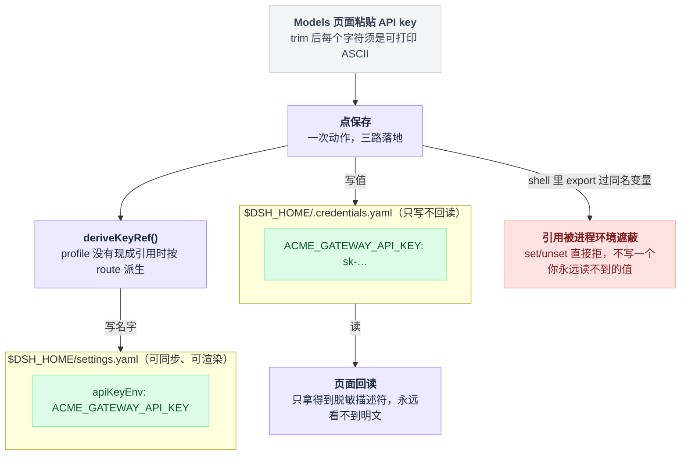
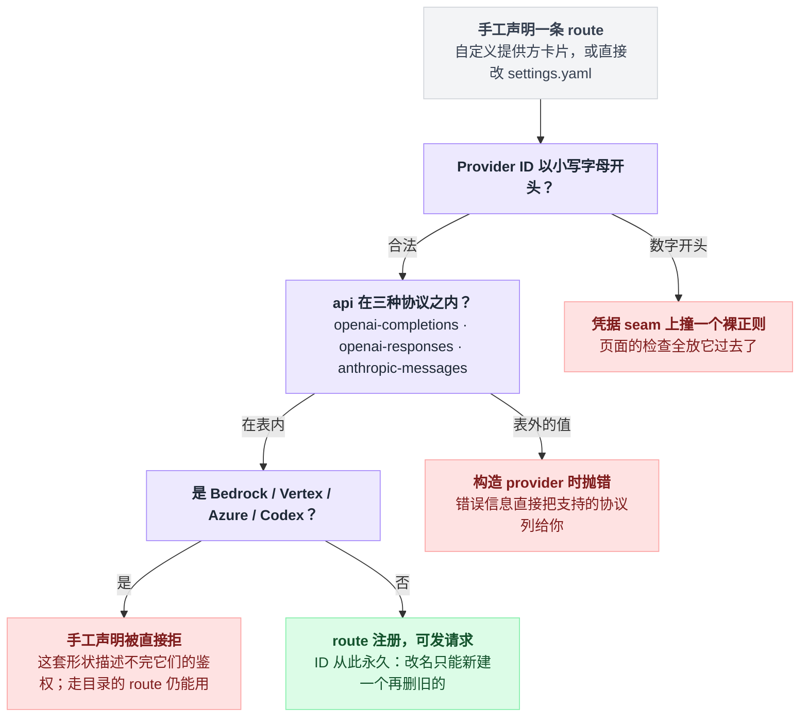
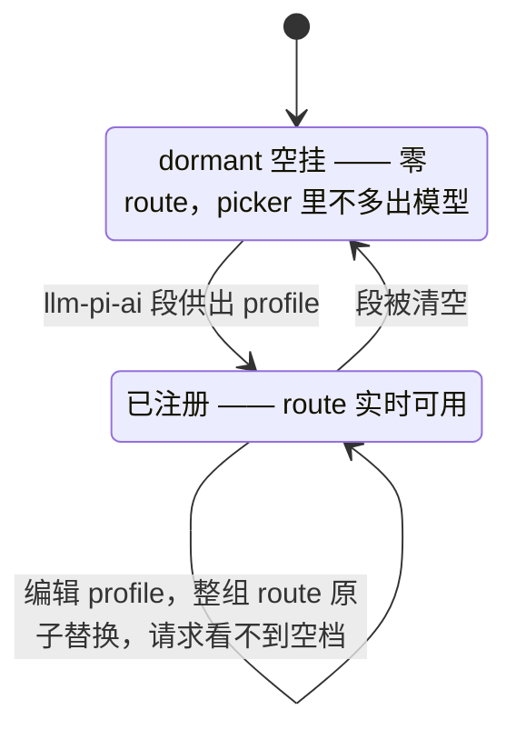
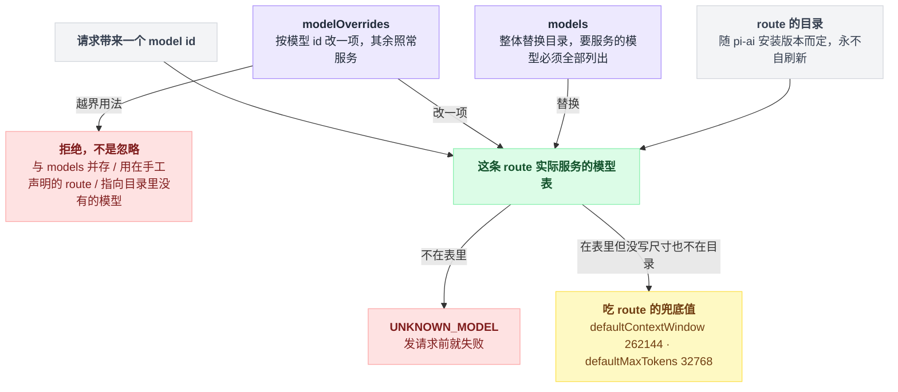
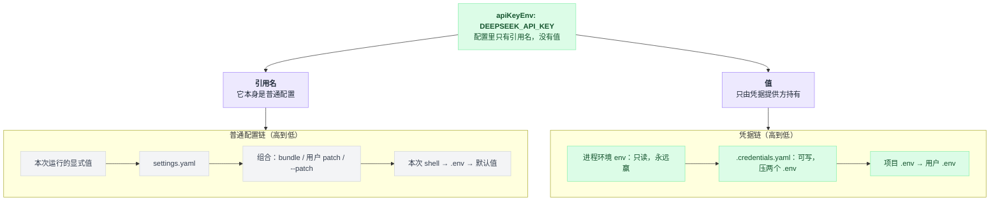
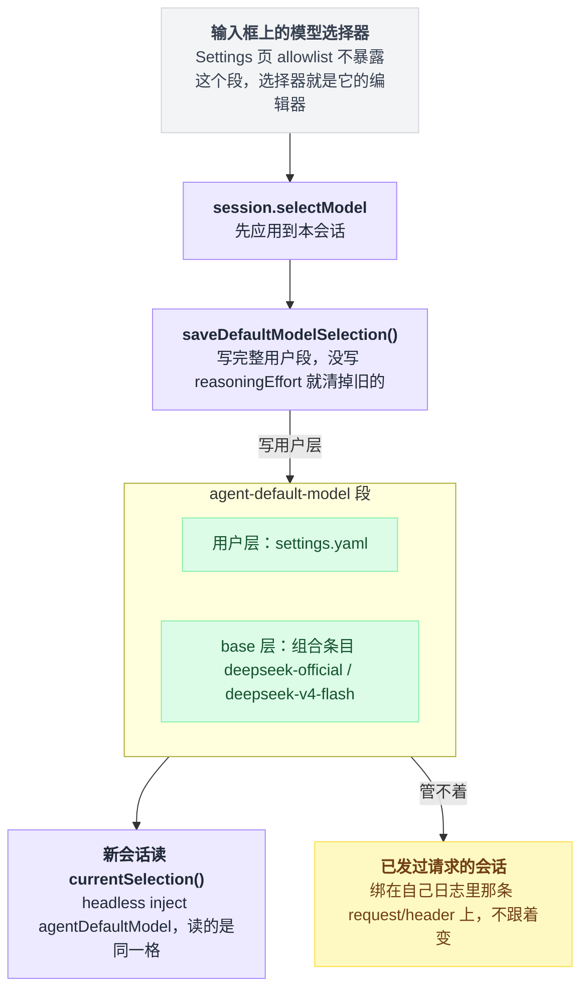
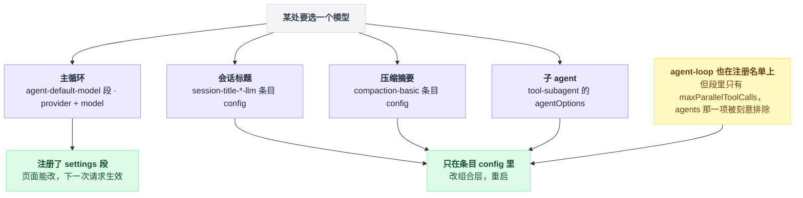

# 04 · 接模型

> 基于 `deepseek-ai/deepseek-harness` v0.1.0-rc.5（commit `47f9438`），2026-08-14 核对。本章只讲"把模型配上去"：填 key、加厂商、接自建网关、凭据落到哪个文件、默认模型在哪改、不同用途能不能各用一个模型。写 LLM 适配器只给最小形状，不展开。正文只讲机制和操作；成篇可照抄的配置和代码统一收在文末[附录](#附录可以照抄的模板)，出处一律收在[脚注](#出处)，点角标可跳转。

接模型这件事，大多数人的预期是：把 key 粘进设置页，保存，完事。

预期没错——照着做确实能跑通，填一个 key、接一个公司网关、给会话标题挂个便宜模型，都不难。容易错的是另一件事：**以为 key 就存在你保存的那份配置里。**

不是的。dsh 在这块的设计比大多数工具都克制：配置文件里永远不出现密钥，只出现密钥的名字；而名字和值走的还是两条不同的优先级链。不知道这件事，你会遇到"页面明明保存成功了，请求还是用旧 key"这类查半天的问题。

这一章就沿着一条线走完：**你填进去的东西到底落到了哪个文件、和别的地方冲突时谁赢。**

---

## 存第一个 key，顺便知道它去了哪

Web UI 起来之后（`npx @deepseek-ai/dsh web`，见第 02 章），打开**设置 → 模型**（Settings → Models）。

DeepSeek 卡片的主字段只有一个 API key 输入框，填进去保存就完事了。`baseURL` 和模型列表藏在折叠的「自定义设置」里。改完不用重启服务器，**下一次请求**就生效[^1]。

点保存那一下，其实发生了三件事，分别落在三个地方。形状是一次动作分三路落地：值走一边，名字走另一边，页面自己只拿得回一个影子。



密钥本身写进 `$DSH_HOME/.credentials.yaml`，**只写不回读**——页面之后拿到的是一个脱敏描述符，永远看不到明文；`$DSH_HOME` 缺省是 `~/.dsh`[^2]。

`settings.yaml` 里存的是 `apiKeyEnv: <名字>`，**永远不是密钥值**[^3]。

而这个名字从哪来？这里得先给两个词挂上标签，后面反复用。`deepseek-official`、`acme-gateway` 这种厂商接入点的名字，发请求时在 provider 字段里指名，本章叫它 **route（提供方路由）**；`settings.yaml` 里描述一条 route 的那一小块配置——端点、协议、模型表、凭据引用——叫 **profile（提供方档案）**。注意后者和启动器 `--profile` 参数那个「启动 profile」是两回事，纯属撞名。

页面**从不问你环境变量名**：profile 里没有现成引用时，它按 `<ROUTE>_API_KEY` 自己派生。派生规则在客户端源码里就一行[^4]：

```
deriveKeyRef(route):
    词干 = route.toUpperCase().replace(/[^A-Z0-9]+/g, '_')
    return 词干 + '_API_KEY'

'acme-gateway'  →  ACME_GATEWAY_API_KEY
'minimax-cn'    →  MINIMAX_CN_API_KEY
```

这套"配置只带引用、值另存"的分工不是洁癖，是有实际收益的：settings 文档因此可以同步、可以在 UI 里渲染，轮换密钥不用动任何配置文件；适配器**每次请求**重新 resolve 一次引用，所以改了 key 下一条请求就用上，不用重启插件[^3]。

页面对你粘进去的 key 有校验，两半规则跑在不同的地方：

| 检查 | 规则 | 在哪跑 |
|---|---|---|
| 非空 | trim 之后必须非空 | 浏览器 + Host |
| 字符集 | 每个字符是可打印 ASCII `[\x21-\x7E]`，正好是 HTTP header 能承载的字符集 | 浏览器 + Host |
| 形状 | 长得像 `NAME=value` 环境变量整行、或被引号包住的值，当格式错误直接拒 | **只在浏览器里** |

前两条在 Host 侧有同一套对应的检查函数[^5]。第三条有意思：README 解释了为什么不放进 Host——解析器上的一次误判会让环境里那个 key 也一起失效[^5]。

**这一节最容易踩的坑在最后。** 如果你的 shell 里已经 export 过 `DEEPSEEK_API_KEY`，Models 页面**写不进去**。

凭据这类能力在 dsh 里各有一个统一入口（凭据是 `ctx.credentials`，模型是 `ctx.llm`），插件只对着入口编程，背后换实现不影响调用方——这种入口叫 **seam（接缝）**。凭据 seam 的规则是：当一个只读来源（进程环境）正在遮蔽这个引用时，set/unset 直接拒绝，而不是写一个你永远读不到的值[^6]。想用页面管密钥，先把 shell 里那个变量去掉。

---

## 加别的厂商：三个入口，五条约束

第二家厂商还找同一个输入框吗？不用——页面上其实有三个入口，分工很清楚：

| 入口 | 写进哪一段 | 用在什么时候 |
|---|---|---|
| **添加提供方**（Add provider） | `llm-pi-ai:` 段的 `providers` 之下 | Anthropic / OpenAI 这些 pi-ai 已安装目录里就有的厂商 |
| **添加自定义提供方**（Add a custom provider） | 同一段，但是一条"手工声明"的 route | 公司网关、自建服务、目录里没有的厂商 |
| **直接编辑 `$DSH_HOME/settings.yaml`** | 什么段都能写 | 页面只暴露了精选字段，其余全在文件里 |

走目录的那条路，端点、协议、模型列表都由目录供给，你只管填 key；手工声明那条要填小写 Provider ID、base URL、API 协议、凭据、至少一个模型；页面只暴露精选字段，其余全靠直接改文件[^7]。

有五条约束是必须先知道的，每一条都对应一类"我以为能改结果不能"。其中三条是硬闸门，按顺序卡在你从填表到 route 真正能发请求的路上。



**一、Provider ID 是永久的。** 请求、已存会话、模型默认值、凭据引用全都用它寻址；想改名，唯一的办法是新建一个再删旧的[^8]。

**二、ID 必须以小写字母开头。** 它同时是派生凭据引用 `<ROUTE>_API_KEY` 的词干，而引用要求是 POSIX shell 标识符。数字开头能通过页面的所有检查，然后在凭据 seam 上撞一个裸正则报错[^9]。

**三、协议只有三种可选。** 源码里那张表就三条：`openai-completions`、`openai-responses`、`anthropic-messages`[^10]。写了表外的值会在构造 provider 时抛错，错误信息直接把支持的协议列给你[^10]。页面上的选项是从 namespace 自己的 schema 读的，所以不会跟适配器漂移[^9]。

**四、Bedrock / Vertex / Azure / Codex 光填 API key 不管用。** 它们分别要 AWS 凭据加 region、ADC project、`api-version`、OAuth[^11]。手工声明这四种协议会被直接拒绝——这套配置形状描述不完它们的鉴权，给你一个连认证都做不了的 provider 不如不给。走目录的 route 用自己的 provider，仍然能用[^11]。

**五、获取可用模型**（Fetch available models）问的是表单里**当前显示**的 base URL 和你刚敲进去还没存的 key；返回的是候选清单，选中只改草稿，不落盘[^12]。

这个按钮会不会真的发网络请求，取决于 route 的来路：目录里没有的 route 才走网络，打的是 OpenAI 兼容的模型列表接口；目录 route 直接从已安装目录回答，一个网络请求都不发。端点不提供这个接口，就手工录入[^13]。

---

## 两个适配器，一条 seam

dsh 出厂带两个 LLM 适配器，注册在同一个 `ctx.llm` 上：

```
ctx.llm  (packages/llm/llm)
  ├── dsh-llm-deepseek  ── route: deepseek-official   直接 fetch + SSE
  └── dsh-llm-pi-ai     ── route: 任意（openai / anthropic / 你自己的网关）
                            默认 dormant：零 route，直到 settings 给出 profiles
```

`deepseek-official` 这个 route 名是 `llm-deepseek` 独占的，**故意**跟 pi-ai 目录里的 `deepseek` 不同名——这样一套组合里可以同时挂两条 DeepSeek 路径[^14]。

base bundle 里的 `llm-pi-ai` 是**空挂**的（dormant）：不给 `providers` 就零 route，picker 里也不多出模型，等 `llm-pi-ai:` 段供出 profile 才实时注册，段空了又摘掉[^15]。Models 页面干的就是这件事。

空挂和注册之间只有两个状态，来回都由 settings 段驱动。



出厂的 `llm-deepseek` 条目**不内联任何 key 和端点**，两者都在每次请求时从 `llm-deepseek:` settings 段叠加到条目上解析[^16]。

也正因如此，自定义提供方卡片只能写进 `llm-pi-ai`——那是唯一能用 profile 描述一整个厂商的 namespace，`llm-deepseek` 的 route 是组合事实，页面造不出来[^17]。

---

## 手写一条 OpenAI 兼容网关

`settings.yaml` 里一个手工声明的 route 长这样——照抄仓库里的 `acme-gateway` 示例，去掉其中的 `compat` 块，顶层段名与缩进按用户指南对照过[^18]：

```yaml
# $DSH_HOME/settings.yaml
llm-pi-ai:
  providers:
    acme-gateway:
      displayName: Acme Gateway
      apiKeyEnv: ACME_GATEWAY_API_KEY
      api: openai-completions
      baseURL: https://gateway.acme.example/v1
      models:
        - id: acme-large
          name: Acme Large
          contextWindow: 65536
          maxTokens: 4096
```

`cordis.yml` 条目里写的是同一套 schema，只是外面包一层 `config:`——插件把自己的条目配置注册成 settings 段的 base 层，用户段叠在上面[^19]。

写错了不会等到发请求才炸：整份 profile 在 settings 段的 schema 里就解析一遍，不可服务的 profile 在**写入处**就被拒，而且不会覆盖上一份好配置[^20]。

关于凭据，记住三件事。

`apiKeyEnv` 是**引用**不是值。引用了却解析不到，请求会以 `MISSING_CREDENTIAL` 失败，而不是随便抓环境里哪个 key 顶上；一条 route 只有一个凭据，服务它下面所有模型[^21]。

**不需要鉴权的本地服务也得给个占位 key**——pi-ai 的 OpenAI 兼容实现仍然要求 API key 或 `Authorization` header[^22]。

别想着把密钥塞进 `headers` 绕过去：`headers` 里的 `Authorization` **不会被脱敏**，会原样回给任何配置 UI[^23]。

模型表这块先看形状：三个来源汇成同一张表，请求带来的 id 只跟这张表对账[^24]。



同一件事写成流程，最容易误解的那条（`models` 是替换不是追加）就藏不住了[^24]：

```
表 = route 的目录                      // 永不自刷新，只跟 pi-ai 的安装版本一样新

if profile 写了 models:
    表 = models                        // 整体替换目录，不是追加
                                       // 要继续服务的模型必须全部列出，只写 id 也算

if profile 写了 modelOverrides:        // 键是模型 id，只改一项，其余三十七个照常服务
    if 同时写了 models:          拒绝   // 三条都是拒绝，不是忽略
    if 这条 route 是手工声明的:  拒绝
    if 键指向目录里没有的模型:    拒绝
    表[键] = 改过的那一项

请求带来一个 model id:
    if id 不在表里:                     UNKNOWN_MODEL，发请求前就失败
    if 既没写 entry 尺寸也不在目录里:    吃 defaultContextWindow 262144 / defaultMaxTokens 32768
```

剩下两个小坑。`baseURL` 作用于整条 route 的所有模型，目录 route 不写就各用各的端点[^25]。手写的模型默认按纯文本对待，视觉模型要显式声明"能吃文本也能吃图"，而页面上没有这个字段[^26]。完整的可配 profile 字段一共 19 个，README 里有全表[^27]。

DeepSeek 侧对应的段是 `llm-deepseek:`，字段有 `apiKeyEnv`（默认 `DEEPSEEK_API_KEY`）、`baseURL`（省略时先看 `$DEEPSEEK_BASE_URL`，再退到公开端点 `https://api.deepseek.com`）、`thinking`、`reasoningEffort`、`maxTokens`、`models` 等[^28]。

省略 `models` 时对外通告 `deepseek-v4-flash` 与 `deepseek-v4-pro`，各 1,000,000 上下文窗口[^29]。

---

## 凭据存哪：四层，一条诚实的优先级

`.credentials.yaml` 的格式朴素得有点出乎意料——就是一个"引用 → 值"的 YAML 映射，没有 `version`，没有外包一层[^30]：

```yaml
# $DSH_HOME/.credentials.yaml
DEEPSEEK_API_KEY: sk-…
OPENAI_API_KEY: sk-…
```

四个来源，从高到低[^31]：

```
1. 启动时继承的进程环境        source: env         只读，永远赢
2. $DSH_HOME/.credentials.yaml source: file        可写（set/unset），压两个 .env
3. <启动目录>/.env             source: project-env
4. $DSH_HOME/.env              source: user-env
```

每次请求都会拿着 `apiKeyEnv` 里那个名字重跑一遍这条链：

```
resolve(引用名):                       // 每次请求都跑一遍，所以换 key 不用重启
    for 来源 in [进程环境, .credentials.yaml, 项目 .env, 用户 .env]:
        if 来源里有这个名字: return 它的值
    return MISSING_CREDENTIAL          // 不会随便抓环境里哪个 key 顶上
```

进程环境排第一是有道理的：启动命令前缀里现挂的变量、CI secret、容器的 `-e` 注入，都是操作员对**这一次运行**的意图。

又因为它从内部改不了，所以必须**可见地**只读——查询接口把它如实报成不可写，set/unset 直接拒[^6]。第一节那个"页面写不进去"的坑，根就在这里。

**注意这跟普通配置不是同一条链。** 非密配置的优先级是「本次运行的显式值 > `settings.yaml` > 组合（bundle / 用户 patch / `--patch`） > 本次 shell > `.env` > 默认值」；凭据是单独一条[^32]。差别在于 `settings.yaml` 和组合那两层在凭据链里**根本不存在**。

为什么能这么切干净？因为配置只带**引用名**，而引用名本身是普通配置——**引用名走上面那条链，值走下面这条**[^32]。两条链的分岔就在那一行 `apiKeyEnv` 上。



还有三条硬边界，都是踩上了才会知道的那种。

**一、`.env` 里有一批变量设不了。** `DSH_*` 全命名空间、`PATH`、`SHELL`、`NODE_OPTIONS`、`BASH_ENV`、`HOME`、`XDG_*`、代理与 CA 变量——环境装载层在物化之前就拒，大小写不敏感[^33]。而且**没有 opt-out**，理由很硬：开关得放在某个能读到的地方，而那个地方本身就是洞[^33]。想开这些开关，写进你自己的 shell。

**二、文件权限是启动前的门槛。** `.credentials.yaml` 要求目录 `0700`、文件 `0600`。POSIX 上只要读到任何 group/other 权限位，就在解析内容**之前**失败，报错里带 `chmod 600` 的修法[^34]。文档格式也严格：非映射根、非 POSIX 标识符的键、非字符串值、空串、重复键、坏 YAML，启动时一律 fail loud，热重载时告警并保留上一份好快照[^34]。

**三、这个文件挡的是其它 OS 用户，不是模型。** bash 工具跟 harness 同一个 uid，`workspace-write` 策略管的是写不是读。harness 真正守住的更窄——它从不把这个文件的解析路径交给模型，也从不把它灌进进程环境（`.env` 才是普通环境层）[^35]。README 自己把这叫 "discretion, not a boundary"；要真正隔离，得等 OS keychain provider，现在没有[^35]。

---

## 全局默认模型：出厂值、谁在改、为什么老会话不跟着变

出厂默认写在 base bundle 里[^36]：

```yaml
- id: agent-default-model
  name: '@deepseek-ai/dsh-agent-default-model'
  config:
    provider: deepseek-official
    model: deepseek-v4-flash
```

这个插件提供 `ctx.agentDefaultModel`，并把 provider、model、可选的 reasoningEffort 注册成 `agent-default-model` settings 段——组合条目是 base 层，`settings.yaml` 是用户层。对外就两个方法：一个读当前选择，一个写入新选择[^37]。

想改它，你的直觉大概是去设置页找——找不到的。改它的正规入口是**输入框上的模型选择器**（composer's model picker）：选一个模型，它同时成为新会话的默认[^38]。

底层的动作分两步：先把选择应用到本会话，成功后再保存为默认，`settings.yaml` 里就多一个 `agent-default-model:` 段。**Settings 页面里找不到这个段是故意的**——网关的 Settings 页 allowlist 不暴露它，选择器就是它的编辑器[^39]。

从点一下选择器到落进 `settings.yaml`，中间这条链是这样的。



那为什么改了默认，老会话不跟着变？因为选择是**分层解析**的[^40]：

```
进程内的会话级选择 > 该会话日志里最近一条 request/header > 当前 Agent 默认值
```

已经发过请求的会话被绑在自己日志里那条持久选择上；空白会话读当前默认值，哪怕它是在你保存偏好之前创建的。

`reasoningEffort` 只在 settings 段里、**不在**插件 config 里。这个区分有讲究：settings 是按字段合并的，组合里配了 effort，就会在用户选了一个不支持它的模型时被继承回来；而保存选择写的是完整用户段，所以"没写"本身就能清掉旧的 effort[^41]。想给整个部署定一个 effort，写到适配器 profile 里去（`llm-deepseek` 的 `reasoningEffort`，或 pi-ai profile 的 `reasoning`）。

顺带澄清一件事：**没有 `--model` 这类 CLI flag。** 启动器自己的全部选项就四个——`--profile`、`--patch`、`--dump-config`、`--dump-default-config`，外加 `web` 和 `plugin` 两个子命令[^42]。

headless 也不靠 flag 选模型：它 inject `agentDefaultModel`，直接读当前选择[^43]——跟 Web 选择器写的是同一个默认值。

真正由组合写死模型的是另一处：`agent-loop` 的 `agents` 列表，那是**在启动时就创建好的 agent**。base bundle 把它留空，字段形状和一份填满的真实示例都在文档里[^44]。模型调用要求 `provider` 和 `model` **成对**出现；缺失的那一对可以由 `agent/request` 在派发前补上[^45]。

---

## 按用途分开配：四个用途，只有一个能热改

先把最实用的结论摆在前面，因为它决定你要打开的是浏览器还是编辑器：

| 用途 | 能在设置界面里改吗 | 生效方式 |
|---|---|---|
| 主循环模型 | 能（模型选择器） | 下一次请求 |
| 会话标题 | 不能 | 改组合层，重启 |
| 压缩摘要 | 不能 | 改组合层，重启 |
| 子 agent | 不能 | 改组合层，重启 |

这里说的"组合层"就是 `cordis.patch.yml` / `--patch`（见第 03 章）。

判据不是我猜的。settings 段有两条注册路径：一个 `installSettingsSection` 助手，和它底下的 `ctx.settings.register`。全仓的包源码里把两条都 grep 过，一共 13 个包注册了 settings 段：

| 注册路径 | 包 |
|---|---|
| 走 `installSettingsSection` 助手（8 个） | `agent-default-model`、`agent-loop`、`llm-deepseek`、`llm-pi-ai`、`permission-presets`、`bash-local`、`pwsh-local`、`web-search-deepseek` |
| 直接调 `ctx.settings.register`（5 个） | `agent-presets`、`client/locale`、`client/ui-conversation`、`client/ui-settings-general`、`client/ui-theme` |

`agent-presets` 的源码里专门写了一段为什么不用助手[^46]。

`compaction-basic`、`session-title-*`、`tool-subagent` 一个都不在里面。

而且 `agent-loop` 虽然在名单上，它注册的段里只有 `maxParallelToolCalls` 一个字段——`agents` 被**刻意排除**在外，因为它在服务启动时只消费一次，存进 settings 只会看起来生效[^45]。

所以真正能热改模型的只有 `agent-default-model` 那一格，也就是模型选择器。能不能在界面上改只看一件事：管这个用途的插件有没有把模型字段注册成 settings 段。



还得说清楚：**四个用途分别归四个不同的插件管**，没有一个统一的"模型用途表"。`purpose` 这个请求字段确实存在，但它只有两个值——`compaction` 和 `session-title`——而且是给适配器做模型不可见的传输元数据用的，不是选路开关[^47]。

**主循环**走 `agent-default-model` 段或模型选择器，字段是 `provider` + `model`；组合在启动时创建的 agent 则用 `agent-loop` 的 `agents` 列表。什么都不配，就是 base bundle 的 `deepseek-official` / `deepseek-v4-flash`。

**会话标题**配在 `session-title-first-prompt-llm`（或 `-all-prompts-llm`）的条目 config 里，`provider` + `model` **要么都给要么都不给**；不配则沿用当前会话日志里 `request/header` 记的那条 route[^48]。把标题打到 flash 上的真实条目照抄[附录 A](#a-会话标题挂便宜模型)。

**压缩摘要**配在 `compaction-basic` 的条目 config 里，字段是 `summarizationProvider` + `summarizationModel` + `maxTokens`；留空对儿则先取最近一条已记录请求的 target，再取 AgentOptions 的对儿[^49]。可抄的条目在[附录 B](#b-压缩摘要挂便宜模型)。

**子 agent**配在 `tool-subagent` 的条目 config 里，字段是 `agentOptions` 下的 provider / model / maxTokens；不配就继承父 agent 的模型[^51]。

做法是在 base bundle 已有的 `tool-subagent` 条目上补一个带 provider 和 model 的 `agentOptions`[^52]。注意 patch 是**整体替换** config，原有的 provider / toolName / backgroundMode 三行必须一起重写（见第 03 章）。

最后两条值得知道。

一个 `tool-subagent` 实例的子 agent 策略是**钉死**的：换模型、换 persona、换工具过滤、换深度上限，都得再挂一个改名的实例——base bundle 已经用这个办法挂了两个工具，`subagent`（spawn，continuable）和 `subagent_fork`（fork，one-shot）[^53]。

另外，`purpose` 那个字段虽然不选路，适配器那边还是认它的：标题请求带的标题用途会被 DeepSeek 适配器映射成"关闭思考"，好把那点输出预算全留给可见的标题文本；压缩请求带的压缩用途，额外发一个专用请求头[^54]。

---

## 进阶：自定义 LLM 适配器的最小形状

厂商实在接不上——协议不是那三种之一，或者鉴权方式特殊——就自己写一个适配器。

它是一个普通 Cordis 插件，唯一必须实现的是 `stream` 这一个方法[^55]。完整的最小实现照抄[附录 C](#c-最小-llm-适配器)——那是官方实践文档里的原文，只删掉了 stream 体内的三行步骤注释[^55]。

这条链的形状是：会话历史带着 provider / model 进 stream，出来的是 harness 统一的 `StreamChunk` 流，中间三次转换全在适配器自己肚子里。

```mermaid
flowchart LR
    G["<b>GenerateOptions</b><br/>provider 选适配器 · model 直接透传 · messages · signal"]
    T1["<b>转成厂商格式</b><br/>options.messages 变成 wire 上的报文"]
    T2["<b>调用流式 API</b><br/>每个 HTTP 请求合并 attributionHeaders() 并转发 signal"]
    T3["<b>转回 StreamChunk</b><br/>按 StreamChunk 协议逐条产出"]
    OUT["<b>AsyncIterable of StreamChunk</b><br/>harness 这一侧的统一流式词汇"]
    OPT["<b>可选覆写四个</b><br/>providerInfo · providerRetryPolicy · listModels · resolveModel"]

    G --> T1
    T1 --> T2
    T2 --> T3
    T3 --> OUT
    OPT -.-> G

    classDef main fill:#ede9fe,stroke:#a78bfa,color:#1f2937
    classDef data fill:#dcfce7,stroke:#86efac,color:#14532d
    classDef entry fill:#f3f4f6,stroke:#d1d5db,color:#374151
    classDef note fill:#fef9c3,stroke:#fde047,color:#713f12
    class T1,T2,T3 main
    class OUT data
    class G entry
    class OPT note
```



stream 体内要干的三件事，原文写在那三行被删的注释里：把消息列表转成厂商格式、调用流式 API、把响应转回 `StreamChunk`。挂载到 `cordis.yml` 的写法官方文档里有现成条目可抄[^56]。

注册时的第一个参数是这个适配器承接的 route 列表；请求用 provider 选适配器、model 直接透传模型 id，不需要在生命周期里注册模型[^57]。可选覆写的方法有四个：`providerInfo`、`providerRetryPolicy`、`listModels`、`resolveModel`[^57]。

再往下就三处：`StreamChunk` 协议逐条、`GenerateOptions` 说明、错误处理与"每个 HTTP 请求都必须合并归因请求头并转发中止信号"的硬要求[^58]。然后对着读出厂那两个适配器的源码——DeepSeek 那个直接 fetch + SSE，pi-ai 那个基于第三方 SDK——同一份契约的两种内核实现[^58]。

> 想知道这一点上 Pi / Codex / LangChain 怎么做，见 [五个 agent 系统源码解剖](../2026-08_五个agent系统源码解剖/00-总览与阅读指南.md)。

---

## 串起来再走一遍

合上文件自测一遍，每一条结论都应该能从前面的画面里自己推出来：

- **页面保存了 key，`settings.yaml` 里为什么找不到它？**——保存那一下是三路落地：值进 `.credentials.yaml`（只写不回读），`settings.yaml` 里只落一个 `apiKeyEnv` 引用名。settings 文档能同步、能在 UI 里渲染，靠的就是这一刀。
- **shell 里 `export` 过同名变量，页面为什么写不进去？**——凭据链里进程环境排第一、且可见地只读；seam 不肯写一个你永远读不到的值，所以 `set` 直接拒。这是页面写不进 key 的头号原因。
- **改了 key 为什么不用重启？**——适配器每次请求重新 resolve 一遍引用，四层链是每次现走的。
- **两条优先级链为什么能切干净？**——配置里只有引用名，引用名本身是普通配置。名字走普通配置那条链，值走凭据那条，分岔就在 `apiKeyEnv` 那一行。
- **手工 route 写了 `models`，目录里原来那些模型去哪了？**——`models` 是整体替换不是追加；没列出来的就不再服务，越界的 `modelOverrides` 是拒绝不是忽略。
- **改了默认模型，老会话为什么不跟着变？**——选择分层解析，发过请求的会话绑在自己日志里那条 `request/header` 上；默认值只轮得到空白会话。
- **想给标题 / 压缩 / 子 agent 换模型，设置页里为什么找不到？**——能热改的只有把模型字段注册成 settings 段的那一格，全仓只有 `agent-default-model` 一个；另外三个用途只活在条目 config 里，改组合层、重启。

最后压成一句：**配置里只放引用名，密钥另存一处；引用名走普通配置那条优先级链，值走凭据那条——而进程环境永远压过一切。**

---

## 附录：可以照抄的模板

### A. 会话标题挂便宜模型

把标题请求打到 flash 上的真实条目[^48]：

```yaml
# examples/acp-agent/session-title.cordis.yml:10
- id: session-title-provider
  name: '@deepseek-ai/dsh-session-title-first-prompt-llm'
  config:
    targetWords: 5
    targetCjkCharacters: 10
    maxInputBytes: 4096
    maxOutputTokens: 32
    timeoutMs: 5000
    provider: deepseek-official
    model: deepseek-v4-flash
```

在原文件里这个条目嵌在 `cordis-plugin-include` 的 patches 插入操作下面[^48]；你自己的 `cordis.patch.yml` 里直接写成一条 insert 操作即可（见第 03 章）。

### B. 压缩摘要挂便宜模型

条目本体抄自 headless 示例的组合文件（那里配的是 `thresholdRatio` / `retainRatio` / `maxTokens` / `compactionRetries`），摘要 route 那两个字段按 README 的说明加上去；以 patch 覆盖既有条目的写法另有快照可抄[^50]：

```yaml
# 拼装自 examples/headless-agent/cordis.yml:76 与 packages/compaction/compaction-basic/README.md:35
- id: compaction-basic
  name: '@deepseek-ai/dsh-compaction-basic'
  config:
    summarizationProvider: deepseek-official
    summarizationModel: deepseek-v4-flash
    maxTokens: 8192
```

### C. 最小 LLM 适配器

官方实践文档的完整最小实现，只删掉了 stream 体内的三行步骤注释[^55]：

```ts
// docs/user/develop/practice/llm-adapter.md:13
import type { Context } from '@deepseek-ai/cordis'
import Schema from '@deepseek-ai/schemastery'
import { LlmAdapter, type GenerateOptions, type StreamChunk } from '@deepseek-ai/dsh-llm'

class MyAdapter extends LlmAdapter {
  private apiKey: string

  constructor(apiKey: string) {
    super()
    this.apiKey = apiKey
  }

  async *stream(options: GenerateOptions): AsyncIterable<StreamChunk> {
  }
}

export interface Config {
  apiKey: string
  providers: string[]
}

export const Config: Schema<Config> = Schema.object({
  apiKey: Schema.string().required(),
  providers: Schema.array(Schema.string()).required(),
})

export const name = 'my-llm-adapter'
export const inject = ['llm']

export function apply(ctx: Context, config: Config) {
  const adapter = new MyAdapter(config.apiKey)
  ctx.llm.registerAdapter(config.providers, adapter)
}
```

---

## 出处

[^1]: Models 页面的操作与生效：`docs/user/guide/providers.md:9`（DeepSeek 卡片主字段只有 API key）、`packages/client/ui-settings-models/README.md:7`（`baseURL` 与模型列表折叠在「自定义设置」里）、`docs/user/guide/providers.md:5`（改完不用重启，下一次请求生效）。
[^2]: 密钥只写不回读、页面只拿得到脱敏描述符：`docs/user/guide/providers.md:13`；`$DSH_HOME` 缺省 `~/.dsh`：`packages/settings/settings-file/README.md:12`。
[^3]: `settings.yaml` 只存 `apiKeyEnv` 引用名、永远不是密钥值，以及"可同步、可渲染、轮换不动配置"的收益：`packages/credentials/credentials/README.md:7`；适配器每次请求重新 resolve 引用：`:9`。
[^4]: 派生行为（页面从不问环境变量名）：`packages/client/ui-settings-models/README.md:7`；`deriveKeyRef()` 的那一行实现：`packages/client/ui-settings-models/src/client/store.ts:69`–`:70`。
[^5]: Host 侧对应 `normalizeApiKey()`：`packages/llm/llm/src/api-key.ts:15`、`:36`；浏览器侧三条检查、以及"形状检查不进 Host——解析器误判会让环境里那个 key 一起失效"的理由：`packages/client/ui-settings-models/README.md:13`。
[^6]: 只读来源遮蔽引用时 set/unset 直接拒：`packages/credentials/credentials/README.md:30`；进程环境来源在 `describe()` 里报 `writable: false`：`packages/credentials/credentials-local/README.md:14`。
[^7]: 目录路只填 key：`docs/user/guide/providers.md:17`、`packages/llm/llm-pi-ai/README.md:74`；手工声明要填的字段：`docs/user/guide/providers.md:23`；直接改文件：`packages/client/ui-settings-models/README.md:33`。
[^8]: Provider ID 永久、改名只能新建再删旧：`docs/user/guide/providers.md:27`。
[^9]: ID 须小写字母开头、数字开头在凭据 seam 撞裸正则、页面协议选项从 namespace 自己的 schema 读：`packages/client/ui-settings-models/README.md:21`。
[^10]: 三种协议那张表：`packages/llm/llm-pi-ai/src/provider.ts:47`–`:51`、`:61`；表外值在构造 provider 时抛错并列出支持协议：`:177`–`:182`。
[^11]: 四家要额外鉴权（AWS 凭据加 region、ADC project、`api-version`、OAuth）：`docs/user/guide/providers.md:19`；手工声明这四种协议被直接拒、目录 route 不受影响：`packages/llm/llm-pi-ai/src/provider.ts:35`–`:45`。
[^12]: 获取可用模型问的是当前草稿、选中不落盘：`docs/user/guide/providers.md:29`、`packages/client/ui-settings-models/README.md:19`。
[^13]: 目录外 route 打 OpenAI 兼容 `GET /models`、目录 route 不发网络：`docs/user/guide/providers.md:29`、`packages/llm/llm-pi-ai/README.md:124`；端点不提供就手工录入：`docs/user/guide/providers.md:92`。
[^14]: `deepseek-official` 由 `llm-deepseek` 独占、故意与 pi-ai 目录里的 `deepseek` 不同名：`packages/llm/llm-deepseek/README.md:7`。
[^15]: dormant 行为与实时注册：`packages/bundle/base/cordis.patch.yml:88`–`:96`、`packages/llm/llm-pi-ai/README.md:74`。
[^16]: 出厂条目不内联 key 和端点、每次请求从 `llm-deepseek:` 段叠加解析：`packages/bundle/base/cordis.patch.yml:446`–`:451`。
[^17]: 自定义提供方卡片只能写进 `llm-pi-ai`：`packages/client/ui-settings-models/README.md:35`。
[^18]: `acme-gateway` 示例原文（含被去掉的 `compat` 块）：`packages/llm/llm-pi-ai/README.md:49`–`:61`；顶层段名与缩进对照：`docs/user/guide/providers.md:37`–`:48`。
[^19]: 条目配置注册成 settings 段的 base 层、用户段叠在上面：`packages/llm/llm-pi-ai/README.md:106`。
[^20]: 写入处校验（`settings.mutate` 回 `settings-rejected`）、不覆盖上一份好配置：`packages/llm/llm-pi-ai/README.md:98`。
[^21]: 引用解析不到以 `MISSING_CREDENTIAL` 失败、一条 route 只有一个凭据：`packages/llm/llm-pi-ai/README.md:11`。
[^22]: 本地服务也要占位 key（仍要求 API key 或 `Authorization` header）：`packages/llm/llm-pi-ai/README.md:200`。
[^23]: `headers` 里的 `Authorization` 不脱敏：`packages/llm/llm-pi-ai/README.md:196`。
[^24]: `models` 的替换语义：`packages/llm/llm-pi-ai/README.md:78`；`modelOverrides` 的三条拒绝：`:80`；`UNKNOWN_MODEL`：`:74`；兜底值：`:92`；目录永不自刷新：`:197`。
[^25]: `baseURL` 作用于整条 route、目录 route 不写就各用各的端点：`packages/llm/llm-pi-ai/README.md:100`。
[^26]: 视觉模型要显式 `input: [text, image]`、页面没有这个字段：`docs/user/guide/providers.md:33`、`:35`。
[^27]: 19 个可配 profile 字段全表：`packages/llm/llm-pi-ai/README.md:116`。
[^28]: `llm-deepseek:` 段的字段：`packages/llm/llm-deepseek/src/index.ts:45`、`:63`–`:80`、`:104`、`:107`。
[^29]: 默认通告的两个模型与 1,000,000 窗口：`packages/llm/llm-deepseek/src/index.ts:49`–`:52`、`packages/llm/llm-deepseek/README.md:38`。
[^30]: `.credentials.yaml` 的格式：`packages/credentials/credentials-local/README.md:31`–`:38`。
[^31]: 四个来源的优先级：`packages/credentials/credentials-local/README.md:7`–`:12`。
[^32]: 普通配置链：`.agents/notes/implemented/architecture/2026-08-04-configuration-source-ownership.md:21`–`:28`；凭据链单独一条：`:34`–`:39`；引用名本身是普通配置、名字与值分链：`:41`。
[^33]: `loadLayeredEnv` 的拒设名单、大小写不敏感：`.agents/notes/implemented/architecture/2026-08-04-configuration-source-ownership.md:45`；没有 opt-out 的理由：`:47`。
[^34]: 权限门槛与 `chmod 600` 提示：`packages/credentials/credentials-local/README.md:46`；格式 fail loud、热重载告警并保留快照：`:38`。
[^35]: "discretion, not a boundary"、不把解析路径交给模型也不灌进程环境：`packages/credentials/credentials-local/README.md:54`；OS keychain provider 还没有：`:56`。
[^36]: 出厂默认条目：`packages/bundle/base/cordis.patch.yml:63`–`:67`。
[^37]: 插件实现：`packages/core/agent-default-model/src/index.ts:21`、`:34`、`:88`（读方法 `currentSelection()`）、`:98`（写方法 `saveSelection()`）；段的形状 `{provider, model, reasoningEffort?}`：`packages/core/agent-default-model/README.md:7`。
[^38]: 选择器选一个模型、同时成为新会话默认：`docs/user/guide/providers.md:84`、`packages/client/ui-settings-models/README.md:7`。
[^39]: 底层链路（`session.selectModel` 应用到本会话后再调 `saveDefaultModelSelection()`）与 Settings 页 allowlist 不暴露该段：`.agents/notes/implemented/feature/2026-08-07-default-model-follows-the-picker.md:19`、`:29`。
[^40]: 分层解析：`.agents/notes/implemented/feature/2026-08-07-default-model-follows-the-picker.md:23`。
[^41]: `reasoningEffort` 只在 settings 段：`packages/core/agent-default-model/README.md:7`；`saveSelection()` 写完整用户段、"没写"即清掉旧 effort：`.agents/notes/implemented/feature/2026-08-07-default-model-follows-the-picker.md:17`。
[^42]: 启动器全部选项与两个子命令：`apps/cli/src/args.ts:130`–`:134`、`:156`–`:175`。
[^43]: headless inject `agentDefaultModel`、直接读 `currentSelection()`：`packages/bundle/headless/src/index.ts:28`、`:101`、`:106`。
[^44]: base bundle 把 `agents` 留空：`packages/bundle/base/cordis.patch.yml:434`–`:439`；字段形状：`packages/core/agent-loop/README.md:38`–`:49`；填满的真实示例（`agents: [{id: main, provider: …, model: …}]`）：`docs/user/develop/practice/llm-adapter.md:135`–`:142`。
[^45]: `provider` 与 `model` 成对、缺失可由 `agent/request` 派发前补上、`agents` 刻意排除在 settings 段外（启动时只消费一次）：`packages/core/agent-loop/README.md:52`。
[^46]: `agent-presets` 不用助手的理由：`packages/preset/agent-presets/src/index.ts:136`–`:146`。
[^47]: `GenerateOptions.purpose` 只有 `'compaction' | 'session-title'` 两个值、是传输元数据不是选路开关：`packages/llm/llm/src/types.ts:350`–`:355`。
[^48]: 标题模型的配法与回退：`packages/session/session-title-llm/README.md:11`、`:26`；真实例子：`examples/acp-agent/session-title.cordis.yml:10`–`:19`，条目嵌在 `cordis-plugin-include` 的 `patches: - insert:` 下面：`:4`–`:9`。
[^49]: 压缩摘要的字段与回退顺序：`packages/compaction/compaction-basic/README.md:35`–`:37`。
[^50]: 附录 B 的拼装出处：条目本体 `examples/headless-agent/cordis.yml:76`–`:82`；摘要 route 两个字段 `packages/compaction/compaction-basic/README.md:35`–`:37`；patch 覆盖既有条目的写法 `examples/headless-agent/compaction.cordis.snapshot.yml:10`–`:15`。
[^51]: 子 agent 字段 `agentOptions.provider` / `.model` / `.maxTokens`：`packages/subagent/tool-subagent/README.md:25`；不配继承父模型：`packages/subagent/subagent-spawn-in-process/README.md:9`。
[^52]: base bundle 的 `tool-subagent` 条目：`packages/bundle/base/cordis.patch.yml:313`–`:318`。
[^53]: 策略钉死、换配置须再挂改名实例：`packages/subagent/tool-subagent/README.md:82`；已挂的两个工具：`packages/bundle/base/cordis.patch.yml:313`–`:329`。
[^54]: `purpose: 'session-title'` 映射成关闭思考：`packages/llm/llm-deepseek/README.md:46`；`purpose: 'compaction'` 额外发 `x-deepseek-harness-compact: 1` 头：`:63`。
[^55]: `stream()` 是唯一必须实现的方法：`packages/llm/llm/src/index.ts:180`、`:228`–`:232`；最小实现原文：`docs/user/develop/practice/llm-adapter.md:13`–`:50`。
[^56]: 三行步骤注释原文：`docs/user/develop/practice/llm-adapter.md:27`–`:29`；挂载到 `cordis.yml` 的写法：`:127`–`:142`。
[^57]: `registerAdapter(providers, adapter)` 的语义、`GenerateOptions.provider` 选适配器、`GenerateOptions.model` 直接透传、不注册模型：`docs/user/develop/practice/llm-adapter.md:123`、`packages/llm/llm/src/index.ts:338`；四个可选覆写 `providerInfo()` / `providerRetryPolicy()` / `listModels()` / `resolveModel()`：`packages/llm/llm/src/index.ts:186`、`:195`、`:206`、`:219`。
[^58]: `StreamChunk` 协议逐条：`docs/user/develop/practice/llm-adapter.md:52`–`:109`；`GenerateOptions` 说明：`:113`–`:115`；"每个 HTTP 请求都必须合并 `attributionHeaders()` 并转发 `options.signal`"：`:155`；两个参考实现（`packages/llm/llm-deepseek/` 与 `packages/llm/llm-pi-ai/`）：`:151`。
