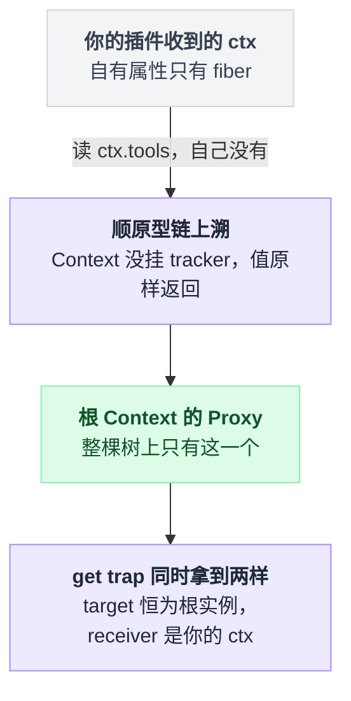
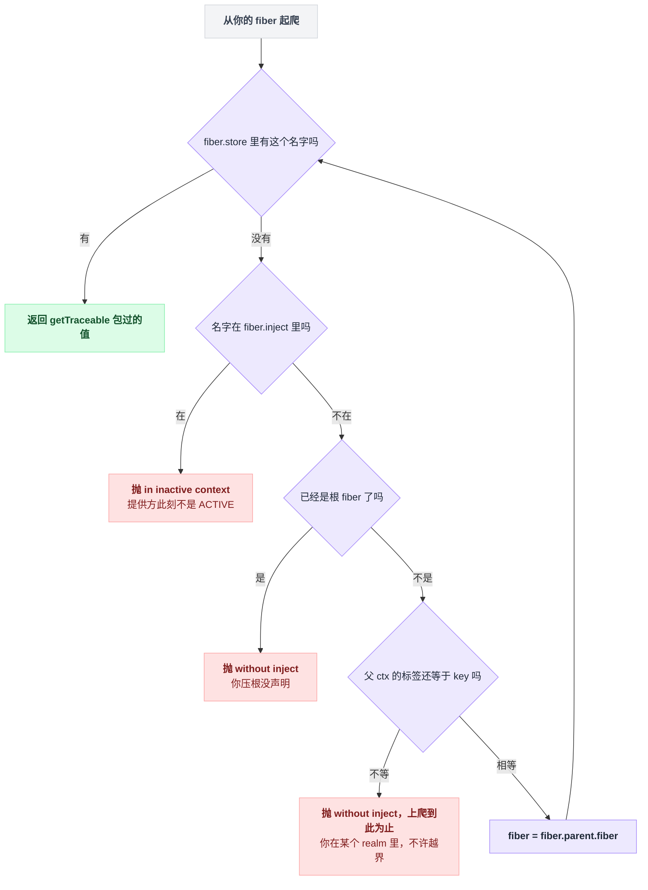
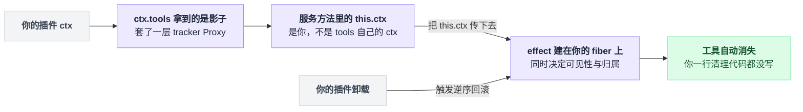
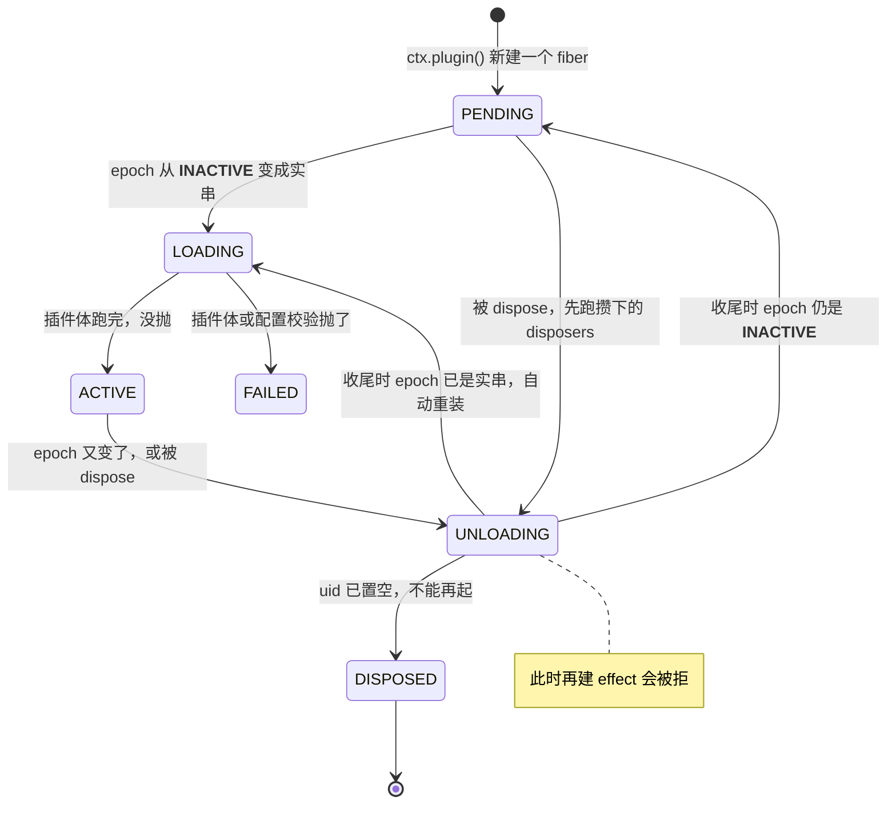
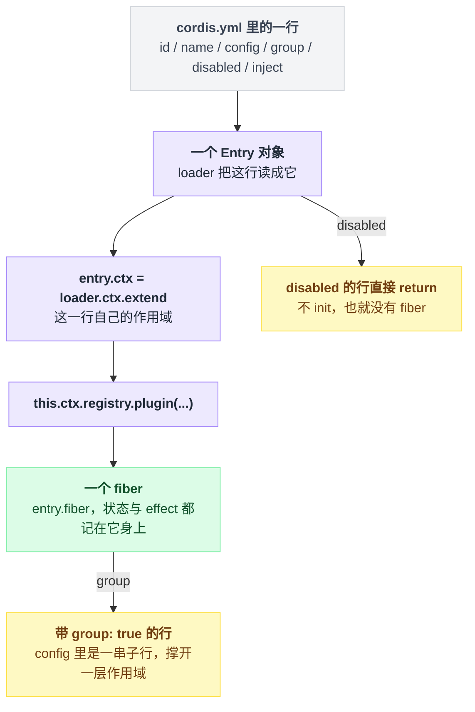
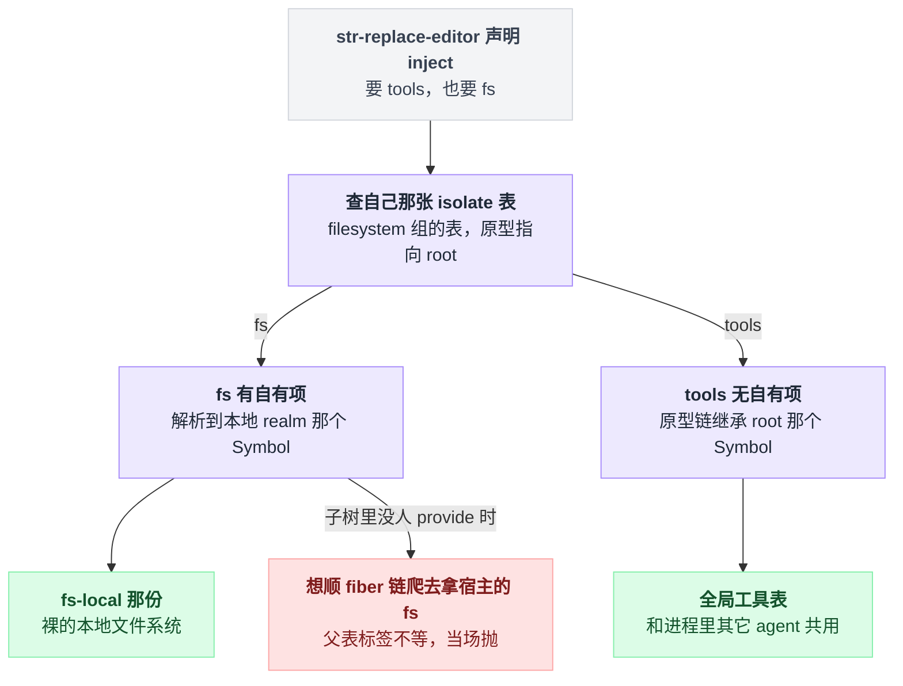

# 05 · Cordis 是什么

> 基于 `deepseek-ai/deepseek-harness` v0.1.0-rc.5（commit `47f9438`），2026-08-14 核对。本章只讲 Cordis 的心智模型——它是什么、几个核心概念怎么咬合、为什么 dsh 非要垫这一层；具体 API 怎么写留给 06–11 章。

前四章你一直在跟 `ctx` 打交道：配置里写一行插件，它就活了；插件函数的第一个参数叫 `ctx`，你从它身上取 `ctx.tools`、`ctx.llm`。这一章解释这个 `ctx` 到底是什么东西。

值得先花这个力气，因为它不是一个普通的对象。它是个 Proxy，而且**每个插件手里的那个都不是同一个**。

这一点没建立起来，后面几章的行为在你眼里会全是玄学：为什么我 `ctx.tools` 读出来直接抛异常而不是 `undefined`；为什么我从没写过清理代码，插件卸载后注册的工具却真的消失了；为什么两个插件读同一个 `ctx.fs` 拿到的是两份不同实现。

这些问题的答案都在同一个地方。

---

## 先看一个反常的事实：这个项目没有"核心"

两个当场数出来的数字。`packages/` 下有 226 个 `package.json`，其中 219 个把 `@deepseek-ai/cordis` 写进了 `peerDependencies`（同时也在 `devDependencies` 里）。

剩下 7 个全在 `packages/typert/generator/tests/fixtures/` 下，是测试夹具。`vendor/README.md:5` 也是这么说的："every harness package declares `cordis` as a peer dependency"。

也就是说，**dsh 的每一个真实包都是 Cordis 插件**——模型适配器是，工具注册表是，会话日志是，连 agent 主循环本身也是（`docs/architecture.md:11`）。口号写在 README 第一屏："everything is a plugin"（`README.md:7`），架构文档说得更硬：

> There is no privileged core to patch: you extend dsh by mounting a plugin beside the others, and registrations are effects that unwind when their plugin unloads.（`docs/architecture.md:13`）

这句话有个直接后果，你翻启动代码就能看见：里面根本没有"依次初始化各模块"那一段。`packages/boot/app-boot/src/index.ts` 的启动函数总共干三件事，完了：

| 第几件 | 干什么 | 行号 |
|---|---|---|
| 1 | `new Context()` | `:764` |
| 2 | `ctx.plugin(Loader)` | `:771` |
| 3 | 把一份 YAML 挂成根 Include | `:774` → `:518-523` |

`apps/cli/src/profile-boot.ts:1-6` 的模块说明也只讲"把各层 patch 叠出这份 YAML"，压根不提模块初始化顺序。

那顺序谁定？配置清单开头专门写了一句提醒，防止你想歪（`packages/bundle/base/cordis.patch.yml:12-13`）：

> Row order carries no load semantics (activation is service-availability driven); the grouping is for readers.

配置行的先后不代表加载先后，分组只是给人看的。这就是本章要回答的问题：**没有核心、没有初始化顺序，几百个插件是怎么自己排好队站起来的。**

---

## 它为什么被抄进了 `vendor/`

一张档案卡先摆着：

| 项 | 内容 | 出处 |
|---|---|---|
| 上游 | `cordiverse/cordis` 的 `packages/core` | — |
| 快照 commit | `56b3d4f7` | `vendor/README.md:17` |
| 设计论文 | _A Programming Paradigm for Spatiotemporal Composability_ | 链接在 `README.md:7` |
| rescope 后的包名 | `@deepseek-ai/cordis` | `vendor/cordis/package.json:2`、`vendor/README.md:5` |
| 源码位置与体量 | `vendor/cordis/src/`，9 个文件共 2693 行（当场 `wc -l`） | — |

2693 行是一个下午读得完的量。

（"Cordis 出自 Koishi 生态"这句是背景常识，仓库里没有写，别当成核对过的事实。）

关键在于它是 **vendored 的，不是 npm 依赖**："copied into this monorepo instead of being depended on via npm, so that the harness fully owns its framework layer (auditable, patchable, pinned)"（`vendor/README.md:3`）。

而且是真改了，不是抄来放着。`vendor/README.md:33-50` 逐条列了 18 项本地修改（小标题在 `:29`），第 6 条就是对 `cordis/src/fiber.ts` 的生命周期加固，堵了三个可重入卸载的漏洞（`vendor/README.md:38`）。

对你只有一条实际影响：**读 Cordis 行为必须以 `vendor/cordis/src/` 为准，上游文档和博客不是事实源。** 本章所有行号都指这里。

---

## 五个对象，一张图

官方 primer 用五句话概括 Cordis（`docs/cordis-primer.md:9-13`），挑的是 plugin / context / `inject` / typed events / reversible effects。

本章的词表跟它不完全重合：`inject`、事件、effect 分别留给 07 / 10 / 08 章，这里先把承载它们的五个对象摆出来。

| 词 | 一句话 | 出处 |
|---|---|---|
| **Context**（`ctx`） | 服务仓库。插件通过 `ctx.<key>` 找能力，而不是 import 实现 | 类定义 `vendor/cordis/src/context.ts:42`；"repository of services" 这个说法出自 `docs/cordis-primer.md:10` |
| **plugin** | 一个函数、类、或带 `apply(ctx, config)` 的对象 | `vendor/cordis/src/registry.ts:92-95`（对象形态见 `:130-133`） |
| **fiber** | 一次插件加载的运行时实例：状态、校验过的配置、注册的 effect | `docs/cordis-api/fiber.md:6` |
| **registry** | 插件加载与依赖注入 | `docs/cordis-api/registry.md:6` |
| **service** | 占住 `ctx.<name>` 的类，随所属 fiber 自动注销 | `docs/cordis-api/service.md:6` 与 `:10` |

后三行的措辞抄自 `docs/cordis-api/*.md`——那是 `scripts/gen-cordis-catalog.ts` 生成的 API 参考，属于官方文档表述；本章后文每一条行为结论另有源码行号。

摆成图是这样：

```
 new Context()  ← 构造函数返回的是一个 Proxy，不是 this      context.ts:74 / :83
   ├── ctx.reflect ── store: { Symbol(name) → Impl{name,value,fiber,check} }  reflect.ts:209 / :116-125
   ├── ctx.registry ─ Map<callback → Runtime{ fibers[] }>            registry.ts:197
   ├── ctx.events ─── _hooks: { 事件名 → [{ ctx, callback }] }        events.ts:132 / :257
   └── root fiber (uid = 0, runtime = null)                          fiber.ts:321-324
         │  ctx.plugin(X) 每调一次新建一个 fiber           registry.ts:330
         └── fiber #1 ─ ctx₁ = 父ctx.extend({ fiber: 自己 })          fiber.ts:236
               └── fiber #2 / #3 / …  每个都有自己的 ctx，同样是 Object.create 出来的
```

看清楚这里的错位：三张表是**平的**，都挂在根上那三个服务实例里；fiber 是**树的**。

"表平树竖"是 Cordis 全部表达力的来源，后面讲 isolate 时你会看到它被用到极致。

---

## 每个插件手里的 `ctx` 都不是同一个

这是本章最重要的一段。

只有根 ctx 是 Proxy：`context.ts:74` 那行 `const self = new Proxy<this>(this, ReflectService.handler)`，构造函数在 `:83` 把它 `return` 出去——所以 `new Context()` 拿到的从来不是 `this`。全仓只有这一处用了 `ReflectService.handler`（当场 grep），**整棵树上就这一个 Proxy**。

子 ctx 是另一码事。`extend()` 走的是 `const self = Object.create(getTraceable(this, this))`（`context.ts:101`），普通对象，原型指向父 ctx。每个插件收到的 ctx 就是这么造出来的：`this.ctx = this.context = parent.extend({ fiber: this })`（`fiber.ts:236`）。

那子 ctx 上的属性查找怎么最终落到那个 Proxy 上？Context 类自己没挂 tracker（`symbols.tracker` 只出现在 logger / events / registry / reflect / `Service` 上），`getTraceable` 遇到没 tracker 的值原样返回（`utils.ts:122-124`），于是原型链一路上溯，最后撞到根那个 Proxy。

路上的四跳是这样接的——注意最后一跳，trap 里拿到的仍然是你那个 ctx：



**结论：你的插件函数收到的 `ctx` 只属于你这个 fiber。它的自有属性只有 `fiber` 一个——声明了 `inject` 时还会多一个 intercept 符号属性（`fiber.ts:240-244`）——其余全靠原型链继承。你和隔壁插件拿到的 `ctx` 长得一样，行为不同。**

---

## 你写下 `ctx.tools` 那一刻，逐行发生了什么

一句话：查找沿原型链上溯撞到根 Proxy 的 `get` trap → 用**根**的表把名字换成 Symbol → 从**你的** fiber 起往上爬着找实现，找不到就抛。

这里有个 ES 语义要先说清，否则下面看不懂：Proxy 的 `get` trap 第三个参数 `receiver` 是**最初被访问的那个对象**——也就是你的 ctx，不是根。Cordis 干脆把它命名为 `ctx`（`reflect.ts:136` 的 `get: (target, prop, ctx: Context) => {`）。

而第一个参数 `target` 恒等于根 Context 实例，所以下面取的 `key` 是**根**那张 isolate 表里的标签。这一"你的 ctx + 根的表"的组合，是后面 isolate 那节的全部机关所在。

解析过程摊开来是一个爬链循环：

```
err = 错误对象「cannot get property "tools" without inject」   // :144 就造好

if 你在根 ctx 上（fiber.runtime === null）:
    直接查表返回，不要求 inject                                // :152
进 internal/get waterfall                                     // :153（可被插件层层包住的派发方式，第 11 章专讲）

key = 根 ctx 的 isolate 表里 'tools' 那一格的 Symbol            // :154
fiber = 你的 ctx（带 shadow 时用 shadow 的）的 fiber            // :155

loop:
    if fiber.store['tools'] 有:                                // :157
        return getTraceable(你的ctx, 值)                        // :158
    if 'tools' 在 fiber.inject 里:                              // :159
        throw 「cannot get required service "tools" in inactive context」
    if fiber 已是根 fiber（runtime === null）:                   // :163
        throw err
    if 父 ctx 的 isolate['tools'] ≠ key:                        // :164（进了别的 realm）
        throw err
    fiber = fiber.parent.fiber                                  // :165
```

四个出口：一个正常返回，三个抛，而且抛的理由各不相同。完整实现在 `reflect.ts:144-167`。



注意错误对象是在 `:144` 就造好的，后面几个分支只是改写它的 message 再抛出去。这直接决定了下面这件事。

### 两句报错，两种病

排障时你会反复看到这两句，它们区分的是两种完全不同的失败，别弄混：

| 报错 | 判据 | 病根 | 改法在哪 |
|---|---|---|---|
| `cannot get property "x" without inject` | `inject` 数组里没有 `'x'`，爬到根 fiber 都没人给你 | 你压根没声明 | **你自己的插件里**：把 `'x'` 加进 `inject` |
| `cannot get required service "x" in inactive context` | `'x'` 在 `fiber.inject` 里，`fiber.store` 却没有对应实现 | 提供方那个 fiber 现在不是 ACTIVE | **别人那里**：去查提供 `x` 的插件为什么没起来 |

第二种多半是提供方自己卡在 `PENDING` 等更上游的依赖。

一句话记法：**没写 inject 是你的问题，写了还报错是上游的问题。** 第 25 章会把这两条接进诊断流程。

### 两条推论

**不 `inject` 就读不到，而且是抛，不是返回 `undefined`。** `fiber.store` 是 fiber 激活时对"我声明的依赖"的快照（`fiber.ts:647` 建、`:687` 清），自己 `provide` 的服务随后补写进去（`reflect.ts:293`）。没声明的名字爬到根就抛。

**另有一条不检查 inject 的旁路**：`ctx.get(name)`（`reflect.ts:233`，混入见 `:219`）。它按 isolate 键直查表，`strict` 默认 `true`，只返回提供方 fiber 处于 ACTIVE 的实现（`reflect.ts:237-243`）。

`packages/` 里有 376 处 `ctx.get('…')`（当场 grep），dsh 里"有就用、没有算了"的可选依赖走的就是它——例如 `packages/core/tools/src/index.ts:1020` 读 `codeRuntime`、`packages/core/agent-loop/src/index.ts:359` 读 `sessionPersistence`。

---

## 你拿到的服务，是一个绑在你身上的影子

上面第 158 行返回的不是 `impl.value` 本身，而是 `getTraceable(ctx, impl.value)`。这一层包装是整个模型闭合的地方。

`Service` 基类构造时造了 tracker `{ associate: name, property: 'ctx' }`（`service.ts:46-49`）并挂到实例上（`:55`），于是 `getTraceable` 会给它套一层 Proxy（`utils.ts:117-125` → `:165`）。这层 Proxy 只做一件事：

```
Proxy(服务实例, {
    get(实例, prop):
        if prop === tracker.property:   return 调用方的 ctx    // 不是服务自己的
        else:                           return 实例[prop]
})
```

决定性的那一行是（`utils.ts:176`）：

```ts
if (prop === tracker.property) return ctx
```

**服务方法里读到的 `this.ctx`，是调用方的 ctx，不是服务自己被创建时的那个 ctx。**

看 dsh 里最常用的注册路径就明白它有什么用。`ctx.tools.register()` 的签名在 `packages/core/tools/src/index.ts:1037`，中间十几行是 schema 与保留名校验，真正干活的是收尾五行（`:1057-1061`，`name` 来自 `:1038` 的 `definition.name`）：

```ts
return this.layers.effect(
  this.ctx,
  layer => layer.tools.insert(name, definition),
  { label: 'tools.register()' },
)
```

`this.ctx` 一路传下去，最终落到 `ctx.effect(...)`（`packages/core/scope/src/store.ts:226` 的方法、`:233` 的调用；`:221` 的文档写明这个 ctx "determines both scope visibility and effect ownership"）。所以：

> 你在自己的插件里调 `ctx.tools.register(...)`，这个工具注册成了**你这个 fiber 的 effect**；你的插件卸载，工具自动消失。你不写一行清理代码，`tools` 服务也不需要知道你是谁。

这条链上没有一步是靠约定，每一跳都由 `ctx` 的身份决定：



事件监听同理，`ctx.on()`（`events.ts:288`）走到 `register()`，里面就是 `this.ctx.fiber.effect(...)`（`events.ts:254-260`）。

这就是"注册即 effect、卸载即逆序回滚"的物理基础——不是靠约定，是靠 `ctx` 的身份被 Proxy 全程携带。`packages/` 下有 189 处 `ctx.effect(` 调用点，算上 `apps/` 与 `vendor/` 共 212 处（当场 grep），怎么写见第 08 章。

---

## fiber：插件加载一次，就是一个 fiber

一个插件被 `ctx.plugin()` 调几次就有几个 fiber，它们共享一条 `Runtime` 记录（`registry.ts:136-145`）；registry 用 `Map<callback, Runtime>` 索引（`registry.ts:197`），键是 `resolve()` 出来的可执行体（`registry.ts:222-228`）。

fiber 有六个状态，枚举顺序如下（`fiber.ts:147-154`）：

| 状态 | 含义 | 你什么时候会撞见 |
|---|---|---|
| `PENDING` | 在等 `inject` 声明的服务 | 插件"没加载"最常见的真相 |
| `LOADING` | 插件体正在跑 | 异步 `apply` 期间 |
| `ACTIVE` | 加载完成，对外可见 | 正常态 |
| `FAILED` | 插件体或配置校验抛了 | 配置写错时 |
| `DISPOSED` | 已移除，不能再起 | — |
| `UNLOADING` | disposers 正在跑 | 此时再建 effect 会被拒（`fiber.ts:419-422`） |

状态之间的迁移不靠调度器，靠一个 epoch 字符串（`fiber.ts:611-639`）：

```
_refresh():
    epoch = 每个依赖的提供方 fiber uid 拼起来，形如 ":3:7"
    任一依赖缺失 → 整串写成 "__INACTIVE__"

_setEpoch(新, 旧):
    if 旧 == "__INACTIVE__" 且 新 != "__INACTIVE__":  _reload()   // :631-633
    else 任何其它变化:                                 _unload()   // :634-637
        // 「其它变化」包括：从一个非 __INACTIVE__ 串变成另一个非 __INACTIVE__ 串

_unload() 收尾:
    if epoch 已不是 "__INACTIVE__":  自动 _reload() 回来           // :688-694
```

注释里那句是重点：**依赖的提供方换了一个 fiber（uid 变了），epoch 就变，你的插件会被完整卸载重装。** 这不是 bug，正是热重载能干净工作的原因（第 08 章）。

把六个状态和 epoch 的两条规则接起来，迁移图就闭合了——`UNLOADING` 有两个出口，是"卸载完发现依赖又回来了就自动重装"这句话的机制形态：



顺带澄清一个容易读反的细节。`effect()` 自己的 disposer 是严格**逆序串行**执行的（`fiber.ts:431` 的 `.reverse()`）。

但 fiber 整体 `_unload()` 时，把 `_disposables.clear()` 拿到的逆序列表（`utils.ts:27-31` 的 `values.reverse()`）交给了 `Promise.all` 并发跑（`fiber.ts:676`）——这里逆序决定的是启动顺序，不是串行等待。

---

## plugin tree：`cordis.yml` 的一行 = 树上一个节点

Cordis 本体不认识 YAML。是 loader 插件把配置翻译成 `ctx.plugin()` 调用。

上游那个最小启动器统共 16 行，值得打开看一眼（`vendor/cordis/bin.js:1-16`）：去掉 import 与 `baseUrl` 赋值，剩下的就是 `new Context()` → `ctx.plugin(Loader)` → `ctx.loader.create({ name: '@deepseek-ai/cordis-plugin-include', config: { path: './cordis.yml' } })`。

dsh 的启动是同一个形状，只是 Include 那一行换成了内置 id（`packages/boot/app-boot/src/index.ts:764`、`:771`、`:518-523`）。

配置里每一行叫一个 **Entry**（`vendor/loader/src/config/entry.ts:52`）。它自己也 `extend` 出一个 ctx（`entry.ts:67`），再把插件挂上去（`entry.ts:296` 的 `this.ctx.registry.plugin(...)`）。

字段就那么几个（`entry.ts:9-22`）：`id` / `name` / `config` / `group` / `disabled` / `inject`，另加 loader 的 isolate 插件补的 `intercept` / `isolate`（`vendor/loader/src/config/isolate.ts:6-9`）。

一行配置到一个运行实例，中间只有三跳；`disabled` 的那一行连 fiber 都不会有：



启动后的树：

```
root Context                                             app-boot/src/index.ts:764
└── Loader                                                                  :771
    └── Include(id: include)  ← 四层配置叠加后的那份清单，见第 03 章    :518-523
        ├── llm      @deepseek-ai/dsh-llm      provide 'llm'    base patch:24
        ├── session  @deepseek-ai/dsh-session  provide 'sessions'         :27
        ├── agent    @deepseek-ai/dsh-agent    provide 'agents'           :58
        └── …  dsh-base 这一层共 78 行 entry（当场数）
```

服务名不是猜的：`super(ctx, 'llm')` 在 `packages/llm/llm/src/index.ts:293`、`'sessions'` 在 `packages/core/session/src/index.ts:797`、`'agents'` 在 `packages/core/agent/src/index.ts:267`。

**这棵树的深度不是模块层级，是作用域层级。** 兄弟节点之间没有先后，谁先 ACTIVE 完全由 `inject` 与 epoch 决定——这就是开头那句 "Row order carries no load semantics" 的机制解释。

---

## registry 和 service store 是两张表，别当成一张

新手最容易把它们混作一谈。索引对象、键、生命周期，三样全不同：

| | registry | reflect store |
|---|---|---|
| 存什么 | 插件运行时 `Runtime{ name, fibers[], callback, Config }` | 服务实现 `Impl{ name, value, fiber, check }` |
| 键是什么 | 插件的可执行体（函数引用） | **一个 Symbol**，不是服务名字符串 |
| 定义 | `registry.ts:136-145` / `:197` | `reflect.ts:116-125` / `:209` |
| 谁写进去 | `ctx.plugin()`（`registry.ts:316`） | `ctx.provide()`（`reflect.ts:277`） |
| 何时清 | 最后一个 fiber 销毁时触发（`fiber.ts:270-274`）→ `registry.delete()`（`registry.ts:258-267`） | 提供方 fiber 卸载时（`reflect.ts:297-303`） |

服务表的键是 Symbol 而不是字符串，这是下一节的全部前提。`provide()` 里那两行是这么走的：

```
provide('fs'):
    先在根上给服务名 'fs' 分配一个 Symbol          // reflect.ts:286
    再从「当前 ctx 的 isolate 映射」里取键          // reflect.ts:287
```

换句话说：服务名 `'fs'` 只是用来查那张映射表的字符串，真正的键是表给出的 Symbol。默认情况下大家共用根上那一个，所以全进程看到同一份 `ctx.fs`。

——除非有人把那张表换了。

---

## isolate realm：同一个名字，两份实现

场景是真实的。`minimal` 这个 agent preset 想让**只有这个 agent** 用裸的本地文件系统，进程里其它 agent 继续用宿主那份被沙箱包过的 `fs`（意图写在 `apps/cli/config/agent-presets/minimal/agent.cordis.yml:46-47` 的注释里）。配置就这么几行（同文件 `:48-57`）：

```yaml
- id: filesystem
  name: cordis:group
  group: true
  isolate:
    fs: true
  config:
    - id: fs-local
      name: '@deepseek-ai/dsh-fs-local'
      config:
        cwd: !!js process.env.DSH_CWD ?? process.cwd()
```

处理在 `vendor/loader/src/config/isolate.ts`。写 `true` 就是 entry 本地 realm（`LocalRealm`，后缀 `#<entry id>`，`isolate.ts:48-57`）；写成字符串就是具名 realm（`GlobalRealm`，后缀 `@<label>`，`isolate.ts:59-68`），**同 label 的多个 entry 共享一个 realm**（`isolate.ts:77-89`）。

realm 只干一件事：给这个名字发一个新 Symbol（`isolate.ts:31-37`），塞进这棵子树的 isolate 映射（`isolate.ts:98-101`，新表的原型指向父表）。

```
root:  isolate = { fs: Symbol(fs), tools: Symbol(tools) }
  │      store[Symbol(fs)] = 宿主那份沙箱 fs;  store[Symbol(tools)] = 全局工具表
  └── filesystem group:  isolate = { fs: Symbol(fs#filesystem) } ← 原型指向 root 那张表
        ├── fs-local            provide('fs') → 写进 Symbol(fs#filesystem) 这一格
        └── str-replace-editor  ctx.fs    → 解析到 Symbol(fs#filesystem)（本地那份）
                                ctx.tools → isolate 表里无自有项，原型链继承到
                                            root 的 Symbol(tools)（全局那份）
```

名字对得上：`fs-local` 占的是 `'fs'`，来自它继承的 `FileSystem` 基类构造时那句 `super(ctx, 'fs')`（`packages/fs/fs/src/index.ts:88`）；而 `str-replace-editor` 那行 `export const inject = ['tools', 'fs']`（`packages/fs/tool-str-replace-editor/src/index.ts:494`）正好一个来自 realm、一个来自全局。

同一个 `inject` 数组里的两个名字，解析走的是两条路：



**一次 isolate 只切一个名字**，其余服务照旧继承。"给某个 agent 换掉文件系统、同时保留全局工具表"能一行配置搞定，就是这么来的。

回头看解析过程里那条看起来最古怪的第 164 行：父 ctx 上这个名字的标签一旦不等于根表里的那个（也就是你已经进了某个 realm），上爬就停。

现在它有意义了——**这是防止子树里的插件顺着 fiber 链爬到父作用域去偷宿主那份实现。** realm 如果只能挡住写、挡不住读，那它就白设了。

最后纠正一个容易想歪的地方：**这棵 preset 子树不是启动清单里的兄弟节点**。它由 `dsh-agent-presets` 在运行时直接挂在 agent 的 scope 上下文下——`packages/preset/agent-presets/src/mount.ts:350` 的 `agentCtx.plugin(PresetTree, config)`，其中 `PresetTree` 是 `Include` 的子类，roster 自己那一行则在 `packages/bundle/web-app/cordis.patch.yml:421`。

同一个 preset 文件里还有另一个 realm（`persistent-shell` 组 `isolate: { terminals: true }`，`:18-22`），机制完全一样。

---

## 那普通 DI 容器或洋葱中间件为什么不够

两个词先说清楚。

**DI 容器**（dependency injection，依赖注入）：你不自己 `new` 依赖，而是声明"我要一个 X"，由容器在启动时把实例塞给你——Spring、NestJS 那一类。

**洋葱中间件**：把一串处理函数套成同心圆，每个函数拿到 `next()`，可以在调用它前后各做点事，也可以不调用它从而截断后面所有层——Koa、Express 那一类。

| 维度 | 传统 DI 容器 | 洋葱中间件 | Cordis |
|---|---|---|---|
| 依赖解析时机 | 启动时一次成型 | 不管依赖 | 任意时刻，服务可来可走 |
| 依赖消失时 | 通常不表达 | — | 依赖方自动卸载，恢复后自动重装（`fiber.ts:625-639`） |
| 注册的回收 | 手写销毁钩子 | 手写 | 归属 fiber 自动逆序回滚（`fiber.ts:418-442`，逆序在 `:431`） |
| 归属判定 | 靠调用方自觉 | — | 服务方法里的 `this.ctx` 就是调用方（`utils.ts:176`） |
| 同名多实现 | 手工 qualifier / token | — | isolate realm，配置一行（`isolate.ts:77-89`） |
| 拓扑 | 类依赖图 | 一维数组 | 作用域树 |
| 拦截 | AOP 装饰器 | 全局一条 `next()` 链 | 具名 waterfall 事件（第 11 章有全表） |

> 表里"传统 DI 容器 / 洋葱中间件"两列是通用常识对照，不是从本仓库验证出来的；Cordis 那一列每格都有行号。

压成一句：**普通 DI 容器只有空间维度（谁依赖谁），洋葱中间件只有时间维度（先后顺序），Cordis 两个都要，而且要的是"运行中可变"的版本。** 这正对应论文标题里的 _Spatiotemporal Composability_（原文本章没读，只引标题）。

那"一切皆插件"这句口号，拆开来具体靠哪几个机制？

| 口号里的分句 | 靠的机制 | 出处 |
|---|---|---|
| 任何能力都能被替换 | 按 name 解析服务，不 import 实现 | `reflect.ts:157-158` |
| 任何插件都能被卸载 | 注册即 effect，卸载逆序回滚 | `fiber.ts:418` / `:431` |
| 卸载不留残渣 | 服务方法在**调用方**的 ctx 上建 effect | `utils.ts:176` + `core/tools/src/index.ts:1057-1058` |
| 加载顺序不用人排 | `inject` → epoch → 自动 reload/unload | `fiber.ts:611-639` |
| 同名能力可以并存 | isolate realm 的 Symbol 索引 | `reflect.ts:286` + `isolate.ts:31` |
| 不改核心就能插进流程 | 事件多种派发模式，waterfall 可短路 | `events.ts:234-243` |
| 监听器按作用域过滤 | 每条监听记录自带 `ctx`，派发时按 filter 筛 | `events.ts:171-174` |

少任何一条，"一切皆插件"都会退化成"一堆插件加一个不能动的核"。

> 想知道这一点上 Pi / Codex / LangChain 怎么做，见 [五个 agent 系统源码解剖](../2026-08_五个agent系统源码解剖/00-总览与阅读指南.md)。

---

## 三个最容易踩的坑

**把 `ctx` 存进模块级变量再共享。** 服务方法读的是调用方 ctx，你把自己的 `ctx` 传给别的模块去注册东西，等于把注册的归属也送出去了。

那些注册记在**你的** fiber 上，你卸载时它们跟着消失，而对方毫不知情；反过来拿别人的 ctx 注册，你自己卸载时东西还在。规矩很简单：**谁的生命周期，用谁的 ctx**。

**以为读不到的服务会返回 `undefined`。** 不会，会抛（`reflect.ts:144` / `:163`）。想要"有就用"的语义必须显式走 `ctx.get(name)`（`reflect.ts:233`）。

**以为配置文件里的顺序就是加载顺序。** 不是。插件激活时机由 `inject` 与 epoch 决定（`fiber.ts:611-639`）。插件"没加载"时第一件事是查它是不是卡在 `PENDING`——查它在等谁，而不是去调行序。

---

## 一句话带走

**`ctx` 是一个由 Proxy 撑着的、每个插件一份的服务视图：它决定你能看见谁（isolate 决定名字解析到哪个 Symbol），也决定你注册的东西归谁（`this.ctx` 是调用方，effect 记在你的 fiber 上）。**

前半句让"同名两份实现"成为一行配置，后半句让"卸载不留残渣"不需要任何清理代码。

接下来 [06 章](./06-你的第一个插件.md)开始动手写插件，[07 章](./07-Service能力从哪来.md)讲怎么提供服务，[08 章](./08-effect与生命周期.md)把 effect 讲透。

---

## 本章未确认

- ⚠️ **本章全部结论来自逐行读 `vendor/cordis/src/` 等源码文件，一行代码都没运行过**（仓库未安装依赖）；行为描述是静态阅读的结果，不是运行时观测。另，版本号对不上：`vendor/README.md:17` 的清单把 cordis 记作 `4.0.0-rc.7`，`vendor/cordis/package.json:4` 写的却是 `4.0.1`，而 `vendor/README.md:5` 又声称"upstream version numbers are deliberately unchanged"。没有去上游核对哪个是真实快照；本章一切以 `vendor/cordis/src/` 的实际代码为准。
- ⚠️ "Row order carries no load semantics" 是 `packages/bundle/base/cordis.patch.yml:12-13` 的注释声称。fiber 激活确由 inject/epoch 驱动这点在源码里成立，但"配置行序完全不影响任何可观测行为"这个更强的说法未验证：同一事件的监听器按注册先后派发（保序在 `events.ts:172-174`，`:255` 决定 push 还是 unshift），而注册先后取决于各 fiber 的激活先后——依赖都已满足时行序会不会就此体现为派发顺序，本章没有逐行验证。
- ⚠️ isolate 那节末尾的 preset 子树：挂载动作本身在代码里读到了（`packages/preset/agent-presets/src/mount.ts:350`），但"同一个 preset 每进程只挂一次、各会话靠 scope 父链共享这棵子树"这层更细的语义只来自 `packages/preset/agent-presets/README.md:5` 与 `:31` 的官方描述，其单飞与生命周期实现本章没有逐行核对。
- ⚠️ 论文 _A Programming Paradigm for Spatiotemporal Composability_ 只引了 `README.md:7` 里的标题与链接，没读原文；文中对"时空可组合性"的解释是笔者依据源码的转述。DI 容器对照表中"传统 DI 容器"与"洋葱中间件"两列同属通用背景知识，未在本仓库中取证。
