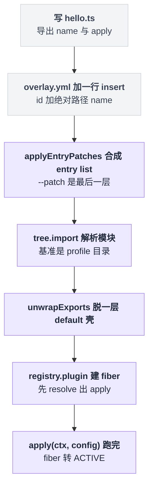
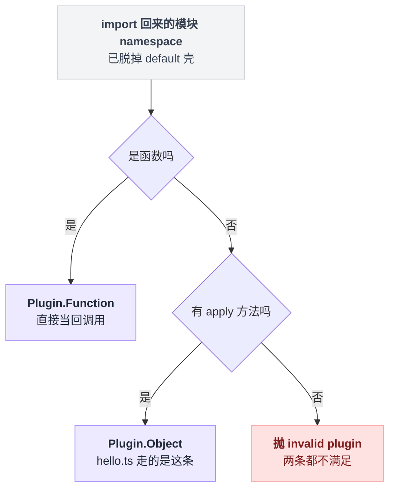
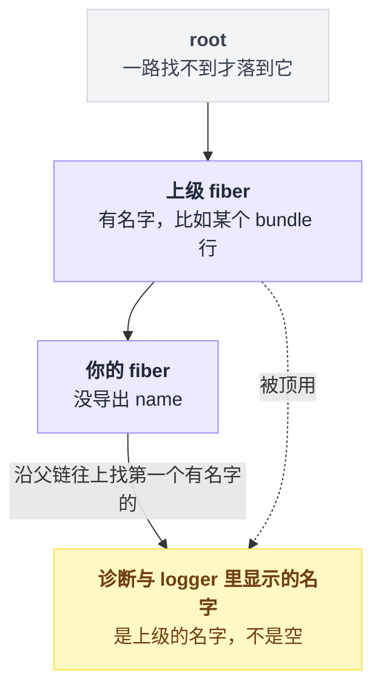
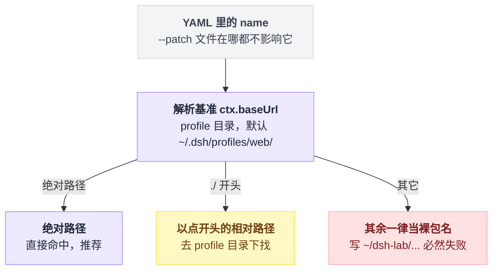
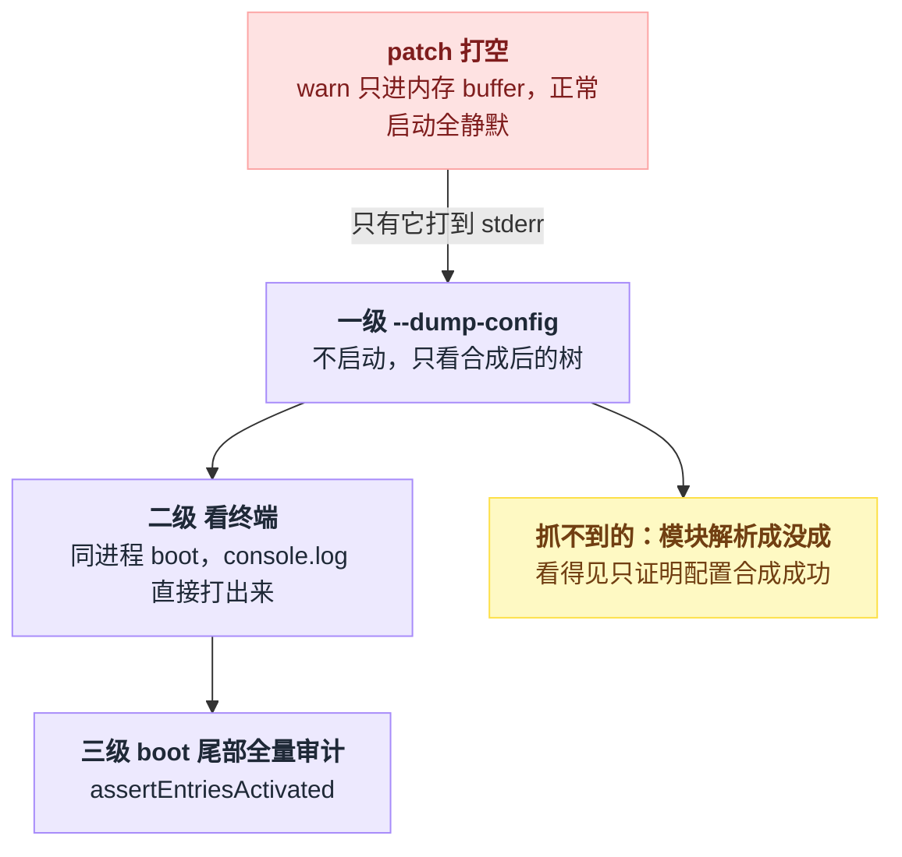
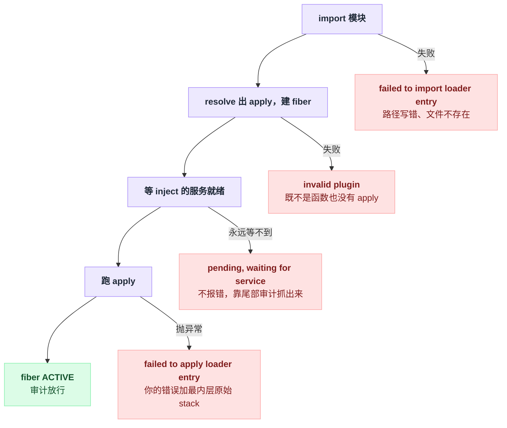
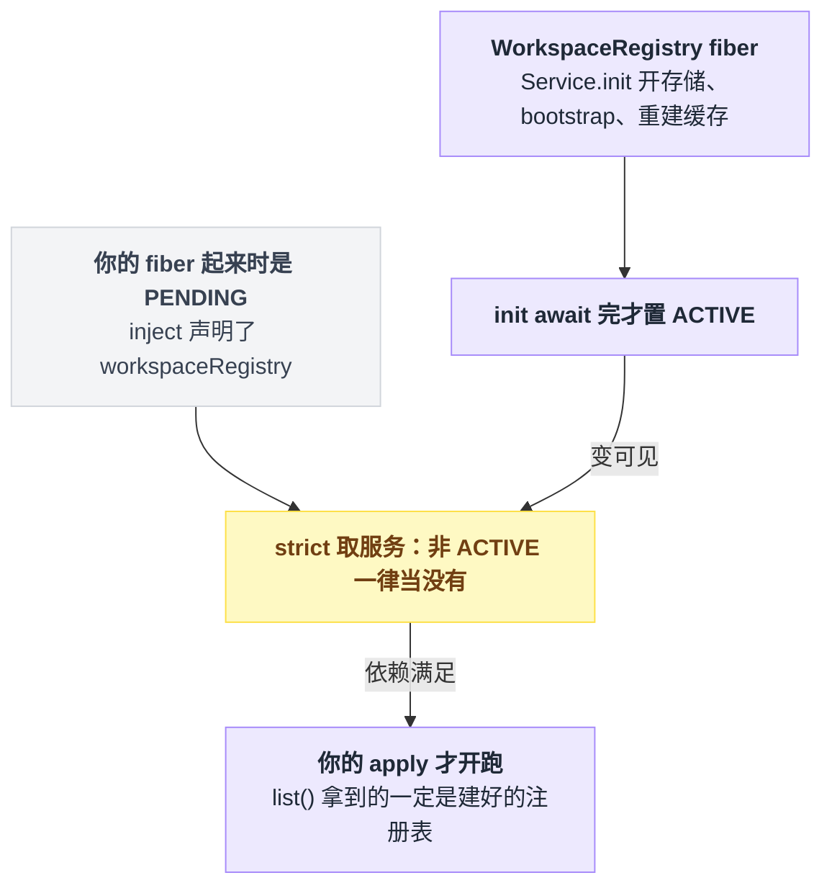

# 06 · 你的第一个插件

> 基于 `deepseek-ai/deepseek-harness` v0.1.0-rc.5（commit `47f9438`），2026-08-14 核对。

"写个插件"听起来像个工程：脚手架、`package.json`、注册、构建，起码得半天。

不是的。dsh 里一个插件的最小形态是**一个 `.ts` 文件，加 YAML 里的一行**。前五章都是读，这章开始写，而目标窄得有点故意：**把一个你自己写的文件挂进正在跑的 dsh，并且能证明它真的被加载了。** 就这一件事。Service 怎么对外提供（第 07 章）、effect 与卸载（第 08 章）、`Config` schema 校验（第 09 章）都不在这章。

为什么这么窄还值得一整章？因为这一步的失败模式比想象中多，而且大多数是静默的：路径写错、id 打错、依赖没声明——有的会炸得很明确，有的什么都不说。所以后半章有整整一节在讲"怎么确认它真的加载了"，以及每种失败长什么样。

两个术语后面每节都要用：**profile** = `$DSH_HOME/profiles/<名字>/` 下的一套完整配置（默认 `~/.dsh/profiles/web/`，第 03 章讲过）；**patch** = 一份"改哪一行、改成什么"的清单，叠在 profile 的配置树上，`--patch <文件>` 就是临时加一层。

---

## 先跑起来：七段链路，你只动前两段

从一个 `.ts` 文件到树上一个活着的 fiber，一共七段。你只动前两段，剩下五段是 dsh 在跑：



先建目录（放哪都行，下面用 `~/dsh-lab`）：

```sh
mkdir -p ~/dsh-lab/plugins
```

`~/dsh-lab/plugins/hello.ts`：

```ts
import type { Context } from '@deepseek-ai/cordis'

export const name = 'hello'

export function apply(ctx: Context) {
  console.log('[hello] plugin loaded!')
}
```

`~/dsh-lab/overlay.yml`（把 `/Users/you` 换成你自己的家目录，**必须是绝对路径**，后面有一整节讲为什么）：

```yaml
- insert:
    - id: hello
      name: '/Users/you/dsh-lab/plugins/hello.ts'
```

启动：

```sh
dsh web --patch ~/dsh-lab/overlay.yml
```

从源码跑的话是 `pnpm dsh web --patch ./overlay.yml`。

官方文档说，用它自己那个叫 `hello-plugin` 的示例插件时，终端会在启动过程中打出 `[hello-plugin] plugin loaded!`——照上面这份文件敲，打出来的就是 `[hello] plugin loaded!`。我没有跑过（仓库未装依赖），所以后面给三种不依赖"我看没看见那行"的确认办法。

出处：`pnpm dsh` 这个 script 在 `package.json:136`；官方教程的同款命令在 `docs/user/develop/basic/index.md:61`，那行输出的描述在 `docs/user/develop/basic/index.md:64`。

跑之前先拆一个第一次写必踩的坑：命令行上的 `~` 和 YAML 里的 `~`，长得一样，命运完全不同。

| 写在哪 | 谁负责展开 `~` | 结果 |
|---|---|---|
| 命令行 `--patch ~/...` | shell 早就展开好了 | 再按**当前工作目录**做 `resolve(file)`，没问题 |
| YAML 里的 `name: '~/...'` | 没人展开，不经过 shell | 既不以 `.` 开头也不是绝对路径，被当成**裸包名**丢给 Node 解析，必然失败 |

出处：`--patch` 的解析见 `apps/cli/src/profile-boot.ts:148`，`name` 的三分支见 `vendor/loader/src/config/tree.ts:156-159`。

---

## 插件不用注册，导出个 `apply` 就算数

上面那个 `hello.ts` 没做任何"注册"动作，dsh 凭什么认它是插件？答案是它不看你声明了什么，只看你**长什么样**。

Cordis 的 `Plugin` 类型是三选一的联合（`vendor/cordis/src/registry.ts:92-95`，三个成员接口在 `:120-133`）：

| 源码里的形态 | 长什么样 | 什么时候用 |
|---|---|---|
| `Plugin.Function` | 模块整体是个可调用对象：`export default function (ctx, config) {}` | 极简、不需要元信息 |
| `Plugin.Object` | 带 `apply(ctx, config)` 方法的对象 | **默认选它** |
| `Plugin.Constructor` | `export default class X extends Service` | 你要对外提供服务（第 07 章） |

三选一在代码里就是两个 if 的先后：



摊成代码就三行：

```
resolve(模块):
    if 模块是函数:              当 Plugin.Function 用，直接调
    elif 模块有 apply 方法:     当 Plugin.Object 用          // isApplicable
    else:                       抛 invalid plugin, expect function or object with an "apply" method
```

判定逻辑短得没什么可讲。出处：`resolve()` 与 `isApplicable` 在 `vendor/cordis/src/registry.ts:8-10`、`:222-228`，抛错在 `:319`。

真正值得记一笔的是：`hello.ts` 走的是**哪一条**。

它看起来像是"导出了一堆散装东西"，实际上 ESM 模块的 namespace 本身就是一个"带 `apply` 方法的对象"，所以在源码层面它是 `Plugin.Object`，不是 `Plugin.Function`。

loader 拿到 namespace 之后只脱一层 `default` 壳，剩下的具名导出被原样当成插件对象的属性读走（`vendor/loader/src/config/entry.ts:280` 调用 `unwrapExports`，实现在 `vendor/loader/src/index.ts:191-199`）。

所以那三个可选的具名导出不是约定俗成，是有代码在逐个字段读它们（类型定义在 `vendor/cordis/src/registry.ts:100-111`）：

| 导出 | 类型 | 作用 | 在哪被读走 |
|---|---|---|---|
| `name` | `string` | 诊断里的显示名 | `registry.ts:324` |
| `inject` | `string[]` | 依赖的服务名；全部就绪前不加载（第 07 章） | `registry.ts:330` |
| `Config` | Standard Schema（`@standard-schema/spec` 那套通用校验接口，Schemastery 实现了它） | 启动前校验并填默认值（第 09 章） | `registry.ts:326` |

---

## `name` 别省，不然你的插件顶着别人的名字

这条单独拎出来说，因为省掉它不报错、不影响功能，只在你排查问题的那天让你多花半小时。

fiber 是一次插件挂载在运行时对应的那个节点（第 05 章）。它的显示名不是"没有就为空"，而是一条回溯规则：

```
显示名(fiber):
    node = fiber
    while node 存在:
        if node 有名字: return node 的名字   // 往上第一个有名字的祖先就赢了
        node = node 的父节点
    return 'root'                            // 一路找不到才落到它
```

这是个回溯规则，不是默认值。后果很具体：你不导出 `name`，你的插件在所有诊断输出、所有 logger 名字里，顶的都是上级的名字——**不是"无名"，是"别人的名"**。哪条日志是你打的，从名字上分不出来。实现在 `vendor/cordis/src/fiber.ts:336-343`。

摆成一条父链就清楚了：你在最下面，顶的是往上第一个有名字的那个。



还有个更阴的角落。注册时如果拿到的名字恰好是 `'apply'`，它会被当成噪音丢掉（`vendor/cordis/src/registry.ts:324-325`）。也就是说 `export default function apply()` 这种看着挺自然的写法，函数名一点忙都帮不上，照样落回上面那条回溯规则。

老老实实写一行 `export const name = '...'`。

---

## `cordis.yml` 一行 = 一个插件

一行的核心字段就是一个 interface（`vendor/loader/src/config/entry.ts:9-22`）；另有 `intercept` / `isolate` 两个，由 isolate 插件用声明合并补进同一个 interface（`vendor/loader/src/config/isolate.ts:5-9`），归第 07 章讲。

| 字段 | 含义 | 不写会怎样 |
|---|---|---|
| `id` | 这棵树里的稳定标识 | 自动生成 8 位随机十六进制（`vendor/loader/src/config/tree.ts:66-73`） |
| `name` | 模块说明符：相对路径、绝对路径或包名 | 无法加载 |
| `config` | 传给 `apply` 的第二个参数 | 走 `Config` schema 的默认值 |
| `inject` | 本行额外声明的依赖服务，与模块导出的 `inject` **合并**（`vendor/loader/src/index.ts:117-123` 把它并进 `fiber.inject`，合并逻辑 `vendor/cordis/src/registry.ts:71-88`） | 只用模块自己导出的 |
| `disabled` | `true` 时保留这行但不挂载 | 挂载 |
| `group` | 这行是一个嵌套分组 | 普通插件行 |

`id` 那一行的"不写会怎样"写的是"自动生成"，听起来无害，其实是这张表里最贵的一格。它有三个作用，缺一个都会咬人。

**patch 靠它定位。** 非 `insert` 的 patch 必须带 `id`，否则直接被跳过并告警 `patch: id is required for non-insert patches`（`vendor/include/src/index.ts:105-108`）。

**热重载靠它做 diff。** 配置文件改动时按 `id` 判断这行是"改了"还是"删了再加"。没写 `id` 的行每次读取都拿到一个新的随机 id，于是每次改配置都被判定成删除加新增，无脑重挂（`docs/cordis-tutorial/06-composition-and-hmr.md:59`）。

**它必须唯一。** 同一层出现两个相同 `id` 直接抛 `duplicate loader entry id: <id>`（`vendor/loader/src/config/group.ts:64`）。所以给自己的插件挑个不会跟内置行撞的 id——内置行有哪些，`dsh web --dump-config | grep 'id:'` 一看便知。

顺带纠正一个几乎人人都会有的直觉：**行的先后顺序不代表加载顺序**。所有条目并发启动，谁先谁后由 `inject` 的服务依赖决定（`docs/cordis-tutorial/01-first-plugin.md:31`）。想控制次序，声明依赖，别调行序。

---

## 你写的不是 `cordis.yml`，是 patch

裸 Cordis 的教程会让你直接写一个 `cordis.yml` 条目列表。你要是照着做，dsh 会安静地把你的成果删掉——profile 的根配置永远是**一个空数组**，而且每次启动都被重写：

```
$DSH_HOME/profiles/web/cordis.yml     ← 三行注释 + 一个 []，dsh 每次 boot 重写它
```

模板常量 `PROFILE_ROOT_CONFIG` 就是三行注释加一个 `[]`，第三行注释的结尾直接写着 `Edit cordis.patch.yml, not this file.`（`apps/cli/src/profile-boot.ts:60-64`），每次 `prepareProfile` 都 `writeFileSync` 覆盖（`apps/cli/src/profile-boot.ts:101`）。

**你在那个文件里写的任何东西下次启动就没了。**

真正的树是一层层 patch 叠出来的，顺序如下（`apps/cli/src/profile-boot.ts:121-129`、`docs/user/develop/basic/publish.md:114-119`）：

```
[]  空根
 └─ 每个 bundle 的 cordis.patch.yml（按 dsh.profile.bundles 顺序）
     └─ $DSH_HOME/profiles/<name>/cordis.patch.yml   你自己的常驻层
         └─ $DSH_HOME/cordis.patch.yml               机器级、所有 profile 共享
             └─ --patch <file>                       按 argv 顺序，最后生效
```

一条 patch 的字段定义在 `vendor/include/src/index.ts:145-156`，语义在 `applyEntryPatches` 里（`vendor/include/src/index.ts:58-128`）：

| 写法 | 效果 |
|---|---|
| `- insert: [...]` | 追加到根列表末尾（`vendor/include/src/index.ts:93-95`） |
| `- id: X` + `insert:` | 插进 id 为 X 的 **group** 里；X 不是 group 就告警跳过（:87-90） |
| `- id: X` + 其它字段 | 逐字段覆盖 id 为 X 的那行（:121-124） |
| `- id: X` + `name:` | `name` 对不上就整条跳过，当作防误改的断言（:116-119） |

第二种你大概率用不上：dsh 自带的 `dsh-base` / `dsh-web-app` 两个 bundle 里**没有任何 group 行**（grep 两个 `cordis.patch.yml`，`group` 只出现在散文注释里）。

日常就是第一种，顶层 `insert`。真实例子见 `examples/web-cordis/cordis.yml:15-19`——同一个文件还演示了另一半：`- id: webserver` + `config:` 直接改端口（:10-13，webserver 那行本体在 `packages/bundle/web-app/cordis.patch.yml:115-120`，默认端口 3080）。

第 03 章讲过的那个坑在这里再确认一遍：patch 是**整个 `config` 替换**，不是深合并（`packages/bundle/base/cordis.patch.yml:6-7`）。

---

## 绝对路径不是建议，是这套解析规则的必然

overlay 里那行 `name` 为什么必须写绝对路径？直觉的答案是"相对路径也行吧，相对 overlay 自己"。恰恰是这个直觉错了。

官方文档给了结论加一句理由："The plugin path must be absolute. A patch file contributes configuration but does not change the profile directory from which the loader resolves module paths."（`docs/user/develop/basic/index.md:56`）。

这句话背后是一条四段的源码链：

```
apps/cli/src/profile-boot.ts:227   rootConfig = <profile 目录>/cordis.yml
packages/boot/app-boot/src/index.ts:769   ctx.baseUrl = dirname(rootConfig) → profile 目录
vendor/include/src/index.ts:204    include 再把 baseUrl 设成自己那个文件所在目录（同上）
vendor/loader/src/config/tree.ts:155-157  import 时以 this.ctx.baseUrl 为基准解析 name
```

基准锚死在 profile 目录之后，`name` 的三种写法各自去哪儿找：

```
解析 name:
    if name 是绝对路径:     直接命中          // 推荐
    elif name 以 . 开头:    去 ctx.baseUrl 下找 = profile 目录，不是 overlay 旁边
    else:                   当裸包名交给 Node  // 写 ~/dsh-lab/... 会掉进这条
```



结论就是开头那个直觉的反面：**`name` 里的相对路径，基准是 `$DSH_HOME/profiles/<name>/`（默认 `~/.dsh/profiles/web/`），跟你的 `--patch` 文件在哪毫无关系。** 你写 `./plugins/hello.ts`，它去 profile 目录下找，不去你的 overlay 旁边找。`--patch` 只贡献配置，不改变解析基准。

官方文档自己在这点上打过架：`docs/user/develop/basic/config.md:36-43` 那段示例在同一个 patch 文件里写了 `name: './src/my-plugin.ts'`，按上面的规则它会去 profile 目录下找 `src/my-plugin.ts`；同一份文档的 `index.md:53` 写的是绝对路径。**以绝对路径为准。**

插件文件到底放哪，三种选择各有代价：

| 插件文件放哪 | `name` 怎么写 | 代价 |
|---|---|---|
| 任意目录（如 `~/dsh-lab/plugins/`） | 绝对路径 | 换机器要改路径；再要 import 运行时依赖，得在那棵目录树里自己装，且很容易装出**第二份 cordis** |
| profile 目录内（`~/.dsh/profiles/web/plugins/`） | `'./plugins/hello.ts'` | 路径短、能吃到 profile 的 `node_modules`；但目录是 dsh 管的 |
| 做成 npm 包 | `'your-pkg-name'` | 要写 `package.json`，见第 22 章 |

第二种能吃到依赖，是因为 profile 目录有自己的 `node_modules`：由 `dsh plugin --profile web add <pkg>` 管，该子命令把参数原样转发给 pnpm（`apps/cli/src/args.ts:171-181`）；外加 dsh 维护的兜底软链目录 `$DSH_HOME/profiles/node_modules`，把安装闭包里的每个包都链一份出来供 Node 的父目录查找命中（`packages/boot/app-boot/src/profile.ts:204-221`）。

这套东西为什么存在，注释里写得很直白（`profile.ts:133-137`）：让每个插件共用**安装目录里那一份 cordis 实例**，而不是各自复制一份。

两份 cordis 意味着两套服务注册表，`inject` 永远等不到——这就是上表第一行"很容易装出第二份 cordis"那句话的分量。

不过第一种放法在这一点上是安全的，因为你的 `hello.ts` 压根没有运行时依赖：`import type` 在运行时被整条擦掉，那个文件放哪都能加载。代价只在编辑器里——解析不到 `@deepseek-ai/cordis` 的类型会飘红（除非你在 `~/dsh-lab` 里也装一份），不影响运行。

最后是 `.ts` 后缀这件事。用 npx 装的 dsh 跑在裸 Node 上（`engines` 要求 `"node": "^22.19.0 || >=24.0.0"`，`package.json:8-10`），相对/绝对路径挂进来的 TypeScript 插件走 Node 内置的 type stripping（`packages/test-support/loader-smoke/src/index.ts:94-102` 明确说明了这条路径）。

前提是文件里只有可擦除语法——`import type`、类型标注可以，`enum`、构造函数参数属性不行。不放心就写 `.mjs` 并去掉类型标注，仓库里有现成先例（`examples/acp-agent/web.cordis.yml:17` 在一个 include 的 `insert` 里挂的就是一个 `.mjs`）。

---

## 怎么确认它真的加载了

按"越早发现越省事"排，有三级：**不启动先看合成后的树 → 启动看终端 → 让 boot 尾部的全量审计兜底**。三级各自能抓到什么、抓不到什么，差得很远。



**第一级：不启动，先看树。** `--dump-config` 把所有层按 `applyEntryPatches`（跟 boot 同一个函数）合成一遍再打印，`!!js` 表达式原样输出不求值，每段前面带 `# == <来源>` 注释。出处：`packages/boot/app-boot/src/index.ts:348-356`、实现 `:379-441`、注释 `:444-472`。

```sh
dsh web --patch ~/dsh-lab/overlay.yml --dump-config
```

来源标签这么定（`apps/cli/src/dump-config.ts:32-48`）：bundle 层用包名，profile 层和 home 层用文件全路径，`--patch` 层用 `resolve()` 后的绝对路径。

所以输出里应当出现一段 `# == /Users/you/dsh-lab/overlay.yml`，下面就是你那行 `id: hello`。看不见 = patch 根本没被合进去；看得见只证明"配置合成成功"，不证明"模块解析成功"。

这一步还有个不可替代的价值，也是我建议你养成习惯的原因：**patch 打空——比如 `- id: webserverr` 拼错——在正常启动时终端上是完全静默的。**

告警明明发出去了，为什么终端上看不见？追下去有三层原因叠在一起：

1. `applyEntryPatches` 的告警走 `ctx.root.logger?.('loader').warn(...)`（`vendor/include/src/index.ts:267-271`）。
2. `logger` 是 Context 构造函数里就装好的内置服务（`vendor/cordis/src/context.ts:81`），所以那个 `?.` 并不会短路。
3. 真正的原因是它默认只挂了一个**写进内存 buffer** 的 exporter（`vendor/cordis/src/logger.ts:213-221`），而 dsh 的 base / web-app 两个 bundle 里没有任何一行注册终端 exporter。

Cordis 侧其实有现成的 `@deepseek-ai/cordis-plugin-logger-console`（`vendor/logger-console`），但只有 examples 在挂，比如 `examples/headless-agent/tests/fixtures/session-telemetry-otel.cordis.yml:5-6`。于是那条 warn 落进 buffer，你在终端上看不到。

`--dump-config` 是例外，它把同样的告警打到 stderr，还带上是哪一层出的（`packages/boot/app-boot/src/index.ts:383`、`:428-432`）：

```
dsh: [/Users/you/dsh-lab/overlay.yml] patch: entry "webserverr" not found
```

**第二级：看终端。** `dsh` 是在当前进程里 boot 的（`apps/cli/src/bin.ts:29-39`，没有再 fork 子进程），所以你的 `console.log` 会直接打在跑 `dsh web` 的那个终端上。

**第三级：读失败信息。** 这里跟裸 Cordis 有个重要区别——dsh 在 boot 的最后做一次全量审计（`packages/boot/app-boot/src/index.ts:784` 调 `assertEntriesActivated`），**加载不上不会静悄悄地过去**。

下表里 `<name>` 一律指 YAML 里那个 `name` 字段（模块说明符），不是你导出的 `name`：

| 情况 | 报错 | 出处 |
|---|---|---|
| 路径写错 / 文件不存在 | `dsh: plugin tree failed to load: failed to apply loader entry include (cordis:include): failed to import loader entry <id> (<name>): ...` | 前缀由 `index.ts:773`+`:800` 拼出，`packages/boot/app-boot/tests/app-boot.spec.ts:718-724` 钉死了它；内层两句的模板在 `vendor/loader/src/config/entry.ts:24-27` |
| `apply` 里抛异常 | 同样以 `dsh: plugin tree failed to load:` 开头，内层是 `failed to apply loader entry <id> (<name>): <你的错误>`，末尾附最内层原始 stack | `index.ts:797-800` |
| 在没 `inject` 的情况下读服务 | 上一行的特例，你的错误是 `cannot get property "xxx" without inject` | `vendor/cordis/src/reflect.ts:144`、`:163` |
| `inject` 的服务没人提供 | `dsh: 1 entry did not activate` + `<name>: pending (waiting for service: xxx)` | `index.ts:710-723` |
| 树跑完了却有行连 fiber 都没有 | `dsh: plugin(s) failed to load: <name>; Cordis startup failed because these plugin(s) could not be resolved ...` | `index.ts:658-663`（兜底审计） |
| `--patch` 指的文件不存在 | `dsh: failed to read overlay <path>: ...` | `index.ts:303` |
| overlay 不是顶层数组 | `dsh: overlay <path> must be a top-level YAML array of loader patch entries` | `index.ts:330` |

把这几行按卡住的位置摆回加载链路上，形状是四段各有各的死法：



还有一条影响日常手感的：**web profile 关掉了热重载**。

base 层挂了 `hmr`（`packages/bundle/base/cordis.patch.yml:19-22`），web-app 层一行 `disabled: true` 又把它关了，上面那行注释写的是 `TODO: Re-enable shared HMR for Web after its reload lifecycle is tested.`（`packages/bundle/web-app/cordis.patch.yml:21-23`）。所以改完插件文件要重启进程，别对着没变的输出怀疑人生。

---

## 第二个插件：第一次用 `inject` 借别人的服务

`hello.ts` 只证明了"能加载"。这个证明"能干活"——它要用到一个别人提供的服务，启动时打印 workspace 名单，于是第一次用上 `inject`。

`~/dsh-lab/plugins/workspace-roster.ts`：

```ts
import type { Context } from '@deepseek-ai/cordis'
import type {} from '@deepseek-ai/dsh-workspace'

export const name = 'workspace-roster'
export const inject = ['workspaceRegistry']

export function apply(ctx: Context) {
  const rows = ctx.workspaceRegistry.list()
  console.log(`[workspace-roster] cwd=${process.cwd()} workspaces=${rows.length}`)
  for (const row of rows) {
    console.log(`[workspace-roster] ${row.title} -> ${row.path} (${row.sessionIds.length} sessions)`)
  }
}
```

挂进去（追加到同一个 overlay）：

```yaml
- insert:
    - id: hello
      name: '/Users/you/dsh-lab/plugins/hello.ts'
    - id: workspace-roster
      name: '/Users/you/dsh-lab/plugins/workspace-roster.ts'
```

里面用到的每样东西都能对上源码。

服务名 `workspaceRegistry` 在 `packages/workspace/workspace/src/index.ts:115`；类型挂在 `Context` 上是 `:67-71` 的声明合并——TypeScript 允许别处的模块往一个已有 interface 上再加字段，这就是为什么 `ctx.workspaceRegistry` 有类型。

`list()` 同步返回、按持久化顺序（`:181-189`）；`Workspace` 的 `path` / `title` / `sessionIds` 三个只读字段在 `packages/workspace/workspace/src/types.ts:32,35,51`。

这个服务在 web profile 里是有的：`packages/bundle/web-app/cordis.patch.yml:73-74` 挂了 `@deepseek-ai/dsh-workspace`，它的默认导出就是那个 Service 类（`packages/workspace/workspace/src/index.ts:663`）。

第二行那个 `import type {}` 是纯副作用类型导入，只为把声明合并那段引进来，仓库里的测试 fixture 插件就是这么写的（`examples/acp-agent/tests/fixtures/subagent-report-fence.ts:6-7`）。

有件事值得多想一步：`apply` 一进来就 `list()`，凭什么保证注册表已经建好了？这不是碰运气，是两条规则接上的。

```
// 规则一：服务 fiber 什么时候算 ACTIVE
服务 fiber 启动:
    await [Service.init]()      // 开存储、历史 bootstrap、重建缓存都在这里面
    置为 ACTIVE                 // 先 await 完，才置状态

// 规则二：你的 fiber 什么时候看得见它
你的 fiber 每次校验依赖:
    impl = reflect._getImpl('workspaceRegistry', strict=true)
    if impl 所在 fiber 不是 ACTIVE:   当作没有 → 继续 PENDING
    else:                             依赖满足 → 跑你的 apply
```

所以轮到你的 `apply` 跑时，该初始化的都初始化完了。出处：strict 取服务见 `vendor/cordis/src/fiber.ts:597-609` → `vendor/cordis/src/reflect.ts:237-243`；`[Service.init]` 由 `vendor/cordis/src/fiber.ts:250-260` 发起、`:646-665` 先 `await` 完再置状态；`WorkspaceRegistry` 的存储打开、历史 bootstrap、缓存重建在 `packages/workspace/workspace/src/index.ts:119-140`。

两条规则接起来是这么一条先后：



验收题：`inject` 这行写错的两种方式，失败长得完全不一样，别搞混。

- **把 `inject` 那行删掉**：这一行没有依赖，会立刻加载，然后 `ctx.workspaceRegistry` 这次读取直接抛 `cannot get property "workspaceRegistry" without inject`（`vendor/cordis/src/reflect.ts:144`、`:163`），整个 boot 以 `plugin tree failed to load` 失败。**炸得很响。**
- **`inject` 写了个没人提供的名字**（拼错，或者换到 headless profile 上跑）：这一行永远停在 PENDING——这是个合法状态，不报错，最后靠上一节那条 `did not activate` 审计抓出来。**不炸，只是永远不跑。**

---

## 目录长什么样

你的实验目录，想怎么组织都行，dsh 对它没有任何约定：

```
~/dsh-lab/
├── overlay.yml          --patch 指向它，文件名随意
└── plugins/
    ├── hello.ts
    └── workspace-roster.ts
```

profile 目录则是 dsh 自己建和维护的（`packages/boot/app-boot/src/profile.ts:152-168`）：

```
$DSH_HOME/profiles/web/          默认 ~/.dsh/profiles/web，DSH_HOME 可改
├── package.json                 dsh.profile.bundles：这个 profile 由哪些 bundle 叠成
├── cordis.patch.yml             ← 你的常驻 patch 层，想让插件一直在就写这儿
├── cordis.yml                   ← 恒为注释加一个空数组，每次启动被重写，别碰
├── pnpm-workspace.yaml
└── node_modules/                dsh plugin add 装进来的包
```

`$DSH_HOME` 的解析顺序是"显式配置 > `$DSH_HOME` 环境变量 > `~/.dsh`"（`packages/util/home-paths/src/index.ts:76-91`）；web / headless 两个 profile 首次使用时按内置模板自动初始化（`packages/boot/app-boot/src/profile.ts:113-117`）。

从这里往外走还有两步。

想让插件常驻、不用每次带 `--patch`，把那段 `insert` 从 overlay 搬进 `~/.dsh/profiles/web/cordis.patch.yml` 就行（它本身就是一个 patch 列表，初始内容是注释加 `[]`，`packages/boot/app-boot/src/profile.ts:127-131`）。

想发给别人用，就得做成 bundle 包——`package.json` 里声明 `"dsh": { "bundle": { "patch": "./cordis.patch.yml" } }`（`docs/user/develop/basic/publish.md:42`，dsh 自带的 base bundle 就是这么写的，`packages/bundle/base/package.json:36-40`），目录形状见 `docs/user/develop/basic/publish.md:26-31`，完整流程在第 22 章。

---

## 把整章串回去

每条结论都能从前面某一节重新推出来，推不出来就回去重读那节：

- 从七段链路那张图：你只动前两段，所以**一个导出了 `apply` 的模块 + 一行带 `id` 和绝对路径 `name` 的 `insert` patch，就是一个 dsh 插件的全部**；
- 从 `resolve` 那两个 if：dsh 不要注册，只看形状——ESM namespace 本身就是"带 `apply` 的对象"，所以 `hello.ts` 是 `Plugin.Object`；
- 从显示名的回溯规则：不导出 `name`，你的插件顶的是上级的名字，不是无名；
- 从"`cordis.yml` 每次 boot 被重写"：常驻改动只能写进 `cordis.patch.yml`，临时改动走 `--patch`；
- 从"解析基准锚死在 profile 目录"：overlay 里的 `name` 写绝对路径不是建议，是必然；
- 从"warn 只落内存 buffer"：patch 打空在正常启动时全静默，`--dump-config` 是唯一能看见它的地方——三级确认里第一级最容易被跳过，也最容易救你一命；
- 从"strict 取服务 + init await 完才置 ACTIVE"：`inject` 声明了就一定拿到初始化完的服务；删掉它炸得很响，拼错它永远 PENDING，两种失败一响一哑。

剩下的功夫，全都花在"确认它真的挂上了"上。

---
