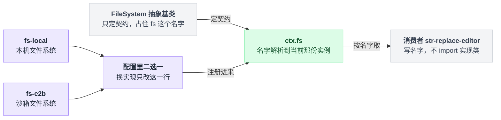
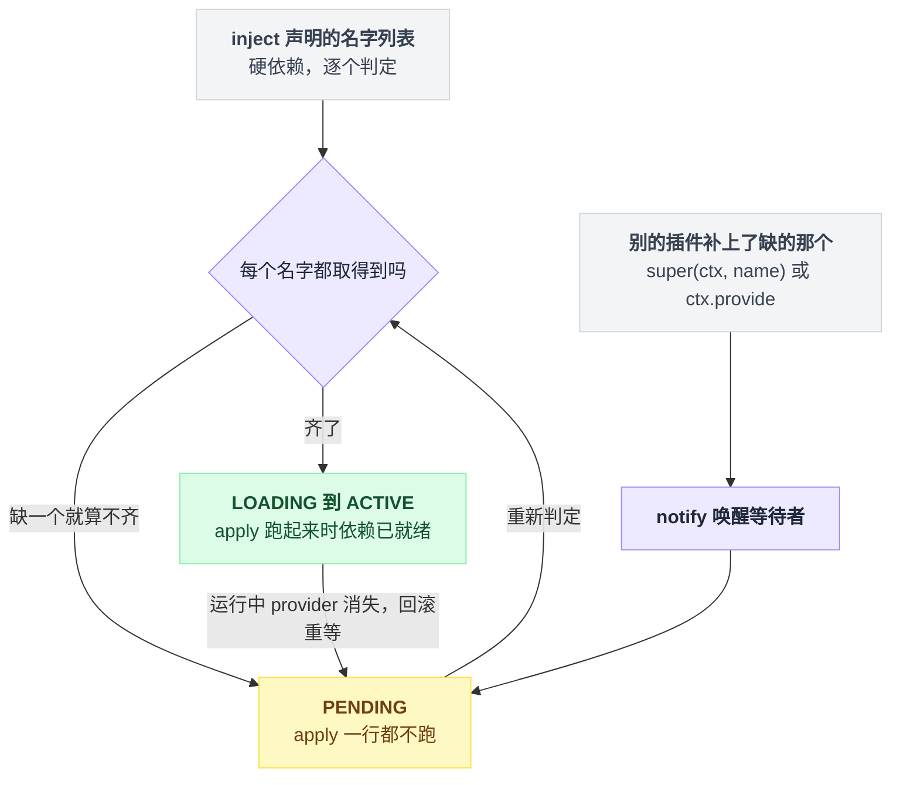
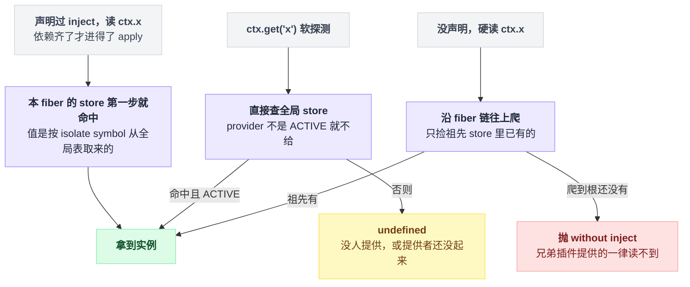
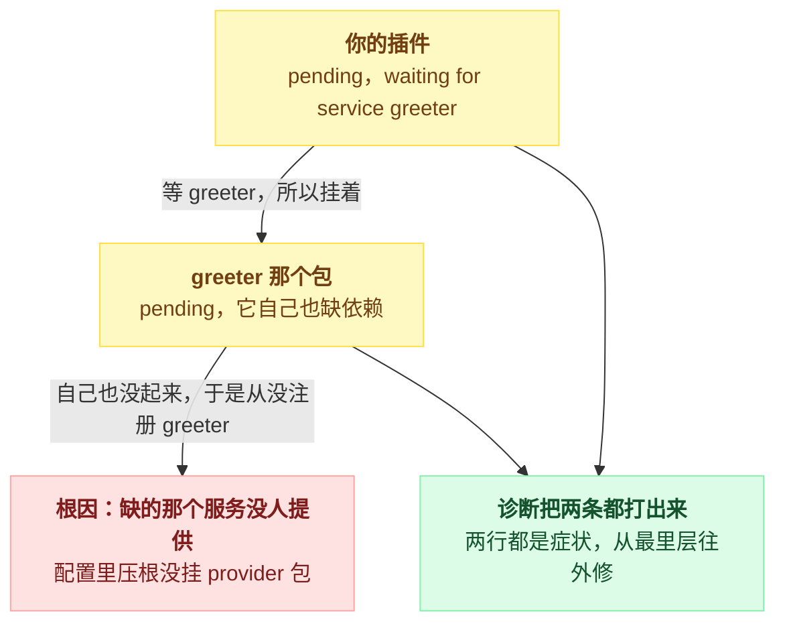
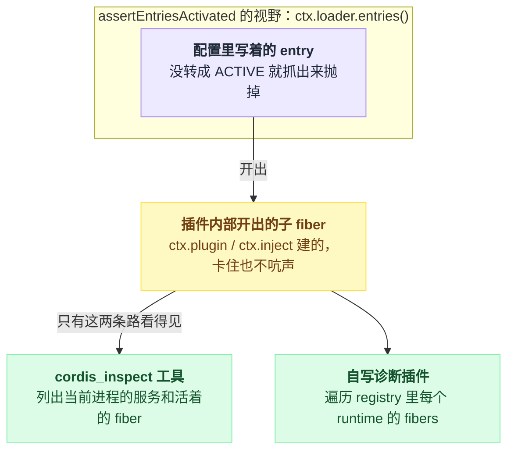
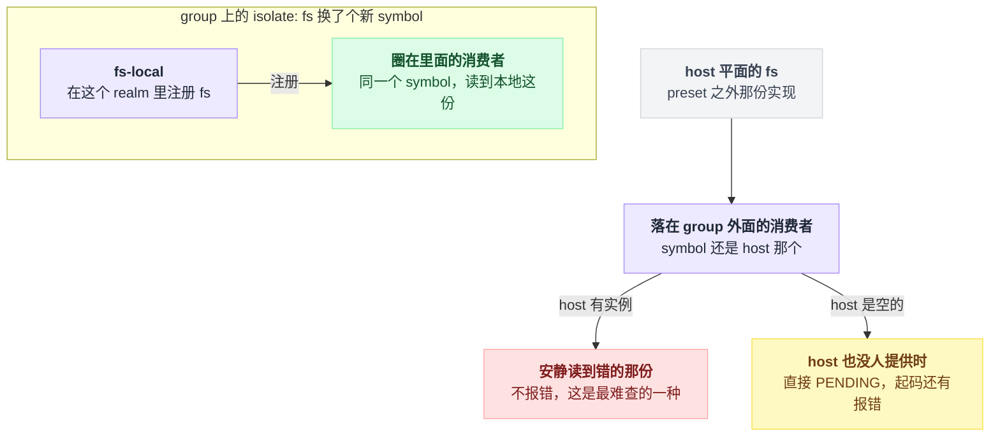

# 07 · Service：能力从哪来

> 基于 `deepseek-ai/deepseek-harness` v0.1.0-rc.5（commit `47f9438`），2026-08-14 核对。

你写插件时会不停地用到 `ctx.tools`、`ctx.llm`、`ctx.fs` 这一类东西。这一章回答三个问题：它们是谁挂上去的、你怎么才拿得到、拿不到的时候那行报错该怎么读。

事件系统（`ctx.on`、waterfall）不在这里，在第 10、11 章。

读完你应该能指着任意一个 `ctx.<名字>` 说出它是哪个包哪一行注册的，能自己提供一个服务并让 TypeScript 认识它，也能在看到 `pending (waiting for service: x)` 时知道往哪查。最后一节那个 realm 的坑值得单独留意——它是本章唯一一个"按直觉写就会写错"的地方。

---

## 先看一次报错：`ctx.fs` 不是 undefined，是当场抛

你想写个插件读文件，顺手就这么写了：

```ts
export async function apply(ctx: Context) {
  const target = await ctx.fs.resolve('README.md')
  console.log(await ctx.fs.readText(target))
}
```

顺带解释一下这两行为什么这么绕：`ctx.fs` 上没有 `read()` 这种一步到位的方法，得先 `resolve(path)` 拿到一个 `FsTarget`，再 `readText(target)`。`apply` 可以是 async，harness 里有的是这种写法。

出处：抽象签名 `packages/fs/fs/src/index.ts:116,176`；真实调用方照抄 `packages/fs/tool-str-replace-editor/src/index.ts:97,234`；async apply 的例子 `packages/mcp/mcp-client/src/index.ts:140`。

它炸的位置比你想的靠前——不是 `.resolve` 炸，是读 `ctx.fs` 这个属性就炸：

```
Error: cannot get property "fs" without inject
```

因为 `ctx` 根本不是普通对象，而是 `new Proxy(this, ReflectService.handler)`，handler 装了 `get` / `set` / `has` 三个陷阱，读一个没声明过的服务名，陷阱直接抛。这条消息出自 `vendor/cordis/src/reflect.ts:144`，Proxy 见 `vendor/cordis/src/context.ts:74`，三个陷阱见 `vendor/cordis/src/reflect.ts:135-206`。

启动时终端里看到的也不是这行光秃秃的报错。dsh 会把它收进启动诊断，连整段 stack 一起打印，stack 首行还被重写成 `Error: <message>`。收集在 `packages/boot/app-boot/src/index.ts:701-707`，格式化在 `:676-678`，首行重写在 `vendor/cordis/src/reflect.ts:73-78`。后面讲 PENDING 那节还会回到这套诊断。

那么，**服务（Service）就是一个插件挂到 `ctx` 上、供别的插件按名字取用的能力**（`docs/cordis-tutorial/03-services.md:5`）。

消费方写的是名字 `'fs'`，不是 `import` 某个实现类——这就是依赖注入：谁来实现由配置决定，消费者代码一个字不动。

dsh 管这套叫 seam，拆成三份（`docs/glossary.md:9`）：

| 角色 | 是什么 |
|---|---|
| Service Definition | 拥有 `ctx.<key>` 的那个 `Service` 类，可以是抽象类，也可以是具体注册表 |
| Provider | 若干个，真正提供实例的那些 |
| Consumer | 若干个，按名字取用的那些 |

harness 的主干能力都能追到一行 `super(ctx, '<名字>')`——`packages/` 下共 67 处（`grep -rn "super(ctx, '" packages/ --include=*.ts`，2026-08-14 数，已排除测试目录）；另有 21 处 `ctx.provide(...)` 直接挂裸值，下一节讲。

你最常碰到的十个：

| `ctx.<名字>` | `super(ctx, …)` 所在行 | 形态 |
|---|---|---|
| `tools` | `packages/core/tools/src/index.ts:827` | 注册表 `ToolRuntime`（`:787`） |
| `llm` | `packages/llm/llm/src/index.ts:293` | 注册表 `LlmRuntime`（`:284`） |
| `agents` | `packages/core/agent/src/index.ts:267` | 注册表 `AgentRegistry`（`:256`） |
| `sessions` | `packages/core/session/src/index.ts:797` | 注册表 `SessionStore`（`:792`） |
| `systemPrompt` | `packages/core/system-prompt/src/index.ts:354` | 注册表 `SystemPrompt`（`:338`） |
| `approval` | `packages/interaction/user-approval/src/index.ts:198` | 注册表 `ApprovalService`（`:192`） |
| `tokenMeter` | `packages/llm/token-meter/src/index.ts:82` | 注册表 `TokenMeter`（`:74`） |
| `fs` | `packages/fs/fs/src/index.ts:88` | **抽象基类** `FileSystem`（`:86`） |
| `shell` | `packages/shell/shell/src/index.ts:67` | **抽象基类** `ShellExecutor`（`:65`） |
| `jobs` | `packages/jobs/jobs/src/index.ts:70` | **抽象基类** `JobRegistry`（`:62`） |

最后三行是重点。`FileSystem`、`ShellExecutor`、`JobRegistry` 自己不干活，只定义契约，注册成 `ctx.fs` / `ctx.shell` / `ctx.jobs` 的是它们的子类：

| 名字 | 实现一 | 实现二 |
|---|---|---|
| `fs` | `packages/fs/fs-local/src/index.ts:64`（`super(ctx)` 在 `:80`） | `packages/e2b/fs-e2b/src/index.ts:171` |
| `shell` | `packages/shell/bash-local/src/index.ts:102`（`super(ctx)` 在 `:123`） | `packages/shell/pwsh-local/src/index.ts:128` |
| `jobs` | `packages/jobs/jobs-local/src/index.ts:91` | — |

换沙箱实现只需要在配置里换一行，所有消费者不动。

把 `fs` 这条 seam 拆开看：占住名字的是抽象基类，真正干活的实现在配置里二选一，消费者两边都不认识、只认名字。



`JobRegistry` 还多挡了一道，理由挺实在：`abstract` 在运行时会被擦掉，光靠类型拦不住有人把抽象包直接写进配置。所以它在构造函数里检查 `new.target`，命中就当场抛：

```
@deepseek-ai/dsh-jobs is the abstract job registry seam;
load an implementation such as @deepseek-ai/dsh-jobs-local instead
```

出处 `packages/jobs/jobs/src/index.ts:67-69`。

> 想知道这一点上 Pi / Codex / LangChain 怎么做，见 [五个 agent 系统源码解剖](../2026-08_五个agent系统源码解剖/00-总览与阅读指南.md)。

---

## `inject` 是开关，不是文档

同样的插件，加一行就能跑：

```ts
export const inject = ['fs']

export async function apply(ctx: Context) {
  const target = await ctx.fs.resolve('README.md')
  console.log(await ctx.fs.readText(target))
}
```

这一行同时买到三件事：

| 买到什么 | 具体表现 |
|---|---|
| **等** | 服务没齐，插件就停在 PENDING 不执行 `apply`；配置里谁写前面谁写后面完全不影响结果 |
| **保证** | `apply` 跑起来时，声明过的每个服务都已就绪 |
| **回滚** | 运行中依赖消失（provider 被卸载或热替换），依赖方自动卸载；服务回来时再自动装回去 |

出处：`docs/user/develop/framework/service.md:32`、`docs/cordis-tutorial/03-services.md:59,76`。

这三件事其实是同一台判定机器的三个侧面：

```
每当有服务注册 / 注销:
    for fiber in 所有 fiber:
        missing = [n for n in fiber.inject if 取不到 n]
        if missing:  fiber → PENDING          // 缺一个就整体挂着，apply 一行都不跑
        else:        fiber → LOADING → ACTIVE // 补上就被唤醒
```

也就是说，`inject` 里的每个名字逐个查一遍，缺一个就整体挂着，补上就被唤醒。



### 不声明为什么就读不到

`get` 陷阱拿不到属性时，会沿 **fiber 链向上走**（`vendor/cordis/src/reflect.ts:153-166`）。fiber 是一个插件实例的运行时作用域（第 05、08 章）：

```
ctx.fs  ── Proxy get 陷阱 (reflect.ts:136)
  │
  ├─ 本 fiber 的 store 里有 'fs' 吗？        reflect.ts:157
  │     store 只装两种东西：本插件 inject 声明过的（fiber.ts:608,647）
  │                        + 本 fiber 自己 provide 出去的（reflect.ts:293）
  ├─ 'fs' 在本 fiber 的 inject 里但没值？    → 抛 "in inactive context"  reflect.ts:159-160
  ├─ 已经是根 fiber（没有 runtime）？        → 抛 "without inject"       reflect.ts:163
  ├─ 父 fiber 的 isolate['fs'] 不是同一个？  → 跨 realm，抛              reflect.ts:164
  └─ 换成父 fiber，回到第一步                reflect.ts:165
```

所以结论是硬的：**不声明就能读到的，只有祖先 fiber 的 store 里已经有的那些**——祖先自己 `provide` 出去的，或者祖先 `inject` 声明过的。同级插件 provide 的读不到。

而 harness 的服务插件和你的插件在配置树里通常是兄弟关系。所以 `inject` 不是礼貌用语，是唯一通路。

这里有个容易串线的地方：声明过的服务解析走的根本不是这条链，而是全局 store 按 isolate symbol 直接查表（`vendor/cordis/src/reflect.ts:237-243`）。兄弟插件提供的服务，只要声明了就拿得到；走 fiber 链的只有"没声明还硬读"这一种情况。

同一个名字，声明过之后读、`ctx.get()` 软探测、没声明硬读，走的是三条不同的路：



还有一个例外值得记住：根 context 的 fiber 没有 runtime——建根 fiber 时 runtime 传的就是 `null`（`vendor/cordis/src/context.ts:77`），读取直接绕过整套检查，而且是 `strict = false`，连没 ACTIVE 的 provider 也照给（`vendor/cordis/src/reflect.ts:152`）。

你在 boot 脚本或 REPL 里 `ctx.tools` 用得好好的，同样一行搬进插件就炸，原因就在这。

### 三种消费方式

| 写法 | 语义 | 出处 |
|---|---|---|
| `export const inject = ['a', 'b']` | 硬依赖；缺一个整个插件 PENDING | `vendor/cordis/src/registry.ts:105-106`、`:330` |
| `ctx.get('a')` | 软探测；没有就返回 `undefined`，本插件照常跑 | `vendor/cordis/src/reflect.ts:233`、`docs/cordis-tutorial/03-services.md:82-89` |
| `ctx.inject(['a'], (ctx2) => {…})` | 开一个子 fiber，只有这段代码等依赖 | `vendor/cordis/src/registry.ts:300-302` |

第三种在 harness 里不是边角料，`packages/` 下有 43 处 `ctx.inject(` 调用（`grep -rn "ctx\.inject(" packages/ --include=*.ts`，2026-08-14 数，已排除测试）。

什么时候非它不可？依赖名是算出来的、写不进静态 `inject` 的时候。`packages/storage/storage-domain/src/index.ts:201-206` 就是这样：

```ts
const backendServices = [...new Set([
  config.backend,
  ...Object.values(config.routes ?? {}),
])].map(storageBackendServiceKey)

const fiber = ctx.inject(backendServices, (domainCtx) => { /* … */ })
```

`storageBackendServiceKey('json')` 就是字符串 `'storage.backend.json'`（`packages/storage/storage/src/index.ts:26-28`）。服务名可以是任意字符串，不必是 TypeScript 里声明过的键。

`ctx.get()` 则有个隐藏语义，第二个参数 `strict` 默认 `true`：

```
get(name, strict = true):                                  // reflect.ts:233
    v = 全局 store 按 isolate symbol 查
    if strict and provider 的 fiber 不是 ACTIVE:  return undefined   // reflect.ts:241
    return v
```

于是 `ctx.get('x') === undefined` 有两种含义——"没人提供"和"提供者自己还没起来"——排障那节要用到这个区别。

---

## 提供服务有两种形状

**形状一是 `Service` 子类**，harness 的主干服务都长这样。构造函数里 `super(ctx, name)` 一句就完成注册：

```ts
export class TokenMeter extends Service {
  constructor(ctx: Context, config: TokenMeterConfig = {}) {
    super(ctx, 'tokenMeter')
  }
}
```

节选自 `packages/llm/token-meter/src/index.ts:74,81-82`（省掉了 `static Config`、私有字段和构造函数其余语句）。

`Service` 构造函数的最后一步是 `self.ctx.reflect.provide(name, self, this[symbols.check])`（`vendor/cordis/src/service.ts:57`，其后只剩 `return self`）。注册本身是一次 effect，也就是一个自带反向操作的注册动作（`vendor/cordis/src/reflect.ts:278`），插件卸载时自动注销——这条线索第 08 章接着讲。

`Service` 子类本身就是一个插件（`docs/cordis-tutorial/03-services.md:42`），`ctx.plugin(TokenMeter)` 或者在 yml 里写一行都能挂载。TokenMeter 就是 `export default`（`packages/llm/token-meter/src/index.ts:313`），配置里按包名挂在 `packages/bundle/base/cordis.patch.yml:282`。

服务也可以依赖服务：`ToolRuntime` 写了 `static inject = ['systemPrompt']`（`packages/core/tools/src/index.ts:788`），于是 `ctx.tools` 只在 `ctx.systemPrompt` 就位之后才出现。

**形状二是 `ctx.provide(name, value)`**，直接挂一个裸值，适合不需要类的注册表或者纯数据：

```ts
ctx.provide(storageBackendServiceKey('json'), backend)
```

出自 `packages/storage/storage-json/src/index.ts:113`，签名与契约在 `vendor/cordis/src/reflect.ts:44,277`。

两种形状共享两个必须知道的行为。

第一，**重名会 fail loud**，当场抛，不静默覆盖：同一 isolate 作用域里注册第二次就是 `service "x" has been registered at <…>`（`vendor/cordis/src/reflect.ts:289-291`）。`ctx.shell` 干脆把这条当成了设计约束——一个 host 只组合一个 provider，win32 层用 pwsh 那套换掉 POSIX 那套，两套同时挂会当场炸（`packages/shell/shell/src/index.ts:16-18`，`ShellExecutor` 的类注释在 `:47-50` 又说了一遍）。

第二，**注册时机即可见时机**：fiber 已经 ACTIVE 时 `provide` 会立刻 `notify` 唤醒等待者（`vendor/cordis/src/reflect.ts:294-295`），注销时同样先 `notify` 一遍再等依赖方收拾完（`:297-303`）。

---

## TypeScript 那一半得靠 declaration merging 自己补

运行时注册和类型声明是两件独立的事，别指望其中一件带上另一件。

类型这一半靠 TypeScript 的 declaration merging——往 `Context` 接口上补一个字段：

```ts
declare module '@deepseek-ai/cordis' {
  interface Context {
    tokenMeter: TokenMeter
  }
}
```

原样出自 `packages/llm/token-meter/src/index.ts:67-71`，`ctx.tools` 用的是同一招（`packages/core/tools/src/index.ts:137-140`）。

**这段不生成任何代码**（`docs/cordis-tutorial/03-services.md:40`）。少写它，服务照样能用，只是所有消费者失去类型；写了它但插件没挂载，`ctx.tokenMeter` 类型检查一路绿灯、运行时照样抛。

类型是编译期的承诺，`inject` 才是运行时的开关，两者谁也不保证谁。

顺带一条命名约束：服务名在一个应用里是**全局扁平命名空间**，harness 已经把 `tools`、`llm` 这类朴素名字占了（`docs/cordis-tutorial/03-services.md:94`；上面表里的 `fs`、`shell`、`jobs` 同理）。自己的服务加前缀，否则撞名就是上面那条 fail loud。

---

## 走一遍：一个插件提供，另一个插件注入

代码改编自 `docs/cordis-tutorial/03-services.md:11-66`（服务部分）与 `docs/user/develop/basic/index.md:48-61`（挂到 Web profile 的方式），放在仓库根下的 `scratch-plugin/`。

`scratch-plugin/src/greeter.ts`：

```ts
import { Service, type Context } from '@deepseek-ai/cordis'

declare module '@deepseek-ai/cordis' {
  interface Context {
    greeter: GreeterService
  }
}

export class GreeterService extends Service {
  constructor(ctx: Context) {
    super(ctx, 'greeter')
  }

  greet(who: string) {
    return `Hello, ${who}!`
  }
}

export const name = 'greeter'

export function apply(ctx: Context) {
  ctx.plugin(GreeterService)
}
```

`scratch-plugin/src/greeter-consumer.ts`（官方那份的文件名与 `name` 都叫 `consumer`，这里只是换了个名字）：

```ts
import type { Context } from '@deepseek-ai/cordis'

export const name = 'greeter-consumer'
export const inject = ['greeter']

export function apply(ctx: Context) {
  console.log(ctx.greeter.greet('world'))
}
```

`scratch-plugin/cordis.yml`（官方示例只插一行，这里插两行；路径必须是绝对路径，patch 文件不改变 loader 的解析根目录，见 `docs/user/develop/basic/index.md:56`）：

```yaml
- insert:
    - id: greeter
      name: '/absolute/path/to/deepseek-harness/scratch-plugin/src/greeter.ts'
    - id: greeter-consumer
      name: '/absolute/path/to/deepseek-harness/scratch-plugin/src/greeter-consumer.ts'
```

启动（`web` 子命令与 `--patch` 的定义在 `apps/cli/src/args.ts:156,163`，`pnpm dsh` 脚本在根 `package.json:136`）：

```sh
pnpm dsh web --patch ./scratch-plugin/cordis.yml
```

启动日志里应该出现 `Hello, world!`。

跑通之后有三个改动值得自己动手试，比读十遍解释管用：

1. **交换 yml 里两行的顺序**，输出不变——顺序由依赖决定，不由文件行号决定（`docs/cordis-tutorial/03-services.md:59`）。
2. **删掉 `greeter` 那一行**，consumer 进入 PENDING，下一节就讲它长什么样。
3. **把 consumer 的 `inject` 那行删掉再跑**，`ctx.greeter` 抛 `cannot get property "greeter" without inject`——因为这两个插件是兄弟，不是祖孙。

---

## 依赖没就绪时，PENDING 长什么样

fiber 的状态机只有六个格子（`vendor/cordis/src/fiber.ts:147-154`、`docs/user/develop/framework/index.md:17-24`）：

| 状态 | 含义 |
|---|---|
| PENDING | 已登记，依赖没齐（fiber 的初始状态，`fiber.ts:194`） |
| LOADING | 依赖齐了，`apply` 正在跑 |
| ACTIVE | 跑起来了 |
| FAILED | `apply` 或 config 解析抛了（`fiber.ts:142-145`） |
| UNLOADING / DISPOSED | 正在卸载 / 已卸载 |

PENDING 本身不是错误——provider 可能几秒后才挂上，所以 Cordis 本体对它一声不吭（`docs/cordis-tutorial/06-composition-and-hmr.md:63`）。

dsh 不接受这种沉默。`boot()` 在配置树 settle 之后跑一遍 `assertEntriesActivated`，把没转成 ACTIVE 的 entry 全部抓出来抛掉：

```
for entry in ctx.loader.entries():                      // :696，只看配置文件里写着的行
    if entry 的 fiber 已经 ACTIVE: continue
    missing = Object.keys(fiber.inject)
                .filter(service => fiber.ctx.get(service) === undefined)   // :711
    打印 "<entry.name>: pending (waiting for service(s): <missing || 'unknown'>)"
```

调用点 `packages/boot/app-boot/src/index.ts:782-784`，函数体 `:692-725`，契约见 `packages/boot/app-boot/README.md:15,26`。

缺依赖时你会看到这样一行：

```
dsh: 1 entry did not activate
/abs/path/scratch-plugin/src/greeter-consumer.ts: pending (waiting for service: greeter)
```

模板在 `packages/boot/app-boot/src/index.ts:713` 和 `:723`，前缀 `dsh` 来自 `apps/cli/src/profile-boot.ts:41`（`const NAME = 'dsh'`，在 `:248` 传给 `boot()`）。

怎么读这一行：冒号左边是 entry 的 `name`，也就是模块说明符，本地插件就是绝对路径（`vendor/loader/src/config/entry.ts:12-13`）。括号里是"我 inject 了但 `ctx.get()` 取不到"的服务名列表。

注意上面那段伪代码用的是**那个 fiber 自己的 ctx**，所以 realm 隔开的情况也会照实反映出来。单复数也是算出来的（`:712`）：缺一个是 `service`，缺零个或多个是 `services`。

三种常见成因，对应三种查法：

| 症状 | 原因 | 怎么查 |
|---|---|---|
| `waiting for service: X`，配置里确实没有 X 的 provider | 忘了挂 provider 包 | `--dump-config` 看合成后的配置 |
| `waiting for service: X`，但 provider 明明写了 | provider 自己也 PENDING/FAILED，或你俩不在同一个 realm | 看报错有没有第二行；再看下一节的 realm |
| `waiting for services: unknown` | `missing` 算出来是空列表（`:713` 的 `\|\| 'unknown'` 兜底） | 见下 |

第一行那个 `--dump-config` 有点讲究：web profile 直接 `dsh web --dump-config`，别的 profile 要写成 `dsh --profile <name> --dump-config`，而裸 `dsh --dump-config` 会因为缺 `--profile` 直接报错（`apps/cli/src/args.ts:133,138-140,164`；第 03 章）。

`unknown` 这一行值得单说，它看起来像 bug，其实是两套判定口径不一致漏出来的。`ctx.get()` 只看 provider 的 fiber 是不是 ACTIVE（`vendor/cordis/src/reflect.ts:241`），而 fiber 判定依赖是否满足时还会额外调用 provider 的 `[Service.check]` 谓词，谓词返回 false 或者抛异常都算不满足（`vendor/cordis/src/fiber.ts:597-608`）。

于是会出现"`ctx.get()` 拿得到、依赖判定却不通过"，诊断里就只剩 `unknown` 可打。

这个谓词不是摆设，Loader 自己就实现了一个：`await` 拦截配置打开且还有在跑的任务时返回 false（`vendor/loader/src/index.ts:166-170`，注册在 `:90`）。

表里第二行那种情况的形状值得单独看一眼：等待会串起来，终端上打出的每一行都只是症状，真正要修的在最里层。



最后一个作用域边界，踩过一次就忘不了：`assertEntriesActivated` 只遍历 `ctx.loader.entries()`（`:696`），也就是配置文件里写着的那些行。插件内部用 `ctx.plugin()` / `ctx.inject()` 开出来的子 fiber 卡在 PENDING，**启动诊断一个字都不会说**。

想看这一层只有两条路。

一是问 agent 自己。`@deepseek-ai/dsh-tool-cordis` 的 `cordis_inspect` 会把当前进程里的服务和所有活着的 fiber 列出来（`packages/extensions/tool-cordis/README.md:11`，状态数值映射在 `packages/extensions/tool-cordis/src/fiber-state.ts:12-18`）。它挂在 `cordis` 这个 agent preset 里（`apps/cli/config/agent-presets/cordis/agent.cordis.yml:245-246`），并且依赖 `@deepseek-ai/dsh-cordis-host-runner` 提供的 `ctx.dynamic`（web 侧挂在 `packages/bundle/web-app/cordis.patch.yml:102-103`）——没有 runner，这套工具根本不会激活（`packages/extensions/tool-cordis/README.md:5`）。

二是自己写个诊断插件，遍历 `ctx.registry.values()` 里每个 runtime 的 `fibers`，官方示例在 `docs/cordis-tutorial/06-composition-and-hmr.md:67-83`。

这一节的可见性边界是这样的：诊断的视野停在配置文件那一层，再往里的 fiber 得自己去问。



---

## realm 加在 group 上，provider 和 consumer 得一起进去

服务名并不是直接当 key 用的。每个 context 上挂着一张 `服务名 → symbol` 的映射表，reflect 的 store 用那个 symbol 当键：

```
读 ctx.<name>:
    symbol = 本 context 的映射表[name]        // context.ts:18
    实例   = 全局 store[symbol]               // 声明 reflect.ts:209，查表 reflect.ts:238-239

ctx.isolate(name):                            // context.ts:121-125
    映射表[name] = 一个全新的 symbol
    // symbol 一换，下面的插件读同一个名字就落到另一份实例上，父作用域毫发无伤
```

配置里的写法是 entry 的 `isolate` 字段（`vendor/loader/src/config/isolate.ts:8`），值有两种：

| 写法 | realm 类型 | symbol 描述 | 代码 |
|---|---|---|---|
| `isolate: { fs: true }` | LocalRealm，本 entry 私有 | `fs#<entry id>` | 分支 `isolate.ts:81-82`，后缀 `:54-56` |
| `isolate: { fs: 'my-label' }` | GlobalRealm，同标签的 entry 共享 | `fs@my-label` | 分支 `:83-84`，后缀 `:65-67` |

真实用例：`minimal` agent preset 拿本地裸文件系统盖掉 host 的沙箱实现，只在这个 preset 内生效，文件自己的注释就是这么写的（`apps/cli/config/agent-presets/minimal/agent.cordis.yml:46-47`）。下面是原文 `:48-60`（`str-replace-editor` 的 `config` 在 `:61-62`，略）：

```yaml
- id: filesystem
  name: cordis:group
  group: true
  isolate:
    fs: true
  config:
    - id: fs-local
      name: '@deepseek-ai/dsh-fs-local'
      config:
        cwd: !!js process.env.DSH_CWD ?? process.cwd()

    - id: str-replace-editor
      name: '@deepseek-ai/dsh-tool-str-replace-editor'
```

（`!!js` 是 loader 的惰性表达式，第 09 章讲，这里当普通配置看就行。）

**这里是本章最容易写错的一处，而且错法很隐蔽。**

直觉会告诉你：realm 是给 provider 开的，我把 `fs-local` 圈进 group，换实现的目的就达到了，消费者写在外面无所谓。

不对。realm 是加在 group 上的边界，**provider 和 consumer 必须一起被包进这个 group 才算数**。上面 `str-replace-editor` 和 `fs-local` 并排写在同一个 `config` 列表里，不是排版习惯，是硬要求——落在 group 外面的消费者会去解析 host 那份实例，或者干脆没人提供、直接 PENDING。

麻烦的地方在于第一种失败不报错，它只是安静地读到了错的那份文件系统。

边界画在 group 上，两边的结局完全不同——圈进去的读到新实现，落在外面的走另一条解析：



这条约束 `standard` preset 的注释写死了："a consumer left outside would resolve a host registry this preset does not populate"（`apps/cli/config/agent-presets/standard/agent.cordis.yml:166-167`）。`cordis:group` 这个内置行的存在理由就是"把 provider 和它的 consumer 一起放进同一个 realm"（`packages/boot/app-boot/README.md:30`）。

那什么时候该开？同一份 preset 里三个 realm 各自给了理由，外加一个反例：

| 服务 | 开不开 | 理由 | 行号 |
|---|---|---|---|
| `planMode` | 开 | 计划状态天然是 per-agent 的 | `:102-108` |
| `compaction` + `toolResultPruner` | 一起隔离 | `compaction-basic` 用 `this.ctx.get('toolResultPruner')` 读 pruner，不同 realm 就读不到 | `:128-142` |
| `workflowEngine` | 开 | 没有 agent 之外的东西读它 | `:166-178` |
| `tokenMeter` | **故意不开** | 浏览器要跨会话读它的投影单元，塞进 realm 会随着 preset 挂载来去 | `:131-136` |

`compaction` 那行涉及的两处代码：读取方 `packages/compaction/compaction-basic/src/index.ts:281`，服务注册 `packages/compaction/compaction-tool-result-pruner/src/index.ts:59`。

顺带一提，preset 注释里把服务名写成了 `toolResultPrune`，少个 r，以 `isolate` 那两行和代码为准。

判据就一条：**这份状态的生命周期是不是刚好等于这一组插件的生命周期。** 是就开 realm，不是就别开——realm 会让所有外部消费者看不见你。

---

## 一句话带走

**服务靠名字解析，靠 `inject` 声明才拿得到，靠 realm 决定"同一个名字"到底指哪一份实例**——而 realm 的边界画在 group 上，把 provider 圈进去而把 consumer 落在外面，是这一章唯一会安静出错的写法。

---

## 本章未确认

- ⚠️ 本章没有实机运行过任何命令（仓库未装依赖）。开头两节的 `ctx.fs` 片段按 `packages/fs/fs/src/index.ts:116,176` 的抽象签名与 `packages/fs/tool-str-replace-editor/src/index.ts:97,234` 的真实调用写成，但没跑过；示例那节的代码逐段来自 `docs/cordis-tutorial/03-services.md:11-66` 与 `docs/user/develop/basic/index.md:48-61`，"启动日志里出现 `Hello, world!`"这个结果是照两处文档的同类流程推出来的，未实机验证。
- ⚠️ PENDING 那节的报错文本是按 `packages/boot/app-boot/src/index.ts:713,723` 的模板加 `apps/cli/src/profile-boot.ts:41` 的 binName 拼出来的示意，不是抄自真实终端输出；实际 entry 名取决于你怎么写配置。
- ⚠️ "`waiting for services: unknown` 可能由 `[Service.check]` 返回 false 造成"是我从 `packages/boot/app-boot/src/index.ts:711` 与 `vendor/cordis/src/fiber.ts:597-608` 两处代码推的，未实机复现。谓词本身有真实实现（`vendor/loader/src/index.ts:166-170`），但 `packages/` 下一处都没有（2026-08-14 `grep -rn "\[Service.check\]" packages/`），所以这条路径在插件侧是否真会触发，我没有现成用例可指。
- ⚠️ GlobalRealm 的回收时机（`vendor/loader/src/config/isolate.ts:155-172` 的 `loader/partial-dispose` 处理）只读了代码，未验证多 preset 共享标签时的实际行为。
