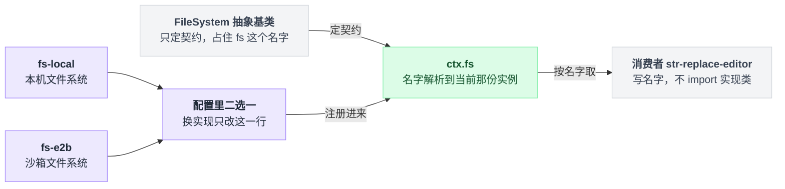
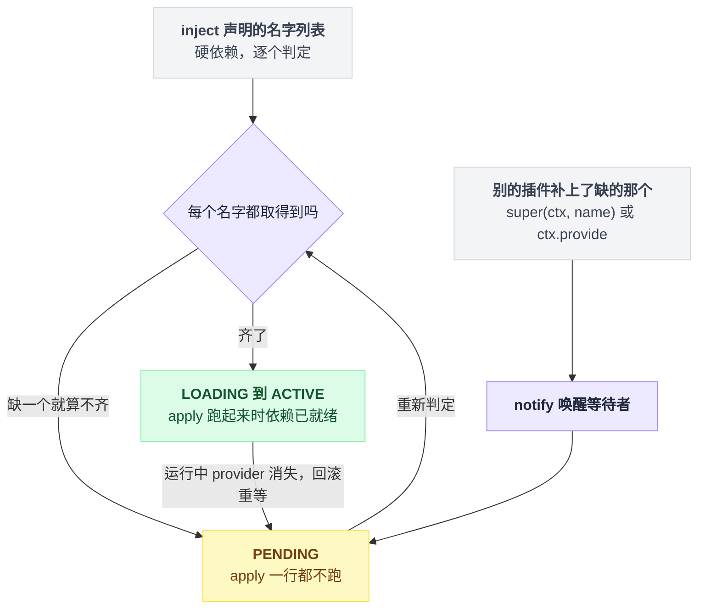
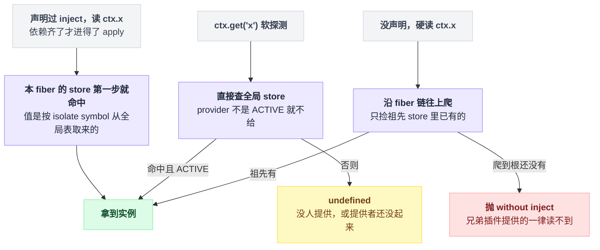
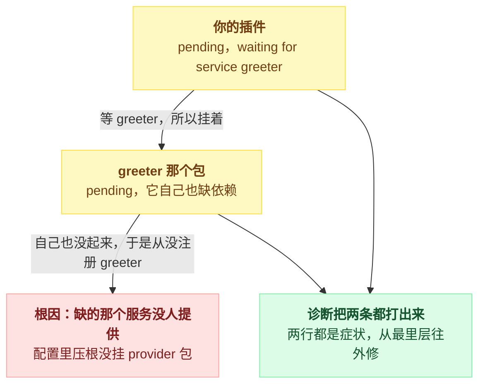
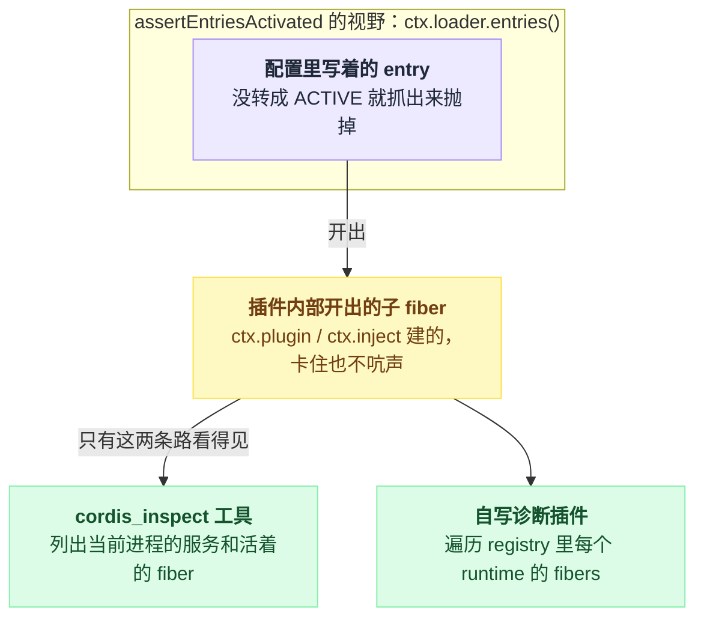
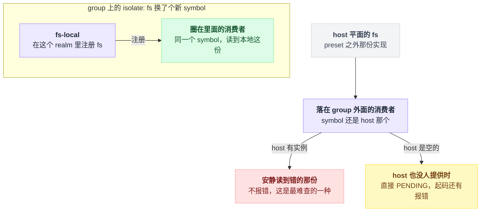

# 07 · Service：能力从哪来

> 基于 `deepseek-ai/deepseek-harness` v0.1.0-rc.5（commit `47f9438`），2026-08-14 核对。正文只讲机制；可照抄的代码统一收在文末[附录](#附录可以照抄的模板)，出处收在[脚注](#出处)，点角标可跳转。

写插件时最自然的想象是：`ctx.tools`、`ctx.llm`、`ctx.fs` 这些是框架自带的，像 Node 的 `fs` 一样，拿来就用。

不是的。`ctx` 出厂时几乎是空的，上面每一个能力都是某个插件在某一行挂上去的——你不跟框架说一声"我要用它"，读一下属性都会当场炸。这一章就顺着"它们是谁挂的、你怎么才拿得到、拿不到时那行报错怎么读"把这套机制拆开。事件系统不在这里，在第 10、11 章。

读完你应该能指着任意一个 `ctx.<名字>` 说出它是哪个包哪一行注册的，能自己提供一个服务并让 TypeScript 认识它，也能在看到 "pending (waiting for service: x)" 时知道往哪查。最后一节那个 realm 的坑值得单独留意——它是本章唯一一个"按直觉写就会写错"的地方。

---

## 先看一次报错：`ctx.fs` 不是 undefined，是当场抛

你想写个插件读文件，顺手写了两行：先把路径解析成一个目标对象，再读它的文本（原样代码在[附录 A](#a-读文件的最小插件)）。

顺带解释一下为什么是两行不是一行：`ctx.fs` 上没有一步到位的"读文件"方法，得先用 resolve 把路径换成一个 FsTarget，再用 readText 去读；另外 apply 本身可以是 async 的，harness 里有的是这种写法[^1]。

按普通 JavaScript 的直觉，没有的属性顶多是 undefined，炸也该炸在第二步真正调方法的时候。但真实炸点比这靠前——读 `ctx.fs` 这个属性本身就抛：

```
Error: cannot get property "fs" without inject
```

因为 `ctx` 根本不是普通对象，而是包了一层 Proxy，上面装了 get / set / has 三个陷阱：读一个没声明过的服务名，get 陷阱直接抛[^2]。

启动时终端里看到的也不是这行光秃秃的报错。dsh 会把它收进启动诊断，连整段 stack 一起打印，stack 首行还被重写成"Error: 加原消息"的形状[^3]。后面讲 PENDING 那节还会回到这套诊断。

被陷阱拦下的这个东西有个名字：**服务（Service），就是一个插件挂到 `ctx` 上、供别的插件按名字取用的能力**[^4]。

注意消费方写的是名字 `'fs'`，不是 import 某个实现类——这就是依赖注入：谁来实现由配置决定，消费者代码一个字不动。

dsh 管这套叫 seam，拆成三份[^4]：

| 角色 | 是什么 |
|---|---|
| Service Definition | 拥有 `ctx.<key>` 的那个 `Service` 类，可以是抽象类，也可以是具体注册表 |
| Provider | 若干个，真正提供实例的那些 |
| Consumer | 若干个，按名字取用的那些 |

"每个能力都是某一行挂上去的"不是修辞——harness 的主干能力都能追到构造函数里那行报上名字的 super 调用，`packages/` 下共 67 处（2026-08-14 用 grep 数的，已排除测试目录）；另有 21 处用 `ctx.provide` 直接挂裸值，下一节讲[^5]。

你最常碰到的十个，每一个的注册行都查得到[^6]：

| `ctx.<名字>` | 形态 |
|---|---|
| `tools` | 注册表 `ToolRuntime` |
| `llm` | 注册表 `LlmRuntime` |
| `agents` | 注册表 `AgentRegistry` |
| `sessions` | 注册表 `SessionStore` |
| `systemPrompt` | 注册表 `SystemPrompt` |
| `approval` | 注册表 `ApprovalService` |
| `tokenMeter` | 注册表 `TokenMeter` |
| `fs` | **抽象基类** `FileSystem` |
| `shell` | **抽象基类** `ShellExecutor` |
| `jobs` | **抽象基类** `JobRegistry` |

最后三行是重点。`FileSystem`、`ShellExecutor`、`JobRegistry` 自己不干活，只定义契约，真正注册成 `ctx.fs` / `ctx.shell` / `ctx.jobs` 的是它们的子类[^7]：

| 名字 | 实现一 | 实现二 |
|---|---|---|
| `fs` | fs-local（本机文件系统） | fs-e2b（沙箱） |
| `shell` | bash-local | pwsh-local |
| `jobs` | jobs-local | — |

换沙箱实现只需要在配置里换一行，所有消费者不动。

把 `fs` 这条 seam 拆开看：占住名字的是抽象基类，真正干活的实现在配置里二选一，消费者两边都不认识、只认名字。



`JobRegistry` 还多挡了一道，理由挺实在：abstract 这个关键字在运行时会被擦掉，光靠类型拦不住有人把抽象包直接写进配置。所以它在构造函数里检查 new.target，命中就当场抛[^8]：

```
@deepseek-ai/dsh-jobs is the abstract job registry seam;
load an implementation such as @deepseek-ai/dsh-jobs-local instead
```

这一节立住一根柱子：**`ctx` 上的能力没有一个是天生的，全是插件按名字挂上去的，而名字要拿到手，得先声明。** 声明的方式就是下一节的 `inject`。

> 想知道这一点上 Pi / Codex / LangChain 怎么做，见 [五个 agent 系统源码解剖](../2026-08_五个agent系统源码解剖/00-总览与阅读指南.md)。

---

## `inject` 是开关，不是文档

同样的插件，加一行依赖声明就能跑（修好的版本也在[附录 A](#a-读文件的最小插件)）。

容易把这一行当成给人看的依赖清单——类似 package.json 里的 dependencies，写不写全无所谓。不是的，它是运行时开关，同时买到三件事[^9]：

| 买到什么 | 具体表现 |
|---|---|
| **等** | 服务没齐，插件就停在 PENDING 不执行 apply；配置里谁写前面谁写后面完全不影响结果 |
| **保证** | apply 跑起来时，声明过的每个服务都已就绪 |
| **回滚** | 运行中依赖消失（provider 被卸载或热替换），依赖方自动卸载；服务回来时再自动装回去 |

这三件事其实是同一台判定机器的三个侧面：每当有服务注册或注销，框架就把每个 fiber 声明的名单逐个查一遍——缺一个就整体挂在 PENDING，apply 一行都不跑；补齐了就推进到 LOADING、ACTIVE，被唤醒的插件天然带着"依赖已就绪"的保证。



### 不声明为什么就读不到

get 陷阱拿不到属性时，会沿 **fiber 链向上走**。fiber 是一个插件实例的运行时作用域（第 05、08 章）。每一步的问法是固定的[^10]：

1. 本 fiber 的 store 里有这个名字吗？store 只装两种东西——本插件声明过要注入的，加上本 fiber 自己 provide 出去的。有就直接给。
2. 名字在本插件的注入声明里、但值还没就位？抛 "in inactive context"。
3. 已经爬到根 fiber（没有 runtime）了？抛 "without inject"——开头那行报错就是这里出来的。
4. 父 fiber 对这个名字的 isolate 记号和自己的不是同一个？跨 realm，抛。
5. 都不是，就换成父 fiber，回到第一步。

所以结论是硬的：**不声明就能读到的，只有祖先 fiber 的 store 里已经有的那些**——祖先自己 provide 出去的，或者祖先声明过注入的。同级插件 provide 的读不到。

而 harness 的服务插件和你的插件在配置树里通常是兄弟关系。所以 `inject` 不是礼貌用语，是唯一通路。

这里有个容易串线的地方：声明过的服务解析走的根本不是这条链，而是按 isolate symbol 直接查全局 store[^11]。兄弟插件提供的服务，只要声明了就拿得到；走 fiber 链的只有"没声明还硬读"这一种情况。

同一个名字，声明过之后读、软探测、没声明硬读，走的是三条不同的路：



还有一个例外值得记住：根 context 的 fiber 没有 runtime——建根 fiber 时这个位置传的就是空值，读取直接绕过整套检查，而且走的是非严格模式，连没 ACTIVE 的 provider 也照给[^12]。

你在 boot 脚本或 REPL 里 `ctx.tools` 用得好好的，同样一行搬进插件就炸，原因就在这。

### 三种消费方式

| 写法 | 语义 |
|---|---|
| 导出一份 `inject` 名单 | 硬依赖；缺一个整个插件 PENDING |
| `ctx.get` 软探测 | 没有就返回 undefined，本插件照常跑 |
| `ctx.inject` 开子 fiber | 只有那一段代码等依赖，插件其余部分照常 |

三种写法各有出处[^13]。第三种在 harness 里不是边角料，`packages/` 下有 43 处调用（2026-08-14 数，已排除测试）[^14]。

什么时候非它不可？依赖名是算出来的、写不进静态声明的时候。存储域插件就是活例子：把配置里写到的后端名收拢去重，逐个映射成形如 `storage.backend.json` 的服务名，拼成数组交给 `ctx.inject`[^15]。服务名可以是任意字符串，不必是 TypeScript 里声明过的键。

`ctx.get` 则有个隐藏语义：它按 symbol 查到值之后，默认还要求 provider 的 fiber 处于 ACTIVE，不满足就装作没有（第二个参数可以关掉这个严格模式）[^16]。于是探测结果为空有两种含义——"没人提供"和"提供者自己还没起来"——排障那节要用到这个区别。

---

## 提供服务有两种形状

**形状一是 `Service` 子类**，harness 的主干服务都长这样：构造函数里一句报上名字的 super 调用就完成注册。TokenMeter 的节选在[附录 E](#e-service-子类与类型声明模板)[^17]。

`Service` 构造函数的最后一步就是把自己 provide 到那个名字上；注册本身是一次 effect，也就是一个自带反向操作的注册动作，插件卸载时自动注销——这条线索第 08 章接着讲[^17]。

`Service` 子类本身就是一个插件，用 `ctx.plugin` 挂载或者在 yml 里写一行都行。TokenMeter 就是它那个包的默认导出，配置里按包名挂在 base bundle 的 patch 里[^18]。

服务也可以依赖服务：`ToolRuntime` 静态声明了对 `systemPrompt` 的注入，于是 `ctx.tools` 只在 `ctx.systemPrompt` 就位之后才出现[^19]。

**形状二是 `ctx.provide`**，直接把一个裸值挂到名字上，适合不需要类的注册表或者纯数据——上一节那个存储后端就是这么注册的：一行代码，把后端实例挂到算出来的服务名上[^20]。

两种形状共享两个必须知道的行为。

第一，**重名会 fail loud**，当场抛，不静默覆盖：同一 isolate 作用域里注册第二次就是一句 "service "x" has been registered at <…>"[^21]。`ctx.shell` 干脆把这条当成了设计约束——一个 host 只组合一个 provider，win32 层用 pwsh 那套换掉 POSIX 那套，两套同时挂会当场炸，`ShellExecutor` 的类注释又把这条说了一遍[^21]。

第二，**注册时机即可见时机**：fiber 已经 ACTIVE 时 provide 会立刻 notify 唤醒等待者，注销时同样先 notify 一遍再等依赖方收拾完[^22]。

---

## TypeScript 那一半得靠 declaration merging 自己补

注册那行写完，你可能以为 TypeScript 也就顺带认识 `ctx.tokenMeter` 了。不是的——运行时注册和类型声明是两件独立的事，别指望其中一件带上另一件。

类型这一半靠 TypeScript 的 declaration merging：往 Context 接口上补一个字段，写法照抄[附录 E](#e-service-子类与类型声明模板)；TokenMeter 和 `ctx.tools` 用的都是同一招[^23]。

**这段声明不生成任何代码**[^23]。少写它，服务照样能用，只是所有消费者失去类型；写了它但插件没挂载，读那个属性类型检查一路绿灯、运行时照样抛。

**类型是编译期的承诺，`inject` 才是运行时的开关，两者谁也不保证谁。**

顺带一条命名约束：服务名在一个应用里是**全局扁平命名空间**，harness 已经把 `tools`、`llm` 这类朴素名字占了（上面表里的 `fs`、`shell`、`jobs` 同理）[^24]。自己的服务加前缀，否则撞名就是上面那条 fail loud。

---

## 走一遍：一个插件提供，另一个插件注入

两个文件加一份 patch 配置，改编自官方教程的服务示例和"挂到 Web profile"的做法[^25]，放在仓库根下的 scratch-plugin 目录，全文照抄[附录 B](#b-提供方与消费方两个插件)，挂载与启动照抄[附录 C](#c-挂载-patch-与启动)。

提供方声明并注册一个 greeter 服务；消费方声明注入，拿到服务打一声招呼。两个不起眼的细节：官方那份示例的消费方文件名与插件名都叫 consumer，这里只是换了个名字；patch 里插件路径必须写绝对路径，因为 patch 文件不改变 loader 的解析根目录[^25]。

启动用 web 子命令加 `--patch` 指向这份配置[^26]，启动日志里应该出现 "Hello, world!"。

跑通之后有三个改动值得自己动手试，每个都在验证前面的一根柱子，比读十遍解释管用：

1. **交换 patch 里两行的顺序**，输出不变——顺序由依赖决定，不由文件行号决定[^9]。
2. **删掉 greeter 那一行**，消费方进入 PENDING，下一节就讲它长什么样。
3. **把消费方的注入声明删掉再跑**，读 `ctx.greeter` 抛 "cannot get property "greeter" without inject"——因为这两个插件是兄弟，不是祖孙。

---

## 依赖没就绪时，PENDING 长什么样

fiber 的状态机只有六个格子[^27]：

| 状态 | 含义 |
|---|---|
| PENDING | 已登记，依赖没齐（fiber 的初始状态） |
| LOADING | 依赖齐了，apply 正在跑 |
| ACTIVE | 跑起来了 |
| FAILED | apply 或 config 解析抛了 |
| UNLOADING / DISPOSED | 正在卸载 / 已卸载 |

PENDING 本身不是错误——provider 可能几秒后才挂上，所以 Cordis 本体对它一声不吭[^28]。

dsh 不接受这种沉默。boot 在配置树 settle 之后跑一遍启动断言，把没转成 ACTIVE 的 entry 全部抓出来抛掉。它的做法是：只看配置文件里写着的那些行，对每个没激活的 entry，用**那个 fiber 自己的 ctx** 把注入名单逐个软探测一遍，探测不到的名字列进括号里；所以 realm 隔开的情况也会照实反映出来。单复数也是算出来的——缺一个是 service，缺零个或多个是 services[^29]。

缺依赖时你会看到这样两行：

```
dsh: 1 entry did not activate
/abs/path/scratch-plugin/src/greeter-consumer.ts: pending (waiting for service: greeter)
```

消息模板和 `dsh` 这个前缀各有各的来处[^30]。怎么读：冒号左边是 entry 的 name，也就是模块说明符，本地插件就是绝对路径[^31]；括号里是"我声明了但探测不到"的服务名列表。

三种常见成因，对应三种查法：

| 症状 | 原因 | 怎么查 |
|---|---|---|
| waiting for service: X，配置里确实没有 X 的 provider | 忘了挂 provider 包 | `--dump-config` 看合成后的配置 |
| waiting for service: X，但 provider 明明写了 | provider 自己也 PENDING/FAILED，或你俩不在同一个 realm | 看报错有没有第二行；再看下一节的 realm |
| waiting for services: unknown | 缺的名单算出来是空列表，兜底文案顶上[^29] | 见下 |

第一行那个 `--dump-config` 有点讲究：web profile 直接跟在 web 子命令后面用，别的 profile 要先用 `--profile` 点名，而不带 profile 的裸用法会因为缺参数直接报错（第 03 章）[^32]。

unknown 这一行值得单说，它看起来像 bug，其实是两套判定口径不一致漏出来的。软探测只看 provider 的 fiber 是不是 ACTIVE；而 fiber 判定依赖是否满足时，还会额外调用 provider 自带的检查谓词，谓词返回 false 或者抛异常都算不满足[^33]。

于是会出现"软探测拿得到、依赖判定却不通过"，诊断里就只剩 unknown 可打。

这个谓词不是摆设，Loader 自己就实现了一个：配置处于打开拦截且还有在跑的任务时返回 false[^33]。

表里第二行那种情况的形状值得单独看一眼：等待会串起来，终端上打出的每一行都只是症状，真正要修的在最里层。



最后一个作用域边界，踩过一次就忘不了：启动断言只遍历配置文件里写着的那些行[^29]。插件内部用 `ctx.plugin` / `ctx.inject` 开出来的子 fiber 卡在 PENDING，**启动诊断一个字都不会说**。

想看这一层只有两条路。

一是问 agent 自己。`cordis_inspect` 这个工具会把当前进程里的服务和所有活着的 fiber 列出来。它挂在 cordis 这个 agent preset 里，并且依赖 host runner 提供的 `ctx.dynamic`——没有 runner，这套工具根本不会激活[^34]。

二是自己写个诊断插件，遍历注册中心里每个 runtime 的 fibers，官方教程里有现成示例[^35]。

这一节的可见性边界是这样的：诊断的视野停在配置文件那一层，再往里的 fiber 得自己去问。



---

## realm 加在 group 上，provider 和 consumer 得一起进去

服务名并不是直接当 key 用的。每个 context 上挂着一张"服务名到 symbol"的映射表，读服务分两步：先在本 context 的映射表里把名字换成 symbol，再拿 symbol 去全局 store 取实例[^36]。这张表像一本电话簿：你拨的是名字，接通的是电话簿里那个号码指向的机器。

isolate 干的就是改电话簿：把某一个名字的号码换成一个全新的 symbol。号码一换，这个作用域和它下面的插件读同一个名字就落到另一份实例上；但改的只是这一本和它往下发的那些，外面的人手里的电话簿一个字没动[^36]——这一点马上会推出本节的坑。

配置里的写法是 entry 的 isolate 字段，值有两种[^37]：

| 值写成 | realm 类型 | symbol 长相 |
|---|---|---|
| `true` | LocalRealm，本 entry 私有 | `fs#<entry id>` |
| 字符串标签 | GlobalRealm，同标签的 entry 共享 | `fs@my-label` |

真实用例：minimal agent preset 拿本地裸文件系统盖掉 host 的沙箱实现，只在这个 preset 内生效，文件自己的注释就是这么写的；配置原文照抄[附录 D](#d-给-group-开-realm-的真实配置)[^38]。（里面那个 `!!js` 是 loader 的惰性表达式，第 09 章讲，这里当普通配置看就行。）

**这里是本章最容易写错的一处，而且错法很隐蔽。**

直觉会告诉你：realm 是给 provider 开的，我把 fs-local 圈进 group，换实现的目的就达到了，消费者写在外面无所谓。

不对。回到电话簿：换号码只改了 group 里那本，外面的消费者手里还是旧号码——它照旧拨向 host 那份实例，而新实现登记在新号码上，压根没人拨。所以 realm 是加在 group 上的边界，**provider 和 consumer 必须一起被包进这个 group 才算数**。附录那份配置里 str-replace-editor 和 fs-local 并排写在同一个 config 列表里，不是排版习惯，是硬要求——落在 group 外面的消费者会去解析 host 那份实例，或者干脆没人提供、直接 PENDING。

麻烦的地方在于第一种失败不报错，它只是安静地读到了错的那份文件系统。

边界画在 group 上，两边的结局完全不同——圈进去的读到新实现，落在外面的走另一条解析：



这条约束 standard preset 的注释写死了："a consumer left outside would resolve a host registry this preset does not populate"；`cordis:group` 这个内置行的存在理由就是"把 provider 和它的 consumer 一起放进同一个 realm"[^39]。

那什么时候该开？同一份 preset 里三个 realm 各自给了理由，外加一个反例[^40]：

| 服务 | 开不开 | 理由 |
|---|---|---|
| `planMode` | 开 | 计划状态天然是 per-agent 的 |
| `compaction` + `toolResultPruner` | 一起隔离 | compaction 实现用软探测读 pruner，不同 realm 就读不到 |
| `workflowEngine` | 开 | 没有 agent 之外的东西读它 |
| `tokenMeter` | **故意不开** | 浏览器要跨会话读它的投影单元，塞进 realm 会随着 preset 挂载来去 |

compaction 那行涉及的读取方和注册方各在一处代码里[^40]。

顺带一提，preset 注释里把服务名写成了 toolResultPrune，少个 r，以 isolate 那两行和代码为准。

判据就一条：**这份状态的生命周期是不是刚好等于这一组插件的生命周期。** 是就开 realm，不是就别开——realm 会让所有外部消费者看不见你。

---

## 把这一章串回去

每条结论都能从前面的某个画面重新推出来，推不出来就回去重看那一节：

- 从最初那次报错：`ctx` 是 Proxy，不是普通对象，所以**能力全是插件按名字挂上去的，读没声明的名字当场抛**，连 undefined 都轮不到；
- 从那台判定机器：`inject` 是运行时开关，**等、保证、回滚三件事是同一次逐名判定的三个侧面**，配置顺序因此无关紧要；
- 从三条解析路：声明过的按 symbol 查全局表，软探测只认 ACTIVE，没声明硬读只能捡祖先 store 里的——**兄弟插件之间，`inject` 是唯一通路**；
- 从两种提供形状：注册是一次自带反向操作的 effect，**重名 fail loud，注册时机即可见时机**；
- 从 declaration merging 那段不生成代码的声明：**类型是编译期的承诺，运行时谁也不替谁兜底**；
- 从 unknown 那行诊断：软探测和 fiber 判定用的是两套口径，口径缝隙漏出来就是 unknown；而诊断的视野停在配置文件那一层，**配置文件之下的子 fiber 卡住不会有人告诉你**；
- 从电话簿：realm 换的是名字背后的 symbol，只换 group 里那本，所以 **provider 和 consumer 必须一起圈进去**——把 consumer 落在外面，是本章唯一会安静出错的写法。

---

## 附录：可以照抄的模板

### A. 读文件的最小插件

没声明依赖的版本，读 `ctx.fs` 那一步当场抛[^1]：

```ts
export async function apply(ctx: Context) {
  const target = await ctx.fs.resolve('README.md')
  console.log(await ctx.fs.readText(target))
}
```

加一行注入声明就能跑：

```ts
export const inject = ['fs']

export async function apply(ctx: Context) {
  const target = await ctx.fs.resolve('README.md')
  console.log(await ctx.fs.readText(target))
}
```

### B. 提供方与消费方两个插件

`scratch-plugin/src/greeter.ts`[^25]：

```ts
// 改编自 docs/cordis-tutorial/03-services.md:11-66
import { Service, type Context } from '@deepseek-ai/cordis'

declare module '@deepseek-ai/cordis' {
  interface Context {
    greeter: GreeterService
  }
}

export class GreeterService extends Service {
  constructor(ctx: Context) {
    super(ctx, 'greeter')
  }

  greet(who: string) {
    return `Hello, ${who}!`
  }
}

export const name = 'greeter'

export function apply(ctx: Context) {
  ctx.plugin(GreeterService)
}
```

`scratch-plugin/src/greeter-consumer.ts`：

```ts
import type { Context } from '@deepseek-ai/cordis'

export const name = 'greeter-consumer'
export const inject = ['greeter']

export function apply(ctx: Context) {
  console.log(ctx.greeter.greet('world'))
}
```

### C. 挂载 patch 与启动

`scratch-plugin/cordis.yml`（官方示例只插一行，这里插两行；路径必须是绝对路径[^25]）：

```yaml
# 改编自 docs/user/develop/basic/index.md:48-61
- insert:
    - id: greeter
      name: '/absolute/path/to/deepseek-harness/scratch-plugin/src/greeter.ts'
    - id: greeter-consumer
      name: '/absolute/path/to/deepseek-harness/scratch-plugin/src/greeter-consumer.ts'
```

启动[^26]：

```sh
pnpm dsh web --patch ./scratch-plugin/cordis.yml
```

### D. 给 group 开 realm 的真实配置

minimal preset 的原文（str-replace-editor 的 config 两行略）[^38]：

```yaml
# apps/cli/config/agent-presets/minimal/agent.cordis.yml:48-60
- id: filesystem
  name: cordis:group
  group: true
  isolate:
    fs: true
  config:
    - id: fs-local
      name: '@deepseek-ai/dsh-fs-local'
      config:
        cwd: !!js process.env.DSH_CWD ?? process.cwd()

    - id: str-replace-editor
      name: '@deepseek-ai/dsh-tool-str-replace-editor'
```

### E. Service 子类与类型声明模板

TokenMeter 节选，省掉了 static Config、私有字段和构造函数其余语句[^17]：

```ts
// packages/llm/token-meter/src/index.ts:74,81-82
export class TokenMeter extends Service {
  constructor(ctx: Context, config: TokenMeterConfig = {}) {
    super(ctx, 'tokenMeter')
  }
}
```

配套的类型声明，原样出自同一个文件[^23]：

```ts
// packages/llm/token-meter/src/index.ts:67-71
declare module '@deepseek-ai/cordis' {
  interface Context {
    tokenMeter: TokenMeter
  }
}
```

---

## 出处

[^1]: `ctx.fs` 的抽象签名（resolve / readText）：`packages/fs/fs/src/index.ts:116,176`；真实调用方：`packages/fs/tool-str-replace-editor/src/index.ts:97,234`；async apply 的例子：`packages/mcp/mcp-client/src/index.ts:140`。
[^2]: 报错消息出自 `vendor/cordis/src/reflect.ts:144`；`ctx` 的 Proxy（`new Proxy(this, ReflectService.handler)`）见 `vendor/cordis/src/context.ts:74`；get / set / has 三个陷阱见 `vendor/cordis/src/reflect.ts:135-206`。
[^3]: 启动诊断的收集在 `packages/boot/app-boot/src/index.ts:701-707`，格式化在 `:676-678`；stack 首行重写成 `Error: <message>` 在 `vendor/cordis/src/reflect.ts:73-78`。
[^4]: 服务的定义：`docs/cordis-tutorial/03-services.md:5`；seam 三分法：`docs/glossary.md:9`。
[^5]: 67 处：`grep -rn "super(ctx, '" packages/ --include=*.ts`，2026-08-14 数，已排除测试目录；21 处 `ctx.provide(...)` 同日同法数得。
[^6]: 十个服务的注册行（`super(ctx, …)` 所在行 / 类定义行）：tools `packages/core/tools/src/index.ts:827`（`ToolRuntime` 在 `:787`）；llm `packages/llm/llm/src/index.ts:293`（`:284`）；agents `packages/core/agent/src/index.ts:267`（`:256`）；sessions `packages/core/session/src/index.ts:797`（`:792`）；systemPrompt `packages/core/system-prompt/src/index.ts:354`（`:338`）；approval `packages/interaction/user-approval/src/index.ts:198`（`:192`）；tokenMeter `packages/llm/token-meter/src/index.ts:82`（`:74`）；fs `packages/fs/fs/src/index.ts:88`（`FileSystem` 在 `:86`）；shell `packages/shell/shell/src/index.ts:67`（`ShellExecutor` 在 `:65`）；jobs `packages/jobs/jobs/src/index.ts:70`（`JobRegistry` 在 `:62`）。
[^7]: 实现类：fs-local `packages/fs/fs-local/src/index.ts:64`（`super(ctx)` 在 `:80`）、fs-e2b `packages/e2b/fs-e2b/src/index.ts:171`；bash-local `packages/shell/bash-local/src/index.ts:102`（`super(ctx)` 在 `:123`）、pwsh-local `packages/shell/pwsh-local/src/index.ts:128`；jobs-local `packages/jobs/jobs-local/src/index.ts:91`。
[^8]: `new.target` 检查与报错原文：`packages/jobs/jobs/src/index.ts:67-69`。
[^9]: inject 买到的三件事：`docs/user/develop/framework/service.md:32`、`docs/cordis-tutorial/03-services.md:59,76`；其中 `:59` 即"顺序由依赖决定，不由文件行号决定"。
[^10]: get 陷阱沿 fiber 链向上走：`vendor/cordis/src/reflect.ts:153-166`（陷阱入口在 `:136`）。逐步坐标：查本 fiber 的 store 在 `:157`；store 只装 inject 声明过的（`vendor/cordis/src/fiber.ts:608,647`）和本 fiber 自己 provide 的（`reflect.ts:293`）；"in inactive context" 在 `:159-160`；根 fiber 抛 "without inject" 在 `:163`；跨 realm 检查在 `:164`；换父 fiber 在 `:165`。
[^11]: 声明过的服务按 isolate symbol 直接查全局 store：`vendor/cordis/src/reflect.ts:237-243`。
[^12]: 建根 fiber 时 runtime 传 `null`：`vendor/cordis/src/context.ts:77`；根 context 读取走 `strict = false`：`vendor/cordis/src/reflect.ts:152`。
[^13]: 静态 inject：`vendor/cordis/src/registry.ts:105-106`、`:330`；`ctx.get`：`vendor/cordis/src/reflect.ts:233`、`docs/cordis-tutorial/03-services.md:82-89`；`ctx.inject` 开子 fiber：`vendor/cordis/src/registry.ts:300-302`。
[^14]: 43 处：`grep -rn "ctx\.inject(" packages/ --include=*.ts`，2026-08-14 数，已排除测试。
[^15]: 动态依赖名的真实用例：`packages/storage/storage-domain/src/index.ts:201-206`；把后端名映射成 `storage.backend.json` 这类字符串的函数在 `packages/storage/storage/src/index.ts:26-28`。
[^16]: `ctx.get` 的签名（`strict` 默认 `true`）在 `vendor/cordis/src/reflect.ts:233`，ACTIVE 检查在 `:241`。
[^17]: TokenMeter 节选自 `packages/llm/token-meter/src/index.ts:74,81-82`；`Service` 构造函数最后一步 `self.ctx.reflect.provide(name, self, this[symbols.check])` 在 `vendor/cordis/src/service.ts:57`（其后只剩 `return self`）；注册是一次 effect 见 `vendor/cordis/src/reflect.ts:278`。
[^18]: `Service` 子类本身就是插件：`docs/cordis-tutorial/03-services.md:42`；TokenMeter 的默认导出在 `packages/llm/token-meter/src/index.ts:313`，配置挂载在 `packages/bundle/base/cordis.patch.yml:282`。
[^19]: `ToolRuntime` 的 `static inject = ['systemPrompt']`：`packages/core/tools/src/index.ts:788`。
[^20]: 存储后端的 `ctx.provide` 调用：`packages/storage/storage-json/src/index.ts:113`；`provide` 的签名与契约在 `vendor/cordis/src/reflect.ts:44,277`。
[^21]: 重名报错：`vendor/cordis/src/reflect.ts:289-291`；shell 的"一个 host 只组合一个 provider"约束：`packages/shell/shell/src/index.ts:16-18`，类注释在 `:47-50`。
[^22]: provide 后立刻 notify：`vendor/cordis/src/reflect.ts:294-295`；注销时先 notify 再等收尾：`:297-303`。
[^23]: declaration merging 原文：`packages/llm/token-meter/src/index.ts:67-71`；`ctx.tools` 同款在 `packages/core/tools/src/index.ts:137-140`；"不生成任何代码"：`docs/cordis-tutorial/03-services.md:40`。
[^24]: 全局扁平命名空间与占名警告：`docs/cordis-tutorial/03-services.md:94`。
[^25]: 改编来源：服务示例 `docs/cordis-tutorial/03-services.md:11-66`，挂到 Web profile 的方式 `docs/user/develop/basic/index.md:48-61`；"patch 文件不改变 loader 的解析根目录"在 `:56`。
[^26]: `web` 子命令与 `--patch` 的定义：`apps/cli/src/args.ts:156,163`；`pnpm dsh` 脚本在根 `package.json:136`。
[^27]: 六状态：`vendor/cordis/src/fiber.ts:147-154`、`docs/user/develop/framework/index.md:17-24`；PENDING 是初始状态见 `fiber.ts:194`；FAILED 的两种来源见 `:142-145`。
[^28]: Cordis 本体对 PENDING 不作声：`docs/cordis-tutorial/06-composition-and-hmr.md:63`。
[^29]: `assertEntriesActivated`：调用点 `packages/boot/app-boot/src/index.ts:782-784`，函数体 `:692-725`；只遍历 `ctx.loader.entries()` 在 `:696`；用该 fiber 自己的 ctx 逐个 `ctx.get` 算 missing 在 `:711`；单复数在 `:712`；`|| 'unknown'` 兜底在 `:713`；契约见 `packages/boot/app-boot/README.md:15,26`。
[^30]: 消息模板在 `packages/boot/app-boot/src/index.ts:713` 和 `:723`；前缀来自 `apps/cli/src/profile-boot.ts:41`（`const NAME = 'dsh'`，在 `:248` 传给 `boot()`）。
[^31]: entry 的 name 即模块说明符：`vendor/loader/src/config/entry.ts:12-13`。
[^32]: `--dump-config` 与 `--profile` 的参数定义和缺参报错：`apps/cli/src/args.ts:133,138-140,164`。
[^33]: `ctx.get` 只看 ACTIVE：`vendor/cordis/src/reflect.ts:241`；fiber 判定还要调 `[Service.check]` 谓词：`vendor/cordis/src/fiber.ts:597-608`；Loader 的谓词实现在 `vendor/loader/src/index.ts:166-170`，注册在 `:90`。
[^34]: `cordis_inspect` 的能力说明：`packages/extensions/tool-cordis/README.md:11`，依赖 runner 才激活见 `:5`；状态数值映射在 `packages/extensions/tool-cordis/src/fiber-state.ts:12-18`；挂在 cordis preset：`apps/cli/config/agent-presets/cordis/agent.cordis.yml:245-246`；web 侧的 runner 挂载：`packages/bundle/web-app/cordis.patch.yml:102-103`。
[^35]: 自写诊断插件的官方示例：`docs/cordis-tutorial/06-composition-and-hmr.md:67-83`。
[^36]: 名字到 symbol 的映射表在 `vendor/cordis/src/context.ts:18`；全局 store 的声明在 `vendor/cordis/src/reflect.ts:209`，查表在 `:238-239`；`isolate` 的实现（换新 symbol）在 `vendor/cordis/src/context.ts:121-125`。
[^37]: entry 的 isolate 字段：`vendor/loader/src/config/isolate.ts:8`；LocalRealm 分支在 `:81-82`，`#<entry id>` 后缀在 `:54-56`；GlobalRealm 分支在 `:83-84`，`@<label>` 后缀在 `:65-67`。
[^38]: minimal preset 的注释：`apps/cli/config/agent-presets/minimal/agent.cordis.yml:46-47`；附录 D 的原文取自 `:48-60`（str-replace-editor 的 `config` 在 `:61-62`，略）。
[^39]: standard preset 的注释原文：`apps/cli/config/agent-presets/standard/agent.cordis.yml:166-167`；`cordis:group` 的存在理由：`packages/boot/app-boot/README.md:30`。
[^40]: 四行的行号（同在 standard preset 文件里）：planMode `:102-108`、compaction 一对 `:128-142`、workflowEngine `:166-178`、tokenMeter 反例 `:131-136`；compaction 的读取方 `this.ctx.get('toolResultPruner')` 在 `packages/compaction/compaction-basic/src/index.ts:281`，pruner 的服务注册在 `packages/compaction/compaction-tool-result-pruner/src/index.ts:59`。
