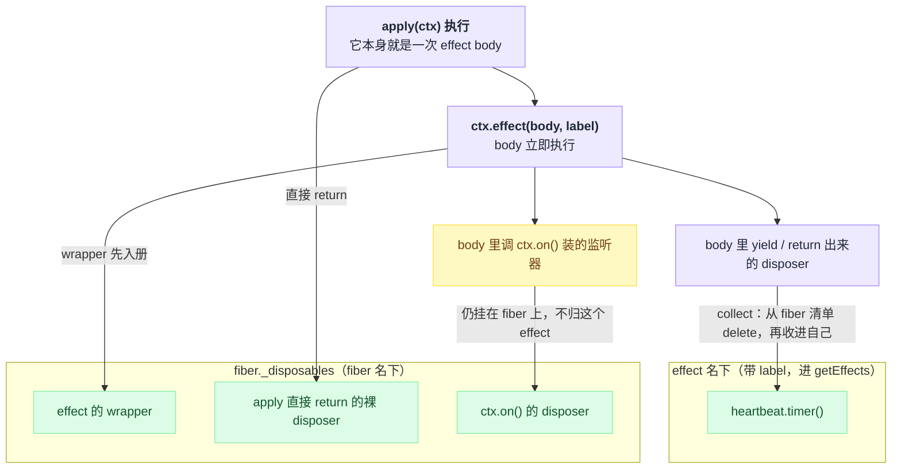
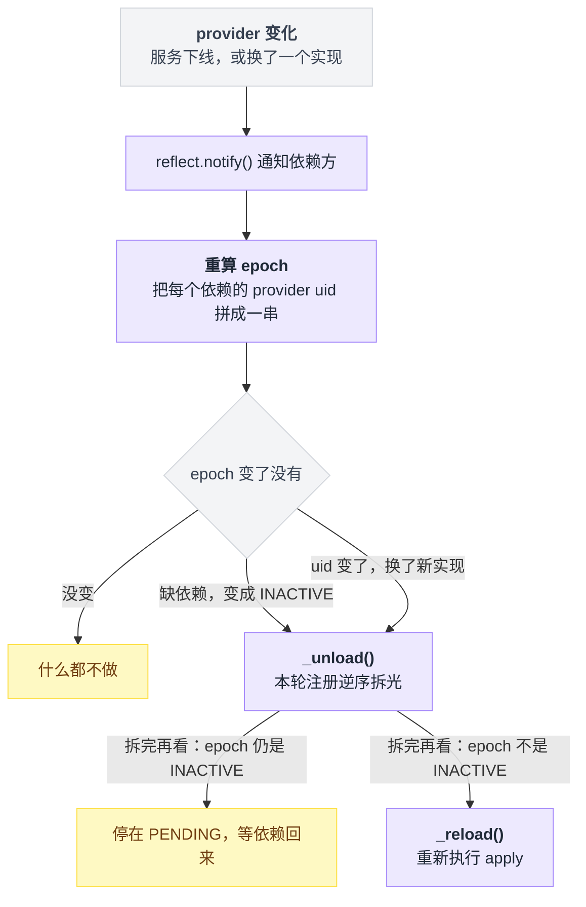
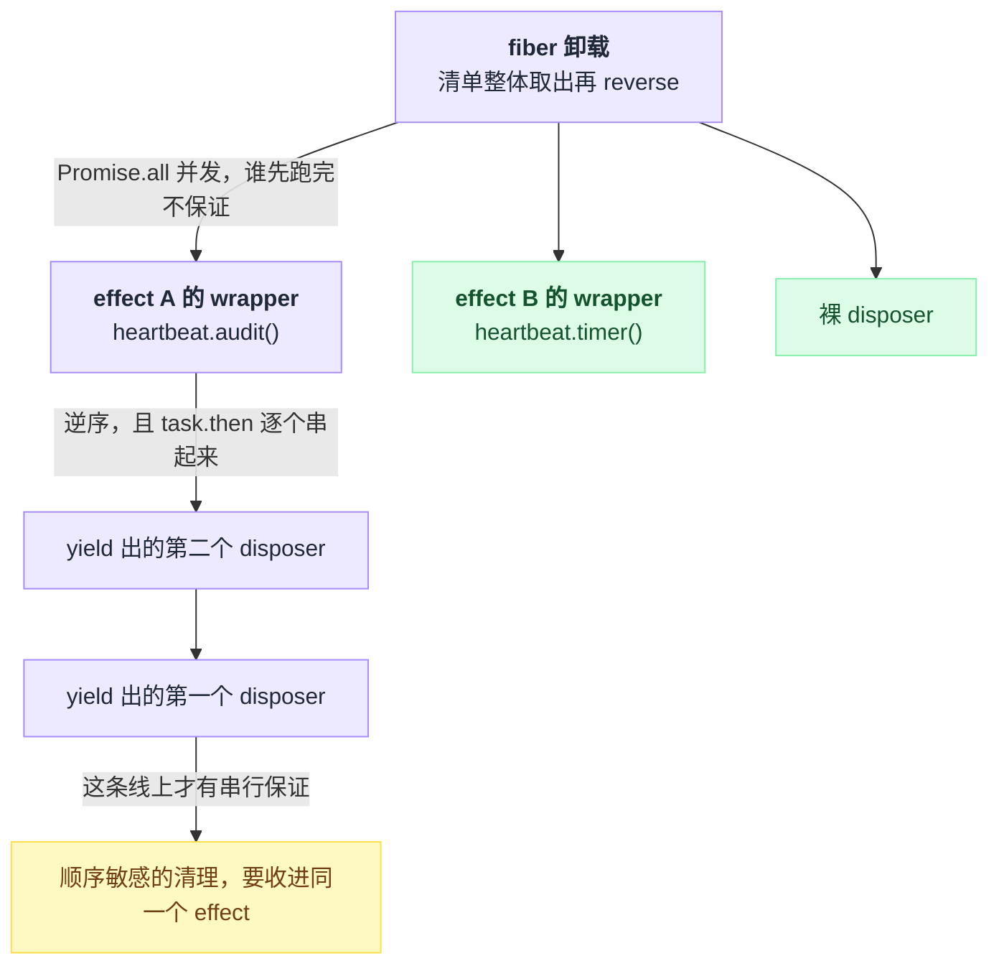
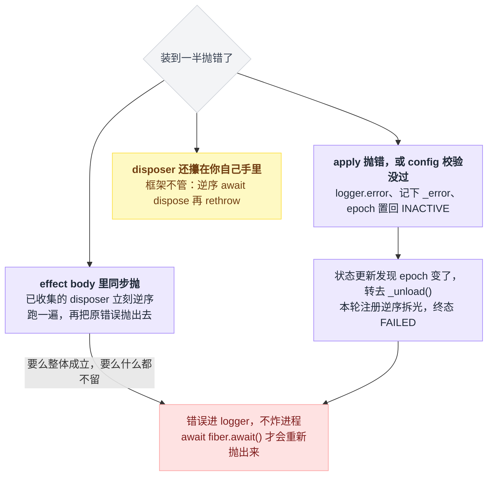
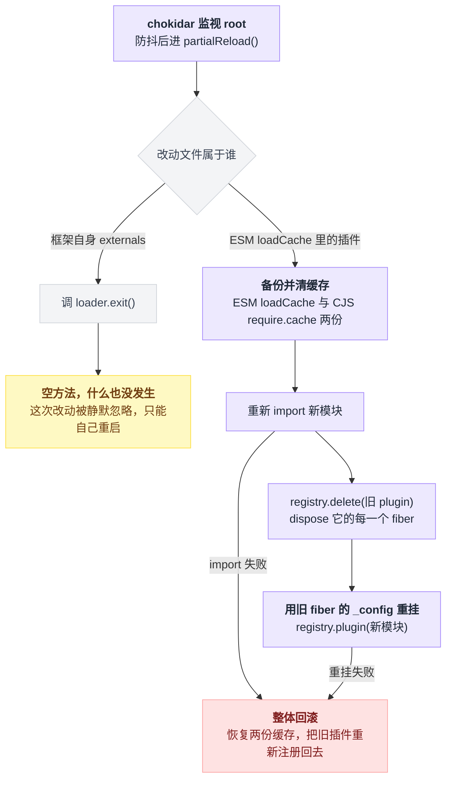
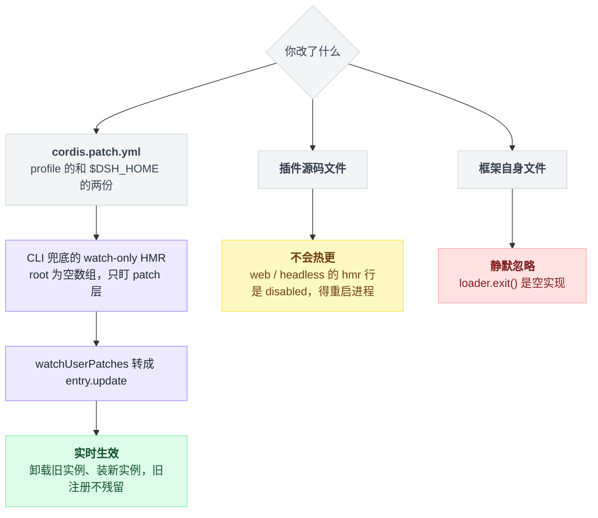

# 08 · effect 与生命周期

> 基于 `deepseek-ai/deepseek-harness` v0.1.0-rc.5（commit `47f9438`），2026-08-14 核对。

Cordis 里最需要"想通"的机制只有一条：**注册即 effect，卸载即逆序回滚**。

想通了，热重载、失败回滚、依赖换实现自动重启这几件事就都不是特性，而是同一条规则的推论。没想通，你写的插件会在第三次热重载之后开始行为诡异，而且查不出来。

这一章要建立的直觉是一句话：**你在插件里做的每一次注册，框架都会在卸载时替你撤销**——前提是这次注册确实交到了框架手上。

哪些交到了、哪些没有、怎么把没交的补上，就是全章内容。顺带回答两个具体问题：给 effect 起 `label` 到底值不值，以及 dsh 里 HMR 实际开到了哪一层。

---

## 一个每秒漏一个定时器的插件

假设你要写个心跳插件，每秒打一行日志：

```ts
export function apply(ctx: Context) {
  setInterval(() => ctx.logger.info('tick'), 1000)
}
```

这个插件在 dsh 里是**坏的**。

坏在哪，取决于你有没有意识到插件不是只装一次。改一行配置、依赖的服务被换掉、HMR 保存文件、把这条 entry 标成 `disabled: true`，任何一件都会让当前实例被卸载、再装一个新的。

上面那个 `setInterval` 没人认领，卸载之后它照跑不误。装十次，十个定时器一起打日志。（`disabled: true` 的写法见 `docs/cordis-tutorial/06-composition-and-hmr.md:19`。）

插一句 `ctx.logger` 的来历：它不用装插件就有，Cordis 建 root context 时就挂上了 `LoggerService`。但**日志能不能被你看见**是另一回事，取决于有没有 exporter——纯 Cordis 环境下要另配 `@deepseek-ai/cordis-plugin-logger-console`。出处：`vendor/cordis/src/context.ts:81`、`logger.ts:191`；exporter 见 `docs/cordis-tutorial/06-composition-and-hmr.md:42`。

修法是把资源的**获取和释放写在一起**，交给 `ctx.effect()`：

```ts
export function apply(ctx: Context) {
  ctx.effect(() => {
    const timer = setInterval(() => ctx.logger.info('tick'), 1000)
    return () => clearInterval(timer)
  }, 'heartbeat.timer()')
}
```

官方教程用的就是这个形状：一个 `heartbeat` 定时器 + 一个 `setTimeout` 效果，官方那份没传 `label`（`docs/cordis-tutorial/02-lifecycle-and-effects.md:13`–`42`）。

文档把规则压成一句：Cordis 已经管的东西不用你操心，**Cordis 管不到的资源必须包进 `ctx.effect()`**（`docs/cordis-tutorial/02-lifecycle-and-effects.md:5`）。

---

## `ctx.effect()` 到底承诺了什么

先说个容易误会的实现细节：`ctx.effect` 并不是 Context 自己实现的方法，它转发到当前 fiber 上。

类型侧是 `Context extends Pick<Fiber, 'effect'>`，真正做转发的是一句 mixin：`this.mixin('fiber', ['runtime', 'effect'])`。对应 `vendor/cordis/src/fiber.ts:10`、`vendor/cordis/src/reflect.ts:220`，实现在 `vendor/cordis/src/fiber.ts:418`。

契约本身有七条，逐条对着源码读下来是这样：

| # | 承诺 | 出处 |
|---|---|---|
| 1 | 传进去的 `execute` **立即执行**，不排队等时机 | `fiber.ts:522` |
| 2 | 调用返回一个 disposer，随时可以就地把这个 effect 拆掉 | `fiber.ts:504`–`514` |
| 3 | "手动调 disposer"和"fiber 卸载"谁先到算谁——wrapper 一创建就进了 fiber 的 `_disposables` | `fiber.ts:520`，行为说明见源码注释 `fiber.ts:406`–`408` |
| 4 | 重复调 disposer 是 no-op：外层有 `runner.epoch` 闸，内层还有 `disposing` 标志兜底 | `fiber.ts:508`、`fiber.ts:428`–`429` |
| 5 | fiber 已是 DISPOSED 或 UNLOADING 时再调，抛 `CordisError('INACTIVE_EFFECT')` | `fiber.ts:419`–`422`、`fiber.ts:351`–`354` |
| 6 | body 返回了框架不认识的东西，抛 `TypeError('Invalid effect')` | `fiber.ts:363`、`fiber.ts:372` |
| 7 | `label` 只用于诊断，出现在 `getEffects()` 输出里，不传默认叫 `'anonymous'` | `fiber.ts:418`、`fiber.ts:444`、`fiber.ts:568` |

第 7 条那个参数的价值在本章最后一节兑现。

body 允许返回四种形状（类型定义在 `fiber.ts:83`–`93`，分发逻辑在 `fiber.ts:366`–`398`）：

| 形状 | 写法 | 分发行号 |
|---|---|---|
| 一个 disposer | `() => () => clearInterval(t)` | `fiber.ts:367` |
| `Promise<disposer>` | `async () => { await open(); return close }` | `fiber.ts:374` |
| generator，`yield` 多个 disposer | `function* () { yield a; yield b }` | `fiber.ts:375`–`382` |
| async generator | `async function* () { … }` | `fiber.ts:383`–`395` |

返回 `undefined` / `null` 同样合法（`fiber.ts:369`–`370`），意思是这段 effect 没有需要回收的东西。

dsh 自己大量用 generator 形式，把"一组要一起装、一起拆"的注册串起来，例如 `packages/core/agent/src/index.ts:294`–`297`：

```ts
ctx.effect(function* (this: AgentRegistry) {
  yield () => this.disposeInitiators()
  yield () => { this.closeInitiators() }
}.bind(this), 'agents.initiatorLifecycle()')
```

**这里最容易踩的一脚**是想当然地以为"effect 里做的事都归这个 effect 管"。

不是。在 effect body 里调 `ctx.on()` 之类的注册，那个监听器仍然挂在 **fiber** 上，并不会自动变成这个 effect 的子资源。只有被 `yield` 或 `return` 出来的 disposer 才会被 effect 接管。

搬家动作叫 `collect`，做的事大致是：

```
def collect(effect, d):
    fiber._disposables.delete(d)      # 先从 fiber 名下摘掉
    effect.disposables.add(d)         # 再收进自己名下

# 而 body 里 ctx.on() 装的监听器，没人对它调 collect
# 它从头到尾都在 fiber._disposables 里，跟这个 effect 无关
```

一句话：effect 的 wrapper 先落进 fiber 的清单，被 `yield` / `return` 出来的 disposer 再从 fiber 名下搬到 effect 名下，其余的原地不动。搬家逻辑在 `fiber.ts:448`–`453`。



这条机制有两个真实用法。

一是**改所有权以控制顺序**。`packages/schedule/schedule/src/index.ts:69`–`75` 的 disposer 里**手动**调了 `stopCreated()`——也就是第 45 行 `ctx.on('agent/created', …)` 的返回值——因为它要求先停止接新 agent、再逐个拆已建的 runtime，就必须自己攥住这个句柄。

二是**改标签**。`packages/preset/persona/src/index.ts:61`–`66` 把本来已经是 effect 的 `ctx.systemPrompt.section(...)` 又包了一层 `ctx.effect(…, 'persona.section()')`，那个 disposer 于是从 fiber 名下转到外层 effect 名下，诊断里显示的就是 `persona.section()`，而不是内层那个笼统的 `systemPrompt.section()`。

---

## 返回 disposer 的 API，本身就是 effect

判据很简单：**一个 API 返回 disposer，它就已经是 effect**，你不用为它写清理代码。

这张表值得记住，因为它决定了你什么时候可以偷懒：

| 你写的 | 内部实现 | 自动挂的 label |
|---|---|---|
| `ctx.on(name, fn)` | `events.ts:254`–`260` | `ctx.on("name")`（`events.ts:300`） |
| `ctx.plugin(child)` | `fiber.ts:265`–`297` | `ctx.plugin()`（`fiber.ts:297`） |
| `ctx.provide(name, value)` | `reflect.ts:277`–`305` | `ctx.provide("name")`（`reflect.ts:304`） |
| `ctx.accessor(name, opts)` | `reflect.ts:345`–`353` | `ctx.accessor("name")`（`reflect.ts:352`） |
| `ctx.mixin(source, keys)` | `reflect.ts:364`–`389` | `ctx.mixin("source")`（`reflect.ts:389`） |
| `ctx.tools.register(def)` | `packages/core/tools/src/index.ts:1057`–`1061` | `tools.register()` |
| `ctx.systemPrompt.section(s)` | `packages/core/system-prompt/src/index.ts:385`–`389` | `systemPrompt.section()` |
| `ctx.tools.presentAs(mode)` | `packages/core/tools/src/index.ts:951`–`971` | `tools.presentAs()` |

官方 primer 把这条写成设计原则：prompt section、tool schema、adapter、provider、listener 全都通过 `ctx.effect()` 或 `ctx.on()` 安装，好让 reload 和 teardown 可预测地回退（`docs/cordis-primer.md:13`）。面向插件作者的对照清单在 `docs/user/develop/framework/index.md:57`–`63`。

---

## `apply` 本身就是一个 effect body

这条知道的人不多：插件的启动函数走的是**同一套 effect 分发**。

`Effect` 类型的文档注释明写着 "Effect body result accepted by `ctx.effect()` and plugin startup."；runner 的 `execute` 就是 `runtime.callback(this.ctx, this.config)`，返回值交给同一个 `_execute` 收进 fiber 的 `_disposables`。依次对应 `fiber.ts:77`、`fiber.ts:259`、`fiber.ts:356`、`fiber.ts:230`–`232`。

所以下面两种写法都是合法插件，`apply` 直接返回 disposer，不用套 `ctx.effect()`：

```ts
export function apply(ctx: Context) {
  const timer = setInterval(() => ctx.logger.info('tick'), 1000)
  return () => clearInterval(timer)
}
```

```ts
export async function apply(ctx: Context): Promise<() => Promise<void>> {
  const timer = setInterval(() => ctx.logger.info('tick'), 1000)
  await Promise.resolve()
  return async () => clearInterval(timer)
}
```

第二种在仓库里有真实用例：`packages/api/remotes/src/client/index.ts:105`–`122`，`apply` 是 async 的，返回一个"按挂载逆序卸载"的 disposer。`_reload` 会 `await` 这个 promise（`fiber.ts:656`）。

async `apply` 有个坑：`await` 之后 fiber 可能已经在卸载了，这时再调 `ctx.effect()` / `ctx.on()` 会抛 `INACTIVE_EFFECT`。

dsh 自己在 boot 路径上就处理了这个竞态——显式判 `error.code === 'INACTIVE_EFFECT'`，按源码注释"这是 app 按要求退出，不是 watch 失败"处理，返回一个空 disposer 而不是崩掉（`packages/boot/app-boot/src/index.ts:258`–`264`）。

---

## fiber 的六个状态，和卸载的两种顺序

一个 fiber = 一个已加载的插件实例。状态枚举顺序是 `PENDING, LOADING, ACTIVE, FAILED, DISPOSED, UNLOADING`（`fiber.ts:147`–`154`）。

教程给的迁移图长这样（`docs/cordis-tutorial/02-lifecycle-and-effects.md:73`–`74`；另一种画法与逐状态释义见 `docs/user/develop/framework/index.md:11`–`24`）：

```
PENDING → LOADING → ACTIVE → UNLOADING → DISPOSED
                 ↘ FAILED
```

当前状态不是随手赋值的，`_getState()` 按优先级算出来：

```
def _getState():
    if uid is None:            return DISPOSED     # 优先级最高
    if _error:                 return FAILED
    if epoch != INACTIVE:      return ACTIVE
    return PENDING
    # 注意：这里永远算不出 LOADING 和 UNLOADING
```

LOADING 和 UNLOADING 这两个**过渡态永远不由 `_getState()` 算出**，只能由 `_updateState` 的回调显式返回。对应 `fiber.ts:574`–`579`（优先级）、`fiber.ts:630`–`637` 与 `fiber.ts:665`–`672`（两个过渡态的显式返回）。

每次跃迁都会 `emit('internal/status', fiber, oldState)`（`fiber.ts:586`）。这个事件是公开声明的（`vendor/cordis/src/events.ts:333`），dsh 内部就有订阅者（`packages/core/agent/src/index.ts:289`）。

**依赖驱动**是整套模型最反直觉的地方。fiber 的 "epoch" 不是布尔值，而是把每个依赖服务的 provider fiber uid 拼成的字符串（`fiber.ts:611`–`623`）：

```
epoch = ':' + providerA.uid + ':' + providerB.uid
```

于是驱动链是这样：

```
on provider 变化:                       # reflect.notify() 通知过来
    new_epoch = 拼接(每个依赖的 provider.uid)
    if new_epoch == old_epoch:  return           # 什么都不做
    _unload()                                    # 本轮注册逆序拆光
    if new_epoch == INACTIVE:   停在 PENDING     # 依赖没了，等它回来
    else:                       _reload()        # 依赖换了，重新执行 apply
```

某个依赖消失 → epoch 变成 `INACTIVE` → `_unload()`；依赖回来 → epoch 变了 → `_reload()`（`fiber.ts:625`–`639`）。

注意即使服务名一个字没变，**换了一个实现**也算变——新 provider 是新 fiber，新 uid，epoch 字符串跟着变，所有依赖它的插件全部卸载重装。触发者是 `reflect.notify()`（`reflect.ts:314`–`336`）。



卸载顺序有两条规则必须分清，混起来会写出很难复现的 bug：

```
# 第一层：一个 fiber 的所有 effect 之间 —— 逆注册序，但并发
await Promise.all(fiber._disposables.clear().reverse().map(d => d()))
#      ^^^^^^^^^^^ 不保证一个跑完再跑下一个

# 第二层：同一个 effect 内部收集的多个 disposer —— 逆序，且串行
task = Promise.resolve()
for d in effect.disposables.reverse():
    task = task.then(d)        # 逐个链起来，前一个 await 完才动下一个
```

第一层对应 `fiber.ts:676`–`686`，配合 `utils.ts:27`–`31` 的 `clear()` 返回 `values.reverse()`；第二层的 `task = task.then(...)` 在 `fiber.ts:430`–`440`。

两条规则叠在一张图上是两个方向：横着那层是并发的，竖着那层才是串行的。



结论就是：顺序敏感的清理必须收进**同一个 effect**。generator 里 `yield` 出的多个 disposer 可以，写成一个 disposer 在里面自己 `await` 也可以，两种都拿得到串行保证。

官方两处给的是更保守的后一种说法——"放进单个 `ctx.effect()` 返回的同一个 disposer 里，在那里串行 await"（`docs/user/develop/framework/index.md:63`、`docs/cordis-primer.md:44`）。

至于 `fiber.dispose()` 的三条保证——注册全部移除、子插件递归卸载、promise 在所有异步清理结束后才 resolve——是官方文档的表述（`docs/user/develop/framework/index.md:94`–`97`）。

---

## 写一个持有外部资源、能干净卸载的插件

把上面的规则用一次。

下面这个插件同时持有一个定时器和一个事件订阅，并且**卸载时要求先摘监听、再落盘**——所以这两件事写进同一个 disposer。定时器和它没有顺序关系，单独一个 effect 就行。

```ts
// heartbeat.ts
import { writeFile } from 'node:fs/promises'
import { resolve } from 'node:path'
import type { Context } from '@deepseek-ai/cordis'

export const name = 'heartbeat'

export function apply(ctx: Context) {
  ctx.effect(() => {
    const timer = setInterval(() => ctx.logger.info('tick'), 1000)
    return () => clearInterval(timer)
  }, 'heartbeat.timer()')

  ctx.effect(() => {
    const seen: string[] = []
    const stop = ctx.on('internal/status', (fiber) => {
      seen.push(fiber.name)
    })
    return async () => {
      stop()
      await writeFile(resolve(process.cwd(), 'heartbeat.log'), seen.join('\n') + '\n', 'utf8')
    }
  }, 'heartbeat.audit()')
}
```

纯 Cordis 环境下挂载它只要 `cordis.yml` 两行（本地文件用相对路径，写法见 `docs/cordis-tutorial/06-composition-and-hmr.md:38`–`39`）：

```yaml
- id: heartbeat
  name: './heartbeat.ts'
```

在 dsh 里则是往 patch 层的 `insert:` 列表里加同样两行。patch 文件就是一个顶层 YAML 数组，元素是"按 id 覆盖 config"或 `insert` 列表（`packages/boot/app-boot/src/index.ts:268`–`271`），形状照抄 `packages/bundle/base/cordis.patch.yml:15`–`17`。四层叠加的细节见第 03 章，挂载走查见第 06 章。

有三处值得对着源码解释一下。

`ctx.on('internal/status', …)` 本身已经是 effect，就算你不调 `stop()`，fiber 卸载时它也会被摘掉（`events.ts:254`–`260`）；这里手动调，纯粹是为了**保证在落盘之前摘干净**。

第二个 effect 的 disposer 是 `async` 的，`_unload` 会 `await` 它（`fiber.ts:678`–`681`）。

至于两个 effect 之间谁先谁后——**不要指望**，那是并发的，真要串就合成一个。

更大规模的真例可以看 `packages/skill/skill-filesystem/src/index.ts:136`–`138`（文件监听 provider 的 dispose）和 `vendor/hmr/src/index.ts:177`–`182`（chokidar watcher 的 `watcher.close()`）。

---

## 装到一半抛错，谁来收拾

分三种情况，全部可从源码读出。三条路的收尾方式不一样，只有最后一条要你自己动手：

| 抛错的位置 | 谁来收拾 | 出处 |
|---|---|---|
| effect body 里同步抛 | 已收集的 disposer 立刻逆序跑一遍，再把原错误抛出去——要么整体成立，要么什么都不留 | `fiber.ts:521`–`537` |
| `apply` 抛错，或 config 校验没过 | `_reload()` 的 catch 做三件事：`ctx.logger.error(reason)`、记下 `_error`、把 epoch 置回 `INACTIVE` | `fiber.ts:659`–`664` |
| （承上）紧接着的状态更新 | 发现 epoch 变了，直接调 `_unload()`，这一轮已注册的一切被逆序拆掉，终态 FAILED | `fiber.ts:665`–`672`，`_getState` 见 `fiber.ts:574`–`579` |
| disposer 还攥在你自己手里 | 框架不管，得你自己逆序 `await dispose()` 再 rethrow | 见下文两个真例 |

config 校验失败走的是第二条同一条路：`resolveConfig` 抛 `ValidationError`（`fiber.ts:50`–`62`），而它发生在 `_reload` 的 try 里（`fiber.ts:655`）。



**错误跑哪去了？** 进 logger，不会炸进程。想主动拿到它，`await fiber.await()`——它会把 `_error` 重新抛出来（`fiber.ts:704`–`710`）。

那什么时候还需要你手写回滚？当那批 disposer 还攥在你自己手里、没交给 fiber 的时候。

`packages/api/remotes/src/client/index.ts:107`–`116` 是标准形状：async `apply` 里逐个 `$mount`，中途失败就 `for (const dispose of disposers.reverse()) await dispose()` 再 rethrow。

`packages/host/directory-picker-auto/src/index.ts:69`–`97` 同理，在 `ctx.effect(async () => …)` 内部维护 `ids`，失败时调逆序 `unmount()`（`:93`），成功时把同一个 `unmount` 作为 disposer 返回（`:96`）。

---

## HMR 是推论，但 dsh 里它只开了一半

热重载在这套模型下不是特性，是推论：**卸载能把注册退干净，加载又由依赖驱动，那么"卸载 + 重新加载"就等于替换**（`docs/cordis-tutorial/06-composition-and-hmr.md:25`）。

`@deepseek-ai/cordis-plugin-hmr`（`vendor/hmr`，package version 1.0.16，见 `vendor/hmr/package.json:4`）按顺序做这几件事：

1. chokidar 监视 `root`，防抖后进 `partialReload()`（`vendor/hmr/src/index.ts:242`、`:272`–`:274`）
2. 改动文件属于框架自身（externals）→ 调 `loader.exit()`；属于 ESM `loadCache` → 局部重载（`vendor/hmr/src/index.ts:259`–`268`）
3. 备份并清掉 ESM `loadCache` 与 CJS `require.cache`，重新 `import`（`vendor/hmr/src/index.ts:461`–`496`）
4. `ctx.registry.delete(oldPlugin)`（`:517`）—— 它会 dispose 该 plugin 的**每一个** fiber（`vendor/cordis/src/registry.ts:258`–`267`）
5. 用旧 fiber 的 `_config` 重新 `registry.plugin(newModule, …)`（`vendor/hmr/src/index.ts:502`–`509`）
6. 任一步抛错就整体回滚：恢复两个 module cache，把旧插件重新注册回去（`vendor/hmr/src/index.ts:482`–`489`、`:532`–`:545`）

这六步的分叉点有两个：文件属于框架自身那条是条死路，属于插件模块那条则是"清缓存 → 重新 import → 拆旧树 → 装新树"，中途任何一步失败都把旧插件原样装回去。



第 2 步藏了个惊喜：**`loader.exit()` 在本仓库里是个空方法**，注释写的是 "Hook for hosts that can restart the process on full-reload requests"，全仓 grep 没有任何子类覆写它（`vendor/loader/src/index.ts:188`–`189`）。

所以改到框架自身的文件时，HMR 既不局部重载也不重启进程，那次改动被静默忽略——想生效只能自己重启。

Schema 里声明的字段有四个（`vendor/hmr/src/index.ts:560`–`570`）：

| 字段 | 默认值 |
|---|---|
| `base` | — |
| `root` | `['.']` |
| `ignored` | 忽略 `**/node_modules`、`**/.*`、`cache`、`data` |
| `debounce` | 100ms |

但它不是"只认这四个"：`Config extends ChokidarOptions`（`:553`），整份 config 被展开传给 `watch()`（`:229`），而 schemastery 的非严格解析会把未声明的键原样并回结果（`vendor/schemastery/src/index.ts:761`），所以 chokidar 自己的选项能透传。

它 `inject` 了 `loader` 和 `timer`（`vendor/hmr/src/index.ts:87`），并且要求拿得到 Node 的内部 ESM loader，否则构造函数直接抛（`vendor/hmr/src/index.ts:120`–`122`）。

那句报错文案写的是 `--expose-internals is required`，但**这不是唯一途径**：`vendor/loader/src/internal.ts:108`–`118` 先看 `process.execArgv` 有没有 `--expose-internals`，没有就退到原生插件 `node-addon-require-builtin` 的 `requireBuiltin()`（该包是 `apps/cli` 与 `vendor/loader` 的依赖，见 `apps/cli/package.json:83`、`vendor/loader/package.json:34`）。另外还要 Node ≥ 22（`internal.ts:122`–`130`）。

**下面是 dsh 特有的部分，跟纯 Cordis 教程不一样，务必记住**：

| profile | hmr 行状态 | 出处 |
|---|---|---|
| base bundle（所有 profile 的共同底） | 启用，`root: ['.']` | `packages/bundle/base/cordis.patch.yml:19`–`22` |
| web-app | `disabled: true`（注释：reload lifecycle 未测试，待重开） | `packages/bundle/web-app/cordis.patch.yml:21`–`23` |
| headless | `disabled: true` | `packages/bundle/headless/cordis.patch.yml:12`–`15` |

被关掉之后并非全无热更。CLI 在 boot 之后发现 `ctx.get('hmr') === undefined`，会**兜底挂一个 `root: []` 的 watch-only HMR**（必要时先补 `timer`），专门用来盯用户的 patch 层（`apps/cli/src/profile-boot.ts:279`–`294`），再由 `watchUserPatches` 把变更转成对 Include entry 的 `entry.update({ config })`（`packages/boot/app-boot/src/index.ts:241`–`254`）。

所以"改完会不会热更"取决于你动的是哪一层：



于是对使用者的实际结论是这么四条。

改 `cordis.patch.yml`（profile 的和 `$DSH_HOME` 的两份，见 `profile-boot.ts:287`、`:292`）→ **实时生效**，不用重启。

在默认的 web / headless profile 下改**插件源码文件** → **不会热更**，因为 `root: []` 不监视任何模块，你得重启进程；想要模块级热更，自己在 patch 里把 `hmr` 行的 `disabled` 去掉并给回 `root`。

配置变更本身也是一次热替换：框架卸载旧实例、装新实例，旧实例的注册不会残留（`docs/user/develop/basic/config.md:100`）。走的是 `fiber.update()` → `internal/update` waterfall → `restart()`（`vendor/cordis/src/fiber.ts:736`–`753`、`:718`–`723`）。

最后一条最容易忘：**entry 一定要写 `id`**。没有 `id` 的条目每次读配置都会拿到新生成的 id，于是任何一次配置文件编辑都会被当成"删掉旧的 + 加个新的"，哪怕它自己那几行一个字没动也会重挂（`docs/cordis-tutorial/06-composition-and-hmr.md:59`）。

---

## 给 effect 起名字，是为了排障那一刻

`ctx.fiber.getEffects()` 返回当前存活的 effect 元数据树，节点形状是 `{ label, children }`（`fiber.ts:568`–`572`、`fiber.ts:96`–`101`）。

它的过滤规则是这样：

```
for d in fiber._disposables:
    if not d[symbols.effect]:  continue   # 裸 disposer 没有标记，直接跳过
    输出 { label: d.label or 'anonymous',
           children: 该 effect 被 yield / return 出来的嵌套 effect }
```

凡是经 `ctx.effect()` 建的都带 `symbols.effect` 标记（没传 label 就叫 `anonymous`），而直接被 `collect` 收进去的裸 disposer——比如 `apply` 直接 `return` 的那个——没有标记，不会出现在结果里。`children` 只包含被 `yield` / `return` 出来的嵌套 effect（`fiber.ts:451`–`453`）。

它有公开 API 文档（`docs/cordis-api/fiber.md:195`–`203`）。但全仓 grep 的结果泼了盆冷水：除了 `vendor/cordis/src/fiber.ts` 里的定义和那两份 API 文档，`getEffects()` 只出现在 7 个测试文件中，**没有任何 CLI 或诊断命令把它暴露给使用者**。

所以它现在的实际用途是写断言，照抄这个用法即可：

```ts
// packages/core/scope/tests/store.spec.ts:195
expect(ctx.fiber.getEffects().map(effect => effect.label)).toContain('store.order')
```

即便如此，`label` 仍然值得每次都传，理由很具体：当某个东西没退干净，你看到的是一串 effect 名字。

`agentLoop.lifecycle(<sessionId>)` 能把问题定位到某一个会话（`packages/core/agent-loop/src/index.ts:530`），`schedule.runtime()` 能告诉你是调度插件而不是别的谁（`packages/schedule/schedule/src/index.ts:65`），`tools.presentAs()` 一眼就知道是工具呈现层。全叫 `anonymous` 的话，这一屏输出等于没有。

前面提到 persona 特意把 `systemPrompt.section()` 重新包一层改名成 `persona.section()`，图的就是这个。

反过来，还有一类症状跟 effect 无关：插件没反应但也不报错，多半是 fiber 停在 PENDING（缺依赖），排查脚本见 `docs/cordis-tutorial/06-composition-and-hmr.md:67`–`83`，更系统的诊断留到第 25 章。

---

## 一句话带走

**在 Cordis 里，"注册"和"撤销注册"是同一次调用的两端**——`ctx.effect()` 让你把释放逻辑写在获取逻辑旁边，框架负责在卸载时逆序执行它。

凡是绕开这个约定拿到的资源（裸 `setInterval`、裸连接、自己攥着的句柄），都得你自己在卸载路径上补一遍，否则热重载十次就漏十份。

> 想知道这一点上 Pi / Codex / LangChain 怎么做，见 [五个 agent 系统源码解剖](../2026-08_五个agent系统源码解剖/00-总览与阅读指南.md)。

---
