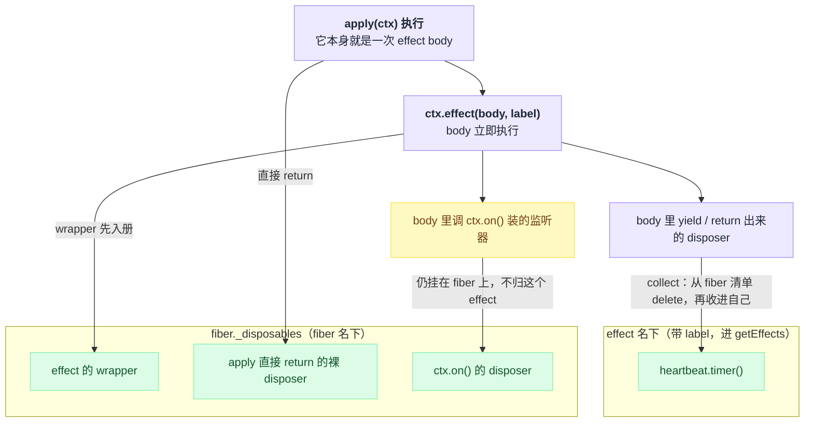
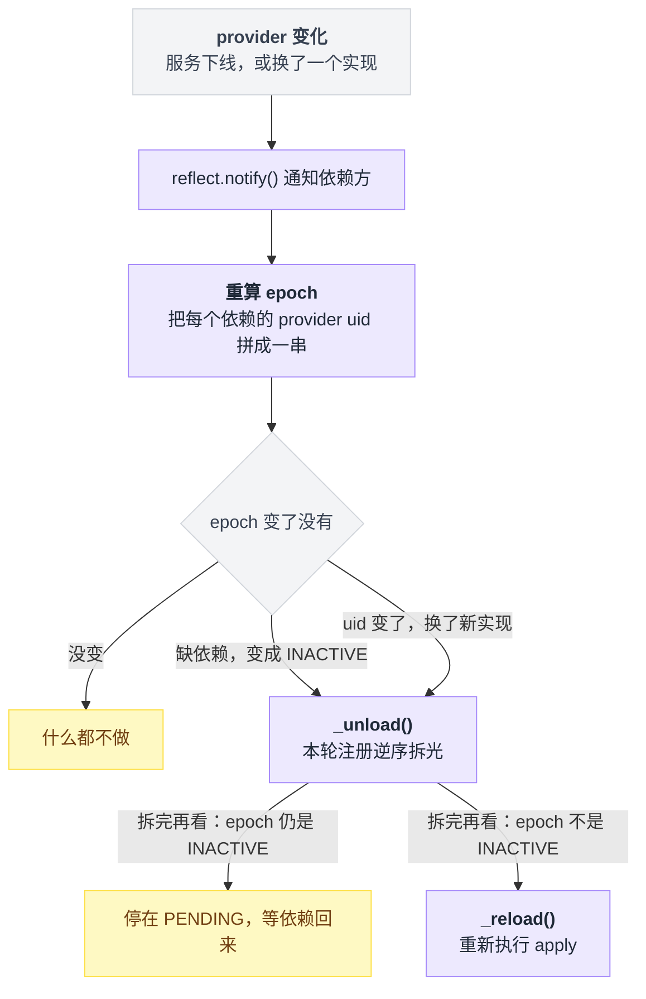
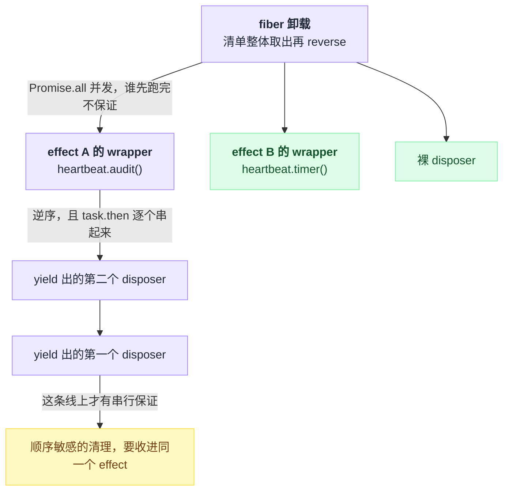
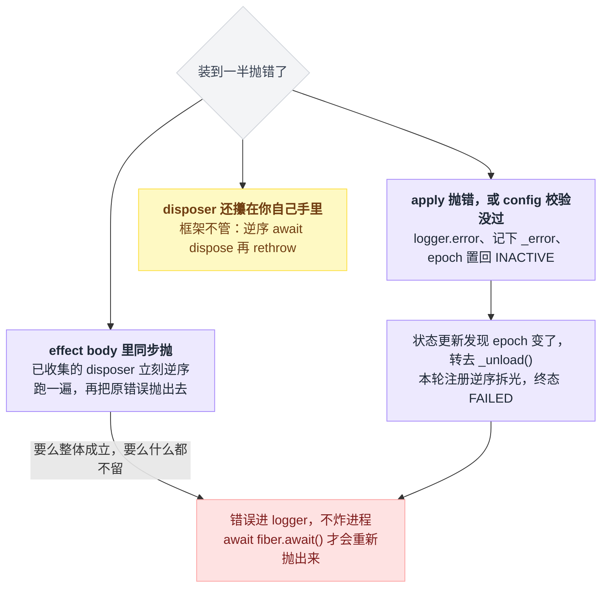
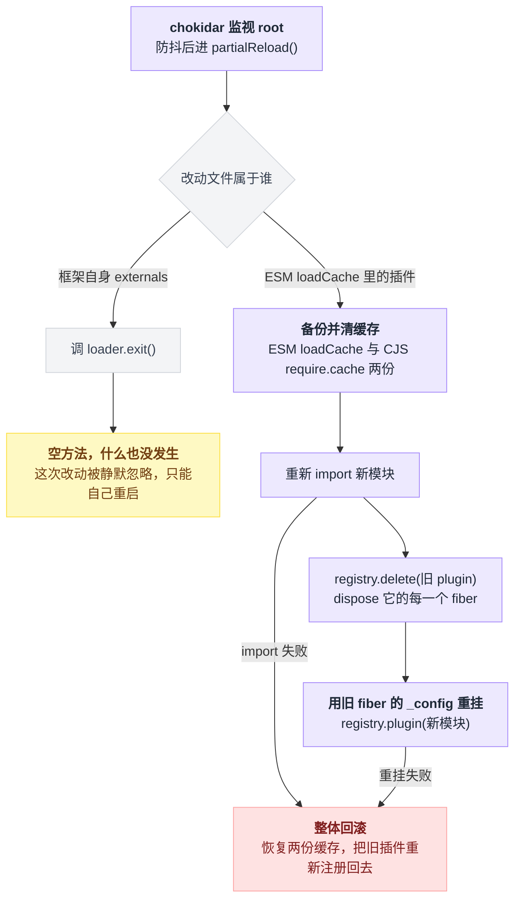
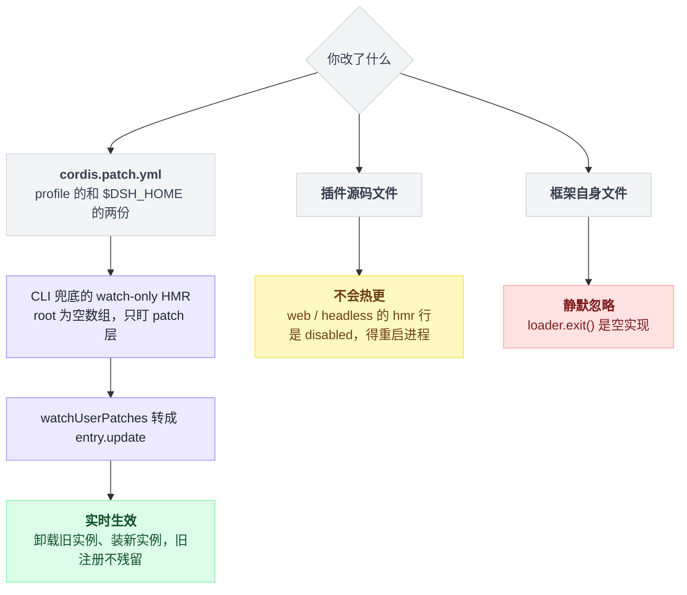

# 08 · effect 与生命周期

> 基于 `deepseek-ai/deepseek-harness` v0.1.0-rc.5（commit `47f9438`），2026-08-14 核对。正文只讲机制；可照抄的代码统一收在文末[附录](#附录可以照抄的模板)，出处收在[脚注](#出处)，点角标可跳转。

最常见的误解是：插件装上去就一直在，`apply` 只会跑一次，清理代码属于"好习惯，不写也无妨"。

不是的。在 dsh 里，改一行配置、依赖的服务换了实现、HMR 保存文件、把一条 entry 标成禁用——任何一件都会让当前插件实例被卸载、再装一个新的。`apply` 会被反复执行，而每次执行留下的东西，必须有人负责撤销。

负责撤销的机制只有一条规则，也是全章唯一要立的柱子：**注册即 effect，卸载即逆序回滚**。

想通了，热重载、失败回滚、依赖换实现自动重启这几件事就都不是特性，而是同一条规则的推论。没想通，你写的插件会在第三次热重载之后开始行为诡异，而且查不出来。

换成对你有直接约束的说法：**你在插件里做的每一次注册，框架都会在卸载时替你撤销——前提是这次注册确实交到了框架手上。** 哪些交到了、哪些没有、怎么把没交的补上，就是全章内容。顺带回答两个具体问题：给 effect 起 `label` 到底值不值，以及 dsh 里 HMR 实际开到了哪一层。

---

## 先看一个坏插件：每秒漏一个定时器

假设你要写个心跳插件，每秒打一行日志。最省事的写法是在 `apply` 里裸挂一个每秒触发的定时器，然后函数直接返回——定时器的句柄谁也没接。

这个插件在 dsh 里是**坏的**——不是"不够优雅"，是真的会出 bug。

回想开头那句话：插件不是只装一次。改一行配置、依赖被换掉、HMR 保存文件、把这条 entry 标成禁用[^1]，当前实例就被卸载重装了。可那个定时器没人认领，卸载之后它照跑不误。装十次，十个定时器一起打日志。

插一句日志器的来历：它不用装插件就有，Cordis 建 root context 时就挂上了日志服务。但**日志能不能被你看见**是另一回事，取决于有没有 exporter——纯 Cordis 环境下要另配 `@deepseek-ai/cordis-plugin-logger-console`[^2]。

修法是把资源的**获取和释放写在一起**，交给 `ctx.effect()`：body 里挂上定时器，回手交出一个"拆掉它"的函数，两个动作装进同一个壳里。写法照抄[附录 A](#a-把定时器包进效果里)。官方教程用的就是这个形状：一个心跳定时器加一个延时效果，官方那份没传 `label`[^3]。

文档把规则压成一句：Cordis 已经管的东西不用你操心，**Cordis 管不到的资源必须包进 `ctx.effect()`**[^4]。

---

## `ctx.effect()` 到底承诺了什么

先拆一个容易误会的实现细节：`ctx.effect` 并不是 Context 自己实现的方法，它转发到当前 fiber 上。类型侧是从 Fiber 上单挑了这一个方法拼进 Context 的类型，真正做转发的是一句 mixin[^5]。

契约本身有七条，逐条对着源码读下来是这样[^6]：

| # | 承诺 |
|---|---|
| 1 | 传进去的 body **立即执行**，不排队等时机 |
| 2 | 调用返回一个 disposer，随时可以就地把这个 effect 拆掉 |
| 3 | "手动调 disposer"和"fiber 卸载"谁先到算谁——wrapper 一创建就进了 fiber 的清单 |
| 4 | 重复调 disposer 是 no-op：外层有一道"纪元"闸，内层还有一个"正在拆"的标志兜底 |
| 5 | fiber 已是 DISPOSED 或 UNLOADING 时再调，抛 `INACTIVE_EFFECT` 错误 |
| 6 | body 返回了框架不认识的东西，抛 "Invalid effect" 类型错误 |
| 7 | `label` 只用于诊断，出现在 getEffects 输出里，不传默认叫 anonymous |

第 7 条那个参数的价值在本章最后一节兑现。

body 允许返回四种形状[^7]：

| 形状 | 说明 |
|---|---|
| 一个 disposer | 最普通：直接交出一个清理函数 |
| 一张"稍后兑现出 disposer"的欠条 | async body：先做异步准备，兑现出来的才是清理函数 |
| generator | 一路 `yield` 出多个清理函数，攒成一组 |
| async generator | 同上，但每一步之间还可以异步等待 |

返回空（undefined / null）同样合法[^7]，意思是这段 effect 没有需要回收的东西。

dsh 自己大量用 generator 形式，把"一组要一起装、一起拆"的注册串起来——agent 注册表就用它把"停止接收发起者"和"关闭发起者"两步清理装进同一个 effect[^8]，原文抄在[附录 B](#b-用-generator-串一组清理动作)。

**这里最容易踩的一脚**是想当然地以为"effect 里做的事都归这个 effect 管"。

不是。在 effect body 里调 `ctx.on()` 之类的注册，那个监听器仍然挂在 **fiber** 上，并不会自动变成这个 effect 的子资源。柱子在这里要加一句限定：**只有被 `yield` 或 `return` 出来的 disposer 才会被 effect 接管，其余的原地留在 fiber 名下。**

搬家动作叫 collect，一共两步：先把这个 disposer 从 fiber 的清单里摘掉，再收进 effect 自己名下[^9]。而 body 里顺手注册的监听器，从头到尾没人替它做这个搬家动作——它一直待在 fiber 的清单里，跟这个 effect 无关。

一句话：effect 的 wrapper 先落进 fiber 的清单，被 `yield` / `return` 出来的 disposer 再从 fiber 名下搬到 effect 名下，其余的原地不动。



这条"搬家"机制不是冷知识，仓库里有两个真实用法。

一是**改所有权以控制顺序**。调度插件在自己的 disposer 里**手动**调了"停止接新 agent"的句柄——也就是它早些时候注册"agent 已创建"监听时拿回的那张退订票——因为它要求先停止接新 agent、再逐个拆已建的 runtime，就必须自己攥住这个句柄[^10]。

二是**改标签**。persona 预设把本来已经是 effect 的"往系统提示词里加一节"又包了一层 effect 并改名 `persona.section()`，那个 disposer 于是从 fiber 名下转到外层 effect 名下，诊断里显示的就是这个名字，而不是内层那个笼统的 `systemPrompt.section()`[^11]。

---

## 返回 disposer 的 API，本身就是 effect

那是不是所有注册都得自己包 `ctx.effect()`？也不是。判据很简单：**一个 API 返回 disposer，它就已经是 effect**，你不用为它写清理代码。

这张表值得记住，因为它决定了你什么时候可以偷懒（每一行的实现位置见脚注[^12]）：

| 你写的 | 自动挂的 label |
|---|---|
| `ctx.on` | `ctx.on("name")` |
| `ctx.plugin` | `ctx.plugin()` |
| `ctx.provide` | `ctx.provide("name")` |
| `ctx.accessor` | `ctx.accessor("name")` |
| `ctx.mixin` | `ctx.mixin("source")` |
| `ctx.tools.register` | `tools.register()` |
| `ctx.systemPrompt.section` | `systemPrompt.section()` |
| `ctx.tools.presentAs` | `tools.presentAs()` |

官方 primer 把这条写成设计原则：prompt section、tool schema、adapter、provider、listener 全都通过 `ctx.effect()` 或 `ctx.on()` 安装，好让 reload 和 teardown 可预测地回退；面向插件作者另有一份对照清单[^13]。

---

## `apply` 本身就是一个 effect body

这条知道的人不多：插件的启动函数走的是**同一套 effect 分发**。

Effect 类型的文档注释明写着 "Effect body result accepted by `ctx.effect()` and plugin startup."；runner 执行的就是插件的回调本身，返回值交给同一套分发逻辑，收进 fiber 的清单[^14]。

所以 `apply` 可以直接返回 disposer，不用套 `ctx.effect()`；async 的 `apply` 返回一张"稍后兑现出 disposer"的欠条同样合法，重载流程会等它兑现。两种写法都抄在[附录 C](#c-apply-直接返回清理函数的两种写法)。

第二种在仓库里有真实用例：远程客户端插件的 `apply` 就是 async 的，返回一个"按挂载逆序卸载"的 disposer[^15]。

async `apply` 有个坑：异步等待之后 fiber 可能已经在卸载了，这时再调 `ctx.effect()` / `ctx.on()` 会抛 `INACTIVE_EFFECT`。

dsh 自己在 boot 路径上就处理了这个竞态——显式判这个错误码，按源码注释"这是 app 按要求退出，不是 watch 失败"处理，返回一个空 disposer 而不是崩掉[^16]。

---

## 谁来决定卸载：fiber 的六个状态，和一串 uid

前面一直在说"卸载时"，现在回答：卸载是**谁**、在**什么时候**触发的。

一个 fiber = 一个已加载的插件实例。状态枚举一共六个：PENDING、LOADING、ACTIVE、FAILED、DISPOSED、UNLOADING[^17]。

教程给的迁移图长这样[^18]：

```
PENDING → LOADING → ACTIVE → UNLOADING → DISPOSED
                 ↘ FAILED
```

当前状态不是随手赋值的，而是按优先级现算出来的[^19]：uid 已经没了，就是 DISPOSED，这条优先级最高；还留着错误，就是 FAILED；epoch 不是"未激活"，就是 ACTIVE；都不是，就是 PENDING。注意这套算法**永远算不出 LOADING 和 UNLOADING**——这两个过渡态只能由状态更新流程的回调显式返回[^19]。

每次跃迁都会广播一声内部状态事件。这个事件是公开声明的，dsh 内部就有订阅者[^20]。

**依赖驱动**是整套模型最反直觉的地方。fiber 的 "epoch" 不是布尔值，而是把每个依赖服务的 provider fiber uid 用冒号拼成的一个字符串[^21]。

于是驱动链是这样：provider 一有变化，通知机制喊依赖方重算 epoch。拼出来跟旧的一样，什么都不做；不一样，先把本轮注册逆序拆光，拆完再看——新 epoch 是"未激活"（依赖没了），就停在 PENDING 等它回来；否则（依赖换了）重新执行 `apply`[^21]。

验收题来了：服务名一个字没变，只是**换了一个实现**，依赖它的插件动不动？动。新 provider 是新 fiber，新 uid，epoch 字符串跟着变，所有依赖它的插件全部卸载重装，触发者就是那声通知[^22]。这就是开头说"依赖换实现自动重启是推论"的推导过程——框架根本没有"重启"这个特性，它只有"epoch 变了就拆了重装"这一条规则。



## 卸载的两种顺序：横着并发，竖着串行

"逆序回滚"四个字里藏着一个容易写出诡异 bug 的细节：逆序有两层，**两层的并发性完全不同**[^23]。

第一层是一个 fiber 的所有 effect 之间：清单整体取出、反转，然后**一把撒出去并发跑**——逆的是注册顺序，但不保证一个跑完再跑下一个。

第二层是同一个 effect 内部收集的多个 disposer 之间：同样逆序，但**逐个链起来串行跑**，前一个等完了才动下一个。

两条规则叠在一张图上是两个方向：横着那层是并发的，竖着那层才是串行的。



从这张图能直接推出本节的不变量：**顺序敏感的清理必须收进同一个 effect**。generator 里 `yield` 出的多个 disposer 可以，写成一个 disposer 在里面自己逐步等待也可以，两种都拿得到串行保证。

官方两处给的是更保守的后一种说法——"放进单个 `ctx.effect()` 返回的同一个 disposer 里，在那里串行 await"[^24]。

至于 fiber 整体 dispose 的三条保证——注册全部移除、子插件递归卸载、promise 在所有异步清理结束后才 resolve——是官方文档的表述[^25]。

---

## 写一个持有外部资源、能干净卸载的插件

把上面的规则用一次。

[附录 D](#d-完整的心跳插件与挂载配置) 是一个完整插件：它同时持有一个定时器和一个事件订阅，并且**卸载时要求先摘监听、再落盘**——按刚才的不变量，这两件事必须写进同一个 disposer。定时器和它没有顺序关系，单独一个 effect 就行。

纯 Cordis 环境下挂载它只要配置文件里两行，本地文件用相对路径[^26]；在 dsh 里则是往 patch 层的 insert 列表里加同样两行。patch 文件就是一个顶层 YAML 数组，元素是"按 id 覆盖 config"或 insert 列表，形状照抄 base bundle 那份[^27]。四层叠加的细节见第 03 章，挂载走查见第 06 章。

有三处值得对着源码解释一下。

订阅内部状态事件那句本身已经是 effect，就算你不手动退订，fiber 卸载时它也会被摘掉[^28]；附录里手动调退订票，纯粹是为了**保证在落盘之前摘干净**。

第二个 effect 的 disposer 是 async 的，卸载流程会等它[^29]。

至于两个 effect 之间谁先谁后——**不要指望**，那是并发的，真要串就合成一个。

更大规模的真例可以看文件监听 provider 的 dispose，以及 HMR 插件里关掉 chokidar watcher 的那一句[^30]。

---

## 装到一半抛错，谁来收拾

分三种情况，全部可从源码读出。三条路的收尾方式不一样，只有最后一条要你自己动手[^31]：

| 抛错的位置 | 谁来收拾 |
|---|---|
| effect body 里同步抛 | 已收集的 disposer 立刻逆序跑一遍，再把原错误抛出去——要么整体成立，要么什么都不留 |
| `apply` 抛错，或 config 校验没过 | 重载流程的 catch 做三件事：记一条错误日志、把错误存下来、把 epoch 置回"未激活" |
| （承上）紧接着的状态更新 | 发现 epoch 变了，直接走卸载，这一轮已注册的一切被逆序拆掉，终态 FAILED |
| disposer 还攥在你自己手里 | 框架不管，得你自己逆序等它们拆完再把错误重新抛出去——见下文两个真例 |

config 校验失败走的是第二条同一条路：解析配置抛校验错误的那一句，就发生在重载流程的 try 里[^32]。



**错误跑哪去了？** 进 logger，不会炸进程。想主动拿到它，就等 fiber 的完成 promise——它会把存下的错误重新抛出来[^33]。

那什么时候还需要你手写回滚？当那批 disposer 还攥在你自己手里、没交给 fiber 的时候——又回到了柱子的那句前提："这次注册确实交到了框架手上"。

远程客户端插件是标准形状：async `apply` 里逐个挂载，中途失败就把已拿到的 disposer 逆序逐个等完，再把原错误重新抛出去[^34]。

目录选择器插件同理：在 effect 内部维护已挂载的 id 列表，失败时逆序卸载，成功时把同一个卸载函数作为 disposer 返回[^35]。

---

## HMR 是推论，但 dsh 里它只开了一半

热重载在这套模型下不是特性，是推论：**卸载能把注册退干净，加载又由依赖驱动，那么"卸载 + 重新加载"就等于替换**[^36]。

`@deepseek-ai/cordis-plugin-hmr`（仓库 vendor 目录自带，package version 1.0.16[^37]）按顺序做这几件事[^38]：

1. chokidar 监视 `root`，防抖后进局部重载流程
2. 改动文件属于框架自身（externals）→ 调 loader 的退出钩子；属于 ESM 加载缓存 → 局部重载
3. 备份并清掉 ESM 加载缓存与 CJS 的 require 缓存，重新 import
4. 从注册表删掉旧插件——这一步会 dispose 该 plugin 的**每一个** fiber
5. 用旧 fiber 的配置重新注册新模块
6. 任一步抛错就整体回滚：恢复两份 module cache，把旧插件重新注册回去

这六步的分叉点有两个：文件属于框架自身那条是条死路，属于插件模块那条则是"清缓存 → 重新 import → 拆旧树 → 装新树"，中途任何一步失败都把旧插件原样装回去。



第 2 步藏了个惊喜：**那个退出钩子在本仓库里是个空方法**，注释写的是 "Hook for hosts that can restart the process on full-reload requests"，全仓 grep 没有任何子类覆写它[^39]。

所以改到框架自身的文件时，HMR 既不局部重载也不重启进程，那次改动被静默忽略——想生效只能自己重启。

Schema 里声明的字段有四个[^40]：

| 字段 | 默认值 |
|---|---|
| `base` | — |
| `root` | `['.']` |
| `ignored` | 忽略 `**/node_modules`、`**/.*`、`cache`、`data` |
| `debounce` | 100ms |

但它不是"只认这四个"：它的 Config 类型直接继承 chokidar 的选项类型，整份 config 被展开传给 watch 调用，而 schemastery 的非严格解析会把未声明的键原样并回结果，所以 chokidar 自己的选项能透传[^40]。

它注入了 loader 和 timer 两个依赖，并且要求拿得到 Node 的内部 ESM loader，否则构造函数直接抛[^41]。

那句报错文案写的是 `--expose-internals is required`，但**这不是唯一途径**：loader 先看进程启动参数里有没有这个 flag，没有就退到原生插件 `node-addon-require-builtin`（该包是 CLI 与 loader 两处的依赖）。另外还要 Node ≥ 22[^42]。

**下面是 dsh 特有的部分，跟纯 Cordis 教程不一样，务必记住**[^43]：

| profile | hmr 行状态 |
|---|---|
| base bundle（所有 profile 的共同底） | 启用，监视当前目录 |
| web-app | 禁用（注释：reload lifecycle 未测试，待重开） |
| headless | 禁用 |

被关掉之后并非全无热更。CLI 在 boot 之后发现拿不到 hmr 服务，会**兜底挂一个不监视任何模块的 watch-only HMR**（必要时先补 timer），专门用来盯用户的 patch 层，再由监视用户 patch 的流程把变更转成对 Include entry 的更新调用[^44]。

所以"改完会不会热更"取决于你动的是哪一层：



于是对使用者的实际结论是这么四条。

改 patch 文件（profile 的和 `$DSH_HOME` 的两份[^45]）→ **实时生效**，不用重启。

在默认的 web / headless profile 下改**插件源码文件** → **不会热更**，因为兜底那份不监视任何模块，你得重启进程；想要模块级热更，自己在 patch 里把 hmr 行的禁用去掉并给回监视根目录。

配置变更本身也是一次热替换：框架卸载旧实例、装新实例，旧实例的注册不会残留；链路是 entry 的更新调用先过一道可拦截的 waterfall，然后重启该 fiber[^46]。

最后一条最容易忘：**entry 一定要写 `id`**。没有 `id` 的条目每次读配置都会拿到新生成的 id，于是任何一次配置文件编辑都会被当成"删掉旧的 + 加个新的"，哪怕它自己那几行一个字没动也会重挂[^47]。

---

## 给 effect 起名字，是为了排障那一刻

fiber 上有个方法能吐出当前存活的 effect 元数据树，节点上就两样东西：标签，和孩子们[^48]。

它的过滤规则：凡是经 `ctx.effect()` 建的都带一个专门的标记（没传 label 就叫 anonymous），会进输出；而直接被 collect 收进去的裸 disposer——比如 `apply` 直接 return 的那个——没有标记，不会出现在结果里。孩子们只包含被 `yield` / `return` 出来的嵌套 effect[^48]。

它有公开 API 文档[^49]。但全仓 grep 的结果泼了盆冷水：除了定义处和那两份 API 文档，它只出现在 7 个测试文件中，**没有任何 CLI 或诊断命令把它暴露给使用者**。

所以它现在的实际用途是写断言，照抄[附录 E](#e-用-geteffects-写断言)即可[^50]。

即便如此，`label` 仍然值得每次都传，理由很具体：当某个东西没退干净，你看到的是一串 effect 名字。

`agentLoop.lifecycle(<sessionId>)` 能把问题定位到某一个会话，`schedule.runtime()` 能告诉你是调度插件而不是别的谁，`tools.presentAs()` 一眼就知道是工具呈现层[^51]。全叫 anonymous 的话，这一屏输出等于没有。

前面提到 persona 特意把系统提示词那个 effect 重新包一层改名，图的就是这个。

反过来，还有一类症状跟 effect 无关：插件没反应但也不报错，多半是 fiber 停在 PENDING（缺依赖），排查脚本教程里有现成的[^52]，更系统的诊断留到第 25 章。

---

## 把柱子重新立一遍

全章只有一根柱子：**注册即 effect，卸载即逆序回滚**。收尾把每个结论从它推一遍，推不出来的那条就回去重读对应的画面：

- 泄漏定时器的画面 → 插件不是只装一次，所以 **Cordis 管不到的资源必须包进 `ctx.effect()`**，把获取和释放写在一起；
- collect 的画面 → "交到框架手上"有精确定义：**只有被 `yield` / `return` 出来的 disposer 归 effect 管**，body 里顺手 `ctx.on()` 的仍挂在 fiber 名下；
- 返回 disposer 的 API 表 → 框架已经替你包好的那批，不用再包一层——除非你要改所有权或改标签；
- `apply` 走同一套分发 → 插件启动函数本身就是 effect body，直接 return disposer 也算"交到框架手上"；
- epoch 的画面 → 卸载由一串 provider uid 驱动，**换实现也算变**，所以"依赖换实现自动重启"不是特性是推论；
- 两层卸载顺序的画面 → 逆序回滚横着并发、竖着串行，所以**顺序敏感的清理必须收进同一个 effect**；
- 抛错三条路 → 交给框架的部分要么整体成立要么什么都不留；**还攥在自己手里的 disposer，回滚也得自己写**；
- HMR 的画面 → 卸载退得干净，"卸载 + 重新加载"就等于替换；但 dsh 里 web / headless 只盯 patch 层，改插件源码得重启，改框架自身被静默忽略；
- `label` → 排障那一刻你看到的是一串 effect 名字，全叫 anonymous 的输出等于没有。

凡是绕开这个约定拿到的资源（裸 `setInterval`、裸连接、自己攥着的句柄），都得你自己在卸载路径上补一遍，否则热重载十次就漏十份。

> 想知道这一点上 Pi / Codex / LangChain 怎么做，见 [五个 agent 系统源码解剖](../2026-08_五个agent系统源码解剖/00-总览与阅读指南.md)。

---

## 附录：可以照抄的模板

### A. 把定时器包进效果里

获取和释放写在同一个壳里，第二个参数是给排障看的标签：

```ts
export function apply(ctx: Context) {
  ctx.effect(() => {
    const timer = setInterval(() => ctx.logger.info('tick'), 1000)
    return () => clearInterval(timer)
  }, 'heartbeat.timer()')
}
```

### B. 用 generator 串一组清理动作

dsh 的 agent 注册表原文，两步清理装进同一个 effect、卸载时逆序串行跑[^8]：

```ts
// packages/core/agent/src/index.ts:294
ctx.effect(function* (this: AgentRegistry) {
  yield () => this.disposeInitiators()
  yield () => { this.closeInitiators() }
}.bind(this), 'agents.initiatorLifecycle()')
```

### C. apply 直接返回清理函数的两种写法

同步版：

```ts
export function apply(ctx: Context) {
  const timer = setInterval(() => ctx.logger.info('tick'), 1000)
  return () => clearInterval(timer)
}
```

异步版，重载流程会等这个 promise 兑现[^15]：

```ts
export async function apply(ctx: Context): Promise<() => Promise<void>> {
  const timer = setInterval(() => ctx.logger.info('tick'), 1000)
  await Promise.resolve()
  return async () => clearInterval(timer)
}
```

### D. 完整的心跳插件与挂载配置

顺序敏感的两步（先摘监听、再落盘）收在同一个 disposer 里；定时器和它没有顺序关系，单独一个 effect：

```ts
// heartbeat.ts
import { writeFile } from 'node:fs/promises'
import { resolve } from 'node:path'
import type { Context } from '@deepseek-ai/cordis'

export const name = 'heartbeat'

export function apply(ctx: Context) {
  ctx.effect(() => {
    const timer = setInterval(() => ctx.logger.info('tick'), 1000)
    return () => clearInterval(timer)
  }, 'heartbeat.timer()')

  ctx.effect(() => {
    const seen: string[] = []
    const stop = ctx.on('internal/status', (fiber) => {
      seen.push(fiber.name)
    })
    return async () => {
      stop()
      await writeFile(resolve(process.cwd(), 'heartbeat.log'), seen.join('\n') + '\n', 'utf8')
    }
  }, 'heartbeat.audit()')
}
```

纯 Cordis 环境下的挂载配置，本地文件用相对路径[^26]；在 dsh 里则是往 patch 层的 insert 列表加同样两行[^27]：

```yaml
- id: heartbeat
  name: './heartbeat.ts'
```

### E. 用 getEffects 写断言

仓库里的真实用法[^50]：

```ts
// packages/core/scope/tests/store.spec.ts:195
expect(ctx.fiber.getEffects().map(effect => effect.label)).toContain('store.order')
```

---

## 出处

[^1]: `disabled: true` 的写法：`docs/cordis-tutorial/06-composition-and-hmr.md:19`。
[^2]: root context 挂 `LoggerService`：`vendor/cordis/src/context.ts:81`、`logger.ts:191`；exporter（`@deepseek-ai/cordis-plugin-logger-console`）见 `docs/cordis-tutorial/06-composition-and-hmr.md:42`。
[^3]: 官方教程的形状（一个 `heartbeat` 定时器 + 一个 `setTimeout` 效果，未传 `label`）：`docs/cordis-tutorial/02-lifecycle-and-effects.md:13`–`42`。
[^4]: "Cordis 管不到的资源必须包进 `ctx.effect()`"：`docs/cordis-tutorial/02-lifecycle-and-effects.md:5`。
[^5]: 转发实现：类型侧 `Context extends Pick<Fiber, 'effect'>` 在 `vendor/cordis/src/fiber.ts:10`，mixin 语句 `this.mixin('fiber', ['runtime', 'effect'])` 在 `vendor/cordis/src/reflect.ts:220`，实现在 `vendor/cordis/src/fiber.ts:418`。
[^6]: 七条契约逐条：立即执行在 `fiber.ts:522`；返回 disposer 在 `fiber.ts:504`–`514`；wrapper 一创建就进 fiber 的 `_disposables` 在 `fiber.ts:520`，"谁先到算谁"的行为说明见源码注释 `fiber.ts:406`–`408`；重复调 no-op 的两道闸——外层 `runner.epoch` 在 `fiber.ts:508`、内层 `disposing` 标志在 `fiber.ts:428`–`429`；DISPOSED / UNLOADING 时抛 `CordisError('INACTIVE_EFFECT')` 在 `fiber.ts:419`–`422`、`fiber.ts:351`–`354`；返回不认识的东西抛 `TypeError('Invalid effect')` 在 `fiber.ts:363`、`fiber.ts:372`；`label` 与默认名 `'anonymous'` 在 `fiber.ts:418`、`fiber.ts:444`、`fiber.ts:568`。
[^7]: 四种形状：类型定义在 `fiber.ts:83`–`93`，分发逻辑在 `fiber.ts:366`–`398`；逐形状的分发行号——单个 disposer `fiber.ts:367`、Promise `fiber.ts:374`、generator `fiber.ts:375`–`382`、async generator `fiber.ts:383`–`395`；返回 `undefined` / `null` 合法在 `fiber.ts:369`–`370`。
[^8]: agent 注册表的 generator 用例：`packages/core/agent/src/index.ts:294`–`297`。
[^9]: collect（搬家）逻辑：`fiber.ts:448`–`453`。
[^10]: 调度插件手动攥句柄：`packages/schedule/schedule/src/index.ts:69`–`75` 的 disposer 里手动调 `stopCreated()`，即第 45 行 `ctx.on('agent/created', …)` 的返回值。
[^11]: persona 重新包一层改标签：`packages/preset/persona/src/index.ts:61`–`66`。
[^12]: 各 API 的实现与自动 label：`ctx.on` 在 `events.ts:254`–`260`，label 在 `events.ts:300`；`ctx.plugin` 在 `fiber.ts:265`–`297`，label 在 `fiber.ts:297`；`ctx.provide` 在 `reflect.ts:277`–`305`，label 在 `reflect.ts:304`；`ctx.accessor` 在 `reflect.ts:345`–`353`，label 在 `reflect.ts:352`；`ctx.mixin` 在 `reflect.ts:364`–`389`，label 在 `reflect.ts:389`；`ctx.tools.register` 在 `packages/core/tools/src/index.ts:1057`–`1061`；`ctx.systemPrompt.section` 在 `packages/core/system-prompt/src/index.ts:385`–`389`；`ctx.tools.presentAs` 在 `packages/core/tools/src/index.ts:951`–`971`。
[^13]: 设计原则原文：`docs/cordis-primer.md:13`；插件作者对照清单：`docs/user/develop/framework/index.md:57`–`63`。
[^14]: `apply` 走同一套分发：`Effect` 类型注释在 `fiber.ts:77`，runner 的 `execute` 即 `runtime.callback(this.ctx, this.config)` 在 `fiber.ts:259`，交给同一个 `_execute` 在 `fiber.ts:356`，收进 `_disposables` 在 `fiber.ts:230`–`232`。
[^15]: async `apply` 真例：`packages/api/remotes/src/client/index.ts:105`–`122`；`_reload` 会 `await` 这个 promise：`fiber.ts:656`。
[^16]: boot 路径对该竞态的处理（显式判 `error.code === 'INACTIVE_EFFECT'`）：`packages/boot/app-boot/src/index.ts:258`–`264`。
[^17]: 状态枚举顺序 `PENDING, LOADING, ACTIVE, FAILED, DISPOSED, UNLOADING`：`fiber.ts:147`–`154`。
[^18]: 迁移图：`docs/cordis-tutorial/02-lifecycle-and-effects.md:73`–`74`；另一种画法与逐状态释义：`docs/user/develop/framework/index.md:11`–`24`。
[^19]: `_getState()` 的优先级算法：`fiber.ts:574`–`579`；两个过渡态只由 `_updateState` 的回调显式返回：`fiber.ts:630`–`637` 与 `fiber.ts:665`–`672`。
[^20]: 跃迁广播 `emit('internal/status', fiber, oldState)`：`fiber.ts:586`；事件公开声明在 `vendor/cordis/src/events.ts:333`；dsh 内部订阅者在 `packages/core/agent/src/index.ts:289`。
[^21]: epoch 的拼法（形如 `':' + providerA.uid + ':' + providerB.uid`）：`fiber.ts:611`–`623`；驱动链（重算、`_unload()`、停在 PENDING 或 `_reload()`）：`fiber.ts:625`–`639`。
[^22]: 触发者 `reflect.notify()`：`reflect.ts:314`–`336`。
[^23]: 两层卸载顺序：第一层 `Promise.all` 并发在 `fiber.ts:676`–`686`，配合 `utils.ts:27`–`31` 的 `clear()` 返回 `values.reverse()`；第二层 `task = task.then(...)` 串行在 `fiber.ts:430`–`440`。
[^24]: 官方的保守说法两处：`docs/user/develop/framework/index.md:63`、`docs/cordis-primer.md:44`。
[^25]: `fiber.dispose()` 三条保证：`docs/user/develop/framework/index.md:94`–`97`。
[^26]: 本地文件用相对路径的写法：`docs/cordis-tutorial/06-composition-and-hmr.md:38`–`39`。
[^27]: patch 文件的形状（顶层 YAML 数组，"按 id 覆盖 config"或 `insert` 列表）：`packages/boot/app-boot/src/index.ts:268`–`271`；照抄样例：`packages/bundle/base/cordis.patch.yml:15`–`17`。
[^28]: `ctx.on` 本身已是 effect：`events.ts:254`–`260`。
[^29]: `_unload` 会 `await` async disposer：`fiber.ts:678`–`681`。
[^30]: 文件监听 provider 的 dispose：`packages/skill/skill-filesystem/src/index.ts:136`–`138`；chokidar watcher 的 `watcher.close()`：`vendor/hmr/src/index.ts:177`–`182`。
[^31]: 抛错三条路：effect body 同步抛的当场回滚在 `fiber.ts:521`–`537`；`_reload()` 的 catch（`ctx.logger.error(reason)`、记下 `_error`、epoch 置回 `INACTIVE`）在 `fiber.ts:659`–`664`；紧接着的状态更新转 `_unload()` 在 `fiber.ts:665`–`672`，`_getState` 见 `fiber.ts:574`–`579`。
[^32]: config 校验失败：`resolveConfig` 抛 `ValidationError` 在 `fiber.ts:50`–`62`，发生在 `_reload` 的 try 里（`fiber.ts:655`）。
[^33]: `await fiber.await()` 把 `_error` 重新抛出来：`fiber.ts:704`–`710`。
[^34]: 远程客户端的手写回滚（失败时 `for (const dispose of disposers.reverse()) await dispose()` 再 rethrow）：`packages/api/remotes/src/client/index.ts:107`–`116`。
[^35]: 目录选择器的同款形状：`packages/host/directory-picker-auto/src/index.ts:69`–`97`，失败时逆序 `unmount()` 在 `:93`，成功时把同一个 `unmount` 作为 disposer 返回在 `:96`。
[^36]: "卸载 + 重新加载等于替换"：`docs/cordis-tutorial/06-composition-and-hmr.md:25`。
[^37]: HMR 插件在 `vendor/hmr`，package version 见 `vendor/hmr/package.json:4`。
[^38]: 六步逐条：chokidar 监视与防抖进 `partialReload()` 在 `vendor/hmr/src/index.ts:242`、`:272`–`:274`；externals 判断与 `loader.exit()` / 局部重载的分叉在 `vendor/hmr/src/index.ts:259`–`268`；备份并清两份缓存、重新 `import` 在 `vendor/hmr/src/index.ts:461`–`496`；`ctx.registry.delete(oldPlugin)` 在 `:517`，它 dispose 每一个 fiber 在 `vendor/cordis/src/registry.ts:258`–`267`；用旧 fiber 的 `_config` 重新 `registry.plugin(newModule, …)` 在 `vendor/hmr/src/index.ts:502`–`509`；整体回滚在 `vendor/hmr/src/index.ts:482`–`489`、`:532`–`:545`。
[^39]: `loader.exit()` 空方法与注释原文：`vendor/loader/src/index.ts:188`–`189`。
[^40]: Schema 四字段：`vendor/hmr/src/index.ts:560`–`570`；`Config extends ChokidarOptions` 在 `:553`；整份 config 展开传给 `watch()` 在 `:229`；schemastery 非严格解析把未声明的键原样并回结果：`vendor/schemastery/src/index.ts:761`。
[^41]: `inject` 了 `loader` 和 `timer`：`vendor/hmr/src/index.ts:87`；拿不到内部 ESM loader 时构造函数直接抛：`vendor/hmr/src/index.ts:120`–`122`。
[^42]: 两条途径：先看 `process.execArgv` 有没有 `--expose-internals`、没有就退到 `node-addon-require-builtin` 的 `requireBuiltin()`，在 `vendor/loader/src/internal.ts:108`–`118`；该包是依赖见 `apps/cli/package.json:83`、`vendor/loader/package.json:34`；Node ≥ 22 的要求在 `internal.ts:122`–`130`。
[^43]: 三个 profile 的 hmr 行：base 启用（`root: ['.']`）在 `packages/bundle/base/cordis.patch.yml:19`–`22`；web-app `disabled: true` 在 `packages/bundle/web-app/cordis.patch.yml:21`–`23`；headless `disabled: true` 在 `packages/bundle/headless/cordis.patch.yml:12`–`15`。
[^44]: CLI 兜底：发现 `ctx.get('hmr') === undefined` 就挂 `root: []` 的 watch-only HMR（必要时先补 `timer`）在 `apps/cli/src/profile-boot.ts:279`–`294`；`watchUserPatches` 把变更转成对 Include entry 的 `entry.update({ config })` 在 `packages/boot/app-boot/src/index.ts:241`–`254`。
[^45]: 两份 patch 文件的监视点：`profile-boot.ts:287`、`:292`。
[^46]: 配置变更即热替换：`docs/user/develop/basic/config.md:100`；链路 `fiber.update()` → `internal/update` waterfall → `restart()`：`vendor/cordis/src/fiber.ts:736`–`753`、`:718`–`723`。
[^47]: entry 必须写 `id`：`docs/cordis-tutorial/06-composition-and-hmr.md:59`。
[^48]: `ctx.fiber.getEffects()` 实现与节点形状 `{ label, children }`：`fiber.ts:568`–`572`、`fiber.ts:96`–`101`；`symbols.effect` 标记的过滤、children 只含被 `yield` / `return` 出来的嵌套 effect：`fiber.ts:451`–`453`。
[^49]: 公开 API 文档：`docs/cordis-api/fiber.md:195`–`203`。
[^50]: 断言用法：`packages/core/scope/tests/store.spec.ts:195`。
[^51]: label 定位真例：`agentLoop.lifecycle(<sessionId>)` 在 `packages/core/agent-loop/src/index.ts:530`；`schedule.runtime()` 在 `packages/schedule/schedule/src/index.ts:65`。
[^52]: fiber 停在 PENDING 的排查脚本：`docs/cordis-tutorial/06-composition-and-hmr.md:67`–`83`。
