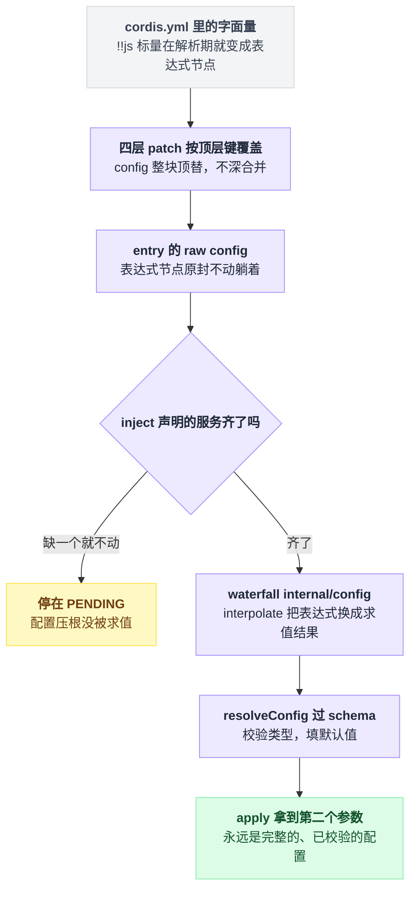
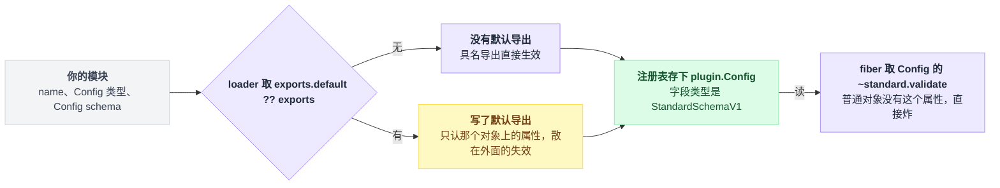
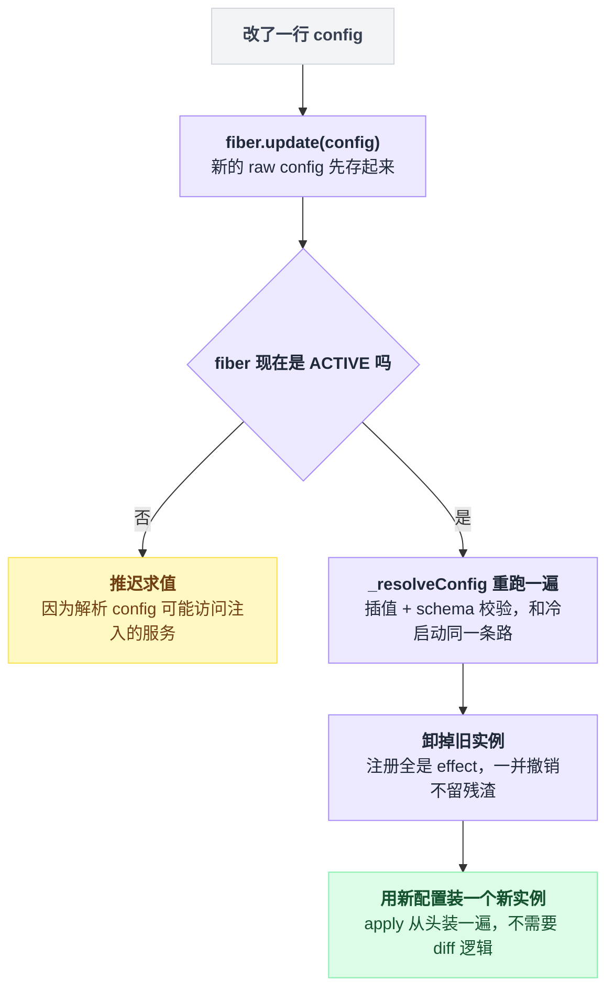
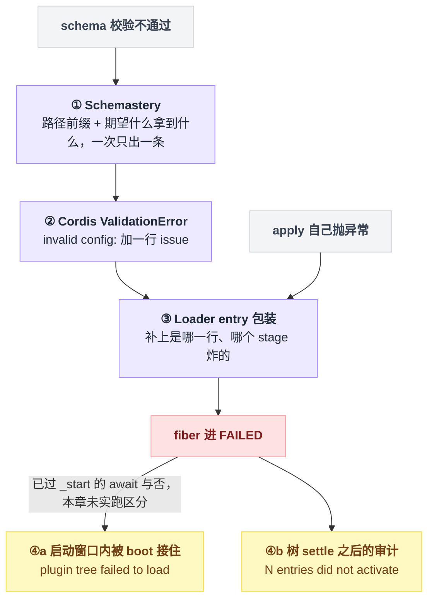
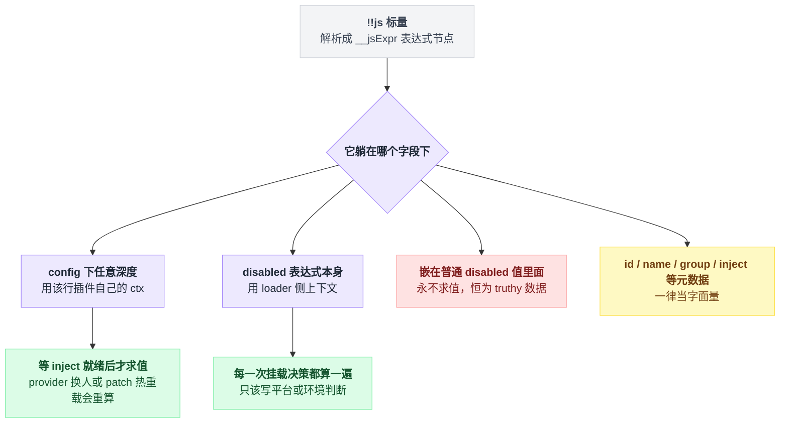
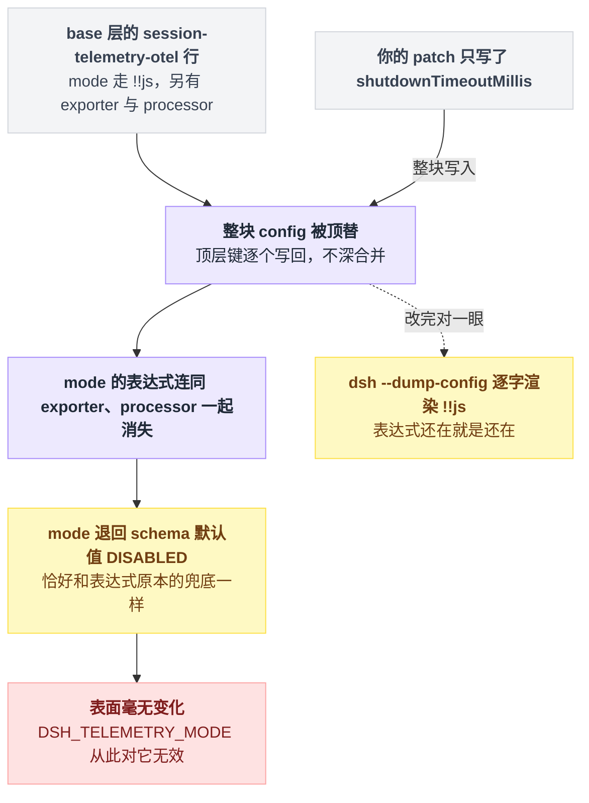
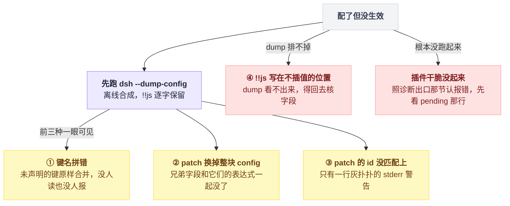

# 09 · 插件配置与 Schema

> 基于 `deepseek-ai/deepseek-harness` v0.1.0-rc.5（commit `47f9438`），2026-08-14 核对。

配置这件事只有两种痛苦。

一种是启动直接炸，吐出三四层嵌套的报错，看不出到底是 schema 不满意、插件自己抛的，还是依赖压根没就绪。

另一种更难受：**没报错，但你配的东西就是没生效。**

这章追的是同一条链路：`cordis.yml` 里那个 `config:` 块，怎么变成 `apply(ctx, config)` 的第二个参数——中间经过哪几道手续，每道手续出错时你在终端上看见什么。

整条路的形状是：YAML 里的字面量先被四层 patch 揉成一份 raw config，等 `inject` 就绪后再依次穿过插值和校验两道门，最后才落到 `apply` 的第二个参数上。



先立一个心智模型，后面一半现象都从它推出来：**改一次配置不是"把新值塞进正在跑的插件"，而是把旧实例整个卸掉、用新配置装一个新的。**

---

## 什么该写死，什么该做成配置

你的插件里有一行 `const TIMEOUT = 30000`。两台机器想要不同的值，于是你开始想"读环境变量吧"。

dsh 的规矩是反过来的：**两个部署可能想设成不同值的东西，一律做成配置字段**。判据只有一句——能不能不改代码、只改 `cordis.yml` 就换掉这个值。出处：`docs/user/develop/basic/config.md:80`、`:92`。

环境变量不是不能用。但它的正确位置在 `cordis.yml` 里（后面 `!!js` 那节会讲），不在你的 `.ts` 文件里。

## 一个可配置插件只需要三个导出

`name`、`Config` 类型、`Config` schema，就这三样。

```ts
// scratch-plugin/src/my-plugin.ts
import type { Context } from '@deepseek-ai/cordis'
import Schema from '@deepseek-ai/schemastery'

export const name = 'my-plugin'

export interface Config {
  greeting: string
  maxRetries: number
  verbose?: boolean
}

export const Config: Schema<Config> = Schema.object({
  greeting: Schema.string().default('Hello'),
  maxRetries: Schema.number().default(3),
  verbose: Schema.boolean().default(false),
})

export function apply(ctx: Context, config: Config) {
  console.log(config.greeting)
}
```

（抄自 `docs/user/develop/basic/config.md:11-32`，删掉了原文行尾的说明注释。）

`interface Config` 和 `const Config` 同名不是笔误，是故意的：使用方拿走类型，Cordis 拿走运行期校验器（`docs/cordis-tutorial/05-config.md:34`）。TypeScript 的类型空间和值空间互不打架，同名合法。

### Cordis 认的不是 Schemastery，是 Standard Schema

Standard Schema 是一个跨校验库的最小接口约定，核心就一条：校验器对象上挂一个 `~standard` 属性。

你导出的那个 `Config` 从模块走到校验点，是这么一条链：

```
// 注册插件时
runtime.Config = plugin.Config          // 存下来，字段类型写的是 StandardSchemaV1

// 该校验了
runtime.Config['~standard'].validate(config)
```

对应 `vendor/cordis/src/registry.ts:326`（注册表建立插件 runtime 记录时直接读 `plugin.Config` 存进去）、`:104`（字段类型 `StandardSchemaV1`）、`vendor/cordis/src/fiber.ts:53`（取 `runtime.Config['~standard'].validate(config)`）。

这里的归属关系值得单独看一眼：你导出的东西先过 loader 的一道取值，才进注册表，最后在 fiber 里被当成校验器用。



由此推出四条实用后果：

- **不能 `export const Config = { ... }` 一个普通对象。** 普通对象没有 `~standard`，那行会直接炸（`docs/user/develop/basic/config.md:45`、`docs/cordis-tutorial/05-config.md:34`）。
- 本仓库用 Schemastery 实现这个接口（`vendor/schemastery/src/index.ts:275-292`），但 Cordis 本身接受任何 Standard Schema 校验器，你想换别的库是可以的。
- **类形式的插件写 `static Config = Config`**，实例见 `packages/session/session-telemetry-otel/src/index.ts:149`。
- **`export default` 会吃掉具名导出。** loader 取模块时是 `exports.default ?? exports`（`vendor/loader/src/index.ts:192-199`，调用点 `vendor/loader/src/config/entry.ts:280`）。你一旦写了默认导出，`Config`、`inject`、`name` 就必须挂在那个默认导出的对象上，散在外面的具名导出不再生效。

### 常用的 schema 构造器

| 写法 | 作用 | 出处 |
|---|---|---|
| `Schema.object({...})` | 对象 | 声明 `vendor/schemastery/src/index.ts:89`，解析器 `:752` |
| `Schema.string()` / `.number()` / `.boolean()` | 基础类型 | `vendor/schemastery/src/index.ts:59-67` |
| `Schema.array(Inner)` / `Schema.dict(Inner)` / `Schema.tuple([...])` | 集合 | `vendor/schemastery/src/index.ts:83-87` |
| `Schema.union([...])` | 枚举 / 多形态 | `packages/session/session-telemetry-otel/src/index.ts:121` |
| `.default(v)` | **默认值就写在这** | `vendor/schemastery/src/index.ts:167` |
| `.required()` | 缺了就报错 | `vendor/schemastery/src/index.ts:157`，抛点在 `:475` |
| `.min()` / `.max()` / `.pattern()` | 范围与正则 | `vendor/schemastery/src/index.ts:180-185` |
| `Schema.any()` | 放行整块（转交给别的库校验） | `packages/session/session-telemetry-otel/src/index.ts:122-123` |

### 默认值只写在 schema 上

不要在 `apply` 里写 `config.greeting ?? 'Hello'`（`docs/user/develop/basic/config.md:9`）。用户省略 `greeting` 时，校验器会把默认值填进去再交给 `apply`，所以 `apply` 拿到的永远是完整的、已校验的配置。

出处：`docs/cordis-tutorial/05-config.md:51`；填充逻辑在 `vendor/schemastery/src/index.ts:474-484`，最后一步 `data = clone(fallback)` 在 `:483`。

反向也成立：配置写回文件时，loader 会调 schema 的 `simplify` 把等于默认值的字段删掉（`vendor/loader/src/index.ts:106-108`，`simplify` 定义在 `vendor/schemastery/src/index.ts:193`）。

### 字段名打错，没有任何人会告诉你

这是本章第一个静默失败，也是"我明明配了怎么没生效"最常见的成因。

`Schema.object` 的解析器在非 strict 模式下，会把你没声明的键**原样合并进结果**：

```
result = {}
for (key, 子schema) in 你声明的字段:
    result[key] = 子schema.parse(data[key])   // 缺了就填 default

if not strict:
    merge(result, data)      // 你没声明的键，原样搬进来，一声不吭
```

关键就是那句 `if (!strict) merge(result, data)`，在 `vendor/schemastery/src/index.ts:752-763`，`merge` 本体在 `:745-750`。

于是 `cordis.yml` 里把 `greeting` 拼成 `greetng`，加载期零诊断：`greetng` 静静躺在 config 里没人读，`greeting` 用了默认值。

先怀疑拼写，别急着怀疑加载顺序。

## 校验发生在什么时候：先插值，再校验，最后 apply

这个顺序是硬编码的，不是约定俗成。

> 两个前置名词：waterfall 是 Cordis 的洋葱式事件派发，一串监听器依次拿到值、可以改写后再传给下一个（第 10、11 章展开），这里只需要知道它是"配置在到达 schema 之前经过的一道可改写管道"；fiber 是一个插件实例的运行期句柄（第 05 章），下面几个状态名都挂在它身上。

```
fiber 创建
  │  inject 声明的服务还没齐 → 停在 PENDING，什么都不做
  ▼  服务齐了（_refresh 算出非 INACTIVE epoch）
_reload()
  ├─ _resolveConfig(raw)
  │    ├─ waterfall 'internal/config'  →  loader 把 !!js 节点换成求值结果
  │    └─ resolveConfig(runtime, cfg)  →  schema 校验 + 填默认值
  ▼
apply(ctx, config)
```

挂载点在 `vendor/cordis/src/fiber.ts:641-644`，两步就挤在 `:642` 和 `:643` 两行里，调用点是 `vendor/cordis/src/fiber.ts:655`。

PENDING 的判定是：只要 `inject` 里有一个服务缺席，epoch 就是 INACTIVE，`_reload` 根本不跑。对外的那两个状态名也是推出来的——`_error` 有值 → FAILED，epoch 是 INACTIVE → PENDING。见 `vendor/cordis/src/fiber.ts:611-623` 与 `:575-578`。

热更新路径 `fiber.update()` 遵守同一条纪律：fiber 不处于 ACTIVE 时**推迟**求值，源码注释直说原因是 config 解析可能访问注入的服务（`vendor/cordis/src/fiber.ts:736-753`，注释在 `:740-741`）。

没导出 `Config` 的插件呢？`resolveConfig` 第一行 `if (!runtime.Config) return config` 原样放行（`vendor/cordis/src/fiber.ts:51`）。**没有 schema，就没有校验，也没有默认值**——用户写什么你收什么。

官方文档对这一步的说法是"schema 在插件加载期间运行，非法配置以可操作的错误让加载失败"（`docs/user/develop/basic/config.md:74`）。

### 改一次配置就是一次 HMR

现在回到开头那个心智模型。改配置时框架做的事是：卸载旧实例、加载新实例（`docs/user/develop/basic/config.md:100`）。不是给正在跑的插件换个变量值。

热更新那条路的形状是：先看 fiber 在不在 ACTIVE，不在就把求值推迟，在就卸旧装新。



这件事之所以敢这么干，靠的是第 08 章讲的 effect——插件的所有注册都是 effect，旧实例卸载时一并撤销，不会残留。所以你写插件时不需要为"配置变了"准备任何 diff 逻辑，`apply` 里按新配置从头装一遍就是对的。

反过来，这也解释了为什么配置改动会走一遍完整的 PENDING 判定和 schema 校验：新实例和冷启动的实例走的是同一条路。

## 配错了终端上长什么样

报错信息是一层层加前缀攒出来的。拿官方教程那个 `targets: 'not-an-array'` 当例子，一路看下去。

四层前缀是从里往外一层层套上去的，`apply` 自己抛的异常从第三层起并进同一条路：



**第一层，Schemastery。** 给出路径前缀 `$.targets`（`vendor/schemastery/src/index.ts:213-226`）和"期望什么、拿到什么"（array 解析器 `vendor/schemastery/src/index.ts:714`）：

```
$.targets expected array but got not-an-array
```

**第二层，Cordis 的 `ValidationError`。** 把 issue 列成 `  - <message> (at <path>)` 的形状（`vendor/cordis/src/fiber.ts:27-35`）：

```
ValidationError: invalid config:
  - $.targets expected array but got not-an-array (at targets)
```

这一段与官方教程贴出来的输出逐字一致（`docs/cordis-tutorial/05-config.md:63-66`）。

有个细节值得记住：Schemastery 的 Standard Schema 适配器一次只产出**一条** issue（`vendor/schemastery/src/index.ts:281-288`，抛出即停）。所以一次改一个错，别指望它一口气给你列全。

**第三层，Loader 的 entry 包装。** 补上是哪一行配置、在哪个阶段炸的（`vendor/loader/src/config/entry.ts:24-27`）：

```
failed to apply loader entry <id> (<name>): invalid config: ...
```

`apply` 只是四个 stage 之一，另外三个是 `import`（模块没解析出来，`vendor/loader/src/config/entry.ts:280-283`）、`dispose`、`rollback`。

**第四层，dsh 自己的诊断出口。** 一共这么几条，值得照着认：

`dsh: plugin tree failed to load: <上面那串>` —— 启动窗口内被 `boot()` 直接接住的失败，格式是 `${binName}: ${stage}: ${detail}`，后面再附最深层 cause 的 stack（`packages/boot/app-boot/src/index.ts:767-773`、`:791-800`）。

`dsh: N entries did not activate`，后面每行一条 `<name>: <stack>` —— 树 settle 之后的审计：fiber 建起来了但是 FAILED。schema 校验失败、`apply` 抛异常，都落在这里。`boot()` 收尾时跑（`packages/boot/app-boot/src/index.ts:692-724`、`:701-707`、`:723`，调用点 `:784`）。

`dsh: plugin(s) failed to load: <names>; …` —— 树 settle 之后压根没有 fiber 的启用行，意思是模块没解析出来，路径或包名拼错了（`packages/boot/app-boot/src/index.ts:658-663`）。

`<name>: pending (waiting for services: a, b)` —— 配置根本没被求值，因为 `inject` 声明的服务没人提供（`packages/boot/app-boot/src/index.ts:710-713`）。

`dsh: fatal load failure: <stack>` —— 启动窗口之后的异步 rejection，进程 `exit(1)`（`packages/boot/app-boot/src/index.ts:622`）。

失败的插件不会被"跳过"，它是响亮的失败（`docs/cordis-tutorial/01-first-plugin.md:89`）。

你可能在别处读到过一条例外：模块名拼错的报告走 Cordis logger，而启动早期还没有 console 输出器在监听，于是新加的那行看起来"什么都没发生"（`docs/cordis-tutorial/01-first-plugin.md:91`）。

注意那说的是 Cordis 教程自带的 launcher（`node --import tsx ../../vendor/cordis/bin.js`，`docs/cordis-tutorial/01-first-plugin.md:36`）。dsh 的 `boot()` 额外压了一道 `assertEntriesLoaded` 专门点名那一行，所以在 dsh 里"完全没反应"不该是预期结果。

真遇到了，还是先查拼写。

## Schema 管不了的约束，在 apply 里抛

自包含的约束尽量写进 schema，让它在加载期就失败；涉及外部资源的约束靠依赖注入（`docs/user/develop/basic/config.md:94-96`）。

夹在中间的那类怎么办——比如"必须是非负安全整数"，schema 表达不了，但也不需要外部资源。仓库里的做法是 schema 只管类型，`apply` 开头显式抛：

```ts
// packages/context/time-context/src/index.ts:128-137
function validateRefreshInterval(refreshIntervalMs: number | undefined): void {
  if (refreshIntervalMs !== undefined && (
    !Number.isSafeInteger(refreshIntervalMs)
    || refreshIntervalMs < 0
  )) {
    throw new TypeError(
      `time-context: refreshIntervalMs must be a non-negative safe integer, got ${String(refreshIntervalMs)}`,
    )
  }
}
```

它的 schema 只有 `z.object({ timeZone: z.string(), refreshIntervalMs: z.number() })`（`z` 是这个包给 schemastery 起的别名），真正的语义校验在 `apply` 开头调用上面这个函数。出处：schema 在 `packages/context/time-context/src/index.ts:35-38`，调用点 `:148`，`apply` 本身从 `:145` 起。

从 `apply` 抛出的异常同样让 fiber 进 FAILED（`vendor/cordis/src/fiber.ts:576`），走上一节第四层那条路——所以用户看到的报错形态是一致的，不会因为"这是插件自己抛的"就变成另一种诊断。

`packages/session/session-telemetry-otel/src/index.ts:113-118` 的注释把这条规矩写得更直白：schema 只查顶层字段，值检查放构造函数里，这样错误信息能点名具体字段。

## `!!js`：写在 YAML 里的惰性表达式

`cordis.yml` 允许一种自定义 YAML 标签 `!!js`，把标量解析成"表达式节点"而不是字符串：

```yaml
# packages/bundle/base/cordis.patch.yml:98-101
- id: session-persistence-jsonl
  name: '@deepseek-ai/dsh-session-persistence-jsonl'
  config:
    root: !!js dshHomePath('sessions')
```

机制是三步：

| 步骤 | 干了什么 | 出处 |
|---|---|---|
| 解析 | `cordis-plugin-include` 注册 `tag:yaml.org,2002:js`，把标量构造成 `{ __jsExpr: '<源码>' }` | `vendor/include/src/index.ts:9-15` |
| 求值 | `interpolate()` 递归走一遍 config，遇到表达式节点就 `evaluate(ctx, expr)`；求值器是 `new Function('ctx', 'expr', 'with (ctx) { return eval(expr) }')` | `vendor/loader/src/config/utils.ts:12-22`，求值器在 `:5-9` |
| 接线 | loader 把 `interpolate` 挂在 `internal/config` waterfall 上 | `vendor/loader/src/index.ts:92-101` |

插值那一步的形状：

```
function interpolate(节点):
    if 节点 是 { __jsExpr }:   return evaluate(ctx, 节点.__jsExpr)
    if 节点 是 对象或数组:      每个子节点递归一遍
    否则:                      原样返回
```

写法上有个一次性的坑：**只能写 `!!js`，写 `!js` 无效**（`AGENTS.md:96`），`!!` 才映射到那个标签。

因为是 `with (ctx)`，表达式里的作用域同时有三类名字可写：

- **`ctx` 本身**。它是函数形参，而 Context 上没有叫 `ctx` 的属性，所以这个名字落到形参上，`ctx.webStartup.host` 这种写法一定能用。
- **ctx 上已声明的属性/服务的裸名字**。Context 代理实现了 `has` trap，声明过的服务名会返回 true（`vendor/cordis/src/reflect.ts:199-205`），所以 `dshHomePath(...)` 这种裸写法成立。`dshHomePath` 是 `boot()` 显式 provide 给表达式用的（`packages/boot/app-boot/src/index.ts:770`，README 也点名了这个用途：`packages/boot/app-boot/README.md:21`）。
- **没被 ctx 遮住的全局**。所以 `process.env` / `process.platform` / `process.cwd()` 都能写（`packages/bundle/base/cordis.patch.yml:151`、`:180`、`:176`）。

### 它只在两个位置生效

同一个表达式节点，落在不同字段上是完全不同的命运：



| 位置 | 是否插值 | 求值上下文 | 时机 |
|---|---|---|---|
| `config:` 下任意深度 | ✅ | **该行插件自己的 ctx**（inject 已就绪） | fiber 具备启动条件后、`apply` 之前；provider 换人或 patch 热重载会重算 |
| `disabled:`（表达式本身） | ✅ | loader 侧上下文 | **每一次挂载决策** |
| `disabled:` 是普通值、里面再嵌一层的表达式 | ❌ | — | 永不求值，恒为 truthy 数据 |
| `id` / `name` / `group` / `inject` / `intercept` / `isolate` | ❌ | — | — |

出处：`docs/cordis-primer.md:38`；`disabled` 的求值实现在 `vendor/loader/src/config/entry.ts:104-112`（用的是 `Entry` 自己的 ctx，`:67` 从 `loader.ctx` 扩展而来）；静态字段名单在 `scripts/verify-cordis-config.ts:41`；嵌套表达式与非法元数据的门禁在 `scripts/verify-cordis-config.ts:431-451`，其中 `:444-450` 的注释直说"嵌在下面的表达式永远不会求值，所以必须保持字面值"。

**`config` 表达式等注入就绪才求值**，这是它最有用的性质：

```yaml
# packages/boot/cmdline/README.md:40-47
- id: webserver
  name: '@deepseek-ai/dsh-host-webserver'
  inject: [webStartup]
  config:
    host: !!js ctx.webStartup.host ?? '127.0.0.1'
    port: !!js ctx.webStartup.port ?? 3080
```

`webStartup` 是另一个插件解析完命令行后 provide 出来的服务。Loader 会等这行声明的注入全部激活，再拿这行自己的插件上下文去求值（`packages/boot/cmdline/README.md:53`）；provider 被替换、patch 热重载时会**重新**求值，所以启动 flag 不会被悄悄重置。

仓库里有一条回归测试专门钉死这个顺序，而且刻意把消费者行写在提供者行前面，用来证明顺序来自注入就绪、不是来自 YAML 位置（`packages/boot/app-boot/tests/user-patches.spec.ts:145-170`，注释在 `:162-163`）。

**`disabled` 是另一套**：按 loader 侧上下文求值，每次挂载决策都算一遍，没有"等服务就绪"这一步。所以那里只该写平台或环境判断：

```yaml
# packages/bundle/base/cordis.patch.yml:178-186（略去 bash-sandbox 的 config 块）
- id: bash-sandbox
  name: '@deepseek-ai/dsh-bash-sandbox'
  disabled: !!js process.platform === 'win32'

- id: pwsh-sandbox
  name: '@deepseek-ai/dsh-pwsh-sandbox'
  disabled: !!js process.platform !== 'win32'
```

这条规则有一段值得知道的历史。`disabled` 原本**不**插值，写在那里的 `!!js` 会留下一个恒为真的对象，于是把整栈文件系统工具在所有模式下禁掉了——而 YAML 语法完全合法，加载期零诊断。这就是复盘 0002（`docs/postmortem/0002-js-expression-disabled-filesystem-tools.zh.md:9`、`:32`）。

2026-08-11 的决策把 `disabled` 加进插值范围，并让门禁只在 `disabled` 上放行表达式（`.agents/notes/implemented/architecture/2026-08-11-loader-entry-disabled-interpolation.zh.md:13`；对应提交 `feat(loader): interpolate the entry disabled field`，2026-08-11）。

所以，**如果你在网上看到"`!!js` 只在 config 里有效"，那是 2026-08-11 之前的事实**——复盘 0002 当时加进 `AGENTS.md` 的措辞正是如此（见 `:39`）。本仓库 HEAD 的 `AGENTS.md:96` 和 `docs/cordis-tutorial/05-config.md:80` 都已经改成"`config` 与 `disabled`"。

## 最贵的坑：patch 换掉的是整块 `config`

patch 的合并算法是**按顶层键整块覆盖**，不是深合并：

```ts
// vendor/include/src/index.ts:121-124
for (const [key, value] of Object.entries(overrides)) {
  if (key === 'id') continue
  target[key] = value
}
```

`config` 就是这些顶层键之一。看下面这个例子——你只想改一个超时：

```yaml
# packages/bundle/base/cordis.patch.yml:148-152
- id: session-telemetry-otel
  name: '@deepseek-ai/dsh-session-telemetry-otel'
  config:
    mode: !!js process.env.DSH_TELEMETRY_MODE || 'DISABLED'
    shutdownTimeoutMillis: 3000

# 你的 $DSH_HOME/cordis.patch.yml
- id: session-telemetry-otel
  config:
    shutdownTimeoutMillis: 5000
```

结果不是"超时变 5000、其余保持"，而是 **`config` 整块被换成 `{ shutdownTimeoutMillis: 5000 }`**。`mode` 连同它的 `!!js`、以及原文里的 `exporter` / `processor` 整块（`:153-161`），一起消失，退回 schema 默认值。

这条尤其阴险，因为它连症状都没有：`mode` 的 schema 默认值恰好也是 `DISABLED`（`packages/session/session-telemetry-otel/src/index.ts:51` 的 `DEFAULT_TELEMETRY_MODE`），所以表面上看起来毫无变化，只是 `DSH_TELEMETRY_MODE` 这个环境变量从此对它无效了。

把这条静默失败串起来看，它的每一环都不报警：



官方把这件事写进了两处 Known Limitations：`packages/boot/app-boot/README.md:60`（"id 定向的 patch 不深合并，profile 覆盖必须重述它想保留的字段"）和 `packages/boot/cmdline/README.md:73`（"用户 patch 替换整块 config 会丢掉它的表达式……保住表达式才保得住 flag 优先"）。同一条也写在 `packages/boot/app-boot/README.md:43`。

三条自保措施：

1. **重述你要保留的字段，连 `!!js` 一起抄过来。** 表达式节点在 patch 里同样合法（`packages/boot/app-boot/README.md:16-17`），原样写回去就行。
2. **改完用 `dsh --dump-config` 对一眼。** 它用 include 自己的解析器和 patch 算法离线合成，并把 `!!js` **逐字**渲染出来（`packages/boot/app-boot/README.md:22`，flag 说明见 `apps/cli/README.md:41`，逐条语义见 `apps/cli/reference/README.md:39`）。表达式还在就是还在，变成字面量就是被抹了。四层叠加的完整规则见第 03 章。
3. **别用 patch 去"微调"一行**，宁可整行 `insert` 一个你自己的插件。

顺带记住另一个静默失败：patch 的 `id` 在树里找不到时，只是一条警告、不是错误。

`applyEntryPatches` 把诊断丢给 `warn` sink（`vendor/include/src/index.ts:110-113`），include 再把这个 sink 接到 loader logger 上（`vendor/include/src/index.ts:267-270`）；README 直接称之为 "a stderr warning"（`packages/boot/app-boot/README.md:43`）。所以 patch 的 id 打错了，你也只会在一堆启动日志里看到一行灰扑扑的提示。

## 完整示例：一个带配置的心跳插件

改编自 `docs/user/develop/basic/index.md:33-85`（插件形状与 `ctx.effect` 清理）与 `docs/user/develop/basic/config.md:11-32`（Config 形状），额外约束仿 `packages/context/time-context/src/index.ts:128-137`。

**文件一** `scratch-plugin/src/heartbeat.ts`：

```ts
import type { Context } from '@deepseek-ai/cordis'
import Schema from '@deepseek-ai/schemastery'

export const name = 'heartbeat'

export interface Config {
  label: string
  intervalMs: number
}

export const Config: Schema<Config> = Schema.object({
  label: Schema.string().default('heartbeat'),
  intervalMs: Schema.number().default(5000),
})

export function apply(ctx: Context, config: Config) {
  if (!Number.isSafeInteger(config.intervalMs) || config.intervalMs < 1000) {
    throw new TypeError(
      `heartbeat: intervalMs must be a safe integer >= 1000, got ${String(config.intervalMs)}`,
    )
  }
  ctx.effect(() => {
    const timer = setInterval(() => {
      console.log(`[${config.label}] alive`)
    }, config.intervalMs)
    return () => clearInterval(timer)
  })
}
```

**文件二** `scratch-plugin/cordis.yml`。这里 `name` 必须写绝对路径——patch 文件不改变 loader 解析模块的基准目录（`docs/user/develop/basic/index.md:56`）：

```yaml
- insert:
    - id: heartbeat
      name: '/absolute/path/to/deepseek-harness/scratch-plugin/src/heartbeat.ts'
      config:
        label: dev
        intervalMs: !!js Number(process.env.HEARTBEAT_MS ?? 5000)
```

**跑起来**（源码路径的启动方式见第 02 章；这条命令行与 `docs/user/develop/basic/index.md:61` 一致，`--patch <path>` 的定义在 `apps/cli/src/args.ts:132`）：

```sh
pnpm dsh web --patch ./scratch-plugin/cordis.yml
```

预期是终端每 5 秒打一行 `[dev] alive`；换成 `HEARTBEAT_MS=2000 pnpm dsh web --patch ...` 就变成每 2 秒一行。

然后建议做四个破坏性实验，它们分别命中本章讲过的四层：

| 改成 | 会发生什么 | 为什么 |
|---|---|---|
| `intervalMs: 'fast'` | 启动即失败，`invalid config:` + `$.intervalMs expected number but got fast` | schema 层，报错的第一、二层（消息模板 `vendor/schemastery/src/index.ts:640`） |
| `intervalMs: 500` | 启动即失败，`heartbeat: intervalMs must be a safe integer >= 1000, got 500` | schema 过了，`apply` 自己抛 |
| 删掉 `label` | 正常跑，打 `[heartbeat] alive` | schema 默认值补上了 |
| 写成 `labell: dev` | 正常跑，打 `[heartbeat] alive`，**没有任何警告** | 未声明的键原样通过 |

## 想知道某个内置插件能配什么

不要猜，也不要翻源码找 schema。`docs/config-catalog.md` 是**生成**的全量目录，逐包贴出 `apply` 或服务构造函数实际接收的完整配置声明，连 JSDoc 一起，并列出该行必须存在的 `inject` 依赖。出处：生成器 `scripts/gen-config-catalog.ts`，见 `docs/config-catalog.md:1-2`、`:8`、`:6`、`:10`。

它可信的原因在于生成器会拿运行期 schemastery schema 和贴出来的类型做交叉核对：**每个被 schema 校验的键（含嵌套键）都必须能在声明的类型上定位到**，所以这份目录藏不住"loader 收但文档没写"的字段（`docs/config-catalog.md:8`）。

每个条目末尾还带 `Source:` 行直接指向源码，例如 `docs/config-catalog.md:369-388` 那条 `@deepseek-ai/dsh-bash-sandbox`。

## "我配了但没生效"，按这个顺序查

本章一共出现了四种不报错的失败，它们的排查成本从低到高恰好是这个顺序：

1. **字段名拼错。** 未声明的键被原样合并进 config，没人读也没人报（`vendor/schemastery/src/index.ts:752-763`）。先跟 `docs/config-catalog.md` 逐字对一遍键名。
2. **patch 把整块 `config` 换掉了。** 你以为在改一个字段，实际上把兄弟字段连同它们的 `!!js` 一起抹了（`vendor/include/src/index.ts:121-124`）。
3. **patch 的 `id` 根本没匹配上。** 只是一行 stderr 警告（`packages/boot/app-boot/README.md:43`）。
4. **`!!js` 写在了不插值的位置。** 嵌在普通 `disabled` 值下面的表达式永不求值，恒为 truthy（`scripts/verify-cordis-config.ts:431-451`）；元数据字段更是一律字面量。

前三种一条命令就能同时排掉：`dsh --dump-config` 打出来的是离线合成、`!!js` 逐字保留的最终树。你的键名在不在、表达式还在不在、patch 有没有命中，一眼可见。

摊平来看，这条排查线是一条捷径加两个岔口：



如果不是这四种，而是插件干脆没起来，那就回到诊断出口那节按报错认——尤其是 `<name>: pending (waiting for services: ...)`，它意味着配置压根没被求值，问题不在配置本身。

## 一句话带走

**改一次配置 = 卸掉旧实例 + 用新配置装一个新的**，而在装之前，配置要依次穿过 `internal/config` 插值和 schema 校验两道门；两道门都放行、插件却没按你想的跑，那八成是你的字段名从没被任何人读过。

配置的四层叠加规则见 [03 章](./03-配置的四层结构.md)，waterfall 的完整机制见 [11 章](./11-waterfall专章.md)，effect 为什么能让卸载不留残渣见 [08 章](./08-effect与生命周期.md)。

## 本章未确认

- ⚠️ 报错那节的多层信息是**从源码逐段拼装**的（`vendor/schemastery/src/index.ts:225` → `vendor/cordis/src/fiber.ts:28` → `vendor/loader/src/config/entry.ts:26` → `packages/boot/app-boot/src/index.ts:800` 或 `:723`），仓库未装依赖、无法实跑。
  - 其中第二层与官方教程贴出的输出逐字一致（`docs/cordis-tutorial/05-config.md:63-66`），第三、四层的**拼接结果**未实测。
  - 同一次校验失败究竟由 `boot()` 的 `plugin tree failed to load` 包装报出，还是由启动审计 `did not activate` 报出，取决于该 fiber 失败时是否已过 `_start` 的 `await`（`vendor/loader/src/config/entry.ts:296-297` vs `packages/boot/app-boot/src/index.ts:701-707`），两条路径我都未实跑区分。
  - 同理，模块名拼错既可能走 `failed to import loader entry ...`（`vendor/loader/src/config/entry.ts:280-283`）被 `boot()` 包装，也可能走 `assertEntriesLoaded` 的 `plugin(s) failed to load`（`packages/boot/app-boot/src/index.ts:658-663`），我只读到两处代码，没有实跑证明哪条先命中。
- ⚠️ 心跳插件是本章按上述文档形状**新写**的，逐个构件都能追溯到仓库（插件形状、`ctx.effect` 清理、Config 声明、`!!js` 写法、`--patch` 挂载），但这个组合本身不在仓库里，未运行验证；四种破坏性实验的预期输出属于按机制推导。
- ⚠️ `!!js` 表达式里裸写服务名（如 `dshHomePath(...)`）依赖 Context 代理的 `has` trap（`vendor/cordis/src/reflect.ts:199-205`）与 `with (ctx)` 的作用域规则，我是读代码推出来的，未实跑；`packages/bundle/base/cordis.patch.yml:101` 的既有用法是它成立的旁证。稳妥起见，自己写的时候优先用 `ctx.<service>` 显式形式（`packages/boot/cmdline/README.md:45-46` 的官方写法）。
- ⚠️ Web UI 是否提供图形化编辑插件 config，本章未考证。写回路径（`vendor/loader/src/index.ts:103-109`）拿到的是**已求值**的 config，且 loader 内部重载走的是 `noSave=true`（`vendor/loader/src/config/entry.ts:118-120`）因而不写回——按这两点推断，只有外部主动调 `fiber.update(newConfig)` 才会落盘，届时 `!!js` 是否被换成字面量我未验证。若你用 UI 改过配置，改完请用 `--dump-config` 复核一次表达式还在不在。
