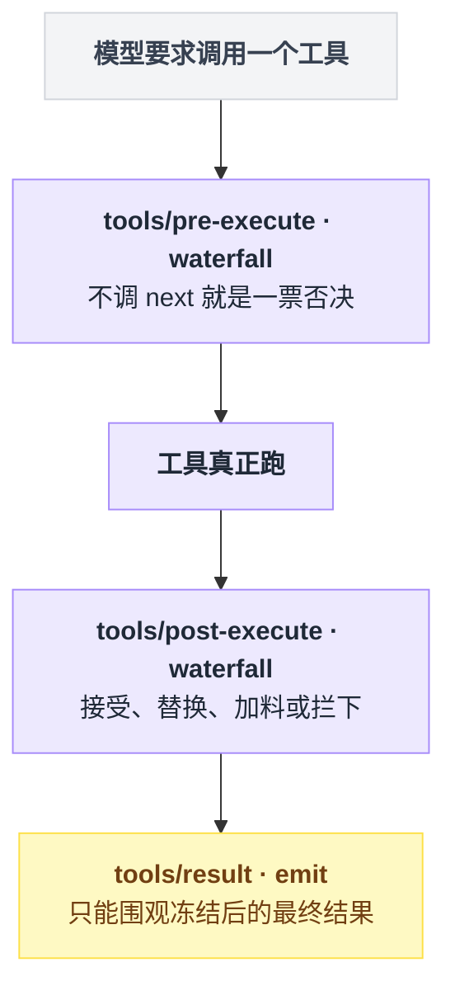
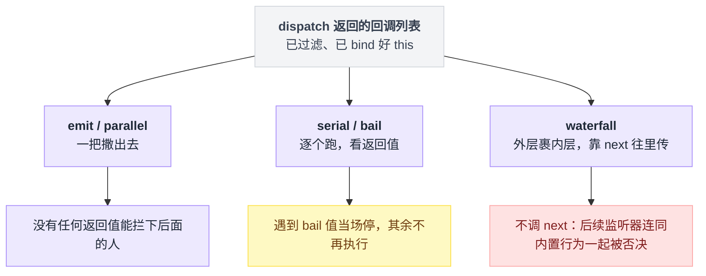
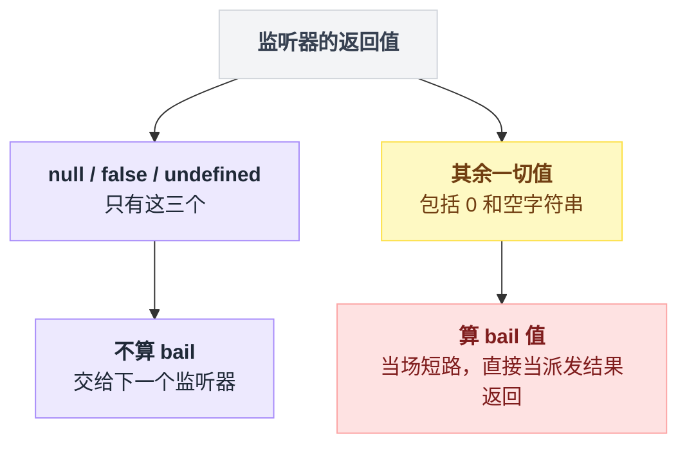
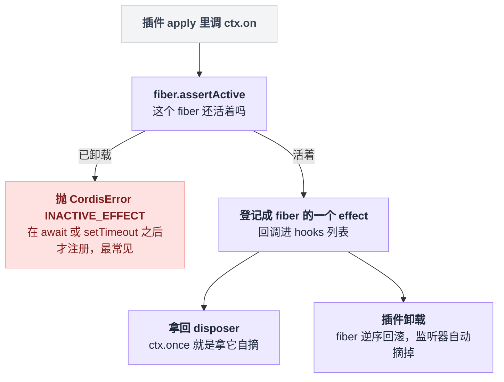
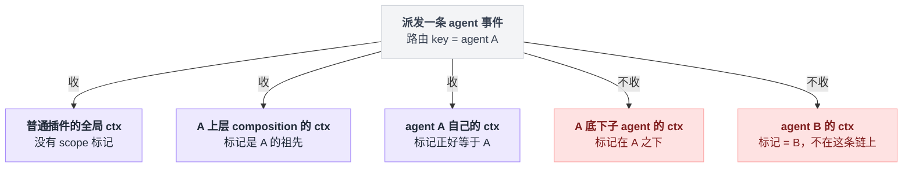
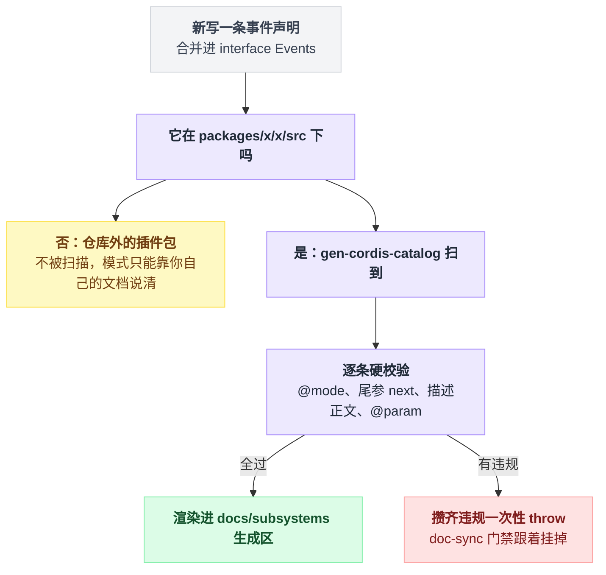

# 10 · 事件是怎么发出去的

> 基于 `deepseek-ai/deepseek-harness` v0.1.0-rc.5（commit `47f9438`），2026-08-14 核对。

前面几章讲的是"东西怎么挂上去"：插件、Service、effect。这一章讲挂上去之后，它们怎么互相说话。

最常见的预设是：事件系统嘛，`on` 和 `emit`，一个订一个发，看一眼 API 就能用。

不是的。Cordis 的事件总线确实只有 352 行（`vendor/cordis/src/events.ts` 一个文件装完），但它有**五种派发模式**，而选错模式的后果不是"写得不够好看"——是**你想要的那个能力，那个扩展点根本不给你**。想拦下一条危险命令，结果挂在了一个只能围观的事件上：代码写完，跑起来不报任何错，命令照常执行。

所以这一章要练的不是背 API，是看一眼事件签名就判断出三件事之一：这里我能观察、能改结果，还是能一票否决。

waterfall 的逐行拆解和全仓拦截点清单归 [11 章](./11-waterfall专章.md)，这里只把它放进五种模式的坐标系里。

## 同一个时刻，三种诉求，三个挂点

假设你要在"工具执行完"这个时刻干点事。同一个时刻，三种常见诉求落在三个完全不同的地方：

| 你想干的事 | 你需要的能力 | 该用的模式 | 对应事件 |
|---|---|---|---|
| 把工具调用记进自己的日志 | 只观察，不影响任何人 | `emit` | `tools/result` |
| 工具报错时替换给模型看的内容 | 拿到结果并能替换 | `waterfall` | `tools/post-execute` |
| 危险命令直接拦下不许跑 | 能不调用后续、自己给出决定 | `waterfall` | `tools/pre-execute` |

三者的模式和语义在声明处逐条对得上。出处：`packages/core/tools/src/index.ts:152`（pre-execute，waterfall）、`:175`（post-execute，waterfall，JSDoc 明写 "Accept, replace, enrich, or block"）、`:197`（result，emit，"Observe the frozen, lossless-JSON final outcome"）。

把这三行摆回工具执行的时间轴，就看得出挂错地方为什么不报错：三个挂点在链路上的位置不同，能碰到的东西也就不同。



**模式是事件契约的一部分，不是调用方的自由选择。** `docs/cordis-primer.md:17` 的原话是 "Every event can have one of the following dispatch mode and can only be dispatched by these methods accordingly"，`:26` 是 "The dispatch mode is part of the event's public contract"。

但"契约"和"强制"要分清。我把 `vendor/cordis/src/events.ts` 全文翻了一遍，没有任何一处运行时检查在问"这个事件是什么模式"：五个派发方法都只是从同一个 `dispatch()` 拿到回调列表，然后各按各的方式调。

真正兜底的是两样东西——签名形状（waterfall 的尾参 `next` 只有 `ctx.waterfall` 会替你填），以及后面第 4 节那套 catalog 门禁。

## 五种模式拿到同一份名单，差别只在谁能让后面的人闭嘴

任何一次派发都先过统一入口 `dispatch()`。它做四件事，其中第 4 步是 dsh 按 agent 分域路由的地基：

```text
dispatch(type, args)    ← emit / parallel / serial / bail / waterfall 都走这里
  1. args[0] 是对象/函数 → 当作 thisArg 摘出来          (events.ts:166)
  2. 摘出事件名                                        (events.ts:167)
  3. 非 internal/ 事件 → 先 emit('internal/dispatch')   (events.ts:168-170)
  4. 按 thisArg 上的 Context.filter 过滤监听器           (events.ts:171-174)
  → 一串已 bind 好 this 的回调
```

入口实现在 `vendor/cordis/src/events.ts:165-175`。五种模式的实现全在 `:183-243` 这一屏里：

| 模式 | 调用形状 | 实现出处 | 派发方 await 监听器吗 | 返回值 | 能挡住其他监听器吗 |
|---|---|---|---|---|---|
| `emit` | `ctx.emit(name, ...args)` | `events.ts:194-196` | 否 | 无 | 不能（但同步 throw 会中断整串） |
| `parallel` | `await ctx.parallel(name, ...args)` | `events.ts:183-187` | 是，全部并发 | `Promise<void>` | 不能 |
| `serial` | `await ctx.serial(name, ...args)` | `events.ts:204-209` | 是，逐个 | 第一个 bail 值 | 能，靠返回非空值短路 |
| `bail` | `ctx.bail(name, ...args)` | `events.ts:217-222` | 否 | 第一个 bail 值 | 能，同上但同步 |
| `waterfall` | `ctx.waterfall(name, ...args, next)` | `events.ts:234-243` | **否**，Cordis 自己不 await | 最外层监听器的返回值 | 能，不调 `next()` 即否决 |

waterfall 那一行容易读反。我第一遍就读成了"waterfall 监听器不能是 async"，实际正好相反：

```
// waterfall 的骨架
函数 waterfall(事件名, ...参数, next):
    回调列表 = dispatch('waterfall', 参数)
    链 = next
    for 回调 in 回调列表 逆序:          // 外层裹内层
        链 = () => 回调(...参数, 链)
    return 链()                        // 只是 return，没有 await

// 派发方那边
结果 = await ctx.waterfall(...)         // await 发生在这里
```

`waterfall()` 的函数体最后只是 `return next()`，异步是靠 `next()` 的返回值一路传回派发方、由派发方去 `await` 的。所以 waterfall 监听器**完全可以**是 async，只是 await 不发生在总线里。出处：`events.ts:242`。

类型声明侧一一对应：`vendor/cordis/src/events.ts:44`（parallel）、`:53`（emit）、`:63`（serial）、`:73`（bail）、`:86`（waterfall）。

五种模式拿到的其实是同一份东西——`dispatch()` 过滤后的回调列表；差别只在一句话：谁有权让后面的人闭嘴。



### "bail 值"有精确定义，而且反直觉

`serial` 和 `bail` 跑的是同一个循环，短路判据也是同一个函数：

```
for 回调 in 回调列表:
    值 = 回调(...参数)              // serial 这里会 await，bail 不会
    if isBailed(值):
        return 值                  // 当场停，后面的一个都不跑
return                             // 全程没人给出 bail 值
```

判据函数在 `vendor/cordis/src/events.ts:13-15`：

```ts
// vendor/cordis/src/events.ts:13
export function isBailed(value: any) {
  return value !== null && value !== false && value !== undefined
}
```

只有 `null` / `false` / `undefined` 三个值算"我不管，交给下一个"。

注意 `0` 和 `''` **算** bail 值，会当场短路。想表达"没意见"就老实返回 `undefined`，别顺手返回 `0`。

这条判据只有一个岔路口，反直觉的地方就在于 0 和空字符串站在哪一边：



### 四个不写出来就会踩的实现细节

**一、`emit` 不 await，也不收集返回值。** 整句就是 `this.dispatch('emit', args).map(cb => cb(...args))`（`events.ts:195`）。监听器里 async 函数返回的 Promise 直接被丢弃，它 reject 了就是一个 unhandled rejection。

**二、`emit` 的同步 throw 会打断后面的监听器**，并且原样抛回派发方——那个 `.map` 没有任何 try/catch。

所以 dsh 里那些"监听器失败会被记录并隔离"的 emit 事件，隔离是 **dsh 自己做的**，不是 Cordis 给的。session store 绕开了 `ctx.emit`：

```
// dsh 自己搭的隔离层，不是 Cordis 的能力
回调列表 = ctx.events.dispatch('emit', 事件名, 载荷)   // 只借 dispatch 拿列表
for 回调 in 回调列表:
    try:
        回调(载荷)
    catch 错误:
        记录并跳过                                    // 一个炸了不影响其余
```

出处：隔离实现在 `packages/core/session/src/index.ts:377-399`，调用点在 `:641-646`。这也是全仓事件总表里 Dispatchers 那列写 `events.dispatch` 而不是 `emit` 的原因。

**三、`parallel` 是唯一会把监听器异常聚合抛回来的模式**：`Promise.allSettled` 之后把所有 rejected 包成 `AggregateError` 抛出（`events.ts:184-186`）。

**四、`parallel` 上报给 `internal/dispatch` 的 type 是 `'emit'`**，不是 `'parallel'`（`events.ts:184` 传的就是 `'emit'`）。写诊断插件监听 `internal/dispatch` 按 mode 分类的话，这里会统计错。

### dsh 实际用了哪几种：两种，外加两个特例

`docs/event-producer-consumer.md` 是全仓事件总表，由 `pnpm run gen-doc-graphs` 生成（`docs/event-producer-consumer.md:1-2`），事件与生产/消费边"resolved from the repository TypeScript Program"（`:76`）。

把表里 56 个 harness 事件的模式数一遍：

| 模式 | 个数 | 说明 |
|---|---|---|
| `emit` | 41 | 绝大多数是通知 |
| `waterfall` | 13 | 所有拦截点，第 11 章逐个讲 |
| `parallel` | 1 | 见下 |
| `serial` | 1 | 见下 |
| `bail` | 0 | harness 侧一次都没用上 |

`bail` 在 harness 侧一次都没用上，但别把"表里是 0"读成"全仓库没人用"。

Cordis 自己内部拿它做 `internal/listener`（`vendor/cordis/src/events.ts:296`），浏览器端的 client 运行时拿它做斜杠命令输入的抢占（例如 `packages/client/ui-input-trigger/src/client/controller.ts:322`）。client 侧那些 `slash/*` 事件对 host 侧的投影不可见，根本进不了这张表（`scripts/gen-cordis-catalog.ts:161-163`）。

写后端插件时，你实际只会遇到 emit 和 waterfall，外加各一个 parallel、serial 的特例。而这两个特例都有反直觉的地方。

`agent/turn-stopping` 是 serial，但它不靠短路做决策。JSDoc 明写 "Data decides, so listener order cannot change the outcome"——监听器通过 `agent.steer(...)` 改状态，机器再回头重读 inbox。出处：JSDoc 在 `packages/core/agent/src/runtime-types.ts:266`，`steer` 在 `:133`，事件声明本身在 `:278`。

`session/flush` 标着 `@mode parallel`，但**生产代码里没有一处 `ctx.parallel('session/flush', …)`**。store 的 `flush()` 自己 `collectSessionCallbacks` 加 `Promise.allSettled`，JSDoc 还专门要求调用方必须走它、不许自己 raw dispatch。全仓唯一那句 `ctx.parallel('session/flush', …)` 在测试契约里。出处：声明在 `packages/core/session/src/index.ts:85`，`flush()` 在 `:1022-1026`，JSDoc 要求在 `:1015`，测试契约在 `packages/session/session-persistence/tests/coordinator-contract.ts:362`。

## `ctx.on`：注册即 effect，卸载不用你管

`ctx.on(name, listener, options?)` 只有 15 行，但每一行都有后果：

```text
ctx.on(name, listener, options)
  ① typeof options !== 'object' → 当成 { prepend: options }        events.ts:289-291
  ② this.ctx.fiber.assertActive()   已卸载的 fiber 上注册 → 抛错     events.ts:294
  ③ listener = this.ctx.reflect.bind(listener)                     events.ts:295
  ④ bail('internal/listener', …) 若有人接管则直接返回它的结果        events.ts:296-297
  ⑤ register(...) → ctx.fiber.effect(...)                          events.ts:254-260
  ⑥ 返回 disposer
```

实现在 `vendor/cordis/src/events.ts:288-302`。

第 ⑤ 步是这一节最值得记的：**监听器是 effect**。

这里的 fiber 是 Cordis 给每个插件实例分配的生命周期单元（全貌见 [05 章](./05-Cordis是什么.md)、[08 章](./08-effect与生命周期.md)）。`register()` 把注册整个包进 `this.ctx.fiber.effect(...)`，插件卸载时 fiber 逆序回滚，监听器自动摘掉。你**永远不需要**为 `removeListener` 做簿记。出处：`vendor/cordis/src/events.ts:256-259`。

返回值是 disposer，想提前摘就调它。`ctx.once` 就是拿这个 disposer 在第一次回调里自摘（`vendor/cordis/src/events.ts:312-318`）。

反过来，**在已卸载的 fiber 上 `ctx.on` 会抛 `CordisError('INACTIVE_EFFECT')`**（`vendor/cordis/src/fiber.ts:351-354`）。最典型的触发方式：你在某个 `setTimeout` 或 `await` 之后才注册监听器，而这期间插件已经被卸载了。

注册、生效、自动摘掉被 fiber 串成一条线，中间那个岔口几乎人人踩过一次：



`options` 传布尔值是 `prepend` 的简写。`{ prepend: true }` 把你插到已注册监听器前面（`register()` 用的是 `unshift`）；`{ global: true }` 让你绕过下面要讲的作用域过滤。出处：布尔简写 `events.ts:289-291`，`unshift` 在 `:255`，`global` 声明在 `:112-117`、生效点是 `:173` 那句 `hook.global ||`。

### 为什么你的监听器可能一条事件都收不到

`dispatch()` 里那句 `filter.call(thisArg, hook.ctx)` 是可选的，只有当派发方传了带 `Context.filter` 的 `thisArg` 时才生效（`vendor/cordis/src/events.ts:171-174`）。

dsh 用这个机制做**按 agent 分域**：`scopeTarget()` 造了一个"载体"对象，它的 filter 规则是三条——

```
函数 filter(监听器所在的 ctx):
    标记 = 监听器所在 ctx 的 scope 标记
    if 没有标记:                       return 收        // 普通插件，全收
    if 标记 == 派发 key 或 是它的祖先:   return 收
    return 不收                                        // 标记在派发 key 之下
```

一句话：事件只向上流，不向下流。出处：`scopeTarget()` 在 `packages/core/scope/src/index.ts:170-185`，无标记全收在 `:176`，等于或祖先在 `:177-178`，"只向上流"这句写得很直白的地方在 `packages/core/scope/src/index.ts:164-165`。

拿一次路由 key 为 agent A 的派发当例子，这三条规则决定了谁在场、谁被跳过：



这就是为什么你会在 dsh 的事件 JSDoc 里反复看到同一句话：`Scope-filtered dispatch (@deepseek-ai/dsh-scope): agent-scoped listeners receive only that agent`（例如 `packages/core/agent/src/runtime-types.ts:156`）。

普通插件注册在全局 context 上，收全部；用 `agent.ctx` 注册的，只收那一个 agent 的——`agent.ctx` 的定义是 "Agent-scoped context; its contributions are agent-local, unwind on disposal"（`packages/core/agent/src/runtime-types.ts:75-76`）。

想让自己的事件也参与分域，签名要写 `this: Scoped<Base>`，并让载荷里恰好带一个能解析成 routing key 的字段。这条由另一个生成器把关：零匹配必须显式写 `@dshScopeScan unsupported`，多匹配直接 fail loud。出处：`scripts/gen-scoped-events.ts:5-10`、`package.json:124` 的 `verify-scoped-events`。

反例仓库里也有明说：`tools/change` 故意**不做**域过滤，因为工具集变化关系到每个 agent 的下一次装配（`packages/core/tools/src/index.ts:198-206`）。

## 声明一个新事件：类型层是 Cordis 的，门禁层是 dsh 自己加的

### 类型层：事件名和签名是"合并"出来的

`ctx.emit` / `ctx.on` 的类型提示从哪来？答案是你在自己的模块里再打开一次 `interface Events`，往里加一行：

```ts
// docs/cordis-tutorial/04-events.md:14
declare module '@deepseek-ai/cordis' {
  interface Context {
    stats: StatsService
  }
  interface Events {
    'stats/report'(name: string, count: number): void
  }
}
```

TypeScript 允许在别处再打开同一个 `interface` 往里加成员，两处声明合并成一个——这个语言特性叫 declaration merging，事件名和签名就是靠它声明的。完整教程示例在 `docs/cordis-tutorial/04-events.md:11-42`。

消费方要看到这个合并，得写 `import type {} from './stats.ts'`。运行时什么都不导入，只是让 TypeScript 看见声明（`docs/cordis-tutorial/04-events.md:65`）。

事件名用 `namespace/action` 格式：生成器拿第一个 `/` 之前的段当 scope，再靠它决定渲染到哪个子系统文档页（`packages/typert/generator/src/cordis-catalog.ts:224`）。

### 仓库层：`@mode` 不是注释，是硬门禁

同一条事件声明，写在仓库里和写在你自己的插件包里，命运完全不同：



只要事件声明在 `packages/x/x/src/**` 下，就会被 `pnpm run gen-cordis-catalog` / `verify-cordis-catalog` 扫到并硬校验；这条要求在 `AGENTS.md:104` 也写死了。出处：扫描范围见 `scripts/gen-cordis-catalog.ts:192`，两个命令见 `package.json:104-105`。

规则全在 `packages/typert/generator/src/cordis-catalog.ts:180-237`：

| 规则 | 违反时的报错 | 出处 |
|---|---|---|
| 必须有 `@mode emit\|bail\|waterfall\|parallel\|serial` | `is missing an @mode tag` | `cordis-catalog.ts:198-201` |
| 有尾参 `next` 却不是 waterfall | `has a trailing 'next' parameter … Fix the tag or the signature` | `cordis-catalog.ts:202-206` |
| 标了 waterfall 却没有尾参 `next` | `tagged '@mode waterfall' but has no trailing 'next' parameter` | `cordis-catalog.ts:207-209` |
| JSDoc 必须有描述正文 | `has no description prose` | `cordis-catalog.ts:210-212` |
| 每个参数都要有非空 `@param`（`this` 与尾参 `next` 豁免） | `is missing @param x` / `has an empty description` | `cordis-catalog.ts:213-220`、`:540-549` |
| 不许用解构参数（`@param` 没法给它起名） | `is a binding pattern` | `cordis-catalog.ts:541-543` |
| 陈旧的 `@param` 名 | `does not match any parameter (stale tag?)` | `cordis-catalog.ts:550-554` |
| 事件的 scope 必须在 `EVENT_SCOPE_PAGE` 里有归属页 | `has no EVENT_SCOPE_PAGE entry` | `scripts/gen-cordis-catalog.ts:165-185`、`:720` |

违规不是警告，是攒齐了一次性 `throw`（`packages/typert/generator/src/cordis-catalog.ts:570-576`）。

这些规则的期望行为在 `packages/typert/generator/tests/cordis-catalog-contract.spec.ts:180-239` 有逐条断言（⚠️ 该 describe 块目前是 `describe.skip`，见 `:127`，所以真正把关的是生成器本身：`verify-cordis-catalog` 挂在 `doc-sync` 门禁里，`scripts/run-gates.ts:585`、`package.json:127`）。

第二、三条规则合起来是**双向**的：标签写 waterfall 而签名没 `next` 报错，签名有 `next` 而标签写别的也报错。换句话说，尾参叫不叫 `next` 是有语义的，别拿 `next` 当普通回调参数名用。

模板直接抄仓库里的真实声明。一个零参数的通知事件长这样：

```ts
// packages/core/tools/src/index.ts:198
/**
 * A tool was registered or unregistered, or a scoped restriction changed
 * (the available tool set changed — possibly for one scope only). An
 * UNFILTERED registry-subject notification, deliberately not scope-filtered
 * dispatch: a global change concerns every agent's next assembly, so a
 * scoped listener subscribing here sees every change, not just its own
 * scope's.
 * @mode emit
 */
'tools/change'(): void
```

出处：`packages/core/tools/src/index.ts:198-207`。

写在仓库外（你自己的插件包）的事件不会被这套生成器扫到，它只走本仓库的 `packages/x/x/src/**`。`docs/user/develop/framework/events.md:87-100` 给插件作者的示例就是不带 `@mode` 的形状。但模式仍然是契约，你还是得在自己的文档里把它说清楚。

## 三类事件域：选域是大多数改动要做的第一个决定

`docs/architecture.md:55-59` 把事件分成三类：

| 域 | 判据 | 事件名长什么样 | 载荷特征 | 典型 |
|---|---|---|---|---|
| **Session events** | 这件事必须活过一次重启 | `SessionEventMap` 里的类型名；Cordis 侧统一走 `session/event` | `(session, event)` | `turn/start`、`tool/call`、`assistant/message` |
| **Agent events** | 观察或拦截"正在进行中的活" | `agent/*` | 载荷里带活的 `Agent` | `agent/pre-step`、`agent/status` |
| **Capability events** | 给某个能力接缝挂策略或适配器，且不想依赖 loop | `fs/*`、`tools/*`、`session-telemetry/*` 等 | 该能力自己的对象 | `tools/pre-execute`、`fs/write-intent` |

第三行有个小出入：`docs/architecture.md:59` 里写的 scope 是 `telemetry/*`，仓库里真实存在的叫 `session-telemetry`（见 `scripts/gen-cordis-catalog.ts:182` 与总表里的 `session-telemetry/record`）。以代码为准。

### session events 是两层，别搞混

这是最容易绊倒新人的地方，官方文档专门写了一段（`docs/user/develop/framework/events.md:102-106`）：

```text
  持久层：SessionEventMap 的 44 个事件类型
          turn/start  turn/end  step/start  step/end  tool/call  tool/result
          assistant/chunk  user/message  compaction/*  hook/*  …
          （全表见 packages/core/session/src/known-event-types.ts:20-63）
                 │  每追加一条，就
                 ▼
  Cordis 层：'session/event'  —— 只有这一个 Cordis 事件
```

`turn/start` **不是** Cordis 事件。`ctx.on` 的签名是 `on<K extends keyof Events>`（`vendor/cordis/src/events.ts:97`），`'turn/start'` 不在 `Events` 里，TypeScript 会先拦下你；就算绕过类型，运行时也一个回调都收不到。

正确姿势是监听 `session/event` 再看 `event.type`。仓库里的真实写法：

```ts
// examples/acp-agent/tests/fixtures/subagent-durability-failure.ts:76
ctx.on('session/event', (session, event) => {
  if (session.header.parentSession !== undefined || event.type !== 'turn/end') return
  if (event.data.turn !== 1) return
  parentClosed = true
  parentTurnClosed.resolve(undefined)
})
```

出处：`examples/acp-agent/tests/fixtures/subagent-durability-failure.ts:76-81`。

Cordis 层的 `session/*` 一共只有四个，别被前缀骗了——另有三个以 `session/` 开头的名字根本不是 Cordis 事件：

| 名字 | 是什么 | 模式 |
|---|---|---|
| `session/created` | Cordis 事件 | emit |
| `session/disposed` | Cordis 事件 | emit |
| `session/event` | Cordis 事件 | emit |
| `session/flush` | Cordis 事件 | parallel |
| `session/end-seed` | 持久事件类型 | — |
| `session/title` | 持久事件类型 | — |
| `session/title-llm-request` | 持久事件类型 | — |

出处：四个 Cordis 事件声明在 `packages/core/session/src/index.ts:42-86`；三个持久事件类型在 `packages/core/session/src/known-event-types.ts:45-47`。

### 选域只要问两个问题

```text
这条信息重载会话后还得存在吗？
├─ 是 → Session event：扩展 SessionEventMap，从日志投影
│        （"模型可见 ⟺ 已落日志"是运行时不变量，docs/architecture.md:96）
└─ 否 → 我要碰的是一次正在跑的 agent 工作吗？
        ├─ 是 → Agent event（agent/*，载荷带 Agent）
        └─ 否 → Capability event：挂到那个能力自己的接缝上
```

一个完整的 capability 域监听器长这样：挂在遥测记录的 waterfall 上，把结果拿回来改一遍再交出去。

```ts
// examples/headless-agent/tests/fixtures/telemetry-redact-rule.ts:21
export const name = 'telemetry-redact-rule'

export function apply(ctx: Context): void {
  ctx.on('session-telemetry/record', (_record, next) => {
    const record = next()
    return { ...record, body: scrub(record.body) }
  })
}
```

原文照抄，省略了 `scrub` 辅助函数与一行 JSDoc，见 `examples/headless-agent/tests/fixtures/telemetry-redact-rule.ts:12-29`。

挂载方式和普通插件一模一样，`cordis.yml` 里一行（`examples/headless-agent/tests/fixtures/session-telemetry-otel.cordis.yml:16-17`）：

```yaml
- id: telemetry-redact-rule
  name: './telemetry-redact-rule.ts'
```

## 想查一个事件，该看哪份文档

| 你想查 | 看哪份 | 备注 |
|---|---|---|
| 全仓每个事件的模式、谁派发、谁监听 | `docs/event-producer-consumer.md` | 生成物，56 个 harness 事件一张表 |
| 某个事件的完整签名和逐参数说明 | `docs/subsystems/<子系统>.md` 的生成区 | 小标题形如 "`tools/execute` — waterfall"（例如 `docs/subsystems/tools.md:630`） |
| 派发方法本身的 API | `docs/cordis-api/events.md` | 由 `scripts/gen-cordis-catalog.ts` 从 `vendor/cordis/src/events.ts` 的 JSDoc 生成（见该文件 `:1-2`） |
| 哪个 scope 归哪个文档页 | `scripts/gen-cordis-catalog.ts:165-185` 的 `EVENT_SCOPE_PAGE` | 19 个 scope |

这些生成区里嵌了 `file:line` 指针，于是有个很烦人的连带效应：**在被记录的符号上方插入几行代码，就会让已提交的文档过期。** 报错长得像快照回归，其实只是忘了重新生成（`scripts/gen-cordis-catalog.ts:12-17`）。

## 把这一章串起来

每条结论都能从前面的某一节重新推出来，推不出来就回去重读那一节：

- **模式是事件契约的一部分**——同一个"工具执行完"的时刻，emit 只能围观、waterfall 能改能拦，你的能力上限在事件声明处就定死了；
- 但总线**不在运行时检查模式**——五个派发方法拿到的是同一份 `dispatch()` 过滤后的回调列表，差别只在谁有权让后面的人闭嘴，兜底靠签名形状和 catalog 门禁；
- **bail 判据只认 `null` / `false` / `undefined` 三个值**——`0` 和 `''` 会当场短路，"没意见"必须返回 `undefined`；
- **emit 的隔离是 dsh 自己搭的**——Cordis 的 `emit` 既不 await 也不 try/catch，"一个监听器炸了不影响其余"是 session store 借 `dispatch` 自己实现的；
- **监听器是 effect**——注册挂在 fiber 上，卸载自动摘，代价是 await 之后再注册会撞上 `INACTIVE_EFFECT`；
- **事件只向上流，不向下流**——agent 分域靠 `Context.filter`，你的监听器一条都收不到时，先看它注册在哪个 ctx 上；
- **`turn/start` 不是 Cordis 事件**——持久层 44 个类型全部汇入 `session/event` 这一个 Cordis 事件，监听它再看 `event.type`；
- **`@mode` 在仓库内是硬门禁**——写错了不是文档难看，是 `verify-cordis-catalog` 直接 throw，doc-sync 门禁挂掉。

选错不会报错，只会静静地什么都不发生——所以先看 `@mode`，再决定挂不挂。

> 想知道这一点上 Pi / Codex / LangChain 怎么做，见 [五个 agent 系统源码解剖](../2026-08_五个agent系统源码解剖/00-总览与阅读指南.md)。
