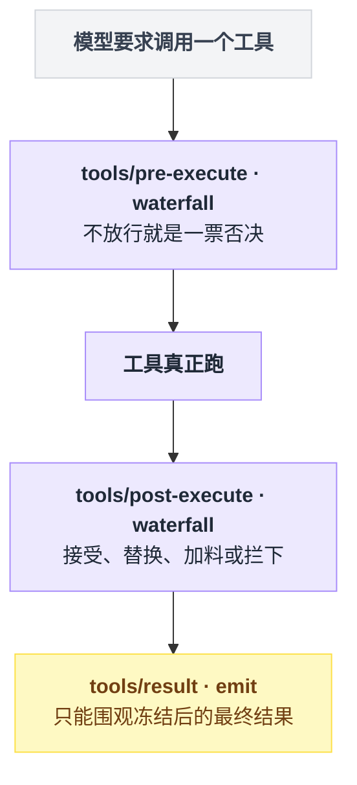
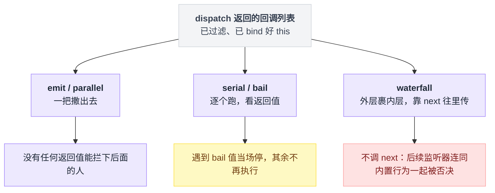
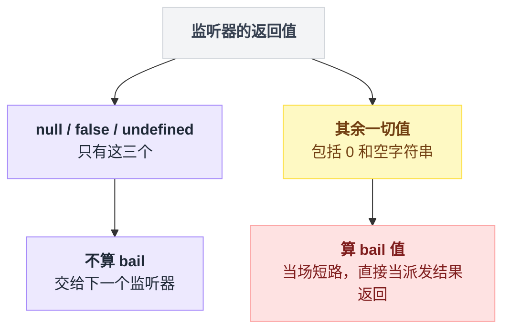
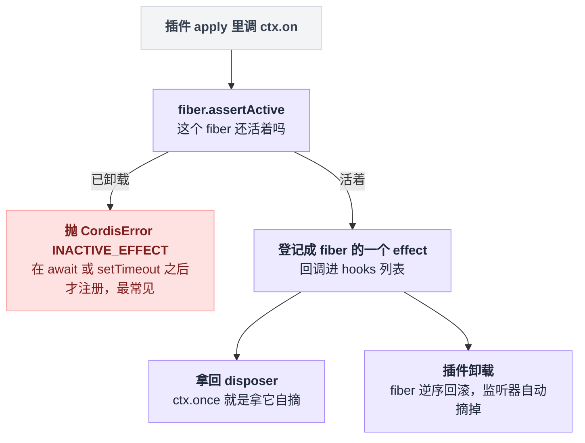
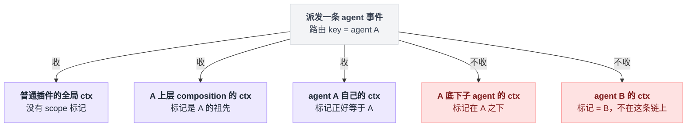
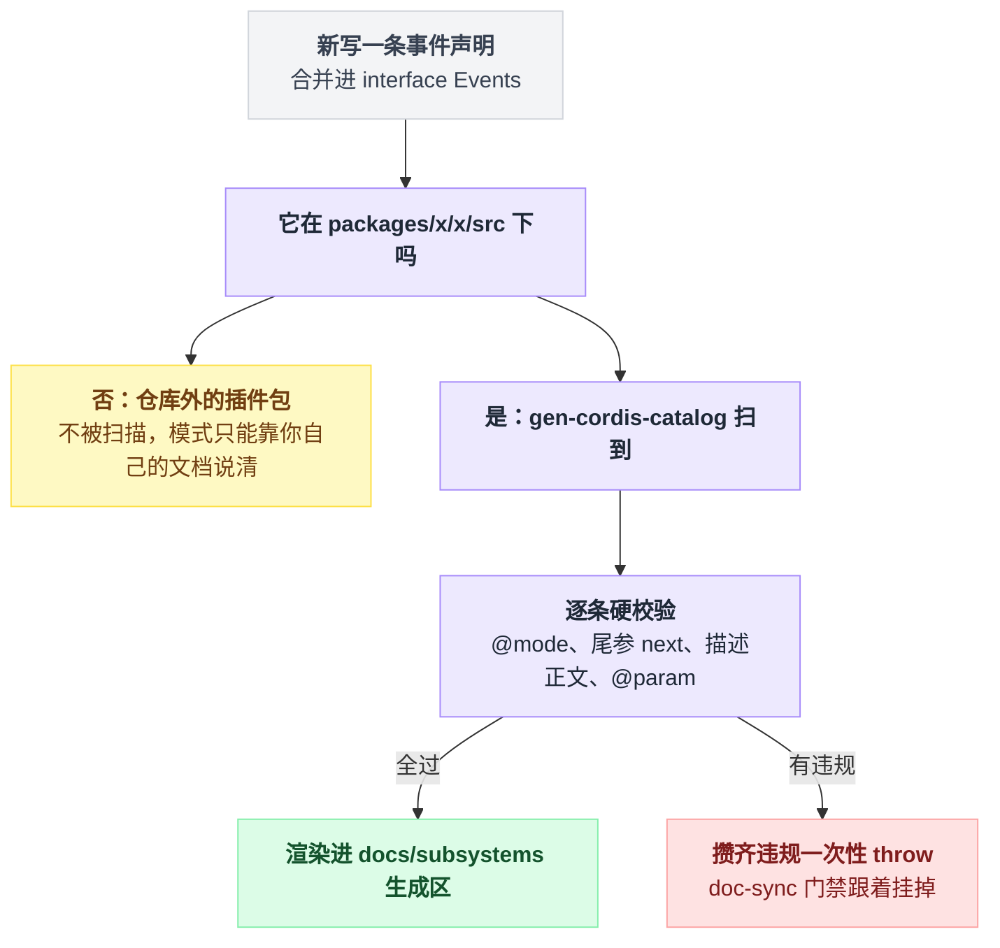

# 10 · 事件是怎么发出去的

> 基于 `deepseek-ai/deepseek-harness` v0.1.0-rc.5（commit `47f9438`），2026-08-14 核对。正文只讲机制；可照抄的代码统一收在文末[附录](#附录可以照抄的模板)，出处收在[脚注](#出处)，点角标可跳转。

前面几章讲的是"东西怎么挂上去"：插件、Service、effect。这一章讲挂上去之后，它们怎么互相说话。

最常见的预设是：事件系统嘛，一个订一个发，看一眼 API 就能用。

不是的。这套事件总线的全部实现只有 352 行[^1]，但它有**五种派发模式**，而选错模式的后果不是"写得不够好看"——是**你想要的那个能力，那个扩展点根本不给你**。想拦下一条危险命令，结果挂在了一个只能围观的事件上：代码写完，跑起来不报任何错，命令照常执行。

所以这一章要练的不是背 API，是看一眼事件声明就判断出三件事之一：这里我能观察、能改结果，还是能一票否决。

waterfall 的逐行拆解和全仓拦截点清单归 [11 章](./11-waterfall专章.md)，这里只把它放进五种模式的坐标系里。

## 同一个时刻，三种诉求，三个挂点

假设你要在"工具执行完"这个时刻干点事。同一个时刻，三种常见诉求落在三个完全不同的地方[^2]：

| 你想干的事 | 你需要的能力 | 该用的模式 | 对应事件 |
|---|---|---|---|
| 把工具调用记进自己的日志 | 只观察，不影响任何人 | emit | `tools/result` |
| 工具报错时替换给模型看的内容 | 拿到结果并能替换 | waterfall | `tools/post-execute` |
| 危险命令直接拦下不许跑 | 能不放行、自己给出决定 | waterfall | `tools/pre-execute` |

把这三行摆回工具执行的时间轴，就看得出挂错地方为什么不报错：三个挂点在链路上的位置不同，能碰到的东西也就不同。挂在最后一个点上的监听器，看到的是已经定案的结果——命令早就跑完了，它自然什么也拦不住。



**模式是事件契约的一部分，不是调用方的自由选择。** 官方入门文档的原话是：每个事件只能有一种派发模式，并且只能用对应的方法去派发；模式属于事件的公开契约[^3]。

但"契约"和"强制"要分清。我把总线那 352 行翻了一遍，没有任何一处运行时检查在问"这个事件是什么模式"：五个派发方法都只是从同一个统一入口拿到回调名单，然后各按各的方式调[^1]。

真正兜底的是两样东西——签名的形状（waterfall 事件的签名尾巴上多一个"放行开关"，只有对应的派发方法会替你填上它），以及后面要讲的目录门禁。

## 五种模式拿到同一份名单，差别只在谁能让后面的人闭嘴

任何一次派发都先过同一道统一入口，它做四件事[^4]：看看第一个参数是不是"载体"对象（是就摘出来当过滤依据）；摘出事件名；只要不是内部事件，先广播一声"有一次派发发生了"（给诊断工具用的）；最后按载体上的过滤规则筛掉不该收的监听器。出来的就是一份处理好的回调名单。

五种模式拿到的是同一份名单，之后各走各的路[^5]：

| 模式 | 派发方等监听器跑完吗 | 派发方拿到什么 | 能不能拦住后面的人 |
|---|---|---|---|
| emit | 不等 | 什么都拿不到 | 不能（但同步抛错会打断整串） |
| parallel | 等，全部一起跑 | 只知道"都结束了" | 不能 |
| serial | 等，一个接一个跑 | 第一个 bail 值 | 能——谁先给出 bail 值谁定局 |
| bail | 不等（serial 的同步版） | 第一个 bail 值 | 能，同上 |
| waterfall | 总线自己不等，让派发方去等 | 最外层监听器的返回值 | 能——不放行就是否决 |

waterfall 那一行容易读反。我第一遍就读成了"waterfall 监听器不能是异步的"，实际正好相反。

它的工作方式像俄罗斯套娃：总线把监听器从外到内一层层套好——先注册的裹在最外层，最里层裹着系统的内置行为。套完之后总线只做一件事：点一下最外面那层，把它交出来的东西**原样**递给派发方。这个"东西"可能是现成的结果，也可能是一张"稍后兑现"的欠条；总线不管，兑现欠条是派发方的事[^6]。

所以 waterfall 监听器**完全可以**是异步的——只是那次等待发生在派发方那头，不发生在总线里。



### "bail 值"有精确定义，而且反直觉

serial 和 bail 跑的是同一个流程：拿着名单一个个问过去，谁给出了"bail 值"就当场收工，把这个值当作整次派发的结果；全程没人表态就空手而归。

那什么算"表态"？判据只有一条，而且是从反面定义的[^7]：**只有三种返回值算"我不管，交给下一个"——空（null）、假（false）、什么都不返回（undefined）。其余一切都算表态。**

反直觉的地方在于数字零和空字符串站在哪一边：它们不空、不假、也确实被返回了，所以**算表态**，会当场短路。想说"没意见"就老实什么都别返回，别顺手把一个恰好等于零的计算结果递出去——那等于抢了话筒。



### 四个不写出来就会踩的实现细节

**一、emit 发完就走，不等、也不收。** 它的实现就是把名单上的回调挨个调用一遍，仅此而已[^8]。异步监听器许下的"稍后兑现"被直接丢在地上——它失败了，就是一条没人认领的错误，静静躺在进程角落里。

**二、但同步抛错会拦腰打断。** 那一圈调用外面没有任何保护网：第三个监听器同步炸了，第四个以后的一个都轮不到，错误原样砸回派发方脸上。

于是 dsh 里那些"监听器失败会被记录并隔离"的通知事件，隔离是 **dsh 自己搭的**，不是总线给的。会话存储层压根没走总线的广播方法，只找总线借了一份名单，然后自己一个个稳妥地调：谁炸了就记下来、跳过，不连累别人[^9]。这也是全仓事件总表里，那几个事件的"派发方"一栏写法与众不同的原因——它们没走正门。

**三、parallel 是唯一有兜底的模式。** 它等所有监听器跑完，把失败的收集起来打包成一个聚合错误抛回来——至少你知道出过事[^10]。

**四、parallel 在诊断口自称 emit。** 每次派发前那声"有一次派发发生了"的内部广播里，parallel 报上去的模式名写的是 emit[^10]。写诊断插件按模式分类统计的话，这里会统计错。

### dsh 实际用了哪几种：两种，外加两个特例

仓库里有一张自动生成的全仓事件总表，事件和"谁派发、谁监听"的关系直接从代码里解析出来[^11]。把表里 56 个 harness 事件的模式数一遍：

| 模式 | 个数 | 说明 |
|---|---|---|
| emit | 41 | 绝大多数是通知 |
| waterfall | 13 | 所有拦截点，第 11 章逐个讲 |
| parallel | 1 | 见下 |
| serial | 1 | 见下 |
| bail | 0 | harness 侧一次都没用上 |

bail 那行是零，但别读成"全仓库没人用"。它在两个统计表照不到的角落各上了一次岗：总线自己内部用它实现"注册动作可以被人接管"的钩子；浏览器那一端用它处理斜杠命令的输入抢占——谁先认领这条输入，后面的人就不用看了。前者是内部事件，后者只活在浏览器端，而那张表只统计主进程这一侧，所以两处都进不了表[^12]。

写后端插件时，你实际只会遇到 emit 和 waterfall，外加各一个 parallel、serial 的特例。这两个特例都值得单独讲一句，因为都反直觉。

serial 的那一个，是上一章见过的"我要停了"广播。它虽然按顺序一个个问，却**不靠谁先抢答来定结果**——设计者在注释里写了一句话："数据说了算，监听器的顺序改变不了结局。"监听器不是靠返回值投票，而是把想说的话塞回收件箱；机器广播完回头看一眼收件箱，有货就继续跑。所以你的插件排第几个无所谓[^13]。

parallel 的那一个是刷盘。它更有意思：事件声明上标着 parallel 模式，可生产代码里**没有任何一处**按 parallel 的方式派发过它。存储层自己写了一套"收集全部回调、全部跑完、失败的记下来"的流程，注释里还明确要求：想刷盘就调我这个方法，不许自己直接广播。全仓唯一一次按 parallel 派发这个事件的代码，在测试的契约文件里——它存在的意义就是把这个约定钉死[^14]。

## 注册监听器：挂上去就归框架管

注册的那一刻，总线替你做了六件事[^15]：

1. 选项传的是布尔值？当成"要不要插队"的简写。
2. 查一下你所在的插件还活着吗——已经卸载了就当场抛错，不让你注册。
3. 给监听器裹一层外衣，让它今后以你的插件的身份执行。
4. 广播一声"有人要注册了"，若有插件接管了这次注册，到此为止。
5. 把这次注册**登记成你的插件的一个 effect**。
6. 交回一张退订票。

第 5 步是这一节最值得记的：**监听器是 effect**。

fiber 是框架给每个插件实例分配的生命周期单元（全貌见 [05 章](./05-Cordis是什么.md)、[08 章](./08-effect与生命周期.md)）。注册被登记进 fiber 的清单，插件卸载时清单逆序回滚，监听器自动摘掉[^15]。你**永远不需要**自己记着退订。

那张退订票想提前用就用。"只听一次"的注册方式，内部就是拿这张票在第一次回调里给自己退订[^16]。

反过来，**在已卸载的插件上注册会当场抛错**[^17]。最典型的触发方式：你在一个定时器或一次异步等待之后才注册监听器，而这期间插件已经被卸载了——排队买票的功夫，售票处关门了。



选项里还有两个开关[^18]：一个是"插队"，把你排到已注册监听器的前面；一个是"全局"，让你绕开下面要讲的作用域过滤。

### 为什么你的监听器可能一条事件都收不到

统一入口的第四步——按载体过滤——是可选的：只有派发方带着"载体"来，过滤才发生[^4]。

dsh 用这个机制做**按 agent 分域**。派发一条 agent 事件时带上载体，载体核对每个监听器的方式只有三条规则[^19]：

1. 监听器注册时所在的环境**没有**作用域标记？收。普通插件都是这种，全收。
2. 有标记，且标记正好是这次派发的目标 agent，或者是它的**上级**？收。
3. 其余情况——标记在目标 agent 的**下级**，或者压根在另一条链上？不收。

一句话：**事件只向上流，不向下流**——这句话在源码注释里写得很直白[^19]。子 agent 的动静，上级和全局都看得见；反过来，上级的动静不会灌进子 agent 的耳朵，隔壁 agent 更是两不相闻。



这就是为什么 dsh 的事件注释里反复出现同一句话：分域派发之下，agent 作用域里的监听器只收到自己那个 agent 的事件[^20]。你的监听器一条都收不到时，第一件事不是怀疑事件没发，而是看看自己注册在哪个环境上。

想让自己的事件也参与分域，要按约定写签名，并让载荷里恰好带一个能解析出路由目标的字段。这条也有生成器把关：解析不出来必须显式声明"我不支持分域"，能解析出多个则直接报错[^21]。

反例仓库里也有明说：工具集变化那个事件**故意不做**分域，因为工具集一变，关系到每个 agent 的下一次装配，谁都该知道[^22]。

## 声明一个新事件：类型层是语言特性，门禁层是 dsh 自己加的

### 类型层：事件名和签名是"合并"出来的

新事件的名字和签名是怎么进系统的？答案藏在 TypeScript 的一个语言特性里：同一个接口可以在不同文件里分开声明，编译器把它们**合并**成一个。这个特性叫 declaration merging。你在自己的模块里"再打开一次"全局事件表，往里添一行，你的事件名就进了词汇表，从此到处都有类型提示[^23]。

有一个容易忘的配套动作：消费方得写一行"空导入"——运行时什么都不导入，纯粹是让编译器看见你那份声明[^23]。忘了写，类型提示就是查无此名。

事件名里那道斜杠不是装饰：斜杠前面的段叫 scope，文档生成器靠它决定这个事件归进哪一页[^24]。

具体怎么写，照抄[附录 A](#a-声明一个新事件)。

### 仓库层：模式标签不是注释，是硬门禁

同一条事件声明，写在仓库里和写在你自己的插件包里，命运完全不同：



只要事件声明在仓库的源码目录下，就会被目录生成器扫到并逐条硬校验，这条要求在仓库的贡献指南里也写死了[^25]。规则一共八条，全是"注释必须说清楚自己"这个思路的落地[^26]：

| 规则 | 想防的是什么 |
|---|---|
| 必须标注派发模式，五选一 | 没有模式，读者判断不了自己有多大话语权 |
| 签名带"放行开关"却没标 waterfall；或标了 waterfall 却没带 | 标签和签名互相说谎——这条是双向的，尾参的名字有语义，别拿它当普通参数名用 |
| 注释必须有描述正文 | 只有标签没有人话 |
| 每个参数都要有非空说明 | 少一个都点名 |
| 不许用解构参数 | 参数没有名字，说明就没处挂 |
| 参数说明的名字必须真实存在 | 改了签名忘了改说明的"陈旧标签" |
| 事件的 scope 必须有归属的文档页 | 新 scope 忘了登记，文档没地方放 |

违规不是警告：生成器把全部违规攒齐，一次性罢工，连带文档同步门禁一起挂掉[^27]。

这些规则本来有一份逐条断言的契约测试，但那组测试目前整块被跳过；真正把关的是生成器本身[^28]。

写事件注释时不用背规则，照抄[附录 B](#b-一个合格的事件声明模板)那个仓库里的真实声明就够了。写在仓库外（你自己的插件包）的事件不会被扫到[^30]，但模式仍然是契约——你得在自己的文档里把它说清楚。

## 三类事件域：选域是大多数改动要做的第一个决定

官方架构文档把事件分成三类[^31]：

| 域 | 判据 | 事件名长什么样 | 载荷特征 | 典型 |
|---|---|---|---|---|
| **Session events** | 这件事必须活过一次重启 | 持久事件类型名；总线侧统一走 `session/event` | 会话 + 事件 | `turn/start`、`tool/call`、`assistant/message` |
| **Agent events** | 观察或拦截"正在进行中的活" | `agent/*` | 载荷里带活的 Agent | `agent/pre-step`、`agent/status` |
| **Capability events** | 给某个能力接缝挂策略或适配器，且不想依赖 loop | `fs/*`、`tools/*` 等 | 该能力自己的对象 | `tools/pre-execute`、`fs/write-intent` |

第三行有个小出入：架构文档里写的遥测域名字，和仓库里真实存在的名字对不上，以代码为准[^31]。

### session events 是两层，别搞混

这是最容易绊倒新人的地方，官方文档专门写了一段[^32]。持久层有 44 种事件类型——开轮、收轮、工具调用、模型逐字输出……每往会话日志里追加一条，总线上就响一声。但**响的永远是同一个铃**：

```text
  持久层：44 个持久事件类型
          turn/start  turn/end  step/start  step/end  tool/call  tool/result
          assistant/chunk  user/message  compaction/*  hook/*  …
                 │  每往日志追加一条，就
                 ▼
  总线层：session/event  —— 只有这一个总线事件
```

所以 `turn/start` **不是**总线上的事件。总线的注册方法在类型上只认词汇表里的名字，这个名字不在其中——编译器会先拦下你[^33]；就算硬绕过类型，运行时也一个回调都收不到，因为从来没有人摇过这个名字的铃。

正确姿势：监听 `session/event` 这一个铃，在回调里看拿到的事件是哪一种类型。真实写法照抄[附录 C](#c-监听会话事件)。

还有个前缀陷阱：总线层以 `session/` 开头的事件一共只有四个，另有三个同样以它开头的名字，其实是持久层的事件类型，根本不在总线上[^35]：

| 名字 | 是什么 | 模式 |
|---|---|---|
| `session/created` | 总线事件 | emit |
| `session/disposed` | 总线事件 | emit |
| `session/event` | 总线事件 | emit |
| `session/flush` | 总线事件 | parallel |
| `session/end-seed` | 持久事件类型 | — |
| `session/title` | 持久事件类型 | — |
| `session/title-llm-request` | 持久事件类型 | — |

### 选域只要问两个问题

"模型可见就等于已落日志"是这套系统的运行时不变量[^36]，选域的判断从它出发：

```text
这条信息重载会话后还得存在吗？
├─ 是 → Session event：扩展持久事件表，从日志投影
└─ 否 → 我要碰的是一次正在跑的 agent 工作吗？
        ├─ 是 → Agent event（agent/*，载荷带 Agent）
        └─ 否 → Capability event：挂到那个能力自己的接缝上
```

第三类（capability 域）的完整例子在[附录 D](#d-一个完整的-waterfall-监听器插件)：一个挂在遥测记录拦截点上的插件，把记录拿回来抹掉敏感内容再交出去，连挂载配置一共二十来行[^37]。

## 想查一个事件，该看哪份文档

| 你想查 | 看哪份 | 备注 |
|---|---|---|
| 全仓每个事件的模式、谁派发、谁监听 | 事件总表 | 生成物，56 个 harness 事件一张表[^11] |
| 某个事件的完整签名和逐参数说明 | 对应子系统文档的生成区 | 小标题里直接标着模式[^38] |
| 派发方法本身的 API | 事件 API 文档 | 从总线源码的注释生成[^38] |
| 哪个 scope 归哪个文档页 | 生成脚本里的归属表 | 19 个 scope[^38] |

这些生成区里嵌着指向源码行号的指针，于是有个很烦人的连带效应：**在被记录的符号上方插入几行代码，就会让已提交的文档过期**。报错长得像快照回归，其实只是忘了重新生成[^39]。

## 把这一章串起来

每条结论都能从前面的某一节重新推出来，推不出来就回去重读那一节：

- **模式是事件契约的一部分**——同一个"工具执行完"的时刻，emit 只能围观、waterfall 能改能拦，你的能力上限在事件声明处就定死了；
- 但总线**不在运行时检查模式**——五个派发方法拿到的是同一份过滤后的名单，差别只在谁有权让后面的人闭嘴，兜底靠签名形状和目录门禁；
- **bail 判据只认空、假、什么都不返回这三种**——数字零和空字符串会当场短路，"没意见"就什么都别返回；
- **emit 的隔离是 dsh 自己搭的**——总线的广播既不等待也不兜底，"一个监听器炸了不影响其余"是存储层借名单自己实现的；
- **监听器是 effect**——注册挂在插件的生命周期上，卸载自动摘，代价是异步等待之后再注册会撞上"插件已卸载"的报错；
- **事件只向上流，不向下流**——你的监听器一条都收不到时，先看它注册在哪个环境上；
- **`turn/start` 不是总线事件**——持久层 44 种类型摇的是 `session/event` 这同一个铃，监听它再看类型；
- **模式标签在仓库内是硬门禁**——写错了不是文档难看，是生成器直接罢工、文档门禁跟着挂掉。

选错不会报错，只会静静地什么都不发生——所以先看事件声明上的模式，再决定挂不挂。

> 想知道这一点上 Pi / Codex / LangChain 怎么做，见 [五个 agent 系统源码解剖](../2026-08_五个agent系统源码解剖/00-总览与阅读指南.md)。

---

## 附录：可以照抄的模板

### A. 声明一个新事件

再打开一次全局事件表，把自己的事件名添进去[^23]：

```ts
// docs/cordis-tutorial/04-events.md:14
declare module '@deepseek-ai/cordis' {
  interface Context {
    stats: StatsService
  }
  interface Events {
    'stats/report'(name: string, count: number): void
  }
}
```

消费方的那行空导入[^23]：

```ts
import type {} from './stats.ts'
```

### B. 一个合格的事件声明模板

仓库里的真实声明，八条门禁规则全过[^29]：

```ts
// packages/core/tools/src/index.ts:198
/**
 * A tool was registered or unregistered, or a scoped restriction changed
 * (the available tool set changed — possibly for one scope only). An
 * UNFILTERED registry-subject notification, deliberately not scope-filtered
 * dispatch: a global change concerns every agent's next assembly, so a
 * scoped listener subscribing here sees every change, not just its own
 * scope's.
 * @mode emit
 */
'tools/change'(): void
```

### C. 监听会话事件

监听 `session/event` 这一个铃，回调里看事件类型[^34]：

```ts
// examples/acp-agent/tests/fixtures/subagent-durability-failure.ts:76
ctx.on('session/event', (session, event) => {
  if (session.header.parentSession !== undefined || event.type !== 'turn/end') return
  if (event.data.turn !== 1) return
  parentClosed = true
  parentTurnClosed.resolve(undefined)
})
```

### D. 一个完整的 waterfall 监听器插件

挂在遥测记录的拦截点上，先放行拿到记录，改一遍再交出去[^37]：

```ts
// examples/headless-agent/tests/fixtures/telemetry-redact-rule.ts:21
export const name = 'telemetry-redact-rule'

export function apply(ctx: Context): void {
  ctx.on('session-telemetry/record', (_record, next) => {
    const record = next()
    return { ...record, body: scrub(record.body) }
  })
}
```

原文照抄，只省略了抹除函数本体和一行注释。挂载方式和普通插件一模一样，配置里一行[^37]：

```yaml
- id: telemetry-redact-rule
  name: './telemetry-redact-rule.ts'
```

---

## 出处

[^1]: 总线全文：`vendor/cordis/src/events.ts`，共 352 行。五个派发方法（emit / parallel / serial / bail / waterfall）都从同一个 `dispatch()` 拿回调列表，全文无任何一处运行时模式检查。
[^2]: 三个挂点的声明与模式：`packages/core/tools/src/index.ts:152`（pre-execute，waterfall）、`:175`（post-execute，waterfall，JSDoc 明写 "Accept, replace, enrich, or block"）、`:197`（result，emit，"Observe the frozen, lossless-JSON final outcome"）。
[^3]: `docs/cordis-primer.md:17`："Every event can have one of the following dispatch mode and can only be dispatched by these methods accordingly"；`:26`："The dispatch mode is part of the event's public contract"。
[^4]: 统一入口 `dispatch()`：`vendor/cordis/src/events.ts:165-175`。载体摘取在 `:166`，事件名在 `:167`，`internal/dispatch` 前置广播在 `:168-170`，按 `Context.filter` 过滤（可选，仅派发方传载体时生效）在 `:171-174`。
[^5]: 五种模式的实现：parallel `events.ts:183-187`、emit `:194-196`、serial `:204-209`、bail `:217-222`、waterfall `:234-243`。类型声明侧一一对应：`:44`（parallel）、`:53`（emit）、`:63`（serial）、`:73`（bail）、`:86`（waterfall）。
[^6]: waterfall 函数体最后一句只是 `return next()`、不 await，等待发生在派发方：`events.ts:242`。
[^7]: 判据函数 `isBailed()`：`vendor/cordis/src/events.ts:13-15`，原文即 "value !== null && value !== false && value !== undefined"。serial 与 bail 共用同一循环，见 `:204-209`、`:217-222`。
[^8]: emit 的实现整句就是对回调列表的一次 `map` 调用，无 try/catch：`events.ts:195`。
[^9]: 会话存储层的隔离实现：`packages/core/session/src/index.ts:377-399`，调用点在 `:641-646`。它只借 `events.dispatch` 拿名单、不走 `ctx.emit`，事件总表里 Dispatchers 一栏因此写作 `events.dispatch`。
[^10]: parallel 用 `Promise.allSettled` 聚合、把失败包成 `AggregateError` 抛出：`events.ts:184-186`；它上报给 `internal/dispatch` 的模式名传的是 `'emit'`：`events.ts:184`。
[^11]: 全仓事件总表 `docs/event-producer-consumer.md`：生成命令（`pnpm run gen-doc-graphs`）见 `:1-2`，事件与生产/消费边 "resolved from the repository TypeScript Program" 见 `:76`。
[^12]: Cordis 内部用 bail 做 `internal/listener`：`vendor/cordis/src/events.ts:296`。浏览器端斜杠命令抢占：`packages/client/ui-input-trigger/src/client/controller.ts:322`。client 侧 `slash/*` 事件进不了总表：`scripts/gen-cordis-catalog.ts:161-163`。
[^13]: "我要停了"广播 `agent/turn-stopping`：JSDoc "Data decides, so listener order cannot change the outcome" 在 `packages/core/agent/src/runtime-types.ts:266`，塞回收件箱的 `steer` 在 `:133`，事件声明在 `:278`。
[^14]: 刷盘事件 `session/flush`：声明在 `packages/core/session/src/index.ts:85`；`flush()` 自己收集回调加 `Promise.allSettled` 在 `:1022-1026`；"调用方必须走 `flush()`、不许自己派发"的注释要求在 `:1015`；全仓唯一一次按 parallel 派发在测试契约 `packages/session/session-persistence/tests/coordinator-contract.ts:362`。
[^15]: `ctx.on` 实现：`vendor/cordis/src/events.ts:288-302`。布尔简写在 `:289-291`，活性检查在 `:294`，身份外衣在 `:295`，注册接管钩子在 `:296-297`，登记为 effect 的注册函数在 `:254-260`（effect 包裹在 `:256-259`）。
[^16]: `ctx.once` 拿退订票自摘：`vendor/cordis/src/events.ts:312-318`。
[^17]: 已卸载 fiber 上注册抛 `CordisError('INACTIVE_EFFECT')`：`vendor/cordis/src/fiber.ts:351-354`。
[^18]: 插队（prepend）的实现是把回调插到队头：`events.ts:255`；全局（global）选项声明在 `:112-117`，生效点在 `:173`。
[^19]: 分域过滤 `scopeTarget()`：`packages/core/scope/src/index.ts:170-185`。无标记全收在 `:176`，等于或祖先在 `:177-178`；"事件只向上流"的原文在 `:164-165`。
[^20]: JSDoc 套话示例（"agent-scoped listeners receive only that agent"）：`packages/core/agent/src/runtime-types.ts:156`；agent 自己的 ctx 的定义（"contributions are agent-local, unwind on disposal"）在 `:75-76`。
[^21]: 分域事件声明的生成器把关（零匹配须显式声明不支持、多匹配报错）：`scripts/gen-scoped-events.ts:5-10`；校验命令挂在 `package.json:124`。
[^22]: 工具集变化事件故意不分域及其理由：`packages/core/tools/src/index.ts:198-206`。
[^23]: declaration merging 教程示例：`docs/cordis-tutorial/04-events.md:11-42`；空导入让编译器看见声明：`:65`。
[^24]: 斜杠前的段当 scope、决定归属文档页：`packages/typert/generator/src/cordis-catalog.ts:224`。
[^25]: 扫描范围（`packages/x/x/src/**`）：`scripts/gen-cordis-catalog.ts:192`；生成与校验两个命令：`package.json:104-105`；贡献指南的硬性要求：`AGENTS.md:104`。
[^26]: 八条校验规则：`packages/typert/generator/src/cordis-catalog.ts:180-237`。缺模式标签 `:198-201`，有尾参非 waterfall `:202-206`，waterfall 无尾参 `:207-209`，缺描述正文 `:210-212`，参数说明 `:213-220` 与 `:540-549`，解构参数 `:541-543`，陈旧参数名 `:550-554`；scope 归属页要求在 `scripts/gen-cordis-catalog.ts:165-185`、`:720`。
[^27]: 攒齐违规一次性 throw：`packages/typert/generator/src/cordis-catalog.ts:570-576`。
[^28]: 契约测试 `packages/typert/generator/tests/cordis-catalog-contract.spec.ts:180-239`（整块跳过见 `:127`）；`verify-cordis-catalog` 挂在 doc-sync 门禁：`scripts/run-gates.ts:585`、`package.json:127`。
[^29]: 通知事件模板原文：`packages/core/tools/src/index.ts:198-207`。
[^30]: 插件作者示例（不带模式标签的形状）：`docs/user/develop/framework/events.md:87-100`。
[^31]: 三类事件域：`docs/architecture.md:55-59`。其中 `:59` 写的遥测域是 `telemetry/*`，仓库里真实的 scope 名叫 `session-telemetry`（`scripts/gen-cordis-catalog.ts:182` 与总表里的 `session-telemetry/record`）。
[^32]: 两层结构的官方说明：`docs/user/develop/framework/events.md:102-106`；44 个持久事件类型全表：`packages/core/session/src/known-event-types.ts:20-63`。
[^33]: 注册方法的类型约束（只认词汇表里的名字）：`vendor/cordis/src/events.ts:97`。
[^34]: 监听 `session/event` 的真实写法：`examples/acp-agent/tests/fixtures/subagent-durability-failure.ts:76-81`。
[^35]: 四个总线事件的声明：`packages/core/session/src/index.ts:42-86`；三个持久事件类型：`packages/core/session/src/known-event-types.ts:45-47`。
[^36]: "模型可见 ⟺ 已落日志"运行时不变量：`docs/architecture.md:96`。
[^37]: 遥测抹除示例：`examples/headless-agent/tests/fixtures/telemetry-redact-rule.ts:12-29`；挂载配置：`examples/headless-agent/tests/fixtures/session-telemetry-otel.cordis.yml:16-17`。
[^38]: 子系统文档生成区的小标题样例：`docs/subsystems/tools.md:630`；事件 API 文档 `docs/cordis-api/events.md` 的生成来源：`scripts/gen-cordis-catalog.ts:1-2`；scope 归属表（19 个 scope）：`scripts/gen-cordis-catalog.ts:165-185`。
[^39]: 生成区行号指针的过期问题：`scripts/gen-cordis-catalog.ts:12-17`。
