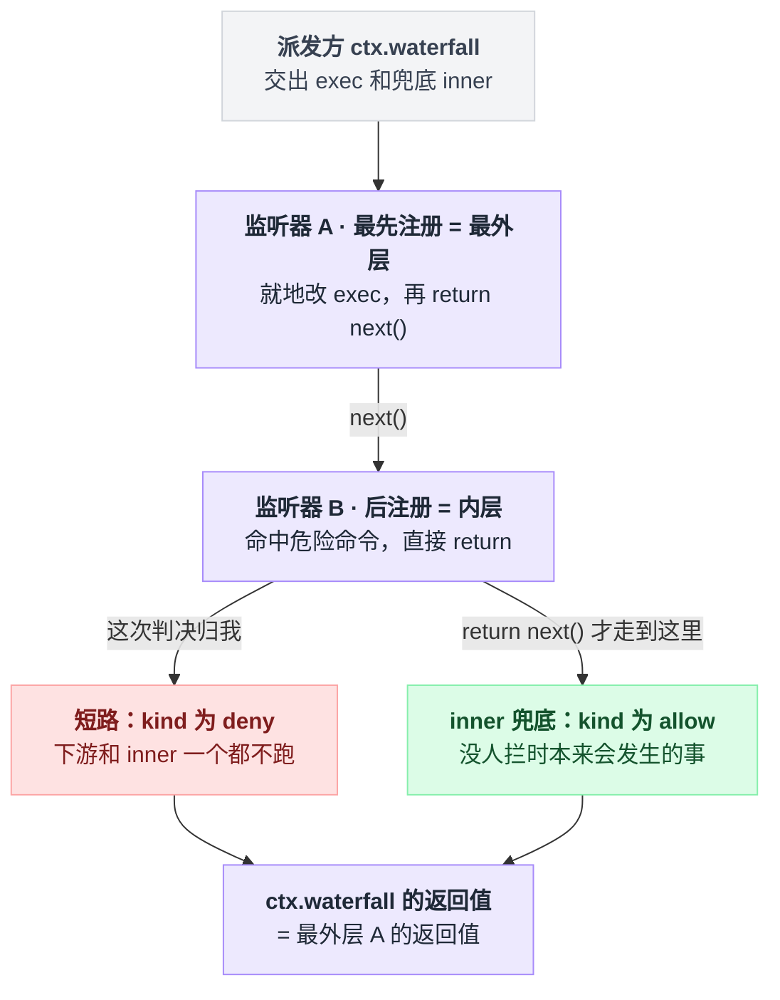
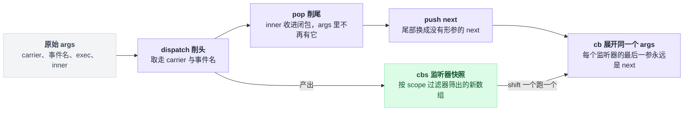
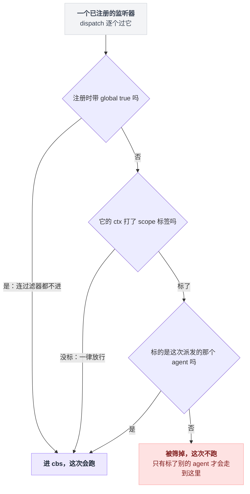
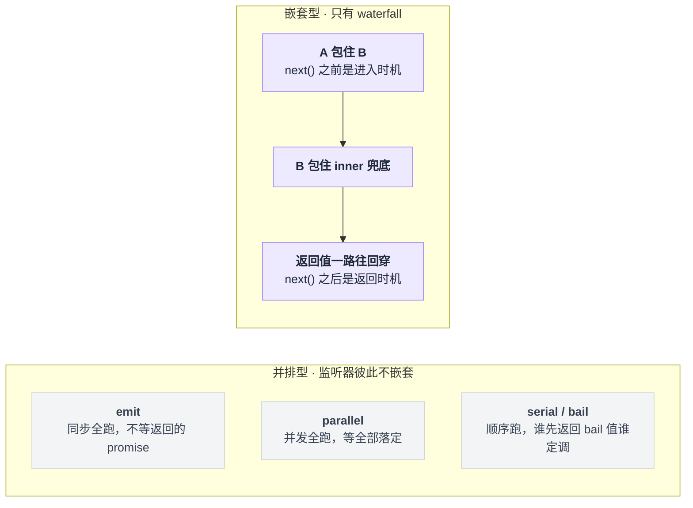
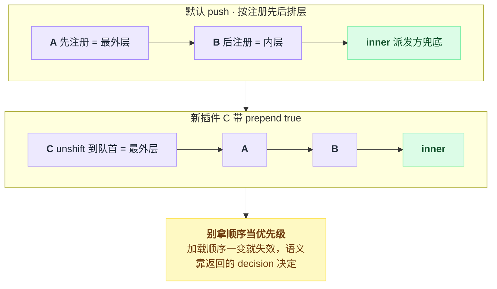
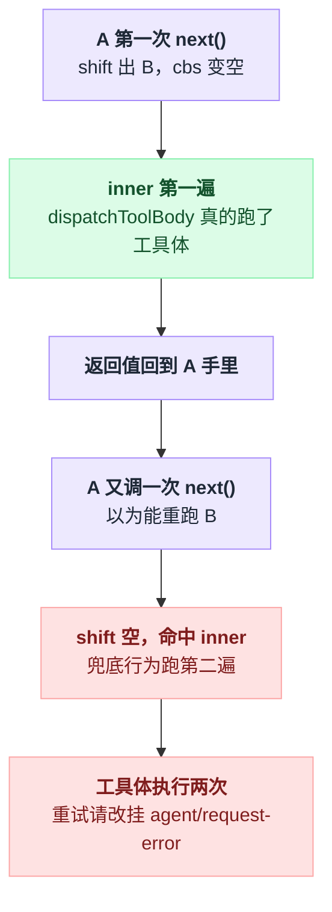
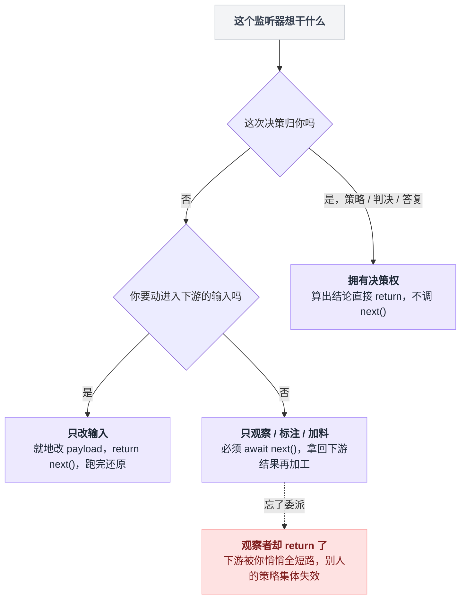
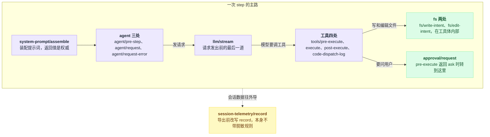

# 11 · waterfall 专章

> 基于 `deepseek-ai/deepseek-harness` v0.1.0-rc.5（commit `47f9438`），2026-08-14 核对。正文只讲机制；可照抄的代码统一收在文末[附录](#附录可以照抄的模板)，出处收在[脚注](#出处)，点角标可跳转。

从别的框架过来的人，第一反应通常是找钩子：一个 hooks 配置文件、一张"生命周期事件"清单、一套 pre/post 回调注册表。

dsh 里没有这个东西。它没有独立的"钩子系统"。

但你想改的几乎一切——拦掉一条危险命令、给工具加超时、换个 provider 重试、把导出的遥测脱敏——又确实都改得了，因为它们最后都落到同一个机制上：某个服务在关键位置派发一个 waterfall 事件，你写个插件监听它。

所以这一章只讲一件事：`ctx.waterfall` 那十行代码，以及全仓建立在它之上的 13 个拦截点。读完你应该能回答一个很具体的问题——**我想改的那个东西，挂在哪一个事件上**。本章末尾那张 13 行的表就是查它的地方。

---

## 想拦住 `rm -rf /`，插件长什么样

先看目标形状，再拆机制。拦工具调用的插件核心就八行：挂在 `tools/pre-execute` 上，回调收到两样东西——这次调用的描述 `exec`，和一个叫 `next` 的放行开关。命中危险命令，就直接返回一个 deny 判决、附上理由；没命中，就调一声 `next` 把控制权交下去。这个形状不是我编的，抄自仓库里的真实桥接插件[^1]；完整可跑的版本在[附录 A](#a-拦下危险命令的完整插件)。

顺手澄清一个容易混的东西：工具这一层其实还有第二条拒绝通道，**不走 waterfall**——工具服务上还能注册同步 guard，跑在 `tools/pre-execute` 之后，只能拒不能放行。它属于工具管线的业务语义，归 [13 章](./13-工具执行管线.md)，这里不展开[^2]。

回到那八行。它藏着两个必须先搞清的问题：**返回一个 deny 判决，凭什么能顶掉整条链？调一声 `next`，又把控制权交给了谁？**

答案比你想的朴素得多。先把画面立起来：一个 `exec` 从派发方出发，按注册顺序一层层穿过监听器，调 `next` 并把它的结果返回出去就是往下走一格，不调 `next`、直接交出自己的返回值就是就地终结，链尾兜着派发方写死的 `inner`——"没人拦时本来会发生的事"。



这张图立起了本章第一根柱子：**waterfall 没有裁判，返回值就是判决——谁不往下传，判决就归谁。**

---

## 全部实现就这十行

看到"事件链""中间件"这类词，很容易以为背后有个调度器在管理状态、维护索引、捕获异常。

不是的。全部实现是对一个数组的三下操作：**削头**拿到这次要跑的监听器名单 → **削尾**拿到派发方的兜底 → 造一个没有形参的 `next` **补回尾部** → 启动。

```ts
// vendor/cordis/src/events.ts:234-243
  waterfall(...args: any[]) {
    const cbs = this.dispatch('waterfall', args)
    const inner = args.pop()
    const next = () => {
      const cb = cbs.shift() ?? inner
      return cb(...args)
    }
    args.push(next)
    return next()
  }
```

逐句读一遍，每一步都是在对 `args` 这个数组动手。

第一行把 `args` 交给 `dispatch`，它做两件事：从**头部**削掉可选的 `thisArg` 和事件名，再按上下文过滤器筛出这次该跑的监听器，返回一个**新数组** `cbs`[^3]。

第二行从 `args` **尾部**削掉一个参数，那是派发方写死的兜底行为，也就是"没人拦时本来会发生的事"，代码里叫 `inner`。

接着造一个闭包 `next`。注意它**没有形参**——只从 `cbs` 头部取一个回调，取不到就退回 `inner`。造好之后把它补回 `args` 尾部，顶替刚被削掉的 `inner`；于是监听器收到的最后一个参数永远是 `next`。

最后调一声 `next` 启动链条，整次 `ctx.waterfall` 调用的返回值就是最外层监听器的返回值。

这十行对 `args` 做的事就是削头、削尾、再补一位：



派发端也很短：以拦工具那个事件为例，派发方带着 scope 载体和 `exec` 调 `ctx.waterfall`，最后一个参数就是写死的 `inner`——一个直接给出 allow 判决的函数[^4]。所以"没人拦就放行"不是什么全局配置，就是链尾那个兜底。

### 谁会被筛掉：没打标签的一律放行

派发时带的那个 carrier 是 scope 载体，它挂着一个过滤器，`dispatch` 筛监听器靠的就是它[^5]。

筛法要看清楚，方向和直觉是反的——不是"标了这个 agent 的才进"，而是**没打 scope 标签的监听器一律放行**。带 `global` 选项注册的监听器更彻底，连过滤器都不进；真正被筛掉的只有一种：标了**别的** agent 的[^5]。各处事件文档里说的 "Scope-filtered dispatch" 就是这回事。

落到单个监听器身上，筛法是这三条岔路：



---

## 洋葱：先注册的在外层

同一份总线源码里还有另外四种派发模式。为什么单单 waterfall 值得一整章？因为只有它是嵌套的，别的都把监听器排成一排：



监听器按**注册顺序**入链，先注册的在外层：注册默认把回调排到队尾，带 `prepend` 选项则插到队首，把自己顶到最外层[^6]。

```
        进入方向 →                                   ← 返回方向
┌────────────────────────────────────────────────────────────────┐
│ A  最先注册 = 最外层                                            │
│  前半段：next() 之前的代码，能改 exec 上可变的字段              │
│  ┌──────────────────────────────────────────────────────────┐  │
│  │ B  后注册 = 内层                                          │  │
│  │  ┌────────────────────────────────────────────────────┐  │  │
│  │  │ inner  派发方写死的兜底：() => ({ kind: 'allow' }) │  │  │
│  │  └────────────────────────────────────────────────────┘  │  │
│  │  后半段：拿到 inner 的返回值，可以再包一层                │  │
│  └──────────────────────────────────────────────────────────┘  │
│  后半段：拿到 B 的返回值，可以再包一层                          │
└────────────────────────────────────────────────────────────────┘
        ctx.waterfall(...) 的返回值 = A 的返回值
```

这个"每个监听器**包住**下游、而不是排在下游后面"的形状，有个现成的名字，叫**洋葱中间件**。它给每个监听器发了两个时机：调 `next` 之前的代码在进入时跑，之后的代码在返回时跑——**一个监听器同时拥有前置和后置。**

Koa 的 middleware 是同一个形状；Express 的 next 不返回下游结果，只有进入方向，不是这个形状。

想看"后半段"怎么用，那个桥接插件里有教科书级的例子：先把自己的判决算出来，deny 就直接短路；不 deny 则等 `next` 拿到下游判决，再把自己的 context 折叠上去返回[^7]。

`prepend` 选项改的就是入链位置——插到队首，等于抢在所有已注册的监听器外面：



---

## 三件反直觉的事

前面都是"它怎么运行"，这一节是"它为什么会咬你"。这三件事全是从那十行代码直接推出来的——每一件都和 Koa 用户的肌肉记忆相反。

### `next` 不接参数，想改就地改对象

想给下游换个参数？直觉写法是把新的 `exec` 当参数传给 `next`。

没用。`next` 的签名就是"不收任何参数"，13 个事件声明全是这个形状[^8]。原因在实现里已经摆着了：`next` 定义时就没有形参，你传什么它都不接；每个监听器被调起时展开的都是 waterfall 自己那**一个** `args` 数组，里面装的永远是派发方给的那几个原始引用。

所以传值给下游只有一条路：**就地修改 payload 对象**。官方口径的原话是："Cooperative listeners usually mutate a shared request or decision object and then delegate."[^9]

仓库里的真实例子是超时插件：它在 `tools/execute` 上把 `exec` 上的取消信号换成自己带 deadline 的信号，等 `next` 跑完，再在 finally 里还原成调用方原来的信号[^10]。

改**返回值**倒是自由的——等 `next` 拿到下游结果，返回一个新的即可。遥测脱敏那个示例插件就是这么干的[^11]。

不过各个事件对"能改什么"有各自的收紧，别越界[^12]：

| 事件 | 收紧成什么样 |
|---|---|
| `tools/execute` | wrapper 只允许改 `exec` 上的取消信号，而且必须还原 |
| `llm/stream` | 拿到的 LOOP 请求是深冻结的，改就抛 |
| `session-telemetry/record` | 明确要求返回新对象，不要改传进来的那个 |

### 游标是共享的，而且取一个少一个

Koa 那套里，每个中间件的 next 绑死了"下一个索引"，重复调用还会直接抛错（Koa 不在本仓库内，此处仅作对照）。

Cordis 不是这样：**整条链只有一个 `next` 闭包、一个 `cbs` 数组**，取一个就从头部摘掉一个，是破坏性消费。

```
cbs = [A, B]                       args = [exec, next]

next() #1   → shift → A            cbs = [B]
  A 调 next() #2  → shift → B      cbs = []
    B 调 next() #3  → shift 空 → inner
    inner 返回
  B 返回
A 返回 → 这就是 ctx.waterfall 的返回值
```

### 第二次调 `next` 不会重新进入下游

顺着上面这张图往下推一步就明白了：如果 A 在等到 `next` 的结果之后**又调了一次**，此刻 `cbs` 已经被下游掏空，取不到回调就只能退回 `inner`——**兜底行为跑了第二遍**，而不是把 B 重跑一遍。

这条在 `tools/execute` 上尤其致命，因为那里的 `inner` 就是"把工具体真正跑起来"的那一步[^13]。第二次调 `next` 等于**工具体被执行两次**。

想做重试的人最容易在这里翻车：重试要写在 `agent/request-error`，那里有专门的 retry 判决语义[^14]，不要靠反复调 `next`。

以 `tools/execute` 为例，第二次调 `next` 的走向是这样的：



一句话立柱子：**`next` 是"往下走一格"，不是"运行剩下的链"。一次通过，别回头。**

### 附带的两条

**waterfall 自身是同步的。** 那十行里没有一次等待、没有一层异常保护，链子的异步性完全来自监听器的返回值类型[^15]。

后果是：一个**非 async** 的监听器（或任何在返回 promise 之前就抛的代码）同步抛错时，错误会直接从派发那一行抛出去，而不是变成 rejected promise。审批服务专门把兜底裹进一个先兑现再执行的 promise 里，把这种抛法拉进同一条 rejection 路径，注释原话是 "a listener that throws SYNCHRONOUSLY (before its first await) must land in the same rejection path as an async one"[^15]。

**监听器名单在派发那一刻就快照了。** 筛监听器那一步产出的是新数组[^16]，所以链条跑到一半时装卸插件，不会改变本次链条。

---

## 什么时候可以不调 `next`

仓库根部的贡献指南写的是硬规矩："Waterfall listeners MUST call `next()`" to delegate[^17]。看到这句你可能会想：那开头那个插件命中规则直接返回判决，岂不是违规了？

不是。官方入门文档补了另一半[^18]：

> For single-decision events, short-circuiting is the design. A policy listener can return without `next()` when it owns the decision, while a listener that only annotates or observes must delegate.

两句合起来才是完整约定：**短路是决策者的特权，委派是观察者的义务。** 翻成可执行的判据就三种情况。



三种写法摆在一起，差别一眼就出来：

```
// 1. 你拥有这次决策权
if (命中我的策略) return { kind: 'deny', reason }        // 不调 next()

// 2. 你只想改进入下游的输入
const 原值 = exec.signal
exec.signal = 我的信号
try { return next() } finally { exec.signal = 原值 }     // 跑完还原


// 3. 你只观察 / 只标注 / 只加料
const 下游判决 = await next()                            // 必须委派
return { ...下游判决, 我的标注 }
```

每一类在仓库里都有真实例子[^19]：

| 你要干什么 | 怎么写 | 仓库里的例子 |
|---|---|---|
| 拥有这次决策权（策略、判决、答复） | 算出结论就返回，不调 `next` | 桥接插件判 deny 时直接返回 |
| 只观察、只标注、只加料 | 必须等 `next` 的结果，拿回来再加工 | 同一个文件里：不 block 时委派，再把 context 折到下游判决上 |
| 只想改进入下游的输入 | 就地改 payload（只改事件文档允许改的字段），把 `next` 的结果返回，跑完还原 | 超时插件换取消信号再还原 |

想抢外层就用 `prepend` 选项。工具任务插件就是这么挂的：它在 `tools/pre-execute` 最外层把这次调用的输出上限记进一张以 `exec` 为键的 WeakMap，然后委派下去——注意它并不改 payload，属于"只加料"那一类[^20]。

有些事件在声明里就明说"第一个返回的人赢、不要组合"，看到这种措辞就别客气。`fs/write-intent` 写的是 "Single-slot decision … the first listener that returns an intent owns the decision rather than composing with peers"；`fs/edit-intent` 同一位置是 "Single-slot decision … the first returned guard wins"[^21]。

顺带一提，`@mode waterfall` 这个 JSDoc 标签不是写给人看的说明，它会被校验：catalog 生成器检查"标了 waterfall 却没有尾参 `next`"和"有尾参 `next` 却标了别的 mode"，两种都进 violations，最后一次性抛错终止生成[^22]。

---

## 全仓 13 个拦截点

拿 `@mode waterfall` 当关键词把仓库各包源码搜一遍，2026-08-14 出 14 行，其中一行是校验器的报错文案、不是事件声明[^23]；剩下 13 行就是下面这张表（与全仓 waterfall 派发点交叉核对一致）。

这 13 个点不是平铺的，它们分布在一次 step 从提示词装配到遥测导出的路上：



选型时最该看的是最后那一列。挑事件的本质是回答：**不调 `next` 时，你替系统做了什么决定**——这一列就是每个事件对这个问题的答案。每个事件的声明处和派发处坐标统一收在脚注[^24]。

| # | 事件 | 声明包 | 不调 `next` = 你替系统做了什么决定 |
|---|---|---|---|
| 1 | `tools/pre-execute` | `dsh-tools` | 返回 deny 判决（附理由）或 ask 判决，顶掉默认的 allow |
| 2 | `tools/execute` | `dsh-tools` | 工具体根本不跑，返回你自己造的结果（超时、缓存、录制回放） |
| 3 | `tools/post-execute` | `dsh-tools` | 返回 block 判决，把结果换成给模型的纠正信息 |
| 4 | `tools/code-dispatch-log` | `dsh-tools` | 换掉 `run_code` 子调用**落日志那一份**内容（程序已拿到完整值，模型两者都看不到） |
| 5 | `agent/pre-step` | `dsh-agent` | 返回 reject 毙掉这一步，或返回 enter 附带新消息，换掉进入这一步的消息 |
| 6 | `agent/request` | `dsh-agent` | 整份替换冻结的 `LlmCallConfig`（换 provider / 换 model / 改参数）；改不了 messages |
| 7 | `agent/request-error` | `dsh-agent` | 返回 retry 判决接管这次失败请求的重试；默认什么都不返回，让失败终结 |
| 8 | `llm/stream` | `dsh-llm` | 直接产出你自己的 chunk——请求根本不发出去（录制、mock、路由） |
| 9 | `system-prompt/assemble` | `dsh-system-prompt` | 返回改造后的 `PromptAssembly`（sections / contexts / tools / variables）；返回值是权威 |
| 10 | `fs/write-intent` | `dsh-fs` | 返回 createIfAbsent 或 replaceIfVersion 意图，给这次写加前置条件 |
| 11 | `fs/edit-intent` | `dsh-fs` | 返回一个版本号，要求编辑前版本必须匹配；兜底是什么都不返回 = 无条件编辑 |
| 12 | `approval/request` | `dsh-user-approval` | 返回一个 `ApprovalOutcome` 替用户答；兜底是 unavailable（fail-closed） |
| 13 | `session-telemetry/record` | `dsh-session-telemetry` | 返回改写后的 record；这个 seam 自己**不带任何脱敏规则**，导出数据有多干净取决于你挂了什么 |

脚注里的"派发处"只给了主路径。两个 fs 事件另有派发点——字符串替换编辑器工具里还有三处，你的监听器会收到全部这些来源[^25]。第 5–7 行声明在 `dsh-agent`，派发在 `dsh-agent-loop`。

另有 5 个是框架自身的 waterfall，不算业务拦截点，也不进 harness 的事件 catalog[^26]：

| 事件 | 怎么标的 |
|---|---|
| `internal/config` | 带 `@mode waterfall` 标签 |
| `internal/update` | 只在 JSDoc 里用 "Waterfall:" 说明 |
| `internal/get` | 只在 JSDoc 里用 "Waterfall:" 说明 |
| `internal/set` | 只在 JSDoc 里用 "Waterfall:" 说明 |
| `loader/patch-context` | 连说明都没有 |

写监听器时要用的判决类型——工具的 pre/post 判决、agent 的 pre-step 判决和请求错误动作、fs 的写意图——定义位置顺手记在脚注里[^27]。

---

## 动手：一个真拦得住的插件

回到开头那条 `rm -rf /`。插件结构照官方文档的最小插件形状，监听器形状照那个桥接插件，`bash` 工具名与 `command` 参数的形状也都核对过[^28]。完整文件照抄[附录 A](#a-拦下危险命令的完整插件)，挂载配置和启动命令照抄[附录 B](#b-挂载与启动)。

有四处是刻意这么写的，每一处都能从前面的画面推出来。

非 `bash` 工具立刻委派，因为只观察就必须委派。命中规则时直接返回 deny 判决、**不**调 `next`，因为这次判决归我。`exec` 上的参数对象静态类型是 unknown，所以要自己收窄[^29]。

第四处是那行只导类型的 import：它不只是拿 `PreToolDecision` 这个类型，还顺手触发了 TypeScript 的 declaration merging——工具包用模块声明往全局事件表上挂了自己的事件，导入它，注册 `tools/pre-execute` 监听器才有类型（桥接插件里就有同款导入[^30]）。类型导入在运行时会被完全擦除，不会给这个 scratch 插件引入运行时依赖。

这个监听器没有 scope 标签，所以它收**所有** agent 的工具调用（未标记的监听器一律放行，前面讲筛法时说过）。

挂载走 patch 配置里的 insert 一行，路径必须是绝对路径；启动命令里的 `dsh web` 是 web profile 的硬编码别名，`--patch` 参数可以重复给多份[^31]。

让模型跑一条命中规则的命令，你会看到工具结果变成一段 "Error: " 开头的文本并被标记为错误——拒绝理由由注册表拼在这个前缀后面[^32]。模型读到这段文字后通常会换个做法重来。

想学"把结果换掉而不是拦掉"，去读遥测脱敏那个示例插件，29 行，一口气读完。它挂在另一个 waterfall 上，用的是后半段改写法：先委派拿到 record，再返回一个换过 body 的新对象；挂载写法在配套的测试 fixture 配置里（那是测试 fixture，用的是相对路径，你自己的 patch 按附录 B 的绝对路径写）[^33]。

---

## 这里最容易踩的

**调了 `next` 却没把它的结果返回出去。** 下游照跑，但返回值被丢掉，整条链的结果成了 undefined；上游把 undefined 当判决用就炸——在 `tools/pre-execute` 上是读判决的 kind 字段时抛 TypeError，被派发方兜成一个报错结果。每条路径都要返回值，waterfall 自己不提供任何默认返回值[^34]。

**忘了等待就去读结果。** 拿到 Promise 当对象用，异步错误也没人接。返回类型带 Promise 的事件一律等它兑现。

**想重试就再调一次 `next`。** 兜底行为会跑第二遍，在 `tools/execute` 上等于工具体执行两次。重试用 `agent/request-error`。

**想给下游换参数，试图把新对象传给 `next`。** 参数被无视，`next` 没有形参。就地改 payload 对象，且只改事件文档允许改的字段。

**在 `llm/stream` 里改 LOOP 请求的 messages。** 直接抛错，LOOP 请求是深冻结的[^35]。模型可见内容只能走已落日志的通道。

**只想记个日志，却顺手返回了个值。** 你悄悄把下游全部短路了，别人的策略集体失效。观察者必须委派[^17]。

**用注册顺序去保证策略优先级。** 加载顺序一变就失效。语义靠数据（返回的判决）决定，不靠顺序；确实需要抢外层才用 `prepend`。

**在监听器返回 promise 之前同步抛错。** 错误会从派发那一行直接窜到调用方，因为 waterfall 不带异常保护。自己包住，或者参考审批服务的写法[^15]。

---

## 把整条链再走一遍

合上这一章之前，把结论从画面里重新推一遍，推得动就是真懂了：

- 从那十行实现推：`next` 造出来就**没有形参**，每个监听器展开的都是同一个 `args`——所以改输入只有"就地改 payload 对象"一条路，给 `next` 传参注定无效；
- 从"取一个少一个"推：游标共享、破坏性消费——所以 `next` 是"往下走一格"不是"运行剩下的链"，第二次调它只会命中 `inner`，在 `tools/execute` 上就是工具体跑两遍；
- 从"逐层返回"推：返回值一路往回穿，整次派发的返回值就是最外层的返回值——所以改输出靠包返回值，忘了返回整条链就成了 undefined；
- 从"取空了就退回 `inner`"推：链尾兜着派发方写死的兜底——所以直接返回就顶掉了它，**短路即决策**；反过来，观察者不委派就是悄悄毙掉全链；
- 从筛法推：没打 scope 标签的一律放行——所以一个朴素注册的监听器收的是**所有** agent 的事件；
- 从"实现里没有等待没有保护"推：同步抛错会直接窜出派发那一行，异步性全靠监听器自己的返回值。

一句话收束：**waterfall 是一条只走一趟的洋葱链：`next` 往下走一格，短路即决策，改输入靠就地改对象、改输出靠包返回值。** 剩下的工作就是在那 13 个拦截点里挑对位置——挑法是看"不调 `next` 你替系统做了什么决定"那一列。

挑好之后，[13 章](./13-工具执行管线.md)讲工具那四个拦截点在管线里的确切位置，[15 章](./15-系统提示词与上下文装配.md)讲 `system-prompt/assemble` 能改到什么程度，[14 章](./14-hook兼容层.md)则是本章多次引用的 `hooks-claude-code` 那个桥接插件的完整拆解。

---

## 附录：可以照抄的模板

### A. 拦下危险命令的完整插件

新建这个文件，形状抄自真实桥接插件[^1]，判决类型来自工具包[^28]：

```ts
// scratch-plugin/src/deny-dangerous-bash.ts
import type { Context } from '@deepseek-ai/cordis'
import type { PreToolDecision } from '@deepseek-ai/dsh-tools'

const DANGEROUS = [/\brm\s+-[a-zA-Z]*[rR][a-zA-Z]*f?\s+\//, /\bmkfs\b/, /\bdd\s+if=.*of=\/dev\//]

export const name = 'deny-dangerous-bash'

export function apply(ctx: Context) {
  ctx.on('tools/pre-execute', async (exec, next): Promise<PreToolDecision> => {
    if (exec.name !== 'bash') return next()
    const command = (exec.arguments as { command?: string }).command
    if (typeof command !== 'string') return next()
    const rule = DANGEROUS.find(pattern => pattern.test(command))
    if (rule === undefined) return next()
    return { kind: 'deny', reason: `本地策略拒绝：命令命中 ${String(rule)}，请换一个更精确的做法` }
  })
}
```

### B. 挂载与启动

挂载配置，路径必须是绝对路径[^31]：

```yaml
# scratch-plugin/cordis.yml
- insert:
    - id: deny-dangerous-bash
      name: '/absolute/path/to/deepseek-harness/scratch-plugin/src/deny-dangerous-bash.ts'
```

启动：

```sh
pnpm dsh web --patch ./scratch-plugin/cordis.yml
```

---

## 出处

[^1]: 拦工具调用的监听器形状（deny 直接返回、否则委派）：`packages/hooks/hooks-claude-code/src/index.ts:238-244`。
[^2]: 同步 guard 通道（跑在 `tools/pre-execute` 之后，只能拒不能放行）：`packages/core/tools/src/index.ts:1101-1110`。
[^3]: waterfall 实现全文：`vendor/cordis/src/events.ts:234-243`（即正文展品）；筛监听器那步 `dispatch()` 的实现在 `:165-175`。
[^4]: `tools/pre-execute` 的派发端整段：`packages/core/tools/src/index.ts:1474-1478`，其中 `ctx.waterfall` 调用与写死的 allow 兜底在 `:1475-1478`。
[^5]: scope 载体 `scopeTarget()`：`packages/core/scope/src/index.ts:170-185`，未标记一律放行在 `:175-176`；`dispatch` 按过滤器筛在 `vendor/cordis/src/events.ts:171-173`，global 选项的声明在 `:116`、生效点在 `:173`。
[^6]: 注册默认排到队尾（push）、prepend 改插队首（unshift）：`vendor/cordis/src/events.ts:255`。
[^7]: 后半段用法的教科书例子（先算自己的判决，不 deny 再委派、把 context 折叠上去）：`packages/hooks/hooks-claude-code/src/index.ts:247-264`。
[^8]: `next` 无形参的签名形状，13 个事件声明一致，例：`packages/core/tools/src/index.ts:152`。
[^9]: 官方口径原文：`docs/cordis-primer.md:32`。
[^10]: 超时插件换取消信号：`packages/guard/timeout-policy/src/index.ts:65-66`，finally 里还原在 `:78`。
[^11]: 脱敏示例改返回值：`examples/headless-agent/tests/fixtures/telemetry-redact-rule.ts:25-28`。
[^12]: 三处收紧的出处：`tools/execute` 只许改 signal 且必须还原在 `packages/core/tools/src/index.ts:155-158`；`llm/stream` 的 LOOP 请求深冻结在 `packages/llm/llm/src/index.ts:56-61`，冻结动作在 `packages/core/agent-loop/src/agent.ts:486`；`session-telemetry/record` 要求返回新对象在 `packages/session/session-telemetry/src/index.ts:39-40`。
[^13]: `tools/execute` 的 inner 就是把工具体真正跑起来的那步（dispatchToolBody）：`packages/core/tools/src/index.ts:1575`。
[^14]: retry 判决的专门语义：`packages/core/agent/src/runtime-types.ts:245-260`。
[^15]: 十行里无 await、无 try：`vendor/cordis/src/events.ts:234-243`；审批服务把同步抛错拉进同一条 rejection 路径（注释原文所在）：`packages/interaction/user-approval/src/index.ts:313-318`。
[^16]: `dispatch()` 末尾的 filter/map 产出新数组（名单快照）：`vendor/cordis/src/events.ts:172-174`。
[^17]: 贡献指南的硬规矩原文："Waterfall listeners MUST call `next()`"：`AGENTS.md:106`。
[^18]: 短路条款原文：`docs/cordis-primer.md:34`。
[^19]: 三类写法的仓库例子：deny 直接返回在 `packages/hooks/hooks-claude-code/src/index.ts:241-242`，委派后折叠 context 在 `:256-264`；超时插件换信号再还原的完整段在 `packages/guard/timeout-policy/src/index.ts:56-80`。
[^20]: 工具任务插件带 prepend 挂最外层、只加料不改 payload：`packages/jobs/tool-jobs/src/index.ts:233-237`。
[^21]: single-slot 措辞原文：`fs/write-intent` 在 `packages/fs/fs/src/index.ts:51-53`，`fs/edit-intent` 在 `:60-61`。
[^22]: `@mode waterfall` 标签的双向校验（标了没尾参、有尾参没标）：`packages/typert/generator/src/cordis-catalog.ts:203-209`、`:234`，一次性抛错在 `:570-575`。
[^23]: 全仓搜出的第 14 行是校验器的报错文案：`packages/typert/generator/src/cordis-catalog.ts:208`。
[^24]: 13 个拦截点的声明处与派发处：1 `tools/pre-execute` 声明 `packages/core/tools/src/index.ts:152`、派发 `:1475`；2 `tools/execute` 声明 `:163`、派发 `:1573`；3 `tools/post-execute` 声明 `:175`、派发 `:1743`；4 `tools/code-dispatch-log` 声明 `:189`、派发 `:1298`；5 `agent/pre-step` 声明 `packages/core/agent/src/runtime-types.ts:231`、派发 `packages/core/agent-loop/src/agent.ts:234`；6 `agent/request` 声明 `runtime-types.ts:244`、派发 `agent.ts:438`；7 `agent/request-error` 声明 `runtime-types.ts:260`、派发 `agent.ts:355`；8 `llm/stream` 声明 `packages/llm/llm/src/index.ts:64`、派发 `:921`；9 `system-prompt/assemble` 声明 `packages/core/system-prompt/src/index.ts:31`、派发 `:532`；10 `fs/write-intent` 声明 `packages/fs/fs/src/index.ts:58`、派发 `packages/fs/tool-fs/src/write.ts:111`；11 `fs/edit-intent` 声明 `fs/src/index.ts:66`、派发 `packages/fs/tool-fs/src/edit.ts:126`；12 `approval/request` 声明 `packages/interaction/user-approval/src/index.ts:30`、派发 `:318`；13 `session-telemetry/record` 声明 `packages/session/session-telemetry/src/index.ts:43`、派发 `packages/session/session-telemetry/src/coordinator.ts:214`。
[^25]: 两个 fs 事件的额外派发点：`packages/fs/tool-str-replace-editor/src/index.ts:252`（write-intent）、`:284`、`:337`（edit-intent）。
[^26]: 框架自身 5 个 waterfall 的坐标：`internal/config` 声明 `vendor/cordis/src/events.ts:339`（`@mode waterfall` 标签在 `:337`）、派发 `vendor/cordis/src/fiber.ts:642`；`internal/update` 声明 `events.ts:343`（JSDoc 说明在 `:342`）、派发 `fiber.ts:748`；`internal/get` 声明 `events.ts:345`（JSDoc 说明在 `:344`）、派发 `vendor/cordis/src/reflect.ts:153`；`internal/set` 声明 `events.ts:347`（JSDoc 说明在 `:346`）、派发 `reflect.ts:191`；`loader/patch-context` 声明 `vendor/loader/src/index.ts:29`、派发 `vendor/loader/src/config/entry.ts:115`。
[^27]: 判决类型定义处：`PreToolDecision` / `PostToolDecision` 在 `packages/core/tools/src/index.ts:588-600`；`PreStepDecision` / `RequestErrorAction` 在 `packages/core/agent/src/runtime-types.ts:53-58`；`FsWriteIntent` 在 `packages/fs/fs/src/types.ts:123-125`。
[^28]: 最小插件形状：`docs/user/develop/basic/index.md:36-44`；`bash` 工具名与 `command` 参数：`packages/shell/tool-bash/src/index.ts:243-246`；监听器形状同[^1]。
[^29]: `exec.arguments` 的静态类型是 unknown：`packages/core/tools/src/index.ts:323`。
[^30]: 触发 declaration merging 的同款类型导入：`packages/hooks/hooks-claude-code/src/index.ts:20`。
[^31]: 挂载配置（insert 一行、绝对路径）：`docs/user/develop/basic/index.md:50-56`；`dsh web` 是 `--profile web` 的硬编码别名、`--patch <path>` 可重复：`apps/cli/src/args.ts:13`、`:132`。
[^32]: 拒绝理由被注册表拼成 "Error: " 前缀的文本：`packages/core/tools/src/index.ts:1489-1498`。
[^33]: 脱敏示例全文：`examples/headless-agent/tests/fixtures/telemetry-redact-rule.ts`（共 29 行）；挂载写法：`examples/headless-agent/tests/fixtures/session-telemetry-otel.cordis.yml:16-17`。
[^34]: 忘了返回的下场：`tools/pre-execute` 的派发方读判决在 `packages/core/tools/src/index.ts:1479`，try/catch 兜成报错结果在 `:1504-1505`；waterfall 自己不提供默认返回值，见实现最后一句 `vendor/cordis/src/events.ts:242`。
[^35]: LOOP 请求深冻结、改就抛：`packages/llm/llm/src/index.ts:57-59`。
