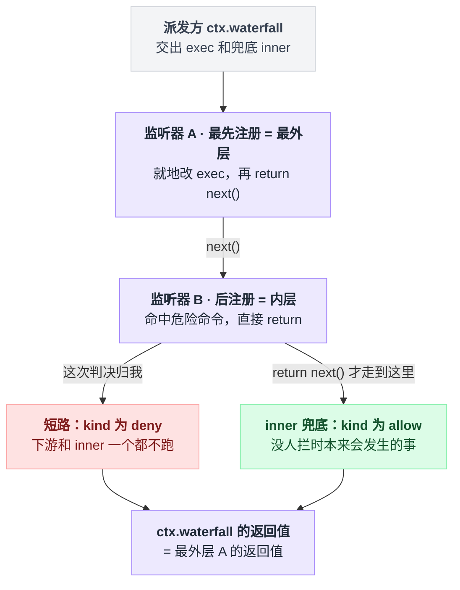
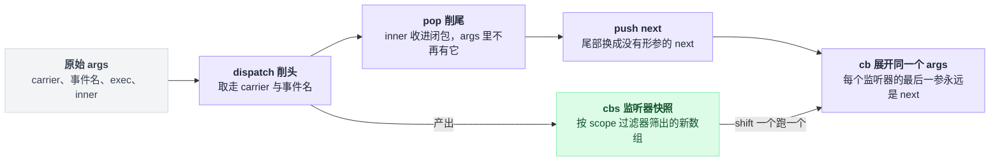
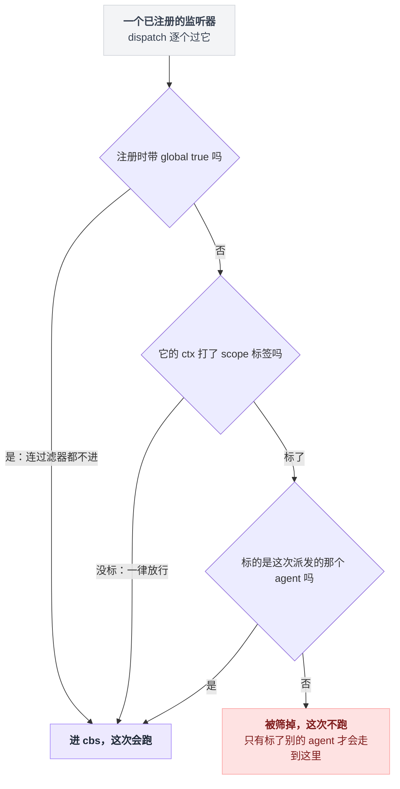
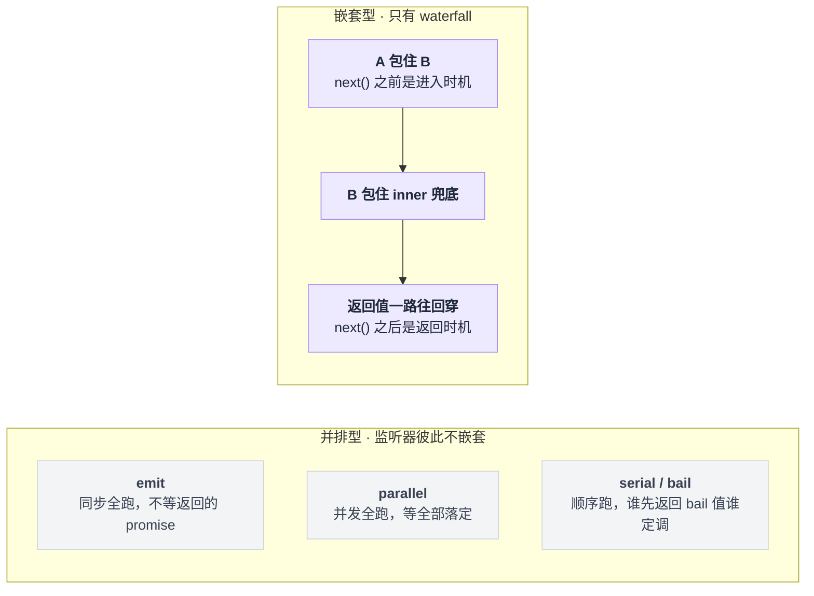
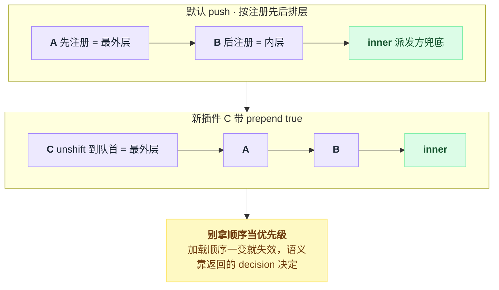
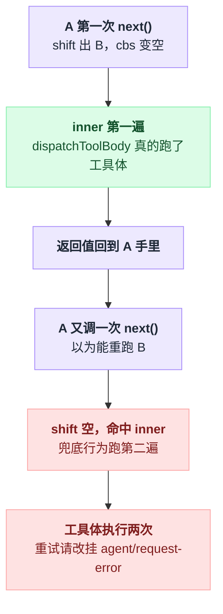
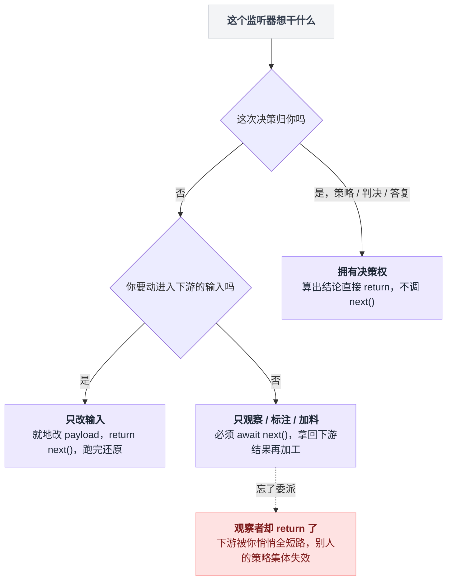
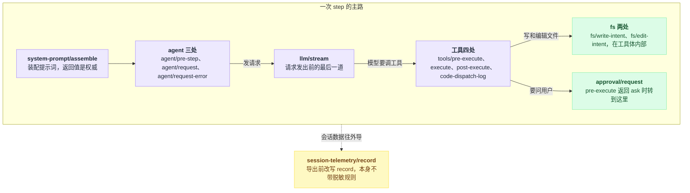

# 11 · waterfall 专章

> 基于 `deepseek-ai/deepseek-harness` v0.1.0-rc.5（commit `47f9438`），2026-08-14 核对。

dsh 没有独立的"钩子系统"。

你想改的几乎一切——拦掉一条危险命令、给工具加超时、换个 provider 重试、把导出的遥测脱敏——最后都落到同一个机制上：某个服务在关键位置派发一个 waterfall 事件，你写个插件监听它。

所以这一章只讲一件事：`ctx.waterfall` 那十行代码，以及全仓建立在它之上的 13 个拦截点。读完你应该能回答一个很具体的问题——**我想改的那个东西，挂在哪一个事件上**。本章末尾那张 13 行的表就是查它的地方。

---

## 想拦住 `rm -rf /`，插件长什么样

先看目标形状。拦工具调用的插件是这样的：

```ts
ctx.on('tools/pre-execute', async (exec, next) => {
  if (exec.name === 'bash' && isDangerous(exec.arguments)) {
    return { kind: 'deny', reason: '这条命令被本地策略拦截' }
  }
  return next()
})
```

这个形状不是我编的，抄自仓库里的真实桥接插件（`packages/hooks/hooks-claude-code/src/index.ts:238-244`）。

工具这一层其实还有第二条拒绝通道，**不走 waterfall**：`ctx.tools.guard()` 注册的同步 guard，跑在 `tools/pre-execute` 之后，只能拒不能放行。它属于工具管线的业务语义，归 [13 章](./13-工具执行管线.md)，这里不展开（`packages/core/tools/src/index.ts:1101-1110`）。

上面那八行里藏着两个必须先搞清的问题：**`return { kind: 'deny' }` 凭什么能顶掉整条链？`return next()` 又把控制权交给了谁？**

答案全在 Cordis 的十行实现里，而且比你想的更朴素。先把形状记住：一个 `exec` 从派发方出发，按注册顺序一层层穿过监听器，`return next()` 就往下走一格，直接 `return` 就地终结，链尾兜着派发方写死的 `inner`。



---

## 全部实现就这十行

一句话：**削头**拿到这次要跑的监听器名单 → **削尾**拿到派发方的兜底 → 造一个没有形参的 `next` **补回尾部** → 启动。

```ts
// vendor/cordis/src/events.ts:234-243
  waterfall(...args: any[]) {
    const cbs = this.dispatch('waterfall', args)
    const inner = args.pop()
    const next = () => {
      const cb = cbs.shift() ?? inner
      return cb(...args)
    }
    args.push(next)
    return next()
  }
```

同一段逻辑，把每一步在 `args` 上的动作标出来：

```
waterfall(...args):
    cbs   = dispatch('waterfall', args)          // 削头：拿走 thisArg 和事件名，
                                                 //       再按 scope 筛出一个新数组
    inner = args.pop()                           // 削尾：派发方写死的兜底行为
    next  = () => (cbs.shift() ?? inner)(...args)  // 注意：next 没有形参
    args.push(next)                              // 补回尾部一位，从此永远是 next
    return next()                                // 启动，返回值 = 最外层监听器的返回值
```

第一行 `dispatch('waterfall', args)` 做两件事：从 `args` **头部**削掉可选的 `thisArg` 和事件名，再按上下文过滤器筛出这次该跑的监听器，返回一个**新数组**。

第二行从 `args` **尾部**削掉一个参数，那是派发方写死的兜底行为，也就是"没人拦时本来会发生的事"，代码里叫 `inner`。

接着造一个闭包 `next`。注意它**没有形参**——只从 `cbs` 头部取一个回调，取不到就退回 `inner`。造好之后把它 `push` 回 `args` 尾部，顶替刚被 pop 掉的 `inner`；于是监听器收到的最后一个参数永远是 `next`。

最后 `return next()` 启动链条，整个 `ctx.waterfall(...)` 的返回值就是最外层监听器的返回值。以上筛监听器那步的实现在 `events.ts:165-175`。

这十行对 `args` 做的事就是削头、削尾、再补一位：



派发端长这样，`inner` 一目了然（`packages/core/tools/src/index.ts:1474-1478`）：

```ts
// packages/core/tools/src/index.ts:1475-1478
      const gate = await this.ctx.waterfall(
        carrier, 'tools/pre-execute', exec,
        () => Promise.resolve<PreToolDecision>({ kind: 'allow' }),
      )
```

`carrier` 是 scope 载体（`scopeTarget()`，见 `packages/core/scope/src/index.ts:170-185`），它挂了一个 `Context.filter`，`dispatch` 在 `events.ts:171-173` 拿它筛监听器。

筛法要看清楚，是反过来的——**没打 scope 标签的监听器一律放行**，被筛掉的只是"标了别的 agent 的"：

```
for h in 所有已注册的监听器:
    if h 注册时带 global true:      进 cbs      // 连过滤器都不进
    elif h.ctx 没打 scope 标签:      进 cbs      // 未标记 = 一律放行
    elif h 标的就是这次的 agent:     进 cbs
    else:                          筛掉        // 只有标了别的 agent 才会到这里
```

出处：未标记放行见 `packages/core/scope/src/index.ts:175-176`；`{ global: true }` 的监听器连过滤器都不进，见 `events.ts:116` 与 `events.ts:173`。各处事件文档里说的 "Scope-filtered dispatch" 就是这回事。

落到单个监听器身上，筛法是这三条岔路：



---

## 洋葱：先注册的在外层

同一个 `events.ts` 里还有另外四种派发模式，只有 waterfall 是嵌套的，别的都把监听器排成一排：



监听器按**注册顺序**入链，先注册的在外层：`register()` 默认 `push`（`events.ts:255`），`{ prepend: true }` 改成 `unshift`，把自己顶到最外层。

```
        进入方向 →                                   ← 返回方向
┌────────────────────────────────────────────────────────────────┐
│ A  最先注册 = 最外层                                            │
│  前半段：next() 之前的代码，能改 exec 上可变的字段              │
│  ┌──────────────────────────────────────────────────────────┐  │
│  │ B  后注册 = 内层                                          │  │
│  │  ┌────────────────────────────────────────────────────┐  │  │
│  │  │ inner  派发方写死的兜底：() => ({ kind: 'allow' }) │  │  │
│  │  └────────────────────────────────────────────────────┘  │  │
│  │  后半段：拿到 inner 的返回值，可以再包一层                │  │
│  └──────────────────────────────────────────────────────────┘  │
│  后半段：拿到 B 的返回值，可以再包一层                          │
└────────────────────────────────────────────────────────────────┘
        ctx.waterfall(...) 的返回值 = A 的返回值
```

"洋葱中间件"这个词如果你没见过：它指每个监听器**包住**下游，而不是排在下游后面。`next()` 之前的代码在进入时跑，`next()` 之后的代码在返回时跑，所以一个监听器同时拥有前置和后置两个时机。

Koa 的 middleware 是同一个形状；Express 的 `next()` 不返回下游结果，只有进入方向，不是这个形状。

想看"后半段"怎么用，`packages/hooks/hooks-claude-code/src/index.ts:247-264` 是教科书级的例子：先把自己的判决算出来，deny 就直接短路；不 deny 则 `await next()` 拿到下游判决，再把自己的 context 折叠上去返回。

`{ prepend: true }` 改的就是入链位置——`unshift` 到队首，等于抢在所有已注册的监听器外面：



---

## 三件反直觉的事

这一节是本章的核心。前面都是"它怎么运行"，这里是"它为什么会咬你"。

### `next()` 不接参数，想改就地改对象

`next` 的签名是 `() => …`，13 个事件声明全是这个形状（例：`packages/core/tools/src/index.ts:152`）。

原因在实现里已经摆着了：`next` 定义时就没有形参，你传什么它都不接；`cb(...args)` 每次展开的都是 waterfall 自己那**一个** `args` 数组，里面装的永远是派发方给的那几个原始引用。

所以传值给下游只有一条路：**就地修改 payload 对象**。官方口径写在 `docs/cordis-primer.md:32`："Cooperative listeners usually mutate a shared request or decision object and then delegate."

仓库里的真实例子是超时插件：它在 `tools/execute` 上把 `exec.signal` 换成自己带 deadline 的信号，`await next()`，再在 `finally` 里还原成调用方原来的信号（`packages/guard/timeout-policy/src/index.ts:65-66`、`:78`）。

改**返回值**倒是自由的——`await next()` 拿到下游结果，返回一个新的即可。`examples/headless-agent/tests/fixtures/telemetry-redact-rule.ts:25-28` 就是这么脱敏的。

不过各个事件对"能改什么"有各自的收紧，别越界：

| 事件 | 收紧成什么样 | 出处 |
|---|---|---|
| `tools/execute` | wrapper 只允许改 `exec.signal`，而且必须还原 | `packages/core/tools/src/index.ts:155-158` |
| `llm/stream` | 拿到的 LOOP 请求是深冻结的，改就抛 | `packages/llm/llm/src/index.ts:56-61`，冻结动作在 `packages/core/agent-loop/src/agent.ts:486` |
| `session-telemetry/record` | 明确要求返回新对象，不要改传进来的那个 | `packages/session/session-telemetry/src/index.ts:39-40` |

### 游标是共享的，而且取一个少一个

Koa 那套里，每个中间件的 `next` 绑死了"下一个索引"，重复调用还会直接抛错（Koa 不在本仓库内，此处仅作对照）。

Cordis 不是这样：**整条链只有一个 `next` 闭包、一个 `cbs` 数组**，取一个就 `shift()` 掉一个，是破坏性消费。

```
cbs = [A, B]                       args = [exec, next]

next() #1   → shift → A            cbs = [B]
  A 调 next() #2  → shift → B      cbs = []
    B 调 next() #3  → shift 空 → inner
    inner 返回
  B 返回
A 返回 → 这就是 ctx.waterfall 的返回值
```

### 第二次调 `next()` 不会重新进入下游

顺着上面这张图往下推一步就明白了：如果 A 在 `await next()` 返回之后**又调了一次** `next()`，此刻 `cbs` 已经被下游掏空，`cbs.shift() ?? inner` 只能命中 `inner`——**兜底行为跑了第二遍**，而不是把 B 重跑一遍。

这条在 `tools/execute` 上尤其致命，因为那里的 `inner` 是 `() => this.dispatchToolBody(mutableExec)`（`packages/core/tools/src/index.ts:1575`）。第二次 `next()` 等于**工具体被执行两次**。

想做重试的人最容易在这里翻车：重试要写在 `agent/request-error`，那里有专门的 `{ kind: 'retry' }` 语义（`packages/core/agent/src/runtime-types.ts:245-260`），不要靠反复调 `next()`。

以 `tools/execute` 为例，第二次 `next()` 的走向是这样的：



一句话记住：**`next()` 是"往下走一格"，不是"运行剩下的链"。一次通过，别回头。**

### 附带的两条

**waterfall 自身是同步的。** `events.ts:234-243` 里没有一个 `await`、没有一个 `try`，链子的异步性完全来自监听器的返回值类型。

后果是：一个**非 async** 的监听器（或任何在返回 promise 之前就抛的代码）同步抛错时，错误会直接从 `ctx.waterfall(...)` 这一行抛出去，而不是变成 rejected promise。审批服务专门用 `Promise.resolve().then(...)` 把这种抛法拉进同一条 rejection 路径，注释原话是 "a listener that throws SYNCHRONOUSLY (before its first await) must land in the same rejection path as an async one"（`packages/interaction/user-approval/src/index.ts:313-318`）。

**监听器名单在派发那一刻就快照了。** `dispatch()` 末尾的 `.filter().map()` 产出的是新数组（`events.ts:172-174`），所以链条跑到一半时装卸插件，不会改变本次链条。

---

## 什么时候可以不调 `next()`

仓库根 `AGENTS.md:106` 写的是硬规矩："Waterfall listeners MUST call `next()`" to delegate。但 `docs/cordis-primer.md:34` 补了另一半：

> For single-decision events, short-circuiting is the design. A policy listener can return without `next()` when it owns the decision, while a listener that only annotates or observes must delegate.

两句合起来才是完整约定，翻成可执行的判据就三种情况。



三种写法摆在一起，差别一眼就出来：

```
// 1. 你拥有这次决策权
if (命中我的策略) return { kind: 'deny', reason }        // 不调 next()

// 2. 你只想改进入下游的输入
const 原值 = exec.signal
exec.signal = 我的信号
try { return next() } finally { exec.signal = 原值 }     // 跑完还原

// 3. 你只观察 / 只标注 / 只加料
const 下游判决 = await next()                            // 必须委派
return { ...下游判决, 我的标注 }
```

| 你要干什么 | 怎么写 | 仓库里的例子 |
|---|---|---|
| 拥有这次决策权（策略、判决、答复） | 算出结论就 `return`，不调 `next()` | `hooks-claude-code` 判 deny 时直接返回（`packages/hooks/hooks-claude-code/src/index.ts:241-242`） |
| 只观察、只标注、只加料 | 必须 `await next()`，把下游结果拿回来再加工 | 同一个文件的 `:256-264`：不 block 时委派，再把 context 折到下游判决上 |
| 只想改进入下游的输入 | 就地改 payload（只改事件文档允许改的字段），`return next()`，跑完还原 | 超时插件换 `exec.signal` 再还原（`packages/guard/timeout-policy/src/index.ts:56-80`） |

想抢外层用 `{ prepend: true }`。`packages/jobs/tool-jobs/src/index.ts:233-237` 就是这么挂的：它在 `tools/pre-execute` 最外层把这次调用的输出上限记进一张以 `exec` 为键的 WeakMap，然后 `return next()`——注意它并不改 payload，属于"只加料"那一类。

有些事件在声明里就明说"第一个返回的人赢、不要组合"，看到这种措辞就别客气。`fs/write-intent` 写的是 "Single-slot decision … the first listener that returns an intent owns the decision rather than composing with peers"（`packages/fs/fs/src/index.ts:51-53`）；`fs/edit-intent` 同一位置是 "Single-slot decision … the first returned guard wins"（`:60-61`）。

顺带一提，`@mode waterfall` 这个 JSDoc 标签不是写给人看的说明，它会被校验：catalog 生成器检查"标了 waterfall 却没有尾参 `next`"和"有尾参 `next` 却标了别的 mode"，两种都进 violations，最后由 `reportViolations` 抛错终止生成（`packages/typert/generator/src/cordis-catalog.ts:203-209`、`:234`、`:570-575`）。

---

## 全仓 13 个拦截点

`grep -rn "@mode waterfall" packages/*/*/src` 在 2026-08-14 出 14 行，其中 `packages/typert/generator/src/cordis-catalog.ts:208` 是校验器的报错文案、不是事件声明；剩下 13 行就是下面这张表（与全仓 `ctx.waterfall(` 派发点交叉核对一致）。

这 13 个点不是平铺的，它们分布在一次 step 从提示词装配到遥测导出的路上：



选型时最该看的是最后那一列——**不调 `next()` 你就替系统做了什么决定**。

| # | 事件 | 声明包 | 声明处 | 不调 `next()` = 你替系统做了什么决定 | 派发处 |
|---|---|---|---|---|---|
| 1 | `tools/pre-execute` | `dsh-tools` | `packages/core/tools/src/index.ts:152` | 返回 `{kind:'deny',reason}` / `{kind:'ask'}` 顶掉默认的 allow | `packages/core/tools/src/index.ts:1475` |
| 2 | `tools/execute` | `dsh-tools` | `:163` | 工具体根本不跑，返回你自己造的结果（超时、缓存、录制回放） | `:1573` |
| 3 | `tools/post-execute` | `dsh-tools` | `:175` | 返回 `{kind:'block',feedback}` 把结果换成给模型的纠正信息 | `:1743` |
| 4 | `tools/code-dispatch-log` | `dsh-tools` | `:189` | 换掉 `run_code` 子调用**落日志那一份**内容（程序已拿到完整值，模型两者都看不到） | `:1298` |
| 5 | `agent/pre-step` | `dsh-agent` | `packages/core/agent/src/runtime-types.ts:231` | `{kind:'reject'}` 毙掉这一步，或 `{kind:'enter',messages}` 换掉进入这一步的消息 | `packages/core/agent-loop/src/agent.ts:234` |
| 6 | `agent/request` | `dsh-agent` | `:244` | 整份替换冻结的 `LlmCallConfig`（换 provider / 换 model / 改参数）；改不了 messages | `packages/core/agent-loop/src/agent.ts:438` |
| 7 | `agent/request-error` | `dsh-agent` | `:260` | 返回 `{kind:'retry'}` 接管这次失败请求的重试；默认 `undefined` 让失败终结 | `packages/core/agent-loop/src/agent.ts:355` |
| 8 | `llm/stream` | `dsh-llm` | `packages/llm/llm/src/index.ts:64` | 直接 yield 你自己的 chunk——请求根本不发出去（录制、mock、路由） | `packages/llm/llm/src/index.ts:921` |
| 9 | `system-prompt/assemble` | `dsh-system-prompt` | `packages/core/system-prompt/src/index.ts:31` | 返回改造后的 `PromptAssembly`（sections / contexts / tools / variables）；返回值是权威 | `:532` |
| 10 | `fs/write-intent` | `dsh-fs` | `packages/fs/fs/src/index.ts:58` | 返回 `{kind:'createIfAbsent'}` 或 `{kind:'replaceIfVersion',version}` 给这次写加前置条件 | `packages/fs/tool-fs/src/write.ts:111` |
| 11 | `fs/edit-intent` | `dsh-fs` | `:66` | 返回 `{version}` 要求编辑前版本必须匹配；兜底是 `undefined` = 无条件编辑 | `packages/fs/tool-fs/src/edit.ts:126` |
| 12 | `approval/request` | `dsh-user-approval` | `packages/interaction/user-approval/src/index.ts:30` | 返回一个 `ApprovalOutcome` 替用户答；兜底是 `'unavailable'`（fail-closed） | `:318` |
| 13 | `session-telemetry/record` | `dsh-session-telemetry` | `packages/session/session-telemetry/src/index.ts:43` | 返回改写后的 record；这个 seam 自己**不带任何脱敏规则**，导出数据有多干净取决于你挂了什么 | `packages/session/session-telemetry/src/coordinator.ts:214` |

表里"派发处"只给了主路径。两个 fs 事件另有派发点——`packages/fs/tool-str-replace-editor/src/index.ts:252`（write-intent）、`:284`、`:337`（edit-intent）——你的监听器会收到全部这些来源。第 5–7 行声明在 `dsh-agent`，派发在 `dsh-agent-loop`。

另有 5 个是框架自身的 waterfall，不算业务拦截点，也不进 harness 的事件 catalog：

| 事件 | 声明处 | 派发处 | 怎么标的 |
|---|---|---|---|
| `internal/config` | `vendor/cordis/src/events.ts:339` | `vendor/cordis/src/fiber.ts:642` | 带 `@mode waterfall`（`events.ts:337`） |
| `internal/update` | `:343` | `fiber.ts:748` | 只在 JSDoc 里用 "Waterfall:" 说明（`:342`） |
| `internal/get` | `:345` | `vendor/cordis/src/reflect.ts:153` | 只在 JSDoc 里用 "Waterfall:" 说明（`:344`） |
| `internal/set` | `:347` | `reflect.ts:191` | 只在 JSDoc 里用 "Waterfall:" 说明（`:346`） |
| `loader/patch-context` | `vendor/loader/src/index.ts:29` | `vendor/loader/src/config/entry.ts:115` | 连说明都没有 |

判决类型的定义顺手记一下，写监听器时要用：

| 类型 | 定义处 |
|---|---|
| `PreToolDecision` / `PostToolDecision` | `packages/core/tools/src/index.ts:588-600` |
| `PreStepDecision` / `RequestErrorAction` | `packages/core/agent/src/runtime-types.ts:53-58` |
| `FsWriteIntent` | `packages/fs/fs/src/types.ts:123-125` |

---

## 动手：一个真拦得住的插件

回到开头那条 `rm -rf /`。插件结构照 `docs/user/develop/basic/index.md:36-44` 的最小插件形状，监听器形状照 `packages/hooks/hooks-claude-code/src/index.ts:238-244`，`bash` 工具名与 `command` 参数见 `packages/shell/tool-bash/src/index.ts:243-246`。

新建 `scratch-plugin/src/deny-dangerous-bash.ts`：

```ts
import type { Context } from '@deepseek-ai/cordis'
import type { PreToolDecision } from '@deepseek-ai/dsh-tools'

const DANGEROUS = [/\brm\s+-[a-zA-Z]*[rR][a-zA-Z]*f?\s+\//, /\bmkfs\b/, /\bdd\s+if=.*of=\/dev\//]

export const name = 'deny-dangerous-bash'

export function apply(ctx: Context) {
  ctx.on('tools/pre-execute', async (exec, next): Promise<PreToolDecision> => {
    if (exec.name !== 'bash') return next()
    const command = (exec.arguments as { command?: string }).command
    if (typeof command !== 'string') return next()
    const rule = DANGEROUS.find(pattern => pattern.test(command))
    if (rule === undefined) return next()
    return { kind: 'deny', reason: `本地策略拒绝：命令命中 ${String(rule)}，请换一个更精确的做法` }
  })
}
```

有四处是刻意这么写的。

非 `bash` 工具立刻 `return next()`，因为只观察就必须委派。命中规则时直接 `return`、**不**调 `next()`，因为这次判决归我。`exec.arguments` 的静态类型是 `unknown`，所以要自己收窄（`packages/core/tools/src/index.ts:323`）。

第四处是最后那个 `import type { PreToolDecision } from '@deepseek-ai/dsh-tools'`：它不只是拿类型，还顺手触发了 TypeScript 的 declaration merging——这个包用 `declare module '@deepseek-ai/cordis'` 往 `Events` 接口上挂了自己的事件，导入它，`ctx.on('tools/pre-execute', …)` 才有类型（同款导入见 `packages/hooks/hooks-claude-code/src/index.ts:20`）。`import type` 在运行时会被完全擦除，不会给这个 scratch 插件引入运行时依赖。

这个监听器没有 scope 标签，所以它收**所有** agent 的工具调用（未标记的监听器一律放行，前面讲筛法时说过）。

挂载靠 `cordis.yml` 里 `insert` 一行，路径必须是绝对路径（`docs/user/develop/basic/index.md:50-56`）：

```yaml
# scratch-plugin/cordis.yml
- insert:
    - id: deny-dangerous-bash
      name: '/absolute/path/to/deepseek-harness/scratch-plugin/src/deny-dangerous-bash.ts'
```

```sh
pnpm dsh web --patch ./scratch-plugin/cordis.yml
```

（`dsh web` 是 `--profile web` 的硬编码别名，`--patch <path>` 可重复，见 `apps/cli/src/args.ts:13`、`:132`。）

让模型跑一条命中规则的命令，你会看到工具结果变成一段 `Error: ` 开头的文本并被标记为错误——拒绝理由由注册表拼成 `Error: ${denialReason}`（`packages/core/tools/src/index.ts:1489-1498`）。模型读到这段文字后通常会换个做法重来。

想学"把结果换掉而不是拦掉"，去读 `examples/headless-agent/tests/fixtures/telemetry-redact-rule.ts`，29 行，一口气读完。

它挂在另一个 waterfall 上，用的是 `const record = next(); return { ...record, body: scrub(record.body) }` 这种后半段改写法；挂载写法在 `examples/headless-agent/tests/fixtures/session-telemetry-otel.cordis.yml:16-17`（那是测试 fixture，用的是相对路径，你自己的 patch 按上面的绝对路径写）。

---

## 这里最容易踩的

**忘了 `return next()`，写成光 `next()`。** 下游照跑，但返回值被丢掉，整条链返回 `undefined`；上游把 `undefined` 当 decision 用就炸——在 `tools/pre-execute` 上是读 `gate.kind` 抛 TypeError，被派发方 try/catch 兜成一个报错结果。每条路径都要 `return`，`waterfall` 自己不提供任何默认返回值（`packages/core/tools/src/index.ts:1479`、`:1504-1505`；`events.ts:242`）。

**忘了 `await next()` 就去读结果。** 拿到 Promise 当对象用，异步错误也没人接。返回类型带 `Promise` 的事件一律 `await`。

**想重试就再调一次 `next()`。** 兜底行为会跑第二遍，在 `tools/execute` 上等于工具体执行两次。重试用 `agent/request-error`。

**想给下游换参数，试图 `next(newExec)`。** 参数被无视，`next` 没有形参。就地改 payload 对象，且只改事件文档允许改的字段。

**在 `llm/stream` 里改 LOOP 请求的 `messages`。** 直接抛错，LOOP 请求是深冻结的（`packages/llm/llm/src/index.ts:57-59`）。模型可见内容只能走已落日志的通道。

**只想记个日志，却顺手 `return` 了。** 你悄悄把下游全部短路了，别人的策略集体失效。观察者必须委派（`AGENTS.md:106`）。

**用注册顺序去保证策略优先级。** 加载顺序一变就失效。语义靠数据（返回的 decision）决定，不靠顺序；确实需要抢外层才用 `{ prepend: true }`。

**在监听器返回 promise 之前同步抛错。** 错误会从 `ctx.waterfall(...)` 直接窜到调用方，因为 waterfall 不带 try/catch。自己包住，或者参考 `packages/interaction/user-approval/src/index.ts:313-318` 的写法。

---

## 一句话带走

**waterfall 是一条只走一趟的洋葱链：`next()` 往下走一格，短路即决策，改输入靠就地改对象、改输出靠包返回值。** 剩下的工作就是在那 13 个拦截点里挑对位置。

挑好之后，[13 章](./13-工具执行管线.md)讲工具那四个拦截点在管线里的确切位置，[15 章](./15-系统提示词与上下文装配.md)讲 `system-prompt/assemble` 能改到什么程度，[14 章](./14-hook兼容层.md)则是本章多次引用的 `hooks-claude-code` 那个桥接插件的完整拆解。

---
