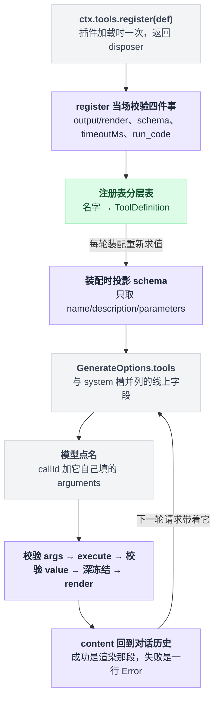
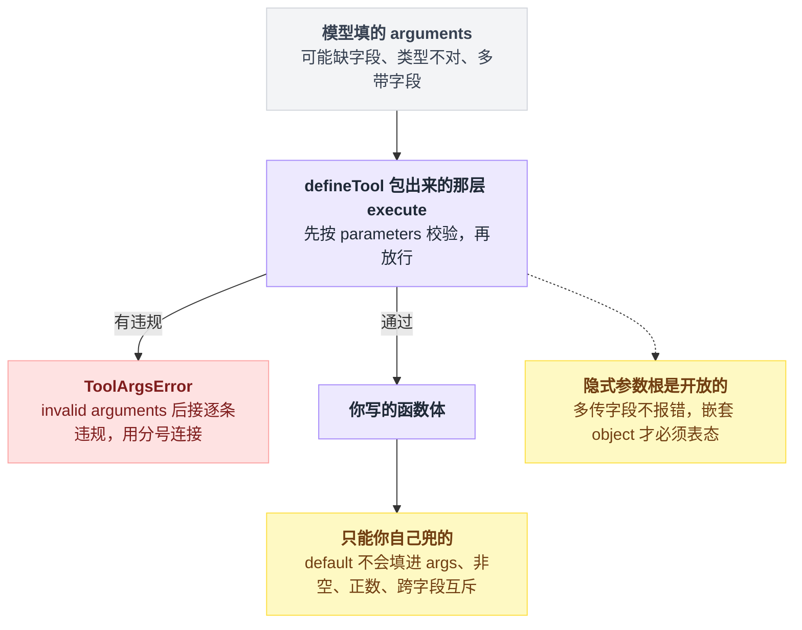
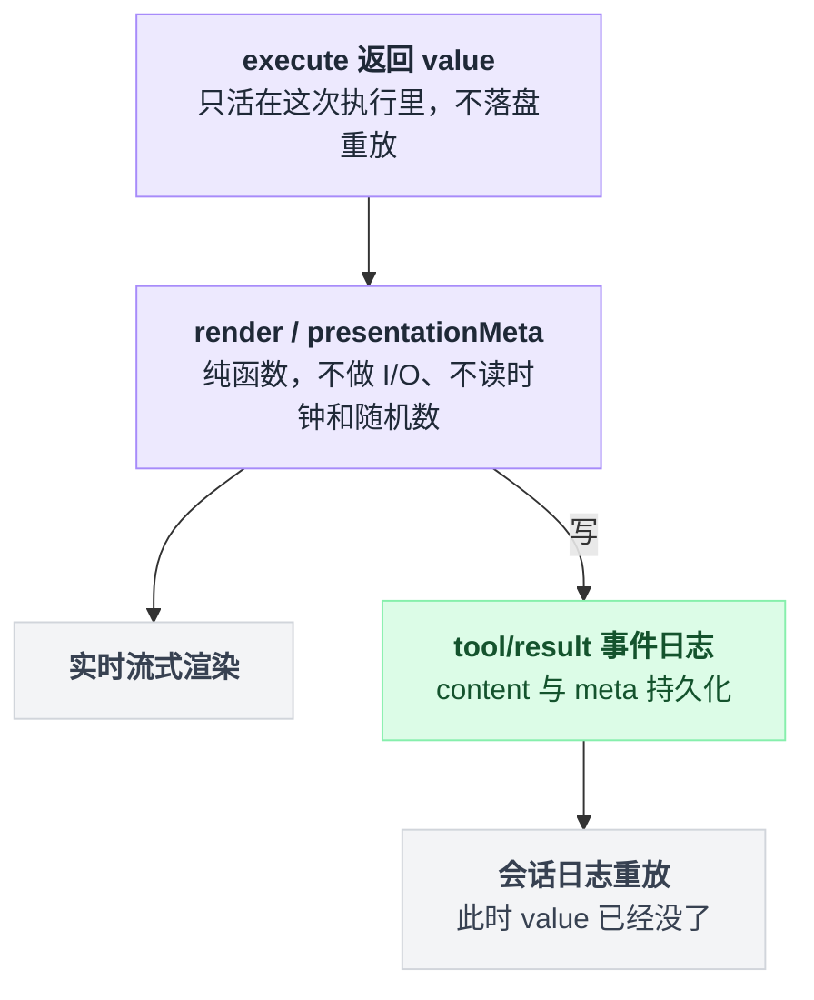
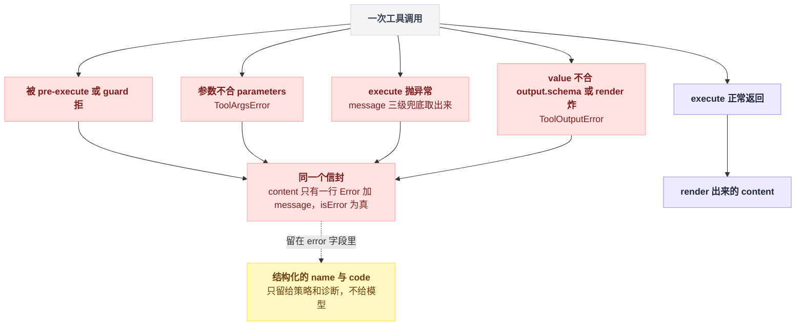
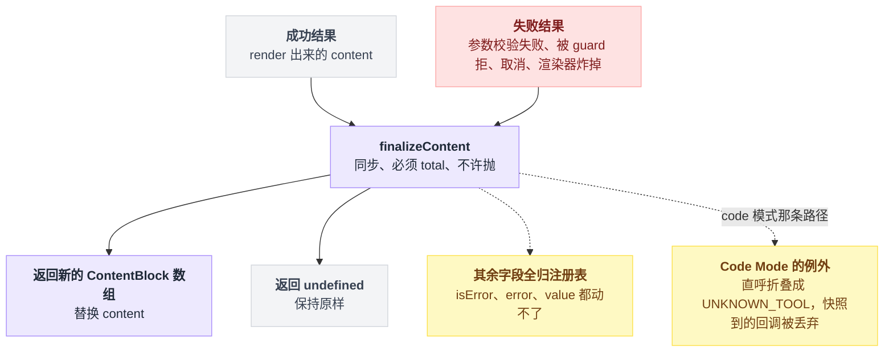
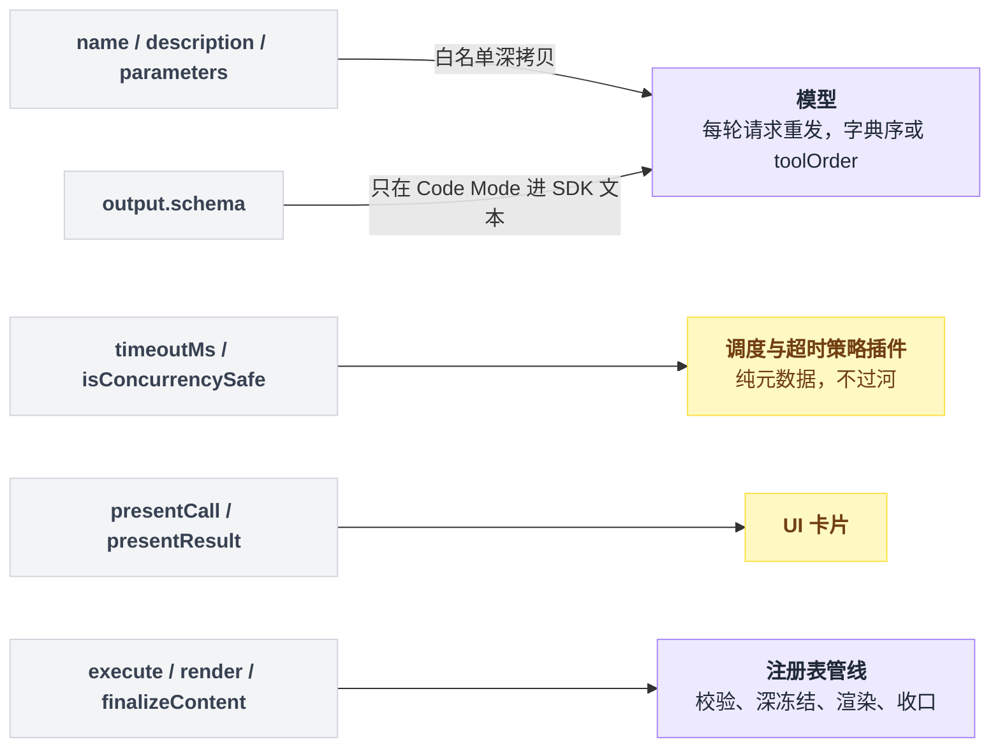

# 12 · 写一个工具

> 基于 `deepseek-ai/deepseek-harness` v0.1.0-rc.5（commit `47f9438`），2026-08-14 核对。正文只讲机制和要动手敲的步骤；成篇可照抄的代码收在文末[附录](#附录可以照抄的模板)，出处收在[脚注](#出处)，点角标可跳转。

前几章写的插件全在后台干活——挂事件、提供 Service，模型对它们毫无感知。这一章做一件模型真的看得见的事：给它一个新工具。

动手前先拆一个预期："写工具嘛，无非是写个函数、注册一下。"函数确实要写，但它是全章最不值钱的部分。工具的成败大半取决于 `description` 怎么写、参数怎么起名、返回的那句话说没说清楚——这三样都没有编译器帮你兜。00 章说过"难点搬了家"，这一章就是搬家现场。

边界也先划清：这一章只管"怎么把一个能力做成模型可调用的工具"——注册形状、参数校验、返回什么、报错怎么写、模型最终看到什么。拦截别人的工具、改别人的结果，那是[第 13 章](./13-工具执行管线.md)。

一个工具的完整路径是这样的：注册只发生一次，schema 每轮重发，`execute` 只在模型点名的时候跑。



---

## 工具不是一个函数，是三条通道

新手最容易带着这样的心智进来："工具就是一个函数，模型传参数、我返回结果。"

不够用。在 dsh 里，一次工具调用同时喂三个不同的收件人[^1]：

```
注册时（每轮模型请求都重发）
    name + description + parameters ──► 模型请求里的 tools 字段

调用时（一次）
    execute() 返回 value
        ├─ 按 output.schema 校验 → 深冻结 ──► 程序读它（Code Mode / post-execute 策略）
        ├─ output.render(args, value) ──► content ──► 模型读它
        └─ output.presentationMeta(args, value) ──► meta ──► UI 卡片
```

第一条通道上行的是 `name` / `description` / `parameters` 三个字段，随每次模型请求重发。模型判断"要不要调、怎么填参数"，依据只有这三样。这条通道叫 **schema 通道**。

第二条是 `execute` 的返回值。它会被 schema 校验、深冻结，然后交给渲染函数；在 Code Mode 下它就是程序直接拿到的返回值。（Code Mode 指模型不直接发工具调用，而是写一段程序、像调用库函数一样去调工具，[第 21 章](./21-CodeMode.md)专讲。）这条叫 **value 通道**。

第三条是渲染函数产出的 ContentBlock 数组，这才是回到对话里、模型真正读到的文字——**content 通道**。

**"value 与 content 分开声明"是 dsh 相对朴素工具框架最主要的取舍**，后面单开一节讲它值不值。

---

## 最小形状：十几行就能跑

官方教程里有一个十几行的完整插件：一个 greet 工具，模型传个名字，它回一句问候。全文原样照抄在[附录 A](#a-最小形状插件全文)[^2]，正文只拆里面五处各有讲究的写法[^3]：

| 写法 | 它做了什么 |
|---|---|
| `inject` 里声明 `tools` | 插件等工具服务就绪后才加载 |
| 注册方法的返回值 | 一张注销票，调用它就注销；插件卸载时自动调用 |
| `defineTool` | 从 `parameters` 推出参数类型并在运行时校验，从 `output.schema` 推出返回值类型 |
| `output.schema` | 必填，`execute` 的返回值按它校验，不过就算工具失败 |
| `output.render` | 必须是纯函数，把 value 变成模型看的 content |

`defineTool` 是给"第一方插件作者"的糖。你也可以直接给注册方法一个裸 JSON Schema 定义，但那样**输入校验完全归你自己**[^4]。除非你在桥接 MCP（Model Context Protocol，外部工具服务器协议，[第 20 章](./20-MCP与其它扩展点.md)）这类外部 schema，否则一律用 `defineTool`。

注册方法当场就会拒绝四种东西，还没跑起来就抛[^5]：

- 缺 `output`，或渲染函数不是函数；
- `output.schema` 用了不受支持的 JSON Schema 构造；
- `timeoutMs` 不是正有限数；
- 名字叫 `run_code`——这个名字保留给 Code Mode 的传输通道。

此外，同一层里重名也直接抛[^5]。

---

## `description` 是写给模型看的产品文案

这是全章唯一没有编译器帮你兜底的字段，也是最值得花时间的一处。仓库里真实工具的写法值得抄。`tool-todo` 的描述开头长这样[^6]：

```text
Record and update a structured task list for the current work. Send the ENTIRE
list every call — it REPLACES the previous list (there are no partial updates,
no per-item edits). Use it to plan multi-step work and show progress: add one
todo per concrete step before you start.
```

三点可以直接迁移。

**先说这是干什么的，再说什么时候用它。** "Use it to plan multi-step work" 那半句就是在教模型择时，而不是解释功能。

**把不可逆或者易错的语义大写强调。** ENTIRE、REPLACES 这两个词是有的放矢：全量替换 vs 增量更新是模型天然会猜错的一类语义，猜错的代价是把你的待办列表洗掉。

**描述要随配置变。** `tool-todo` 的描述由一个吃配置的函数生成，配置一改描述跟着改[^7]。写死一句和实际行为不符的话，比不写更坏。

还有第二条文本通道容易被忽略：系统提示词服务的 section 接口，工具可以往 system prompt 里加一段自己的使用指引。`read` 工具用它写"用 read 而不是 cat"这种跨工具的使用纪律，`terminal` 用它写"什么时候才该开持久终端"；工具指引的 order 带是 **100–199**[^8]。

两者分工很清楚：`description` 回答"这个工具是什么、参数怎么填"，prompt section 回答"在整个工作流里什么时候该用它、别用什么代替"。注册 section 需要在 `inject` 里加上 `systemPrompt`[^8]。

---

## 参数怎么声明，谁来校验

`parameters` 不是裸 JSON Schema，是一套简化 DSL：一张"属性名 → spec"的表，表本身就是隐式的对象根[^9]。

| 能写的 `type` | 备注 |
|---|---|
| `string` `number` `integer` `boolean` `null` | 支持 `enum` / `const`，字面量类型必须与 `type` 一致 |
| `array` | `items` 可省，省了只做容器类型检查 |
| `object` | **必须显式声明 `additionalProperties`**，开或关都行但不许省 |
| `json` | 作者专用的无约束 JSON 节点 |
| `oneOf` | 恰好命中一支，至少两个分支 |

有个地方第一次写很容易顺手写错：`required` 是**写在每个属性上的布尔开关**，不是根上的数组[^9]，这跟标准 JSON Schema 不一样。

除此之外还有三个坑。

**隐式的参数根是开放的**，模型多传字段不会报错——生成的根上根本没写 `additionalProperties`。但你手写的嵌套 `object` 必须表态，声明了关闭就会拒收多余键[^10]。

**`default` 不生效。** 它只是个注解，不会被填进参数[^11]。默认值要在 `execute` 里自己兜。

**DSL 表达不了的约束得手查。** 非空字符串、正数、跨字段互斥，都要在 `execute` 开头自己校验[^12]。

这三个坑落在同一张图上：校验分两层，`defineTool` 那层管得住的，和只能你自己兜的。



`defineTool` 包出来的那层，流程一句话就能说完：先按 `parameters` 把参数逐条检查一遍，攒出违规清单；清单非空就抛 `ToolArgsError`，消息是 "invalid arguments: " 后接逐条违规、分号连接；清单为空才轮到你写的函数体[^13]。

模型收到的完整文本长这样：

```
Error: invalid arguments: missing required property "path"
```

逐条违规的文案有统一模板[^13]，外层那个 "Error: " 信封下一节讲。

---

## `value` 给程序，`content` 给模型

`execute` **只**返回 `output.schema` 声明的那个 JSON 值[^14]。注册表拿到之后走四步[^15]：

1. 把返回值快照成无损 JSON；
2. 按 `output.schema` 校验——不过就算工具失败；
3. 深冻结，之后谁也改不动；
4. 调渲染函数——这一步的产物才是模型读到的东西。

`tool-todo` 是最干净的示范：它的 value 里带着结构化的待办数组和三个计数，content 却只有一句话，"Updated todo list: 2 pending, 1 in progress, 3 completed." 这样一行[^16]。

三个产物的去向不一样[^17]：

| | `value` | `content` | `meta`（`presentationMeta`） |
|---|---|---|---|
| 收件人 | Code Mode 里的程序、post-execute 策略 | 模型（对话历史） | UI 卡片 |
| 形态 | 结构化 JSON，按 schema 校验 | ContentBlock 数组 | 任意无损 JSON |
| 是否落盘重放 | **否**，只活在这次执行里 | 是 | 是，随 `tool/result` 持久化 |

ContentBlock 的内置块类型有五种——text、reasoning、image、tool-call、tool-result[^18]，实际用到的几乎全是文本块。但别把这张表当封闭枚举写死，它靠 declaration merging 可扩展，插件能加新块。

选型规则一句话：**value 是 API，content 是话。**

要 id、要字段、要能被程序按字段取用的，放 value；要解释状态、要说明"这是部分结果"的，放 content。不要为了让模型看懂就把 JSON 塞进 content，也不要让调用方去 parse 你的散文找 id[^14]。

`render` 和 `presentationMeta` 必须是纯函数：不能做 I/O、不能读时钟和随机数[^19]。原因是它们要在两条时间线上各跑一遍——实时流式渲染时跑一次，会话日志重放时再跑一次，而第二遍跑的时候 value 早就不在了。

`read` 工具把结构化的行窗口投进 meta，就是为了重放时还能还原出那张代码卡片[^20]。



> 想知道这一点上 Pi / Codex / LangChain 怎么做，见 [五个 agent 系统源码解剖](../2026-08_五个agent系统源码解剖/00-总览与阅读指南.md)。

---

## 报错也是写给模型看的

模型看到的失败结果，**只有一行**。注册表把任何失败都收进同一个信封：content 里只有一条文本，"Error: " 后面接一句 message；同时把失败标记置真；结构化的错误信息放在旁边的 error 字段里，不进对话[^21]。

那句 message 是三级兜底取出来的：是 Error 实例就取它的 message；是带字符串 message 的对象也取 message；其余一切直接转成字符串[^21]。

结构化的 name 与 code 只留给策略和诊断，**不给模型**；被 pre-execute 或 guard 拒绝时也是同一个信封，"Error: " 后面接的是拒绝理由[^22]。

四条失败路径进来，出去只有一个形状；结构化的那部分留在原地不过河。



知道了"只有一行、别的都不过河"，三条写法就是顺推出来的。

**消息要自带上下文**，因为模型看不到错误码、看不到栈、也看不到你是哪个工具的哪一行。"limit must be less than or equal to 2000" 比一个光秃秃的 RangeError 有用得多——这里的 2000 是该部署配的行上限，有个默认值兜底[^23]。

**说清下一步该怎么做。** "todo_write requires an owning agent session"、"invalid todos: at most one task may be in_progress (got 3)"——模型读完就知道怎么改了重试[^24]。

**分清两类失败**，这条最容易做错。基础设施失败（文件不存在、后端不可用）该抛异常；**成功完成的领域结果**（命令退出码非 0、搜索无结果）要放进 value，让渲染函数去解释那个不理想的状态[^25]。把"命令退出码 3"抛成异常，你就把 stdout 一起丢了。

还有两个会悄悄变成失败结果的来源：返回值不合 `output.schema` 会抛 `ToolOutputError`，消息形如 "tool "x" returned invalid output: …"；渲染函数自己抛异常，也被收敛成同一个错误类[^26]。

所以渲染器里别写可能炸的逻辑。

---

## `finalizeContent`：最后一道只能改文字的关口

它的签名和契约读起来约束很硬：同步、必须 total、不许抛[^27]。

它只能替换 content，其余字段全部由注册表所有，什么都不返回就是保持原样[^27]。

它对**每一个规范化后的结果各跑一次**，包括那些绕过了 post-execute 的失败——参数校验失败、被 guard 拒绝、取消、渲染器炸掉，都会经过它[^27]。

唯一的例外在 Code Mode：code 模式下模型直呼某个工具会先被折叠成 UNKNOWN_TOOL，那条路径上快照到的回调被丢弃。回调本身在调用**开始时**就被快照下来，执行途中换掉定义也不影响这一次[^27]。

这道关口的进出口窄成这样：进来的是每一条规范化后的结果，出去只有两种可能。



它的真实用途只有一个：**给最终文本加一条与结果好坏无关的不变量。**

`tool-terminal` 用它统一把输出压到字节上限，`tool-jobs` 用它按可见输出配额截断并补一句 "[output truncated]"[^28]。

这里最容易踩的是拿它当业务逻辑用。它没有 async，抛异常会被外层再包一层错误，而且失败路径也会进来——你想在里面判断"成功时才怎样"，就得先自己查失败标记。

需要改 value、需要拦截、需要 async，那是[第 13 章](./13-工具执行管线.md)的 `tools/pre-execute` 和 `tools/post-execute`，不是这里。

---

## 把上面的讲究拼成一个完整插件

接下来拼一个 `count_lines` 工具：数一个文本文件有几行、几个字节，帮模型在读文件前判断"一个读取窗口装不装得下"。它改编自仓库里既有工具包的形状：`tool-fs` 的 prompt section、并发安全声明和调用卡片，`tool-terminal` 的收口截断，配置写法来自官方教程的 Schemastery 示例[^29]。

**这段整体没在仓库里原样存在，也没跑过**——每个字段都能追溯，但组合是新的。全文在[附录 B](#b-count_lines-插件全文)，正文只讲里面的取舍。

借来的几处写法各有原型[^30]：读文件时把执行句柄里的取消信号递进去（工具必须响应取消）；`isConcurrencySafe` 直接抄 `read` 的写法；`presentCall` 的 generic 卡片字段、kind 的取值集、locations 里带路径的形状，都照官方类型声明来。

`isConcurrencySafe` 有个前提别看漏：它只保证"不改父级持有的状态"，共享状态必须自己扛得住并发，否则一律别开[^31]。

还有两处是刻意的取舍。

第一处是数行数：按换行符切完之后，要丢掉行尾换行造成的末尾空段，否则每个正常文本文件都会多数出一行：

```
"a\nb\n".split("\n")  →  ["a", "b", ""]    ← 最后那个空串不是一行
    空文件            →  []                 直接当 0 行
    末段是空串        →  砍掉它
    末段非空          →  原样留着（文件末尾没换行）
```

第二处是收口截断按字符而不是字节，因为按字节切 UTF-8 会把多字节字符切碎；真要按字节压，照抄 `tool-terminal` 的做法[^28]。

另外这个示例直接用 Node 自带的文件接口读盘，跟 cookbook 的最小形状一致；而仓库里的真 fs 工具全部走 `ctx.fs` 服务[^32]。要受沙箱管辖就得走后者，见[第 18 章](./18-沙箱审批与权限.md)。

---

## 挂进 web profile 跑起来

profile 就是一份有序的插件清单（[第 03 章](./03-配置的四层结构.md)），web profile 是 Web UI 那份。一个 patch 文件就能把本地插件插进去，patch 的形状和带 config 的写法都来自官方教程[^33]。

把[附录 B](#b-count_lines-插件全文) 的插件存成一个文件，再写一个 patch 文件 `scratch-plugin/cordis.yml`：

```yaml
- insert:
    - id: count-lines
      name: '/absolute/path/to/scratch-plugin/src/count-lines.ts'
      config:
        maxContentChars: 2000
```

```sh
pnpm dsh web --patch ./scratch-plugin/cordis.yml
```

命令出自官方教程，`pnpm dsh` 这个形态假设你在仓库 checkout 里跑；`--patch` 必须跟在 `web` 后面，写在 `web` 前面会被显式拒绝[^34]。

打开 `http://127.0.0.1:3080`，让模型 "Use count_lines on /etc/hosts"，工具结果那一条应当是一行 "/etc/hosts: 12 lines (2 blank), 210 bytes."，数字随机器。

不成的话，三种迹象各指向不同的原因：

| 症状 | 多半是什么 |
|---|---|
| 启动时插件一直 pending，工具从没出现过 | `inject` 里的服务没人提供。注意 `systemPrompt` 本身就是工具服务的依赖[^35]，profile 里缺了它整棵都不亮 |
| 模型说"没有这个工具" | 插件根本没加载，通常是 patch 里的路径不是绝对路径，或者 `id` 跟已有的行撞了 |
| 模型调了但收到 "Error: invalid arguments: …" | 参数 schema 和描述对不上，模型按描述填、按 schema 挨拒 |

想确认"模型到底收到了什么 schema"，去看仓库里那份工具总表文档。它不是手写的，而是**启动每个工具插件、真的把 schema 采出来的**生成物[^36]。你自己的工具也可以用同样的思路验证。

---

## 模型最终看到的到底是什么

有个常见误解：以为工具 schema 被拼进了 system prompt 的文字里。不是。

注册表在构造时把自己挂成一个 tool schema provider，装到系统提示词服务上；provider 每次装配都会被重新求值[^37]。

装配产物里，文字段落和工具 schema 是**两个并列字段**；后者最终进的是模型请求里与 system 槽并列的线上工具字段，由各家 adapter 负责映射[^38]。

你在一个工具定义里写下的东西，各有各的读者，大部分压根不往模型那边走。



过河的只有三个字段：`name`、`description`、`parameters`，投影时按白名单深拷贝[^39]。所以你写的那一堆东西里：

| 你写的 | 模型看得到吗 |
|---|---|
| `name` / `description` / `parameters` | 看得到，每轮请求都重发 |
| `output.schema` | native 模式下看不到 |
| `timeoutMs` | 看不到 |
| `isConcurrencySafe` | 看不到，纯调度元数据 |
| `presentCall` / `presentResult` | 看不到，只喂 UI |

`output.schema` 只在 Code Mode 下才会生成进 SDK 文本，见[第 21 章](./21-CodeMode.md)。

`timeoutMs` 那行源码里写得很直白，NEVER sent to the model；而且它只是个声明，不装超时策略插件不会真生效[^40]。

顺序也不是你的注册顺序：默认按名字字典序，配了 toolOrder 就按配置来[^41]。注册顺序被视为插件加载的偶然产物，故意抹掉。

这件事对 KV cache（把请求前缀的注意力计算结果缓存下来复用）有直接影响——可见工具集和顺序不变时前缀可复用，一旦增删或改序，从第一个变化的 schema token 起缓存全部失效[^42]。

调用完成之后，模型看到的就两种形态：成功时是渲染产出、可能被 `finalizeContent` 改过的 content，失败或被拒时是那一行 Error 加 message[^43]。

想在不启动模型的情况下走一遍完整管线，官方 Cordis 教程给了直接调注册表执行方法的写法，再配一个监听 `tools/result` 的插件，就能把 content 打出来看[^44]。

---

## 把整章串起来带走

回头把每节立过的柱子重新推一遍，每一条都能从前面的画面自己推出来，才算真懂了：

- 工具不是一个函数，是三条通道——schema 给模型做决定，value 给程序取字段，content 给模型读结果。三个收件人的需求互相冲突，所以 dsh 让你分开声明；
- 校验分两层——`defineTool` 那层按 `parameters` 拦格式违规，先校验再进你的函数体；`default` 不生效、非空、正数、跨字段互斥这些 DSL 说不出口的约束，只能你在 `execute` 开头自己兜；
- value 是 API，content 是话——value 不落盘重放，所以渲染函数必须是纯函数，重放时还想要的结构化数据得走 meta；
- 失败只有一个信封——四条失败路径出去都是一行 Error 加 message，结构化的 name / code 不过河，所以消息必须自带上下文、说清下一步，且领域上的"不理想结果"要放 value 而不是抛异常；
- `finalizeContent` 是最后一道只能改文字的关口——成功失败都经过它，只适合加与结果好坏无关的不变量，业务逻辑别放这儿；
- 过河的字段只有三个——`name` / `description` / `parameters`，按字典序或 toolOrder 排，每轮重发；增删工具或改序，KV cache 从第一个变化的 schema token 起全部报废。

一句话版本：**工具的代码是最简单的部分：`description` 决定模型调不调，`parameters` 决定它填不填得对，`render` 出来的那句话决定它接下来干什么——三样都是文字，都没有编译器帮你兜。**

写完这一章的工具之后，下一步要么去[第 13 章](./13-工具执行管线.md)看怎么拦截和改写别人的工具结果，要么去[第 18 章](./18-沙箱审批与权限.md)把读盘换成受沙箱管辖的 `ctx.fs`。

---

## 附录：可以照抄的模板

### A. 最小形状插件全文

官方教程里的完整插件，原样照抄[^2]：

```ts
// docs/user/develop/basic/tool.md:11-34
import type { Context } from '@deepseek-ai/cordis'
import { defineTool } from '@deepseek-ai/dsh-tools'

export const name = 'greet-tool'
export const inject = ['tools']

export function apply(ctx: Context) {
  ctx.tools.register(defineTool({
    name: 'greet',
    description: 'Greet someone by name.',
    parameters: {
      name: { type: 'string', required: true, description: 'The name to greet' },
    },
    output: {
      schema: { type: 'string' },
      render: (_args, value) => [{ type: 'text', text: value }],
    },
    async execute(args) {
      return `Hello, ${args.name}!`
    },
  }))
}
```

### B. count_lines 插件全文

改编自仓库既有工具包的组合示例，整体没在仓库里原样存在、也没跑过；各处写法的出处见正文那一节的脚注[^30]。存成 `scratch-plugin/src/count-lines.ts`，和正文 patch 里写的路径对上：

```ts
import { readFile } from 'node:fs/promises'
import type { Context } from '@deepseek-ai/cordis'
import Schema from '@deepseek-ai/schemastery'
import { defineTool } from '@deepseek-ai/dsh-tools'

export const name = 'count-lines-tool'
export const inject = ['tools', 'systemPrompt']

export interface Config {
  maxContentChars: number
}

export const Config: Schema<Config> = Schema.object({
  maxContentChars: Schema.number().default(2000),
})

export function apply(ctx: Context, config: Config) {
  ctx.systemPrompt.section({
    name: 'tool:count-lines',
    order: 140,
    text: 'Use count_lines to size a text file before reading it; do not shell out to wc for this.',
  })

  ctx.tools.register(defineTool({
    name: 'count_lines',
    description: 'Count the lines and bytes of one UTF-8 text file. '
      + 'Call it before read when you need to decide whether a file fits in one read window. '
      + 'It never returns file content.',
    parameters: {
      path: { type: 'string', required: true, description: 'Absolute path of the file to measure.' },
      ignore_blank: { type: 'boolean', description: 'Exclude blank lines from `lines`. Defaults to false.' },
    },
    output: {
      schema: {
        type: 'object',
        additionalProperties: false,
        properties: {
          path: { type: 'string', required: true },
          lines: { type: 'integer', required: true },
          blankLines: { type: 'integer', required: true },
          bytes: { type: 'integer', required: true },
        },
      },
      render: (_args, value) => [{
        type: 'text',
        text: `${value.path}: ${value.lines} lines (${value.blankLines} blank), ${value.bytes} bytes.`,
      }],
    },
    isConcurrencySafe: () => true,
    presentCall: args => ({
      card: 'generic',
      title: `Count lines in ${args.path}`,
      kind: 'read',
      locations: [{ path: args.path }],
    }),
    finalizeContent: (_exec, result) => {
      const only = result.content.length === 1 ? result.content[0] : undefined
      if (only?.type !== 'text' || only.text.length <= config.maxContentChars) return undefined
      return [{ type: 'text', text: `${only.text.slice(0, config.maxContentChars)}\n[truncated]` }]
    },
    async execute(args, exec) {
      if (!args.path.startsWith('/')) {
        throw new Error(`path must be absolute, got ${JSON.stringify(args.path)}`)
      }
      const text = await readFile(args.path, { encoding: 'utf8', signal: exec.signal })
      const segments = text.split('\n')
      const all = text.length === 0
        ? []
        : segments.at(-1) === '' ? segments.slice(0, -1) : segments
      const blank = all.filter(line => line.trim() === '').length
      return {
        path: args.path,
        lines: args.ignore_blank === true ? all.length - blank : all.length,
        blankLines: blank,
        bytes: Buffer.byteLength(text, 'utf8'),
      }
    },
  }))
}
```

---

## 出处

[^1]: 三条通道对应的字段全部定义在 `ToolDefinition` 上：`packages/core/tools/src/index.ts:222-288`；其中 `output` 的三件套（schema / render / presentationMeta）单独成型 `ToolOutputDefinition`，在同文件 `:212-219`。
[^2]: 最小形状插件全文出自官方教程：`docs/user/develop/basic/tool.md:11-34`。
[^3]: 五处写法各自的依据：`inject` 等服务就绪才加载见 `docs/user/develop/basic/index.md:91-101`；注册返回注销票、卸载自动注销、同层重名直接抛见 `packages/core/tools/README.md:20`；`defineTool` 的类型推导与运行时校验实现在 `packages/core/tools/src/schema.ts:545-617`；返回值按 `output.schema` 校验、不过就算失败在 `packages/core/tools/src/index.ts:1793-1796`；render 必须纯函数、把 value 变成 content 在 `:1798-1804`。
[^4]: `defineTool` 是给第一方插件作者的糖：`packages/core/tools/README.md:65`；裸 JSON Schema 注册时输入校验完全归你自己：`:95`。
[^5]: 注册时的四道当场校验整段在 `packages/core/tools/src/index.ts:1037-1062`：缺 `output` 或 render 不是函数 `:1040-1043`，`output.schema` 用了不受支持的 JSON Schema 构造（`assertSupportedJsonSchema`）`:1045`，`timeoutMs` 不是正有限数 `:1046-1050`，保留名 `run_code` `:1054-1056`。同层重名直接抛见 `packages/core/tools/README.md:20`。
[^6]: `tool-todo` 的 `DESCRIPTION_HEAD` 原文：`packages/todo/tool-todo/src/index.ts:45-49`。
[^7]: 描述由 `describe(allowParallel)` 生成：调用点在 `packages/todo/tool-todo/src/index.ts:151`，函数体在 `:74-78`。
[^8]: `read` 的 prompt section（"用 read 而不是 cat"）：`packages/fs/tool-fs/src/read.ts:70-74`；`terminal` 的（"什么时候才该开持久终端"）：`packages/terminal/tool-terminal/src/index.ts:156-160`；工具指引的 order 带 100–199：`packages/core/system-prompt/README.md:34`；注册 section 需要 inject `systemPrompt` 的示例：`packages/fs/tool-fs/src/index.ts:22`。
[^9]: 参数 DSL 的联合类型定义：`packages/core/tools/src/schema.ts:85-94`；`required` 写在每个属性上而非根上的数组：`:97`。
[^10]: 隐式参数根不写 `additionalProperties`：`packages/core/tools/src/schema.ts:449-458`；嵌套 object 声明关闭后拒收多余键：`packages/core/tools/src/json-schema.ts:573-577`。
[^11]: `default` 只是注解、不会被填进 args：`packages/core/tools/README.md:95`。
[^12]: DSL 表达不了的约束要在 execute 开头手查：`docs/cookbook/adding-a-tool.md:42`。
[^13]: 先校验再进函数体：`packages/core/tools/src/schema.ts:585-589`；`ToolArgsError` 的消息拼法（"invalid arguments: " 加分号连接的逐条违规）：`:461-470`；逐条违规文案的模板：`packages/core/tools/src/json-schema.ts:564`。
[^14]: execute 只返回 `output.schema` 声明的 JSON 值，以及"结构化数据放 value、解释性文字放 content、别互相塞"的选型建议：`docs/cookbook/adding-a-tool.md:45`。
[^15]: 快照、校验、深冻结、渲染四步的实现：`packages/core/tools/src/index.ts:1793-1804`。
[^16]: `tool-todo` 的 value（todos 数组加 counts 三个计数）：`packages/todo/tool-todo/src/index.ts:172-200`；一句话 content 的 render：`:201-204`。
[^17]: value 不落盘重放、meta 随 `tool/result` 持久化：`packages/core/tools/README.md:114`。
[^18]: ContentBlock 的五种内置 type：`packages/llm/llm/src/types.ts:99-105`。
[^19]: render / presentationMeta 必须纯函数、不做 I/O、不读时钟和随机数：`docs/cookbook/adding-a-tool.md:86`。
[^20]: `read` 把结构化行窗口投进 meta 供重放还原：`packages/fs/tool-fs/src/read.ts:120-132`。
[^21]: 失败信封的生成函数 `toolErrorResult`（content 一行 "Error: " 加 message、isError 置真、结构化信息放 error 字段）：`packages/core/tools/src/index.ts:1870-1878`；message 的三级兜底 `errorMessage`：`:608-622`。
[^22]: 结构化的 name / code 只留给策略和诊断、不给模型：`packages/core/tools/src/index.ts:475-486`；被 pre-execute 或 guard 拒绝时同一个信封、接拒绝理由：`:1494`。
[^23]: "limit must be less than or equal to 2000" 报错原文：`packages/fs/tool-fs/src/read.ts:60`；默认行上限 `READ_LIMIT` 在同文件 `:16`。
[^24]: `tool-todo` 的两条报错原文：`packages/todo/tool-todo/src/index.ts:211`（owning agent session）、`:108`（at most one task in_progress）。
[^25]: 基础设施失败抛异常、成功完成的领域结果进 value：`docs/cookbook/adding-a-tool.md:46`。
[^26]: `ToolOutputError`（"tool "x" returned invalid output" 消息形态）：`packages/core/tools/src/index.ts:513-522`；render / presentationMeta 自己抛异常收敛成同一错误类：`:525-527`。
[^27]: `finalizeContent` 的签名与契约（同步、total、不许抛）：`packages/core/tools/src/index.ts:236-247`；对每个规范化结果各跑一次、失败路径也进：`:238-241`；只能替换 content、返回 undefined 保持原样：`:1648-1654`；回调在调用开始时快照：`:1398-1410`；Code Mode 直呼折叠成 UNKNOWN_TOOL、快照回调被丢弃：`:1405-1410`。
[^28]: `tool-terminal` 用 finalizeContent 压字节上限：`packages/terminal/tool-terminal/src/index.ts:152-155`；`tool-jobs` 按可见输出配额截断并补 "[output truncated]"：`packages/jobs/tool-jobs/src/index.ts:238-257`。
[^29]: 配置写法来源（Schemastery 示例）：`docs/user/develop/basic/config.md:23-31`。
[^30]: count_lines 借来的写法各自的原型：把取消信号递进读文件调用见 `docs/cookbook/adding-a-tool.md:32`，工具必须响应取消见同文件 `:47`；`isConcurrencySafe` 抄 `read` 的写法 `packages/fs/tool-fs/src/read.ts:135`；`presentCall` 的 generic 卡片字段 `packages/core/tools/src/presentation.ts:53-75`；kind 的取值集 `:15`；locations 里带路径的形状 `:23-26`。
[^31]: isConcurrencySafe 只保证"不改父级持有的状态"、共享状态自己扛并发：`packages/core/tools/README.md:101`。
[^32]: 仓库里的真 fs 工具全部走 `ctx.fs` 服务：`packages/fs/tool-fs/src/read.ts:144-146`。
[^33]: patch 文件的形状：`docs/user/develop/basic/index.md:50-54`；带 `config` 的那行：`docs/user/develop/basic/config.md:36-43`。
[^34]: 启动命令出自 `docs/user/develop/basic/tool.md:43`；`pnpm dsh` 形态假设在仓库 checkout 里跑：`docs/user/develop/basic/index.md:5`；`--patch` 写在 `web` 前面被显式拒绝：`apps/cli/src/args.ts:152`、`:163`。
[^35]: `systemPrompt` 是工具服务自身的依赖：`packages/core/tools/src/index.ts:788`。
[^36]: 工具总表 `docs/tool-catalog.md:6,8`：启动每个工具插件、调 schema 采集接口生成。
[^37]: 注册表把自己挂成 tool schema provider：`packages/core/tools/src/index.ts:832`；provider 每次装配重新求值：`packages/core/system-prompt/README.md:23`。
[^38]: 装配产物 `PromptAssembly` 里 sections 与 tools 是两个并列字段：`packages/core/system-prompt/README.md:35`；tools 进 `GenerateOptions.tools`、由各家 adapter 映射到 provider 的线上字段：`packages/llm/llm/src/types.ts:334-335`。
[^39]: 过河的 `ToolSchema` 只有 name / description / parameters 三个字段：`packages/llm/llm/src/types.ts:312-317`；投影时按白名单深拷贝：`packages/core/tools/src/index.ts:1256-1266`。
[^40]: `timeoutMs` 源码注释原文 NEVER sent to the model：`packages/core/tools/src/index.ts:250-252`；不装超时策略插件不会真生效：`packages/core/tools/README.md:195`。
[^41]: 默认按名字字典序、`systemPrompt.toolOrder` 可改：`packages/core/system-prompt/README.md:14`。
[^42]: 工具集或顺序一变、KV cache 从第一个变化的 schema token 起失效：`packages/core/tools/README.md:145`。
[^43]: 调用完成后模型看到的两种形态：`packages/core/tools/README.md:180`。
[^44]: 不启动模型直接调注册表执行方法走管线：`docs/cordis-tutorial/07-into-the-harness.md:37-45`；配一个监听 `tools/result` 的插件把 content 打出来：`:62-69`。
