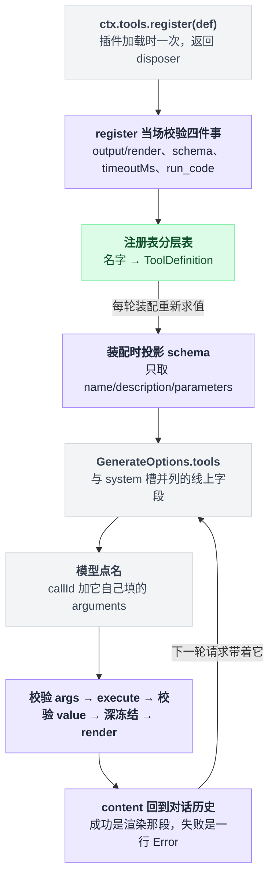
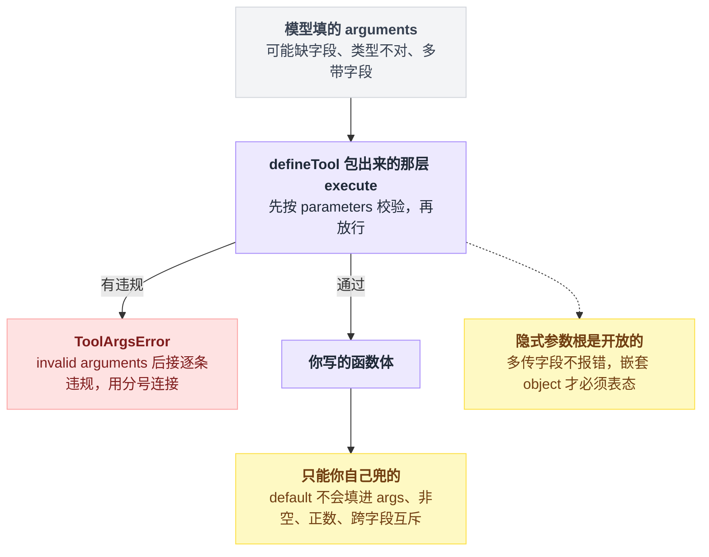
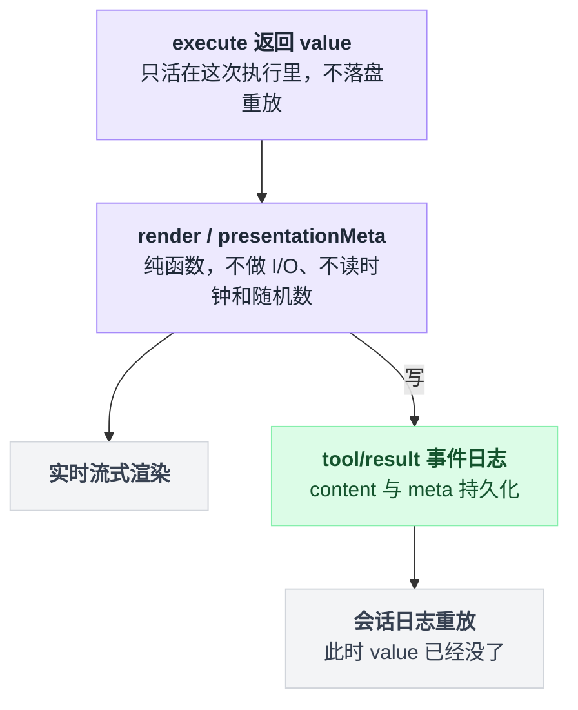
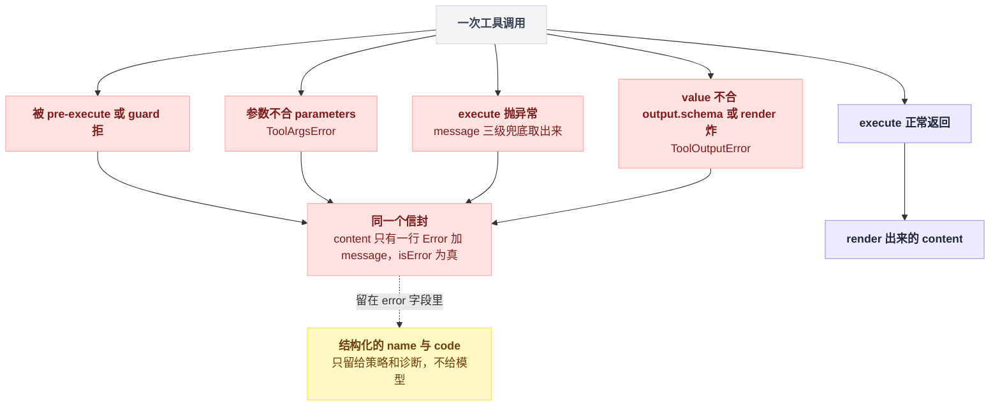
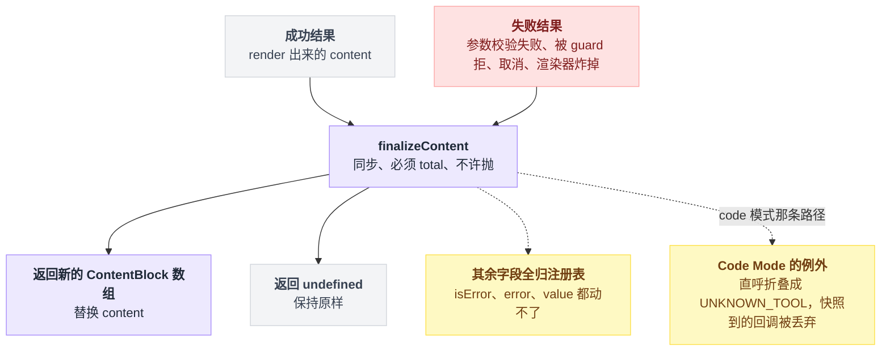
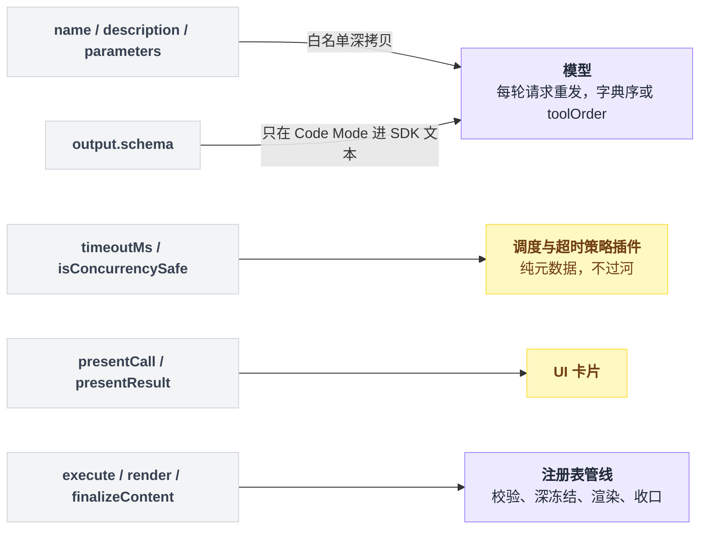

# 12 · 写一个工具

> 基于 `deepseek-ai/deepseek-harness` v0.1.0-rc.5（commit `47f9438`），2026-08-14 核对。

到这一章为止，你已经会写插件、会用 Service、会挂事件。现在做一件模型真的看得见的事：给它一个新工具。

本章只管"怎么把一个能力做成模型可调用的工具"——注册形状、参数校验、返回什么、报错怎么写、模型最终看到什么。拦截别人的工具、改别人的结果，那是[第 13 章](./13-工具执行管线.md)。

先给一个心理准备：这一章代码量不大，真正难的是文字。工具的成败大半取决于 `description` 怎么写、参数怎么起名、返回的那句话说没说清楚——这三样都没有编译器帮你兜。00 章说过"难点搬了家"，这一章就是搬家现场。

一个工具的完整路径是这样的：注册只发生一次，schema 每轮重发，`execute` 只在模型点名的时候跑。



---

## 工具不是一个函数，是三条通道

新手最容易带着这样的心智进来："工具就是一个函数，模型传参数、我返回结果。"

在 dsh 里这个模型不够用。一次工具调用同时喂三个不同的收件人：

```
注册时（每轮模型请求都重发）
    name + description + parameters ──► 模型请求里的 tools 字段

调用时（一次）
    execute() 返回 value
        ├─ 按 output.schema 校验 → 深冻结 ──► 程序读它（Code Mode / post-execute 策略）
        ├─ output.render(args, value) ──► content ──► 模型读它
        └─ output.presentationMeta(args, value) ──► meta ──► UI 卡片
```

**schema 通道**上行的是 `name` / `description` / `parameters` 三个字段，随每次模型请求重发。模型判断"要不要调、怎么填参数"，依据只有这三样。

**value 通道**是 `execute` 的返回值。它会被 schema 校验、深冻结，然后交给渲染器；在 Code Mode 下它就是程序直接拿到的返回值。（Code Mode 指模型不直接发工具调用，而是写一段程序去 `await tools.xxx(args)`，[第 21 章](./21-CodeMode.md)专讲。）

**content 通道**是 `output.render(args, value)` 产出的 `ContentBlock[]`，这才是回到对话里、模型真正读到的文字。

`ToolDefinition` 的字段清单在 `packages/core/tools/src/index.ts:222-288`，`ToolOutputDefinition` 在同文件 `:212-219`。"value 与 content 分开声明"是 dsh 相对朴素工具框架最主要的取舍，后面单开一节讲它值不值。

---

## 最小形状：十几行就能跑

官方教程里的完整插件，原样照抄（`docs/user/develop/basic/tool.md:11-34`）：

```ts
import type { Context } from '@deepseek-ai/cordis'
import { defineTool } from '@deepseek-ai/dsh-tools'

export const name = 'greet-tool'
export const inject = ['tools']

export function apply(ctx: Context) {
  ctx.tools.register(defineTool({
    name: 'greet',
    description: 'Greet someone by name.',
    parameters: {
      name: { type: 'string', required: true, description: 'The name to greet' },
    },
    output: {
      schema: { type: 'string' },
      render: (_args, value) => [{ type: 'text', text: value }],
    },
    async execute(args) {
      return `Hello, ${args.name}!`
    },
  }))
}
```

逐个看这几处。`export const inject = ['tools']` 让插件等 `ctx.tools` 服务就绪后才加载（`docs/user/develop/basic/index.md:91-101`）。`ctx.tools.register(def)` 返回一个 disposer，调用它就注销，插件卸载时自动调用（`packages/core/tools/README.md:20`）。`defineTool(...)` 干两件事：从 `parameters` 推出 `args` 的类型并在运行时校验，从 `output.schema` 推出返回值类型（`packages/core/tools/src/schema.ts:545-617`）。`output.schema` 是必填的，`execute` 的返回值按它校验，不过就算工具失败（`packages/core/tools/src/index.ts:1793-1796`）。`output.render` 必须是纯函数，把 value 变成模型看的 content（`:1798-1804`）。

`defineTool` 是给"第一方插件作者"的糖（`packages/core/tools/README.md:65`）。你也可以直接给 `ctx.tools.register` 一个裸 JSON Schema 定义，但那样**输入校验完全归你自己**（`packages/core/tools/README.md:95`）。除非你在桥接 MCP（Model Context Protocol，外部工具服务器协议，[第 20 章](./20-MCP与其它扩展点.md)）这类外部 schema，否则一律用 `defineTool`。

`register` 当场就会拒绝四种东西（`packages/core/tools/src/index.ts:1037-1062`）：缺 `output` 或 `render` 不是函数（`:1040-1043`）、`output.schema` 用了不受支持的 JSON Schema 构造（`assertSupportedJsonSchema`，`:1045`）、`timeoutMs` 不是正有限数（`:1046-1050`）、名字叫 `run_code`（保留给 Code Mode 的传输通道，`:1054-1056`）。同一层里重名也直接抛（`packages/core/tools/README.md:20`）。

---

## `description` 是写给模型看的产品文案

这是全章唯一没有编译器帮你兜底的字段，也是最值得花时间的一处。仓库里真实工具的写法值得抄。`tool-todo` 的描述开头长这样（`packages/todo/tool-todo/src/index.ts:45-49`）：

```ts
const DESCRIPTION_HEAD =
  'Record and update a structured task list for the current work. Send the ENTIRE '
  + 'list every call — it REPLACES the previous list (there are no partial updates, '
  + 'no per-item edits). Use it to plan multi-step work and show progress: add one '
  + 'todo per concrete step before you start. '
```

三点可以直接迁移。

先说这是干什么的，再说什么时候用它——"Use it to plan multi-step work" 那半句就是在教模型择时，而不是解释功能。

把不可逆或者易错的语义大写强调。`ENTIRE`、`REPLACES` 这两个词是有的放矢：全量替换 vs 增量更新是模型天然会猜错的一类语义，猜错的代价是把你的待办列表洗掉。

描述要随配置变。`tool-todo` 的描述由 `describe(allowParallel)` 生成（调用点在 `packages/todo/tool-todo/src/index.ts:151`，函数体在 `:74-78`），配置一改描述跟着改。写死一句和实际行为不符的话，比不写更坏。

还有第二条文本通道容易被忽略：`ctx.systemPrompt.section({ name, order, text })`。`read` 工具用它写"用 read 而不是 cat"这种跨工具的使用纪律（`packages/fs/tool-fs/src/read.ts:70-74`），`terminal` 用它写"什么时候才该开持久终端"（`packages/terminal/tool-terminal/src/index.ts:156-160`）。工具指引的 order 带是 **100–199**（`packages/core/system-prompt/README.md:34`）。

两者分工很清楚：`description` 回答"这个工具是什么、参数怎么填"，prompt section 回答"在整个工作流里什么时候该用它、别用什么代替"。注册 section 需要在 `inject` 里加上 `'systemPrompt'`（`packages/fs/tool-fs/src/index.ts:22`）。

---

## 参数怎么声明，谁来校验

`parameters` 不是裸 JSON Schema，是一套简化 DSL：一张"属性名 → spec"的表，表本身就是隐式的对象根。

| 能写的 `type` | 备注 |
|---|---|
| `string` `number` `integer` `boolean` `null` | 支持 `enum` / `const`，字面量类型必须与 `type` 一致 |
| `array` | `items` 可省，省了只做容器类型检查 |
| `object` | **必须显式写 `additionalProperties: true \| false`** |
| `json` | 作者专用的无约束 JSON 节点 |
| `oneOf` | 恰好命中一支，至少两个分支 |

联合类型定义见 `packages/core/tools/src/schema.ts:85-94`。注意 `required` 是**写在每个属性上的 `required: true`**，不是根上的数组（`packages/core/tools/src/schema.ts:97`），这跟标准 JSON Schema 不一样，第一次写很容易顺手写成数组。

有三个坑。

隐式的参数根是开放的，模型多传字段不会报错——编译时根本没写 `additionalProperties`（`packages/core/tools/src/schema.ts:449-458`）。但你手写的嵌套 `object` 必须表态，写了 `false` 就会拒收多余键（`packages/core/tools/src/json-schema.ts:573-577`）。

`default` 不生效。它只是个注解，不会被填进 `args`（`packages/core/tools/README.md:95`）。默认值要在 `execute` 里自己兜。

DSL 表达不了的约束得手查。非空字符串、正数、跨字段互斥，都要在 `execute` 开头自己校验（`docs/cookbook/adding-a-tool.md:42`）。

这三个坑落在同一张图上：校验分两层，`defineTool` 那层管得住的，和只能你自己兜的。



校验发生在 `defineTool` 包出来的那层 `execute` 里，先校验再进你的函数体（`packages/core/tools/src/schema.ts:585-589`）。失败抛 `ToolArgsError`，消息是 `invalid arguments: <逐条违规，用 "; " 连接>`（`packages/core/tools/src/schema.ts:461-470`）。模型收到的完整文本长这样：

```
Error: invalid arguments: missing required property "path"
```

违规文案的模板在 `packages/core/tools/src/json-schema.ts:564`，外层那个 `Error: ` 信封下一节讲。

---

## `value` 给程序，`content` 给模型

`execute` **只**返回 `output.schema` 声明的那个 JSON 值（`docs/cookbook/adding-a-tool.md:45`）。注册表拿到之后走四步：快照成无损 JSON、按 schema 校验、深冻结、交给 `render` 渲染成 content（`packages/core/tools/src/index.ts:1793-1804`）。

`tool-todo` 是最干净的示范。它的 value 里带着结构化的 `todos` 数组和 `counts` 三个计数（`packages/todo/tool-todo/src/index.ts:172-200`），而 content 只有一句话（`:201-204`）：

```ts
render: (_args, value) => [{
  type: 'text',
  text: `Updated todo list: ${value.counts.pending} pending, ${value.counts.inProgress} in progress, ${value.counts.completed} completed.`,
}],
```

三个产物的去向不一样：

| | `value` | `content` | `meta`（`presentationMeta`） |
|---|---|---|---|
| 收件人 | Code Mode 里的程序、post-execute 策略 | 模型（对话历史） | UI 卡片 |
| 形态 | 结构化 JSON，按 schema 校验 | `ContentBlock[]` | 任意无损 JSON |
| 是否落盘重放 | **否**，只活在这次执行里 | 是 | 是，随 `tool/result` 持久化 |

value 不重放、meta 持久化，见 `packages/core/tools/README.md:114`。`ContentBlock` 的内置 type 是 `text` / `reasoning` / `image` / `tool-call` / `tool-result`（`packages/llm/llm/src/types.ts:99-105`），实际用到的几乎全是 `{type:'text'}`——但别把这张表当封闭枚举写死，它是 declaration merging 可扩展的，插件能加新块。

选型规则一句话：**value 是 API，content 是话。** 要 id、要字段、要能被程序 `.field` 取的，放 value；要解释状态、要说明"这是部分结果"的，放 content。不要为了让模型看懂就把 JSON 塞进 content，也不要让调用方去 parse 你的散文找 id（`docs/cookbook/adding-a-tool.md:45`）。

`render` 和 `presentationMeta` 必须是纯函数。它们会在实时流式渲染时跑，也会在会话日志重放时跑，所以不能做 I/O、不能读时钟和随机数（`docs/cookbook/adding-a-tool.md:86`）。`read` 工具把结构化的行窗口投进 `meta`，就是为了重放时还能还原出那张代码卡片（`packages/fs/tool-fs/src/read.ts:120-132`）。

纯函数这条约束的由来，是渲染器要在两条时间线上各跑一遍，而第二遍跑的时候 value 早就不在了。



> 想知道这一点上 Pi / Codex / LangChain 怎么做，见 [五个 agent 系统源码解剖](../2026-08_五个agent系统源码解剖/00-总览与阅读指南.md)。

---

## 报错也是写给模型看的

模型看到的失败结果，**只有一行**。生成它的函数在 `packages/core/tools/src/index.ts:1870-1878`：

```ts
function toolErrorResult(error: unknown): ToolExecutionResult {
  const info = errorInfo(error)
  const message = errorMessage(error)
  return {
    content: [{ type: 'text', text: `Error: ${message}` }],
    isError: true,
    error: { message, ...info ? { info } : {} },
  }
}
```

`message` 的取法是三级兜底：`Error` 实例取 `.message`，否则找对象上的字符串 `message`，再否则 `String(error)`（`packages/core/tools/src/index.ts:608-622`）。结构化的 `{ name, code }` 只留给策略和诊断，**不给模型**（`:475-486`）。被 pre-execute 或 guard 拒绝时也是同一个信封：`Error: ${denialReason}`（`:1494`）。

四条失败路径进来，出去只有一个形状；结构化的那部分留在原地不过河。



知道了这个，三条写法就是顺推出来的。

消息要自带上下文，因为模型看不到 `code`、看不到栈、也看不到你是哪个工具的哪一行。`limit must be less than or equal to 2000` 比一个光秃秃的 `RangeError` 有用得多（`packages/fs/tool-fs/src/read.ts:60`；这里的 2000 是该部署配的行上限，默认值 `READ_LIMIT` 见同文件 `:16`）。

说清下一步该怎么做。`todo_write requires an owning agent session`（`packages/todo/tool-todo/src/index.ts:211`）、`invalid todos: at most one task may be in_progress (got 3)`（`:108`）——模型读完就知道怎么改了重试。

最后一条最容易做错：分清两类失败。基础设施失败（文件不存在、后端不可用）用 `throw`；**成功完成的领域结果**（命令退出码非 0、搜索无结果）要放进 value，让 `render` 去解释那个不理想的状态（`docs/cookbook/adding-a-tool.md:46`）。把"命令退出码 3"抛成异常，你就把 stdout 一起丢了。

还有两个会悄悄变成 `isError` 的来源。返回值不合 `output.schema` 会抛 `ToolOutputError`，消息形如 `tool "x" returned invalid output: ...`（`packages/core/tools/src/index.ts:513-522`）；`render` 或 `presentationMeta` 自己抛异常，也被收敛成同一个错误类（`:525-527`）。所以渲染器里别写可能炸的逻辑。

---

## `finalizeContent`：最后一道只能改文字的关口

签名和契约都在 `packages/core/tools/src/index.ts:236-247`，读起来约束很硬：同步、必须 total、不许抛。

它只能替换 `content`，其余字段全部由注册表所有，返回 `undefined` 就是保持原样（`packages/core/tools/src/index.ts:1648-1654`）。它对**每一个规范化后的结果各跑一次**，包括那些绕过了 post-execute 的失败——参数校验失败、被 guard 拒绝、取消、渲染器炸掉，都会经过它（`:238-241`）。唯一的例外在 Code Mode：`code` 模式下模型直呼某个工具会先被折叠成 `UNKNOWN_TOOL`，那条路径上快照到的回调被丢弃（`:1405-1410`）。回调本身在调用**开始时**就被快照下来（`:1398-1410`），执行途中换掉定义也不影响这一次。

这道关口的进出口窄成这样：进来的是每一条规范化后的结果，出去只有两种可能。



它的真实用途只有一个：**给最终文本加一条与结果好坏无关的不变量。** `tool-terminal` 用它统一把输出压到字节上限（`packages/terminal/tool-terminal/src/index.ts:152-155`），`tool-jobs` 用它按可见输出配额截断并补一个 `[output truncated]`（`packages/jobs/tool-jobs/src/index.ts:238-257`）。

这里最容易踩的是拿它当业务逻辑用。它没有 async，抛异常会被外层再包一层错误，而且失败路径也会进来——你想在里面判断"成功时才怎样"，就得先自己查 `result.isError`。需要改 value、需要拦截、需要 async，那是[第 13 章](./13-工具执行管线.md)的 `tools/post-execute`，不是这里。

---

## 一个完整可照抄的工具插件

下面这个 `count_lines` 改编自仓库里既有工具包的形状：`tool-fs` 的 section、`isConcurrencySafe` 和 `presentCall`，`tool-terminal` 的 `finalizeContent`，配置写法来自 `docs/user/develop/basic/config.md:23-31` 的 Schemastery 示例。**这段整体没在仓库里原样存在，也没跑过**——每个字段都能追溯，但组合是新的。文件放在 `scratch-plugin/src/count-lines.ts`：

```ts
import { readFile } from 'node:fs/promises'
import type { Context } from '@deepseek-ai/cordis'
import Schema from '@deepseek-ai/schemastery'
import { defineTool } from '@deepseek-ai/dsh-tools'

export const name = 'count-lines-tool'
export const inject = ['tools', 'systemPrompt']

export interface Config {
  maxContentChars: number
}

export const Config: Schema<Config> = Schema.object({
  maxContentChars: Schema.number().default(2000),
})

export function apply(ctx: Context, config: Config) {
  ctx.systemPrompt.section({
    name: 'tool:count-lines',
    order: 140,
    text: 'Use count_lines to size a text file before reading it; do not shell out to wc for this.',
  })

  ctx.tools.register(defineTool({
    name: 'count_lines',
    description: 'Count the lines and bytes of one UTF-8 text file. '
      + 'Call it before read when you need to decide whether a file fits in one read window. '
      + 'It never returns file content.',
    parameters: {
      path: { type: 'string', required: true, description: 'Absolute path of the file to measure.' },
      ignore_blank: { type: 'boolean', description: 'Exclude blank lines from `lines`. Defaults to false.' },
    },
    output: {
      schema: {
        type: 'object',
        additionalProperties: false,
        properties: {
          path: { type: 'string', required: true },
          lines: { type: 'integer', required: true },
          blankLines: { type: 'integer', required: true },
          bytes: { type: 'integer', required: true },
        },
      },
      render: (_args, value) => [{
        type: 'text',
        text: `${value.path}: ${value.lines} lines (${value.blankLines} blank), ${value.bytes} bytes.`,
      }],
    },
    isConcurrencySafe: () => true,
    presentCall: args => ({
      card: 'generic',
      title: `Count lines in ${args.path}`,
      kind: 'read',
      locations: [{ path: args.path }],
    }),
    finalizeContent: (_exec, result) => {
      const only = result.content.length === 1 ? result.content[0] : undefined
      if (only?.type !== 'text' || only.text.length <= config.maxContentChars) return undefined
      return [{ type: 'text', text: `${only.text.slice(0, config.maxContentChars)}\n[truncated]` }]
    },
    async execute(args, exec) {
      if (!args.path.startsWith('/')) {
        throw new Error(`path must be absolute, got ${JSON.stringify(args.path)}`)
      }
      const text = await readFile(args.path, { encoding: 'utf8', signal: exec.signal })
      const segments = text.split('\n')
      const all = text.length === 0
        ? []
        : segments.at(-1) === '' ? segments.slice(0, -1) : segments
      const blank = all.filter(line => line.trim() === '').length
      return {
        path: args.path,
        lines: args.ignore_blank === true ? all.length - blank : all.length,
        blankLines: blank,
        bytes: Buffer.byteLength(text, 'utf8'),
      }
    },
  }))
}
```

几处的出处对照。`readFile(..., { signal: exec.signal })` 抄自 `docs/cookbook/adding-a-tool.md:32`，工具必须响应取消信号（`:47`）。`isConcurrencySafe: () => true` 是 `read` 的写法（`packages/fs/tool-fs/src/read.ts:135`），但它只保证"不改父级持有的状态"，共享状态必须自己扛得住并发，否则一律别开（`packages/core/tools/README.md:101`）。`presentCall` 里 `generic` 卡片的字段见 `packages/core/tools/src/presentation.ts:53-75`，`kind` 的取值集见 `:15`，`locations` 里 `{ path, line? }` 的形状见 `:23-26`。

还有两处是刻意的取舍。`split('\n')` 之后要丢掉行尾换行造成的末尾空段，否则每个正常文本文件都会多数出一行。`maxContentChars` 按字符而不是字节截断，因为按字节切 UTF-8 会把多字节字符切碎；真要按字节压，照抄 `tool-terminal` 的做法（`packages/terminal/tool-terminal/src/index.ts:152-155`）。

另外这个示例直接用 `node:fs/promises` 读盘，跟 cookbook 的最小形状一致，而仓库里的真 fs 工具全部走 `ctx.fs` 服务（`packages/fs/tool-fs/src/read.ts:144-146`）。要受沙箱管辖就得走后者，见[第 18 章](./18-沙箱审批与权限.md)。

---

## 挂进 web profile 跑起来

profile 就是一份有序的插件清单（[第 03 章](./03-配置的四层结构.md)），web profile 是 Web UI 那份。一个 patch 文件就能把本地插件插进去，形状见 `docs/user/develop/basic/index.md:50-54`，带 `config` 的那行见 `docs/user/develop/basic/config.md:36-43`。写进 `scratch-plugin/cordis.yml`：

```yaml
- insert:
    - id: count-lines
      name: '/absolute/path/to/scratch-plugin/src/count-lines.ts'
      config:
        maxContentChars: 2000
```

```sh
pnpm dsh web --patch ./scratch-plugin/cordis.yml
```

命令出自 `docs/user/develop/basic/tool.md:43`（`pnpm dsh` 这个形态假设你在仓库 checkout 里跑，见 `docs/user/develop/basic/index.md:5`）。`--patch` 必须跟在 `web` 后面，写在 `web` 前面会被显式拒绝（`apps/cli/src/args.ts:152`、`:163`）。打开 `http://127.0.0.1:3080`，让模型 `Use count_lines on /etc/hosts`，工具结果那一条应当是一行 `/etc/hosts: 12 lines (2 blank), 210 bytes.`，数字随机器。

不成的话，三种迹象各指向不同的原因。启动时插件一直 pending、工具从没出现过，多半是 `inject` 里的服务没人提供——注意 `systemPrompt` 本身就是 `ctx.tools` 的依赖（`packages/core/tools/src/index.ts:788`），profile 里缺了它整棵都不亮。模型说"没有这个工具"，那是插件根本没加载，通常是 patch 里的路径不是绝对路径，或者 `id` 跟已有的行撞了。模型调了但收到 `Error: invalid arguments: ...`，说明参数 schema 和描述对不上，模型按描述填、按 schema 挨拒。

想确认"模型到底收到了什么 schema"，去看 `docs/tool-catalog.md`。它不是手写文档，而是**启动每个工具插件、真的调 `ctx.tools.schemas()` 采出来的**生成物（`docs/tool-catalog.md:6,8`）。你自己的工具也可以用同样的思路验证。

---

## 模型最终看到的到底是什么

有个常见误解：以为工具 schema 被拼进了 system prompt 的文字里。不是。

注册表在构造时把自己挂成一个 tool schema provider——`ctx.systemPrompt.tools(context => this.wireSchemas(context.scope))`（`packages/core/tools/src/index.ts:832`），provider 每次装配都会被重新求值（`packages/core/system-prompt/README.md:23`）。装配产物 `PromptAssembly` 里 `sections` 和 `tools` 是**两个并列字段**（`packages/core/system-prompt/README.md:35`）。最后 `tools` 进的是 `GenerateOptions.tools`，由各家 adapter 映射到 provider 的 `tools` 线上字段（`packages/llm/llm/src/types.ts:334-335`），和 `system` 槽是分开的。

你在一个 `ToolDefinition` 里写下的东西，各有各的读者，大部分压根不往模型那边走。



过河的只有三个字段：`ToolSchema = { name, description, parameters }`（`packages/llm/llm/src/types.ts:312-317`），投影时按白名单深拷贝（`packages/core/tools/src/index.ts:1256-1266`）。所以你写的那一堆东西里：

| 你写的 | 模型看得到吗 |
|---|---|
| `name` / `description` / `parameters` | 看得到，每轮请求都重发 |
| `output.schema` | native 模式下看不到 |
| `timeoutMs` | 看不到 |
| `isConcurrencySafe` | 看不到，纯调度元数据 |
| `presentCall` / `presentResult` | 看不到，只喂 UI |

`output.schema` 只在 Code Mode 下才会生成进 SDK 文本，见[第 21 章](./21-CodeMode.md)。`timeoutMs` 那行源码里写得很直白，NEVER sent to the model（`packages/core/tools/src/index.ts:250-252`）；而且它只是个声明，不装超时策略插件不会真生效（`packages/core/tools/README.md:195`）。

顺序也不是你的注册顺序：默认按名字字典序，配了 `systemPrompt.toolOrder` 就按配置来（`packages/core/system-prompt/README.md:14`）。注册顺序被视为插件加载的偶然产物，故意抹掉。这件事对 KV cache（把请求前缀的注意力计算结果缓存下来复用）有直接影响——可见工具集和顺序不变时前缀可复用，一旦增删或改序，从第一个变化的 schema token 起缓存全部失效（`packages/core/tools/README.md:145`）。

调用完成之后，模型看到的就两种形态：成功时是 `output.render` 产出、可能被 `finalizeContent` 改过的 content，失败或被拒时是那一行 `Error: <message>`（`packages/core/tools/README.md:180`）。

想在不启动模型的情况下走一遍完整管线，`docs/cordis-tutorial/07-into-the-harness.md:37-45` 给了直接调 `ctx.tools.execute({ callId, name, arguments, signal })` 的写法，再配一个监听 `tools/result` 的插件（`:62-69`），就能把 content 打出来看。

---

## 一句话带走

**工具的代码是最简单的部分：`description` 决定模型调不调，`parameters` 决定它填不填得对，`render` 出来的那句话决定它接下来干什么——三样都是文字，都没有编译器帮你兜。**

写完这一章的工具之后，下一步要么去[第 13 章](./13-工具执行管线.md)看怎么拦截和改写别人的工具结果，要么去[第 18 章](./18-沙箱审批与权限.md)把读盘换成受沙箱管辖的 `ctx.fs`。

---

## 本章未确认

- ⚠️ 那个完整可照抄的 `count-lines` 插件是按仓库既有工具包的形状拼出来的，每个字段都有出处，但**整段代码在仓库中并不存在，也没有跑过**（仓库未装依赖）。`Buffer.byteLength` 是 Node 全局，不是 dsh API。
- ⚠️ 本地插件路径必须绝对还是可以相对，官方文档自相矛盾：`docs/user/develop/basic/index.md:56` 写"必须绝对"，而 `docs/user/develop/basic/config.md:39` 的示例用了相对路径 `'./src/my-plugin.ts'`。本章按"绝对路径"写，未实测。
- ⚠️ 「参数校验失败 / 被 guard 拒绝时 `finalizeContent` 仍会执行」有源码内的契约注释（`packages/core/tools/src/index.ts:238-241`）与调用路径（`:1489-1499` 走 `post-result` → `:1631-1645` 的 `applyFinalContent`）支撑，未实际运行验证；Code Mode 折叠那条例外读自 `:1398-1410` 的注释与 `finalizerFor()`，同样未实测。
- ⚠️ `Error: <message>` 这行文本是否会被某些 LLM adapter 在发出前再加工（例如包成 provider 特有的 tool-result 结构），未逐个适配器核对。
- ⚠️ `presentCall` / `presentResult` 返回的卡片在 dsh web UI 里的实际外观未验证，本章只依据 `packages/core/tools/src/presentation.ts` 的类型声明与注释描述。
- ⚠️ 「挂进 web profile 跑起来」那节列的三种失败迹象，后两条是从机制推的常见因果，不是从仓库里的诊断信息原文抄的；[第 25 章](./25-调试手册与常见坑.md)有完整的错误信息对照表。
