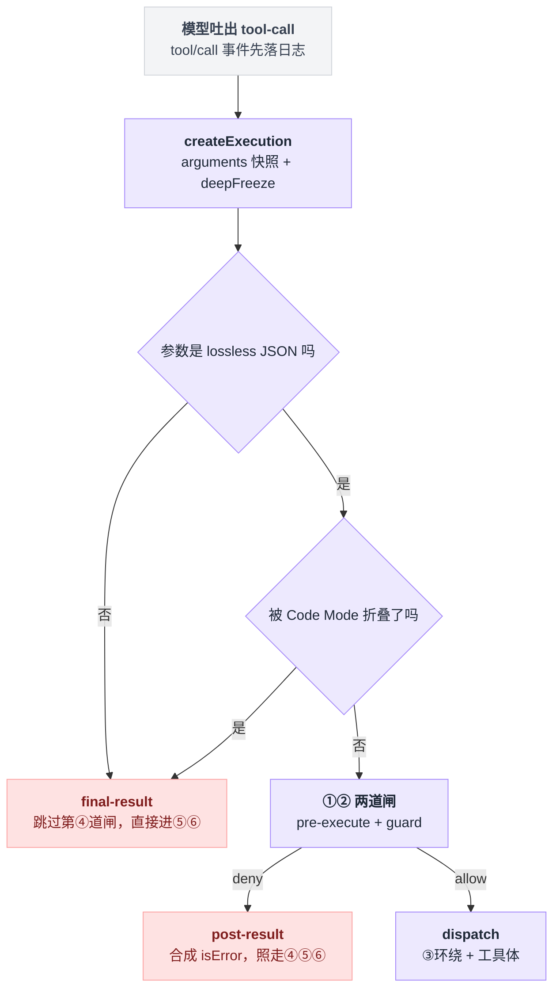
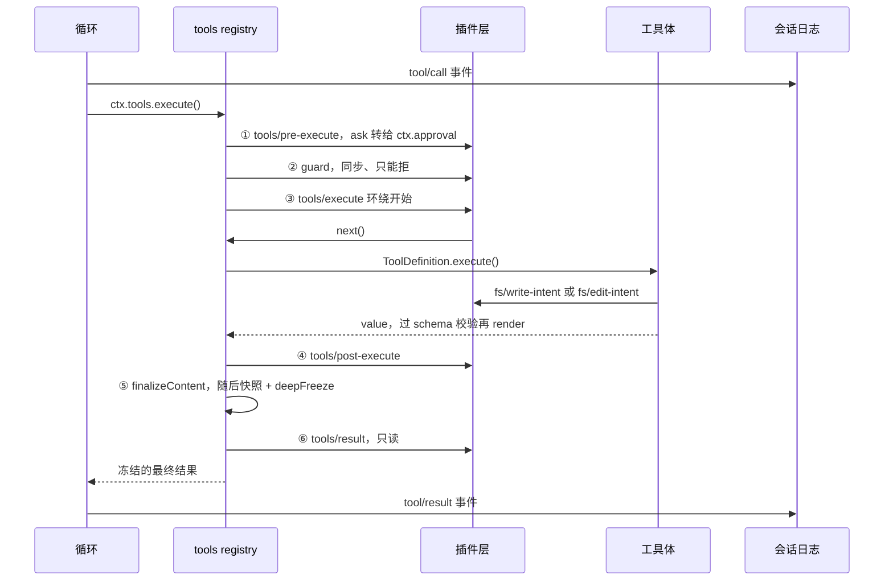
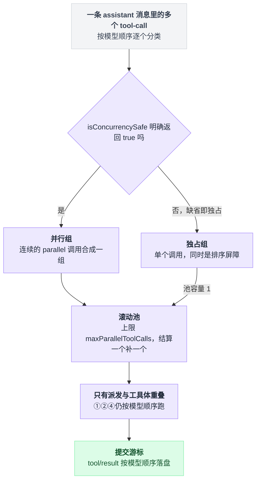
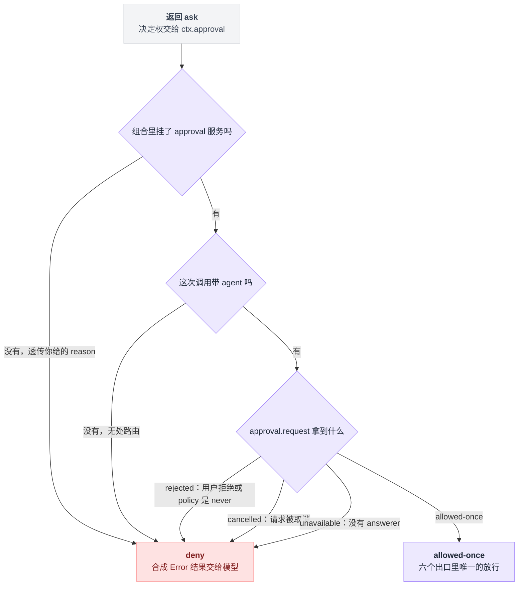
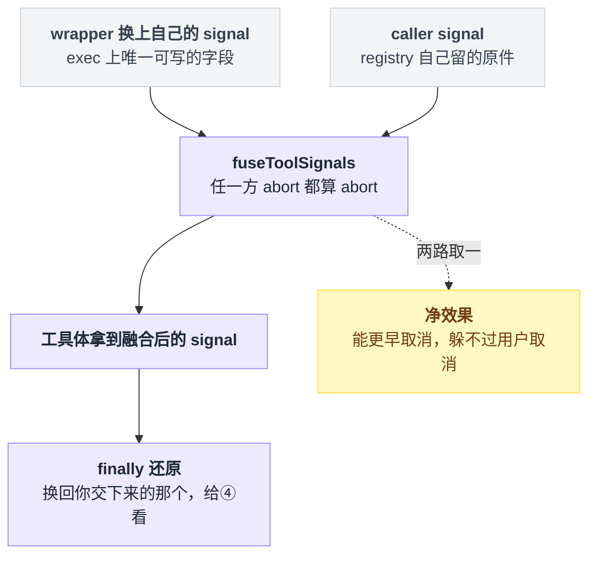
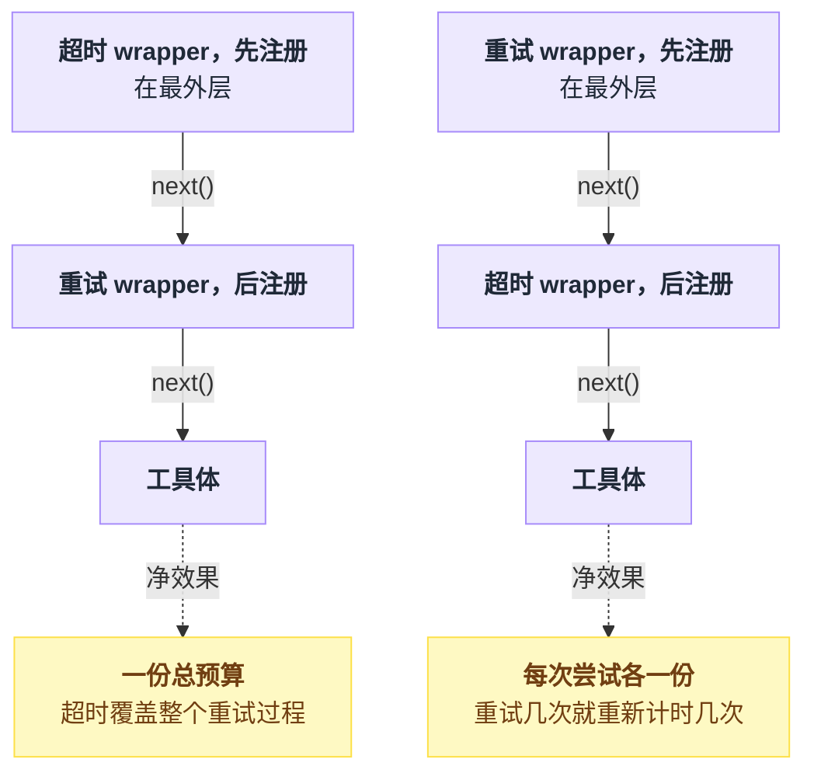
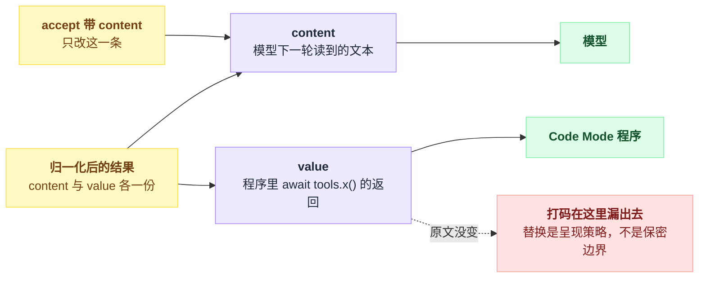

# 13 · 工具执行管线

> 基于 `deepseek-ai/deepseek-harness` v0.1.0-rc.5（commit `47f9438`），2026-08-14 核对。

你想加一条"不许跑 `rm -rf /`"的规则，或者想在模型编辑完文件之后跑一遍 lint、报错了就让它回头改。

这两件事在 dsh 里都做得到，但挂错地方就会得到完全不同的结果——有的规则别人一行配置就能绕过去，有的拦截根本轮不到你执行。

所以这一章不讲"能不能"，讲**顺序**：一次工具调用从模型吐出 tool-call 到结果回到对话里，中间要过六道闸，每道闸拿到什么、能改什么、改不了什么。读完你应该能对着自己的需求直接说出"这事该挂在第几道"。

waterfall 这个机制本身怎么运转、`next()` 到底做了什么、全仓有哪些拦截点，第 11 章已经讲透了。这里只讲工具管线这一条链路上，每个点各自的业务语义。

---

## 一次工具调用要过六道闸

一句话：**落日志 → ① 策略决定跑不跑 → ② guard 一票否决 → ③ 环绕派发 → ④ 改模型看见的东西 → ⑤ 工具自己收尾 → ⑥ 只读观察 → 再落一次日志。**

模型吐出 tool-call 之后，`ctx.tools.execute()` 并不是直接调你注册的 `execute()`。它是这条固定顺序管线的入口（`packages/core/tools/src/index.ts:1342`）。

```
模型发出 tool-call
      │
      ▼  tool/call 事件先落日志（模型可见 ⟺ 已落日志，见第 16 章）
┌─ ① tools/pre-execute ── waterfall ───────────────────┐
│   返回 allow / deny / ask                            │
│   ask ─▶ ctx.approval ─▶ 只有 allowed-once 才放行     │
└──────────────┬───────────────────────────┬───────────┘
         allow │                      deny │
               ▼                           │
┌─ ② 注册的 guard（同步、单调，只能 deny）─┐  │
└──────────────┬────────────────┬─────────┘  │
          放行 │           deny │            │
               ▼                ▼            ▼
┌─ ③ tools/execute ── waterfall（环绕）─┐   合成 isError 结果
│   ┌──────────────────────────────┐   │   content = "Error: <reason>"
│   │ ToolDefinition.execute()     │   │            │
│   └──────────────────────────────┘   │            │
└──────────────┬───────────────────────┘            │
               ▼  value → output.schema 校验         │
                  → output.render() → content        │
               ▼                                     ▼
┌─ ④ tools/post-execute ── waterfall ─────────────────┐
│   accept(content?) / accept(value) / block(feedback)│
└──────────────┬──────────────────────────────────────┘
               ▼
┌─ ⑤ ToolDefinition.finalizeContent（同步，只能改 content）┐
└──────────────┬───────────────────────────────────────────┘
               ▼  lossless JSON 快照 + deepFreeze
┌─ ⑥ tools/result ── emit（只读观察，监听器异常被吞）┐
└──────────────┬────────────────────────────────────┘
               ▼  tool/result 事件落日志 → 模型下一轮看见
```

图里的 **lossless JSON**（无损 JSON）不是随口一说，在本仓库它有精确含义：能原样 JSON 序列化再还原回来的值。`undefined`、`BigInt`、循环引用、稀疏数组、`-0`、奇异对象都不算，碰上就当场失败（`packages/core/tools/README.md:123`）。管线在两头强制它——入口的 `arguments`，出口的最终结果。

官方也生成了一份 mermaid 版（`docs/tool-execution-pipeline.md:8`），比这张图多画了 UI 卡片和 `fs/*` 分支，可以对照着看。

进第①道闸之前还有一道分诊：`createExecution` 先把 `arguments` 快照冻上。在这一步就失败、或者被 Code Mode 折叠掉的调用根本进不了策略管线，走的是绕开第④道闸的 `final-result`；而过了闸门再被拒的，走的是仍要往下跑的 `post-result`。



六道闸的权限差别很大，先记住这张表，后面每一节展开一行：

| # | 关卡 | 类型 | 能改什么 | 改不了什么 |
|---|---|---|---|---|
| ① | `tools/pre-execute` | waterfall | 放行 / 拒绝 / 要审批 | 不能改 `exec.arguments` |
| ② | `ctx.tools.guard()` | 同步回调表 | 只能追加一条拒绝理由 | 不能放行、不能异步 |
| ③ | `tools/execute` | waterfall（环绕） | 只能换 `exec.signal` | 换不了 name / callId / arguments |
| ④ | `tools/post-execute` | waterfall | 换 content 或换 value（二选一）、block、挂 context | 不能同时换两个；不能给失败结果换 value |
| ⑤ | `finalizeContent` | 工具自己的回调，两条硬约束：必须同步、必须不抛异常 | 只能换 content | 其它字段一概归 registry |
| ⑥ | `tools/result` | emit | 什么都改不了 | 结果已冻结 |

前三个关卡的签名在 `packages/core/tools/src/index.ts:152`、`:163`、`:175`，`tools/result` 在 `:197`。

摊到时间轴上还能看清两件上面那张图没画的事：第③道闸是真的环绕在工具体外面，而 `fs/*` 那道闸开在工具体里面，只有 `tool-fs` 的写和编辑会碰到它（`packages/fs/tool-fs/src/write.ts:111`、`edit.ts:126`）。



以上说的都是一次调用。模型一口气吐出好几个 tool-call 时，循环先分组再滚动跑：

```
组 = []
for call in 这条 assistant 消息里的 tool-call:      # 严格按模型顺序
    if isConcurrencySafe(call) 明确返回 true:
        并进当前的并行组
    else:
        自己单独成一个独占组                        # 缺省即独占，同时是排序屏障

for g in 组:
    池上限 = maxParallelToolCalls if g 是并行组 else 1
    滚动池跑 g 里的调用，结算一个补一个
```

`maxParallelToolCalls` 默认 10，设成 1 就退回串行。真正重叠的只有派发和工具体，pre / post 两道闸和结果提交仍旧按模型顺序走。分组与滚动池见 `packages/core/agent-loop/src/tool-calls.ts:88`、`packages/core/agent-loop/README.md:40`。



> 想知道这一点上 Pi / Codex / LangChain 怎么做，见 [五个 agent 系统源码解剖](../2026-08_五个agent系统源码解剖/00-总览与阅读指南.md)。

---

## 第一道闸：allow / deny / ask，而 ask 多半会变成 deny

```ts
'tools/pre-execute'(exec: ToolExecution, next: () => Promise<PreToolDecision>): Promise<PreToolDecision>
```

决策只有三种（`packages/core/tools/src/index.ts:588`）：

```ts
type PreToolDecision =
  | { kind: 'allow' }
  | { kind: 'deny'; reason: string }
  | { kind: 'ask'; reason?: string }
```

一路 `next()` 穿到底，默认就是 `{ kind: 'allow' }`（`:1477`）。

**第一件事：你改不了参数。**

`exec.arguments` 是 `unknown`，而且已经 deep-freeze。README 把这条明确列为"故意不提供"，理由很硬：参数已经落进日志、已经渲染进 UI 了，你再改就会出现"日志里是 A、实际跑的是 B"。出处：`:323`、`:1416`，README 的说明在 `packages/core/tools/README.md:193`。

**第二件事：`ask` 不是弹窗。**

它只是把决定权交给 `ctx.approval` 这个可选服务（`:1689`），而降级路径写死在 `serviceAsk` 里——六个出口，只有一个放行：

| 情况 | 结果 | 模型看到的 reason |
|---|---|---|
| 组合里根本没有 approval 服务 | deny | **你在 `ask` 里给的 `reason`**；没给才是 `tool "X" requires approval (not yet supported)`（`:1696`） |
| 有服务，但这次调用没有 agent | deny | `tool "X" requires approval, but the call has no agent to route it through`（`:1702`） |
| 有服务、有 answerer，用户点了同意 | **allow** | —（`:1714`） |
| 用户点了拒绝，或 policy 是 `never` | deny | `the user rejected tool "X"`（`:1716`） |
| 审批请求被取消 | deny | `approval for tool "X" was cancelled`（`:1720`） |
| 没有任何 answerer 应答 | deny | `tool "X" requires approval, but no approval channel is available`（`:1724`） |

第一行那个 `??` 最容易看漏：只有你**没给** `reason` 时才会出现 "not yet supported" 那句。给了 reason，你这辈子都见不到它。

要让 `ask` 真的弹出来，得同时凑齐三层，缺哪层都是 deny。



**服务本身**通常不缺。`@deepseek-ai/dsh-user-approval` 挂在 base bundle（`packages/bundle/base/cordis.patch.yml:188`），而 base 是每个 profile 的第一层 patch，所以 web 和 headless 都有它。

**answerer** 就不一定了。`ctx.approval` 只负责把请求发进 `approval/request` waterfall，没人应答就 fail closed 成 `unavailable`。全仓的应答者只有两个：host api-proxy（`packages/host/apiproxy/src/api-proxy.ts:1422`）和 ACP 桥。web profile 挂了 api-proxy（`packages/bundle/web-app/cordis.patch.yml:100`），headless 则明写自己 "mounts no Host, HTTP server, Web runtime, or browser plugin"（`packages/bundle/headless/cordis.patch.yml:2`）。

结论很直接：**headless 下 `ask` 必然 deny**，文案是 "no approval channel is available"。

**policy** 这层藏着本章最反直觉的坑。base 把它配成 `DSH_PERMISSION_MODE === 'danger-full-access' ? 'never' : 'ask'`（`packages/bundle/base/cordis.patch.yml:191`），而 `never` 在服务里的含义是"每个 ask 直接返回 `rejected`"（`packages/interaction/user-approval/src/index.ts:312`）。

也就是说，**把权限开到最大，反而让所有 `ask` 全被拒**，而且模型收到的理由是"用户拒绝了"——根本没人拒绝过。

最后一件容易想错的事：**被拒的调用仍然会往下走。** 拒绝不是提前 return，registry 把它包成 `kind: 'post-result'`（`:1490`），content 是 `Error: ${denialReason}`（`:1494`），然后照样过第④⑤⑥道闸。所以审计类插件挂在 `tools/result` 上，能看到被拒的调用。

反例也有：Code Mode 折叠导致的 `UNKNOWN_TOOL`、参数不是 lossless JSON 的失败，走的是 `final-result`，**跳过** post-execute（`:1436`、`:1449`）。（Code Mode 是指模型不再一个个调工具，而是写一段程序去 `await tools.x()`，见第 21 章。）

---

## 第二道闸：guard 里根本没有"允许"这个返回值

waterfall 有个性质：它是可重排的。任何插件都能用 `{ prepend: true }` 把自己插到队首，然后直接返回 `{ kind: 'allow' }`，把你写在后面的 deny 短路掉。

这不是理论风险，仓库里真有插件在用 prepend（`packages/jobs/tool-jobs/src/index.ts:237`，不过那个监听器抢到队首之后照样 `next()` 放行，`:236`）。机制细节在 cordis 的 `EventsService.register()`：prepend 是 `unshift` 进队首而不是 `push`（`vendor/cordis/src/events.ts:255`，选项类型在 `:114`，`ctx.on(name, fn, true)` 这个 boolean 简写在 `:288`–`:291`）。

所以 dsh 另给了一层不可重排的：

```ts
type ToolGuard = (execution: Readonly<ToolExecution>) => string | undefined
```

返回字符串 = 拒绝，返回 `undefined` = 不表态。**没有"允许"这个返回值**——正因为没有，顺序就不影响结果：

```
def guard 决策(exec):
    for g in 全局层的 guard:                 # 挂在 plain context 上的
        r = g(exec)
        if r is not undefined: return 拒绝(r)
    for c in scope 链（从远到近）:
        for g in c 上的 guard:
            r = g(exec)
            if r is not undefined: return 拒绝(r)   # 第一条非 undefined 即终局
    return 不表态                             # 没有任何一条能说"放行"
```

签名在 `packages/core/tools/src/index.ts:711`，判定顺序在 `:1119`。注册用 `ctx.tools.guard(fn)`（`:1110`），挂在 plain context 上全局生效，挂在 `agent.ctx` 上就只管那一个 agent。

仓库里的真实用例是子 agent：structured output 一旦记录下来，就用一条 guard 把同一步里后续所有工具调用全部否掉（`packages/subagent/subagent-in-process-driver/src/structured.ts:109`）。

选型规则一句话：**能被别人绕过就失去意义的规则放 guard，需要跟别人协商（"我拦不住就交给下一个"）的放 waterfall。**

代价是 guard 只能同步——要做 IO 就只能回 waterfall；guard 也给不出 `ask`，它只有"拒"和"不表态"两档。

---

## 第三道闸：tools/execute 环绕整次派发

```ts
'tools/execute'(exec: ToolDispatchExecution, next: () => Promise<ToolExecutionResult>): Promise<ToolExecutionResult>
```

这是六道闸里唯一一个 `next()` 返回"结果"而不是"决策"的，用来做超时、重试、埋点。它拿到的 `exec` 是特制视图 `ToolDispatchExecution`：只把 `ToolExecution` 的 `signal` 从 readonly 改成可写，其余字段原样只读（`packages/core/tools/src/index.ts:391`）。

**能改的只有 signal，而且改不干净。** registry 在真正调用工具体之前，会把你换上去的 signal 和它自己保存的原始 caller signal 融合成一个，任一方 abort 都算 abort，派发前写回 `exec.signal`，`finally` 里再还原成你交下来的那个。对应 `fuseToolSignals`（`:1889`）、写回（`:1544`）、还原（`:1558`）。

翻译成人话：**你能让它更早取消，不能让它躲过用户的取消。**



**你伪造的成功结果会被重新审一遍。** wrapper 返回的 result 如果不是这次 dispatch 亲手产的（用 token 判定），registry 就把它当成"未归一化的候选"：`isError` 原样搬运，成功则拿 `result.value` 重新过一遍 `output.schema` 校验并 `output.render()` 重渲染（`normalizeDispatchResult`，`:1826`）。所以 wrapper 捏不出一个不符合工具输出契约的成功。

**多个 wrapper 按注册顺序套娃，先注册的在外层。** 这点在 cordis 源码里能直接读出来：`waterfall()` 拿到监听器数组后从**头部** shift，一个个往里递（`vendor/cordis/src/events.ts:234`–`:243`），入列顺序由 `register()` 的 `push` / `unshift` 决定（`:255`），于是 `{ prepend: true }` 等于抢最外层。

内置超时插件的 README 给了这件事的业务含义：超时注册在外层 = 超时覆盖整个重试过程，注册在内层 = 超时覆盖每次尝试（`packages/guard/timeout-policy/README.md:36`）。同样两个 wrapper，换个注册顺序就是两种预算：



---

## 第四道闸：post-execute 决定模型看见什么

```ts
type PostToolDecision =
  | { kind: 'accept'; content?: ContentBlock[]; value?: never; additionalContexts?: UserMessage[] }
  | { kind: 'accept'; value: JsonValue; content?: never; additionalContexts?: UserMessage[] }
  | { kind: 'block'; feedback: ContentBlock[]; additionalContexts?: UserMessage[] }
```

类型在 `packages/core/tools/src/index.ts:597`。`accept` 的两个重载互斥，同时给 `content` 和 `value` 会抛 `TypeError`（`:1757`）。

| 你返回 | registry 做什么 | 模型看到 | 程序化消费者（Code Mode 里的 `await tools.x()`）看到 |
|---|---|---|---|
| `accept`（不带字段） | 原样通过 | 原 content | 原 value |
| `accept { content }` | 只换 content，value 和 meta 不变（`:1776`） | 新 content | **原 value（没变！）** |
| `accept { value }` | 重新校验 schema、重新 render、重算 meta（`:1770` → `:1793`） | 重渲染出来的 content | 新 value |
| `block { feedback }` | 变成 `isError: true`，content = feedback 原文，error.message 由 feedback 文本拼出（`:1748`） | feedback 原文 | 抛 `ToolCallError` |

第三行是本章第二个大坑：**替换 content 不是保密边界。**

官方原话是 "Content replacement is presentation policy, not confidentiality policy"（`docs/subsystems/tools.md:404`）。你在 content 里把密钥打了码，Code Mode 程序里那个 `value` 仍然是原文。要真藏，只能 `block` 或者换 `value`。

（失败的绑定调用在程序里抛的 `ToolCallError` 只带 `toolName` 和 `message`，见 `packages/core/tools/README.md:161` 与生成它的 `packages/core/tools/src/ts-types.ts:288`。）

一个结果两条出口，而替换只落在其中一条上：



`block` 的三个后果，逐条记住。

副作用**不会回滚**：文件已经写了、命令已经跑了，block 只改变模型看到的结局。

工具体自己 `deferContext()` 挂上去的上下文会被丢掉，只有 blocking decision 自己带的 `additionalContexts` 留下（`:1738`）。

结果**不带 `value`**（失败结果没有 value，`:569`–`:572`），所以 Code Mode 里等这个返回值的程序拿到的是异常而不是数据。

还有一条不成文但全仓一致的写法：**先把 `next()` 的决策拿到手，再往上叠加，而不是抢在前面短路。**

```
async def 我的 post-execute(exec, result, next):
    先记账(exec, result)              # 自己要观察的东西，现在就记
    下游决策 = await next()           # 让别人先拿主意，他还能 block 或替换
    return 把提醒折进(下游决策)        # 只叠加，不否决
```

`repeat-tool-reminder` 的注释把理由写死了——"Observe-and-enrich, never veto"（`packages/guard/repeat-tool-reminder/src/index.ts:209`–`:224`）。

`spill-policy` 更能说明问题：它用 `{ prepend: true }` 抢了最外层（`packages/spill/spill-policy/src/index.ts:209`），却仍旧第一件事就 `await next()`，只对别人定好的结果做裁剪（`:190`–`:194`）；hooks 桥同理（`packages/hooks/hooks-claude-code/src/index.ts:254`）。

---

## 第五道闸：finalizeContent 是工具自己的底线

这一关不是事件，是 `ToolDefinition` 上的一个可选方法（`packages/core/tools/src/index.ts:247`）：

```ts
finalizeContent?(exec: Readonly<ToolExecution>, result: Readonly<ToolExecutionResult>): ContentBlock[] | undefined
```

四条硬约束：

| 约束 | 具体含义 | 出处 |
|---|---|---|
| 回调会被快照 | 调用一开始就把它存下来，防止参数 getter 中途把它换掉 | `:1408` |
| 恰好调一次 | 每个归一化结果一次，包括那些跳过了 post-execute 的管线失败 | `:1631` → `:1649` |
| 必须同步、必须不抛异常 | 它是工具自己的回调，这两条是硬约束：没有异步版本，抛了就是违约 | `:242` |
| 只能换 content | 返回 `undefined` 保持原样，返回数组只换 content，其余字段仍归 registry | — |

它的定位是"工具自己的最后一条不变量"，最典型的用途是长度封顶。`tool-jobs` 用它保证内容不超过可见预算，并且只在 policy 没动过默认渲染时才走那个保留"输出 / 状态"分栏的精细分支（`packages/jobs/tool-jobs/src/index.ts:238`–`:257`，挂在 `job_output`（`:314`）和 `job_kill`（`:369`）两个工具上）。

---

## 第六道闸：tools/result 只能看，不能动

签名在 `packages/core/tools/src/index.ts:197`，派发模式标在它上一行的 `@mode emit`（`:195`；`@mode` 这个 JSDoc 标签怎么声明事件派发模式，见第 10 章）。

派发之前 registry 会 `Object.freeze(exec)`，结果本身也已经过 lossless JSON 快照加 `deepFreeze`（`:1660`、`:1847`）。监听器抛异常只换来一条 `logger.warn`，然后被吞掉（`:1662`–`:1663`）。配套的 invariant 插件还会断言 exec 和 result 确实冻结了（`packages/core/tools/src/invariant.ts:23`）。

什么时候用它、什么时候用 post-execute？判据简单到不用犹豫：**只要你不需要改结果，就用它。**

官方对照表写得很干脆——"Final tool-result metrics / audit / capture" 用 `tools/result`，必须 transform 或挂 context 才降级用 `tools/post-execute`（`docs/cookbook/extension-cookbook.md:115`）。真实例子是 `agent-instructions`：用它记录"这一步碰过哪些文件"，再决定要不要注入子目录的 `AGENTS.md`（`packages/context/agent-instructions/src/index.ts:350`）。

顺带提醒一个几乎同名的陷阱：`tools/result` 是**内存里的实时事件**，`tool/result` 是随后落盘的**会话日志事件**（`packages/core/tools/README.md:39`）。少一个 s，差一整层。

---

## 动手一：拦掉危险的 bash 命令

bash 工具的参数是 `{ command, description, timeoutMs?, workdir?, ... }`，后面几个随后台任务和沙箱升级开关的有无而增减（`packages/shell/tool-bash/src/index.ts:245`–`:270`）。骨架照抄官方的 permission-gate 范式（`docs/cookbook/extension-cookbook.md:15`–`:31`），文件叫 `deny-dangerous-bash.ts`。

```ts
import type { Context } from '@deepseek-ai/cordis'
import Schema from '@deepseek-ai/schemastery'
import type { PreToolDecision } from '@deepseek-ai/dsh-tools'

export const name = 'deny-dangerous-bash'

export interface Config {
  patterns: string[]
  ask: boolean
}

export const Config: Schema<Config> = Schema.object({
  patterns: Schema.array(Schema.string()).default(['rm -rf /', 'mkfs', 'dd if=', '> /dev/sd']),
  ask: Schema.boolean().default(false),
})

export function apply(ctx: Context, config: Config) {
  ctx.on('tools/pre-execute', async (exec, next): Promise<PreToolDecision> => {
    if (exec.name !== 'bash') return next()
    const command = (exec.arguments as { command?: unknown }).command
    if (typeof command !== 'string') return next()
    const hit = config.patterns.find(pattern => command.includes(pattern))
    if (hit === undefined) return next()
    const reason = `deny-dangerous-bash: command contains "${hit}"`
    return config.ask ? { kind: 'ask', reason } : { kind: 'deny', reason }
  })
}
```

挂载写法如下（本地插件行的写法见 `docs/user/develop/basic/config.md:36`，四层配置见第 03 章）：

```yaml
- insert:
    - id: deny-dangerous-bash
      name: './deny-dangerous-bash.ts'
      config:
        patterns: ['rm -rf /', 'mkfs']
```

期望现象：模型调用命中的 bash，结果直接是 `Error: deny-dangerous-bash: command contains "rm -rf /"`，`tools/execute` 和工具体从未运行。

一旦开 `ask: true`，就得回头对着上面那张降级表读。注意这个例子**给了 `reason`**，所以第一行的 `??` 分支永远不会命中：

| 你在哪跑 | 模型看到什么 |
|---|---|
| 默认 web（base + web-app，policy = ask） | 浏览器弹审批，同意才跑 |
| headless（没有 answerer） | `Error: tool "bash" requires approval, but no approval channel is available` |
| `DSH_PERMISSION_MODE=danger-full-access` | `Error: the user rejected tool "bash"`（其实没人点过） |
| 自己拼的组合，压根没挂 approval 服务 | `Error: deny-dangerous-bash: command contains "rm -rf /"`（你的 reason 被原样透传，**不是** "not yet supported"） |

**想让这条规则谁也绕不过，就改挂 guard。** 把 `apply` 里的 `ctx.on(...)` 整段换成下面这段，`config` 还是同一个。注意 guard 只有"拒"和"不表态"两种返回，`ask` 那条分支在这里没有对应物。

```ts
ctx.tools.guard((exec) => {
  if (exec.name !== 'bash') return undefined
  const command = (exec.arguments as { command?: unknown }).command
  if (typeof command !== 'string') return undefined
  const hit = config.patterns.find(pattern => command.includes(pattern))
  return hit === undefined ? undefined : `deny-dangerous-bash: command contains "${hit}"`
})
```

---

## 动手二：编辑后跑 lint，报错回灌给模型

`edit` / `write` 的参数都以 `file_path` 为必填（`packages/fs/tool-fs/src/edit.ts:87`、`packages/fs/tool-fs/src/write.ts:73`）。

跑外部命令用 `ctx.shell`，有个签名细节别踩：`run()` 只接受 `resolve()` 出来的 spec，不接受裸 request（`packages/shell/shell/src/index.ts:85`–`:93`），内置 bash 工具就是这么调的（`packages/shell/tool-bash/src/index.ts:380`）。文件叫 `lint-after-edit.ts`。

```ts
import type { Context } from '@deepseek-ai/cordis'
import Schema from '@deepseek-ai/schemastery'
import type { PostToolDecision } from '@deepseek-ai/dsh-tools'

export const name = 'lint-after-edit'
export const inject = ['shell']

export interface Config {
  tools: string[]
  command: string
  timeoutMs: number
}

export const Config: Schema<Config> = Schema.object({
  tools: Schema.array(Schema.string()).default(['edit', 'write']),
  command: Schema.string().default('npx --no-install eslint'),
  timeoutMs: Schema.number().default(60000),
})

export function apply(ctx: Context, config: Config) {
  ctx.on('tools/post-execute', async (exec, result, next): Promise<PostToolDecision> => {
    const downstream = await next()
    if (!config.tools.includes(exec.name)) return downstream
    if (result.isError || downstream.kind === 'block') return downstream
    const filePath = (exec.arguments as { file_path?: unknown }).file_path
    if (typeof filePath !== 'string') return downstream
    const run = await ctx.shell.run(ctx.shell.resolve({
      command: `${config.command} ${JSON.stringify(filePath)}`,
      timeoutMs: config.timeoutMs,
      signal: exec.signal,
    }))
    if (run.aborted || run.timedOut || run.exitCode === 0) return downstream
    const report = `${run.stdout.text}${run.stderr.text}`.trim()
    return {
      kind: 'block',
      feedback: [{
        type: 'text',
        text: `The file was written, but lint failed on ${filePath}. Fix these before doing anything else:\n\n${report}`,
      }],
    }
  })
}
```

`run.stdout` / `run.stderr` 是 `CollectedOutput`，正文取 `.text`，另外还有 `truncated` / `spillPath` 可查（`packages/subprocess/subprocess/src/types.ts:22`）。

`aborted` / `timedOut` 互斥，表示"第一个把命令打断的原因"（`packages/shell/shell/src/types.ts:119`–`:131`）——两者都要挡掉，否则 lint 自己被超时杀掉的时候，你会拿半截输出去 block 模型。

期望现象：模型编辑完文件，下一条消息里看到的不是 "Edited …" 而是 lint 报告，并且这条结果 `isError = true`，模型通常会立刻回头改。

三个代价必须写进你自己的文档里。

**文件已经改了**，block 改变的只是模型看到的结局，不回滚。

先 `await next()` 再判断，是为了不抢别人的决定权，下游已经 block 了就别再套一层。

lint 慢就等于每次编辑都卡住整个 turn，所以 `timeoutMs` 和 `exec.signal` 都得给上——post-execute 的异步监听器本来就有义务观察 `exec.signal`（`packages/core/tools/src/index.ts:166`–`:167`）。

---

## 动手三：给某个工具单独加超时

动手之前先搞清内置件的边界，不然会写重。

`ToolDefinition.timeoutMs` 是**工具作者自己声明**的字段（`packages/core/tools/src/index.ts:255`），registry 只做正数校验、从不执行，README 把这条列为已知限制（`:1046`–`:1050`、`packages/core/tools/README.md:195`）。

真正执行它的是 `@deepseek-ai/dsh-tool-call-timeout-policy`：零配置，逻辑就是"读被调工具声明的 `timeoutMs`，有就武装 deadline"（`packages/guard/timeout-policy/src/index.ts:56`–`:80`），默认已经在 base bundle 里（`packages/bundle/base/cordis.patch.yml:343`）。而 bash / read / write / edit **故意都没声明** `timeoutMs`（`packages/guard/timeout-policy/README.md:57`）。

所以"给某个工具单独加超时"这件事，落地成写一个同形状的 wrapper，把预算表放进配置。文件叫 `tool-budget.ts`。

```ts
import type { Context } from '@deepseek-ai/cordis'
import Schema from '@deepseek-ai/schemastery'
import { deadline, timeoutOf } from '@deepseek-ai/dsh-timeout'
import type { ToolExecutionResult } from '@deepseek-ai/dsh-tools'

export const name = 'tool-budget'
export const inject = ['tools']

const CODE = 'TOOL_BUDGET_TIMEOUT'

export interface Config {
  budgets: Record<string, number>
}

export const Config: Schema<Config> = Schema.object({
  budgets: Schema.dict(Schema.number()).default({}),
})

export function apply(ctx: Context, config: Config) {
  ctx.on('tools/execute', async (exec, next): Promise<ToolExecutionResult> => {
    const budget = config.budgets[exec.name]
    if (budget === undefined) return next()
    using d = deadline(exec.signal, budget, CODE)
    const upstream = exec.signal
    exec.signal = d.signal
    try {
      const result = await next()
      if (timeoutOf(d.signal, CODE) === undefined) return result
      const message = `${exec.name} exceeded its ${budget}ms budget`
      return {
        content: [{ type: 'text', text: `Error: ${message}` }],
        isError: true,
        error: { message, info: { name: 'ToolBudgetError', code: CODE } },
      }
    } finally {
      exec.signal = upstream
    }
  })
}
```

```yaml
- insert:
    - id: tool-budget
      name: './tool-budget.ts'
      config:
        budgets:
          bash: 120000
```

三个工具函数逐个对照内置件。

`deadline(upstream, ms, code)` 返回一个"上游取消或自己超时都会 abort"的 signal，并带 `Symbol.dispose`，所以用 `using` 自动清定时器（`packages/util/timeout/src/index.ts:91`–`:113`）。

`timeoutOf(signal, code)` 只在**自己那个 code** 的定时器赢了时才返回值，外层别人的 deadline 先响会读成 undefined、当成普通上游取消（`packages/util/timeout/src/index.ts:184`）。

`finally` 里还原 `exec.signal`，是为了让 `tools/post-execute` 看到调用方自己的 signal，而不是你这条可能已经 abort 的（`packages/guard/timeout-policy/src/index.ts:78`，README 第 23 行同款说明）。

**这是协作式超时，不是强杀。** signal 只负责通知，真正停下来要靠工具体把 `exec.signal` 转发给底层（`packages/guard/timeout-policy/README.md:32`）。工具不理睬 signal，你的 deadline 到期后它照跑不误——你只是提前把一个 `isError` 交给了模型，后台那份工作还在烧 CPU。给不转发 signal 的工具配预算，属于自欺欺人。

配置里挑 `bash` 有两个理由，同时也划出两条边界。

bash 确实把 `exec.signal` 交给了 executor，executor 在 signal 触发时会杀掉命令（`packages/shell/tool-bash/src/index.ts:380`–`:383`），所以这个预算真的会生效。但 bash 本来就有模型可传的 `timeoutMs` 参数、以及 executor 自己的默认值和上限（`packages/shell/tool-bash/src/index.ts:254`），你这一层是**外层兜底上限**，不是它唯一的超时。

反过来，**已经声明了 `timeoutMs` 的工具就别再配了**（`web_fetch` / `web_search` 在 `packages/web/tool-web/src/fetch.ts:476`、`search.ts:256` 挂了），否则内置件和你各武装一个 deadline，谁先响就看数值，排查起来很难受。

---

## 六个高频坑

| 坑 | 现象 | 出处 |
|---|---|---|
| `ask` 静默降级 | headless 或没有 answerer 时，模型收到 "no approval channel is available"；全权限模式下反而收到 "the user rejected" | `packages/core/tools/src/index.ts:1724`、`packages/interaction/user-approval/src/index.ts:312` |
| 以为 `deny` 就结束了 | 被拒的调用照样走 post-execute 和 result，你的观察器会看到它 | `packages/core/tools/src/index.ts:1490` |
| 用 `accept { content }` 打码 | 模型看不见了，Code Mode 程序里的 `value` 仍是原文 | `docs/subsystems/tools.md:404` |
| 在 waterfall 里抢跑 | 用 prepend 短路，别人的策略静默失效；该用 guard 的时候用了 waterfall | `vendor/cordis/src/events.ts:255`、`packages/core/tools/src/index.ts:711` |
| wrapper 改了 signal 没还原 | post-execute 看到一条已 abort 的 signal；registry 只保证工具体那一段被重新融合 | `packages/guard/timeout-policy/src/index.ts:78` |
| `finalizeContent` 里抛异常 / 写异步 | 契约要求它 total 且同步；它在每一个归一化结果上都会跑，包括失败结果 | `packages/core/tools/src/index.ts:238`–`:242` |

顺序错乱这件事本身倒是有护栏：`tools-invariant` companion 会断言 `tools/execute` 必须跟在 `tools/pre-execute` 之后、`tools/post-execute` 必须跟在两者之一之后，违反直接 fail（`packages/core/tools/src/invariant.ts:94`–`:114`）。

---

## 一句话带走

**六道闸的权限是递减的：前两道决定跑不跑，第三道决定跑多久，第四道决定模型看见什么，第五道是工具自己的底线，第六道只剩看。**

挑闸门的时候先问自己"我要改的是决定、是过程、是结果，还是什么都不改"，答案基本就落在某一道上了。

配套的还有两章：工具本身怎么写在 [12 章](./12-写一个工具.md)，Claude Code 那套 hook 怎么桥到这条管线上在 [14 章](./14-hook兼容层.md)。审批服务和沙箱的完整故事在 [18 章](./18-沙箱审批与权限.md)。

---
