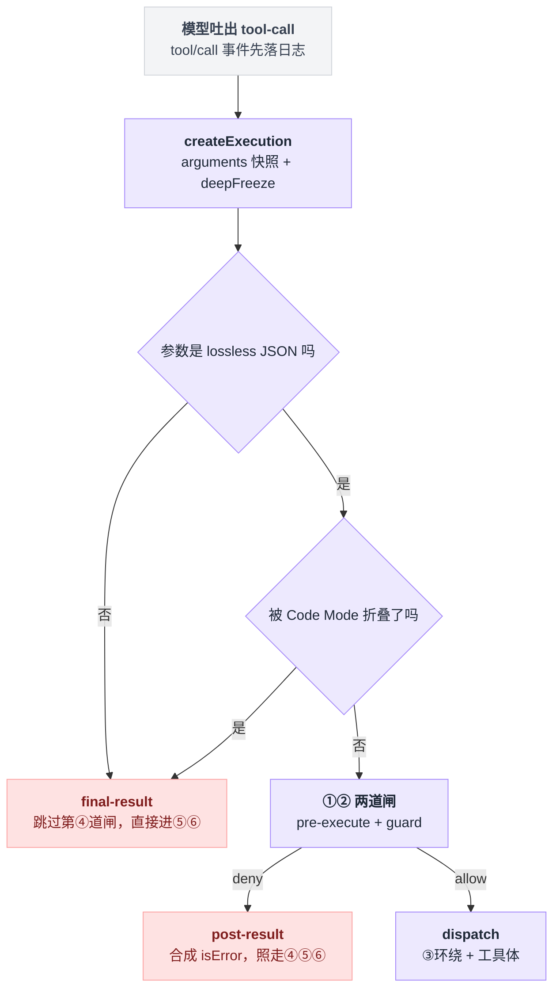
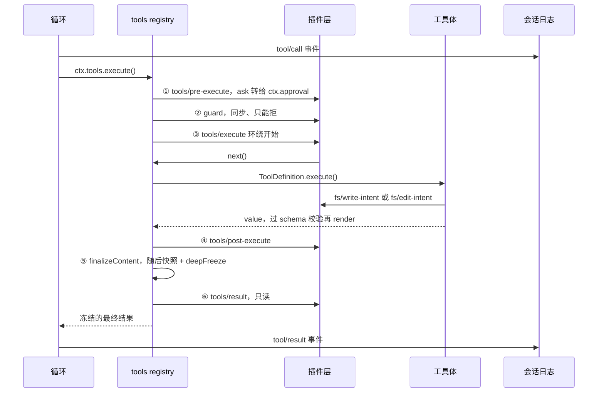
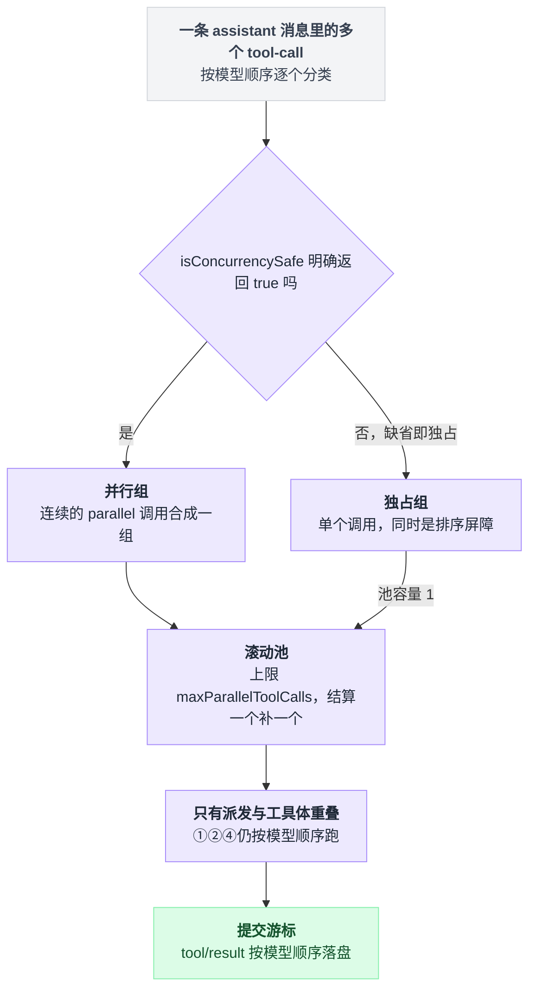
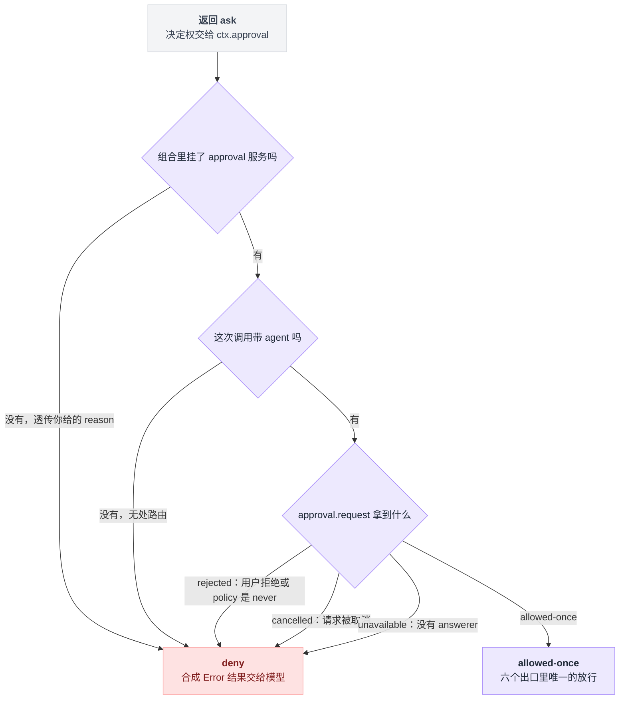
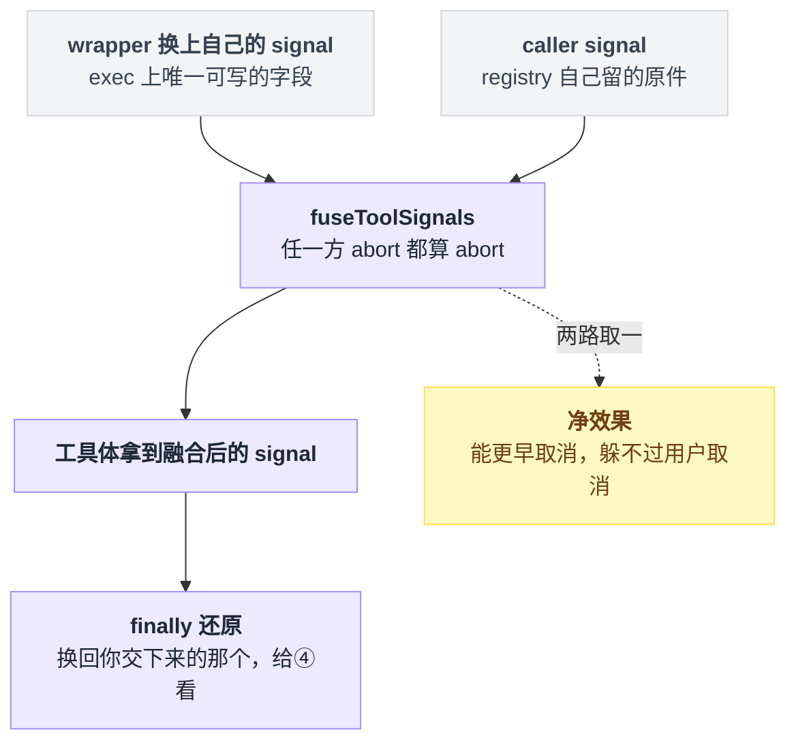
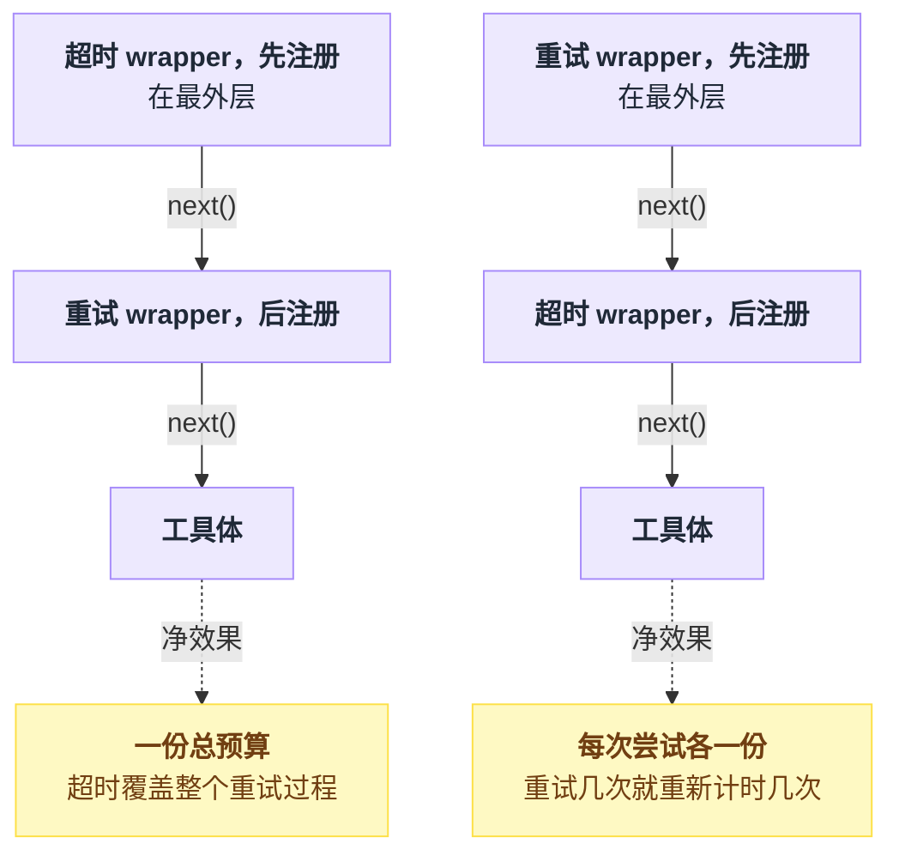
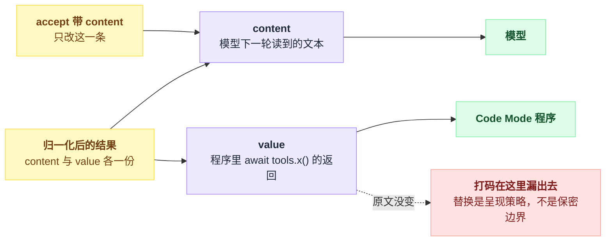

# 13 · 工具执行管线

> 基于 `deepseek-ai/deepseek-harness` v0.1.0-rc.5（commit `47f9438`），2026-08-14 核对。正文只讲机制和挂载步骤；三个动手示例的完整代码收在文末[附录](#附录可以照抄的模板)，出处收在[脚注](#出处)，点角标可跳转。

你想加一条"不许跑 `rm -rf /`"的规则，或者想在模型编辑完文件之后跑一遍 lint、报错了就让它回头改。

最自然的想法是：找到"执行工具"的那个函数，在它前面加个 if。

不是的。dsh 里这样的"前面"和"后面"一共有六个，而且六个位置拿到的东西、能改的东西各不相同。同一条规则，挂错地方就会得到完全不同的结果——有的规则别人一行配置就能绕过去，有的拦截根本轮不到你执行，有的"打码"打了个寂寞。

所以这一章不讲"能不能"，讲**顺序**：一次工具调用从模型吐出 tool-call 到结果回到对话里，中间要过六道闸，每道闸拿到什么、能改什么、改不了什么。读完你应该能对着自己的需求直接说出"这事该挂在第几道"。

waterfall 这个机制本身怎么运转、那个放行开关 `next` 到底做了什么、全仓有哪些拦截点，第 11 章已经讲透了。这里只讲工具管线这一条链路上，每个点各自的业务语义。

---

## 一次工具调用要过六道闸

先把整条流水线一口气摆出来：**落日志 → ① 策略决定跑不跑 → ② guard 一票否决 → ③ 环绕派发 → ④ 改模型看见的东西 → ⑤ 工具自己收尾 → ⑥ 只读观察 → 再落一次日志。**

模型吐出 tool-call 之后，工具服务的执行入口并不是直接调你注册的那个执行函数，而是这条固定顺序管线的起点[^1]。

```
模型发出 tool-call
      │
      ▼  tool/call 事件先落日志（模型可见 ⟺ 已落日志，见第 16 章）
┌─ ① tools/pre-execute ── waterfall ───────────────────┐
│   返回 allow / deny / ask                            │
│   ask ─▶ ctx.approval ─▶ 只有 allowed-once 才放行     │
└──────────────┬───────────────────────────┬───────────┘
         allow │                      deny │
               ▼                           │
┌─ ② 注册的 guard（同步、单调，只能 deny）─┐  │
└──────────────┬────────────────┬─────────┘  │
          放行 │           deny │            │
               ▼                ▼            ▼
┌─ ③ tools/execute ── waterfall（环绕）─┐   合成 isError 结果
│   ┌──────────────────────────────┐   │   content = "Error: <reason>"
│   │ ToolDefinition.execute()     │   │            │
│   └──────────────────────────────┘   │            │
└──────────────┬───────────────────────┘            │
               ▼  value → output.schema 校验         │
                  → output.render() → content        │
               ▼                                     ▼
┌─ ④ tools/post-execute ── waterfall ─────────────────┐
│   accept(content?) / accept(value) / block(feedback)│
└──────────────┬──────────────────────────────────────┘
               ▼
┌─ ⑤ ToolDefinition.finalizeContent（同步，只能改 content）┐
└──────────────┬───────────────────────────────────────────┘
               ▼  lossless JSON 快照 + deepFreeze
┌─ ⑥ tools/result ── emit（只读观察，监听器异常被吞）┐
└──────────────┬────────────────────────────────────┘
               ▼  tool/result 事件落日志 → 模型下一轮看见
```

图里的 **lossless JSON**（无损 JSON）不是随口一说，在本仓库它有精确含义：能原样 JSON 序列化再还原回来的值。`undefined`、`BigInt`、循环引用、稀疏数组、`-0`、奇异对象都不算，碰上就当场失败[^2]。管线在两头强制它——入口的 `arguments`，出口的最终结果。

官方也生成了一份 mermaid 版管线图，比这张图多画了 UI 卡片和 `fs/*` 分支，可以对照着看[^3]。

进第①道闸之前还有一道分诊：`createExecution` 先把 `arguments` 快照冻上。在这一步就失败、或者被 Code Mode 折叠掉的调用根本进不了策略管线，走的是绕开第④道闸的 `final-result`；而过了闸门再被拒的，走的是仍要往下跑的 `post-result`。



六道闸的权限差别很大，先记住这张表，后面每一节展开一行：

| # | 关卡 | 类型 | 能改什么 | 改不了什么 |
|---|---|---|---|---|
| ① | `tools/pre-execute` | waterfall | 放行 / 拒绝 / 要审批 | 不能改参数快照 |
| ② | `ctx.tools.guard()` | 同步回调表 | 只能追加一条拒绝理由 | 不能放行、不能异步 |
| ③ | `tools/execute` | waterfall（环绕） | 只能换 `signal` | 换不了 name / callId / arguments |
| ④ | `tools/post-execute` | waterfall | 换 content 或换 value（二选一）、block、挂 context | 不能同时换两个；不能给失败结果换 value |
| ⑤ | `finalizeContent` | 工具自己的回调，两条硬约束：必须同步、必须不抛异常 | 只能换 content | 其它字段一概归 registry |
| ⑥ | `tools/result` | emit | 什么都改不了 | 结果已冻结 |

从上往下扫一遍这张表，能读出全章的第一根柱子：**权限沿管线递减——越靠后的关卡，能动的东西越少。** 前三个关卡和 `tools/result` 的签名都声明在工具注册表的源码里[^4]。

摊到时间轴上还能看清两件上面那张图没画的事：第③道闸是真的环绕在工具体外面，而 `fs/*` 那道闸开在工具体里面，只有 `tool-fs` 的写和编辑会碰到它[^5]。



以上说的都是一次调用。模型一口气吐出好几个 tool-call 时，循环先分组再滚动跑：

```
组 = []
for call in 这条 assistant 消息里的 tool-call:      # 严格按模型顺序
    if isConcurrencySafe(call) 明确返回 true:
        并进当前的并行组
    else:
        自己单独成一个独占组                        # 缺省即独占，同时是排序屏障

for g in 组:
    池上限 = maxParallelToolCalls if g 是并行组 else 1
    滚动池跑 g 里的调用，结算一个补一个
```

`maxParallelToolCalls` 默认 10，设成 1 就退回串行。真正重叠的只有派发和工具体，pre / post 两道闸和结果提交仍旧按模型顺序走[^6]。



> 想知道这一点上 Pi / Codex / LangChain 怎么做，见 [五个 agent 系统源码解剖](../2026-08_五个agent系统源码解剖/00-总览与阅读指南.md)。

---

## 第一道闸：allow / deny / ask，而 ask 多半会变成 deny

这道闸的决策只有三种[^7]：放行（allow）、给出理由的拒绝（deny）、把问题上交的要审批（ask，理由可给可不给）。放行开关一路穿到底，谁都不表态时的默认结局就是放行。

站在这道闸上，最容易想当然的有两件事：一是"顺手把危险参数改掉再放行"，二是"`ask` 会弹个窗问用户"。两件都不成立。

**第一件：你改不了参数。**

参数快照的类型是 `unknown`，而且已经深冻结。README 把"改参数"这条明确列为"故意不提供"，理由很硬：参数已经落进日志、已经渲染进 UI 了，你再改就会出现"日志里是 A、实际跑的是 B"[^8]。

**第二件：`ask` 不是弹窗。**

它只是把决定权交给一个可选的审批服务，而降级路径写死在服务转接函数里——六个出口，只有一个放行[^9]：

| 情况 | 结果 | 模型看到的 reason |
|---|---|---|
| 组合里根本没有 approval 服务 | deny | **你在 `ask` 里给的 `reason`**；没给才是 `tool "X" requires approval (not yet supported)` |
| 有服务，但这次调用没有 agent | deny | `tool "X" requires approval, but the call has no agent to route it through` |
| 有服务、有 answerer，用户点了同意 | **allow** | — |
| 用户点了拒绝，或 policy 是 `never` | deny | `the user rejected tool "X"` |
| 审批请求被取消 | deny | `approval for tool "X" was cancelled` |
| 没有任何 answerer 应答 | deny | `tool "X" requires approval, but no approval channel is available` |

第一行最容易看漏：只有你**没给** `reason` 时，才会看到 "not yet supported" 那句兜底文案。给了 reason，你这辈子都见不到它。

要让 `ask` 真的弹出来，得同时凑齐三层，缺哪层都是 deny。



**服务本身**通常不缺。`@deepseek-ai/dsh-user-approval` 挂在 base bundle 的补丁配置里，而 base 是每个 profile 的第一层 patch，所以 web 和 headless 都有它[^10]。

**answerer** 就不一定了。审批服务只负责把请求发进 `approval/request` 那条 waterfall，没人应答就 fail closed 成 `unavailable`。全仓的应答者只有两个：host api-proxy 和 ACP 桥。web profile 挂了 api-proxy，headless 的补丁文件则明写自己 "mounts no Host, HTTP server, Web runtime, or browser plugin"[^11]。

结论很直接：**headless 下 `ask` 必然 deny**，文案是 "no approval channel is available"。

**policy** 这层藏着本章最反直觉的坑。base 的配法是：权限模式开到 `danger-full-access` 时 policy 取 `never`，否则取 `ask`；而 `never` 在审批服务里的含义是"每个 ask 直接返回 `rejected`"[^12]。

也就是说，**把权限开到最大，反而让所有 `ask` 全被拒**，而且模型收到的理由是"用户拒绝了"——根本没人拒绝过。

最后一件容易想错的事：**被拒的调用仍然会往下走。** 拒绝不是提前 return，registry 把它包成 `post-result` 一类，content 就是以 Error 开头的那句拒绝理由，然后照样过第④⑤⑥道闸[^13]。所以审计类插件挂在 `tools/result` 上，能看到被拒的调用。

反例也有：Code Mode 折叠导致的 `UNKNOWN_TOOL`、参数不是 lossless JSON 的失败，走的是 `final-result`，**跳过** post-execute[^14]。（Code Mode 是指模型不再一个个调工具，而是写一段程序批量调用工具，见第 21 章。）

---

## 第二道闸：guard 里根本没有"允许"这个返回值

把 deny 写进 waterfall，是不是就万无一失了？

不是。waterfall 有个性质：它是可重排的。任何插件都能用插队选项（prepend）把自己插到队首，然后直接返回放行，把你写在后面的 deny 短路掉。

这不是理论风险，仓库里真有插件在用 prepend——不过那个监听器抢到队首之后照样放行下传。机制细节在 cordis 的注册函数里：插队是把回调塞进队首而不是队尾，注册时第三个参数传个布尔真值就是这个选项的简写[^15]。

所以 dsh 另给了一层不可重排的：guard。它就是一个同步函数，拿到只读的执行对象：返回一个字符串，字符串就是拒绝理由；什么都不返回就是不表态。**没有"允许"这个返回值**——正因为没有，顺序就不影响结果：

```
def guard 决策(exec):
    for g in 全局层的 guard:                 # 挂在 plain context 上的
        r = g(exec)
        if r is not undefined: return 拒绝(r)
    for c in scope 链（从远到近）:
        for g in c 上的 guard:
            r = g(exec)
            if r is not undefined: return 拒绝(r)   # 第一条非 undefined 即终局
    return 不表态                             # 没有任何一条能说"放行"
```

签名、判定顺序和注册方法都在工具注册表里[^16]。注册在 plain context 上全局生效，挂在某个 agent 自己的 ctx 上就只管那一个 agent。

仓库里的真实用例是子 agent：structured output 一旦记录下来，就用一条 guard 把同一步里后续所有工具调用全部否掉[^17]。

选型规则一句话：**能被别人绕过就失去意义的规则放 guard，需要跟别人协商（"我拦不住就交给下一个"）的放 waterfall。**

代价是 guard 只能同步——要做 IO 就只能回 waterfall；guard 也给不出 `ask`，它只有"拒"和"不表态"两档。

---

## 第三道闸：tools/execute 环绕整次派发

这是六道闸里唯一一个放行开关交回来的是"结果"而不是"决策"的，用来做超时、重试、埋点。听起来权力很大——环绕着整次派发，工具体就跑在你放行之后的那段等待里。那 wrapper 到底能动什么？

答案短得意外：一个字段。它拿到的执行对象是特制视图 `ToolDispatchExecution`：只把 `signal` 从只读改成可写，其余字段原样只读[^18]。

**能改的只有 signal，而且改不干净。** registry 在真正调用工具体之前，会把你换上去的 signal 和它自己保存的原始 caller signal 融合成一个，任一方 abort 都算 abort，派发前写回执行对象，finally 里再还原成你交下来的那个[^19]。

翻译成人话：**你能让它更早取消，不能让它躲过用户的取消。**



**你伪造的成功结果会被重新审一遍。** wrapper 返回的 result 如果不是这次 dispatch 亲手产的（用 token 判定），registry 就把它当成"未归一化的候选"：`isError` 原样搬运，成功则拿它的 value 重新过一遍输出 schema 校验、重新渲染[^20]。所以 wrapper 捏不出一个不符合工具输出契约的成功。

**多个 wrapper 按注册顺序套娃，先注册的在外层。** 这点在 cordis 源码里能直接读出来：waterfall 拿到监听器数组后从**头部**取，一个个往里递，入列顺序由注册时进队首还是队尾决定，于是插队等于抢最外层[^21]。

内置超时插件的 README 给了这件事的业务含义：超时注册在外层 = 超时覆盖整个重试过程，注册在内层 = 超时覆盖每次尝试[^22]。同样两个 wrapper，换个注册顺序就是两种预算：



---

## 第四道闸：post-execute 决定模型看见什么

这道闸的决策只有两种：接受（accept）和驳回（block）。accept 可以额外带一份新的 content **或**一份新的 value——两个字段互斥，同时给会当场抛 TypeError；两种决策都能顺手挂 additionalContexts。block 必须带 feedback[^23]。

四种返回对应四种命运[^24]：

| 你返回 | registry 做什么 | 模型看到 | Code Mode 程序看到 |
|---|---|---|---|
| `accept`（不带字段） | 原样通过 | 原 content | 原 value |
| `accept` 带 `content` | 只换 content，value 和 meta 不变 | 新 content | **原 value（没变！）** |
| `accept` 带 `value` | 重新校验 schema、重新 render、重算 meta | 重渲染出来的 content | 新 value |
| `block` 带 `feedback` | 变成失败结果，content = feedback 原文，error.message 由 feedback 文本拼出 | feedback 原文 | 抛 `ToolCallError` |

第二行是本章第二个大坑：**替换 content 不是保密边界。**

官方原话是 "Content replacement is presentation policy, not confidentiality policy"[^25]。你在 content 里把密钥打了码，Code Mode 程序里那个 value 仍然是原文。要真藏，只能 block 或者换 value。

（失败的绑定调用在程序里抛的 `ToolCallError` 只带 `toolName` 和 `message`[^26]。）

为什么会漏？因为一个结果有两条出口，而替换只落在其中一条上：



`block` 的三个后果，逐条记住。

副作用**不会回滚**：文件已经写了、命令已经跑了，block 只改变模型看到的结局。

工具体自己延迟挂上去的上下文会被丢掉，只有 blocking decision 自己带的 additionalContexts 留下[^27]。

结果**不带 value**——失败结果压根没有这个字段[^28]，所以 Code Mode 里等这个返回值的程序拿到的是异常而不是数据。

还有一条不成文但全仓一致的写法：**先把放行开关的决策拿到手，再往上叠加，而不是抢在前面短路。**

```
async def 我的 post-execute(exec, result, next):
    先记账(exec, result)              # 自己要观察的东西，现在就记
    下游决策 = await next()           # 让别人先拿主意，他还能 block 或替换
    return 把提醒折进(下游决策)        # 只叠加，不否决
```

`repeat-tool-reminder` 的注释把理由写死了——"Observe-and-enrich, never veto"[^29]。

`spill-policy` 更能说明问题：它用插队抢了最外层，却仍旧第一件事就是放行下传，只对别人定好的结果做裁剪；hooks 桥同理[^30]。

---

## 第五道闸：finalizeContent 是工具自己的底线

这一关不是事件，是 `ToolDefinition` 上的一个可选方法[^31]：拿到只读的执行对象和只读的归一化结果，返回一组新的 content 就只换 content，返回空则保持原样。

四条硬约束[^32]：

| 约束 | 具体含义 |
|---|---|
| 回调会被快照 | 调用一开始就把它存下来，防止参数 getter 中途把它换掉 |
| 恰好调一次 | 每个归一化结果一次，包括那些跳过了 post-execute 的管线失败 |
| 必须同步、必须不抛异常 | 它是工具自己的回调，这两条是硬约束：没有异步版本，抛了就是违约 |
| 只能换 content | 返回空保持原样，返回数组只换 content，其余字段仍归 registry |

它的定位是"工具自己的最后一条不变量"，最典型的用途是长度封顶。`tool-jobs` 用它保证内容不超过可见预算，并且只在 policy 没动过默认渲染时才走那个保留"输出 / 状态"分栏的精细分支，挂在 `job_output` 和 `job_kill` 两个工具上[^33]。

---

## 第六道闸：tools/result 只能看，不能动

它的签名和派发模式标签都在工具注册表里，模式是 emit（`@mode` 这个 JSDoc 标签怎么声明事件派发模式，见第 10 章）[^34]。

派发之前 registry 会把执行对象整个冻住，结果本身也已经过 lossless JSON 快照加深冻结。监听器抛异常只换来一条日志警告，然后被吞掉。配套的 invariant 插件还会断言 exec 和 result 确实冻结了[^35]。

什么时候用它、什么时候用 post-execute？判据简单到不用犹豫：**只要你不需要改结果，就用它。**

官方对照表写得很干脆——"Final tool-result metrics / audit / capture" 用 `tools/result`，必须 transform 或挂 context 才降级用 `tools/post-execute`。真实例子是 `agent-instructions`：用它记录"这一步碰过哪些文件"，再决定要不要注入子目录的 `AGENTS.md`[^36]。

顺带提醒一个几乎同名的陷阱：`tools/result` 是**内存里的实时事件**，`tool/result` 是随后落盘的**会话日志事件**[^37]。少一个 s，差一整层。

---

## 动手一：拦掉危险的 bash 命令

bash 工具的参数以 `command` 和 `description` 打头，后面几个可选项随后台任务和沙箱升级开关的有无而增减[^38]。骨架照抄官方 cookbook 的 permission-gate 范式[^39]，完整文件在[附录 A](#a-拦掉危险-bash-命令的插件)，落地时存成 `deny-dangerous-bash.ts`。

它做的事一句话讲完：只看 bash、只看字符串类型的 `command` 参数，配置里任何一条 pattern 命中就拒绝，理由里带上命中的那条；配置开了 `ask` 就改交审批。

挂载写法如下（本地插件行的写法见官方配置文档[^40]，四层配置见第 03 章）：

```yaml
- insert:
    - id: deny-dangerous-bash
      name: './deny-dangerous-bash.ts'
      config:
        patterns: ['rm -rf /', 'mkfs']
```

期望现象：模型调用命中的 bash，结果直接是 `Error: deny-dangerous-bash: command contains "rm -rf /"`，`tools/execute` 和工具体从未运行。

一旦把配置里的 `ask` 开成真，就得回头对着上面那张降级表读。注意这个例子**给了 `reason`**，所以降级表第一行那句兜底文案永远不会命中：

| 你在哪跑 | 模型看到什么 |
|---|---|
| 默认 web（base + web-app，policy = ask） | 浏览器弹审批，同意才跑 |
| headless（没有 answerer） | `Error: tool "bash" requires approval, but no approval channel is available` |
| `DSH_PERMISSION_MODE=danger-full-access` | `Error: the user rejected tool "bash"`（其实没人点过） |
| 自己拼的组合，压根没挂 approval 服务 | `Error: deny-dangerous-bash: command contains "rm -rf /"`（你的 reason 被原样透传，**不是** "not yet supported"） |

**想让这条规则谁也绕不过，就改挂 guard。** guard 版也在附录 A 末尾：把插件里注册事件监听的那段整个换掉，`config` 还是同一个。注意 guard 只有"拒"和"不表态"两种返回，`ask` 那条分支在这里没有对应物。

---

## 动手二：编辑后跑 lint，报错回灌给模型

`edit` / `write` 的参数都以 `file_path` 为必填[^41]。跑外部命令用 shell 服务，有个签名细节别踩：它的运行方法只接受先经解析步骤产出的 spec，不接受裸 request——内置 bash 工具就是这么调的[^42]。完整文件在[附录 B](#b-编辑后跑-lint-的插件)，落地时存成 `lint-after-edit.ts`，挂载方式和动手一同款（本地插件行，不需要额外配置也能跑默认值）。

思路四步：先把放行开关交出去、拿到下游决策；只处理编辑类工具的成功结果；对改过的文件跑一遍 lint 命令；退出码非零就 block，把报告原文塞进 feedback 回灌给模型。

命令输出拿到的是 `CollectedOutput`：正文取 `text` 字段，另有 `truncated` / `spillPath` 可查[^43]。

`aborted` / `timedOut` 互斥，表示"第一个把命令打断的原因"[^44]——两者都要挡掉，否则 lint 自己被超时杀掉的时候，你会拿半截输出去 block 模型。

期望现象：模型编辑完文件，下一条消息里看到的不是 "Edited …" 而是 lint 报告，并且这条结果 `isError` 为真，模型通常会立刻回头改。

三个代价必须写进你自己的文档里。

**文件已经改了**，block 改变的只是模型看到的结局，不回滚。

先拿下游决策再判断，是为了不抢别人的决定权，下游已经 block 了就别再套一层。

lint 慢就等于每次编辑都卡住整个 turn，所以超时预算和取消信号都得给上——post-execute 的异步监听器本来就有义务观察执行对象上的 `signal`[^45]。

---

## 动手三：给某个工具单独加超时

动手之前先搞清内置件的边界，不然会写重。

工具定义上的 `timeoutMs` 是**工具作者自己声明**的字段，registry 只做正数校验、从不执行，README 把这条列为已知限制[^46]。

真正执行它的是 `@deepseek-ai/dsh-tool-call-timeout-policy`：零配置，逻辑就是"读被调工具声明的 `timeoutMs`，有就武装 deadline"，默认已经在 base bundle 里。而 bash / read / write / edit **故意都没声明** `timeoutMs`[^47]。

所以"给某个工具单独加超时"这件事，落地成写一个同形状的 wrapper，把预算表放进配置。完整文件在[附录 C](#c-按工具配预算的超时-wrapper)，落地时存成 `tool-budget.ts`，挂载配置：

```yaml
- insert:
    - id: tool-budget
      name: './tool-budget.ts'
      config:
        budgets:
          bash: 120000
```

代码里用到的三个工具函数，逐个对照内置件。

`deadline` 拿上游 signal、预算毫秒数和一个标识 code，返回一个"上游取消或自己超时都会 abort"的 signal，并实现了自动清理接口，所以用 `using` 声明就能自动清定时器[^48]。

`timeoutOf` 只在**自己那个 code** 的定时器赢了时才返回值，外层别人的 deadline 先响会读成空、当成普通上游取消[^49]。

finally 里还原 `signal`，是为了让 `tools/post-execute` 看到调用方自己的 signal，而不是你这条可能已经 abort 的——内置件同款写法[^50]。

**这是协作式超时，不是强杀。** signal 只负责通知，真正停下来要靠工具体把它转发给底层[^51]。工具不理睬 signal，你的 deadline 到期后它照跑不误——你只是提前把一个 `isError` 交给了模型，后台那份工作还在烧 CPU。给不转发 signal 的工具配预算，属于自欺欺人。

配置里挑 `bash` 有两个理由，同时也划出两条边界。

bash 确实把执行对象上的 signal 交给了 executor，executor 在 signal 触发时会杀掉命令，所以这个预算真的会生效。但 bash 本来就有模型可传的 `timeoutMs` 参数、以及 executor 自己的默认值和上限[^52]，你这一层是**外层兜底上限**，不是它唯一的超时。

反过来，**已经声明了 `timeoutMs` 的工具就别再配了**（`web_fetch` / `web_search` 都挂了[^53]），否则内置件和你各武装一个 deadline，谁先响就看数值，排查起来很难受。

---

## 六个高频坑

出处按行序收在脚注里[^54]：

| 坑 | 现象 |
|---|---|
| `ask` 静默降级 | headless 或没有 answerer 时，模型收到 "no approval channel is available"；全权限模式下反而收到 "the user rejected" |
| 以为 `deny` 就结束了 | 被拒的调用照样走 post-execute 和 result，你的观察器会看到它 |
| 用只换 content 的 `accept` 打码 | 模型看不见了，Code Mode 程序里的 `value` 仍是原文 |
| 在 waterfall 里抢跑 | 用 prepend 短路，别人的策略静默失效；该用 guard 的时候用了 waterfall |
| wrapper 改了 signal 没还原 | post-execute 看到一条已 abort 的 signal；registry 只保证工具体那一段被重新融合 |
| `finalizeContent` 里抛异常 / 写异步 | 契约要求它 total 且同步；它在每一个归一化结果上都会跑，包括失败结果 |

顺序错乱这件事本身倒是有护栏：`tools-invariant` companion 会断言 `tools/execute` 必须跟在 `tools/pre-execute` 之后、`tools/post-execute` 必须跟在两者之一之后，违反直接 fail[^55]。

---

## 一句话带走

把全章的结论从头再推一遍——每一条都能从前面的某道闸推出来，推得动就是真懂了：

- 拦截为什么要分六道？因为"跑不跑""跑多久""模型看见什么"是三个不同时刻的决定，而**权限沿管线递减**：①②决定跑不跑，③决定跑多久，④决定模型看见什么，⑤是工具自己的底线，⑥只剩看。
- waterfall 里的 deny 为什么拦不死人？因为 waterfall 可重排，prepend 能抢队首短路；guard 之所以拦得死，是因为它**根本没有"允许"这个返回值**，顺序不再影响结果。
- 权限开到最大为什么反而所有 `ask` 全被拒？因为 `danger-full-access` 把 policy 配成 `never`，而 `never` 的含义是每个 ask 直接 `rejected`——模型收到"用户拒绝了"，其实没人点过。
- 打码为什么会漏？因为一个结果有 content 和 value 两条出口，只换 content 的 `accept` 只改模型读的那条，Code Mode 程序里的 value 原文未动。
- 被拒的调用为什么还出现在审计里？因为 deny 不是提前 return，它被包成 `post-result` 照样走④⑤⑥。
- 你配的超时为什么可能是自欺欺人？因为 signal 是协作式的，工具不转发它就停不下来，你只是提前把一个 `isError` 交给了模型。

挑闸门的时候先问自己"我要改的是决定、是过程、是结果，还是什么都不改"，答案基本就落在某一道上了。

配套的还有两章：工具本身怎么写在 [12 章](./12-写一个工具.md)，Claude Code 那套 hook 怎么桥到这条管线上在 [14 章](./14-hook兼容层.md)。审批服务和沙箱的完整故事在 [18 章](./18-沙箱审批与权限.md)。

---

## 附录：可以照抄的模板

### A. 拦掉危险 bash 命令的插件

pre-execute 版全文，配置项见正文动手一[^39]：

```ts
import type { Context } from '@deepseek-ai/cordis'
import Schema from '@deepseek-ai/schemastery'
import type { PreToolDecision } from '@deepseek-ai/dsh-tools'

export const name = 'deny-dangerous-bash'

export interface Config {
  patterns: string[]
  ask: boolean
}

export const Config: Schema<Config> = Schema.object({
  patterns: Schema.array(Schema.string()).default(['rm -rf /', 'mkfs', 'dd if=', '> /dev/sd']),
  ask: Schema.boolean().default(false),
})

export function apply(ctx: Context, config: Config) {
  ctx.on('tools/pre-execute', async (exec, next): Promise<PreToolDecision> => {
    if (exec.name !== 'bash') return next()
    const command = (exec.arguments as { command?: unknown }).command
    if (typeof command !== 'string') return next()
    const hit = config.patterns.find(pattern => command.includes(pattern))
    if (hit === undefined) return next()
    const reason = `deny-dangerous-bash: command contains "${hit}"`
    return config.ask ? { kind: 'ask', reason } : { kind: 'deny', reason }
  })
}
```

guard 版：把 `apply` 里注册事件监听的那段整个换成下面这段，`config` 还是同一个：

```ts
ctx.tools.guard((exec) => {
  if (exec.name !== 'bash') return undefined
  const command = (exec.arguments as { command?: unknown }).command
  if (typeof command !== 'string') return undefined
  const hit = config.patterns.find(pattern => command.includes(pattern))
  return hit === undefined ? undefined : `deny-dangerous-bash: command contains "${hit}"`
})
```

### B. 编辑后跑 lint 的插件

post-execute 版全文，注意事项见正文动手二：

```ts
import type { Context } from '@deepseek-ai/cordis'
import Schema from '@deepseek-ai/schemastery'
import type { PostToolDecision } from '@deepseek-ai/dsh-tools'

export const name = 'lint-after-edit'
export const inject = ['shell']

export interface Config {
  tools: string[]
  command: string
  timeoutMs: number
}

export const Config: Schema<Config> = Schema.object({
  tools: Schema.array(Schema.string()).default(['edit', 'write']),
  command: Schema.string().default('npx --no-install eslint'),
  timeoutMs: Schema.number().default(60000),
})

export function apply(ctx: Context, config: Config) {
  ctx.on('tools/post-execute', async (exec, result, next): Promise<PostToolDecision> => {
    const downstream = await next()
    if (!config.tools.includes(exec.name)) return downstream
    if (result.isError || downstream.kind === 'block') return downstream
    const filePath = (exec.arguments as { file_path?: unknown }).file_path
    if (typeof filePath !== 'string') return downstream
    const run = await ctx.shell.run(ctx.shell.resolve({
      command: `${config.command} ${JSON.stringify(filePath)}`,
      timeoutMs: config.timeoutMs,
      signal: exec.signal,
    }))
    if (run.aborted || run.timedOut || run.exitCode === 0) return downstream
    const report = `${run.stdout.text}${run.stderr.text}`.trim()
    return {
      kind: 'block',
      feedback: [{
        type: 'text',
        text: `The file was written, but lint failed on ${filePath}. Fix these before doing anything else:\n\n${report}`,
      }],
    }
  })
}
```

### C. 按工具配预算的超时 wrapper

execute 环绕版全文，三个工具函数的行为见正文动手三：

```ts
import type { Context } from '@deepseek-ai/cordis'
import Schema from '@deepseek-ai/schemastery'
import { deadline, timeoutOf } from '@deepseek-ai/dsh-timeout'
import type { ToolExecutionResult } from '@deepseek-ai/dsh-tools'

export const name = 'tool-budget'
export const inject = ['tools']

const CODE = 'TOOL_BUDGET_TIMEOUT'

export interface Config {
  budgets: Record<string, number>
}

export const Config: Schema<Config> = Schema.object({
  budgets: Schema.dict(Schema.number()).default({}),
})

export function apply(ctx: Context, config: Config) {
  ctx.on('tools/execute', async (exec, next): Promise<ToolExecutionResult> => {
    const budget = config.budgets[exec.name]
    if (budget === undefined) return next()
    using d = deadline(exec.signal, budget, CODE)
    const upstream = exec.signal
    exec.signal = d.signal
    try {
      const result = await next()
      if (timeoutOf(d.signal, CODE) === undefined) return result
      const message = `${exec.name} exceeded its ${budget}ms budget`
      return {
        content: [{ type: 'text', text: `Error: ${message}` }],
        isError: true,
        error: { message, info: { name: 'ToolBudgetError', code: CODE } },
      }
    } finally {
      exec.signal = upstream
    }
  })
}
```

---

## 出处

[^1]: 管线入口 `ctx.tools.execute()`：`packages/core/tools/src/index.ts:1342`。
[^2]: lossless JSON 的精确定义与失败语义：`packages/core/tools/README.md:123`。
[^3]: 官方生成的 mermaid 版管线图：`docs/tool-execution-pipeline.md:8`。
[^4]: 四个事件的签名声明：`packages/core/tools/src/index.ts:152`（pre-execute）、`:163`（execute）、`:175`（post-execute）、`:197`（result）。
[^5]: `fs/*` 意图闸开在工具体内部：`packages/fs/tool-fs/src/write.ts:111`、`edit.ts:126`。
[^6]: 分组与滚动池的实现：`packages/core/agent-loop/src/tool-calls.ts:88`；`maxParallelToolCalls` 等说明见 `packages/core/agent-loop/README.md:40`。
[^7]: 三种决策的类型定义：`packages/core/tools/src/index.ts:588`；一路穿到底的默认放行在 `:1477`。
[^8]: 参数快照 deep-freeze：`packages/core/tools/src/index.ts:323`、`:1416`；README 把"改参数"列为故意不提供：`packages/core/tools/README.md:193`。
[^9]: `ask` 把决定权交给 `ctx.approval`：`packages/core/tools/src/index.ts:1689`；降级函数 `serviceAsk` 的六个出口按表格行序：没有服务 `:1696`、调用没有 agent `:1702`、allowed-once 放行 `:1714`、用户拒绝或 policy 为 never `:1716`、请求被取消 `:1720`、没有 answerer `:1724`。
[^10]: `@deepseek-ai/dsh-user-approval` 挂在 base bundle：`packages/bundle/base/cordis.patch.yml:188`。
[^11]: 两个 answerer 之一 host api-proxy：`packages/host/apiproxy/src/api-proxy.ts:1422`；web profile 挂 api-proxy：`packages/bundle/web-app/cordis.patch.yml:100`；headless 明写不挂 Host：`packages/bundle/headless/cordis.patch.yml:2`。
[^12]: policy 的取值逻辑（danger-full-access 取 never，否则 ask）：`packages/bundle/base/cordis.patch.yml:191`；never 等于每个 ask 直接 rejected：`packages/interaction/user-approval/src/index.ts:312`。
[^13]: 被拒调用包成 `post-result`：`packages/core/tools/src/index.ts:1490`；content 由拒绝理由拼成：`:1494`。
[^14]: 走 `final-result`、跳过 post-execute 的两条路：Code Mode 折叠 `:1436`、参数非 lossless JSON `:1449`（均在 `packages/core/tools/src/index.ts`）。
[^15]: 真实的 prepend 使用者：`packages/jobs/tool-jobs/src/index.ts:237`（抢到队首之后照样放行下传在 `:236`）；prepend 是插到队首而不是队尾：`vendor/cordis/src/events.ts:255`，选项类型在 `:114`，boolean 简写在 `:288`–`:291`。
[^16]: guard 的签名：`packages/core/tools/src/index.ts:711`；判定顺序在 `:1119`；注册方法在 `:1110`。
[^17]: structured output 记录后否掉同一步剩余调用：`packages/subagent/subagent-in-process-driver/src/structured.ts:109`。
[^18]: 特制视图 `ToolDispatchExecution`：`packages/core/tools/src/index.ts:391`。
[^19]: signal 融合 `fuseToolSignals`：`packages/core/tools/src/index.ts:1889`；派发前写回在 `:1544`；finally 还原在 `:1558`。
[^20]: 伪造结果的重新归一化 `normalizeDispatchResult`：`packages/core/tools/src/index.ts:1826`。
[^21]: waterfall 从头部逐个往里递：`vendor/cordis/src/events.ts:234`–`:243`；入列顺序由注册函数决定：`:255`。
[^22]: 超时挂外层 / 内层的两种预算含义：`packages/guard/timeout-policy/README.md:36`。
[^23]: 决策类型定义：`packages/core/tools/src/index.ts:597`；content 与 value 同给抛 TypeError：`:1757`。
[^24]: 表格中 registry 行为的出处：只换 content `:1776`；换 value 走重校验重渲染 `:1770` → `:1793`；block 拼 error.message `:1748`（均在 `packages/core/tools/src/index.ts`）。
[^25]: "Content replacement is presentation policy, not confidentiality policy"：`docs/subsystems/tools.md:404`。
[^26]: `ToolCallError` 只带 toolName 和 message：`packages/core/tools/README.md:161`；生成它的代码在 `packages/core/tools/src/ts-types.ts:288`。
[^27]: block 丢弃工具体 deferContext 挂的上下文、只留决策自带的：`packages/core/tools/src/index.ts:1738`。
[^28]: 失败结果没有 value 字段：`packages/core/tools/src/index.ts:569`–`:572`。
[^29]: "Observe-and-enrich, never veto"：`packages/guard/repeat-tool-reminder/src/index.ts:209`–`:224`。
[^30]: spill-policy 用 prepend 抢最外层：`packages/spill/spill-policy/src/index.ts:209`，仍先放行下传、只裁剪别人定好的结果在 `:190`–`:194`；hooks 桥同款：`packages/hooks/hooks-claude-code/src/index.ts:254`。
[^31]: `finalizeContent` 的声明：`packages/core/tools/src/index.ts:247`。
[^32]: 四条硬约束按表格行序：回调快照 `:1408`；恰好调一次 `:1631` → `:1649`；必须同步、必须不抛异常的契约注释 `:242`（均在 `packages/core/tools/src/index.ts`）。
[^33]: tool-jobs 的长度封顶：`packages/jobs/tool-jobs/src/index.ts:238`–`:257`，挂在 `job_output`（`:314`）和 `job_kill`（`:369`）。
[^34]: `tools/result` 的签名：`packages/core/tools/src/index.ts:197`；`@mode emit` 标签在它上一行 `:195`。
[^35]: 派发前冻结执行对象与结果快照：`packages/core/tools/src/index.ts:1660`、`:1847`；监听器异常只警告后吞掉：`:1662`–`:1663`；invariant 插件断言冻结：`packages/core/tools/src/invariant.ts:23`。
[^36]: 官方对照表：`docs/cookbook/extension-cookbook.md:115`；agent-instructions 的用例：`packages/context/agent-instructions/src/index.ts:350`。
[^37]: `tools/result` 与 `tool/result` 的一层之差：`packages/core/tools/README.md:39`。
[^38]: bash 工具的参数定义：`packages/shell/tool-bash/src/index.ts:245`–`:270`。
[^39]: 官方 cookbook 的 permission-gate 范式：`docs/cookbook/extension-cookbook.md:15`–`:31`。
[^40]: 本地插件行的写法：`docs/user/develop/basic/config.md:36`。
[^41]: `file_path` 必填：`packages/fs/tool-fs/src/edit.ts:87`、`packages/fs/tool-fs/src/write.ts:73`。
[^42]: shell 服务只接受解析后的 spec、不接受裸 request：`packages/shell/shell/src/index.ts:85`–`:93`；内置 bash 工具的调法：`packages/shell/tool-bash/src/index.ts:380`。
[^43]: `CollectedOutput` 的字段：`packages/subprocess/subprocess/src/types.ts:22`。
[^44]: `aborted` / `timedOut` 互斥、表示第一个打断原因：`packages/shell/shell/src/types.ts:119`–`:131`。
[^45]: 异步监听器有义务观察 `exec.signal`：`packages/core/tools/src/index.ts:166`–`:167`。
[^46]: `ToolDefinition.timeoutMs` 的声明：`packages/core/tools/src/index.ts:255`；registry 只做正数校验、从不执行：`:1046`–`:1050`；README 的已知限制：`packages/core/tools/README.md:195`。
[^47]: timeout-policy 的实现：`packages/guard/timeout-policy/src/index.ts:56`–`:80`；默认挂在 base bundle：`packages/bundle/base/cordis.patch.yml:343`；bash / read / write / edit 故意不声明：`packages/guard/timeout-policy/README.md:57`。
[^48]: `deadline` 的实现（含自动清理接口）：`packages/util/timeout/src/index.ts:91`–`:113`。
[^49]: `timeoutOf` 只认自己的 code：`packages/util/timeout/src/index.ts:184`。
[^50]: finally 还原 signal 的内置件同款写法：`packages/guard/timeout-policy/src/index.ts:78`，README 第 23 行同款说明。
[^51]: 协作式超时、靠工具体转发 signal：`packages/guard/timeout-policy/README.md:32`。
[^52]: bash 把 signal 交给 executor、触发即杀：`packages/shell/tool-bash/src/index.ts:380`–`:383`；模型可传的 `timeoutMs` 参数与 executor 的默认值上限：`:254`。
[^53]: `web_fetch` / `web_search` 已声明 `timeoutMs`：`packages/web/tool-web/src/fetch.ts:476`、`search.ts:256`。
[^54]: 六个坑按行序：`ask` 静默降级 `packages/core/tools/src/index.ts:1724`、`packages/interaction/user-approval/src/index.ts:312`；deny 不结束 `packages/core/tools/src/index.ts:1490`；content 打码不保密 `docs/subsystems/tools.md:404`；waterfall 抢跑 `vendor/cordis/src/events.ts:255`、`packages/core/tools/src/index.ts:711`；signal 没还原 `packages/guard/timeout-policy/src/index.ts:78`；`finalizeContent` 契约 `packages/core/tools/src/index.ts:238`–`:242`。
[^55]: 顺序护栏 tools-invariant：`packages/core/tools/src/invariant.ts:94`–`:114`。
