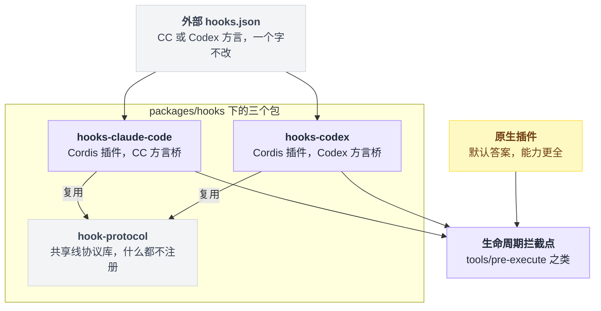
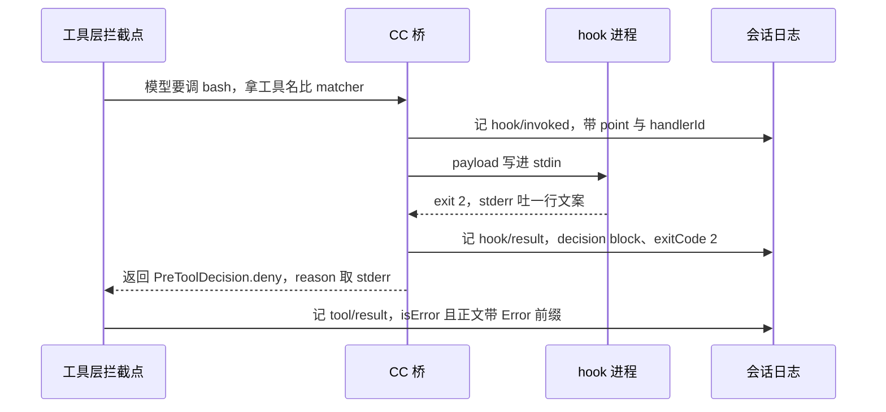
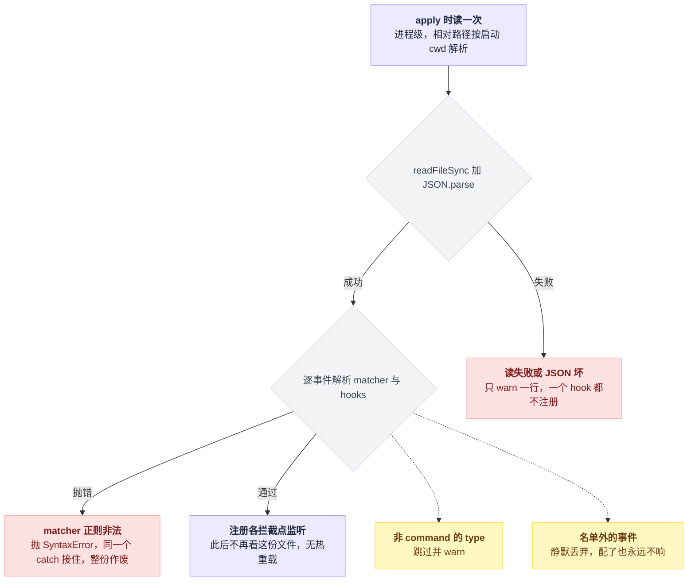
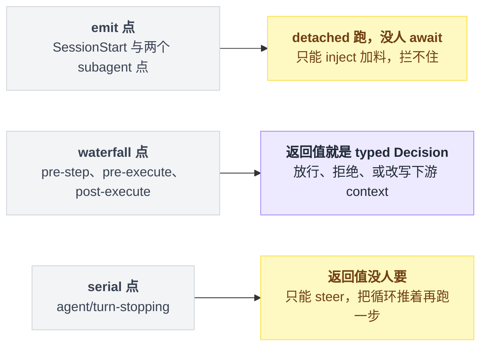
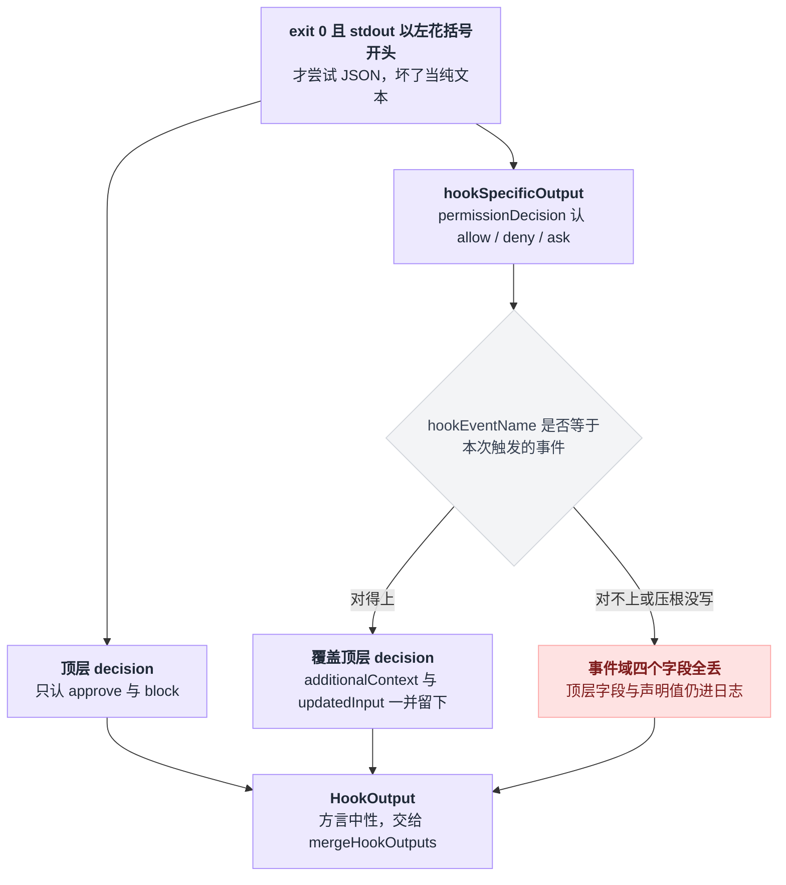
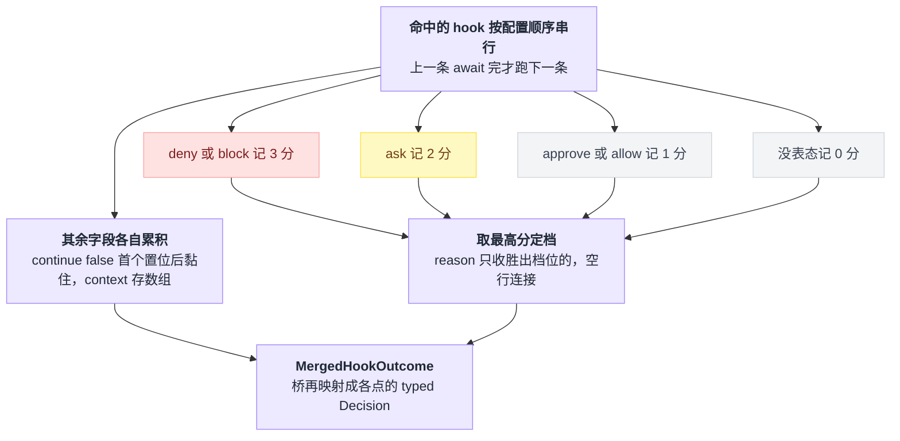
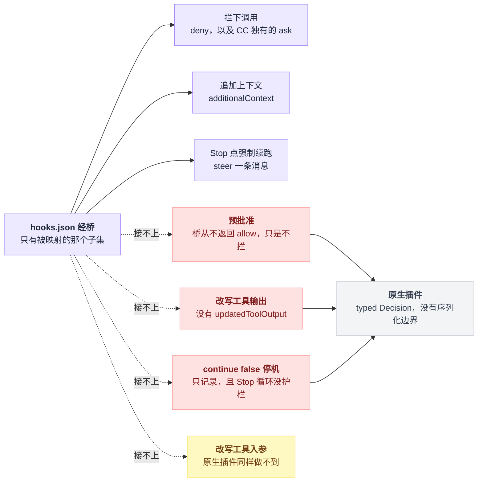

# 14 · hook 兼容层

> 基于 `deepseek-ai/deepseek-harness` v0.1.0-rc.5（commit `47f9438`），2026-08-14 核对。

你大概率是带着一份现成的 `hooks.json` 来的——Claude Code 或 Codex 用了很久，里面攒着几条拦 `bash` 的规则、几条编辑后跑格式化的规则。最自然的期待是：dsh 提供兼容层，把文件指给它，一切照旧。

前半句成立，后半句不成立。

文件真的一个字不用改就能跑起来——dsh 给了两个桥接插件专门干这个。但"照旧"是不存在的：有些事件根本没接，`matcher` 的语义换个桥就变了，`{"continue": false}` 只记录不生效，`permissionDecision: "allow"` 也不能预先批准任何东西。

这一章要立起来的画面就一个：**桥是一台翻译机，它只翻译词汇表里有的词；词汇表外的部分不是配错了，是根本没接。** 沿着这台翻译机从入口走到出口，能跑的、走样的、以及"到这儿该放弃兼容层直接写插件"的分界线，会一路自己冒出来。

---

## 第一个误会：`packages/hooks/` 不是 hook 系统

打开仓库看到 `packages/hooks/` 就以为找到了 hook 系统的人不在少数。

不是的。dsh 里压根没有"hook 系统"这个东西：

> The key reframe driving this design is that **"native hooks" are not a package** — a native hook is just an ordinary Cordis plugin subscribing to the canonical lifecycle events.
> —— `.agents/notes/implemented/feature/2026-06-30-interception-extension-points.md:9`

同一句话在另外两处又说了一遍，措辞几乎一致：`packages/hooks/README.md:5` 写 "a 'native hook' is just an ordinary Cordis plugin on those extension points"，`docs/cookbook/extension-cookbook.md:13` 写 "A 'native hook' is an ordinary Cordis plugin on an interception point; it needs no external protocol."。

重复三遍，是怕你误会。

**在 dsh 里想往生命周期上插一脚，默认答案永远是写插件**——监听 `tools/pre-execute` 之类的拦截点，返回一个 typed Decision，就是前面两章那套（事件机制见 [10 章](./10-事件系统.md)，waterfall 拦截点见 [11 章](./11-waterfall专章.md)）。

那 `packages/hooks/` 下那三个包是什么？`hook-protocol` 是共享的 shell hook 线协议库，它自己声明得很清楚——"NOT a cordis plugin — it registers nothing and injects nothing"（`packages/hooks/hook-protocol/README.md:5`）。剩下两个才是插件：`hooks-claude-code` 是 Claude Code 方言桥，`hooks-codex` 是 Codex 方言桥。

桥存在的理由只有一条：**你已经有一份 `hooks.json` 了，不想重写成插件。** CC 桥的 README 自己就把话说死了，原生插件能做这个桥做的一切，而且更强——有类型化返回、没有序列化边界；桥只是那个被映射子集的兼容通道（`packages/hooks/hooks-claude-code/README.md:7`）。

摆开看是这么个格局：一份外部配置文件，两个把它翻译成 Cordis 插件的桥，最后都落在同一批生命周期拦截点上；原生插件走的是旁边那条更短的路。



---

## 先看它真的拦住一次 bash

讲机制之前先看结果——翻译机到底能不能把"拦截"这个词翻过去。

仓库里有 15 份端到端快照测试跟 hook 有关（`examples/acp-agent/tests/snapshots/hook-cc-*` 与 `hook-codex-*`），每份都自带一个真实 `hooks.json` 工作区。最简单的那份是全文如下的六行（`examples/acp-agent/tests/snapshots/hook-cc-pretool-deny/workspace/hooks.json:1`）：

```json
{
  "hooks": {
    "PreToolUse": [
      {
        "matcher": "bash",
        "hooks": [
          { "type": "command", "command": "echo 'bash is disabled by policy in this session' >&2; exit 2" }
        ]
      }
    ]
  }
}
```

模型调 `bash` 时，会话日志落下三条记录。以下是同目录 `session.jsonl` 第 21–23 行原文，第 23 行的 `callId` / `id` 用 `…` 截短，其余逐字：

```jsonl
{"type":"hook/invoked","seq":59,"time":1785730466385,"data":{"turn":1,"point":"PreToolUse","dialect":"claude-code","handlerId":"claude-code:PreToolUse:1","matcher":"bash"}}
{"type":"hook/result","seq":60,"time":1785730466389,"data":{"turn":1,"point":"PreToolUse","handlerId":"claude-code:PreToolUse:1","decision":"block","exitCode":2,"stderrSummary":"bash is disabled by policy in this session","durationMs":3.6819170000001122}}
{"type":"tool/result","seq":61,"time":1785730466390,"data":{"turn":1,"step":1,"message":{"source":{"kind":"tool","callId":"call_00_…"},"content":[{"type":"tool-result","toolCallId":"call_00_…","content":[{"type":"text","text":"Error: bash is disabled by policy in this session"}],"isError":true}],"role":"user","id":"e8988570-…"}},"sourceEventSeqs":[58],"surfaceOp":"append"}
```

整条链路都在这三行里，压成一句话就是：**你的 hook 用 exit 2 说的那句 stderr，会原封不动变成模型读到的那句 `Error: …`。** stderr 变成 block reason，reason 变成 `PreToolDecision.deny`，工具层再把它包成 `Error: <你的 stderr>` 交给模型（拼这个前缀的代码在 `packages/core/tools/src/index.ts:1494`）。

换个视角，是四方各干一件事，按时间排成一条线。



---

## 挂上去要动三个地方

一句话：装包 → 在 profile 的 `cordis.patch.yml` 里写一行 insert → 填 `configPath`。三步里只有第三步有讲究，前两步是模板。

### 装包，然后忍受一条 warning

两个桥都不在任何出厂 bundle 里。`packages/bundle/` 下只有 base / web-app / headless 三份 `cordis.patch.yml`，全文搜不到 `dsh-hooks`。得自己装：

```sh
dsh plugin --profile web add @deepseek-ai/dsh-hooks-claude-code
```

`dsh plugin --profile <name> <pnpm args>` 就是个 pnpm 转发器，工作目录是 profile 目录（`apps/cli/README.md:14`）。

装完你会在 stderr 上看到一条 warning，别慌。dsh 装完包会去看 `package.json` 里有没有声明 `dsh.bundle.patch`，判据是 `apps/cli/src/plugin.ts:44` 的 `manifest.dsh?.bundle?.patch !== undefined`。

两个桥都没有声明——`packages/hooks/hooks-*/package.json` 全文没有 `dsh` 这个 key——于是它以「普通依赖」身份留下，并打一次性 warning（`apps/cli/src/plugin.ts:71`，行为描述见 `apps/cli/reference/README.md:43`）。这是正常的，挂载行接下来你自己写。

顺带一提，桥的一堆 `@deepseek-ai/dsh-*` 是 peer 依赖，而 profile 的 `pnpm-workspace.yaml` 写着 `autoInstallPeers: false`；缺的 peer 靠 hoisted node_modules 回落到安装目录解决，设计说明在 `packages/boot/app-boot/src/profile.ts:133`。

### 写挂载行

profile 目录是 `$DSH_HOME/profiles/<name>`（`apps/cli/README.md:11`），里面的 `cordis.patch.yml` 是你自己那一层，叠在所有 bundle 之后（`docs/architecture.md:27`，分层规则见 [03 章](./03-配置的四层结构.md)）。patch 的 `insert` 形式见 `docs/user/develop/basic/config.md:37` 与 `packages/bundle/base/cordis.patch.yml:15`：

```yaml
- insert:
    - id: hooks-claude-code
      name: '@deepseek-ai/dsh-hooks-claude-code'
      config:
        configPath: /Users/you/project/.claude/hooks.json
```

仓库里唯一一处真实挂载示例在 `examples/acp-agent/cordis.yml:181`（CC）和 `:189`（Codex），形状一样。

### 填字段

字段的权威定义在 `packages/hooks/hooks-claude-code/src/index.ts:45` 与 `packages/hooks/hooks-codex/src/index.ts:44`，也被抽进 `docs/config-catalog.md:661` / `:699`。两个桥共有四个字段，各自还有独占的：

| 字段 | CC 桥 | Codex 桥 |
|---|---|---|
| `configPath` | 必填 | 必填 |
| `defaultTimeoutMs` | 有 | 有 |
| `stderrSummaryMaxChars` | 有 | 有 |
| `pluginRoot` | 有 | 无 |
| `projectDir` | 有 | 无 |
| `model` | 无 | 有 |

`configPath` 指向的既可以是裸的事件表，也可以是把它包在 `hooks` key 下的文件（settings 形态），两个桥都接受这两种——因为两边读的都是同一行 `asObject(root.hooks) ?? root`（`hooks-claude-code/src/config.ts:83`、`hooks-codex/src/config.ts:47`）。

`pluginRoot` 用来替换命令串里的 `${CLAUDE_PLUGIN_ROOT}`（`hooks-claude-code/src/config.ts:59`）。

`projectDir` 干两件事：替换 `${CLAUDE_PROJECT_DIR}`（`config.ts:60`），以及作为 `CLAUDE_PROJECT_DIR` 环境变量导出；不填则逐次回落到会话工作区（`index.ts:150`）。

Codex 侧没有这两个，取而代之的是 `model`，一个静态字符串（`hooks-codex/src/index.ts:53`），盖在每个 Codex payload 的 `model` 字段上（`index.ts:300`）。

`defaultTimeoutMs` 在单个 hook 没写 `timeout` 时兜底，默认值 `DEFAULT_HOOK_TIMEOUT_MS` = `600_000`（`hook-protocol/src/runner.ts:20`）。注意单位对不上：单 hook 的 `timeout` 单位是**秒**，`runner.ts:74` 乘了 1000 才用；Codex 额外接受 `timeoutSec` 这个别名（`hooks-codex/src/config.ts:70`）。

`stderrSummaryMaxChars` 是 `hook/result` 里 stderr 摘要的字符上限，默认 500（`hook-protocol/src/events.ts:53`）。填个非正整数会在 `apply()` 一开头就抛错（`index.ts:99` 调用，`:92` 抛）——这是少数几个会让你立刻知道配错了的地方。

### 三个必踩的坑，长在同一个动作上

这三个坑全长在插件 `apply()` 那一次性的加载动作上：

| 坑 | 后果 |
|---|---|
| `configPath` 是进程级的，只读一次 | 相对路径按启动 cwd 解析，无 per-session 发现，无热重载 |
| 读失败或 JSON 坏 | 静默降级，一个 hook 都不注册 |
| 非 `command` 的 `type` | 跳过并 warn，配了等于没配 |



**`configPath` 是进程级的，只读一次。** 加载时 `readFileSync` 读一遍就完了（`hooks-claude-code/src/index.ts:104`），相对路径按**进程启动 cwd** 解析。没有「每个会话发现各自项目里的 `hooks.json`」，也没有热重载——这两条写在字段自己的 JSDoc 里，连同那个 `TODO(per-session-hook-config)`（`index.ts:48`–`:51`）。写绝对路径。

**读失败、解析失败都是静默降级。** `catch` 里只 `ctx.logger.warn` 然后 `return`，一个 hook 都不注册（`index.ts:113`–`:115`）。路径打错不会让 dsh 起不来，代价是也不会有人在 UI 上提醒你，你的 hook 就是安安静静地全体缺席。查日志。

**只有 `type: 'command'` 的 hook 会跑。** CC 侧任何非 `command` 的 `type` 都被 parsed-and-skipped（`config.ts:98`）并 warn（`index.ts:111`），README 点名的是 `http` / `mcp_tool` / `prompt` / `agent` 这四种（`hooks-claude-code/README.md:97`）。Codex 侧还额外跳过 `async: true` 的（`hooks-codex/src/config.ts:67`）。

---

## 每个事件点上，hook 有多大话语权

看事件表之前先记住两个待会儿要反复出现的动作，它们都定义在 `packages/core/agent/src/runtime-types.ts`，差别决定了 hook 能不能改变 agent 的走向：

| | `agent.inject(msg)` | `agent.steer(msg)` |
|---|---|---|
| 做什么 | 给下一次 pre-step 排一条模型可见的上下文 | 给最近的一步塞进 steering |
| 对 driver | **不唤醒** | 空闲就直接开一个 turn |
| 净效果 | 只是加料 | 把停下来的循环推着再跑一步 |
| 出处 | `runtime-types.ts:143` | `runtime-types.ts:133` |

真正决定话语权的不是事件名，是拦截点的**派发模式**：能不能被 await，返回值有没有人要。



| CC hook | Codex hook | harness 拦截点 | 派发模式 | 桥做什么 |
|---|---|---|---|---|
| `SessionStart` | `SessionStart` | `agent/session-start` | emit | `additionalContext` → `agent.inject()`，**拦不住启动** |
| `UserPromptSubmit` | `UserPromptSubmit` | `agent/pre-step` | waterfall | deny → `{ kind: 'reject' }`；只有 context 则 `next()` 后追加到下游 `enter` |
| `PreToolUse` | `PreToolUse` | `tools/pre-execute` | waterfall | deny → `PreToolDecision.deny`；**CC 还支持 ask**，Codex 不支持 |
| `PostToolUse` | `PostToolUse` | `tools/post-execute` | waterfall | deny → `block` + feedback；context 前置到下游决定上 |
| `Stop` | `Stop` | `agent/turn-stopping` | serial | 阻塞则 `agent.steer()` 强制再来一步 |
| `SubagentStart` | — | `subagent/start` | emit | 注入到在进程内的子 agent |
| `SubagentStop` | — | `subagent/end` | emit | 纯观察 |

派发模式那一列不是我归纳的，每个事件声明上都挂着 `@mode` 标签：`packages/core/agent/src/runtime-types.ts` 里 `agent/session-start` 是 emit、`agent/pre-step` 是 waterfall、`agent/turn-stopping` 是 serial；两个工具侧的 waterfall 在 `packages/core/tools/src/index.ts:150` 和 `:173`；两个子 agent 的 emit 在 `packages/subagent/subagent/src/index.ts:155` 和 `:164`。

CC 支持 7 个点（`hooks-claude-code/src/config.ts:11` 的 `CLAUDE_EVENTS`），Codex 支持 5 个（`hooks-codex/src/config.ts:11` 的 `CODEX_EVENTS`）。

**不在名单里的事件在解析阶段就被丢掉，配了不报错，只是永远不响。** 这个失败模式最难查，因为一切看起来都正常。

Codex 有一条 CC 没有的路：`SessionStart` 和 `UserPromptSubmit` 的 hook 如果干净退出、且吐的是非 JSON 的纯文本，那段文本直接被当成 `additionalContext`（`hooks-codex/src/index.ts:152`–`:156`）。CC 桥不认纯 stdout，README 明确把它列为未支持（`hooks-claude-code/README.md:90`、`:91`）。

表里三个 emit 点是 detached 的，没有任何拦截点 await 它们：CC 有三个（`hooks-claude-code/README.md:47`），Codex 只有 `SessionStart`（`hooks-codex/README.md:55`）。插件卸载时 `createDetachedRuns().drain()` 先 abort 掉还在跑的 hook 进程、再等续作跑完（`hook-protocol/src/detached.ts:53`）。

副作用是 `SessionStart` 注入的 context **可能赶不上第一次请求**——源码里挂着 `TODO(session-start-gating)`（`index.ts:205`）。

---

## 同一份文件换个桥，matcher 语义就变了

先把判定规则摊开，一段伪代码就能背下来：

```
命中(matcher, query):
    if matcher 缺省 或 '' 或 '*':
        return true                                  // 两个方言都全匹配

    if 方言 == claude-code 且 matcher 全由 [A-Za-z0-9_|] 组成:
        return matcher.split('|').includes(query)     // 字面量精确分支，| 是精确分支

    return 非锚定正则(matcher).test(query)             // 其余一律当正则
```

也就是说，只有 CC 方言多长出中间那条字面量捷径：

| | Claude Code 模式 | Codex 模式 |
|---|---|---|
| 缺省 / `''` / `'*'` | 全匹配 | 全匹配 |
| 纯 `[A-Za-z0-9_\|]+` | **字面量**，`\|` 是精确分支 | 仍然当正则 |
| 其它 | 非锚定正则 | 非锚定正则 |

规则本体在 `hook-protocol/src/matcher.ts:57`，字面量判别式是 `matcher.ts:18` 的 `CLAUDE_LITERAL`。

于是 `"matcher": "bash"` 在 CC 下只命中名字**恰好是** `bash` 的工具，在 Codex 下会命中任何名字里含 `bash` 的工具。仓库自己也不敢复用：`examples/acp-agent/cordis.yml:186` 的注释直接写着 Codex "cannot share Claude's file"。

matcher 拿什么去比，也要看事件。`PreToolUse` / `PostToolUse` 比的是工具名，`SessionStart` 比的是 session source，CC 的 `SubagentStart` / `SubagentStop` 比的是写死的 `general-purpose`（`hooks-claude-code/src/index.ts:304`）。`UserPromptSubmit` 和 `Stop` 没有可比的对象，配置里的 `matcher` 在解析时就被丢弃（CC `config.ts:109`、Codex `config.ts:75`）。

**写错正则的后果不是「这条不生效」，而是整份配置作废。** 解析器 `throw new SyntaxError`（`config.ts:113`），桥的 catch 接住之后一个 hook 都不注册。

仓库里专门有这个场景的快照，`hook-cc-invalid-matcher/workspace/hooks.json:12` 那个孤零零的 `"["`，把同文件里第 3–9 行那条本该生效的 `UserPromptSubmit` 也一起带走了。

---

## hook 进程能看见什么

两种方言的 payload 都是一个 JSON 对象，写进 hook 进程的 stdin（`runner.ts:75`）。差异比想象中多：

| | Claude Code | Codex |
|---|---|---|
| 公共字段 | `session_id` / `transcript_path` / `cwd` / `hook_event_name`（`index.ts:322`） | 同上再加 `model` / `permission_mode: 'default'`（`index.ts:292`），turn 级事件再加 `turn_id`（`:306`） |
| `transcript_path` 取不到时 | `''`（`index.ts:325`） | `null`（`index.ts:295`） |
| 尾部换行 | **有**（`index.ts:169`） | **没有**（`index.ts:146`） |
| 工具入参 | `tool_input: exec.arguments`，原样（`index.ts:340`） | `tool_input: { command }`，只取 `command`（`index.ts:324`） |
| 环境变量 | 注入 `CLAUDE_PROJECT_DIR`（`index.ts:151`） | **什么都不注入**（`index.ts:141`–`:149` 的 `runHook` 调用没有 `env`） |
| 工作目录 | 会话工作区 `session.header.cwd`（`index.ts:147`） | 同左（`index.ts:128`） |

Codex 那个 `tool_input: { command }` 是实打实的信息损失：非 shell 工具的参数根本到不了你的 hook（`hooks-codex/README.md:96`）。`tool_name` 倒是真名，跟 matcher 测的是同一个值。

hook 进程本身走 `ctx.shell`（`inject = ['shell']`，`index.ts:42`），所以它自动吃到执行器的凭据擦洗、进程组 kill 和超时机制。顺序值得留意：桥的 env 是在擦洗**之后**合并的（`hook-protocol/README.md:23`）。

---

## decision 有两条通道，走错的那条静默失效

hook 进程说完话，桥要把退出码和 stdout / stderr 翻译回 typed Decision。流水线长这样：

```
hook 进程
  ├ exitCode ─┐
  ├ stdout ───┼──► parseHookOutput()          codec.ts:59
  └ stderr ───┘         │
                        ▼
                   HookOutput（方言中性，字段全可选）types.ts:89
                        │  同一拦截点上每个命中的 hook 各产出一个
                        ▼
                   mergeHookOutputs()          merge.ts:62
                        │
                        ▼
                   MergedHookOutcome ──► 桥自己的 map ──► PreToolDecision /
                                                        PreStepDecision /
                                                        PostToolDecision /
                                                        agent.steer()
```

退出码的规则集中在 `codec.ts:59`：

| exitCode | 结果 |
|---|---|
| `0` | 干净退出。stdout **以 `{` 开头**才尝试 JSON（`codec.ts:75`）；JSON 坏了就当纯文本，不报错 |
| `2` | 阻塞。`decision = 'block'`，trim 后的 stderr 成为 `reason`（`codec.ts:66`） |
| 其它 | 非阻塞错误，只留在记录里 |
| `undefined` | 进程被信号打死（`runner.ts:91`），或执行器基础设施故障——`runHook` **永不抛**，转成一条无 exitCode 的非阻塞错误（`runner.ts:96`） |

结构化 stdout 里有两条互不相同的 decision 通道，**这是整章最容易配错的地方**。

顶层 `decision` 的合法值**只有** `approve` 和 `block`，你写 `{"decision":"deny"}` 会被当成无效值静默忽略（`codec.ts:38`）。精细权限得走 `hookSpecificOutput.permissionDecision`，合法值是 `allow` / `deny` / `ask`（`codec.ts:43`），而且它**覆盖**顶层 decision（`codec.ts:126`）。

`hookSpecificOutput` 上还有一道守卫，专治拼写错误。桥每次调用都传 `expectedEventName = point`（CC `index.ts:172`、Codex `index.ts:148`），然后：

```
if 块里的 hookEventName != 本次触发的 point:      // 对不上，或者压根没写
    把声明值原样记进日志                          // 顶层字段照常保留
    丢弃 permissionDecision
       + permissionDecisionReason
       + additionalContext
       + updatedInput                          // 事件域的四个字段全没了
    提前 return
```

出处：记下声明值在 `codec.ts:120`，提前 return 在 `:122`。

所以给 `PreToolUse` 写的 hook 里把 `hookEventName` 拼成 `PreToolUSe`，症状是：exit 0、一切正常、决定就是没生效。

两条通道加上这道守卫，一次结构化输出的去向分成这么几股。



合并之后的 `decision` 到各个落点的映射：

| merged.decision | pre-step | pre-execute | post-execute | turn-stopping |
|---|---|---|---|---|
| `deny` | `{ kind: 'reject' }` | `{ kind:'deny', reason }` | `{ kind:'block', feedback }` | `agent.steer(reason)` |
| `ask` | — | CC：`{ kind:'ask' }`；Codex：无此路径 | — | — |
| `allow` / `none` | `next()` | `next()` | `next()` | 不动 |

`allow` 那一格要看仔细，这是本章的第一道验收题：**桥从不返回 `PreToolDecision` 的 `{ kind: 'allow' }`**——该分支确实存在（`packages/core/tools/src/index.ts:589`），桥只是 `return next()` 继续往下走。

也就是说 CC hook 里写 `permissionDecision: "allow"` 不能预先批准任何东西，后面的 guard 和审批照旧拦（`hooks-claude-code/README.md:92`）。"allow"在翻译机的词汇表里对应的不是"放行"，是"不拦"。想预批准，只能写原生插件。

hook 没给 reason 时的兜底文案有三条，分别是 `blocked by PreToolUse hook`、`blocked by PostToolUse hook`、`continue: blocked by Stop hook`（`index.ts:241`、`:252`、`:274`）。

---

## 多个 hook 同时命中，谁说了算

同一个点上命中的 hook **串行执行、按配置顺序**——`index.ts:152` 那个双层循环里老老实实 `await`——跑完之后一次性折叠（`merge.ts:62`）。

折叠的形状是一次打分，加几路各走各的累积：

```
分值 = { deny: 3, block: 3, ask: 2, approve: 1, allow: 1, 没表态: 0 }

best   = max(每个 hook 的分值)                      // 取最严的那一档
reason = 所有分值 == best 的 hook 的 reason，用 "\n\n" 连接
                                                   // 低档位的理由一律不进来

for h in 命中的 hook（配置顺序）:
    if h.continue == false 且 尚未置位:
        continue_false = true
        stopReason     = h.stopReason              // 只取第一个
    additionalContext.push(h.additionalContext)    // 数组，不拼字符串
    systemMessage.push(h.systemMessage)
```

出处：打分与取最高分在 `merge.ts:35`，reason 只收胜出档位见 `merge.ts:74`、`:91`、`:94`，`continue:false` 首个置位后黏住、`stopReason` 取第一个在 `:79`，`additionalContext` 累积成数组在 `:83`，`systemMessage` 累积在 `:86`。



一句话立住：**最严的档位胜出，且 reason 只收胜出档位的。** 这条有实际用处——有人 deny 时，ask 的理由不会混进去，免得模型收到互相矛盾的解释。

`systemMessage` 虽然被累积下来了，但两个桥都只是打条 warn，压根不呈现给模型（CC `index.ts:178`、Codex `index.ts:161`）。

串行不是性能上没想清楚，是为了让每个 hook 的 `hook/invoked` / `hook/result` 在日志里相邻；而且折叠对决定本身是顺序无关的，跑的先后不影响结论（`hooks-claude-code/README.md:49`）。代价 README 自己也写了：Claude Code 原生是并行跑、且对相同 handler 去重的，桥这两样都没有（`hooks-claude-code/README.md:97`）。

---

## 「我的 hook 到底跑没跑」怎么查

两个日志专用事件，声明合并进 `SessionEventMap`（`hook-protocol/src/types.ts:19`、`:31`），也收录在 `docs/persistence-catalog.md:427`：

| 事件 | 字段 |
|---|---|
| `hook/invoked` | `turn` / `point` / `dialect`（`claude-code` \| `codex`）/ `matcher`（全匹配时省略）/ `handlerId` |
| `hook/result` | `turn` / `point` / `handlerId` / `decision` / `exitCode?` / `stderrSummary?` / `durationMs` |

`handlerId` 形如 `claude-code:<point>:<序号>`，序号来自一个进程内全局自增的计数器（`hooks-claude-code/src/index.ts:81`–`:84`，Codex 同构在 `:67`–`:70`）。别把它读成「这个点的第几次」——它只保证一对 invoked/result 能配上。

`decision` 字段自己也有取值规则，三行说完：

```
if 解析出了 decision:      decision = 那个值
elif continue == false:    decision = 'stop'
else:                      decision = 'pass'
```

实现在 `events.ts:99`。那份只吐 context 的 hook 快照记的就是 `"decision":"pass"`（`hook-cc-posttool-context/session.jsonl:22`）。`stderrSummary` 为空则整个字段省略，超长则截断加省略号（`events.ts:64`）。

有一条运行时不变量在盯着这对事件（`hook-protocol/src/invariant.ts`）：两条记录必须落在**已开启的 turn 内**（`:37`），turn 号必须和当前开启的一致（`:38`），`hook/result` 必须能找到配对的 `hook/invoked`（`:52`），`durationMs` 必须是非负有限数（`:55`）。违反就 fail。

由此得出一条推论，第一次排查时很容易撞上：**detached 的那几个点不会有任何 `hook/*` 记录。** 桥只在 `opts.turn !== undefined` 时才写这对事件（`index.ts:157`、`:181`），而 `SessionStart` / `SubagentStart` / `SubagentStop` 三个调用都没传 turn（`index.ts:207`、`:284`、`:294`）。

`SessionStart` 的理由 `hook-protocol/README.md:32` 讲得很清楚：它在第 1 个 turn 之前跑，没有开启的 turn 可挂。

想知道 SessionStart hook 跑没跑，只能看它注入的那条 context 消息——source 是 `{ kind: 'plugin', plugin: 'hooks-claude-code' }`（`index.ts:87`），所以也不会被误当成用户输入。

---

## 什么时候该扔掉桥，直接写插件

README 把损失列得很完整，这里挑最会咬人的说。边界画出来是这样——**右边那几格不是配错了，是翻译机的词汇表里根本没有这些词**：

| 能力 | 经桥 | 原生插件 |
|---|---|---|
| 拦下调用（deny，以及 CC 独有的 ask） | 能 | 能 |
| 追加上下文 `additionalContext` | 能 | 能 |
| Stop 点强制续跑（steer 一条消息） | 能 | 能 |
| 预批准 | 不能，只是不拦 | 能 |
| 改写工具输出 | 不能 | 能 |
| `continue:false` 停机 | 不能，只记录 | 得自己实现 |
| 改写工具入参 | 不能 | 也不能 |
| 事件覆盖 | CC 7/30，Codex 5/10 | 全部拦截点 |
| 配置发现 | 进程级单个 `configPath` | `cordis.yml` 四层叠加 |
| 并发与去重 | 串行、不去重 | 自己说了算 |



**事件覆盖只有一小半。** CC 那 30 个 hook 事件里桥支持 7 个，另外 23 个 `hooks-claude-code/README.md:89` 逐个列了；Codex 10 个里支持 5 个（`hooks-codex/README.md:93`）。两个基线数字都是 README 引外部文档说的，没有在 CC / Codex 侧核对过。

**预批准和改写输出都做不到。** 原生插件能返回 `{ kind: 'allow' }`，桥不返回，`allow` 只是不拦；原生插件有 `PostToolDecision.accept` 带 `content`/`value`（`tools/src/index.ts:598`），桥不支持 `updatedToolOutput`，而且 `tool_response` 传给 hook 时已经被压平成纯文本。

**改写工具入参谁都做不到。** `PreToolDecision` 明确排除了改写（`tools/src/index.ts:585`），`updatedInput` 只解析不生效，设计还停在 proposed 状态（`hook-protocol/README.md:44`）。区别只在提示：CC 桥会为此打一条 warn（`index.ts:176`），Codex 桥连 warn 都不打。

**`systemMessage` 模型看不到**，只在日志里 warn 一声。

**`{"continue": false}` 只记录，不停止运行**，源码里挂着 `TODO(hook-continue-false)`（CC `index.ts:189`、Codex `index.ts:172`）；原生插件想停就自己实现。

**Stop 循环没有护栏。** `stop_hook_active` 恒为 `false`（CC `index.ts:346`、Codex `index.ts:261`），意味着一个无条件阻塞的 Stop hook 会让每一步都被强制续跑，停不下来（`TODO(stop-loop-guard)`，`index.ts:269`）。官方 fixture 也只能靠 `.stop_fired` 标记文件自限（`hook-cc-stop-continue/workspace/hooks.json:6`）。

**配置发现退化成一个进程级 `configPath`**，读一次，无分层、无热重载；原生插件享受的是 `cordis.yml` 四层叠加。**并发与去重**上面说过了：串行、不去重。

结论很朴素：**桥是迁移用的。** 已有 hooks.json 就先桥起来跑通，真要长期维护的策略，改写成 [13 章](./13-工具执行管线.md) 那样的原生插件。

---

## 一份能直接用的最小配置

以下两段可以直接落盘。`hooks.json` 是把 `hook-cc-pretool-deny` 与 `hook-cc-posttool-context` 两份仓库 fixture（`examples/acp-agent/tests/snapshots/*/workspace/hooks.json`）逐字合并进一个文件，没有改动任何 matcher 或文案——这样你看到的输出就能跟快照里已提交的期望输出对上。

`/Users/you/project/.claude/hooks.json`：

```json
{
  "hooks": {
    "PreToolUse": [
      {
        "matcher": "bash",
        "hooks": [
          { "type": "command", "command": "echo 'bash is disabled by policy in this session' >&2; exit 2" }
        ]
      }
    ],
    "PostToolUse": [
      {
        "matcher": "bash",
        "hooks": [
          { "type": "command", "command": "echo '{\"hookSpecificOutput\":{\"hookEventName\":\"PostToolUse\",\"additionalContext\":\"Note: command output has been verified against the audit log.\"}}'" }
        ]
      }
    ]
  }
}
```

`$DSH_HOME/profiles/web/cordis.patch.yml`：

```yaml
- insert:
    - id: hooks-claude-code
      name: '@deepseek-ai/dsh-hooks-claude-code'
      config:
        configPath: /Users/you/project/.claude/hooks.json
        projectDir: /Users/you/project
        defaultTimeoutMs: 600000
```

装包 + 启动：

```sh
dsh plugin --profile web add @deepseek-ai/dsh-hooks-claude-code
dsh web
```

按快照推断应该看到：让模型跑任何 bash 命令，工具结果是 `Error: bash is disabled by policy in this session`，会话日志里出现一对 `hook/invoked` + `hook/result`，后者 `decision: "block"`、`exitCode: 2`，即 `hook-cc-pretool-deny/session.jsonl:21`–`:23`。

把 `PreToolUse` 那组删掉再试，bash 就正常执行了，`hook/result` 记 `"decision":"pass"`，那句 `Note: command output has been verified against the audit log.` 以 `{"kind":"plugin","plugin":"hooks-claude-code"}` 的身份进 inbox，再变成一条 user 消息（`hook-cc-posttool-context/session.jsonl:22`、`:24`、`:28`）。

Codex 侧结构对称：换成 `@deepseek-ai/dsh-hooks-codex`，另起一个 `codex-hooks.json`（不要复用 CC 那份，matcher 语义不同），配置里 `pluginRoot`/`projectDir` 换成 `model`。语义不对称的地方前面都点过：没有 `ask`，`tool_input` 只剩 `{ command }`，也不注入任何环境变量。

---

## 把整章串起来

回头把翻译机从入口走到出口，每一站的结论都能重新推一遍，推得动才算真懂了：

- 桥之所以能存在，是因为 **dsh 里原生 hook 本来就只是普通插件**——桥无非是把"外部进程说话"翻译成"插件返回 Decision"的一层，原生插件不需要这层翻译；
- deny 之所以真能拦住工具，是因为对应的拦截点是 **waterfall 派发，返回值就是 typed Decision**；同理，emit 点 detached 没人 await，所以 `SessionStart` 拦不住任何东西；
- `allow` 之所以不预批准，是因为**桥从不返回 `{ kind: 'allow' }`**，它把 allow 翻译成"不拦"，后面的 guard 和审批照旧；
- `continue:false`、`systemMessage`、`updatedInput` 之所以没反应，不是配错，是**词汇表里没接这些词**——TODO 还挂在源码里；
- 排查永远从日志开始，因为**所有加载期失败都是静默的**：路径错、JSON 坏、正则非法（整份作废）、事件不在名单，全都不报错、不提示，只在日志里留一行 warn 或什么都不留；
- 日志里查不到 `hook/*` 也未必是没跑——**detached 点没有 turn 可挂，本来就不写这对事件**。

最后一句带走：**桥能让你的 `hooks.json` 一个字不改就跑起来，但它只是那个被映射子集的兼容通道——超出子集的部分（预批准、改写输出、continue:false、循环护栏）不是配错了，是根本没接。**

---
