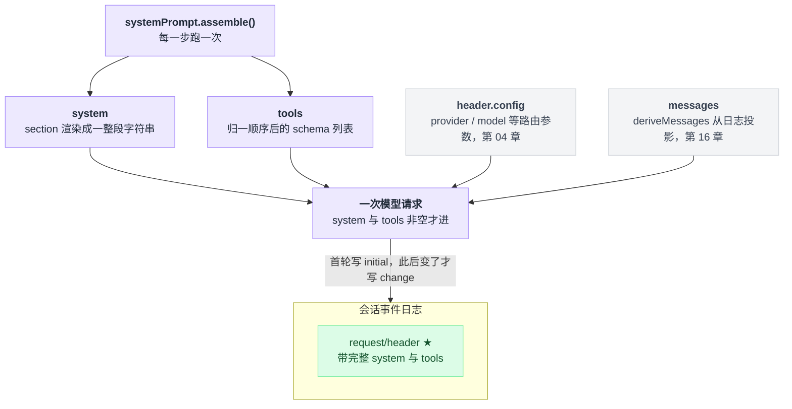
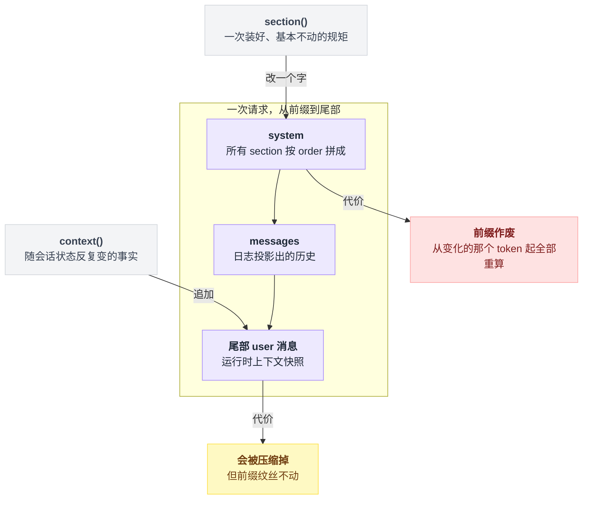
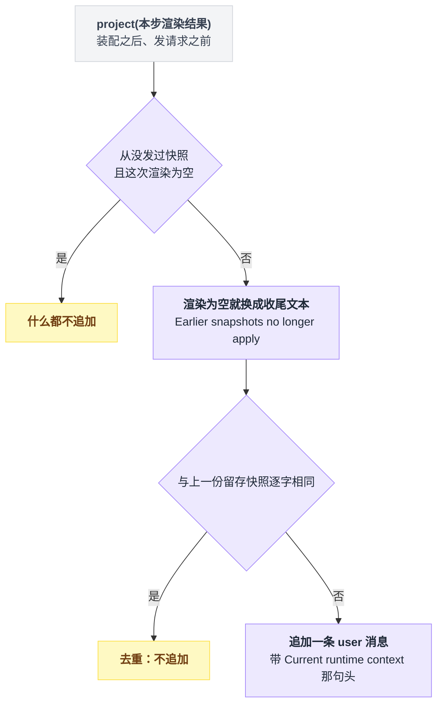
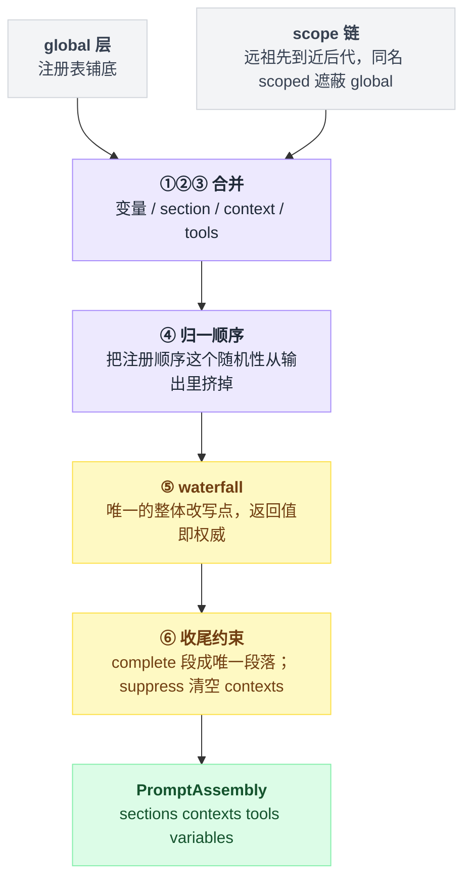
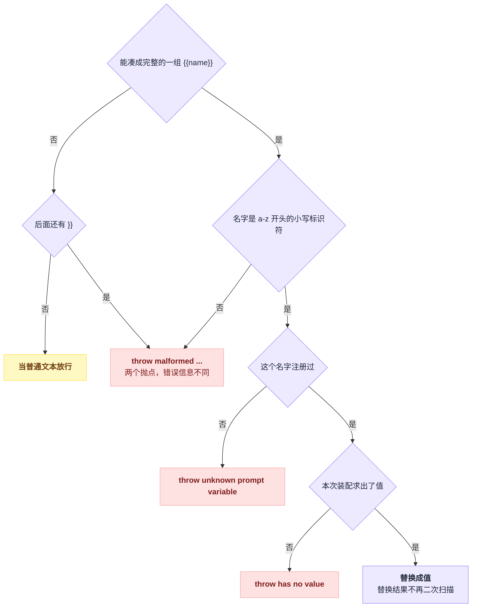
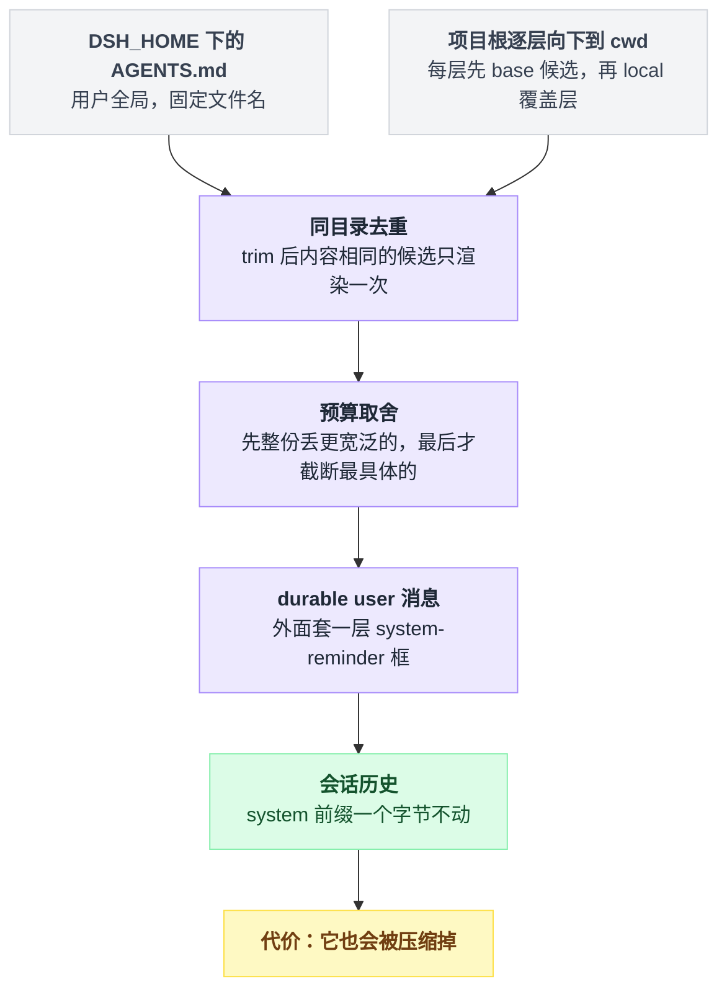
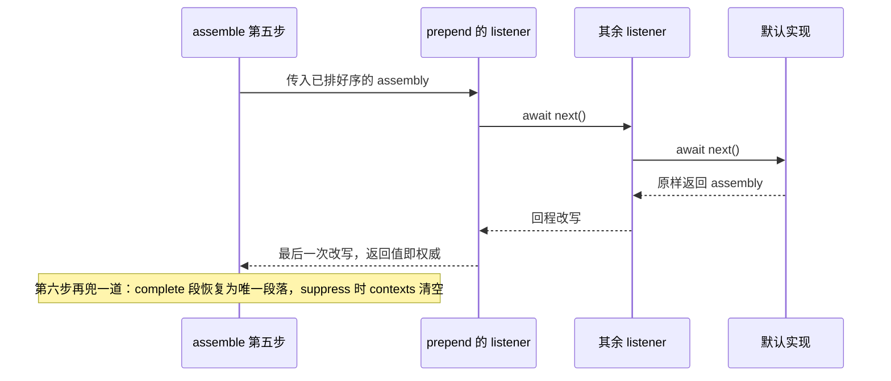

# 15 · 系统提示词与上下文装配

> 基于 `deepseek-ai/deepseek-harness` v0.1.0-rc.5（commit `47f9438`），2026-08-14 核对。本章讲清一轮请求里的 `system` 字符串和 `tools` 字段是怎么被拼出来的，以及你能在哪一步、用什么代价插手。压缩与长会话归第 17 章。正文只讲机制；可照抄的代码统一收在文末[附录](#附录可以照抄的模板)，出处收在[脚注](#出处)，点角标可跳转。

你写了个插件，想让模型知道一件事——比如"这个仓库禁止直接 push 到主分支"。往哪塞？

直觉答案是：反正都是喂给模型的文字，塞哪儿不都一样。

不是的。dsh 给了你四个入口，它们看起来都能用，代价却差着量级。

塞进系统提示词，这条规矩每一步都在，但只要它变一个字，请求前缀的 KV cache 从那个 token 起全部作废。塞成运行时上下文，它落在消息尾部，前缀纹丝不动，可它会被压缩掉。

选错的后果不是"不生效"——是每步几万 token 白白重算，而且你从日志里一眼看不出来。

01 章那句"稳的放前面，动的放尾巴"，本章就是它在代码里的展开：装配跑哪六步、哪一步允许你整体改写、内置段落各占什么位置、`AGENTS.md` 为什么根本不走这条路。读完你应该能自己加一段上下文，并且知道加在哪儿不会把缓存打掉。

---

## 先看模型这一轮到底收到了什么

与其从接口讲起，不如先看成品。

仓库里录下来的系统提示词快照有固定的文件名，一搜命中 15 份，分三处：12 份是 acp-agent 示例录制的真货，1 份在 Web 应用的往返测试里，剩下 2 份是测试支撑包里的占位假数据——正文只有一行 "SYS PROMPT"[^1]。

挑一份真的看开头[^2]：

```text
You are an AI agent powered by DeepSeek Harness.

You are a coding assistant powered by the deepseek-v4-flash model. Your working directory is {{cwd}}.

Verify your work by running the code or tests. Keep answers brief and factual.


Use the read tool — not shell commands like cat — to inspect text files. Results include line numbers. ...
```

这短短八行里藏着三个容易读歪的地方。

**第一处是身份行和 persona 的分工。** 第 1 行是 harness 的固定身份，谁部署都一样；第 3–5 行才是这份 composition 自己配的 persona，原文在它自己的配置文件里[^3]。

为什么模型名渲染成 deepseek-v4-flash？因为快照跑的是 keyless 回放，配置被换成了同名的快照版配置；日常那份配置文本一模一样，只是模型配的是 deepseek-v4-pro[^4]。

**第二处是 `{{cwd}}`。** 它看着像没渲染的变量，其实不是——它是快照归一化把真实绝对路径替换成的占位符，真跑的时候早就插值好了[^5]。

**第三处是第 6–7 行那两个连续空行。** 也不是 bug。persona 文本自己带了结尾换行（YAML 的 `|` 块标量保留末尾换行），再叠上段落间固定的空行分隔，就成了这样。

它**不是**某个空段落留下的坑。渲染的规则一共三条：段落按序号升序排好，逐段先做变量插值；插完是空串的段落整条丢掉，不占位；剩下的段落之间固定用两个换行拼接[^6]。

那这份 system 是怎么进到请求里的？一次模型请求最终就是一个对象：provider / model 这些路由参数从 header 配置上摊开（归第 04 章），messages 从会话日志投影出来（归第 16 章），再加上 `system`、`tools`、会话号和取消信号[^7]。

剩下的 `system` 和 `tools` 是本章主角，两者都非空才进请求，并且都来自同一次装配——先装配，再渲染 system，再把装配出的工具表传下去[^8]。

四路来源汇进同一个对象，本章只管其中两路，而它们同出一次装配：



想看**这台机器上真实发出去的那一份**，不用猜也不用加日志。第一次请求必定往会话日志追加一条 `request/header` 事件（理由标成 initial 或 resume），此后只在 header 变了才再追一条（理由标成 change），事件里带着完整的 system 与 tools[^9]。会话日志怎么读，见第 16 章。

---

## 四种贡献物，去四个不同的地方

成品看完了，回到开头的问题：那条"禁止 push 主分支"到底交给谁？

入口全挂在 `systemPrompt` 这个注册表服务上[^10]。插件能往里塞四类东西，它们的最终落点完全不同[^11]：

| 入口 | 你给它什么 | 最终去哪 |
|---|---|---|
| `section` | 有名字、有序号的一段文本 | 拼进 `system` 字符串 |
| `context` | 动态运行时上下文 | 变成一条 **user 角色**消息进会话历史 |
| `tools` | 一个交出工具 schema 列表的 provider | 请求的 `tools` 字段 |
| `variable` | 某个名字的取值函数 | 供前两者插值 |

四个都是每步装配时求值一次。

它们的注册返回值都是 Cordis effect 的 disposer（卸载时要调的清理函数），插件卸下来贡献自动消失，effect 的机制见第 08 章。

其中工具那路你多半用不上。全仓非测试代码只有一个 provider 注册点，就是工具注册表自己[^12]——你的工具按第 12 章的方式挂上去，schema 就自动进来了。

真正要想清楚的是 section 和 context 的分工，这是本章最容易搞混的一点。

**它不是风格问题，是 KV cache 问题。** KV cache 指模型对请求前缀的缓存，只有前缀逐 token 一致才能复用。两个入口落在请求的两头，代价也就分在两头：



section 拼进 `system`，位于请求最前缀。改它等于从第一个变化的 token 起，后面全部作废——这条写在包的规格说明里；缓存行为发生在模型服务端，本仓库里无从验证[^13]。

context 走的是另一条路。agent loop 把渲染结果投影成一条 user 消息，追加到这一步的消息尾部[^14]，而且**只在内容相对上一份快照发生变化时才追加**[^15]。前缀不动，缓存保住。

快照文本自带一句头："Current runtime context. This snapshot supersedes earlier runtime-context snapshots."[^16]

还有个专门的收尾情况：曾经有过快照、现在全部渲染成空，这时不是什么都不发，而是改投一句 "Current runtime context: none. Earlier runtime-context snapshots no longer apply."——不然模型会一直拿着一份早就失效的旧快照[^17]。

去重和这个收尾情况合起来是一棵判定树，每一步都走一遍：

```text
snapshot = 本步 context 的渲染结果
if 从没发过快照 and snapshot 为空:  什么都不追加
if snapshot 为空:                  snapshot = "…none. Earlier snapshots no longer apply."
if snapshot == 上一份留存快照:      去重，不追加
else:                              追加一条 user 消息（带 Current runtime context 那句头）并留存
```



判据很好记：**会随会话状态反复变的事实用 `context`，一次装好基本不动的规矩用 `section`**（会变的事实，比如沙箱模式、审批策略）。

仓库里全部三个 context 注册都属于前者——`sandbox:policy`（order 110）、`approval:policy`（order 115）、`subagent:delegation`（order 120）[^18]。

---

## 装配跑六步，只有第五步能整体改写

四类贡献物都注册进去了，下一个问题是：最终那份 assembly 谁说了算？

装配函数一共六步，顺序不可调[^19]。

这里的 scope 是 agent 维度的一条层级链：global 层铺底，agent 自己那层盖在上面。合并就是一路后写覆盖：先把 global 层逐条放进结果，再沿 scope 链从远祖先走到近后代逐层盖上去，同名的后写赢——最近的 scope 说了算[^20]。变量、section、context 都按这个来。

六步全貌[^21]：

1. **解析变量**——global 层先来，scope 链再来，同名后写覆盖；
2. **合并 section 与 context**——同一套覆盖规则，同名 scoped 遮蔽 global；
3. **收集 tools**——global 的 provider 和 scope 链上的 provider 逐个调用，参数 schema 做一次深拷贝，与注册表脱钩；
4. **归一顺序**——section 按 order 升序，tools 按 toolOrder 或字典序；
5. **waterfall**——装配事件，你唯一的整体改写点；
6. **收尾约束**——complete 段恢复为唯一段落；suppress 时清空 contexts。

骨架是：两层来源先合成一份确定的 assembly，再整个交给唯一的拦截点，最后被两条收尾约束兜住。六步里只有第 ⑤ 步值得停下来看，其余都是模板。



第 ⑤ 步是全章重点。它是 waterfall——洋葱中间件，每个 listener 拿到下一层的把手，自己决定何时放行、要不要改返回值，语义见第 11 章。监听器收到整份 assembly 和装配上下文，签名尾巴上是一个异步的放行开关，兑现它才轮到内层[^22]。

assembly 本身就是四张列表——sections、contexts、tools、variables——四样都可以增删改[^23]。**waterfall 的返回值即权威**——事件文档明写 "The returned value is authoritative"[^24]。唯一的例外是第 ⑥ 步那两条收尾约束。

包里另有一个 companion 会在 waterfall 之后校验结果形状（重名 section、非字符串文本、非法变量名），但它只报错、不改写[^25]。

顺序上有个设计意图值得留意：④ 排在 ⑤ 之前。order 排序和 toolOrder 归一是**把注册顺序这个随机性从输出里挤掉**用的——注册顺序本来就是插件加载顺序的产物，不该泄漏到提示词里。所以 waterfall 拿到的已经是确定的列表；你在 ⑤ 里重排之后的确定性由你自己负责[^26]。

还有个坑：装配每一步都跑一次，而段落文本写成函数时签名是同步的，做不了异步等待。别在里面读文件或者算重活[^27]。

---

## order 就是排版：内置段落全表

section 按 order 升序拼接。约定是 -100 身份、0 persona、工具指引用 100–199[^28]。

下表是全仓非测试代码里实际注册的 section，各行的注册点统一收在脚注里[^29]：

| order | name | 备注 |
|---|---|---|
| -100 | `harness:identity` | 配置开关 includeHarnessIdentity 可关 |
| -99 / -98 | `harness:source` / `app:web-surface` | 前者目前只有 Web bundle 在调；后者仅在开了 surface 上下文时注册 |
| 0 | `deployment:persona` | 子 agent 在子 scope 同名遮蔽 |
| 50 | `plan:policy` | 不在 plan 模式时渲染成空 |
| 99 | `tools:code-only` | 仅非 native 模式注册 |
| 100–104 | `tool:read` / `write` / `edit` / `glob` / `grep` | |
| 105 | `tool:bash` / `tool:pwsh` | 并列 |
| 106 | `tool:pty` / `tool:jobs` | 并列 |
| 110–114 | `tool:web_search` / `web_fetch` / `lsp` / `session-query` / `goal` | |
| 115 | `tool:workflow` / `tool:cordis` | 并列；前者的段名拿工具名现拼 |
| 116 / 116.5 / 117 | `tool:ralph` / `tool:subagent` / `tool:report` | order 只要求是有限数，不必是整数；report 挂在子 agent 的 ctx 上 |
| 150 / 190 | `tools:sdk` / `ui:deliverable-file-references` / `tool:structured_output` | 后两个并列 190 |

拿这张表回头对开头那份快照，严格升序，一个不差：identity(-100) → persona(0) → read(100) → write(101) → edit(102) → bash(105) → jobs(106) → goal(114) → workflow(115) → ralph(116) → subagent(116.5)。

表里 105、106、115、190 四档都有并列，这正是最容易踩的地方：**order 相同时按注册顺序 tie-break，而注册顺序是插件加载顺序的产物，不保证稳定**[^30]。你自己的段落挑个没人占的数字。

另一条约定是"谁拥有这条事实谁写 prompt"——工具的跨调用指引写在工具插件里，不写进部署 persona。workflow 工具源码里那两行注释把这条说得最清楚[^31]。

---

## 变量插值是严格的，写错当场炸

`{{name}}` 长得像模板引擎，而多数模板引擎对写错的引用是睁一只眼闭一只眼——渲染成空串完事。这套不是：宁可整次装配失败，也不让一个坏引用悄悄漏进提示词。

插值发生在渲染拼接之前[^32]。

shipped loop 只注册三个变量，全取自当前 agent：`{{provider}}` 是路由到的提供方，`{{model}}` 是模型名，`{{cwd}}` 是会话的工作目录（这个字段本身也是可选的）；没有 agent 时三个一律求不出值[^33]。

插值是**严格**的，四种情况直接 throw，而且四条错误信息各不相同；只有一种当普通文本放行[^34]：

| 情况 | 结局 |
|---|---|
| 开头的双花括号之后全文再无闭合 | 当普通文本放行 |
| 有闭合但凑不成完整一组（三层花括号会炸） | throw `malformed prompt variable reference at ...` |
| 名字不是"小写字母开头、只含小写字母数字下划线" | throw `malformed prompt variable reference "{{...}}"` |
| 名字没注册过 | throw `unknown prompt variable ...` |
| 注册了但这次装配求值为 undefined | throw `prompt variable "{{...}}" has no value` |

五种结局排成一棵一路收窄的树，只有第一道岔路是宽容的：



**没有转义语法**，想在提示词里写字面量花括号，目前做不到[^35]。

自己加变量一行就够：给注册表报一个名字和一个取值函数——比如注册个叫 team 的变量返回团队名，随后任何 section 里写 `{{team}}` 都能用。注册时名字非法当场 throw；scoped 注册遮蔽同名的 global 值[^36]。

---

## `AGENTS.md` 走的是另一条路

很多人以为 `AGENTS.md` 是拼进系统提示词的。**它不是 prompt section。**

读项目指令文件的是独立插件 `@deepseek-ai/dsh-agent-instructions`，它把内容作为 **durable user 消息**注入会话历史，外面套一层 `<system-reminder>` 框[^37]。

这个选择的收益跟 context 那条一样：不动系统提示词前缀、不废掉已有 KV cache。代价是它也能被压缩掉[^38]。

所以它是一条独立管道，从磁盘一路走到会话历史，中途完全不碰 `system`：



读取顺序[^39]：

```text
$DSH_HOME/AGENTS.md              ← 用户全局，固定文件名，无 local 覆盖层
project-root/ …逐层向下… cwd/    ← 每层先 base 候选（AGENTS.md CLAUDE.md），再 local 覆盖层（*.local.md）
```

默认值[^40]：

| 配置项 | 默认 |
|---|---|
| base 候选 | `AGENTS.md`、`CLAUDE.md` |
| local 候选 | `AGENTS.local.md`、`CLAUDE.local.md` |
| 项目根标记 | `.git` |
| `maxBytes` | **必填，没有默认值** |

项目根靠标记向上找到第一个带标记的目录，找不到就退回 cwd[^41]。`maxBytes` 必填是故意的，逼每个部署显式做一次预算决定。

候选名必须是同目录文件名：空串、`.`、`..` 以及带路径分隔符的条目直接被丢弃。用户全局那份固定叫 `AGENTS.md`，两个候选列表都管不到它[^42]。

下面这些行为要点，除预算提示外都只核到该包 README 的规格描述，未逐条追进实现代码。

去重与预算：同一目录内 trim 后内容相同的候选只渲染一次，所以 `CLAUDE.md` 是 `AGENTS.md` 的复制品时只出后者那份。超预算时的取舍方向是**先整份丢掉更宽泛的文件**，最后才截断最具体的那份，并输出一句 "Workspace instruction budget ..." 提示——预算这条已核对到实现[^43]。

发现时机的几个限制最容易让人以为插件坏了[^44]：

| 限制 | 表现 |
|---|---|
| 没有文件监听器 | 磁盘上改了 `AGENTS.md`，要等下一次成功的读 / 写 / 编辑工具调用才被发现 |
| 只认结构化 fs 工具 | 在 bash 里进子目录**不会**触发嵌套指令发现 |
| 不支持 | 小写文件名、`.claude/rules/` 目录、`@path` import |
| 框关不掉 | 指令内容里写字面的 `</system-reminder>` 会被转义 |

挂在哪也分层：基础 bundle 把它放在宿主层，预算给了 64 KB；Web bundle 把宿主那行关掉，改由 agent preset 各自挂载，standard、code、cordis 三个 preset 都挂[^45]。

想改候选名或预算，就在对应那一层写 patch，四层叠加见第 03 章。

---

## 实操 A：加一段自己的 prompt section

形状照抄仓库里一个只做 prompt 贡献的最小内置插件，全文 28 行[^46]。完整文件和挂载配置照抄[附录 A](#a-加一段自己的-prompt-section)，本地插件在配置里用相对路径引用[^47]。

三处需要解释。

那行**空导入**不是废话，它把注册表服务的字段合并进 Context 类型，同款写法就在被抄的那个内置插件里[^48]。

inject 声明不能省，没有它插件可能在注册表服务就绪前就 apply，拿不到服务，Service 依赖见第 07 章。

order 挑 60，让这段落在 persona（0）之后、工具指引（99 起）之前。

顺带一提，段落注册返回的 disposer 本身就是 effect，不必再手动包一层——包了也没错，persona 包就是包着写的[^49]。

**怎么确认生效**：发一轮消息，然后在会话日志里找 `request/header` 事件，header 里的 system 字段就是渲染后的完整字符串[^50]。

---

## 实操 B：改掉内置的一段

四种手法，能力和代价差得很远：

| 手法 | 能做到 | 代价 |
|---|---|---|
| 同名遮蔽 | 换掉某一段（官方正解） | 只对该 scope 生效 |
| 关掉插件行 | 段落整个消失 | 该插件的工具、服务一起没了 |
| 配置项开关 | 只有两个开关 | 粒度很粗 |
| waterfall 过滤 | 四样都能增删改 | 你要为最终组合负责 |

**同名遮蔽**是官方给出的正解：在 agent scope 里注册一个同名 section，遮蔽 global 的同名段。代价是只对该 scope 生效，而且同一层里重复注册同名会直接 throw。

`@deepseek-ai/dsh-persona` 这个包存在的唯一理由就是它——注册表自己无条件注册 `deployment:persona`，所以这个包**只能挂在 agent scope 里**，挂到 global 会跟注册表撞名而 fail loud[^51]。遮蔽规则本身就是前面讲过的 scope 链合并：global 先铺底，再从远祖先到近后代逐层盖，最近的 scope 赢[^20]。

**关掉拥有它的插件行**，就是配置里给那行加个 disabled 开关，真实例子是 Web bundle 关掉宿主层指令插件的那两行[^45]。代价是连带该插件的工具、服务一起没了。

**配置项**只有两个开关：includeHarnessIdentity 去掉 -100 那行身份，includeRuntimeContext 关掉所有动态 context。注册表 config 一共四个字段，能拿来关段落的就这两个，粒度很粗[^52]。

**waterfall 过滤**最灵活，也最需要你负责——你要为最终组合负责，包括别人塞进来的协议片段。形状照抄[附录 B](#b-用-waterfall-过滤内置段落)，抄的是包内 companion 的写法[^53]。

附录 B 里注册时把"插队"和"全局"两个开关都打开了：插队让你排到最前，全局让你绕开 context filter 检查[^54]。

不开全局要过两道筛。先是服务自己的 filter，listener 必须解析到同一个注册表实例；再是 scope tag，无 tag 的监听器收全部装配，带 tag 的只收该 scope 及其后代的装配[^55]。

要改结果就**先放行、等内层跑完拿到结果再改**。全仓两个会改写的 listener 都是这么写的：一个就是附录 B 抄的那个 companion，另一个在模型选择插件里——它在所有下游 listener 之后覆写 provider 和 model 两个变量，保证提示词里写的模型和真正路由到的模型是同一个。只做前置校验的那个则原样放行[^56]。

去程只是层层往里传，改写全发生在返回的路上——排得越靠前的 listener，落笔反而越晚：



想**整段接管**，给段落标上 complete。这一段会在 waterfall 跑完后被恢复为唯一的 prompt section，身份行、Web 定位、工具指引、别的 listener 加的东西全部作废；出现两个 complete 段则装配直接拒绝[^57]。

shipped 的 minimal preset 就是这么干的，配置原文在[附录 C](#c-minimal-preset-的整段接管配置)[^58]。

代价写在它自己的文件头注释里：这个 agent 从此看不到任何工具指引段，Code Mode、结构化输出这类协议片段也一并消失[^59]。**要用 complete，就得自己把模型需要的协议说明写进这段文本。**

那份配置末尾还关了运行时上下文，这是 persona 包自己的开关，走的是 scope 级的 suppress[^60]。

---

## 实操 C：按条件动态注入

段落文本可以写成函数，参数是装配上下文，返回空串就等于这次不出现——空 section 渲染时被丢掉[^6]。

装配上下文本身只自带 scope 与取消信号[^61]。agent 字段是 dsh-agent 用 TypeScript 声明合并（往同一个 interface 上补字段）加上去的[^62]。

仓库里三个真例分别按三种条件判断[^63]：

`tools:code-only` 按模式，只在有效模式是 code 时出文本，both 和 native 返回空串。

`plan:policy` 按 agent 有无，没有 agent 直接返回空串。这条别当成防御性编程随手抄——bare 装配（测试、诊断走的路径）根本没有 agent，provider **必须**容忍字段缺失。

`sandbox:policy` 按会话，从当前会话解析沙箱策略再渲染，无 session 返回空串。

写自己的条件段落就照第三种来，照抄[附录 D](#d-按条件出现的段落)。

记住这个函数每一步都会被调用一次，所以它反映的是**当前这一步**的事实，不是会话开始时的。

---

## 排错清单

各行出处收在脚注里[^64]：

| 症状 | 原因 |
|---|---|
| 注册时抛 `prompt section "X" is already registered` | 同一层里重名；要做 per-agent 覆盖得走 agent 自己的 ctx |
| 报 `unknown prompt variable "{{x}}"` | 引用了没人注册的变量名 |
| 报 `malformed prompt variable reference ...` | 名字不合法，或花括号凑不成完整组 |
| 报 `prompt variable "{{model}}" has no value` | 变量注册了但本次求值为 undefined |
| 报 `multiple complete prompt sections are active` | 两个 complete 段同时有效 |
| 报 `toolOrder must contain the "<unlisted-tools>" rest entry` | toolOrder 少了兜底项 |
| toolOrder 里的名字没这个工具 → 每次装配都失败 | 形状错在加载时（构造函数里）就报，名字错要到第一轮装配才报 |
| 段落顺序在两次启动之间变了 | 两段共用同一个 order，按注册顺序 tie-break |
| 改了 `AGENTS.md` 模型没反应 | 无 watcher，等下一次成功的读 / 写 / 编辑工具调用 |
| 换了 preset 后 prompt 少了一大截 | 该 preset 的 persona 是整段接管 |

第四行那条值得多说一句：agent 的模型字段是可选的，允许到发请求前才补上，所以"变量注册了却求不出值"是个正常会出现的中间态，不是配置漏填[^65]。

---

## 把四个入口串起来

现在回看开头那个问题——那条规矩往哪塞——每条结论都能从前面的画面重新推出来，推不出来就回去重读那一节：

- 模型每一轮收到的 `system` 和 `tools` 之所以确定可查，是因为**它们同出一次装配**，而首轮的 `request/header` 事件把成品原样存进了会话日志——验证生效永远看那儿，不用猜；
- section 和 context 之争之所以不是风格问题，是因为**两个入口落在请求的两头**：改 section 是改前缀，从变化的那个 token 起整条 KV cache 作废；加 context 是改尾部，前缀纹丝不动，代价换成了"会被压缩掉"；
- 想整体接管之所以只有一处下手，是因为六步装配里**只有第五步 waterfall 的返回值是权威**——先放行拿到内层结果再改，第六步那两条收尾约束是仅有的例外；
- 段落顺序之所以可能在两次启动之间变，是因为 order 只管排版，**并列时靠注册顺序 tie-break，而注册顺序不保证稳定**；
- 插值写错之所以当场炸而不是悄悄漏过，是因为**这套语法是严格的、没有转义**——五种结局里只有"凑不成完整一组"那一条放行；
- `AGENTS.md` 之所以改了没反应、压缩后会消失，是因为**它根本不走 system 那条路**——独立管道、durable user 消息进历史，享受 context 的收益，也承担 context 的代价。

归结成一次决策：**先想清楚这条事实会不会变，再决定它进哪个入口**——这就是 01 章"稳的放前面，动的放尾巴"落到你手里的样子。

> 想知道这一点上 Pi / Codex / LangChain 怎么做，见 [五个 agent 系统源码解剖](../2026-08_五个agent系统源码解剖/00-总览与阅读指南.md)。

---

## 附录：可以照抄的模板

### A. 加一段自己的 prompt section

新建一个单文件插件[^46]：

```ts
// scratch-plugin/src/house-rules.ts
import type { Context } from '@deepseek-ai/cordis'
import type {} from '@deepseek-ai/dsh-system-prompt'

export const name = 'house-rules'

export const inject = ['systemPrompt']

export function apply(ctx: Context): void {
  ctx.systemPrompt.section({
    name: 'house:rules',
    order: 60,
    text: 'Never push to a protected branch. Run the test suite before reporting a task as done.',
  })
}
```

挂载时本地插件用相对路径引用[^47]：

```yaml
- insert:
    - id: house-rules
      name: './src/house-rules.ts'
```

### B. 用 waterfall 过滤内置段落

抄自包内 companion 的形状[^53]，示例改成把 ralph 的段落滤掉：

```ts
ctx.on('system-prompt/assemble', async (_assembly, _context, next) => {
  const assembled = await next()
  return {
    ...assembled,
    sections: assembled.sections.filter(section => section.name !== 'tool:ralph'),
  }
}, { global: true, prepend: true })
```

### C. minimal preset 的整段接管配置

shipped 配置原文[^58]：

```yaml
- id: persona
  name: '@deepseek-ai/dsh-persona'
  config:
    text: You are a helpful software engineer assistant.
    complete: true
    includeRuntimeContext: false
```

### D. 按条件出现的段落

照沙箱策略那个真例的形状写[^63]：

```ts
ctx.systemPrompt.section({
  name: 'house:release-window',
  order: 61,
  text: context => context.agent?.session.header.cwd?.endsWith('/deploy') === true
    ? 'Release freeze is active. Do not modify deployment manifests.'
    : '',
})
```

---

## 出处

[^1]: 15 份快照，文件名统一是 `system-prompt.expected.md`：`examples/acp-agent/tests/snapshots/` 下 12 份、`apps/web/tests/snapshots/fresh-round-trip/` 下 1 份、`packages/test-support/acp-snapshot/tests/fixtures/` 下 2 份（占位假数据）。
[^2]: 快照开头八行：`examples/acp-agent/tests/snapshots/agent-instructions/system-prompt.expected.md:1-:8`。
[^3]: harness 固定身份行：`packages/core/system-prompt/src/index.ts:358-:362`；persona 原文：`examples/acp-agent/agent-instructions.cordis.snapshot.yml:24-:27`。
[^4]: keyless 回放把配置换成同名 `*.cordis.snapshot.yml`：`packages/test-support/acp-snapshot/src/suite.ts:150`；日常配置 `agent-instructions.cordis.yml:21-:24`，`model` 配的是 `deepseek-v4-pro`。
[^5]: 快照归一化把绝对路径替换成占位符：`packages/test-support/acp-snapshot/src/normalize.ts:10`。
[^6]: 渲染管线（升序拼接、空段整条 filter 掉、段间固定 `\n\n`）：`packages/core/system-prompt/src/index.ts:213-:216`，空段丢弃那行在 `:215`。
[^7]: 请求对象的形状 `request = { ...header.config, messages, system, tools, sessionId, signal }`：`packages/core/agent-loop/src/agent.ts:486-:493`。
[^8]: `system` 与 `tools` 非空才进请求：`agent.ts:489-:490`；装配在 `:230`，渲染 system 在 `:337`，`assembly.tools` 传下去在 `:341`。
[^9]: `request/header` 事件（`reason` 取 `initial` / `resume` / `change`）：`agent.ts:458-:470`。
[^10]: 注册表服务：`packages/core/system-prompt/src/index.ts:338`。
[^11]: 四个入口的签名：section 在 `packages/core/system-prompt/src/index.ts:381`、context 在 `:398`、tools 在 `:430`（provider 返回 `{ schemas, knownNames? }`，类型在 `:104-:109`）、variable 在 `:446`。
[^12]: 全仓唯一的 tools provider 注册点（工具注册表自己）：`packages/core/tools/src/index.ts:832`。
[^13]: 前缀失效的规格描述：`packages/core/system-prompt/README.md:69`。
[^14]: context 渲染结果投影成尾部 user 消息：`packages/core/agent-loop/src/agent.ts:232-:239`。
[^15]: 变了才追加的去重：`packages/core/agent-loop/src/runtime-context.ts:64-:75`。
[^16]: 快照头句原文：`packages/core/system-prompt/src/index.ts:239`。
[^17]: 收尾快照文本与触发条件：`packages/core/agent-loop/src/runtime-context.ts:13`、`:65-:67`。
[^18]: 三个 context 注册：`sandbox:policy` 在 `packages/sandbox/sandbox-policy/src/index.ts:113`、`approval:policy` 在 `packages/interaction/user-approval/src/index.ts:205`、`subagent:delegation` 在 `packages/subagent/subagent/src/child-agent.ts:170`。
[^19]: `assemble()` 全部逻辑：`packages/core/system-prompt/src/index.ts:467-:542`。
[^20]: scope 链合并（global 铺底、远祖先到近后代逐层覆盖）：`packages/core/scope/src/store.ts:208-:217`。
[^21]: 六步逐一（均在 `packages/core/system-prompt/src/index.ts`）：① 变量 `:473-:482`；② section `:484`、context `:485`；③ tools `:487-:503`，structuredClone 脱钩在 `:495-:499`；④ 归一顺序 `:504`、`:529`；⑤ waterfall `:532-:535`；⑥ 收尾约束 `:536-:541`。
[^22]: 事件签名 `'system-prompt/assemble'(this: Scoped<SystemPrompt>, assembly: PromptAssembly, context: AssembleContext, next: () => Promise<PromptAssembly>): Promise<PromptAssembly>`：`packages/core/system-prompt/src/index.ts:31`。
[^23]: `PromptAssembly` = `{ sections, contexts, tools, variables }`：`packages/core/system-prompt/src/index.ts:115-:120`。
[^24]: "The returned value is authoritative"：事件文档 `packages/core/system-prompt/src/index.ts:20-:26`。
[^25]: 只报错不改写的 companion：`packages/core/system-prompt/src/invariant.ts:16-:52`。
[^26]: ④ 排在 ⑤ 之前的设计意图：`.agents/notes/implemented/feature/2026-07-06-explicit-tool-order.md:22`、`:24`。
[^27]: 装配每一步跑一次：`packages/core/agent-loop/src/agent.ts:230`；`text` 函数的同步签名：`packages/core/system-prompt/src/index.ts:67`。
[^28]: order 区段约定：`packages/core/system-prompt/src/index.ts:57-:61`。
[^29]: 内置 section 注册点（路径统一省略 `packages/` 前缀）：identity `core/system-prompt/src/index.ts:358`；source `boot/app-boot/src/index.ts:824`，目前只有 Web bundle 在 `bundle/web-app/src/index.ts:142` 调它；web-surface `bundle/web-app/src/index.ts:143`，surface 开关判断在 `:140`；persona `core/system-prompt/src/index.ts:364`，子 agent 遮蔽在 `subagent/subagent/src/child-agent.ts:172`；plan `plan/plan-mode/src/index.ts:225`；code-only `core/tools/src/index.ts:834`，定义在 `:855-:862`；read / write / edit `fs/tool-fs/src/read.ts:70`、`write.ts:63`、`edit.ts:77`；glob / grep `fs/tool-fs-search/src/glob.ts:301`、`grep.ts:276`；bash / pwsh `shell/tool-bash/src/index.ts:236`、`shell/tool-pwsh/src/index.ts:245`；pty / jobs `terminal/tool-terminal/src/index.ts:156`、`jobs/tool-jobs/src/index.ts:263`；web_search / web_fetch `web/tool-web/src/search.ts:216`、`fetch.ts:430`；lsp `lsp/tool-lsp/src/index.ts:104`；session-query `session-query/tool-session-query/src/index.ts:60`；goal `goal/tool-goal/src/index.ts:189`；workflow `workflow/tool-workflow/src/index.ts:212`；cordis `extensions/tool-cordis/src/index.ts:36`；ralph `workflow/tool-ralph/src/index.ts:407`；subagent `subagent/tool-subagent/src/index.ts:459`，order 常量在 `:26`；report `subagent/tool-subagent-report/src/index.ts:54`；sdk `core/tools/src/index.ts:835`，定义在 `:875-:878`，order 常量在 `core/tools/src/code-mode.ts:23`；deliverable-file-references `client/ui-deliverables/src/index.ts:23`；structured_output `subagent/subagent-in-process-driver/src/structured.ts:99`。
[^30]: 并列 order 按注册顺序 tie-break、不保证稳定：`packages/core/system-prompt/README.md:90`。
[^31]: "谁拥有这条事实谁写 prompt"的注释：`packages/workflow/tool-workflow/src/index.ts:210-:211`。
[^32]: `renderPrompt()` 在拼接前做插值：`packages/core/system-prompt/src/index.ts:212-:217`。
[^33]: 三个变量（`{{provider}}` = `agent?.options.provider`、`{{model}}` = `agent?.options.model`、`{{cwd}}` = `agent?.session.header.cwd`）：`packages/core/agent-loop/src/index.ts:351-:353`；`cwd` 字段本身可选：`packages/core/session/src/types.ts:73`。
[^34]: 五种结局（均在 `packages/core/system-prompt/src/index.ts`）：无闭合放行 `:269-:275`；不成完整组 throw `:270-:271`；名字不匹配 `/^[a-z][a-z0-9_]*$/` throw `:279-:281`；未注册 throw `:283-:286`；求值 undefined throw `:288-:290`。
[^35]: 无转义语法：`packages/core/system-prompt/README.md:88`。
[^36]: 注册时名字非法当场 throw：`packages/core/system-prompt/src/index.ts:447-:449`；scoped 遮蔽 global 的契约在 `:439-:440`，实现在 `:477-:482`。
[^37]: 独立插件所在包 `packages/context/agent-instructions/`，注入方式见该包 `README.md:17-:31`。本节 README 均指该包的。
[^38]: 不废前缀缓存：`README.md:160`；会被压缩掉：`:55`。
[^39]: 读取顺序：`src/files.ts:280-:307`。
[^40]: 候选与标记的默认值：`src/config.ts:11-:13`；`maxBytes` 必填：`config.ts:24`、`:42`。
[^41]: 项目根查找与退回 cwd：`src/files.ts:176-:190`。
[^42]: 候选名校验：`src/config.ts:119-:123`；用户全局固定文件名：`README.md:72`、`src/render.ts:98`。
[^43]: 同目录去重：`README.md:70`；预算取舍方向与提示语：`README.md:76`、`src/render.ts:215-:224`（预算这条已在 `render.ts` 核对到实现）。
[^44]: 无 watcher：`README.md:165`；bash 里换目录不触发：`:164`；不支持小写名 / `.claude/rules/` / `@path` import：`:166`；`</system-reminder>` 转义：`:45`。
[^45]: 宿主层挂载（`maxBytes: 65536`）：`packages/bundle/base/cordis.patch.yml:232-:235`；Web bundle 关掉宿主行：`packages/bundle/web-app/cordis.patch.yml:401-:402`；standard preset 挂载：`apps/cli/config/agent-presets/standard/agent.cordis.yml:30-:33`，`code`、`cordis` 两个 preset 同样挂。
[^46]: 被照抄的最小插件：`packages/client/ui-deliverables/src/index.ts`，全文 28 行。
[^47]: 本地插件相对路径引用的形式：`docs/user/develop/basic/config.md:37-:39`。
[^48]: 空导入的同款写法：`packages/client/ui-deliverables/src/index.ts:9`。
[^49]: 多包一层也没错的例子：`packages/preset/persona/src/index.ts:61-:66`。
[^50]: `request/header` 事件的写入点：`packages/core/agent-loop/src/agent.ts:465-:470`。
[^51]: persona 包只能挂 agent scope 的理由：`packages/preset/persona/src/index.ts:1-:13`、`:60-:66`。
[^52]: 注册表 config 的四个字段：`packages/core/system-prompt/src/index.ts:186-:202`。
[^53]: companion 的过滤写法：`packages/core/system-prompt/src/invariant.ts:47-:51`。
[^54]: prepend 与 global 两个选项：`vendor/cordis/src/events.ts:111-:117`；global 的生效点在 `:173`。
[^55]: 服务自己的 filter：`vendor/cordis/src/service.ts:61-:63`；scope tag 过滤：`packages/core/scope/src/index.ts:154`、`:170-:185`。
[^56]: 覆写模型变量的 listener：`packages/core/agent/src/model-selection.ts:40-:53`；只做前置校验、原样放行的：`packages/preset/agent-presets/src/invariant.ts:60-:71`。
[^57]: complete 段恢复为唯一段落：`packages/core/system-prompt/src/index.ts:509-:518`、`:536-:541`；两个 complete 段直接拒绝：`:505-:508`。
[^58]: minimal preset 配置：`apps/cli/config/agent-presets/minimal/agent.cordis.yml:8-:13`。
[^59]: 代价写在同文件头注释：`:3-:6`。
[^60]: persona 包的开关走 `suppressRuntimeContext()`：`packages/preset/persona/src/index.ts:67`、`packages/core/system-prompt/src/index.ts:415-:421`。
[^61]: `AssembleContext` 自带的字段：`packages/core/system-prompt/src/index.ts:42-:50`。
[^62]: `agent` 字段的声明合并：`packages/core/agent/src/runtime-types.ts:16-:21`；说明在 `docs/subsystems/system-prompt.md:11`。
[^63]: 三个条件段落：code-only `packages/core/tools/src/index.ts:855-:862`；plan `packages/plan/plan-mode/src/index.ts:228-:229`；sandbox `packages/sandbox/sandbox-policy/src/index.ts:116-:121`。
[^64]: 排错表逐行（未注明的均在 `packages/core/system-prompt/`）：重名 throw `src/index.ts:316-:318`；unknown variable `:283-:286`；malformed `:270-:271`、`:279-:281`；has no value `:288-:290`；multiple complete `:506-:508`；rest entry `:153-:155`；toolOrder 名字错 `:170-:173`，形状错在构造函数 `:355` 报，另见 `README.md:89`；tie-break `README.md:90`；无 watcher `packages/context/agent-instructions/README.md:165`；整段接管 `apps/cli/config/agent-presets/minimal/agent.cordis.yml:12`。
[^65]: 模型字段可选、允许发请求前才补：`packages/core/agent/src/runtime-types.ts:26-:28`、`packages/core/agent-loop/src/agent.ts:443-:444`。
