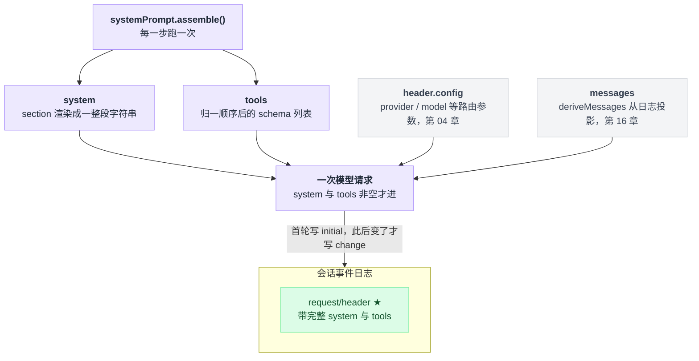
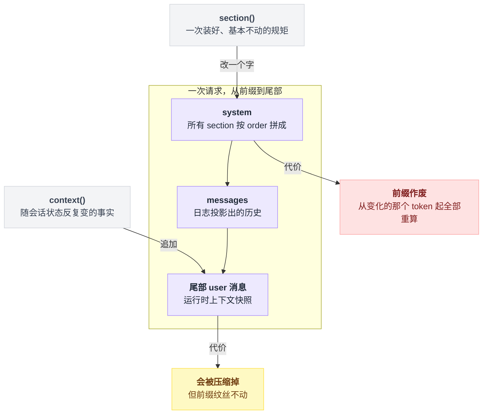
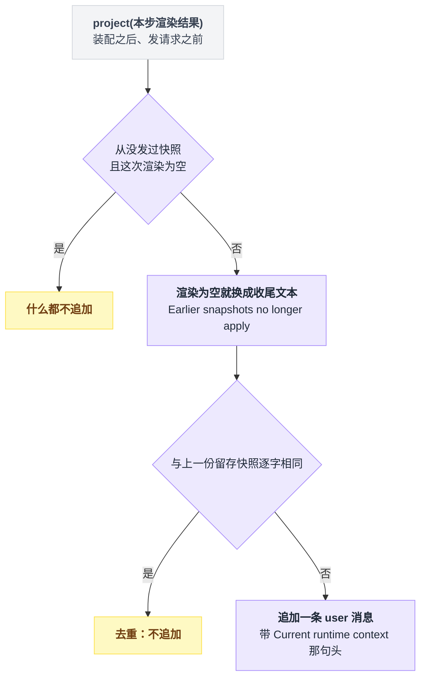
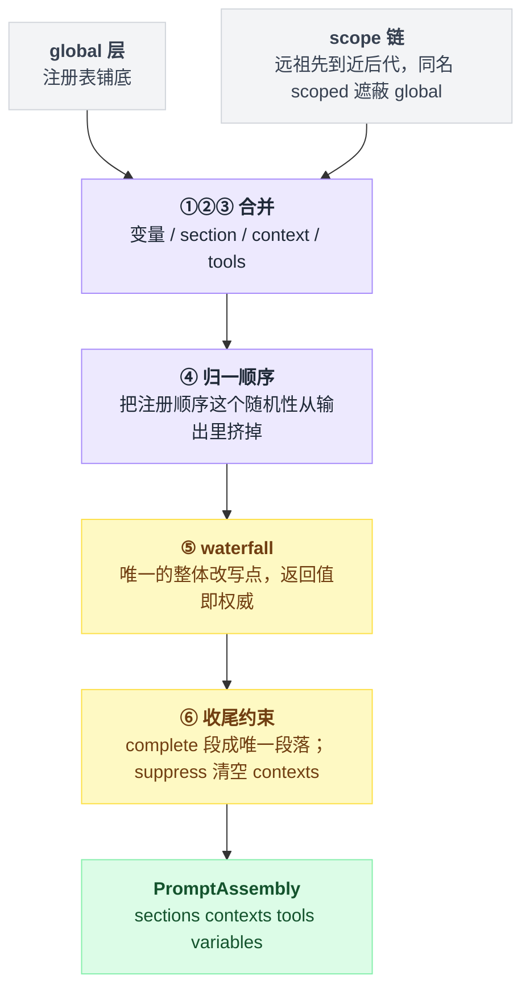
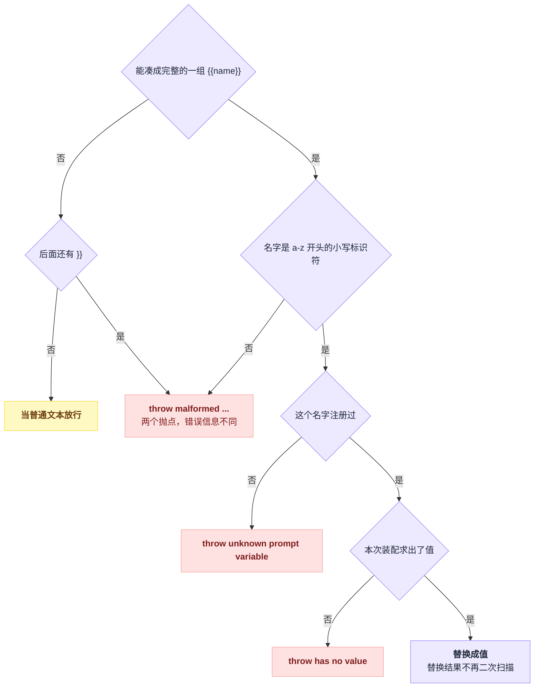
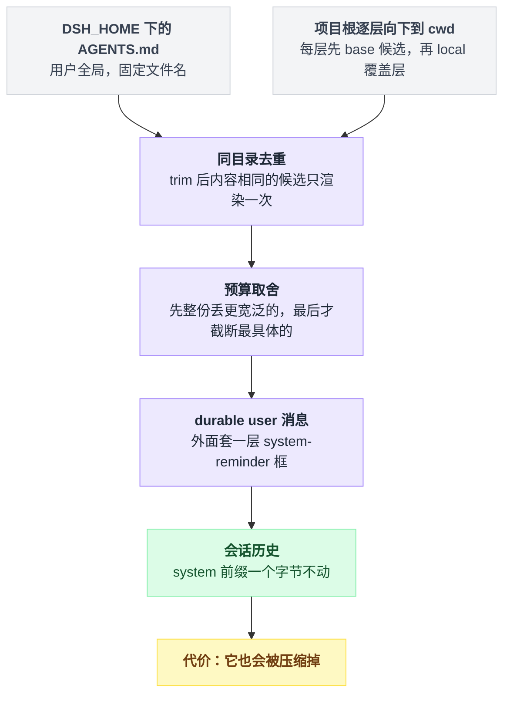
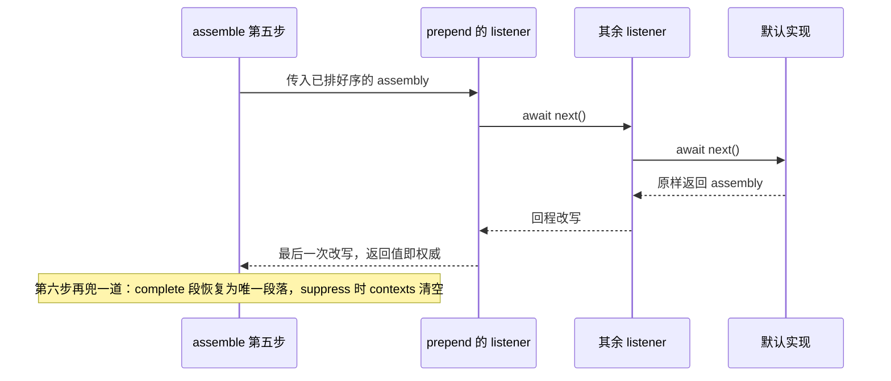

# 15 · 系统提示词与上下文装配

> 基于 `deepseek-ai/deepseek-harness` v0.1.0-rc.5（commit `47f9438`），2026-08-14 核对。本章讲清一轮请求里的 `system` 字符串和 `tools` 字段是怎么被拼出来的，以及你能在哪一步、用什么代价插手。压缩与长会话归第 17 章。

你写了个插件，想让模型知道一件事——比如"这个仓库禁止直接 push 到主分支"。往哪塞？

直觉答案是：反正都是喂给模型的文字，塞哪儿不都一样。

不是的。dsh 给了你四个入口，它们看起来都能用，代价却差着量级。

塞进系统提示词，这条规矩每一步都在，但只要它变一个字，请求前缀的 KV cache 从那个 token 起全部作废。塞成运行时上下文，它落在消息尾部，前缀纹丝不动，可它会被压缩掉。

选错的后果不是"不生效"——是每步几万 token 白白重算，而且你从日志里一眼看不出来。

01 章那句"稳的放前面，动的放尾巴"，本章就是它在代码里的展开：装配跑哪六步、哪一步允许你整体改写、内置段落各占什么位置、`AGENTS.md` 为什么根本不走这条路。读完你应该能自己加一段上下文，并且知道加在哪儿不会把缓存打掉。

---

## 先看模型这一轮到底收到了什么

与其从接口讲起，不如先看成品。

仓库里 `find . -name system-prompt.expected.md` 命中 15 个文件，分三处：

| 位置 | 份数 | 内容 |
|---|---|---|
| `examples/acp-agent/tests/snapshots/` | 12 | 录制下来的真实系统提示词 |
| `apps/web/tests/snapshots/fresh-round-trip/` | 1 | 同上 |
| `packages/test-support/acp-snapshot/tests/fixtures/` | 2 | 正文只有一行 `SYS PROMPT`，占位假数据 |

挑一份真的看开头：

```text
You are an AI agent powered by DeepSeek Harness.

You are a coding assistant powered by the deepseek-v4-flash model. Your working directory is {{cwd}}.

Verify your work by running the code or tests. Keep answers brief and factual.


Use the read tool — not shell commands like cat — to inspect text files. Results include line numbers. ...
```

出处是 `examples/acp-agent/tests/snapshots/agent-instructions/system-prompt.expected.md:1`–`:8`。这短短八行里藏着三个容易读歪的地方。

**第一处是身份行和 persona 的分工。** 第 1 行是 harness 的固定身份，谁部署都一样，来自 `packages/core/system-prompt/src/index.ts:358`–`:362`；第 3–5 行才是这份 composition 自己配的 persona，原文在 `examples/acp-agent/agent-instructions.cordis.snapshot.yml:24`–`:27`。

为什么模型名渲染成 `deepseek-v4-flash`？因为快照跑的是 keyless 回放，配置被换成了同名的 `*.cordis.snapshot.yml`（`packages/test-support/acp-snapshot/src/suite.ts:150`）。日常那份 `agent-instructions.cordis.yml:21`–`:24` 文本一模一样，只是 `model` 配的是 `deepseek-v4-pro`。

**第二处是 `{{cwd}}`。** 它看着像没渲染的变量，其实不是——它是快照归一化把真实绝对路径替换成的占位符（`packages/test-support/acp-snapshot/src/normalize.ts:10`），真跑的时候早就插值好了。

**第三处是第 6–7 行那两个连续空行。** 也不是 bug。persona 文本自己带了结尾换行（YAML `|` 块标量保留末尾换行），再叠上段落间固定的 `\n\n`，就成了这样。

它**不是**某个空段落留下的坑——空段落在渲染时被整条 filter 掉，不占位。渲染管线大致是这样：

```
render(sections):                       // sections 已按 order 升序
    out = []
    for s in sections:
        t = 插值(s.text)                 // {{name}} 在拼接前替换
        if t 为空: continue              // 空段落整条丢掉，不占位
        out.push(t)
    return out.join("\n\n")             // 段落之间固定两个换行
```

过滤空段那步在 `packages/core/system-prompt/src/index.ts:213`–`:216`。

那这份 system 是怎么进到请求里的？一次模型请求最终就是这么一个对象（`packages/core/agent-loop/src/agent.ts:486`–`:493`）：

```text
request = { ...header.config, messages, system, tools, sessionId, signal }
```

`...header.config` 是 provider / model 这些路由参数，归第 04 章；`messages` 是 `deriveMessages()` 从日志投影出来的，归第 16 章。

剩下的 `system` 和 `tools` 是本章主角，两者都非空才进请求（`agent.ts:489`–`:490`），并且都来自同一次装配——`:230` 装配，`:337` 渲染 system，`:341` 把 `assembly.tools` 传下去。

四路来源汇进同一个对象，本章只管其中两路，而它们同出一次装配：



想看**这台机器上真实发出去的那一份**，不用猜也不用加日志。第一次请求必定往会话日志追加一条 `request/header` 事件（`reason` 是 `initial` 或 `resume`），此后只在 header 变了才再追一条（`reason: 'change'`），事件里带着完整的 `system` 与 `tools`（`agent.ts:458`–`:470`）。会话日志怎么读，见第 16 章。

---

## 四种贡献物，去四个不同的地方

成品看完了，回到开头的问题：那条"禁止 push 主分支"到底交给谁？

入口全挂在 `ctx.systemPrompt` 上——它是一个注册表服务（`packages/core/system-prompt/src/index.ts:338`）。插件能往里塞四类东西，它们的最终落点完全不同：

| API | 贡献物 | 最终去哪 |
|---|---|---|
| `section({name, order, text, complete?})` | 有名字、有序号的一段文本 | 拼进 `system` 字符串 |
| `context({name, order, text})` | 动态运行时上下文 | 变成一条 **user 角色**消息进会话历史 |
| `tools(provider)` | 工具 schema，provider 返回 `{ schemas, knownNames? }` | 请求的 `tools` 字段 |
| `variable(name, provider)` | `{{name}}` 的值 | 供 section/context 插值 |

四个都是每步装配时求值一次。签名逐条见同文件 `:381`（section）、`:398`（context）、`:430`（tools，返回值类型在 `:104`–`:109`）、`:446`（variable）。

它们的返回值都是 Cordis effect 的 disposer（卸载时要调的清理函数），插件卸下来贡献自动消失，effect 的机制见第 08 章。

其中 `tools()` 你多半用不上。全仓非测试代码只有一个 provider 注册点，就是工具注册表自己（`packages/core/tools/src/index.ts:832`）——你的工具按第 12 章的方式挂在 `ctx.tools` 上，schema 就自动进来了。

真正要想清楚的是 section 和 context 的分工，这是本章最容易搞混的一点。

**它不是风格问题，是 KV cache 问题。** KV cache 指模型对请求前缀的缓存，只有前缀逐 token 一致才能复用。两个入口落在请求的两头，代价也就分在两头：



section 拼进 `system`，位于请求最前缀。改它等于从第一个变化的 token 起，后面全部作废（规格描述在 `packages/core/system-prompt/README.md:69`；缓存行为发生在模型服务端，本仓库里无从验证）。

context 走的是另一条路。agent loop 把渲染结果投影成一条 user 消息，追加到这一步的消息尾部（`packages/core/agent-loop/src/agent.ts:232`–`:239`），而且**只在内容相对上一份快照发生变化时才追加**（`packages/core/agent-loop/src/runtime-context.ts:64`–`:75`）。前缀不动，缓存保住。

快照文本自带一句头：`Current runtime context. This snapshot supersedes earlier runtime-context snapshots.`（`system-prompt/src/index.ts:239`）。

还有个专门的收尾情况：曾经有过快照、现在全部渲染成空，这时不是什么都不发，而是改投一句 `Current runtime context: none. Earlier runtime-context snapshots no longer apply.`（`runtime-context.ts:13`、`:65`–`:67`）——不然模型会一直拿着一份早就失效的旧快照。

去重和这个收尾情况合起来是一棵判定树，每一步都走一遍：

```
snapshot = 本步 context 的渲染结果
if 从没发过快照 and snapshot 为空:  什么都不追加
if snapshot 为空:                  snapshot = "…none. Earlier snapshots no longer apply."
if snapshot == 上一份留存快照:      去重，不追加
else:                              追加一条 user 消息（带 Current runtime context 那句头）并留存
```



判据很好记：**会随会话状态反复变的事实用 `context`，一次装好基本不动的规矩用 `section`**（会变的事实，比如沙箱模式、审批策略）。

仓库里全部三个 context 注册都属于前者——`sandbox:policy`（`packages/sandbox/sandbox-policy/src/index.ts:113`，order 110）、`approval:policy`（`packages/interaction/user-approval/src/index.ts:205`，order 115）、`subagent:delegation`（`packages/subagent/subagent/src/child-agent.ts:170`，order 120）。

---

## 装配跑六步，只有第五步能整体改写

四类贡献物都注册进去了，下一个问题是：最终那份 assembly 谁说了算？

`assemble()` 的全部逻辑在 `packages/core/system-prompt/src/index.ts:467`–`:542`，六步，顺序不可调。

这里的 scope 是 agent 维度的一条层级链：global 层铺底，agent 自己那层盖在上面（`packages/core/scope/src/store.ts:208`–`:217`）。合并就是一路后写覆盖：

```
resolved = {}
for entry in global 层:                        resolved[entry.name] = entry
for scope in scope 链（远祖先 → 近后代）:
    for entry in scope:                        resolved[entry.name] = entry   // 最近的 scope 赢
```

变量、section、context 都按这个来。六步全貌：

```text
① 解析变量      global 层 → scope 链（远祖先→近），同名后写覆盖   :473-:482
② 合并 section  global + scope 链，同名 scoped 遮蔽 global        :484
   合并 context  同上                                              :485
③ 收集 tools    global provider + scope 链 provider，逐个调用      :487-:503
                parameters 做 structuredClone，与注册表脱钩        :495-:499
④ 归一顺序      section 按 order 升序；tools 按 toolOrder 或字典序 :504、:529
⑤ waterfall     system-prompt/assemble ← 你唯一的整体改写点       :532-:535
⑥ 收尾约束      complete 段恢复为唯一段落；suppress 清空 contexts  :536-:541
```

骨架是：两层来源先合成一份确定的 assembly，再整个交给唯一的拦截点，最后被两条收尾约束兜住。六步里只有第 ⑤ 步值得停下来看，其余都是模板。



第 ⑤ 步是全章重点。它是 waterfall——洋葱中间件，每个 listener 拿到 `next()`，自己决定何时调用、要不要改返回值，语义见第 11 章。签名声明在 `:31`：

```ts
'system-prompt/assemble'(this: Scoped<SystemPrompt>, assembly: PromptAssembly, context: AssembleContext, next: () => Promise<PromptAssembly>): Promise<PromptAssembly>
```

`PromptAssembly` 就是 `{ sections, contexts, tools, variables }`（`:115`–`:120`），四样都可以增删改。**waterfall 的返回值即权威**——事件文档 `:20`–`:26` 明写 "The returned value is authoritative"。唯一的例外是第 ⑥ 步那两条收尾约束。

包里另有一个 companion 会在 waterfall 之后校验结果形状（重名 section、非字符串文本、非法变量名），但它只报错、不改写（`packages/core/system-prompt/src/invariant.ts:16`–`:52`）。

顺序上有个设计意图值得留意：④ 排在 ⑤ 之前。`order` 排序和 `toolOrder` 归一是**把注册顺序这个随机性从输出里挤掉**用的——注册顺序本来就是插件加载顺序的产物，不该泄漏到提示词里。所以 waterfall 拿到的已经是确定的列表；你在 ⑤ 里重排之后的确定性由你自己负责（`.agents/notes/implemented/feature/2026-07-06-explicit-tool-order.md:22`、`:24`）。

还有个坑：装配每一步都跑一次（`packages/core/agent-loop/src/agent.ts:230`），而 `text` 写成函数时签名是同步的（`index.ts:67`），做不了 `await`。别在里面读文件或者算重活。

---

## order 就是排版：内置段落全表

section 按 `order` 升序拼接。约定是 `-100` 身份、`0` persona、工具指引用 100–199（`packages/core/system-prompt/src/index.ts:57`–`:61`）。

下表是全仓 `packages/`、`apps/` 非测试代码里实际注册的 section，路径统一省略 `packages/` 前缀：

| order | name | 出处 |
|---|---|---|
| -100 | `harness:identity` | `core/system-prompt/src/index.ts:358`；`includeHarnessIdentity: false` 可关 |
| -99 / -98 | `harness:source` / `app:web-surface` | `boot/app-boot/src/index.ts:824`（目前只有 Web bundle 在 `bundle/web-app/src/index.ts:142` 调它）、`bundle/web-app/src/index.ts:143`（仅 `surfaceContext: true`，见 `:140`） |
| 0 | `deployment:persona` | `core/system-prompt/src/index.ts:364`；子 agent 由 `subagent/subagent/src/child-agent.ts:172` 在子 scope 同名遮蔽 |
| 50 | `plan:policy` | `plan/plan-mode/src/index.ts:225`，不在 plan 模式时渲染成空 |
| 99 | `tools:code-only` | `core/tools/src/index.ts:834`（定义 `:855`–`:862`），仅非 `native` 模式注册 |
| 100–104 | `tool:read` / `write` / `edit` / `glob` / `grep` | `fs/tool-fs/src/read.ts:70`、`write.ts:63`、`edit.ts:77`、`fs/tool-fs-search/src/glob.ts:301`、`grep.ts:276` |
| 105 | `tool:bash` / `tool:pwsh`（并列） | `shell/tool-bash/src/index.ts:236`、`shell/tool-pwsh/src/index.ts:245` |
| 106 | `tool:pty` / `tool:jobs`（并列） | `terminal/tool-terminal/src/index.ts:156`、`jobs/tool-jobs/src/index.ts:263` |
| 110–114 | `tool:web_search` / `web_fetch` / `lsp` / `session-query` / `goal` | `web/tool-web/src/search.ts:216`、`fetch.ts:430`、`lsp/tool-lsp/src/index.ts:104`、`session-query/tool-session-query/src/index.ts:60`、`goal/tool-goal/src/index.ts:189` |
| 115 | `tool:workflow` / `tool:cordis`（并列） | `workflow/tool-workflow/src/index.ts:212`（段名是 `tool:${toolName}`）、`extensions/tool-cordis/src/index.ts:36` |
| 116 / 116.5 / 117 | `tool:ralph` / `tool:subagent` / `tool:report` | `workflow/tool-ralph/src/index.ts:407`、`subagent/tool-subagent/src/index.ts:459`（常量 `:26`——order 只要求是有限数，不必是整数）、`subagent/tool-subagent-report/src/index.ts:54`（挂在子 agent 的 `childCtx` 上） |
| 150 / 190 | `tools:sdk` / `ui:deliverable-file-references` / `tool:structured_output` | `core/tools/src/index.ts:835`（定义 `:875`–`:878`，常量在 `core/tools/src/code-mode.ts:23`）、`client/ui-deliverables/src/index.ts:23`、`subagent/subagent-in-process-driver/src/structured.ts:99`（后两个并列 190） |

拿这张表回头对开头那份快照，严格升序，一个不差：identity(-100) → persona(0) → read(100) → write(101) → edit(102) → bash(105) → jobs(106) → goal(114) → workflow(115) → ralph(116) → subagent(116.5)。

表里 105、106、115、190 四档都有并列，这正是最容易踩的地方：**`order` 相同时按注册顺序 tie-break，而注册顺序是插件加载顺序的产物，不保证稳定**（`packages/core/system-prompt/README.md:90`）。你自己的段落挑个没人占的数字。

另一条约定是"谁拥有这条事实谁写 prompt"——工具的跨调用指引写在工具插件里，不写进部署 persona。`packages/workflow/tool-workflow/src/index.ts:210`–`:211` 那两行注释把这条说得最清楚。

---

## 变量插值是严格的，写错当场炸

`{{name}}` 长得像模板引擎，而多数模板引擎对写错的引用是睁一只眼闭一只眼——渲染成空串完事。这套不是：宁可整次装配失败，也不让一个坏引用悄悄漏进提示词。

`renderPrompt()` 在拼接前做 `{{name}}` 插值（`packages/core/system-prompt/src/index.ts:212`–`:217`）。

shipped loop 只注册三个变量，全部从 `context.agent` 上取，没有 agent 时一律 `undefined`（`packages/core/agent-loop/src/index.ts:351`–`:353`）：`{{provider}}` = `agent?.options.provider`、`{{model}}` = `agent?.options.model`、`{{cwd}}` = `agent?.session.header.cwd`（`cwd` 本身也是可选字段，`packages/core/session/src/types.ts:73`）。

插值是**严格**的，四种情况直接 throw，而且四条错误信息各不相同；只有一种当普通文本放行：

| 情况 | 结局 | 出处 |
|---|---|---|
| `{{` 之后全文再无 `}}` | 当普通文本放行 | `:269`–`:275` |
| `{{` 后有 `}}` 但不构成完整组（`{{{model}}}` 会炸） | throw `malformed prompt variable reference at ...` | `:270`–`:271` |
| 名字不匹配 `/^[a-z][a-z0-9_]*$/` | throw `malformed prompt variable reference "{{...}}"` | `:279`–`:281` |
| 名字没注册过 | throw `unknown prompt variable ...` | `:283`–`:286` |
| 注册了但这次装配求值为 `undefined` | throw `prompt variable "{{...}}" has no value` | `:288`–`:290` |

五种结局排成一棵一路收窄的树，只有第一道岔路是宽容的：



**没有转义语法**，想在提示词里写字面量花括号，目前做不到（`README.md:88`）。

自己加变量一行就够：`ctx.systemPrompt.variable('team', () => 'infra')`，随后任何 section 里写 `{{team}}` 都能用。

注册时名字非法当场 throw（`:447`–`:449`）；scoped 注册遮蔽同名的 global 值，契约写在 `:439`–`:440`，实现在 `:477`–`:482`。

---

## `AGENTS.md` 走的是另一条路

很多人以为 `AGENTS.md` 是拼进系统提示词的。**它不是 prompt section。**

读项目指令文件的是独立插件 `@deepseek-ai/dsh-agent-instructions`（`packages/context/agent-instructions/`），它把内容作为**durable user 消息**注入会话历史，外面套一层 `<system-reminder>` 框（该包 `README.md:17`–`:31`）。

这个选择的收益跟 context 那条一样：不动系统提示词前缀、不废掉已有 KV cache（`README.md:160`）。代价是它也能被压缩掉（`README.md:55`）。

所以它是一条独立管道，从磁盘一路走到会话历史，中途完全不碰 `system`：



读取顺序在 `src/files.ts:280`–`:307`：

```text
$DSH_HOME/AGENTS.md              ← 用户全局，固定文件名，无 local 覆盖层
project-root/ …逐层向下… cwd/    ← 每层先 base 候选（AGENTS.md CLAUDE.md），再 local 覆盖层（*.local.md）
```

默认值都在 `src/config.ts:11`–`:13`：

| 配置项 | 默认 |
|---|---|
| base 候选 | `['AGENTS.md','CLAUDE.md']` |
| local 候选 | `['AGENTS.local.md','CLAUDE.local.md']` |
| 项目根标记 | `['.git']` |
| `maxBytes` | **必填，没有默认值**（`config.ts:24`、`:42`） |

项目根靠标记向上找到第一个带标记的目录，找不到就退回 cwd（`files.ts:176`–`:190`）。`maxBytes` 必填是故意的，逼每个部署显式做一次预算决定。

候选名必须是同目录文件名：空串、`.`、`..` 以及含 `/` 或 `\` 的条目直接被丢弃（`config.ts:119`–`:123`）。用户全局那份固定叫 `AGENTS.md`，两个候选列表都管不到它（`README.md:72`、`src/render.ts:98`）。

下面这些行为要点，除预算提示外都只核到该包 README 的规格描述，未逐条追进实现代码。

去重与预算：同一目录内 trim 后内容相同的候选只渲染一次，所以 `CLAUDE.md` 是 `AGENTS.md` 的复制品时只出 `AGENTS.md` 那份（`README.md:70`）。超预算时的取舍方向是**先整份丢掉更宽泛的文件**，最后才截断最具体的那份，并输出一句 `Workspace instruction budget ...` 提示（`README.md:76`、`src/render.ts:215`–`:224`，这条已在 `render.ts` 核对到实现）。

发现时机的两个限制最容易让人以为插件坏了：

| 限制 | 表现 | 出处 |
|---|---|---|
| 没有文件监听器 | 磁盘上改了 `AGENTS.md`，要等下一次成功的 `read`/`write`/`edit` 工具调用才被发现 | `README.md:165` |
| 只认结构化 fs 工具 | 在 `bash` 里 `cd` 进子目录**不会**触发嵌套指令发现 | `README.md:164` |
| 不支持 | 小写文件名、`.claude/rules/`、`@path` import | `README.md:166` |
| 框关不掉 | 指令内容里写字面的 `</system-reminder>` 会被转义 | `README.md:45` |

挂在哪也分层：`dsh-base` bundle 把它放在宿主层（`packages/bundle/base/cordis.patch.yml:232`–`:235`，`maxBytes: 65536`）；Web bundle 把宿主那行关掉（`packages/bundle/web-app/cordis.patch.yml:401`–`:402`），改由 agent preset 各自挂载（`apps/cli/config/agent-presets/standard/agent.cordis.yml:30`–`:33`，`code`、`cordis` 两个 preset 同样挂）。

想改候选名或预算，就在对应那一层写 patch，四层叠加见第 03 章。

---

## 实操 A：加一段自己的 prompt section

形状照抄 `packages/client/ui-deliverables/src/index.ts`，那是一个只做 prompt 贡献的最小插件，全文 28 行。新建 `scratch-plugin/src/house-rules.ts`：

```ts
import type { Context } from '@deepseek-ai/cordis'
import type {} from '@deepseek-ai/dsh-system-prompt'

export const name = 'house-rules'

export const inject = ['systemPrompt']

export function apply(ctx: Context): void {
  ctx.systemPrompt.section({
    name: 'house:rules',
    order: 60,
    text: 'Never push to a protected branch. Run the test suite before reporting a task as done.',
  })
}
```

挂载时本地插件用相对路径引用，形式见 `docs/user/develop/basic/config.md:37`–`:39`：

```yaml
- insert:
    - id: house-rules
      name: './src/house-rules.ts'
```

三处需要解释。

`import type {}` 那行不是废话，它把 `systemPrompt` 字段合并进 `Context` 类型，同款写法见 `ui-deliverables/src/index.ts:9`。

`inject = ['systemPrompt']` 不能省，没有它插件可能在注册表服务就绪前就 apply，拿不到 `ctx.systemPrompt`，Service 依赖见第 07 章。

`order: 60` 让这段落在 persona（0）之后、工具指引（99 起）之前。

顺带一提，`section()` 返回的 disposer 本身就是 effect，不必再包一层 `ctx.effect()`——包了也没错，`packages/preset/persona/src/index.ts:61`–`:66` 就是包着写的。

**怎么确认生效**：发一轮消息，然后在会话日志里找 `request/header` 事件（`packages/core/agent-loop/src/agent.ts:465`–`:470`），`header.system` 就是渲染后的完整字符串。

---

## 实操 B：改掉内置的一段

四种手法，能力和代价差得很远：

| 手法 | 能做到 | 代价 |
|---|---|---|
| 同名遮蔽 | 换掉某一段（官方正解） | 只对该 scope 生效 |
| 关掉插件行 | 段落整个消失 | 该插件的工具、服务一起没了 |
| 配置项开关 | 只有两个开关 | 粒度很粗 |
| waterfall 过滤 | 四样都能增删改 | 你要为最终组合负责 |

**同名遮蔽**是官方给出的正解：在 agent scope 里注册一个同名 section，遮蔽 global 的同名段。代价是只对该 scope 生效，而且同一层里重复注册同名会直接 throw。

`@deepseek-ai/dsh-persona` 这个包存在的唯一理由就是它——注册表自己无条件注册 `deployment:persona`，所以这个包**只能挂在 agent scope 里**，挂到 global 会跟注册表撞名而 fail loud（`packages/preset/persona/src/index.ts:1`–`:13`、`:60`–`:66`）。遮蔽规则本身在 `packages/core/scope/src/store.ts:208`–`:217`：global 先铺底，再按 scope 链从远祖先到近后代逐层 `set`，最近的 scope 赢。

**关掉拥有它的插件行**，就是配置里给那行加 `disabled: true`，真实例子见 `packages/bundle/web-app/cordis.patch.yml:401`–`:402`。代价是连带该插件的工具、服务一起没了。

**配置项**只有两个开关：`includeHarnessIdentity: false` 去掉 -100 那行身份，`includeRuntimeContext: false` 关掉所有动态 context。注册表 config 一共四个字段（`:186`–`:202`），能拿来关段落的就这两个，粒度很粗。

**waterfall 过滤**最灵活，也最需要你负责——你要为最终组合负责，包括别人塞进来的协议片段。形状抄 `packages/core/system-prompt/src/invariant.ts:47`–`:51`：

```ts
ctx.on('system-prompt/assemble', async (_assembly, _context, next) => {
  const assembled = await next()
  return {
    ...assembled,
    sections: assembled.sections.filter(section => section.name !== 'tool:ralph'),
  }
}, { global: true, prepend: true })
```

`{ global: true, prepend: true }` 的含义在 `vendor/cordis/src/events.ts:111`–`:117`：`prepend` 排到最前，`global` 绕过 context filter 检查（`:173`）。

不加 `global` 要过两道筛。先是服务自己的 filter，listener 必须解析到同一个 `systemPrompt` 实例（`vendor/cordis/src/service.ts:61`–`:63`）；再是 scope tag，无 tag 的监听器收全部装配，带 tag 的只收该 scope 及其后代的装配（`packages/core/scope/src/index.ts:154`、`:170`–`:185`）。

要改结果就**先 `await next()` 再改**。全仓两个会改写的 listener 都是这么写的：一个是上面抄的 `invariant.ts:47`–`:51`，另一个是 `packages/core/agent/src/model-selection.ts:40`–`:53`，它在所有下游 listener 之后覆写 `variables.provider` 和 `variables.model`，保证提示词里写的模型和真正路由到的模型是同一个。只做前置校验的那个则直接 `return next()`（`packages/preset/agent-presets/src/invariant.ts:60`–`:71`）。

去程只是层层往下调 `next()`，改写全发生在返回的路上——排得越靠前的 listener，落笔反而越晚：



想**整段接管**，用 `complete: true`。这一段会在 waterfall 跑完后被恢复为唯一的 prompt section（`packages/core/system-prompt/src/index.ts:509`–`:518`、`:536`–`:541`），身份行、Web 定位、工具指引、别的 listener 加的东西全部作废；出现两个 complete 段则装配直接拒绝（`:505`–`:508`）。

shipped 的 `minimal` preset 就是这么干的（`apps/cli/config/agent-presets/minimal/agent.cordis.yml:8`–`:13`）：

```yaml
- id: persona
  name: '@deepseek-ai/dsh-persona'
  config:
    text: You are a helpful software engineer assistant.
    complete: true
    includeRuntimeContext: false
```

代价写在它自己的文件头注释里（同文件 `:3`–`:6`）：这个 agent 从此看不到任何工具指引段，Code Mode、结构化输出这类协议片段也一并消失。**要用 complete，就得自己把模型需要的协议说明写进这段文本。**

末尾那行 `includeRuntimeContext: false` 是 persona 包自己的开关，走的是 scope 级的 `suppressRuntimeContext()`（`packages/preset/persona/src/index.ts:67`、`system-prompt/src/index.ts:415`–`:421`）。

---

## 实操 C：按条件动态注入

`text` 可以写成 `(context: AssembleContext) => string`，返回空串就等于这次不出现——空 section 渲染时被丢掉（`packages/core/system-prompt/src/index.ts:215`）。

`AssembleContext` 本身只自带 `scope` 与 `signal`（`:42`–`:50`）。`dsh-agent` 用 TypeScript 声明合并（往同一个 interface 上补字段）加了 `agent`（`packages/core/agent/src/runtime-types.ts:16`–`:21`，说明见 `docs/subsystems/system-prompt.md:11`）。

仓库里三个真例分别按三种条件判断：

`tools:code-only` 按模式，只在有效模式是 `code` 时出文本，`both` 和 `native` 返回 `''`（`packages/core/tools/src/index.ts:855`–`:862`）。

`plan:policy` 按 agent 有无，遇到 `context.agent === undefined` 直接返回 `''`（`packages/plan/plan-mode/src/index.ts:228`–`:229`）。这条别当成防御性编程随手抄——bare `assemble()`（测试、诊断走的路径）根本没有 agent，provider **必须**容忍字段缺失。

`sandbox:policy` 按会话，从 `context.agent?.session` 解析当前策略再渲染，无 session 返回 `''`（`packages/sandbox/sandbox-policy/src/index.ts:116`–`:121`）。

写自己的条件段落就照第三种来：

```ts
ctx.systemPrompt.section({
  name: 'house:release-window',
  order: 61,
  text: context => context.agent?.session.header.cwd?.endsWith('/deploy') === true
    ? 'Release freeze is active. Do not modify deployment manifests.'
    : '',
})
```

记住这个函数每一步都会被调用一次，所以它反映的是**当前这一步**的事实，不是会话开始时的。

---

## 排错清单

| 症状 | 原因 | 出处 |
|---|---|---|
| 注册时抛 `prompt section "X" is already registered` | 同一层里重名；要做 per-agent 覆盖得走 `agent.ctx` | `src/index.ts:316`–`:318` |
| 报 `unknown prompt variable "{{x}}"` | 引用了没人注册的变量名 | `src/index.ts:283`–`:286` |
| 报 `malformed prompt variable reference ...` | 名字不匹配 `[a-z][a-z0-9_]*`，或 `{{`/`}}` 不成完整组 | `src/index.ts:270`–`:271`、`:279`–`:281` |
| 报 `prompt variable "{{model}}" has no value` | 变量注册了但本次求值 `undefined` | `src/index.ts:288`–`:290` |
| 报 `multiple complete prompt sections are active` | 两个 `complete: true` 同时有效 | `src/index.ts:506`–`:508` |
| 报 `toolOrder must contain the "<unlisted-tools>" rest entry` | `toolOrder` 少了兜底项 | `src/index.ts:153`–`:155` |
| `toolOrder` 里的名字没这个工具 → 每次装配都失败 | 形状错在加载时报（构造函数 `:355`），名字错要到第一轮装配才报 | `src/index.ts:170`–`:173`、`README.md:89` |
| 段落顺序在两次启动之间变了 | 两段共用同一个 `order`，按注册顺序 tie-break | `README.md:90` |
| 改了 `AGENTS.md` 模型没反应 | 无 watcher，等下一次 `read`/`write`/`edit` | `agent-instructions/README.md:165` |
| 换了 preset 后 prompt 少了一大截 | 该 preset 的 persona 是 `complete: true` | `agent-presets/minimal/agent.cordis.yml:12` |

第四行那条值得多说一句：`AgentOptions.model` 是可选的，允许由 `agent/request` 才补上（`core/agent/src/runtime-types.ts:26`–`:28`、`agent-loop/src/agent.ts:443`–`:444`），所以"变量注册了却求不出值"是个正常会出现的中间态，不是配置漏填。

---

## 把四个入口串起来

现在回看开头那个问题——那条规矩往哪塞——每条结论都能从前面的画面重新推出来，推不出来就回去重读那一节：

- 模型每一轮收到的 `system` 和 `tools` 之所以确定可查，是因为**它们同出一次装配**，而首轮的 `request/header` 事件把成品原样存进了会话日志——验证生效永远看那儿，不用猜；
- section 和 context 之争之所以不是风格问题，是因为**两个入口落在请求的两头**：改 section 是改前缀，从变化的那个 token 起整条 KV cache 作废；加 context 是改尾部，前缀纹丝不动，代价换成了"会被压缩掉"；
- 想整体接管之所以只有一处下手，是因为六步装配里**只有第五步 waterfall 的返回值是权威**——先 `await next()` 再改，第六步那两条收尾约束是仅有的例外；
- 段落顺序之所以可能在两次启动之间变，是因为 order 只管排版，**并列时靠注册顺序 tie-break，而注册顺序不保证稳定**；
- 插值写错之所以当场炸而不是悄悄漏过，是因为**这套语法是严格的、没有转义**——五种结局里只有"凑不成完整一组"那一条放行；
- `AGENTS.md` 之所以改了没反应、压缩后会消失，是因为**它根本不走 system 那条路**——独立管道、durable user 消息进历史，享受 context 的收益，也承担 context 的代价。

归结成一次决策：**先想清楚这条事实会不会变，再决定它进哪个入口**——这就是 01 章"稳的放前面，动的放尾巴"落到你手里的样子。

> 想知道这一点上 Pi / Codex / LangChain 怎么做，见 [五个 agent 系统源码解剖](../2026-08_五个agent系统源码解剖/00-总览与阅读指南.md)。

---
