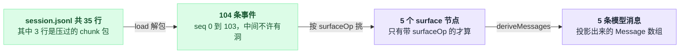
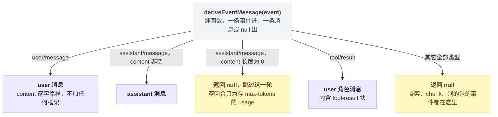
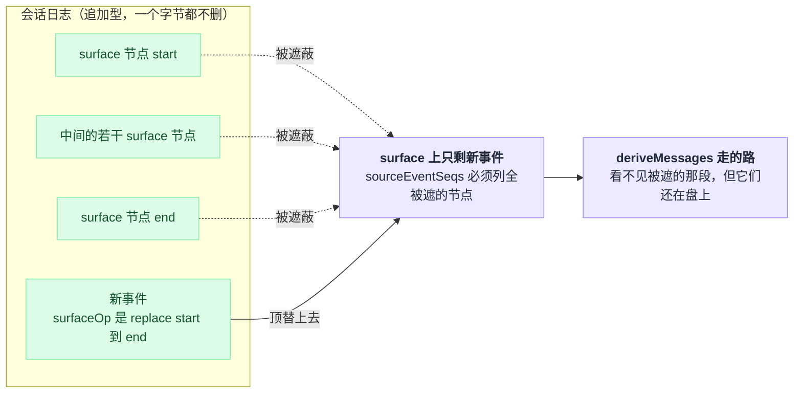
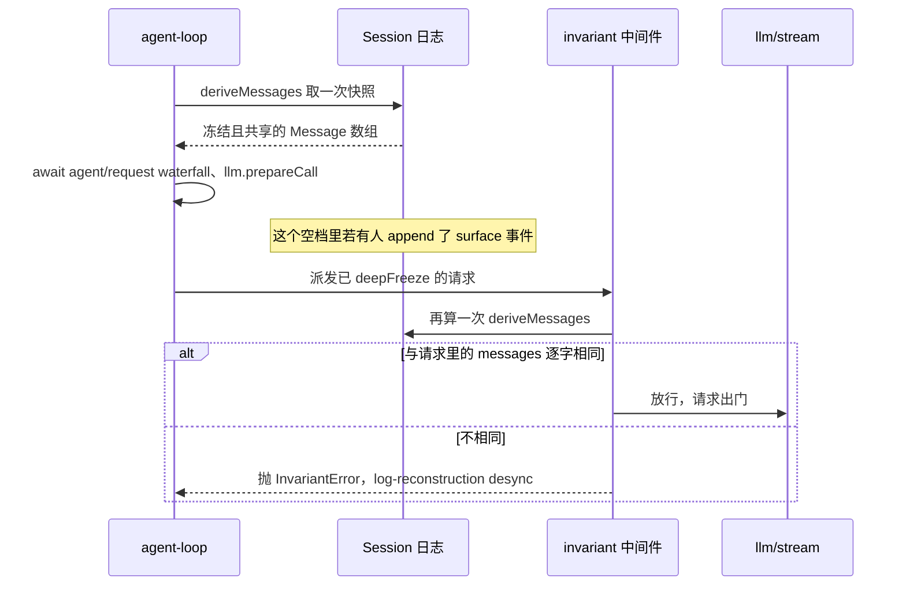
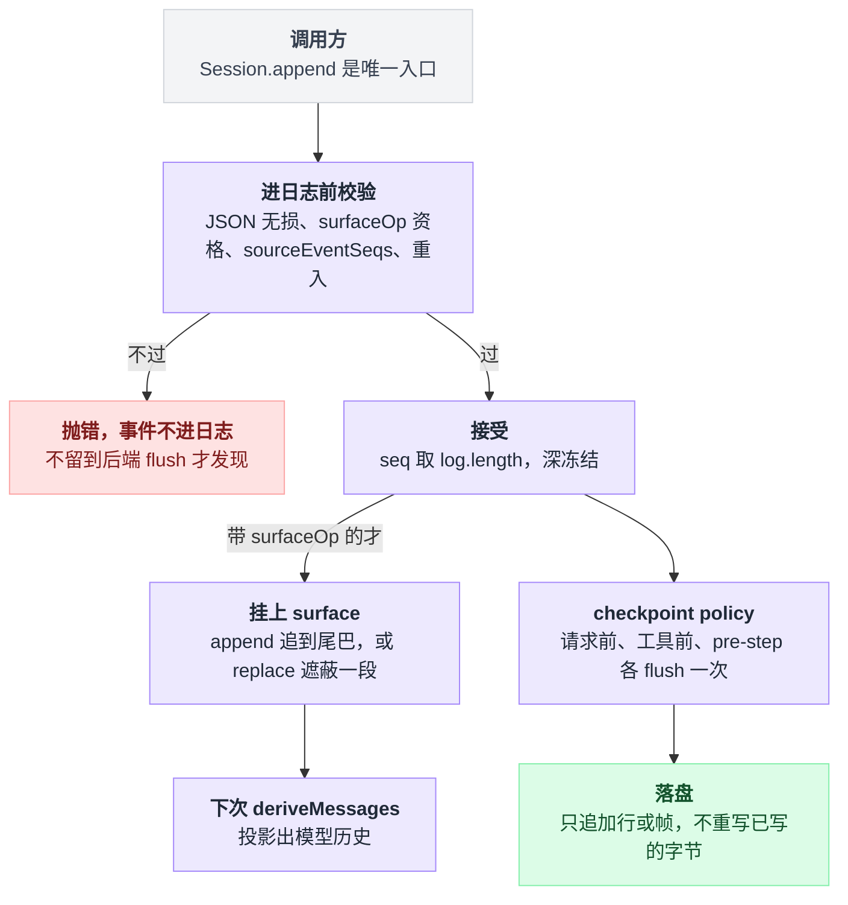
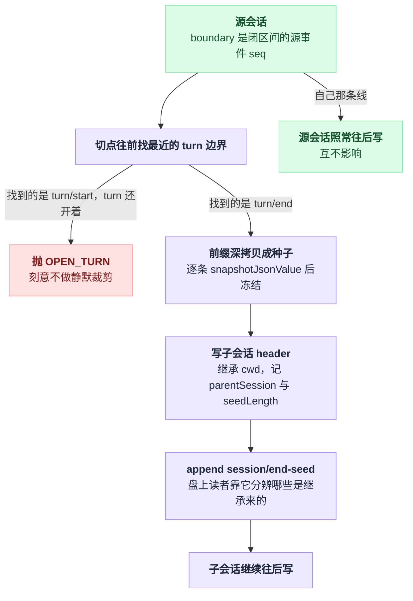
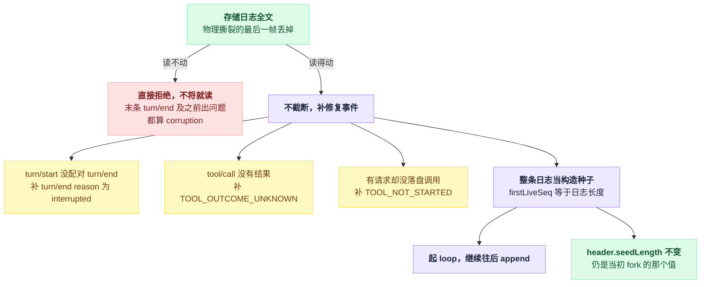

# 16 · 会话日志与分叉

> 基于 `deepseek-ai/deepseek-harness` v0.1.0-rc.5（commit `47f9438`），2026-08-14 核对。正文只讲机制；可照抄的代码统一收在文末[附录](#附录可以照抄的模板)，出处收在[脚注](#出处)，点角标可跳转。

最常见的误解是：会话历史就是内存里的一个消息数组——模型说一句就往里追加一句，想撤销就弹掉最后一条，想改历史就直接改数组。

不是的。dsh 里压根没有这个数组。真正存在的只有一份**追加型事件日志**，模型看到的历史每次都是从它现算出来的。[01 章](./01-数据住在哪循环靠什么转.md)用一节讲了"只有一份真数据"，那是结论。这一章把它拆开：日志文件长什么样、模型历史是怎么从它算出来的、fork 和 resume 各自动了哪些字节、以及三天后你怎么把某次工具调用从一堆事件里翻出来。

读完你应该能干一件很具体的事：拿到一份陌生的 `session.jsonl`，逐行说出每一条在干什么。

以及记住一个形态上的结论：**"我想改掉历史里的一句话"在这套系统里的唯一形态是再追加一条。** 压缩（`compaction/*`）本质上就是日志上的一次区间替换，机制在这章讲透，什么时候压、压成什么样留给 [17 章](./17-压缩与长会话.md)。

---

## 先打开一份真日志：35 行，装着 104 条事件

不用先把 dsh 跑起来，仓库里就躺着可读的样本：acp-agent 例子的测试快照里有一份 `session.jsonl`，全文 **35 行**[^1]。内容是一次完整对话——用 bash 跑 `echo SNAPSHOT_OK`，然后回一个 DONE。

下面是截断长字段后的开头，`{{cwd}}` 这类是快照占位符，真实文件里是真值：

```jsonl
{"type":"session","version":0,"id":"e9421ff4-…","createdAt":1783352044766,"cwd":"{{cwd}}","delegationDepth":0}
{"type":"agent/inbox/spliced","seq":0,"time":1785498764160,"data":{"target":"next-turn",…}}
{"type":"turn/start","seq":1,"time":1785821362944,"data":{"turn":1}}
{"type":"agent/inbox/spliced","seq":2,"time":1785821362944,"data":{"target":"next-turn","removedCount":1,…}}
{"type":"step/start","seq":3,"time":1783352044773,"data":{"turn":1,"step":1}}
{"type":"user/message","seq":4,…,"surfaceOp":"append"}
{"type":"user/message","seq":5,…,"surfaceOp":"append"}
{"type":"session/title","seq":6,…,"data":{"title":"Use the bash tool to","messageSeqs":[4],…}}
{"type":"request/header","seq":7,…,"data":{"header":{"config":{…},"system":"{{system}}","tools":"{{tools}}"},"reason":"initial"}}
```

第一行没有 `seq`——不是漏了，是它压根不是事件。它是 **header**：存储元数据，记版本、id、cwd、血缘，刻意不进事件日志。

从第二行起 `seq` 才开始，从 0 连续往上——不是巧合，是硬约束：`seq` 恒等于日志当前的长度，日志里不许有洞[^2]。

最值得盯的是 `surfaceOp` 这个字段：整份日志里只有 5 行带它。**surface 就是"模型真正看得见的那串事件"**，104 条事件里只有这 5 条会变成模型消息，剩下的九十多条是执行骨架和回放料。

再看两条关键行的尾部：

```jsonl
{"type":"assistant/message","seq":63,…,"sourceEventSeqs":[9,10,11,…,62],"surfaceOp":"append"}
{"type":"tool/result","seq":65,…,"sourceEventSeqs":[64],"surfaceOp":"append"}
```

`assistant/message` 把拼装它的 54 条流式 chunk 的 seq 全列了出来，数组正好是 9…62；`tool/result` 指回它的 `tool/call`，数组里就一个 64。这就是整套设计的核心手法：**不删任何东西，只加指针。**[^3]

至于 35 行怎么装下 104 条事件——最后一行那条 `turn/end` 的 seq 是 103——那是 JSONL 后端默认开着的 `packChunks` 在起作用：它把 ≥3 条连续的同 block delta 压成一行 `text-chunks` / `reasoning-chunks` / `tool-call-chunks`，用 `seq0`、`time0` 加每个成员的 `dt` 偏移无损还原[^4]。

这个文件的账是这么平的[^4]：

| 盘上的 35 行 | 折算成事件 |
|---|---|
| 1 行 header | 不是事件，不占 `seq` |
| 31 行普通事件 | 31 条 |
| 3 行压过的 chunk 包，分别顶 17、31、25 条 | 73 条 |
| 合计 | **104 条** |

好在读的时候完全是"布局盲"的——压过的、没压过的、混着的，load 出来一模一样。

这份文件其实是三层叠着的，盘上的行数、解出来的事件数、模型真正看见的消息数，三个数字一路收窄：



---

## 信封只有一种，载荷有 44 种

44 种事件类型听起来吓人，其实每一条的外壳都长一个样，信封字段是固定的[^5]：`type` 是判别式，按它一分支，载荷的类型就跟着收窄，不用强转；`seq` 是会话内的单调位置；`time` 是 epoch 毫秒；`data` 是该类型的载荷，硬性要求**无损 JSON**。

剩下三个字段各有脾气。

`ignorable` 是个可选标记，管的是向前兼容：读到不认识的类型时，只有带这个标记才允许跳过，不带就必须拒绝重建整条会话——宁可打不开，也不给你一份缺了东西却看起来正常的历史。

`surfaceOp` 和 `sourceEventSeqs` 是**条件字段**，只有三种 surface 类型才能带，其它类型带了编译期就报错。

完整目录是生成出来的，2026-08-14 这个时点共 **44 个事件类型**，每个都标了 surface / log-only 徽章和声明位置[^6]。分布很偏：**3 个 surface、41 个 log-only**；按声明位置分，**13 个由 core 自己的类型文件拥有，另外 31 个来自别的包的 declaration merging**[^7]。

| 大类 | 例子 | 声明在哪 |
|---|---|---|
| **执行骨架**（log-only） | `turn/start` `turn/end` `step/start` `step/end` | core |
| **模型面**（surface，全仓仅此 3 个） | `user/message` `assistant/message` `tool/result` | core |
| **回放料 / 请求重建**（log-only） | `assistant/chunk` `tool/call` `request/header` `request/context` `todo/write` | core |
| **别的包合并进来的**（log-only） | `compaction/*` `hook/*` `approval/*` `llm/retry` `plan/mode` `sandbox/mode` `goal/change` `session/title` `tool-workflow/*` … | 各自的包 |

有一个特别容易记反：`todo/write` 长得像插件塞进来的东西，其实是 core 自己声明的。所以 `dsh-session/invariant` 才会把它和 `request/header` 一起要求"必须被 turn 包住"[^8]。

插件靠 TypeScript declaration merging 往 `SessionEventMap` 里加自己的类型。加进来的**一律是 log-only**：不能带 `surfaceOp`，不参与模型历史。

这条约束有个直接后果——你自己按事件类型分支的代码上，永远不许写"已穷尽"断言（`assertNever`），因为别人加的类型对你来说就是合法的未知值[^9]。

---

## 历史是算出来的，不是攒出来的

日志是唯一事实源，模型消息数组是它的一个**函数**。每条事件怎么投影，全写在一个叫 `deriveEventMessage` 的纯函数里——注意它沿 surface 走，不是遍历整份日志——规则就三条半[^10]：

1. `user/message` 投成 user 消息，内容逐字原样，不加任何框架；
2. `assistant/message` 投成 assistant 消息；内容长度为零的空回合直接跳过——那种事件存在的意义只是把 max-tokens 那一步的 usage 记下来；
3. `tool/result` 投成一条 user 角色的消息，内含 tool-result 块；
4. 那半条：其余一切类型都返回 null，什么也不产出。

`user/message` 的"不加任何框架"是句实打实的约定：`<context>` 这类壳由生产方自己烤进内容。源码里那段注释专门写了这件事，还留了话——如果哪天要把框架重新引进来，也得走 meta 映射加专用渲染器，不能在投影里直接拼[^10]。

`assistant/chunk` 落在"其余"里被显式跳过，理由是拼好的 `assistant/message` 才是权威[^10]。

把这三条半规则并排摆开，投影就是一次按类型的分流，只有三个出口能长出消息：



这里有个说法上的陷阱，值得停一秒：它不是"遍历全部日志"，而是**沿 surface 走**。surface 是 `surfaceOp` 标记维护出来的一串 seq，只有两种操作[^11]：append 往 surface 尾部追一个自己的 seq；replace 带着一段闭区间，把 surface 上从 start 到 end 这段摘掉、换成自己——日志里那几条一个字节都没动，只是不再进模型历史。压缩用的就是后者[^11]。

replace 的形状值得单独看一眼：日志那一列一条不少，变的只是 surface 这条读取路径绕过了中间那段。



实现本身只有 22 行：每个 surface 节点只投影一次并缓存，一次调用的代价是 O(新节点)；一旦发生 replace（换代计数 `replaceGeneration` 变了）整个缓存重建[^12]。

返回的数组每次都是新快照，但里面的消息对象是**共享且深冻结**的——拿到投影也改不动历史[^12]。

回到第一节那份文件，整条链路是：104 条事件 → 5 个 surface 节点 → 5 条消息。分别是 seq 4 用户提问、seq 5 注入的 runtime context、seq 63 assistant、seq 65 工具结果、seq 101 assistant。

为什么不干脆维护一个可变的消息数组？因为一旦历史是算出来的，fork 和 resume 就变成免费的了——复制一段前缀重新投影即可，不用同步两份状态；压缩不用"重写历史"，只是再追加一条带 replace 的事件；崩溃恢复只需要重放。

最实在的是：不存在"日志说 A、数组说 B"这种局面，因为只有一个源。

---

## "模型可见 ⟺ 已落日志"：一条死路，加一道可选的闸

这条不变量的意思很直白：**发给模型的每一条消息，必须先是日志里的一条事件；日志里没有的，模型看不到。**

第一道防线在构造处，而且永远生效。loop 构建请求时直接把投影塞进去，没有第二条路径——构造现场就是把会话投影出来的消息，连同轮次、步数、装配好的工具、系统提示词和取消信号一起交出去[^13]。

这个数组一路传到请求构造的末尾，连同整个请求一起深冻结，再打上 agent-loop 的标记[^14]。请求和它的消息都是冻的，而 cordis 的 waterfall 又是固定实参、放行时不接受替换参数[^14]。

"在 `llm/stream` 中间件里偷偷加一条临时提示"这条路，是被物理堵死的。

第二道是 01 章提过的那个会抛异常的运行时检查，装在 `llm/stream` 上并且插了队——跑在最外层，防止有人在前面短路掉它。核心就三行：再算一次投影，把请求里的消息和它各自做 JSON 序列化后逐字比对，不同就报失败，措辞是 "llm request … diverges from the dispatch-time durable derivation (log-reconstruction desync)"[^15]。

同一个 installer 还顺手断言了一串：请求必须是冻结的、必须带活着的会话 id、日志里必须已经有 `step/start` 和 `request/header`，以及 model / system / temperature / maxTokens / stop / tools 必须与折叠出来的 `request/header` 完全一致[^15]。

失败是**抛**，不是记日志——失败处理函数的签名写死了返回 never。抛出的是 `InvariantError`，错误码是 INVARIANT，消息带包名前缀[^16]：

```
invariant violated by "@deepseek-ai/dsh-agent-loop": llm request for session "session-1" diverges from the dispatch-time durable derivation (log-reconstruction desync)
```

它到底在抓什么？投影在构造请求时取的是一次快照，之后还要等 `agent/request` waterfall、模型客户端的准备调用等好几步才真正出门[^17]。如果在这个空档里有人往会话追加了一条 surface 事件，请求里的消息就落后于日志了。这条检查就是在请求真正出门前的最后一刻把它按住。

想给模型加东西的正确做法是追加进会话（[15 章](./15-系统提示词与上下文装配.md)的 prompt 装配、agent 的注入接口那条路），让它成为日志里的 `user/message`，下一次投影自然会带上。

守的就是取快照到真出门这一段空档，四方的先后是这样的：



**但这道闸默认不在启动树上。** 注册它需要 `@deepseek-ai/dsh-invariants` 服务加上各包的 invariant 伴生插件，而这两样在随产品的 bundle / profile YAML 里一行都没有[^18]。它是开发期诊断，得自己挂；挂上之后默认启用，可以用 `package_allowlist` / `package_blocklist` 正则筛[^18]。

不变量的**持久化那一半**倒是默认开的。`dsh-session-checkpoint-policy` 就在 base bundle 里[^19]，它在三个位置各做一次 flush：模型适配器收到请求之前、顶层工具体可能产生外部副作用之前、以及每个 `agent/pre-step` 边界上。

而且 **checkpoint 失败是 fail-closed 的——适配器和工具体都不会跑**[^20]。它和持久化后端是两个插件，你可以只装后端不装它，代价是崩溃时可能丢掉还在批处理窗口里的事件[^20]。

---

## 坏事件在 append 现场就炸

一条事件从调用到进日志、到落盘、到被折叠进模型历史，中间只有一道闸，过不去就在现场抛：



和上一节那道可选的闸不同，会话的追加方法是唯一入口，校验在事件进日志**之前**完成，任何配置组合下都跑[^21]。

这是一张值得收藏的报错对照表[^22]：

| 触发条件 | 报错文本 |
|---|---|
| `data` 含 BigInt / 函数 / Symbol / `undefined` / `Map` / `Date` / 循环引用 / 稀疏数组 / `NaN` | `session event "<type>" carries non-JSON-serializable data` |
| log-only 类型带了 `surfaceOp` | `session event "<type>" is not surface-eligible and cannot carry surfaceOp` |
| surface 类型没带 `surfaceOp` | `session event "<type>" is surface-eligible and requires a surfaceOp marker` |
| `sourceEventSeqs` 引用了不早于自己的 seq | `sourceEventSeqs must reference earlier events: N >= current seq M` |
| replace 没覆盖全被遮蔽的节点 | `surface replace: sourceEventSeqs must include every shadowed surface node; missing …` |
| 在追加的发布回调里再追加 | `session append cannot reenter while another append is being published` |

跨事件的关系归另一个可选伴生插件 `dsh-session/invariant` 管（同样要先挂 `dsh-invariants`）：turn / step 编号连续、执行类事件必须被 turn 包住、`tool/result` 必须在同一 step 里有前置 `tool/call`。典型报错是 "turn/start expected turn 3, got 5"、"appended outside any open turn (core execution events must be turn-enclosed)"、"tool/result … with no prior tool/call in this step"[^23]。

设计取向没什么弯弯绕：**坏事件在追加现场就炸，不留到后端 flush 时才发现**——那时候日志已经脏了。

---

## 日志就躺在盘上，但你 cat 不出来

默认后端是 JSONL。`root` 这个配置项**没有默认值**，在 base bundle 里被钉死为 dsh 家目录下的 sessions 目录——那一格写的就是用启动上下文的家目录函数拼出来的路径[^24]。

往下是按 cwd 分目录、按 session id 建子目录[^25]：

```
~/.dsh/sessions/
  --Users-cong-code-demo--/
    session-3f2b1c8e-…/
      session.jsonl.zstd
      session.jsonl
  _no-cwd/
```

那个满是横杠的目录名是 `projectKey` 对 cwd 加工的结果：分隔符全变横杠，去掉前导横杠，两侧再包一对双横杠。里层的会话目录名把 id 里的不安全字符转成 `~XXXX` 转义。日志文件默认是 `session.jsonl.zstd`，只有把压缩配置成 none 时才是裸的 `session.jsonl`；没有 cwd 的会话统一进 `_no-cwd`[^26]。

目录名就是 id 本身，UUID 这类字符原样保留，而 Web 建的会话 id 是 session- 前缀接一段 UUID[^27]，所以盘上看到的就是上面那个样子。

有一点别踩：`projectKey` 是**有损**的，不同 cwd 归一化后可能撞进同一个项目目录，真正的区分依据是 session id。

默认 zstd 意味着 cat 不出来。三条路可以打开它。

**一，直接下载**，Web 在跑时最省事。调会话导出接口（GET 的 `session.export`，带上会话 id）返回一个 ZIP，里面的 `session.jsonl` 是解码后的**逐字原文**——原始工件内容的定义原话就是 "decoded from the backend's physical encoding"[^28]。

子 agent 的日志在 ZIP 里的 subagents 子目录下，引用到的图片在 media 下；加 `includeDescendants` 参数可以带上后代，但这个参数只认 true / false / 不写，拼错直接 400[^28]。读之前 host 会先对活会话做一次 flush 屏障。

**二，改成不压缩**，用一个 patch 覆盖那一格。这里有个坑：patch 是**按 id 整体替换该字段、不深合并**的——实现就是一句直接赋值[^29]，而 `root` 又是必填项，所以你必须把 `root` 一起写回去。patch 文件照抄[附录 A](#a-关掉压缩的持久化-patch)，启动时用 `--patch` 叠上即可。写路径用的那个家目录函数是启动上下文提供的值；把压缩关成 none 这种写法在仓库里有真实先例；顺手把 `packChunks` 也关掉，每条事件一行，诊断时好读得多[^30]。

注意**一个 root 只归属一种编码**——启动时发现相反后缀会直接报错，没有迁移、没有混读、没有双写[^31]。所以要换编码，就必须换新 root。

**三，用后端读**。持久化 seam 上有两个读法：inspect 拿到不落盘、不发布的逻辑视图，readRaw 拿逐字原文[^32]。

调 readRaw 之前先看 `supportsRawArtifacts`：JSONL 后端是 true，SQLite 持久化后端是 false，对不支持的后端调它是 **reject**，报 "this session persistence backend does not expose raw artifacts"；而返回 undefined 是另一回事，只代表"这个会话没有落盘工件"[^32]。

最后说回第一行那个 header。字段是固定的一组：类型标记、版本、id、创建时间，可选的 cwd、父会话、种子长度、来源，再加委托深度和 agent preset[^33]。

版本号目前恒为 0，**预发布期，不保证兼容**：读到更高版本会说 "the log was written by a newer harness — upgrade the harness to open it"，读到更低版本说 "this build ships no upgrade path for it"[^34]。

---

## fork 不是复制会话，是复制一段前缀

底层 API 一句话说得完：在会话服务上调 fork，给它源会话、一个边界、可选的子会话 id——选源会话的一段前缀，深拷贝成新会话的种子，写上血缘[^35]。

边界是**闭区间**的源事件 seq，省略就是源当前最后一条。种子是真·深拷贝，非 restore 路径每条事件都要过一遍无损 JSON 快照再冻结[^35]。子会话 header 继承 cwd，另外写上父会话 id，种子长度记进 seedLength。

拒绝的情形有专门的错误码：SESSION_NOT_FOUND / SESSION_NOT_LIVE / SESSION_ALREADY_EXISTS / INVALID_BOUNDARY / OPEN_TURN[^35]。

最后那个 OPEN_TURN 值得单独说。切点会从边界往前找最近的 turn 边界：找到的是 `turn/end`，通过；找到的是 `turn/start`，说明这个 turn 还没闭合，直接拒绝，抛出来的消息长这样："fork boundary 42 in session "session-1" ends inside open turn 3"[^36]。

这是刻意不做静默裁剪。一个开着的 turn 里可能有已发出的 `tool/call` 却没有 `tool/result`，复制过去的历史模型没法接着走；与其给你一份看着能用、跑起来才炸的会话，不如当场拒绝。

分叉出来的形状就是共享一段前缀、然后两边各长各的：



Web 上那个"从这条消息分叉"的按钮走的是另一层策略，它压根不调底层的 fork[^37]：

1. 拿用户点的那条消息的 seq，往后找第一个不早于它的 `turn/end`——所以点一条消息，等于它所在的整个 turn 都进去；
2. 再从那里继续往后延到下一个 `turn/start` 之前，捎上紧跟着的 `session/title`、注入事件；
3. 那个 turn 还没结束就返回 fork-unavailable，消息是 "session … has not completed the turn containing event N"——不会悄悄退回到更早的 turn；
4. 都过了，就带着这段前缀当种子、附上元信息，直接创建一个新 agent。

子会话还会继承源的 agent preset，理由和 OPEN_TURN 同源：种子历史是在那套工具下产生的，换一套组合会让已有的 tool call 悬空。客户端那头点一下按钮，就是带着那条消息的 seq 发一条 fork 调用、让标题序号递增，然后打开子会话[^37]。

还有一条容易忽略的事件：种子塞进去之后，构造函数会立刻追加一条空载荷的 `session/end-seed`。它是 firstLiveSeq 的持久化投影——只拿到磁盘字节的读者，靠它区分"哪些是继承来的、哪些是本次生命周期写的"。

找的时候记得找**最后一条**：种子末尾已经有一条时不会重复打标，所以打开一个没动过的会话不会让日志一次次变长[^38]。

---

## resume 是把整条存储日志当种子

fork 复制前缀，resume 复制全部。仓库里有真实跑的 fixture：在 agents 服务上调 resume，给它要续的会话 id 和 agent 选项（provider、model），原文照抄[附录 C](#c-resume-一条已存在的会话)[^39]。

那个 fixture 的插件声明注入 agents、agentLoop、sessionPersistence 三个服务。resume 先经持久化把会话读回来再起 loop，失败点有三个：没注册 agent factory、没配持久化、日志读不动[^39]。

有两个边界特别容易混[^40]：

| | `header.seedLength` | `session.firstLiveSeq` |
|---|---|---|
| 是什么 | **持久的** fork 血缘边界 | **本进程**的构造种子长度 |
| resume 之后 | 仍然是当初 fork 时的那个值 | 等于整条存储日志的长度 |

崩溃恢复这块的处理挺讲究：**不截断**。先把存储日志读全——物理撕裂的最后一帧丢掉，这可以将就；但最后一条已提交的 `turn/end` 之前（含）出任何问题就算 corruption，直接拒绝。读得动，就补三种修复事件：每个没配对上 `turn/end` 的 `turn/start`，补一条结局标成 interrupted 的 `turn/end`；每个没有 `tool/result` 的 `tool/call`，补 TOOL_OUTCOME_UNKNOWN；每个有 assistant 请求却没落盘调用的，补 TOOL_NOT_STARTED。最后把整条日志原样当构造种子交出去[^41]。

之所以不砍掉那些事件：一个 turn 在长任务里可能非常大，而且它们崩溃前已经落盘了。interrupted 是唯一一个 loop 永远不会自己发的 TurnEndReason。

TOOL_OUTCOME_UNKNOWN 是在告诉模型"这次调用结果未知，只重试只读或幂等的操作，可能的副作用要去核实或问用户"。

重建的顺序是先把日志读全、再给崩溃留下的口子补事件、最后才把它整条当种子交出去：



---

## 没有回退，也没有删除

这一节是全章最反直觉的地方，五件你可能想干的事，实际发生的都不是你以为的那个。

**想撤销刚才那条消息？** 没有这个操作。会话的公开面上只有追加，没有任何 truncate / delete。唯一的路是 fork 到更早的边界，在新会话里继续。

**想让模型"忘掉"一段？** 追加一条带 replace 的 surface 事件，把那段从 surface 上摘掉——压缩就是这么干的。**日志里原文还在。**

**想改一条已写入的事件？** 事件在接受时深冻结，事件列表的访问器返回不可变快照，cast 也改不动[^42]。

**想删掉一个会话的文件？** 持久化 seam **没有删除 API**，日志一直堆在 root 下，直到外部手动清[^43]。

**想重写盘上已 flush 的内容？** 不会发生。后续批次只追加行 / 追加帧；写或 fsync 失败会把文件回滚到之前的字节长度[^43]。

代价是真实的，不用粉饰：磁盘只增不减，`assistant/chunk` 一条不落地存着——因为 seq 必须连续，所以不能过滤掉 chunk[^43]。换来的是"任何一次请求都是日志的纯函数"这条能被机器断言的性质。

顺带记住一个隐含约束：**一个会话同时只能有一个活写者**。另一个后端实例或另一个进程不许写同一个会话[^43]。

---

## 三天后，怎么把某次工具调用翻出来

统一的查询 seam 是一个叫 sessionQuery 的服务，策略是"live 优先"——同一个 id 如果有活会话就读活的，否则读持久化的[^44]。

它的能力分成两半，左边那半任何部署都能用，右边那半要有全文索引后端撑着[^44]：

| 与后端无关（**任何部署都可用**） | 需要全文索引后端 |
|---|---|
| `listSessions` 列全部 | `searchSessions` 跨会话全文搜，按最强命中事件分组 |
| `readSession` 读整条原始日志 | `searchEvents` 单会话内全文搜 |
| `filterSessions` 按 id / cwd / 创建时间 / 父会话 / 可用性筛 | |
| `filterEvents` 按 seq / time / type / surface / **字面文本**筛 | |
| `readEvent` 读一条事件 + 前后上下文窗口 | |
| `traceEvent` 追替换链与引用关系 | |
| `traceSession` 追祖先与后代森林 | |

字段名是 sessionId，不是 id[^45]。

**默认全文搜是关的。** 插件自己的 schema 默认在启动时就打开索引，但 base bundle 和 web bundle 都把打开时机压成了 never[^46]。

此时两个全文搜方法抛 SESSION_QUERY_SEARCH_DISABLED，`node:sqlite` 根本不会被 import，但上表左半边全部照常工作。要打开就再叠一层 patch，照抄[附录 B](#b-打开全文索引的-patch)。

那份 patch 里把打开时机设成 first-search，是把 SQLite 的 import 和句柄推迟到第一次搜索，Node 22 **启动**时就不会打实验性警告——注意只是推迟，第一次真搜的时候该警告还是会出现；另外**不要把索引库的路径指到持久化那个库上**[^47]。

### 实操

好消息是找一次工具调用根本不需要开索引。filterEvents 的文本子句是字面的、大小写不敏感、空白宽松的扫描，与全文 provider 无关[^48]。

写成一个小插件挂进去就行，全文照抄[附录 D](#d-翻工具调用的完整插件)：声明注入 sessionQuery，先按类型筛出 `tool/call`，再按字面文本筛出那句 echo，然后对每条命中开一个前 1 后 2 的窗口读出来打日志。

logger 是 cordis 内置服务，不用写进注入清单；%s / %d / %o 是它自带的格式化符[^49]。挂载方式和 [06 章](./06-你的第一个插件.md)一样，往 profile 里 insert 一行 id 加本地文件[^49]。

拿它去查第一节那份日志，会命中 **seq 64**，也就是 `tool/call` 那条——它的语义文本是工具名加参数，而参数里就有 `echo SNAPSHOT_OK`。前 1 后 2 的窗口覆盖 seq 63–66，把 assistant 消息(63)、工具调用(64)、工具结果(65)、step 结束(66)一起带出来，一次调用就还原了整个现场。

几个口径要记牢，否则会搜了个寂寞：

- **语义文本抽取按代码是这样的**[^50]：`user/message` / `assistant/message` 取内容块，`tool/call` 取工具名加参数，`tool/result` 取内容加 error 名与 code，`todo/write` 取状态加内容，`turn/end` 只在结局是 error / aborted / max-tokens / interrupted 时出文本；结构事件、`assistant/chunk`、`request/header` 与所有合并进来的插件事件一律空串。块级别只取 text / tool-call / tool-result，**reasoning 块返回空数组，搜不到**。⚠️ 子系统文档把 reasoning 也列进了可搜文本，与 HEAD 的代码不符——以代码为准[^50]。
- 每条命中带 surface 字段，三态：current（当前模型上下文）/ shadowed（被压缩替换掉的）/ log-only。默认三种都搜，要收窄就加一条 surface 子句只要 current[^51]。
- readEvent 的前后窗口上限由 `readWindowMax` 控制，默认 50[^52]。
- Web 侧的搜索框走 `session.search` RPC，它把事件类型硬性限制在 `user/message` + `assistant/message`、surface 限制在 current——比直调这个查询服务窄得多[^53]。
- FTS5 用 unicode61 分词，是**词/短语召回，不是任意子串召回**：搜 AI 匹配不到 BRAID 里的 AI。要子串就用 filterEvents 的文本子句[^54]。

最后避个雷：用 @ 引用另一条会话作为上下文，是完全另一套东西[^55]。它把被引会话的**当前 surface** 投影成一段不可信上下文塞进你的消息，和这里的查询不是一回事。

---

## 把这些画面串起来

回到开头那个误解——"历史是个消息数组"。现在每一条结论都能从前面的画面自己推出来：

- 历史之所以不用数组存，是因为**盘上那 35 行就是唯一事实源**：seq 连续、header 不占位、chunk 包无损还原，消息数组只是沿 surface 走一遍投影函数算出来的——不存在"日志说 A、数组说 B"。
- "改历史"之所以只有追加一种形态，是因为**每一条别的路都被物理堵死了**：事件接受时深冻结，追加是唯一入口且现场校验，后端只追加字节，持久化 seam 连删除 API 都没有。
- 压缩之所以不算"重写历史"，是因为 replace 只动 surface 这条**读取路径**——被遮的事件一个字节没少，shadowed 状态还能被 filterEvents 搜出来。
- fork 之所以便宜，是因为历史是前缀的**纯函数**：深拷贝一段种子、写上血缘、追加一条 `session/end-seed`，两边各自往后长；而 OPEN_TURN 拒绝在开着的 turn 里下刀，是不肯给你一份 tool call 悬空的历史。
- resume 之所以敢**不截断**崩溃现场，是因为补事件比砍事件便宜且诚实：interrupted、TOOL_OUTCOME_UNKNOWN、TOOL_NOT_STARTED 三种补丁把口子填上，日志本身一条不丢。
- 模型看到的之所以恒等于日志里有的，是因为构造处只有投影这一条路（请求整个深冻结），再加一道可选的 invariant 闸在出门前逐字比对——比对不过就抛，不是记一条 warning。
- 三天后能翻出那次工具调用，靠的也是同一份日志：filterEvents 字面扫描不需要任何索引，readEvent 的窗口把 call / result / step 边界一起带回来。

一句话带走：**日志只追加，surface 是它上面的一层索引，模型历史是沿 surface 走一遍算出来的；于是"改历史"只有一种形态——再追加一条，而 fork 不是复制会话，是换一条读取路径。**

---

## 附录：可以照抄的模板

### A. 关掉压缩的持久化 patch

按 id 整体替换那一格，所以必填的 `root` 必须一起写回[^29]：

```yaml
# 存成 my-plain-log.patch.yml
- id: session-persistence-jsonl
  config:
    root: !!js dshHomePath('sessions-plain')
    packChunks: false
    compression: none
```

启动时叠上：

```sh
dsh --profile web --patch ./my-plain-log.patch.yml
```

### B. 打开全文索引的 patch

```yaml
# 存成 my-search.patch.yml
- id: session-query-sqlite
  config:
    path: !!js dshHomePath('session-index.sqlite')
    openAt: first-search
```

### C. resume 一条已存在的会话

逐字照抄仓库里真实跑的 fixture[^39]：

```ts
// examples/headless-agent/tests/fixtures/workspace-context-resume-agent.ts:20-23
const handle = await ctx.agents.resume({
  resumeSessionId: 'workspace-context-resume' as SessionId,
  agentOptions: { provider: 'deepseek-official', model: 'deepseek-v4-flash' },
})
```

### D. 翻工具调用的完整插件

```ts
// 存成 find-tool-call.ts
import type { Context } from '@deepseek-ai/cordis'
import type { SessionId } from '@deepseek-ai/dsh-session'

export const name = 'find-tool-call'
export const inject = ['sessionQuery']

export async function apply(ctx: Context): Promise<void> {
  const sessionId = process.env.TARGET_SESSION as SessionId
  const hits = await ctx.sessionQuery.filterEvents(sessionId, [
    { kind: 'type', values: ['tool/call'] },
    { kind: 'text', text: 'echo SNAPSHOT_OK' },
  ])
  for (const hit of hits) {
    const window = await ctx.sessionQuery.readEvent({ sessionId, seq: hit.seq, before: 1, after: 2 })
    ctx.logger.info('%s @seq %d -> %o', hit.type, hit.seq, window.target.data)
  }
}
```

挂载往 profile 里 insert 一行[^49]：

```yaml
- id: find-tool-call
  name: './find-tool-call.ts'
```

---

## 出处

[^1]: 样本文件：`examples/acp-agent/tests/snapshots/tool-call-turn/session.jsonl`，全文 35 行。
[^2]: `seq` 恒等于 `log.length`、日志无洞的硬约束：`docs/subsystems/persistence.md:43`、`docs/subsystems/session.md:196`。
[^3]: 两条关键行在同一份快照文件的 `:19`（assistant/message，sourceEventSeqs 列出 9…62）与 `:21`（tool/result，指回 `[64]`）。
[^4]: packChunks 的打包与还原规则：`packages/session/session-persistence-jsonl/README.md:18`。最后一行 `turn/end`（seq 103）在快照文件的 `:35`；三行压过的 chunk 包分别在 `:12`（顶 17 条）、`:14`（顶 31 条）、`:25`（顶 25 条）。
[^5]: 信封字段的完整定义：`docs/subsystems/session.md:212-244`。
[^6]: 生成的完整目录：`docs/persistence-catalog.md:95` 以下，44 个事件类型逐个标 surface / log-only 徽章和声明位置。
[^7]: core 拥有的 13 个声明在 `packages/core/session/src/types.ts`：执行骨架 `types.ts:243-256`，surface 三个 `types.ts:264,273,291`，回放料 `types.ts:266,279,299,304,309`；别的包合并进来的例子：`packages/llm/llm-retry/src/types.ts:9`、`packages/session/session-title/src/index.ts:100`。
[^8]: `todo/write` 与 `request/header` 必须被 turn 包住：`packages/core/session/src/invariant.ts:150-155`。
[^9]: declaration merging：`docs/subsystems/session.md:11`；插件事件一律 log-only：同文件 `:595`；不许 `assertNever`：`:247`。
[^10]: 投影规则实现 `deriveEventMessage()`：`packages/core/session/src/surface.ts:83-114`；"不加框架"的注释与 meta 映射的留话在其中的 `:88-95`（即原文说的源码 88-95 行）；chunk 显式跳过那条见 `docs/subsystems/session.md:526`。
[^11]: surface 的两种操作、replace 的闭区间语义与压缩用法：`docs/subsystems/session.md:285-290`。
[^12]: 22 行的缓存实现：`packages/core/session/src/index.ts:726-747`；深冻结那段在同文件 `:717-723`。
[^13]: 构造处唯一路径：`packages/core/agent-loop/src/agent.ts:341`，那行就是把 `this.session.deriveMessages()` 和 `turn, step, assembly.tools, system, signal` 一起交出去。
[^14]: 请求整体 deepFreeze 并打 agent-loop 标记：`agent.ts:486-493`；waterfall 固定实参、`next()` 不接受替换参数：`vendor/cordis/src/events.ts:234-243`。
[^15]: 逐字比对的核心三行：`packages/core/agent-loop/src/invariant.ts:39-42`，做法是再算一次 `deriveMessages()`、与请求 messages 各自 `JSON.stringify` 后比对，不同就 `fail()`；整个 installer 的断言清单在 `:23-52`。
[^16]: `fail()` 的签名 `InvariantFailure = (message: string) => never`：`docs/subsystems/invariants.md:33`；`InvariantError`、`code: 'INVARIANT'` 与包名前缀：`packages/runtime-diagnostics/invariants/src/index.ts:50-65`。
[^17]: 取快照与真出门之间的空档（`agent/request` waterfall、`llm.prepareCall()` 等）：`agent.ts:438-455`。
[^18]: `packages/bundle/**/*.yml` 全文搜不到 invariant 行；挂上后默认 `enabled: true`、可用 `package_allowlist` / `package_blocklist` 筛：`docs/subsystems/invariants.md:12-23`。
[^19]: checkpoint policy 在 base bundle 里：`packages/bundle/base/cordis.patch.yml:354-356`。
[^20]: fail-closed：`packages/session/session-checkpoint-policy/README.md:5,21,23`；只装后端不装它的代价：同上 `:19`。
[^21]: `Session.append()` 唯一入口与进日志前校验：`packages/core/session/src/index.ts:604-655`。
[^22]: 表中报错的来源：非 JSON `index.ts:616`（判定逻辑在 `json.ts:117-162`）；surfaceOp 资格两条 `surface.ts:189`、`surface.ts:198`；sourceEventSeqs 引用顺序 `surface.ts:236`；replace 覆盖不全 `surface.ts:241`；重入 `index.ts:625`。
[^23]: 跨事件不变量的三条典型报错：`packages/core/session/src/invariant.ts:77,154,140`。
[^24]: `root` 无默认值：`packages/session/session-persistence-jsonl/README.md:26`；base bundle 钉死为 `$DSH_HOME/sessions`，原文是 `root: !!js dshHomePath('sessions')`：`packages/bundle/base/cordis.patch.yml:98-101`。
[^25]: 目录布局：`packages/session/session-persistence-jsonl/README.md:9-15`。
[^26]: `projectKey`：`packages/session/session-persistence-jsonl/src/format.ts:147-167`；`sessionDir`（`encodeSegment` 转义）：`:189-191`；`logPath`（默认 zstd 后缀、`compression: 'none'` 才裸奔）：`:201-208`。
[^27]: Web 建会话 id 形如 `session-<uuid>`：`packages/host/apiproxy/src/api-proxy.ts:2168`；fork 出来的在 `:2415`。
[^28]: 导出接口 `GET /api/session.export?sessionId=<id>`；"decoded from the backend's physical encoding" 是 `SessionRawArtifact.content` 的定义原话：`packages/session/session-persistence/src/index.ts:33-41`；子 agent 目录 `subagents/<id>/` 与 `media/`：`packages/host/apiproxy/src/fetch/handler.ts:260-270`、`packages/host/apiproxy/src/session-export.ts:1-20`；`includeDescendants` 拼错 400：`packages/host/apiproxy/src/api/downloads.schema.ts:18-22`。
[^29]: patch 按 id 整体替换、不深合并，实现就是一句 `target[key] = value`：`vendor/include/src/index.ts:121-124`。
[^30]: `dshHomePath` 由启动上下文提供：`packages/boot/app-boot/src/index.ts:770`；`compression: none` 的真实先例：`examples/headless-agent/workspace-context-resume.cordis.snapshot.yml:7-9`；`packChunks: false` 更好读的建议：`packages/session/session-persistence-jsonl/README.md:27`。
[^31]: 一个 root 一种编码、相反后缀直接报错：同一 README 的 `:38,72`。
[^32]: `inspect()` 不落盘不发布：README 的 `:46`；`supportsRawArtifacts`：JSONL 为 true `session-persistence-jsonl/src/index.ts:122`、SQLite 为 false `session-persistence-sqlite/src/index.ts:100`；对不支持的后端 reject：`packages/session/session-persistence/src/index.ts:119-124`。
[^33]: header 字段形状 `{ type: 'session', version, id, createdAt, cwd?, parentSession?, seedLength?, origin?, delegationDepth, agentPreset? }`：`packages/session/session-persistence-jsonl/src/format.ts:33-44`。
[^34]: `SESSION_FORMAT_VERSION = 0`：`packages/core/session/src/types.ts:56`；版本不匹配的两条报错：`packages/session/session-persistence/src/coordinator.ts:77-81`。
[^35]: fork API `ctx.sessions.fork(source, boundary, childId)`：`packages/core/session/src/index.ts:1081-1095`；种子逐条过 `snapshotJsonValue` 再冻结：`packages/core/session/src/index.ts:516-536`；五个错误码：`:771-776`。
[^36]: OPEN_TURN 报错原文：`packages/core/session/src/index.ts:1128-1135`。
[^37]: Web fork 策略全程：`packages/host/apiproxy/src/api-proxy.ts:2363-2440`，找边界 `:2383-2385`，往后延 `:2399-2404`，继承 preset `:2416-2421`；客户端调用点（点按钮即 `forkAt(seq)` → `sessions.fork({ sessionId, atSeq: seq, increaseTitle: true })` → 打开子会话）：`packages/client/ui-conversation/src/client/apply.ts:417-423`。
[^38]: end-seed 的追加：`packages/core/session/src/index.ts:545-547`；设计说明：`docs/subsystems/session.md:583-589`，不重复打标那句在同文件 `:587`。
[^39]: resume fixture 原文：`examples/headless-agent/tests/fixtures/workspace-context-resume-agent.ts:20-23`；inject 三个服务与挂载：`examples/headless-agent/workspace-context-resume.cordis.snapshot.yml:36-37`；先经持久化读回再起 loop：`docs/subsystems/core.md:637-643`。
[^40]: 两个边界的定义：`packages/core/session/src/index.ts:450-459`。
[^41]: `turn/end` 补法：`docs/subsystems/persistence.md:15`；两条工具补法：`packages/session/session-persistence-jsonl/README.md:60`；撕裂帧与 corruption 判定：同一 README 的 `:45`。
[^42]: 事件接受时深冻结、`session.events` 返回不可变快照：`docs/subsystems/session.md:429-434`。
[^43]: 无删除 API：`packages/session/session-persistence-jsonl/README.md:75`；只追加、失败回滚到之前的字节长度：同上 `:44`；单一活写者：`:76`；seq 必须连续所以 chunk 不能过滤：`docs/subsystems/session.md:603`。
[^44]: `ctx.sessionQuery` live 优先：`docs/subsystems/session-query.md:371-373`；两半能力清单：`docs/subsystems/session-query.md:375-489`。
[^45]: 字段名 `sessionId` 不是 `id`：`packages/session-query/session-query/src/types.ts:127-136` 与 `:97-102`。
[^46]: schema 默认 `openAt: startup`、bundle 压成 `never`：`packages/bundle/base/cordis.patch.yml:117-121`、`packages/bundle/web-app/cordis.patch.yml:30-33`。
[^47]: `first-search` 推迟 import 与警告出现时机：`packages/session-query/session-query-sqlite/README.md:19,30`；`path` 别指到持久化那个库：同上 `:23`。
[^48]: `text` 子句是字面、大小写不敏感、空白宽松的扫描：`docs/subsystems/session-query.md:105`。
[^49]: `ctx.logger` 内置与 `%s` / `%d` / `%o` 格式化符：`vendor/cordis/src/logger.ts:50-61,188-194`；profile insert 写法：`docs/user/develop/basic/config.md:36-43`。
[^50]: 语义文本抽取：`packages/session-query/session-query/src/extraction.ts:13-83`，reasoning 块返回空数组在 `:72-73`；`docs/subsystems/session-query.md:141` 把 reasoning 也列进了可搜文本，与 HEAD 代码不符。
[^51]: surface 三态：`packages/session-query/session-query/src/types.ts:21,52-63`；默认三种都搜：`packages/session-query/session-query-sqlite/README.md:13`。
[^52]: `readWindowMax` 默认 50：`packages/session-query/session-query-sqlite/README.md:35`。
[^53]: `session.search` RPC：`packages/host/apiproxy/src/api/rpc-map.ts:26`；类型与 surface 的窄化：`packages/host/apiproxy/src/api-proxy.ts:2074-2080`。
[^54]: FTS5 `unicode61` 分词、词/短语召回：`packages/session-query/session-query-sqlite/README.md:40`。
[^55]: 会话引用（@）是另一套：`docs/subsystems/session-reference.md:5`。
